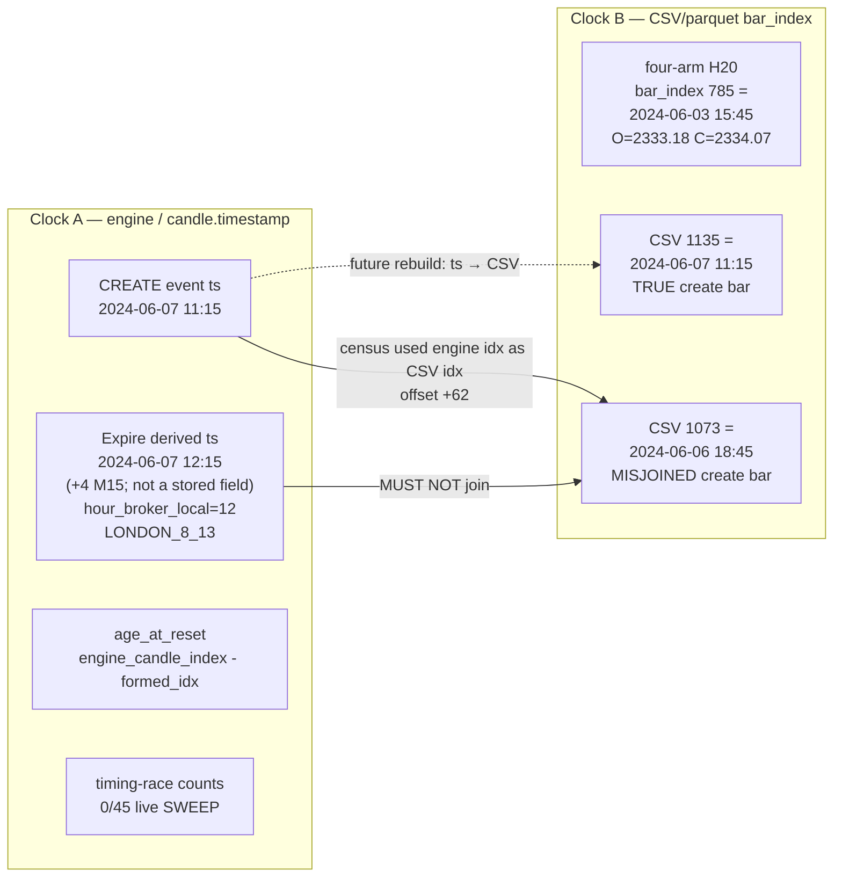
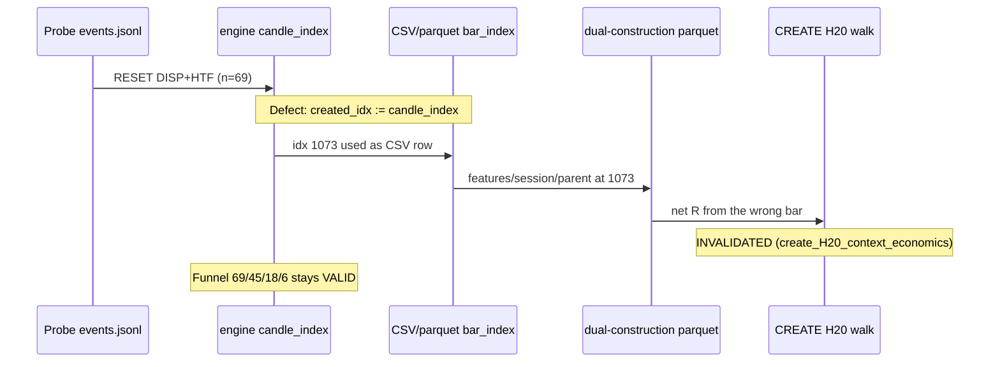

# Coding-LLM Reasoning Context Pack — CREATE Join Defect on `run_20260909_202201`

| Field | Value |
|---|---|
| **Title** | Loadable coding-LLM reasoning context pack for the CREATE context join defect |
| **Author** | Grok (design) — user approval pending |
| **Date** | 2026-09-10 |
| **Status** | Draft (revised after review 2026-09-10) |
| **Lane** | measurement / evidence |
| **Not this lane** | semantic certification of new CRT meaning · economic qualification · G001 · Sense B money |
| **Run** | `run_20260909_202201` (envelope; four-arm H20 scoreboard) |
| **Source parquet grain** | `source_run_id: run_20260906_013609` |
| **`economic_claims_allowed`** | `false` |
| **Authority** | none |
| **P-GOAL-04** | still blocks Sense B money |
| **Rebuild of CREATE context** | **unauthorized** (governance option 2 remains open; do not execute) |
| **Run discarded?** | **No.** The run stays. Quarantine is table-scoped, not run-scoped. |

---

## Overview

`run_20260909_202201` is a valid four-arm H20 measurement envelope on Phase-1 XAUUSD M15. Its CREATE economic census joined contextual fields on engine `candle_index` as if that integer were CSV/parquet `bar_index`. Every one of the 69 CREATE rows is therefore attached to a parquet/CSV bar **62 rows earlier** than the event timestamp (warmup 78 − seed 16; `n_creates_offset_checked: 69`; `offset_constant: true`). Funnel counts stay valid. Session / hour / HTF / parent / CREATE-H20 tables do not.

A successor coding LLM that re-reads `census.json` will, by default, quote those misaligned tables as market structure. This design specifies a **single loadable YAML evidence instance** that the successor must load **first**. The pack makes later reasoning trustworthy by construction: four-arm economics / four-arm H20 / CREATE lifecycle counts / CREATE timing-race counts / CREATE `age_at_reset` distributions are **VALID**; CREATE session/hour tables, HTF/parent context tables, and CREATE H20-context economics are **INVALIDATED**. Claims that do not name a `schema_bridge.surfaces` key, or that mix a VALID lifecycle count with an INVALIDATED H20/session/HTF cell, are refused.

The pack is **not** a sealed Context → MeasurementContract → ODP → Finding chain. It rests on existing artifacts (`context.schema.yaml` v0.5.0, `run_linkage_registry.json` `schema_bridge.has` + `surfaces`, the census `index_join` pin, the 2026-09-10 CORRECTED research notes). It does not mint `contract_id` / `MC-*`, `finding_id` / `F-*`, `mx_id`, or provenance `record_id`. Missing slots stay omitted. It does not rebuild CREATE context.

---

## Background & Motivation

### Current state (source-verified)

Four-arm H20 on this run is **CSV/parquet `bar_index` aligned** and stays. Pinned in `census.json` `index_join.four_arm_path = CSV_PARQUET_BAR_INDEX` and in `docs/governance/run_linkage_registry.json` `XAUUSD.run_20260909_202201.schema_bridge.surfaces`. Scoreboard identity:

- `results/analysis/phase1_resolver_replay/run_20260909_202201/scoreboard.json`
- evidence note: `docs/research/phase1_resolver_replay_evidence_note.md`

CREATE census identity:

- `results/analysis/phase1_resolver_replay/run_20260909_202201/create_economic_census/census.json`
- CORRECTED 2026-09-10 banner: `docs/research/phase1_shadow_create_economic_census_note.md`

The on-disk CREATE row 0 is the smoking gun, not a hypothesis:

| Field on disk (`census.json` `rows[0]`) | Value | What it actually is |
|---|---|---|
| `timestamp` | `2024-06-07T11:15:00` | engine event clock (bar OPEN, F-098) |
| `created_idx` | `1073` | engine `candle_index` stored in a CSV-index field |
| `hour_of_day` | `18.0` | parquet column at CSV row 1073 |
| `session_bucket` | `NY_17_22` | parquet session at CSV row 1073 |
| `parent_crt` | `RANGE_C1` | parquet parent at CSV row 1073 |

CSV/parquet bar **1135** is the timestamp-true row for `2024-06-07 11:15`. CSV/parquet bar **1073** is `2024-06-06 18:45`. Offset = 1135 − 1073 = **62**. Four-arm path verified independently at bar **785** (`2024-06-03 15:45:00`, O=2333.18 C=2334.07) and at CSV 1073 (the misjoined CREATE bar exists; it is the wrong bar for the event).

`scripts/analysis/phase1_shadow_create_economic_census.py` (module docstring + `assemble_creates`) already stores `engine_candle_index` and maps `created_idx` from **event timestamp → CSV row** so a *future* rebuild would be parquet-aligned. `schema_bridge.surfaces.join_logic_fixed_for_future_rebuild: true`. `rebuild_completed: false`. On-disk CREATE economics were **not** rebuilt. Governance option 2 (rebuild now) remains open and **unauthorized**.

### Pain points

1. **Chat is not a pin.** A successor LLM re-derives “session/H20 on the 69” from `census.json` tables that still sit on disk with real-looking n/E/PF cells (OVERLAP PF 68, memory_dir n=65 E=−0.158 vs always_long n=69 E=+0.565). Those numbers exist. Citing them as market structure is forbidden. Prose in a research note is necessary and **not sufficient** — the note can be skipped; the JSON cannot.
2. **Two clocks, one vocabulary.** Timing-race session is taken from `candle.timestamp` (`phase1_shadow_memory_create_expire_mine.py` `hour_bucket(e["timestamp"])`). CREATE census session is a parquet-join on the misused `created_idx`. Expire row 0 on-disk fields: `hour_broker_local=12` / `LONDON_8_13` / `created_idx=1073` (no `timestamp` key). Derived expire ts `2024-06-07 12:15:00` = CREATE event `2024-06-07T11:15:00` + 4 M15 bars (CSV bar 1139; not a stored probe field). Versus csv[created_idx=1073] `2024-06-06 18:45:00` / census `hour_of_day=18` / `NY_17_22`. Mixing them manufactures a session story.
3. **Context schema already forbids the collapse this defect invites.** `docs/design/context-finding-odp/schemas/context.schema.yaml` v0.5.0: Context is a **join key**, not `S_t`; `state_producer` is required (`engine` | `resolver`); Engine EXP ≠ Resolver EXP (F-069, 88.16%, injection=none). Without a loadable gate, a coding LLM will pool 31 with 148 and treat CREATE parent_crt as an L1 selector.
4. **Addressability already exists; load discipline does not.** `schema_bridge.has` and `schema_bridge.surfaces` are pinned (`CH-runid-schema-bridge`, change class `TRACE_OBSERVATION_JOIN`). `tests/test_run_linkage.py::test_schema_bridge_is_keyed_by_run_id` pins `has` slots and the omitted-ID rule. It does **not** pin `surfaces` and does **not** point a successor at a load-first file. That is the gap this pack closes.

### Why a pack, not another note

The census note already says CORRECTED. The registry already says INVALIDATED. Successors still quote the tables because the *reasoning entry point* is `census.json` / `scoreboard.json`, not the correction banner. A YAML instance that (a) is tracked in `docs/research/` (clone-loadable, not gitignored `results/` only), (b) encodes the trust table as a **gate**, and (c) is the required first load, is the missing mechanical surface. It does not replace Context / MeasurementContract / Finding / ODP.

---

## Goals & Non-Goals

### Goals

1. Specify a **load contract**: one YAML file a successor coding LLM loads first before any CREATE / four-arm / session / HTF / H20 claim about `run_20260909_202201`. If the file is not loaded: CREATE-context / session / HTF / parent / CREATE-H20 → REFUSE (phrase A); four-arm economics/H20 → REFUSE (phrase B, distinct). After load, four-arm ADMIT when the named surface is VALID and unmixed.
2. Encode `schema_bridge.surfaces` as a **claim gate**, not prose. Every later claim names a surface key and its VALID/INVALIDATED status.
3. Map the run onto existing Context schema v0.5.0 with **sparse Contexts**. `state_producer` required. Resolver arms require `variant_id`. Engine-atlas is `producer=engine`. CREATE lifecycle is engine-domain pending-memory CREATE, not Resolver EXP. `parent_crt` selector on CREATE context is **not admissible** until an authorized rebuild.
4. Ship a **complete YAML instance** in an appendix, copyable to `docs/research/phase1_run_20260909_202201_coding_llm_context.yaml`, with pointers from the census note and from `schema_bridge.has`.
5. Publish a **mechanical forbidden-inferences list**.
6. Specify (do not execute) the **future join rule** for an authorized CREATE-context rebuild. Keep 69/45/18/6. Four-arm untouched. `rebuild_completed: false`.
7. Classify the implementation PRs honestly (`DOCUMENTATION_ONLY` and, if the `has` pointer is added, `TRACE_OBSERVATION_JOIN`). Production behavior unchanged.

### Non-goals (hard)

- Do **not** rebuild CREATE context. Do not flip TTL. Do not expand years/instruments. Do not optimize the 6/6 restore branch. Do not change production, config, or spine.
- Do **not** mint `contract_id` / `MC-*` / `mt00` / `mx_id` / `finding_id` / `F-*` / provenance `record_id`. Pack `registry_has` is a **strict key-copy** of `schema_bridge.has` (missing slots stay omitted; no extras). ACTIVE_VERSION / source parquet `config_version` / `resolve_artifacts` live under `identity_facts`, not under `has`.
- Do **not** invent a fifth chain artifact that replaces Context / MeasurementContract / Finding / ODP.
- Do **not** treat Context as `S_t`. Do not pool Engine EXP with Resolver EXP. Coverage = `n / n_eligible_corpus`, never 31/148.
- Do **not** copy CLAUDE.md doctrine into this pack. Do not put the instance in `docs/design/context-finding-odp/examples/` (illustrative, not this run). Do not leave `results/` as the only copy.
- Do **not** promote. Do not flip `economic_claims_allowed`. Do not open P-GOAL-04. Do not fabricate a dashboard `results/run_*_XAUUSD` trades ledger. `resolve_artifacts` method=`registry`, `resolved_run=null`, `has_parquet=true` is the expected shape.
- Do **not** retune SEM-031 or any Sujan object. This lane is not Sujan identity work.

---

## Proposed Design

### 1. Artifact identity (what the pack is)

| Question | Answer |
|---|---|
| What is it? | A **run-bound evidence instance** (YAML) that a coding LLM loads first. |
| What is it not? | Not a Context. Not a MeasurementContract. Not a Finding. Not an ODP. Not a sealed chain. |
| What does it rest on? | `context.schema.yaml` v0.5.0 (join-key doctrine, `state_producer`, sparse selectors) · `run_linkage_registry.json` `schema_bridge.has` + `surfaces` · census `index_join` · CORRECTED research notes. |
| Where does it live? | `docs/research/phase1_run_20260909_202201_coding_llm_context.yaml` (tracked). |
| How is it addressed? | PR-3 adds `schema_bridge.has.coding_llm_context_pack` = that path (same shape as `has.scoreboard`). Pack `registry_has` copies `schema_bridge.has` keys only. Extra identity facts go in `identity_facts`. No new id namespace. |
| When is it stale? | If `schema_bridge.surfaces` and the pack `trust_table` disagree, the **registry surfaces win** and the pack is STALE until synchronized. The pack does not override the registry. |

Recommended `artifact` field inside the YAML (descriptive, not a new schema under `docs/design/context-finding-odp/schemas/`):

```yaml
artifact: coding_llm_reasoning_context_pack
pack_role: loadable_reasoning_gate
does_not_replace: [Context, MeasurementContract, Finding, ODP]
status: evidence_instance
binds_to_run_id: run_20260909_202201
```

### 2. Load contract (successor LLM)

```text
BEFORE any claim about this run that mentions CREATE, four-arm,
session, hour, HTF, parent_crt, H20, age_at_reset economics,
pending_dir economics, or coverage:

  1. Load docs/research/phase1_run_20260909_202201_coding_llm_context.yaml
  2. Confirm binds_to_run_id == run_20260909_202201
  3. Confirm economic_claims_allowed == false
  4. Name the schema_bridge.surfaces key the claim uses
  5. If pack not loaded: phrase A (CREATE-context/session/HTF/parent/CREATE-H20)
     or phrase B (four-arm economics/H20) — never "allowed with warning"
  6. If pack loaded: refuse missing / INVALIDATED / mixed surfaces
```

`if_not_loaded` refusal is **split** (copyable). The pack is still the first load for every claim about this run; VALID four-arm surfaces are not an exception to load-first.

| Class | If pack not loaded | After pack loaded |
|---|---|---|
| CREATE-context / session / HTF / parent / CREATE-H20 | **REFUSE** — *CREATE-context inference refused: coding-LLM context pack not loaded for `run_20260909_202201`.* | REFUSE if named surface is INVALIDATED or mixed |
| four-arm economics / four-arm H20 | **REFUSE** — *four-arm citation refused: pack not loaded for `run_20260909_202201`; surfaces are VALID but coverage pooling is the failure mode.* | **ADMIT** when the named surface is VALID and unmixed (coverage = n/47255, never 31/148) |

Do not use phrase A for four-arm, or phrase B for CREATE-context. An implementer who treats four-arm-without-pack as “allowed with warning” has missed the coverage-pooling failure mode.

### 3. Trust table as a gate

Pinned today (`docs/governance/run_linkage_registry.json` `XAUUSD.run_20260909_202201.schema_bridge.surfaces`):

| Surface key | Status | What a claim may do |
|---|---|---|
| `four_arm_economics` | **VALID** | Cite four-arm n / coverage / E / PF / WR / power. Coverage = n / 47255. |
| `four_arm_H20` | **VALID** | Same scoreboard, H20 horizon, SEM-015 TIMEOUT, Always-Long control. |
| `create_lifecycle_counts` | **VALID** | 69 CREATE = 45 EXPIRED_TTL + 18 CLEARED_OR_OVERWRITTEN + 6 RESTORED_TO_EXPANSION. Unit = CREATE of HTF-displacement pending memory. |
| `create_timing_race_counts` | **VALID** | Engine-domain / `candle.timestamp` lifecycle: 0/45 live SWEEP, 33/45 no-sweep, pending_dir, age-at-reset. Distinct clock from CREATE parquet-join session. |
| `create_age_at_reset_distributions` | **VALID** | Ages as engine-domain deltas (`engine_candle_index − formed_idx`). Not H20 attached to those buckets. |
| `create_session_hour_tables` | **INVALIDATED** | Refuse. |
| `create_htf_parent_context_tables` | **INVALIDATED** | Refuse. Includes CREATE `parent_crt` / `htf_state` / `parent_bias`. |
| `create_H20_context_economics` | **INVALIDATED** | Refuse. Includes CREATE headline H20, bucket H20 (session/hour/HTF/parent/pending_dir/age/outcome/atr), ranked lift n≥5. |
| `rebuild_completed` | `false` | Boolean flag, not a claim surface. Must stay false until an authorized rebuild writes new on-disk CREATE economics. |
| `join_logic_fixed_for_future_rebuild` | `true` | Script-side future join exists; on-disk numbers were not rebuilt. |

**Admit algorithm** (mechanical; copy into the YAML as `claim_protocol`):

```
admit_claim(claim):
  if pack not loaded for claim.run_id:
      if claim is CREATE-context / session / HTF / parent / CREATE-H20:
          REFUSE ("CREATE-context inference refused: coding-LLM context pack not loaded for run_20260909_202201")
      if claim is four-arm economics or four-arm H20:
          REFUSE ("four-arm citation refused: pack not loaded for run_20260909_202201; surfaces are VALID but coverage pooling is the failure mode")
      REFUSE (pack required)
  if claim.run_id != "run_20260909_202201":
      OUT_OF_PACK_SCOPE
  if claim.surface not in schema_bridge.surfaces:
      REFUSE unnamed surface
  if surfaces[claim.surface] in (false, "INVALIDATED"):
      REFUSE
  if claim.mixes any VALID surface with any INVALIDATED surface:
      REFUSE
  if claim.uses a forbidden_inference token:
      REFUSE
  if claim.mints contract_id / MC-* / finding_id / F-* / mx_id / record_id:
      REFUSE
  if claim.promotes or sets economic_claims_allowed true:
      REFUSE
  if claim.coverage_form in {"31/148", "resolver_n/engine_n"}:
      REFUSE
  ADMIT as DESCRIPTIVE_ONLY (authority=none)
```

Mixing examples that **must** refuse:

- “69 creates, OVERLAP PF 68” — VALID lifecycle count + INVALIDATED session H20.
- “age_at_reset bucket 1 n=30 E=+0.49” — VALID age distribution shape quoted with INVALIDATED H20.
- “pending_dir SHORT 39, E=−0.667” — event-native labels exist (SHORT 39 / LONG 26 / unlabeled 4 on the 69 rows). Citing n=39 as a complete census of 69 launders the H20-table denominator (`bucket_tables_H20_memory_dir`, INVALIDATED). A claim that carries E/PF/WR on pending_dir is `create_H20_context_economics`. Labels without E/PF/WR may cite `{SHORT: 39, LONG: 26, unlabeled: 4}` from `authoritative_numbers.pending_dir_event_native` only.

### 4. Mapping onto Context schema v0.5.0 (sparse; not a sealed chain)

Context remains the join key (`docs/design/context-finding-odp/README.md`, `context.schema.yaml`). This pack **sketches** the Contexts a later ODP/Finding *would* attach to. It does not instantiate `contract_ref`, does not seal an MC, does not file an F-id.

**Selector doctrine (already in schema):** Context fields are admissible, not mandatory. `null` = not conditioned. Sparse first. Do not fill gaps.

**Identity selectors that apply here:**

| Population | `state_producer` | `variant_id` | `state` | L1 `parent_crt` | `location.session_id` | `objective.htf_state` |
|---|---|---|---|---|---|---|
| Engine-Atlas EXP | `engine` | `null` | `EXPANSION` | `null` (not conditioned on this scoreboard) | `null` | `null` |
| Resolver-Memory | `resolver` | required: `resolver_memory` | `EXPANSION` (SHADOW→EXP only) | `null` | `null` | `null` |
| Resolver-TrendBias | `resolver` | required: `resolver_trendbias` | `EXPANSION` (SHADOW→EXP only) | `null` | `null` | `null` |
| Always-Long control | n/a | n/a | n/a | n/a | n/a | n/a |
| CREATE lifecycle (pending-memory CREATE) | `engine` | `null` | **not** `EXPANSION`; from_state at HTF-reset is `DISPLACEMENT` | **inadmissible until rebuild** (must stay `null`) | **inadmissible until rebuild** | **inadmissible until rebuild** |

`variant_id` values are the `scoreboard.json` `standing_contract` keys **exactly**: `resolver_memory` and `resolver_trendbias`. They are not `MC-*` and not `F-*`. `strict_memory` is an adjective in the standing_contract *value* (`SHADOW→EXP + pending_displacement_dir (strict_memory)`); it belongs in `notes:` only. **Pack-local forbid:** do not concatenate arm adjectives into a new `variant_id` (e.g. `resolver_memory_strict_memory` is not a standing_contract key and must not ship). Pooling across `variant_id` is forbidden (`context.schema.yaml` `population_key_doctrine`).

Always-Long is a **control walk** (stride H20 on the same `close_at_horizon` / SEM-015 TIMEOUT path), not a CRT state Context. Do not assign it `state: EXPANSION`.

CREATE is an engine-domain **event** (RESET from DISPLACEMENT, `"HTF" in reason`, `crt_engine_v2` HTF-changed-while-displacement pending memory). Unit = CREATE, not SHADOW→EXP restore. Do not bind CREATE rows to Resolver EXP (n=31) and do not bind them to Engine-Atlas EXP (n=148).

Because CREATE census `parent_crt` / `htf_state` / `session_bucket` were parquet-misjoined, those selectors are **not admissible** on any CREATE Context until an authorized timestamp-join rebuild. These sketches are **not** schema-valid Context documents (`structure` is required on a real Context; it stays **omitted** here, not empty `{}`). Sparse CREATE sketch:

```yaml
state_producer: engine
variant_id: null
state: DISPLACEMENT          # from_state at HTF-reset CREATE; NOT EXPANSION
parent_crt: null             # INADMISSIBLE until rebuild
objective: null              # htf_state INADMISSIBLE until rebuild
# structure: omitted (not {}); sketches are not sealed Context instances
transition:
  from_state: DISPLACEMENT
  to_state: null             # RESET; not Resolver EXP
  edge_id: HTF_CHANGED_WHILE_DISPLACEMENT
location:
  instrument: XAUUSD
  timeframe: M15
  session_id: null           # INADMISSIBLE until rebuild
  htf_bucket: null
resolver_state: null         # sidecar; never used as Context.state
```

Do **not** collapse L1 `parent_crt` (`RANGE_C1` / `MANIPULATION_C2` / `DISTRIBUTION_C3`) into L3 `state`. F-077: `HTFState.DISTRIBUTION ≠ DISTRIBUTION_C3`. F-069: Engine State ≠ Resolver State (88.16%, injection=none).

No `contract_ref` on these sketches. ODP population key doctrine (`contract_ref + identity_selectors`) is **not satisfied** and must not be pretended. The pack records that the slot is omitted.

### 5. Two clocks (do not mix)



- Clock A owns: CREATE lifecycle counts, timing-race counts, `age_at_reset` **as ages**, event-native `pending_dir` **as labels**, expire-row session-from-`candle.timestamp` **on the timing-race note only**.
- Clock B owns: four-arm H20 / four-arm economics (VALID). After an authorized rebuild, Clock B would also own CREATE session/hour/HTF/parent/H20. **Not today.**
- F-098: MT5 `rates['time']` = bar OPEN. F-066: session/hour from broker-server time labeled UTC; `clock_basis: broker_local` on this dataset. Timing-race buckets are broker-local hour bins, not UTC-corrected session labels. That fact does not license using the misjoined parquet session table.

### 6. Index-join defect (do not re-derive)



Constant offset: `offset_csv_minus_engine: 62` = warmup 78 − seed 16. Checked on all 69.

Two join tokens name the **same** defect; do not collapse the strings (each artifact stays source of truth):

| Token | Where | Meaning |
|---|---|---|
| `create_census_join: ENGINE_CANDLE_INDEX` | `census.json` `index_join` | join key used = engine `candle_index` |
| `create_census_context_join: ENGINE_CANDLE_INDEX_PLUS_62` | registry `schema_bridge.has` | same join, offset 62 recorded on the pin |

Pack `index_join.same_defect_as_registry_has` = `create_census_context_join=ENGINE_CANDLE_INDEX_PLUS_62`.

Future authorized rebuild (specify only; `rebuild_completed` stays `false`):

1. Keep `engine_candle_index` on every CREATE row (engine domain).
2. Set `created_idx` = CSV/parquet `bar_index` of `event_timestamp` (`assemble_creates` already implements `event_timestamp_to_csv`).
3. `age_at_reset` remains `engine_candle_index − formed_idx` (engine-domain delta). Do not recompute age on CSV indices.
4. Re-join session / hour / HTF / parent / H20 **only** on the new `created_idx`.
5. Do **not** retouch four-arm scoreboard, four-arm H20, or funnel 69/45/18/6.
6. Do **not** flip TTL, widen years/instruments, or optimize restores.
7. After write: set `rebuild_completed: true` only if the new on-disk tables are regenerated and the INVALIDATED surfaces are re-admitted by a separate authorized decision. This design does not grant that admission in advance.

### 7. Authoritative numbers (copy; do not round into a different story)

**Four-arm H20** (`scoreboard.json` / evidence note). `n_eligible_corpus=47255`. `economic_claims_allowed=false`. `authority=none`.

| Arm | n | coverage % | expectancy | PF | win rate | power |
|---|---:|---:|---:|---:|---:|---|
| Engine-Atlas | 148 | 0.3132 | +0.027665 | 1.0221 | 0.4662 | WEAK |
| Resolver-Memory | 31 | 0.0656 | +0.348100 | 1.3739 | 0.5484 | WEAK |
| Resolver-TrendBias | 31 | 0.0656 | −0.466977 | 0.6508 | 0.4516 | WEAK |
| Always-Long | 2359 | 4.9921 | +0.255069 | 1.2143 | 0.5354 | WEAK |

Engine `from_state`: DISPLACEMENT 142, SWEEP 6. Memory vs TrendBias direction agree **0/31**. Resolver EXP = SHADOW→EXP (31). Engine EXP = mostly DISP→EXP (148). Case A is **interpretive only**.

Coverage = n / 47255. Never 31/148.

**CREATE funnel** (lifecycle VALID): 69 CREATE = 45 EXPIRED_TTL + 18 CLEARED_OR_OVERWRITTEN + 6 RESTORED_TO_EXPANSION. Assembled from 45 EXPIRE + 17 CLEAR + 1 OVERWRITE + 6 RESTORE. Unit = CREATE of HTF-displacement pending memory, **not** SHADOW→EXP restore. Restore given SHADOW_PENDING is **6/6** — do not optimize that branch.

**CREATE H20 headline and all session/hour/HTF/parent/H20 bucket tables:** DO NOT INFER. Numbers exist on disk; citing them as market structure is forbidden. Canonical examples of forbidden cells: memory_dir n=65 E=−0.158 vs always_long n=69 E=+0.565; OVERLAP PF 68; parent_crt / session bucket H20.

**`age_at_reset` distributions** (engine-domain deltas) are VALID as ages. H20 attached to those age buckets is INVALIDATED (`create_H20_context_economics`).

**`pending_dir` event-native labels** (VALID as labels only; counted on `census.json` `rows`, n=69): `{SHORT: 39, LONG: 26, unlabeled: 4}`. Four rows omit the `pending_dir` key (not `"pending_dir": null`). Do **not** cite 39/26 from `bucket_tables_H20_memory_dir` — that table drops the unlabeled four and is `create_H20_context_economics` INVALIDATED. E/PF/WR on pending_dir stays in the refuse list.

### 8. Identity / schema facts (do not contradict)

Two maps. **`registry_has`** is a strict key-copy of `schema_bridge.has` for `run_20260909_202201` (no extras). **`identity_facts`** holds true facts that the registry `has` object does not carry. A successor must not treat `identity_facts` as registry-addressable `has` slots. `contract_id` / `MC-*` / `mt00` / `mx_id` / `finding_id` / `record_id` stay omitted on both.

**`registry_has`** (byte-key copy of today’s `schema_bridge.has`; PR-3 later adds `coding_llm_context_pack` to both registry and this map):

| Slot | Value |
|---|---|
| `source_run_id` | `run_20260906_013609` |
| `logical_corpus_id` | `XAUUSD_M15` |
| `decision_id` | `CAD-XAUUSD_M15-PHASE1-FROZEN` |
| `dataset_id` | `XAUUSD_MT5_PHASE1_20260521` |
| `symbol` | `XAUUSD` |
| `source_family` | `mt5` |
| `clock_basis` | `broker_local` |
| `volume_semantic` | `TICK_VOLUME` |
| canonical csv | `data/mt5/XAUUSD_M15.csv` |
| csv sha256 | `4d73f5cebe33ec91c5312340337eb62c2cf1f49060c91c42761bf631b26aba56` |
| `parent_timeframe_source` | `derived_h4` (sibling field; **not** `load_policy`) |
| `decision_status` | `FROZEN_CANDIDATE_PENDING_PHASE1_VALIDATION` (NOT UNRESOLVED) |
| `approved_physical_path` | `null` |
| `economic_claims_allowed` | `false` |
| `cost_model_id` | `component_measured.v1` (SEM-015 MEASURED) |
| `scoreboard` | `results/analysis/phase1_resolver_replay/run_20260909_202201/scoreboard.json` |
| `create_census` | `results/analysis/phase1_resolver_replay/run_20260909_202201/create_economic_census/census.json` |
| `create_census_funnel_counts` | `VALID` |
| `create_census_context_join` | `ENGINE_CANDLE_INDEX_PLUS_62` |
| `create_census_context_inference` | `DO_NOT_USE_UNTIL_TIMESTAMP_JOIN` |

**`identity_facts`** (true; not `schema_bridge.has` keys):

| Slot | Value |
|---|---|
| `run_id` (envelope) | `run_20260909_202201` |
| ACTIVE_VERSION | `v2_htfcrt_2026_08` (`configs/production/ACTIVE_VERSION`) |
| source parquet `config_version` | `v4_dual_construction_2026_09` (scoreboard provenance `source_config_version`) |
| `resolve_artifacts` | method=`registry`, `resolved_run=null`, `has_parquet=true` |
| `load_policy` | different object on Dataset Identity: `require_hash_match` / `unbound_instruments` / `reject_forensic_as_canonical` |
| dashboard `results/run_*_XAUUSD` | **absent** (`resolved_run=null`); do not fabricate; do not call the run missing |

Cite existing F-ids only: F-098 (MT5 time = bar OPEN), F-066 (session/hour broker-server labeled UTC), F-069 (Category C construction divergence; 88.16% engine↔resolver, injection=none). Analogical silent-gap F-ids (cited, not minted): F-079, F-083. Do not mint new F-ids from this pack.

### 9. Forbidden inferences (mechanical, copyable)

Tokens. A claim that matches any token is refused.

| Token | Forbidden act |
|---|---|
| `coverage_31_over_148` | Never 31/148. Coverage = n / 47255. |
| `pool_engine_resolver_exp` | Engine EXP ≠ Resolver EXP. Do not pool 148 with 31. |
| `quote_create_h20_headline` | Do not cite CREATE headline H20 (memory_dir / trendbias_dir / always_long on the 69). |
| `quote_create_session_hour` | Do not cite CREATE `session_bucket` / `hour_of_day` tables. |
| `quote_create_htf_parent` | Do not cite CREATE `parent_crt` / `htf_state` / `parent_bias` tables. |
| `quote_create_h20_buckets` | Do not cite H20-by-age, H20-by-pending_dir, H20-by-outcome, H20-by-atr, ranked_lift_n_ge_5. |
| `mix_timing_race_hour_with_create_parquet_session` | Timing-race `hour_broker_local` / `LONDON_8_13` on expire row 0 is Clock A. Census `NY_17_22` / hour 18 is Clock B misjoin. |
| `optimize_6_of_6_restore` | Restore given SHADOW_PENDING is 6/6. Not an optimization target. Unit is CREATE, not restore. |
| `mint_mc_or_finding` | No `MC-*` / `mt00` / `mx_id` / `F-*` / `record_id` from this pack. |
| `mint_variant_id_adjective` | Do not concatenate arm adjectives into `variant_id` (`resolver_memory` / `resolver_trendbias` only). |
| `promote_or_g001` | No promotion. No G001. `economic_claims_allowed` stays false. P-GOAL-04 still blocks Sense B. |
| `dashboard_absence_means_run_missing` | `resolved_run=null` is expected. Registry method=registry, `has_parquet=true`. |
| `context_is_s_t` | Context is a join key, not authoritative engine state. |
| `parent_crt_as_l3` | Do not write `RANGE_C1` into `state`. |
| `create_parent_crt_selector` | parent_crt on CREATE context is inadmissible until rebuild. |
| `treat_pack_as_measurement_contract` | Pack is a reasoning gate. It does not seal how/on-whom. |
| `rebuild_now` | Rebuild is unauthorized. `rebuild_completed: false`. |
| `discard_the_run` | Quarantine tables, not the run. Four-arm stays. |
| `attach_h20_to_valid_age_buckets` | Ages VALID; H20 on those buckets INVALIDATED. |

### 10. Pointers (existing-doc-first)

After the YAML is copied into the repo, insert these **exact** sentences. Do not rewrite the CORRECTED 2026-09-10 banner. Do not delete on-disk / in-note tables (history preserved).

**Census note** (`docs/research/phase1_shadow_create_economic_census_note.md`):

1. Immediately under the CORRECTED 2026-09-10 banner:

> Load first: `docs/research/phase1_run_20260909_202201_coding_llm_context.yaml`. CREATE-context / session / HTF / parent / H20 claims about this run are refused until that pack is loaded.

2. Immediately above `## Headline H20 on all 69 creates`:

> `DO_NOT_CITE` — `surface=create_H20_context_economics` INVALIDATED. Tables below are on-disk history, not market structure.

3. Immediately above `## age_at_reset`:

> `DO_NOT_CITE` — `surface=create_H20_context_economics` INVALIDATED (same surface as Headline H20). Age **counts** are VALID as engine-domain ages; H20 on those buckets is not.

**Evidence note** (`docs/research/phase1_resolver_replay_evidence_note.md`), after the claim-class line:

> Four-arm H20 on this run remains VALID (`schema_bridge.surfaces.four_arm_H20`). Load first: `docs/research/phase1_run_20260909_202201_coding_llm_context.yaml`. Coverage is n/47255, never 31/148.

**Timing-race note** (`docs/research/phase1_shadow_memory_timing_race_note.md`), after the Index-join paragraph:

> See also `docs/research/phase1_run_20260909_202201_coding_llm_context.yaml`. Timing-race session is Clock A (`candle.timestamp`). Do not mix with CREATE census parquet-join session tables (`create_session_hour_tables` INVALIDATED).

**Registry** (PR-3, not the docs PR): `schema_bridge.has.coding_llm_context_pack` = the path. **`has` only.** Do not add `contract_id`.

Do **not** add an example under `docs/design/context-finding-odp/examples/`.

---

## API / Interface Changes

No runtime API. No `src/` behavior change required for the pack file itself.

Optional addressability change (same class as `CH-runid-schema-bridge`):

**Before** (`schema_bridge.has` for `run_20260909_202201`) already has census/scoreboard pointers and omitted ID slots. It does **not** name the pack.

**After** (additive `has` key only):

```json
"coding_llm_context_pack": "docs/research/phase1_run_20260909_202201_coding_llm_context.yaml"
```

`src/utils/run_linkage.py::resolve_artifacts` already pass-throughs `schema_bridge` (lines 179–180). No new field on the trace envelope. No decision path.

Floor extension in `tests/test_run_linkage.py` (specified, not invented at implement time). `change_id`: `CH-coding-llm-context-pack-has`.

Required assertions:

- `has["coding_llm_context_pack"] == "docs/research/phase1_run_20260909_202201_coding_llm_context.yaml"`
- `surfaces` key→token map equals the registry object: VALID ×5 (`four_arm_economics`, `four_arm_H20`, `create_lifecycle_counts`, `create_timing_race_counts`, `create_age_at_reset_distributions`); INVALIDATED ×3 (`create_session_hour_tables`, `create_htf_parent_context_tables`, `create_H20_context_economics`); `rebuild_completed is False`; `join_logic_fixed_for_future_rebuild is True`
- omitted-ID assertions unchanged: `"contract_id" not in has`, `"finding_id" not in has`, `"mx_id" not in has`, `"mt00" not in has`
- recommended (not a substitute for the path assertion): open the YAML and assert pack `trust_table` equals registry `surfaces` (registry wins on conflict)

The test **must** compare the path string. Opening the YAML is optional-but-recommended for the STALE-pack pin.

`resolve_artifacts("XAUUSD", "run_20260909_202201")` remains `method=registry`, `resolved_run=null`, `has_parquet=true`. If `src/utils/run_linkage.py` diffs, **STOP** — pass-through at lines 179–180 is already sufficient.

---

## Data Model Changes

None to Context / MeasurementContract / Finding / ODP schemas. None to production config. None to parquet grain.

The YAML is a new **tracked evidence file**, not a new schema version. `context.schema.yaml` stays `0.5.0` `design_draft`.

On-disk `census.json` is **unchanged** by this design (`rebuild_completed: false`). The pack tells successors how to read it, not how to rewrite it.

Migration: none. Rollback: revert PR-1 (YAML + note sentences) then revert PR-3 (`has` key + test). Four-arm and CREATE funnel numbers are untouched.

---

## Alternatives Considered

### (A) Leave the pin only — no pack (status quo)

**What:** `index_join` + CORRECTED banner + `schema_bridge.surfaces` already exist.

**Pros:** Zero new files. No pointer drift.

**Cons:** Successors load `census.json` first. The INVALIDATED tables still look like results. Chat re-derivation is how this class of defect recurs (same silent-gap shape as F-079 / F-083: skipped load indistinguishable from absent gate).

**Verdict:** Insufficient for a coding-LLM successor. Rejected as the *only* control.

### (B) Rebuild CREATE context now

**What:** Run the already-fixed `assemble_creates` timestamp→CSV join and rewrite on-disk CREATE session/HTF/H20.

**Pros:** Would make the quarantined tables potentially re-admissible after review.

**Cons:** **Unauthorized.** Governance option 2 remains open. This design forbids execution. Rebuild would still be CREATE-context only; four-arm untouched; 69/45/18/6 kept. Doing it inside a “reasoning pack” PR would smuggle a measurement rewrite under documentation.

**Verdict:** Specify the join rule. Do not execute.

### (C) Mint a Finding / MeasurementContract

**What:** File `F-*` and/or seal `MC-*` so the defect is a catalog row.

**Pros:** Findings mandate would put the conclusion on `docs/current-findings.md`.

**Cons:** **Forbidden by this task.** MeasurementContract / `MC-*` / `mt00` / `mx_id` are **absent** on this run; inventing them pretends E-MT admissibility the run does not have (`economic_claims_allowed: false`, mt00/mt01 unrun). A Finding without a sealed `contract_ref` is not comparable (`finding_registry.schema.yaml`). Minting IDs from a reasoning pack is the exact contamination this pack exists to prevent.

**Verdict:** Forbidden.

### (D) Proposed pack (this design)

**What:** Tracked YAML evidence instance + load-first contract + trust-table gate + sparse Context sketches + `has` pointer.

**Pros:** Clone-loadable. Mechanical refuse list. Does not replace the chain. Honest change class. Leaves rebuild unauthorized.

**Cons:** Pack can drift from `surfaces` (mitigate: registry wins; pin both in `test_run_linkage.py`). Successor can still ignore the load contract (mitigate: refusal phrase + note pointers + `has` pointer as the registry address). Pack can be mistaken for an MC (mitigate: `does_not_replace` + omitted `contract_id` + explicit token `treat_pack_as_measurement_contract`).

**Verdict:** Selected.

---

## Security & Privacy Considerations

| Topic | Handling |
|---|---|
| Secrets | Pack cites corpus sha256, run ids, public research numbers. Never read `.env`. No API keys. |
| Threat: successor quotes INVALIDATED tables anyway | Gate is social-mechanical (load contract + refuse tokens), not a runtime ACL. Mitigation: `has` pointer + test pin + banners. Residual: a model that ignores the pack. Severity: **High** for knowledge contamination, **None** for production trading (no spine wire). |
| Threat: pack treated as authority to trade | `economic_claims_allowed: false`, `authority: none`, P-GOAL-04 still blocks Sense B. Severity: **High** if ignored; mitigation is the same omitted-ID + refuse-promote tokens. |
| Data handling | No PII. XAUUSD OHLC already in the admitted corpus. Pack does not copy full `census.json` rows. |
| Auth | None. File-backed repo. Control plane is localhost-only and out of scope. |

---

## Observability

| Signal | Where | Use |
|---|---|---|
| Pack loaded | Successor names the path in the claim | Required first sentence of any CREATE-context **or** four-arm answer about this run |
| Surface named | Claim includes `schema_bridge.surfaces.<key> = VALID\|INVALIDATED` | Gate |
| STALE pack | `trust_table` ≠ registry `surfaces` | Registry wins; pack marked STALE |
| Rebuild flag | `rebuild_completed: false` | Must remain false until authorized rewrite |
| Addressability | `resolve_artifacts(..., "run_20260909_202201")["schema_bridge"]["has"]["coding_llm_context_pack"]` | Floor test |
| Dashboard absence | `resolved_run is None` | Must not alarm as “run missing” |

No metrics pipeline. No alerting. Logging is the SESSION LOG + the research notes.

---

## Rollout Plan

1. **This design (scratch)** — no repo write of the pack yet.
2. **PR-1** — YAML under `docs/research/` **plus** the three note pointers (`DOCUMENTATION_ONLY`, `CH-coding-llm-context-pack-yaml`). PR-2 is absorbed here (one-liners are not a separate reviewable unit). Production behavior unchanged.
3. **PR-3** — `schema_bridge.has.coding_llm_context_pack` + `test_run_linkage.py` surfaces/pack pin (`TRACE_OBSERVATION_JOIN`, `CH-coding-llm-context-pack-has`, same class as `CH-runid-schema-bridge`). Depends on PR-1. `production_behavior_changed: NO`. Not merged into the docs PR.
4. **Not in this program:** authorized CREATE-context rebuild (option 2). Feature-flag: none. Rollback: revert the PR(s); four-arm and funnel files never change.

Staged rollout is documentation-only until PR-3. PR-3 is observation-join addressability, not a decision-path change.

---

## Risks

| Risk | Severity | Mitigation |
|---|---|---|
| Successor LLM quotes quarantined CREATE H20/session/HTF/parent tables anyway | High (knowledge) / None (spine) | Load-first refusal phrase; trust-table gate; forbidden-inference tokens; note pointers; do not delete on-disk tables (history preserved) but mark them unusable |
| Pack `trust_table` drifts from registry `surfaces` | High | Registry is source of truth; pack is a projection; PR-3 pins equality; on conflict pack is STALE |
| Pack treated as a MeasurementContract / sealed MC-* | High | `does_not_replace`; omit `contract_id`; token `treat_pack_as_measurement_contract`; no `mt00` |
| Context sketches treated as `S_t` | High | `state_producer` required; Engine vs Resolver not pooled; F-069 cited; token `context_is_s_t` |
| CREATE `parent_crt` used as L1 selector because the column exists on disk | High | Selector marked inadmissible until rebuild; token `create_parent_crt_selector` |
| Mixing timing-race hour with CREATE parquet session | Medium | Two-clock diagram; expire row 0 worked example; token `mix_timing_race_hour_with_create_parquet_session` |
| Someone “fixes” 6/6 restore or flips TTL while adding the pack | High | Non-goal; `not_the_question` already on census.json; token `optimize_6_of_6_restore` |
| Rebuild sneaks in under the pack PR | High | `rebuild_completed: false` pinned; option 2 unauthorized; PR plan has no rebuild PR |
| Dashboard `resolved_run=null` reported as missing run | Medium | Token `dashboard_absence_means_run_missing`; test already pins method=registry |
| New F-id / MC-* minted “so the pack is official” | High | Hard constraint 2; test continues to assert omitted slots |

---

## Key Decisions

1. **The pack is a loadable evidence instance, not a fifth chain artifact.** Rationale: existing-doc-first; Context / MC / Finding / ODP already own identity, measurement, knowledge. A new schema under `docs/design/context-finding-odp/schemas/` would be a second doctrine.

2. **Trust is a table of `schema_bridge.surfaces` keys, not a paragraph.** Rationale: successors skip banners. A claim that cannot name a VALID surface is refused. Mixing VALID lifecycle with INVALIDATED H20 is refused even if each fragment is “true on disk.”

3. **`registry_has` is a strict projection of `schema_bridge.has`; extra facts go in `identity_facts`.** Rationale: putting ACTIVE_VERSION / parquet `config_version` / `resolve_artifacts` under pack `has:` would mint slots the registry does not carry. Pointer key (PR-3): `schema_bridge.has.coding_llm_context_pack`. No `MC-*` / `mt00` / `mx_id` / `finding_id`.

4. **Sparse Contexts; CREATE `parent_crt` / session / HTF selectors inadmissible until rebuild.** Rationale: those columns on `census.json` rows are the defect. Selector doctrine already allows `null`. Filling them from the misjoin would launder INVALIDATED data through Context identity.

5. **Resolver arms require `variant_id` exactly equal to `standing_contract` keys (`resolver_memory` / `resolver_trendbias`); engine-atlas does not.** Rationale: `context.schema.yaml` D2. Memory vs TrendBias are different populations (direction agree 0/31). `strict_memory` stays in `notes:`. Concatenating arm adjectives into a new `variant_id` would mint a second name for the same population.

6. **CREATE lifecycle is engine-domain pending-memory CREATE, not Resolver EXP.** Rationale: unit mismatch (69 vs 31 vs 6 restores). Binding CREATE to `state: EXPANSION` would pool the wrong object.

7. **Two clocks stay distinct.** Rationale: timing-race session-from-`candle.timestamp` is valid on its own note; CREATE parquet-join session is INVALIDATED. Expire row 0 on-disk is `hour_broker_local=12` / `LONDON_8_13`; `2024-06-07 12:15:00` is derived (CREATE + 4 M15), not a stored `timestamp` field.

8. **Specify the timestamp→CSV join; do not execute it.** Rationale: `join_logic_fixed_for_future_rebuild: true` already; `rebuild_completed: false`; option 2 unauthorized. Funnel 69/45/18/6 and four-arm stay.

9. **Path is `docs/research/…yaml`, not examples/, not results/-only.** Rationale: clone-loadable tracked file; examples/ are illustrative; `results/` is gitignored occupancy.

10. **Change class is honest.** YAML + note pointers = one `DOCUMENTATION_ONLY` PR (`CH-coding-llm-context-pack-yaml`). Adding the `has` pointer + test = separate `TRACE_OBSERVATION_JOIN` PR (`CH-coding-llm-context-pack-has`, same as `CH-runid-schema-bridge`). Not `RUNTIME_DECISION_PATH_CHANGE`. `production_behavior_changed: NO`.

11. **The run is not discarded.** Rationale: four-arm path VALID; funnel VALID; quarantine is surface-scoped.

12. **Coverage denominator is `n_eligible_corpus=47255`, never 31/148.** Rationale: standing_contract coverage rule; Engine EXP and Resolver EXP are different constructions (F-069 Category C).

---

## Open Questions

1. **Who authorizes option 2 (CREATE-context rebuild)?** This design does not. A later user `y/N` is required. The join rule is specified so that authorization is not blocked on missing procedure.
2. **After a rebuild, who re-admits INVALIDATED surfaces?** Not automatic. A separate measurement/evidence turn must compare new tables to the trust table and flip tokens. This pack must then be synchronized (registry first).
3. **Should `tests/test_run_linkage.py` pin `surfaces` even if PR-3 is deferred?** Recommended no deferral: PR-3 is the load-bearing pin. If PR-3 slips, the YAML in PR-1 still gates successors who load it; the registry can still drift until PR-3.
4. **D1 (belief vs preference) remains OPEN** on the Context/ODP design (`context.schema.yaml` `defect_status.open`). This pack does not resolve D1 and must not be used as policy.

No other open product questions are required to land PR-1.

---

## References

- `docs/design/context-finding-odp/schemas/context.schema.yaml` (v0.5.0 `design_draft`)
- `docs/design/context-finding-odp/README.md`
- `docs/design/context-finding-odp/schemas/finding_registry.schema.yaml` (do not mint `F-*`)
- `docs/design/context-finding-odp/schemas/measurement_contract.schema.yaml` (do not invent a second contract)
- `docs/governance/run_linkage_registry.json` (`XAUUSD.run_20260909_202201.schema_bridge.has` + `surfaces`)
- `docs/governance/build_manifests/CH-runid-schema-bridge.impact.json` (change class `TRACE_OBSERVATION_JOIN`)
- `docs/governance/change_contracts.json` (`DOCUMENTATION_ONLY`, `TRACE_OBSERVATION_JOIN`)
- `docs/governance/datasets/XAUUSD_MT5_PHASE1_20260521.json`
- `docs/governance/REPOSITORY_CONSTRUCTION_PROTOCOL.md`
- `results/analysis/phase1_resolver_replay/run_20260909_202201/create_economic_census/census.json` (`index_join`, `funnel`, `rows[0]`)
- `results/analysis/phase1_resolver_replay/run_20260909_202201/scoreboard.json`
- `docs/research/phase1_shadow_create_economic_census_note.md` (CORRECTED 2026-09-10)
- `docs/research/phase1_resolver_replay_evidence_note.md`
- `docs/research/phase1_shadow_memory_timing_race_note.md` (distinct clock)
- `results/analysis/phase1_resolver_replay/event_census/memory_timing_race.json` (`expire_rows_timing[0]`)
- `scripts/analysis/phase1_shadow_create_economic_census.py` (`assemble_creates`, future join)
- `src/utils/run_linkage.py::resolve_artifacts`
- `tests/test_run_linkage.py`
- `configs/production/ACTIVE_VERSION` = `v2_htfcrt_2026_08`

Existing F-ids cited, not minted: F-066, F-069, F-077, F-079, F-083, F-098.

---

## Appendix A — Complete YAML instance (copyable)

Copy later to `docs/research/phase1_run_20260909_202201_coding_llm_context.yaml`. Not an example under `docs/design/context-finding-odp/examples/`. Not the only copy under gitignored `results/`.

```yaml
# Run-bound coding-LLM reasoning context pack.
# NOT a Context. NOT a MeasurementContract. NOT a Finding. NOT an ODP.
# Load this file FIRST before any CREATE / four-arm / session / HTF / H20
# claim about run_20260909_202201.
#
# Lane: measurement / evidence.
# economic_claims_allowed: false
# authority: none
# rebuild_completed: false  (do not execute rebuild from this file)

artifact: coding_llm_reasoning_context_pack
pack_role: loadable_reasoning_gate
does_not_replace:
  - Context
  - MeasurementContract
  - Finding
  - ODP
status: evidence_instance
binds_to_run_id: run_20260909_202201
schema_rests_on:
  context_schema: docs/design/context-finding-odp/schemas/context.schema.yaml
  context_schema_version: "0.5.0"
  run_linkage_registry: docs/governance/run_linkage_registry.json
  census_index_join: results/analysis/phase1_resolver_replay/run_20260909_202201/create_economic_census/census.json
  census_note: docs/research/phase1_shadow_create_economic_census_note.md
  evidence_note: docs/research/phase1_resolver_replay_evidence_note.md
  timing_race_note: docs/research/phase1_shadow_memory_timing_race_note.md

load_first:
  required: true
  required_before:
    - CREATE context inference
    - four-arm / session / HTF / parent / H20 claims about this run
  if_not_loaded:
    create_context_session_htf_parent_h20:
      action: REFUSE
      phrase: "CREATE-context inference refused: coding-LLM context pack not loaded for run_20260909_202201"
    four_arm_economics_or_H20:
      action: REFUSE
      phrase: "four-arm citation refused: pack not loaded for run_20260909_202201; surfaces are VALID but coverage pooling is the failure mode"
  after_load:
    four_arm_economics_or_H20: ADMIT when named surface is VALID and unmixed

# Strict key-copy of schema_bridge.has for this run_id. No extras.
# Missing slots omitted. Do not mint contract_id / MC-* / mt00 /
# mx_id / finding_id / F-* / record_id.
# PR-3 later adds coding_llm_context_pack to registry has AND this map.
registry_has:
  source_run_id: run_20260906_013609
  logical_corpus_id: XAUUSD_M15
  decision_id: CAD-XAUUSD_M15-PHASE1-FROZEN
  dataset_id: XAUUSD_MT5_PHASE1_20260521
  symbol: XAUUSD
  source_family: mt5
  clock_basis: broker_local
  volume_semantic: TICK_VOLUME
  canonical_artifact:
    path: data/mt5/XAUUSD_M15.csv
    sha256: 4d73f5cebe33ec91c5312340337eb62c2cf1f49060c91c42761bf631b26aba56
  parent_timeframe_source: derived_h4
  decision_status: FROZEN_CANDIDATE_PENDING_PHASE1_VALIDATION
  approved_physical_path: null
  economic_claims_allowed: false
  cost_model_id: component_measured.v1
  scoreboard: results/analysis/phase1_resolver_replay/run_20260909_202201/scoreboard.json
  create_census: results/analysis/phase1_resolver_replay/run_20260909_202201/create_economic_census/census.json
  create_census_funnel_counts: VALID
  create_census_context_join: ENGINE_CANDLE_INDEX_PLUS_62
  create_census_context_inference: DO_NOT_USE_UNTIL_TIMESTAMP_JOIN

# True facts the registry has object does not carry. Not registry-addressable.
identity_facts:
  active_version: v2_htfcrt_2026_08
  source_parquet_config_version: v4_dual_construction_2026_09
  resolve_artifacts:
    method: registry
    resolved_run: null
    has_parquet: true
  # load_policy is a different object on Dataset Identity, not a sibling of
  # parent_timeframe_source. Not copied into registry_has.

# Registry is source of truth. If this table disagrees with
# schema_bridge.surfaces, this pack is STALE.
trust_table:
  four_arm_economics: VALID
  four_arm_H20: VALID
  create_lifecycle_counts: VALID
  create_timing_race_counts: VALID
  create_age_at_reset_distributions: VALID
  create_session_hour_tables: INVALIDATED
  create_htf_parent_context_tables: INVALIDATED
  create_H20_context_economics: INVALIDATED
  rebuild_completed: false
  join_logic_fixed_for_future_rebuild: true

index_join:
  four_arm_path: CSV_PARQUET_BAR_INDEX
  create_census_join: ENGINE_CANDLE_INDEX
  same_defect_as_registry_has: create_census_context_join=ENGINE_CANDLE_INDEX_PLUS_62
  offset_csv_minus_engine: 62
  n_creates_offset_checked: 69
  offset_constant: true
  funnel_counts: VALID
  do_not_infer:
    - session_bucket
    - hour_of_day
    - htf_state
    - parent_crt
    - headline_H20
    - bucket_tables_H20_memory_dir
    - ranked_lift_n_ge_5
  worked_example:
    first_create_event_ts: "2024-06-07 11:15"
    true_csv_bar_index: 1135
    census_used_csv_bar_index: 1073
    census_used_bar_ts: "2024-06-06 18:45"
    four_arm_verified_bar_index: 785
    four_arm_verified_ts: "2024-06-03 15:45:00"
    four_arm_verified_ohlc: { open: 2333.18, close: 2334.07 }

claim_protocol:
  every_claim_must_name: schema_bridge.surfaces key
  refuse_unnamed_surface: true
  refuse_invalidated: true
  refuse_mix_valid_lifecycle_with_invalidated_h20_session_htf: true
  economic_claims_allowed: false
  authority: none
  pack_not_loaded:
    create_context_session_htf_parent_h20: REFUSE phrase A
    four_arm_economics_or_H20: REFUSE phrase B

# Sparse Context sketches. Not sealed. Not schema-valid Context documents.
# structure stays omitted (not empty {}). No contract_ref.
# parent_crt / session_id / htf_state on CREATE are INADMISSIBLE until rebuild.
# variant_id = standing_contract keys exactly. Do not concatenate arm adjectives.
sparse_contexts:
  engine_atlas:
    state_producer: engine
    variant_id: null
    state: EXPANSION
    transition:
      from_state: DISPLACEMENT   # 142; remainder SWEEP 6
      to_state: EXPANSION
      edge_id: null
    parent_crt: null
    objective: null
    location:
      instrument: XAUUSD
      timeframe: M15
      session_id: null
      htf_bucket: null
    notes: "Engine EXP = mostly DISP→EXP. Not Resolver EXP. Do not pool with n=31."
  resolver_memory:
    state_producer: resolver
    variant_id: resolver_memory
    state: EXPANSION
    transition:
      from_state: SHADOW_PENDING
      to_state: EXPANSION
      edge_id: null
    parent_crt: null
    objective: null
    location:
      instrument: XAUUSD
      timeframe: M15
      session_id: null
      htf_bucket: null
    notes: "Resolver EXP = SHADOW→EXP + pending_displacement_dir (strict_memory). n=31. variant_id = standing_contract key resolver_memory. strict_memory is notes-only."
  resolver_trendbias:
    state_producer: resolver
    variant_id: resolver_trendbias
    state: EXPANSION
    transition:
      from_state: SHADOW_PENDING
      to_state: EXPANSION
      edge_id: null
    parent_crt: null
    objective: null
    location:
      instrument: XAUUSD
      timeframe: M15
      session_id: null
      htf_bucket: null
    notes: "Resolver EXP = SHADOW→EXP + trend_bias sign. n=31. Direction agree with Memory: 0/31. variant_id = standing_contract key resolver_trendbias. Do not pool variant_id."
  always_long_control:
    not_a_context: true
    reason: "Stride-H20 control walk. Do not assign state EXPANSION."
  create_lifecycle_pending_memory:
    state_producer: engine
    variant_id: null
    state: DISPLACEMENT
    transition:
      from_state: DISPLACEMENT
      to_state: null
      edge_id: HTF_CHANGED_WHILE_DISPLACEMENT
    parent_crt: null          # INADMISSIBLE until timestamp-join rebuild
    objective: null           # htf_state INADMISSIBLE until rebuild
    location:
      instrument: XAUUSD
      timeframe: M15
      session_id: null        # INADMISSIBLE until rebuild
      htf_bucket: null
    notes: >
      Unit = CREATE of HTF-displacement pending memory (n=69), not SHADOW→EXP
      restore (n=6) and not Resolver EXP (n=31). Do not bind state EXPANSION.

two_clocks:
  clock_a_engine_candle_timestamp:
    owns:
      - create_lifecycle_counts
      - create_timing_race_counts
      - create_age_at_reset_distributions   # ages only
      - pending_dir_event_native_labels
    expire_row_0:
      derived_expire_ts_from_create_plus_4_m15: "2024-06-07 12:15:00"
      hour_broker_local: 12
      session_hour_bucket_broker_local: LONDON_8_13
      created_idx_engine_domain: 1073
      note: "hour_broker_local is the on-disk field; 12:15 is derived (CREATE 11:15 + 4 M15). No timestamp key on expire_rows_timing[0]."
  clock_b_csv_parquet_bar_index:
    owns:
      - four_arm_economics
      - four_arm_H20
    misjoined_create_bar:
      csv_bar_index: 1073
      csv_timestamp: "2024-06-06 18:45:00"
      census_hour_of_day: 18.0
      census_session_bucket: NY_17_22
    true_create_bar:
      csv_bar_index: 1135
      csv_timestamp: "2024-06-07 11:15:00"
  do_not_mix: true

authoritative_numbers:
  n_eligible_corpus: 47255
  four_arm_H20:
    Engine-Atlas:     { n: 148,  coverage_pct: 0.3132, expectancy:  0.027665, PF: 1.0221, win_rate: 0.4662, power: WEAK }
    Resolver-Memory:  { n: 31,   coverage_pct: 0.0656, expectancy:  0.348100, PF: 1.3739, win_rate: 0.5484, power: WEAK }
    Resolver-TrendBias: { n: 31, coverage_pct: 0.0656, expectancy: -0.466977, PF: 0.6508, win_rate: 0.4516, power: WEAK }
    Always-Long:      { n: 2359, coverage_pct: 4.9921, expectancy:  0.255069, PF: 1.2143, win_rate: 0.5354, power: WEAK }
  engine_from_state: { DISPLACEMENT: 142, SWEEP: 6 }
  memory_vs_trendbias_dir_agree: "0/31"
  case_call: A
  case_call_status: interpretive_only
  create_funnel:
    CREATE: 69
    EXPIRED_TTL: 45
    CLEARED_OR_OVERWRITTEN: 18
    RESTORED_TO_EXPANSION: 6
  restore_given_shadow_pending: "6/6"
  coverage_rule: "n / n_eligible_corpus; never 31/148"
  pending_dir_event_native:
    SHORT: 39
    LONG: 26
    unlabeled: 4
    notes: "labels only, counted on census.json rows (n=69). Four rows omit the pending_dir key. Do not cite 39/26 from bucket_tables_H20_memory_dir. E/PF/WR on pending_dir is INVALIDATED."

forbidden_inferences:
  - coverage_31_over_148
  - pool_engine_resolver_exp
  - quote_create_h20_headline
  - quote_create_session_hour
  - quote_create_htf_parent
  - quote_create_h20_buckets
  - mix_timing_race_hour_with_create_parquet_session
  - optimize_6_of_6_restore
  - mint_mc_or_finding
  - mint_variant_id_adjective
  - promote_or_g001
  - dashboard_absence_means_run_missing
  - context_is_s_t
  - parent_crt_as_l3
  - create_parent_crt_selector
  - treat_pack_as_measurement_contract
  - rebuild_now
  - discard_the_run
  - attach_h20_to_valid_age_buckets

future_rebuild:
  authorized: false
  rebuild_completed: false
  join_logic_fixed_for_future_rebuild: true
  rule:
    created_idx: "event timestamp → CSV/parquet bar_index"
    keep_engine_candle_index: true
    age_at_reset: "engine-domain delta (engine_candle_index - formed_idx)"
    rebuild_scope: "CREATE context tables only"
    keep_funnel: [69, 45, 18, 6]
    four_arm: untouched
  do_not:
    - flip_TTL
    - expand_years_or_instruments
    - optimize_restores
    - change_production_config_or_spine

existing_f_ids_cited_not_minted:
  - F-066
  - F-069
  - F-077
  - F-079
  - F-083
  - F-098
```

---

## PR Plan

Two PRs, independently reviewable. YAML + note pointers are one `DOCUMENTATION_ONLY` commit (PR-2 absorbed: three one-liners are not a separate reviewable unit). PR-3 stays separate as the `TRACE_OBSERVATION_JOIN` boundary. No PR rebuilds CREATE context. No PR touches production config or spine. No PR mints IDs.

### PR-1 — Pack YAML + owning-note pointers (merged docs)

- **PR title:** `docs(research): coding-LLM context pack + note pointers for run_20260909_202201`
- **Change class:** `DOCUMENTATION_ONLY`
- **change_id:** `CH-coding-llm-context-pack-yaml`
- **Files/components affected:**
  - `docs/research/phase1_run_20260909_202201_coding_llm_context.yaml` (new; Appendix A)
  - `docs/research/phase1_shadow_create_economic_census_note.md` (exact sentences in §10)
  - `docs/research/phase1_resolver_replay_evidence_note.md` (exact sentence in §10)
  - `docs/research/phase1_shadow_memory_timing_race_note.md` (exact sentence in §10)
  - `docs/governance/build_manifests/CH-coding-llm-context-pack-yaml.impact.json`
  - `assistant_project.md` (SESSION LOG)
- **Dependencies:** none
- **required_checks_ack:**
  - `tests/test_current_findings.py`
  - `tests/test_doc_citations.py`
  - `tests/test_topic_docs.py`
  - `python scripts/governance/construction_protocol.py validate-completion docs/governance/build_manifests/CH-coding-llm-context-pack-yaml.impact.json`
- **Description:** Copy Appendix A into the tracked research tree. Insert the exact pointer / `DO_NOT_CITE` sentences from §10. Do not rewrite the CORRECTED banner. Do not delete Headline H20 or bucket tables (history preserved). Do not paste the trust table twice. Do not put a copy under `docs/design/context-finding-odp/examples/`. Does not edit `census.json`, scoreboard, registry, or `src/`. Do **not** add a findings row. `production_behavior_changed: NO`. The YAML is citation-free and must not trip those floors; the contract still acks and **executes** the full DOCUMENTATION_ONLY set.

### PR-3 — Registry `has` pointer + surfaces pin

- **PR title:** `gov(run-linkage): has.coding_llm_context_pack + pin schema_bridge.surfaces`
- **Change class:** `TRACE_OBSERVATION_JOIN` (same class as `CH-runid-schema-bridge`; addressability of an existing observation artifact keyed by `run_id`. Not a new trace field, not a decision path, not an MC-* seal.)
- **change_id:** `CH-coding-llm-context-pack-has`
- **Files/components affected:**
  - `docs/governance/run_linkage_registry.json` (`has.coding_llm_context_pack`; `surfaces` already present — do not silently edit tokens)
  - `docs/research/phase1_run_20260909_202201_coding_llm_context.yaml` (`registry_has` gains `coding_llm_context_pack` so pack projection stays equal to registry)
  - `tests/test_run_linkage.py` (assertions specified below)
  - `docs/governance/build_manifests/CH-coding-llm-context-pack-has.impact.json`
  - `src/utils/run_linkage.py` — **no change expected** (pass-through already at lines 179–180). If this file diffs, **STOP**.
- **Dependencies:** PR-1 (YAML path must exist).
- **required_checks_ack** (these **will** run, not “if demanded”):
  - `tests/test_crt_construction_trace.py`
  - `tests/test_crt_construction_trace_envelope.py`
  - `tests/test_resolver_metadata.py`
  - `tests/test_construction_protocol.py`
  - `tests/test_run_linkage.py`
- **Assertions in `tests/test_run_linkage.py`:**
  - `has["coding_llm_context_pack"] == "docs/research/phase1_run_20260909_202201_coding_llm_context.yaml"`
  - `surfaces` key→token map equals registry: VALID ×5 (`four_arm_economics`, `four_arm_H20`, `create_lifecycle_counts`, `create_timing_race_counts`, `create_age_at_reset_distributions`); INVALIDATED ×3 (`create_session_hour_tables`, `create_htf_parent_context_tables`, `create_H20_context_economics`); `rebuild_completed is False`; `join_logic_fixed_for_future_rebuild is True`
  - omitted-ID assertions unchanged (`contract_id` / `finding_id` / `mx_id` / `mt00` not in `has`)
  - recommended: open the YAML and assert `trust_table` == registry `surfaces` (registry wins)
- **Description:** Additive `has` key (same shape as `has.scoreboard`). Pin the trust table against the registry so the pack cannot drift. `authority_NOT_granted`: no MC-* seal, no finding_id, no mx_id, no provenance record_id, no G001, no dashboard ledger fabrication, no `economic_claims_allowed` flip, no CREATE rebuild. `production_behavior_changed: NO`. Do not “fix” unrelated reds.

### Explicitly out of this PR sequence

- **No separate PR-2.** Pointers ship with PR-1.
- **No PR-4 rebuild.** Timestamp→CSV join is specified in this design and already implemented in `assemble_creates`. Executing it is governance option 2 and remains unauthorized.
- No production config PR. No TTL PR. No findings-table PR. No MC seal PR. No dashboard ledger fabrication.
