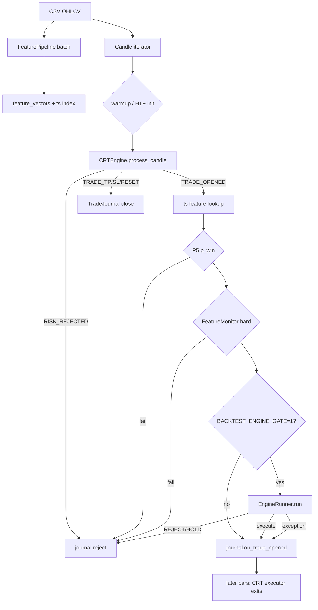
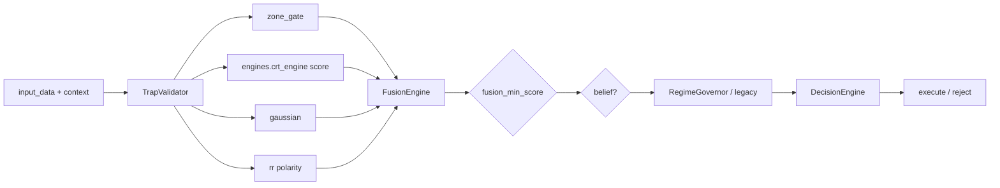

# BacktestRunner Runtime Call Graph + Context Inventory

**Date:** 2026-07-20  
**Status:** AUTHORITATIVE for model-integration audits (execution path, not repo layout)  
**Authority:** architecture / dataflow only — no economic claims  
**Source of truth (code):**
- `src/runtime/backtest_v2.py` — `BacktestRunner.__init__` / `run`
- `src/config_layer/crt_engine_v2.py` — `CRTEngine.process_candle`
- `src/core/engine_runner.py` — `EngineRunner.run`
- `src/engines/trap_validator_engine.py` — adapter pre-gate

**Companion:** [`model-integration-audit-2026-07-20.md`](model-integration-audit-2026-07-20.md) (model cards; this file is the call path).

**Active runtime flags (defaults):**
| Flag | Default | Effect |
|---|---|---|
| `BACKTEST_ENGINE_GATE` | `"1"` (ON) | Wire `EngineRunner` after CRT `TRADE_OPENED` |
| `BACKTEST_BYPASS_ZONE_INVALID` | `"1"` | Do not veto on `zone_gate_invalid` in backtest |
| `engine_runner.ultron_gate_enabled` | config | RegimeGovernor vs legacy dual-engine path |
| `engine_runner.rr_fusion.enabled` | `false` | RR fusion layer inert (F-038) |
| `engine_runner.signal_belief.enabled` | config | Belief HOLD gate |
| `crt` / BitNet `use_bitnet` | `false` on active patch | Main BitNet hard-reject inert (F-004) |

---

## 0. How to use this document

Every subsequent model audit must answer against **this graph**, not folder names:

1. **When is the model called?** (init / every bar / only `TRADE_OPENED` / never)
2. **What keys does it actually receive?** (from `_feat_map_er` / `context` / CRT state — not “what the module could accept”)
3. **Does a reject stop the trade?** (hard veto vs fail-open vs observation-only)
4. **Does the model see `CRTState`?** (almost never on fusion path)

---

## 1. Two spines (execution fact)

```text
SPINE A — Structure / trade genesis (ALWAYS in BacktestRunner)
  CSV → FeaturePipeline (batch, once)
  Candle stream → CRTEngine.process_candle (every bar after warmup)
  → TRADE_OPENED | TRADE_* | RISK_REJECTED | RESET | NONE
  → TradeJournal open/close (SL/TP from CRT trade object)
  NO ExecutionPlanner · NO UltronRiskGate on this path

SPINE B — Fusion admission (ONLY if BACKTEST_ENGINE_GATE=1
           AND only on bars where action contains TRADE_OPENED
           AND after P5 + drift gates pass)
  feature_vector[ts] + OHLCV extras + direction
    → EngineRunner.run(input_data, context)
    → APPROVE(execute) | REJECT | HOLD
  REJECT/HOLD (except zone_gate_invalid bypass) → no journal open
```

**Critical cadence:** `EngineRunner` is **not** a per-bar scorer in backtest. It is a **post-structure admission gate** on CRT candidates only.

---

## 2. Full call graph (BacktestRunner)

### 2.1 Construction (`BacktestRunner.__init__`)

```text
BacktestRunner(bt_config, csv_path, skip_features=False)
│
├─ guard_xauusd_csv_path (XAUUSD fail-closed corpus binding)
├─ init_coin_logging(instrument)
├─ SweepTraceLogger
│
├─ [if csv_path and not skip_features]
│     FeaturePipeline(raw_df).run()
│       → self.feature_vectors          # (N, 38) aligned to finalize()
│       → self.feature_ts_to_idx        # "YYYY-MM-DD HH:MM:SS" → row
│
├─ FeatureMonitor (feature_monitor section; fail → disabled)
├─ scorer: CRTGaussianScorer | CRTCalibratedScorer  (scorer_mode)
├─ TradeLogger → logs/run_{id}/{inst}/{inst}_fusion.jsonl
├─ EpisodeSummarizer
├─ RuntimeContext(BeliefRegistry) from engine_runner.signal_belief  (fail → None)
└─ StrategyOrchestrator(pair, M15)  (fail → _orch_available=False)
```

**CRTConfig resolution note (F-057):**  
`self.crt_cfg = bt_config.crt_config or ConfigBuilder.build(instrument)` — programmatic path without production overrides can diverge from active JSON.

### 2.2 Run setup (`BacktestRunner.run` — once per run)

```text
run(candle_source, total_candles, output_dir)
│
├─ dump_config (backtest + crt + engine_runner + fusion + planner + decision)
├─ CRTEngine(crt_cfg)
├─ HTFBuilder · SlippageModel · CapitalCurve · TradeJournal
├─ GapDetector · MetricsEngine · ReportWriter
├─ load: execution_planner (partial_tp_*) · feature_monitor (drift_*) · phase5_calibration.min_p_win
│
└─ [if BACKTEST_ENGINE_GATE == "1"]
      EngineRunner({
        **engine_runner,
        fusion_engine from prod,
        decision_engine keys setdefault,
        instrument=cfg.instrument
      })
```

### 2.3 Per-candle loop (Spine A always)

```text
for candle in candle_source:
  candle_idx += 1
  htf.push(candle); update htf_remaining → engine.state
  │
  ├─ warmup: candle_idx < warmup_candles → continue
  ├─ init once: engine.initialise_range(htf.seed_candles(), htf_id, session_label)
  │              session_label = CRT string session from crt_cfg.session_windows
  │              (≠ canonical feature session int 0/1/2)
  │
  ├─ journal.observe_open_bar(candle)     # MFE/MAE only; no exit
  ├─ gap_det.check → optional GAP_RESET_CLOSE + sm.reset_to_range
  ├─ engine.set_spread(...) if simulated_spread_pct > 0
  │
  ├─ result = engine.process_candle(candle, htf.current_htf_id)   # SPINE A
  │     action = result["action"]
  │
  ├─ if "TRADE_OPENED" in action and active_trade:
  │     [feature lookup + P5 + drift + EngineRunner]  → §2.4
  │
  ├─ elif TRADE_STOPPED / TRADE_TP1 / TRADE_TP2:
  │     journal close (partial TP blend if enabled)
  │
  ├─ elif RISK_REJECTED*:
  │     journal.on_rejected
  │
  └─ elif RESET with open trade:
        journal close RESET / TP1_BE_RESET
```

### 2.4 TRADE_OPENED admission chain (only candidate bars)

Order is strict; first veto wins (later stages not reached as admission):

```text
TRADE_OPENED
│
├─ 1. Timestamp feature lookup
│     feature_vector = feature_vectors[ts] or zeros(38)
│
├─ 2. Drift cooldown remaining?
│     YES → reject "drift_cooldown" · stop
│
├─ 3. Phase-5 scorer (if calibrated; static scorer returns None → no-op)
│     _feat_map_p5 = {CANONICAL_FEATURES[i]: feature_vector[i]}
│     p_win < min_p_win → reject "P5_SCORE_LOW:…" · stop
│
├─ 4. FeatureMonitor update (retest_depth, body_ratio, disp_strength)
│     hard drift + pause enabled → reject "hard_drift_veto" · stop
│
├─ 5. [GATE-ON only] EngineRunner
│     build _feat_map_er + _er_context  (§3)
│     optional StrategyOrchestrator.compute → consensus into context
│     _er_result = EngineRunner.run(_feat_map_er, context=_er_context)
│     decision in REJECT|REJECTED|HOLD
│       and not (BYPASS_ZONE_INVALID and reason has zone_gate_invalid)
│       → reject "engine_runner:{stage}:{reason}" · stop
│     exception → FAIL-OPEN (log debug, allow trade)
│
└─ 6. journal.on_trade_opened(… feature_vector, live_metrics, bitnet_*)
      TradeLogger.log_entry · EpisodeSummarizer
```

**Not on this path:** `ExecutionPlannerV1_2`, `UltronRiskGate`. Entry/SL/TP come from `engine.state.active_trade` built inside CRT.

### 2.5 CRTEngine.process_candle (Spine A detail)

```text
CRTEngine.process_candle(candle, htf_candle_id)
│
├─ ATR buffer + state.atr_abs = detector.compute_atr(...)   # absolute ATR
├─ state.update_emas(close, ema_fast/slow from CRTConfig)   # CRT soft-conf EMAs (≠ pipeline 9/21)
├─ reset_lg.should_reset → sm.reset_to_range (may fall through same bar)
├─ if active_trade OPEN/TP1:
│     executor.update_trade → TRADE_STOPPED|TP1|TP2 · resolution · reset · return
│
└─ state machine (VALID_TRANSITIONS + try_*):
      RANGE → … → RETEST → risk.approve / approve_with_soft_conf
        → build ActiveTrade (entry/SL/TP from geometry)
        → action contains TRADE_OPENED
      (+ SHADOW_PENDING / EXPIRED branches)
```

Internal CRT scoring (`RiskScore`, BitNet if enabled, soft confirmation) uses **`state.cached_features`** (RETEST-time CRT cache: body_ratio, displacement_retrace, displacement_atr_ratio, …) — **not** the 38-dim FeaturePipeline vector. The pipeline vector is attached only at journal open for training/fusion admission.

---

## 3. EngineRunner call graph (Spine B)

Entered only from §2.4 step 5.

```text
EngineRunner.run(input_data, context)
│
├─ 1. Adapter: TrapValidatorEngine.compute(merged=input_data|context)
│     score<=0 → REJECT (adapter / data_integrity / session / atr)
│
├─ 2. Engines (all four always, if adapter passed)
│     zone_gate ← run_zone_gate_engine(zonegate_input=input|context, model_fn=BitNetZoneGate)
│     crt       ← engines.crt_engine.compute(features=input_data,
│                    context={score_component_weights: HOW tuple from prod crt_engine})
│     gaussian  ← heuristic|ml .compute(input_data, direction long|short from input_data.direction)
│     rr        ← RREngine.compute(input_data)  # OHLC polarity
│     [optional] rr_fusion mutate rr.score if enabled+loaded  # OFF active
│     [optional] strategy_consensus into engine_results if context score >= 0
│
├─ 3. Completeness: EXPECTED_ENGINES = {crt, gaussian, zone_gate, rr}
│
├─ 4. FusionEngine.compute(engine_results, regime=detect_regime(input_data))
│     optional fusion.evaluate shadow/use (fusion_use_evaluate default false)
│
├─ 5. fusion_min_score gate (dual_engine.fusion_min_score)
│     final_score < threshold → REJECT low_fusion_score
│
├─ 5b. Belief gate (if belief_registry in context AND signal_belief.enabled)
│     not approved → HOLD (BELIEF_GATE)  # backtest treats HOLD as veto
│
├─ 6. Dual-engine + RegimeGovernor | legacy
│     ultron_gate_enabled true → RegimeGovernor.evaluate
│     false → _regime_governor_legacy
│     !allow → REJECT ultron_gate:*
│
├─ 7. DecisionEngine.evaluate(score=final_score, p_win=gaussian.score,
│        zone_gate={valid,score}, fusion={rr polarity audit fields, …})
│     → decision execute | reject   (never "Approved" string)
│
└─ 8. Collector.log · AcceptanceController · ConvergenceController
      FEATURE_SNAPSHOT / CognitiveBus (observation; fail-open)
      return decision_result
```

---

## 4. Context inventory

### 4.1 `_feat_map_er` → `EngineRunner` `input_data`

Built only at TRADE_OPENED (`backtest_v2.py` ~2169–2197):

| Key group | Keys | Source | Notes |
|---|---|---|---|
| **38-dim canonical** | `CANONICAL_FEATURES` order | `feature_vector[i]` via ts lookup | Miss → all zeros (dangerous for training log; adapter may still see integrity) |
| **OHLCV reaffirm** | `open,high,low,close,volume` | candle (setdefault) | Already in 38-dim if pipeline present |
| **atr** | `atr` | **pipeline relative atr** (in CANONICAL_FEATURES) | `setdefault(atr, engine.state.atr_abs)` does **NOT** override when key present. Fusion CRT score and adapter see **pipeline atr**, not CRT absolute ATR. |
| **timestamp** | `timestamp` | `str(candle.timestamp)` | setdefault |
| **integrity** | `_data_integrity` | `"real"` if feature_vectors hit | Adapter hard-requires `"real"` |
| **direction** | `direction`, `signal_dir`, `trade_direction` | `int(engine.state.direction)` | CRT side → gaussian short/long mirroring |

**Not injected into `input_data`:** `CRTState` enum, transition path, HTF id, risk_score, active_trade SL/TP, CRT `cached_features`, BitNet main score (BitNet score is journal-side only).

### 4.2 `_er_context` → `EngineRunner` `context`

| Key | When present | Source | Consumer |
|---|---|---|---|
| `instrument` | always | `cfg.instrument` | belief registry key; logging |
| `timeframe` | always | `cfg.timeframe` or `"M15"` | belief registry |
| `strategy_consensus_direction` | always | CRT direction int (same as feat map) | belief update direction; strategy_consensus engine slot |
| `strategy_consensus_score` | only if orchestrator actionable | `StrategyOrchestrator.compute` | Fusion 5th engine if `weight_strategy_consensus > 0` |
| `belief_registry` | if RuntimeContext init OK | `self._runtime_ctx.belief_registry` | belief gate |

**Orchestrator local inputs (not full ER input):** `_feat_dict` = 38-dim + close + atr_abs + optional `_transition_path`; `_candle_dict` = OHLC+V. Fail-open on exception.

### 4.3 Per-stage key consumption (Spine B)

| Stage | Primary keys read from input/context | Hard reject if |
|---|---|---|
| **TrapValidator (adapter)** | `_data_integrity`, `close,high,low,open,volume,atr,ema_fast,ema_slow,session`; optional CRT fields not required | integrity≠real; missing required; atr≤0 or atr&lt;min_atr; session not in `allowed_sessions` |
| **ZoneGate** | full 38 CANONICAL keys → BitNetZoneGate top_k cluster score vs `zone_cluster_threshold` | score feeds fusion; DE hard path see below |
| **Fusion CRT score** | `body_ratio`, `disp_strength`, `atr`, `retest_depth`, `double_sweep`; optional `candles_since_retest`, `sweep_detected` | exception → score 0.0 (soft into fusion) |
| **Gaussian heuristic** | `ema_fast`, `ema_slow`, `momentum_score` only (direction **ignored**); μ/σ≈0/1 | KeyError/ema_slow=0 → RuntimeError → ER fail-open; also DE `p_win` thr 0.4 |
| **RREngine (CPI)** | `high`, `low`, `close` only → polarity ∈[0.5,1] | soft 0 on doji/invalid; **not** forward RR |
| **rr_fusion** | full vector or 3-feat stub + gaussian | **disabled** on active config |
| **DE low_rr** | would use fusion rr vs 1.5 | **skipped** when `rr_semantic=candle_polarity` (ER always sets this) |
| **detect_regime / dual** | feature dict (trend/momentum/vol thresholds from dual_engine) | via ultron_gate allow=false |
| **FusionEngine** | 4 scores; **regime profiles** (ER always passes regime=; not static JSON scalars alone); convergence penalty | missing engines; conflict→0; ER **fusion_min_score=0.25** hard gate |
| **Belief** | context registry + fusion score + consensus dir | HOLD (disabled if signal_belief off) |
| **Dual legacy / RegimeGovernor** | breakout+trap on features; ultron_gate_enabled=false → legacy | ultron_gate:* / no_direction — **binding on BT** |
| **DecisionEngine** | final_score, gaussian p_win, zone valid/score, weak_component | ordered rejects; see zone.valid |
| **DE zone.valid** | **Intended** `zone_result.passed` | **Wiring defect:** no top-level `passed` → always `zone_gate_invalid` first → other DE checks **unreachable**; default BYPASS nullifies DE for BT admission (model-integration §6.5 + §11) |

### 4.4 Phase-5 scorer inventory (pre-ER)

| Item | Value |
|---|---|
| Input | full 38-name map from feature_vector |
| Direction | `engine.state.direction` lowercased |
| Gate | `p_win < phase5_calibration.min_p_win` |
| Static mode | `CRTGaussianScorer` → None → no veto |

### 4.5 What CRT sees vs what models see

| Quantity | CRT state machine | Fusion models (ER) |
|---|---|---|
| OHLCV stream | yes, every bar | only at TRADE_OPENED snapshot |
| Absolute ATR (`state.atr_abs`) | yes | no (unless zeros path setdefault) |
| Pipeline 38-dim | no (uses cached_features) | yes |
| `CRTState` / transitions | yes | no (orchestrator may get `_transition_path` only for strategies) |
| Session | CRT string windows | canonical int session feature |
| Entry SL/TP | built in CRT | not used by ER; not re-planned in backtest |

---

## 5. Fail-open vs fail-closed map (admission)

| Failure | Behavior in BacktestRunner |
|---|---|
| FeaturePipeline init fails | **fail-closed** RuntimeError (unless skip_features) |
| Feature ts miss | zeros vector; trade may still open; ENTRY log skipped if all-zero |
| FeatureMonitor init fail | drift gate disabled |
| P5 / hard drift / engine REJECT | **fail-closed** (no open) |
| EngineRunner exception | **fail-open** (trade allowed) |
| `zone_gate_invalid` + BYPASS=1 | **fail-open** for that reason only |
| StrategyOrchestrator fail | consensus omitted |
| BeliefRegistry init fail | belief gate skipped (no registry) |
| Belief HOLD | treated as veto (same as REJECT) |

---

## 6. Explicit non-call sites (do not invent edges)

On **`BacktestRunner.run`** these are **not** invoked:

- `ExecutionPlannerV1_2`
- `UltronRiskGate` (capital risk; distinct from RegimeGovernor “ultron_gate”)
- Live `FeatureStore` / `live_engine_hook` (separate entry surface)
- TradeNet fusion neural slot (unwired / F-005)
- Per-bar EngineRunner (only TRADE_OPENED)

Live path differences are **out of scope** for this inventory; when auditing live, start a sibling graph from `live_engine_hook` and re-inventory keys (StrategyOrchestrator order and FeatureStore may differ).

---

## 7. Mermaid (Spine A + gated B)





---

## 8. Audit checklist template (next models)

For each model, fill against this graph:

| Field | Fill |
|---|---|
| Call site(s) | e.g. `EngineRunner.run` step 2 only |
| Cadence | TRADE_OPENED only / every bar / init |
| Required keys (actual) | list from §4.3 |
| Optional / ignored keys | … |
| CRTState used? | Y/N |
| Reject effect | hard / soft-zero / observation |
| Active config state | ON/OFF/INERT |
| Open truth risks | e.g. atr absolute vs relative |

**Recommended order:** Adapter → ZoneGate → fusion CRT score → Gaussian → RR (+ rr_fusion off proof) → Fusion weights → DecisionEngine → Belief/RegimeGovernor → (live-only) Planner/Ultron.

---

## 9. Source line anchors (drift detection)

| Concern | Location |
|---|---|
| FeaturePipeline batch | `backtest_v2.py` ~1667–1695 |
| EngineRunner wire default ON | `backtest_v2.py` ~1894–1908 |
| process_candle call | `backtest_v2.py` ~2011–2013 |
| TRADE_OPENED feature + gates | `backtest_v2.py` ~2035–2265 |
| `_feat_map_er` / `_er_context` | `backtest_v2.py` ~2169–2235 |
| EngineRunner pipeline order | `engine_runner.py` module doc + `run` ~603–1138 |
| EXPECTED_ENGINES | `engine_runner.py` ~53 |
| Adapter required fields | `trap_validator_engine.py` ~22–25, `compute` |
| Fusion CRT feature score | `engines/crt_engine.py` `compute` |
| No planner/Ultron in backtest | grep-empty on `backtest_v2.py` |

---

*End of inventory. Model audits must cite stages/keys from this document; if code diverges, update this file first (DOC_DRIFT protocol).*
