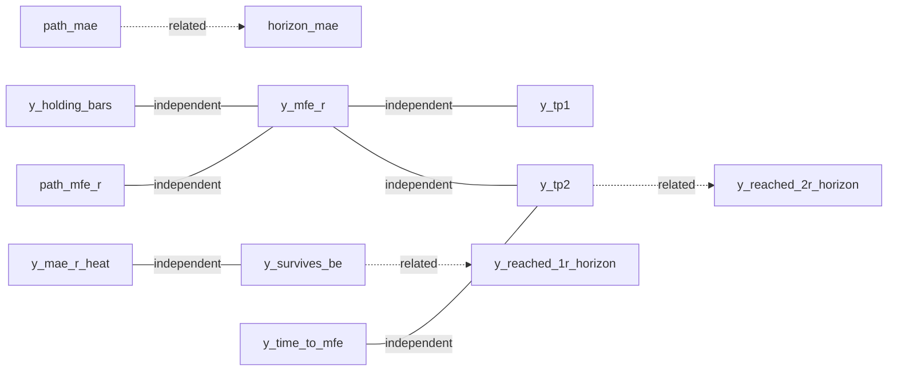

# Clean-Label Intelligence Analysis — TN_ENV_CLEAN_L1

| Field | Value |
|-------|--------|
| created_utc | 2026-07-21T22:24:51.523738+00:00 |
| dataset | `D:\Tradelatest\results\clean_labels\BNBUSDT\20260721T221711Z\clean_labels.jsonl` |
| n_rows | 139942 |
| protocol | TN_ENV_CLEAN_L1 |
| instrument | BNBUSDT |
| authority | ANALYSIS_ONLY — no train/wire |

---

## Stage 1 — Validate the dataset

### Label inventory

| Label | Domain | Kind | Missing% | Key stats |
|-------|--------|------|----------|-----------|
| `y_tp1` | outcome | binary | 0% | pos=0.332852 (usable) |
| `y_tp2` | outcome | binary | 0% | pos=0.332824 (usable) |
| `y_survives_be` | outcome | binary | 0% | pos=0.503158 (usable) |
| `y_R_net` | outcome | continuous | 0% | mean=-0.414277 std=1.430937 q50=-1.262773 q80=1.565404 |
| `y_expired_timeout` | timing | binary | 0% | pos=0.010347 (severe_imbalance) |
| `y_mfe_r` | envelope_excursion | continuous | 0% | mean=3.879448 std=3.985409 q50=2.78145 q80=5.95728 |
| `y_mae_r_heat` | envelope_risk | continuous | 0% | mean=3.879448 std=3.985409 q50=2.78145 q80=5.95728 |
| `path_mfe_r` | envelope_excursion | continuous | 0% | mean=1.288927 std=1.108727 q50=1.012223 q80=2.253659 |
| `path_mae_r_heat` | envelope_risk | continuous | 0% | mean=1.119745 std=0.756716 q50=1.11624 q80=1.522946 |
| `y_holding_bars` | timing | ordinal_time | 0% | mean=6.520916 std=7.052296 q50=4.0 q80=10.0 |
| `y_time_to_mfe` | timing | ordinal_time | 3.4% | mean=4.598813 std=5.736755 q50=2.0 q80=7.0 |
| `y_time_to_1r` | timing | ordinal_time | 20.17% | mean=7.906739 std=8.663622 q50=4.0 q80=13.0 |
| `y_reached_0_5r` | envelope_excursion | binary | 0% | pos=0.895893 (moderate_imbalance) |
| `y_reached_1r_horizon` | envelope_excursion | binary | 0% | pos=0.798324 (usable) |
| `y_reached_2r_horizon` | envelope_excursion | binary | 0% | pos=0.619364 (usable) |
| `risk_distance` | risk_geometry | continuous | 0% | mean=2.644148 std=2.050995 q50=2.115714 q80=3.520714 |

### High correlations (|Spearman| ≥ 0.7)

| A | B | Spearman |
|---|---|---------|
| `y_tp1` | `y_tp2` | 0.9996 |
| `y_survives_be` | `path_mfe_r` | 0.7483 |
| `y_R_net` | `path_mae_r_heat` | -0.7016 |
| `y_mfe_r` | `y_reached_2r_horizon` | 0.7078 |
| `y_holding_bars` | `y_time_to_mfe` | 0.783 |
| `y_reached_0_5r` | `y_reached_1r_horizon` | 0.7485 |

Stream vs clean y_tp1 agreement: **0.679638707464521** (F-022 diagnostic).

### Distribution sketches (1–99% clipped histograms)

**`y_R_net`** clip=[-2.1087930299999997, 1.86500131]
```
  #### 3593
  ######## 6417
  ################### 15990
  ######################################## 33180
  ###################################### 31224
  ## 1556
   64
   71
   108
   161
   145
   187
   214
   331
  # 505
  # 1177
  #### 3082
  ######### 7343
  ################### 16088
  ###################### 18506
```

**`y_mfe_r`** clip=[0.0081, 18.716633999999992]
```
  ######################################## 26650
  #################################### 23765
  ############################## 20201
  ######################### 16374
  ################### 12646
  ############## 9476
  ########### 7221
  ######## 5431
  ###### 4177
  ##### 3088
  ### 2294
  ### 1738
  ## 1278
  ## 1038
  # 823
  # 636
  # 536
  # 444
  # 394
  ### 1732
```

**`y_mae_r_heat`** clip=[0.0081, 18.716633999999992]
```
  ######################################## 26650
  #################################### 23765
  ############################## 20201
  ######################### 16374
  ################### 12646
  ############## 9476
  ########### 7221
  ######## 5431
  ###### 4177
  ##### 3088
  ### 2294
  ### 1738
  ## 1278
  ## 1038
  # 823
  # 636
  # 536
  # 444
  # 394
  ### 1732
```

**`path_mfe_r`** clip=[0.0, 4.3116031199999965]
```
  ######################################## 26478
  ######################## 16043
  ################## 12237
  ############### 9621
  ############ 7719
  ######### 6253
  ######## 5335
  ####### 4445
  ###### 3969
  ##################### 13827
  ################## 11714
  ########### 7233
  ####### 4638
  ##### 3015
  ### 2072
  ## 1442
  # 968
  # 674
  # 483
  ### 1776
```

**`path_mae_r_heat`** clip=[0.0, 3.5310951299999993]
```
  #################### 13495
  ############# 9050
  ############ 8066
  ########### 7072
  ########## 6427
  ######################## 15828
  ######################################## 26915
  ########################## 17533
  ################# 11313
  ########### 7312
  ####### 4816
  ##### 3224
  ### 2204
  ## 1532
  ## 1106
  # 868
  # 656
  # 466
  # 362
  ### 1697
```

**`y_holding_bars`** clip=[1.0, 40.0]
```
  ######################################## 44282
  ############################ 31283
  ################# 19094
  ########### 12482
  ####### 8284
  ##### 5919
  #### 4111
  ### 3143
  ## 2334
  ## 1749
  # 1327
  # 1008
  # 798
  # 638
   543
   437
   375
   274
   247
  # 1614
```

**`y_time_to_mfe`** clip=[1.0, 30.0]
```
  ######################################## 70151
  ######## 13243
  ########## 17341
  ### 5773
  ##### 8280
  ## 2999
  ### 4451
  # 1737
  ## 2651
  # 1081
  # 889
  # 1484
   613
  # 958
   404
   629
   247
   436
   192
  # 1620
```

**`y_time_to_1r`** clip=[1.0, 38.0]
```
  ######################################## 36433
  ####################### 21246
  ############# 12163
  ######### 8289
  ####### 5944
  ##### 4507
  ## 1903
  #### 3309
  ### 2854
  ### 2328
  ## 1927
  ## 1763
  ## 1602
  # 713
  # 1253
  # 1156
  # 1009
  # 947
  # 828
  ## 1545
```

**`risk_distance`** clip=[0.642857142857157, 10.252621428571382]
```
  ######################## 15710
  ####################################### 26154
  ######################################## 26526
  ############################## 19680
  ##################### 14076
  ############### 9906
  ########## 6866
  ######## 5024
  ###### 4014
  #### 2754
  ### 2130
  ## 1480
  ## 1242
  # 760
  # 504
  # 498
  # 346
   308
   294
  ### 1670
```

---

## Stage 2 — Semantic redundancy

### Key conditionals

```json
{
  "P_tp1_given_high_mfe": {
    "n": 46601,
    "rate": 0.5637
  },
  "P_tp1_given_low_mfe": {
    "n": 46603,
    "rate": 0.0
  },
  "P_tp2_given_high_mfe": {
    "n": 46601,
    "rate": 0.563657
  },
  "P_tp2_given_y_reached_2r_horizon": {
    "n": 86675,
    "rate": 0.537364
  },
  "P_survives_be_given_high_mae": {
    "n": 46601,
    "rate": 0.343061
  },
  "P_survives_be_given_low_mae": {
    "n": 46603,
    "rate": 0.778705
  },
  "P_tp2_given_fast_time_to_mfe": {
    "n": 50997,
    "rate": 0.050395
  },
  "P_tp2_given_slow_time_to_mfe": {
    "n": 41952,
    "rate": 0.672292
  },
  "P_tp1_given_survives_be": {
    "n": 70413,
    "rate": 0.661526
  },
  "P_tp2_given_tp1": {
    "n": 46580,
    "rate": 0.99985
  },
  "P_survives_be_given_tp1": {
    "n": 46580,
    "rate": 1.0
  },
  "mean_mfe_given_tp1": {
    "n": 46580,
    "mean": 5.883685,
    "q50": 4.62345
  },
  "mean_mfe_given_not_tp1": {
    "n": 93362,
    "mean": 2.879498,
    "q50": 1.72075
  },
  "mean_mae_given_survives_be": {
    "n": 70413,
    "mean": 2.852203,
    "q50": 1.6126
  },
  "mean_mae_given_not_survives": {
    "n": 69529,
    "mean": 4.919753,
    "q50": 3.7351
  },
  "mean_holding_given_tp1": {
    "n": 46580,
    "mean": 7.904637,
    "q50": 6.0
  },
  "mean_holding_given_sl": {
    "n": 91914,
    "mean": 5.301238,
    "q50": 3.0
  },
  "agree_y_tp2_vs_reached_2r_horizon": 0.7134598619428049,
  "agree_y_survives_be_vs_reached_1r_horizon": 0.7048348601563504,
  "spearman_mfe_tp1": 0.4007,
  "spearman_mfe_tp2": 0.4007,
  "spearman_mae_survives_be": -0.3344,
  "spearman_ttm_tp2": 0.446,
  "spearman_holding_mfe": 0.039,
  "spearman_path_mfe_vs_horizon_mfe": 0.4611,
  "spearman_path_mae_vs_horizon_mae": 0.511,
  "mfe_tercile_cuts": {
    "t1": 1.7181,
    "t2": 4.182029400000002
  },
  "mae_tercile_cuts": {
    "a1": 1.7181,
    "a2": 4.182029400000002
  }
}
```

### Classification

- **Redundant:** 0
- **Related:** 3
- **Independent (probed pairs):** 6

#### Redundant


#### Related

- `path_mae↔horizon_mae` — {'pair': 'path_mae↔horizon_mae', 'spearman': 0.511, 'note': 'walk-bounded vs exit-agnostic MAE'}
- `y_tp2↔y_reached_2r_horizon` — {'pair': 'y_tp2↔y_reached_2r_horizon', 'agreement': 0.7134598619428049, 'note': 'related; SL-gating differs from pure horizon'}
- `y_survives_be↔y_reached_1r_horizon` — {'pair': 'y_survives_be↔y_reached_1r_horizon', 'agreement': 0.7048348601563504, 'note': 'walk MFE@exit vs full-horizon 1R'}

#### Independent

- `y_mfe_r↔y_tp1` — {'pair': 'y_mfe_r↔y_tp1', 'spearman': 0.4007, 'note': 'excursion vs discrete TP1'}
- `y_mfe_r↔y_tp2` — {'pair': 'y_mfe_r↔y_tp2', 'spearman': 0.4007, 'note': 'excursion vs discrete TP2'}
- `y_mae_r_heat↔y_survives_be` — {'pair': 'y_mae_r_heat↔y_survives_be', 'spearman': -0.3344, 'note': 'heat vs BE survival'}
- `y_time_to_mfe↔y_tp2` — {'pair': 'y_time_to_mfe↔y_tp2', 'spearman': 0.446, 'note': 'timing vs TP2'}
- `y_holding_bars↔y_mfe_r` — {'pair': 'y_holding_bars↔y_mfe_r', 'spearman': 0.039, 'note': 'duration vs MFE'}
- `path_mfe_r↔y_mfe_r` — {'pair': 'path_mfe_r↔y_mfe_r', 'spearman': 0.4611, 'note': 'walk-bounded vs exit-agnostic MFE'}

### Dependency graph (edges)



---

## Stage 3 — Architectural grouping

### TradeNet (path milestones) (`outcome_path`)
- Owns: `y_tp1`, `y_tp2`, `y_survives_be`
- Diagnostic: `y_R_net`, `y_expired_timeout`

### Excursion intelligence (`excursion_envelope`)
- Owns: `y_mfe_r`, `path_mfe_r`, `y_reached_0_5r`, `y_reached_1r_horizon`, `y_reached_2r_horizon`

### Risk / heat intelligence (`risk_envelope`)
- Owns: `y_mae_r_heat`, `path_mae_r_heat`
- Context (not target): `risk_distance`

### Time intelligence (`timing_envelope`)
- Owns: `y_holding_bars`, `y_time_to_mfe`, `y_time_to_1r`
- Diagnostic: `path_time_to_tp`, `path_time_to_failure`, `y_expired_timeout`

> If Stage-2 shows MFE/MAE/holding weakly coupled AND Stage-4 shows learnability in more than one domain, multi-head EnvelopeNet is justified; if only one domain is learnable, collapse or demote the others to diagnostic.

---

## Stage 4 — Predictability (probe, not GATE-O)

Temporal split: entry_index median = 35093.0
Instrument scope: BNBUSDT_only — instrument-specificity OPEN until multi-inst

| Label | Learnability | Best feature ρ | Temporal unstable? | Side Δ |
|-------|--------------|----------------|--------------------|--------|
| `y_tp1` | NOISY_OR_UNINFORMATIVE_LINEAR | retest_depth=0.0549 | False | 0.010118 |
| `y_tp2` | NOISY_OR_UNINFORMATIVE_LINEAR | retest_depth=0.0548 | False | 0.010118 |
| `y_survives_be` | NOISY_OR_UNINFORMATIVE_LINEAR | volatility_ratio=0.0038 | False | 0.00796 |
| `y_mfe_r` | CANDIDATE_LEARNABLE | atr=-0.1602 | False | 0.289793 |
| `y_mae_r_heat` | CANDIDATE_LEARNABLE | atr=-0.1602 | False | 0.289793 |
| `y_holding_bars` | CANDIDATE_LEARNABLE | volatility_ratio=-0.1944 | False | 0.290435 |
| `y_time_to_mfe` | WEAK_SIGNAL | volatility_ratio=-0.1329 | False | 0.381258 |
| `y_R_net` | CANDIDATE_LEARNABLE | atr=0.5446 | False | 0.024149 |
| `y_expired_timeout` | WEAK_SIGNAL | atr=-0.1322 | False | 0.002058 |

Per-target detail (top features, vol slices) is in `stage4_predictability.json`.

---

## Stage 5 — Architecture implications

**Envelope structure recommendation:** `MULTI_HEAD_ENVELOPE_JUSTIFIED`

3 envelope targets show candidate linear association; keep multi-head EnvelopeNet (excursion + risk + timing) rather than collapse.

### Fusion / Planner consumption

```json
{
  "direct_candidates": [
    {
      "label": "y_tp1",
      "consumer": "TradeNet \u2192 Fusion neural (after GATE-O/S/P)",
      "probe": "NOISY_OR_UNINFORMATIVE_LINEAR"
    },
    {
      "label": "y_tp2",
      "consumer": "TradeNet \u2192 Fusion neural (after GATE-O/S/P)",
      "probe": "NOISY_OR_UNINFORMATIVE_LINEAR"
    },
    {
      "label": "y_survives_be",
      "consumer": "TradeNet \u2192 Fusion neural (after GATE-O/S/P)",
      "probe": "NOISY_OR_UNINFORMATIVE_LINEAR"
    },
    {
      "label": "y_mfe_r",
      "consumer": "Envelope coherence / risk_mult (ENV soft channels)",
      "probe": "CANDIDATE_LEARNABLE"
    },
    {
      "label": "y_mae_r_heat",
      "consumer": "Envelope coherence / risk_mult (ENV soft channels)",
      "probe": "CANDIDATE_LEARNABLE"
    }
  ],
  "diagnostic_only": [
    {
      "label": "y_time_to_mfe",
      "reason": "WEAK_SIGNAL"
    },
    {
      "label": "y_R_net",
      "reason": "diagnostic by design"
    },
    {
      "label": "y_expired_timeout",
      "reason": "diagnostic by design"
    }
  ],
  "planner_candidates": [
    {
      "label": "y_mfe_r",
      "consumer": "TP band / SL heat room"
    },
    {
      "label": "y_mae_r_heat",
      "consumer": "TP band / SL heat room"
    },
    {
      "label": "y_holding_bars",
      "consumer": "TTL / time management"
    },
    {
      "label": "y_time_to_mfe",
      "consumer": "TTL / time management"
    }
  ]
}
```

### Ownership matrix (labels → market questions → owners)

| Label | Market question | Existing model? | Candidate owner | Overlap |
|-------|-----------------|-----------------|-----------------|---------|
| `y_tp1` | Will the first target be reached before SL? | TradeNet | **TradeNet** | low |
| `y_tp2` | Will +2R be reached before SL? | TradeNet (surrogate policy) | **TradeNet** | medium with y_reached_2r_horizon |
| `y_survives_be` | Does path achieve ≥1R MFE (BE room)? | TradeNet | **TradeNet** | medium with y_reached_1r_horizon |
| `y_R_net` | What net R is realized under walk+cost? | RR-B intent (payoff); unused | **Diagnostic / GATE-O** | do not train as TradeNet head |
| `y_mfe_r` | How far can price realistically run (horizon)? | No | **EnvelopeNet (excursion)** | related to TP heads but continuous support |
| `y_mae_r_heat` | How much adverse heat is likely? | No | **EnvelopeNet (risk)** | not the same as survives_be |
| `y_holding_bars` | How long until hard exit? | Planner TTL (policy, not learned) | **EnvelopeNet (timing)** | low with outcome heads |
| `y_time_to_mfe` | When does maximum opportunity occur? | No | **EnvelopeNet (timing)** | low–medium with holding |
| `y_time_to_1r` | When is +1R first seen? | No | **EnvelopeNet (timing) or diagnostic** | linked to survives_be timing |
| `y_expired_timeout` | Does opportunity expire without TP/SL? | No | **Diagnostic (rare event)** | low |
| `path_mfe_r / path_mae_r_heat` | Walk-bounded excursions under SL/TP | No | **Diagnostic twin of horizon envelope** | high with horizon if path rarely times out |
| `risk_distance` | What SL distance was set? | CRT / Planner geometry | **Context feature — NOT a label** | n/a |

### Do not train yet

- Any head with learnability_tag NOISY_OR_UNINFORMATIVE_LINEAR until nonlinear GATE-O
- y_expired_timeout if severe class imbalance
- path_* as primary heads if highly redundant with horizon y_*

---

## Bottom line

1. Clean labels are **complete enough** for research (Stage 1).
2. Outcome heads and envelope continuous targets are **related but not identical** — envelope still answers *bounds*, TradeNet answers *milestones* (Stage 2).
3. Group into **Outcome / Excursion / Risk / Timing** domains (Stage 3).
4. Learnability is **probe-level only** — GATE-O required before any train authority (Stage 4).
5. Architecture choice (`single` vs `multi-head` envelope) follows Stage 4 tags (Stage 5): **`MULTI_HEAD_ENVELOPE_JUSTIFIED`**.

### Critical evidence flags (read before training)

| Flag | Evidence | Implication |
|------|----------|-------------|
| **TP1 ≈ TP2 collapse** | Spearman `y_tp1`↔`y_tp2` ≈ **0.9996**; P(tp2\|tp1)≈1.0 | Unit TP geometry ≈ +2R surrogate → three-head TradeNet is **effectively two-head**. Fix geometry or drop `y_tp2` before GATE-O. |
| **Holding ⊥ MFE** | Spearman holding↔MFE ≈ **0.04** | Timing and excursion are **independent** → multi-head envelope is substance, not cosmetics. |
| **MFE related ≠ TP** | ρ(MFE,tp1)≈0.40; P(tp1\|high MFE)=0.56 vs P(tp1\|low MFE)=**0.0** | Envelope MFE is not a TradeNet duplicate; low-MFE tercile never hits TP1. |
| **MAE ≠ survives_be** | ρ≈−0.33; P(BE\|high MAE)=0.34 vs P(BE\|low MAE)=0.78 | Risk heat is a distinct axis from the Bernoulli BE head. |
| **Timeout rare** | pos≈1% | No dedicated timeout head. |
| **TradeNet linear probe weak** | max \|feature ρ\|≈0.05 on y_tp1 | Outcome heads need nonlinear GATE-O — or truly low predictability. |
| **Envelope linear probe stronger** | holding \|ρ\|≈0.19; MFE/MAE \|ρ\|≈0.16 | Bounds associate more with features than discrete outcomes *on this probe*. |
| **y_R_net vs atr ρ≈0.54** | Partly mechanical (cost/risk geometry) | Diagnostic only — not free edge. |
| **BNBUSDT only** | Single instrument | Instrument-specificity OPEN. |

**Authority:** ANALYSIS_ONLY — no train/wire; informs ENV_ARCH_V1 refinement
