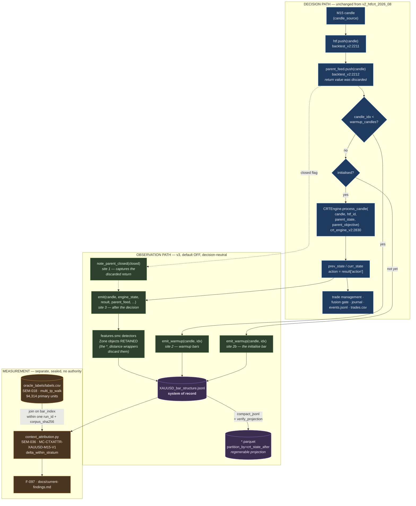

# BarStructureSnapshot — flow and separation

**Change:** `CH-v3-unified-market-structure-v1` · **Ontology:** SEM-035 · **Updated:** 2026-08-29

How the v3 per-bar observation sidecar attaches to the CRT spine, and — the point of the
diagram — where the decision path ends and the observation path begins.

---

## The separation

Everything above the dashed line decides. Everything below it watches. The two never meet:
emission happens *after* `CRTEngine.process_candle` has returned, the emitter takes read-only
views, and it returns `None`, so there is nothing for a caller to branch on.

---

## The five touch-points, and why each exists

| # | Site | Why it is there |
|---|---|---|
| 0 | after `ReportWriter` construction | Builds the emitter (needs `run_id`). Returns `None` on any failure — a broken observation surface must not be able to take a backtest down. |
| 1 | `backtest_v2:2212` | Captures `parent_feed.push()`'s return value, which the runner previously discarded. Lets a record distinguish "the parent state changed on this bar" from "unchanged and carried forward". |
| 2 | warmup branch | Emits identity+bar rows so `bar_index` is gapless. |
| 2b | initialise branch | The branch `continue`s before `process_candle`. **Without this the stream had exactly one hole, at bar 77** — found by the `CC-CTX-RUN-SCOPED-OBSERVATION` grounding check, not by any unit test. |
| 3 | after `backtest_v2:2306` | The full record. Everything needed is in scope, the decision is already final, and nothing downstream reads what happens here. |

---

## Why gaplessness is load-bearing

`logs/crt_transitions.jsonl` cannot answer *"what state was the engine in at bar i?"*. It is
`CC-L3-GLOBAL-UNIDENTIFIED` for two concrete reasons: an empty `instrument` field, and no RESET
record, so folding it produces a **wrong** state series.

This stream can answer that question, and the claim class `CC-CTX-RUN-SCOPED-OBSERVATION`
grounds it — but only because the check verifies the properties the difference rests on:
identity present, one run of one corpus, and a gapless `0..N-1` bar index. A stream with a
coverage hole cannot support the claim for arbitrary `i`, which is why the one-bar gap at site
2b was a real defect and not a rounding detail.

The sibling class `CC-CTX-NOT-DECISION` refuses, always, the claim that any of this influenced
a trade.

---

## What is new here, and what is merely joined

Three things are genuinely new; everything else is a join, and saying so keeps the surface from
growing a second source of truth:

1. **The CRT state is the ENGINE's.** `scripts/research/build_bar_matrix.py` already emits a
   per-bar CRT column, but from `features.crt_state_resolver`. F-069 measured only 88.16%
   agreement; F-086 measured the dwell gap (resolver RANGE 21,745 vs engine 35,159). Joining
   the two on bar index remains `CC-L3-FORBIDDEN-JOIN`.
2. **Zone geometry.** Each `features.smc` detector builds a full `Zone` and the `*_distance`
   wrapper immediately collapses it to one tanh scalar. Edges, formation index, age, polarity
   and containment were computed on every bar and thrown away.
3. **Run-scoped identity.** `instrument` + `corpus_sha256` + `run_id` + gapless `bar_index`.

If that delta ever shrinks to zero, the right move is to extend `build_bar_matrix` and delete
this module rather than keep two per-bar surfaces alive.

---

## Cost

`_find_break_events` re-runs `detect_causal_swings(bars[:i], k)` for every interior position, and
`order_block` / `breaker` / `mitigation` each call it independently — the identical scan ran
three times per bar. Measured at 4.39 ms/bar (≈208 s per XAUUSD corpus), of which ≈142 s was the
duplication. The three detectors now accept a precomputed result, pinned bit-identical by
[`tests/test_smc_break_event_memo.py`](../../tests/test_smc_break_event_memo.py) — including a
mutation check that a *wrong* event list changes the answer, so the equality assertions cannot
pass for the wrong reason.

---

## Related

- Data contract: [`docs/governance/bar_structure_snapshot_schema.json`](../governance/bar_structure_snapshot_schema.json)
- Migration plan: [`docs/implementation_plan/v3-unified-market-structure-migration-2026-09.md`](../implementation_plan/v3-unified-market-structure-migration-2026-09.md)
- Objects: [`docs/research/bar_structure_snapshot_object.md`](../research/bar_structure_snapshot_object.md) · [`docs/research/context_attribution_object.md`](../research/context_attribution_object.md)
- Spine walk: [`docs/architecture/signal-flow.md`](signal-flow.md)
