# code-map.generated.md

> **GENERATED — do not edit by hand.** Regenerate with `python scripts/analysis/gen_code_map.py`. Narrative + how-to-navigate lives in [`code-map.md`](code-map.md); module roles in [`codebase-state-map.md`](codebase-state-map.md).

`src/` module-level import graph — 269 modules across 34 packages. Each per-package slice shows that package's modules and everything they import (a loadable unit).

## L0 — package dependency overview

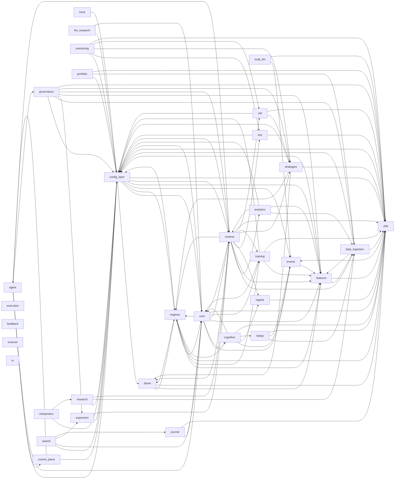
```mermaid
flowchart LR
    agent["agent"]
    analytics["analytics"]
    bitnet["bitnet"]
    cognitive["cognitive"]
    config_layer["config_layer"]
    control_plane["control_plane"]
    core["core"]
    data_ingestion["data_ingestion"]
    engines["engines"]
    events["events"]
    execution["execution"]
    expansion["expansion"]
    features["features"]
    feedback["feedback"]
    governance["governance"]
    inout["inout"]
    interpreters["interpreters"]
    journal["journal"]
    live["live"]
    llm_research["llm_research"]
    monitoring["monitoring"]
    multi_llm["multi_llm"]
    portfolio["portfolio"]
    regime["regime"]
    replay["replay"]
    research["research"]
    runtime["runtime"]
    scanner["scanner"]
    search["search"]
    strategies["strategies"]
    training["training"]
    uat["uat"]
    ui["ui"]
    utils["utils"]
    agent --> config_layer
    agent --> control_plane
    agent --> core
    agent --> governance
    agent --> runtime
    analytics --> config_layer
    analytics --> data_ingestion
    analytics --> features
    analytics --> runtime
    bitnet --> engines
    bitnet --> features
    bitnet --> utils
    cognitive --> core
    cognitive --> engines
    cognitive --> events
    cognitive --> regime
    cognitive --> replay
    cognitive --> utils
    config_layer --> bitnet
    config_layer --> core
    config_layer --> engines
    config_layer --> events
    config_layer --> features
    config_layer --> runtime
    config_layer --> utils
    control_plane --> agent
    control_plane --> config_layer
    core --> cognitive
    core --> config_layer
    core --> engines
    core --> events
    core --> features
    core --> runtime
    core --> training
    core --> utils
    data_ingestion --> config_layer
    data_ingestion --> features
    data_ingestion --> utils
    engines --> bitnet
    engines --> config_layer
    engines --> core
    engines --> features
    engines --> training
    engines --> utils
    events --> features
    expansion --> config_layer
    expansion --> runtime
    features --> config_layer
    features --> data_ingestion
    features --> utils
    governance --> config_layer
    governance --> data_ingestion
    governance --> expansion
    governance --> features
    governance --> runtime
    governance --> strategies
    governance --> utils
    inout --> config_layer
    interpreters --> config_layer
    interpreters --> research
    journal --> core
    journal --> utils
    live --> config_layer
    live --> utils
    llm_research --> config_layer
    llm_research --> core
    monitoring --> config_layer
    monitoring --> live
    monitoring --> strategies
    monitoring --> uat
    monitoring --> utils
    multi_llm --> events
    multi_llm --> utils
    portfolio --> config_layer
    portfolio --> data_ingestion
    portfolio --> utils
    regime --> utils
    replay --> data_ingestion
    replay --> events
    replay --> utils
    research --> config_layer
    research --> data_ingestion
    research --> runtime
    runtime --> analytics
    runtime --> bitnet
    runtime --> config_layer
    runtime --> core
    runtime --> data_ingestion
    runtime --> engines
    runtime --> features
    runtime --> live
    runtime --> regime
    runtime --> strategies
    runtime --> training
    runtime --> uat
    runtime --> utils
    search --> config_layer
    search --> core
    search --> expansion
    search --> journal
    strategies --> bitnet
    strategies --> config_layer
    strategies --> engines
    strategies --> utils
    training --> config_layer
    training --> core
    training --> features
    training --> utils
    uat --> config_layer
    uat --> strategies
    uat --> utils
    utils --> config_layer
    utils --> events
```

## agent

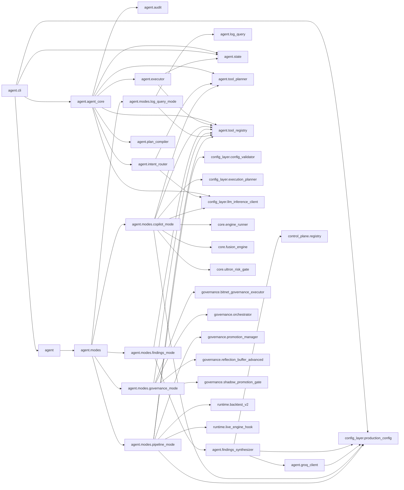
```mermaid
flowchart LR
    agent["agent"]
    agent_agent_core["agent.agent_core"]
    agent_audit["agent.audit"]
    agent_cli["agent.cli"]
    agent_executor["agent.executor"]
    agent_findings_synthesizer["agent.findings_synthesizer"]
    agent_groq_client["agent.groq_client"]
    agent_intent_router["agent.intent_router"]
    agent_log_query["agent.log_query"]
    agent_modes["agent.modes"]
    agent_modes_copilot_mode["agent.modes.copilot_mode"]
    agent_modes_findings_mode["agent.modes.findings_mode"]
    agent_modes_governance_mode["agent.modes.governance_mode"]
    agent_modes_log_query_mode["agent.modes.log_query_mode"]
    agent_modes_pipeline_mode["agent.modes.pipeline_mode"]
    agent_plan_compiler["agent.plan_compiler"]
    agent_state["agent.state"]
    agent_tool_planner["agent.tool_planner"]
    agent_tool_registry["agent.tool_registry"]
    config_layer_config_validator["config_layer.config_validator"]
    config_layer_execution_planner["config_layer.execution_planner"]
    config_layer_llm_inference_client["config_layer.llm_inference_client"]
    config_layer_production_config["config_layer.production_config"]
    control_plane_registry["control_plane.registry"]
    core_engine_runner["core.engine_runner"]
    core_fusion_engine["core.fusion_engine"]
    core_ultron_risk_gate["core.ultron_risk_gate"]
    governance_bitnet_governance_executor["governance.bitnet_governance_executor"]
    governance_orchestrator["governance.orchestrator"]
    governance_promotion_manager["governance.promotion_manager"]
    governance_reflection_buffer_advanced["governance.reflection_buffer_advanced"]
    governance_shadow_promotion_gate["governance.shadow_promotion_gate"]
    runtime_backtest_v2["runtime.backtest_v2"]
    runtime_live_engine_hook["runtime.live_engine_hook"]
    agent --> agent_modes
    agent_agent_core --> agent_audit
    agent_agent_core --> agent_executor
    agent_agent_core --> agent_intent_router
    agent_agent_core --> agent_plan_compiler
    agent_agent_core --> agent_state
    agent_agent_core --> agent_tool_planner
    agent_agent_core --> agent_tool_registry
    agent_agent_core --> config_layer_llm_inference_client
    agent_cli --> agent
    agent_cli --> agent_agent_core
    agent_cli --> agent_state
    agent_cli --> config_layer_production_config
    agent_executor --> agent_state
    agent_executor --> agent_tool_registry
    agent_findings_synthesizer --> agent_groq_client
    agent_findings_synthesizer --> config_layer_production_config
    agent_findings_synthesizer --> control_plane_registry
    agent_groq_client --> config_layer_production_config
    agent_intent_router --> agent_tool_planner
    agent_intent_router --> config_layer_llm_inference_client
    agent_modes --> agent_modes_copilot_mode
    agent_modes --> agent_modes_findings_mode
    agent_modes --> agent_modes_governance_mode
    agent_modes --> agent_modes_log_query_mode
    agent_modes --> agent_modes_pipeline_mode
    agent_modes_copilot_mode --> agent_tool_planner
    agent_modes_copilot_mode --> agent_tool_registry
    agent_modes_copilot_mode --> config_layer_execution_planner
    agent_modes_copilot_mode --> config_layer_llm_inference_client
    agent_modes_copilot_mode --> config_layer_production_config
    agent_modes_copilot_mode --> core_engine_runner
    agent_modes_copilot_mode --> core_fusion_engine
    agent_modes_copilot_mode --> core_ultron_risk_gate
    agent_modes_findings_mode --> agent_findings_synthesizer
    agent_modes_findings_mode --> agent_tool_registry
    agent_modes_governance_mode --> agent_tool_registry
    agent_modes_governance_mode --> governance_bitnet_governance_executor
    agent_modes_governance_mode --> governance_orchestrator
    agent_modes_governance_mode --> governance_reflection_buffer_advanced
    agent_modes_governance_mode --> governance_shadow_promotion_gate
    agent_modes_log_query_mode --> agent_log_query
    agent_modes_log_query_mode --> agent_tool_registry
    agent_modes_pipeline_mode --> agent_tool_registry
    agent_modes_pipeline_mode --> config_layer_config_validator
    agent_modes_pipeline_mode --> config_layer_production_config
    agent_modes_pipeline_mode --> governance_promotion_manager
    agent_modes_pipeline_mode --> runtime_backtest_v2
    agent_modes_pipeline_mode --> runtime_live_engine_hook
```

## analytics

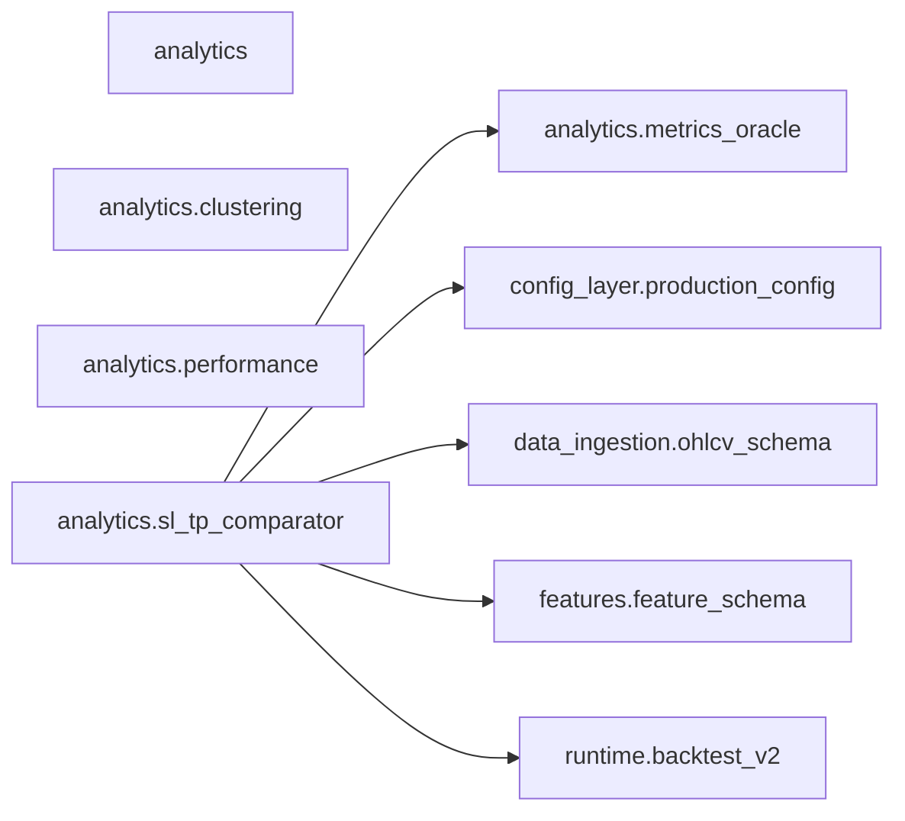
```mermaid
flowchart LR
    analytics["analytics"]
    analytics_clustering["analytics.clustering"]
    analytics_metrics_oracle["analytics.metrics_oracle"]
    analytics_performance["analytics.performance"]
    analytics_sl_tp_comparator["analytics.sl_tp_comparator"]
    config_layer_production_config["config_layer.production_config"]
    data_ingestion_ohlcv_schema["data_ingestion.ohlcv_schema"]
    features_feature_schema["features.feature_schema"]
    runtime_backtest_v2["runtime.backtest_v2"]
    analytics_sl_tp_comparator --> analytics_metrics_oracle
    analytics_sl_tp_comparator --> config_layer_production_config
    analytics_sl_tp_comparator --> data_ingestion_ohlcv_schema
    analytics_sl_tp_comparator --> features_feature_schema
    analytics_sl_tp_comparator --> runtime_backtest_v2
```

## bitnet

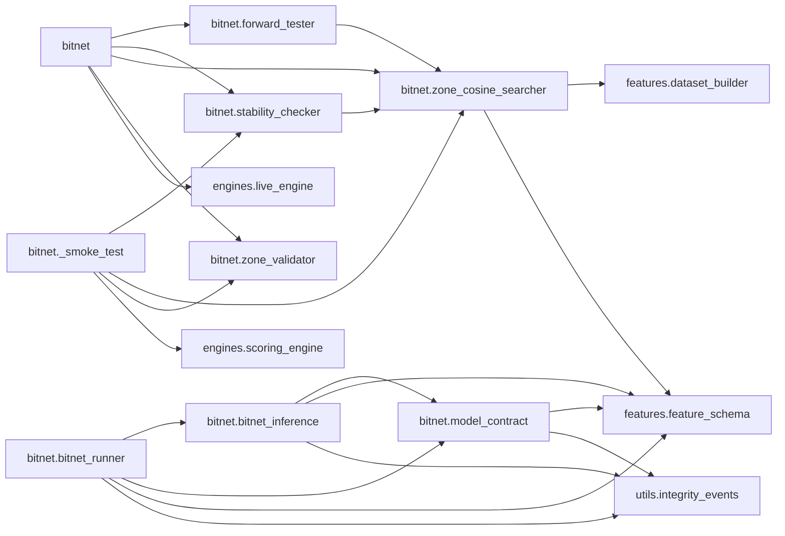
```mermaid
flowchart LR
    bitnet["bitnet"]
    bitnet__smoke_test["bitnet._smoke_test"]
    bitnet_bitnet_inference["bitnet.bitnet_inference"]
    bitnet_bitnet_runner["bitnet.bitnet_runner"]
    bitnet_forward_tester["bitnet.forward_tester"]
    bitnet_model_contract["bitnet.model_contract"]
    bitnet_stability_checker["bitnet.stability_checker"]
    bitnet_zone_cosine_searcher["bitnet.zone_cosine_searcher"]
    bitnet_zone_validator["bitnet.zone_validator"]
    engines_live_engine["engines.live_engine"]
    engines_scoring_engine["engines.scoring_engine"]
    features_dataset_builder["features.dataset_builder"]
    features_feature_schema["features.feature_schema"]
    utils_integrity_events["utils.integrity_events"]
    bitnet --> bitnet_forward_tester
    bitnet --> bitnet_stability_checker
    bitnet --> bitnet_zone_cosine_searcher
    bitnet --> bitnet_zone_validator
    bitnet --> engines_live_engine
    bitnet__smoke_test --> bitnet_stability_checker
    bitnet__smoke_test --> bitnet_zone_cosine_searcher
    bitnet__smoke_test --> bitnet_zone_validator
    bitnet__smoke_test --> engines_scoring_engine
    bitnet_bitnet_inference --> bitnet_model_contract
    bitnet_bitnet_inference --> features_feature_schema
    bitnet_bitnet_inference --> utils_integrity_events
    bitnet_bitnet_runner --> bitnet_bitnet_inference
    bitnet_bitnet_runner --> bitnet_model_contract
    bitnet_bitnet_runner --> features_feature_schema
    bitnet_bitnet_runner --> utils_integrity_events
    bitnet_forward_tester --> bitnet_zone_cosine_searcher
    bitnet_model_contract --> features_feature_schema
    bitnet_model_contract --> utils_integrity_events
    bitnet_stability_checker --> bitnet_zone_cosine_searcher
    bitnet_zone_cosine_searcher --> features_dataset_builder
    bitnet_zone_cosine_searcher --> features_feature_schema
```

## cognitive

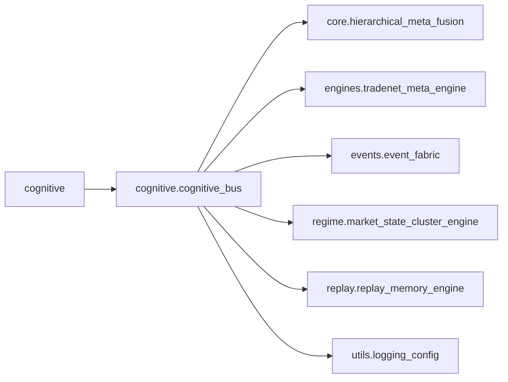
```mermaid
flowchart LR
    cognitive["cognitive"]
    cognitive_cognitive_bus["cognitive.cognitive_bus"]
    core_hierarchical_meta_fusion["core.hierarchical_meta_fusion"]
    engines_tradenet_meta_engine["engines.tradenet_meta_engine"]
    events_event_fabric["events.event_fabric"]
    regime_market_state_cluster_engine["regime.market_state_cluster_engine"]
    replay_replay_memory_engine["replay.replay_memory_engine"]
    utils_logging_config["utils.logging_config"]
    cognitive --> cognitive_cognitive_bus
    cognitive_cognitive_bus --> core_hierarchical_meta_fusion
    cognitive_cognitive_bus --> engines_tradenet_meta_engine
    cognitive_cognitive_bus --> events_event_fabric
    cognitive_cognitive_bus --> regime_market_state_cluster_engine
    cognitive_cognitive_bus --> replay_replay_memory_engine
    cognitive_cognitive_bus --> utils_logging_config
```

## config_layer

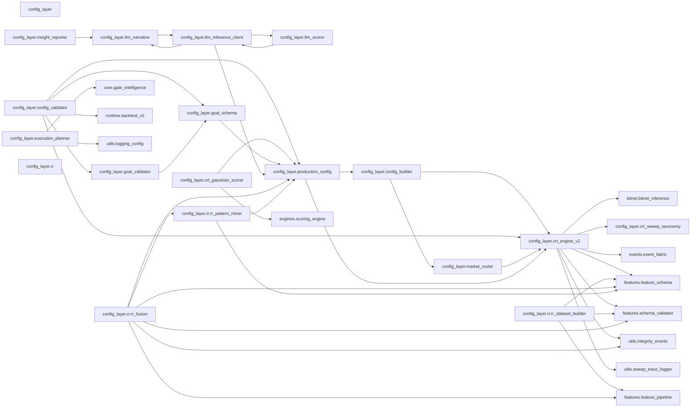
```mermaid
flowchart LR
    config_layer["config_layer"]
    config_layer_config_builder["config_layer.config_builder"]
    config_layer_config_validator["config_layer.config_validator"]
    config_layer_crt_engine_v2["config_layer.crt_engine_v2"]
    config_layer_crt_gaussian_scorer["config_layer.crt_gaussian_scorer"]
    config_layer_crt_sweep_taxonomy["config_layer.crt_sweep_taxonomy"]
    config_layer_execution_planner["config_layer.execution_planner"]
    config_layer_goal_schema["config_layer.goal_schema"]
    config_layer_goal_validator["config_layer.goal_validator"]
    config_layer_insight_reporter["config_layer.insight_reporter"]
    config_layer_llm_inference_client["config_layer.llm_inference_client"]
    config_layer_llm_narrative["config_layer.llm_narrative"]
    config_layer_llm_scorer["config_layer.llm_scorer"]
    config_layer_market_router["config_layer.market_router"]
    config_layer_production_config["config_layer.production_config"]
    config_layer_rr["config_layer.rr"]
    config_layer_rr_rr_dataset_builder["config_layer.rr.rr_dataset_builder"]
    config_layer_rr_rr_fusion["config_layer.rr.rr_fusion"]
    config_layer_rr_rr_pattern_miner["config_layer.rr.rr_pattern_miner"]
    bitnet_bitnet_inference["bitnet.bitnet_inference"]
    core_gate_intelligence["core.gate_intelligence"]
    engines_scoring_engine["engines.scoring_engine"]
    events_event_fabric["events.event_fabric"]
    features_feature_pipeline["features.feature_pipeline"]
    features_feature_schema["features.feature_schema"]
    features_schema_validator["features.schema_validator"]
    runtime_backtest_v2["runtime.backtest_v2"]
    utils_integrity_events["utils.integrity_events"]
    utils_logging_config["utils.logging_config"]
    utils_sweep_trace_logger["utils.sweep_trace_logger"]
    config_layer_config_builder --> config_layer_crt_engine_v2
    config_layer_config_builder --> config_layer_market_router
    config_layer_config_validator --> config_layer_crt_engine_v2
    config_layer_config_validator --> config_layer_goal_schema
    config_layer_config_validator --> config_layer_goal_validator
    config_layer_config_validator --> config_layer_production_config
    config_layer_config_validator --> runtime_backtest_v2
    config_layer_crt_engine_v2 --> bitnet_bitnet_inference
    config_layer_crt_engine_v2 --> config_layer_crt_sweep_taxonomy
    config_layer_crt_engine_v2 --> events_event_fabric
    config_layer_crt_engine_v2 --> features_feature_schema
    config_layer_crt_engine_v2 --> features_schema_validator
    config_layer_crt_engine_v2 --> utils_integrity_events
    config_layer_crt_engine_v2 --> utils_sweep_trace_logger
    config_layer_crt_gaussian_scorer --> config_layer_production_config
    config_layer_crt_gaussian_scorer --> engines_scoring_engine
    config_layer_execution_planner --> core_gate_intelligence
    config_layer_execution_planner --> utils_logging_config
    config_layer_goal_schema --> config_layer_production_config
    config_layer_goal_validator --> config_layer_goal_schema
    config_layer_insight_reporter --> config_layer_llm_narrative
    config_layer_llm_inference_client --> config_layer_llm_narrative
    config_layer_llm_inference_client --> config_layer_llm_scorer
    config_layer_llm_inference_client --> config_layer_production_config
    config_layer_llm_narrative --> config_layer_llm_inference_client
    config_layer_llm_scorer --> config_layer_llm_inference_client
    config_layer_market_router --> config_layer_crt_engine_v2
    config_layer_production_config --> config_layer_config_builder
    config_layer_production_config --> config_layer_crt_engine_v2
    config_layer_rr_rr_dataset_builder --> features_feature_pipeline
    config_layer_rr_rr_dataset_builder --> features_feature_schema
    config_layer_rr_rr_dataset_builder --> features_schema_validator
    config_layer_rr_rr_fusion --> config_layer_production_config
    config_layer_rr_rr_fusion --> config_layer_rr_rr_pattern_miner
    config_layer_rr_rr_fusion --> features_feature_pipeline
    config_layer_rr_rr_fusion --> features_feature_schema
    config_layer_rr_rr_fusion --> features_schema_validator
    config_layer_rr_rr_fusion --> utils_integrity_events
    config_layer_rr_rr_pattern_miner --> config_layer_production_config
    config_layer_rr_rr_pattern_miner --> features_feature_schema
```

## control_plane

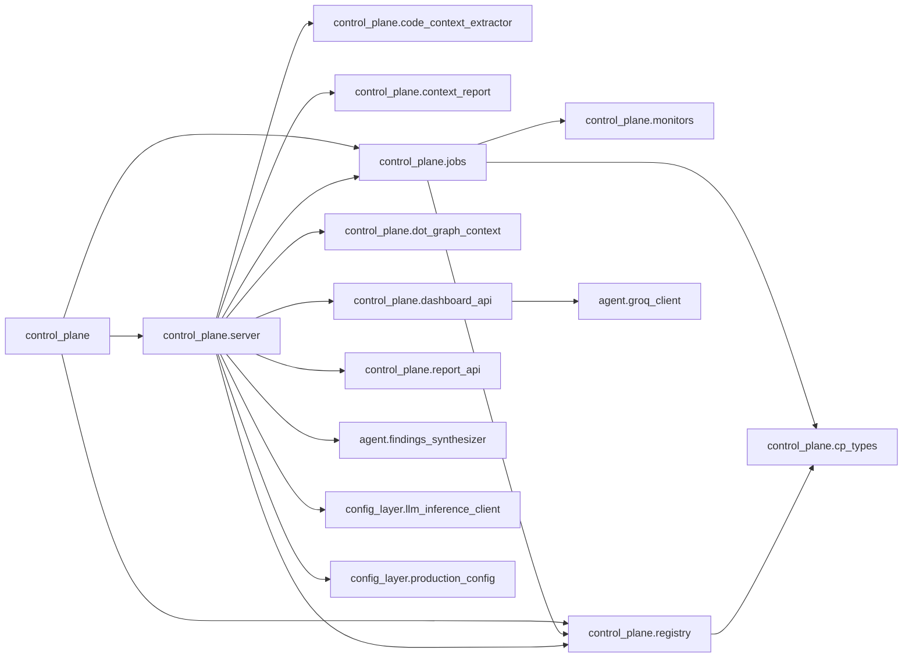
```mermaid
flowchart LR
    control_plane["control_plane"]
    control_plane_code_context_extractor["control_plane.code_context_extractor"]
    control_plane_context_report["control_plane.context_report"]
    control_plane_cp_types["control_plane.cp_types"]
    control_plane_dashboard_api["control_plane.dashboard_api"]
    control_plane_dot_graph_context["control_plane.dot_graph_context"]
    control_plane_jobs["control_plane.jobs"]
    control_plane_monitors["control_plane.monitors"]
    control_plane_registry["control_plane.registry"]
    control_plane_report_api["control_plane.report_api"]
    control_plane_server["control_plane.server"]
    agent_findings_synthesizer["agent.findings_synthesizer"]
    agent_groq_client["agent.groq_client"]
    config_layer_llm_inference_client["config_layer.llm_inference_client"]
    config_layer_production_config["config_layer.production_config"]
    control_plane --> control_plane_jobs
    control_plane --> control_plane_registry
    control_plane --> control_plane_server
    control_plane_dashboard_api --> agent_groq_client
    control_plane_jobs --> control_plane_cp_types
    control_plane_jobs --> control_plane_monitors
    control_plane_jobs --> control_plane_registry
    control_plane_registry --> control_plane_cp_types
    control_plane_server --> agent_findings_synthesizer
    control_plane_server --> config_layer_llm_inference_client
    control_plane_server --> config_layer_production_config
    control_plane_server --> control_plane_code_context_extractor
    control_plane_server --> control_plane_context_report
    control_plane_server --> control_plane_dashboard_api
    control_plane_server --> control_plane_dot_graph_context
    control_plane_server --> control_plane_jobs
    control_plane_server --> control_plane_registry
    control_plane_server --> control_plane_report_api
```

## core

```mermaid
flowchart LR
    core["core"]
    core_acceptance_controller["core.acceptance_controller"]
    core_backtest_port["core.backtest_port"]
    core_collector["core.collector"]
    core_convergence_controller["core.convergence_controller"]
    core_decision_engine["core.decision_engine"]
    core_dynamic_threshold["core.dynamic_threshold"]
    core_engine_runner["core.engine_runner"]
    core_feature_store["core.feature_store"]
    core_fusion_engine["core.fusion_engine"]
    core_gate_intelligence["core.gate_intelligence"]
    core_governance_mode["core.governance_mode"]
    core_hierarchical_meta_fusion["core.hierarchical_meta_fusion"]
    core_model_registry["core.model_registry"]
    core_regime_governor["core.regime_governor"]
    core_signal_audit["core.signal_audit"]
    core_signal_belief_tracker["core.signal_belief_tracker"]
    core_types["core.types"]
    core_ultron_risk_gate["core.ultron_risk_gate"]
    core_ultron_risk_gate_wrapper["core.ultron_risk_gate_wrapper"]
    cognitive_cognitive_bus["cognitive.cognitive_bus"]
    config_layer_production_config["config_layer.production_config"]
    config_layer_rr_rr_fusion["config_layer.rr.rr_fusion"]
    engines_crt_engine["engines.crt_engine"]
    engines_heuristic_gaussian_engine["engines.heuristic_gaussian_engine"]
    engines_live_engine["engines.live_engine"]
    engines_ml_gaussian_engine["engines.ml_gaussian_engine"]
    engines_rr_engine["engines.rr_engine"]
    engines_trap_validator_engine["engines.trap_validator_engine"]
    engines_zone_gate_engine["engines.zone_gate_engine"]
    events_event_fabric["events.event_fabric"]
    features_feature_pipeline["features.feature_pipeline"]
    features_feature_schema["features.feature_schema"]
    features_schema_validator["features.schema_validator"]
    runtime_backtest_v2["runtime.backtest_v2"]
    training_evaluator["training.evaluator"]
    utils_integrity_events["utils.integrity_events"]
    utils_logging_config["utils.logging_config"]
    core_acceptance_controller --> config_layer_production_config
    core_backtest_port --> runtime_backtest_v2
    core_collector --> config_layer_production_config
    core_collector --> utils_logging_config
    core_convergence_controller --> config_layer_production_config
    core_decision_engine --> core_dynamic_threshold
    core_engine_runner --> cognitive_cognitive_bus
    core_engine_runner --> config_layer_production_config
    core_engine_runner --> config_layer_rr_rr_fusion
    core_engine_runner --> core_acceptance_controller
    core_engine_runner --> core_collector
    core_engine_runner --> core_convergence_controller
    core_engine_runner --> core_decision_engine
    core_engine_runner --> core_fusion_engine
    core_engine_runner --> core_regime_governor
    core_engine_runner --> core_signal_audit
    core_engine_runner --> engines_crt_engine
    core_engine_runner --> engines_heuristic_gaussian_engine
    core_engine_runner --> engines_live_engine
    core_engine_runner --> engines_ml_gaussian_engine
    core_engine_runner --> engines_rr_engine
    core_engine_runner --> engines_trap_validator_engine
    core_engine_runner --> engines_zone_gate_engine
    core_engine_runner --> events_event_fabric
    core_engine_runner --> utils_logging_config
    core_feature_store --> features_feature_schema
    core_feature_store --> features_schema_validator
    core_fusion_engine --> utils_integrity_events
    core_gate_intelligence --> utils_logging_config
    core_governance_mode --> config_layer_production_config
    core_hierarchical_meta_fusion --> utils_logging_config
    core_model_registry --> config_layer_production_config
    core_model_registry --> features_feature_pipeline
    core_model_registry --> features_feature_schema
    core_model_registry --> training_evaluator
    core_model_registry --> utils_integrity_events
    core_regime_governor --> config_layer_production_config
    core_ultron_risk_gate --> utils_logging_config
```

## data_ingestion

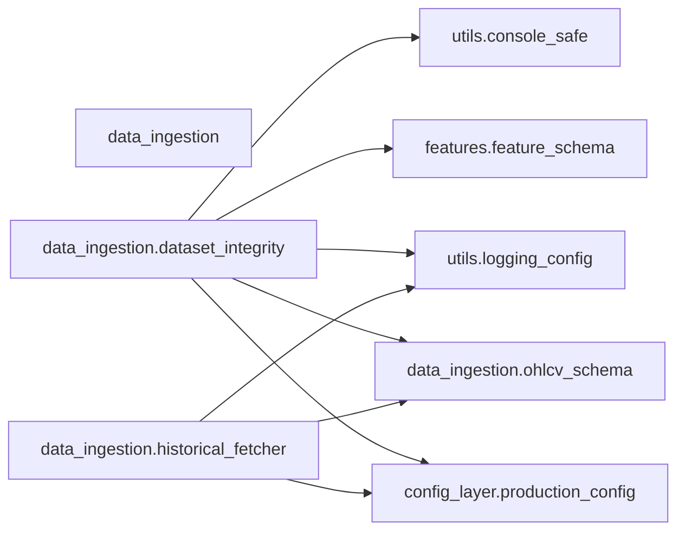
```mermaid
flowchart LR
    data_ingestion["data_ingestion"]
    data_ingestion_dataset_integrity["data_ingestion.dataset_integrity"]
    data_ingestion_historical_fetcher["data_ingestion.historical_fetcher"]
    data_ingestion_ohlcv_schema["data_ingestion.ohlcv_schema"]
    config_layer_production_config["config_layer.production_config"]
    features_feature_schema["features.feature_schema"]
    utils_console_safe["utils.console_safe"]
    utils_logging_config["utils.logging_config"]
    data_ingestion_dataset_integrity --> config_layer_production_config
    data_ingestion_dataset_integrity --> data_ingestion_ohlcv_schema
    data_ingestion_dataset_integrity --> features_feature_schema
    data_ingestion_dataset_integrity --> utils_console_safe
    data_ingestion_dataset_integrity --> utils_logging_config
    data_ingestion_historical_fetcher --> config_layer_production_config
    data_ingestion_historical_fetcher --> data_ingestion_ohlcv_schema
    data_ingestion_historical_fetcher --> utils_logging_config
```

## engines

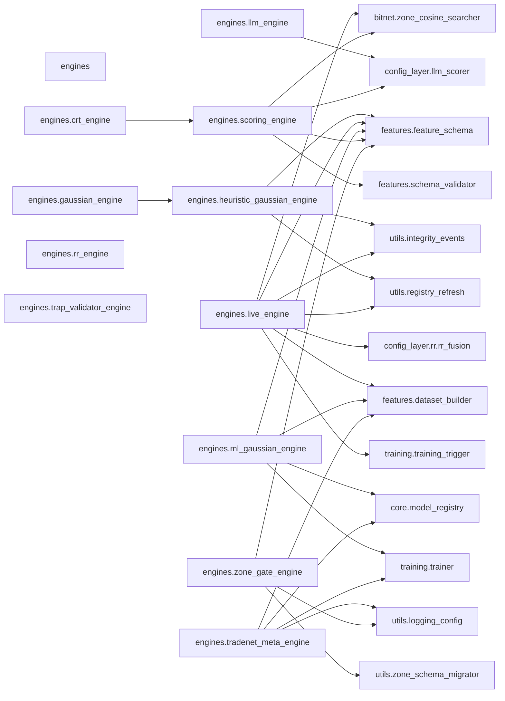
```mermaid
flowchart LR
    engines["engines"]
    engines_crt_engine["engines.crt_engine"]
    engines_gaussian_engine["engines.gaussian_engine"]
    engines_heuristic_gaussian_engine["engines.heuristic_gaussian_engine"]
    engines_live_engine["engines.live_engine"]
    engines_llm_engine["engines.llm_engine"]
    engines_ml_gaussian_engine["engines.ml_gaussian_engine"]
    engines_rr_engine["engines.rr_engine"]
    engines_scoring_engine["engines.scoring_engine"]
    engines_tradenet_meta_engine["engines.tradenet_meta_engine"]
    engines_trap_validator_engine["engines.trap_validator_engine"]
    engines_zone_gate_engine["engines.zone_gate_engine"]
    bitnet_zone_cosine_searcher["bitnet.zone_cosine_searcher"]
    config_layer_llm_scorer["config_layer.llm_scorer"]
    config_layer_rr_rr_fusion["config_layer.rr.rr_fusion"]
    core_model_registry["core.model_registry"]
    features_dataset_builder["features.dataset_builder"]
    features_feature_schema["features.feature_schema"]
    features_schema_validator["features.schema_validator"]
    training_trainer["training.trainer"]
    training_training_trigger["training.training_trigger"]
    utils_integrity_events["utils.integrity_events"]
    utils_logging_config["utils.logging_config"]
    utils_registry_refresh["utils.registry_refresh"]
    utils_zone_schema_migrator["utils.zone_schema_migrator"]
    engines_crt_engine --> engines_scoring_engine
    engines_gaussian_engine --> engines_heuristic_gaussian_engine
    engines_heuristic_gaussian_engine --> features_feature_schema
    engines_heuristic_gaussian_engine --> utils_integrity_events
    engines_heuristic_gaussian_engine --> utils_registry_refresh
    engines_live_engine --> bitnet_zone_cosine_searcher
    engines_live_engine --> config_layer_rr_rr_fusion
    engines_live_engine --> features_dataset_builder
    engines_live_engine --> features_feature_schema
    engines_live_engine --> training_training_trigger
    engines_live_engine --> utils_integrity_events
    engines_live_engine --> utils_registry_refresh
    engines_llm_engine --> config_layer_llm_scorer
    engines_ml_gaussian_engine --> core_model_registry
    engines_ml_gaussian_engine --> features_dataset_builder
    engines_ml_gaussian_engine --> features_feature_schema
    engines_ml_gaussian_engine --> training_trainer
    engines_scoring_engine --> bitnet_zone_cosine_searcher
    engines_scoring_engine --> config_layer_llm_scorer
    engines_scoring_engine --> features_feature_schema
    engines_scoring_engine --> features_schema_validator
    engines_tradenet_meta_engine --> core_model_registry
    engines_tradenet_meta_engine --> features_dataset_builder
    engines_tradenet_meta_engine --> training_trainer
    engines_tradenet_meta_engine --> utils_logging_config
    engines_zone_gate_engine --> features_feature_schema
    engines_zone_gate_engine --> utils_logging_config
    engines_zone_gate_engine --> utils_zone_schema_migrator
```

## events

```mermaid
flowchart LR
    events["events"]
    events_event_fabric["events.event_fabric"]
    features_feature_schema["features.feature_schema"]
    events --> events_event_fabric
    events_event_fabric --> features_feature_schema
```

## execution

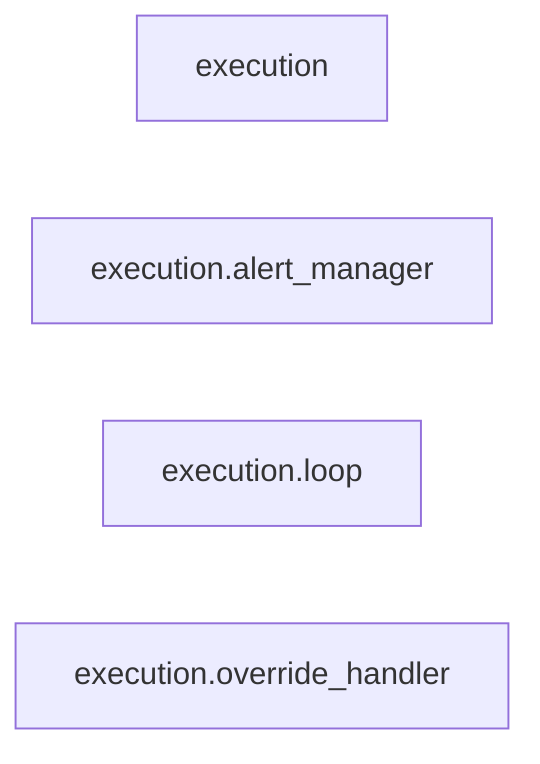
```mermaid
flowchart LR
    execution["execution"]
    execution_alert_manager["execution.alert_manager"]
    execution_loop["execution.loop"]
    execution_override_handler["execution.override_handler"]
```

## expansion

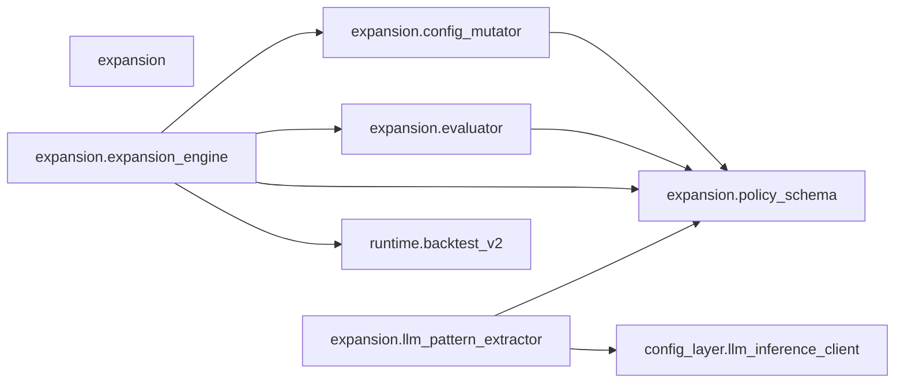
```mermaid
flowchart LR
    expansion["expansion"]
    expansion_config_mutator["expansion.config_mutator"]
    expansion_evaluator["expansion.evaluator"]
    expansion_expansion_engine["expansion.expansion_engine"]
    expansion_llm_pattern_extractor["expansion.llm_pattern_extractor"]
    expansion_policy_schema["expansion.policy_schema"]
    config_layer_llm_inference_client["config_layer.llm_inference_client"]
    runtime_backtest_v2["runtime.backtest_v2"]
    expansion_config_mutator --> expansion_policy_schema
    expansion_evaluator --> expansion_policy_schema
    expansion_expansion_engine --> expansion_config_mutator
    expansion_expansion_engine --> expansion_evaluator
    expansion_expansion_engine --> expansion_policy_schema
    expansion_expansion_engine --> runtime_backtest_v2
    expansion_llm_pattern_extractor --> config_layer_llm_inference_client
    expansion_llm_pattern_extractor --> expansion_policy_schema
```

## features

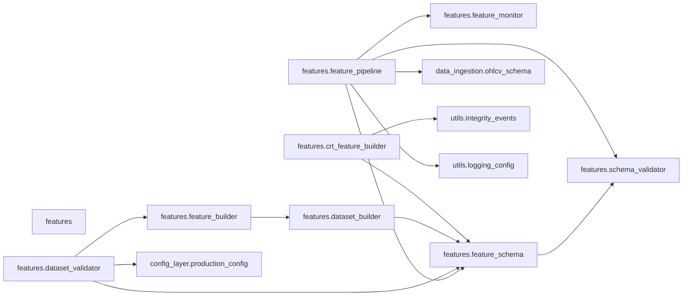
```mermaid
flowchart LR
    features["features"]
    features_crt_feature_builder["features.crt_feature_builder"]
    features_dataset_builder["features.dataset_builder"]
    features_dataset_validator["features.dataset_validator"]
    features_feature_builder["features.feature_builder"]
    features_feature_monitor["features.feature_monitor"]
    features_feature_pipeline["features.feature_pipeline"]
    features_feature_schema["features.feature_schema"]
    features_schema_validator["features.schema_validator"]
    config_layer_production_config["config_layer.production_config"]
    data_ingestion_ohlcv_schema["data_ingestion.ohlcv_schema"]
    utils_integrity_events["utils.integrity_events"]
    utils_logging_config["utils.logging_config"]
    features_crt_feature_builder --> features_feature_schema
    features_crt_feature_builder --> utils_integrity_events
    features_dataset_builder --> features_feature_schema
    features_dataset_validator --> config_layer_production_config
    features_dataset_validator --> features_feature_builder
    features_dataset_validator --> features_feature_schema
    features_feature_builder --> features_dataset_builder
    features_feature_pipeline --> data_ingestion_ohlcv_schema
    features_feature_pipeline --> features_feature_monitor
    features_feature_pipeline --> features_feature_schema
    features_feature_pipeline --> features_schema_validator
    features_feature_pipeline --> utils_logging_config
    features_feature_schema --> features_schema_validator
```

## feedback

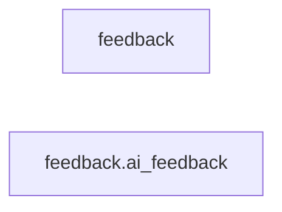
```mermaid
flowchart LR
    feedback["feedback"]
    feedback_ai_feedback["feedback.ai_feedback"]
```

## governance

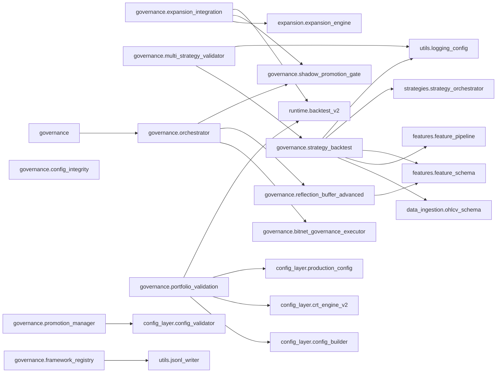
```mermaid
flowchart LR
    governance["governance"]
    governance_bitnet_governance_executor["governance.bitnet_governance_executor"]
    governance_config_integrity["governance.config_integrity"]
    governance_expansion_integration["governance.expansion_integration"]
    governance_framework_registry["governance.framework_registry"]
    governance_multi_strategy_validator["governance.multi_strategy_validator"]
    governance_orchestrator["governance.orchestrator"]
    governance_portfolio_validation["governance.portfolio_validation"]
    governance_promotion_manager["governance.promotion_manager"]
    governance_reflection_buffer_advanced["governance.reflection_buffer_advanced"]
    governance_shadow_promotion_gate["governance.shadow_promotion_gate"]
    governance_strategy_backtest["governance.strategy_backtest"]
    config_layer_config_builder["config_layer.config_builder"]
    config_layer_config_validator["config_layer.config_validator"]
    config_layer_crt_engine_v2["config_layer.crt_engine_v2"]
    config_layer_production_config["config_layer.production_config"]
    data_ingestion_ohlcv_schema["data_ingestion.ohlcv_schema"]
    expansion_expansion_engine["expansion.expansion_engine"]
    features_feature_pipeline["features.feature_pipeline"]
    features_feature_schema["features.feature_schema"]
    runtime_backtest_v2["runtime.backtest_v2"]
    strategies_strategy_orchestrator["strategies.strategy_orchestrator"]
    utils_jsonl_writer["utils.jsonl_writer"]
    utils_logging_config["utils.logging_config"]
    governance --> governance_orchestrator
    governance_expansion_integration --> expansion_expansion_engine
    governance_expansion_integration --> governance_shadow_promotion_gate
    governance_expansion_integration --> runtime_backtest_v2
    governance_framework_registry --> utils_jsonl_writer
    governance_multi_strategy_validator --> governance_strategy_backtest
    governance_multi_strategy_validator --> utils_logging_config
    governance_orchestrator --> governance_bitnet_governance_executor
    governance_orchestrator --> governance_reflection_buffer_advanced
    governance_orchestrator --> governance_shadow_promotion_gate
    governance_portfolio_validation --> config_layer_config_builder
    governance_portfolio_validation --> config_layer_crt_engine_v2
    governance_portfolio_validation --> config_layer_production_config
    governance_portfolio_validation --> runtime_backtest_v2
    governance_promotion_manager --> config_layer_config_validator
    governance_reflection_buffer_advanced --> features_feature_schema
    governance_strategy_backtest --> data_ingestion_ohlcv_schema
    governance_strategy_backtest --> features_feature_pipeline
    governance_strategy_backtest --> features_feature_schema
    governance_strategy_backtest --> strategies_strategy_orchestrator
    governance_strategy_backtest --> utils_logging_config
```

## inout

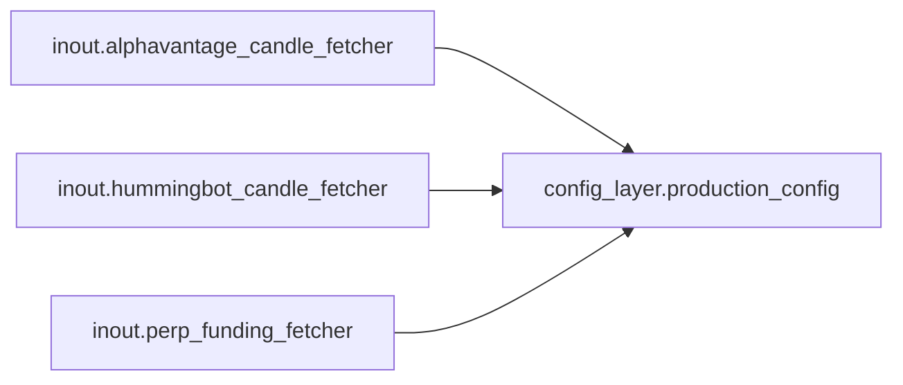
```mermaid
flowchart LR
    inout_alphavantage_candle_fetcher["inout.alphavantage_candle_fetcher"]
    inout_hummingbot_candle_fetcher["inout.hummingbot_candle_fetcher"]
    inout_perp_funding_fetcher["inout.perp_funding_fetcher"]
    config_layer_production_config["config_layer.production_config"]
    inout_alphavantage_candle_fetcher --> config_layer_production_config
    inout_hummingbot_candle_fetcher --> config_layer_production_config
    inout_perp_funding_fetcher --> config_layer_production_config
```

## interpreters

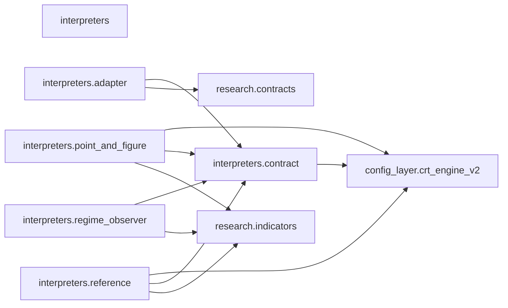
```mermaid
flowchart LR
    interpreters["interpreters"]
    interpreters_adapter["interpreters.adapter"]
    interpreters_contract["interpreters.contract"]
    interpreters_point_and_figure["interpreters.point_and_figure"]
    interpreters_reference["interpreters.reference"]
    interpreters_regime_observer["interpreters.regime_observer"]
    config_layer_crt_engine_v2["config_layer.crt_engine_v2"]
    research_contracts["research.contracts"]
    research_indicators["research.indicators"]
    interpreters_adapter --> interpreters_contract
    interpreters_adapter --> research_contracts
    interpreters_contract --> config_layer_crt_engine_v2
    interpreters_point_and_figure --> config_layer_crt_engine_v2
    interpreters_point_and_figure --> interpreters_contract
    interpreters_point_and_figure --> research_indicators
    interpreters_reference --> config_layer_crt_engine_v2
    interpreters_reference --> interpreters_contract
    interpreters_reference --> research_indicators
    interpreters_regime_observer --> interpreters_contract
    interpreters_regime_observer --> research_indicators
```

## journal

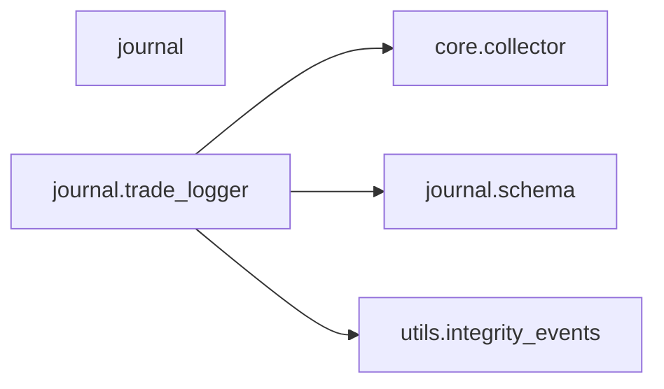
```mermaid
flowchart LR
    journal["journal"]
    journal_schema["journal.schema"]
    journal_trade_logger["journal.trade_logger"]
    core_collector["core.collector"]
    utils_integrity_events["utils.integrity_events"]
    journal_trade_logger --> core_collector
    journal_trade_logger --> journal_schema
    journal_trade_logger --> utils_integrity_events
```

## live

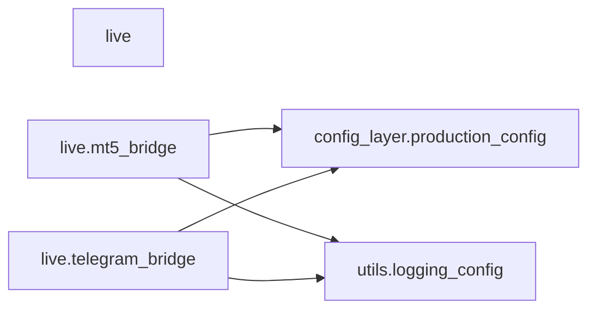
```mermaid
flowchart LR
    live["live"]
    live_mt5_bridge["live.mt5_bridge"]
    live_telegram_bridge["live.telegram_bridge"]
    config_layer_production_config["config_layer.production_config"]
    utils_logging_config["utils.logging_config"]
    live_mt5_bridge --> config_layer_production_config
    live_mt5_bridge --> utils_logging_config
    live_telegram_bridge --> config_layer_production_config
    live_telegram_bridge --> utils_logging_config
```

## llm_research

```mermaid
flowchart LR
    llm_research["llm_research"]
    llm_research_evaluator["llm_research.evaluator"]
    llm_research_forward_tester["llm_research.forward_tester"]
    llm_research_pattern_extractor["llm_research.pattern_extractor"]
    llm_research_policy_builder["llm_research.policy_builder"]
    config_layer_execution_planner["config_layer.execution_planner"]
    config_layer_llm_inference_client["config_layer.llm_inference_client"]
    core_engine_runner["core.engine_runner"]
    llm_research_evaluator --> llm_research_forward_tester
    llm_research_forward_tester --> config_layer_execution_planner
    llm_research_forward_tester --> core_engine_runner
    llm_research_pattern_extractor --> config_layer_llm_inference_client
    llm_research_policy_builder --> llm_research_pattern_extractor
```

## monitoring

```mermaid
flowchart LR
    monitoring["monitoring"]
    monitoring_health_checker["monitoring.health_checker"]
    config_layer_production_config["config_layer.production_config"]
    live_mt5_bridge["live.mt5_bridge"]
    live_telegram_bridge["live.telegram_bridge"]
    strategies_strategy_orchestrator["strategies.strategy_orchestrator"]
    uat_kill_switch["uat.kill_switch"]
    utils_logging_config["utils.logging_config"]
    monitoring_health_checker --> config_layer_production_config
    monitoring_health_checker --> live_mt5_bridge
    monitoring_health_checker --> live_telegram_bridge
    monitoring_health_checker --> strategies_strategy_orchestrator
    monitoring_health_checker --> uat_kill_switch
    monitoring_health_checker --> utils_logging_config
```

## multi_llm

```mermaid
flowchart LR
    multi_llm["multi_llm"]
    multi_llm_context_pack["multi_llm.context_pack"]
    multi_llm_discussion["multi_llm.discussion"]
    multi_llm_tokens["multi_llm.tokens"]
    multi_llm_turn_ledger["multi_llm.turn_ledger"]
    events_event_fabric["events.event_fabric"]
    utils_jsonl_writer["utils.jsonl_writer"]
    multi_llm_context_pack --> multi_llm_tokens
    multi_llm_context_pack --> utils_jsonl_writer
    multi_llm_discussion --> multi_llm_turn_ledger
    multi_llm_turn_ledger --> events_event_fabric
    multi_llm_turn_ledger --> utils_jsonl_writer
```

## portfolio

```mermaid
flowchart LR
    portfolio["portfolio"]
    portfolio_allocator["portfolio.allocator"]
    portfolio_capital_policy["portfolio.capital_policy"]
    portfolio_correlation_engine["portfolio.correlation_engine"]
    portfolio_exposure_tracker["portfolio.exposure_tracker"]
    config_layer_production_config["config_layer.production_config"]
    data_ingestion_historical_fetcher["data_ingestion.historical_fetcher"]
    utils_integrity_events["utils.integrity_events"]
    portfolio_allocator --> portfolio_capital_policy
    portfolio_allocator --> portfolio_correlation_engine
    portfolio_allocator --> portfolio_exposure_tracker
    portfolio_correlation_engine --> config_layer_production_config
    portfolio_correlation_engine --> data_ingestion_historical_fetcher
    portfolio_correlation_engine --> utils_integrity_events
```

## regime

```mermaid
flowchart LR
    regime["regime"]
    regime_config_router["regime.config_router"]
    regime_market_state_cluster_engine["regime.market_state_cluster_engine"]
    regime_regime_classifier["regime.regime_classifier"]
    utils_logging_config["utils.logging_config"]
    regime_config_router --> regime_regime_classifier
    regime_market_state_cluster_engine --> utils_logging_config
```

## replay

```mermaid
flowchart LR
    replay["replay"]
    replay_replay_drift_governor["replay.replay_drift_governor"]
    replay_replay_memory_engine["replay.replay_memory_engine"]
    replay_replay_similarity_index["replay.replay_similarity_index"]
    replay_timing_advisor["replay.timing_advisor"]
    replay_timing_reconstructor["replay.timing_reconstructor"]
    data_ingestion_ohlcv_schema["data_ingestion.ohlcv_schema"]
    events_event_fabric["events.event_fabric"]
    utils_integrity_events["utils.integrity_events"]
    utils_logging_config["utils.logging_config"]
    utils_registry_refresh["utils.registry_refresh"]
    replay_replay_drift_governor --> events_event_fabric
    replay_replay_drift_governor --> utils_logging_config
    replay_replay_memory_engine --> utils_integrity_events
    replay_replay_memory_engine --> utils_registry_refresh
    replay_timing_reconstructor --> data_ingestion_ohlcv_schema
```

## research

```mermaid
flowchart LR
    research["research"]
    research_adapters["research.adapters"]
    research_adapters_spine_signal_source["research.adapters.spine_signal_source"]
    research_adapters_structural_event_source["research.adapters.structural_event_source"]
    research_cli["research.cli"]
    research_conditional_entropy_grid["research.conditional_entropy_grid"]
    research_config["research.config"]
    research_contracts["research.contracts"]
    research_controls["research.controls"]
    research_controls_always_long["research.controls.always_long"]
    research_controls_random_baseline["research.controls.random_baseline"]
    research_costs["research.costs"]
    research_cross_sectional["research.cross_sectional"]
    research_exit_grid["research.exit_grid"]
    research_forensics["research.forensics"]
    research_hypotheses["research.hypotheses"]
    research_hypotheses_expansion_breakout["research.hypotheses.expansion_breakout"]
    research_hypotheses_mean_reversion["research.hypotheses.mean_reversion"]
    research_hypotheses_spine_hypothesis["research.hypotheses.spine_hypothesis"]
    research_indicators["research.indicators"]
    research_measurement["research.measurement"]
    research_measurement_forward_walk["research.measurement.forward_walk"]
    research_measurement_metrics["research.measurement.metrics"]
    research_process_characterization["research.process_characterization"]
    research_process_diagnostics["research.process_diagnostics"]
    research_provenance["research.provenance"]
    research_qualification["research.qualification"]
    research_regime_conditioning["research.regime_conditioning"]
    research_registry["research.registry"]
    research_resample["research.resample"]
    research_runner["research.runner"]
    research_selection_effect["research.selection_effect"]
    research_structural_asymmetry["research.structural_asymmetry"]
    config_layer_crt_engine_v2["config_layer.crt_engine_v2"]
    config_layer_production_config["config_layer.production_config"]
    data_ingestion_ohlcv_schema["data_ingestion.ohlcv_schema"]
    runtime_backtest_v2["runtime.backtest_v2"]
    research_adapters --> research_adapters_spine_signal_source
    research_adapters_spine_signal_source --> config_layer_production_config
    research_adapters_spine_signal_source --> runtime_backtest_v2
    research_adapters_structural_event_source --> research_indicators
    research_adapters_structural_event_source --> runtime_backtest_v2
    research_cli --> research_config
    research_cli --> research_controls
    research_cli --> research_costs
    research_cli --> research_hypotheses
    research_cli --> research_measurement_metrics
    research_cli --> research_provenance
    research_cli --> research_qualification
    research_cli --> research_registry
    research_cli --> research_runner
    research_conditional_entropy_grid --> research_indicators
    research_conditional_entropy_grid --> research_process_diagnostics
    research_contracts --> config_layer_crt_engine_v2
    research_controls --> research_controls_always_long
    research_controls --> research_controls_random_baseline
    research_controls --> research_registry
    research_controls_always_long --> research_contracts
    research_controls_always_long --> research_indicators
    research_controls_random_baseline --> research_contracts
    research_controls_random_baseline --> research_indicators
    research_cross_sectional --> data_ingestion_ohlcv_schema
    research_cross_sectional --> research_costs
    research_cross_sectional --> research_qualification
    research_cross_sectional --> runtime_backtest_v2
    research_exit_grid --> research_contracts
    research_exit_grid --> research_costs
    research_exit_grid --> research_measurement_forward_walk
    research_forensics --> research_config
    research_forensics --> research_costs
    research_forensics --> research_indicators
    research_forensics --> research_measurement_forward_walk
    research_forensics --> research_provenance
    research_forensics --> research_registry
    research_forensics --> runtime_backtest_v2
    research_hypotheses --> research_hypotheses_expansion_breakout
    research_hypotheses --> research_hypotheses_mean_reversion
    research_hypotheses --> research_hypotheses_spine_hypothesis
    research_hypotheses_expansion_breakout --> research_contracts
    research_hypotheses_expansion_breakout --> research_indicators
    research_hypotheses_expansion_breakout --> research_registry
    research_hypotheses_mean_reversion --> research_contracts
    research_hypotheses_mean_reversion --> research_indicators
    research_hypotheses_mean_reversion --> research_registry
    research_hypotheses_spine_hypothesis --> research_adapters_spine_signal_source
    research_hypotheses_spine_hypothesis --> research_contracts
    research_hypotheses_spine_hypothesis --> research_indicators
    research_hypotheses_spine_hypothesis --> research_registry
    research_measurement --> research_measurement_forward_walk
    research_measurement --> research_measurement_metrics
    research_measurement_forward_walk --> research_contracts
    research_measurement_metrics --> research_contracts
    research_measurement_metrics --> research_costs
    research_process_characterization --> research_indicators
    research_process_diagnostics --> research_process_characterization
    research_qualification --> research_contracts
    research_qualification --> research_costs
    research_qualification --> research_measurement_metrics
    research_regime_conditioning --> research_contracts
    research_regime_conditioning --> research_costs
    research_regime_conditioning --> research_measurement_metrics
    research_regime_conditioning --> research_qualification
    research_registry --> research_contracts
    research_resample --> config_layer_crt_engine_v2
    research_runner --> research_config
    research_runner --> research_contracts
    research_runner --> research_costs
    research_runner --> research_measurement_forward_walk
    research_runner --> research_measurement_metrics
    research_runner --> research_provenance
    research_runner --> research_registry
    research_runner --> runtime_backtest_v2
```

## runtime

```mermaid
flowchart LR
    runtime["runtime"]
    runtime_analyze_fusion_shadow["runtime.analyze_fusion_shadow"]
    runtime_backtest_bitnet["runtime.backtest_bitnet"]
    runtime_backtest_v2["runtime.backtest_v2"]
    runtime_baseline_capture["runtime.baseline_capture"]
    runtime_exit_model_band["runtime.exit_model_band"]
    runtime_live_engine_hook["runtime.live_engine_hook"]
    runtime_unified_replay_harness["runtime.unified_replay_harness"]
    analytics_metrics_oracle["analytics.metrics_oracle"]
    bitnet_bitnet_inference["bitnet.bitnet_inference"]
    bitnet_bitnet_runner["bitnet.bitnet_runner"]
    config_layer_config_builder["config_layer.config_builder"]
    config_layer_crt_engine_v2["config_layer.crt_engine_v2"]
    config_layer_execution_planner["config_layer.execution_planner"]
    config_layer_goal_validator["config_layer.goal_validator"]
    config_layer_production_config["config_layer.production_config"]
    core_collector["core.collector"]
    core_engine_runner["core.engine_runner"]
    core_feature_store["core.feature_store"]
    core_gate_intelligence["core.gate_intelligence"]
    core_model_registry["core.model_registry"]
    core_signal_belief_tracker["core.signal_belief_tracker"]
    core_ultron_risk_gate["core.ultron_risk_gate"]
    core_ultron_risk_gate_wrapper["core.ultron_risk_gate_wrapper"]
    data_ingestion_dataset_integrity["data_ingestion.dataset_integrity"]
    data_ingestion_ohlcv_schema["data_ingestion.ohlcv_schema"]
    engines_live_engine["engines.live_engine"]
    features_feature_monitor["features.feature_monitor"]
    features_feature_pipeline["features.feature_pipeline"]
    features_feature_schema["features.feature_schema"]
    live_mt5_bridge["live.mt5_bridge"]
    live_telegram_bridge["live.telegram_bridge"]
    regime_config_router["regime.config_router"]
    regime_regime_classifier["regime.regime_classifier"]
    strategies_strategy_orchestrator["strategies.strategy_orchestrator"]
    training_training_trigger["training.training_trigger"]
    uat_kill_switch["uat.kill_switch"]
    utils_config_dumper["utils.config_dumper"]
    utils_console_safe["utils.console_safe"]
    utils_episode_summarizer["utils.episode_summarizer"]
    utils_integrity_events["utils.integrity_events"]
    utils_logging_config["utils.logging_config"]
    utils_pattern_hasher["utils.pattern_hasher"]
    utils_sweep_trace_logger["utils.sweep_trace_logger"]
    utils_trade_logger["utils.trade_logger"]
    runtime_analyze_fusion_shadow --> utils_console_safe
    runtime_analyze_fusion_shadow --> utils_integrity_events
    runtime_backtest_bitnet --> bitnet_bitnet_runner
    runtime_backtest_bitnet --> core_engine_runner
    runtime_backtest_bitnet --> features_feature_pipeline
    runtime_backtest_bitnet --> features_feature_schema
    runtime_backtest_bitnet --> utils_console_safe
    runtime_backtest_v2 --> bitnet_bitnet_inference
    runtime_backtest_v2 --> config_layer_config_builder
    runtime_backtest_v2 --> config_layer_crt_engine_v2
    runtime_backtest_v2 --> config_layer_goal_validator
    runtime_backtest_v2 --> config_layer_production_config
    runtime_backtest_v2 --> core_engine_runner
    runtime_backtest_v2 --> core_model_registry
    runtime_backtest_v2 --> core_signal_belief_tracker
    runtime_backtest_v2 --> data_ingestion_dataset_integrity
    runtime_backtest_v2 --> data_ingestion_ohlcv_schema
    runtime_backtest_v2 --> features_feature_monitor
    runtime_backtest_v2 --> features_feature_pipeline
    runtime_backtest_v2 --> features_feature_schema
    runtime_backtest_v2 --> strategies_strategy_orchestrator
    runtime_backtest_v2 --> training_training_trigger
    runtime_backtest_v2 --> utils_config_dumper
    runtime_backtest_v2 --> utils_console_safe
    runtime_backtest_v2 --> utils_episode_summarizer
    runtime_backtest_v2 --> utils_integrity_events
    runtime_backtest_v2 --> utils_logging_config
    runtime_backtest_v2 --> utils_pattern_hasher
    runtime_backtest_v2 --> utils_sweep_trace_logger
    runtime_backtest_v2 --> utils_trade_logger
    runtime_baseline_capture --> config_layer_production_config
    runtime_baseline_capture --> core_model_registry
    runtime_baseline_capture --> features_feature_schema
    runtime_baseline_capture --> utils_console_safe
    runtime_exit_model_band --> analytics_metrics_oracle
    runtime_exit_model_band --> runtime_backtest_v2
    runtime_live_engine_hook --> config_layer_execution_planner
    runtime_live_engine_hook --> config_layer_production_config
    runtime_live_engine_hook --> core_collector
    runtime_live_engine_hook --> core_engine_runner
    runtime_live_engine_hook --> core_feature_store
    runtime_live_engine_hook --> core_gate_intelligence
    runtime_live_engine_hook --> core_ultron_risk_gate
    runtime_live_engine_hook --> core_ultron_risk_gate_wrapper
    runtime_live_engine_hook --> engines_live_engine
    runtime_live_engine_hook --> features_feature_monitor
    runtime_live_engine_hook --> live_mt5_bridge
    runtime_live_engine_hook --> live_telegram_bridge
    runtime_live_engine_hook --> regime_config_router
    runtime_live_engine_hook --> regime_regime_classifier
    runtime_live_engine_hook --> strategies_strategy_orchestrator
    runtime_live_engine_hook --> uat_kill_switch
    runtime_live_engine_hook --> utils_config_dumper
    runtime_live_engine_hook --> utils_logging_config
    runtime_unified_replay_harness --> config_layer_config_builder
    runtime_unified_replay_harness --> runtime_backtest_bitnet
    runtime_unified_replay_harness --> runtime_backtest_v2
    runtime_unified_replay_harness --> utils_console_safe
```

## scanner

```mermaid
flowchart LR
    scanner["scanner"]
    scanner_ranker["scanner.ranker"]
    scanner_scanner["scanner.scanner"]
    scanner_signal_pool["scanner.signal_pool"]
    scanner_spine_adapter["scanner.spine_adapter"]
    scanner_universe["scanner.universe"]
```

## search

```mermaid
flowchart LR
    search_regime_weight_searcher["search.regime_weight_searcher"]
    config_layer_llm_inference_client["config_layer.llm_inference_client"]
    core_fusion_engine["core.fusion_engine"]
    expansion_policy_schema["expansion.policy_schema"]
    journal_trade_logger["journal.trade_logger"]
    search_regime_weight_searcher --> config_layer_llm_inference_client
    search_regime_weight_searcher --> core_fusion_engine
    search_regime_weight_searcher --> expansion_policy_schema
    search_regime_weight_searcher --> journal_trade_logger
```

## strategies

```mermaid
flowchart LR
    strategies["strategies"]
    strategies_base_strategy["strategies.base_strategy"]
    strategies_intent_builder["strategies.intent_builder"]
    strategies_s01_crt_wrapper["strategies.s01_crt_wrapper"]
    strategies_s02_mean_reversion["strategies.s02_mean_reversion"]
    strategies_s03_breakout["strategies.s03_breakout"]
    strategies_s04_stat_arb["strategies.s04_stat_arb"]
    strategies_s05_grid["strategies.s05_grid"]
    strategies_s06_scalping["strategies.s06_scalping"]
    strategies_s07_news_sentiment["strategies.s07_news_sentiment"]
    strategies_s08_ml_ensemble["strategies.s08_ml_ensemble"]
    strategies_s09_pattern_recog["strategies.s09_pattern_recog"]
    strategies_s10_trap_strategy["strategies.s10_trap_strategy"]
    strategies_strategy_intent["strategies.strategy_intent"]
    strategies_strategy_orchestrator["strategies.strategy_orchestrator"]
    strategies_strategy_result["strategies.strategy_result"]
    bitnet_bitnet_inference["bitnet.bitnet_inference"]
    config_layer_production_config["config_layer.production_config"]
    engines_crt_engine["engines.crt_engine"]
    utils_logging_config["utils.logging_config"]
    strategies --> strategies_base_strategy
    strategies --> strategies_s01_crt_wrapper
    strategies --> strategies_s02_mean_reversion
    strategies --> strategies_s03_breakout
    strategies --> strategies_s04_stat_arb
    strategies --> strategies_s05_grid
    strategies --> strategies_s06_scalping
    strategies --> strategies_s07_news_sentiment
    strategies --> strategies_s08_ml_ensemble
    strategies --> strategies_s09_pattern_recog
    strategies --> strategies_s10_trap_strategy
    strategies --> strategies_strategy_orchestrator
    strategies --> strategies_strategy_result
    strategies_base_strategy --> config_layer_production_config
    strategies_base_strategy --> strategies_strategy_result
    strategies_base_strategy --> utils_logging_config
    strategies_intent_builder --> strategies_strategy_intent
    strategies_intent_builder --> strategies_strategy_result
    strategies_s01_crt_wrapper --> config_layer_production_config
    strategies_s01_crt_wrapper --> engines_crt_engine
    strategies_s01_crt_wrapper --> strategies_base_strategy
    strategies_s01_crt_wrapper --> strategies_strategy_result
    strategies_s01_crt_wrapper --> utils_logging_config
    strategies_s02_mean_reversion --> config_layer_production_config
    strategies_s02_mean_reversion --> strategies_base_strategy
    strategies_s02_mean_reversion --> strategies_strategy_result
    strategies_s02_mean_reversion --> utils_logging_config
    strategies_s03_breakout --> config_layer_production_config
    strategies_s03_breakout --> strategies_base_strategy
    strategies_s03_breakout --> strategies_strategy_result
    strategies_s03_breakout --> utils_logging_config
    strategies_s04_stat_arb --> config_layer_production_config
    strategies_s04_stat_arb --> strategies_base_strategy
    strategies_s04_stat_arb --> strategies_strategy_result
    strategies_s04_stat_arb --> utils_logging_config
    strategies_s05_grid --> config_layer_production_config
    strategies_s05_grid --> strategies_base_strategy
    strategies_s05_grid --> strategies_strategy_result
    strategies_s05_grid --> utils_logging_config
    strategies_s06_scalping --> config_layer_production_config
    strategies_s06_scalping --> strategies_base_strategy
    strategies_s06_scalping --> strategies_strategy_result
    strategies_s06_scalping --> utils_logging_config
    strategies_s07_news_sentiment --> config_layer_production_config
    strategies_s07_news_sentiment --> strategies_base_strategy
    strategies_s07_news_sentiment --> strategies_strategy_result
    strategies_s07_news_sentiment --> utils_logging_config
    strategies_s08_ml_ensemble --> bitnet_bitnet_inference
    strategies_s08_ml_ensemble --> config_layer_production_config
    strategies_s08_ml_ensemble --> strategies_base_strategy
    strategies_s08_ml_ensemble --> strategies_strategy_result
    strategies_s08_ml_ensemble --> utils_logging_config
    strategies_s09_pattern_recog --> config_layer_production_config
    strategies_s09_pattern_recog --> strategies_base_strategy
    strategies_s09_pattern_recog --> strategies_strategy_result
    strategies_s09_pattern_recog --> utils_logging_config
    strategies_s10_trap_strategy --> config_layer_production_config
    strategies_s10_trap_strategy --> strategies_base_strategy
    strategies_s10_trap_strategy --> strategies_strategy_result
    strategies_s10_trap_strategy --> utils_logging_config
    strategies_strategy_orchestrator --> config_layer_production_config
    strategies_strategy_orchestrator --> strategies_base_strategy
    strategies_strategy_orchestrator --> strategies_intent_builder
    strategies_strategy_orchestrator --> strategies_s01_crt_wrapper
    strategies_strategy_orchestrator --> strategies_s02_mean_reversion
    strategies_strategy_orchestrator --> strategies_s03_breakout
    strategies_strategy_orchestrator --> strategies_s04_stat_arb
    strategies_strategy_orchestrator --> strategies_s05_grid
    strategies_strategy_orchestrator --> strategies_s06_scalping
    strategies_strategy_orchestrator --> strategies_s07_news_sentiment
    strategies_strategy_orchestrator --> strategies_s08_ml_ensemble
    strategies_strategy_orchestrator --> strategies_s09_pattern_recog
    strategies_strategy_orchestrator --> strategies_s10_trap_strategy
    strategies_strategy_orchestrator --> strategies_strategy_intent
    strategies_strategy_orchestrator --> strategies_strategy_result
    strategies_strategy_orchestrator --> utils_logging_config
    strategies_strategy_result --> strategies_strategy_intent
```

## training

```mermaid
flowchart LR
    training_evaluator["training.evaluator"]
    training_phase5_calibration["training.phase5_calibration"]
    training_stage1_dataset_builder["training.stage1_dataset_builder"]
    training_trade_net_v2["training.trade_net_v2"]
    training_train_pipeline["training.train_pipeline"]
    training_trainer["training.trainer"]
    training_training_trigger["training.training_trigger"]
    config_layer_production_config["config_layer.production_config"]
    config_layer_rr_rr_dataset_builder["config_layer.rr.rr_dataset_builder"]
    core_model_registry["core.model_registry"]
    features_dataset_builder["features.dataset_builder"]
    features_dataset_validator["features.dataset_validator"]
    features_feature_schema["features.feature_schema"]
    utils_integrity_events["utils.integrity_events"]
    training_evaluator --> features_dataset_builder
    training_phase5_calibration --> config_layer_production_config
    training_phase5_calibration --> training_evaluator
    training_phase5_calibration --> training_trainer
    training_stage1_dataset_builder --> features_feature_schema
    training_stage1_dataset_builder --> utils_integrity_events
    training_trade_net_v2 --> core_model_registry
    training_trade_net_v2 --> features_dataset_builder
    training_trade_net_v2 --> features_feature_schema
    training_trade_net_v2 --> training_trainer
    training_trade_net_v2 --> utils_integrity_events
    training_train_pipeline --> config_layer_rr_rr_dataset_builder
    training_train_pipeline --> core_model_registry
    training_train_pipeline --> features_dataset_builder
    training_train_pipeline --> features_dataset_validator
    training_train_pipeline --> features_feature_schema
    training_train_pipeline --> training_evaluator
    training_train_pipeline --> training_phase5_calibration
    training_train_pipeline --> training_trainer
    training_trainer --> core_model_registry
    training_trainer --> features_dataset_builder
    training_trainer --> features_feature_schema
    training_trainer --> training_trade_net_v2
    training_trainer --> utils_integrity_events
    training_training_trigger --> config_layer_production_config
```

## uat

```mermaid
flowchart LR
    uat["uat"]
    uat_kill_switch["uat.kill_switch"]
    uat_monte_carlo["uat.monte_carlo"]
    uat_uat_runner["uat.uat_runner"]
    config_layer_production_config["config_layer.production_config"]
    strategies_strategy_orchestrator["strategies.strategy_orchestrator"]
    strategies_strategy_result["strategies.strategy_result"]
    utils_llm_logger["utils.llm_logger"]
    utils_logging_config["utils.logging_config"]
    uat_kill_switch --> config_layer_production_config
    uat_kill_switch --> utils_logging_config
    uat_monte_carlo --> config_layer_production_config
    uat_monte_carlo --> utils_logging_config
    uat_uat_runner --> config_layer_production_config
    uat_uat_runner --> strategies_strategy_orchestrator
    uat_uat_runner --> strategies_strategy_result
    uat_uat_runner --> uat_kill_switch
    uat_uat_runner --> uat_monte_carlo
    uat_uat_runner --> utils_llm_logger
    uat_uat_runner --> utils_logging_config
```

## ui

```mermaid
flowchart LR
    ui["ui"]
```

## utils

```mermaid
flowchart LR
    utils_config_dumper["utils.config_dumper"]
    utils_console_safe["utils.console_safe"]
    utils_engine_telemetry["utils.engine_telemetry"]
    utils_episode_summarizer["utils.episode_summarizer"]
    utils_integrity_events["utils.integrity_events"]
    utils_jsonl_writer["utils.jsonl_writer"]
    utils_llm_logger["utils.llm_logger"]
    utils_log_identity["utils.log_identity"]
    utils_log_index_writer["utils.log_index_writer"]
    utils_logging_config["utils.logging_config"]
    utils_pattern_hasher["utils.pattern_hasher"]
    utils_registry_refresh["utils.registry_refresh"]
    utils_sweep_trace_logger["utils.sweep_trace_logger"]
    utils_trade_logger["utils.trade_logger"]
    utils_zone_schema_migrator["utils.zone_schema_migrator"]
    config_layer_crt_engine_v2["config_layer.crt_engine_v2"]
    config_layer_production_config["config_layer.production_config"]
    events_event_fabric["events.event_fabric"]
    utils_config_dumper --> config_layer_production_config
    utils_engine_telemetry --> events_event_fabric
    utils_episode_summarizer --> events_event_fabric
    utils_logging_config --> utils_console_safe
    utils_pattern_hasher --> config_layer_crt_engine_v2
    utils_sweep_trace_logger --> events_event_fabric
    utils_trade_logger --> events_event_fabric
```

