# code-map.generated.md

> **GENERATED — do not edit by hand.** Regenerate with `python scripts/analysis/gen_code_map.py`. Narrative + how-to-navigate lives in [`code-map.md`](code-map.md); module roles in [`codebase-state-map.md`](codebase-state-map.md).

`src/` module-level import graph — 504 modules across 38 packages. Each per-package slice shows that package's modules and everything they import (a loadable unit).

## L0 — package dependency overview

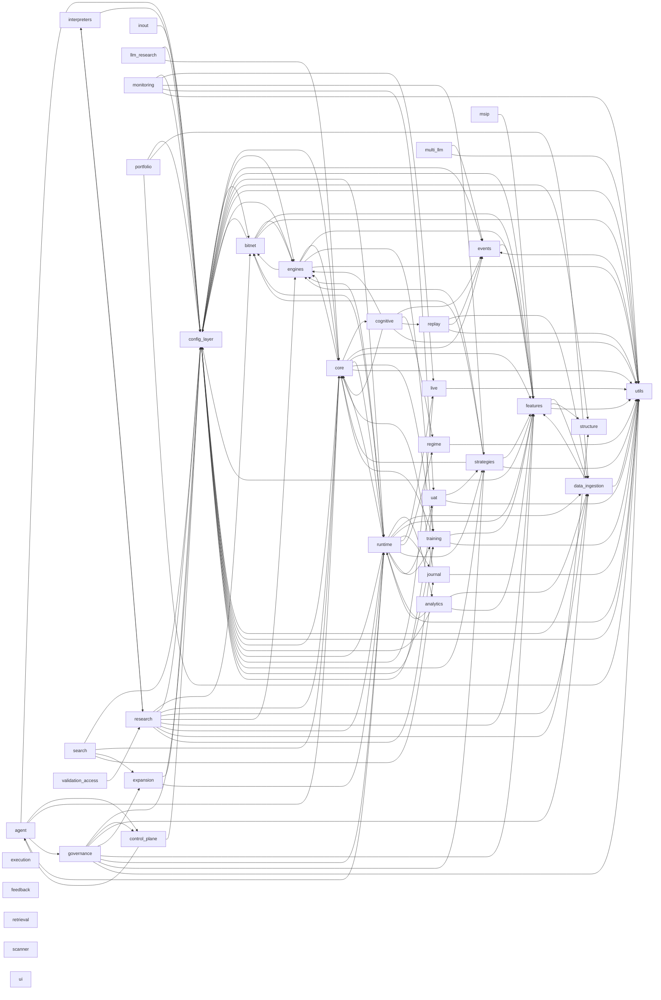
```mermaid
flowchart LR
    agent["agent"]
    analytics["analytics"]
    bitnet["bitnet"]
    cognitive["cognitive"]
    config_layer["config_layer"]
    control_plane["control_plane"]
    core["core"]
    data_ingestion["data_ingestion"]
    engines["engines"]
    events["events"]
    execution["execution"]
    expansion["expansion"]
    features["features"]
    feedback["feedback"]
    governance["governance"]
    inout["inout"]
    interpreters["interpreters"]
    journal["journal"]
    live["live"]
    llm_research["llm_research"]
    monitoring["monitoring"]
    msip["msip"]
    multi_llm["multi_llm"]
    portfolio["portfolio"]
    regime["regime"]
    replay["replay"]
    research["research"]
    retrieval["retrieval"]
    runtime["runtime"]
    scanner["scanner"]
    search["search"]
    strategies["strategies"]
    structure["structure"]
    training["training"]
    uat["uat"]
    ui["ui"]
    utils["utils"]
    validation_access["validation_access"]
    agent --> config_layer
    agent --> control_plane
    agent --> core
    agent --> governance
    agent --> runtime
    analytics --> config_layer
    analytics --> data_ingestion
    analytics --> features
    analytics --> runtime
    bitnet --> config_layer
    bitnet --> engines
    bitnet --> features
    bitnet --> utils
    cognitive --> core
    cognitive --> engines
    cognitive --> events
    cognitive --> regime
    cognitive --> replay
    cognitive --> utils
    config_layer --> bitnet
    config_layer --> core
    config_layer --> engines
    config_layer --> events
    config_layer --> features
    config_layer --> runtime
    config_layer --> structure
    config_layer --> utils
    control_plane --> agent
    control_plane --> config_layer
    core --> cognitive
    core --> config_layer
    core --> engines
    core --> events
    core --> features
    core --> runtime
    core --> training
    core --> utils
    data_ingestion --> config_layer
    data_ingestion --> features
    data_ingestion --> utils
    engines --> bitnet
    engines --> config_layer
    engines --> core
    engines --> features
    engines --> training
    engines --> utils
    events --> features
    expansion --> config_layer
    expansion --> runtime
    features --> config_layer
    features --> data_ingestion
    features --> structure
    features --> utils
    governance --> config_layer
    governance --> control_plane
    governance --> data_ingestion
    governance --> expansion
    governance --> features
    governance --> runtime
    governance --> strategies
    governance --> utils
    inout --> config_layer
    interpreters --> config_layer
    interpreters --> research
    journal --> core
    journal --> utils
    live --> config_layer
    live --> utils
    llm_research --> config_layer
    llm_research --> core
    monitoring --> config_layer
    monitoring --> live
    monitoring --> strategies
    monitoring --> uat
    monitoring --> utils
    msip --> features
    multi_llm --> events
    multi_llm --> utils
    portfolio --> config_layer
    portfolio --> data_ingestion
    portfolio --> utils
    regime --> utils
    replay --> data_ingestion
    replay --> events
    replay --> utils
    research --> bitnet
    research --> config_layer
    research --> core
    research --> data_ingestion
    research --> engines
    research --> features
    research --> interpreters
    research --> runtime
    research --> structure
    research --> training
    runtime --> analytics
    runtime --> bitnet
    runtime --> config_layer
    runtime --> core
    runtime --> data_ingestion
    runtime --> engines
    runtime --> features
    runtime --> journal
    runtime --> live
    runtime --> regime
    runtime --> strategies
    runtime --> training
    runtime --> uat
    runtime --> utils
    search --> config_layer
    search --> core
    search --> expansion
    search --> journal
    strategies --> bitnet
    strategies --> config_layer
    strategies --> core
    strategies --> engines
    strategies --> features
    strategies --> utils
    training --> config_layer
    training --> core
    training --> features
    training --> utils
    uat --> config_layer
    uat --> strategies
    uat --> utils
    utils --> config_layer
    utils --> events
    validation_access --> research
```

## agent

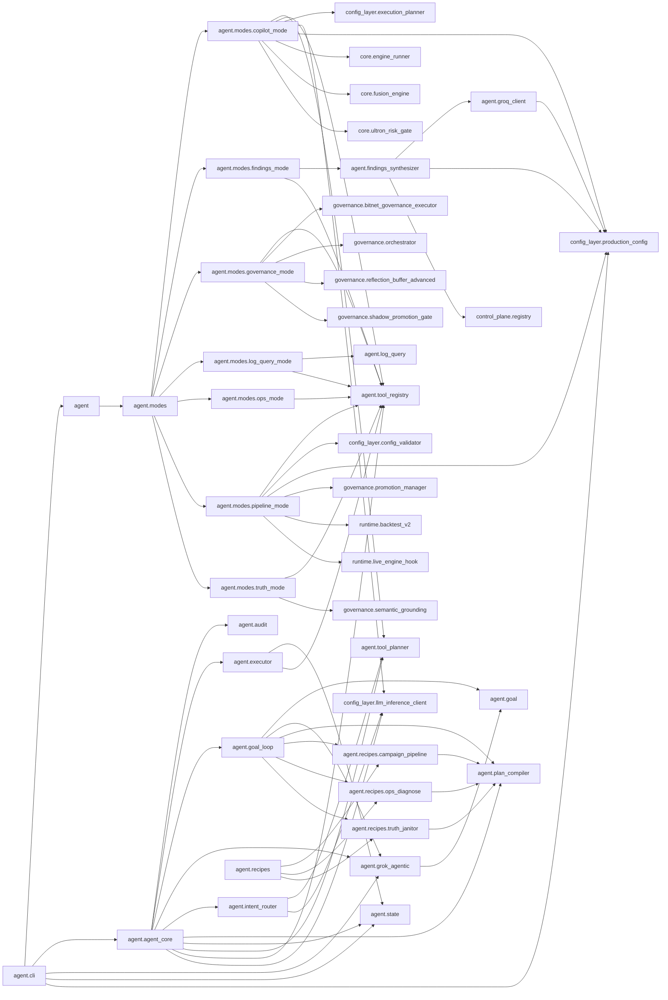
```mermaid
flowchart LR
    agent["agent"]
    agent_agent_core["agent.agent_core"]
    agent_audit["agent.audit"]
    agent_cli["agent.cli"]
    agent_executor["agent.executor"]
    agent_findings_synthesizer["agent.findings_synthesizer"]
    agent_goal["agent.goal"]
    agent_goal_loop["agent.goal_loop"]
    agent_grok_agentic["agent.grok_agentic"]
    agent_groq_client["agent.groq_client"]
    agent_intent_router["agent.intent_router"]
    agent_log_query["agent.log_query"]
    agent_modes["agent.modes"]
    agent_modes_copilot_mode["agent.modes.copilot_mode"]
    agent_modes_findings_mode["agent.modes.findings_mode"]
    agent_modes_governance_mode["agent.modes.governance_mode"]
    agent_modes_log_query_mode["agent.modes.log_query_mode"]
    agent_modes_ops_mode["agent.modes.ops_mode"]
    agent_modes_pipeline_mode["agent.modes.pipeline_mode"]
    agent_modes_truth_mode["agent.modes.truth_mode"]
    agent_plan_compiler["agent.plan_compiler"]
    agent_recipes["agent.recipes"]
    agent_recipes_campaign_pipeline["agent.recipes.campaign_pipeline"]
    agent_recipes_ops_diagnose["agent.recipes.ops_diagnose"]
    agent_recipes_truth_janitor["agent.recipes.truth_janitor"]
    agent_state["agent.state"]
    agent_tool_planner["agent.tool_planner"]
    agent_tool_registry["agent.tool_registry"]
    config_layer_config_validator["config_layer.config_validator"]
    config_layer_execution_planner["config_layer.execution_planner"]
    config_layer_llm_inference_client["config_layer.llm_inference_client"]
    config_layer_production_config["config_layer.production_config"]
    control_plane_registry["control_plane.registry"]
    core_engine_runner["core.engine_runner"]
    core_fusion_engine["core.fusion_engine"]
    core_ultron_risk_gate["core.ultron_risk_gate"]
    governance_bitnet_governance_executor["governance.bitnet_governance_executor"]
    governance_orchestrator["governance.orchestrator"]
    governance_promotion_manager["governance.promotion_manager"]
    governance_reflection_buffer_advanced["governance.reflection_buffer_advanced"]
    governance_semantic_grounding["governance.semantic_grounding"]
    governance_shadow_promotion_gate["governance.shadow_promotion_gate"]
    runtime_backtest_v2["runtime.backtest_v2"]
    runtime_live_engine_hook["runtime.live_engine_hook"]
    agent --> agent_modes
    agent_agent_core --> agent_audit
    agent_agent_core --> agent_executor
    agent_agent_core --> agent_goal_loop
    agent_agent_core --> agent_grok_agentic
    agent_agent_core --> agent_intent_router
    agent_agent_core --> agent_plan_compiler
    agent_agent_core --> agent_state
    agent_agent_core --> agent_tool_planner
    agent_agent_core --> agent_tool_registry
    agent_agent_core --> config_layer_llm_inference_client
    agent_cli --> agent
    agent_cli --> agent_agent_core
    agent_cli --> agent_grok_agentic
    agent_cli --> agent_state
    agent_cli --> config_layer_production_config
    agent_executor --> agent_state
    agent_executor --> agent_tool_registry
    agent_findings_synthesizer --> agent_groq_client
    agent_findings_synthesizer --> config_layer_production_config
    agent_findings_synthesizer --> control_plane_registry
    agent_goal_loop --> agent_goal
    agent_goal_loop --> agent_grok_agentic
    agent_goal_loop --> agent_plan_compiler
    agent_goal_loop --> agent_recipes_campaign_pipeline
    agent_goal_loop --> agent_recipes_ops_diagnose
    agent_goal_loop --> agent_recipes_truth_janitor
    agent_grok_agentic --> agent_goal
    agent_groq_client --> config_layer_production_config
    agent_intent_router --> agent_tool_planner
    agent_intent_router --> config_layer_llm_inference_client
    agent_modes --> agent_modes_copilot_mode
    agent_modes --> agent_modes_findings_mode
    agent_modes --> agent_modes_governance_mode
    agent_modes --> agent_modes_log_query_mode
    agent_modes --> agent_modes_ops_mode
    agent_modes --> agent_modes_pipeline_mode
    agent_modes --> agent_modes_truth_mode
    agent_modes_copilot_mode --> agent_tool_planner
    agent_modes_copilot_mode --> agent_tool_registry
    agent_modes_copilot_mode --> config_layer_execution_planner
    agent_modes_copilot_mode --> config_layer_llm_inference_client
    agent_modes_copilot_mode --> config_layer_production_config
    agent_modes_copilot_mode --> core_engine_runner
    agent_modes_copilot_mode --> core_fusion_engine
    agent_modes_copilot_mode --> core_ultron_risk_gate
    agent_modes_findings_mode --> agent_findings_synthesizer
    agent_modes_findings_mode --> agent_tool_registry
    agent_modes_governance_mode --> agent_tool_registry
    agent_modes_governance_mode --> governance_bitnet_governance_executor
    agent_modes_governance_mode --> governance_orchestrator
    agent_modes_governance_mode --> governance_reflection_buffer_advanced
    agent_modes_governance_mode --> governance_shadow_promotion_gate
    agent_modes_log_query_mode --> agent_log_query
    agent_modes_log_query_mode --> agent_tool_registry
    agent_modes_ops_mode --> agent_tool_registry
    agent_modes_pipeline_mode --> agent_tool_registry
    agent_modes_pipeline_mode --> config_layer_config_validator
    agent_modes_pipeline_mode --> config_layer_production_config
    agent_modes_pipeline_mode --> governance_promotion_manager
    agent_modes_pipeline_mode --> runtime_backtest_v2
    agent_modes_pipeline_mode --> runtime_live_engine_hook
    agent_modes_truth_mode --> agent_tool_registry
    agent_modes_truth_mode --> governance_semantic_grounding
    agent_recipes --> agent_recipes_campaign_pipeline
    agent_recipes --> agent_recipes_ops_diagnose
    agent_recipes --> agent_recipes_truth_janitor
    agent_recipes_campaign_pipeline --> agent_plan_compiler
    agent_recipes_ops_diagnose --> agent_plan_compiler
    agent_recipes_truth_janitor --> agent_plan_compiler
```

## analytics

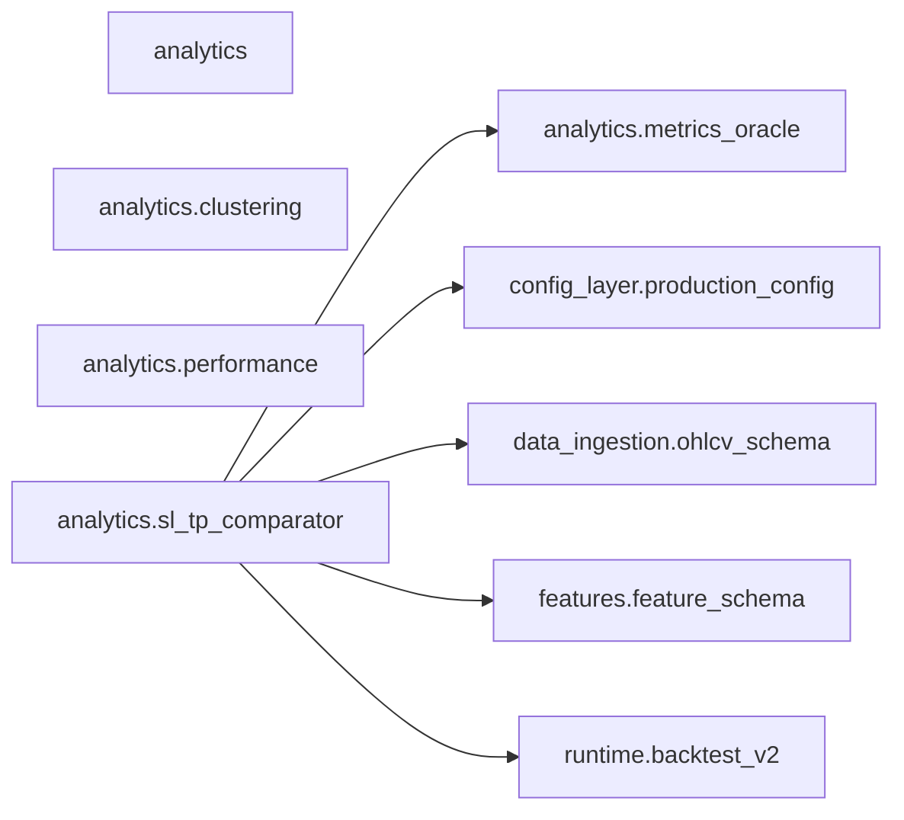
```mermaid
flowchart LR
    analytics["analytics"]
    analytics_clustering["analytics.clustering"]
    analytics_metrics_oracle["analytics.metrics_oracle"]
    analytics_performance["analytics.performance"]
    analytics_sl_tp_comparator["analytics.sl_tp_comparator"]
    config_layer_production_config["config_layer.production_config"]
    data_ingestion_ohlcv_schema["data_ingestion.ohlcv_schema"]
    features_feature_schema["features.feature_schema"]
    runtime_backtest_v2["runtime.backtest_v2"]
    analytics_sl_tp_comparator --> analytics_metrics_oracle
    analytics_sl_tp_comparator --> config_layer_production_config
    analytics_sl_tp_comparator --> data_ingestion_ohlcv_schema
    analytics_sl_tp_comparator --> features_feature_schema
    analytics_sl_tp_comparator --> runtime_backtest_v2
```

## bitnet

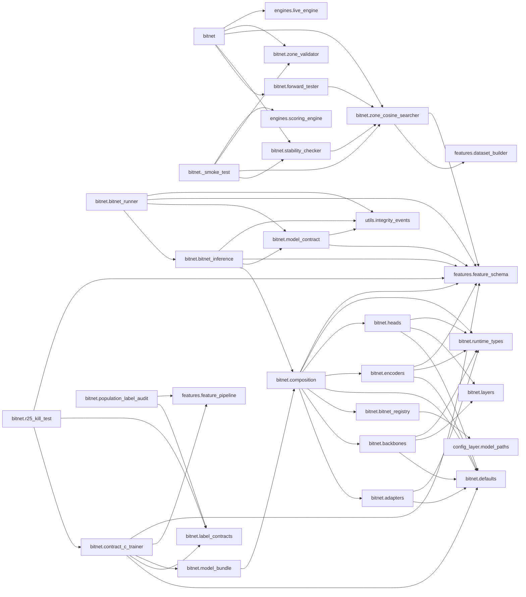
```mermaid
flowchart LR
    bitnet["bitnet"]
    bitnet__smoke_test["bitnet._smoke_test"]
    bitnet_adapters["bitnet.adapters"]
    bitnet_backbones["bitnet.backbones"]
    bitnet_bitnet_inference["bitnet.bitnet_inference"]
    bitnet_bitnet_registry["bitnet.bitnet_registry"]
    bitnet_bitnet_runner["bitnet.bitnet_runner"]
    bitnet_composition["bitnet.composition"]
    bitnet_contract_c_trainer["bitnet.contract_c_trainer"]
    bitnet_defaults["bitnet.defaults"]
    bitnet_encoders["bitnet.encoders"]
    bitnet_forward_tester["bitnet.forward_tester"]
    bitnet_heads["bitnet.heads"]
    bitnet_label_contracts["bitnet.label_contracts"]
    bitnet_layers["bitnet.layers"]
    bitnet_model_bundle["bitnet.model_bundle"]
    bitnet_model_contract["bitnet.model_contract"]
    bitnet_population_label_audit["bitnet.population_label_audit"]
    bitnet_r25_kill_test["bitnet.r25_kill_test"]
    bitnet_runtime_types["bitnet.runtime_types"]
    bitnet_stability_checker["bitnet.stability_checker"]
    bitnet_zone_cosine_searcher["bitnet.zone_cosine_searcher"]
    bitnet_zone_validator["bitnet.zone_validator"]
    config_layer_model_paths["config_layer.model_paths"]
    engines_live_engine["engines.live_engine"]
    engines_scoring_engine["engines.scoring_engine"]
    features_dataset_builder["features.dataset_builder"]
    features_feature_pipeline["features.feature_pipeline"]
    features_feature_schema["features.feature_schema"]
    utils_integrity_events["utils.integrity_events"]
    bitnet --> bitnet_forward_tester
    bitnet --> bitnet_stability_checker
    bitnet --> bitnet_zone_cosine_searcher
    bitnet --> bitnet_zone_validator
    bitnet --> engines_live_engine
    bitnet__smoke_test --> bitnet_stability_checker
    bitnet__smoke_test --> bitnet_zone_cosine_searcher
    bitnet__smoke_test --> bitnet_zone_validator
    bitnet__smoke_test --> engines_scoring_engine
    bitnet_adapters --> bitnet_defaults
    bitnet_adapters --> bitnet_runtime_types
    bitnet_backbones --> bitnet_defaults
    bitnet_backbones --> bitnet_layers
    bitnet_backbones --> bitnet_runtime_types
    bitnet_bitnet_inference --> bitnet_composition
    bitnet_bitnet_inference --> bitnet_model_contract
    bitnet_bitnet_inference --> features_feature_schema
    bitnet_bitnet_inference --> utils_integrity_events
    bitnet_bitnet_registry --> config_layer_model_paths
    bitnet_bitnet_runner --> bitnet_bitnet_inference
    bitnet_bitnet_runner --> bitnet_model_contract
    bitnet_bitnet_runner --> features_feature_schema
    bitnet_bitnet_runner --> utils_integrity_events
    bitnet_composition --> bitnet_adapters
    bitnet_composition --> bitnet_backbones
    bitnet_composition --> bitnet_bitnet_registry
    bitnet_composition --> bitnet_defaults
    bitnet_composition --> bitnet_encoders
    bitnet_composition --> bitnet_heads
    bitnet_composition --> bitnet_runtime_types
    bitnet_composition --> features_feature_schema
    bitnet_contract_c_trainer --> bitnet_defaults
    bitnet_contract_c_trainer --> bitnet_label_contracts
    bitnet_contract_c_trainer --> bitnet_model_bundle
    bitnet_contract_c_trainer --> features_feature_pipeline
    bitnet_contract_c_trainer --> features_feature_schema
    bitnet_encoders --> bitnet_defaults
    bitnet_encoders --> bitnet_runtime_types
    bitnet_encoders --> features_feature_schema
    bitnet_forward_tester --> bitnet_zone_cosine_searcher
    bitnet_heads --> bitnet_defaults
    bitnet_heads --> bitnet_layers
    bitnet_heads --> bitnet_runtime_types
    bitnet_model_bundle --> bitnet_composition
    bitnet_model_contract --> features_feature_schema
    bitnet_model_contract --> utils_integrity_events
    bitnet_population_label_audit --> bitnet_label_contracts
    bitnet_population_label_audit --> features_feature_pipeline
    bitnet_r25_kill_test --> bitnet_contract_c_trainer
    bitnet_r25_kill_test --> bitnet_label_contracts
    bitnet_r25_kill_test --> features_feature_schema
    bitnet_stability_checker --> bitnet_zone_cosine_searcher
    bitnet_zone_cosine_searcher --> features_dataset_builder
    bitnet_zone_cosine_searcher --> features_feature_schema
```

## cognitive

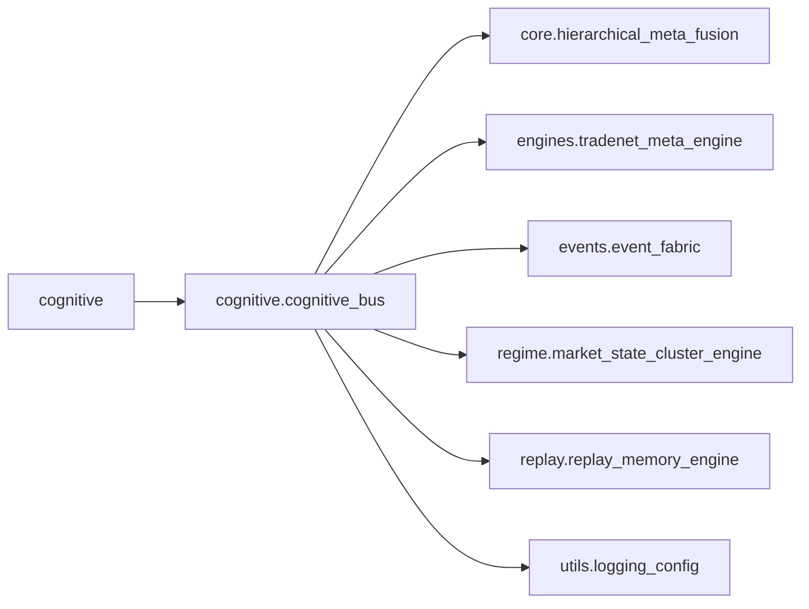
```mermaid
flowchart LR
    cognitive["cognitive"]
    cognitive_cognitive_bus["cognitive.cognitive_bus"]
    core_hierarchical_meta_fusion["core.hierarchical_meta_fusion"]
    engines_tradenet_meta_engine["engines.tradenet_meta_engine"]
    events_event_fabric["events.event_fabric"]
    regime_market_state_cluster_engine["regime.market_state_cluster_engine"]
    replay_replay_memory_engine["replay.replay_memory_engine"]
    utils_logging_config["utils.logging_config"]
    cognitive --> cognitive_cognitive_bus
    cognitive_cognitive_bus --> core_hierarchical_meta_fusion
    cognitive_cognitive_bus --> engines_tradenet_meta_engine
    cognitive_cognitive_bus --> events_event_fabric
    cognitive_cognitive_bus --> regime_market_state_cluster_engine
    cognitive_cognitive_bus --> replay_replay_memory_engine
    cognitive_cognitive_bus --> utils_logging_config
```

## config_layer


```mermaid
flowchart LR
    config_layer["config_layer"]
    config_layer_config_builder["config_layer.config_builder"]
    config_layer_config_validator["config_layer.config_validator"]
    config_layer_crt_config_provenance["config_layer.crt_config_provenance"]
    config_layer_crt_engine_v2["config_layer.crt_engine_v2"]
    config_layer_crt_gaussian_scorer["config_layer.crt_gaussian_scorer"]
    config_layer_crt_sweep_taxonomy["config_layer.crt_sweep_taxonomy"]
    config_layer_execution_planner["config_layer.execution_planner"]
    config_layer_goal_schema["config_layer.goal_schema"]
    config_layer_goal_validator["config_layer.goal_validator"]
    config_layer_htf_state["config_layer.htf_state"]
    config_layer_insight_reporter["config_layer.insight_reporter"]
    config_layer_llm_inference_client["config_layer.llm_inference_client"]
    config_layer_llm_narrative["config_layer.llm_narrative"]
    config_layer_llm_scorer["config_layer.llm_scorer"]
    config_layer_m15_structural_range["config_layer.m15_structural_range"]
    config_layer_market_router["config_layer.market_router"]
    config_layer_model_paths["config_layer.model_paths"]
    config_layer_model_resolver["config_layer.model_resolver"]
    config_layer_parent_crt["config_layer.parent_crt"]
    config_layer_production_bundle["config_layer.production_bundle"]
    config_layer_production_config["config_layer.production_config"]
    config_layer_rr["config_layer.rr"]
    config_layer_rr_rr_dataset_builder["config_layer.rr.rr_dataset_builder"]
    config_layer_rr_rr_fusion["config_layer.rr.rr_fusion"]
    config_layer_rr_rr_pattern_miner["config_layer.rr.rr_pattern_miner"]
    config_layer_stack_version["config_layer.stack_version"]
    config_layer_state_contract["config_layer.state_contract"]
    config_layer_state_contract_loader["config_layer.state_contract_loader"]
    config_layer_state_identity["config_layer.state_identity"]
    config_layer_state_topology["config_layer.state_topology"]
    bitnet_bitnet_inference["bitnet.bitnet_inference"]
    bitnet_bitnet_registry["bitnet.bitnet_registry"]
    core_gate_intelligence["core.gate_intelligence"]
    engines_scoring_engine["engines.scoring_engine"]
    events_event_fabric["events.event_fabric"]
    features_broker_clock["features.broker_clock"]
    features_candle_math["features.candle_math"]
    features_derived_math["features.derived_math"]
    features_feature_pipeline["features.feature_pipeline"]
    features_feature_schema["features.feature_schema"]
    features_fm_resolve["features.fm_resolve"]
    features_registry["features.registry"]
    features_schema_validator["features.schema_validator"]
    runtime_backtest_v2["runtime.backtest_v2"]
    runtime_crt_baseline_trace["runtime.crt_baseline_trace"]
    structure_predicates["structure.predicates"]
    utils_integrity_events["utils.integrity_events"]
    utils_logging_config["utils.logging_config"]
    utils_sweep_trace_logger["utils.sweep_trace_logger"]
    config_layer_config_builder --> config_layer_crt_config_provenance
    config_layer_config_builder --> config_layer_market_router
    config_layer_config_builder --> config_layer_state_identity
    config_layer_config_validator --> config_layer_goal_schema
    config_layer_config_validator --> config_layer_goal_validator
    config_layer_config_validator --> config_layer_production_config
    config_layer_config_validator --> config_layer_state_identity
    config_layer_config_validator --> runtime_backtest_v2
    config_layer_crt_config_provenance --> config_layer_config_builder
    config_layer_crt_config_provenance --> config_layer_production_config
    config_layer_crt_config_provenance --> config_layer_state_identity
    config_layer_crt_engine_v2 --> bitnet_bitnet_inference
    config_layer_crt_engine_v2 --> bitnet_bitnet_registry
    config_layer_crt_engine_v2 --> config_layer_crt_sweep_taxonomy
    config_layer_crt_engine_v2 --> config_layer_htf_state
    config_layer_crt_engine_v2 --> config_layer_m15_structural_range
    config_layer_crt_engine_v2 --> config_layer_production_config
    config_layer_crt_engine_v2 --> config_layer_state_contract_loader
    config_layer_crt_engine_v2 --> config_layer_state_identity
    config_layer_crt_engine_v2 --> config_layer_state_topology
    config_layer_crt_engine_v2 --> events_event_fabric
    config_layer_crt_engine_v2 --> features_broker_clock
    config_layer_crt_engine_v2 --> features_candle_math
    config_layer_crt_engine_v2 --> features_feature_schema
    config_layer_crt_engine_v2 --> features_fm_resolve
    config_layer_crt_engine_v2 --> features_schema_validator
    config_layer_crt_engine_v2 --> runtime_crt_baseline_trace
    config_layer_crt_engine_v2 --> structure_predicates
    config_layer_crt_engine_v2 --> utils_integrity_events
    config_layer_crt_engine_v2 --> utils_sweep_trace_logger
    config_layer_crt_gaussian_scorer --> config_layer_production_config
    config_layer_crt_gaussian_scorer --> engines_scoring_engine
    config_layer_crt_gaussian_scorer --> features_derived_math
    config_layer_execution_planner --> core_gate_intelligence
    config_layer_execution_planner --> utils_logging_config
    config_layer_goal_schema --> config_layer_production_config
    config_layer_goal_validator --> config_layer_goal_schema
    config_layer_htf_state --> config_layer_crt_engine_v2
    config_layer_htf_state --> config_layer_parent_crt
    config_layer_htf_state --> config_layer_state_identity
    config_layer_insight_reporter --> config_layer_llm_narrative
    config_layer_llm_inference_client --> config_layer_llm_narrative
    config_layer_llm_inference_client --> config_layer_llm_scorer
    config_layer_llm_inference_client --> config_layer_production_config
    config_layer_llm_narrative --> config_layer_llm_inference_client
    config_layer_llm_scorer --> config_layer_llm_inference_client
    config_layer_m15_structural_range --> config_layer_state_identity
    config_layer_market_router --> config_layer_production_config
    config_layer_market_router --> config_layer_state_identity
    config_layer_model_resolver --> config_layer_model_paths
    config_layer_parent_crt --> config_layer_crt_engine_v2
    config_layer_parent_crt --> config_layer_state_identity
    config_layer_parent_crt --> structure_predicates
    config_layer_production_bundle --> config_layer_model_resolver
    config_layer_production_bundle --> config_layer_production_config
    config_layer_production_config --> config_layer_config_builder
    config_layer_production_config --> config_layer_crt_config_provenance
    config_layer_production_config --> config_layer_state_identity
    config_layer_rr_rr_dataset_builder --> features_feature_pipeline
    config_layer_rr_rr_dataset_builder --> features_feature_schema
    config_layer_rr_rr_dataset_builder --> features_schema_validator
    config_layer_rr_rr_fusion --> config_layer_production_config
    config_layer_rr_rr_fusion --> config_layer_rr_rr_pattern_miner
    config_layer_rr_rr_fusion --> features_feature_pipeline
    config_layer_rr_rr_fusion --> features_feature_schema
    config_layer_rr_rr_fusion --> features_schema_validator
    config_layer_rr_rr_fusion --> utils_integrity_events
    config_layer_rr_rr_pattern_miner --> config_layer_production_config
    config_layer_rr_rr_pattern_miner --> features_feature_schema
    config_layer_stack_version --> config_layer_production_bundle
    config_layer_stack_version --> config_layer_production_config
    config_layer_stack_version --> features_feature_schema
    config_layer_stack_version --> features_registry
    config_layer_state_contract_loader --> config_layer_state_contract
    config_layer_state_contract_loader --> config_layer_state_identity
    config_layer_state_contract_loader --> features_fm_resolve
    config_layer_state_topology --> config_layer_state_identity
```

## control_plane

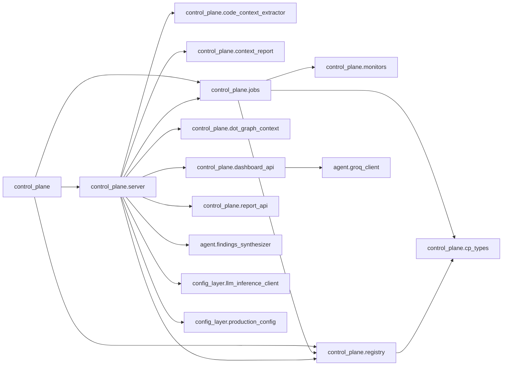
```mermaid
flowchart LR
    control_plane["control_plane"]
    control_plane_code_context_extractor["control_plane.code_context_extractor"]
    control_plane_context_report["control_plane.context_report"]
    control_plane_cp_types["control_plane.cp_types"]
    control_plane_dashboard_api["control_plane.dashboard_api"]
    control_plane_dot_graph_context["control_plane.dot_graph_context"]
    control_plane_jobs["control_plane.jobs"]
    control_plane_monitors["control_plane.monitors"]
    control_plane_registry["control_plane.registry"]
    control_plane_report_api["control_plane.report_api"]
    control_plane_server["control_plane.server"]
    agent_findings_synthesizer["agent.findings_synthesizer"]
    agent_groq_client["agent.groq_client"]
    config_layer_llm_inference_client["config_layer.llm_inference_client"]
    config_layer_production_config["config_layer.production_config"]
    control_plane --> control_plane_jobs
    control_plane --> control_plane_registry
    control_plane --> control_plane_server
    control_plane_dashboard_api --> agent_groq_client
    control_plane_jobs --> control_plane_cp_types
    control_plane_jobs --> control_plane_monitors
    control_plane_jobs --> control_plane_registry
    control_plane_registry --> control_plane_cp_types
    control_plane_server --> agent_findings_synthesizer
    control_plane_server --> config_layer_llm_inference_client
    control_plane_server --> config_layer_production_config
    control_plane_server --> control_plane_code_context_extractor
    control_plane_server --> control_plane_context_report
    control_plane_server --> control_plane_dashboard_api
    control_plane_server --> control_plane_dot_graph_context
    control_plane_server --> control_plane_jobs
    control_plane_server --> control_plane_registry
    control_plane_server --> control_plane_report_api
```

## core


```mermaid
flowchart LR
    core["core"]
    core_acceptance_controller["core.acceptance_controller"]
    core_backtest_port["core.backtest_port"]
    core_collector["core.collector"]
    core_convergence_controller["core.convergence_controller"]
    core_decision_engine["core.decision_engine"]
    core_dynamic_threshold["core.dynamic_threshold"]
    core_engine_runner["core.engine_runner"]
    core_feature_store["core.feature_store"]
    core_fusion_engine["core.fusion_engine"]
    core_gate_intelligence["core.gate_intelligence"]
    core_governance_mode["core.governance_mode"]
    core_hierarchical_meta_fusion["core.hierarchical_meta_fusion"]
    core_model_registry["core.model_registry"]
    core_regime_governor["core.regime_governor"]
    core_signal_audit["core.signal_audit"]
    core_signal_belief_tracker["core.signal_belief_tracker"]
    core_types["core.types"]
    core_ultron_risk_gate["core.ultron_risk_gate"]
    core_ultron_risk_gate_wrapper["core.ultron_risk_gate_wrapper"]
    cognitive_cognitive_bus["cognitive.cognitive_bus"]
    config_layer_model_resolver["config_layer.model_resolver"]
    config_layer_production_config["config_layer.production_config"]
    config_layer_rr_rr_fusion["config_layer.rr.rr_fusion"]
    engines_crt_engine["engines.crt_engine"]
    engines_heuristic_gaussian_engine["engines.heuristic_gaussian_engine"]
    engines_live_engine["engines.live_engine"]
    engines_ml_gaussian_engine["engines.ml_gaussian_engine"]
    engines_rr_engine["engines.rr_engine"]
    engines_trap_validator_engine["engines.trap_validator_engine"]
    engines_zone_cluster_score["engines.zone_cluster_score"]
    engines_zone_gate_engine["engines.zone_gate_engine"]
    events_event_fabric["events.event_fabric"]
    features_causal_structure["features.causal_structure"]
    features_feature_pipeline["features.feature_pipeline"]
    features_feature_schema["features.feature_schema"]
    features_schema_validator["features.schema_validator"]
    runtime_backtest_v2["runtime.backtest_v2"]
    training_evaluator["training.evaluator"]
    utils_integrity_events["utils.integrity_events"]
    utils_logging_config["utils.logging_config"]
    core_acceptance_controller --> config_layer_production_config
    core_backtest_port --> runtime_backtest_v2
    core_collector --> config_layer_production_config
    core_collector --> utils_logging_config
    core_convergence_controller --> config_layer_production_config
    core_decision_engine --> core_dynamic_threshold
    core_engine_runner --> cognitive_cognitive_bus
    core_engine_runner --> config_layer_model_resolver
    core_engine_runner --> config_layer_production_config
    core_engine_runner --> config_layer_rr_rr_fusion
    core_engine_runner --> core_acceptance_controller
    core_engine_runner --> core_collector
    core_engine_runner --> core_convergence_controller
    core_engine_runner --> core_decision_engine
    core_engine_runner --> core_fusion_engine
    core_engine_runner --> core_regime_governor
    core_engine_runner --> core_signal_audit
    core_engine_runner --> engines_crt_engine
    core_engine_runner --> engines_heuristic_gaussian_engine
    core_engine_runner --> engines_live_engine
    core_engine_runner --> engines_ml_gaussian_engine
    core_engine_runner --> engines_rr_engine
    core_engine_runner --> engines_trap_validator_engine
    core_engine_runner --> engines_zone_cluster_score
    core_engine_runner --> engines_zone_gate_engine
    core_engine_runner --> events_event_fabric
    core_engine_runner --> features_feature_schema
    core_engine_runner --> utils_logging_config
    core_feature_store --> features_causal_structure
    core_feature_store --> features_feature_pipeline
    core_feature_store --> features_feature_schema
    core_feature_store --> features_schema_validator
    core_fusion_engine --> utils_integrity_events
    core_gate_intelligence --> utils_logging_config
    core_governance_mode --> config_layer_production_config
    core_hierarchical_meta_fusion --> utils_logging_config
    core_model_registry --> config_layer_production_config
    core_model_registry --> features_feature_pipeline
    core_model_registry --> features_feature_schema
    core_model_registry --> training_evaluator
    core_model_registry --> utils_integrity_events
    core_regime_governor --> config_layer_production_config
    core_ultron_risk_gate --> utils_logging_config
```

## data_ingestion

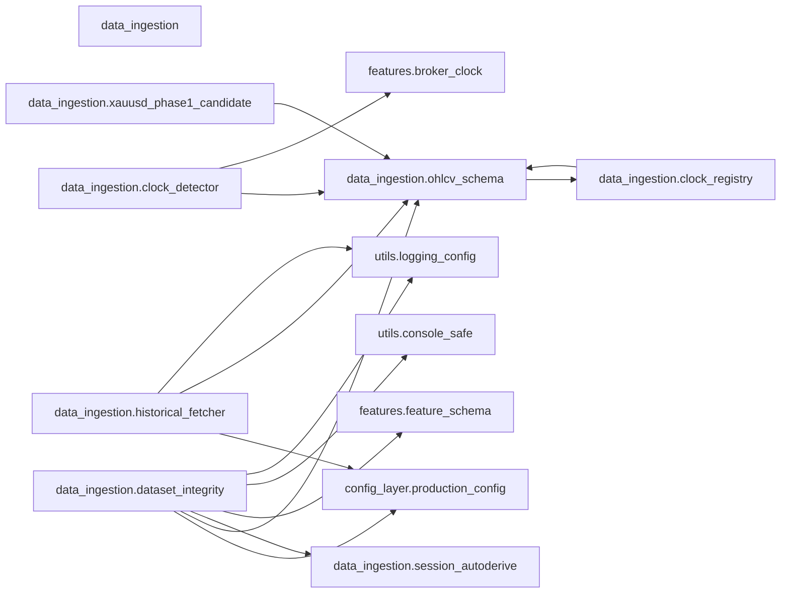
```mermaid
flowchart LR
    data_ingestion["data_ingestion"]
    data_ingestion_clock_detector["data_ingestion.clock_detector"]
    data_ingestion_clock_registry["data_ingestion.clock_registry"]
    data_ingestion_dataset_integrity["data_ingestion.dataset_integrity"]
    data_ingestion_historical_fetcher["data_ingestion.historical_fetcher"]
    data_ingestion_ohlcv_schema["data_ingestion.ohlcv_schema"]
    data_ingestion_session_autoderive["data_ingestion.session_autoderive"]
    data_ingestion_xauusd_phase1_candidate["data_ingestion.xauusd_phase1_candidate"]
    config_layer_production_config["config_layer.production_config"]
    features_broker_clock["features.broker_clock"]
    features_feature_schema["features.feature_schema"]
    utils_console_safe["utils.console_safe"]
    utils_logging_config["utils.logging_config"]
    data_ingestion_clock_detector --> data_ingestion_ohlcv_schema
    data_ingestion_clock_detector --> features_broker_clock
    data_ingestion_clock_registry --> data_ingestion_ohlcv_schema
    data_ingestion_dataset_integrity --> config_layer_production_config
    data_ingestion_dataset_integrity --> data_ingestion_ohlcv_schema
    data_ingestion_dataset_integrity --> data_ingestion_session_autoderive
    data_ingestion_dataset_integrity --> features_feature_schema
    data_ingestion_dataset_integrity --> utils_console_safe
    data_ingestion_dataset_integrity --> utils_logging_config
    data_ingestion_historical_fetcher --> config_layer_production_config
    data_ingestion_historical_fetcher --> data_ingestion_ohlcv_schema
    data_ingestion_historical_fetcher --> utils_logging_config
    data_ingestion_ohlcv_schema --> data_ingestion_clock_registry
    data_ingestion_xauusd_phase1_candidate --> data_ingestion_ohlcv_schema
```

## engines

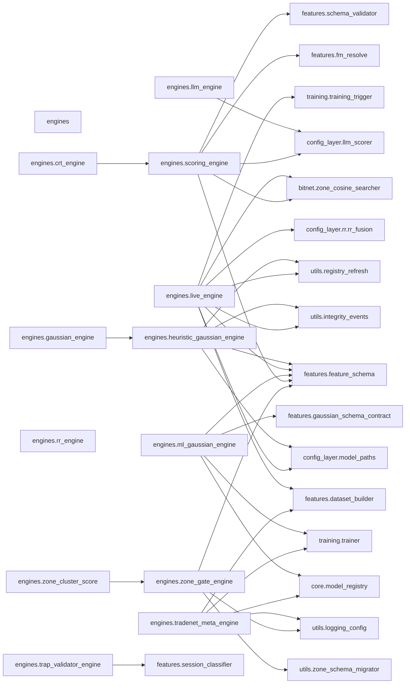
```mermaid
flowchart LR
    engines["engines"]
    engines_crt_engine["engines.crt_engine"]
    engines_gaussian_engine["engines.gaussian_engine"]
    engines_heuristic_gaussian_engine["engines.heuristic_gaussian_engine"]
    engines_live_engine["engines.live_engine"]
    engines_llm_engine["engines.llm_engine"]
    engines_ml_gaussian_engine["engines.ml_gaussian_engine"]
    engines_rr_engine["engines.rr_engine"]
    engines_scoring_engine["engines.scoring_engine"]
    engines_tradenet_meta_engine["engines.tradenet_meta_engine"]
    engines_trap_validator_engine["engines.trap_validator_engine"]
    engines_zone_cluster_score["engines.zone_cluster_score"]
    engines_zone_gate_engine["engines.zone_gate_engine"]
    bitnet_zone_cosine_searcher["bitnet.zone_cosine_searcher"]
    config_layer_llm_scorer["config_layer.llm_scorer"]
    config_layer_model_paths["config_layer.model_paths"]
    config_layer_rr_rr_fusion["config_layer.rr.rr_fusion"]
    core_model_registry["core.model_registry"]
    features_dataset_builder["features.dataset_builder"]
    features_feature_schema["features.feature_schema"]
    features_fm_resolve["features.fm_resolve"]
    features_gaussian_schema_contract["features.gaussian_schema_contract"]
    features_schema_validator["features.schema_validator"]
    features_session_classifier["features.session_classifier"]
    training_trainer["training.trainer"]
    training_training_trigger["training.training_trigger"]
    utils_integrity_events["utils.integrity_events"]
    utils_logging_config["utils.logging_config"]
    utils_registry_refresh["utils.registry_refresh"]
    utils_zone_schema_migrator["utils.zone_schema_migrator"]
    engines_crt_engine --> engines_scoring_engine
    engines_gaussian_engine --> engines_heuristic_gaussian_engine
    engines_heuristic_gaussian_engine --> config_layer_model_paths
    engines_heuristic_gaussian_engine --> features_feature_schema
    engines_heuristic_gaussian_engine --> utils_integrity_events
    engines_heuristic_gaussian_engine --> utils_registry_refresh
    engines_live_engine --> bitnet_zone_cosine_searcher
    engines_live_engine --> config_layer_model_paths
    engines_live_engine --> config_layer_rr_rr_fusion
    engines_live_engine --> features_dataset_builder
    engines_live_engine --> features_feature_schema
    engines_live_engine --> training_training_trigger
    engines_live_engine --> utils_integrity_events
    engines_live_engine --> utils_registry_refresh
    engines_llm_engine --> config_layer_llm_scorer
    engines_ml_gaussian_engine --> core_model_registry
    engines_ml_gaussian_engine --> features_feature_schema
    engines_ml_gaussian_engine --> features_gaussian_schema_contract
    engines_ml_gaussian_engine --> training_trainer
    engines_scoring_engine --> bitnet_zone_cosine_searcher
    engines_scoring_engine --> config_layer_llm_scorer
    engines_scoring_engine --> features_feature_schema
    engines_scoring_engine --> features_fm_resolve
    engines_scoring_engine --> features_schema_validator
    engines_tradenet_meta_engine --> core_model_registry
    engines_tradenet_meta_engine --> features_dataset_builder
    engines_tradenet_meta_engine --> training_trainer
    engines_tradenet_meta_engine --> utils_logging_config
    engines_trap_validator_engine --> features_session_classifier
    engines_zone_cluster_score --> engines_zone_gate_engine
    engines_zone_gate_engine --> features_feature_schema
    engines_zone_gate_engine --> utils_logging_config
    engines_zone_gate_engine --> utils_zone_schema_migrator
```

## events


```mermaid
flowchart LR
    events["events"]
    events_event_fabric["events.event_fabric"]
    features_feature_schema["features.feature_schema"]
    events --> events_event_fabric
    events_event_fabric --> features_feature_schema
```

## execution

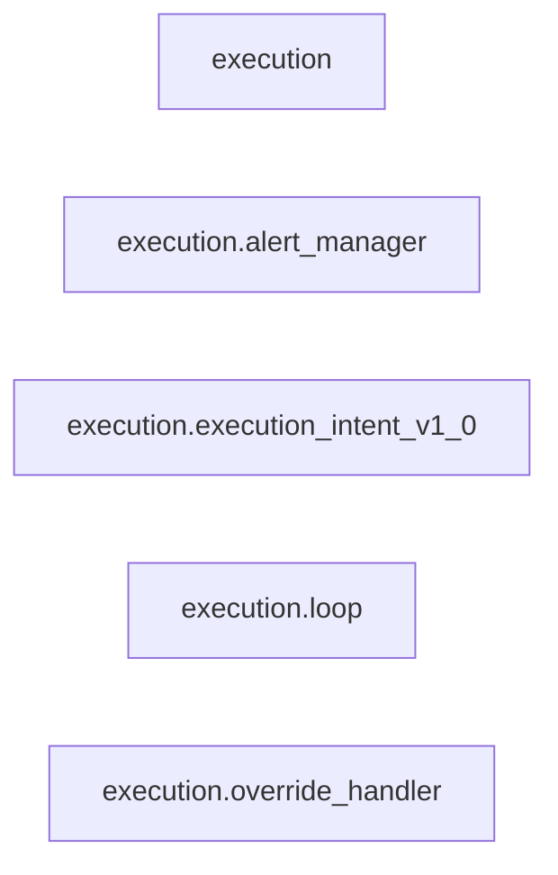
```mermaid
flowchart LR
    execution["execution"]
    execution_alert_manager["execution.alert_manager"]
    execution_execution_intent_v1_0["execution.execution_intent_v1_0"]
    execution_loop["execution.loop"]
    execution_override_handler["execution.override_handler"]
```

## expansion

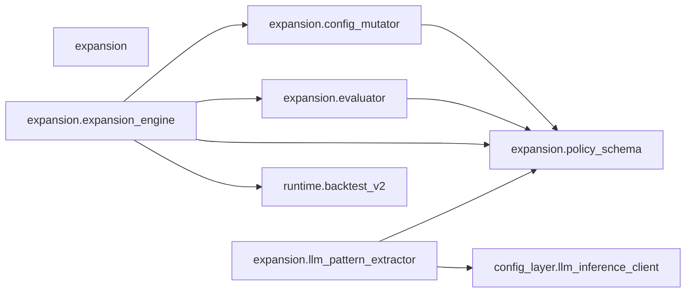
```mermaid
flowchart LR
    expansion["expansion"]
    expansion_config_mutator["expansion.config_mutator"]
    expansion_evaluator["expansion.evaluator"]
    expansion_expansion_engine["expansion.expansion_engine"]
    expansion_llm_pattern_extractor["expansion.llm_pattern_extractor"]
    expansion_policy_schema["expansion.policy_schema"]
    config_layer_llm_inference_client["config_layer.llm_inference_client"]
    runtime_backtest_v2["runtime.backtest_v2"]
    expansion_config_mutator --> expansion_policy_schema
    expansion_evaluator --> expansion_policy_schema
    expansion_expansion_engine --> expansion_config_mutator
    expansion_expansion_engine --> expansion_evaluator
    expansion_expansion_engine --> expansion_policy_schema
    expansion_expansion_engine --> runtime_backtest_v2
    expansion_llm_pattern_extractor --> config_layer_llm_inference_client
    expansion_llm_pattern_extractor --> expansion_policy_schema
```

## features

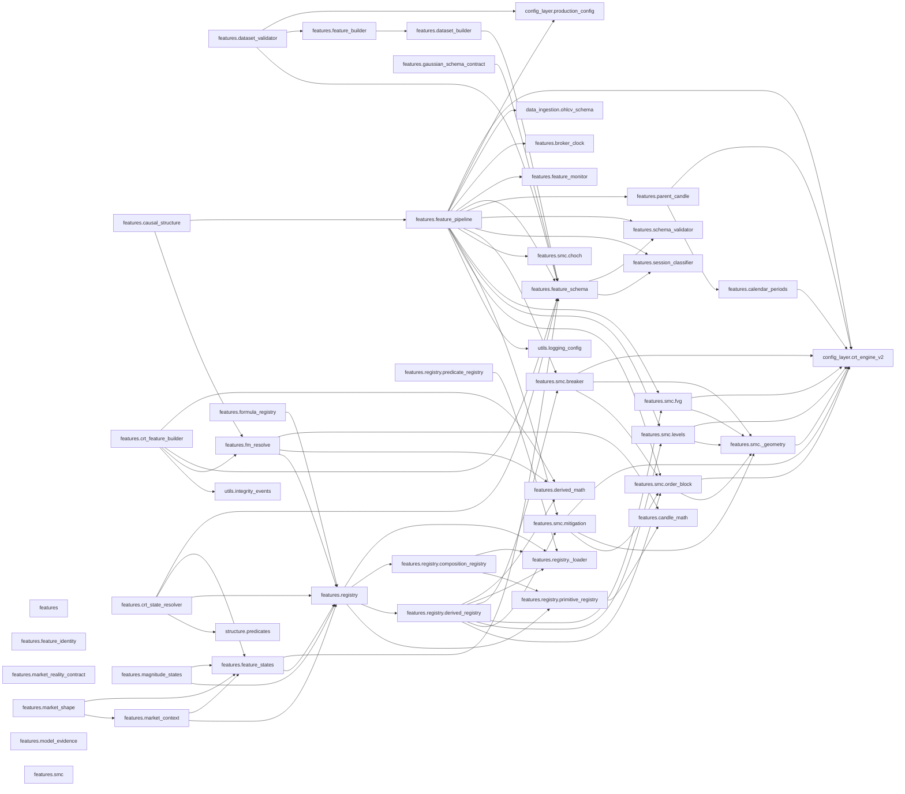
```mermaid
flowchart LR
    features["features"]
    features_broker_clock["features.broker_clock"]
    features_calendar_periods["features.calendar_periods"]
    features_candle_math["features.candle_math"]
    features_causal_structure["features.causal_structure"]
    features_crt_feature_builder["features.crt_feature_builder"]
    features_crt_state_resolver["features.crt_state_resolver"]
    features_dataset_builder["features.dataset_builder"]
    features_dataset_validator["features.dataset_validator"]
    features_derived_math["features.derived_math"]
    features_feature_builder["features.feature_builder"]
    features_feature_identity["features.feature_identity"]
    features_feature_monitor["features.feature_monitor"]
    features_feature_pipeline["features.feature_pipeline"]
    features_feature_schema["features.feature_schema"]
    features_feature_states["features.feature_states"]
    features_fm_resolve["features.fm_resolve"]
    features_formula_registry["features.formula_registry"]
    features_gaussian_schema_contract["features.gaussian_schema_contract"]
    features_magnitude_states["features.magnitude_states"]
    features_market_context["features.market_context"]
    features_market_reality_contract["features.market_reality_contract"]
    features_market_shape["features.market_shape"]
    features_model_evidence["features.model_evidence"]
    features_parent_candle["features.parent_candle"]
    features_registry["features.registry"]
    features_registry__loader["features.registry._loader"]
    features_registry_composition_registry["features.registry.composition_registry"]
    features_registry_derived_registry["features.registry.derived_registry"]
    features_registry_predicate_registry["features.registry.predicate_registry"]
    features_registry_primitive_registry["features.registry.primitive_registry"]
    features_schema_validator["features.schema_validator"]
    features_session_classifier["features.session_classifier"]
    features_smc["features.smc"]
    features_smc__geometry["features.smc._geometry"]
    features_smc_breaker["features.smc.breaker"]
    features_smc_choch["features.smc.choch"]
    features_smc_fvg["features.smc.fvg"]
    features_smc_levels["features.smc.levels"]
    features_smc_mitigation["features.smc.mitigation"]
    features_smc_order_block["features.smc.order_block"]
    config_layer_crt_engine_v2["config_layer.crt_engine_v2"]
    config_layer_production_config["config_layer.production_config"]
    data_ingestion_ohlcv_schema["data_ingestion.ohlcv_schema"]
    structure_predicates["structure.predicates"]
    utils_integrity_events["utils.integrity_events"]
    utils_logging_config["utils.logging_config"]
    features_calendar_periods --> config_layer_crt_engine_v2
    features_causal_structure --> features_feature_pipeline
    features_causal_structure --> features_fm_resolve
    features_crt_feature_builder --> features_derived_math
    features_crt_feature_builder --> features_feature_schema
    features_crt_feature_builder --> features_fm_resolve
    features_crt_feature_builder --> utils_integrity_events
    features_crt_state_resolver --> features_feature_schema
    features_crt_state_resolver --> features_feature_states
    features_crt_state_resolver --> features_registry
    features_crt_state_resolver --> structure_predicates
    features_dataset_builder --> features_feature_schema
    features_dataset_validator --> config_layer_production_config
    features_dataset_validator --> features_feature_builder
    features_dataset_validator --> features_feature_schema
    features_feature_builder --> features_dataset_builder
    features_feature_pipeline --> config_layer_crt_engine_v2
    features_feature_pipeline --> config_layer_production_config
    features_feature_pipeline --> data_ingestion_ohlcv_schema
    features_feature_pipeline --> features_broker_clock
    features_feature_pipeline --> features_feature_monitor
    features_feature_pipeline --> features_feature_schema
    features_feature_pipeline --> features_parent_candle
    features_feature_pipeline --> features_schema_validator
    features_feature_pipeline --> features_session_classifier
    features_feature_pipeline --> features_smc_breaker
    features_feature_pipeline --> features_smc_choch
    features_feature_pipeline --> features_smc_fvg
    features_feature_pipeline --> features_smc_levels
    features_feature_pipeline --> features_smc_mitigation
    features_feature_pipeline --> features_smc_order_block
    features_feature_pipeline --> utils_logging_config
    features_feature_schema --> features_schema_validator
    features_feature_schema --> features_session_classifier
    features_feature_states --> features_feature_schema
    features_feature_states --> features_registry
    features_fm_resolve --> features_candle_math
    features_fm_resolve --> features_derived_math
    features_fm_resolve --> features_registry
    features_formula_registry --> features_registry
    features_gaussian_schema_contract --> features_feature_schema
    features_magnitude_states --> features_feature_states
    features_magnitude_states --> features_registry
    features_market_context --> features_feature_states
    features_market_context --> features_registry
    features_market_shape --> features_feature_states
    features_market_shape --> features_market_context
    features_parent_candle --> config_layer_crt_engine_v2
    features_parent_candle --> features_calendar_periods
    features_registry --> features_registry__loader
    features_registry --> features_registry_composition_registry
    features_registry --> features_registry_derived_registry
    features_registry --> features_registry_primitive_registry
    features_registry_composition_registry --> features_registry__loader
    features_registry_composition_registry --> features_registry_primitive_registry
    features_registry_derived_registry --> features_derived_math
    features_registry_derived_registry --> features_registry__loader
    features_registry_derived_registry --> features_smc_breaker
    features_registry_derived_registry --> features_smc_fvg
    features_registry_derived_registry --> features_smc_levels
    features_registry_derived_registry --> features_smc_mitigation
    features_registry_derived_registry --> features_smc_order_block
    features_registry_predicate_registry --> features_registry__loader
    features_registry_primitive_registry --> features_candle_math
    features_smc__geometry --> config_layer_crt_engine_v2
    features_smc_breaker --> config_layer_crt_engine_v2
    features_smc_breaker --> features_smc__geometry
    features_smc_breaker --> features_smc_order_block
    features_smc_fvg --> config_layer_crt_engine_v2
    features_smc_fvg --> features_smc__geometry
    features_smc_levels --> config_layer_crt_engine_v2
    features_smc_levels --> features_smc__geometry
    features_smc_mitigation --> config_layer_crt_engine_v2
    features_smc_mitigation --> features_smc__geometry
    features_smc_mitigation --> features_smc_order_block
    features_smc_order_block --> config_layer_crt_engine_v2
    features_smc_order_block --> features_smc__geometry
```

## feedback

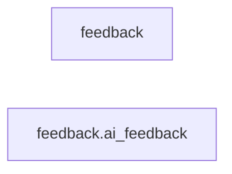
```mermaid
flowchart LR
    feedback["feedback"]
    feedback_ai_feedback["feedback.ai_feedback"]
```

## governance

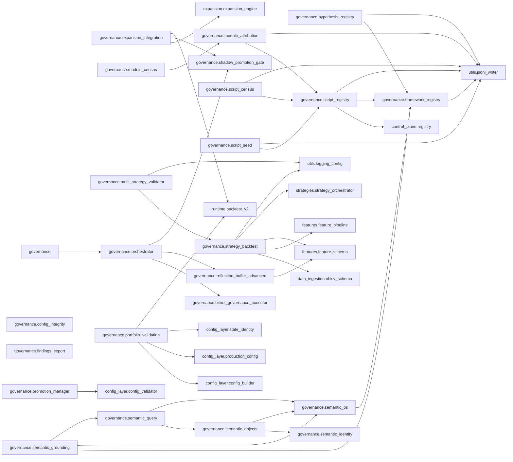
```mermaid
flowchart LR
    governance["governance"]
    governance_bitnet_governance_executor["governance.bitnet_governance_executor"]
    governance_config_integrity["governance.config_integrity"]
    governance_expansion_integration["governance.expansion_integration"]
    governance_findings_export["governance.findings_export"]
    governance_framework_registry["governance.framework_registry"]
    governance_hypothesis_registry["governance.hypothesis_registry"]
    governance_module_attribution["governance.module_attribution"]
    governance_module_census["governance.module_census"]
    governance_multi_strategy_validator["governance.multi_strategy_validator"]
    governance_orchestrator["governance.orchestrator"]
    governance_portfolio_validation["governance.portfolio_validation"]
    governance_promotion_manager["governance.promotion_manager"]
    governance_reflection_buffer_advanced["governance.reflection_buffer_advanced"]
    governance_script_census["governance.script_census"]
    governance_script_registry["governance.script_registry"]
    governance_script_seed["governance.script_seed"]
    governance_semantic_grounding["governance.semantic_grounding"]
    governance_semantic_identity["governance.semantic_identity"]
    governance_semantic_objects["governance.semantic_objects"]
    governance_semantic_os["governance.semantic_os"]
    governance_semantic_query["governance.semantic_query"]
    governance_shadow_promotion_gate["governance.shadow_promotion_gate"]
    governance_strategy_backtest["governance.strategy_backtest"]
    config_layer_config_builder["config_layer.config_builder"]
    config_layer_config_validator["config_layer.config_validator"]
    config_layer_production_config["config_layer.production_config"]
    config_layer_state_identity["config_layer.state_identity"]
    control_plane_registry["control_plane.registry"]
    data_ingestion_ohlcv_schema["data_ingestion.ohlcv_schema"]
    expansion_expansion_engine["expansion.expansion_engine"]
    features_feature_pipeline["features.feature_pipeline"]
    features_feature_schema["features.feature_schema"]
    runtime_backtest_v2["runtime.backtest_v2"]
    strategies_strategy_orchestrator["strategies.strategy_orchestrator"]
    utils_jsonl_writer["utils.jsonl_writer"]
    utils_logging_config["utils.logging_config"]
    governance --> governance_orchestrator
    governance_expansion_integration --> expansion_expansion_engine
    governance_expansion_integration --> governance_shadow_promotion_gate
    governance_expansion_integration --> runtime_backtest_v2
    governance_framework_registry --> utils_jsonl_writer
    governance_hypothesis_registry --> governance_framework_registry
    governance_hypothesis_registry --> utils_jsonl_writer
    governance_module_attribution --> governance_script_registry
    governance_module_attribution --> utils_jsonl_writer
    governance_module_census --> governance_module_attribution
    governance_multi_strategy_validator --> governance_strategy_backtest
    governance_multi_strategy_validator --> utils_logging_config
    governance_orchestrator --> governance_bitnet_governance_executor
    governance_orchestrator --> governance_reflection_buffer_advanced
    governance_orchestrator --> governance_shadow_promotion_gate
    governance_portfolio_validation --> config_layer_config_builder
    governance_portfolio_validation --> config_layer_production_config
    governance_portfolio_validation --> config_layer_state_identity
    governance_portfolio_validation --> runtime_backtest_v2
    governance_promotion_manager --> config_layer_config_validator
    governance_reflection_buffer_advanced --> features_feature_schema
    governance_script_census --> governance_script_registry
    governance_script_census --> utils_jsonl_writer
    governance_script_registry --> control_plane_registry
    governance_script_registry --> governance_framework_registry
    governance_script_registry --> utils_jsonl_writer
    governance_script_seed --> governance_script_registry
    governance_script_seed --> utils_jsonl_writer
    governance_semantic_grounding --> governance_framework_registry
    governance_semantic_grounding --> governance_semantic_os
    governance_semantic_grounding --> governance_semantic_query
    governance_semantic_objects --> governance_semantic_identity
    governance_semantic_objects --> governance_semantic_os
    governance_semantic_os --> governance_framework_registry
    governance_semantic_query --> governance_semantic_objects
    governance_semantic_query --> governance_semantic_os
    governance_strategy_backtest --> data_ingestion_ohlcv_schema
    governance_strategy_backtest --> features_feature_pipeline
    governance_strategy_backtest --> features_feature_schema
    governance_strategy_backtest --> strategies_strategy_orchestrator
    governance_strategy_backtest --> utils_logging_config
```

## inout

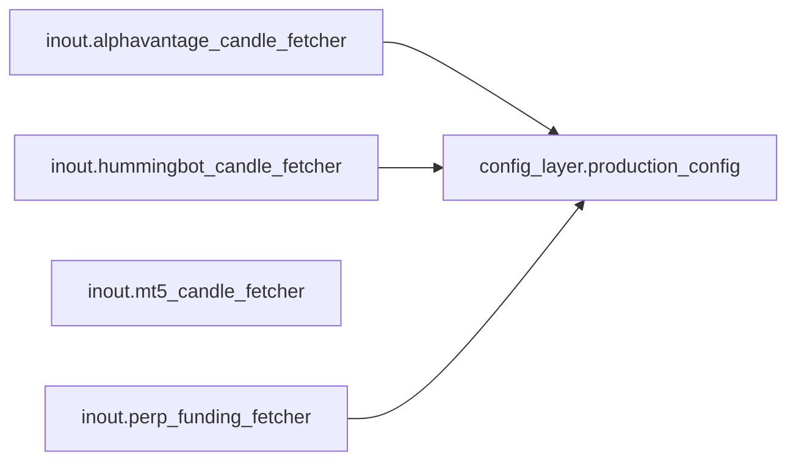
```mermaid
flowchart LR
    inout_alphavantage_candle_fetcher["inout.alphavantage_candle_fetcher"]
    inout_hummingbot_candle_fetcher["inout.hummingbot_candle_fetcher"]
    inout_mt5_candle_fetcher["inout.mt5_candle_fetcher"]
    inout_perp_funding_fetcher["inout.perp_funding_fetcher"]
    config_layer_production_config["config_layer.production_config"]
    inout_alphavantage_candle_fetcher --> config_layer_production_config
    inout_hummingbot_candle_fetcher --> config_layer_production_config
    inout_perp_funding_fetcher --> config_layer_production_config
```

## interpreters

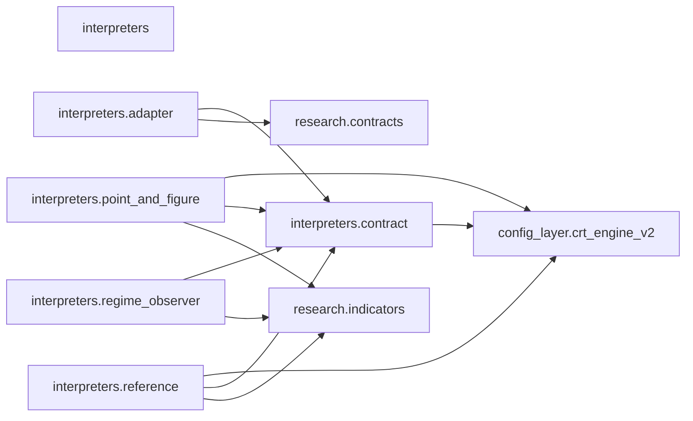
```mermaid
flowchart LR
    interpreters["interpreters"]
    interpreters_adapter["interpreters.adapter"]
    interpreters_contract["interpreters.contract"]
    interpreters_point_and_figure["interpreters.point_and_figure"]
    interpreters_reference["interpreters.reference"]
    interpreters_regime_observer["interpreters.regime_observer"]
    config_layer_crt_engine_v2["config_layer.crt_engine_v2"]
    research_contracts["research.contracts"]
    research_indicators["research.indicators"]
    interpreters_adapter --> interpreters_contract
    interpreters_adapter --> research_contracts
    interpreters_contract --> config_layer_crt_engine_v2
    interpreters_point_and_figure --> config_layer_crt_engine_v2
    interpreters_point_and_figure --> interpreters_contract
    interpreters_point_and_figure --> research_indicators
    interpreters_reference --> config_layer_crt_engine_v2
    interpreters_reference --> interpreters_contract
    interpreters_reference --> research_indicators
    interpreters_regime_observer --> interpreters_contract
    interpreters_regime_observer --> research_indicators
```

## journal

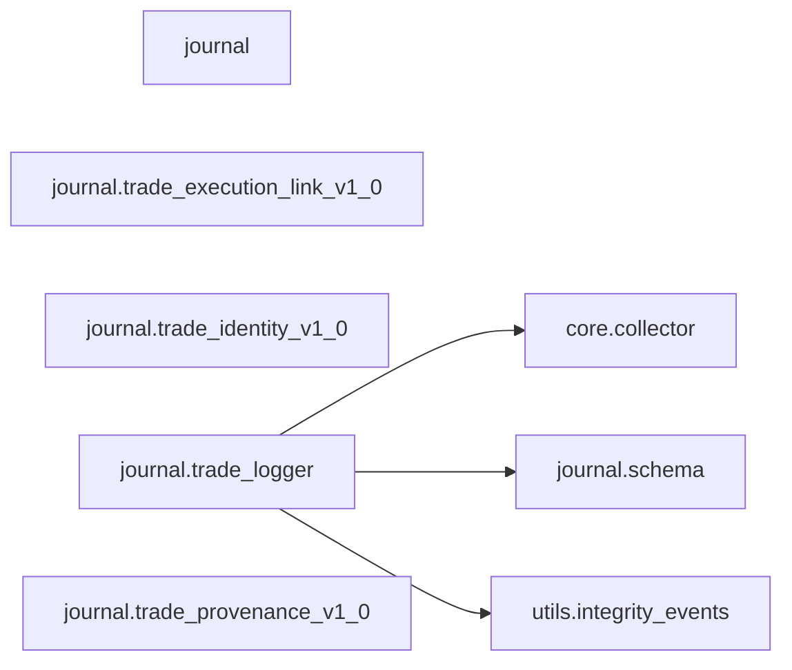
```mermaid
flowchart LR
    journal["journal"]
    journal_schema["journal.schema"]
    journal_trade_execution_link_v1_0["journal.trade_execution_link_v1_0"]
    journal_trade_identity_v1_0["journal.trade_identity_v1_0"]
    journal_trade_logger["journal.trade_logger"]
    journal_trade_provenance_v1_0["journal.trade_provenance_v1_0"]
    core_collector["core.collector"]
    utils_integrity_events["utils.integrity_events"]
    journal_trade_logger --> core_collector
    journal_trade_logger --> journal_schema
    journal_trade_logger --> utils_integrity_events
```

## live

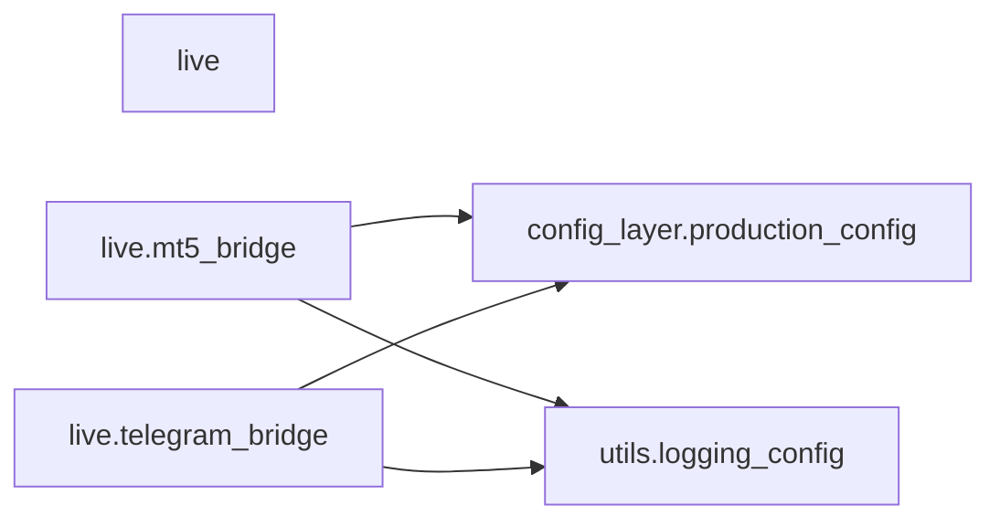
```mermaid
flowchart LR
    live["live"]
    live_mt5_bridge["live.mt5_bridge"]
    live_telegram_bridge["live.telegram_bridge"]
    config_layer_production_config["config_layer.production_config"]
    utils_logging_config["utils.logging_config"]
    live_mt5_bridge --> config_layer_production_config
    live_mt5_bridge --> utils_logging_config
    live_telegram_bridge --> config_layer_production_config
    live_telegram_bridge --> utils_logging_config
```

## llm_research

```mermaid
flowchart LR
    llm_research["llm_research"]
    llm_research_evaluator["llm_research.evaluator"]
    llm_research_forward_tester["llm_research.forward_tester"]
    llm_research_pattern_extractor["llm_research.pattern_extractor"]
    llm_research_policy_builder["llm_research.policy_builder"]
    config_layer_execution_planner["config_layer.execution_planner"]
    config_layer_llm_inference_client["config_layer.llm_inference_client"]
    core_engine_runner["core.engine_runner"]
    llm_research_evaluator --> llm_research_forward_tester
    llm_research_forward_tester --> config_layer_execution_planner
    llm_research_forward_tester --> core_engine_runner
    llm_research_pattern_extractor --> config_layer_llm_inference_client
    llm_research_policy_builder --> llm_research_pattern_extractor
```

## monitoring

```mermaid
flowchart LR
    monitoring["monitoring"]
    monitoring_health_checker["monitoring.health_checker"]
    config_layer_production_config["config_layer.production_config"]
    live_mt5_bridge["live.mt5_bridge"]
    live_telegram_bridge["live.telegram_bridge"]
    strategies_strategy_orchestrator["strategies.strategy_orchestrator"]
    uat_kill_switch["uat.kill_switch"]
    utils_logging_config["utils.logging_config"]
    monitoring_health_checker --> config_layer_production_config
    monitoring_health_checker --> live_mt5_bridge
    monitoring_health_checker --> live_telegram_bridge
    monitoring_health_checker --> strategies_strategy_orchestrator
    monitoring_health_checker --> uat_kill_switch
    monitoring_health_checker --> utils_logging_config
```

## msip

```mermaid
flowchart LR
    msip["msip"]
    msip_disagreement["msip.disagreement"]
    msip_interpretation_config["msip.interpretation_config"]
    msip_isolation["msip.isolation"]
    msip_market_state_vector["msip.market_state_vector"]
    msip_shadow_emitter["msip.shadow_emitter"]
    features_feature_schema["features.feature_schema"]
    msip --> msip_interpretation_config
    msip --> msip_market_state_vector
    msip --> msip_shadow_emitter
    msip_disagreement --> msip_market_state_vector
    msip_shadow_emitter --> features_feature_schema
    msip_shadow_emitter --> msip_interpretation_config
    msip_shadow_emitter --> msip_market_state_vector
```

## multi_llm

```mermaid
flowchart LR
    multi_llm["multi_llm"]
    multi_llm_context_pack["multi_llm.context_pack"]
    multi_llm_discussion["multi_llm.discussion"]
    multi_llm_tokens["multi_llm.tokens"]
    multi_llm_turn_ledger["multi_llm.turn_ledger"]
    events_event_fabric["events.event_fabric"]
    utils_jsonl_writer["utils.jsonl_writer"]
    multi_llm_context_pack --> multi_llm_tokens
    multi_llm_context_pack --> utils_jsonl_writer
    multi_llm_discussion --> multi_llm_turn_ledger
    multi_llm_turn_ledger --> events_event_fabric
    multi_llm_turn_ledger --> utils_jsonl_writer
```

## portfolio

```mermaid
flowchart LR
    portfolio["portfolio"]
    portfolio_allocator["portfolio.allocator"]
    portfolio_capital_policy["portfolio.capital_policy"]
    portfolio_correlation_engine["portfolio.correlation_engine"]
    portfolio_exposure_tracker["portfolio.exposure_tracker"]
    portfolio_replay["portfolio.replay"]
    config_layer_production_config["config_layer.production_config"]
    data_ingestion_historical_fetcher["data_ingestion.historical_fetcher"]
    utils_integrity_events["utils.integrity_events"]
    portfolio_allocator --> portfolio_capital_policy
    portfolio_allocator --> portfolio_correlation_engine
    portfolio_allocator --> portfolio_exposure_tracker
    portfolio_correlation_engine --> config_layer_production_config
    portfolio_correlation_engine --> data_ingestion_historical_fetcher
    portfolio_correlation_engine --> utils_integrity_events
    portfolio_replay --> portfolio_allocator
```

## regime

```mermaid
flowchart LR
    regime["regime"]
    regime_config_router["regime.config_router"]
    regime_market_state_cluster_engine["regime.market_state_cluster_engine"]
    regime_regime_classifier["regime.regime_classifier"]
    utils_logging_config["utils.logging_config"]
    regime_config_router --> regime_regime_classifier
    regime_market_state_cluster_engine --> utils_logging_config
```

## replay

```mermaid
flowchart LR
    replay["replay"]
    replay_replay_drift_governor["replay.replay_drift_governor"]
    replay_replay_memory_engine["replay.replay_memory_engine"]
    replay_replay_similarity_index["replay.replay_similarity_index"]
    replay_timing_advisor["replay.timing_advisor"]
    replay_timing_reconstructor["replay.timing_reconstructor"]
    data_ingestion_ohlcv_schema["data_ingestion.ohlcv_schema"]
    events_event_fabric["events.event_fabric"]
    utils_integrity_events["utils.integrity_events"]
    utils_logging_config["utils.logging_config"]
    utils_registry_refresh["utils.registry_refresh"]
    replay_replay_drift_governor --> events_event_fabric
    replay_replay_drift_governor --> utils_logging_config
    replay_replay_memory_engine --> utils_integrity_events
    replay_replay_memory_engine --> utils_registry_refresh
    replay_timing_reconstructor --> data_ingestion_ohlcv_schema
```

## research

```mermaid
flowchart LR
    research["research"]
    research_adapters["research.adapters"]
    research_adapters_shape_signal_source["research.adapters.shape_signal_source"]
    research_adapters_spine_signal_source["research.adapters.spine_signal_source"]
    research_adapters_structural_event_source["research.adapters.structural_event_source"]
    research_band_validation["research.band_validation"]
    research_candle_state["research.candle_state"]
    research_candle_state_encoder["research.candle_state.encoder"]
    research_candle_state_info_robustness["research.candle_state.info_robustness"]
    research_candle_state_m5_incremental["research.candle_state.m5_incremental"]
    research_candle_state_mtf_conjunction["research.candle_state.mtf_conjunction"]
    research_candle_state_reporting["research.candle_state.reporting"]
    research_candle_state_transition_target["research.candle_state.transition_target"]
    research_clean_labels["research.clean_labels"]
    research_clean_labels_builder["research.clean_labels.builder"]
    research_clean_labels_protocol["research.clean_labels.protocol"]
    research_cli["research.cli"]
    research_conditional_entropy_grid["research.conditional_entropy_grid"]
    research_config["research.config"]
    research_contracts["research.contracts"]
    research_controls["research.controls"]
    research_controls_always_long["research.controls.always_long"]
    research_controls_random_baseline["research.controls.random_baseline"]
    research_costs["research.costs"]
    research_cross_sectional["research.cross_sectional"]
    research_envelope_offline["research.envelope_offline"]
    research_envelope_offline_shadow["research.envelope_offline.shadow"]
    research_envelope_offline_train["research.envelope_offline.train"]
    research_episode_agreement["research.episode_agreement"]
    research_episode_propositions["research.episode_propositions"]
    research_episodes["research.episodes"]
    research_episodes_builder["research.episodes.builder"]
    research_episodes_events["research.episodes.events"]
    research_episodes_flat["research.episodes.flat"]
    research_episodes_policy["research.episodes.policy"]
    research_episodes_projectors["research.episodes.projectors"]
    research_episodes_projectors_detection["research.episodes.projectors.detection"]
    research_episodes_projectors_spine["research.episodes.projectors.spine"]
    research_episodes_protocol["research.episodes.protocol"]
    research_episodes_query["research.episodes.query"]
    research_episodes_schema["research.episodes.schema"]
    research_episodes_store["research.episodes.store"]
    research_episodes_tensors["research.episodes.tensors"]
    research_exit_grid["research.exit_grid"]
    research_experiment_spec["research.experiment_spec"]
    research_forensics["research.forensics"]
    research_goal_alignment["research.goal_alignment"]
    research_hypotheses["research.hypotheses"]
    research_hypotheses_compression_box_straddle["research.hypotheses.compression_box_straddle"]
    research_hypotheses_compression_breakout["research.hypotheses.compression_breakout"]
    research_hypotheses_expansion_breakout["research.hypotheses.expansion_breakout"]
    research_hypotheses_market_shape_hypothesis["research.hypotheses.market_shape_hypothesis"]
    research_hypotheses_mean_reversion["research.hypotheses.mean_reversion"]
    research_hypotheses_spine_hypothesis["research.hypotheses.spine_hypothesis"]
    research_hypotheses_weekly_sweep_reversal["research.hypotheses.weekly_sweep_reversal"]
    research_ic002_entry_evolution["research.ic002_entry_evolution"]
    research_ic002_entry_evolution_build_trajectories["research.ic002_entry_evolution.build_trajectories"]
    research_ic002_entry_evolution_evaluate_separation["research.ic002_entry_evolution.evaluate_separation"]
    research_ic002_entry_evolution_io_util["research.ic002_entry_evolution.io_util"]
    research_ic002_entry_evolution_schema["research.ic002_entry_evolution.schema"]
    research_ic003_shapes["research.ic003_shapes"]
    research_ic003_shapes_build_library["research.ic003_shapes.build_library"]
    research_ic003_shapes_schema["research.ic003_shapes.schema"]
    research_ic003b_sequence_geometry["research.ic003b_sequence_geometry"]
    research_ic003b_sequence_geometry_build_all["research.ic003b_sequence_geometry.build_all"]
    research_ic003b_sequence_geometry_cluster_dtw["research.ic003b_sequence_geometry.cluster_dtw"]
    research_ic003b_sequence_geometry_cluster_euclid["research.ic003b_sequence_geometry.cluster_euclid"]
    research_ic003b_sequence_geometry_continuum["research.ic003b_sequence_geometry.continuum"]
    research_ic003b_sequence_geometry_dtw["research.ic003b_sequence_geometry.dtw"]
    research_ic003b_sequence_geometry_schema["research.ic003b_sequence_geometry.schema"]
    research_ic003b_sequence_geometry_summarize["research.ic003b_sequence_geometry.summarize"]
    research_indicators["research.indicators"]
    research_measurement["research.measurement"]
    research_measurement_bootstrap["research.measurement.bootstrap"]
    research_measurement_forward_walk["research.measurement.forward_walk"]
    research_measurement_metrics["research.measurement.metrics"]
    research_model_runners["research.model_runners"]
    research_model_runners_adapters["research.model_runners.adapters"]
    research_model_runners_adapters_bitnet["research.model_runners.adapters.bitnet"]
    research_model_runners_adapters_crt_score["research.model_runners.adapters.crt_score"]
    research_model_runners_adapters_crt_state_machine["research.model_runners.adapters.crt_state_machine"]
    research_model_runners_adapters_decision["research.model_runners.adapters.decision"]
    research_model_runners_adapters_dual_engine["research.model_runners.adapters.dual_engine"]
    research_model_runners_adapters_envelope_net["research.model_runners.adapters.envelope_net"]
    research_model_runners_adapters_execution_plan["research.model_runners.adapters.execution_plan"]
    research_model_runners_adapters_fusion_compute["research.model_runners.adapters.fusion_compute"]
    research_model_runners_adapters_gaussian["research.model_runners.adapters.gaussian"]
    research_model_runners_adapters_gaussian_ml["research.model_runners.adapters.gaussian_ml"]
    research_model_runners_adapters_rr_polarity["research.model_runners.adapters.rr_polarity"]
    research_model_runners_adapters_rr_trained["research.model_runners.adapters.rr_trained"]
    research_model_runners_adapters_tradenet["research.model_runners.adapters.tradenet"]
    research_model_runners_adapters_zone_gate["research.model_runners.adapters.zone_gate"]
    research_model_runners_contracts["research.model_runners.contracts"]
    research_model_runners_envelope["research.model_runners.envelope"]
    research_model_runners_require_config["research.model_runners.require_config"]
    research_model_runners_runner["research.model_runners.runner"]
    research_model_runners_schema_resolver["research.model_runners.schema_resolver"]
    research_model_runners_stats["research.model_runners.stats"]
    research_model_runners_substrate["research.model_runners.substrate"]
    research_mt5_cost_calibration["research.mt5_cost_calibration"]
    research_path["research.path"]
    research_path_ambiguity_census["research.path.ambiguity_census"]
    research_process_characterization["research.process_characterization"]
    research_process_diagnostics["research.process_diagnostics"]
    research_provenance["research.provenance"]
    research_qualification["research.qualification"]
    research_regime_conditioning["research.regime_conditioning"]
    research_registry["research.registry"]
    research_resample["research.resample"]
    research_runner["research.runner"]
    research_secondlow_v1["research.secondlow_v1"]
    research_secondlow_v1_corpus["research.secondlow_v1.corpus"]
    research_secondlow_v1_depth_metrics["research.secondlow_v1.depth_metrics"]
    research_secondlow_v1_detector["research.secondlow_v1.detector"]
    research_secondlow_v1_regime_metrics["research.secondlow_v1.regime_metrics"]
    research_selection_effect["research.selection_effect"]
    research_shape_statistics["research.shape_statistics"]
    research_structural_asymmetry["research.structural_asymmetry"]
    research_synthetic["research.synthetic"]
    research_synthetic_ontology["research.synthetic.ontology"]
    research_synthetic_stories["research.synthetic.stories"]
    research_synthetic_stories_breakout["research.synthetic.stories.breakout"]
    research_synthetic_stories_liquidity_reversal["research.synthetic.stories.liquidity_reversal"]
    research_synthetic_stories_range_rotation["research.synthetic.stories.range_rotation"]
    research_synthetic_stories_trend_continuation["research.synthetic.stories.trend_continuation"]
    research_synthetic_story_builder["research.synthetic.story_builder"]
    research_synthetic_story_registry["research.synthetic.story_registry"]
    research_synthetic_story_spec["research.synthetic.story_spec"]
    research_visual_crt["research.visual_crt"]
    research_visual_crt_driver["research.visual_crt.driver"]
    research_visual_crt_geometry["research.visual_crt.geometry"]
    research_visual_crt_pools["research.visual_crt.pools"]
    research_visual_crt_retest["research.visual_crt.retest"]
    research_weekly_sweep["research.weekly_sweep"]
    research_weekly_sweep_weekly_range["research.weekly_sweep.weekly_range"]
    research_xau_metals_protocol["research.xau_metals_protocol"]
    research_zone_label_audit["research.zone_label_audit"]
    research_zone_mapping["research.zone_mapping"]
    research_zone_mapping_boundary_hypothesis_eval["research.zone_mapping.boundary_hypothesis_eval"]
    research_zone_mapping_build_corpus_zone_map["research.zone_mapping.build_corpus_zone_map"]
    research_zone_mapping_collect_trade_opened_features["research.zone_mapping.collect_trade_opened_features"]
    research_zone_mapping_crt_zone_crosstab["research.zone_mapping.crt_zone_crosstab"]
    research_zone_mapping_displacement_zone_event_study["research.zone_mapping.displacement_zone_event_study"]
    research_zone_mapping_gaussian_delta_gap_eval["research.zone_mapping.gaussian_delta_gap_eval"]
    research_zone_mapping_gaussian_family_shadow_eval["research.zone_mapping.gaussian_family_shadow_eval"]
    research_zone_mapping_historical_zone_mapper["research.zone_mapping.historical_zone_mapper"]
    research_zone_mapping_rare_zone_context_filter_eval["research.zone_mapping.rare_zone_context_filter_eval"]
    research_zone_mapping_rare_zone_detection_eval["research.zone_mapping.rare_zone_detection_eval"]
    research_zone_mapping_rare_zone_fa_characterization["research.zone_mapping.rare_zone_fa_characterization"]
    research_zone_mapping_zone_census["research.zone_mapping.zone_census"]
    bitnet_bitnet_inference["bitnet.bitnet_inference"]
    bitnet_defaults["bitnet.defaults"]
    bitnet_zone_cosine_searcher["bitnet.zone_cosine_searcher"]
    config_layer_config_builder["config_layer.config_builder"]
    config_layer_crt_engine_v2["config_layer.crt_engine_v2"]
    config_layer_execution_planner["config_layer.execution_planner"]
    config_layer_goal_schema["config_layer.goal_schema"]
    config_layer_goal_validator["config_layer.goal_validator"]
    config_layer_model_resolver["config_layer.model_resolver"]
    config_layer_production_config["config_layer.production_config"]
    config_layer_rr_rr_pattern_miner["config_layer.rr.rr_pattern_miner"]
    config_layer_state_identity["config_layer.state_identity"]
    config_layer_state_topology["config_layer.state_topology"]
    core_decision_engine["core.decision_engine"]
    core_engine_runner["core.engine_runner"]
    core_fusion_engine["core.fusion_engine"]
    core_gate_intelligence["core.gate_intelligence"]
    data_ingestion_dataset_integrity["data_ingestion.dataset_integrity"]
    data_ingestion_ohlcv_schema["data_ingestion.ohlcv_schema"]
    data_ingestion_session_autoderive["data_ingestion.session_autoderive"]
    data_ingestion_xauusd_phase1_candidate["data_ingestion.xauusd_phase1_candidate"]
    engines_crt_engine["engines.crt_engine"]
    engines_heuristic_gaussian_engine["engines.heuristic_gaussian_engine"]
    engines_live_engine["engines.live_engine"]
    engines_ml_gaussian_engine["engines.ml_gaussian_engine"]
    engines_rr_engine["engines.rr_engine"]
    engines_scoring_engine["engines.scoring_engine"]
    engines_zone_cluster_score["engines.zone_cluster_score"]
    engines_zone_gate_engine["engines.zone_gate_engine"]
    features_candle_math["features.candle_math"]
    features_dataset_builder["features.dataset_builder"]
    features_feature_pipeline["features.feature_pipeline"]
    features_feature_schema["features.feature_schema"]
    features_market_shape["features.market_shape"]
    features_parent_candle["features.parent_candle"]
    interpreters_regime_observer["interpreters.regime_observer"]
    runtime_backtest_v2["runtime.backtest_v2"]
    structure_predicates["structure.predicates"]
    training_trade_net_v2["training.trade_net_v2"]
    training_trainer["training.trainer"]
    research_adapters --> research_adapters_spine_signal_source
    research_adapters_shape_signal_source --> data_ingestion_xauusd_phase1_candidate
    research_adapters_shape_signal_source --> features_feature_pipeline
    research_adapters_shape_signal_source --> features_market_shape
    research_adapters_shape_signal_source --> runtime_backtest_v2
    research_adapters_spine_signal_source --> config_layer_production_config
    research_adapters_spine_signal_source --> runtime_backtest_v2
    research_adapters_structural_event_source --> research_indicators
    research_adapters_structural_event_source --> runtime_backtest_v2
    research_band_validation --> features_feature_pipeline
    research_band_validation --> research_measurement_bootstrap
    research_candle_state_encoder --> research_indicators
    research_candle_state_info_robustness --> research_conditional_entropy_grid
    research_candle_state_m5_incremental --> research_candle_state_info_robustness
    research_candle_state_m5_incremental --> research_conditional_entropy_grid
    research_candle_state_mtf_conjunction --> research_candle_state_encoder
    research_candle_state_mtf_conjunction --> research_resample
    research_candle_state_transition_target --> research_indicators
    research_clean_labels --> research_clean_labels_builder
    research_clean_labels --> research_clean_labels_protocol
    research_clean_labels_builder --> features_dataset_builder
    research_clean_labels_builder --> features_feature_schema
    research_clean_labels_builder --> research_clean_labels_protocol
    research_clean_labels_builder --> research_contracts
    research_clean_labels_builder --> research_measurement_forward_walk
    research_cli --> research_config
    research_cli --> research_controls
    research_cli --> research_costs
    research_cli --> research_goal_alignment
    research_cli --> research_hypotheses
    research_cli --> research_measurement_metrics
    research_cli --> research_provenance
    research_cli --> research_qualification
    research_cli --> research_registry
    research_cli --> research_runner
    research_conditional_entropy_grid --> research_indicators
    research_conditional_entropy_grid --> research_process_diagnostics
    research_contracts --> config_layer_crt_engine_v2
    research_controls --> research_controls_always_long
    research_controls --> research_controls_random_baseline
    research_controls --> research_registry
    research_controls_always_long --> research_contracts
    research_controls_always_long --> research_indicators
    research_controls_random_baseline --> research_contracts
    research_controls_random_baseline --> research_indicators
    research_cross_sectional --> data_ingestion_ohlcv_schema
    research_cross_sectional --> research_costs
    research_cross_sectional --> research_qualification
    research_cross_sectional --> runtime_backtest_v2
    research_envelope_offline --> research_envelope_offline_shadow
    research_envelope_offline --> research_envelope_offline_train
    research_envelope_offline_shadow --> research_envelope_offline_train
    research_envelope_offline_train --> features_feature_schema
    research_envelope_offline_train --> research_clean_labels_builder
    research_episode_agreement --> research_episode_propositions
    research_episodes --> research_episodes_protocol
    research_episodes_builder --> research_episodes_protocol
    research_episodes_builder --> research_episodes_schema
    research_episodes_events --> research_episodes_schema
    research_episodes_flat --> research_episodes_events
    research_episodes_flat --> research_episodes_policy
    research_episodes_flat --> research_episodes_schema
    research_episodes_policy --> research_contracts
    research_episodes_policy --> research_episodes_protocol
    research_episodes_policy --> research_episodes_schema
    research_episodes_policy --> research_measurement_forward_walk
    research_episodes_projectors_detection --> research_episodes_builder
    research_episodes_projectors_detection --> research_episodes_protocol
    research_episodes_projectors_detection --> research_episodes_schema
    research_episodes_projectors_spine --> research_episodes_builder
    research_episodes_projectors_spine --> research_episodes_protocol
    research_episodes_projectors_spine --> research_episodes_schema
    research_episodes_query --> research_episodes_events
    research_episodes_query --> research_episodes_policy
    research_episodes_query --> research_episodes_protocol
    research_episodes_query --> research_episodes_schema
    research_episodes_schema --> research_episodes_protocol
    research_episodes_store --> research_episodes_protocol
    research_episodes_store --> research_episodes_schema
    research_episodes_tensors --> research_episodes_schema
    research_exit_grid --> research_contracts
    research_exit_grid --> research_costs
    research_exit_grid --> research_measurement_forward_walk
    research_forensics --> research_config
    research_forensics --> research_costs
    research_forensics --> research_indicators
    research_forensics --> research_measurement_forward_walk
    research_forensics --> research_provenance
    research_forensics --> research_registry
    research_forensics --> runtime_backtest_v2
    research_goal_alignment --> config_layer_goal_schema
    research_goal_alignment --> config_layer_goal_validator
    research_goal_alignment --> research_contracts
    research_hypotheses --> research_hypotheses_compression_box_straddle
    research_hypotheses --> research_hypotheses_compression_breakout
    research_hypotheses --> research_hypotheses_expansion_breakout
    research_hypotheses --> research_hypotheses_market_shape_hypothesis
    research_hypotheses --> research_hypotheses_mean_reversion
    research_hypotheses --> research_hypotheses_spine_hypothesis
    research_hypotheses --> research_hypotheses_weekly_sweep_reversal
    research_hypotheses_compression_box_straddle --> research_candle_state_encoder
    research_hypotheses_compression_box_straddle --> research_contracts
    research_hypotheses_compression_box_straddle --> research_indicators
    research_hypotheses_compression_box_straddle --> research_registry
    research_hypotheses_compression_breakout --> research_candle_state_encoder
    research_hypotheses_compression_breakout --> research_contracts
    research_hypotheses_compression_breakout --> research_indicators
    research_hypotheses_compression_breakout --> research_registry
    research_hypotheses_expansion_breakout --> research_contracts
    research_hypotheses_expansion_breakout --> research_indicators
    research_hypotheses_expansion_breakout --> research_registry
    research_hypotheses_market_shape_hypothesis --> research_adapters_shape_signal_source
    research_hypotheses_market_shape_hypothesis --> research_contracts
    research_hypotheses_market_shape_hypothesis --> research_indicators
    research_hypotheses_market_shape_hypothesis --> research_registry
    research_hypotheses_mean_reversion --> research_contracts
    research_hypotheses_mean_reversion --> research_indicators
    research_hypotheses_mean_reversion --> research_registry
    research_hypotheses_spine_hypothesis --> research_adapters_spine_signal_source
    research_hypotheses_spine_hypothesis --> research_contracts
    research_hypotheses_spine_hypothesis --> research_indicators
    research_hypotheses_spine_hypothesis --> research_registry
    research_hypotheses_weekly_sweep_reversal --> interpreters_regime_observer
    research_hypotheses_weekly_sweep_reversal --> research_candle_state_encoder
    research_hypotheses_weekly_sweep_reversal --> research_contracts
    research_hypotheses_weekly_sweep_reversal --> research_indicators
    research_hypotheses_weekly_sweep_reversal --> research_registry
    research_hypotheses_weekly_sweep_reversal --> research_weekly_sweep_weekly_range
    research_ic002_entry_evolution --> research_ic002_entry_evolution_schema
    research_ic002_entry_evolution_build_trajectories --> features_feature_pipeline
    research_ic002_entry_evolution_build_trajectories --> research_ic002_entry_evolution_io_util
    research_ic002_entry_evolution_build_trajectories --> research_ic002_entry_evolution_schema
    research_ic002_entry_evolution_evaluate_separation --> research_ic002_entry_evolution_io_util
    research_ic002_entry_evolution_evaluate_separation --> research_ic002_entry_evolution_schema
    research_ic002_entry_evolution_io_util --> research_ic002_entry_evolution_schema
    research_ic003_shapes --> research_ic003_shapes_schema
    research_ic003_shapes_build_library --> research_ic002_entry_evolution_io_util
    research_ic003_shapes_build_library --> research_ic002_entry_evolution_schema
    research_ic003_shapes_build_library --> research_ic003_shapes_schema
    research_ic003b_sequence_geometry --> research_ic003b_sequence_geometry_schema
    research_ic003b_sequence_geometry_build_all --> research_ic002_entry_evolution_io_util
    research_ic003b_sequence_geometry_build_all --> research_ic002_entry_evolution_schema
    research_ic003b_sequence_geometry_build_all --> research_ic003b_sequence_geometry_cluster_dtw
    research_ic003b_sequence_geometry_build_all --> research_ic003b_sequence_geometry_cluster_euclid
    research_ic003b_sequence_geometry_build_all --> research_ic003b_sequence_geometry_continuum
    research_ic003b_sequence_geometry_build_all --> research_ic003b_sequence_geometry_schema
    research_ic003b_sequence_geometry_build_all --> research_ic003b_sequence_geometry_summarize
    research_ic003b_sequence_geometry_cluster_dtw --> research_ic003b_sequence_geometry_dtw
    research_ic003b_sequence_geometry_cluster_dtw --> research_ic003b_sequence_geometry_schema
    research_ic003b_sequence_geometry_cluster_euclid --> research_ic003b_sequence_geometry_schema
    research_ic003b_sequence_geometry_continuum --> research_ic003b_sequence_geometry_schema
    research_ic003b_sequence_geometry_dtw --> research_ic003b_sequence_geometry_schema
    research_ic003b_sequence_geometry_summarize --> research_ic003b_sequence_geometry_schema
    research_measurement --> research_measurement_forward_walk
    research_measurement --> research_measurement_metrics
    research_measurement_forward_walk --> research_contracts
    research_measurement_metrics --> research_contracts
    research_measurement_metrics --> research_costs
    research_model_runners --> research_model_runners_contracts
    research_model_runners --> research_model_runners_runner
    research_model_runners_adapters --> research_model_runners_adapters_bitnet
    research_model_runners_adapters --> research_model_runners_adapters_crt_score
    research_model_runners_adapters --> research_model_runners_adapters_crt_state_machine
    research_model_runners_adapters --> research_model_runners_adapters_decision
    research_model_runners_adapters --> research_model_runners_adapters_dual_engine
    research_model_runners_adapters --> research_model_runners_adapters_envelope_net
    research_model_runners_adapters --> research_model_runners_adapters_execution_plan
    research_model_runners_adapters --> research_model_runners_adapters_fusion_compute
    research_model_runners_adapters --> research_model_runners_adapters_gaussian
    research_model_runners_adapters --> research_model_runners_adapters_gaussian_ml
    research_model_runners_adapters --> research_model_runners_adapters_rr_polarity
    research_model_runners_adapters --> research_model_runners_adapters_rr_trained
    research_model_runners_adapters --> research_model_runners_adapters_tradenet
    research_model_runners_adapters --> research_model_runners_adapters_zone_gate
    research_model_runners_adapters --> research_model_runners_contracts
    research_model_runners_adapters --> research_model_runners_substrate
    research_model_runners_adapters_bitnet --> bitnet_bitnet_inference
    research_model_runners_adapters_bitnet --> bitnet_defaults
    research_model_runners_adapters_bitnet --> research_model_runners_contracts
    research_model_runners_adapters_bitnet --> research_model_runners_require_config
    research_model_runners_adapters_bitnet --> research_model_runners_substrate
    research_model_runners_adapters_crt_score --> engines_crt_engine
    research_model_runners_adapters_crt_score --> research_model_runners_contracts
    research_model_runners_adapters_crt_score --> research_model_runners_require_config
    research_model_runners_adapters_crt_score --> research_model_runners_substrate
    research_model_runners_adapters_crt_state_machine --> config_layer_config_builder
    research_model_runners_adapters_crt_state_machine --> config_layer_crt_engine_v2
    research_model_runners_adapters_crt_state_machine --> config_layer_production_config
    research_model_runners_adapters_crt_state_machine --> research_model_runners_contracts
    research_model_runners_adapters_crt_state_machine --> research_model_runners_require_config
    research_model_runners_adapters_crt_state_machine --> research_model_runners_substrate
    research_model_runners_adapters_decision --> core_decision_engine
    research_model_runners_adapters_decision --> research_model_runners_adapters_fusion_compute
    research_model_runners_adapters_decision --> research_model_runners_contracts
    research_model_runners_adapters_decision --> research_model_runners_require_config
    research_model_runners_adapters_decision --> research_model_runners_substrate
    research_model_runners_adapters_dual_engine --> core_engine_runner
    research_model_runners_adapters_dual_engine --> research_model_runners_contracts
    research_model_runners_adapters_dual_engine --> research_model_runners_require_config
    research_model_runners_adapters_dual_engine --> research_model_runners_substrate
    research_model_runners_adapters_envelope_net --> research_envelope_offline_shadow
    research_model_runners_adapters_envelope_net --> research_model_runners_contracts
    research_model_runners_adapters_envelope_net --> research_model_runners_require_config
    research_model_runners_adapters_envelope_net --> research_model_runners_schema_resolver
    research_model_runners_adapters_envelope_net --> research_model_runners_substrate
    research_model_runners_adapters_execution_plan --> config_layer_execution_planner
    research_model_runners_adapters_execution_plan --> core_engine_runner
    research_model_runners_adapters_execution_plan --> core_gate_intelligence
    research_model_runners_adapters_execution_plan --> research_model_runners_adapters_decision
    research_model_runners_adapters_execution_plan --> research_model_runners_contracts
    research_model_runners_adapters_execution_plan --> research_model_runners_require_config
    research_model_runners_adapters_execution_plan --> research_model_runners_substrate
    research_model_runners_adapters_fusion_compute --> core_fusion_engine
    research_model_runners_adapters_fusion_compute --> research_model_runners_adapters_crt_score
    research_model_runners_adapters_fusion_compute --> research_model_runners_adapters_gaussian
    research_model_runners_adapters_fusion_compute --> research_model_runners_adapters_rr_polarity
    research_model_runners_adapters_fusion_compute --> research_model_runners_adapters_zone_gate
    research_model_runners_adapters_fusion_compute --> research_model_runners_contracts
    research_model_runners_adapters_fusion_compute --> research_model_runners_require_config
    research_model_runners_adapters_fusion_compute --> research_model_runners_substrate
    research_model_runners_adapters_gaussian --> engines_heuristic_gaussian_engine
    research_model_runners_adapters_gaussian --> features_feature_schema
    research_model_runners_adapters_gaussian --> research_model_runners_contracts
    research_model_runners_adapters_gaussian --> research_model_runners_require_config
    research_model_runners_adapters_gaussian --> research_model_runners_substrate
    research_model_runners_adapters_gaussian_ml --> research_model_runners_contracts
    research_model_runners_adapters_gaussian_ml --> research_model_runners_require_config
    research_model_runners_adapters_gaussian_ml --> research_model_runners_schema_resolver
    research_model_runners_adapters_gaussian_ml --> research_model_runners_substrate
    research_model_runners_adapters_gaussian_ml --> training_trainer
    research_model_runners_adapters_rr_polarity --> engines_rr_engine
    research_model_runners_adapters_rr_polarity --> research_model_runners_contracts
    research_model_runners_adapters_rr_polarity --> research_model_runners_substrate
    research_model_runners_adapters_rr_trained --> config_layer_rr_rr_pattern_miner
    research_model_runners_adapters_rr_trained --> research_model_runners_contracts
    research_model_runners_adapters_rr_trained --> research_model_runners_require_config
    research_model_runners_adapters_rr_trained --> research_model_runners_schema_resolver
    research_model_runners_adapters_rr_trained --> research_model_runners_substrate
    research_model_runners_adapters_tradenet --> features_feature_schema
    research_model_runners_adapters_tradenet --> research_model_runners_contracts
    research_model_runners_adapters_tradenet --> research_model_runners_require_config
    research_model_runners_adapters_tradenet --> research_model_runners_substrate
    research_model_runners_adapters_tradenet --> training_trade_net_v2
    research_model_runners_adapters_zone_gate --> config_layer_model_resolver
    research_model_runners_adapters_zone_gate --> engines_live_engine
    research_model_runners_adapters_zone_gate --> engines_zone_cluster_score
    research_model_runners_adapters_zone_gate --> features_feature_schema
    research_model_runners_adapters_zone_gate --> research_model_runners_contracts
    research_model_runners_adapters_zone_gate --> research_model_runners_require_config
    research_model_runners_adapters_zone_gate --> research_model_runners_substrate
    research_model_runners_runner --> research_model_runners_adapters
    research_model_runners_runner --> research_model_runners_contracts
    research_model_runners_runner --> research_model_runners_envelope
    research_model_runners_runner --> research_model_runners_require_config
    research_model_runners_runner --> research_model_runners_stats
    research_model_runners_runner --> research_model_runners_substrate
    research_model_runners_schema_resolver --> features_feature_schema
    research_model_runners_substrate --> features_feature_pipeline
    research_model_runners_substrate --> features_feature_schema
    research_model_runners_substrate --> research_model_runners_require_config
    research_path_ambiguity_census --> research_contracts
    research_path_ambiguity_census --> research_exit_grid
    research_path_ambiguity_census --> research_measurement_forward_walk
    research_process_characterization --> research_indicators
    research_process_diagnostics --> research_process_characterization
    research_provenance --> config_layer_production_config
    research_provenance --> features_feature_schema
    research_qualification --> research_contracts
    research_qualification --> research_costs
    research_qualification --> research_measurement_metrics
    research_regime_conditioning --> research_contracts
    research_regime_conditioning --> research_costs
    research_regime_conditioning --> research_measurement_metrics
    research_regime_conditioning --> research_qualification
    research_registry --> research_contracts
    research_resample --> config_layer_crt_engine_v2
    research_runner --> research_config
    research_runner --> research_contracts
    research_runner --> research_costs
    research_runner --> research_measurement_forward_walk
    research_runner --> research_measurement_metrics
    research_runner --> research_provenance
    research_runner --> research_registry
    research_runner --> runtime_backtest_v2
    research_secondlow_v1 --> research_secondlow_v1_corpus
    research_secondlow_v1 --> research_secondlow_v1_detector
    research_secondlow_v1_corpus --> data_ingestion_xauusd_phase1_candidate
    research_secondlow_v1_depth_metrics --> research_secondlow_v1_detector
    research_secondlow_v1_regime_metrics --> research_secondlow_v1_detector
    research_shape_statistics --> features_feature_pipeline
    research_shape_statistics --> features_market_shape
    research_shape_statistics --> research_measurement_bootstrap
    research_synthetic --> research_synthetic_story_spec
    research_synthetic_ontology --> config_layer_state_identity
    research_synthetic_ontology --> config_layer_state_topology
    research_synthetic_ontology --> features_feature_schema
    research_synthetic_stories --> research_synthetic_stories_breakout
    research_synthetic_stories --> research_synthetic_stories_liquidity_reversal
    research_synthetic_stories --> research_synthetic_stories_range_rotation
    research_synthetic_stories --> research_synthetic_stories_trend_continuation
    research_synthetic_stories_breakout --> research_synthetic_story_spec
    research_synthetic_stories_liquidity_reversal --> research_synthetic_story_spec
    research_synthetic_stories_range_rotation --> research_synthetic_story_spec
    research_synthetic_stories_trend_continuation --> research_synthetic_story_spec
    research_synthetic_story_builder --> data_ingestion_ohlcv_schema
    research_synthetic_story_builder --> engines_crt_engine
    research_synthetic_story_builder --> engines_heuristic_gaussian_engine
    research_synthetic_story_builder --> engines_rr_engine
    research_synthetic_story_builder --> engines_scoring_engine
    research_synthetic_story_builder --> engines_zone_gate_engine
    research_synthetic_story_builder --> features_candle_math
    research_synthetic_story_builder --> features_feature_schema
    research_synthetic_story_builder --> research_contracts
    research_synthetic_story_builder --> research_measurement_forward_walk
    research_synthetic_story_builder --> research_synthetic_ontology
    research_synthetic_story_builder --> research_synthetic_story_spec
    research_synthetic_story_registry --> research_synthetic_stories
    research_synthetic_story_registry --> research_synthetic_story_spec
    research_visual_crt --> research_visual_crt_geometry
    research_visual_crt --> research_visual_crt_pools
    research_visual_crt_driver --> data_ingestion_dataset_integrity
    research_visual_crt_driver --> features_parent_candle
    research_visual_crt_driver --> research_contracts
    research_visual_crt_driver --> research_indicators
    research_visual_crt_driver --> research_measurement_forward_walk
    research_visual_crt_driver --> research_visual_crt_geometry
    research_visual_crt_driver --> research_visual_crt_pools
    research_visual_crt_driver --> research_visual_crt_retest
    research_visual_crt_geometry --> config_layer_crt_engine_v2
    research_visual_crt_geometry --> features_candle_math
    research_visual_crt_geometry --> research_visual_crt_pools
    research_visual_crt_geometry --> structure_predicates
    research_visual_crt_pools --> config_layer_crt_engine_v2
    research_visual_crt_retest --> config_layer_crt_engine_v2
    research_visual_crt_retest --> research_visual_crt_geometry
    research_weekly_sweep --> research_weekly_sweep_weekly_range
    research_weekly_sweep_weekly_range --> config_layer_crt_engine_v2
    research_weekly_sweep_weekly_range --> data_ingestion_session_autoderive
    research_weekly_sweep_weekly_range --> structure_predicates
    research_zone_label_audit --> bitnet_zone_cosine_searcher
    research_zone_label_audit --> research_contracts
    research_zone_label_audit --> research_measurement_forward_walk
    research_zone_mapping --> research_zone_mapping_historical_zone_mapper
    research_zone_mapping --> research_zone_mapping_zone_census
    research_zone_mapping_boundary_hypothesis_eval --> research_zone_mapping_crt_zone_crosstab
    research_zone_mapping_boundary_hypothesis_eval --> research_zone_mapping_displacement_zone_event_study
    research_zone_mapping_build_corpus_zone_map --> features_feature_pipeline
    research_zone_mapping_build_corpus_zone_map --> features_feature_schema
    research_zone_mapping_build_corpus_zone_map --> research_zone_mapping_historical_zone_mapper
    research_zone_mapping_build_corpus_zone_map --> research_zone_mapping_zone_census
    research_zone_mapping_collect_trade_opened_features --> config_layer_config_builder
    research_zone_mapping_collect_trade_opened_features --> config_layer_crt_engine_v2
    research_zone_mapping_collect_trade_opened_features --> config_layer_production_config
    research_zone_mapping_collect_trade_opened_features --> data_ingestion_xauusd_phase1_candidate
    research_zone_mapping_collect_trade_opened_features --> features_feature_pipeline
    research_zone_mapping_collect_trade_opened_features --> features_feature_schema
    research_zone_mapping_collect_trade_opened_features --> runtime_backtest_v2
    research_zone_mapping_crt_zone_crosstab --> config_layer_config_builder
    research_zone_mapping_crt_zone_crosstab --> config_layer_crt_engine_v2
    research_zone_mapping_crt_zone_crosstab --> features_feature_pipeline
    research_zone_mapping_crt_zone_crosstab --> features_feature_schema
    research_zone_mapping_crt_zone_crosstab --> research_zone_mapping_collect_trade_opened_features
    research_zone_mapping_crt_zone_crosstab --> research_zone_mapping_historical_zone_mapper
    research_zone_mapping_crt_zone_crosstab --> research_zone_mapping_zone_census
    research_zone_mapping_crt_zone_crosstab --> runtime_backtest_v2
    research_zone_mapping_displacement_zone_event_study --> research_zone_mapping_crt_zone_crosstab
    research_zone_mapping_gaussian_delta_gap_eval --> config_layer_crt_engine_v2
    research_zone_mapping_gaussian_delta_gap_eval --> research_contracts
    research_zone_mapping_gaussian_delta_gap_eval --> research_costs
    research_zone_mapping_gaussian_delta_gap_eval --> research_measurement_forward_walk
    research_zone_mapping_gaussian_delta_gap_eval --> research_zone_mapping_gaussian_family_shadow_eval
    research_zone_mapping_gaussian_delta_gap_eval --> research_zone_mapping_rare_zone_detection_eval
    research_zone_mapping_gaussian_family_shadow_eval --> config_layer_config_builder
    research_zone_mapping_gaussian_family_shadow_eval --> config_layer_crt_engine_v2
    research_zone_mapping_gaussian_family_shadow_eval --> engines_heuristic_gaussian_engine
    research_zone_mapping_gaussian_family_shadow_eval --> engines_ml_gaussian_engine
    research_zone_mapping_gaussian_family_shadow_eval --> features_feature_pipeline
    research_zone_mapping_gaussian_family_shadow_eval --> features_feature_schema
    research_zone_mapping_gaussian_family_shadow_eval --> research_contracts
    research_zone_mapping_gaussian_family_shadow_eval --> research_costs
    research_zone_mapping_gaussian_family_shadow_eval --> research_measurement_forward_walk
    research_zone_mapping_gaussian_family_shadow_eval --> research_zone_mapping_collect_trade_opened_features
    research_zone_mapping_gaussian_family_shadow_eval --> research_zone_mapping_historical_zone_mapper
    research_zone_mapping_gaussian_family_shadow_eval --> research_zone_mapping_rare_zone_detection_eval
    research_zone_mapping_gaussian_family_shadow_eval --> research_zone_mapping_zone_census
    research_zone_mapping_gaussian_family_shadow_eval --> runtime_backtest_v2
    research_zone_mapping_historical_zone_mapper --> config_layer_production_config
    research_zone_mapping_historical_zone_mapper --> engines_live_engine
    research_zone_mapping_historical_zone_mapper --> engines_zone_cluster_score
    research_zone_mapping_historical_zone_mapper --> features_feature_schema
    research_zone_mapping_rare_zone_context_filter_eval --> research_zone_mapping_crt_zone_crosstab
    research_zone_mapping_rare_zone_context_filter_eval --> research_zone_mapping_displacement_zone_event_study
    research_zone_mapping_rare_zone_context_filter_eval --> research_zone_mapping_rare_zone_detection_eval
    research_zone_mapping_rare_zone_detection_eval --> research_zone_mapping_crt_zone_crosstab
    research_zone_mapping_rare_zone_detection_eval --> research_zone_mapping_displacement_zone_event_study
    research_zone_mapping_rare_zone_fa_characterization --> research_zone_mapping_crt_zone_crosstab
    research_zone_mapping_rare_zone_fa_characterization --> research_zone_mapping_displacement_zone_event_study
    research_zone_mapping_rare_zone_fa_characterization --> research_zone_mapping_rare_zone_detection_eval
```

## retrieval

```mermaid
flowchart LR
    retrieval["retrieval"]
    retrieval_chunking["retrieval.chunking"]
    retrieval_claude_integration["retrieval.claude_integration"]
    retrieval_config["retrieval.config"]
    retrieval_corpus["retrieval.corpus"]
    retrieval_embedding["retrieval.embedding"]
    retrieval_monitor["retrieval.monitor"]
    retrieval_retriever["retrieval.retriever"]
    retrieval_vector_store["retrieval.vector_store"]
    retrieval --> retrieval_chunking
    retrieval --> retrieval_config
    retrieval --> retrieval_corpus
    retrieval --> retrieval_embedding
    retrieval --> retrieval_monitor
    retrieval --> retrieval_retriever
    retrieval --> retrieval_vector_store
    retrieval_chunking --> retrieval_config
    retrieval_chunking --> retrieval_corpus
    retrieval_claude_integration --> retrieval
    retrieval_claude_integration --> retrieval_config
    retrieval_claude_integration --> retrieval_retriever
    retrieval_corpus --> retrieval_config
    retrieval_embedding --> retrieval_config
    retrieval_monitor --> retrieval_config
    retrieval_retriever --> retrieval_config
    retrieval_retriever --> retrieval_vector_store
    retrieval_vector_store --> retrieval_chunking
    retrieval_vector_store --> retrieval_config
    retrieval_vector_store --> retrieval_corpus
    retrieval_vector_store --> retrieval_embedding
```

## runtime

```mermaid
flowchart LR
    runtime["runtime"]
    runtime_analyze_fusion_shadow["runtime.analyze_fusion_shadow"]
    runtime_backtest_bitnet["runtime.backtest_bitnet"]
    runtime_backtest_v2["runtime.backtest_v2"]
    runtime_baseline_capture["runtime.baseline_capture"]
    runtime_crt_baseline_trace["runtime.crt_baseline_trace"]
    runtime_crt_fail_reason_counters["runtime.crt_fail_reason_counters"]
    runtime_exit_model_band["runtime.exit_model_band"]
    runtime_live_engine_hook["runtime.live_engine_hook"]
    runtime_parent_crt_feed["runtime.parent_crt_feed"]
    runtime_unified_replay_harness["runtime.unified_replay_harness"]
    analytics_metrics_oracle["analytics.metrics_oracle"]
    bitnet_bitnet_inference["bitnet.bitnet_inference"]
    bitnet_bitnet_runner["bitnet.bitnet_runner"]
    config_layer_config_builder["config_layer.config_builder"]
    config_layer_crt_config_provenance["config_layer.crt_config_provenance"]
    config_layer_crt_engine_v2["config_layer.crt_engine_v2"]
    config_layer_execution_planner["config_layer.execution_planner"]
    config_layer_goal_validator["config_layer.goal_validator"]
    config_layer_htf_state["config_layer.htf_state"]
    config_layer_parent_crt["config_layer.parent_crt"]
    config_layer_production_bundle["config_layer.production_bundle"]
    config_layer_production_config["config_layer.production_config"]
    config_layer_stack_version["config_layer.stack_version"]
    config_layer_state_identity["config_layer.state_identity"]
    core_collector["core.collector"]
    core_engine_runner["core.engine_runner"]
    core_feature_store["core.feature_store"]
    core_gate_intelligence["core.gate_intelligence"]
    core_model_registry["core.model_registry"]
    core_signal_belief_tracker["core.signal_belief_tracker"]
    core_ultron_risk_gate["core.ultron_risk_gate"]
    core_ultron_risk_gate_wrapper["core.ultron_risk_gate_wrapper"]
    data_ingestion_dataset_integrity["data_ingestion.dataset_integrity"]
    data_ingestion_ohlcv_schema["data_ingestion.ohlcv_schema"]
    data_ingestion_xauusd_phase1_candidate["data_ingestion.xauusd_phase1_candidate"]
    engines_live_engine["engines.live_engine"]
    features_candle_math["features.candle_math"]
    features_feature_monitor["features.feature_monitor"]
    features_feature_pipeline["features.feature_pipeline"]
    features_feature_schema["features.feature_schema"]
    features_parent_candle["features.parent_candle"]
    journal_trade_provenance_v1_0["journal.trade_provenance_v1_0"]
    live_mt5_bridge["live.mt5_bridge"]
    live_telegram_bridge["live.telegram_bridge"]
    regime_config_router["regime.config_router"]
    regime_regime_classifier["regime.regime_classifier"]
    strategies_strategy_orchestrator["strategies.strategy_orchestrator"]
    strategies_strategy_registry["strategies.strategy_registry"]
    training_training_trigger["training.training_trigger"]
    uat_kill_switch["uat.kill_switch"]
    utils_config_dumper["utils.config_dumper"]
    utils_console_safe["utils.console_safe"]
    utils_episode_summarizer["utils.episode_summarizer"]
    utils_integrity_events["utils.integrity_events"]
    utils_logging_config["utils.logging_config"]
    utils_pattern_hasher["utils.pattern_hasher"]
    utils_sweep_trace_logger["utils.sweep_trace_logger"]
    utils_trade_logger["utils.trade_logger"]
    runtime_analyze_fusion_shadow --> utils_console_safe
    runtime_analyze_fusion_shadow --> utils_integrity_events
    runtime_backtest_bitnet --> bitnet_bitnet_runner
    runtime_backtest_bitnet --> core_engine_runner
    runtime_backtest_bitnet --> features_feature_pipeline
    runtime_backtest_bitnet --> features_feature_schema
    runtime_backtest_bitnet --> utils_console_safe
    runtime_backtest_v2 --> bitnet_bitnet_inference
    runtime_backtest_v2 --> config_layer_config_builder
    runtime_backtest_v2 --> config_layer_crt_config_provenance
    runtime_backtest_v2 --> config_layer_crt_engine_v2
    runtime_backtest_v2 --> config_layer_goal_validator
    runtime_backtest_v2 --> config_layer_production_config
    runtime_backtest_v2 --> core_engine_runner
    runtime_backtest_v2 --> core_model_registry
    runtime_backtest_v2 --> core_signal_belief_tracker
    runtime_backtest_v2 --> data_ingestion_dataset_integrity
    runtime_backtest_v2 --> data_ingestion_ohlcv_schema
    runtime_backtest_v2 --> data_ingestion_xauusd_phase1_candidate
    runtime_backtest_v2 --> features_feature_monitor
    runtime_backtest_v2 --> features_feature_pipeline
    runtime_backtest_v2 --> features_feature_schema
    runtime_backtest_v2 --> features_parent_candle
    runtime_backtest_v2 --> journal_trade_provenance_v1_0
    runtime_backtest_v2 --> runtime_parent_crt_feed
    runtime_backtest_v2 --> strategies_strategy_orchestrator
    runtime_backtest_v2 --> strategies_strategy_registry
    runtime_backtest_v2 --> training_training_trigger
    runtime_backtest_v2 --> utils_config_dumper
    runtime_backtest_v2 --> utils_console_safe
    runtime_backtest_v2 --> utils_episode_summarizer
    runtime_backtest_v2 --> utils_integrity_events
    runtime_backtest_v2 --> utils_logging_config
    runtime_backtest_v2 --> utils_pattern_hasher
    runtime_backtest_v2 --> utils_sweep_trace_logger
    runtime_backtest_v2 --> utils_trade_logger
    runtime_baseline_capture --> config_layer_production_bundle
    runtime_baseline_capture --> config_layer_production_config
    runtime_baseline_capture --> config_layer_stack_version
    runtime_baseline_capture --> core_model_registry
    runtime_baseline_capture --> features_feature_schema
    runtime_baseline_capture --> utils_console_safe
    runtime_exit_model_band --> analytics_metrics_oracle
    runtime_exit_model_band --> runtime_backtest_v2
    runtime_live_engine_hook --> config_layer_execution_planner
    runtime_live_engine_hook --> config_layer_production_config
    runtime_live_engine_hook --> core_collector
    runtime_live_engine_hook --> core_engine_runner
    runtime_live_engine_hook --> core_feature_store
    runtime_live_engine_hook --> core_gate_intelligence
    runtime_live_engine_hook --> core_ultron_risk_gate
    runtime_live_engine_hook --> core_ultron_risk_gate_wrapper
    runtime_live_engine_hook --> engines_live_engine
    runtime_live_engine_hook --> features_candle_math
    runtime_live_engine_hook --> features_feature_monitor
    runtime_live_engine_hook --> live_mt5_bridge
    runtime_live_engine_hook --> live_telegram_bridge
    runtime_live_engine_hook --> regime_config_router
    runtime_live_engine_hook --> regime_regime_classifier
    runtime_live_engine_hook --> runtime_backtest_v2
    runtime_live_engine_hook --> strategies_strategy_orchestrator
    runtime_live_engine_hook --> uat_kill_switch
    runtime_live_engine_hook --> utils_config_dumper
    runtime_live_engine_hook --> utils_logging_config
    runtime_parent_crt_feed --> config_layer_htf_state
    runtime_parent_crt_feed --> config_layer_parent_crt
    runtime_parent_crt_feed --> config_layer_production_config
    runtime_parent_crt_feed --> config_layer_state_identity
    runtime_parent_crt_feed --> features_parent_candle
    runtime_unified_replay_harness --> config_layer_config_builder
    runtime_unified_replay_harness --> config_layer_production_config
    runtime_unified_replay_harness --> runtime_backtest_bitnet
    runtime_unified_replay_harness --> runtime_backtest_v2
    runtime_unified_replay_harness --> utils_console_safe
```

## scanner

```mermaid
flowchart LR
    scanner["scanner"]
    scanner_ranker["scanner.ranker"]
    scanner_scanner["scanner.scanner"]
    scanner_signal_pool["scanner.signal_pool"]
    scanner_spine_adapter["scanner.spine_adapter"]
    scanner_universe["scanner.universe"]
```

## search

```mermaid
flowchart LR
    search_regime_weight_searcher["search.regime_weight_searcher"]
    config_layer_llm_inference_client["config_layer.llm_inference_client"]
    core_fusion_engine["core.fusion_engine"]
    expansion_policy_schema["expansion.policy_schema"]
    journal_trade_logger["journal.trade_logger"]
    search_regime_weight_searcher --> config_layer_llm_inference_client
    search_regime_weight_searcher --> core_fusion_engine
    search_regime_weight_searcher --> expansion_policy_schema
    search_regime_weight_searcher --> journal_trade_logger
```

## strategies

```mermaid
flowchart LR
    strategies["strategies"]
    strategies_base_strategy["strategies.base_strategy"]
    strategies_intent_builder["strategies.intent_builder"]
    strategies_s01_crt_wrapper["strategies.s01_crt_wrapper"]
    strategies_s02_mean_reversion["strategies.s02_mean_reversion"]
    strategies_s03_breakout["strategies.s03_breakout"]
    strategies_s04_stat_arb["strategies.s04_stat_arb"]
    strategies_s05_grid["strategies.s05_grid"]
    strategies_s06_scalping["strategies.s06_scalping"]
    strategies_s07_news_sentiment["strategies.s07_news_sentiment"]
    strategies_s08_ml_ensemble["strategies.s08_ml_ensemble"]
    strategies_s09_pattern_recog["strategies.s09_pattern_recog"]
    strategies_s10_trap_strategy["strategies.s10_trap_strategy"]
    strategies_strategy_intent["strategies.strategy_intent"]
    strategies_strategy_orchestrator["strategies.strategy_orchestrator"]
    strategies_strategy_package["strategies.strategy_package"]
    strategies_strategy_registry["strategies.strategy_registry"]
    strategies_strategy_result["strategies.strategy_result"]
    bitnet_bitnet_inference["bitnet.bitnet_inference"]
    config_layer_production_config["config_layer.production_config"]
    core_model_registry["core.model_registry"]
    engines_crt_engine["engines.crt_engine"]
    features_feature_schema["features.feature_schema"]
    utils_logging_config["utils.logging_config"]
    strategies --> strategies_base_strategy
    strategies --> strategies_s01_crt_wrapper
    strategies --> strategies_s02_mean_reversion
    strategies --> strategies_s03_breakout
    strategies --> strategies_s04_stat_arb
    strategies --> strategies_s05_grid
    strategies --> strategies_s06_scalping
    strategies --> strategies_s07_news_sentiment
    strategies --> strategies_s08_ml_ensemble
    strategies --> strategies_s09_pattern_recog
    strategies --> strategies_s10_trap_strategy
    strategies --> strategies_strategy_orchestrator
    strategies --> strategies_strategy_result
    strategies_base_strategy --> config_layer_production_config
    strategies_base_strategy --> strategies_strategy_result
    strategies_base_strategy --> utils_logging_config
    strategies_intent_builder --> strategies_strategy_intent
    strategies_intent_builder --> strategies_strategy_result
    strategies_s01_crt_wrapper --> config_layer_production_config
    strategies_s01_crt_wrapper --> engines_crt_engine
    strategies_s01_crt_wrapper --> strategies_base_strategy
    strategies_s01_crt_wrapper --> strategies_strategy_result
    strategies_s01_crt_wrapper --> utils_logging_config
    strategies_s02_mean_reversion --> config_layer_production_config
    strategies_s02_mean_reversion --> strategies_base_strategy
    strategies_s02_mean_reversion --> strategies_strategy_result
    strategies_s02_mean_reversion --> utils_logging_config
    strategies_s03_breakout --> config_layer_production_config
    strategies_s03_breakout --> strategies_base_strategy
    strategies_s03_breakout --> strategies_strategy_result
    strategies_s03_breakout --> utils_logging_config
    strategies_s04_stat_arb --> config_layer_production_config
    strategies_s04_stat_arb --> strategies_base_strategy
    strategies_s04_stat_arb --> strategies_strategy_result
    strategies_s04_stat_arb --> utils_logging_config
    strategies_s05_grid --> config_layer_production_config
    strategies_s05_grid --> strategies_base_strategy
    strategies_s05_grid --> strategies_strategy_result
    strategies_s05_grid --> utils_logging_config
    strategies_s06_scalping --> config_layer_production_config
    strategies_s06_scalping --> strategies_base_strategy
    strategies_s06_scalping --> strategies_strategy_result
    strategies_s06_scalping --> utils_logging_config
    strategies_s07_news_sentiment --> config_layer_production_config
    strategies_s07_news_sentiment --> strategies_base_strategy
    strategies_s07_news_sentiment --> strategies_strategy_result
    strategies_s07_news_sentiment --> utils_logging_config
    strategies_s08_ml_ensemble --> bitnet_bitnet_inference
    strategies_s08_ml_ensemble --> config_layer_production_config
    strategies_s08_ml_ensemble --> strategies_base_strategy
    strategies_s08_ml_ensemble --> strategies_strategy_result
    strategies_s08_ml_ensemble --> utils_logging_config
    strategies_s09_pattern_recog --> config_layer_production_config
    strategies_s09_pattern_recog --> strategies_base_strategy
    strategies_s09_pattern_recog --> strategies_strategy_result
    strategies_s09_pattern_recog --> utils_logging_config
    strategies_s10_trap_strategy --> config_layer_production_config
    strategies_s10_trap_strategy --> strategies_base_strategy
    strategies_s10_trap_strategy --> strategies_strategy_result
    strategies_s10_trap_strategy --> utils_logging_config
    strategies_strategy_orchestrator --> config_layer_production_config
    strategies_strategy_orchestrator --> strategies_base_strategy
    strategies_strategy_orchestrator --> strategies_intent_builder
    strategies_strategy_orchestrator --> strategies_s01_crt_wrapper
    strategies_strategy_orchestrator --> strategies_s02_mean_reversion
    strategies_strategy_orchestrator --> strategies_s03_breakout
    strategies_strategy_orchestrator --> strategies_s04_stat_arb
    strategies_strategy_orchestrator --> strategies_s05_grid
    strategies_strategy_orchestrator --> strategies_s06_scalping
    strategies_strategy_orchestrator --> strategies_s07_news_sentiment
    strategies_strategy_orchestrator --> strategies_s08_ml_ensemble
    strategies_strategy_orchestrator --> strategies_s09_pattern_recog
    strategies_strategy_orchestrator --> strategies_s10_trap_strategy
    strategies_strategy_orchestrator --> strategies_strategy_intent
    strategies_strategy_orchestrator --> strategies_strategy_result
    strategies_strategy_orchestrator --> utils_logging_config
    strategies_strategy_package --> config_layer_production_config
    strategies_strategy_package --> core_model_registry
    strategies_strategy_package --> features_feature_schema
    strategies_strategy_registry --> strategies_strategy_package
    strategies_strategy_result --> strategies_strategy_intent
```

## structure

```mermaid
flowchart LR
    structure["structure"]
    structure_predicates["structure.predicates"]
```

## training

```mermaid
flowchart LR
    training_bar_semantic_tracker["training.bar_semantic_tracker"]
    training_evaluator["training.evaluator"]
    training_phase5_calibration["training.phase5_calibration"]
    training_stage1_dataset_builder["training.stage1_dataset_builder"]
    training_trade_net_v2["training.trade_net_v2"]
    training_train_pipeline["training.train_pipeline"]
    training_trainer["training.trainer"]
    training_training_trigger["training.training_trigger"]
    config_layer_production_config["config_layer.production_config"]
    config_layer_rr_rr_dataset_builder["config_layer.rr.rr_dataset_builder"]
    core_model_registry["core.model_registry"]
    features_dataset_builder["features.dataset_builder"]
    features_dataset_validator["features.dataset_validator"]
    features_feature_schema["features.feature_schema"]
    features_gaussian_schema_contract["features.gaussian_schema_contract"]
    utils_integrity_events["utils.integrity_events"]
    training_evaluator --> features_dataset_builder
    training_phase5_calibration --> config_layer_production_config
    training_phase5_calibration --> training_evaluator
    training_phase5_calibration --> training_trainer
    training_stage1_dataset_builder --> features_feature_schema
    training_stage1_dataset_builder --> utils_integrity_events
    training_trade_net_v2 --> core_model_registry
    training_trade_net_v2 --> features_dataset_builder
    training_trade_net_v2 --> features_feature_schema
    training_trade_net_v2 --> training_trainer
    training_trade_net_v2 --> utils_integrity_events
    training_train_pipeline --> config_layer_rr_rr_dataset_builder
    training_train_pipeline --> core_model_registry
    training_train_pipeline --> features_dataset_builder
    training_train_pipeline --> features_dataset_validator
    training_train_pipeline --> features_feature_schema
    training_train_pipeline --> training_evaluator
    training_train_pipeline --> training_phase5_calibration
    training_train_pipeline --> training_trainer
    training_trainer --> core_model_registry
    training_trainer --> features_dataset_builder
    training_trainer --> features_feature_schema
    training_trainer --> features_gaussian_schema_contract
    training_trainer --> utils_integrity_events
    training_training_trigger --> config_layer_production_config
```

## uat

```mermaid
flowchart LR
    uat["uat"]
    uat_kill_switch["uat.kill_switch"]
    uat_monte_carlo["uat.monte_carlo"]
    uat_uat_runner["uat.uat_runner"]
    config_layer_production_config["config_layer.production_config"]
    strategies_strategy_orchestrator["strategies.strategy_orchestrator"]
    strategies_strategy_result["strategies.strategy_result"]
    utils_llm_logger["utils.llm_logger"]
    utils_logging_config["utils.logging_config"]
    uat_kill_switch --> config_layer_production_config
    uat_kill_switch --> utils_logging_config
    uat_monte_carlo --> config_layer_production_config
    uat_monte_carlo --> utils_logging_config
    uat_uat_runner --> config_layer_production_config
    uat_uat_runner --> strategies_strategy_orchestrator
    uat_uat_runner --> strategies_strategy_result
    uat_uat_runner --> uat_kill_switch
    uat_uat_runner --> uat_monte_carlo
    uat_uat_runner --> utils_llm_logger
    uat_uat_runner --> utils_logging_config
```

## ui

```mermaid
flowchart LR
    ui["ui"]
```

## utils

```mermaid
flowchart LR
    utils_config_dumper["utils.config_dumper"]
    utils_console_safe["utils.console_safe"]
    utils_engine_telemetry["utils.engine_telemetry"]
    utils_episode_summarizer["utils.episode_summarizer"]
    utils_integrity_events["utils.integrity_events"]
    utils_jsonl_writer["utils.jsonl_writer"]
    utils_llm_logger["utils.llm_logger"]
    utils_log_identity["utils.log_identity"]
    utils_log_index_writer["utils.log_index_writer"]
    utils_logging_config["utils.logging_config"]
    utils_pattern_hasher["utils.pattern_hasher"]
    utils_registry_refresh["utils.registry_refresh"]
    utils_run_manifest["utils.run_manifest"]
    utils_sweep_trace_logger["utils.sweep_trace_logger"]
    utils_trade_logger["utils.trade_logger"]
    utils_validation_contract["utils.validation_contract"]
    utils_zone_schema_migrator["utils.zone_schema_migrator"]
    config_layer_crt_engine_v2["config_layer.crt_engine_v2"]
    config_layer_production_config["config_layer.production_config"]
    events_event_fabric["events.event_fabric"]
    utils_config_dumper --> config_layer_production_config
    utils_engine_telemetry --> events_event_fabric
    utils_episode_summarizer --> events_event_fabric
    utils_logging_config --> utils_console_safe
    utils_pattern_hasher --> config_layer_crt_engine_v2
    utils_run_manifest --> config_layer_production_config
    utils_sweep_trace_logger --> events_event_fabric
    utils_trade_logger --> events_event_fabric
```

## validation_access

```mermaid
flowchart LR
    validation_access["validation_access"]
    validation_access_ladder["validation_access.ladder"]
    validation_access_surfaces["validation_access.surfaces"]
    research_synthetic_ontology["research.synthetic.ontology"]
    research_synthetic_story_builder["research.synthetic.story_builder"]
    research_synthetic_story_registry["research.synthetic.story_registry"]
    validation_access --> validation_access_ladder
    validation_access_ladder --> research_synthetic_ontology
    validation_access_ladder --> research_synthetic_story_builder
    validation_access_ladder --> research_synthetic_story_registry
    validation_access_surfaces --> validation_access_ladder
```

