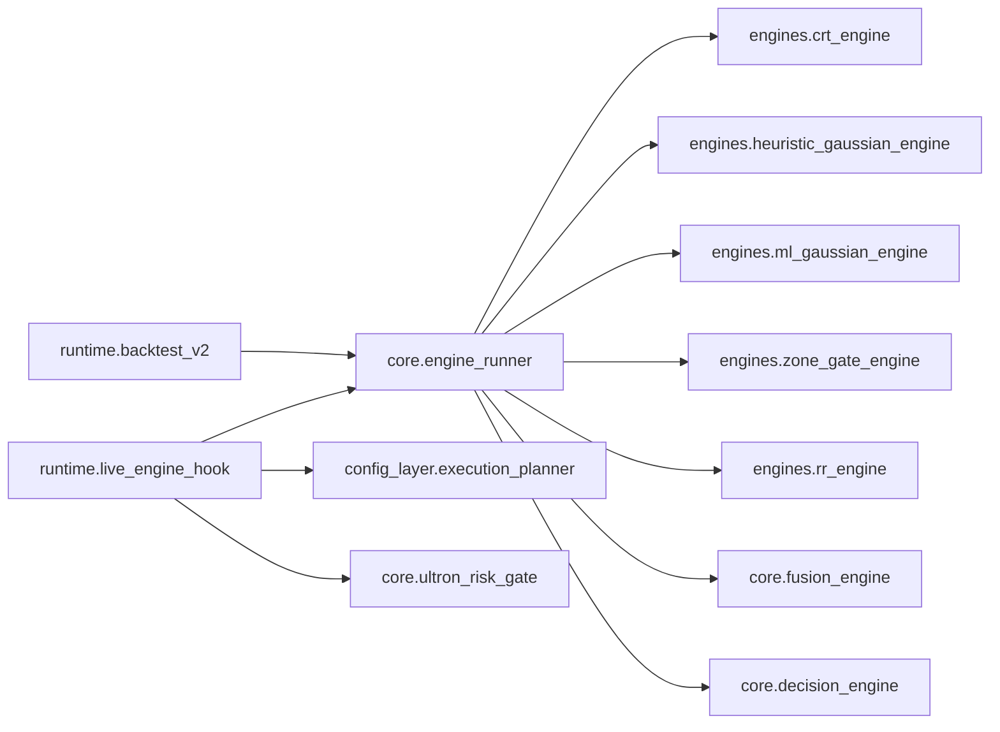

# code-map.md — How the code is wired (deep-dive navigation)

> **Purpose (LLM context economy):** the map you load to find *where* a change lands and
> *what imports what*, then drill into one package without holding the whole tree in your
> head. This doc is the **navigation narrative**; the diagrams it points at are
> **auto-generated** from the real imports so they never drift.

## Artifacts

| Artifact | What it is | When to use |
|---|---|---|
| [`code-map.generated.md`](code-map.generated.md) | Generated Mermaid: an L0 package graph + one module-level slice **per package** (206 modules, 31 packages). | Reading/visual deep-dive — load the L0, then the one package slice you're working in. |
| [`graph.dot`](../../graph.dot) | Generated Graphviz of the full module-level import graph (package-clustered). | Impact analysis — "who imports `X`?", render to SVG, machine queries. |

Both are produced by **`scripts/analysis/gen_code_map.py`** (stdlib `ast`, no third-party
dep). **Regenerate after any import change:**

```bash
python scripts/analysis/gen_code_map.py        # rewrites graph.dot + code-map.generated.md
python scripts/analysis/gen_code_map.py --package core   # print one package's slice
```

> The legacy `pyan_call_flow.dot` (function-level, ~65k edges) is **retired** — it was too
> large to load. This module-level graph is the supported map.

## How to deep-dive (the recipe)

1. **Locate.** Open the **L0 graph** in [`code-map.generated.md`](code-map.generated.md) to
   see which packages your target depends on / is depended on by.
2. **Zoom in.** Jump to that package's slice (e.g. `## core`) for its modules and their imports.
3. **Get the roles.** Pair the slice with [`codebase-state-map.md`](codebase-state-map.md) §1
   (one-line role per module) and, if the package is a service, its
   [`services/<svc>.md`](services) contract.
4. **Trace runtime order** (not imports) in [`signal-flow.md`](signal-flow.md); **events**
   in [`event-taxonomy.md`](event-taxonomy.md).
5. **Impact analysis.** `grep '-> "core.fusion_engine"' graph.dot` → every module that imports it.

## The decision spine (import view)

This is the **structure** behind the runtime flow: orchestrators import `EngineRunner`, which
imports the four scoring engines + fusion + decision; the planner and risk gate are imported
and called by the *runtime orchestrators*, not by `EngineRunner` (which stays scoring/filter
authority). Runtime *order* is owned by [`signal-flow.md`](signal-flow.md).



## Ownership (so docs don't duplicate)

| View | Authoritative doc |
|---|---|
| Import / structure graph | **this doc** + `code-map.generated.md` / `graph.dot` |
| Module roles, entry points, coupling | [`codebase-state-map.md`](codebase-state-map.md) |
| Service contracts (ins/flow/outs) | [`service-boundary-map.md`](service-boundary-map.md) |
| Runtime candle→order flow | [`signal-flow.md`](signal-flow.md) |
| Events + CRT state graph | [`event-taxonomy.md`](event-taxonomy.md) |
| Goal / invariants | [`goal.md`](goal.md) |
