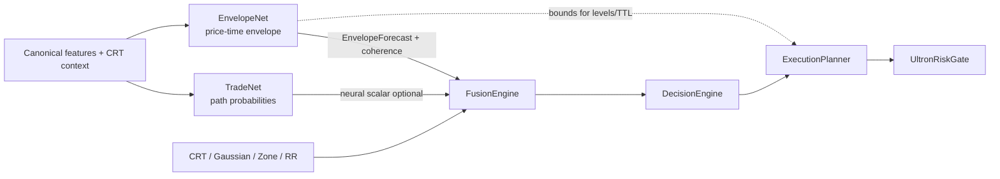

# Architecture Extension — Envelope Layer (EnvelopeNet)

> **Authority: NONE (§6.5).** Architecture design only. Grants **no** production wiring,
> training, config change, fusion weight, or economic authority. Complements
> [`model-design-intent.md`](model-design-intent.md) (intent narrative) and
> [`tradenet_qualification_protocol.md`](../governance/tradenet_qualification_protocol.md)
> (TradeNet’s gate ladder pattern). Runtime truth remains
> `configs/production/ACTIVE_VERSION` + code.

| Field | Value |
|-------|--------|
| Created | 2026-07-22 |
| Design id | `ENV_ARCH_V1` |
| Branch context | `feature/truth-registry-v2` |
| Active config (runtime truth) | `v2_multi_2026_04` |
| Status | **ACCEPTED · DESIGN_FROZEN · ENV-0 PASS · ENV-L PASS (dataset)** |
| Accepted | 2026-07-22 — user accepted `ENV_ARCH_V1` as frozen design authority for the Envelope layer |
| ENV-0 | **FEASIBLE_GO** 2026-07-22 · run `20260721T220948Z` · [`envelope_gate0_feasibility.LATEST.md`](../governance/envelope_gate0_feasibility.LATEST.md) |
| ENV-L | **PASS** 2026-07-22 · protocol **`TN_ENV_CLEAN_L2`** · BNBUSDT n=139,942 · [`results/clean_labels/BNBUSDT/LATEST`](../../results/clean_labels/BNBUSDT/LATEST) |
| TP2 repair | L1 SUPERSEDED — [`tp2_label_repair_report.md`](../governance/tp2_label_repair_report.md) · `STRETCH_3R_BEFORE_SL` |
| ENV-O probe | **GO_RESEARCH** · [`gate-o-nonlinear-BNBUSDT.LATEST.md`](../analysis/gate-o-nonlinear-BNBUSDT.LATEST.md) |
| Offline train charter | **`ENV_OFFLINE_TRAIN_V1`** · [`envelope_offline_train_charter.md`](../research-readiness/envelope_offline_train_charter.md) |
| Offline train run | **TRAIN_COMPLETE · SIGNAL_RETAINED** (BNBUSDT) · [`envelope-offline-train-BNBUSDT.LATEST.md`](../analysis/envelope-offline-train-BNBUSDT.LATEST.md) · `results/envelope_offline/BNBUSDT/LATEST` |
| Shadow W0 charter | **`ENV_SHADOW_W0_V1`** · [`envelope_shadow_weight0_charter.md`](../research-readiness/envelope_shadow_weight0_charter.md) |
| Shadow W0 run | **SHADOW_COMPLETE** n=139,942 · IC 0.22–0.34 · [`envelope-shadow-w0-BNBUSDT.LATEST.md`](../analysis/envelope-shadow-w0-BNBUSDT.LATEST.md) · `results/envelope_shadow/BNBUSDT/LATEST` |
| Parent narrative | [`model-design-intent.md`](model-design-intent.md) §8 TradeNet · Part VII missing #6 |
| Label substrate | `forward_walk` / `horizon_excursion` — stream diagnostic only (F-022) |
| Next authorized step | Multi-instrument L2+train+shadow **or** stop. Still forbidden: spine wire, planner, fusion, weight>0, TradeNet outcome train, registry promote |

---

## 0. Objective (one sentence)

Add one predictive intelligence module **after TradeNet and before Fusion** whose sole job is
to estimate the **realistic post-entry price–time operating envelope** of an opportunity —
holding duration, MFE/MAE, achievable TP band, tolerable SL band, expiry, and confidence
intervals — so that Fusion / Decision / Planner can reason about **boundaries**, not only
**outcomes**.

---

## 1. Why this layer exists

### 1.1 Gap in the current architecture

The live and design stacks already cover:

| Domain | Owner today |
|--------|-------------|
| Market structure / eligibility | CRT state machine |
| Statistical familiarity | Gaussian |
| Historical geometric similarity | ZoneGate |
| Candle commitment | RR (polarity / contract A) |
| Expected payoff (+ recusal) | RR NanoInference (contract B; currently off) |
| Post-entry *outcome path* probabilities | TradeNet v2 (built, unwired — F-005) |
| Committee conviction | FusionEngine |
| Trade / not trade | DecisionEngine |
| Intent + fixed levels + TTL | ExecutionPlannerV1_2 |
| Affordability | UltronRiskGate |

None of them estimate the **future price–time box** the trade is expected to live in:

- How long is the opportunity expected to remain valid?
- What holding duration is typical for this setup class?
- What MFE (max favorable excursion) is realistic?
- What MAE (max adverse excursion) should be tolerated?
- What TP range is achievable without fantasy targets?
- What SL range is coherent with expected heat?
- When should the plan be considered expired?
- What is the uncertainty around those estimates?

TradeNet answers *“what usually happens after this?”* as **milestone probabilities**
(`p_tp1`, `p_tp2`, `p_survives_be`). It does **not** emit continuous operating boundaries or
quantiles of path geometry. Planner TTL/SL/TP are **policy constants and geometry**, not
learned envelopes. F-024 established that losers resolve almost immediately while winners mature
over tens of minutes — that timing asymmetry is descriptive evidence that an **envelope model is
architecturally load-bearing**, not a nice-to-have.

### 1.2 Complementarity with TradeNet (non-duplication rule)

| | **TradeNet** | **EnvelopeNet (this design)** |
|--|--------------|-------------------------------|
| Question | What path milestones are likely? | Inside what price–time box do those paths live? |
| Output type | Probabilities ∈ [0,1] | Continuous bounds + quantiles + TTL |
| Units | dimensionless | R-multiples, price, bars / time |
| Economic use | conviction / ranking / neural fusion slot | level placement, size scaling, expiry, coherence veto |
| Failure mode if confused | Treats bounds as “will win” | Treats P(TP) as “TP should be X” |

**Hard rule:** EnvelopeNet must not re-emit TradeNet heads. No `p_tp1`/`p_tp2`/`p_win` on this
surface. If a quantity is a probability of a discrete outcome, it belongs to TradeNet (or
Calibration). If it is a **bound, duration, or range with uncertainty**, it belongs here.

---

## 2. Recommended name (fits this codebase)

| Layer | Recommendation | Rationale |
|-------|----------------|-----------|
| **Family / registry key** | `envelope` | Parallel to `tradenet`, `gaussian`, `zone`, `rr` in registries |
| **Model product name** | **EnvelopeNet** | Peer of TradeNet — same “Net” family for learned predictive modules; distinct from rule engines (`*Engine`) and gates (`*Gate`) |
| **Primary class** | `EnvelopeNetV1` | Mirrors `TradeNetV2` versioning; first frozen contract |
| **Engine wrapper (if ever wired)** | `TradeEnvelopeEngine` | Matches `TradeNetMetaEngine` / `RREngine` PascalCase + `from_prod_config` pattern |
| **Config section (future only)** | `envelope_net` | Snake section like `fusion_engine`, `execution_planner` |
| **Artifact stem** | `models/envelope_registry.json` · `models/envelope_net_v1_*.json` | Registry pattern used by tradenet/zone/rr |
| **One-word intent tag** | `operating_envelope` | For `active_models.yaml` `intent.question` |

**Rejected names**

| Name | Why not |
|------|---------|
| `PathNet` | Collides with TradeNet’s “path / trajectory” language |
| `MFEMAEModel` | Implementation-shaped; not an architectural identity |
| `TTLPredictor` | Too narrow (time only) |
| `RiskEnvelope` | Collides with UltronRiskGate’s *account* risk authority |
| `HorizonEngine` | Overloaded with research `horizon_excursion` |

**Design intent one-liner (for model-design-intent.md):**

> *EnvelopeNet exists to forecast the realistic price–time operating envelope of a trade after
> entry — how far, how hard, how long, and with what uncertainty — without deciding whether the
> trade is a “win.”*

**Category:** Risk (operating boundaries) with Probability quantiles.  
**Design grade (architecture only):** **A** — fills a named hole in Part VII missing #6’s
*expected path* half; does not alone close full in-trade management.

---

## 3. Placement in the spine

### 3.1 Conceptual order (predictive completeness)

```text
OHLCV → Features
      → CRT (structure / eligibility)
      → Gaussian · ZoneGate · RR          # moment witnesses
      → TradeNet                          # post-entry OUTCOME probabilities   [predictive]
      → EnvelopeNet                       # post-entry OPERATING BOUNDARIES    [predictive · LAST]
      → Fusion                            # committee conviction (+ envelope coherence)
      → Decision                          # trade / not
      → ExecutionPlanner                  # intent + levels + TTL (envelope-aware when authorized)
      → UltronRiskGate                    # affordability
      → Order
```

EnvelopeNet is the **last predictive intelligence module** before Fusion. It is **not** a fifth
`EXPECTED_ENGINES` member and **not** a scalar fusion weight peer of CRT/Gaussian/Zone/RR unless
a future GATE-P explicitly creates a *derived* envelope-quality scalar (see §5). Default design:
structured side-channel, not a fifth vote that dilutes meaning.

### 3.2 Dual-track awareness (do not conflate)

| Track | Today | Envelope role |
|-------|-------|---------------|
| **A — EngineRunner.compute()** | 4 engines → `FusionEngine.compute()` → Decision | Future: optional envelope object attached to runner output metadata |
| **B — FusionEngine.evaluate()** | Gaussian → optional `neural_fn` (TradeNet socket) → LLM band | Future: after neural layer, optional `envelope_fn` producing structured forecast — **not** averaged into `base` score |
| **C — Sidecar (CognitiveBus)** | TradeNetMeta, HMF, Replay | Envelope may first land here as observe-only telemetry (shadow), same F-012 discipline |

### 3.3 Mermaid (target architecture fragment)



---

## 4. Contract: inputs · labels · training targets · inference outputs

### 4.1 Inputs (inference & train features)

**Primary feature surface (v1):** the same **38-dim** `CANONICAL_FEATURES` vector TradeNet uses
(`extract_feature_vector` / FeaturePipeline), so training population and PIT discipline stay
aligned with the rest of the predictive stack.

**Context fields (required metadata, not free-form extras):**

| Field | Source | Why |
|-------|--------|-----|
| `symbol` / instrument class | EngineContext | Envelope scale differs crypto vs FX |
| `direction` | CRT / signal | MFE/MAE sign convention |
| `session` / `hour_of_day` | features / context | F-017/F-024 timing structure |
| `regime` | RegimeClassifier | Holding envelopes vary by weather |
| `atr` (at entry bar) | features | R-normalization anchor |
| `proposed_sl_distance` (optional, shadow later) | CRT geometry / planner draft | Conditional envelope given a candidate stop |
| `crt_state` / chapter tags | CRT | Structure-conditioned envelopes |

**Explicit non-inputs (v1):**

- Live account state, open PnL, portfolio heat (Ultron’s domain).
- Order-book / tick microstructure (missing stage #3 — separate program).
- TradeNet outputs as *features* in v1 — avoid cascading two unwired models; joint conditioning is a v2 research option only after both have clean labels.

### 4.2 Labels (authoritative derivation — non-negotiable)

All training labels are derived from **entry → forward path** under the measurement contract:

- Authority: `forward_walk` / `horizon_excursion` (and siblings under
  [`MEASUREMENT_CONTRACT.md`](../governance/MEASUREMENT_CONTRACT.md)).
- **Forbidden as sole y:** opportunity-stream `outcome` / `rr` / stream `mfe` (F-022 class;
  F-041B / F-045 precedent).
- Population: CRT-eligible entry moments (or the same clean population TradeNet GATE-L freezes) —
  not every detection row.

**Core label set (per entry episode):**

| Label id | Definition | Unit |
|----------|------------|------|
| `y_mfe_r` | Max favorable excursion from entry before exit/horizon, ÷ risk distance | R (≥0) |
| `y_mae_r` | Max adverse excursion from entry before exit/horizon, ÷ risk distance | R (≤0 or abs≥0 — freeze sign convention in charter) |
| `y_holding_bars` | Bars from entry to first hard exit under contract (TP/SL/TIMEOUT) | bars |
| `y_time_to_mfe` | Bars until MFE is first attained | bars |
| `y_time_to_mae` | Bars until MAE is first attained | bars |
| `y_time_to_1r` | Bars to first +1R MFE (null if never) | bars / censored |
| `y_tp_achievable_r` | MFE capped at research horizon (proxy for “realistic TP ceiling”) | R |
| `y_sl_heat_r` | \|MAE\| over horizon (proxy for “heat the path actually took”) | R |
| `y_expired` | 1 if TIMEOUT / validity window ended without TP under contract | {0,1} |

**Censoring:** paths that hit SL before high MFE still produce honest MAE/MFE partials;
timeouts are censored for some duration heads (survival-style), not deleted.

**Sign convention freeze (required before any builder):** store `mae_r` as **non-negative heat**
(`abs(mae) / risk`) for regression heads; keep signed form only in diagnostics. Document in
schema when implemented.

### 4.3 Training targets (model heads)

EnvelopeNet is a **multi-head regression / quantile** model, not a classifier.

| Head group | Targets | Loss sketch (design) |
|------------|---------|----------------------|
| **Excursion** | `mfe_r` @ q50/q80; `mae_r` @ q50/q80 | pinball / quantile loss |
| **Duration** | `holding_bars` @ q50/q80; `time_to_mfe` @ q50 | pinball + optional discrete hazard |
| **Validity** | `ttl_bars` recommendation = f(q80 holding, time_to_mfe); `p_expire` optional | regression + BCE if used |
| **Level bands** | `tp_band_r = [tp_lo, tp_hi]`; `sl_band_r = [sl_lo, sl_hi]` derived from MFE/MAE quantiles | derived heads or post-process of excursion quantiles |

**v1 recommended head set (minimal, non-redundant):**

```text
q50_mfe_r, q80_mfe_r,
q50_mae_r, q80_mae_r,
q50_holding_bars, q80_holding_bars,
q50_time_to_mfe,
envelope_confidence   # self-assessed reliability ∈ [0,1], trained via calibration or density residual
```

Derived at inference (not separate learned heads unless needed):

```text
tp_realistic_r   := q50_mfe_r          # central achievable target
tp_stretch_r     := q80_mfe_r          # optimistic but in-sample reachable
sl_tolerable_r   := q80_mae_r          # heat most paths demand room for
ttl_bars         := ceil(q80_holding_bars)  # or max(q80_holding, k·q50_time_to_mfe)
expired_hint     := holding exceeds policy max OR q50_mfe_r < min_economic_R
```

**Composite score (optional, secondary):** a single `envelope_quality ∈ [0,1]` may be derived for
logging / shadow rank correlation only, e.g. high MFE + moderate MAE + short time-to-MFE + high
confidence. It is **not** the primary product and must not replace TradeNet’s composite.

### 4.4 Inference outputs (`EnvelopeForecast`)

Canonical typed object (design shape — not yet in `core/types.py`):

```text
EnvelopeForecast
  schema_version: "ENV_ARCH_V1"
  mfe_r:          { q50: float, q80: float }
  mae_r:          { q50: float, q80: float }    # non-negative heat
  holding_bars:   { q50: int,   q80: int }
  time_to_mfe:    { q50: int }
  tp_band_r:      { lo: float, hi: float }      # derived
  sl_band_r:      { lo: float, hi: float }      # derived
  ttl_bars:       int                           # derived recommendation
  confidence:     float                         # [0,1]
  coherence:      { ok: bool, reasons: list[str] }  # vs TradeNet / proposed plan if supplied
  meta:           { model_id, feature_hash, label_contract_id, instrument }
```

**Questions → fields mapping**

| Question | Field(s) |
|----------|----------|
| How long remain valid? | `ttl_bars`, `holding_bars` |
| Expected holding duration? | `holding_bars.q50` |
| Expected MFE? | `mfe_r.q50` (+ CI via q50–q80 band) |
| Expected MAE? | `mae_r.q50` / q80 |
| Realistic TP range? | `tp_band_r` |
| Tolerable SL range? | `sl_band_r` |
| When expired? | `ttl_bars`; `coherence.reasons` includes `expired_hint` |
| Confidence intervals? | quantile pairs (q50/q80); optional future q20 for asymmetric CI |

---

## 5. How Fusion should consume EnvelopeNet

### 5.1 What Fusion must **not** do

- **Do not** average envelope R-multiples into `final_score` as if they were [0,1] engine votes.
- **Do not** add `envelope` to `EXPECTED_ENGINES` completeness without a separate completeness
  doctrine — missing envelope must fail-open to “no envelope” (neutral), not zero the trade path
  by default (same family as optional `neural_fn`).
- **Do not** use envelope as a stealth second TradeNet.

### 5.2 What Fusion **should** do (three consumption channels)

#### Channel A — **Coherence gate** (primary, pre-decision)

Compare TradeNet path expectations (if present) with envelope bounds:

| Condition | Fusion action |
|-----------|----------------|
| High `p_tp2` but `q80_mfe_r` < 2R (under contract TP2 geometry) | Mark `coherence.ok=false`; reduce neural influence or force LLM band / reject path |
| High `p_survives_be` but `q50_mae_r` ≫ 1R | Flag “optimistic survival vs expected heat” |
| Low `envelope.confidence` | Treat envelope as absent (fail-open) |
| `q50_mfe_r` < economic floor (config, future) | Soft penalty on conviction **or** hard metadata for Decision |

Coherence is **metadata + optional risk_mult**, not silent score corruption.

#### Channel B — **Risk multiplier modulation** (secondary)

Fusion already emits `risk_mult` on the evaluate path. Envelope can scale size **without**
changing “should we trade?”:

```text
risk_mult_envelope = f(
  confidence,
  mae_r.q80,          # more expected heat → smaller size
  holding_bars.q80,   # longer capital lock → smaller size
  mfe_r.q50           # insufficient edge room → shrink or zero
)
risk_mult = min(risk_mult_base, risk_mult_envelope)
```

This preserves Decision’s single-mouth authority while making envelope economically useful.

#### Channel C — **Pass-through to Planner** (highest natural consumer)

The **richest** consumer is not Fusion’s scalar mouth — it is **ExecutionPlanner / level
authority**:

| Planner input today | Envelope refinement (when authorized) |
|---------------------|----------------------------------------|
| Static / intent TTL | `ttl_bars` from q80 holding |
| Structure-based SL/TP | Clamp TP into `tp_band_r`; ensure SL ≥ `sl_band_r.lo` heat room |
| min_rr policy | Check `tp_realistic_r / sl_tolerable_r` vs min_rr **before** Ultron |

Architecturally: Fusion **attaches** `EnvelopeForecast` to the committee result; Decision may
hard-reject on `coherence.ok=false` under policy; Planner **reads** bounds when building the
TradePlan. Fusion remains the aggregation point so the envelope is on the audit record of the
verdict, not a hidden planner-only side call.

### 5.3 Suggested FusionResult extension (design only)

```text
FusionResult
  final_score, gaussian, neural, llm, action, risk_mult
  + envelope: Optional[EnvelopeForecast]   # new, default None
  + envelope_used: bool                    # whether Channels A/B fired
```

`EngineRunner.compute()` path can carry `envelope` under `fusion` or top-level metadata without
changing the four-engine completeness set.

### 5.4 Authority ladder for consumption

| Level | Allowed |
|-------|---------|
| Design (now) | This document only |
| Observe / shadow | Log EnvelopeForecast; weight 0; no Decision/Planner change |
| Soft influence | risk_mult only; measured ΔG001 required |
| Hard gate / level rewrite | Explicit GATE-P equivalent + config flags + per-instrument evidence |
| EXPECTED_ENGINES membership | Not default; only if envelope becomes mandatory for admission |

---

## 6. Architectural distinctions

### 6.1 vs TradeNet

| | TradeNet | EnvelopeNet |
|--|----------|-------------|
| Information | Discrete path-event probabilities | Continuous operating bounds + quantiles |
| Typical output | `0.4 p_tp1 + 0.4 p_tp2 + 0.2 p_be` | `EnvelopeForecast` multi-field |
| Answers | “Will it reach TP1/TP2 / survive 1R?” | “How far, how hard, how long, how uncertain?” |
| Fusion fit | Optional neural scalar | Structured side-channel + coherence / risk_mult |
| Label style | Bernoulli heads on clean path events | Quantile regression on path geometry |

Same **time horizon family** (post-entry), different **information kind**. Both are predictive;
neither is structure, familiarity, or polarity.

### 6.2 vs RR

| Contract | RR role | Envelope role |
|----------|---------|---------------|
| **A — RREngine polarity** | One-bar close commitment ∈[0.5,1] | Multi-bar future envelope; not candle geometry |
| **B — NanoInference payoff** | Expected payoff magnitude + recusal | Not E[R] as a single number — the **support** of the path (MFE/MAE/time) that produces R |

RR-B says *“expected reward looks like X (if I am competent).”*  
EnvelopeNet says *“the path is expected to thrash inside this box while getting there.”*  
A trade can have attractive E[R] and a lethal MAE/time envelope (or the reverse).

### 6.3 vs Gaussian

| Gaussian | EnvelopeNet |
|----------|-------------|
| *Is this moment statistically familiar?* | *What future box does this trade occupy?* |
| Distributional likelihood of **features now** | Predictive distribution of **path excursions later** |
| Pre-entry normality witness | Post-entry operating geometry |

Gaussian can be high (familiar setup) while envelope says “familiar but slow and MAE-heavy.”

### 6.4 vs ZoneGate

| ZoneGate | EnvelopeNet |
|----------|-------------|
| *Which historical neighborhood is this geometry in?* | *What bounds should we plan inside going forward?* |
| Similarity / precedent score | Forward envelope estimate |
| Can *store* per-zone historical MFE stats offline | Must **emit** per-opportunity forecast at inference |

ZoneGate is **memory of shape**. EnvelopeNet is **forecast of motion**. A zone’s historical MFE
table is a legitimate **feature or prior** for EnvelopeNet training analysis — not a substitute
for the model’s responsibility.

### 6.5 vs Planner / Ultron (not models, but adjacent)

| Module | Owns |
|--------|------|
| **ExecutionPlanner** | Intent kind, entry style, **policy** TTL/levels |
| **UltronRiskGate** | Account affordability, exposure caps |
| **EnvelopeNet** | **Predicted** operating box that *informs* planner policy |

Planner without EnvelopeNet invents TTL/TP/SL from rules. Ultron without EnvelopeNet sizes from
account rules only. EnvelopeNet does not approve trades or size accounts.

---

## 7. Implementation strategy (no production code in this phase)

Ordered so that **no step grants authority it has not earned**. Mirror TradeNet’s
`TN_QUAL_V1` ladder; recommend a sibling protocol id when chartered: `ENV_QUAL_V1`.

### Phase 0 — Design freeze (this document) · **ACCEPTED 2026-07-22**

- [x] Name, placement, non-duplication rule, Fusion channels, distinctions
- [x] User acceptance of `ENV_ARCH_V1` as the design authority (2026-07-22)
- [x] No `src/` changes, no config keys, no registry entries yet (still true at acceptance)

### Phase 1 — Contract & schema only (docs + optional pure types)

1. Freeze label definitions + sign convention + measurement contract id.
2. Add `EnvelopeForecast` to schema docs (`docs/reference/schemas.md`) when implementation is
   authorized — still no training.
3. Cross-link `active_models.yaml` **intent-only** entry (`status: architectural_intent`) —
   **only if** user authorizes a documentation micro-change; not required for design freeze.

### Phase 2 — GATE-0 label feasibility (read-only research) · **PASS FEASIBLE_GO 2026-07-22**

1. [x] BNBUSDT M15 opportunities + candles pilot (N=150 walk-ok; scan 24,999 geometry-complete).
2. [x] Re-derive via `honest_outcome` → `forward_walk(intrabar_fixed)` + `horizon_excursion`.
3. [x] Report: quantiles non-degenerate; holding q50=3 / q80=12 bars; mean env MFE higher when
   `survives_be` (8.43 vs 3.55 R); stream vs clean TP1 agreement only **64.7%** (F-022 signal).
4. [x] Verdict: **`FEASIBLE_GO`** — evidence
   [`docs/governance/envelope_gate0_feasibility.LATEST.md`](../governance/envelope_gate0_feasibility.LATEST.md)
   · probe `scripts/research/gate0_tn_env_feasibility.py`.
5. Stop condition not met (labels feasible; feature→envelope skill is GATE-O, not ENV-0).

### Phase 3 — Clean dataset builder (research scripts only) · **DONE 2026-07-22**

1. [x] `src/research/clean_labels/` + CLI `scripts/research/build_clean_labels_tn_env.py` (no spine import).
2. [x] Stream fields under `diagnostics` only; `label_rederive_report.json` agreement stats.
3. [x] Per-row `provenance.protocol_id/hash` + dataset `freeze.json` (`TN_ENV_CLEAN_L1`).
4. [x] BNBUSDT full run: n_clean=139,942 · train_eligible · `results/clean_labels/BNBUSDT/LATEST`.

### Phase 4 — Model train offline

1. Multi-quantile heads; start linear / small MLP / gradient boosting before deep nets
   (evidence quality > model glamour — §6.5).
2. Offline metrics: pinball loss, calibration of quantiles, rank-IC of `q50_mfe_r` vs realized,
   stress on MAE underestimation rate (dangerous side).
3. **KEEP_CANDIDATE / RETIRE / INDETERMINATE** — no mean-R>0 required for architectural
   usefulness (bounds can be informative even when expectancy is null — F-019 world); economic
   *authority* still requires ΔG001 later.

### Phase 5 — Shadow (weight 0)

1. Emit `EnvelopeForecast` to JSONL telemetry / CognitiveBus-style sidecar.
2. Zero Decision/Planner influence.
3. Measure: coherence rate vs TradeNet (if shadowed), calibration drift, planner counterfactual
   (“would TTL have matched?”).

### Phase 6 — Soft consumption candidates (only with measured benefit)

Priority order (safest first):

1. **Planner TTL suggestion** (config flag, shadow A/B).
2. **risk_mult shrink** on high `q80_mae_r` / low confidence.
3. **TP clamp** into `tp_band_r` (never auto-widen SL beyond Ultron policy without a separate
   risk review).
4. Hard coherence reject — last, highest bar.

### Phase 7 — Promotion gates (future `ENV_QUAL_V1`)

Do **not** invent full gate text until GATE-0 passes. Skeleton:

| Gate | Unlocks |
|------|---------|
| ENV-0 | Funding for clean-label builder |
| ENV-L | Clean dataset |
| ENV-O | Offline KEEP_CANDIDATE |
| ENV-S | Shadow Δ diagnostics |
| ENV-P | Spine attachment (Fusion metadata and/or Planner flag) |

**Invariant:** `ENV-P` does **not** auto-enable TradeNet or rr_fusion. Non-transitive authority
(closure doctrine).

### Explicit non-goals of early implementation

- No change to `EXPECTED_ENGINES`.
- No retrain of TradeNet/Gaussian/RR/Zone.
- No active config keys on `v2_multi_2026_04` until ENV-P.
- No claim that EnvelopeNet rescues F-019 entry-information null — it **conditions execution
  geometry**; it does not invent directional edge.

---

## 8. Relationship to Part VII “missing stages”

| Missing stage (`model-design-intent.md`) | EnvelopeNet contribution |
|------------------------------------------|---------------------------|
| #1 Probability calibration | None directly (calibration layer remains separate) |
| #6 In-trade management intelligence | **Partial:** supplies the *expected path box* management needs; does **not** itself manage open positions bar-by-bar |
| Execution Intent (Planner) | Primary downstream beneficiary of bounds |
| Payoff & Trajectory stage in target Mermaid | Split cleanly: TradeNet = trajectory probabilities; EnvelopeNet = operating envelope |

After EnvelopeNet, the predictive stack before Fusion is **complete in kind**:

```text
familiarity + structure + commitment + payoff? + path probabilities + operating envelope
```

Remaining gaps (calibration, portfolio, order flow, fill loop, drift actuator, live management
controller) stay **post-fusion or parallel services**, not additional pre-fusion predictors.

---

## 9. Risks & anti-patterns

| Risk | Mitigation |
|------|------------|
| F-022 contaminated MFE labels | Measurement-contract re-derive only |
| Envelope used as fake win predictor | Non-duplication rule; no Bernoulli win head |
| Scalar-averaging R-multiples into fusion score | Channels A/B/C only |
| SL auto-tightening from `q50_mae` | Prefer q80 heat; never tighten below structure without risk review |
| Double model cascade (TradeNet→Envelope features) | v1 independent features; joint later |
| Scope creep into full position manager | Explicit: forecast only; management controller is a later missing stage |
| Authority smuggling via “design complete” | Status line: design ≠ wire; §6.5 ladder |

---

## 10. Acceptance criteria for **this design task**

Design is complete when:

1. Name and placement are fixed (`EnvelopeNet` / last predictive pre-Fusion).
2. Inputs, labels, train targets, inference outputs are specified.
3. Fusion consumption is multi-channel and non-scalar-by-default.
4. Distinctions from TradeNet / RR / Gaussian / ZoneGate are explicit.
5. Implementation strategy is phased with zero production code in Phase 0.
6. No production wiring, training, or config mutation has occurred.

**Status: ACCEPTED 2026-07-22** — all six criteria met; user ratified `ENV_ARCH_V1`.

**Exit state after acceptance:** architecture is **complete up to the Envelope layer**; Fusion →
Decision → Execution pipeline shape stays unchanged until a future ENV-P charter.
Acceptance **does not** authorize ENV-0 work, training, wiring, config keys, or registry entries
without an explicit follow-on charter.

---

## 11. Cross-links (maintenance)

| Doc | Role |
|-----|------|
| [`model-design-intent.md`](model-design-intent.md) | Intent narrative entry + missing-stage pointer |
| [`tradenet_lineage_audit.md`](../governance/tradenet_lineage_audit.md) | TradeNet inert/unwired baseline |
| [`tradenet_qualification_protocol.md`](../governance/tradenet_qualification_protocol.md) | Gate-ladder pattern to clone |
| [`MEASUREMENT_CONTRACT.md`](../governance/MEASUREMENT_CONTRACT.md) | Label authority |
| [`signal-flow.md`](signal-flow.md) | Spine execution truth (runtime) |
| [`docs/topics/model-intent-and-feature-ownership.md`](../topics/model-intent-and-feature-ownership.md) | Feature ownership (Envelope owns none of 38 exclusively at design time) |
| F-005 · F-022 · F-024 · F-045 · F-059 | Findings governing labels / TradeNet / timing |

---

## 12. One-page summary

```text
NAME:        EnvelopeNet (EnvelopeNetV1 / family: envelope)
SEAT:        Last predictive module before Fusion (after TradeNet)
QUESTION:    What price–time operating envelope does this trade live in?
OUTPUTS:     MFE/MAE quantiles, holding/TTL, TP/SL bands, confidence, coherence
NOT:         p_win, structure, familiarity, polarity, account risk
FUSION:      Coherence + risk_mult + pass-through — not a 5th engine average
LABELS:      forward_walk / horizon_excursion only (no stream y)
AUTHORITY:   Design only until ENV_QUAL_V1 GATE-P
```
