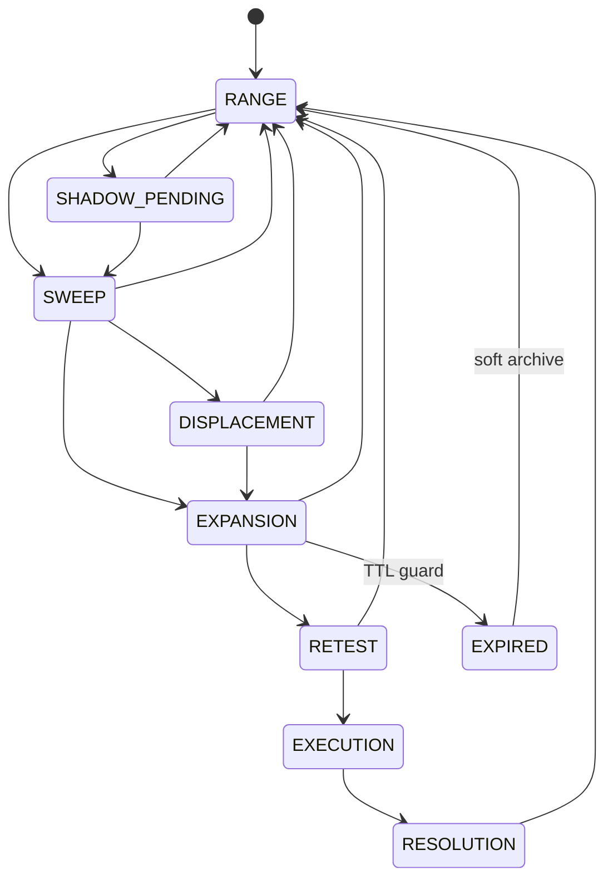

# event-taxonomy.md

> **Purpose (LLM context economy):** The complete catalogue of every event the system
> emits today, plus the state-transition grammar and the JSONL log inventory. An LLM
> loads this to answer "what events exist, what's their shape, where are they written,
> and which are replay-comparable" without grepping the tree.
>
> Anchored to config version `v2_multi_2026_04`. Citations are `file:line` — verify
> before acting.

---

## 1. Canonical envelope (the spine)

Every cross-component event is wrapped by `make_event_envelope()`
(`src/events/event_fabric.py:118`). Envelope fields:

| Field | Meaning | Replay-comparable? |
|---|---|---|
| `event_id` | `uuid4().hex[:8]` — correlation key | **No** (random) |
| `generation` | per-process monotonic counter (`:148`) | **No** (resets per process; may interleave with threaded `CognitiveBus`) |
| `event_type` | one of `EventType` | yes |
| `instrument` | symbol or `""` | yes |
| `source` | originating component | yes |
| `timestamp` | wall-clock ISO-8601 (`time.strftime`, `:152`) | **No** (wall-clock) |
| `schema_hash` | `FEATURE_ORDER_HASH` at emit (`:153`) | yes (drift detector) |
| `parent_event_id` | causal parent | yes |
| `payload` | event-specific dict | yes |

**Comparability rule (load-bearing):** cross-run comparison keys on `payload` +
`schema_hash` + (for trade events) the candle timestamp inside the payload — **never**
on `event_id`, `generation`, or the envelope `timestamp`. See
[`replay-governance.md`](replay-governance.md).

Declared invariants (`event_fabric.py:37-43`): every cross-component JSONL write uses
the envelope; `generation` strictly monotonic per process; `parent_event_id` builds
causal chains; `schema_hash` is a **passive** drift detector (no runtime code checks
it — offline audit only); the fabric is always on (no kill switch).

---

## 2. EventType registry (`event_fabric.py:56-67`)

11 members as of Trd-M2 (2026-05-29).

| EventType | Emitted today? | Emitter (file:line) | Sink |
|---|---|---|---|
| `DECISION_SNAPSHOT` | ✅ | `core/engine_runner.py` (queued to `CognitiveBus`) | in-memory bus |
| `COGNITIVE_TELEMETRY` | ✅ | `cognitive/cognitive_bus.py` | `logs/cognitive_telemetry.jsonl` |
| `ENGINE_TELEMETRY` | ✅ | `utils/engine_telemetry.py:35`; `utils/sweep_trace_logger.py:_emit_enveloped` | `logs/engine_telemetry.jsonl`; `logs/sweep_lifecycle.jsonl` |
| `DECISION_LINEAGE` | ✅ | `utils/engine_telemetry.py:36` | `logs/decision_lineage.jsonl` |
| `DRIFT_AUDIT` | ✅ | `replay/replay_drift_governor.py` | `logs/drift_audit.jsonl` |
| `REPLAY_QUERY` | ✅ Trd-M2 (monitoring-only) | `cognitive/cognitive_bus.py:_emit_replay_query` | `logs/replay_queries.jsonl` |
| `FEATURE_SNAPSHOT` | ✅ Trd-M2 (decision-bar) | `core/engine_runner.py` `_emit_enveloped_jsonl` (decision-bar cadence) | `logs/feature_snapshots.jsonl` |
| `REGIME_CLASSIFICATION` | ✅ Trd-M2 (on-change) | `core/engine_runner.py` `_emit_enveloped_jsonl` (after `detect_regime`) | `logs/regime_classifications.jsonl` |
| `QUEUE_HEALTH` | partial (bus health snapshots) | `cognitive/cognitive_bus.py` | bus |
| `TRADE_LIFECYCLE` | ✅ Trd-M1 (dual-write) | `utils/trade_logger.py:_emit_enveloped` (`:209`) | `logs/trade_lifecycle.jsonl` |
| `STATE_TRANSITION` | ✅ Trd-M2 (dual-write) | `config_layer/crt_engine_v2.py:EventLogger._emit_enveloped` | `logs/crt_transitions.jsonl` |

**Trd-M2 — event extraction (2026-05-29):** the three previously declared-but-silent types
are now emitted, plus a new additive `STATE_TRANSITION` type for enveloped CRT
transitions. Cadence is **curated, not per-bar**: `FEATURE_SNAPSHOT` fires once per scored
decision, `REGIME_CLASSIFICATION` only on regime change. `REPLAY_QUERY` is emitted from
the **threaded `CognitiveBus`** and is therefore **monitoring-only / non-replay-comparable**
(async emission order is not deterministic — exclude it from cross-run comparison, like
`event_id`/`generation`/wall-clock `timestamp`).

---

## 3. CRT state lifecycle (the episode grammar)

`CRTState` enum (`config_layer/crt_engine_v2.py:63-72`):
`RANGE(64)`, `SHADOW_PENDING(65)`, `SWEEP(66)`, `DISPLACEMENT(67)`, `EXPANSION(68)`,
`EXPIRED(69)`, `RETEST(70)`, `EXECUTION(71)`, `RESOLUTION(72)`.

**Legal transitions** — authoritative `VALID_TRANSITIONS` map
(`crt_engine_v2.py:1015-1025`). A transition not in this map is illegal:

```
RANGE          → SWEEP | SHADOW_PENDING
SHADOW_PENDING → SWEEP | RANGE
SWEEP          → DISPLACEMENT | EXPANSION | RANGE
DISPLACEMENT   → EXPANSION | RANGE
EXPANSION      → RETEST | EXPIRED | RANGE        # EXPIRED = Phase 3b TTL guard
EXPIRED        → RANGE                            # one-candle soft archive
RETEST         → EXECUTION | RANGE
EXECUTION      → RESOLUTION
RESOLUTION     → RANGE
```

Transitions are recorded as `STATE_TRANSITION` `EngineEvent`s in the in-memory
`state.event_log` (`_transition` calls `EventLogger.record`, `crt_engine_v2.py`; the
event is flushed to `{instrument}_events.jsonl` by the backtest writer). **Trd-M2:**
`EventLogger._emit_enveloped` now additively dual-writes each `STATE_TRANSITION` as a
canonical envelope to `logs/crt_transitions.jsonl` (payload = the flat `EngineEvent`
dict, carrying candle ts + candle_index → **replay-comparable**). The TTL guard emits an
`EXPANSION_EXPIRED` integrity event before moving `EXPANSION → EXPIRED`.

### Mermaid



### Episode boundary (defines the per-episode LLM log — Trd-M1 Part 2)

An **episode** is one traversal that begins on leaving `RANGE` and ends at a terminal
sink: `RESOLUTION → RANGE` (completed), `EXPIRED → RANGE` (TTL soft-archive), or any
`* → RANGE` reset (`reset_to_range`, `crt_engine_v2.py:1345`, called from the loop at
`:2125`/`:2145`). The per-episode LLM summary record is flushed at that boundary and
rolls up all enveloped events whose lifetime fell inside the episode.

---

## 4. JSONL log inventory

### Enveloped (use `make_event_envelope`) — replay-correlatable
| Path | Owner (file:line) | Payload highlights |
|---|---|---|
| `logs/engine_telemetry.jsonl` | `utils/engine_telemetry.py:35` | engine_name, score, confidence, latency_ms, cluster_id, failure_mode |
| `logs/decision_lineage.jsonl` | `utils/engine_telemetry.py:36` | decision_id, feature_snapshot, engine_outputs[], decision, risk_reduction, reason |
| `logs/cognitive_telemetry.jsonl` | `cognitive/cognitive_bus.py` | decision_id, core_decision, replay, market_state, hmf, latency_ms |
| `logs/drift_audit.jsonl` | `replay/replay_drift_governor.py` | clean, alerts[], cluster_entropy, staleness_ratio, contamination_score, novelty_score |

### NOT enveloped — Trd-M1 normalization targets (legacy flat — retained)
| Path | Owner (file:line) | Current shape |
|---|---|---|
| `logs/fusion_trades.jsonl` / `_…{instrument}.jsonl` | `utils/trade_logger.py:79`/`:92` | flat `{event:ENTRY|EXIT|REJECT, trade_id, timestamp, …}` (`:120`/`:152`/`:177`) |
| `logs/execution/runs/{run_id}/sweep_trace.jsonl` | `utils/sweep_trace_logger.py:335` | flat sweep-confidence decomposition |

### Trd-M1 — new enveloped streams (additive, dual-write)
| Path | Owner (file:line) | EventType | Notes |
|---|---|---|---|
| `logs/trade_lifecycle.jsonl` | `utils/trade_logger.py:_emit_enveloped` | `TRADE_LIFECYCLE` | Enveloped mirror of every ENTRY/EXIT/REJECT; payload = flat record |
| `logs/sweep_lifecycle.jsonl` | `utils/sweep_trace_logger.py:_emit_enveloped` | `ENGINE_TELEMETRY` | Enveloped mirror of every sweep decision; source=`SweepTraceLogger` |
| `logs/llm_episodes.jsonl` | `utils/episode_summarizer.py:_write` | flat | One record per CRT episode; candle-ts keyed; replay-comparable |
| `logs/llm_episodes.enveloped.jsonl` | `utils/episode_summarizer.py:_emit_enveloped` | `COGNITIVE_TELEMETRY` | Enveloped mirror of episode summary; source=`EpisodeSummarizer` |

### Trd-M2 — new enveloped streams (additive, event extraction)
| Path | Owner (file:line) | EventType | Notes |
|---|---|---|---|
| `logs/crt_transitions.jsonl` | `config_layer/crt_engine_v2.py:EventLogger._emit_enveloped` | `STATE_TRANSITION` | Enveloped mirror of every CRT `STATE_TRANSITION`; payload = flat `EngineEvent`; candle-ts keyed → **replay-comparable**; source=`CRTEngine` |
| `logs/feature_snapshots.jsonl` | `core/engine_runner.py:_emit_enveloped_jsonl` | `FEATURE_SNAPSHOT` | One per scored decision (decision-bar cadence); payload = `{decision, regime, features}`; source=`EngineRunner` |
| `logs/regime_classifications.jsonl` | `core/engine_runner.py:_emit_enveloped_jsonl` | `REGIME_CLASSIFICATION` | Emitted only on regime change; payload = `{regime, prev_regime}`; deterministic; source=`EngineRunner` |
| `logs/replay_queries.jsonl` | `cognitive/cognitive_bus.py:_emit_replay_query` | `REPLAY_QUERY` | Replay-memory lookup mirror; **monitoring-only / NOT replay-comparable** (async `CognitiveBus` thread); source=`CognitiveBus` |

### Documented exception — intentionally NOT enveloped
| Path | Owner (file:line) | Why exempt |
|---|---|---|
| `logs/integrity_events.jsonl` | `utils/integrity_events.py:36` | Deliberately avoids importing `event_fabric` (docstring `:16-18`) so it stays importable from **any** layer incl. `scripts/`. Shape `{ts, event, severity, source, payload}` is already structured + auditable. **Trd-M1 leaves it untouched.** |

### Other JSONL streams (domain logs, not part of Trd-M1)
`logs/trade_journal.jsonl` (`journal/trade_logger.py:15`), `logs/live_alerts.jsonl`
(`engines/live_engine.py:597`), `logs/expansion_trace.jsonl` /
`logs/expansion_rejected.jsonl` (`expansion/expansion_engine.py:20-21`),
`logs/agent_audit.jsonl` + `logs/agent_intent_log.jsonl` (control_plane registry
`:794`), `logs/governance_audit.jsonl` (`:360`), `configs/promotion_log.jsonl`
(governance).

---

## 5. Trd-M1 decision — trade-lifecycle event type

The ENTRY/EXIT/REJECT records in `trade_logger.py` are trade-lifecycle facts, not pure
decision snapshots. **Decision:** add an additive `EventType.TRADE_LIFECYCLE` member to
`event_fabric.py` (additive enum extension is backward-safe) and wrap each flat record
as the envelope `payload`. Reuse of `DECISION_SNAPSHOT` was rejected because its
convenience wrapper (`make_decision_snapshot_envelope`, `:157`) has a fixed
decision-shaped payload that does not fit ENTRY/EXIT/REJECT.

**Dual-write during Trd-M1:** the legacy flat `fusion_trades.jsonl` writers remain
unchanged; the enveloped events are emitted in addition, pending an explicit cutover.
This preserves any consumer parsing the flat schema (telemetry continuity).

---

## 6. The five governance questions, applied to events

1. **Deterministic replay?** Events are logging side-effects; emission order is
   deterministic in single-threaded replay. The threaded `CognitiveBus` must not feed
   back into decisions (it does not).
2. **Comparable across runs?** Yes, if tooling keys on payload + schema_hash + candle
   ts and ignores `event_id`/`generation`/wall-clock `timestamp`.
3. **Auditable later?** Yes — append-only JSONL; `parent_event_id` chains; episode
   summaries link to `child_event_ids`.
4. **Can an LLM reason about it?** The per-episode LLM log exists precisely for this —
   a compact causal narrative per episode.
5. **Execution authority isolated?** Events never gate a trade; they are observation
   only.
