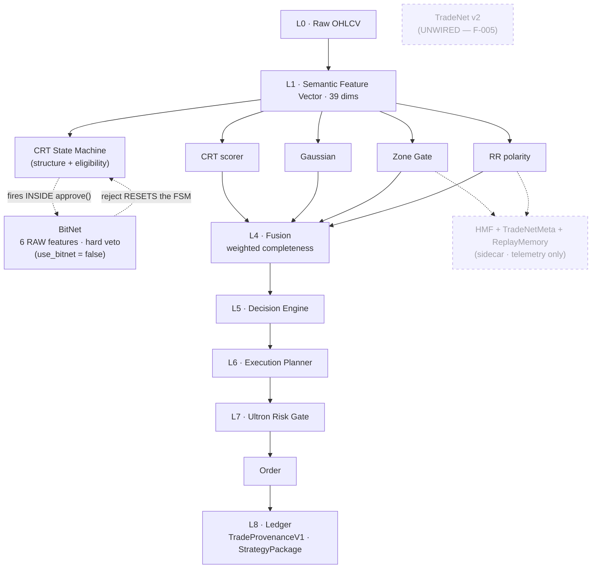
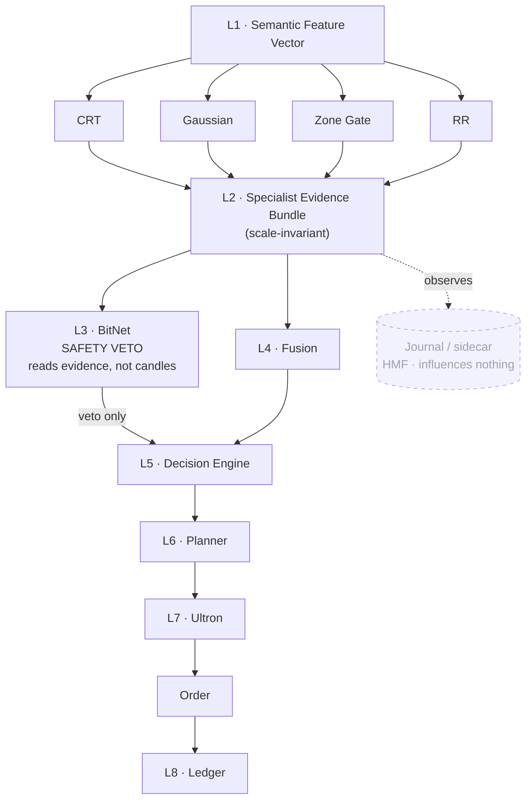

# Intelligence Topology

> **What this is.** How semantic features, specialist models, meta-models, and fusion actually
> relate — current state and target state. The **layer law** that says which model may read which
> other model's output, and why.
>
> **Created:** 2026-07-29 · **Status:** AUTHORITATIVE for topology (which layer a model occupies
> and what it may read). **Not** authoritative for model *intent* — on any intent conflict,
> [`MODEL_INTENT_AUTHORITY_REGISTER.md`](../governance/MODEL_INTENT_AUTHORITY_REGISTER.md) (MIAR)
> wins per its §0 hierarchy. Grants **no** authority to any model (CLAUDE.md §6.5).
>
> **Supersedes in scope:** [`model-design-intent.md`](model-design-intent.md) Part VII, which
> carries `Authority: NONE`. That document remains the richer *narrative* (per-model design
> essays, redundancy analysis, grades) and is still the place to understand *why* each model was
> built. This document promotes only its **structural** conclusions, reconciled against MIAR's
> stage vocabulary.
>
> **Companions:** [`model-responsibility-matrix.md`](model-responsibility-matrix.md) (who may do
> what) · [`bitnet-design-specification.md`](bitnet-design-specification.md) (the L3 proposal) ·
> [`target-strategy-architecture.md`](target-strategy-architecture.md) §0.2 (four concepts that
> stay separate) · [`config_authority_matrix.md`](../governance/config_authority_matrix.md) §10–13

---

## 1. The layer law

> **A model at layer N may read layers < N. A model may never read L1 *and* claim to arbitrate
> L2.**

Independence belongs at L2; arbitration belongs at L3+. The reason is not tidiness — it is that
**a model reading the same raw evidence as the specialists adds correlated noise, not an
independent check.** A panel of witnesses is only worth having if the witnesses saw different
things; an arbiter is only worth having if it read the testimony rather than re-attending the
event.

| Layer | Contents | May read |
|---|---|---|
| **L0** | Raw OHLCV | — |
| **L1** | Semantic feature vector (39 dims) | L0 |
| **L2** | Specialists — CRT, Gaussian, Zone Gate, RR | L1 |
| **L3** | Evidence consumers / meta-models | L2 (**not** L1) |
| **L4** | Fusion — weighted completeness over L2 (+ L3) | L2, L3 |
| **L5** | Decision — sole `execute` authority | L4 |
| **L6** | Execution planner — SL/TP/TTL | L5 |
| **L7** | Risk authority — sizing, affordability, veto | L6 |
| **L8** | Ledger / provenance | all |

`EXPECTED_ENGINES = {crt, gaussian, zone_gate, rr}` is the L2 membership list, and L4 hard-rejects
if any member is missing — no partial fusion (goal.md invariant #2).

---

## 2. Current state

**Three structural defects visible in that diagram:**

1. **BitNet is at the wrong layer and in the wrong place.** It reads L1 (six raw features:
   `body_ratio, retest_depth, disp_strength, atr, candles_since_retest, double_sweep`) and fires
   *inside* the CRT state machine — **before** fusion runs at all. It never sees Gaussian, Zone
   Gate, or RR. It is not a fifth opinion on the panel; it is a private gate upstream of the
   panel. A reject **resets the FSM**, so gate-ON is a divergent trajectory rather than a filtered
   subset (F-055: BNB had 50 `LOW_SCORE` rejects yet net trades stayed 11 → 11 — removed ≠ added).
2. **L3 is occupied, but only by dormant tenants.** `HierarchicalMetaFusion` + `TradeNetMeta` +
   `ReplayMemory` genuinely consume L2 outputs — the correct L3 shape — but write telemetry only
   (F-012, MIAR §3A). The layer that *should* hold arbitration holds nothing with authority.
3. **The one built L2-consumer of trajectory information is unwired.** `TradeNet v2` is complete
   and never called — `FusionEngine` is never constructed with a `neural_fn` (F-005).

**Also true, and load-bearing:** there is **no dynamic model dispatch** anywhere.
[`config_authority_matrix.md`](../governance/config_authority_matrix.md) §10.6 records
`STATE_TO_MODEL_RESOLVER_EXISTS = NO` and `FEATURE_TO_MODEL_RESOLVER_EXISTS = NO`. The
state→feature and state→model dependencies are *mapped* (declared in `active_models.yaml`
`state_contracts`) but nothing resolves them at runtime. Every edge above is hardcoded call order
in `EngineRunner.run()`. Treat the declared graph as documentation, not as behavior.

---

## 3. Target state

**The delta, stated plainly:** BitNet moves from *upstream of the panel, reading raw candles,
mutating the state machine* to *downstream of the panel, reading testimony, vetoing only*. Its
authority level is unchanged (Safety / veto). What changes is **what it looks at** and **what it
can perturb**.

Full specification, including consumption channels and the qualification ladder:
[`bitnet-design-specification.md`](bitnet-design-specification.md).

---

## 4. The two L3 tenants — reconciliation

L3 now has two claimants: **BitNet** (proposed) and **HMF** (existing, dormant). They must be
reconciled, not stacked, or the repository ships two dormant meta-layers doing the same job.

They are **not** the same thing, and the distinction is the reason both may exist:

| | BitNet (target) | HMF (existing) |
|---|---|---|
| Question | *Is this unsafe?* | *How much capital would this deserve?* |
| Output | Acceptability score → **binding veto** | Allocation-quality score → **telemetry** |
| Direction | Negative only (can reject, never promote) | Bidirectional (ALLOW / REDUCE / REJECT) |
| Authority | Veto, when earned | None, by contract |
| Failure mode if wrong | Misses a bad trade | Journal entry is wrong |

**Ruling for this topology:** they occupy L3 as **different channels**, not competitors —
BitNet is the *safety* channel (binding, negative-only); HMF is the *judgment* channel
(advisory, bidirectional). Neither absorbs the other.

Two constraints follow, and both are binding:

1. **HMF must not gain veto authority by proximity.** If BitNet lands at L3 with a binding
   channel, HMF's zero-authority contract (MIAR §3A) does not change. Enforced by
   `tests/test_miar_registry.py::test_sidecar_has_zero_spine_authority`.
2. **BitNet must not grow HMF's bidirectional shape.** A safety layer that can *promote* is no
   longer a safety layer. Its non-goals already forbid this ("never optimize entries").

If a future program wants a single unified L3 arbiter, that is a **merge decision requiring a new
MIAR entry** — not something either layer drifts into.

---

## 5. Redundancy map (promoted from Part VII)

Which models measure the same thing today. This is the topology's honest accounting of
duplication; it grants no instruction to merge.

| Concept | Surfaces | Status |
|---|---|---|
| **Familiarity** | Gaussian heuristic · Gaussian ML density · Zone Gate similarity kernel · CRT internal distance-decay | 4 surfaces; legitimate split is global-vs-local, so ≥2 are redundant |
| **Regime** | `detect_regime` (runtime) · MarketStateCluster (sidecar) · RegimeLabeler/Markov (research) · CandleStateEncoder (research) | 4 vocabularies, succession never adjudicated |
| **Structure** | CRT state machine · fusion-slot CRT scorer · S01 wrapper | 1 perception, 3 surfaces |
| **Trap / breakout** | `trap_engine` vs S10 · `breakout_engine` vs S03 (+ CRT EXPANSION) | sketch-vs-specialist duplicates |
| **Meta-fusion** | FusionEngine (spine) · HMF + TradeNetMeta (sidecar) | HMF and TradeNetMeta overlap *each other* |
| **Trade outcome** | RR NanoInference (magnitude) · TradeNet (trajectory) | **Healthy** — same subject, different decompositions |

### Never merge

- **CRT and Zone Gate** — narrative and precedent are independent evidence axes. Merging lets
  structure define similarity and destroys the panel's diversity.
- **Decision Engine and Ultron Risk Gate** — conviction and affordability must stay separate
  authorities. The moment risk negotiates with enthusiasm inside one module, capital protection
  becomes a parameter. (F-048 moved economic RR to Ultron for exactly this reason.)
- **Cognitive Bus and Fusion Engine** — the one-way mirror *is* the point. Merging the observing
  brain into the deciding brain is how unearned authority happens.
- **Any witness into Fusion** — witnesses testify; they must not also weigh.

---

## 6. What no layer produces

Gaps, not defects — recorded so they are not rediscovered:

1. **Probability calibration.** Scores everywhere, calibrated probabilities nowhere. No layer
   converts fused conviction into "this wins X % of the time," so thresholds are *tuned* rather
   than *meant*. This is the single largest structural gap.
2. **Runtime portfolio reasoning.** Nothing reasons about cross-instrument correlation at
   runtime; the cross-sectional axis exists only as research (F-032).
3. **Order flow / depth.** Every model reads candles; none reads the book.
4. **Execution-quality feedback.** Fills and slippage are observed but never close the loop back
   into planning.
5. **A drift actuator.** Drift is *detected* and not acted on (F-008) — the sensor exists, the
   reflex does not.
6. **In-trade management.** No layer manages a live position against an expected path.
7. **Runtime statistical validation.** The qualification oracle is offline-only; the live system
   never re-asks whether a witness still passes its own trial.

---

## 7. Maintenance

- A new model declares its **layer** before it is wired, and the layer law decides what it may
  read. A model that needs L1 *and* L2 inputs is mis-specified — split it.
- Moving a model between layers is a **topology change**: it requires a MIAR
  `authority_boundary` review and an entry in
  [`model-responsibility-matrix.md`](model-responsibility-matrix.md).
- Adding an L3 tenant requires stating, in §4, its relationship to every existing L3 tenant.
- If a state→model or feature→model resolver is ever built, §2's closing note must be updated —
  the "no dynamic dispatch" fact is load-bearing for reasoning about this system.
