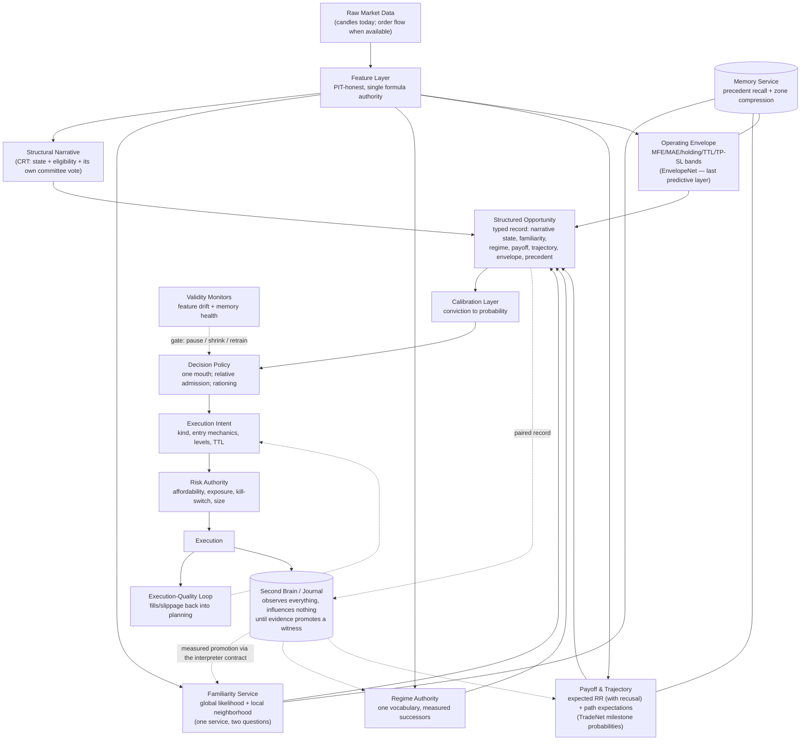

# Model Design Intent — The Original Architecture of Every Model

> **What this document is.** A reconstruction of the *original architectural intent* of every
> model in this repository, written the way the system's architect would explain it — in terms
> of **information contribution**, not implementation. It deliberately ignores production
> enablement, training quality, label contamination, disabled flags, and whether Fusion
> currently consumes a model. Those belong to implementation truth and live in the five
> lineage audits ([`gaussian`](../governance/gaussian_lineage_audit.md) ·
> [`zonegate`](../governance/zonegate_lineage_audit.md) ·
> [`bitnet`](../governance/bitnet_lineage_audit.md) ·
> [`rr`](../governance/rr_lineage_audit.md) ·
> [`tradenet`](../governance/tradenet_lineage_audit.md)), in
> [`docs/topics/model-intent-and-feature-ownership.md`](../topics/model-intent-and-feature-ownership.md),
> and in [`active_models.yaml`](../../active_models.yaml). On any conflict about *what runs
> today*, those win. On the question *why a model exists*, this document is the narrative.
>
> **Authority: NONE (§6.5).** A design grade here is an opinion about an idea. It grants no
> wiring, retraining, enabling, or promotion authority. A contaminated model may still carry
> an excellent architectural idea — and several below do.
>
> Created: 2026-07-22 · Status: living · Sibling: [`signal-flow.md`](signal-flow.md) (how the
> spine executes) · [`goal.md`](goal.md) (what good looks like)

**How to read each entry.** One CTO sentence · the model as a human trader · the ONE question
it answers · what NEW information it adds (a conversion of one kind of information into
another — never an input list) · what the system loses architecturally if it disappears ·
relationships · redundancy verdict · exactly one Information Category (Structural, Statistical,
Risk, Probability, Geometry, Execution, Memory, Regime, Portfolio, Research, Infrastructure) ·
a design grade **A** excellent idea / **B** useful but overlapping / **C** weak idea /
**D** probably unnecessary — judged on architecture alone.

---

# Part I — Evidence Producers (opportunity and validation witnesses)

## 1. CRT State Machine (`crt_engine_v2`)

**One sentence.** CRT exists to read the market as a *story with chapters* — accumulation,
liquidity grab, institutional commitment, confirmation — and to forbid trading until the story
has reached the exact chapter where the theory says the odds exist.

**As a human trader.** *"I understand market structure. I don't predict anything — I wait. I
watch a range form, I watch stops get swept, I watch whether the sweep was rejected with force,
and I only act when price comes back to retest the scene of the crime."*

**The one question.** *What chapter of the liquidity story is the market in right now — and has
it earned the right to be traded?*

**New information added.** CRT converts an undifferentiated candle stream into a **discrete
structural narrative state**. Before CRT, the system knows prices; after CRT, it knows *where it
is in a story* (RANGE → SWEEP → DISPLACEMENT → EXPANSION → RETEST → EXECUTION → RESOLUTION,
with a memory branch for interrupted stories and a TTL branch for stale ones). This is the only
model that gives the system a notion of *sequence and eligibility* — everything else scores a
moment; CRT scores a plot.

**If removed.** The system loses structural understanding entirely. Every other model becomes a
stateless opinion about a bar with no answer to "why now, and not the bar before?" The whole
architecture is built as *CRT proposes, others validate* — remove CRT and there is no proposal.

**Relationships.** The anchor producer. Every validator (Gaussian, ZoneGate, RR, BitNet,
TradeNet) was designed to second-guess a CRT-shaped moment. Its internal soft-confirmation
(structure score × confirmation manifold, tiered risk) is a miniature fusion engine of its own —
evidence the designer believed *structure must self-certify before asking others*.

**Redundant?** No. Nothing else produces sequence-aware structural state. (Its echoes — the
fusion-slot scorer, S01 — are redundant with *it*, not the reverse.)

**Category.** Structural. **Grade: A.** A deterministic, legally-constrained state automaton
with explicit transition rules, expiry, and a memory branch is the strongest idea in the
repository: it makes the rarest commodity in trading systems — *the decision of when a setup
even exists* — inspectable and falsifiable.

## 2. Fusion-slot CRT scorer (`engines.crt_engine.compute`)

**One sentence.** A flattened, stateless echo of CRT that lets the fusion committee hear
"structure quality" as a number without consulting the state machine's memory.

**As a human trader.** *"I glance at the chart and grade the structure 0-to-1. I don't remember
yesterday."*

**The one question.** *How structurally attractive does this single moment look?*

**New information added.** Almost none beyond §1 — it re-expresses structural evidence as a
weighted scalar so the fusion layer can blend it. Its architectural purpose is *format
conversion* (narrative → committee vote), not new perception.

**If removed.** Fusion loses its structure vote — but the information still exists upstream in
the state machine. The loss is representational, not informational.

**Relationships.** Supports FusionEngine; competes with (and is dominated by) the state machine.

**Redundant?** Yes — a deliberate redundancy: the designer wanted structure represented *inside*
the committee, at the cost of a second CRT surface whose scoring can drift from the first.

**Category.** Structural. **Grade: C.** The need is real (fusion needs a structure vote) but
the solution — a second, independent structure scorer — creates a twin that must be kept honest
forever. The cleaner idea is one CRT emitting both the state and the vote.

## 3. Gaussian — statistical familiarity (heuristic + ML as one idea)

**One sentence.** Gaussian exists to ask whether this moment is *statistically normal* — whether
the market's current behavior sits inside the distribution of behavior the system has lived
through.

**As a human trader.** *"I understand what normal looks like. I can't tell you the story, but I
can tell you instantly when something is off-distribution — too fast, too stretched, too
unfamiliar."*

**The one question.** *Is this statistically familiar?*

**New information added.** Converts raw trend/momentum geometry into **distributional
likelihood** — a second, story-free axis of evidence deliberately orthogonal to CRT: CRT says
*the narrative is right*, Gaussian says *the numbers are in-range*. The two-fidelity design is
itself intentional: a cheap 3-feature kernel that can run on every bar, and a full 38-dimension
learned density for when fidelity is worth the cost. Same idea, two price points.

**If removed.** The system loses its normality sense — it would take structurally perfect
setups in statistically deranged conditions with no witness objecting.

**Relationships.** Validates CRT; competes softly with ZoneGate (both are familiarity, see §I
table); anchors the FusionEngine's layered evaluate path (Gaussian first, others refine).

**Redundant?** Partially. *Global* familiarity (Gaussian) and *local* similarity (ZoneGate) are
distinct questions, but the repository has grown four Gaussian-shaped surfaces (this engine, the
zone similarity kernel, CRT's internal distance-decay, the ML density) that all express
"distance from what I know" — the concept is right, the multiplicity is not.

**Category.** Statistical. **Grade: B.** The familiarity axis is essential; the overlap with
its own siblings is the flaw.

## 4. ZoneGate

**One sentence.** ZoneGate exists to determine whether today's market geometry resembles
geometry the system has seen before — precedent as evidence.

**As a human trader.** *"Before I sign off, I open my scrapbook. Have we traded a day shaped
like this? Which neighborhood of my memory does this bar live in, and how tight is that
neighborhood?"*

**The one question.** *Have I seen this geometry before?*

**New information added.** Converts the full feature portrait of a moment into **historical
similarity evidence** — not "is this normal" (Gaussian's global question) but "which *specific
cluster* of past moments is this closest to, and how confidently?" It is compressed
institutional memory made queryable in one pass: the map of the market's recurring shapes.

**If removed.** The system loses historical similarity — the ability to say "this exact kind of
moment has a track record." Novel and precedented setups become indistinguishable.

**Relationships.** Validates CRT; sibling of Gaussian (local vs global familiarity); the
parametric, always-on cousin of ReplayMemory (which recalls raw precedents on demand). The
research IC-003B shape library is the same design idea applied to trajectories instead of
moments.

**Redundant?** Conceptually distinct from Gaussian; operationally overlapping. The intended
division — Gaussian = *how far from everything*, ZoneGate = *which neighborhood, how close* — is
a legitimate two-model split.

**Category.** Statistical. **Grade: A.** "Precedent as a first-class, always-on witness" is an
excellent idea, and clustering history into a small set of named neighborhoods is the right
compression for a real-time gate.

## 5. RR Polarity Index (`RREngine`, contract A)

**One sentence.** RR-A exists to read the conviction written into a single candle — whether the
close committed to an extreme or died in the middle.

**As a human trader.** *"I read one candle at a time. Did the buyers finish the job, or did the
bar close in no-man's-land?"*

**The one question.** *How committed was this candle?*

**New information added.** Converts one bar's close-vs-extremes geometry into a **conviction
scalar**. It is the smallest witness in the system — micro-scale commitment, one bar of
context.

**If removed.** The system loses per-candle conviction — a modest loss, since displacement
quality inside CRT carries most of the same signal at the story scale.

**Relationships.** Supports Fusion as a fourth vote; historically *mistaken for* a payoff
estimator by its consumer because it wears a payoff name (`rr_ratio`) — the canonical case study
in why a model's output must be named for the information it carries.

**Redundant?** Largely — CRT's displacement/body gates already price candle conviction into the
narrative.

**Category.** Geometry. **Grade: C.** Not wrong, just thin: a one-bar feature promoted to
engine rank, and named so misleadingly that it corrupted its consumer's reasoning.

## 6. RR NanoInference (`RRFusionLayer`, contract B)

**One sentence.** RR-B exists to estimate the *expected payoff* of a setup from its full feature
portrait — and, crucially, to know when it is too unfamiliar with the situation to be trusted.

**As a human trader.** *"I estimate what this trade should earn, and I'm honest about my
competence: if the situation is outside my experience, I abstain and let the simpler judges
decide."*

**The one question.** *Is the payoff attractive — and am I qualified to say?*

**New information added.** Two things at once: **expected reward-to-risk** (a learned payoff
forecast, information no geometric model produces) and **self-assessed competence** (a
familiarity-gated confidence that routes the decision back to simpler evidence when the model is
out of its depth). The second is the rarer idea: a witness that can recuse itself.

**If removed.** The system stops reasoning about *learned* payoff before entry — payoff becomes
purely geometric (planner levels vs risk floor) with no historical expectation attached.

**Relationships.** Designed to *refine* (mutate) the RR vote, not replace it; defers to Gaussian
on low confidence; sibling of TradeNet (both forecast trade outcomes; RR-B forecasts magnitude,
TradeNet forecasts trajectory).

**Redundant?** No other model estimates expected payoff. Overlap with TradeNet is partial and
complementary.

**Category.** Probability. **Grade: A.** "Predict the payoff, but gate the prediction on
know-when-you-don't-know" is textbook-good architecture — the recorded failures are calibration
of the recusal gate, an implementation matter this document ignores.

## 7. BitNet veto

**One sentence.** BitNet exists as a learned doorman — a tiny network that can say a fast,
cheap "no" to a structurally valid setup before the system spends risk budget on it.

**As a human trader.** *"I'm the gut check at the door. The analysts approved you; I've seen
six numbers and thousands of nights, and something's off. Not tonight."*

**The one question.** *Does learned pattern memory object to this otherwise-approved setup?*

**New information added.** A **compressed nonlinear prior** over a handful of setup features —
interactions too tangled for threshold rules, distilled into one accept/reject scalar. Its
architectural distinctiveness is position and cost: a last-line veto inside the structural
engine, not a committee member.

**If removed.** The system loses its learned last-line objection. Modest loss: the fusion
committee already aggregates learned and statistical evidence upstream.

**Relationships.** Vetoes CRT's output from inside CRT; competes with the entire fusion
committee (a second, private judgment seat); shares its zone-similarity namespace by accident,
not by design.

**Redundant?** Mostly. A learned veto *inside* the proposer duplicates the committee's job while
answering to no one — and a veto that resets the narrative (rather than skipping the trade)
entangles judgment with perception.

**Category.** Probability. **Grade: C.** Cheap learned vetoes are a respectable pattern, but
placing one inside the state machine, off the committee record, is the wrong seat in this
architecture.

## 8. TradeNet v2 — trade-evolution forecaster

**One sentence.** TradeNet exists to predict how a trade is likely to *evolve after entry* —
not whether to enter, but what the journey will look like.

**As a human trader.** *"I understand how trades usually unfold. This kind of entry — does it
typically reach the first target? The second? Does it at least survive to breakeven before the
market decides?"*

**The one question.** *What usually happens after this?*

**New information added.** **Path expectations.** Every other pre-entry witness scores the
moment; TradeNet's three heads (reach TP1, reach TP2, survive to 1R) forecast the *shape of the
future trade* — survival-analysis thinking instead of binary win/loss. This is unique
information: the difference between "good setup" and "setup whose winners mature slowly and
whose losers die instantly," which is exactly what sizing, target placement, and management
need to know.

**If removed.** The system loses forward trajectory knowledge — everything becomes entry-moment
scoring, and nothing informs what to *expect and manage* after the fill.

**Relationships.** Designed as the neural refinement layer of Fusion (the reserved socket);
complements RR-B (magnitude vs trajectory); its sidecar cousin (TradeNetMeta) reuses it as a
base probability for capital-quality reasoning.

**Redundant?** No — sole owner of the post-entry-evolution axis.

**Category.** Probability. **Grade: A.** Decomposing "will it win" into three path milestones
is the most sophisticated modeling idea in the repository, and the reserved fusion socket shows
it was designed in as a first-class layer, not bolted on.

## 8b. EnvelopeNet — post-entry operating envelope (DESIGN ACCEPTED · not built)

> Full architecture contract: [`envelope-layer-design.md`](envelope-layer-design.md)
> (`ENV_ARCH_V1`, **user-accepted 2026-07-22**). **Authority: NONE** — design freeze only;
> no code, wiring, or training until an explicit ENV-0 / ENV_QUAL charter.

**One sentence.** EnvelopeNet exists to forecast the realistic **price–time operating box** of a
trade after entry — how far price is expected to run (MFE), how much heat it should tolerate
(MAE), how long capital stays locked, what TP/SL bands are coherent, and when the plan expires —
with explicit uncertainty.

**As a human trader.** *"I don't just ask whether this will work. I ask: what's the room this
trade needs — how deep can it go against me, how far can it reasonably go for me, and how long
do I have to wait before the idea is dead?"*

**The one question.** *Inside what price–time envelope should this trade live after entry?*

**New information added.** **Operating boundaries** — continuous / quantile forecasts of path
geometry (MFE/MAE in R, holding duration, TTL, achievable TP band, tolerable SL band,
confidence). Distinct from TradeNet’s *milestone probabilities* and from Planner’s *policy*
levels: TradeNet says what usually happens; EnvelopeNet says the box those happenings fit in;
Planner applies rules unless and until envelope evidence earns authority.

**If removed.** The system keeps outcome odds (if TradeNet is live) but still invents TTL/TP/SL
from static policy and structure alone — no learned answer to “how much room and time does this
setup class actually need?”

**Relationships.** Last predictive module before Fusion (after TradeNet). Fusion consumes it as
coherence + optional `risk_mult` + pass-through — **not** as a fifth scalar engine vote.
Primary long-term consumer is ExecutionPlanner level/TTL refinement; Ultron stays account risk.
Labels must be `forward_walk` / `horizon_excursion` (F-022 ban on stream MFE as sole y).

**Redundant?** No — sole owner of the post-entry *boundary* axis. Complements §8 (path
probabilities) and §6 (expected payoff magnitude); does not replace either.

**Category.** Risk (boundaries) + Probability (quantiles). **Grade: A** as architecture.
Closes the *expected-path box* half of missing stage #6; does **not** alone provide bar-by-bar
in-trade management.

## 9. trap_engine (dual-engine range channel)

**One sentence.** A pocket-sized specialist that, when the market is ranging, looks for
liquidity grabs to fade.

**As a human trader.** *"In a range, the breakout is usually a lie. Show me the sweep, and I'll
fade it."*

**The one question.** *In this range, was that move a trap to fade?*

**New information added.** A **regime-conditional directional opinion** — counter-trend by
construction. Its real contribution is not perception (it reuses sweep/displacement evidence)
but the *routing idea it embodies*: different market weather deserves a different specialist.

**If removed.** The range-regime channel loses its voice; the trap *concept* survives in richer
form elsewhere (CRT's sweep chapter, S10).

**Relationships.** Selected by the regime governor; competes with S10 (the full trap
specialist) and with CRT's own sweep semantics.

**Redundant?** Yes, twice over.

**Category.** Structural. **Grade: C.** The routing idea is good (see §15); this particular
voice is a three-feature sketch of a concept the system already owns twice.

## 10. breakout_engine (dual-engine trend channel)

**One sentence.** The trap engine's mirror twin: when the market is trending, ride confirmed
momentum.

**As a human trader.** *"In a trend, I don't fade — I join, once momentum and spread agree."*

**The one question.** *In this trend, is the move worth joining?*

**New information / removal / relationships.** Symmetric to §9: a regime-conditional
trend-following opinion, redundant with S03 and with CRT's EXPANSION chapter; its value is as
the second voice of the routing pattern, not as perception.

**Redundant?** Yes. **Category.** Structural. **Grade: C.**

## 11. S1–S10 Strategy Floor (`StrategyOrchestrator`)

**One sentence.** A trading floor of ten heterogeneous specialists — CRT wrapper, mean
reversion, breakout, stat-arb, grid, scalping, news, ML ensemble, pattern recognition, trap —
whose *agreement* is offered to the committee as one more kind of evidence.

**As a human trader.** *"We're the floor. When the structure guy, the pattern reader, and the
trap hunter independently want the same side, that consensus is information none of them has
alone."*

**The one question.** *Do independent trading styles agree right now?*

**New information added.** **Cross-style consensus** — the correlation of opinions across
deliberately different lenses, delivered as a single strength-of-agreement signal. The
individual strategies add little the engines don't; the *agreement statistic* is the genuinely
new object.

**If removed.** The system loses style-diversity as evidence. Losses are bounded because the
strongest members (S01, S03, S10) are echoes of existing engines.

**Relationships.** Feeds Fusion as an optional fifth vote; internally duplicates CRT (S01),
breakout (S03), and trap (S10); the classic ensemble-of-strategies pattern living alongside an
ensemble-of-engines that already exists.

**Redundant?** As perception, substantially. As a consensus *statistic*, no one else produces
it.

**Category.** Statistical. **Grade: B.** A diverse committee is sound classical architecture —
but this repository already *is* a diverse committee (the engines), so the floor is a second
committee whose unique contribution shrinks to its agreement number.

## 12. PNF-v1 (Point & Figure interpreter)

**One sentence.** A deliberately frozen, price-only chartist admitted under the interpreter
contract to test — honestly and falsifiably — whether a century-old charting language carries
edge on this market.

**As a human trader.** *"I ignore time entirely. Boxes and reversals; double tops and double
bottoms. One vocabulary, no tuning, judge me on my record."*

**The one question.** *Does the P&F double-top/bottom vocabulary say anything predictive here?*

**New information added.** A **time-free structural reading** — the only witness whose clock is
price movement itself. Architecturally its larger contribution is procedural: the model-shaped
embodiment of "new ontologies enter as measured, identity-blind witnesses, never as wired
authority."

**If removed.** Nothing on the spine changes; the research program loses its first worked
example of the interpreter pathway.

**Relationships.** Child of the Interpreter Contract (§31); an alternative structural language
competing with CRT's, on trial.

**Redundant?** As a candidate it is *supposed* to risk redundancy — that is what the trial
measures.

**Category.** Geometry. **Grade: B.** The model is modest; the admission discipline around it
is exemplary.

### Part I comparison

| Model | Unique information | Overlap | Essential? |
|---|---|---|---|
| CRT state machine | Structural narrative state + eligibility timing | Echoed by fusion-slot CRT, S01 | **Yes — the anchor** |
| Fusion-slot CRT | none (format conversion of CRT) | Total, by design | No |
| Gaussian | Global statistical familiarity | ZoneGate, CRT's distance kernel | Yes (as an axis) |
| ZoneGate | Local precedent similarity (which neighborhood) | Gaussian (global vs local) | Yes (as an axis) |
| RR polarity | Single-candle conviction | CRT displacement gates | No |
| RR NanoInference | Expected payoff + self-recusal | TradeNet (partial) | Yes (payoff axis) |
| BitNet | Compressed learned veto | Fusion committee's whole job | No |
| TradeNet v2 | Post-entry trajectory expectations (milestone probabilities) | EnvelopeNet (related horizon, different kind) | Yes (evolution axis) |
| EnvelopeNet (design) | Post-entry operating bounds (MFE/MAE/time/TTL/bands) | none for bounds axis | Yes (envelope axis) |
| trap_engine | — | S10, CRT sweep | No |
| breakout_engine | — | S03, CRT expansion | No |
| S1–S10 floor | Cross-style consensus statistic | Engines (members are echoes) | No |
| PNF-v1 | Time-free structural reading (on trial) | CRT (rival language) | No (research) |

---

# Part II — Regime & Context

## 13. detect_regime (3-way classifier)

**One sentence.** The system's weather report: one word — trend, range, or neutral — that every
downstream judgment is allowed to condition on.

**As a human trader.** *"Before anyone opens their mouth: what kind of day is it?"*

**The one question.** *What kind of market is this, right now?*

**New information added.** Converts trend-strength, momentum, and volatility readings into a
**shared context label**. Its value is less the classification (three coarse buckets) than the
*shared* part: one regime word that fusion weights, specialist routing, and quality gates all
agree to condition on.

**If removed.** All context-conditioning collapses to one-size-fits-all: fixed fusion weights,
no specialist routing, uniform acceptance bars.

**Relationships.** Feeds §14, §15, and the dual-engine selection; competed with by every other
regime mechanism in this part.

**Redundant?** It has three would-be successors (cluster-native, tercile/Markov, story-level)
none of which replaced it — the clearest case of an unresolved succession in the architecture.

**Category.** Regime. **Grade: B.** Necessary axis, crude instrument, contested ownership.

## 14. Regime-weighted fusion profiles

**One sentence.** The belief that *how much you trust each witness should depend on the
weather* — structure speaks loudest in trends, familiarity in ranges — encoded as per-regime
weighting of the committee.

**As a human trader.** *"In a trend I listen to my structure guy; in chop I listen to my
statistician; when it's wild I mostly listen to consensus."*

**The one question.** *Given the regime, whose testimony deserves the microphone?*

**New information added.** None directly — it is a **second-order design statement**: evidence
reliability is regime-dependent. That statement is itself knowledge, and encoding it at the
fusion layer (rather than inside each model) keeps the witnesses pure and the context handling
central.

**If removed.** Fusion becomes context-blind averaging; every witness counts the same in
conditions where its historical reliability differs.

**Relationships.** Consumes §13; modulates §24. **Redundant?** No — unique second-order role.

**Category.** Regime. **Grade: A.** One of the quietly best ideas in the system: adaptivity
placed at the aggregation layer, where it is centralized, inspectable, and cheap.

## 15. RegimeGovernor (quality/throughput governor)

**One sentence.** A flow controller that forces each regime's signals to compete against their
own recent peers — percentile bars per regime, penalties for hostile conditions, and a daily
budget — so that "good enough" is always defined relative to the current market.

**As a human trader.** *"You're not competing against an absolute bar; you're competing against
this week's field, in this weather. And we only take our three best a day."*

**The one question.** *Is this signal good relative to its peers in this regime — and do we
have budget left for it?*

**New information added.** **Relative quality rank.** Every other gate is absolute; the
governor introduces self-normalizing selectivity (rolling percentile within regime) plus
scarcity (quota). It converts a score into a *rank*, which is a different kind of information.

**If removed.** The system loses adaptive selectivity and rationing — acceptance floats with
whatever absolute thresholds happen to fit current conditions.

**Relationships.** Sits between fusion and the decision authority; selects the dual-engine
specialist; conceptually independent of the other regime models (it *consumes* a regime label,
it doesn't produce one).

**Redundant?** No — sole owner of relative-rank/quota logic.

**Category.** Regime. **Grade: B.** Percentile-within-regime is a strong idea; bundling
routing, penalties, and quotas into one module blurs three responsibilities.

## 16. MarketStateClusterEngine (cluster-native regimes)

**One sentence.** The thesis that regimes should be *discovered from the data's own recurring
states*, not declared by indicator thresholds — six emergent weather patterns named after what
the clusters actually contain.

**As a human trader.** *"I don't define 'trend day' with a formula. I've lived thousands of
days; they fall into families. Today feels like family four — compression before a break."*

**The one question.** *Which recurring market state does this bar belong to?*

**New information added.** A **richer, learned regime vocabulary** (six states including
trap-range and compression) with regime *stability* as a bonus signal — versus §13's three
declared buckets. It's the empiricist's answer to the rationalist's weather report.

**If removed.** The sidecar's memory and capital-quality reasoning lose their native context
axis; the spine keeps its coarse label.

**Relationships.** Designed successor/challenger to §13; feeds ReplayMemory and HMF; same
clustering DNA as ZoneGate applied to states instead of setups.

**Redundant?** Competing, not redundant — but the competition was never adjudicated, so the
system carries two regime vocabularies.

**Category.** Regime. **Grade: B.** Excellent thesis, unresolved succession.

## 17. RegimeLabeler + MarkovRegimeForecaster

**One sentence.** A minimal, honest volatility-state instrument — three terciles, trailing
windows only — plus a transition-matrix forecaster asking whether *tomorrow's* regime is
predictable from the sequence of recent regimes.

**As a human trader.** *"Calm, normal, or excited — that's all I claim to know. And I keep a
tally: after two excited days, how often does a third follow?"*

**The one question.** *What volatility state are we in — and does the state sequence predict
the next one beyond just persistence?*

**New information added.** The **forward-regime question itself**: separating "vol clusters"
(persistence, known) from "vol transitions are forecastable" (the testable extra). Designed as
measurement instrumentation with controls, not as a production feed.

**If removed.** The research program loses its regime-predictability instrument; the spine
loses nothing.

**Relationships.** Research cousin of §13/§16; feeds regime-conditioning studies through the
interpreter pathway.

**Redundant?** No — different purpose (measurement) from the production labels.

**Category.** Regime. **Grade: B.** Clean instrument design; deliberately narrow.

## 18. CandleStateEncoder / MTF conjunction

**One sentence.** A discrete alphabet for candles — direction, volatility, structure, trend as
orthogonal letters, composable across timeframes — so that market states can be counted,
conditioned on, and tested like symbols.

**As a human trader.** *"I compress every bar into a short code. Then I can ask real questions:
after code X on M15 while H4 says Y, what happens?"*

**The one question.** *If we discretize the market into a small language, do its words predict
anything?*

**New information added.** **Countability.** Continuous features become symbols with
frequencies, transitions, and conjunctions — enabling entropy and conditional-probability
questions no continuous scorer can pose cleanly.

**If removed.** The research layer loses its symbolic microscope. Spine unaffected.

**Relationships.** Feeds transition/conjunction studies; conceptual sibling of §16 (both
discretize; this one by designed axes, that one by learned clusters).

**Redundant?** No. **Category.** Research. **Grade: B.**

### Part II comparison

| Model | Unique information | Overlap | Essential? |
|---|---|---|---|
| detect_regime | Shared runtime context label | §16, §17 (rival vocabularies) | Yes (some regime axis is) |
| Regime-weighted fusion | Reliability-by-regime (2nd order) | none | Yes |
| RegimeGovernor | Relative rank + budget | none | Yes (as a role) |
| MarketStateClusterEngine | Learned 6-state vocabulary + stability | §13 | No (challenger) |
| RegimeLabeler/Markov | Forward-regime predictability test | §13 (instrument vs feed) | No (research) |
| CandleStateEncoder | Symbolic countability | §16 (discretization) | No (research) |

---

# Part III — Memory & Meta-cognition (the second brain)

## 19. ReplayMemoryEngine

**One sentence.** The firm's archivist: given the current market state, retrieve what actually
happened in the most similar past states — raw precedent, on demand.

**As a human trader.** *"Give me a minute. Here are the forty closest days to today, what we
did, and how they resolved."*

**The one question.** *What happened last time the market looked like this?*

**New information added.** **Non-parametric precedent** — sample-level recall with outcome
statistics, density, and stability attached. ZoneGate compressed history into eight prototypes
at training time; Replay keeps the originals and answers *specific* queries at decision time.
Compression vs recall: both memory, different fidelities.

**If removed.** The system loses raw historical recall — every memory becomes a summary
statistic baked at training time.

**Relationships.** Feeds TradeNetMeta and HMF; the recall-side complement of ZoneGate; audited
by the drift governor (memory that can spoil needs a food inspector).

**Redundant?** No — sole owner of query-time recall.

**Category.** Memory. **Grade: A.** Institutional memory as a queryable service is exactly
what a learning trading organization needs; pairing it with contamination monitoring shows the
designer understood memory's failure modes.

## 20. TradeNetMetaEngine (capital quality)

**One sentence.** The capital allocator: take the signal as given, and decide how much *risk
authority* this opportunity deserves by blending model belief with memory, regime, and
liquidity context.

**As a human trader.** *"The desk says buy. My question is different: is this a
full-conviction allocation or a token position? Signal quality and capital quality are not the
same thing."*

**The one question.** *How much capital does this opportunity deserve?*

**New information added.** The **signal/capital distinction** itself: a second score whose
subject is allocation, not entry — base win-belief adjusted by historical echo, regime
stability, and trap risk, expressed as tiered risk authority.

**If removed.** The architecture loses its dedicated sizing brain; sizing collapses back into
threshold tiers inside signal logic.

**Relationships.** Consumes TradeNet (as base belief), Replay, cluster regime; feeds HMF;
supports (never overrides) the decision path.

**Redundant?** Overlaps HMF heavily — two capital-quality blenders in one sidecar.

**Category.** Portfolio. **Grade: B.** Right distinction, duplicated implementation.

## 21. HierarchicalMetaFusion (HMF)

**One sentence.** The CIO's scorecard: six layers of intelligence — zone, memory, regime,
liquidity, convergence, trade-quality — rolled into one capital-allocation verdict with named
penalties for every known failure smell.

**As a human trader.** *"I don't look at one signal; I look at the whole book of evidence,
subtract points for staleness, traps, thin memory, and disagreement, and say: allow, reduce, or
stand down."*

**The one question.** *All things considered, how good is this opportunity as a use of
capital?*

**New information added.** A **structured aggregation of the sidecar's whole worldview** —
notably its explicit penalty vocabulary (stale cluster, low replay density, score divergence),
which names the ways confidence should be discounted. That vocabulary is design knowledge in
itself.

**If removed.** The sidecar loses its summary judgment; its layers would speak without a
synthesis.

**Relationships.** The sidecar's own FusionEngine — a deliberate structural rhyme: the second
brain mirrors the first brain's committee shape. Consumes §16/§19/§20.

**Redundant?** With FusionEngine in *shape* (intended — parallel worlds), with TradeNetMeta in
*substance* (unintended — both blend capital quality).

**Category.** Portfolio. **Grade: B.** The penalty taxonomy is excellent; the overlap with
§20 says one of the two should absorb the other.

## 22. CognitiveBus (the walled second brain)

**One sentence.** An architectural firewall that lets an entire experimental intelligence stack
watch every decision, form opinions, and journal them — while being physically unable to touch
the decision itself.

**As a human trader.** *"I'm the silent apprentice. I see every trade, I write down what I
would have done, and I am not allowed to speak on the floor until my journal proves I've earned
it."*

**The one question.** *What would the slower, memory-rich brain have said about this decision —
recorded, so we can find out if it's worth listening to?*

**New information added.** Not market information — **evidence about the sidecar's own
judgment**. The bus converts live decision flow into a paired record (what the spine did / what
the meta-layers thought), which is precisely the dataset needed to *earn* authority later.

**If removed.** The experimental stack either goes dark (no evidence ever accumulates) or gets
wired into decisions prematurely — the two failure modes this design exists to prevent.

**Relationships.** Hosts §16/§19/§20/§21; observes the spine; feeds nothing back by
construction.

**Redundant?** No — sole owner of the observe-but-never-influence boundary.

**Category.** Memory. **Grade: A.** The one-way mirror between experiment and execution is the
governance philosophy of this repository expressed as architecture. Hard rules ("never returns
anything to the execution plane") written into the design are what make the rest of the
sidecar safe to build at all.

## 23. FeatureMonitor + ReplayDriftGovernor (self-monitoring)

**One sentence.** The instrument technicians: one watches whether the market's features are
drifting away from the distribution the models were built on; the other watches whether the
system's *memory* is going stale, collapsing, or contaminated.

**As a human trader.** *"Two of us check the instruments. I check whether the market still
looks like the market we calibrated on; he checks whether our archive is still trustworthy."*

**The one question.** *Is the knowledge this system is running on still valid?*

**New information added.** **Meta-validity signals** — drift severity on inputs, staleness /
entropy-collapse / novelty floors on memory. No other component asks whether the ground has
moved under the models.

**If removed.** The system loses its only early-warning that its own knowledge has expired —
the difference between a system that fails and one that knows it is failing.

**Relationships.** Independent sensors; advisory to everything, binding on nothing (sensors
without an actuator — by design here, though the missing actuator is a real architectural gap,
see Part VII).

**Redundant?** No. **Category.** Infrastructure. **Grade: B.** Essential sense, deliberately
half-built: detection was designed, response was deferred.

### Part III comparison

| Model | Unique information | Overlap | Essential? |
|---|---|---|---|
| ReplayMemory | Query-time raw precedent | ZoneGate (compression vs recall) | Yes (memory axis) |
| TradeNetMeta | Capital-vs-signal distinction | HMF | One of §20/§21 is |
| HMF | Sidecar synthesis + penalty taxonomy | TradeNetMeta, FusionEngine (shape) | One of §20/§21 is |
| CognitiveBus | Paired spine/sidecar judgment record | none | Yes |
| Feature/Drift monitors | Knowledge-validity signals | none | Yes |

---

# Part IV — Decision & Execution

## 24. FusionEngine

**One sentence.** The head of desk: hears every witness, weighs them by regime-dependent
trust, discounts the sick ones, resolves directional disputes, and speaks with one number.

**As a human trader.** *"Four specialists brief me. I know who's reliable in which weather,
who's been wrong lately, and when two of them point opposite ways I have a rule for whose call
it is. Then I give the desk one conviction."*

**The one question.** *Weighing all testimony, how convinced are we?*

**New information added.** **Aggregated, reliability-weighted conviction** — plus the
committee's health metadata (who was missing, who disagreed, who was excluded as dead). The
layered second mode — cheap statistical anchor first, learned refinement second, an outside
consultant only inside the ambiguity band — encodes a whole philosophy of escalating evidence
cost only when uncertainty warrants it.

**If removed.** The system has witnesses but no verdict-former; someone downstream would
improvise the weighing, invisibly.

**Relationships.** Consumes Parts I–II; feeds §25; mirrored by HMF in the sidecar.

**Redundant?** No. **Category.** Probability. **Grade: A.** Weighted aggregation with health
tracking, conflict policy, and banded escalation is mature committee design.

## 25. DecisionEngine

**One sentence.** The single mouth: exactly one module in the entire system is allowed to say
"execute," and this is it.

**As a human trader.** *"Everyone advises; I decide. And the bar you must clear moves with the
recent field — beating a fixed number means nothing in a hot streak."*

**The one question.** *Trade, or not?*

**New information added.** The **verdict** — and, via its dynamic percentile threshold, the
conversion of absolute conviction into *relative* admission (top-of-recent-cohort, echoing
§15's philosophy at the final gate). Its architectural weight is the single-authority
invariant: every rejection carries a named stage and reason, so the funnel is auditable end to
end.

**If removed.** Verdict authority scatters across modules — the precise disease
(unaccountable, distributed vetoes) this design centralizes away.

**Relationships.** Consumes §24 (+ zone validity, probability, payoff when supplied); the
boundary between believing and acting.

**Redundant?** No. **Category.** Execution. **Grade: A.** "One mouth" with reasoned, staged
rejections is exactly right.

## 26. LLM tie-breaker

**One sentence.** An outside consultant summoned only when the numbers are genuinely
ambiguous, granted a small vote and one veto — never a seat on the desk.

**As a human trader.** *"They call me for the coin-flips. If the score is decisive either way,
my phone doesn't ring. When it rings, I lean the call — and very occasionally I say 'absolutely
not.'"*

**The one question.** *In the ambiguous zone, does broad contextual judgment lean yes or no?*

**New information added.** A **different kind of reasoner** (holistic/contextual) injected at
precisely the operating point where numeric evidence is least informative — the uncertainty
band. Bounding the consultation (band-triggered, small weight, floor veto, fail-neutral)
converts a dangerous dependency into a safe marginal one.

**If removed.** Borderline cases lose their qualitative second opinion; nothing else changes —
by design.

**Relationships.** Subordinate layer of §24; unrelated to the operator/agent LLM (different
job: that one manages the *system*, this one scores the *market*).

**Redundant?** No. **Category.** Probability. **Grade: B.** The discipline of the harness is
the idea; the marginal information is modest by construction.

## 27. ExecutionPlannerV1_2

**One sentence.** The translator from *conviction* to *intention*: given an approved signal,
name what kind of opportunity it is and how it should be entered — pullback at value, sweep
beyond the wick, breakout at market — with a shelf life.

**As a human trader.** *"The desk said 'trade it.' My job: what trade? A pullback wants a limit
at value. A sweep wants the order past the wick. A breakout goes at market. And every plan
expires — a stale intention is not an order."*

**The one question.** *What, concretely, is the trade this signal implies?*

**New information added.** **Trade intent** — a typed classification (sweep / pullback /
breakout / reversal) that decides entry mechanics and time-to-live. This is a real ontology
layer: opportunity *kind* as first-class information, distinct from opportunity *quality*
(upstream) and *affordability* (downstream). Deliberately does not set stops or targets — level
geometry stays with the structure engine that understands it.

**If removed.** Approved signals leap to orders with no notion of kind, entry style, or
expiry — conviction impersonating a plan.

**Relationships.** Consumes §25's verdict; delegates approval context to §28; hands a plan to
§29.

**Redundant?** No. **Category.** Execution. **Grade: A.** The
quality-vs-kind-vs-affordability separation, plus TTLs on intentions, is clean execution
architecture.

## 28. GateIntelligence (+ level computation)

**One sentence.** A context sanity check between plan and risk — do intent, volatility,
liquidity, and structure *cohere*? — plus the single authoritative computation of stop and
target geometry.

**As a human trader.** *"Before risk sees it: does this plan make sense as a whole? Sweep
entries in dead liquidity don't. And levels come from me alone, so no two desks ever disagree
about where the stop is."*

**The one question.** *Does this plan cohere with current conditions — and what are its exact
levels?*

**New information added.** **Coherence** (a cross-factor agreement check no single upstream
gate performs) and **level authority** (one source of SL/TP truth).

**If removed.** The level authority must live somewhere; the coherence check would fold into
§25 or §29.

**Relationships.** Serves §27; precedes §29.

**Redundant?** Partially — a fourth approval surface in a chain that already has soft-conf,
decision, and risk. The level computation is not redundant; the extra gate arguably is.

**Category.** Execution. **Grade: C.** Legitimate contents, questionable standalone rank: one
more sequential approval dilutes the "one mouth" clarity that §25 establishes.

## 29. UltronRiskGate

**One sentence.** The risk officer with an unconditional veto: whatever the intelligence
concluded, capital rules — payoff floor after costs, exposure caps, daily loss kill-switch,
sizing — decide last.

**As a human trader.** *"I don't care how beautiful the setup is. Costs included, is the
payoff above floor? Are we already exposed? Have we lost enough today that we stop? Then, and
only then: this size, no more."*

**The one question.** *Can the account afford this trade?*

**New information added.** **Affordability** — an axis fully orthogonal to signal quality,
including the only *stateful account* perspective in the pipeline (daily loss memory that
persists, duplicate-exposure awareness, portfolio caps). Placed last and independent so that no
amount of upstream enthusiasm can negotiate with it.

**If removed.** The system loses capital protection as a separate authority — risk constraints
would be enforced (or forgotten) inside signal logic, the classic catastrophic blend.

**Relationships.** Final authority after §27/§28; independent of every model's opinion; the
true owner of economic reward-to-risk (the planner's levels vs cost-adjusted floor).

**Redundant?** No. **Category.** Risk. **Grade: A.** Ordered, named, unconditional hard
checks with a persisted kill-switch is exactly what a last line should be.

### Part IV comparison

| Model | Unique information | Overlap | Essential? |
|---|---|---|---|
| FusionEngine | Weighted conviction + committee health | HMF (shape only) | Yes |
| DecisionEngine | The verdict; relative admission | §15 (same philosophy, different gate) | Yes |
| LLM tie-breaker | Qualitative lean in the ambiguity band | none | No (marginal by design) |
| ExecutionPlanner | Trade *kind* + entry mechanics + TTL | none | Yes |
| GateIntelligence | Coherence check; level authority | §25/§29 (as a gate) | Levels yes; gate no |
| UltronRiskGate | Affordability + account state | none | Yes |

---

# Part V — Search & Research Machinery

## 30. ExpansionEngine

**One sentence.** A disciplined explorer that relaxes exactly one parameter at a time, replays
history, and stops the moment a guardrail is touched — search for throughput without silent
loss of safety.

**As a human trader (process engineer).** *"One dial at a time. Measure. If drawdown or PnL
degrades past the rail, step back and log why. No two-dial moves, ever."*

**The one question.** *Which single constraint is cheapest to relax for more opportunities,
and how far before it hurts?*

**New information added.** **Sensitivity knowledge** — a map from each parameter to its
marginal throughput and its breaking point. Its single-variable, guardrailed, fully-logged
design makes every step attributable: search as evidence generation, not optimization theater.

**If removed.** Parameter exploration becomes manual and unprincipled, or unbounded and
dangerous.

**Relationships.** Operates on configs, not markets; feeds the promotion pathway; deliberately
excludes the LLM from its loop.

**Redundant?** No. **Category.** Research. **Grade: B.** Modest ambition, exactly-right
discipline.

## 31. The Interpreter Contract

**One sentence.** A constitutional form for admitting new perception into the system: any new
"way of reading the market" must be a pure, deterministic, identity-blind event producer,
measured by the same oracle as everyone else, with no path to authority except evidence.

**As a human trader.** *"New analysts don't get orders. They file standard-format observations
under a number, not a name, and we grade the observations. The ones with a record get
listened to."*

**The one question.** *How does a new market-reading enter the system without corrupting it?*

**New information added.** None about markets — **an admission protocol**: the separation of
*observing* (events + confidence) from *trading* (hypotheses), the identity-blind boundary that
prevents brand bias, and the single-oracle rule that makes all candidates commensurable.

**If removed.** Every new idea would enter as bespoke wiring — the exact path by which the
pre-contract models accumulated unmeasured authority.

**Relationships.** Parent of PNF-v1 and the regime observers; the designed front door that
Parts I–III's models never had.

**Redundant?** No. **Category.** Research. **Grade: A.** The most important *meta*-design in
the repository: it is the architecture's answer to its own history.

## 32. Weekly sweep geometry (Program 8)

**One sentence.** CRT's central grammar — range, sweep, reversal — re-read at the weekly
calendar scale, where institutional accumulation and stop-hunts are supposed to live.

**The one question.** *Does the liquidity-sweep story also play out Monday-to-Friday?*
**New information.** Scale transfer as a testable claim: same ontology, different clock, plus
a calendar dimension (weekday roles) the intraday engine cannot see. **Category.** Research.
**Grade: B.** A disciplined "same idea, new scale" probe.

## 33. IC-003B shape library

**One sentence.** ZoneGate's design question — do recurring shapes exist? — asked properly:
about *trajectories* rather than moments, with honest labels and clustering gates that are
allowed to answer "no library exists."

**The one question.** *Do trade trajectories fall into a stable, meaningful shape vocabulary?*
**New information.** Sequence-level structure (or its absence) — and, methodologically, the
corrected version of the prototype-clustering pattern. **Category.** Research. **Grade: B.**

## 34. Market-story ontology (synthetic)

**One sentence.** A generative grammar of market narratives — six layers from story family to
outcome — used to synthesize episodes whose *intended* story is known, so detectors can be
tested against ground truth that real markets never provide.

**The one question.** *If we know the story a price path is telling, do our detectors read it
correctly?*
**New information.** Controlled truth: separation of "detector is wrong" from "market is
ambiguous" — the system's unit-test harness for perception. **Category.** Research.
**Grade: B.**

## 35. secondlow_v1

**One sentence.** A single-pattern specialist for the "second low" hypothesis — the retest of
a first bottom — built to give one folk pattern a rigorous trial.

**The one question.** *Does the second-low geometry carry forward information?*
**New information.** One pattern's verdict; another instance of the one-vocabulary,
frozen-spec trial design. **Category.** Research. **Grade: C.** Narrow by intent.

### Part V comparison

| Model | Unique information | Overlap | Essential? |
|---|---|---|---|
| ExpansionEngine | Parameter sensitivity map | none | No (but valuable) |
| Interpreter Contract | Admission protocol for perception | none | **Yes (meta)** |
| weekly_sweep | Scale-transfer verdict | CRT (deliberately) | No (research) |
| IC-003B | Trajectory-shape verdict | ZoneGate (deliberately) | No (research) |
| Story ontology | Ground-truth narratives | none | No (research) |
| secondlow_v1 | One pattern verdict | none | No (research) |

---

# Part VI — Infrastructure Honestly Classified (not models)

These appear in model inventories but produce no market information; recorded so the roster
closes honestly.

- **TrapValidatorEngine** — despite the name, not a trap detector: the data-integrity and
  session doorman that refuses to let any engine score synthetic, malformed, or out-of-session
  input. *Question:* "Is this input real and admissible?" **Infrastructure.** Grade B as an
  idea (fail-closed input gate is right); its name is an architectural hazard.
- **causal_structure** — the point-in-time truth guard for structural features: ensures bar
  *t* is described only by information available at *t* (confirmed swings arrive late, and are
  published late). Not perception — the *honesty layer under* perception. **Infrastructure.**
- **xauusd_phase1_candidate** — a frozen-dataset identity gate (path/hash/rows/range) for a
  future instrument's onboarding. **Infrastructure.**
- **zone_gat** — does not exist. The name is a misreading of `zone_gate_registry.json`
  (ZoneGate's version manifest). There is no graph-attention model in this repository.
  Recorded so the ghost stops reappearing in inventories.

---

# Part VII — The Architecture

## What is the system actually trying to build?

An **evidence court for trades**. One witness who understands narrative (CRT) proposes the
rare moments worth judging; a panel of deliberately different specialists — statistical
normality, historical precedent, learned payoff, trajectory expectation, candle conviction —
each converts the same moment into a *different kind of information*; a judge weighs their
testimony by how reliable each has been in this weather and speaks with one mouth; a translator
turns the verdict into a typed, expiring intention; and a risk officer with an unconditional
veto decides what the account can afford. Around this court sits a second, silent brain —
memory, regime intuition, capital-quality judgment — permitted to watch everything and journal
its dissent, but structurally forbidden from speaking until its journal proves it deserves to.
And beneath both sits a constitution (the interpreter contract, the authority ladder) whose one
law organizes everything: *perception is cheap, authority is earned*.

## If every model worked perfectly, what would the pipeline become?

CRT would nominate a handful of structurally legitimate moments per week. For each, the panel
would attach a complete information portrait: *this is familiar (Gaussian), it belongs to a
neighborhood with a real track record (ZoneGate), the expected payoff clears costs
(NanoInference), the trade should reach its first target and survive to breakeven more often
than not (TradeNet), style consensus agrees (S-floor), and memory recalls forty similar days
resolving favorably (Replay).* Fusion would weight that portrait for the current weather;
Decision would admit only the top of the recent cohort; the planner would name the trade and
its mechanics; risk would size it against the account's actual state; and after the fill,
trajectory expectations would manage it. Every trade would be a fully-attributed argument —
and the sidecar's journal would be continuously grading every witness, promoting the reliable
and demoting the decayed. The pipeline stops being a filter chain and becomes a
*self-auditing reasoning process*.

## Which models are measuring the same thing?

- **Familiarity (four surfaces):** Gaussian heuristic, Gaussian ML density, ZoneGate's
  similarity kernel, CRT's internal distance-decay confirmation. All express "distance from
  what I know." Legitimate split: global-vs-local. Actual state: four.
- **Regime (four vocabularies):** detect_regime (declared, runtime), MarketStateClusterEngine
  (learned, sidecar), RegimeLabeler/Markov (instrument, research), CandleStateEncoder
  (symbolic, research) — plus two *consumers* (fusion profiles, governor). Nobody adjudicated
  the succession.
- **Structure (three languages):** CRT state machine, fusion-slot CRT scorer, S01 wrapper —
  one perception, three surfaces; plus PNF-v1 as a deliberate rival language on trial.
- **Trap / breakout (two each):** trap_engine vs S10; breakout_engine vs S03 (plus CRT's
  EXPANSION chapter). Sketch-vs-specialist duplicates.
- **Trade outcome (two, complementary):** NanoInference (magnitude) and TradeNet
  (trajectory) — overlapping subject, different decompositions; this pair is *healthy*.
- **Meta-fusion (three):** FusionEngine (spine), HMF and TradeNetMeta (sidecar, overlapping
  each other).

## Which models fill information nobody else produces?

- **CRT** — sequence/eligibility (when a setup *exists*).
- **TradeNet v2** — post-entry trajectory expectations.
- **RR NanoInference** — expected payoff with self-recusal.
- **ReplayMemory** — query-time raw precedent.
- **RegimeGovernor / DecisionEngine's dynamic bar** — relative rank and rationing.
- **ExecutionPlanner** — trade *kind* and intention lifetime.
- **UltronRiskGate** — affordability and account state.
- **Feature/Drift monitors** — knowledge validity.
- **CognitiveBus** — paired spine-vs-sidecar judgment evidence.
- **Interpreter Contract** — the admission protocol itself.

## Which models should never be merged?

- **CRT and ZoneGate.** Narrative and precedent are independent evidence axes; merging them
  would let structure define similarity and destroy the diversity that makes the panel worth
  having.
- **DecisionEngine and UltronRiskGate.** Conviction and affordability must remain separate
  authorities — the moment risk negotiates with enthusiasm inside one module, capital
  protection becomes a parameter.
- **CognitiveBus and FusionEngine.** The one-way mirror is the point. Merging the observing
  brain into the deciding brain is how unearned authority happens.
- **Evidence producers and the verdict (any witness into Fusion).** Witnesses testify; they
  must not also weigh.

## Which models could be merged?

- **The four familiarity surfaces → one familiarity service** with two questions (global
  likelihood, local neighborhood) and declared fidelity levels.
- **The regime vocabularies → one regime authority** with a declared succession path
  (declared labels now, learned vocabulary as the measured challenger) consumed by both
  fusion weights and the governor.
- **trap/breakout sketches into their full specialists (S10/S03) — or all four into CRT's
  chapters** — one voice per concept.
- **HMF and TradeNetMeta → one capital-quality judge** inside the sidecar.
- **Fusion-slot CRT scorer and S01 → outputs of the CRT engine itself** (the state machine
  emits its own committee vote).

## What is missing entirely?

1. **Probability calibration.** Scores everywhere, calibrated probabilities nowhere — no layer
   converts committee conviction into "this wins X% of the time," so thresholds are tuned
   rather than meant.
2. **Runtime portfolio reasoning.** Risk caps exposure per account, but nothing reasons about
   correlation across instruments or allocates a book; the cross-sectional axis exists only as
   research.
3. **Order flow / liquidity depth.** Every model reads candles; none reads the book. The
   system infers liquidity events from their price shadows.
4. **Execution-quality feedback.** Fills, slippage, and spread reality are observed
   (telemetry) but no model closes the loop from execution quality back into planning.
5. **A drift actuator.** Validity is sensed (§23) but nothing is wired to *respond* — the
   designed sensor awaits its designed reflex.
6. **In-trade management intelligence.** TradeNet's trajectory heads are the seed, but no
   layer manages a live position against its expected path. **Partial design close (2026-07-22):**
   [`envelope-layer-design.md`](envelope-layer-design.md) / EnvelopeNet specifies the *expected
   operating envelope* (MFE/MAE/holding/TTL/bands) as the last pre-Fusion predictive layer —
   the box management would track against. Full bar-by-bar position management remains missing.
7. **Runtime statistical validation.** The qualification oracle exists offline only; the live
   system never re-asks "is this witness still passing its own trial?"

## The cleanest long-term architecture

One responsibility per stage; witnesses independent; memory and calibration as services;
authority earned through the journal, never assumed.

Every existing model maps into this picture: CRT is the Structural Narrative stage; Gaussian +
ZoneGate collapse into the Familiarity Service; the regime quartet collapses into the Regime
Authority; NanoInference + TradeNet are Payoff & Trajectory; **EnvelopeNet** (design —
[`envelope-layer-design.md`](envelope-layer-design.md)) is the Operating Envelope stage — last
predictive layer before the structured opportunity is closed; Replay is the Memory Service;
Fusion + DecisionEngine + the governor become Calibration + Decision Policy; the planner and
GateIntelligence's level authority are Execution Intent (envelope-aware when authorized);
UltronRiskGate is the Risk Authority; the cognitive sidecar is the Journal; the monitors finally
get their gate. The stages with no *built* model today on the predictive side are now specified
through EnvelopeNet; Calibration and the Execution-Quality Loop remain the main post-committee
boxes this architecture still owes itself.
