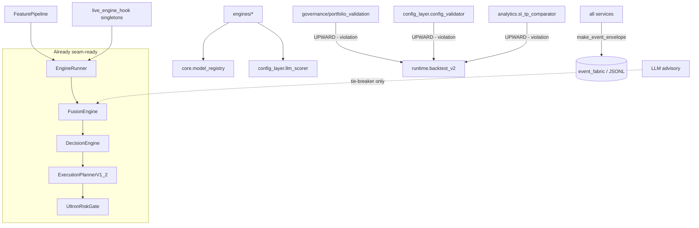

# service-boundary-map.md

> **Purpose (LLM context economy — keystone doc):** This defines the system as a set of
> candidate **services**, each with an explicit **ins / internal flow / outs** contract.
> The whole point: a future LLM working on one service loads *that service's* contract
> (here + its [`services/<svc>.md`](services)) and nothing else. Boundaries are how we
> stop "the LLM must hold the whole codebase in context."
>
> These are *target* boundaries laid over the *current* monolith. Nothing here proposes
> a rewrite — only where the seams are and what blocks each cut. Anchored to
> `v2_multi_2026_04`.

---

## 1. Dependency-direction doctrine (the rule that makes seams real)

```
Ingestion → Features → Scoring → Decision Spine → Execution/Risk
                                      │
            Telemetry/Event-Bus  ◀────┴────▶  (all services emit; none import back)
            LLM-Advisory         ◀──── (consulted by Scoring/Governance; never gates)
            Governance/Replay    ────▶ invoke Decision/Scoring via an interface, NOT impl
```

**Hard rule:** dependencies point *down* the decision flow and *out* to the event bus.
Governance, analytics, and the agent must **not** import `runtime.backtest_v2` directly
(today they do — `governance/portfolio_validation.py:28`,
`config_layer/config_validator.py:146`, `analytics/sl_tp_comparator.py:589`). The fix
(Trd-M4) is an abstract `BacktestRunner` interface that `runtime` implements and the others
depend on.

---

## 2. Candidate services

For each: **In** (what crosses the boundary inward) · **Flow** (one line) · **Out** ·
**Blockers** (what stops extraction today) · **Tier** (1=hard, 3=easy).

### S1. Feature / Ingestion
- **In:** CSV M15 OHLCV stream (candle-by-candle).
- **Flow:** load → lagged feature build (`.shift(1)`) → canonical vector keyed by ts.
- **Out:** `feature_vector` (38-dim `CANONICAL_FEATURES`; v2.0: 35) + `FEATURE_ORDER_HASH`.

> **See also:** [`entry-exit-map.md`](entry-exit-map.md) — the reconciled catalog of all application entry + exit points (this doc covers per-service ins/outs; that one covers the outer I/O surface).
- **Blockers:** `FeaturePipeline` built inside `BacktestRunner.__init__` (Tier 3);
  `center=True` rolling (`feature_pipeline.py:341`) is **live-unsafe** — must be gated
  off outside backtest before this becomes a live service.
- **Tier:** 3. Should emit `FEATURE_SNAPSHOT` (currently silent).

### S2. Scoring Engines
- **In:** feature vector + context.
- **Flow:** CRT / Gaussian / Zone-Gate / RR each score independently; adapter hard-gate
  first (`trap_validator_engine`).
- **Out:** `{crt, gaussian, zone_gate, rr}` scores (+ `ENGINE_TELEMETRY` events).
- **Blockers:** engine→`core.model_registry` (`ml_gaussian_engine.py:53`,
  `tradenet_meta_engine.py:228`); engine→`config_layer.llm_scorer` (`llm_engine.py`).
- **Tier:** 1. Stateless given injected models — clean once registry is passed in.

### S3. Decision Spine
- **In:** engine scores + features + context.
- **Flow:** fuse → decide → plan → risk-approve.
- **Out:** `EngineRunnerOutput` + `GateResult` (`APPROVE|REJECT`) + execution plan.
- **Blockers:** essentially **none** — config injected, dict returns (see
  [`codebase-state-map.md`](codebase-state-map.md) §2).
- **Tier:** ready. This is the first service that could be lifted.
- **Exemplar doc:** [`services/decision_spine.md`](services/decision-spine.md).

### S4. Execution / Risk
- **In:** approved plan + portfolio state.
- **Flow:** risk gate → kill-switch check → position sizing → (live) broker bridge.
- **Out:** final position size / order intent + approve-reject event.
- **Blockers:** hardcoded `logs/kill_switch_state.json` (`ultron_risk_gate.py:44`);
  `live_engine_hook` singletons (`:90-96`).
- **Tier:** 2.

### S5. Governance / Promotion
- **In:** candidate config + ValidationReport.
- **Flow:** validate (runs backtests) → require `APPROVE` (`promotion_manager.py:140`)
  → SHA-256 hash → append `promotion_log.jsonl`.
- **Out:** promoted prod config (or `PROMOTION_FAILED`).
- **Blockers:** imports `runtime.backtest_v2` upward (dep-direction violation).
- **Tier:** 1 (needs Trd-M4 interface inversion).

### S6. Replay / Backtest
- **In:** CSV + `BacktestConfig` (incl. `slippage_seed`) + prod config version.
- **Flow:** stream candles → spine per bar → collect metrics → write run artifacts.
- **Out:** `{instrument}_summary.json`, `_trades.csv`, `_events.jsonl`.
- **Blockers:** it's the thing everyone imports upward (the dependency sink).
- **Tier:** 1 to invert; the loop itself is clean.

### S7. Telemetry / Event-Bus
- **In:** events from every service via `make_event_envelope`.
- **Flow:** envelope → append JSONL / in-memory bus → drift audit → per-episode rollup.
- **Out:** enveloped JSONL streams + `logs/llm_episodes.jsonl` (Trd-M1 Part 2).
- **Blockers:** trade writers not yet enveloped (Trd-M1); some streams bypass the fabric.
- **Tier:** 2. This service *is* the observability backbone.

### S8. LLM Advisory
- **In:** uncertainty-zone score requests, narrative requests, agent prompts.
- **Flow:** local llama.cpp → Groq fallback → neutral `1.0` on circuit-open.
- **Out:** advisory score / text (+ should emit an enveloped advisory event).
- **Blockers:** `llm_scorer` module-level `FAIL_COUNT`/`CIRCUIT_OPEN` globals.
- **Tier:** 2. **Never** gains execution authority — see
  [`llm-governance-layer.md`](llm-governance-layer.md).

### S9. Agent / Control-Plane
- **In:** user intents (CLI / localhost HTTP).
- **Flow:** intent → plan (deterministic `PLAN_REGISTRY`) → execute under path-guard +
  `y/N` confirm (`agent/executor.py:27`/`:35`).
- **Out:** tool results, audit lines (`agent_audit.jsonl`).
- **Blockers:** late-import config (manageable); localhost-only, no auth.
- **Tier:** 3.

---

## 3. Extraction order (matches migration roadmap)

| Order | Service | Enabling step |
|---|---|---|
| 1 | S7 Telemetry | Trd-M1 — envelope trade writers + episode log |
| 2 | (events) | Trd-M2 — emit silent EventTypes + state transitions |
| 3 | S4/S8 | Trd-M3 — kill singletons, inject deps |
| 4 | S5/S6 | Trd-M4 — backtest interface inversion |
| 5 | S8 | Trd-M5 — LLM hardening + advisory event contract |
| — | S3 | already seam-ready; lift when needed |

---

## 4. Current import map (Mermaid — what couples to what *today*)



The three `UPWARD - violation` edges are the Trd-M4 targets; the dotted LLM edge is
advisory-only and must stay dotted (never a solid gate).
