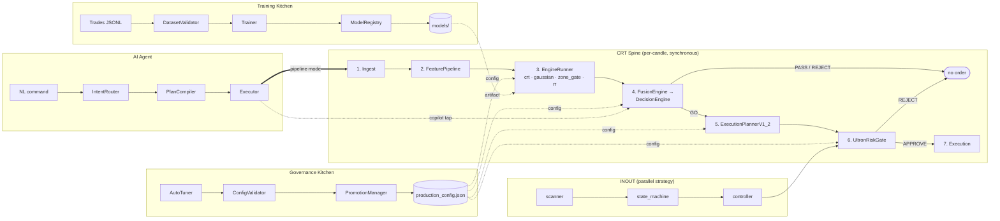

# SIGNAL_FLOW.md — Candle → Order, end to end

> **Read this when you need to know:** what happens to an M15 candle from the
> moment it is ingested until it becomes (or fails to become) an order, and which
> async subsystem owns each input the per-candle path consumes.

This doc is a *map*, not a spec. It does not redefine APIs, schemas, or config
keys — it links to the docs that already do.

---

## 0. Reading order

1. [`CLAUDE.md`](../CLAUDE.md) — operating manual + response ritual.
2. **This file** — the per-candle linear walk and the async feeders.
3. [`docs/ARCHITECTURE.md`](ARCHITECTURE.md) §3 — deeper structural context for the
   subsections referenced here.
4. Module-specific reference: [`SCHEMAS.md`](SCHEMAS.md), [`CONFIG_REFERENCE.md`](CONFIG_REFERENCE.md),
   [`GOVERNANCE.md`](GOVERNANCE.md), [`AGENT_REFERENCE.md`](AGENT_REFERENCE.md), [`TESTING.md`](TESTING.md).

---

## 1. The CRT Spine (per-candle, synchronous)

The spine runs once per candle, in order, with no skipped steps. Each step
discloses its module, entry point, config dependency, emitted object, failure
mode (per [`CONVENTIONS.md`](CONVENTIONS.md) §3), and cross-references.

### Step 1 — DATA INGEST

- **Module:**      `src/runtime/backtest_v2.py` (backtest) / `src/inout/scanner.py` (live)
- **Entry point:** `CandleLoader.stream()` (the CSV reader lives in `backtest_v2.py`, not the
                   data layer) / live feed loop
- **Reads from:**  raw OHLCV M15 CSV in `data/<INSTRUMENT>.csv`, or live tick adapter
- **Emits:**       `Candle` dataclass (see `SCHEMAS.md §2`)
- **Validates:**   two-tier — (a) always-on inline backstop in `stream()`: L1 duplicate-header
                   reject + L2 duplicate/out-of-order timestamp + Phase-1 column / Phase-2 value
                   checks (all raise, no silent skip), delegating per-field helpers to
                   `data_ingestion/ohlcv_schema.py`; (b) optional pre-flight gate
                   `dataset_integrity.validate_dataset()` → `APPROVE/WARN/REJECT`, run by
                   `MultiInstrumentRunner` (a standalone `BacktestRunner` relies on the backstop).
- **Failure mode:** fail-fast on missing/empty CSV, malformed timestamps, lookahead
- **Cross-ref:**   `SCHEMAS.md §2` (`Candle`), `CONFIG_REFERENCE.md` → `backtest`,
                   [`topics/feature-schema.md`](../topics/feature-schema.md) ("Why `stream()` is
                   more than CSV parsing"), `current-findings.md` F-039

**Integrity layers & which paths run them** (no-lookahead is the *conjunction* of all of these,
not any single gate — F-039):

| Layer | What it enforces | Where | Coverage |
|---|---|---|---|
| **L1 schema** | unique headers, six required columns, parseable timestamps | inline in `CandleLoader.stream()` | **every** stream consumer |
| **L2 temporal** | strictly-increasing timestamps (no dup / no out-of-order), per-row value sanity (high≥low, vol≥0, no NaN) | inline in `CandleLoader.stream()` | **every** stream consumer |
| **L3 dataset** | gap analysis, session-calendar expectations, cross-file (`validate_dataset`/`validate_universe`) | pre-flight, separate pass | **`backtest_v2` only** |
| **RT generator** | causal ordering — engine can't touch candle N+1 until N is consumed | `stream()` is a generator | **every** stream consumer |

The `src/research/` qualification pipeline, `analytics/sl_tp_comparator`,
`governance/portfolio_validation`, `runtime/exit_model_band`, `runtime/unified_replay_harness`,
and `config_layer/config_validator` run **L1/L2 + RT only** — the inline backstop is their sole
integrity net (F-039). Making `stream()` permissive removes that net on those paths.

### Step 2 — FEATURE PIPELINE

- **Module:**      `src/features/feature_pipeline.py`
- **Entry point:** `FeaturePipeline.run()` → `(enriched_df, vectors)` (batch enrich over the
                   whole frame up-front; `finalize()` drops NaN warmup rows). The per-bar unit
                   of the spine is the *candle stream* (`CandleLoader.stream()`), not a
                   per-candle feature call.
- **Reads from:**  `CANONICAL_FEATURES` (38-dim) + `FEATURE_SCHEMA` hash baseline
                   from `results/baseline/`
- **Emits:**       38-dim feature vectors (indices 0–4 = raw OHLCV) consumed candle-by-candle
                   by the engine loop
- **Failure mode:** fail-fast on schema-hash mismatch (see `runtime/baseline_capture.py`)
- **Cross-ref:**   `SCHEMAS.md §3` (canonical features), `ARCHITECTURE.md §3.1`

### Step 3 — SCORING ENGINES

- **Module:**      `src/core/engine_runner.py`
- **Entry point:** `EngineRunner.run(...)` → invokes each engine in
                   `EXPECTED_ENGINES = {"crt", "gaussian", "zone_gate", "rr"}`
- **Reads from:**  `engine_runner` config section + per-engine sections
                   (`crt_engine`, `gaussian_scorer`, `rr_model`); model artifacts
                   loaded from `models/` (BitNet zone, Gaussian log-likelihood, RR)
- **Emits:**       per-engine `score ∈ [0,1]` map → fed to Step 4
- **Failure mode:** optional-import for BitNet/llama (graceful degradation);
                    fail-fast if any of the four expected engines is missing
                    (`missing_engines = EXPECTED_ENGINES - engine_results.keys()`)
- **Cross-ref:**   `CONFIG_REFERENCE.md` → `engine_runner` / `crt_engine` /
                   `gaussian_scorer` / `rr_model`; `TESTING.md` → engines domain

### Step 4 — FUSION & DECISION

- **Module:**      `src/core/fusion_engine.py` + `src/core/decision_engine.py`
- **Entry point:** `FusionEngine.evaluate(scores)` → `DecisionEngine.decide(...)`
- **Reads from:**  `fusion_engine` (weights, normalizer, conflict resolution),
                   `decision_engine` (threshold), `engine_runner.fusion_use_evaluate`
                   feature flag
- **Emits:**       `DecisionResult` ∈ {GO / PASS / REJECT} with `RejectReason` enum
- **Failure mode:** fail-fast on weight-sum drift; fail-open on `llm_inference_client`
                    timeout (returns neutral 1.0 after `fail_count_disable`)
- **Tap point:**   the AI Agent (Copilot mode) reads `DecisionResult` *read-only*
                   for narrative insight — it does not mutate the result
- **Cross-ref:**   `SCHEMAS.md §5` (`DecisionResult`, `RejectReason`),
                   `CONFIG_REFERENCE.md` → `fusion_engine` / `decision_engine` / `llama_gate`

### Step 5 — EXECUTION PLANNER

- **Module:**      `src/config_layer/execution_planner.py`
- **Entry point:** `ExecutionPlannerV1_2.plan(decision)` (only when Step 4 = GO)
- **Reads from:**  `execution_planner` section — `min_rr_ratio`,
                   `atr_mult_{breakout,pullback,reversal,sweep}_tp`,
                   `ttl_*_sec`, `default_sl_atr_mult`, `risk_percent`
- **Emits:**       `ExecutionPlan` (entry / SL / TP / RR / TTL) keyed by CRT intent
- **Failure mode:** fail-fast on `reject_unknown_intent: true`; fail-fast on
                    invalid SL geometry (TP below entry on long, etc.)
- **Cross-ref:**   `SCHEMAS.md §6` (`ExecutionPlan`), `CONFIG_REFERENCE.md` → `execution_planner`

### Step 6 — ULTRON RISK GATE

- **Module:**      `src/core/ultron_risk_gate.py`
- **Entry point:** `UltronRiskGate.evaluate(plan, portfolio_state)`
- **Reads from:**  `ultron_risk_gate` section — `max_risk_per_trade_pct`,
                   drawdown caps, daily-trade limit, correlation thresholds
- **Emits:**       `GateResult` (APPROVE / REJECT) with structured reason
- **Failure mode:** fail-fast — this is the last deterministic capital check;
                    no fallback path is permitted
- **Shared with INOUT:** this is the *only* spine module the INOUT strategy also uses
- **Cross-ref:**   `SCHEMAS.md §5` (`GateResult`), `CONFIG_REFERENCE.md` → `ultron_risk_gate`,
                   `GOVERNANCE.md` → write-authority matrix

### Step 7 — EXECUTION

- **Module:**      `src/execution/` (broker stub) / live order loop in `src/inout/executor.py`
- **Entry point:** order dispatcher (broker-stub or live)
- **Reads from:**  approved `GateResult` + `ExecutionPlan`
- **Emits:**       `TRADE_OPENED` JSONL line (consumed by `FeatureMonitor` for drift)
- **Failure mode:** fail-fast on broker-API error; the dispatched order is the
                    sole side-effect of the spine
- **Cross-ref:**   `SCHEMAS.md §9` (JSONL line schemas)

---

## 2. Kitchen Feeders (asynchronous, off-spine)

Each feeder is a *chain* that produces an artifact the spine consumes. The
spine never calls into a feeder; feeders never call into the spine — they
communicate exclusively through files (config JSON, model artifacts) or
read-only taps.

### 2.1 Governance Kitchen — feeds Steps 3, 4, 5, 6

```
AutoTuner (scripts/training/auto_tuner_multi.py)
  → ConfigValidator.validate()  (src/config_layer/config_validator.py)
  → PromotionManager.promote_from_tuner_checkpoint()  (src/governance/promotion_manager.py)
  → configs/production/v1_multi_2026_03.json  +  configs/promotion_log.jsonl
```

The promoted config is the single source of truth for every tunable read in
Steps 3, 4, 5, 6. Any change requires SHA-256 rehash and an APPROVE'd
`ValidationReport`. Reference: `GOVERNANCE.md`.

> Note: `AutoTuner` is a script-level orchestrator (CLI wrapper under
> `scripts/training/`), not a `src/` module — per `CONVENTIONS.md §2`.

### 2.2 Training Kitchen — feeds Step 3 only

```
Raw trades  (logs/trades_*.jsonl)
  → DatasetValidator  (src/features/dataset_validator.py)
  → Trainer  (src/training/trainer.py)  — BitNet zone / Gaussian
  → ModelRegistry  (src/core/model_registry.py)  — atomic promotion + 2% margin gate
  → models/{zone_registry.json, rr_model.json, ...}
```

Step 3 reads the registered artifacts; it does not retrain. Registration
enforces the GOV-3 `PROMOTION_MARGIN=2%` gate (see `governance/orchestrator.py`).

### 2.3 AI Agent — triggers (Pipeline) or taps (Copilot)

```
NL command
  → IntentRouter (src/agent/intent_router.py)  — regex first, LLM fallback
  → PlanCompiler (src/agent/plan_compiler.py)  — deterministic PLAN_REGISTRY
  → Executor    (src/agent/executor.py)        — confirm-gate + path-guard
```

Two interaction modes:
- **Pipeline mode** (`src/agent/modes/pipeline_mode.py`) — *triggers* the spine
  (Steps 1→7) inside a backtest loop.
- **Copilot mode** (`src/agent/modes/copilot_mode.py`) — *taps* Step 4's output
  read-only to produce narrative insight. Cannot mutate decisions.

Reference: `AGENT_REFERENCE.md`.

### 2.4 INOUT — parallel rail, joins only at Step 6

INOUT is a separate strategy that runs alongside the CRT spine. It does **not**
flow through `EngineRunner`, `FusionEngine`, `DecisionEngine`, or
`ExecutionPlannerV1_2`. Its chain:

```
src/inout/scanner.py        — breakout detection on M15 stream
  → src/inout/state_machine.py  (INOUTStateMachine, ActionInstruction)
  → src/inout/controller.py
  → UltronRiskGate.evaluate()  ← shared join point with CRT (Step 6)
  → src/inout/executor.py     — order dispatch
```

INOUT is governed by the `inout` section of the production config. Adding it to
`EXPECTED_ENGINES` is a convention break — INOUT is not a scoring engine.

---

## 3. Cross-reference matrix

| Step | Module                                  | Config section in `v1_multi_2026_03.json` | `SCHEMAS.md` anchor    | `TESTING.md` domain | Write authority             |
| ---- | --------------------------------------- | ----------------------------------------- | ---------------------- | ------------------- | --------------------------- |
| 1    | `src/runtime/backtest_v2.py`            | `backtest`, `feature_monitor`             | `Candle`               | runtime             | dev (no governance)         |
| 2    | `src/features/feature_pipeline.py`      | (schema-driven; no config keys)           | `CANONICAL_FEATURES`   | features            | dev + baseline rehash       |
| 3    | `src/core/engine_runner.py`             | `engine_runner`, `crt_engine`, `gaussian_scorer`, `rr_model` | `CRTState`, `Direction` | engines | governance only (config) |
| 4    | `src/core/fusion_engine.py`, `src/core/decision_engine.py` | `fusion_engine`, `decision_engine`, `llama_gate` | `DecisionResult`, `RejectReason` | core | governance only (config) |
| 5    | `src/config_layer/execution_planner.py` | `execution_planner`                       | `ExecutionPlan`        | execution_planner   | governance only             |
| 6    | `src/core/ultron_risk_gate.py`          | `ultron_risk_gate`, `portfolio`           | `GateResult`           | risk_gate           | governance only             |
| 7    | `src/execution/`, `src/inout/executor.py` | (broker adapter; no config keys here)   | JSONL `TRADE_OPENED`   | execution           | dev                         |

---

## 4. Swim-lane diagram



The dotted arrows are async (config / artifact / read-only tap). The double
arrow is the agent triggering a backtest spine in Pipeline mode. INOUT joins
the spine only at Step 6.

---

## 5. What this doc is NOT

- **Not an API spec.** Use [`SCHEMAS.md`](SCHEMAS.md) for dataclass field lists.
- **Not a config reference.** Use [`CONFIG_REFERENCE.md`](CONFIG_REFERENCE.md) for keys and editing rules.
- **Not a governance procedure.** Use [`GOVERNANCE.md`](GOVERNANCE.md) for promotion / rollback.
- **Not an agent intent map.** Use [`AGENT_REFERENCE.md`](AGENT_REFERENCE.md) for intents / tools / `PLAN_REGISTRY`.
- **Not a test guide.** Use [`TESTING.md`](TESTING.md) for pytest layout and how to run.
- **Not a service template.** Copy [`EXAMPLE_SERVICE.py`](EXAMPLE_SERVICE.py) when adding a new engine / gate / validator.

If a future change makes this doc disagree with any of those six, the other doc
wins — fix this file, never the other way around.
