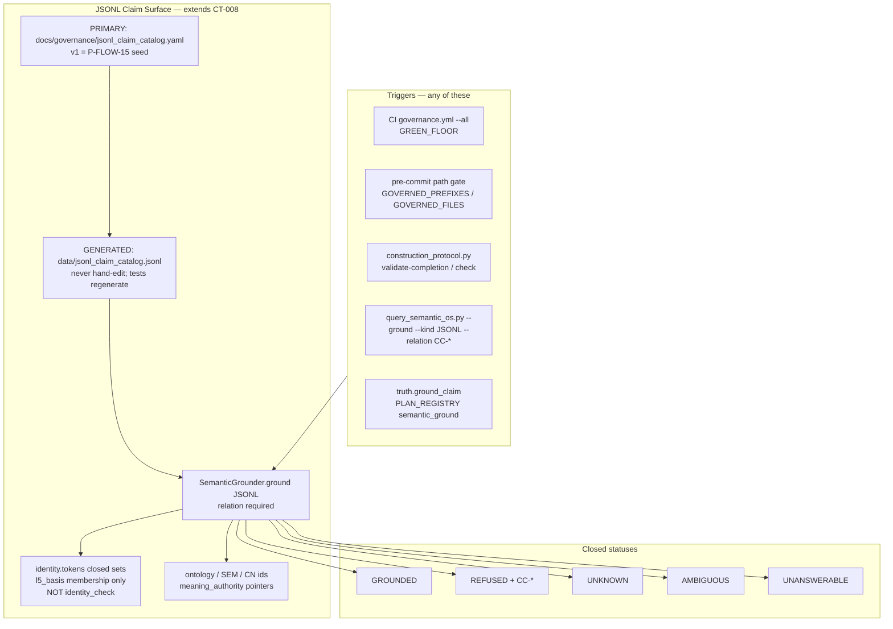

# JSONL Claim Surface — Test-Guarded Anti-Hallucination / Anti-Drift

| Field | Value |
|---|---|
| **Title** | JSONL Claim Surface (CT-008 extension): fail-closed CAN / CANNOT validation for LLM claims against JSONL |
| **Author** | Grok (design) — implementer TBD |
| **Date** | 2026-08-25 |
| **Status** | **Approved 2026-08-25 — implementation not started.** Spec only. No `src/` until a later authorization. Review Issues 1–24 closed in rev 4. |
| **Lane** | Semantic certification. Not economic qualification. Not P-GOAL-04. Not a new detector. Not LLM-as-broker-trigger (path A). Locked path is B first, A through B. |
| **Predecessor** | P-FLOW-15 (classification only, 2026-08-25): JSONL as LLM anti-hallucination check; no validator script yet |
| **Joins** | P-FLOW-01 (one flow; no unlinked script) · CT-008 Closed Semantic Environment · Canonical Layer Identity L0–L5 FROZEN v1.0.0 · Storage Preservation CLOSED · Physical Storage CLOSED · Findings mandate · Construction protocol Gate 6 · GREEN_FLOOR |
| **Authority** | Advisory / governance only. No G001. No promotion. No live rail. No LLM order-send. Does **not** reopen identity, storage, or CRT. |
| **Change id (proposed)** | `CH-jsonl-claim-surface` (not started) |
| **User lock 2026-08-25** | Design only — do not implement. P-FLOW-14 = both (follow-on). PR-5 skipped. |

---

## Overview

Coding LLMs treat on-disk JSONL as a mind: a line exists, therefore a trade was profitable, a bar was in RANGE, Parquet agrees, Ultron approved it, expectancy is positive. That is the F-022 / F-069 / F-083 / identity-§11 failure class applied to *claims*, not to engines. P-FLOW-15 classified which JSONL can and cannot close an LLM claim. This design makes that table a **named, test-guarded, Claude-visible refusal surface** on the existing Closed Semantic Environment — not a new research validator and not a second OS.

The proposed solution extends `SemanticGrounder` (`src/governance/semantic_grounding.py`) with one additional closed claim kind (`JSONL`) and one additional closed status (`REFUSED`). A committed PRIMARY catalog (`docs/governance/jsonl_claim_catalog.yaml`) is the **P-FLOW-15 seed** (the §5 tables), not a writer-site census. For `kind=JSONL`, `relation` **must** be a `CC-*` id; missing relation is `UNANSWERABLE`. If `source` and `target` are both non-empty, `join_cc` runs **first** (token may be empty); a hit is `REFUSED` even when `relation` is a CAN. Polarity `CANNOT` is always `REFUSED`; a CAN not in that stream’s `allowed_cc` is `UNANSWERABLE`. Callers that only check `GROUNDED` fail closed. Pytest floors sit on GREEN_FLOOR and on a new construction-protocol change class so the surface runs in CI, on governed pre-commit, and on any `truth.ground_claim` / `query_semantic_os.py --ground` trigger Claude already uses.

Two catalog upgrades close the silent-gap holes the user named: (1) **save the result** — when an `MC-*` run actually produced artifacts, persist a result line with artifact SHA-256 plus an optional **run-level `l5_basis`** classified by `identity.tokens` closed sets (not `identity_check("L5")`); `UNRUN` stays honestly `UNRUN`. (2) **Refuse meaning-from-log** — catalog `meaning_authority` pointers to ontology / SEM / CN ids; a state occupancy JSONL is never the definition of RANGE. Emitter backfill of `payload.ontology_ids` is **out of this program**.

---

## Background & Motivation

### Current state (source-verified)

JSONL is already the system of record. Parquet is a derived projection (`docs/research/parquet_evidence_layer.md`, `src/utils/parquet_store.py`: JSONL stays SoR; a stale sidecar is ignored). Event streams share one envelope (`src/events/event_fabric.py` `make_event_envelope`, `docs/reference/schemas.md` §9.4). Registry-class JSONL is generated from PRIMARY markdown/YAML/seeds and is never hand-edited (CLAUDE.md machine-readable truth table; `tests/test_findings_export.py`).

Claim grounding already exists and is fail-closed for four kinds:

```text
NOUN | RELATIONSHIP | IMPLEMENTATION | EVIDENCE
→ GROUNDED | UNKNOWN | AMBIGUOUS | UNANSWERABLE
```

Authorities: Semantic OS YAML, ontology ids, `docs/current-findings.md` + `data/findings.jsonl`, `data/hypothesis_registry.jsonl`, closure index, disk+AST, `configs/production/ACTIVE_VERSION`. CLI: `scripts/governance/query_semantic_os.py --ground`. Agent: `truth.ground_claim` (`src/agent/modes/truth_mode.py:104`), intent `semantic_ground` in `PLAN_REGISTRY` (`src/agent/plan_compiler.py:145`). Contract: CT-008 (`docs/governance/semantic_os/contracts.yaml:288`). Protocol: CLAUDE.md §6.7.

`truth.ground_claim` today does `out = hit.to_dict(); out["status"] = "ok"; out["passed"] = hit.status == "GROUNDED"` (`truth_mode.py:123–125`). The tool envelope **clobbers** Grounding `status`. The exception path emits `grounding_status`; the success path does not. This design copies `hit.status` to `grounding_status` (and `refusal_class`) **before** the envelope write; it does **not** stop clobbering `status` (that would change every existing agent consumer).

Identity of market objects is FROZEN (`docs/governance/CANONICAL_LAYER_IDENTITY_CONTRACT.md` v1.0.0). Today's artifacts, under that freeze §11, are mostly **not** the objects an LLM wants them to be:

| Layer | Typical record | Status under the freeze (§11 reading) |
|---|---|---|
| L1 | `logs/feature_snapshots.jsonl` | `UNIDENTIFIED` (no instrument, no corpus, no run) |
| L3 | `logs/crt_transitions.jsonl` | `UNIDENTIFIED`; not an occupancy series (no RESET, `instrument=""`) |
| L5 | `opportunities.jsonl` `outcome` / `rr_achieved` | `CONTAMINATED`; not L5 of `engine_trade` (F-022) |

Those §11 labels are **catalog** statuses (`catalog_stream_status`), not `identity.check.CheckResult.status`. `CheckResult` is `PRESERVED | UNIDENTIFIED | IDENTITY_MISMATCH | IDENTITY_INCOMPLETE | UNJOINABLE` (`src/identity/tokens.py:5–9`). Never assign `CheckResult.status = "CONTAMINATED"`.

Contract §12.3 still forbids treating existing JSONL/CSV as if it already carried the frozen PKs. Phase 2/3 storage is CLOSED. This design **classifies** streams; it does not migrate them onto PKs. It does **not** call `identity_check("L5")` on a run-level result line (`_check_l5` at `check.py:246–264` requires a full L4 parent + `L5_PAYLOAD`; a measurement **run** is not one trade).

EngineRunner does not call ExecutionPlanner or UltronRiskGate (`src/core/engine_runner.py` `run()` returns `decision_result`). `backtest_v2.py` has zero references to either (P-FLOW-13). Backtest JSONL cannot close "Ultron approved this trade."

Meaning lives in `configs/formulas/market_ontology.yaml` + Semantic OS YAML (CLAUDE.md §6.6). A log line is occupancy or an event, not a definition.

On-disk measurement instances: `configs/research/measurement_contracts/instances/MC-*.json` are `mt00: UNRUN`. `MC-CPR-L0-XAUUSD-M15-UTC-V1.json` lives **outside** `instances/` and has `mt00: PARTIAL`. The F-083 floor’s v1 scan is `instances/` only; CPR is scoped out (not rewritten, not silently grandfathered inside the scanned set).

### Pain points

1. **P-FLOW-15 is a table in a session log.** Session logs rotate (`assistant_project.md`); historical studies live under `docs/analysis/` and are *not* living. An LLM that does not reload P-FLOW-15 will treat `opportunities.jsonl` as a trade ledger again (F-022 frequency illusion: 139,942 detections ≠ trades). Completeness of the catalog is pinned to the YAML’s own seed tables, **not** parsed from `assistant_project.md`.
2. **Presence ≠ check.** `SemanticGrounder.ground_evidence("F-048")` grounds that the finding *exists*. It does not refuse "this trade was profitable because opportunities.jsonl says so." Callers have no named refusal class.
3. **Shape without result (F-083).** `measurement_contract.schema.json` requires `evidence_artifacts` *paths* and `trust_status.mt00 ∈ {UNRUN, PASS, FAIL, PARTIAL}`. A sealed contract can declare a measurement the run never executed; the **profile** floor (`tests/test_measurement_contract.py`) still passes — that file is MP-* subordination, not instance↔artifact comparison. Declared-but-unexecuted was indistinguishable from executed.
4. **Meaning not bound.** JSONL of RANGE occupancy is not SEM-011 / ontology RANGE. An LLM quoting a log line as "what RANGE means" has no mechanical refusal.
5. **Claude-invisible runtime streams.** `data/`, `logs/`, `results/` are gitignored (`.gitignore` lines 2–5). A fresh clone — the F-071 lesson — cannot see them. If the anti-drift surface lives only in those trees, Claude will not load it.
6. **GREEN_FLOOR hole on the CAN side.** `tests/test_current_findings.py` and `tests/test_semantic_grounding.py` *are* on GREEN_FLOOR (`scripts/maintenance/check_governance_invariants.py:69-94`). `tests/test_findings_export.py`, `tests/test_hypothesis_registry.py`, and `tests/test_measurement_contract.py` are **not**. The CAN-validate authorities are only partially auto-run.
7. **P-FLOW-01 failure mode.** A new `scripts/research/validate_jsonl_claims.py` that does not join CT-008 / GREEN_FLOOR / construction protocol is exactly the unlinked-script sprawl the user forbade.

---

## Goals & Non-Goals

### Goals

1. Encode the P-FLOW-15 CAN / CANNOT table as a **closed catalog of named claim classes** (`CC-*`) that a tool can return, analogous to `GROUNDED` / `UNKNOWN`. v1 catalog = that seed, not every JSONL writer site.
2. Make JSONL **test-guarded**: pytest floors on GREEN_FLOOR (CI `.github/workflows/governance.yml` `--all` + pre-commit path gate) **and** a construction-protocol change class **and** the existing Semantic OS ground path (CLI + `truth.ground_claim`) so Claude hits it before asserting a repo noun backed by JSONL.
3. Keep the surface **Claude-visible**: committed PRIMARY YAML under `docs/governance/`, CT-008 refined in place, CLAUDE.md companion / machine-readable sources table, `schemas.md` §9, topic Discussion blocks. Not `docs/analysis/`.
4. **Save the result** when a measurement actually ran: artifact SHA-256 plus optional run-level `l5_basis` classified by a **five-key** `identity.tokens` map (not `L5_BASIS`, which is 3 keys) on a committed append-only log. `mt00`/`mt01` `UNRUN` stays `UNRUN`. UNRUN + RESULT-BINDING is `REFUSED` / DECLARED-UNEXECUTED; UNRUN + SCHEMA-SHAPE is `GROUNDED`. The result line is **not** an L5 object and is never `PRESERVED`. Token for the three `CC-MC-*` classes is `MC-*` or an `instances/` path.
5. **Refuse meaning-from-log.** Catalog `meaning_authority` pointers (SEM/CN/FM or `INVENTORY_NOT_MARKET`). Occupancy JSONL does not define RANGE. This program does **not** persist meaning onto event-fabric occupancy lines.
6. Join the existing flow (P-FLOW-01). Extend CT-008, findings-export pattern, `identity.tokens` closed-set membership for `l5_basis`. No parallel OS. No `identity_check` on run-level lines.
7. Fail closed: an LLM **cannot** use a CANNOT-class JSONL as a check. `REFUSED` is not `GROUNDED`. For `kind=JSONL`, missing `relation=CC-*` is `UNANSWERABLE`. If `source` and `target` are both set, `join_cc` runs **before** any CAN GROUND. Polarity CANNOT is always REFUSED. A CAN not in `allowed_cc` is `UNANSWERABLE`.

### Non-goals

- No G001, no promotion, no `ACTIVE_VERSION` change, no live rail, no LLM order-send, no path A.
- Do **not** reopen Canonical Layer Identity, Storage Preservation, or Physical Storage. Do **not** rewrite historical JSONL onto frozen PKs (§12.3).
- Do **not** call `identity_check` / persist Class B records for historical streams or for run-level result lines.
- Do **not** make Parquet a second authority.
- Do **not** equate engine CRT occupancy with resolver occupancy (F-069, contract §7.2).
- Do **not** put UltronRiskGate into `backtest_v2` (P-FLOW-13 pin consumed as `CC-ULTRON-NOT-IN-BACKTEST`). P-FLOW-14 is **user-resolved 2026-08-25** (fix `signal-flow.md` scope **and** register an F-id; code wins) but is a **named follow-on**, not work in this program’s PR-1..4. This spec does not edit `signal-flow.md` and does not register that F-id.
- Do **not** graduate SEM-011 or recertify CRT.
- Do **not** invent Semantic OS ids, FM-ids, or F-ids in this design. CT-008 is refined in place under `JSONL_CLAIM_SURFACE_CHANGE`. **PR-5 is skipped (user 2026-08-25):** the catalog remains governed YAML without a CN. `ground("NOUN", catalog-name)` is UNKNOWN until a later authorization. Do **not** use `SEMANTIC_REGISTRY_CHANGE`.
- Do **not** grant `economic_claims_allowed: true` from this surface. Result lines pin `authority: "research"`.
- Do **not** hide this in `.grok/` (not a second doctrine). Claude-visible means committed + tested + queryable.
- Do **not** emit `ontology_ids` from `crt_engine_v2` dual-write in this program (separate authorization).

---

## Proposed Design

### 1. One flow, three join points



The LLM claim-check sequence (normative — **must match §6 numbered algorithm**; join before CAN):

```mermaid
sequenceDiagram
  participant LLM
  participant Tool as query_semantic_os / truth.ground_claim
  participant SG as SemanticGrounder
  participant CAT as jsonl_claim_catalog
  participant TOK as identity.tokens closed sets

  LLM->>Tool: kind=JSONL, relation=CC-*, token?, source?, target?
  Tool->>SG: ground("JSONL", token, relation, source, target)
  alt 1. relation missing or not CC-*
    SG-->>LLM: UNANSWERABLE
  else 2. CC-* not in catalog
    SG-->>LLM: UNANSWERABLE
  else 3. source and target both non-empty and join_cc hits
    SG-->>LLM: REFUSED (row.cc_id; token may be empty; even if relation is a CAN)
  else 4. polarity CANNOT
    SG-->>LLM: REFUSED (relation; forbidden_cc is documentation)
  else 5a. CC-MC-* and UNRUN + RESULT-BINDING
    SG-->>LLM: REFUSED (CC-MC-DECLARED-UNEXECUTED)
  else 5b. CC-MC-* and SCHEMA-SHAPE
    SG-->>LLM: GROUNDED (shape only)
  else 5c. CC-MC-* RESULT-BINDING hashes/basis fail
    SG->>TOK: five-key classify_l5_basis (not L5_BASIS)
    SG-->>LLM: REFUSED (CC-L5-UNIDENTIFIED or DECLARED-UNEXECUTED)
  else 5d. CC-MC-* RESULT-BINDING success
    Note over SG: non-UNRUN + result line + hashes match + basis N_A or BASIS_DECLARED<br/>FAIL/PARTIAL with honest line also GROUNDS (executed, not passed)
    SG-->>LLM: GROUNDED (authority=research; never PRESERVED)
  else 6. CAN not in stream allowed_cc
    SG-->>LLM: UNANSWERABLE (this stream does not close this CAN)
  else 7. CAN in allowed_cc, extra checks pass
    SG-->>LLM: GROUNDED (bounded payload)
  else 8. CAN extra checks fail (e.g. missing agent-audit file)
    SG-->>LLM: UNKNOWN or REFUSED (class-specific)
  end
```

Join-only calls (`token=""`, `source`+`target` set) are legal at step 3. Empty token without both join endpoints is `UNANSWERABLE` at step 5+ (“token required unless join-only”).

### 2. Named statuses and claim kind (closed vocabularies)

Extend `src/governance/semantic_grounding.py` in place. Do not fork a second grounder.

```python
CLAIM_KINDS = frozenset({
    "NOUN", "RELATIONSHIP", "IMPLEMENTATION", "EVIDENCE",
    "JSONL",  # NEW — stream/claim-class admissibility; relation=CC-* required
})

GROUNDED, UNKNOWN, AMBIGUOUS, UNANSWERABLE, REFUSED = (
    "GROUNDED", "UNKNOWN", "AMBIGUOUS", "UNANSWERABLE", "REFUSED",
)
STATUSES = frozenset({GROUNDED, UNKNOWN, AMBIGUOUS, UNANSWERABLE, REFUSED})
```

`REFUSED` is required as a fifth status. Reusing `UNANSWERABLE` would collapse "outside the vocabulary" with "in the vocabulary, and this JSONL is forbidden for this claim." Reusing `GROUNDED` plus a caveat is the F-079 class: callers that only check `GROUNDED` (`truth.ground_claim` already sets `passed = hit.status == "GROUNDED"`, `truth_mode.py:125`) would treat a contaminated stream as a check.

`Grounding` gains two fields (additive; existing kinds leave them `None`):

```python
@dataclass
class Grounding:
    # ... existing 11 fields ...
    refusal_class: Optional[str] = None          # CC-* when status == REFUSED
    catalog_stream_status: Optional[str] = None  # catalog enum only; never CheckResult.status
```

`to_dict()` **includes** both new keys on every Grounding (value `None` on old kinds). Tests must **not** pin `set(to_dict()) == 11 keys`. Existing positives (CN-001, CT-008, F-048, EngineRunner) still GROUND.

Two closed enums, named apart (Issue 15):

| Enum | Members | Used on |
|---|---|---|
| `catalog_stream_status` | `IDENTIFIED \| UNIDENTIFIED \| CONTAMINATED \| UNJOINABLE \| N_A` | catalog stream rows; `Grounding.catalog_stream_status` |
| `check_status` | `PRESERVED \| UNIDENTIFIED \| IDENTITY_MISMATCH \| IDENTITY_INCOMPLETE \| UNJOINABLE` | `identity.check.CheckResult` only — **not this surface** |
| `basis_status` (result line) | `UNIDENTIFIED \| BASIS_DECLARED \| N_A` | `MeasurementResultLine` only. Never `PRESERVED`. |

`CONTAMINATED` is a §11 census/catalog label. Never `CheckResult.status = "CONTAMINATED"`.

`record_id` on `REFUSED` is the `CC-*` id. That id **already exists** in the catalog, so this does not violate “never invented on non-GROUNDED.” Implementers must still emit `record_id` on REFUSED. `evidence_class` on `REFUSED` is omitted or `TEXT_REFERENCE` — never `PROVEN` for a market fact.

CT-008 is **refined in place** (`docs/governance/semantic_os/contracts.yaml` `CT-008`): add `JSONL` to inputs, `REFUSED` to outputs, `relation=CC-*` required for JSONL, `tests/test_jsonl_claim_grounding.py` to `enforced_by_tests`. Identity of the contract stays `CT-008`. No new CT-id. This refine is `JSONL_CLAIM_SURFACE_CHANGE` only.

**Agent envelope (Issue 6), additive, byte-compatible:**

```python
out = hit.to_dict()
out["grounding_status"] = hit.status      # GROUNDED | REFUSED | ...
# refusal_class already on to_dict()
out["status"] = "ok"                      # envelope; do not stop clobbering
out["passed"] = hit.status == "GROUNDED"
```

Pin in `tests/test_jsonl_claim_grounding.py`: a REFUSED JSONL claim returns `grounding_status == "REFUSED"`, `refusal_class == "CC-…"`, `passed is False`, `status == "ok"`. Do not change existing consumers that read envelope `status`.

### 3. PRIMARY catalog (Claude-visible, living)

**PRIMARY (committed, hand-authored):** `docs/governance/jsonl_claim_catalog.yaml`

**GENERATED (gitignored `data/`, never hand-edit):** `data/jsonl_claim_catalog.jsonl`

Pattern copy: `docs/current-findings.md` → `src/governance/findings_export.py` → `data/findings.jsonl` guarded by `tests/test_findings_export.py` (determinism + on-disk == fresh render). Same discipline as CLAUDE.md's machine-readable truth table.

Why YAML in `docs/governance/` and not a JSONL that humans edit: registries that humans edit in JSONL drift (the hand-edit guard exists because they did). Why not `docs/analysis/`: that tree is point-in-time, not living (CLAUDE.md §6.2 rule 5). Why not `.grok/`: not a second doctrine; Claude does not auto-load PENDING.

**v1 freeze:** the catalog **is** the P-FLOW-15 seed (the §5 CAN/CANNOT tables + the `forbidden_joins` list below). Completeness oracle = the YAML’s own header tables (`claim_classes`, `streams`, `forbidden_joins`), **not** a writer-site census and **not** a parse of `assistant_project.md` / `.grok/PENDING.md`. Unknown stream path → `UNKNOWN` (fail closed). Adding a new governed stream is a later `JSONL_CLAIM_SURFACE_CHANGE` PR, not a v1 gap.

Glob rules (Issue 7):

| Family | `path` form |
|---|---|
| `generated_registry` | exact POSIX repo-relative path; **no glob** |
| `committed_audit` | exact POSIX repo-relative path; **no glob** |
| `runtime_untracked` | POSIX glob allowed (e.g. `**/opportunities.jsonl`) |
| `parquet_projection` | POSIX glob allowed (e.g. `**/*.parquet`) |

`stream_for_path(raw)`: `_norm_path` (slash-normalize, strip `./`); then `fnmatch` / POSIX glob against catalog `path` values. Windows `\` is normalized before match. The function does **not** `open()` the token.

Catalog schema (two record kinds + joins, closed):

```yaml
schema_version: jsonl_claim_catalog/1
authority: advisory   # PINNED — never promote / G001
# generated_by lives ONLY on the GENERATED JSONL meta line, not here

streams:
  - id: STR-F022-OPPORTUNITIES
    path: "**/opportunities.jsonl"     # glob OK: family=runtime_untracked
    family: runtime_untracked
    layer: L5                          # identity-contract layer or null
    catalog_stream_status: CONTAMINATED
    allowed_cc: [CC-ENVELOPE-SHAPE]
    forbidden_cc: [CC-F022-CONTAMINATED, CC-PRESENCE-NOT-G001, CC-MEANING-NOT-LOG]
    meaning_authority: INVENTORY_NOT_MARKET   # or list of SEM/CN/FM ids
    identity_notes: "F-022 detection stream; outcome/rr_achieved not L5"
    findings: [F-022]
    primary_source: null

claim_classes:
  - id: CC-F022-CONTAMINATED
    polarity: CANNOT
    llm_claim: "This trade was profitable"
    against: "opportunities.jsonl outcome / rr_achieved"
    why: "F-022 CONTAMINATED — not L5"
    catalog_stream_status: CONTAMINATED
    findings: [F-022]
    meaning_authority: []

forbidden_joins:          # closed record shape; extend by catalog PR only
  - source_str: "producer:engine"
    target_str: "producer:resolver"
    cc_id: CC-L3-FORBIDDEN-JOIN
  - source_str: "family:parquet_projection"
    target_str: "family:runtime_untracked"
    cc_id: CC-PARQUET-PROJECTION
  - source_str: "STR-F022-OPPORTUNITIES"
    target_str: "family:committed_audit"
    cc_id: CC-ILLEGAL-JOIN
```

`forbidden_joins` endpoint grammar (closed): `STR-*` | `producer:engine` | `producer:resolver` | `family:<family>`. `ground_jsonl` classifies `source`/`target` against that grammar, then looks up an exact `{source_str, target_str, cc_id}` row (order-insensitive match: also try swapped endpoints). Hit → `REFUSED` with that row’s `cc_id`. `CC-L3-FORBIDDEN-JOIN` is the specialized engine×resolver row; `CC-ILLEGAL-JOIN` is the generic. Do not overlap them on the same pair.

Loader: `src/governance/jsonl_claim_catalog.py` (`load_catalog()`, `stream_for_path()`, `claim_class(cc_id)`, `join_cc(source_str, target_str) -> cc_id | None`, `admissibility(stream, cc_id) -> ADMITTED | REFUSED | NOT_ADMITTED | UNKNOWN_CLASS | UNKNOWN_STREAM`).

`admissibility` is **not** GROUNDED. Matrix (Issue 19):

| Polarity | `relation` vs stream lists | Result |
|---|---|---|
| `CANNOT` | any stream, including unknown / omitted from `forbidden_cc` | `REFUSED` — CANNOT is always refused. `forbidden_cc` is documentation and **must be ⊆ CANNOT ids** (catalog test). A CANNOT omitted from a stream’s `forbidden_cc` still REFUSES. |
| `CAN` and `relation in allowed_cc` | | `ADMITTED` — **before** extra checks. Extra checks then GROUND / UNKNOWN / REFUSED. `ADMITTED` never means GROUNDED by itself. |
| `CAN` and `relation not in allowed_cc` | including a CAN listed on a *different* stream | `NOT_ADMITTED` → grounder `UNANSWERABLE` (“this stream does not close this CAN”) |
| unknown `CC-*` | | `UNKNOWN_CLASS` |
| stream-token CAN and unknown stream | | `UNKNOWN_STREAM` |

Planted catalog defect (authoring): `CC-F022-CONTAMINATED` in `allowed_cc` fails the catalog test (CANNOT must not appear in `allowed_cc`). Planted **grounder** defect: `opportunities.jsonl` × `CC-FINDING-EXPORT` → `UNANSWERABLE` (CAN not in that stream’s `allowed_cc`).

Render: `render() -> str` deterministic (`json.dumps(..., sort_keys=True)`, static meta line with `generated_by`, no timestamps) — copy `findings_export.render`.

Thin CLI wrapper only if needed: prefer extending `query_semantic_os.py` with `--catalog-summary` over a second script; the export is a module function invoked by the test fixture. If a script is added, SITS-register it (`SCRIPT_LIFECYCLE_CHANGE`).

Floor on `meaning_authority`: every id is either the sentinel `INVENTORY_NOT_MARKET` or `ground("NOUN", id).status == GROUNDED`. Do not invent SEM/CN/FM ids in the catalog.

### 4. Stream families (do not collapse)

Four families. Catalog `family` is closed.

| Family | Home | Clone-visible? | Role |
|---|---|---|---|
| `generated_registry` | PRIMARY in `docs/` or `scripts/governance/seed_*.py`; projection in `data/*.jsonl` | PRIMARY yes; projection regenerated in tests | CAN-validate nouns, F-ids, H-ids, SCR-ids, FileIdentity |
| `committed_audit` | `configs/promotion_log.jsonl`, `configs/stack_epoch_log.jsonl`, **new** `configs/research/measurement_result_log.jsonl` | yes | CAN-validate that a promotion / epoch / measurement **happened** |
| `runtime_untracked` | `logs/*.jsonl`, run-dir `**/opportunities.jsonl` | no (gitignored) | Envelope-shape only, unless a *named identified run* is separately bound |
| `parquet_projection` | `*.parquet` next to JSONL | incidental | **Never** a second authority (`CC-PARQUET-PROJECTION`) |

Result log sits next to other committed research/config audit JSONL (`configs/promotion_log.jsonl` analogue), **not** under `docs/governance/` (that prefix is a GREEN_FLOOR path gate: every append would pay the full floor). Do **not** list the result log in `GOVERNED_FILES` — appends must not re-run GREEN_FLOOR. The documents that *should* trip the floor are MC instances (see §8 / §10).

`runtime_untracked` being catalogued does **not** identify it. Catalog row `catalog_stream_status: UNIDENTIFIED` is the classification.

### 5. Closed claim classes (normative)

Polarity `CANNOT` — LLM must receive `REFUSED` with this id. An LLM **must not** use the cited JSONL as a check for that claim.

| id | LLM claim | Against | Why it fails |
|---|---|---|---|
| `CC-F022-CONTAMINATED` | This trade was profitable | `opportunities.jsonl` `outcome` / `rr_achieved` | F-022 CONTAMINATED — not L5 |
| `CC-L3-GLOBAL-UNIDENTIFIED` | CRT was in state X at this bar | global `logs/crt_transitions.jsonl` | No RESET, `instrument=""` → not an occupancy series (identity §7.3, §11) |
| `CC-L1-UNIDENTIFIED` | These features are the bar | `logs/feature_snapshots.jsonl` | UNIDENTIFIED (no instrument/corpus/run) |
| `CC-L3-FORBIDDEN-JOIN` | Engine state = resolver state | two L3 JSONL / producers | Forbidden join (F-069, contract §7.2) |
| `CC-PARQUET-PROJECTION` | Parquet says so, so JSONL does | `*.parquet` | Projection, not a second authority |
| `CC-PRESENCE-NOT-G001` | This is +E / G001 | any JSONL being present | Presence ≠ expectancy |
| `CC-TV-NOT-IN-STREAM` | Chart matches TV | any JSONL | Screenshots are not in the stream; month-only anyway (P-FLOW-03) |
| `CC-ULTRON-NOT-IN-BACKTEST` | Ultron approved this backtest trade | backtest JSONL | P-FLOW-13: UltronRiskGate is not in `backtest_v2` |
| `CC-MEANING-NOT-LOG` | What RANGE means | any JSONL | Meaning is ontology, not a log line |
| `CC-ILLEGAL-JOIN` | Two true lines, therefore one object | any join | Valid lines + illegal join = still a hallucination |
| `CC-MC-DECLARED-UNEXECUTED` | The contract ran / mt00 PASS | `MC-*` instance without a result line | F-083 silent gap. Polarity CANNOT → always `REFUSED` as a check. The CAN that proves a run is `CC-MC-RESULT-BINDING`. |
| `CC-L5-UNIDENTIFIED` | This is realized R of production's trade | a result line whose `l5_basis` fails the **five-key** token classifier | Run-level basis is not an L5 object; incomplete basis cannot close an outcome claim |

Polarity `CAN` — LLM may receive `GROUNDED` for **exactly** the listed fact, never a stronger one. Payload must state the bound. `relation=CC-*` is always required.

| id | What it actually proves | Authority / when GROUNDED |
|---|---|---|
| `CC-FINDING-EXPORT` | Finding F-NNN exists in `docs/current-findings.md`; JSONL is a faithful generated view | Extra check GROUNDS from **PRIMARY markdown** `docs/current-findings.md` (clone-visible). Token for PR-2 fixture = that path (or its `STR-*`). Optional generated view `data/findings.jsonl`: tests may autouse-regenerate like `test_findings_export._ensure_exported` if they also assert JSONL fidelity — **do not require the gitignored file on a fresh clone**. Same pattern if `CC-HYPOTHESIS-REGISTRY` / `CC-SCRIPT-REGISTRY` are ever GROUNDed (`data/` projections). |
| `CC-HYPOTHESIS-REGISTRY` | H-id exists in the seeded registry; `authority: research` pinned | `data/hypothesis_registry.jsonl` |
| `CC-SEMANTIC-OS` | CN/BD/JN/CT/FileIdentity GROUNDED/UNKNOWN via existing CT-008 | Semantic OS YAML + `file_identities.jsonl` |
| `CC-SCRIPT-REGISTRY` | Path has an SCR-id; `authority: inventory` | `data/script_registry.jsonl` |
| `CC-PROMOTION-LOG` | A version was PROMOTE/REJECT/ROLLBACK at a hash | `configs/promotion_log.jsonl` |
| `CC-ENVELOPE-SHAPE` | The **schema** has the event-fabric envelope keys (`schemas.md` §9.4 + `make_event_envelope` AST) | Shape of the contract. Does **not** require the gitignored stream file to exist. Does **not** prove occupancy. Token is `STR-*` or a catalogued path; relation must be this CC. |
| `CC-AGENT-AUDIT-RAN` | A tool ran in **this session's** `logs/agent_audit.jsonl` | Token = allowlisted log path / `STR-*` for that stream. **`source` is the tool name** (e.g. `truth.ground_claim`). Missing `source` → `UNANSWERABLE`. GROUNDED iff contained allowlisted log exists **and** a line has that name. File missing → `UNKNOWN` (`runtime_untracked; not clone-visible`). Never REFUSED (absence is not a CANNOT class). Never GROUNDED from the catalog row alone (F-071). `target` must be empty (else step-3 join_cc runs if `target` is also set). |
| `CC-MC-SCHEMA-SHAPE` | An `MC-*` document validates against `measurement_contract.schema.json` | **Token grammar (these three CC-MC-* only):** `MC-*` id **or** a contained repo-relative path under `configs/research/measurement_contracts/instances/`. Resolve via instance JSON + result log, **not** `stream_for_path`. Do not glob instance JSON as `committed_audit`. UNRUN + this relation → **GROUNDED** (shape). |
| `CC-MC-RESULT-BINDING` | A result line exists, artifacts hash-match, trust tokens honest, basis `N_A` or `BASIS_DECLARED` | Same MC token grammar. UNRUN → **`REFUSED` / `CC-MC-DECLARED-UNEXECUTED`**. **Success (explicit return):** non-UNRUN (`PASS` **or** `FAIL` **or** `PARTIAL`) + result line + hashes match + (`l5_basis is None` → `N_A` **or** `classify_l5_basis == BASIS_DECLARED`) → **`GROUNDED`**. FAIL/PARTIAL with an honest result line GROUNDs (**executed**, not “passed” — F-083). Payload `{contract_id, trust_mt00, basis_status, authority: research}`. Never `PRESERVED`. Hash/basis fail → REFUSED. |

`CC-MC-DECLARED-UNEXECUTED` is the new CANNOT that makes F-083 mechanical. `CC-MC-RESULT-BINDING` is the new CAN that "saves the result." Asking RESULT-BINDING on an UNRUN instance is the hallucination; the refusal id is the CANNOT.

`forbidden_joins` is evaluated **before** any CAN GROUND (§6 step 3). `CC-L3-FORBIDDEN-JOIN` is the specialized engine×resolver row; `CC-ILLEGAL-JOIN` is the generic. Do not overlap them on the same pair.

### 6. Grounding API (before / after)

**Before** (`semantic_grounding.py:304-328`):

```python
def ground(self, claim_kind, token, *, source="", target="", symbol="", relation=""):
    kind = str(claim_kind or "").strip().upper()
    if kind not in CLAIM_KINDS:  # four members
        return _unanswerable(...)
    if kind == "NOUN": ...
    if kind == "RELATIONSHIP": ...
    if kind == "IMPLEMENTATION": ...
    return self.ground_evidence(token)
```

**After** — additive branch, existing four kinds byte-identical:

```python
def ground(self, claim_kind, token, *, source="", target="", symbol="", relation=""):
    ...
    if kind == "JSONL":
        return self.ground_jsonl(token, relation=relation, source=source, target=target)
    return self.ground_evidence(token)

def ground_jsonl(self, token: str, *, relation: str = "", source: str = "", target: str = "") -> Grounding:
    """Fail closed over the claim catalog. Algorithm is the numbered list below.

    token    — stream path or STR-* id, except CC-MC-* (MC-* id or instances/ path).
               Empty allowed only when source and target are both set (join-only).
               Never opened raw; see path containment.
    relation — required CC-* id. Missing / not CC-* → UNANSWERABLE.
    source/target — join endpoints (STR-* | producer:engine|resolver | family:*)
                    when BOTH non-empty. For CC-AGENT-AUDIT-RAN only, source is
                    the tool name and target must be empty.
    """
```

There is **no** GROUNDED “class definition” or “stream identity record” path without a CC-*. Do not analogize to grounding F-007: EVIDENCE existence is not a CANNOT-class name. Optional later (not v1): a distinct non-GROUNDED catalog lookup (`payload`-only or `UNKNOWN` with reason `catalog_row`) that never sets `passed=True`.

**Normative algorithm** (Issues 16/17/19/20/22). Implement exactly this order. The §1 mermaid is a drawing of these steps, not a second spec.

1. **Relation required.** If `relation` is missing or not `CC-*` → `UNANSWERABLE` (“catalog existence is not a check”).
2. **Closed vocabulary.** If `relation` is not in the catalog `claim_classes` → `UNANSWERABLE` (never invent a CC-id).
3. **Join first (Issue 16).** If `source` **and** `target` are both non-empty → `join_cc(source, target)` (order-insensitive). Hit → `REFUSED` with **`row.cc_id`**, even if `relation` is a CAN (pin: `token=docs/current-findings.md`, `relation=CC-FINDING-EXPORT`, `source=producer:engine`, `target=producer:resolver` → `REFUSED` / `CC-L3-FORBIDDEN-JOIN`). Token may be empty. No hit → continue.
4. **Polarity CANNOT (Issue 19a).** If the class polarity is `CANNOT` → `REFUSED` with `refusal_class=relation`. Stream/`allowed_cc`/`forbidden_cc` do not gate this. `forbidden_cc` is documentation (must be ⊆ CANNOT ids).
5. **Token grammar by class.**
    - **Join-only leftover:** if token is empty after step 3 did not refuse → `UNANSWERABLE` (“token required unless join-only”).
    - **`CC-MC-SCHEMA-SHAPE` | `CC-MC-RESULT-BINDING` | `CC-MC-DECLARED-UNEXECUTED` (Issue 17):** token is `MC-*` **or** a contained path under `configs/research/measurement_contracts/instances/`. Resolve instance JSON + result log; **do not** `stream_for_path`. Wrong grammar → `UNANSWERABLE`. Then extra checks:
        - `CC-MC-SCHEMA-SHAPE`: document validates → `GROUNDED` (UNRUN included). **Return here** (do not fall through to step 6).
        - `CC-MC-RESULT-BINDING` + `trust_mt00=UNRUN` → `REFUSED` / `CC-MC-DECLARED-UNEXECUTED`. **Return here.**
        - `CC-MC-RESULT-BINDING` + non-UNRUN (`PASS` \| `FAIL` \| `PARTIAL`) **fail:** missing result line, hash mismatch, or (`l5_basis` present and `classify_l5_basis != BASIS_DECLARED`) → `REFUSED` / `CC-MC-DECLARED-UNEXECUTED` or `CC-L5-UNIDENTIFIED`. **Return here.**
        - **`CC-MC-RESULT-BINDING` success (Issue 22, mermaid 5d, return here before step 6):** scanned instance + non-UNRUN + result line exists + hashes match + (`l5_basis is None` → `basis_status=N_A` **or** `classify_l5_basis == BASIS_DECLARED`) → **`GROUNDED`**. Payload `{contract_id, trust_mt00, basis_status, authority: "research"}`. Never `PRESERVED`. FAIL/PARTIAL with an honest result line GROUNDs (the run **executed**; this is not “the experiment passed”).
    - **`CC-AGENT-AUDIT-RAN` (Issue 20):** `source` is the tool name. Missing `source` → `UNANSWERABLE`. Token is the allowlisted log path / its `STR-*`. GROUNDED iff contained file exists and a line has that name. File missing → `UNKNOWN`.
    - **`CC-FINDING-EXPORT` (Issue 24):** token is `docs/current-findings.md` or the findings `STR-*`. Extra check GROUNDS from PRIMARY markdown. Do not `open()` gitignored `data/findings.jsonl` as a required clone-visible check. Optional: if a test also asserts JSONL fidelity, autouse-regenerate like `_ensure_exported`.
    - **Other stream-token CANs:** token is stream path or `STR-*`. Unknown stream → `UNKNOWN` (“do not treat as a check”). Path escape → `UNKNOWN`, never `open()`.
6. **`allowed_cc` (Issue 19b/c)** — stream-token CANs only, after the stream is known: `relation in allowed_cc` → extra checks (step 7). Else → `UNANSWERABLE` (“this stream does not close this CAN”). Pin: `token` matching `**/opportunities.jsonl` × `relation=CC-FINDING-EXPORT` → `UNANSWERABLE`.
7. **Extra checks** for an `ADMITTED` CAN (class-specific). Success → `GROUNDED` with bounded payload. Failure → that class’s UNKNOWN/REFUSED, never a silent GROUND.

Worked dispatch table (same algorithm):

| Inputs | Result |
|---|---|
| `kind=JSONL`, `relation` empty or not `CC-*` | `UNANSWERABLE` (step 1) |
| `source=producer:engine`, `target=producer:resolver`, `relation=CC-FINDING-EXPORT`, `token=docs/current-findings.md` | `REFUSED` / `CC-L3-FORBIDDEN-JOIN` (step 3; CAN does not GROUND) |
| `token=""`, `source=producer:engine`, `target=producer:resolver`, `relation=CC-ENVELOPE-SHAPE` | `REFUSED` / `CC-L3-FORBIDDEN-JOIN` (join-only; token empty legal) |
| `token=logs/crt_transitions.jsonl`, `relation=CC-L3-GLOBAL-UNIDENTIFIED` | `REFUSED` (step 4 CANNOT) |
| `token=**/opportunities.jsonl`, `relation=CC-FINDING-EXPORT` | `UNANSWERABLE` (step 6; CAN not in `allowed_cc`) |
| `token=docs/current-findings.md`, `relation=CC-FINDING-EXPORT`, source/target empty | `GROUNDED` from PRIMARY markdown (step 7; gitignored JSONL not required) |
| `token=MC-VCRT-XAUUSD-M15-V2`, `relation=CC-MC-SCHEMA-SHAPE` | `GROUNDED` shape (UNRUN legal) |
| `token=MC-VCRT-XAUUSD-M15-V2`, `relation=CC-MC-RESULT-BINDING` | `REFUSED` / `CC-MC-DECLARED-UNEXECUTED` while UNRUN |
| synthetic `MC-JSONL-CLAIM-FIXTURE-V1` + result line, `trust_mt00=FAIL`, hashes match, `l5_basis=None`, `relation=CC-MC-RESULT-BINDING` | `GROUNDED` (executed, not passed; `basis_status=N_A`; `authority=research`) |
| `token=logs/agent_audit.jsonl`, `relation=CC-AGENT-AUDIT-RAN`, `source` empty | `UNANSWERABLE` |
| `token=logs/agent_audit.jsonl`, `relation=CC-AGENT-AUDIT-RAN`, `source=truth.ground_claim`, file missing | `UNKNOWN` |
| `token=logs/agent_audit.jsonl`, `relation=CC-AGENT-AUDIT-RAN`, `source=truth.ground_claim`, file + matching line | `GROUNDED` payload `{tool_name, timestamp, success}` |
| `token=<STR-*>`, `relation=CC-ENVELOPE-SHAPE` | `GROUNDED` from `schemas.md` §9.4 + `make_event_envelope` AST even if the gitignored file is absent |
| unknown `CC-*` | `UNANSWERABLE` (step 2) |
| unknown stream path (stream-token CAN, source/target empty) | `UNKNOWN` (step 5) |
| token `C:\Windows\...` or `../` escape | `UNKNOWN`; **never `open()`** |

CLI (`scripts/governance/query_semantic_os.py`): no new flags. **PR-2 (Issue 23):** when `kind=JSONL`, pass `args.token` **as-is** (empty string allowed). Do **not** use `args.token or args.relation` for JSONL — today `:84` coalesces omitted `--token` to the CC id, which breaks join-only `token=""` after a join miss. Leave non-JSONL kinds unchanged (`token or relation` remains valid for NOUN/EVIDENCE). Pin: CLI join-only argv with **no** `--token`, `source=producer:engine`, `target=producer:resolver`, `relation=CC-FINDING-EXPORT` → `REFUSED` / `CC-L3-FORBIDDEN-JOIN` and `token` received by `ground_jsonl` is `""`. Same rule for `truth.ground_claim`: if `kind=JSONL`, pass `token` as-is (do not `token or relation`). Exit code stays `0` iff `GROUNDED` else `2`.

Agent `truth.ground_claim` `args_schema.kind.desc` updates to include `JSONL`. Copy `grounding_status` before envelope `status="ok"` (§2). `PLAN_REGISTRY` `semantic_ground` already calls this tool; no new intent (CN-013: LLM must not improvise tool graphs).

**Path containment (normative, Issue 8):**

Most JSONL claims never open the token (catalog is enough). When a CC **does** read a file (`CC-AGENT-AUDIT-RAN`, `CC-MC-*` instance JSON + result-log hashes, `CC-PROMOTION-LOG`):

1. Resolve the path, then `Path.resolve().relative_to(_ROOT.resolve())`.
2. Absolute tokens, NUL, or escape (`ValueError` from `relative_to`) → `UNKNOWN`, never `open()`.
3. Reads use **allowlisted repo-relative paths from the catalog** (or the result-log / promotion-log exact committed paths), **not** the raw token string.
4. Pin tests: `token="C:\\Windows\\System32\\config"` and `token="../../secret"` → `UNKNOWN`, no file access.

```python
def _contained_repo_path(raw: str, root: Path) -> Path | None:
    if not raw or "\x00" in raw:
        return None
    p = Path(raw.replace("\\", "/"))
    if p.is_absolute():
        return None
    try:
        resolved = (root / p).resolve()
        resolved.relative_to(root.resolve())
        return resolved
    except (OSError, ValueError):
        return None
```

On Windows, `Path(repo) / "C:/Users/hi/secret"` would otherwise resolve outside the repo; `is_absolute()` / `relative_to` closes that.

### 7. Refuse meaning-from-log (this program)

Meaning authority remains ontology + Semantic OS (CLAUDE.md §6.6). JSONL never becomes the definition. **This program does not persist meaning onto occupancy lines.**

| Surface | What ships |
|---|---|
| Catalog `meaning_authority` | Per stream and per CC-*: list of SEM/CN/FM ids, or the sentinel `INVENTORY_NOT_MARKET`. Floor: each id GROUNDs as `NOUN` or is the sentinel. |
| `CC-MEANING-NOT-LOG` | Any "what RANGE means" / "what DISPLACEMENT means" against any JSONL → `REFUSED`. Caller must `ground("NOUN", "SEM-…")` or `ground("NOUN", "FM-…")`. |
| Event-fabric `payload.ontology_ids` | **Out of this program.** `make_event_envelope` already puts type-specific data in `payload`; adding ids there later is additive under identity §12.2 and does **not** identify historical occupancy. Emitter backfill (`crt_engine_v2` dual-write) needs a separate authorized PR. |
| Measurement result line `ontology_ids` | Optional pointers when the result *names* a market state; empty if `INVENTORY_NOT_MARKET`. Floor: listed ids GROUND as `NOUN`. Pointers, not definitions. |

Do **not** add `RANGE` as a string payload and call it meaning. Do **not** write ontology prose into `logs/crt_transitions.jsonl`. Do not imply occupancy JSONL becomes identified by growing payload.

### 8. Save result (F-083 class, closed)

**PRIMARY / append-only (committed):** `configs/research/measurement_result_log.jsonl`

Same family as `configs/promotion_log.jsonl` (committed_audit). Not `data/` / `results/` (gitignored; F-071). Not `docs/governance/` (GREEN_FLOOR prefix tax on every append). **Not** listed in `GOVERNED_FILES` — appends must not re-run the floor.

Line schema (`schemas.md` §9.16, new):

```python
MeasurementResultLine = {
    "timestamp":           str,          # ISO-8601 UTC; append-only, never rewrite
    "kind":                "MEASUREMENT_RESULT",
    "contract_id":         str,          # MC-*
    "run_id":              str,
    "trust_mt00":          Literal["UNRUN", "PASS", "FAIL", "PARTIAL"],
    "trust_mt01":          Literal["UNRUN", "COMPLETE", "INCOMPLETE"],
    "economic_claims_allowed": False,    # PINNED on this surface
    "authority":           "research",   # PINNED
    "ontology_ids":        list[str],
    "artifact_hashes":     dict[str, str],  # repo-relative path -> sha256 hex
    "declared_artifacts_exist": bool,
    "l5_basis":            None | {      # RUN-LEVEL basis declaration, NOT an L5 object
        "walk_kernel":     str,          # must be in identity.tokens.WALK_KERNELS
        "cost_model_id":   str,          # COST_MODEL_IDS
        "fill_model_id":   str,          # FILL_MODEL_IDS
        "geometry_kind":   str,          # GEOMETRY_KINDS
        "geometry_schema": str,          # GEOMETRY_SCHEMAS
        "instrument":      str,
        "timeframe":       str,          # TIMEFRAMES
        "corpus_sha256":   str | None,   # optional lineage; absence is not UNIDENTIFIED by itself
    },
    "basis_status":        Literal["UNIDENTIFIED", "BASIS_DECLARED", "N_A"],
    "notes":               str,
}
```

**Do not call `identity_check("L5", line["l5_basis"])`.** `_check_l5` requires a full L4 parent (`L0_PK + direction, entry_px, sl_px, geometry_kind, geometry_schema`) plus `L5_PAYLOAD = (y_R_gross, mfe, mae, duration_bars, exit_reason)`. A measurement **run** is not one trade; those fields do not belong at this grain. Calling Check would make every result line `UNIDENTIFIED` and `CC-MC-RESULT-BINDING` would never GROUND.

**`classify_l5_basis` (Issue 21).** Require **five** keys against **five** frozensets. Do **not** iterate `identity.tokens.L5_BASIS` — that tuple is `("walk_kernel", "cost_model_id", "fill_model_id")` only (`tokens.py:48`); geometry lives on L4 (`GEOMETRY_KINDS` / `GEOMETRY_SCHEMAS`). An implementer who writes `for k in L5_BASIS` will mark incomplete basis `BASIS_DECLARED`.

```python
# src/governance/measurement_result_log.py
# Direct imports only. Do NOT `from identity import …` — identity/__init__.py
# re-exports identity_check (AST isolation).
from identity.tokens import (
    COST_MODEL_IDS,
    FILL_MODEL_IDS,
    GEOMETRY_KINDS,
    GEOMETRY_SCHEMAS,
    TIMEFRAMES,
    WALK_KERNELS,
)

_L5_BASIS_REQUIRED: tuple[tuple[str, frozenset], ...] = (
    ("walk_kernel", WALK_KERNELS),
    ("cost_model_id", COST_MODEL_IDS),
    ("fill_model_id", FILL_MODEL_IDS),
    ("geometry_kind", GEOMETRY_KINDS),       # L4 vocab; not in L5_BASIS
    ("geometry_schema", GEOMETRY_SCHEMAS),   # L4 vocab; not in L5_BASIS
)

def classify_l5_basis(basis: Mapping[str, Any] | None) -> str:
    if basis is None:
        return "N_A"
    for key, vocab in _L5_BASIS_REQUIRED:
        val = basis.get(key)
        if val in (None, "") or val not in vocab:
            return "UNIDENTIFIED"
    tf = basis.get("timeframe")
    if tf not in (None, "") and tf not in TIMEFRAMES:
        return "UNIDENTIFIED"
    return "BASIS_DECLARED"
```

Missing member or illegal token → `basis_status=UNIDENTIFIED` → `CC-L5-UNIDENTIFIED` when RESULT-BINDING is asserted. All five present and in-set → `BASIS_DECLARED`. `l5_basis is None` → `N_A` (hash binding only). Never `PRESERVED`. `IDENTITY_MISMATCH` is not used on this line; it is a CheckResult.

AST isolation: result-log / catalog / grounder **may** `from identity.tokens import WALK_KERNELS, …`. They must **not** `import identity`, `from identity import tokens`, or import `identity.check`, `feature_pipeline`, `crt_engine`, `crt_state_resolver`, or any walk/cost/fill **kernel**. Catalog tests pin the import set (direct `identity.tokens` only).

Rules (mechanical):

1. A contract instance may keep `trust_status.mt00 = UNRUN`. That is honest. No result line is required. **UNRUN + `relation=CC-MC-SCHEMA-SHAPE` → `GROUNDED` (shape). UNRUN + `relation=CC-MC-RESULT-BINDING` → `REFUSED` / `CC-MC-DECLARED-UNEXECUTED`.** There is no “not applicable” status.
2. **v1 scan universe:** `configs/research/measurement_contracts/instances/MC-*.json` only. Drafts, MP-* profiles, and parent-dir files (including `MC-CPR-L0-XAUUSD-M15-UTC-V1.json` with `mt00=PARTIAL`) are **out of scan**. Do not rewrite CPR. If a later PR moves a non-UNRUN file into `instances/`, it must either gain a result line, be reset to `UNRUN`, or be added to a shrink-only `_F083_GRANDFATHER` pin (empty at ship).
3. If a **scanned** instance has `trust_status.mt00` other than `UNRUN`, a result line for that `contract_id` **must** exist, `declared_artifacts_exist` must be true, and every non-null `evidence_artifacts` path must hash-match `artifact_hashes`. Else tests fail. Grounder: `relation=CC-MC-RESULT-BINDING` without a matching result line → `REFUSED` / `CC-MC-DECLARED-UNEXECUTED`. Pin PR-3: `token=MC-VCRT-XAUUSD-M15-V2` (UNRUN) × `CC-MC-SCHEMA-SHAPE` → GROUNDED; × `CC-MC-RESULT-BINDING` → REFUSED / `CC-MC-DECLARED-UNEXECUTED`. **Success pin (synthetic, not a sealed economic claim):** tmp instance `MC-JSONL-CLAIM-FIXTURE-V1` with `trust_mt00=FAIL` + matching result line + hashes + `l5_basis=None` × `CC-MC-RESULT-BINDING` → `GROUNDED` (`basis_status=N_A`, `authority=research`, payload shows `trust_mt00=FAIL` so GROUNDED ≠ “passed”). The fixture is **not** added to the real `instances/` scan.
4. `trust_status.mt00 = PASS` on a scanned instance **without** a matching result line is a floor failure (F-083). The MP-* profile floor is no longer the only check — and is the **wrong home** for this assertion.
5. `economic_claims_allowed` on the result line is const `false`. G001 remains a different ladder (§6.5). `CC-PRESENCE-NOT-G001` still REFUSES "+E because a result line exists."
6. Append-only. A correction is a new line, never an overwrite.

**Test home:** new `tests/test_measurement_result_log.py`. Do **not** extend `tests/test_measurement_contract.py` (that file is the profile-subordination floor). PR-3 adds the new module to GREEN_FLOOR.

**Path gate:** add `GOVERNED_PREFIXES` += `configs/research/measurement_contracts/instances/` so editing an instance to `PASS` fires pre-commit. Do not prefix the whole `configs/research/measurement_contracts/` tree (profiles/drafts/CPR would pay the tax without being in the scan).

Writer: `append_measurement_result(line)` in `src/governance/measurement_result_log.py` (keep append-only I/O off the catalog renderer). Callers are future MC runners. This design does not run any MC-*. It installs the slot so the next sealed **instances/** file cannot silently skip it.

Honest initial log: meta line only. Scanned instances are UNRUN; 0 result lines required. Meta `kind: meta` states `scan_universe: instances/; sealed_pass_bound: 0`.

### 9. Tests (extend floors; monotonic GREEN_FLOOR)

| Test | Proves |
|---|---|
| `tests/test_jsonl_claim_catalog.py` | Catalog well-formed; every CC-* and STR-* unique; YAML header tables match themselves (P-FLOW-15 seed); glob rules (no glob on generated_registry/committed_audit); `forbidden_joins` shape; GENERATED JSONL == fresh render; `authority: advisory` pinned; no G001 keys; `meaning_authority` ids GROUND as NOUN or sentinel; `generated_by` only on GENERATED meta |
| `tests/test_jsonl_claim_grounding.py` | **Per-CC expected-status fixture** (`cc_id × token × source × target × expected_status`), not `for cc in CAN: assert GROUNDED`. Missing `relation` → UNANSWERABLE. Every **CANNOT** row → REFUSED. Join-first pin: `CC-FINDING-EXPORT` + `producer:engine`×`producer:resolver` → REFUSED `CC-L3-FORBIDDEN-JOIN`. `allowed_cc` pin: opportunities.jsonl × `CC-FINDING-EXPORT` → UNANSWERABLE. Invented CC-* → UNANSWERABLE. Path tokens `C:\Windows\...` and `../` → UNKNOWN. Agent dict has `grounding_status` before envelope `status=ok`. **PR-2 clone-visible CANs:** `CC-FINDING-EXPORT` token `docs/current-findings.md` (PRIMARY; do not require gitignored `data/findings.jsonl`); `CC-SEMANTIC-OS`; `CC-ENVELOPE-SHAPE`; `CC-PROMOTION-LOG`. CLI pin: `kind=JSONL` with **no** `--token` (empty string reaches `ground_jsonl`). `CC-AGENT-AUDIT-RAN` missing file + `source=truth.ground_claim` → UNKNOWN; missing `source` → UNANSWERABLE. **`CC-MC-*` skipped or expected UNANSWERABLE in PR-2** (token grammar + log ship in PR-3). |
| `tests/test_semantic_grounding.py` | Pin `CLAIM_KINDS` now includes `JSONL`; `STATUSES` includes `REFUSED`; unknown kind still UNANSWERABLE; `to_dict()` has the two new keys (`None` on old kinds) |
| `tests/test_measurement_result_log.py` | **New (PR-3).** UNRUN instances need no result line; scanned non-UNRUN without result line fails; PASS + missing artifact hash fails; `economic_claims_allowed` cannot be true on a result line; `classify_l5_basis` five-key (missing `geometry_schema` → `UNIDENTIFIED`; must not use `L5_BASIS`); CPR parent-dir PARTIAL is **not** in scan; `_F083_GRANDFATHER` shrink-only (empty). Grounding pins: `MC-VCRT-XAUUSD-M15-V2` × SCHEMA-SHAPE GROUNDED; × RESULT-BINDING REFUSED / DECLARED-UNEXECUTED. **Success pin:** synthetic tmp `MC-JSONL-CLAIM-FIXTURE-V1` with `trust_mt00=FAIL` + honest result line → RESULT-BINDING **GROUNDED** (executed ≠ passed). |
| `tests/test_findings_export.py` | **Promote onto GREEN_FLOOR** in PR-1 **iff currently green** (E-001F) |
| `tests/test_hypothesis_registry.py` | Promote onto GREEN_FLOOR **iff currently green** (verify in PR-1; if red, do not add) |
| `tests/test_governance_invariant_check.py` | Pin new GREEN_FLOOR members **and** new GOVERNED_FILES / GOVERNED_PREFIXES |
| `tests/test_construction_protocol.py` | `len(change_classes) == 16`; new class well-formed; **required_checks exist on disk at that PR** |

Negative tests are the load-bearing ones. Planted defects: a catalog row that allows `CC-F022-CONTAMINATED` as `allowed_cc` must fail the catalog test; `opportunities.jsonl` × `CC-FINDING-EXPORT` must be UNANSWERABLE in the grounder; `CC-FINDING-EXPORT` + engine×resolver join must be REFUSED; a result line with `trust_mt00=PASS` and empty `artifact_hashes` must fail the result-log floor; `classify_l5_basis` missing `geometry_schema` is UNIDENTIFIED.

### 10. Hook points (automatic or on any trigger)

| Trigger | Exact hook | What runs |
|---|---|---|
| CI push/PR | `.github/workflows/governance.yml` → `python scripts/maintenance/check_governance_invariants.py --all` | GREEN_FLOOR including new tests |
| Pre-commit | same script, path-gated | See GOVERNED_* below |
| Construction protocol | class `JSONL_CLAIM_SURFACE_CHANGE` `required_checks` **as of that PR** | `validate-completion` **executes** those pytest paths (never log-trusted) |
| Agent | `truth.ground_claim` kind=JSONL | Same grounder; `passed` false on REFUSED; `grounding_status` carries REFUSED |
| Agent intent | existing `semantic_ground` | No new intent |
| CLI | `query_semantic_os.py --ground --kind JSONL [--token …] --relation CC-…` | JSONL: pass `--token` as-is (empty allowed). Exit 2 on REFUSED / UNANSWERABLE / UNKNOWN |
| Claude session ritual | CLAUDE.md §6.7 table + machine-readable sources row | **Ships in PR-2 with the kind**, not deferred to PR-4 |
| One-command floor | `construction_protocol.py check` | Already runs the governance check set; new class's checks join when the change is classified |

`src/governance/` is **not** a `GOVERNED_PREFIX` today (only `src/research/`, `src/features/`). Do **not** pull the whole governance package into the pre-commit gate. Add **exact** `GOVERNED_FILES` and one new prefix for instances:

**PR-1 `GOVERNED_FILES` +=**

- `src/governance/jsonl_claim_catalog.py`
- `docs/governance/jsonl_claim_catalog.yaml` (redundant with `docs/governance/` prefix; documents intent)

**PR-2 `GOVERNED_FILES` +=** `src/governance/semantic_grounding.py`

**PR-3 `GOVERNED_FILES` +=** `src/governance/measurement_result_log.py` (module, not the log file)

**PR-3 `GOVERNED_PREFIXES` +=** `configs/research/measurement_contracts/instances/`

Do **not** add `configs/research/measurement_result_log.jsonl` to `GOVERNED_FILES`.

Pin every new constant in `tests/test_governance_invariant_check.py` in the same PR that adds it.

### 11. Claude visibility (committed paths already in the companion map)

| Edit | Why Claude sees it | Ships in |
|---|---|---|
| CLAUDE.md machine-readable truth table | Always-loaded; catalog YAML as PRIMARY; result log as committed audit | PR-1 (catalog row); PR-3 (result-log row) |
| CLAUDE.md §6.7 | JSONL kind + REFUSED + `relation=CC-*` + CLI example | **PR-2** (with the kind) |
| `docs/governance/SEMANTIC_OS_CONTRACT.md` §10 | Owning protocol doc for CT-008; refine in place | **PR-2** |
| `docs/governance/JSONL_CLAIM_SURFACE.md` | Approved spec (this document); Claude-visible under `docs/governance/` | **this turn** (design only; implementation not started) |
| `docs/governance/jsonl_claim_catalog.yaml` | Living catalog | PR-1 (when authorized) |
| `docs/reference/schemas.md` §9.14 in place (kinds/statuses/fields) | Grounding additive | PR-2 |
| `docs/reference/schemas.md` §9.15 catalog line + §9.16 result line | New artifacts | PR-1 (§9.15); PR-3 (§9.16) |
| Topic Discussion (surgical, §6.4) | `ai-automation-agent.md` (tool, PR-2); `event-fabric.md` (JSONL SoR, PR-1); `research-measurement-contract.md` (result binding, PR-3) | as noted |
| CT-008 YAML | Semantic OS load path | PR-2 |

Do not add a `docs/analysis/jsonl-claim-study.md`. Do not put the table only in `.grok/PENDING.md`.

### 12. Construction-protocol classification

Implementing this design declares **`JSONL_CLAIM_SURFACE_CHANGE`** (new). Optionally `DOCUMENTATION_ONLY` **only** on PRs that are doc-only (illegal alone once `src/` changes — `construction_protocol.py:159`). `SCRIPT_LIFECYCLE_CHANGE` iff a thin export script is added.

**Do not use:**

- `IDENTITY_STORE_CHANGE` — no Class A/B/C; no `identity_check` on run-level lines.
- `SEMANTIC_REGISTRY_CHANGE` — that class is non-frozen **market ontology** sections (`structural_predicates` / …) + `tests/test_semantic_registry.py` / `tests/test_feature_lineage.py`. CT-008 lives in `docs/governance/semantic_os/contracts.yaml`, not `configs/formulas/market_ontology.yaml`. A Semantic OS `concepts.yaml` CN is also **not** that class; put it on `JSONL_CLAIM_SURFACE_CHANGE` (or skip).
- `RUNTIME_DECISION_PATH_CHANGE` / `PRODUCTION_CONFIG_CHANGE`.

Frozen runtime ontology sections (`primitives` / `feature_compositions` / `derived_metrics`) byte-unchanged is a **completion criterion of the new class**, without hijacking the ontology class.

Proposed `change_contracts.json` entry as **shipped in PR-1** (required_checks = files that exist in PR-1):

```json
"JSONL_CLAIM_SURFACE_CHANGE": {
  "description": "Add/refine the JSONL claim catalog (CC-*/STR-*), SemanticGrounder JSONL kind / REFUSED status, CT-008 refine-in-place, or measurement result log. Advisory anti-hallucination surface. Not identity persistence, not live spine, not G001, not market-ontology SEMANTIC_REGISTRY_CHANGE.",
  "authorities_to_inspect": [
    "docs/governance/jsonl_claim_catalog.yaml",
    "src/governance/semantic_grounding.py",
    "docs/governance/CANONICAL_LAYER_IDENTITY_CONTRACT.md",
    "docs/governance/semantic_os/contracts.yaml (CT-008)",
    "docs/governance/MEASUREMENT_CONTRACT.md"
  ],
  "artifacts_to_update": [
    "docs/governance/jsonl_claim_catalog.yaml",
    "docs/reference/schemas.md",
    "docs/governance/SEMANTIC_OS_CONTRACT.md",
    "CLAUDE.md §6.7 + machine-readable sources"
  ],
  "required_checks": [
    "tests/test_jsonl_claim_catalog.py",
    "tests/test_construction_protocol.py"
  ],
  "rollback_boundary": "single commit; catalog YAML is PRIMARY; revert YAML + grounder + tests together",
  "completion_criteria": "catalog seed tables self-consistent; frozen ontology runtime sections byte-unchanged; production config hash unchanged; no G001/promotion/live keys introduced"
}
```

**PR-2 amends the same class** `required_checks` += `tests/test_jsonl_claim_grounding.py`, `tests/test_semantic_grounding.py`. Completion criteria += every CANNOT row REFUSED; missing relation UNANSWERABLE; CT-008 refined in place.

**PR-3 amends** `required_checks` += `tests/test_measurement_result_log.py`. Completion criteria += scanned instances F-083-honest; no `identity_check` on `l5_basis`.

Do **not** stub empty test modules so PR-1 can list later paths. `tests/test_construction_protocol.py:70` currently asserts `len(c) == 15` **and** every `tests/` required_check exists on disk (`:78–81`). Bump to 16 in PR-1 with only PR-1 files.

BUILD_IMPACT_MANIFEST: `docs/governance/build_manifests/CH-jsonl-claim-surface.impact.json`. `unknowns: []` or STOP.

---

## API / Interface Changes

### SemanticGrounder

| | Before | After |
|---|---|---|
| `CLAIM_KINDS` | 4 members | + `JSONL` |
| `STATUSES` | 4 members | + `REFUSED` |
| `Grounding` | 11 fields | + `refusal_class`, `catalog_stream_status` (both in `to_dict()`, `None` on old kinds) |
| `ground()` | 4-way dispatch | + `ground_jsonl()`; JSONL requires `relation=CC-*`; join_cc if source+target set; MC token grammar + **explicit RESULT-BINDING success GROUND**; agent-audit `source` = tool name |
| CLI JSONL token | `args.token or args.relation` (`query_semantic_os.py:84`) | JSONL: `args.token` as-is (empty allowed). Other kinds unchanged. |
| CLI | `--kind` free string | documented `JSONL`; unknown still UNANSWERABLE; exit 0 iff GROUNDED |
| `truth.ground_claim` | kind desc 4 values; success path clobbers `status`, no `grounding_status`; `token or relation` | + `JSONL`; JSONL passes `token` as-is; copy `grounding_status`/`refusal_class` **before** `status="ok"`; `passed` still `hit.status==GROUNDED` |

Existing `ground("EVIDENCE", "F-048")` remains the finding-existence check. It does **not** start refusing F-022 economic claims by itself — that is the JSONL kind's job. Do not overload EVIDENCE.

### Event fabric

No new `EventType`. No `payload.ontology_ids` in this program. `make_event_envelope` signature unchanged. Historical streams remain legal.

### Measurement contract schema

Do **not** mutate `measurement_contract.schema.json` (FROZEN v1.0.0, `additionalProperties: false`). Bind results in the sibling result log + `tests/test_measurement_result_log.py`.

---

## Data Model Changes

No trading-object PK change. No CANONICAL_FEATURES change. No production config key.

New / extended artifacts:

| Artifact | Type | Edit rule |
|---|---|---|
| `docs/governance/jsonl_claim_catalog.yaml` | PRIMARY | hand-authored; PR-reviewed; v1 = P-FLOW-15 seed |
| `data/jsonl_claim_catalog.jsonl` | GENERATED | tests regenerate; gitignored `data/`; meta carries `generated_by` |
| `configs/research/measurement_result_log.jsonl` | append-only audit | never rewrite a line; committed; **not** a GREEN_FLOOR path |
| `Grounding` JSON | additive fields in `to_dict()` | old kinds emit `None`; old consumers ignore unknown keys |
| CT-008 YAML | refine in place | id stays CT-008 |

Migration: none. Historical JSONL is classified, not rewritten. Initial result log = meta line only (instances/ are UNRUN; CPR PARTIAL is out of scan).

Storage estimate: catalog YAML ≪ 50 KB; generated JSONL similar; result log grows one line per actual `instances/` run (currently 0 required). No latency impact on the candle spine — this module is not imported by `engine_runner` / `backtest_v2` / `crt_engine_v2`.

---

## Alternatives Considered

### A. New `scripts/research/validate_jsonl_claims.py` (rejected)

A standalone scanner over `logs/**/*.jsonl` that prints CAN/CANNOT. Violates P-FLOW-01 (unlinked script). Not on GREEN_FLOOR unless someone remembers. Claude does not hit it before asserting a noun. SITS would register it as RESEARCH_RUNNER, which is the wrong lifecycle for a claim-admissibility floor. **Rejected.**

### B. Overload `EVIDENCE` + caveats, keep four statuses (rejected)

Ground `opportunities.jsonl` as EVIDENCE with a long caveat "F-022 CONTAMINATED." `truth.ground_claim` would set `passed=True`. F-079 class: skipped measurement indistinguishable from absent one, here skipped *refusal* indistinguishable from a check. **Rejected.** `REFUSED` is the named refusal the user asked for.

### C. Put the table only in CLAUDE.md / PENDING.md (rejected)

That is P-FLOW-15 today. Session logs rotate; PENDING is not auto-loaded for Claude; no pytest teeth. Visibility without a floor is documentation entropy (CLAUDE.md §6.2). **Rejected as the sole surface.** CLAUDE.md still *indexes* the catalog.

### D. Identity-store writers that stamp PKs onto existing JSONL (rejected)

Contract §12.3 forbids treating existing JSONL as if it already carried PKs, and forbids new writers whose purpose is to persist these objects without a Phase-3 citation that this design does not reopen. Would be `IDENTITY_STORE_CHANGE`, reopen storage, and silently manufacture IDENTIFIED occupancy from `instrument=""` streams. **Rejected.** Calling `identity_check("L5")` on a run-level `l5_basis` is the same grain error without a write — also rejected (Issue 1).

### E. (Chosen) Extend CT-008 + catalog YAML + GREEN_FLOOR + result log

Joins the existing grounder, the existing findings-export pattern, `identity.tokens` closed sets for run-level basis, and the existing CI script. Fifth status is a small closed-vocabulary change with a pin test. Result log is the promotion_log analogue for research runs.

Trade-off accepted: CT-008 callers that pin `CLAIM_KINDS == {four}` must update (`tests/test_semantic_grounding.py:37`). That pin is the point of the floor.

---

## Security & Privacy Considerations

- No secrets. Do not read `.env`. Result lines hash artifacts; they do not inline corpus bytes.
- `logs/agent_audit.jsonl` may contain tool args. `CC-AGENT-AUDIT-RAN` proves a tool ran; payload returned to the LLM is `{tool_name, timestamp, success}` — not the arg dict. Existing agent audit schema already stores args (`schemas.md` §9.2) — this design does not widen that.
- Control plane remains localhost-only. This surface adds no HTTP endpoint.
- Advisory authority: a GROUNDED JSONL claim is not an order and not a promotion.
- **Path-guard (normative):** resolve then `relative_to(_ROOT)`; absolute / NUL / escape → `UNKNOWN`; never `open()` the raw token. File reads are allowlisted catalog/result-log/promotion-log paths. Pin `C:\Windows\...` and `../` tokens.

Threat model (LLM anti-hallucination, not network):

| Threat | Mitigation |
|---|---|
| LLM cites contaminated outcome as profit | `CC-F022-CONTAMINATED` REFUSED |
| LLM joins engine+resolver because both lines parse | `CC-L3-FORBIDDEN-JOIN` via `forbidden_joins` record |
| LLM treats Parquet as a second truth | `CC-PARQUET-PROJECTION` |
| LLM treats schema-valid MC as executed | `CC-MC-DECLARED-UNEXECUTED` |
| LLM invents a CC-* that allows the claim | `UNANSWERABLE`; catalog is closed |
| LLM omits `relation` and treats catalog existence as a check | `UNANSWERABLE` |
| LLM uses UNKNOWN as "maybe" | Protocol: UNKNOWN is the answer; `passed=False` |
| Human hand-edits generated JSONL | render-equality test |
| Token path escape on Windows | `relative_to(_ROOT)`; never open raw token |

---

## Observability

- Every `ground("JSONL", ...)` returns the same `Grounding` dict already JSON-serialized by the CLI. Agent callers read `grounding_status` (not envelope `status`) for the fifth status. No new log stream required for v1.
- Optional later (not this design): append `kind=JSONL_CLAIM` to `logs/agent_audit.jsonl` when the agent tool runs — that is `CC-AGENT-AUDIT-RAN` applying to itself. Do not add a `logs/jsonl_claims.jsonl` in v1 (runtime_untracked, Claude-invisible).
- Metrics (self-report, no authority): count of REFUSED vs GROUNDED in tests (the floor is the metric).
- Alerting: GREEN_FLOOR red on CI is the alert. Do not add a pager.
- Catalog pytest render-equality is the drift detector for PRIMARY vs GENERATED.

---

## Rollout Plan

Feature flags: none. The surface is advisory and off the candle spine. Default-on in the grounder is correct — a flag that disables REFUSED would restore the hallucination path.

Staged PRs: see **PR Plan**. **Not started** (user 2026-08-25: design only). When later authorized, each PR is independently mergeable and leaves GREEN_FLOOR green. Change-class `required_checks` only lists files that **ship in that PR**; later PRs amend the class.

Rollback: revert the PR. Catalog YAML + grounder + tests are one rollback boundary per the change class. Production config hash is unchanged throughout. No `ACTIVE_VERSION` dance.

Compatibility: existing four claim kinds byte-identical (pin with the current `test_semantic_grounding.py` positives: CN-001, CT-008, F-048, EngineRunner). Additive `Grounding` fields default `None` and appear in `to_dict()`. Agent envelope `status="ok"` unchanged; `grounding_status` is additive.

Do not enable `use_bitnet`, rr_fusion, or any engine knob. Do not touch `backtest.engine_gate_enabled`.

---

## Risks

| Risk | Severity | Mitigation |
|---|---|---|
| Callers assume four `CLAIM_KINDS` | Medium | Pin test updated in the same PR as the kind; unknown kinds still UNANSWERABLE |
| Promoting off-floor tests onto GREEN_FLOOR if red | High (E-001F) | PR-1 measures; add only currently-green targets |
| Catalog treated as identifying historical streams | High | `kind=JSONL` without `relation` is UNANSWERABLE; `catalog_stream_status` explicit; §12.3 cited in catalog header |
| `payload.ontology_ids` mistaken for ontology authority | High | Not shipped this program; `CC-MEANING-NOT-LOG`; catalog pointers only |
| Result log becomes a second findings store | High | `authority: research` + `economic_claims_allowed: false` pinned; `CC-PRESENCE-NOT-G001` |
| Importing walk kernels / `identity.check` into the grounder | High | AST isolation: `identity.tokens` OK; `identity.check` forbidden |
| P-FLOW-14 TruthConflict | Medium | User 2026-08-25: **both** (fix `signal-flow.md` scope **and** register an F-id; code wins). **Follow-on, not this program.** This spec still does not edit `signal-flow.md` or register the F-id. |
| Empty result log vs CPR PARTIAL | Low | v1 scan = `instances/` only; meta line states scan universe; CPR not rewritten |
| Agent callers read envelope `status` for REFUSED | High | Copy `grounding_status` before clobber; pin test; do not change envelope `status` |

---

## Key Decisions

1. **Extend CT-008; do not create a parallel OS or a research validator script.** P-FLOW-01 failure mode is unlinked scripts. The grounder, CLI, agent tool, and GREEN_FLOOR already exist. Rationale: one flow; Claude already has the hook.

2. **Fifth status `REFUSED` + closed `CC-*` ids, not caveats on `GROUNDED`.** Callers that only check `GROUNDED` (including `truth.ground_claim`'s `passed` flag) must fail closed. For `kind=JSONL`, **`relation=CC-*` is required**; missing relation is `UNANSWERABLE`. **`join_cc` before CAN.** Polarity CANNOT always REFUSED; CAN not in `allowed_cc` → UNANSWERABLE. Rationale: F-079; Issues 2, 16, 19.

3. **PRIMARY catalog YAML under `docs/governance/`, GENERATED JSONL in `data/`.** Claude-visible living doc; generated view never hand-edited. `generated_by` only on the GENERATED meta line. v1 = P-FLOW-15 seed tables in the YAML header, not a writer census. Rationale: findings-export pattern; Issue 7 / 13.

4. **Classify existing JSONL; do not stamp frozen PKs onto them. Do not call `identity_check` on run-level result lines.** `classify_l5_basis` requires five keys against five frozensets (`WALK_KERNELS`, `COST_MODEL_IDS`, `FILL_MODEL_IDS`, `GEOMETRY_KINDS`, `GEOMETRY_SCHEMAS`). **Do not iterate `L5_BASIS`** (3 keys, no geometry; `tokens.py:48`). Direct `from identity.tokens import …` only. `basis_status` is `UNIDENTIFIED | BASIS_DECLARED | N_A` — never `PRESERVED`. Rationale: Issues 1, 21. §12.3.

5. **Four stream families** (generated_registry / committed_audit / runtime_untracked / parquet_projection). Globs allowed only on the last two. Gitignored logs can be catalogued as UNIDENTIFIED without pretending a fresh clone can read them. Rationale: F-071; Issue 7.

6. **Measurement results live in `configs/research/measurement_result_log.jsonl`**, not under `docs/governance/` (pytest tax) and not in gitignored `results/`. `UNRUN` stays `UNRUN`. v1 F-083 scan = `instances/` only; `MC-CPR-L0` PARTIAL is out of scan. New test module on GREEN_FLOOR; `GOVERNED_PREFIXES` += `instances/`. Result log file is **not** a GOVERNED_FILE. Rationale: F-083; Issue 4.

7. **Refuse meaning-from-log; catalog pointers only.** `CC-MEANING-NOT-LOG` refuses "what RANGE means" against any JSONL. Emitter `payload.ontology_ids` is a later authorized PR. Floor: `meaning_authority` ids GROUND as NOUN or are `INVENTORY_NOT_MARKET`. Rationale: CLAUDE.md §6.6; Issue 10.

8. **Do not put Ultron in backtest JSONL.** Catalog encodes P-FLOW-13 as `CC-ULTRON-NOT-IN-BACKTEST`. **P-FLOW-14 user decision (2026-08-25): both** — fix `signal-flow.md` scope **and** register an F-id; code wins. That work is a **named follow-on** (`CH-p-flow-14-doc-and-fid`), **not** PR-1..4 of this program. This spec does not implement it. Rationale: user lock; §6.2 / §6.8 (no silent remediation inside a different change).

9. **New change class `JSONL_CLAIM_SURFACE_CHANGE` covers CT-008 refine-in-place.** Do **not** declare `SEMANTIC_REGISTRY_CHANGE` (market-ontology class) or `IDENTITY_STORE_CHANGE`. `required_checks` list only files that exist in that PR; later PRs amend the class. Rationale: Issue 3 / 5.

10. **No G001, no promotion, no live rail, no new agent intent.** `economic_claims_allowed: false` pinned on result lines. `semantic_ground` already routes to the tool (CN-013). Copy `grounding_status` before envelope `status=ok`. Rationale: Authority Ladder; Issue 6.

11. **GREEN_FLOOR grows monotonically with currently-green JSONL floors.** Exact `GOVERNED_FILES` for catalog/grounder/result-log **modules**; new prefix for `instances/`; not prefix `src/governance/`; not the result-log file. Pin `test_governance_invariant_check.py` in the same PR. Rationale: E-001F; Issue 4 / 9.

12. **Do not invent CN/CT/F/FM ids. Skip PR-5 (user 2026-08-25).** Refine CT-008 in place when implementation is authorized. The catalog stays governed YAML without a CN; UNKNOWN as a noun until a later authorization. Not `SEMANTIC_REGISTRY_CHANGE`. Rationale: user lock; Issue 5; CLAUDE.md §6.7.

13. **Join-first + per-CC fixture + MC token grammar.** `source`+`target` both set → `join_cc` first (token may be empty). Three `CC-MC-*` classes take `MC-*` / `instances/` tokens, not JSONL streams. **RESULT-BINDING success is an explicit GROUNDED return** (non-UNRUN + hashes + N_A/BASIS_DECLARED; FAIL/PARTIAL counts as executed). PR-2 tests are a per-CC fixture; `CC-FINDING-EXPORT` GROUNDS from PRIMARY markdown. JSONL CLI/agent pass `token` as-is (no `token or relation`). For `CC-AGENT-AUDIT-RAN`, `source` is the tool name. Rationale: Issues 16–24.

---

## Open Questions

All user-gated questions for this spec are **RESOLVED 2026-08-25**. Implementation of this surface is **not** authorized.

1. **Promote `tests/test_hypothesis_registry.py` / `tests/test_findings_export.py` onto GREEN_FLOOR? — RESOLVED: measure-at-implement-time, not now.** Implementation is not authorized this turn; do **not** run GREEN_FLOOR promotion now. The gate stays as written: when PR-1 is eventually authorized, promote only if green in that checkout (E-001F). `tests/test_measurement_contract.py` stays the profile floor and is **not** the F-083 home.

2. **`CC-AGENT-AUDIT-RAN` — RESOLVED (closed in §5 / §6).** `source` is the tool name. Missing `source` → UNANSWERABLE. GROUNDED iff allowlisted log exists and a line has that name; else UNKNOWN (`runtime_untracked; not clone-visible`); never REFUSED; never GROUNDED from the catalog row alone.

3. **`payload.ontology_ids` on event_fabric emitters — RESOLVED: out of this program.** Catalog pointers + `CC-MEANING-NOT-LOG` only. Emitter backfill is a separately authorized PR.

4. **Allocate a Semantic OS concept for the catalog? — RESOLVED: skip PR-5 (user 2026-08-25).** Catalog remains governed YAML without a CN. UNKNOWN as a noun until a later authorization. Not `SEMANTIC_REGISTRY_CHANGE`.

5. **P-FLOW-14 (`signal-flow.md` vs EngineRunner pin) — RESOLVED: both (user 2026-08-25).** Fix `signal-flow.md` scope **and** register an F-id. Code wins. **This JSONL-claim-surface program does not implement that fix.** Named follow-on: `CH-p-flow-14-doc-and-fid` (not PR-1..4). This spec does not edit `signal-flow.md` and does not register the F-id.

6. **`CC-ENVELOPE-SHAPE` when the gitignored file is absent — RESOLVED (closed in §5 / §6).** GROUNDED for **schema** (`schemas.md` §9.4 + `make_event_envelope` AST) given `relation=CC-ENVELOPE-SHAPE`. Occupancy remains a different CC and stays REFUSED/UNKNOWN.

7. **Implement this surface now? — RESOLVED: design only (user 2026-08-25).** Keep the spec. No `src/`. Document status = Approved; implementation not started.

---

## References

- CLAUDE.md §4.0 (ACTIVE_VERSION), §6.2 (truth), §6.5 (authority), §6.6 (ontology), §6.7 (CT-008), machine-readable truth table
- `docs/governance/semantic_os/contracts.yaml` CT-008
- `src/governance/semantic_grounding.py` · `scripts/governance/query_semantic_os.py` · `src/agent/modes/truth_mode.py` `truth.ground_claim` (`:123–126` envelope clobber)
- `docs/governance/CANONICAL_LAYER_IDENTITY_CONTRACT.md` §3, §7.2–§7.3, §9, §11, §12.3
- `docs/governance/STORAGE_PRESERVATION_CONTRACT.md` · `docs/governance/PHYSICAL_STORAGE_ARCHITECTURE.md` (CLOSED; do not reopen)
- `src/identity/check.py` `_check_l5` (`:246–264`) · `src/identity/tokens.py` (`L5_BASIS` is 3 keys at `:48` — do not iterate it; use five-key `_L5_BASIS_REQUIRED`) · `identity/__init__.py` re-exports `identity_check` (direct `identity.tokens` imports only)
- `docs/reference/schemas.md` §9.1–§9.14
- `src/events/event_fabric.py` · `docs/topics/event-fabric.md`
- `docs/research/parquet_evidence_layer.md` · `src/utils/parquet_store.py`
- `docs/governance/MEASUREMENT_CONTRACT.md` · `measurement_contract.schema.json` · `tests/test_measurement_contract.py` (profiles only) · F-083
- `configs/research/measurement_contracts/instances/` (v1 scan) · `MC-CPR-L0-XAUUSD-M15-UTC-V1.json` (`mt00=PARTIAL`, out of scan)
- `tests/test_findings_export.py` · `src/governance/findings_export.py`
- `scripts/maintenance/check_governance_invariants.py` GREEN_FLOOR · `.github/workflows/governance.yml`
- `docs/governance/REPOSITORY_CONSTRUCTION_PROTOCOL.md` · `docs/governance/change_contracts.json` (`SEMANTIC_REGISTRY_CHANGE` is ontology, not CT-008)
- `tests/test_construction_protocol.py:69–81` (len==15; required_checks must exist)
- `.grok/PENDING.md` P-FLOW-01, P-FLOW-13, P-FLOW-14, P-FLOW-15
- Findings consumed (not reopened): F-022, F-069, F-071, F-079, F-083, F-088

---

## PR Plan

**Authorization (user 2026-08-25): design only — do not implement yet.** PR-1..4 below are the eventual sequence when a later turn authorizes `CH-jsonl-claim-surface`. They are not started.

Incremental, independently reviewable, GREEN_FLOOR-green at each merge. No production-config PR. No identity-store PR. **`required_checks` only files that ship in that PR**; later PRs amend `JSONL_CLAIM_SURFACE_CHANGE`.

### PR-1 — Catalog PRIMARY + floors (no grounder kind yet)

- **Title:** `jsonl-claim: catalog YAML + render/hand-edit floor (CH-jsonl-claim-surface PR-1)`
- **Files/components:** `docs/governance/jsonl_claim_catalog.yaml` (P-FLOW-15 seed: all CC-* / STR-* / `forbidden_joins`); `src/governance/jsonl_claim_catalog.py` (`load_catalog`, `stream_for_path`, `join_cc`, `admissibility` including `NOT_ADMITTED`, `render`); `tests/test_jsonl_claim_catalog.py`; GREEN_FLOOR += `tests/test_jsonl_claim_catalog.py` and (if green) `tests/test_findings_export.py`; `GOVERNED_FILES` += `src/governance/jsonl_claim_catalog.py`, `docs/governance/jsonl_claim_catalog.yaml`; `tests/test_governance_invariant_check.py` pins; `docs/governance/change_contracts.json` `JSONL_CLAIM_SURFACE_CHANGE` with **PR-1 required_checks only** (`tests/test_jsonl_claim_catalog.py`, `tests/test_construction_protocol.py`); `tests/test_construction_protocol.py` len 15→16; BUILD_IMPACT_MANIFEST; CLAUDE.md machine-readable sources row; `docs/reference/schemas.md` §9.15 catalog line schema; `docs/topics/event-fabric.md` Discussion one-liner.
- **Dependencies:** none.
- **Description:** Encode CAN/CANNOT as data. Tests prove catalog self-consistency vs its header seed tables (not `assistant_project.md`) and render determinism. Grounder behavior unchanged — an incomplete merge still leaves CT-008 as today. Prefer no new script (`render()` from the pytest fixture). If a script is added, SITS-register it in this PR (`SCRIPT_LIFECYCLE_CHANGE`). Do **not** stub `test_jsonl_claim_grounding.py`.

### PR-2 — `REFUSED` + `JSONL` kind on SemanticGrounder

- **Title:** `jsonl-claim: CT-008 JSONL kind and REFUSED status (PR-2)`
- **Files/components:** `src/governance/semantic_grounding.py` (`CLAIM_KINDS`, `STATUSES`, `Grounding`, `ground_jsonl`, dispatch, path containment); `src/agent/modes/truth_mode.py` (`grounding_status` copy **before** `status="ok"`, kind desc; JSONL passes `token` as-is); `scripts/governance/query_semantic_os.py` (JSONL: `args.token` as-is, not `token or relation`); `tests/test_jsonl_claim_grounding.py`; `tests/test_semantic_grounding.py` pin updates + `to_dict()` key count + byte-identical old positives; `docs/governance/semantic_os/contracts.yaml` CT-008 refine in place; `docs/governance/SEMANTIC_OS_CONTRACT.md` §10; CLAUDE.md §6.7 table + CLI example; `scripts/governance/query_semantic_os.py` docstring examples; `docs/reference/schemas.md` §9.14 in place; `docs/topics/ai-automation-agent.md` Discussion; GOVERNED_FILES += `src/governance/semantic_grounding.py`; GREEN_FLOOR += `tests/test_jsonl_claim_grounding.py`; **amend** `JSONL_CLAIM_SURFACE_CHANGE.required_checks` += `tests/test_jsonl_claim_grounding.py`, `tests/test_semantic_grounding.py`.
- **Dependencies:** PR-1 (catalog must exist for the grounder to load).
- **Description:** Tool-returned named refusals. Missing relation → UNANSWERABLE. Join-first: CAN + forbidden join → REFUSED with `row.cc_id`. CANNOT always REFUSED. `allowed_cc` miss → UNANSWERABLE. **Per-CC fixture; do not loop CAN → GROUNDED.** PR-2 GROUNDs only clone-visible CANs: `CC-FINDING-EXPORT` from `docs/current-findings.md` (not gitignored JSONL), Semantic OS, envelope-shape, promotion_log. CLI JSONL: empty `--token` reaches `ground_jsonl`. Agent-audit missing → UNKNOWN; missing `source` → UNANSWERABLE. `CC-MC-*` not GROUNDED here. Path-escape tokens UNKNOWN. CLI exit 2 on REFUSED. Agent `passed` stays `hit.status==GROUNDED`; `grounding_status` carries REFUSED. No new agent intent. Protocol lines ship **here**, not PR-4.

### PR-3 — Save result (measurement result log + F-083 floor)

- **Title:** `jsonl-claim: measurement result log + declared-unexecuted floor (PR-3)`
- **Files/components:** `configs/research/measurement_result_log.jsonl` (meta line only at ship); `src/governance/measurement_result_log.py` (`append_measurement_result`, `lines_for_contract`, `classify_l5_basis` via `identity.tokens`); `tests/test_measurement_result_log.py`; GREEN_FLOOR += that test; GOVERNED_FILES += `src/governance/measurement_result_log.py`; GOVERNED_PREFIXES += `configs/research/measurement_contracts/instances/`; pin `test_governance_invariant_check.py`; catalog rows `CC-MC-RESULT-BINDING` / `CC-MC-DECLARED-UNEXECUTED` / `CC-L5-UNIDENTIFIED` already in PR-1 data, wired in grounder; `docs/topics/research-measurement-contract.md` Discussion; `docs/reference/schemas.md` §9.16; CLAUDE.md machine-readable sources row for the log; **amend** `JSONL_CLAIM_SURFACE_CHANGE.required_checks` += `tests/test_measurement_result_log.py`.
- **Dependencies:** PR-1 (classes exist), PR-2 (REFUSED path exists).
- **Description:** Shape of the contract is no longer sufficient for a PASS claim on **scanned `instances/`**. Token grammar for the three `CC-MC-*` classes ships here (`MC-*` or `instances/` path). UNRUN + SCHEMA-SHAPE GROUNDED; UNRUN + RESULT-BINDING REFUSED / DECLARED-UNEXECUTED (pin `MC-VCRT-XAUUSD-M15-V2`). **Success return:** synthetic tmp `MC-JSONL-CLAIM-FIXTURE-V1` with `trust_mt00=FAIL` + honest result line → RESULT-BINDING GROUNDED (executed ≠ passed; not added to real `instances/`). `classify_l5_basis` is five-key, not `L5_BASIS`. `basis_status` never `PRESERVED`. `economic_claims_allowed` const false. CPR PARTIAL at parent dir is out of scan, not rewritten. Result log is not a GOVERNED_FILE (no pytest tax on append). No MC-* instance sealed in this PR. Do not extend `tests/test_measurement_contract.py`. Add MC rows to the per-CC fixture.

### PR-4 — Refuse meaning-from-log (catalog pointers)

- **Title:** `jsonl-claim: meaning_authority fill + CC-MEANING-NOT-LOG tests (PR-4)`
- **Files/components:** catalog `meaning_authority` filled for every stream (SEM/CN/FM or `INVENTORY_NOT_MARKET`) if any PR-1 placeholders remain; grounder tests ("what RANGE means" against `crt_transitions.jsonl` and against `findings.jsonl` → REFUSED); `docs/topics/event-fabric.md` Discussion: emitter `payload.ontology_ids` is **not** this program. **Not** in this PR: editing `crt_engine_v2` dual-write; CLAUDE.md §6.7 (already PR-2).
- **Dependencies:** PR-2.
- **Description:** Refuse log-as-definition. Catalog pointers only. Floor: every `meaning_authority` id GROUNDs as NOUN or is the sentinel. Does not persist meaning onto occupancy JSONL.

### PR-5 — SKIPPED (user 2026-08-25)

- **Title:** ~~`jsonl-claim: SITS export wrapper + CN allocation (PR-5)`~~ — **not in this program**
- **Decision:** Skip PR-5. Catalog remains governed YAML without a CN. UNKNOWN as a noun until a later authorization. No `concepts.yaml` node. Prefer `query_semantic_os.py --catalog-summary` over a new export script when implementation is later authorized; if a thin wrapper is then needed, that is a new SITS PR, not this skipped CN allocation.

### Follow-on (not this program)

| Change id | Decision | Not in PR-1..4 |
|---|---|---|
| `CH-p-flow-14-doc-and-fid` | User 2026-08-25: **both** — fix `docs/architecture/signal-flow.md` scope **and** register an F-id. Code wins (EngineRunner / `backtest_v2` do not call ExecutionPlanner / UltronRiskGate). | This JSONL-claim-surface spec does **not** edit `signal-flow.md` and does **not** register that F-id. Separate authorized turn. |

**Out of scope for this program (PR-1..4, when later authorized):** `ACTIVE_VERSION`, engine code, Ultron-in-backtest, **P-FLOW-14 doc+F-id** (follow-on above), Parquet writers, identity-store Class B backfill, `identity_check` on result lines, G001, live rail, LLM order-send, new detector, path A, `crt_engine_v2` ontology_ids emission, mutating `measurement_contract.schema.json`, Semantic OS CN for the catalog (PR-5 skipped).
