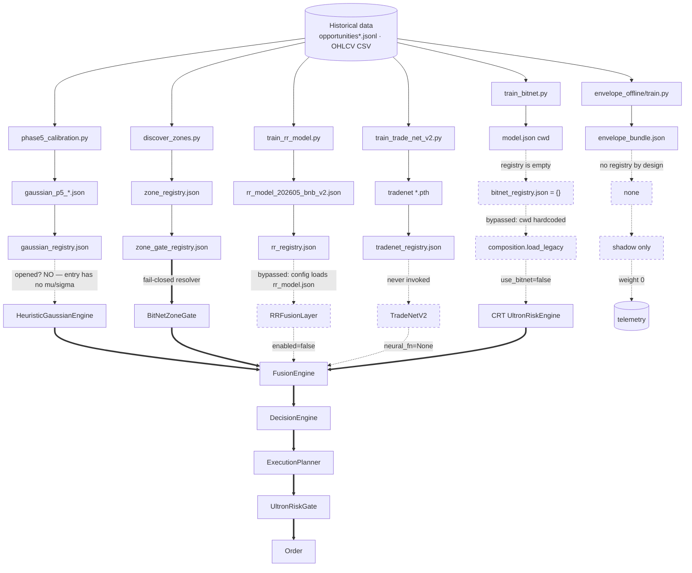

# Model Lineage Rollup — The Model Lifecycle Audit

> **What this is.** The cross-model reconciliation the five per-family lineage audits do not
> provide. Each of those traces one family in isolation; none answers *is the artifact the runtime
> actually loads the same one the registry declares and the trainer last produced?*
>
> **Organised by lifecycle, not by model.** Every defect found belongs to exactly one stage of a
> single pipeline, and each model is a row traversing that same pipeline. This makes the
> concentration of defects visible, and makes the document reusable: a new model family is one new
> row plus one trace.
>
> Fulfils the successor slot named in [`rr_lineage_audit.md`](rr_lineage_audit.md)
> (`HIGHEST_LEVERAGE_NEXT = optional model_lineage_rollup.md`).
>
> **Per-model narrative is LINKED, not restated:** [`gaussian`](gaussian_lineage_audit.md) ·
> [`zonegate`](zonegate_lineage_audit.md) · [`rr`](rr_lineage_audit.md) ·
> [`bitnet`](bitnet_lineage_audit.md) · [`tradenet`](tradenet_lineage_audit.md).
>
> **Authority: NONE (§6.5).** An alignment observation grants no promote, enable, retrain, or
> wiring right. §9 is advisory; `active_models.yaml` was **not** modified by this audit.
>
> Created 2026-07-22 · restructured 2026-07-23 · Active config: `v2_multi_2026_04` ·
> Branch: `feature/truth-registry-v2` · Task class: `OBSERVATION_ONLY`

---

## 0. Headline

**Registry actives are not the problem.** For every family that has a registry, `active: true`
already points at the newest entry by `trained_at`, and `active_models.yaml` mirrors that — proven
mechanically by a passing invariant. **Every alignment failure is downstream of registry
resolution**, in the loader/runtime portion of the lifecycle.

### The permanent invariant this audit established

> ### `Artifact Exists` ≠ `Artifact Opened`
>
> These are fundamentally different runtime states, and collapsing them hides real defects.
>
> Gaussian is the proof. `GaussianRegistry._load_registry` **runs**
> (`heuristic_gaussian_engine.py:226`, `:290`); it resolves the active version and
> `_artifact_exists` (`:127-138`) **confirms the artifact file is on disk** — including a
> `models/`-prefix strip — feeding `_resolve_with_fallback`, which would silently select a
> different version if the active artifact vanished. What it never does is **open** the file:
> `mu`/`sigma` are read off the registry *entry*, which carries neither key.
>
> So Gaussian is simultaneously loader-invoked, artifact-existence-checked, and
> artifact-never-opened. Only a matrix that separates those states can say so.

Defect count by lifecycle stage — the punchline:

| Stage | Defects | Kind |
|---|---|---|
| Training | 3 | label quality |
| Artifact | 3 | hygiene |
| Registry | 3 (+1 by-design) | metadata |
| **Loader** | **3** | **alignment** |
| **Runtime** | **4** | **alignment** |
| **Consumer** | **1** | **alignment** |

Training/artifact/registry defects are quality and hygiene issues that do **not** break the chain.
Every *alignment* failure sits in loader → runtime → consumer.

---

## 1. The model lifecycle

The spine of this document. Each stage is a distinct architectural contract, and each can fail
independently of the others.

```text
Training  →  Artifact  →  Registry  →  Loader  →  Runtime  →  Consumer  →  Decision
                                                 (open · execute)
```

| Stage | Contract | Fails when |
|---|---|---|
| **Training** | labels and features are governed | contaminated / synthetic / structurally unlearnable labels |
| **Artifact** | a checkpoint exists and is identifiable | missing, duplicated, ambiguous schema |
| **Registry** | one active version is declared per family/instrument | metadata drift, empty registry, no active map |
| **Loader** | the runtime resolves *the registry's* artifact | alias paths, hardcoded paths, cwd loading, registry bypass |
| **Runtime** | the model is instantiated and the artifact **opened**, then inference runs | never constructed; opened-but-unused; existence-checked-but-never-read |
| **Consumer** | the output reaches a decision | output ignored, or the entire consuming stack disabled |
| **Decision** | the consumed output changes an outcome | (economic question — out of scope here) |

---

## 2. Runtime Reachability Matrix

Every model as a row traversing §1. `n/a` = the stage does not apply (e.g. a geometry engine has no
artifact). Each `✗` carries the config key or code fact that determines it.

| Model / contract | Artifact Exists | Registry Selects | Loader Invoked | **Artifact Opened** | Inference Executed | Output Consumed | Runtime Status |
|---|---|---|---|---|---|---|---|
| **ZoneGate** | ✓ | ✓ | ✓ | ✓ | ✓ | ✓ | **ACTIVE** |
| **Gaussian (heuristic)** | ✓ | ✓ | ✓ | **✗** | ✓ | ✓ | **ACTIVE** *(registry metadata only)* |
| **Gaussian (ML)** | ✓ | ✓ | ✗ | ✗ | ✗ | ✗ | **DISABLED** |
| **RR geometry (contract A)** | n/a | n/a | ✓ | n/a | ✓ | ✓ | **ACTIVE** |
| **RR NanoInference (B)** | ✓ | ✓ | ✗ | ✗ | ✗ | ✗ | **DISABLED** |
| **BitNet** | ✓ | ✗ | ✗ | ✗ | ✗ | ✗ | **DISABLED** |
| **TradeNet v2** | ✓ | ✓ | ✗ | ✗ | ✗ | ✗ | **UNWIRED** |
| **EnvelopeNet** | ✓ | ✗ | ✗ | ✗ | ✗ | ✗ | **RESEARCH_ONLY** |
| **ReplayMemoryEngine** | n/a | n/a | ✗ | n/a | ✗ | ✗ | **DISABLED** |

**Why each `✗`:**

| Cell | Determining fact |
|---|---|
| Gaussian (heuristic) · Artifact Opened | `_normalize_registry_entry` defaults `mu=0/sigma=1`; **0 of 11** registry entries carry either key |
| Gaussian (ML) · Loader Invoked | `cfg.engine_runner.gaussian_impl = "heuristic"` → `MLGaussianEngine` never constructed |
| RR-B · Loader Invoked | `cfg.engine_runner.rr_fusion.enabled = false` → `RRFusionLayer` never constructed |
| BitNet · Registry Selects | `models/bitnet/bitnet_registry.json` is `{}` |
| BitNet · Loader Invoked | `cfg.crt_engine.use_bitnet = false` → `bitnet_score` never called |
| TradeNet · Loader Invoked | `neural_fn` occurs **0** times in `src/core/engine_runner.py`; `FusionEngine` default is `None` (`fusion_engine.py:274`, assigned `:282`) |
| EnvelopeNet · Registry Selects | `models/envelope_registry.json` does not exist — **by design** |
| EnvelopeNet · Loader Invoked | research-only; no spine import |
| ReplayMemory · Loader Invoked | its only consumer, `CognitiveBus`, is **absent from the active config**; code default `enabled=False` |

**Reading the matrix by column:** every family clears *Registry Selects* except the two that have
no registry. Failures concentrate in **Loader Invoked** (5 of 9 rows) and, uniquely, in **Artifact
Opened** (Gaussian). That is the loader-layer conclusion, made visual.

---

## 3. Two-axis state classification

A single status field was overloading two independent concepts. They are now separate.

### Runtime State — is the model running?

`ACTIVE` · `DISABLED` · `UNWIRED` · `SHADOW` · `RESEARCH_ONLY`

`DISABLED` = a real loader exists but a **config flag** gates it off (reversible by config).
`UNWIRED` = **no code path exists** to invoke it (reversible only by code).
`SHADOW` is currently **unused by every row** — EnvelopeNet's shadow run is complete, not standing.
The gap is deliberate, not an omission.

### Artifact State — what happened to the checkpoint?

Derived mechanically, not judged:

| State | Rule |
|---|---|
| `NONE` | no artifact exists |
| `STORED_ONLY` | on disk, but **no registry entry selects it** |
| `REGISTERED_ONLY` | a registry selects it, but the runtime **never opens** it |
| `LOADED` | opened and used at runtime |

| Model | Runtime | Artifact | Note |
|---|---|---|---|
| ZoneGate | ACTIVE | **LOADED** | the only fully-traversed lifecycle |
| Gaussian (heuristic) | ACTIVE | **REGISTERED_ONLY** | engine live, artifact inert |
| Gaussian (ML) | DISABLED | **REGISTERED_ONLY** | same registry as heuristic (see below) |
| RR geometry | ACTIVE | **NONE** | pure geometry, no checkpoint |
| RR NanoInference | DISABLED | **REGISTERED_ONLY** | |
| BitNet | DISABLED | **STORED_ONLY** | artifact exists; registry is `{}` |
| TradeNet v2 | UNWIRED | **REGISTERED_ONLY** | |
| EnvelopeNet | RESEARCH_ONLY | **STORED_ONLY** | no registry *by design* |
| ReplayMemoryEngine | DISABLED | **NONE** | role = historical consumer (a *role*, not a runtime state) |

> **Gaussian (ML) is `REGISTERED_ONLY`, not `STORED_ONLY`.** Verified:
> `MLGaussianEngine._load_model` (`ml_gaussian_engine.py:47`) → `GaussianModelRegistry`
> (`core/model_registry.py:403`), whose `reg_path` is **the same `models/gaussian_registry.json`**
> the heuristic track reads (`:415`). Its artifact is registered, and at `:93` it calls
> `load_gaussian_model`, which *would* open it. The ML track is a real loader that is config-gated
> off — not a broken one.

Splitting the axes also fixes an older overload: `ReplayMemoryEngine`'s "HISTORICAL CONSUMER" was
never a runtime state. It is a **role**; its runtime state is `DISABLED` and its artifact state is
`NONE`.

---

## 4. Defects by lifecycle stage

### 4.1 Training stage — label quality (3)

| Model | Defect |
|---|---|
| Gaussian | trains on raw `rr_achieved` from the F-022 detection stream, no `forward_walk` re-derivation — contamination **confirmed**, not suspected |
| BitNet | labels are a synthetic bullish-only ATR race (TP `+2·ATR` before SL `−1·ATR`, 40 bars) — not a governed economic label |
| EnvelopeNet | direction-mirrored population with `side` **excluded** from the feature set ⇒ 66.9% of MFE/MAE variance structurally unlearnable |

EnvelopeNet is the only family whose labels come from the measurement contract
(`forward_walk` / `horizon_excursion`).

### 4.2 Artifact stage — hygiene (3)

**4.2a Dangling and null-path registry entries.**

> **CORRECTED 2026-07-23 (evidence-validation pass).** Superseded text: *"**15 of 29** registry
> entries name a `model_file` that is not on disk: Gaussian 7/11, RR **4/8**, ZoneGate 2/6,
> TradeNet 2/4."* The original scan counted entries whose `model_file` was **null/empty** as
> "artifact missing" — a different defect. History preserved per §6.2 rule 4.

Of **29** registry entries, **27** carry a truthy `model_file`. **13** of those 27 point at a file
missing under *all three* resolutions tried (as-given · `models/`+given · strip-leading-`models/` —
three were tested because `model_registry.py` resolves `model_file` inconsistently across loaders):

| Family | dangling | of entries with a path |
|---|---|---|
| Gaussian | 7 | 11 |
| ZoneGate | 2 | 6 |
| RR | 2 | 6 |
| TradeNet | 2 | 4 |

Separately, **2 RR entries (`202505_v2`, `202605_v1`) carry a null/empty `model_file`** — an
incomplete registry entry, not a dangling path.

**Not a live dependency (verified):** zero dangling *or* null-path entries are flagged
`active: true` or named in an `__active__` map. Hygiene debt only.

```bash
venv/Scripts/python.exe -c "import json;d=json.load(open('models/rr_registry.json'));print({k:v.get('model_file') for k,v in d.items() if isinstance(v,dict)})"
```

**4.2b Duplicate artifacts with divergent schemas.** BitNet has three distinct model files:
`model.json` (`ae85db1e`, legacy 6-input), `results/model.json` (`ad1002d3`,
layers/weights/bias/scales), `results/model_export_format.json` (`d790e705`, export). Three
hashes, three schemas, no registry to disambiguate.

**4.2c Datasets stored as artifacts.** ~200 MB of `rr_dataset*.json` **training data** sits under
`models/` — a placement issue (`models/` should hold checkpoints), not a checkpoint defect.

### 4.3 Registry stage — metadata (3, +1 by design)

**4.3a RR registry metadata drift — the one defect that propagates into `active_models.yaml`.**

> **RESOLVED 2026-07-23 — `CH-rr-registry-dim-38`.** `models/rr_registry.json` entry
> `202605_bnb_v2_bnbusdt` corrected `n_features: 35 → 38`; `active_models.yaml` mirror followed
> (`selection` and `runtime_binding.compatibility`) **only because the registry changed**,
> preserving the `mirror_of_registry` contract. Fixed **upstream**, never by patching the mirror.
> Artifacts byte-unchanged (`6ed92d26ff612538` before and after); `PRODUCTION_BEHAVIOR_CHANGED=NO`.
> Manifests: [`impact`](build_manifests/CH-rr-registry-dim-38.impact.json) ·
> [`completion`](build_manifests/CH-rr-registry-dim-38.completion.json). The finding text below is
> preserved per §6.2 rule 4.
Superseded claim: *"RR train 35-dim vs serve 38-dim."* Measured:

| Source | Declares |
|---|---|
| `models/rr_registry.json` → `202605_bnb_v2_bnbusdt` | `n_features: 35` |
| `models/rr_model.json` (the artifact itself) | `n_features: **38**`, `zero_indices` length 11 |

The **registry is wrong**, and `active_models.yaml` faithfully mirrors it
(`rr_model.identity.compatibility.feature_schema_dim: 35`, `authority: mirror_of_registry`). R1
enforces *version* mirroring only — dimensions are unguarded. The defect is upstream in the
registry; the YAML is behaving correctly. Contrast Gaussian, whose registry dims **do** match their
artifacts (ETH 35↔35, BNB 38↔38).

```bash
venv/Scripts/python.exe -c "import json;print(json.load(open('models/rr_registry.json'))['202605_bnb_v2_bnbusdt']['n_features'], json.load(open('models/rr_model.json'))['n_features'])"
```

**4.3b BitNet registry is empty** (`{}`) — no promote/rollback surface exists for the family.

**4.3c TradeNet has no `__active__` map**, unlike Gaussian — selection is an `active: true` flag
only, and there is no BNB artifact for the baseline instrument.

**4.3d EnvelopeNet has no registry — BY DESIGN, not a defect.**
`docs/architecture/envelope-layer-design.md:104` names `models/envelope_registry.json` as a *future*
artifact stem; `:455` records "no registry entries yet"; `:584` states acceptance does not authorize
registry entries. This is why the `active_models.yaml` entry deliberately omits an `identity` block
(`identity.registry` must exist on disk).

### 4.4 Loader stage — alignment (3)

**4.4a RR: unregistered alias path.** `models/rr_model.json` exists on disk, is named by config
(`rr_fusion.model_path` and `rr_model.model_path`), and is referenced by **no registry**.
Registry-active names `models/rr_model_202605_bnb_v2.json`. Identical content today
(`6ed92d26ff612538` both); no invariant enforcing it tomorrow.

```bash
venv/Scripts/python.exe -c "import hashlib;p=lambda f:hashlib.sha256(open(f,'rb').read()).hexdigest()[:16];print(p('models/rr_model.json'),p('models/rr_model_202605_bnb_v2.json'))"
```

**4.4b BitNet: hardcoded cwd load + config illusion.**

> **CORRECTED 2026-07-23 (evidence-validation pass).** The conclusion holds; the **code path
> originally cited was wrong**. Superseded text: *"`BitNetModel(model_path="model.json")` defaults
> to a cwd-relative path and is instantiated with no argument"* — citing
> `bitnet_inference.py:87` / `:313`. That is **dead code**: `_get_bitnet` has no live caller
> (grep over `src/ scripts/ tests/` returns pycache only). History preserved per §6.2 rule 4.

`bitnet_score` is a Contract-A façade (Spec v1.2.1) routing through the composition layer:

```text
src/bitnet/bitnet_inference.py:331   return float(get_default_composition().predict(features).confidence)
  → src/bitnet/composition.py:302    def get_default_composition(model_path: str = "model.json")
  → src/bitnet/composition.py:121    def load_legacy_composition(model_path: str = "model.json")
       :129 os.path.exists(model_path)   :133 open(model_path)   :158 artifact_sha256
```

Called with **no argument**, so the cwd-relative `"model.json"` default applies — the working
directory determines which model would load. `cfg.engine_runner.model_path`
(`results/model_export_format.json`) is passed to neither function, so the configured path is never
consulted. (Load-time provenance *is* captured: `artifact_sha256` at `composition.py:158`.)

**4.4c Gaussian: artifact existence-checked but never opened.** The `Exists ≠ Opened` invariant in
§0. The registry read does real work — version resolution, fallback, on-disk existence check — and
contributes nothing to the score. Pinned by `tests/test_gaussian_live_parameterization.py`, which
fails if `mu`/`sigma` are ever added (that would be a live-behaviour change). Evidence: F-060.

A second dead branch: `get_active_gaussian()` is hardcoded to `EURUSD` while `__active__` has no
EURUSD key, so `load_active_gaussian_scorer` always returns `NoOpScorer` — a separate Phase-5
surface from the fusion Gaussian.

### 4.5 Runtime stage — never instantiated (4)

Gaussian (ML), RR NanoInference, BitNet, and TradeNet v2 are never constructed on the live path.
Three are **config-gated** (`gaussian_impl`, `rr_fusion.enabled`, `use_bitnet`) and therefore
`DISABLED`; TradeNet is **code-absent** (`neural_fn` never supplied) and therefore `UNWIRED`. The
distinction matters: three are reversible by config, one requires code.

### 4.6 Consumer stage — the whole stack is off (1)

`engine_runner.cognitive` is **absent from the active config**, and the code default is
`_cognitive_cfg.get("enabled", False)`. So `CognitiveBus` does not run on `v2_multi_2026_04` — and
with it the entire cognitive stack (ReplayMemory · MarketStateCluster · TradeNetMeta ·
HierarchicalMetaFusion) is **unreachable**, not merely non-authoritative. This supersedes the
weaker framing that ReplayMemory is "consumed only by CognitiveBus (write-only telemetry)": its
only consumer is itself switched off.

---

## 5. Per-model lifecycle traces (evidence)

### 5.1 Gaussian — ACTIVE, artifact-disconnected

```text
logs/**/opportunities*.jsonl  (F-022 detection stream, rr_achieved read raw)
  → scripts/training/phase5_calibration.py   run_calibration → train_gaussian    [BUILDER OF RECORD]
     (NOT src/training/train_pipeline.py:run_gaussian_update — audited but produced nothing)
  → models/{INSTR}/…/gaussian_p5_*.json        4 artifacts on disk / 11 registry entries
  → models/gaussian_registry.json              __active__ {ETH: v5_auto_2026_06_eth, BNB: p5_20260524T120449}
  → GaussianRegistry.load()                    opens the REGISTRY; existence-checks the artifact
  ✗ ARTIFACT NEVER OPENED                      mu/sigma read off the entry → defaults 0/1
  → HeuristicGaussianEngine.compute            score = exp(-x²/2)
  → FusionEngine (weight_gaussian 0.2) → DecisionEngine
  → FINAL EFFECT: a near-CONSTANT ≈0.8825
```

### 5.2 ZoneGate — ACTIVE, the only fully-traversed lifecycle

```text
logs/BNBUSDT/…/opportunities.jsonl (139,942 records)
  → scripts/research/discover_zones.py (KMeans k=8, seed 1337)
     → scripts/research/convert_zones_v1_to_gaussian.py   [recovered 2026-07-21, --compare IDENTICAL]
  → models/zone_registry.json                  sha256 e73e0893… (8 zones, v2_gaussian schema)
  → models/zone_gate_registry.json             active = v2_gaussian_runtime_2026_07 → same sha
  → src/core/engine_runner.py:469              resolve_zone_gate_runtime(how_path=…)  [FAIL-CLOSED]
  → src/core/engine_runner.py:474              get_zone_gate(…) → BitNetZoneGate.check
  → FusionEngine (weight_zone_gate 0.2, zone_mode=hard) → DecisionEngine
  → FINAL EFFECT: real geometric HARD gate — but ΔG001 ≡ 0 (F-036), 0/8 zones honest E>0 (F-041B)
```

Two mechanisms make this the only aligned family: `tests/test_zone_manifest_runtime_parity.py`
pins manifest-active sha == runtime file, and `resolve_zone_gate_runtime`
(`src/config_layer/model_resolver.py`) fail-closes on registry/identity/HOW path mismatch.
**Aligned ≠ valuable** — ZoneGate is aligned *and* non-pivotal.

### 5.3 RR — contract A ACTIVE (geometry), contract B DISABLED

```text
opportunities JSONL → scripts/data/build_rr_dataset.py → src/config_layer/rr/rr_dataset_builder.py
  → RRPatternTrainer (ridge expected_rr + GNB p_win + Ledoit-Wolf covariance)
  → models/rr_model_202605_bnb_v2.json    ← REGISTRY-ACTIVE artifact (artifact says n_features 38)
  → models/rr_registry.json               active = 202605_bnb_v2_bnbusdt  (declares 35 — see §4.3a)
  ✗ LOADER NEVER INVOKED — RRFusionLayer constructed only when rr_fusion.enabled
  → cfg rr_fusion.enabled = FALSE (F-038) ⇒ self.rr_fusion = None
  → base RREngine.compute() flows through UNMUTATED (geometry only: close/high/low)
  → FINAL EFFECT: the trained model contributes NOTHING; the fusion "rr" slot is candle polarity
```

### 5.4 BitNet — DISABLED, cwd-hardcoded

```text
historical OHLCV CSV → FeaturePipeline (rows filtered retest_depth > 0.05)
  → scripts/training/train_bitnet.py    labels = synthetic ATR race (bullish-only, 40 bars)
  → model.json  (repo root / cwd)       sha ae85db1e…  schema legacy_6input, 6→16→8→1
  → models/bitnet/bitnet_registry.json  = {}   ← EMPTY: no promote/rollback surface at all
  → bitnet_inference.py:331 → composition.py:302 → :121   ← CWD-RELATIVE DEFAULT (§4.4b)
  → UltronRiskEngine.approve_with_soft_conf → hard reject if score < 0.55
  → cfg crt_engine.use_bitnet = FALSE ⇒ branch never taken
  → FINAL EFFECT: none (inert). If enabled: a state-machine-perturbing VETO (F-055)
```

### 5.5 TradeNet v2 — UNWIRED

```text
logs/**/opportunities*.jsonl → scripts/training/train_trade_net_v2.py (3 heads; composite 0.4/0.4/0.2)
  → models/ETHUSDT/…/tradenet_v5_auto_2026_06_eth.pth + _scaler.json   (legacy v1 .pth on disk)
  → models/tradenet_registry.json   active = v5_auto_2026_06_eth   (NO __active__ map)
  ✗ LOADER NEVER INVOKED — `neural_fn` has ZERO occurrences in src/core/engine_runner.py
  → FusionEngine(neural_fn=None) always
  → FINAL EFFECT: none (F-005)
```

`TradeNetV2(...)` is constructed nowhere in `src/` except its own module docstring examples and its
CLI `main` (`src/training/trade_net_v2.py:440`). No BNB artifact exists, so even if wired the
baseline instrument would hit `TRADENET_MISSING → predict() = None`.

### 5.6 EnvelopeNet — RESEARCH_ONLY

```text
opportunities → src/research/clean_labels/builder.py  (y via forward_walk / horizon_excursion)
  → results/clean_labels/BNBUSDT/20260721T223243Z/clean_labels.jsonl  (TN_ENV_CLEAN_L2, n=139,942)
  → src/research/envelope_offline/train.py            4 POINT heads (no q50/q80 quantiles)
  → results/envelope_offline/BNBUSDT/20260721T224101Z/envelope_bundle.json
     pit_status = PIT_UNCLEAN_STORED_FEATURES
  ✗ NO REGISTRY (by design — §4.3d)
  → src/research/envelope_offline/shadow.py           decision_weight 0.0 hard, spine_consumed false
  → FINAL EFFECT: none. Registered in active_models.yaml §5c as status: experimental
```

### 5.7 ReplayMemoryEngine — DISABLED (role: historical consumer)

Not a model: no training script, no artifact, no registry. Reads historical
`opportunities*.jsonl` (default dir `logs`) plus `zone_registry_path`, and answers similarity
queries; per-instrument state under `models/replay/zone_registry_{BTC,ETH,SOL,BNB}USDT.json`. Its
only consumer, `CognitiveBus`, is **off** on the active config (§4.6), so the engine does not run.

---

## 6. Dependency graph



Solid = live decision path. Dashed = disabled / unwired / no-registry.

---

## 7. Evidence classification (validation pass, 2026-07-23)

> Phase 2 of the governance sequence: *audit → **evidence validation** → decision → implementation.*
> Every finding re-derived independently and classified **PROVEN** / **PARTIALLY PROVEN** /
> **REQUIRES VERIFICATION**. Classification only — no recommendations, no fixes.
>
> **This pass overturned three of my own claims** (BitNet code path, dangling count, RR dims); each
> is marked `CORRECTED` inline above rather than silently rewritten.

Paths are repo-relative. `cfg` = `configs/production/v2_multi_2026_04.json`.

| # | Finding | Class | Code path | Config / artifact path | Reproduction |
|---|---|---|---|---|---|
| 1 | `active_models.yaml` mirrors registry actives, all families | **PROVEN** | `tests/test_active_models_registry.py` R1 | `models/*_registry.json` ↔ `active_models.yaml` | `pytest tests/test_active_models_registry.py -k r1_registry -q` |
| 2 | Gaussian: registry read supplies nothing (`mu`/`sigma` defaults fire) | **PROVEN** | `src/engines/heuristic_gaussian_engine.py` `_normalize_registry_entry` | `models/gaussian_registry.json` (11/11 entries lack both keys) | `pytest tests/test_gaussian_live_parameterization.py -q` |
| 3 | ZoneGate is the only registry↔runtime aligned family | **PROVEN** | `src/core/engine_runner.py:469` `resolve_zone_gate_runtime` | `models/zone_registry.json` sha `e73e0893…` | `pytest tests/test_zone_manifest_runtime_parity.py -q` |
| 4 | RR config path is referenced by **no** registry | **PROVEN** | `src/core/engine_runner.py` (rr_fusion ctor, gated) | `cfg.engine_runner.rr_fusion.model_path` = `models/rr_model.json`; registry-active = `models/rr_model_202605_bnb_v2.json` | orphan scan in §4.4a |
| 5 | Those two RR files are byte-identical **today** | **PROVEN** (point-in-time) | — | both sha256 `6ed92d26ff612538` | §4.4a command |
| 6 | BitNet loads a **cwd-relative** `model.json` | **PROVEN** *(path corrected)* | `bitnet_inference.py:331` → `composition.py:302` → `:121` | cwd `model.json` sha `ae85db1e…` | `grep -n "model.json" src/bitnet/composition.py` |
| 7 | `cfg.engine_runner.model_path` is never consulted by the BitNet path | **PROVEN** | no argument passed at `bitnet_inference.py:331` | `cfg` → `results/model_export_format.json` sha `d790e705…` | `grep -rn "get_default_composition(" src/` |
| 8 | BitNet has 3 artifacts with 3 different schemas | **PROVEN** | — | `model.json` · `results/model.json` · `results/model_export_format.json` | §5.4 |
| 9 | TradeNet is unwired (`neural_fn` never supplied) | **PROVEN** | `grep -c neural_fn src/core/engine_runner.py` → **0**; default `None` at `fusion_engine.py:274`, assigned `:282` | `models/tradenet_registry.json` active `v5_auto_2026_06_eth` | `grep -c "neural_fn" src/core/engine_runner.py` |
| 10 | 13 of 27 path-bearing registry entries dangle; +2 null-path | **PROVEN** *(corrected from 15/29)* | — | see §4.2a table | §4.2a command |
| 11 | No dangling/null entry is `active:true` or in `__active__` | **PROVEN** | — | all four registries | §4.2a command |
| 12 | EnvelopeNet has no registry **by design** | **PROVEN** | — | `docs/architecture/envelope-layer-design.md:104`, `:455`, `:584` | `grep -n "registry entries" docs/architecture/envelope-layer-design.md` |
| 13 | ~200 MB of `rr_dataset*.json` training data sits under `models/` | **PROVEN** | — | `models/{BNBUSDT,ETHUSDT}/**/rr_dataset*.json` | orphan scan in §4.2c |
| 14 | RR registry declares `n_features: 35`; artifact declares **38** | **PROVEN** *(new — reclassifies the old "35 vs 38 mismatch")* | — | `models/rr_registry.json` vs `models/rr_model.json` | §4.3a command |
| 15 | Gaussian ETH active is a genuine 35-dim artifact vs a 38-dim pipeline | **PARTIALLY PROVEN** | — | registry 35 ↔ artifact 35 (verified) | §5.1 |
| — | …but it has **zero runtime consequence** | **PROVEN** | the artifact is never opened (finding 2) | — | — |
| 16 | "registry active == latest by `trained_at`" | **PARTIALLY PROVEN** | — | holds per-instrument for Gaussian BNB + ETH; **7 Gaussian entries carry no instrument attribution** and EURUSD has an entry with no active | §5.1 |
| 17 | `_get_bitnet` / `BitNetModel` is dead code | **REQUIRES VERIFICATION** | `bitnet_inference.py:310-313` | — | grep covered `src/ scripts/ tests/` only — an import from elsewhere was not excluded |
| 18 | RR's two paths will **stay** identical | **REQUIRES VERIFICATION** | — | no parity invariant exists (contrast ZoneGate's) | equality measured once, 2026-07-23 |
| 19 | CognitiveBus is off ⇒ the whole cognitive stack is unreachable | **PROVEN** | `engine_runner` cognitive guard, code default `enabled=False` | `cfg.engine_runner.cognitive` **absent** | `python -c "import json;print('cognitive' in json.load(open('configs/production/v2_multi_2026_04.json'))['engine_runner'])"` |

**Classification summary:** 15 PROVEN · 2 PARTIALLY PROVEN · 2 REQUIRE VERIFICATION.

---

## 8. Governance verdict

Per layer, with responsibilities kept distinct:

| Layer | Verdict |
|---|---|
| **`active_models.yaml`** | **Functioning correctly** as a mirror of registry state — mechanically enforced by `test_identity_r1_registry_selection_mirror`. No version field requires updating. |
| **Model registries** | **Generally functioning**, with one metadata defect (RR feature count, §4.3a) and hygiene debt (§4.2a). Selection itself is correct everywhere. |
| **Runtime loaders** | **The primary source of alignment issues** — BitNet, RR, TradeNet, Gaussian. This is where the next governance phase belongs. |
| **EnvelopeNet** | **Intentionally outside the registry** until a registry is introduced (§4.3d). Not a defect. |

**The responsibility chain** this audit is defending:

```text
active_models.yaml  mirrors  the registry
registries          declare  the active artifact
loaders             MUST HONOUR the registry
runtime             reflects what the loaders resolve
```

**Next phase: loader/runtime governance, not registry governance.** The audit shifted the question
from *configuration correctness* to *runtime contract correctness*, which is the more important
architectural concern — and the one place a registry edit could not have helped.

This verdict authorizes nothing. Fixes are a separate decision.

---

## 9. `active_models.yaml` recommendations (advisory — file NOT modified)

| Family | Current declared | Latest trained | Recommended | Reason | Evidence |
|---|---|---|---|---|---|
| Gaussian | ETH `v5_auto_2026_06_eth` · BNB `p5_20260524T120449` | `p5_20260524T120449` | **No version change** | Declared versions already mirror registry actives; the defect is that neither reaches the score | §4.4c · F-060 |
| ZoneGate | `v2_gaussian_runtime_2026_07` | same | **No change** | Fully aligned; parity invariant green | §5.2 |
| RR | `202605_bnb_v2_bnbusdt`, `how_path_ref → models/rr_model.json` | same | **No version change.** A ZoneGate-style parity invariant, or repoint config at the versioned file | `how_path_ref` pins an unregistered alias | §4.4a |
| BitNet | `selection.version: null`, `identity_status: absent` | — | **No change — already correct** | Empty registry is honestly represented | §4.3b |
| TradeNet | `v5_auto_2026_06_eth`, `selected_not_enabled` | same | **No change** | Declaration matches reality | §4.5 |
| EnvelopeNet | §5c `status: experimental`, no identity block | bundle 2026-07-21 | **No change** | Correct while no registry exists | §4.3d |
| ReplayMemoryEngine | absent from registry | n/a | **Optional:** a classification-only entry | Not a model; absence is defensible | §5.7 |

**Net: no `active_models.yaml` VERSION field needs updating.**

> **QUALIFIED 2026-07-23 (validation pass).** One non-version field is factually wrong:
> `rr_model.identity.compatibility.feature_schema_dim: 35` vs the artifact's **38** (§4.3a). The
> YAML is correctly mirroring an incorrect registry, so the correction belongs in
> `models/rr_registry.json` first; the YAML follows by its own `mirror_of_registry` rule. This does
> not change the "no version update" conclusion.

---

## 10. Registry validation against the audit (Phase 3, 2026-07-23)

> Phase 3 of the governance sequence: *audit ✓ → evidence validation ✓ → **validate the registry
> against the evidence** → decide → implement.* Default assumption held throughout:
> `active_models.yaml` is correct unless it **contradicts a verified finding**.

### 10.0 Two scope notes recorded before the results

**No uploaded file exists.** This validation was requested against an `active_models(1).yaml`
described as uploaded. No such file exists — the repo and `Downloads` were searched; the only
matches are the live `active_models.yaml` and one packaged copy (§10.5). The live registry was
validated instead, which is what Phase 3 requires.

**A probe bug was caught before it became a finding.** An automated dimension check reported the RR
artifact as 12-dimensional. That was the probe: `feature_schema` is the **string** `"canonical_38"`
(12 characters), not a list. Read correctly the artifact is unambiguously 38-dim — `n_features: 38`,
`scale_mu` and `ridge_w` both length 38, `zero_indices` length 11 → rank 27 (matching F-044). The
§4.3a finding stands, now corroborated by four independent fields. Recorded rather than hidden
(E-001).

### 10.1 Registry correctness — **PASS**

Every `identity.selection` mirrors its registry's active entry, enforced mechanically by
`test_identity_r1_registry_selection_mirror` (passing). Per-instrument actives equal
latest-by-`trained_at`. `bitnet` correctly declares `selection.version: null` /
`identity_status: absent` (its registry is `{}`); `envelope` correctly omits an `identity` block
(no registry exists — by design, §4.3d).

### 10.2 Governance consistency — **one defect, already known**

| Family | YAML | Registry | Artifact | Verdict |
|---|---|---|---|---|
| gaussian ETH | 35 | 35 | 35 | consistent |
| gaussian BNB | 38 | 38 | 38 | consistent |
| **rr_model** | **35** | **35** | **38** | **registry metadata error** (§4.3a) — the YAML correctly mirrors a wrong registry |
| zone_gate | 38 | *(no dim field)* | 38 (`feature_order`) | consistent |
| tradenet | 35 | *(no dim field)* | binary `.pth` | **UNVERIFIED** |
| bitnet | n/a | `{}` | — | consistent (`compat: 6` = legacy contract) |

Gaussian's `compatibility.feature_schema_dim: 38` records the **pipeline** dim while ETH's
`selection.feature_schema_dim: 35` records the **artifact** dim. Different fields, different
meanings, both correct — this is the registry expressing a schema-era gap accurately, not a
conflation. The RR defect is registry-layer only and must not be read as a runtime mismatch.

### 10.3 Lifecycle classification — **4 of 6 exact, 2 expressiveness gaps**

| Family | YAML `identity_status` | Audit Runtime | Audit Artifact | Match |
|---|---|---|---|---|
| gaussian | `enabled_without_checkpoint` | ACTIVE | REGISTERED_ONLY | ✓ |
| zone_gate | `selected_and_enabled` | ACTIVE | LOADED | ✓ |
| rr_model | `selected_not_enabled` | DISABLED | REGISTERED_ONLY | ✓ |
| bitnet | `absent` | DISABLED | **STORED_ONLY** | **partial** |
| tradenet | `selected_not_enabled` | **UNWIRED** | REGISTERED_ONLY | **collision** |
| envelope | *(none)* + `status: experimental` | RESEARCH_ONLY | STORED_ONLY | ✓ |

Neither gap is a **wrong** declaration. Both are things the current vocabulary *cannot say*:

- **`selected_not_enabled` collides across remediation classes.** `rr_model` is config-gated
  (`rr_fusion.enabled=false` — reversible by config); `tradenet` is code-absent (`neural_fn` never
  supplied — requires code). Same token, materially different fix. This is the DISABLED/UNWIRED
  distinction from §3 that the single field cannot carry.
- **`absent` cannot express "artifact exists but unregistered."** BitNet's cwd `model.json` is on
  disk; `absent` describes only registry *selection*. The same blindness applies to `envelope`,
  whose bundle exists but is invisible to the identity layer.

### 10.4 Architectural completeness — **4 of 5 concerns cleanly separated**

| Concern | Expressed? | Where |
|---|---|---|
| Registry identity | ✓ | `identity.selection` (+ `by_instrument`) |
| Runtime wiring | ✓ | `execution.runtime_enabled`, `decision_reachable` |
| Production status | ✓ | `status` + `runtime.active` |
| Research / experimental | ✓ | `status: experimental` · `orphaned` · `dormant` |
| **Artifact identity** | **partial** | `how_path_ref` is a *path pin* only — no existence or hash field, so **Artifact State (§3) is not derivable from the YAML alone** |

### 10.5 Duplicate registry copy — **verified CORRECT, not drift**

`msip_1_verification_package/04_crt_runtime/active_models.yaml` is an older state (schema 2.1, 7
models — no `tradenet`, no `envelope`). It is nonetheless correct: a **properly manifested
snapshot** whose sha256 `76f9ee6930ca305e…` is recorded in
`msip_1_verification_package/00_manifest/MSIP-1_SOURCE_MANIFEST.json` and matches byte-for-byte.
Untracked by git, inside a package whose purpose is to freeze the state it verified. Snapshot
discipline is working — a *passed* check, recorded so the copy is not later mistaken for drift.

### 10.6 Verdict

> **`active_models.yaml` is VALIDATED CORRECT against the audit evidence.**
>
> It contradicts no verified finding. The single metadata defect (§4.3a) is upstream in
> `models/rr_registry.json`; the YAML mirrors it faithfully, which is *correct behaviour* under its
> own `authority: mirror_of_registry` rule. The two lifecycle gaps are vocabulary limits, not
> misdeclarations.

### 10.7 Improvement candidates — **NOT AUTHORIZED**

Phase 5 material, recorded only. Each needs its own decision; none is implied by this validation.

| # | Candidate | Rationale | Layer |
|---|---|---|---|
| a | Split `selected_not_enabled` into config-gated vs code-absent | §10.3 collision — different remediation classes share one token | schema |
| b | Add an artifact-state field (exists / hash) | §10.4 — Artifact State is not derivable from the YAML alone | schema |
| c | ~~Correct `n_features` in `models/rr_registry.json`, let the mirror follow~~ | **DONE 2026-07-23** — `CH-rr-registry-dim-38` (§4.3a) | registry |
| d | Extend R1 to guard dimensions, not just versions | the dim drift in (c) was unguarded and survived until this audit — **still open** | test |

### 10.8 MRF_V1 — Model Registry Federation (recorded, deferred)

```text
MRF_V1 — Model Registry Federation
Status:  Proposed
State:   Not Implemented
Reason:  Deferred until research stabilization
```

**The proposal.** Split `active_models.yaml` from a monolith owning six concerns into an *index*
that references five single-responsibility authorities — `model-intent` (WHY) ·
`model-schema` (WHAT/contracts) · `model-runtime` (HOW) · `model-evidence` (PROOF) ·
`model-governance` (LIFECYCLE). The motivating case is real: the §4.3a fix required an edit in two
files because the feature dimension is declared in two places; a schema authority would make it one.

**Why deferred.** *Don't optimize governance faster than you can validate models.* The binding
constraint on this system is trustworthy models — aligned registries, aligned runtime, reproducible
experiments — not YAML organisation. Federation is governance optimisation and buys nothing toward
model confidence; it can be revisited once runtime alignment is finished, if it still justifies the
migration.

**Evidence gathered while scoping, recorded so a future decision does not re-derive it:**

1. **`active_models.yaml` is a runtime input, not only a knowledge store.**
   `src/config_layer/state_contract_loader.py:38` hardcodes `_REPO_ROOT / "active_models.yaml"`,
   parses `state_contracts`, **enumerates top-level keys as the model-ID set** (`:104`), and
   fail-closes on state-set parity (`:133`). Any federation must keep the index at repo root and
   retain `state_contracts` + top-level model keys, or it becomes a runtime change.
2. **Coupling is 27 code files** — 6 `src/`, 11 `tests/`, 10 `scripts/` — plus **22 test functions**
   in the registry guard alone.
3. **YAML has no native `$ref`**, and no resolver exists in this repo (verified). The proposed
   `schema_ref: model-schema.yaml#/rr_model` convention needs a new resolver *and* a ref-integrity
   test; dangling refs would be the new failure mode traded for the old one (duplicated truth).
4. **Two-file edits move rather than vanish** — registry JSONs remain a separate authority, so
   registry↔schema parity would still need the guard that candidate (d) describes.
5. **Session-bootstrap cost** — `active_models.yaml` is read first in every session; one read
   currently answers most questions, several would be needed after a split.

Authority: NONE. This records a proposal; it authorizes no migration step.

---

## 11. Known gaps in this audit

1. **Not mechanically reproducible.** The matrix was derived from ad-hoc inline commands — the same
   reproducibility gap the ZoneGate provenance reconstruction flagged. A read-only
   `scripts/analysis/model_alignment_probe.py` would close it; it is implementation and was
   deliberately out of scope.
2. **Citations here are unguarded.** `tests/test_doc_citations.py` scans `CLAUDE.md`,
   `docs/current-findings.md`, `active_models.yaml`, and `docs/{architecture,reference,topics}` —
   **not** `docs/governance/`. Path-level references are used throughout for that reason.
3. **Point-in-time.** Hashes, `trained_at` values, and config flags are pins against
   `v2_multi_2026_04`, not guarantees.
4. **No economic claim.** Alignment is a plumbing property. ZoneGate traverses the entire lifecycle
   and is economically non-pivotal (F-036/F-041B); alignment and value are independent axes.
