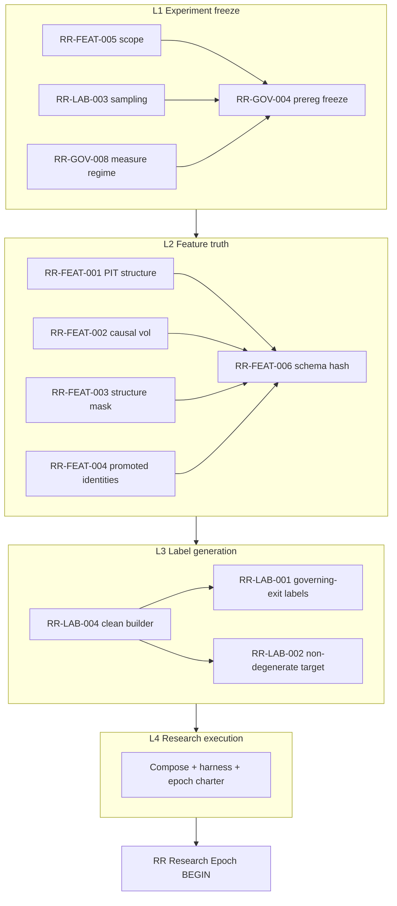

# RR Production Readiness Checklist

**Purpose:** Single gate inventory of every known RR implementation defect, contract mismatch,
feature/PIT issue, label/dataset defect, and governance blocker across contracts **A/B/C/D**.

**Hard rule (user-mandated):**  
1. Every checklist item must be **`RESOLVED`** or **`ACCEPTED`** before GATE-R is READY.  
2. The **12 Research-critical (RC)** items form a **four-layer dependency graph**
   (Experiment freeze → Feature truth → Label generation → Research execution).  
3. **A new RR research epoch MUST NOT begin** until **all four layers are complete**
   (and remaining non-RC items are RESOLVED or ACCEPTED).

**Authority:** governance / research planning only. This checklist grants **no** production
weight, **no** `rr_fusion` re-enable, and **no** config promote (§6.5 Authority Ladder).

| Field | Value |
|-------|--------|
| Created | 2026-07-21 |
| Classification complete | 2026-07-21 |
| RC four-layer graph | 2026-07-21 |
| Branch context | `feature/truth-registry-v2` |
| Active config | `v2_multi_2026_04` |
| Lineage parent | [`rr_lineage_audit.md`](rr_lineage_audit.md) |
| Findings | F-022 · F-037 · F-038 · F-044 · F-045 · F-048 · F-051 · F-054 · F-058 |
| Related (orthogonal) | [`h-rr-threshold-001-preregistration.md`](../research-readiness/h-rr-threshold-001-preregistration.md) (contract **D** knobs only — **not** a substitute for this gate) |
| Artifact under review | `models/rr_model.json` (+ train path + fusion wire) |

---

## 0. Status vocabulary (mandatory)

| Token | Meaning |
|-------|---------|
| **OPEN** | Still unresolved. GATE-R forbidden while any OPEN remains (must RESOLVE or ACCEPT). |
| **RESOLVED** | Fixed in code/config/docs with evidence (file:line, test, or measured report). |
| **ACCEPTED** | Explicitly left as-is **for a named scope**. Requires: *who*, *date*, *scope*, *rationale*, *what it does **not** unblock*. Only valid for **Research-safe** items at GATE-R. |
| **N/A** | Not applicable to the scoped program (must still be marked, never silently dropped). |

### Category vocabulary (mandatory — every**ACCEPTED** item has ≥1)

| Category | Code | Meaning | GATE-R action | GATE-P action |
|----------|------|---------|---------------|---------------|
| **Research-critical** | **RC** | Must be **RESOLVED** before clean dataset / preregistered B research. **ACCEPT forbidden** for any program labeled “clean.” | **Must RESOLVE** | Usually also required (see dual tags) |
| **Research-safe** | **RS** | May be **ACCEPTED** for GATE-R without code fix. Accept still requires §9.1 log entry. | **RESOLVE or ACCEPT** | See dual: if also **PC**, ACCEPT does **not** clear GATE-P |
| **Production-critical** | **PC** | Must be **RESOLVED** before `rr_fusion` re-enable / promote / economic authority. ACCEPT is never enough for GATE-P. | May ACCEPT for R if also RS | **Must RESOLVE** |

**Dual tags are normal.** Example: `RS+PC` = accept for offline research, fix before production.  
**Primary tag for GATE-R readiness:** if an item is **RC**, it is never research-safe.

**Two gate levels** (do not conflate):

| Gate | Unlocks | Requires |
|------|---------|----------|
| **GATE-R** | Clean dataset generation + **preregistered** RR research (measure / kill-test / shadow only) | All **RC** → RESOLVED; all **RS-only** and **RS+PC** → RESOLVED or ACCEPTED; all **PC-only** → RESOLVED or ACCEPTED (for R scope) |
| **GATE-P** | Production `rr_fusion` re-enable / promote / economic authority | GATE-R **and** every **PC** item **RESOLVED** |

---

## 1. Contract map (never conflate)

| ID | Name | Learning? | Active on patch? | Owns |
|----|------|-----------|------------------|------|
| **A** | `RREngine` — Candle Polarity Index | No | **YES** (fusion weight 0.2) | Structure quality score ∈[0.5,1] |
| **B** | `NanoInferenceEngine` + `RRFusionLayer` | Yes | **NO** (`rr_fusion.enabled=false`) | Trained expected_rr / p_win / confidence |
| **C** | `DecisionEngine` economic-RR gate | N/A | Conditional | Reject `low_rr` when economic RR supplied |
| **D** | `UltronRiskGate` + planner SL/TP RR | N/A | Separate | True forward R floor (`min_rr_ratio`) |

This checklist is **primarily** the readiness gate for **contract B research** (clean labels → model evaluation → optional future re-enable).  
Contract **D** threshold research (H-RR-THRESHOLD-001) is **out of band** unless an item explicitly names it.

---

## 2. Category rollup (authoritative classification — 2026-07-21)

### 2.1 Research-critical (**RC**) — must RESOLVE before GATE-R

| ID | Short title | Also PC? | Resolve means (minimum) |
|----|-------------|:--------:|-------------------------|
| **RR-LAB-001** | Labels from F-022 detection stream | yes | Labels via `forward_walk(intrabar_fixed)` (or prereg-named governing exit); stream fields x-ref only |
| **RR-LAB-002** | `y_rr` degenerate (win → +1.0) | yes | Continuous realized R **or** honest binary-only target name in prereg + dataset |
| **RR-LAB-003** | “balanced” corpus not class-balanced | no | Prereg + builder freeze sampling (natural base rate vs deliberate balance) + metric choice |
| **RR-LAB-004** | No governed `forward_walk` label path | yes | Checked-in clean-label builder (script OK) with schema + provenance |
| **RR-FEAT-001** | Train PIT_UNCLEAN centered swings (F-051) | yes | Clean vectors use causal structure (post FC1-A); provenance `PIT_CLEAN` (or equivalent) |
| **RR-FEAT-002** | Train-era global-batch `volatility_regime` | yes | Clean vectors use rolling causal vol-regime (post FC1-D) |
| **RR-FEAT-003** | Contaminated structure dims ACTIVE | yes | PIT-clean structure features **or** explicit zero-mask + rationale in prereg |
| **RR-FEAT-004** | Feature-DAG STALE cascade (F-054) | yes | New evidence only on promoted feature identities; old metrics quarantined |
| **RR-FEAT-005** | BNB-only vs multi config | no* | Prereg freezes instrument universe; multi claims require multi data |
| **RR-FEAT-006** | Schema / feature-name contract unlocked | yes | Frozen feature list + schema hash on clean dataset; loaders reject mismatch |
| **RR-GOV-004** | Preregistration required before B experiments | no | Written + frozen prereg (md+json) **after** checklist green, **before** outcomes |
| **RR-GOV-008** | Spine measure regime undeclared (F-037/F-058) | no | Prereg freezes gate-ON/OFF, instruments, costs, exit model; no silent env |

\* FEAT-005 is **RC** for research design honesty. Expanding multi-instrument **production** model is additional **PC** work under a later retrain program (covered by LAB/FEAT rebuild + GOV-001), not a separate dual tag here.

**RC count: 12** — none may be ACCEPTED for a “clean dataset / preregistered RR research” program.  
**Ordering:** RC work follows the **four-layer dependency graph in §2.1A**. Do not start Layer *N+1* until Layer *N* is complete (exit criteria met).

### 2.1A RC four-layer dependency graph (authoritative)

> **Epoch rule:** Only after **L1 ∧ L2 ∧ L3 ∧ L4** are complete may a new
> **RR Research Epoch** begin (outcome measurement, kill-test runs that can update findings,
> retrain experiments under the frozen prereg). Partial layers do not authorize an epoch.

```text
  ┌─────────────────────────────────────────────────────────────┐
  │ L1  EXPERIMENT FREEZE                                       │
  │     FEAT-005 · LAB-003 · GOV-008 · GOV-004                  │
  └───────────────────────────┬─────────────────────────────────┘
                              │ complete
                              ▼
  ┌─────────────────────────────────────────────────────────────┐
  │ L2  FEATURE TRUTH                                           │
  │     FEAT-001 · FEAT-002 · FEAT-003 · FEAT-004 · FEAT-006     │
  └───────────────────────────┬─────────────────────────────────┘
                              │ complete
                              ▼
  ┌─────────────────────────────────────────────────────────────┐
  │ L3  LABEL GENERATION                                        │
  │     LAB-004 · LAB-001 · LAB-002                             │
  └───────────────────────────┬─────────────────────────────────┘
                              │ complete
                              ▼
  ┌─────────────────────────────────────────────────────────────┐
  │ L4  RESEARCH EXECUTION (composition / harness readiness)    │
  │     no new RC IDs — proves L1–L3 compose under frozen prereg│
  └───────────────────────────┬─────────────────────────────────┘
                              │ complete
                              ▼
              ★ RR RESEARCH EPOCH MAY BEGIN ★
```



#### Layer inventory (all 12 RC IDs)

| Layer | Name | RC IDs (primary home) | Count |
|------:|------|------------------------|------:|
| **L1** | Experiment freeze | `RR-FEAT-005`, `RR-LAB-003`, `RR-GOV-008`, `RR-GOV-004` | 4 |
| **L2** | Feature truth | `RR-FEAT-001`, `RR-FEAT-002`, `RR-FEAT-003`, `RR-FEAT-004`, `RR-FEAT-006` | 5 |
| **L3** | Label generation | `RR-LAB-004`, `RR-LAB-001`, `RR-LAB-002` | 3 |
| **L4** | Research execution | *(no additional RC IDs — composition gate over L1–L3)* | 0+exit |
| | | **Total RC IDs** | **12** |

**Span notes (design vs materialization):**
- **RR-LAB-002** *target type/name* is declared in **L1** prereg fields; **non-degenerate label values** are produced in **L3**. The ID resolves only when L3 materialization matches the L1 declaration.
- **RR-FEAT-003** *mask policy* is declared in **L1** prereg; **feature materialization** obeying the mask is **L2**. ID resolves at L2.
- **RR-FEAT-006** *feature list* is declared in **L1**; **schema hash on emitted vectors** is **L2**. ID resolves at L2.
- **RR-GOV-004** freezes the prereg in **L1**; L4 verifies the prereg still matches the artifacts about to be measured (hash co-consistency). The ID is **RESOLVED at L1 freeze**; L4 failure **reopens** it.

---

#### L1 — Experiment freeze

**Purpose:** Freeze all decisions that would otherwise be post-hoc-mined. **No clean feature matrix and no clean labels yet.**

**Single L1 deliverable (centerpiece):** the signed
[`RR_L1_FREEZE_CERTIFICATE`](rr_l1_freeze/RR_L1_FREEZE_CERTIFICATE.json)
in package [`docs/governance/rr_l1_freeze/`](rr_l1_freeze/README.md).

| Artifact | Role |
|----------|------|
| `RR_L1_FREEZE_CERTIFICATE.json` | **Authoritative** contract + `protocol_hash` |
| `RR_L1_FREEZE_CERTIFICATE.md` | Human sign surface |
| `CONSUMER_CONTRACT.md` | What L2/L3/L4/epoch must embed |
| `scripts/governance/rr_l1_freeze_certificate.py` | `validate` / `hash` / **`assert-signed`** |

All subsequent layers **consume** this certificate: every versioned feature matrix, clean
dataset, harness run, and epoch report must embed `certificate_id` + `protocol_hash` and
pass `assert-signed` against the same file.

| Order | ID | Deliverable (certificate section) |
|------:|----|-------------------------------------|
| 1a | **RR-FEAT-005** | `contract.instrument_universe` |
| 1b | **RR-LAB-003** | `contract.sampling` |
| 1c | **RR-GOV-008** | `contract.measure_regime` |
| 1d | **RR-GOV-004** | Whole certificate SIGNED = frozen prereg |

**L1 also freezes (certificate fields; materialize later):**
- `contract.target_definition` → LAB-002 at L3  
- `contract.structure_mask_policy` → FEAT-003 at L2  
- `contract.feature_list` → FEAT-006 schema_hash at L2  
- `contract.governing_exit` → LAB-001 at L3  
- `contract.success_failure_rules` → epoch  

**L1 exit (all required):**
```text
L1_COMPLETE =
    certificate status == SIGNED
  ∧ protocol_hash == sha256(canonical(contract))
  ∧ zero __UNSET__ in contract
  ∧ feature_list.names_frozen == true
  ∧ signature.signed == true
  ∧ python scripts/governance/rr_l1_freeze_certificate.py assert-signed   # exit 0
  ∧ status(FEAT-005, LAB-003, GOV-008, GOV-004) = RESOLVED
  ∧ no outcome tables / kill-test findings committed under this protocol_hash
```

**Package status at open:** `UNSIGNED_DRAFT` (fields still `__UNSET__`) → L1 **not** complete.

**Forbidden in L1:** clean dataset files, feature dumps labeled PIT_CLEAN, label columns from governing exit, finding updates from B metrics, calling L2 builders without `assert-signed`.

---

#### L2 — Feature truth

**Depends on:** L1_COMPLETE.  
**Purpose:** Materialize **PIT-clean, schema-locked** feature vectors for the frozen universe — still **no economic labels**.

| Order | ID | Deliverable |
|------:|----|-------------|
| 2a | **RR-FEAT-001** | Structure dims from **causal** swings (post FC1-A); no centered-swing train population |
| 2b | **RR-FEAT-002** | `volatility_regime` from **rolling causal** partition (post FC1-D); not global-batch rank |
| 2c | **RR-FEAT-003** | Structure dims either PIT-clean **or** zeroed per L1 mask policy; no silent ACTIVE contamination |
| 2d | **RR-FEAT-004** | Vectors / evidence bound only to **promoted** feature identities; pre-promotion metrics quarantined |
| 2e | **RR-FEAT-006** | Emitted matrix carries frozen feature-name list + **schema_hash**; loaders reject mismatch |

**L2 exit (all required):**
```text
L2_COMPLETE = L1_COMPLETE
            ∧ feature artifact versioned path recorded
            ∧ provenance.pit_status ∈ {PIT_CLEAN, PIT_CLEAN_*} (or prereg-equivalent token)
            ∧ schema_hash == prereg.feature_schema_hash
            ∧ status(FEAT-001..004, FEAT-006) = RESOLVED
            ∧ y_rr / y_win columns absent or explicitly null (labels are L3)
```

**Forbidden in L2:** writing authoritative `y_rr`/`y_win`; kill-test metrics; claiming F-045 overturned.

---

#### L3 — Label generation

**Depends on:** L2_COMPLETE.  
**Purpose:** Attach **governing-exit** labels to L2 features via a governed builder.

| Order | ID | Deliverable |
|------:|----|-------------|
| 3a | **RR-LAB-004** | Checked-in clean-label builder (script OK) implementing L1 exit + L2 feature load |
| 3b | **RR-LAB-001** | Labels from governing exit only; F-022 stream fields x-ref only if retained |
| 3c | **RR-LAB-002** | Non-degenerate continuous R **or** honest binary target matching L1 declaration |

**L3 exit (all required):**
```text
L3_COMPLETE = L2_COMPLETE
            ∧ clean dataset versioned path recorded
            ∧ builder entrypoint + args reproducible from prereg
            ∧ label_def matches prereg (no win→forced +1.0 unless binary protocol)
            ∧ status(LAB-004, LAB-001, LAB-002) = RESOLVED
            ∧ dataset.provenance references L1 protocol_hash + L2 schema_hash + pit_status
```

**Forbidden in L3:** measuring discrimination for KEEP/RETIRE claims before L4; re-enabling `rr_fusion`; promoting models.

---

#### L4 — Research execution (composition gate)

**Depends on:** L3_COMPLETE.  
**Purpose:** Prove L1–L3 **compose** and the research harness can execute the frozen protocol **without** starting the epoch’s outcome authority. No new RC IDs.

| Step | Deliverable |
|------|-------------|
| 4a | Load clean dataset; assert `protocol_hash` / `schema_hash` / `pit_status` match prereg |
| 4b | Harness bound **only** to clean dataset path (refuse legacy `rr_dataset_202605_v1` / F-022 outcomes as primary y) |
| 4c | Smoke: one dry-run fold or n-capped pass that exercises the metric code path (results tagged `SMOKE_ONLY`, not findings) |
| 4d | All **RS** items RESOLVED or ACCEPTED (§9.1); GATE-R mechanical checklist green |
| 4e | **Epoch charter** written: epoch id, protocol_hash, dataset path, start date, “outcomes now authoritative for this prereg” |

**L4 exit (all required):**
```text
L4_COMPLETE = L3_COMPLETE
            ∧ harness_co_consistency PASS
            ∧ smoke PASS (SMOKE_ONLY)
            ∧ all RS RESOLVED|ACCEPTED
            ∧ GATE-R_STATUS              = READY
            ∧ epoch_charter recorded
            ∧ RR_RESEARCH_EPOCH_STATUS   = AUTHORIZED  # not RUNNING
```

**Forbidden in L4:** registering KEEP/RETIRE findings; treating smoke metrics as F-045 overturn; any GATE-P action.

---

#### After L4 — RR Research Epoch BEGIN

```text
RR_RESEARCH_EPOCH_BEGIN_ALLOWED =
    L1_COMPLETE ∧ L2_COMPLETE ∧ L3_COMPLETE ∧ L4_COMPLETE
```

Only then may the owner set `RR_RESEARCH_EPOCH_STATUS   = AUTHORIZED  # not RUNNING
- run full preregistered kill-tests / shadow metrics for KEEP_CANDIDATE / RETIRE / INDETERMINATE;
- update findings with Evidence under the frozen protocol_hash;
- plan retrain candidates (**still** no `rr_fusion` enable without GATE-P).

**Layer violation = epoch invalid:** any feature/label regeneration that changes `schema_hash` or `label_def` **without** a new L1 freeze creates a **new** protocol and resets the graph (new epoch candidate, not a silent patch).

---

#### Intra-layer dependency edges (summary)

| From | To | Why |
|------|-----|-----|
| FEAT-005, LAB-003, GOV-008 | GOV-004 | Prereg is the freeze artifact for design inputs |
| GOV-004 (L1) | all L2 | Feature work must match frozen universe/schema policy |
| FEAT-001,002,003,004 | FEAT-006 | Schema hash locks the emitted truth surface |
| L2 + LAB target in L1 | LAB-004 | Builder needs features + target/exit contract |
| LAB-004 | LAB-001, LAB-002 | Labels are builder outputs |
| L3 | L4 | Harness proves composition |
| L4 | Epoch | User-mandated gate |

### 2.2 Research-safe (**RS**) — may ACCEPT for GATE-R

| ID | Short title | Also PC? | Accept condition (must log in §9.1) |
|----|-------------|:--------:|-------------------------------------|
| **RR-IMP-001** | Confidence gate mis-scaled (F-044) | **yes** | Offline eval uses **gate-bypassed** raw heads; prereg states gate deferred to pre-enable |
| **RR-IMP-002** | 3-feature starvation default | **yes** | Research never uses starvation `score_dict` path; matrix features only |
| **RR-IMP-004** | Cross-dict `final_score` fallback (AC-003) | **yes** | Offline eval only; no EngineRunner fusion adoption for scores/labels |
| **RR-IMP-005** | `rr_fusion` “24-feature” DOC_DRIFT | no | Accept stale docstring **or** fix in same hygiene pass |
| **RR-IMP-006** | `RREngine.min_rr` dead soft default | no | Accept dead field for R; non-blocking for labels |
| **RR-IMP-007** | Error-path missing `rr_ratio` | no | Accept shape inconsistency for R; A not on clean-label path |
| **RR-IMP-008** | Registry n_features 35 vs 38 drift | no | Clean dataset carries own provenance; registry fix deferred |
| **RR-CTR-001** | Legacy `rr_ratio` = polarity name | **yes** | EngineRunner semantic skip holds; B research offline / not re-wiring DE |
| **RR-CTR-002** | F-048 intent adjudication open | **yes** | Accept: economic RR authority = D (Ultron); A never economic; B offline |
| **RR-CTR-003** | Stale docs claiming A is true RR | no | Accept doc drift for R **or** fix comments in hygiene pass |
| **RR-CTR-004** | Bare `fusion["rr"]` economic if no semantic | **yes** | No non-ER callers in research path; production fix before enable |
| **RR-CTR-005** | `true_rr` not supplied by EngineRunner | no† | Accept design: DE optional; Ultron authoritative true RR |
| **RR-CTR-006** | HMF `expected_rr`/`rr` alias (F-012) | no | Sidecar; zero spine consumption |
| **RR-LAB-005** | `dataset_path` / `dataset_min_samples` inert | no | Clean builder uses explicit paths; config illusion deferred |
| **RR-LAB-006** | Incumbent weak in-sample fit (R²≈0.007) | no | Accept as **prior** in prereg; not a success criterion |
| **RR-GOV-001** | No measured ΔG001 for trained B | **yes** | Research measure-only; no production claim |
| **RR-GOV-005** | Construction protocol for production wire | **yes** | N/A until enable proposed; accept “not shipping wire” for R |
| **RR-GOV-006** | Live economics unverified (F-010) | **yes** | Backtest/shadow only; no live capital claim |
| **RR-GOV-007** | `active_models.yaml` RR findings incomplete | no | Accept incomplete YAML for R **or** hygiene update |

† CTR-005 is **RS only** (not PC): the production design may permanently keep true RR on Ultron. If later DE is wired with planned R, that is a new change program, not a mandatory PC fix of this gap.

**RS count: 19** (of which **10** are also **PC**).

### 2.3 Production-critical (**PC**) — must RESOLVE before GATE-P

| ID | Short title | Also RS? | Resolve means (minimum) before re-enable/promote |
|----|-------------|:--------:|--------------------------------------------------|
| **RR-IMP-001** | Confidence gate mis-scaled | yes | Dof-aware gate mode validated; legacy only for parity shadow |
| **RR-IMP-002** | Feature starvation default | yes | `full_feature_vector:true` (or remove stub) locked when `enabled=true` |
| **RR-IMP-004** | Cross-dict final_score fallback | yes | Explicit fusion on/off contract; no silent `0.0` |
| **RR-CTR-001** | Legacy `rr_ratio` polarity alias | yes | Rename or invariant: no consumer treats alias as economic R |
| **RR-CTR-002** | F-048 intent adjudication | yes | Recorded decision + tests on DE/Ultron ownership |
| **RR-CTR-004** | Bare `fusion["rr"]` footgun | yes | Fail-closed: require `true_rr` or explicit economic semantic |
| **RR-FEAT-001** | PIT centered swings | yes | Retrain only on PIT-clean population |
| **RR-FEAT-002** | Global-batch vol regime | yes | Retrain only on causal vol-regime features |
| **RR-FEAT-003** | Contaminated dims ACTIVE | yes | Clean mask / features on production artifact |
| **RR-FEAT-004** | STALE feature evidence | yes | Fresh evidence on promoted identities |
| **RR-FEAT-006** | Schema contract | yes | Train/serve hash lock on production path |
| **RR-LAB-001** | F-022 labels | yes | Production train labels from governing exit only |
| **RR-LAB-002** | Degenerate y_rr | yes | Non-degenerate (or honest binary) production target |
| **RR-LAB-004** | No clean-label train path | yes | Production train pipeline uses clean builder |
| **RR-GOV-001** | No ΔG001 | yes | Measured ΔG001 vs fusion-off; promote via manager |
| **RR-GOV-005** | Construction protocol | yes | `BEHAVIOR_CHANGE_AUTHORIZED` + construction manifest |
| **RR-GOV-006** | Live path unverified (F-010) | yes | Live/shadow economic verification scope closed or accepted at **prod** risk review (stricter than R) |

**PC count: 17.**  
**Not PC (RS-only hygiene / design):** IMP-005/006/007/008, CTR-003/005/006, LAB-005/006, GOV-007, LAB-003, FEAT-005, GOV-004, GOV-008.  
**Already RESOLVED (not categorized as open work):** IMP-003, GOV-002, GOV-003, GOV-009.

### 2.4 Classification matrix (every open item, one row)

| ID | RC | RS | PC | GATE-R disposition | GATE-P disposition |
|----|:--:|:--:|:--:|--------------------|--------------------|
| RR-IMP-001 | | ✓ | ✓ | ACCEPT or RESOLVE | **RESOLVE** |
| RR-IMP-002 | | ✓ | ✓ | ACCEPT or RESOLVE | **RESOLVE** |
| RR-IMP-004 | | ✓ | ✓ | ACCEPT or RESOLVE | **RESOLVE** |
| RR-IMP-005 | | ✓ | | ACCEPT or RESOLVE | optional |
| RR-IMP-006 | | ✓ | | ACCEPT or RESOLVE | optional |
| RR-IMP-007 | | ✓ | | ACCEPT or RESOLVE | optional |
| RR-IMP-008 | | ✓ | | ACCEPT or RESOLVE | optional |
| RR-CTR-001 | | ✓ | ✓ | ACCEPT or RESOLVE | **RESOLVE** |
| RR-CTR-002 | | ✓ | ✓ | ACCEPT or RESOLVE | **RESOLVE** |
| RR-CTR-003 | | ✓ | | ACCEPT or RESOLVE | optional |
| RR-CTR-004 | | ✓ | ✓ | ACCEPT or RESOLVE | **RESOLVE** |
| RR-CTR-005 | | ✓ | | ACCEPT or RESOLVE | optional (design) |
| RR-CTR-006 | | ✓ | | ACCEPT or RESOLVE | optional |
| RR-FEAT-001 | ✓ | | ✓ | **RESOLVE** | **RESOLVE** |
| RR-FEAT-002 | ✓ | | ✓ | **RESOLVE** | **RESOLVE** |
| RR-FEAT-003 | ✓ | | ✓ | **RESOLVE** | **RESOLVE** |
| RR-FEAT-004 | ✓ | | ✓ | **RESOLVE** | **RESOLVE** |
| RR-FEAT-005 | ✓ | | | **RESOLVE** | scope honesty at retrain |
| RR-FEAT-006 | ✓ | | ✓ | **RESOLVE** | **RESOLVE** |
| RR-LAB-001 | ✓ | | ✓ | **RESOLVE** | **RESOLVE** |
| RR-LAB-002 | ✓ | | ✓ | **RESOLVE** | **RESOLVE** |
| RR-LAB-003 | ✓ | | | **RESOLVE** | sampling honesty in train |
| RR-LAB-004 | ✓ | | ✓ | **RESOLVE** | **RESOLVE** |
| RR-LAB-005 | | ✓ | | ACCEPT or RESOLVE | optional |
| RR-LAB-006 | | ✓ | | ACCEPT (recommended) | N/A (prior) |
| RR-GOV-001 | | ✓ | ✓ | ACCEPT or RESOLVE | **RESOLVE** |
| RR-GOV-004 | ✓ | | | **RESOLVE** | prereg culture holds |
| RR-GOV-005 | | ✓ | ✓ | ACCEPT (“no wire”) | **RESOLVE** |
| RR-GOV-006 | | ✓ | ✓ | ACCEPT or RESOLVE | **RESOLVE** (stricter) |
| RR-GOV-007 | | ✓ | | ACCEPT or RESOLVE | optional |
| RR-GOV-008 | ✓ | | | **RESOLVE** | measure honesty holds |

**Counts:** RC=12 · RS=19 · PC=17 · dual RS+PC=10 · dual RC+PC=9 · open total=31 · resolved=4.

### 2.5 GATE-R / epoch work queue (layered — authoritative)

```text
PARALLEL (any time before L4):  ACCEPT or cheap-fix all RS (19) via §9.1

L1 Experiment freeze:
  fill RR_L1_FREEZE_CERTIFICATE.json (FEAT-005/LAB-003/GOV-008 + declarations)
  → hash + human SIGN → assert-signed
  → L1_COMPLETE (protocol_hash immutable)

L2 Feature truth:   (blocked until L1_COMPLETE)
  FEAT-001 ∥ FEAT-002 ∥ FEAT-003 ∥ FEAT-004 → FEAT-006
  → L2_COMPLETE

L3 Label generation:  (blocked until L2_COMPLETE)
  LAB-004 → LAB-001 ∥ LAB-002
  → L3_COMPLETE

L4 Research execution:  (blocked until L3_COMPLETE ∧ RS done)
  co-consistency → harness bind → SMOKE_ONLY → GATE-R READY → epoch charter
  → L4_COMPLETE

★ RR_RESEARCH_EPOCH_BEGIN_ALLOWED only if L1∧L2∧L3∧L4 complete
```

### 2.6 GATE-P work queue (after epoch evidence + GATE-R; not layer graph)

```text
RESOLVE all PC (17): IMP-001/002/004, CTR-001/002/004,
  FEAT-001/002/003/004/006, LAB-001/002/004, GOV-001/005/006
(+ standing: keep IMP-003 / GOV-002 constraints until enable flip is intentional)
GATE-P is independent of “epoch begin” — epoch may run measure-only forever without GATE-P.
```

---

## 3. Master board

> Classification: **2026-07-21**. Update Category only if a TruthConflict forces reclassification; update Status on every flip.

| ID | Short title | Category | RC layer | Status | Owner | Note |
|----|-------------|----------|----------|--------|-------|------|
| RR-IMP-001 | Confidence gate mis-scaled (F-044) | **RS+PC** | — | **ACCEPTED** | | |
| RR-IMP-002 | 3-feature starvation default | **RS+PC** | — | **ACCEPTED** | | |
| RR-IMP-003 | Gaussian-duplicate fusion (F-038) | — | — | **RESOLVED** | | enabled=false |
| RR-IMP-004 | Cross-dict final_score fallback (AC-003) | **RS+PC** | — | **ACCEPTED** | | |
| RR-IMP-005 | “24-feature” DOC_DRIFT | **RS** | — | **ACCEPTED** | | |
| RR-IMP-006 | RREngine.min_rr dead soft default | **RS** | — | **ACCEPTED** | | |
| RR-IMP-007 | Error-path missing rr_ratio | **RS** | — | **ACCEPTED** | | |
| RR-IMP-008 | Registry n_features 35 vs 38 | **RS** | — | **ACCEPTED** | | |
| RR-CTR-001 | Legacy rr_ratio = polarity | **RS+PC** | — | **ACCEPTED** | | partial runtime fix |
| RR-CTR-002 | F-048 intent adjudication | **RS+PC** | — | **ACCEPTED** | | |
| RR-CTR-003 | Stale “true RR” docs | **RS** | — | **ACCEPTED** | | |
| RR-CTR-004 | Bare fusion["rr"] economic footgun | **RS+PC** | — | **ACCEPTED** | | |
| RR-CTR-005 | true_rr not from EngineRunner | **RS** | — | **ACCEPTED** | | design accept |
| RR-CTR-006 | HMF expected_rr/rr alias | **RS** | — | **ACCEPTED** | | F-012 sidecar |
| RR-FEAT-001 | PIT_UNCLEAN centered swings | **RC+PC** | **L2** | **RESOLVED** | | L2 production causal |
| RR-FEAT-002 | Global-batch volatility_regime | **RC+PC** | **L2** | **RESOLVED** | | L2 rolling causal |
| RR-FEAT-003 | Contaminated structure dims ACTIVE | **RC+PC** | **L2** | **RESOLVED** | | L2 mask applied |
| RR-FEAT-004 | Feature-DAG STALE cascade | **RC+PC** | **L2** | **RESOLVED** | | fresh L2 surface |
| RR-FEAT-005 | BNB-only vs multi | **RC** | **L1** | **RESOLVED** | | cert SIGNED |
| RR-FEAT-006 | Schema contract unlocked | **RC+PC** | **L2** | **RESOLVED** | | schema_hash locked |
| RR-LAB-001 | F-022 contaminated labels | **RC+PC** | **L3** | **RESOLVED** | | L3 governing exit |
| RR-LAB-002 | y_rr degenerate on wins | **RC+PC** | **L3** | **RESOLVED** | | frac y_rr==1 on wins=0 |
| RR-LAB-003 | Fake “balanced” sampling | **RC** | **L1** | **RESOLVED** | | cert SIGNED |
| RR-LAB-004 | No forward_walk label builder | **RC+PC** | **L3** | **RESOLVED** | | rr_l3_label_generation.py |
| RR-LAB-005 | dataset_path keys inert | **RS** | — | **ACCEPTED** | | |
| RR-LAB-006 | Incumbent weak fit (prior) | **RS** | — | **ACCEPTED** | | accept as prior |
| RR-GOV-001 | No ΔG001 for B | **RS+PC** | — | **ACCEPTED** | | |
| RR-GOV-002 | Fusion stays off until GATE-P | — | — | **RESOLVED** | | constraint |
| RR-GOV-003 | Provenance no-promote unclean | — | — | **RESOLVED** | | rule |
| RR-GOV-004 | Prereg before B experiments | **RC** | **L1** | **RESOLVED** | | cert SIGNED |
| RR-GOV-005 | Construction protocol for wire | **RS+PC** | — | **ACCEPTED** | | |
| RR-GOV-006 | Live economics F-010 | **RS+PC** | — | **ACCEPTED** | | |
| RR-GOV-007 | active_models RR findings incomplete | **RS** | — | **ACCEPTED** | | |
| RR-GOV-008 | Measure regime F-037/F-058 | **RC** | **L1** | **RESOLVED** | | cert SIGNED |
| RR-GOV-009 | H-RR-THRESHOLD ≠ B research | — | — | **RESOLVED** | | split held |

**Layer status:** `L1=COMPLETE · L2=COMPLETE · L3=COMPLETE · L4=COMPLETE`  
**GATE-R ready?** `YES`  
**RR Research Epoch?** `AUTHORIZED` (not RUNNING)  
**GATE-P ready?** `NO`

---

## 4. Implementation defects

### RR-IMP-001 · Confidence gate mis-scaled for rank-27 Mahalanobis (F-044)

| | |
|--|--|
| **Category** | **RS+PC** |
| **Class** | Implementation defect (inference gate) |
| **Contract** | B |
| **Status** | **ACCEPTED** (GATE-R)|
| **Evidence** | `results/rr_confidence_probe/report.json`: 100% in-sample bypass; min d_sq=4.30 > cut 2.41 for conf≥0.3. Config `confidence_gate.mode=legacy_scalar`. |
| **Resolve when** | Dof-aware mode is production default for enable; legacy parity-proved. |
| **Accept (GATE-R)** | Gate-bypassed raw-head eval only; no production enable. |

### RR-IMP-002 · Feature starvation path still the enable default (F-038 Fix A)

| | |
|--|--|
| **Category** | **RS+PC** |
| **Class** | Implementation defect (inference inputs) |
| **Contract** | B |
| **Status** | **ACCEPTED** (GATE-R)|
| **Evidence** | `full_feature_vector: false`; score_dict 2–3 keys. |
| **Resolve when** | Enable path requires full vector; test-locked. |
| **Accept (GATE-R)** | Matrix-only offline path; never construct starved fusion. |

### RR-IMP-003 · RR fusion collapses to Gaussian duplicate (F-038)

| | |
|--|--|
| **Category** | — (**RESOLVED**) |
| **Status** | **RESOLVED**|
| **Evidence** | Active config; identity tests; lineage audit. |
| **Note** | Reopens as integrity requirement if enable without IMP-001/002. |

### RR-IMP-004 · Cross-dict `final_score` → `rr_result.score` → `0.0` (AC-003)

| | |
|--|--|
| **Category** | **RS+PC** |
| **Status** | **ACCEPTED** (GATE-R)|
| **Evidence** | `AMBIGUITY_REPORT.md` AC-003. |
| **Resolve when** | Explicit on/off contract; no silent cross-dict 0.0. |
| **Accept (GATE-R)** | Offline eval only. |

### RR-IMP-005 · Module docstring claims “24-feature”

| | |
|--|--|
| **Category** | **RS** |
| **Status** | **ACCEPTED** (GATE-R)|
| **Evidence** | `rr_fusion.py` header vs `canonical_38`. |
| **Resolve when** | Docstring matches schema. |
| **Accept (GATE-R)** | Hygiene deferral. |

### RR-IMP-006 · `RREngine.min_rr` retained, unused, soft-defaulted

| | |
|--|--|
| **Category** | **RS** |
| **Status** | **ACCEPTED** (GATE-R)|
| **Evidence** | `rr_engine.py:42-43`. |
| **Accept (GATE-R)** | Dead field; non-blocking for B labels. |

### RR-IMP-007 · Error-path result shape omits `rr_ratio`

| | |
|--|--|
| **Category** | **RS** |
| **Status** | **ACCEPTED** (GATE-R)|
| **Evidence** | Success vs error return key sets differ. |
| **Accept (GATE-R)** | A shape hygiene; not on clean-label path. |

### RR-IMP-008 · `rr_registry.json` n_features / bookkeeping drift

| | |
|--|--|
| **Category** | **RS** |
| **Status** | **ACCEPTED** (GATE-R)|
| **Evidence** | Registry rows claim 35; model is 38. |
| **Accept (GATE-R)** | Clean dataset self-describes. |

---

## 5. Contract mismatches

### RR-CTR-001 · Legacy `rr_ratio` field carries polarity (F-048 root)

| | |
|--|--|
| **Category** | **RS+PC** |
| **Status** | **ACCEPTED** (GATE-R)|
| **Evidence** | Alias + semantic; EngineRunner `rr_semantic=candle_polarity`; DE skip. |
| **Resolve when** | Rename or invariant tests; no economic consumer of alias. |
| **Accept (GATE-R)** | Runtime skip holds; B research offline. |

### RR-CTR-002 · F-048 intent adjudication still open

| | |
|--|--|
| **Category** | **RS+PC** |
| **Status** | **ACCEPTED** (GATE-R)|
| **Evidence** | F-048: mismatch Certain; bug vs dormant intent open. |
| **Resolve when** | User/design decision recorded + tests. |
| **Accept (GATE-R)** | Economic RR = D only; A never economic; B offline. |

### RR-CTR-003 · Stale prose claiming A is true RR

| | |
|--|--|
| **Category** | **RS** |
| **Status** | **ACCEPTED** (GATE-R)|
| **Accept (GATE-R)** | Doc drift deferred or hygiene fix. |

### RR-CTR-004 · Bare `fusion["rr"]` treated as economic if semantic omitted

| | |
|--|--|
| **Category** | **RS+PC** |
| **Status** | **ACCEPTED** (GATE-R)|
| **Evidence** | `_economic_rr_from_fusion` legacy path. |
| **Resolve when** | Fail-closed economic semantic. |
| **Accept (GATE-R)** | No non-ER research callers. |

### RR-CTR-005 · EngineRunner does not supply `true_rr` to DecisionEngine

| | |
|--|--|
| **Category** | **RS** (not PC — design may stay) |
| **Status** | **ACCEPTED** (GATE-R)|
| **Accept (GATE-R / permanent design)** | Ultron owns true RR; DE score path not the economic floor. |

### RR-CTR-006 · HMF `expected_rr` vs `rr` alias (AC-005)

| | |
|--|--|
| **Category** | **RS** |
| **Status** | **ACCEPTED** (GATE-R)|
| **Accept (GATE-R)** | F-012 sidecar. |

---

## 6. Feature / PIT / schema issues

### RR-FEAT-001 · Training population PIT_UNCLEAN (centered swings) — F-051

| | |
|--|--|
| **Category** | **RC+PC** |
| **RC layer** | **L2** |
| **Status** | **RESOLVED**|
| **Evidence** | `rr_model.provenance.json`. |
| **Resolve when** | Causal structure features; clean provenance. |
| **Accept for “clean”?** | **Forbidden.** |

### RR-FEAT-002 · Train-era global-batch `volatility_regime`

| | |
|--|--|
| **Category** | **RC+PC** |
| **RC layer** | **L2** |
| **Status** | **RESOLVED**|
| **Resolve when** | Rolling causal vol-regime in clean vectors. |
| **Accept for “clean”?** | **Forbidden.** |

### RR-FEAT-003 · Contaminated structure dims remain ACTIVE

| | |
|--|--|
| **Category** | **RC+PC** |
| **RC layer** | **L2** (mask policy declared in **L1**) |
| **Status** | **RESOLVED**|
| **Evidence** | zero_indices omit structure dims; top ridge weights on them. |
| **Accept for “clean”?** | **Forbidden** without explicit mask decision in prereg + implementation. |

### RR-FEAT-004 · Feature-DAG STALE cascade (F-054)

| | |
|--|--|
| **Category** | **RC+PC** |
| **RC layer** | **L2** |
| **Status** | **RESOLVED**|
| **Resolve when** | Evidence on promoted identities only. |
| **Accept for “clean”?** | **Forbidden** for new evidence claims. |

### RR-FEAT-005 · BNB-only model under multi-instrument config

| | |
|--|--|
| **Category** | **RC** |
| **RC layer** | **L1** |
| **Status** | **RESOLVED**|
| **Resolve when** | Prereg freezes instrument scope; multi claims need multi data. |

### RR-FEAT-006 · Train/serve feature contract not freeze-locked

| | |
|--|--|
| **Category** | **RC+PC** |
| **RC layer** | **L2** (feature list declared in **L1**) |
| **Status** | **RESOLVED**|
| **Resolve when** | Frozen names + schema hash; mismatch fail-closed. |
| **Accept for “clean”?** | **Forbidden.** |

---

## 7. Label / dataset / training issues

### RR-LAB-001 · Labels from F-022 contaminated detection stream

| | |
|--|--|
| **Category** | **RC+PC** |
| **RC layer** | **L3** |
| **Status** | **RESOLVED**|
| **Evidence** | F-022 · F-045. |
| **Accept for “clean”?** | **Forbidden.** |

### RR-LAB-002 · `y_rr` degenerate on wins

| | |
|--|--|
| **Category** | **RC+PC** |
| **RC layer** | **L3** (target def declared in **L1**) |
| **Status** | **RESOLVED**|
| **Evidence** | 100% wins have y_rr==1.0. |
| **Accept for “clean”?** | **Forbidden** unless prereg is pure classifier with honest target name (then RESOLVE by renaming + protocol, not silent +1.0). |

### RR-LAB-003 · “balanced” corpus is not class-balanced

| | |
|--|--|
| **Category** | **RC** |
| **RC layer** | **L1** |
| **Status** | **RESOLVED**|
| **Evidence** | Win rate ≈ 6.51%. |
| **Resolve when** | Sampling + metrics frozen in prereg/builder. |

### RR-LAB-004 · No governed clean-label builder on the train path

| | |
|--|--|
| **Category** | **RC+PC** |
| **RC layer** | **L3** |
| **Status** | **RESOLVED**|
| **Accept for “clean”?** | **Forbidden.** |

### RR-LAB-005 · Config `dataset_path` / `dataset_min_samples` inert

| | |
|--|--|
| **Category** | **RS** |
| **Status** | **ACCEPTED** (GATE-R)|
| **Accept (GATE-R)** | Explicit builder paths. |

### RR-LAB-006 · Incumbent model near-null in-sample fit

| | |
|--|--|
| **Category** | **RS** |
| **Status** | **ACCEPTED** (GATE-R)|
| **Evidence** | R² ≈ 0.0067; corr ≈ 0.082. |
| **Accept (GATE-R, recommended)** | Prior: research tests clean labels, not salvage of this file. |

---

## 8. Governance / authority blockers

### RR-GOV-001 · No ΔG001 authority for trained B

| | |
|--|--|
| **Category** | **RS+PC** |
| **Status** | **ACCEPTED** (GATE-R)|
| **Accept (GATE-R)** | Measure-only. |
| **Resolve (GATE-P)** | Measured ΔG001 + promote path. |

### RR-GOV-002 · Production fusion remains disabled

| | |
|--|--|
| **Category** | — (**RESOLVED** standing constraint) |
| **Status** | **RESOLVED**|

### RR-GOV-003 · Provenance forbids promote on unclean artifact

| | |
|--|--|
| **Category** | — (**RESOLVED** rule) |
| **Status** | **RESOLVED**|

### RR-GOV-004 · Preregistration before B research

| | |
|--|--|
| **Category** | **RC** |
| **RC layer** | **L1** (freeze artifact); co-checked at **L4** |
| **Status** | **RESOLVED**|
| **Resolve when** | `RR_L1_FREEZE_CERTIFICATE` **SIGNED** with valid `protocol_hash` (`assert-signed` exit 0). Package: [`rr_l1_freeze/`](rr_l1_freeze/README.md). |
| **Sequence** | See §2.1A: `L1 certificate → L2 features → L3 labels → L4 compose → EPOCH`. RS accepts may run in parallel with L1–L3. |

### RR-GOV-005 · Construction protocol / task class for any production wire

| | |
|--|--|
| **Category** | **RS+PC** |
| **Status** | **ACCEPTED** (GATE-R)|
| **Accept (GATE-R)** | Not shipping a wire. |
| **Resolve (GATE-P)** | Construction protocol + task class. |

### RR-GOV-006 · Live path economics unverified (F-010)

| | |
|--|--|
| **Category** | **RS+PC** |
| **Status** | **ACCEPTED** (GATE-R)|
| **Accept (GATE-R)** | No live capital claim. |
| **Resolve (GATE-P)** | Prod risk review / live-shadow evidence. |

### RR-GOV-007 · `active_models.yaml` findings incomplete for RR

| | |
|--|--|
| **Category** | **RS** |
| **Status** | **ACCEPTED** (GATE-R)|
| **Accept (GATE-R)** | Hygiene deferred. |

### RR-GOV-008 · Spine measurement regime (F-037 / F-058)

| | |
|--|--|
| **Category** | **RC** |
| **RC layer** | **L1** |
| **Status** | **RESOLVED**|
| **Resolve when** | Prereg freezes gate/costs/exit/instruments (input to GOV-004 freeze). |

### RR-GOV-009 · Do not substitute H-RR-THRESHOLD-001 for B research

| | |
|--|--|
| **Category** | — (**RESOLVED**) |
| **Status** | **RESOLVED**|

---

## 9. Sign-off records

### 9.1 Item acceptance log (append-only)

Only **RS** (and **RS+PC** for GATE-R scope) may appear here. **RC** items must not.

| Date | ID | Scope | Accepted by | Rationale | Does **not** unblock |
|------|----|-------|-------------|-----------|----------------------|
| 2026-07-21 | (19 RS ids) | GATE-R | owner_session_L4 | See results/rr_research/l4/RR_L1_FREEZE_2026_07_21_V1/RS_ACCEPTANCE_LOG.json | GATE-P / rr_fusion / promote |

### 9.2 GATE-R + layer + epoch completion

```text
CHECKLIST_REV              = 2026-07-21-rc-four-layer
GATE-R_STATUS              = READY
RC_OPEN                    = 0
RS_OPEN                    = 0
PC_OPEN                    = 17
RESOLVED_COUNT             = 16  # 4 prior + 12 RC
ACCEPTED_COUNT            = 19

L1_EXPERIMENT_FREEZE       = COMPLETE
L2_FEATURE_TRUTH           = COMPLETE
L3_LABEL_GENERATION        = COMPLETE
L4_RESEARCH_EXECUTION      = COMPLETE

L1_CERTIFICATE             = docs/governance/rr_l1_freeze/RR_L1_FREEZE_CERTIFICATE.json
L1_CERTIFICATE_ID          = RR_L1_FREEZE_2026_07_21_V1
L1_CERTIFICATE_STATUS      = SIGNED
L1_PROTOCOL_HASH           = 521fc88f97b13e91ab0a768b1b852fb09f46f12327ca920d707eb722d2ae993e
PREREG_STATUS              = SIGNED
FEATURE_ARTIFACT           = results/rr_research/l2/RR_L1_FREEZE_2026_07_21_V1/
L2_SCHEMA_HASH             = dd58036b25f31c276e633d01f5acc364c59308c8c0641d8812952a369832e306
L2_PIT_STATUS              = PIT_CLEAN_PRODUCTION_PIPELINE
L2_N_ROWS                  = 70002
CLEAN_DATASET              = results/rr_research/l3/RR_L1_FREEZE_2026_07_21_V1/
L3_N_SAMPLES               = 139942
L3_WIN_RATE_HONEST         = 0.4834
L3_Y_RR_MEAN               = -0.4358
HARNESS_CO_CONSISTENCY     = NOT_STARTED           # L4
RR_RESEARCH_EPOCH_STATUS   = AUTHORIZED  # not RUNNING
```

**Layer sign-off (append when each layer completes):**

| Layer | Complete? | Date | Owner | Artifact refs |
|------:|:---------:|------|-------|---------------|
| L1 Experiment freeze | **YES** | 2026-07-21 | owner | certificate_id=RR_L1_FREEZE_2026_07_21_V1 protocol_hash=521fc88f97b13e91ab0a768b1b852fb09f46f12327ca920d707eb722d2ae993e |
| L2 Feature truth | **YES** | 2026-07-21 | session | schema_hash=dd58036b25f31c276e633d01f5acc364c59308c8c0641d8812952a369832e306 pit=PIT_CLEAN_PRODUCTION_PIPELINE n=70002 |
| L3 Label generation | **YES** | 2026-07-21 | session | n=139942 win_rate=0.4834 y_rr_mean=-0.4358 frac_win_y_rr==1=0.0 path=results/rr_research/l3/RR_L1_FREEZE_2026_07_21_V1/ |
| L4 Research execution | **YES** | 2026-07-21 | session | results/rr_research/l4/RR_L1_FREEZE_2026_07_21_V1/ GATE-R=READY EPOCH=AUTHORIZED |

**Owner sign-off (GATE-R READY + epoch AUTHORIZED):**  
Name: _______________  Date: _______________  Signature: _______________

### 9.3 GATE-P completion

```text
GATE-P_STATUS     = NOT_READY
REQUIRES          = GATE-R READY + all 17 PC RESOLVED
PC_LIST           = IMP-001/002/004, CTR-001/002/004,
                    FEAT-001/002/003/004/006, LAB-001/002/004,
                    GOV-001/005/006
```

---

## 10. Allowed sequence (four layers → epoch)

```text
PARALLEL:  RS ACCEPT/RESOLVE (§9.1)

L1 Experiment freeze
  RR_L1_FREEZE_CERTIFICATE: fill → hash → SIGN → assert-signed
  → L1_COMPLETE (immutable protocol_hash)

L2 Feature truth          [blocked on assert-signed]
  consume certificate; FEAT-001/002/003/004 → FEAT-006
  embed certificate_id + protocol_hash on feature artifact
  → L2_COMPLETE

L3 Label generation       [blocked on L2]
  re-verify protocol_hash; LAB-004 → LAB-001 + LAB-002
  embed same L1 ids + L2 schema_hash on clean dataset
  → L3_COMPLETE

L4 Research execution     [blocked on L3 + RS done]
  re-verify protocol_hash; harness + SMOKE_ONLY + GATE-R + epoch charter
  → L4_COMPLETE → RR_RESEARCH_EPOCH_STATUS   = AUTHORIZED  # not RUNNING

EPOCH RUNNING (owner start only if AUTHORIZED)
  full kill-test / shadow under protocol_hash
  → KEEP_CANDIDATE / RETIRE / INDETERMINATE
  → STOP for retrain/enable (GATE-P separate)
```

**Forbidden before L4_COMPLETE / epoch AUTHORIZED:**  
authoritative kill-test findings, claiming F-045 overturned, retrain-as-production-candidate, `rr_fusion` enable, promote.

**Forbidden before L1_COMPLETE:**  
L2 feature dumps labeled clean, L3 labels, any outcome tables under a protocol_hash.

**Layer violation:** changing features/labels without a new L1 freeze **invalidates** the epoch candidate (new protocol_hash required).

---

## 11. File map

| Role | Path |
|------|------|
| This checklist | `docs/governance/rr_production_readiness_checklist.md` |
| **L1 freeze package** | `docs/governance/rr_l1_freeze/` — **`RR_L1_FREEZE_CERTIFICATE`** |
| L1 assert-signed | `scripts/governance/rr_l1_freeze_certificate.py` |
| Lineage audit | `docs/governance/rr_lineage_audit.md` |
| Geometry A | `src/engines/rr_engine.py` |
| Train/infer B | `src/config_layer/rr/rr_pattern_miner.py` |
| Dataset/labels | `src/config_layer/rr/rr_dataset_builder.py` |
| Fusion | `src/config_layer/rr/rr_fusion.py` |
| Orchestration | `src/core/engine_runner.py` |
| Decision C | `src/core/decision_engine.py` |
| True RR D | `src/core/ultron_risk_gate.py` |
| Artifact | `models/rr_model.json` · `.meta.json` · `.provenance.json` · `rr_registry.json` |
| Probes | `scripts/analysis/rr_confidence_probe.py` · `scripts/research/rr_shadow_value.py` |
| Config | `configs/production/v2_multi_2026_04.json` |

---

## 12. Change log

| Date | Change |
|------|--------|
| 2026-07-21 | Initial census checklist; GATE-R NOT_READY. |
| 2026-07-21 | **Classification complete:** every open item tagged RC / RS / PC (dual tags allowed). Rollup §2 + matrix §2.4 + ordered queues §2.5–2.6. Counts: RC=12, RS=19, PC=17, dual RS+PC=10, dual RC+PC=9. |
| 2026-07-21 | **RC four-layer dependency graph (§2.1A):** L1 Experiment freeze (FEAT-005, LAB-003, GOV-008, GOV-004) → L2 Feature truth (FEAT-001..004, FEAT-006) → L3 Label generation (LAB-004, LAB-001, LAB-002) → L4 Research execution (composition gate). Epoch begin only if L1∧L2∧L3∧L4 complete. |
| 2026-07-21 | **L1 Freeze Package:** `docs/governance/rr_l1_freeze/` centered on signed `RR_L1_FREEZE_CERTIFICATE` (md+json+schema+CONSUMER_CONTRACT) + `scripts/governance/rr_l1_freeze_certificate.py` (`assert-signed`). L2+ must embed `certificate_id`+`protocol_hash`. Package opens as UNSIGNED_DRAFT. |
| 2026-07-21 | **L1 proposed fill:** certificate_id `RR_L1_FREEZE_2026_07_21_V1`, all `__UNSET__` resolved, `names_frozen=true`, `protocol_hash=521fc88f…e993e`, status `READY_FOR_SIGNATURE`. Owner sign still required for L1_COMPLETE. |
| 2026-07-21 | **L1 SIGNED** (user “L1 Complete Done”); **L2 COMPLETE** via `scripts/research/rr_l2_feature_truth.py` → `results/rr_research/l2/RR_L1_FREEZE_2026_07_21_V1/` (n=70002×38, schema_hash=dd58036b…, pit=PIT_CLEAN_PRODUCTION_PIPELINE). RC FEAT-001..006 + L1 RC RESOLVED. Next: L3 labels. |
| 2026-07-21 | **L3 COMPLETE** via `scripts/research/rr_l3_label_generation.py` → `results/rr_research/l3/RR_L1_FREEZE_2026_07_21_V1/` n=139942; y_rr=forward_walk(intrabar_fixed)−12bps; win_rate_honest=0.4834 (vs ~0.065 contaminated); frac_win_y_rr==1=0; LAB-001/002/004 RESOLVED. All 12 RC RESOLVED. Next: L4. |
| 2026-07-21 | **L4 COMPLETE** via scripts/research/rr_l4_research_execution.py: co-consistency PASS, harness path PASS, SMOKE_ONLY (n=10k, not findings), 19 RS ACCEPTED, GATE-R READY, epoch AUTHORIZED (not RUNNING). |
