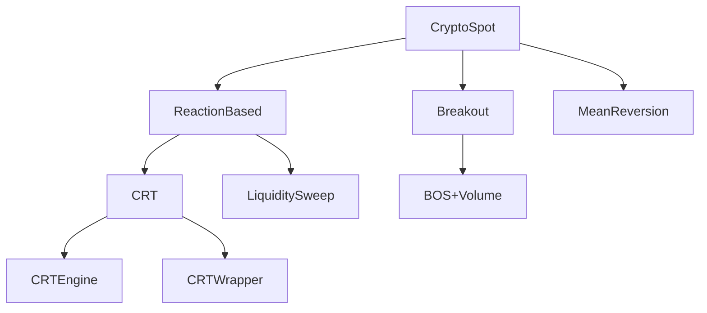

# Implementation Plan 001: Framework Registry (JSONL-Based Architecture Map)

> **Purpose:** Build a queryable, append-only, evidence-linked registry that maps the entire
> codebase against the first-principles trading system hierarchy. Every component is linked
> to its code evidence, parent-child relationships, and research findings.
>
> **Prerequisite:** `docs/architecture/TRADING_SYSTEM_FRAMEWORK.md` (Levels 0-6 hierarchy).
> **Status:** BUILT 2026-06-16 (M0–M5). The realized registry is `data/framework_registry.jsonl`;
> the live gap audit is generated by `scripts/governance/framework_gap_audit.py`.
> **Date:** 2026-06-15
>
> ⚠️ **Post-build reconciliation (CLAUDE.md §6.2):** the illustrative gap tables below (lines
> 314/321/335) and `src/inout/executor.py` (163) are **superseded by code-verified truth**: the
> generated gap audit RETRACTS the "UltronRiskGate disabled" row (it is `extant`+wired), and
> `src/inout/executor.py` does not exist (live surface = `src/engines/live_engine.py`, `EXEC-002`).
> The inline tables are kept as the original design sketch; the registry + generated audit win.

---

## Milestone M0: Registry Schema + Module

### Deliverable 1: JSONL Schema Definition

File: `docs/reference/framework_registry_schema.md`

One JSONL file at `data/framework_registry.jsonl`. Each line has exactly this schema:

```json
{
  "id": "DOMAIN-001",
  "type": "domain",
  "level": 1,
  "name": "CryptoSpot",
  "parent": null,
  "children": ["STYLE-001", "STYLE-002"],
  "evidence": [
    {
      "path": "scripts/data/fetch_crypto_ccxt.py",
      "line": 31,
      "symbol": "_INSTRUMENTS",
      "type": "code"
    },
    {
      "path": "configs/production/v2_multi_2026_04 - deepdeektry.json",
      "line": 24,
      "symbol": "session_calendar.crypto_quote_suffixes",
      "type": "config"
    }
  ],
  "findings": ["F-019", "F-020"],
  "tests": ["tests/test_dataset_integrity.py"],
  "status": "implicit",
  "created": "2026-06-15T02:37:00Z",
  "last_validated": "2026-06-15T02:37:00Z",
  "notes": "No Domain class exists — domain is implicit in config + data scripts"
}
```

**Type enum:** `kernel | domain | style | strategy | implementation | intent | risk | execution | component`

**Level enum:** `0 | 1 | 2 | 3 | 4 | 5 | 6` (matching TRADING_SYSTEM_FRAMEWORK.md)

**Status enum:** `extant | implicit | orphaned | killed | dormant | planned | stub`

**Evidence type enum:** `code | config | doc | test | finding`

### Deliverable 2: Python Registry Module

File: `src/governance/framework_registry.py`

```python
"""
FrameworkRegistry — queryable, append-only registry of the trading system architecture.

Every component (domain, style, strategy, implementation, kernel, risk, execution) is
a JSONL line linked to its code evidence, parent/children, and research findings.

Usage:
    registry = FrameworkRegistry()
    registry.load("data/framework_registry.jsonl")
    
    # Query by type
    styles = registry.filter(type="style")
    
    # Get full tree for a domain
    tree = registry.get_tree("DOMAIN-001")
    
    # Find components touched by a finding
    affected = registry.find_by_finding("F-021")
    
    # Validate all evidence paths exist
    errors = registry.validate_evidence()
    
    # Get orphaned components (no parent, no children)
    orphans = registry.get_orphaned()
    
    # Append a new line
    registry.append(new_record)
```

**Public API:**

| Method | Purpose | Returns |
|--------|---------|---------|
| `load(path)` | Load JSONL, keep latest per id | int (count) |
| `filter(type=None, level=None, status=None, parent=None)` | Query registry | list[dict] |
| `get(id)` | Get component by id | dict |
| `get_tree(root_id)` | Recursively build parent→children tree | dict (nested) |
| `find_by_finding(finding_id)` | All components linked to a finding | list[dict] |
| `get_orphaned()` | Components with no parent reference | list[dict] |
| `validate_evidence()` | Check every evidence path+line exists | list[ValidationError] |
| `validate_findings()` | Check every finding id exists in current-findings.md | list[ValidationError] |
| `append(record)` | Append one line, raises on schema violation | None |
| `to_dataframe()` | Export as pandas DataFrame for analysis | DataFrame |
| `summary()` | Counts per type, level, status | dict |

### Deliverable 3: Validation Tests

File: `tests/test_framework_registry.py`

| Test | Purpose |
|------|---------|
| `test_registry_loads_valid_jsonl` | All lines parse, no schema violations |
| `test_every_evidence_path_exists` | Every `evidence[].path` is a real file |
| `test_every_finding_exists` | Every `findings[]` id is in docs/current-findings.md |
| `test_no_dangling_parent` | Every `parent` id exists in the registry |
| `test_no_dangling_child` | Every `children[]` id exists in the registry |
| `test_level_matches_type` | `type=domain` implies `level=1`, etc. |
| `test_unique_ids` | No duplicate `id` across lines |
| `test_append_only_immutable` | Appending does not mutate existing lines |

---

## Milestone M1: Seed the Registry from Codebase

### Step 1: Classify existing code into the hierarchy

Manual classification pass (one-time, done by agent + user review):

| Existing Code | Hierarchy Level | Status |
|--------------|----------------|--------|
| `src/core/engine_runner.py` | Kernel (Level 0) | Extant |
| `src/core/fusion_engine.py` | Kernel (Level 0) | Extant |
| `src/core/decision_engine.py` | Kernel (Level 0) | Extant |
| `src/features/feature_pipeline.py` | Kernel (Level 0) | Extant |
| `src/runtime/backtest_v2.py` | Kernel (Level 0) | Extant |
| `src/core/collector.py` | Kernel (Level 0) | Extant |
| `` — implicit via data scripts | Domain: CryptoSpot (Level 1) | Implicit |
| `scripts/data/fetch_forex_yfinance.py` | Domain: Forex (Level 1) — dormant | Implicit |
| `scripts/data/fetch_crypto_ccxt.py` | Domain: CryptoSpot (Level 1) | Implicit |
| `scripts/data/fetch_candles_hummingbot.py` | Domain: CryptoSpot (Level 1) — alternate source | Implicit |
| `configs/production/*.json session_calendar` | Domain config (Level 1) | Extant |
| `src/strategies/s01_crt_wrapper.py` | Style: ReactionBased (Level 2) → Strategy: CRT (Level 3) | Extant |
| `src/strategies/s02_mean_reversion.py` | Style: MeanReversion (Level 2) → Strategy: RSI+BB (Level 3) | Extant |
| `src/strategies/s03_breakout.py` | Style: Breakout (Level 2) → Strategy: BOS+Volume (Level 3) | Extant |
| `src/strategies/s04_stat_arb.py` | Style: StatArb (Level 2) → Strategy: Z-Score (Level 3) | Extant |
| `src/strategies/s05_grid.py` | Style: Grid (Level 2) → Strategy: ATR Grid (Level 3) | Extant |
| `src/strategies/s06_scalping.py` | Style: Momentum (Level 2) → Strategy: MACD (Level 3) | Extant |
| `src/strategies/s07_news_sentiment.py` | Style: ReactionBased (Level 2) | Extant |
| `src/strategies/s08_ml_ensemble.py` | Style: ML/Hybrid (Level 2) | Extant |
| `src/strategies/s09_pattern_recog.py` | Style: Pattern (Level 2) → Strategy: Candlestick (Level 3) | Extant |
| `src/strategies/s10_trap_strategy.py` | Style: ReactionBased (Level 2) → Strategy: LiquiditySweep (Level 3) | Extant |
| `src/engines/crt_engine.py` | Implementation (Level 4) of CRT strategy | Extant |
| `src/engines/heuristic_gaussian_engine.py` | Implementation (Level 4) — fused at kernel | Extant |
| `src/engines/ml_gaussian_engine.py` | Implementation (Level 4) — fused at kernel | Extant |
| `src/engines/zone_gate_engine.py` | Implementation (Level 4) — fused at kernel | Extant |
| `src/engines/rr_engine.py` | Implementation (Level 4) — fused at kernel | Extant |
| `src/config_layer/execution_planner.py` | Execution (Level 6) | Extant |
| `src/core/ultron_risk_gate.py` | Risk (Level 5) | Extant |
| `src/inout/executor.py` | Execution (Level 6) | Stub |
| `src/agent/` | AI Layer (Level 4) | Extant |
| `src/bitnet/bitnet_inference.py` | AI Layer (Level 4) — advisory | Extant |
| `src/governance/promotion_manager.py` | Governance — meta, not in hierarchy | Extant |

### Step 2: Generate seed JSONL

Script: `scripts/governance/seed_framework_registry.py`

Reads the classification table (above) and writes initial JSONL lines. Each line includes:
- Extracted evidence paths (file:line for key classes/functions)
- Parent/children based on hierarchy
- Status based on whether the module exists and is wired

### Step 3: Manual cleanup pass

User reviews the generated registry, corrects:
- Missing evidence references
- Wrong parent/child assignments
- Wrong status classifications
- Adds any components the automated pass missed

---

## Milestone M2: Registry Query + Visualization

### Deliverable 1: CLI Query Tool

Script: `scripts/governance/query_registry.py`

```
Usage:
    python scripts/governance/query_registry.py --summary
        # Counts per type, level, status

    python scripts/governance/query_registry.py --type strategy
        # All strategy records

    python scripts/governance/query_registry.py --tree DOMAIN-001
        # Full tree for CryptoSpot domain

    python scripts/governance/query_registry.py --finding F-021
        # All components touched by finding F-021

    python scripts/governance/query_registry.py --orphaned
        # Components with no parent or no children

    python scripts/governance/query_registry.py --missing-evidence
        # Components with missing file references

    python scripts/governance/query_registry.py --validate
        # Full validation run
```

### Deliverable 2: Registry Report

Script: `scripts/governance/framework_registry_report.py`

Generates `reports/framework_registry_report.md` with:

1. **Summary table** — count per level per status
2. **Gap analysis** — which framework levels are empty or implicit
3. **Orphan report** — components not connected to the tree
4. **Finding coverage** — which findings are linked to components, which findings have no linked components
5. **Evidence health** — count of valid vs broken evidence paths
6. **Hierarchy visualization** — ASCII tree of the full registry

### Deliverable 3: Visual Representation (Optional)

Script generates a Mermaid diagram or DOT graph:



---

## Milestone M3: Framework vs Codebase Gap Audit

### Deliverable 1: Gap Audit Report

Script: `scripts/governance/framework_gap_audit.py`

Compares the registry against the ideal framework document and produces:

```md
# Framework Gap Audit Report

## Level 0: Universal Kernel
| Component | Status | Code Evidence | Gap |
|-----------|--------|---------------|-----|
| MarketDataIngestion | **IMPLICIT** | scripts/data/ | No canonical Candle class |
| FeaturePipeline | EXTANT | src/features/ | ✓ |
| BacktestRunner | EXTANT | src/runtime/ | ✓ |
| TradeObject | EXTANT | src/core/collector.py | Missing domain_tag |
| EvaluationMetrics | EXTANT | src/runtime/backtest_v2.py | No bootstrap CI |
| Logging | EXTANT | src/utils/ | Missing full chain audit |

## Level 1: Domain Layer
| Domain | Status | Code Evidence | Gap |
|--------|--------|---------------|-----|
| CryptoSpot | IMPLICIT | No Domain class | Missing TradingCalendar, CostModel etc. |
| CryptoFutures | ABSENT | No evidence | Not supported |
| Forex | DORMANT | fetch_forex_yfinance.py | Data pipeline only, no domain config |
| Equities | ABSENT | No evidence | Not supported |
| Futures | ABSENT | No evidence | Not supported |
| Options | ABSENT | No evidence | Not supported |

## Level 2: Style Layer
| Style | Status | Gap |
|-------|--------|-----|
| ReactionBased | EXTANT (3 strategies) | No style class, not separated from kernel |
| MeanReversion | EXTANT (1 strategy) | No style class |
| Breakout | EXTANT (1 strategy) | No style class |
| StatArb | EXTANT (1 strategy) | No style class |
| Grid | EXTANT (1 strategy) | No style class |
| Momentum | EXTANT (1 strategy) | No style class |
| Pattern | EXTANT (1 strategy) | No style class |
| TrendFollowing | ABSENT | No strategy implements this |

## Level 3: Strategy Layer
| Strategy | Style | Status | Gap |
|----------|-------|--------|-----|
| CRT | ReactionBased | EXTANT | Wired as mandatory engine, not strategy |
| RSI+BB | MeanReversion | EXTANT | ✓ |
| BOS+Volume | Breakout | EXTANT | ✓ |
| Z-Score | StatArb | EXTANT | ✓ |
| ATR Grid | Grid | EXTANT | ✓ |
| MACD | Momentum | EXTANT | ✓ |
| Candlestick | Pattern | EXTANT | ✓ |
| LiquiditySweep | ReactionBased | EXTANT | ✓ |

## Level 4: AI Layer
| Module | Status | Gap |
|--------|--------|-----|
| RegimeClassifier | STUB | src/cognitive/ exists but dormant (F-012) |
| DriftDetector | EXTANT | src/features/feature_monitor.py, but not acted on (F-008) |
| ExecutionModel | ABSENT | Not implemented |
| LLM Advisory | EXTANT | src/engines/llm_engine.py, fallback = neutral 1.0 |

## Level 5: Risk Layer
| Module | Status | Gap |
|--------|--------|-----|
| PreTradeRisk | EXTANT | UltronRiskGate — but gated_enabled=false in config |
| InTradeRisk | EXTANT | ExecutionPlanner handles breakeven, trailing |
| PortfolioRisk | STUB | src/portfolio/ exists but orphaned (F-013) |

## Level 6: Execution Layer
| Module | Status | Gap |
|--------|--------|-----|
| OrderDispatch | STUB | src/inout/executor.py exists but live path not verified |
| SlippageModel | ABSENT | No slippage model — uses fixed 12bps |
| VenueRouting | ABSENT | Single exchange only |
| FillSimulation | ABSENT | Not in backtest |
```

### Deliverable 2: Priority Action List

From the gap audit, derive a ranked list:

| Priority | Gap | Effort | Impact |
|----------|-----|--------|--------|
| P0 | CRT/RR/Gaussian/Zone are mandatory engines — should be strategy plugins | High | Architecture inversion (F-021) |
| P0 | No Domain class — calendar/cost/leverage implicit | Medium | Blocks multi-domain expansion |
| P1 | UltronRiskGate disabled in active config | Low | Risk bypass in production |
| P1 | Style layer doesn't exist — strategies are flat | Medium | Blocks style-constrained strategy selection |
| P2 | Missing execution quality model | Medium | Live PnL unverified (F-010) |
| P2 | Slippage model is fixed 12bps | Low | May mask edge |
| P3 | Trend Following style absent | Low | Not relevant if crypto is the only domain |
| P3 | No bootstrap CI on expectancy | Low | Confidence intervals missing |
| P4 | Portfolio risk module orphaned | Low | Not wired into spine |

---

## Milestone M4: Continuous Validation

### Deliverable 1: CI Gate

The registry validation becomes a CI gate:
```
python scripts/governance/query_registry.py --validate
```
Runs on every PR. Validates:
- All evidence paths exist
- All finding ids exist
- No dangling parent/children
- No duplicate ids

### Deliverable 2: Registry Update Policy

When a component is added/changed/removed:
1. Developer runs `scripts/governance/update_registry.py --component <id> --status <new_status>`
2. Script appends a new JSONL line with updated fields + new timestamp
3. Script validates the update locally
4. CI re-validates on push

### Deliverable 3: Living Report

`reports/framework_registry_report.md` is auto-generated on every change. Always reflects current state.

---

## Timeline & Effort Estimate

| Milestone | Tasks | Effort | Dependencies |
|-----------|-------|--------|-------------|
| M0: Schema + Module | 3 deliverable files | 4-6 hours | TRADING_SYSTEM_FRAMEWORK.md |
| M1: Seed Registry | Classification + script + cleanup | 3-5 hours | M0 |
| M2: Query + Viz | 2 CLI scripts + report generator | 4-6 hours | M1 |
| M3: Gap Audit | Gap audit script + report | 3-4 hours | M0 + M1 |
| M4: CI + Policy | CI config + update script | 2-3 hours | M2 + M3 |

**Total:** 16-24 hours of implementation time (agent + user review cycles).

---

## File Inventory

```
NEW: docs/reference/framework_registry_schema.md
NEW: src/governance/framework_registry.py
NEW: tests/test_framework_registry.py
NEW: scripts/governance/seed_framework_registry.py
NEW: scripts/governance/query_registry.py
NEW: scripts/governance/framework_registry_report.py
NEW: scripts/governance/framework_gap_audit.py
NEW: scripts/governance/update_registry.py
NEW: data/framework_registry.jsonl          (generated by seed script)
NEW: reports/framework_registry_report.md   (generated by report script)
NEW: reports/framework_gap_audit.md         (generated by gap audit script)
MOD: docs/architecture/TRADING_SYSTEM_FRAMEWORK.md  (add JSONL schema section)
```

---

## Open Questions

1. **Which domain first?** The registry supports multiple domains immediately. But should the initial seed cover CryptoSpot only, or also Forex (dormant data pipeline) and CryptoFutures (planned)?
2. **Merge with existing intent graph?** `docs/intent_graph.md` and `docs/intent_to_code_map.md` already map intent→code. Should the registry replace or complement these?
3. **Auto-generation vs manual curation?** The initial seed is manual (human classification). Should we build a script that AST-parses `src/` to auto-detect classes and update evidence paths?