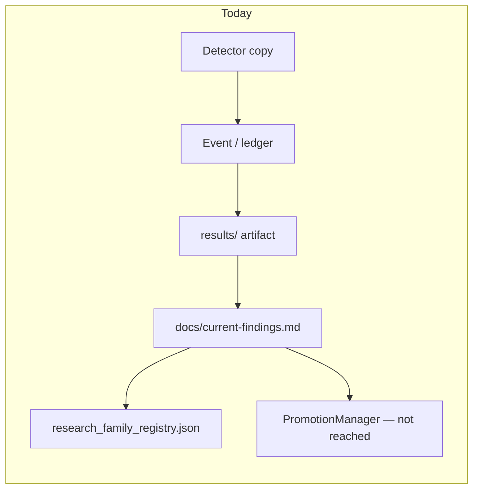
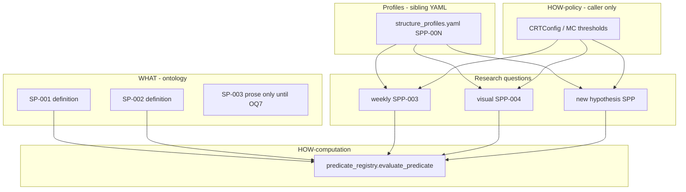
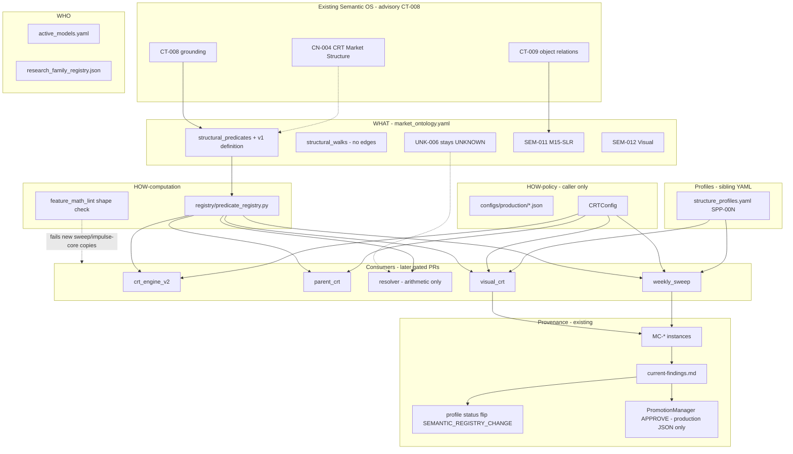

# Fit Structural/CRT Research into the Existing Architecture

| Field | Value |
|---|---|
| **Title** | Centralize structural *meaning* and one governed mechanism — do not invent a Structural OS |
| **Author** | Grok (design only) |
| **Date** | 2026-08-18 |
| **Status** | **Accepted** (user locks 2026-08-18; OQ1–OQ7 decided) |
| **Lane** | **semantic certification** (GROK.md §11). Not CRT recert. Not G001. Not economic qualification. |
| **Authority** | **NONE.** No G001. CRT stays OPEN/REOPENED. `parent_crt` / `objective_gate` unchanged. `ACTIVE_VERSION` stays `v2_htfcrt_2026_08`. Do not re-enable `rr_fusion`. |
| **ACTIVE_VERSION (observed, not edited)** | `v2_htfcrt_2026_08` (`configs/production/ACTIVE_VERSION:1`) |
| **Self-test every change must pass** | *Am I centralizing code, or am I centralizing meaning?* Desired: **CENTRALIZE MEANING + CENTRALIZE GOVERNED MECHANISM + PARAMETERIZE FOUNDING + ALLOW MANY RESEARCH QUESTIONS + PRESERVE COMPLETE PROVENANCE.** Forbidden fallback: move six functions into one Python file and declare the problem solved. |

---

## Overview

The repository already has one CRT *vocabulary* (`CRTState` + `VALID_TRANSITIONS`) and six independent *copies* of the same sweep arithmetic. SK-0 registered that arithmetic as ontology nodes (`SP-001`/`SP-002`/`SP-003`, `SP-010`/`SP-011`) and gated the second transition graph. That is declaration only: `formula` fields are prose strings, `impl` is unbound, `traceability` still names `src/structure/predicates.py` and `src/structure/walk.py` **which do not exist**, and nothing stops a seventh copy of `high > ref and close < ref`.

This design does **not** invent a Structural OS, does **not** start by building `src/structure/`, and does **not** treat F-046's "one Python function" as sufficient. It fits structural research into the existing stack:

- **Meaning** stays in `configs/formulas/market_ontology.yaml` (WHAT) under the already-declared `structural_predicates` / `structural_walks` sections.
- **A constrained definition** is added as an *additive* field on those existing nodes (frozen runtime keys stay flat).
- **One registered evaluator** lives in the existing `src/features/registry/` package (sibling of `derived_registry.py`). Never `eval`. Never a second OS.
- **Founding** (what counts as liquidity) stays data/pluggable via profiles in the existing `configs/formulas/` tree.
- **Research** consumes the canonical predicate result; a new hypothesis is a new profile, not a new detector.
- **Provenance** attaches to existing findings + `MC-*` + `research_family_registry.json`.
- **Two promotion surfaces, not one:** a profile `status` flip is an ontology/profile YAML edit under `SEMANTIC_REGISTRY_CHANGE`. Production HOW-policy still goes through `ValidationReport.decision == "APPROVE"` + `PromotionManager` (production JSON only). Never "copy research code into production." `PromotionManager` never writes `configs/formulas/`.

**Governing invariant (acceptance test for every PR in this program):**

> The repository must have one governed structural meaning and one governed execution mechanism; configuration/ontology declares WHAT, WHO and WHY, the implementation provides HOW, research consumes the canonical result, and every research discovery remains traceable through evidence → finding → promotion without creating a competing implementation.

---

## Background & Motivation

### Why this change is needed

When F-074 landed (2026-08-13), the directional-impulse contract had to be hand-propagated to three files. Each copy's docstring asserts it "mirrors" `RangeDetector.detect_sweep` / `try_sweep_to_displacement` — and nothing checks that it still does. That is the failure mode: a geometry fix is a manual broadcast, and drift is silent.

The old research-isolation policy (`weekly_sweep` / `visual_crt` module docs: *"reimplement the small shared arithmetic locally; never import the live spine"*) conflated two independences:

| Independence | Value | Verdict |
|---|---|---|
| **Founding** — *what do we call liquidity?* (M15-SLR, ParentRange C1 H/L, WeeklyRange Mon–Tue, Visual pool PDH/PDL/prior H4) | This is what made F-042 and F-081 legitimate NEW ontologies (F-028's only reopen condition). | **Preserve permanently** |
| **Arithmetic** — *how do we test "swept"?* | Bought nothing. Costs correctness: 6 copies, 1 broadcast per fix, 0 mechanical checks. | **Eliminate as a legal production/research path** |

### Current state (source-verified 2026-08-18)

- `src/structure/` **does not exist**. The SK plan (`docs/implementation_plan/we-have-states-defined-whimsical-penguin.md`) proposed it as L0–L3 authority. This design **rejects that as the first move**.
- SK-0 **is on disk as declaration**: `spec_schema.semantic_registry.sections` lists `structural_predicates` and `structural_walks` (`market_ontology.yaml:181-192`); nodes `SP-001`/`SP-002`/`SP-003` (`:3583-3673`) and `SP-010`/`SP-011` (`:3691-3751`); `UNK-006` (`:3385-3425`); `_ONTOLOGY_ID_RE` already matches `SP-` (`semantic_grounding.py:95-98`); `tests/test_crt_states_yaml_transition_parity.py` already pins the SHADOW_PENDING collapse.
- Semantic nodes are **not** in `_ITERATED_SECTIONS` (`src/features/registry/__init__.py:39-40`) and are **not** bound through `FORMULA_REGISTRY`.
- There is **no expression/AST DSL evaluator** in the repository today. Formula strings are "NEVER `eval`'d" (`market_ontology.yaml:14`; `formula_registry.py:11`).

### Pain points

1. Six sweep sites, three impulse sites, two retest sites — founding differs, arithmetic is copy-paste.
2. Impulse copies are **not identical** (see Map B). Unifying them blindly would change parent-CRT or visual-CRT behavior.
3. Two transition graphs: executable `VALID_TRANSITIONS` vs resolver YAML. The difference is now *gated* as a declared allowance, but not *named as a projection relationship* in the ontology.
4. Research events carry no `profile_id`. Findings `Contract:` cannot resolve `MC-*` instance ids (`P-GOV-MC-01`).
5. SK-0 `traceability` fields already claim a future `src/structure/` that does not exist — a forward-looking citation that will become DOC_DRIFT if Alternative A is rejected.

---

## Goals & Non-Goals

### Goals

1. One governed **meaning** for SP-001/002 as inspectable v1 data (boolean core + closed emit). SP-003 *meaning* stays the existing prose node; its `definition` is **deferred** (OQ7 locked AMBIGUOUS). Do not encode `abs` / subtraction in v1.
2. One governed **mechanism** that interprets that data (constrained generic tree-walk in the existing registry package).
3. Founding remains pluggable via profiles (data), so F-042 / F-081-class hypotheses stay legal.
4. Research consumes the canonical predicate result; independent arithmetic copies are marked **NON-CANONICAL** in notes/`status` (not a new FM `lifecycle` token).
5. Transition authority is declared, not silently reconciled: `VALID_TRANSITIONS` = executable contract; `market_crt_states.yaml` = resolver projection; SHADOW_PENDING collapse stays an explicit allowance.
6. `feature_math_lint` fails on a *new* sweep-shape copy (`high > ref and close < ref`). PR-4 also pins the F-074 **core** shape (body-sign AND clear-the-level). Retest-band copies stay an **explicit residual** until OQ7 (not claimed as covered by Goal 6).
7. Provenance attaches (`semantic_id` / profile / definition version) using existing findings + `MC-*` + research family — no second registry.
8. Successful research is a finding + sealed `MC-*`, then either a profile `status` flip (`SEMANTIC_REGISTRY_CHANGE`) or a production-config `APPROVE` — never copy-paste research into the engine, never `PromotionManager` writing formula YAML.
9. First PRs do not change `ACTIVE_VERSION` or production trade behavior.

### Non-Goals

- Invent a Structural OS, a second Semantic OS, a new intent registry, or a meta-agent.
- Create `src/structure/` as a *semantic authority* (if a thin HOW module is ever needed, it is a registry impl, not PR-1).
- Close CRT. Recertify the 12-state machine. Re-close CT-009.
- Re-enable `rr_fusion`. Touch `ACTIVE_VERSION`. Change `parent_crt` / `objective_gate` policy.
- Unify `candle_state/encoder.py` (`BULL_STRONG`/`COMPRESSION`/…) or `market_state_cluster_engine.py` (`TREND_EXPANSION`/…) — different vocabularies, not CRT.
- Migrate `msip_1_verification_package/` (frozen snapshot).
- Silently close UNK-006 / F-069 (resolver EXPANSION construction). `different ≠ wrong` (§6.8).
- Silently unify SP-003's two *reference anchors* (engine `rng.size` vs visual `impulse`-for-`rng.size` substitution — F-081 Arm B caveat).
- **Unify or route the FM-058 feature family through SP-001** (added 2026-08-19, RC-8 — this
  document did not mention it: zero hits for `FM-058`, `liquidity_sweep`, `pipeline_swing`,
  `causal_structure`, `feature_pipeline`). `liquidity_sweep` (FM-058) / `sweep_detected`
  (FM-059) / `double_sweep` (FM-060) are a **different market object** that shares the English
  word "sweep": they reference a swing pivot (`last_swing_high_price.shift(1)`) with an
  **inclusive** boundary (`close <= ref`) and emit int8 into the 48-dim vector, where SP-001
  references a founding range with a **strict** boundary and emits a `SweepEvent`. The
  repository already exposes the two as selectable alternatives —
  `market_crt_states.yaml` `thresholds.sweep_geometry` ∈ {`htf_range`, `pipeline_swing`}.
  Routing one through the other would silently redefine a registered feature and move the
  feature vector. Enforced by `tests/test_fm058_boundary_is_not_sp001.py`.
- Grant G001 / production / promotion authority (§6.5). Evidence ≠ finding ≠ production.
- Walks becoming a third transition graph (SP-010/011 already say they declare no edges).

---

## Map A — Current Authority Map

### A.1 Existing WHO / HOW / WHAT (repo header — do not overwrite)

Source: `configs/formulas/market_ontology.yaml:3-16`.

```
active_models.yaml           = WHO   (which model uses which feature, and why)
configs/production/*.json    = HOW   (runtime policy: thresholds, weights, switches)
configs/formulas/*.yaml      = WHAT  (mathematical meaning)
```

Plus the computation split on the same page (`:10-16`):

```
Ontology (WHAT, descriptive)
  → Formula Registry (authoritative dispatch)
    → Implementations (named scalar callables — NEVER eval'd)
      → Consumers (read the registry)
CONFIG-DECLARED, CODE-EXECUTED
```

`HOW` is already overloaded in-repo:

| Repo use of HOW | Home | Example |
|---|---|---|
| **HOW-policy** | `configs/production/*.json` | `body_ratio_min`, `retest_atr_depth_fraction`, `parent_crt.enabled` |
| **HOW-computation** | `src/features/registry/` named callable | `candle_math.body_ratio` via `FORMULA_REGISTRY` |

`WHO` in the header is *model consumption* (`active_models.yaml`), not "who authored a research program." Why-it-exists already lives in ontology `semantics.why_it_exists` (`spec_schema.additive_spec_blocks`, `:98-101`) and, for Semantic OS, in Concept `why` (`concepts.yaml` CN-004).

### A.2 User vocabulary mapped onto the existing split

**Do not create a second naming scheme that fights the ontology header.** User terms are *roles*; repo terms stay the printed names.

| User term | Role in this design | Repo home (existing name) | Not |
|---|---|---|---|
| **WHAT** | The structural predicate / walk *meaning* | Ontology WHAT: `structural_predicates` / `structural_walks` + additive `definition` field | A new YAML vocabulary named WHAT |
| **WHO** | Which consumer or program uses this meaning, and why | WHO = `active_models.yaml` for models; `lineage.consumed_by` / node `owner` / profile `program_id` / `research_family_registry.json` family for research | A new "WHO registry" |
| **WHY** | Why the meaning exists (decision it serves) | Already: `semantics.why_it_exists`, node `description`, CN-004 `why` | A new why-layer |
| **HOW** | Governed implementation of the meaning | HOW-computation = one registry evaluator + (later, optional) named callable. HOW-policy remains production JSON thresholds. | Overwriting header HOW, or a `src/structure/` package-as-architecture |

Reading the governing invariant through this map:

> configuration/ontology declares WHAT, WHO and WHY → **ontology + active_models + profiles**  
> the implementation provides HOW → **one registry evaluator (HOW-computation) + production thresholds (HOW-policy)**  
> research consumes the canonical result → **call the evaluator; vary founding profile**  
> evidence → finding → (profile `status` flip via `SEMANTIC_REGISTRY_CHANGE`) and/or (production HOW-policy via `PromotionManager` APPROVE)

### A.3 Layer-by-layer current authority

| Layer | Current owner | What it may assert | What it may not |
|---|---|---|---|
| **Semantic definition** | `market_ontology.yaml` non-frozen sections; `validate_semantic_registry` (`registry/__init__.py:281`) | Meaning, ladder status, evidence, UNK-* | Production behavior (constraint 2, `MARKET_ONTOLOGY_EVOLUTION_CONTRACT.md:32-36`) |
| **Configuration (HOW-policy)** | `configs/production/v2_htfcrt_2026_08.json` via `ACTIVE_VERSION`; `CRTConfig` (`state_identity.py:131`) | Thresholds, switches | Meaning of "swept" |
| **Implementation (HOW-computation)** | `FORMULA_REGISTRY` for FM-*; **nothing** for SP-* today | Named callable, never eval | Inventing a quantity not in the ontology |
| **Registry** | `src/features/registry/` + facade `formula_registry.py` | Dispatch `impl` → callable | Semantic authority |
| **Evidence** | Sealed `MC-*` instances under `configs/research/measurement_contracts/instances/`; artifacts under `results/` | Measurement basis + ledger | A finding; production |
| **Finding** | `docs/current-findings.md` + `data/findings.jsonl` | Validated/overturned conclusion | Promotion |
| **Promotion** | `PromotionManager` (`promotion_manager.py:11-16`): only `ValidationReport.decision == "APPROVE"`; `promotion_log.jsonl` | Move approved JSON into production registry | Bypass APPROVE; promote a research module |
| **Provenance** | Findings `Evidence`/`Contract`/`Family`; Semantic OS grounding (CT-008); construction manifests | Trace a claim to an artifact | A second evidence OS |

Semantic OS remains **advisory** (CT-008, `SEMANTIC_OS_CONTRACT.md:150-180`). Prefer fitting SP-* into the ontology + existing CN-004 (`CRT Market Structure`, `concepts.yaml:397-508`). **No new Concept** unless a later PR proves CN-004 cannot ground the predicate nouns — and then only one CN, never a Structural OS.

Construction stays `change_contracts.json` → BUILD_IMPACT_MANIFEST → `construction_protocol.py validate-completion`. **`DOCUMENTATION_ONLY` is illegal for any PR that touches `src/`, `configs/`, or `models/`** (`construction_protocol.py:157-162`). PR-0 must land first and bump `tests/test_construction_protocol.py` `len(c) == 13` → `14` (`:70`). Ontology / evaluator / lint / profile / comment-in-src PRs use `SEMANTIC_REGISTRY_CHANGE`. Parent and engine consumer PRs use `RUNTIME_DECISION_PATH_CHANGE`. No first-PR `DOCUMENTATION_ONLY` fallback.

---

## Map B — Current Duplicate Map

Verified against source. Line numbers are the predicate, not the function header (unless noted).

### B.1 Sweep — `high > ref and close < ref` (symmetric low)

> **CORRECTED 2026-08-19 (RC-8).** This map said **six** sites; a wider census (any variable
> naming, both boundary sides) found **NINE**. The three missed are
> `crt_engine_v2.py:2944` and `:3039` — two telemetry re-derivations *inside the authority's
> own file* — and `scripts/research/crt_range_rebuild_probe.py:70`. Same undercount, same
> cause as the SK plan's first pass: matching only `h_ref`-named references. Consequence for
> this document: the PR-7…PR-11 per-site sequence was missing three sites, **two of them
> inside PR-11's engine scope**. All nine were migrated 2026-08-19 (SK-1); SP-001
> `observed_behaviour` is now version 2 and records the true count.
>
> | Missed site | Why it matters |
> |---|---|
> | `crt_engine_v2.py:2944` `_cross_high`/`_cross_low` | telemetry re-derivation ~2,000 lines from `detect_sweep` — a change at the authority left trace packets describing a different event |
> | `crt_engine_v2.py:3039` | second copy of the same, same file |
> | `crt_range_rebuild_probe.py:70` | outside `src/`, so `feature_math_lint` cannot reach it at all |

Six sites, **arithmetic agrees today**, founding differs. SP-001 `observed_behaviour` (`market_ontology.yaml:3592`) matches.

| # | Site | Founding | Output |
|---|---|---|---|
| 1 | `src/config_layer/crt_engine_v2.py:882` `RangeDetector.detect_sweep` | SEM-011 M15-SLR (`active_range.h_ref/l_ref`) | `SweepEvent` + direction SHORT-on-high |
| 2 | `src/config_layer/parent_crt.py:154` `_detect_parent_sweep` | ParentRange (C1 H/L) | `ParentSweepEvent` |
| 3 | `src/research/weekly_sweep/weekly_range.py:185` `detect_weekly_sweep` | WeeklyRange (Mon–Tue) | `WeeklySweepEvent` |
| 4 | Same file `:160` `_first_sweep_this_week` | Same WeeklyRange, earlier bars | `bool` (one-shot guard) |
| 5 | `src/research/visual_crt/geometry.py:93` `detect_pool_sweep` | Visual pool price (PDH/PDL/prior H4) | `PoolSweepEvent` (deepest pierce) |
| 6 | `src/features/crt_state_resolver.py:1068` `_detect_htf_range_sweep` | Resolver memory `range_h_ref/l_ref` | `+1 / -1 / 0` |

Isolation policy (to SUPERSEDE, not delete): `weekly_range.py:5-8`, `visual_crt/geometry.py:6-8`, `parent_crt.py:27-34`.

### B.2 Impulse — F-074 direction contract — **3 copies, NOT identical**

| Site | What it actually tests |
|---|---|
| `crt_engine_v2.py:1083` `try_sweep_to_displacement` | **Full gates**: direction present, close vs open, close vs `sweep.price`, plus age / `body_ratio_min` / ATR size (`:1088-1148+`) |
| `parent_crt.py:162` `_directional_impulse_confirmed` | **Direction + close vs sweep only** (`:168-171`). No age, no body, no ATR. |
| `visual_crt/geometry.py:162` `detect_directional_displacement` | **6-gate clone** of the engine (age, direction present, body sign, close vs sweep, body_ratio, ATR size) (`:124-183`) |

SP-002 already draws the correct line (`market_ontology.yaml:3632-3635`): the shared contract is `LONG: close > open AND close > sweep_price` (symmetric SHORT). Magnitude gates are **caller parameters**, not the predicate. **TruthConflict if anyone treats the three as interchangeable implementations.** They share a *core*; they do not share a *function*.

### B.3 Retest — 2 sites, **founding-different anchors**

| Site | Reference | Ceiling |
|---|---|---|
| `crt_engine_v2.py:1582` `try_expansion_to_retest` | `active_range` boundary; `static_ceiling = retest_depth_max * rng.size` (`:1609`) | `max(static, atr_ceiling)` |
| `visual_crt/retest.py:49` `detect_pool_retest` | Swept **pool price**; `static_ceiling = retest_depth_max * impulse` where `impulse = \|displacement.close - sweep.sweep_price\|` (`:92-95`) | same `max` form |

SP-003 notes this explicitly (`:3652`, `:3673`). Unifying anchors would move F-081 Arm B evidence. **Leave as founding, not as two predicates.**

### B.4 State calculators (9 sites — do not flatten)

**Production (3)**

| Module | Vocabulary | Authority |
|---|---|---|
| `crt_engine_v2.StateMachine` | 9 execution `CRTState` | Executable M15 machine |
| `parent_crt.ParentCRTTrack` | 3 parent `CRTState` (disjoint sub-graph, `state_identity.py:104-106`) | Armed on `v2_htfcrt_2026_08` (F-075) |
| `htf_state.classify_htf_state` (`htf_state.py:88`) | **HTFState** (REVERSAL/EXPANSION/DISTRIBUTION/ACCUMULATION) — F-078, not CRTState | Second parent dimension, default OFF |

**Second construction (1)**

| Module | Vocabulary | Status |
|---|---|---|
| `crt_state_resolver.py` (~1,545 lines; does **not** import `CRTState`; YAML-driven) | Resolver labels that *look like* CRTState | F-069: 88.16% agreement, EXPANSION recall 10.77%. **UNK-006 stays UNKNOWN.** |

**Research re-implementations (5)**

| Module | Vocabulary | Unify? |
|---|---|---|
| `visual_crt/geometry.py` + `retest.py` | SEM-012 events | Consume SP-* arithmetic; keep VisualPool founding |
| `weekly_sweep/weekly_range.py` | WeeklySweepEvent | Consume SP-001; keep WeeklyRange founding |
| `src/research/candle_state/encoder.py:29-40` | `BULL_STRONG` / `COMPRESSION` / `INSIDE_BAR` / … | **Do not unify** |
| `zone_mapping/displacement_zone_event_study.py:35` | Parses CRT `DISPLACEMENT` *labels* | Consumer of events, not a detector |
| `regime/market_state_cluster_engine.py:14-19` | `TREND_EXPANSION` / `RANGE_TRAP` / … | **Do not unify** |

`msip_1_verification_package/` is a frozen snapshot (contains its own `crt_engine_v2.py`). **Must not be migrated.** It already causes construction-floor noise; bringing it into the kernel would contaminate the living tree.

---

## Map C — Current Research Consumers

| Consumer | Copies arithmetic? | Varies founding? | Notes |
|---|---|---|---|
| `src/research/weekly_sweep/weekly_range.py` | **Yes** (sites 3+4) | Yes — Mon–Tue weekly range | F-042. Isolation docstring `:5-8`. |
| `src/research/visual_crt/geometry.py` | **Yes** (sweep + 6-gate impulse) | Yes — chart-visible pools (SEM-012) | F-081. Isolation `:6-8`. Imports `candle_math` (F-046) but re-derives sweep/impulse. |
| `src/research/visual_crt/retest.py` | **Yes** (band test) | Yes — pool + impulse-for-`rng.size` | Declared modelling substitution (SEM-012 `validation_rules`, F-081 Note). |
| `src/research/adapters/structural_event_source.py` | **No** — parses `{INSTR}_events.jsonl` | No | Consumer of engine events. No `profile_id`. |
| `src/research/zone_mapping/displacement_zone_event_study.py` | **No** — `find_displacement_starts` reads labels | No | Consumer. |
| `src/features/crt_state_resolver.py` | **Yes** (site 6) | Same envelope idea, own memory | Sequencing stays owned by YAML + UNK-006. |
| `src/config_layer/parent_crt.py` | **Yes** (sweep + thin impulse) | Yes — C1 ParentRange | Production-armed. Isolation `:27-34` is the same policy as research. |
| Program 2 / spine adapters | No (engine events) | No | Historical F-019…F-026 corpora. |
| `candle_state/encoder.py` | N/A (different math) | N/A | Out of scope. |
| `market_state_cluster_engine.py` | N/A (cluster stats) | N/A | Out of scope. |

**Pattern:** every *new ontology* (weekly, visual, parent) copied the 3-line sweep test. Every *measurement* of the incumbent spine parsed events. The copies are not "research freedom"; they are an unregistered HOW.

---

## Map D — Current Provenance Path and Holes



| Step | Current | Hole |
|---|---|---|
| Detector identity | Implicit in module path | No `semantic_id` (SP-001…), no predicate version |
| Founding identity | Implicit in type (`WeeklyRange` vs `LiquidityPool`) | No `profile_id` on events (`structural_event_source.StructuralEvent` has stage/entry/direction/atr/completed only, `:28-34`) |
| Measurement basis | `MC-*` JSON under `instances/` (e.g. `MC-VCRT-XAUUSD-M15-V1.json`) | **P-GOV-MC-01**: `tests/test_current_findings.py:265-288` resolves `Contract:` only against `MP-*` in `configs/research/measurement_contracts/*.json` **or** a 64-hex sha256. F-081 worked around this by pinning sha256 `12be71be…`, not `MC-VCRT-…`. Instance ids do not resolve. |
| Family | `research_family_registry.json` (`RF-CRT-STRUCTURE`, `RF-CRT-PARITY`, `RF-WEEKLY-CALENDAR`, …) | Cells are `UNVERIFIED_HISTORICAL` / `Contract:UNKNOWN` on most findings. Not a second registry — keep using it. |
| Grounding | `query_semantic_os.py --ground`; SP-* now GROUNDED as nouns (`semantic_grounding.py:98`) | Grounding ≠ executable meaning. |
| Promotion | `PromotionManager` requires `APPROVE` of a **production config JSON** only (`promotion_manager.py:10-14`) | No path that promotes a *profile*. A profile `status` flip is a later `SEMANTIC_REGISTRY_CHANGE` on the sibling YAML — not a PromotionManager write. |

---

## Proposed Design

### Design principle

```
Am I centralizing code, or am I centralizing meaning?
```

| If we… | Verdict |
|---|---|
| Add `src/structure/predicates.py` and rewrite 6 call sites first | Centralizing **code**. Forbidden as PR-1. That is Alternative A. |
| Add `candle_math.swept_boundary()` and leave `formula:` as a string | Centralizing HOW-computation only. Necessary later, **not sufficient**. Alternative B. |
| Make the definition **data** on existing SP nodes, interpret it with **one** registry evaluator, parameterize founding, lint new copies, attach provenance | Centralizing **meaning** + **one governed mechanism**. Alternative C. **Recommended.** |

### 1. Where the semantic contract belongs NOW

**Already belongs** in `market_ontology.yaml` non-frozen sections:

- `structural_predicates` — SP-001 / SP-002 / SP-003 (`:3583-3673`)
- `structural_walks` — SP-010 / SP-011 (`:3691-3751`)
- `canonical_unknowns` — UNK-006 (`:3385-3425`)
- Distinct from `structural_states` (FM-054… vector slots, `_ITERATED_SECTIONS`)

`validate_semantic_registry` already walks these sections (`registry/__init__.py:317`) because they are listed in `spec_schema.semantic_registry.sections` (`:181-192`). Frozen keys stay flat (`:84-93`). Constraint 1 of §6.6 is already satisfied.

**Still missing for "definition as data":**

| Gap | Today | Needed |
|---|---|---|
| `formula` | Free string, e.g. `"swept_high = high > h_ref and close < h_ref; …"` (`:3595`) | A **closed**, machine-checkable `definition` map (additive sibling; `formula` stays as the human/LLM string) |
| Operator vocabulary | Unconstrained English | Closed set (below) |
| Evaluator | None. NEVER eval — and there is no alternative interpreter | One registered interpreter in `src/features/registry/` |
| `impl` binding | Semantic nodes have no `impl`; not in `FORMULA_REGISTRY` | Optional later: `impl: registry.evaluate_predicate` — **not** a new package |
| Traceability | Points at `src/structure/predicates.py` (`:3612`, `:3642`, `:3720`) | PR-1 rewrites to **artifacts that exist in that PR** (this node's `definition` block, `validate_semantic_registry`, the six census paths). Evaluator / `SPP-*` ids are named only in the PR that creates them |
| Founding | Mentioned in prose (`RangeFounding`, `:3598`) | Sibling profile YAML + dedicated validator (Decision B, §3) |
| Lint | Name-ownership of FM-*; Compare is derivation only when the *target name* is registered (`feature_math_lint.py:377-378`) | Sweep-shape + F-074-core-shape checks. Retest band is a named residual until OQ7 |
| Tests pinning SP nodes | `test_semantic_registry.py` pins SEM-001/002/003/UNK-001 (`:50-64`), **not** SP-* | Pin SP-001/002/003/010/011 + UNK-006 |

### 2. Constrained declarative definition (additive field)

**Home:** additive key `definition:` on existing `structural_predicates` nodes. Not a frozen_runtime_key. Not nested under a key that `fm_resolve` reads. Semantic sections are already unread on the runtime binding path (`market_ontology.yaml:157-159`).

**Not** `eval` of the `formula` string. **Not** Python AST parsed from that string (too open: attribute loads, calls, comprehensions). A **closed JSON/YAML operator tree** the evaluator accepts and everything else rejects.

#### v1 is boolean core only (SP-001 / SP-002 hit clauses)

| Op | Meaning | Allowed operands |
|---|---|---|
| `gt` `lt` `ge` `le` `eq` `ne` | Comparisons | **named inputs only** (keys listed in `definition.inputs`) |
| `and` `or` | N-ary bool | definition nodes |
| `not` | Unary bool | definition node |

`any` / `all` are **not** extra operators — they are sugar for `or` / `and` and must desugar to those two before the walk. The frozenset the walker matches is exactly:

```python
OPERATORS = frozenset({"gt", "lt", "ge", "le", "eq", "ne", "and", "or", "not"})
```

**Forbidden in v1 (and therefore illegal in any `definition` shipped in PR-1):** arithmetic (`+ - * /`), function calls (`abs`, …), attribute access, subscript, conditionals, string/enum literals inside the boolean tree, Python names outside `definition.inputs`.

**Config-key names in `definition.inputs` are a validator error.** Legal input names are OHLC fields, founding fields, and caller-precomputed scalars (`high`, `low`, `open`, `close`, `h_ref`, `l_ref`, `sweep_price`, `direction`). Illegal: `body_ratio_min`, `atr_min_displacement`, any `CRTConfig` field name, any production-JSON key. The evaluator **does not import or read `CRTConfig`**. Magnitude (`body_ratio >= θ`, `atr * k`) stays **outside** SP-001/002: those are HOW-policy parameters applied by the **caller** (already SP-002 `validation_rules`). Putting them in the tree would silently unify parent (core-only, `parent_crt.py:168-171`) with visual (6 gates).

#### `emit` is a separate closed schema, not v1 operators

The boolean tree only answers `hit`. Direction / `sweep_price` are **not** encoded by inventing Python per id. They use `predicate_emit/v1`:

| Emit op | Meaning | Closed tokens |
|---|---|---|
| `hit` | boolean, must be a v1 tree over clause names | same `OPERATORS` |
| `select_enum` | map winning clause → enum token | tokens from a pinned set (`LONG`, `SHORT` only in v1) |
| `select_input` | map winning clause → a name in `definition.inputs` | input names only |

No free strings. No per-id Python extract. An unknown emit op is `PredicateDefinitionError`.

#### SP-003 `definition` is **not** in v1

SP-003's prose (`min_depth <= abs(close - reference) <= max_depth AND not closed_back_through`) needs `abs` and subtraction. Open Question 7 leaves signed-vs-`abs` **AMBIGUOUS**. Encoding `abs` now would force one convention and contradict that fork.

**Defer** the SP-003 `definition` block until OQ7 is measured. The node stays as today's prose (`market_ontology.yaml:3646-3673`). `spec_schema.semantic_registry.definition_deferred` lists `SP-003` with reason `OQ7`. `validate_predicate_definitions` **must not** require a `definition` on deferred ids. A later v1.1 may add a tiny closed arithmetic set (`sub`, `abs`, chained `le`) — that is a new schema version, not a silent v1 grow.

#### Example (SP-001) — additive, existing keys untouched

```yaml
# configs/formulas/market_ontology.yaml  — structural_predicates.swept_boundary
# existing keys (id, formula, …) unchanged
definition:                    # NEW additive block — unread by fm_resolve
  schema: predicate_definition/v1
  inputs: [high, low, close, h_ref, l_ref]
  clauses:
    swept_high:
      op: and
      args:
        - {op: gt, left: high,  right: h_ref}
        - {op: lt, left: close, right: h_ref}
    swept_low:
      op: and
      args:
        - {op: lt, left: low,   right: l_ref}
        - {op: gt, left: close, right: l_ref}
  emit:
    schema: predicate_emit/v1
    hit:
      op: or
      args: [swept_high, swept_low]
    select_enum:
      direction:
        swept_high: SHORT
        swept_low: LONG
    select_input:
      sweep_price:
        swept_high: high
        swept_low: low
```

SP-002 similarly: `inputs: [open, close, sweep_price, direction]`; clauses `long_impulse` / `short_impulse` exactly as `market_ontology.yaml:3625` (boolean core only). Emit may `select_enum` nothing extra — the caller already holds `direction` from SP-001.

#### Evaluator — generic tree-walk, existing registry package, never a second OS

New internal module: `src/features/registry/predicate_registry.py` (sibling of `derived_registry.py`).

The walker is **generic**: `match node["op"]` over `OPERATORS`. Adding a new SP node that only has YAML (no Python `if semantic_id == "SP-00N"` branch) must evaluate. **Required test:** a fixture node `SP-099` (or a throwaway in the test ontology copy) with only YAML clauses evaluates to the expected `hit`; deleting a hidden per-id branch is not possible because none exists.

```python
# src/features/registry/predicate_registry.py  (HOW-computation)

OPERATORS = frozenset({"gt", "lt", "ge", "le", "eq", "ne", "and", "or", "not"})
EMIT_OPS = frozenset({"hit", "select_enum", "select_input"})
ENUM_TOKENS_V1 = frozenset({"LONG", "SHORT"})
ILLEGAL_INPUT_NAMES = frozenset({  # CRTConfig / production-JSON keys — validator error
    "body_ratio_min", "atr_min_displacement", "atr_multiplier_min",
    "max_sweep_age_candles", "retest_depth_max", "retest_atr_depth_fraction",
    "retest_min_depth_atr_fraction",
})

def evaluate_predicate(semantic_id: str, inputs: dict, *, ontology: dict | None = None) -> dict:
    """Generic tree-walk of definition.clauses + definition.emit. NEVER eval.
    NEVER reads CRTConfig. Returns {"hit": bool, "emit": dict}.
    Unknown operator / unknown input / deferred id → PredicateDefinitionError.
    """

def validate_predicate_definitions(ontology: dict | None = None) -> list[str]:
    """Require a v1 definition on every structural_predicates node EXCEPT
    ids listed in spec_schema.semantic_registry.definition_deferred.
    Reject config-key names in definition.inputs. Reject unknown emit ops.
    """
```

**Import rule (load-bearing):** `src/features/registry/__init__.py` must **not** have a module-level `from .predicate_registry import …`. `crt_engine_v2.py:33` → `fm_resolve.py:71` → `from features.registry import FORMULA_REGISTRY`, so an eager import puts the new module on the live engine import path. Wire `validate_predicate_definitions` by a **lazy import inside** `validate_semantic_registry()` only. Re-export `evaluate_predicate` **only** from the facade `formula_registry.py` (or a lazy `__getattr__` on the package). **Required test:** `import config_layer.crt_engine_v2` does not load `features.registry.predicate_registry` (`sys.modules` assertion).

`FORMULA_REGISTRY` stays FM-impl dispatch. **Do not** stuff boolean predicates into `DERIVED` (`derived_registry.py:18` is the first mapping entry `derived_math.disp_strength`, a named callable — not a type declaration). A `PREDICATE_REGISTRY` dict is unnecessary if the walker is generic over YAML; do not add a per-id Python table that would re-create Alternative B.

**Parity (no production rewire in first PRs):** a read-only probe compares evaluator `hit` to each of the six sweep sites on a **synthetic fixture** (not a live corpus rewrite). Divergence is a **TruthConflict**, not a silent fix.

### 3. Founding stays data / pluggable — no package-as-architecture

Founding answers *what is the box?* — already four first-class objects:

| Founding | Identity | Home today |
|---|---|---|
| M15-SLR | SEM-011 | `src/config_layer/m15_structural_range.py` |
| ParentRange | C1 H/L | `parent_crt.py` `ParentRange` |
| WeeklyRange | Mon–Tue | `weekly_range.py:29` |
| Visual pool | SEM-012 | `visual_crt/pools.py` |

**Do not wrap these in `src/structure/founding.py`.** They already exist. What is missing is a **profile** that names: which founding + which walk + which predicate versions + which HOW-policy threshold *references* + `status` + owner.

#### Decision B (closed — not left as a fork)

Profiles are **not** a `spec_schema.semantic_registry.sections` entry. Putting them there would force all 25 `semantic_node_required_fields` (`market_ontology.yaml:231-256`) onto a five-field seed table, and `SP-PROF-…` would not match `_ONTOLOGY_ID_RE = r"^(FM|SEM|UNK|RC|IND|SP)-\d+$"` (`semantic_grounding.py:98`). Mixing FM `_VALID_LIFECYCLE` (`registry/__init__.py:28-30`) onto semantic/`status` nodes is also forbidden.

**Chosen home:** sibling `configs/formulas/structure_profiles.yaml` + dedicated `validate_structural_profiles()` wired *beside* `validate_semantic_registry` (called from the same test, not stuffed into the 25-field walker).

**Ids must ground in the same PR as the first profile.** Two independent changes — the SK-0 collected-but-not-recognized gap **inverted** (regex-only would be recognized-but-not-collected):

1. Extend `_ONTOLOGY_ID_RE` to `r"^(FM|SEM|UNK|RC|IND|SP|SPP)-\d+$"` in `semantic_grounding.py` (`:98`). Without this, `ground_noun` never enters the ontology branch.
2. Extend `ontology_ids()` in `src/governance/semantic_os.py:260-276` so that when `spec_schema.semantic_registry.external_sections.structural_profiles` is present **and the sibling file exists**, that YAML is walked for `id:` values and unioned into the returned set. Today it walks **only** `market_ontology.yaml` (`load_ontology(path)` at `:275`). `SemanticGrounder.ground_noun` (`semantic_grounding.py:362-374`) requires `raw in self.ontology_ids` after the regex match; a sibling-only `SPP-001` would otherwise return `UNKNOWN` (`ontology id SPP-001 is not declared`).

Authority string on an `SPP-*` hit must be the **sibling path** (`configs/formulas/structure_profiles.yaml`), not a hard-coded `market_ontology.yaml` (`ground_noun` `:367-371` today always names the main ontology). Preferred shape: a helper `ontology_id_sources() -> dict[str, str]` (id → declaring path) that walks the main file plus every existing `external_sections` target; `ontology_ids()` stays `set(sources)` so current callers do not change.

Fail-closed matches `load_structural_profiles()`: missing sibling → those ids are not collected (validator already emits a problem); **never** an import-time raise.

**Required test after PR-3:** `python scripts/governance/query_semantic_os.py --ground --kind NOUN --token SPP-001` returns `GROUNDED`, not `UNKNOWN`.

Human names stay `aliases`.

**Pointer / fail-closed loader rule:**

```yaml
# market_ontology.yaml spec_schema.semantic_registry (additive)
external_sections:
  structural_profiles: configs/formulas/structure_profiles.yaml
```

- `load_ontology` stays a single-file cache (`_loader.py:13-21`) for the ontology itself. It does **not** raise on a missing sibling at import time (that would break `from features.registry import FORMULA_REGISTRY` → engine import).
- A new `load_structural_profiles()` reads the sibling **only when** `external_sections.structural_profiles` is present.
- If the key is present and the file is missing → `validate_structural_profiles()` returns a problem string. **Not** an import-time exception.
- Cache key for the sibling = that file's mtime, independent of the ontology cache.

**Do not** list `structural_profiles` in `semantic_registry.sections`.

Seed profiles (declaration only in PR-3; no runtime read). `status` reuses the semantic-node field already used by SP-001 (`registered` / `research`) — **not** FM `lifecycle`:

| id | alias | founding | walk | status | owner / finding |
|---|---|---|---|---|---|
| `SPP-001` | crt-m15-live | SEM-011 | SP-010 | `registered` (describes today's engine) | crt-state-program |
| `SPP-002` | parent-h4 | ParentRange C1 | SP-011 | `registered` (armed on active config) | F-075 |
| `SPP-003` | weekly-fx | WeeklyRange | SP-001 only | `research` | F-042 |
| `SPP-004` | visual-xau | SEM-012 pools | SP-001→SP-002 (SP-003 deferred) | `research` | F-081 |

Dedicated validator required keys (closed, **not** the 25-field semantic set): `id`, `aliases`, `founding`, `walk`, `status`, `owner`, `evidence`, `origin`, `version`. `status ∈ {research, registered}`. `id` matches `^SPP-\d+$`. Unknown `status` / missing file / ungroundable id → problem list.

Strict `_require()` when a later PR *reads* a profile. No silent defaults (F-056 / §6.5). Thresholds, when referenced, are **names of existing `CRTConfig` / measurement-contract fields for the caller to resolve** — they are not evaluator inputs (Issue 7).

**If a thin implementation module is eventually required** (e.g. a typed `FoundingView(h_ref, l_ref, formed_at_index, clock_id)` so the evaluator is not passed raw dicts): it is a registry HOW helper under `src/features/registry/` or a 40-line dataclass next to `m15_structural_range.py`. It is **not** semantic authority. It is **not PR-1**. It is not `src/structure/`.

### 4. Research consumes canonical events; new hypothesis = new profile



The evaluator sees only named numeric/enum inputs the **caller** already computed. `CRTConfig` stays at the call site. Profiles tell the caller *which* founding and *which* SP ids to invoke; they do not flow into the walker.

**How a new hypothesis becomes a profile**

1. Write the founding object (or reuse SEM-011/012 / Weekly / Parent). This is the F-028 reopen condition.
2. Add an `SPP-00N` row to `structure_profiles.yaml`: founding + walk + `status: research` + `owner` + `evidence` + `origin`. Ground `SPP-00N` the same turn (**both** `_ONTOLOGY_ID_RE` + `ontology_ids()` sibling walk; CLI `--ground --kind NOUN --token SPP-00N` must return `GROUNDED`).
3. Seal a new `MC-*` instance (new id if any frozen dimension changed — F-081 kill criteria).
4. Driver calls `evaluate_predicate("SP-001", …)` / `"SP-002"`. **Zero local geometry.** Do not call SP-003 until OQ7 ships a definition.
5. Events carry `profile_id` (`SPP-00N`), `semantic_id`, `definition_version`, `mc_id`.
6. Result → finding `Evidence` + `Family` + `Contract`. A later profile `status` flip is a `SEMANTIC_REGISTRY_CHANGE` (human + `validate_structural_profiles`), not a code copy and not `PromotionManager`.

**Independent construction that still copies arithmetic** is marked in notes (not a new lifecycle token):

```yaml
status: research
notes: "NON-CANONICAL arithmetic copy. SUPERSEDED isolation policy YYYY-MM-DD.
        Legal only while this pin exists; lint fails new copies."
```

Module docs in `weekly_range.py` / `visual_crt/geometry.py` / `parent_crt.py` get a `SUPERSEDED` banner (date + reason + pointer to this design). Text stays (§6.2 rule 4). Isolation of *founding* remains required; isolation of *arithmetic* becomes a lint failure.

`msip_1_verification_package/` stays frozen; lint allowlists it as a snapshot (it already dirties the construction floor — do not "fix" it by migrating).

### 5. Transition authority — declare the projection; do not pick a winner

Three records exist today. Walks must not become a fourth.

| Record | Role | Gate |
|---|---|---|
| `state_identity.VALID_TRANSITIONS` (`:85-107`) | **Executable contract.** Engine + parent sub-graph. `SHADOW_PENDING: [SWEEP, RANGE]` only. | Runtime `_transition` |
| `active_models.yaml` `crt.runtime.valid_transitions` | Gated projection of the executable graph | `state_contract_loader.py:175-178` fail-closed |
| `market_crt_states.yaml:245-249` | Resolver per-bar **exit-state** graph. `SHADOW_PENDING: [SWEEP, EXPANSION, RANGE]` | `tests/test_crt_states_yaml_transition_parity.py` `_DECLARED_ALLOWANCES` (`:64-70`) |

**Already encoded as an allowance, not as drift.** Do not silently call it drift. Do not silently add `EXPANSION` to `VALID_TRANSITIONS`.

**Still missing:** an ontology node that *names the projection relationship*. Add (PR-5, declaration only):

```yaml
# execution_behaviours or invariants
resolver_exit_state_projection:
  id: SEM-014   # only if unused; otherwise next free SEM — do not invent if a node exists
  canonical_name: RESOLVER_EXIT_STATE_PROJECTION
  knowledge_status: CHARACTERIZED
  description: >
    market_crt_states.yaml valid_transitions is a PER-BAR EXIT-STATE projection of
    VALID_TRANSITIONS. The sole declared extra edge is SHADOW_PENDING→EXPANSION,
    which the engine realizes as SHADOW_PENDING→SWEEP→EXPANSION inside one
    process_candle (try_shadow_pending_to_expansion).
  dependencies: []
  transitions: ["SHADOW_PENDING -> EXPANSION  # projection, not an executable edge"]
  validation_rules:
    - "VALID_TRANSITIONS remains the executable contract"
    - "YAML extra edges must appear in test_crt_states_yaml_transition_parity._DECLARED_ALLOWANCES"
    - "Walks (SP-010/011) declare no edges"
  evidence: ["tests/test_crt_states_yaml_transition_parity.py", "market_crt_states.yaml:247-249"]
  # UNK-006 remains the EXPANSION *entry construction* conflict — different question
```

**Check `SEM-014` is free before assigning.** If collision, next free SEM. Ground via CT-008. Prefer extending CN-004 rather than a new Concept.

UNK-006 stays `UNKNOWN` with its epistemic block (`:3411-3425`). SK-style predicate routing **must not** be narrated as closing F-069.

SP-010/011 `transitions` already say they declare no edges (`:3710`, `:3739`). Keep that rule mechanical: `validate_semantic_registry` rejects a `structural_walks` node whose `transitions` list contains an edge pair.

### 6. Extending `feature_math_lint` (do not clone)

Today the lint is **name-ownership**: it fires when an assignment *target* is a registered FM name and the RHS is a derivation (`feature_math_lint.py:13-28`, Compare → derivation at `:377-378`). Sweep copies assign `swept_high` / `swept_low` — **names that are not registered features** — so the existing lint is structurally blind to them.

**Do not** register `swept_high` as an FM. That would collide with local variables and miss sites that use other names (`if high > pool.price and close < pool.price` at `geometry.py:93` has no target name).

**Add a second check** in the same script (F-072 dimensional-mismatch is the precedent: same file, different question, `:30-42`):

**Structural-predicate shape check (PR-4)**

- Scan `src/` + `scripts/` (research copies live under `src/research/`). Exempt `tests/`, `msip_1_verification_package/`, and the single evaluator module.
- **Sweep (SP-001) — enforced:** detect the boolean pair `Compare(high, Gt, ref) BoolOp Compare(close, Lt, ref)` (and the low-side dual), including `float(x.high)` wrappers and attribute/subscript forms. Pin the six census sites in `_KNOWN_STRUCTURAL_COPIES`.
- **Impulse core (SP-002) — enforced:** detect the pair *body-sign AND clear-the-level* (`close > open` BoolOp `close > sweep_price`, and the SHORT dual). Pin the three census sites. Magnitude-only compares stay unflagged (they are caller policy).
- **Retest band (SP-003) — residual, not covered by Goal 6:** do **not** add a band shape (`min_depth <= depth <= ceiling`) in PR-4. OQ7 is still AMBIGUOUS; a heuristic that assumed `abs` would encode a convention we refused in §2. Named residual: "impulse/retest copy proliferation is **not** fully closed — retest copies remain free until OQ7 + a v1.1 definition."
- A match is OK only if it is inside `evaluate_predicate` **or** the site is pinned. Shrink-only ratchet (same as `_KNOWN_DIVERGENCES`).
- A **new** unpinned sweep or impulse-core match → `--check` exit 1.

This is a shape heuristic, not a proof of semantic equality — same honesty as the F-072 `_abs` / `* close` heuristic. Document the recall limits (obfuscated temps `a = high; a > ref` may evade; that is acceptable if the obvious copy fails).

Leaf-first consumption (later, gated PRs) *removes* pins as sites call the evaluator. Pins that remain are the honest residual.

### 7. Provenance using existing systems — no second registry

Attach four fields to any structural event / research ledger row that this program emits:

| Field | Source of truth |
|---|---|
| `semantic_id` | `SP-001` / `SP-002` / `SP-003` / walk id |
| `profile_id` | `SPP-00N` |
| `definition_version` | `definition.schema` + node `version` |
| `mc_id` | sealed `MC-*` or honest `UNKNOWN` |

**Reuse:**

- Findings: add `structure_profile: SPP-00N` to F-042 / F-081 `Evidence` (append, do not rewrite the measurement).
- `research_family_registry.json`: bind `RF-CRT-STRUCTURE.L1` / `RF-WEEKLY-CALENDAR` / a visual family cell to the profile id in `notes` — do not create `RF-STRUCTURAL-KERNEL`.
- `MC-*`: add optional `pipeline_identity.structure_profile` on **new** instances only (schema additive). Do not edit sealed V1 contracts in place (F-081 kill criteria).
- **P-GOV-MC-01** (OPEN, `.grok/PENDING.md`): validator should accept `MC-*` instance ids from `instances/`. That is a one-file test fix, independently valuable, and unblocks honest `Contract: MC-VCRT-…` on findings. Do it as PR-2b; do not loosen the test to "any string."

No `src/structure/events.py`. Extend the existing research event dataclasses (`WeeklySweepEvent`, `PoolSweepEvent`, `StructuralEvent`) additively when those modules are migrated — not before.

### 8. Promotion path (two surfaces)

`PromotionManager` (`promotion_manager.py:10-14`) only moves approved **production JSON** and updates the registry index. It does **not** write ontology or `structure_profiles.yaml`. Do not invent a second promotion engine.

```
evidence (MC-* ledger)  →  finding (docs/current-findings.md)
        │
        ├─ (1) Evidence only. A finding is not production.
        │
        ├─ (2) Profile status flip  research → registered
        │         = SEMANTIC_REGISTRY_CHANGE on structure_profiles.yaml
        │         human review + validate_structural_profiles()
        │         PromotionManager is not in this path
        │
        └─ (3) Production HOW-policy write (thresholds / switches on an instrument config)
                  = ValidationReport.decision == APPROVE
                  → PromotionManager.promote_from_report
                  → configs/production/*.json + promotion_log.jsonl
                  → user gate on ACTIVE_VERSION
```

**Successful research is not a PR that copies `visual_crt/geometry.py` into `crt_engine_v2.py`.** It is a finding + sealed `MC-*`, then (2) and/or (3). (2) never grants G001. (3) still requires measured ΔG001 before it is more than a shadow config (§6.5).

`PRODUCTION_CERTIFIED` on an SP node still requires measured G001 (`MARKET_ONTOLOGY_EVOLUTION_CONTRACT.md:55-56`). This program will not award it.

Shadow / research configs are allowed. `ACTIVE_VERSION` is not flipped by this design.

### 9. Validation order

```
inspect (this document, source-verified)
  → map (A–D above)
    → design (this section)
      → conflicts stay UNKNOWN / AMBIGUOUS / TruthConflict
        → implement only after authorization
          → first PRs: no ACTIVE_VERSION, no trade-behavior change
```

A milestone that cannot prove byte-identity **STOPS** and files a TruthConflict. It never reconciles a difference silently (§6.2 rule 3, §6.8).

Byte-identity, when a later PR *does* rewire a site: ledger + event stream on the corpora that finding rests on; freeze-pin vector SHA / `SCHEMA_HASH` / `FEATURE_ORDER_HASH` unchanged. Predicates are pure — exhaustive per-bar differential is decisive for SP-001/002 cores.

### Architecture diagram



---

## API / Interface Changes

### Before

- SP-* nodes: prose `formula`, no `definition`, `traceability` → missing `src/structure/*`.
- No public evaluate function for predicates.
- Research modules reimplement 3-line compares.
- Findings `Contract:` cannot name `MC-*`.

### After (additive)

```python
from features.formula_registry import evaluate_predicate  # facade re-export only

result = evaluate_predicate(
    "SP-001",
    {"high": h, "low": l, "close": c, "h_ref": href, "l_ref": lref},
)
# result["hit"] is bool; never eval; never reads CRTConfig
```

`validate_semantic_registry` **lazy-imports** `validate_predicate_definitions` (no module-level import in `registry/__init__.py`). Its contract (return `list[str]`, empty = clean) does not change.

Production `CRTEngine.process_candle` / `ParentCRTTrack.on_parent_close` signatures **do not change** in PR-1–PR-6.

### Change-class addition (PR-0)

`docs/governance/change_contracts.json` has 13 classes today (`tests/test_construction_protocol.py:70` pins `assert len(c) == 13`). Add the 14th and bump that ratchet:

```json
"SEMANTIC_REGISTRY_CHANGE": {
  "description": "Add/refine a non-frozen ontology semantic node (SEM-/UNK-/SP-/RC-) or a structural profile (SPP-). No frozen_runtime_key edit. No configs/production/ write. Research call-site migrations that consume registered predicates are in scope; production-armed rewires are not (those are RUNTIME_DECISION_PATH_CHANGE).",
  "authorities_to_inspect": [
    "configs/formulas/market_ontology.yaml",
    "docs/governance/MARKET_ONTOLOGY_EVOLUTION_CONTRACT.md",
    "src/features/registry/__init__.py",
    "src/governance/semantic_grounding.py",
    "src/governance/semantic_os.py"
  ],
  "artifacts_to_update": [
    "configs/formulas/market_ontology.yaml",
    "tests/test_semantic_registry.py"
  ],
  "required_checks": [
    "tests/test_semantic_registry.py",
    "tests/test_semantic_grounding.py"
  ],
  "rollback_boundary": "single commit; frozen sections byte-identical",
  "completion_criteria": "validate_semantic_registry()==[]; validate_registry()==[]; no configs/production/ diff unless a different class in the same manifest declares it"
}
```

PR-0 test edits: `assert len(c) == 14` and `assert "SEMANTIC_REGISTRY_CHANGE" in c`. **No `DOCUMENTATION_ONLY` fallback** for any PR that touches `src/`, `configs/`, or `models/`.

---

## Data Model Changes

| Artifact | Change | Migration |
|---|---|---|
| `market_ontology.yaml` `structural_predicates.swept_boundary` / `directional_impulse` | Additive `definition` + `emit` (v1). **Not** SP-003 | None; old keys remain |
| `spec_schema.semantic_registry.definition_deferred` | Lists `SP-003` / reason `OQ7` | Additive |
| `spec_schema.semantic_registry.external_sections.structural_profiles` | Pointer to sibling path | Additive; load only when key present |
| `configs/formulas/structure_profiles.yaml` | New sibling (Decision B) | Dedicated validator; missing file → problem list, not import raise |
| `_loader.py` | No import-time merge of sibling | `load_structural_profiles()` separate; sibling mtime cache |
| `semantic_grounding.py` `_ONTOLOGY_ID_RE` | Add `SPP` in the same PR as first profile | Necessary but **not sufficient** |
| `semantic_os.py` `ontology_ids()` | Walk `external_sections.structural_profiles` sibling for `id:` when the pointer is set and the file exists | Without this, regex matches and `ground_noun` still returns UNKNOWN (`:362-374`) |
| `ground_noun` authority | `SPP-*` hit names the sibling path, not `market_ontology.yaml` | Prefer `ontology_id_sources() -> dict[str, str]` |
| Research event dataclasses | Additive optional provenance fields | Default `None` until that module migrates |
| `measurement_contract.schema.json` | Optional `pipeline_identity.structure_profile` | Additive; sealed instances untouched |
| `tests/test_current_findings.py` | Resolve `MC-*` from `instances/` | Existing sha256 / `MP-*` still valid |
| Findings F-042 / F-081 | Append `structure_profile: SPP-00N` | No status flip |
| `src/structure/` | **Not created** | — |

No CANONICAL_FEATURES change. No schema hash bump. No `params` edit. Hash-neutral vs production config.

---

## Alternatives Considered

### Alternative A — SK plan as written (`src/structure/` kernel first)

`docs/implementation_plan/we-have-states-defined-whimsical-penguin.md:89-137`: L0 `predicates.py` → L1 `walk.py` → L2 `founding.py` → L3 `structure_profiles.yaml`.

| Pros | Cons |
|---|---|
| Fastest path to one Python function | **Centralizes code**, fails the self-test |
| Mirrors F-046 physically | F-046 is necessary-not-sufficient for predicates (user constraint) |
| Plan already written | Creates a package that *looks* like a Structural OS; fights "do not start by building `src/structure/`" |
| SK-4 walk engine is tempting | Walk engine is stateful (shadow TTL, EXPIRED, resets, F-067, parent-bias). Highest risk, last — and not required to stop arithmetic drift |

**Reject as the program's spine.** A later PR may add a 40-line HOW helper; it must not be named or imported as the meaning authority. SK-0 *declaration* work already shipped is kept.

### Alternative B — F-046-only (`candle_math.swept_boundary`, formula stays a comment)

| Pros | Cons |
|---|---|
| Known pattern; lint already understands registry calls | Definition remains an unenforced string — user explicitly said this is not enough |
| Tiny diff | Does not make the definition inspectable/governable as data |
| | Does not give research a profile surface |
| | Temptation to grow `candle_math.py` (OHLC identities) with *decision predicates* — category error (`candle_math.py:4-7`: mechanism not policy; primitives not interpretations) |

**Reject as sufficient.** A named callable *wrapping the evaluator* is allowed later as syntactic sugar; it is not the authority.

### Alternative C — recommended

Existing ontology nodes + additive constrained `definition` + one registry evaluator + lint shape check + founding profiles as data. No new OS. No `src/structure/` as authority. First PRs hash-neutral / behavior-neutral.

| Pros | Cons |
|---|---|
| Passes the self-test | Evaluator is new machinery (mitigation: closed vocab, fail-closed, no eval, **lazy** import so `crt_engine_v2` does not load it) |
| Fits §6.6 / SK-0 already on disk | Shape-lint has recall limits (disclosed) |
| Founding independence preserved | Profiles unread until a later authorized consumer PR |
| Reuses findings / MC / promotion | P-GOV-MC-01 must be fixed for honest `MC-*` citations |

### Rejected without a letter

- New intent registry / second Semantic OS / meta-agent / parallel governance.
- `eval(formula_string)`.
- Unifying candle_state / cluster-engine vocabularies.
- Promoting on backtest profit factor.
- Closing UNK-006 inside this program.
- Re-enabling `rr_fusion`.

---

## Security & Privacy Considerations

| Topic | Assessment |
|---|---|
| `eval` / `exec` / `literal_eval` of ontology strings | **Forbidden.** Evaluator is a closed `match`/`if op ==` dispatch over a frozenset of operators. Tests mutate an op to `import` / `__` and expect `PredicateDefinitionError`. |
| YAML load | Existing `yaml.safe_load` (`_loader.py:20`). Keep. No custom tags. |
| Path injection via profile ids | Profile ids are `^SPP-\d+$`. Unknown id fails closed. Evaluator does not load profiles. |
| Secrets | No `.env`. No live keys. Research corpora are local CSV. |
| Control plane | Unchanged; localhost-only remains. |
| Auth | N/A — file-backed, no new service. |

Threat: a future author adds `op: call` "just this once." Mitigation: operator frozenset + validator + a unit test that the allowed set is pinned.

---

## Observability

| Signal | Where | First PRs |
|---|---|---|
| `validate_semantic_registry()` problems | pytest / `construction_protocol` | Required |
| New structural-copy lint hits | `feature_math_lint.py --check` | Required once PR-4 lands |
| Evaluator unknown-op / unknown-input | raised, never swallowed | Required |
| Grounding SP-* / `SPP-*` | `query_semantic_os.py --ground --kind NOUN` | Required the same PR a new id is introduced. PR-3 must land **both** `_ONTOLOGY_ID_RE` += `SPP` **and** `ontology_ids()` walking `external_sections.structural_profiles`. Bar: `--token SPP-001` → `GROUNDED` |
| Production trade path | existing CRT logs / event JSONL | **Unchanged** (no new log lines on the spine until a consumer PR) |
| Research ledger | existing `results/**` + new provenance fields | When a research module migrates |

No new metrics pipeline. No alerting beyond CI red.

---

## Rollout Plan

| Stage | What | Behavior | Rollback |
|---|---|---|---|
| PR-0 | Change class + `len(c)==14` ratchet | None | revert JSON + test |
| PR-1 | `definition`+`emit` on SP-001/002 only; rewrite dangling `src/structure/` traceability to **existing** artifacts; pin SP nodes; `definition_deferred: [SP-003]` | None (unread) | revert YAML + tests |
| PR-2 | Evaluator (generic tree-walk) + lazy validate hook + facade re-export + `crt_engine_v2` import test | None | revert module; facade |
| PR-2b | P-GOV-MC-01: resolve `MC-*` instance ids | None (test-only) | revert test |
| PR-3 | Decision B: sibling YAML + `validate_structural_profiles` + `SPP` grounding (regex **and** `ontology_ids()` sibling walk) | None (no import-time raise) | revert sibling + regex + collector + validator |
| PR-4 | Lint sweep-shape + F-074-core-shape; pin known copies; retest residual named | CI-only | pin-widen forbidden; revert check |
| PR-5 | Transition projection node (SEM-0xx); walks-declare-no-edges check | None | revert YAML |
| PR-6 | SUPERSEDE isolation banners in `src/` comments | None | revert comments |
| PR-7+ | **Gated, one site at a time, leaf-first**: weekly → visual → parent → resolver arithmetic → engine last | Byte-identity required; manifest names corpus | per-site revert |

Feature flags: none required for PR-0–PR-6 (nothing is on the spine). A later consumer PR may hide the evaluator behind an unread config key defaulting to "legacy inline" if byte-identity is not yet proven — but the *preferred* gate is "don't merge the rewire until the differential is green," not a runtime switch (avoids F-018-class split-brain).

`ACTIVE_VERSION` is never written.

---

## Acceptance Criteria (user checklist)

| # | Criterion | How this design satisfies it | When |
|---|---|---|---|
| 1 | Fit into existing architecture (Semantic OS, ontology, formula registry, construction protocol, findings, MC, promotion) | Maps onto those owners; no new OS | Now (design) |
| 2 | Do **not** invent a Structural OS | Explicit non-goal; CN-004 reused | Now |
| 3 | Do **not** start by building `src/structure/` | Not in PR-0–PR-6; HOW helper only if later needed | Now |
| 4 | Lane = semantic certification | Stated; no CRT recert / G001 | Now |
| 5 | Governing invariant is the acceptance test | Printed at top; every PR description must quote it and answer the self-test | Every PR |
| 6 | Self-test: centralize meaning, not six functions in one file | Alternative C; A/B rejected | Now |
| 7 | Inspect source; source wins | Maps A–D cited `file:line` | Now |
| 8 | Do not overwrite repo WHO/HOW/WHAT | §A.2 mapping table | Now |
| 9 | Definition as data, constrained evaluator, never eval | §2 (v1 boolean + closed emit; SP-003 deferred) | PR-1/PR-2 |
| 10 | Founding pluggable without new package-as-architecture | §3 Decision B sibling YAML | PR-3 |
| 11 | Research consumes canonical; new hypothesis = profile; copies marked NON-CANONICAL | §4 (`status`/`notes`, not FM lifecycle) | PR-3/PR-6/PR-7 |
| 12 | Transition authority declared; SHADOW_PENDING collapse explicit; walks not a third graph | §5; test already on disk | PR-5 (node); test exists |
| 13 | Lint fails a new sweep-shape copy; impulse-core also pinned; retest residual named | §6 | PR-4 |
| 14 | Provenance via existing findings + MC + family | §7 | PR-2b/PR-7 |
| 15 | Promotion split: profile `status` flip ≠ PromotionManager | §8 | Policy now; no promote PR |
| 16 | First PRs do not change ACTIVE_VERSION or trade behavior | Rollout PR-0–PR-6 | First PRs |
| 17 | Conflicts stay UNKNOWN | UNK-006, impulse non-identity, SP-003 anchors | Now |
| 18 | No rr_fusion re-enable; no candle_state/cluster unify; no msip migrate | Non-goals | Now |
| 19 | Grants no production / G001 authority | Header | Now |
| 20 | `parent_crt` / `objective_gate` unchanged | Non-goals | Now |

Items marked "Now" are design obligations. Items marked PR-N are implementation after authorization.

---

## Risks

| Risk | Severity | Mitigation |
|---|---|---|
| Silent semantic unification of foundings (M15-SLR ≡ weekly ≡ pool) | **High** | Profiles required; SP-003 anchors stay inputs; F-081 substitution stays declared; CT-009 / P-CRT-LIQ-01 untouched |
| SK-1 smuggling F-069 close ("we routed the resolver through the kernel so EXPANSION is the same") | **High** | UNK-006 stays UNKNOWN; resolver sequencing out of scope; PR-7 resolver step is arithmetic-only |
| `eval` temptation ("the formula string is right there") | **High** | No `eval`/`exec`/`literal_eval` in evaluator; operator frozenset; mutation test |
| Overwriting WHO/HOW/WHAT in the ontology header | **Med** | §A.2; reviews reject any header rewrite |
| Promoting on backtest PF | **High** | §8; §6.5 ladder; `economic_claims_allowed: false` until E-MT-00/01 |
| Dangling `src/structure/` citations become "the package must exist" | **Med** | PR-1 rewrites traceability to artifacts that exist *in that PR* only |
| Shape-lint false positives on non-CRT compares (`close > open` everywhere) | **Med** | Require the *pair* (pierce AND close-back), not a lone compare |
| Shape-lint false negatives via temps | **Low** | Disclosed heuristic; ratchet still catches the obvious copy |
| Loader merge of a sibling YAML breaks import | **Med** | No import-time merge. Missing sibling → validator problem list only (`external_sections` pointer). Lazy predicate import; `import crt_engine_v2` test |
| Walk engine scope creep (SK-4) | **High** | Not in this design's PRs. Sequencing stays in `StateMachine` / `ParentCRTTrack`. |
| Treating parent thin-impulse as a bug vs engine full gates | **Med** | Already a documented split (SP-002 rules). TruthConflict if a PR "completes" parent gates without authorization. |

---

## Resolved decisions

User-accepted 2026-08-18. These are no longer forks. Do not re-open them in implementation PRs.

| Id | Decision |
|---|---|
| **OQ1** | Decision B (sibling YAML). Prefix is **`SPP-`**, not `SEM-0xx`. Grounding = `_ONTOLOGY_ID_RE` **and** `ontology_ids()` sibling walk. |
| **OQ2** | **(b)** Leaf-first after per-site byte-identity. Hard gate on PR-7+. Engine last (PR-11). **Never (a). Never (c).** |
| **OQ3** | **Yes.** Findings `Contract:` may resolve `MC-*` instance ids under `configs/research/measurement_contracts/instances/`. Keep sha256 and `MP-*`. (P-GOV-MC-01 = do this in PR-2b.) |
| **OQ4** | **New SEM node** for the resolver exit-state projection (PR-5). Assign the id only after `validate_semantic_registry` uniqueness check. **Do not fold into UNK-006** (projection vs EXPANSION construction are different questions). |
| **OQ5** | **No new Concept.** CN-004 only. Optional later `concepts.yaml` aliases; not a PR in this program. |
| **OQ6** | Docs SUPERSEDE in **PR-6**; code consumption in dedicated parent **PR-9**. |
| **OQ7** | **Leave AMBIGUOUS.** No SP-003 `definition`. No `abs`/`sub` in v1. Retest-band lint remains a named residual. A later v1.1 arithmetic set is a new schema version after a bar-level comparison — not this program. |

---

## Key Decisions

1. **Alternative C over A and B.** Centralize meaning (ontology `definition`) and one HOW-computation (registry evaluator). Do not create `src/structure/` as authority. Do not treat a Python function + comment string as sufficient. *Rationale:* user self-test + existing WHO/HOW/WHAT split + F-046 lesson.

2. **Map user WHAT/WHO/WHY/HOW onto the existing header; do not rename the header.** *Rationale:* the ontology header is load-bearing documentation; a second scheme would recreate the F-007/F-016 class of split-brain.

3. **SP-002 core is the F-074 direction+clear-the-level contract only.** Magnitude gates stay caller/HOW-policy. *Rationale:* the three impulse copies are not identical (`parent_crt.py:168-171` vs engine/visual). Unifying them is a behavior change, not a refactor.

4. **SP-003 reference identity is a founding input, not a second predicate.** *Rationale:* F-081 Arm B `impulse`-for-`rng.size` is a declared substitution; unifying anchors would invalidate that evidence.

5. **`VALID_TRANSITIONS` remains the executable contract; YAML is a declared exit-state projection; UNK-006 stays UNKNOWN.** *Rationale:* `test_crt_states_yaml_transition_parity.py` already pins the SHADOW_PENDING collapse; F-069 / §6.8 forbid silent close.

6. **Walks declare no edges.** *Rationale:* one un-gated second graph was the SK-0 problem; a third is worse. SP-010/011 already say this (`:3710`, `:3739`).

7. **Founding profiles are Decision B: sibling YAML + dedicated validator + `SPP-` grounding in the same PR. Grounding is two edits, not one:** `_ONTOLOGY_ID_RE` **and** `ontology_ids()` (walk `external_sections` sibling; `ground_noun` authority = sibling path). Not a `semantic_registry` section. Not FM `lifecycle`. *Rationale:* 25-field semantic contract would reject the five-column seed; regex-only is the SK-0 gap inverted (recognized-but-not-collected → `UNKNOWN`).

8. **Lint is a shape check in `feature_math_lint.py`, not a new census script.** Sweep + F-074 core are enforced in PR-4; retest-band copies are a named residual until OQ7. *Rationale:* F-072 precedent; do not encode `abs` in a heuristic while OQ7 is open.

9. **Provenance reuses findings + MC-* + research family.** Fix P-GOV-MC-01 rather than invent a structure registry. *Rationale:* §6.2 rule 1.

10. **Promotion is two surfaces.** Profile `status` flip = `SEMANTIC_REGISTRY_CHANGE` on the sibling YAML. Production HOW-policy = existing `ValidationReport` + `PromotionManager` (production JSON only). *Rationale:* `promotion_manager.py:10-14` has no formula-YAML write path; do not invent one.

11. **First PRs are unread by the spine.** *Rationale:* no production behavior change without a later gated, byte-identity-proved PR.

12. **Reuse CN-004; do not add a Concept in this program.** Optional later aliases only. *Rationale:* OQ5 locked 2026-08-18; CT-008 minimize-entities; Semantic OS is advisory.

13. **Do not unify non-CRT vocabularies; do not touch `msip_1_verification_package/`.** *Rationale:* source-verified different alphabets; snapshot is frozen.

14. **v1 definition is boolean core + closed `emit` schema. SP-003 `definition` is deferred. Evaluator is a generic tree-walk and never reads `CRTConfig`.** *Rationale:* v1 operators cannot express `abs`/`sub`; emit-as-Python would fail the self-test; config keys in `definition.inputs` would unify parent vs visual.

15. **User locks 2026-08-18 (final).** OQ2=(b) leaf-first, engine last, never (a)/(c). OQ1 leftover = `SPP-` prefix. OQ3 = yes (PR-2b resolves `MC-*` instance ids). OQ4 = new SEM node after uniqueness check; not UNK-006. OQ5 = no new Concept (CN-004 only). OQ6 = docs SUPERSEDE in PR-6, parent code in PR-9. OQ7 = leave AMBIGUOUS (no SP-003 `definition`, no `abs`/`sub` in v1). *Rationale:* user-accepted product forks; implementation must not re-litigate them.

---

## References

- `configs/formulas/market_ontology.yaml` (header `:3-16`, `semantic_registry` `:160-192`, SEM-011 `:2820`, SEM-012 `:2859`, UNK-006 `:3385`, SP-001… `:3583`, SP-010… `:3691`)
- `src/features/formula_registry.py`, `src/features/registry/__init__.py`, `derived_registry.py` (first `DERIVED` entry `:18` = `derived_math.disp_strength`), `_loader.py`
- `src/features/candle_math.py` (F-046 precedent)
- `scripts/analysis/feature_math_lint.py`
- `src/config_layer/state_identity.py` (`CRTState`, `VALID_TRANSITIONS:85`)
- `src/config_layer/state_contract_loader.py:175`
- `configs/formulas/market_crt_states.yaml:245-249`
- `tests/test_crt_states_yaml_transition_parity.py`
- `src/governance/semantic_grounding.py:95-98`
- `docs/governance/semantic_os/contracts.yaml` CT-008 `:288`, CT-009 `:330`
- `docs/governance/semantic_os/concepts.yaml` CN-004 `:397`
- `docs/governance/MARKET_ONTOLOGY_EVOLUTION_CONTRACT.md`
- `docs/governance/SEMANTIC_OS_CONTRACT.md` §10
- `docs/governance/REPOSITORY_CONSTRUCTION_PROTOCOL.md`
- `docs/governance/change_contracts.json`
- `docs/governance/MEASUREMENT_CONTRACT.md`
- `docs/governance/research_family_registry.json` (`RF-CRT-STRUCTURE:204`)
- `docs/current-findings.md` F-046, F-047, F-069, F-074, F-081
- `docs/implementation_plan/we-have-states-defined-whimsical-penguin.md` (Alternative A; SK-0 shipped)
- `.grok/PENDING.md` `P-GOV-MC-01`
- Duplicate sites: `crt_engine_v2.py:882/:1083/:1582`, `parent_crt.py:154/:162`, `weekly_range.py:160/:185`, `visual_crt/geometry.py:93/:162`, `visual_crt/retest.py:49`, `crt_state_resolver.py:1068`
- Non-CRT vocab (do not unify): `src/research/candle_state/encoder.py:29-40`

---

## PR Plan

Incremental, independently reviewable, mergeable. **None of PR-0–PR-6 change `ACTIVE_VERSION` or production trade behavior.** Each PR quotes the governing invariant and answers the self-test in its description. Combining PR-5+PR-6 after PR-4 is optional (both are thin), not required.

Consumer PRs (7–11): **OQ2 = (b) DECIDED** — hard gate on PR-7+. Never (a), never (c). Engine last (PR-11). The BUILD_IMPACT_MANIFEST must name the corpus path and the comparison artifact **before** the rewire lands. Do not invent `SP-GATE-xauusd-1m` (still unchosen). If a cited finding's artifacts are not replayable, STOP and file a TruthConflict — do not pick a new slice in the same PR as the rewire.

### PR-0 — Construction class for semantic-registry edits

- **Title:** Add `SEMANTIC_REGISTRY_CHANGE` to `change_contracts.json`
- **Change class:** n/a (this PR *adds* the class). Touches `docs/governance/` + `tests/` only.
- **Files:** `docs/governance/change_contracts.json`, `tests/test_construction_protocol.py`
- **Depends on:** none
- **Changes:** 14th class (see JSON above). Bump `assert len(c) == 13` → `14` (`tests/test_construction_protocol.py:70`) and `assert "SEMANTIC_REGISTRY_CHANGE" in c`. No runtime. **Deletes any `DOCUMENTATION_ONLY` path for later ontology/src PRs.**

### PR-1 — Definition-as-data on SP-001 / SP-002 only (unread)

- **Title:** Add closed v1 `definition`+`emit` to SP-001/SP-002; fix dangling `src/structure/` traceability to existing artifacts
- **Change class:** `SEMANTIC_REGISTRY_CHANGE` (PR-0 must land first — no `DOCUMENTATION_ONLY` fallback; that class fails if `configs/` changes)
- **Files:** `configs/formulas/market_ontology.yaml` (additive `definition`/`emit` on SP-001/002; `definition_deferred: [SP-003]`; rewrite `traceability` on SP-001/002/003/010/011); `tests/test_semantic_registry.py` (pin SP-* + UNK-006 presence)
- **Depends on:** PR-0
- **Traceability rewrite may name only artifacts that exist in this PR:** this node's `definition` block (SP-001/002), `validate_semantic_registry`, the six/three/two census paths. Do **not** name `predicate_registry.evaluate_predicate` or `SPP-*` here.
- **Changes:** Data only. `formula` strings retained. No SP-003 `definition`. No evaluator. Self-test: centralizing meaning.

### PR-2 — Constrained evaluator in the existing registry package

- **Title:** Add `predicate_registry.evaluate_predicate` (generic tree-walk, never eval)
- **Change class:** `SEMANTIC_REGISTRY_CHANGE`
- **Files:** `src/features/registry/predicate_registry.py` (new HOW module); `src/features/registry/__init__.py` (**lazy** import inside `validate_semantic_registry` only — no module-level import); `src/features/formula_registry.py` (facade re-export); `tests/test_predicate_registry.py` (new); `tests/test_semantic_registry.py`
- **Depends on:** PR-1
- **Changes:** Generic walker + fail-closed unknown-op tests + test that a **new SP node with only YAML** (no Python branch) evaluates + test that `import config_layer.crt_engine_v2` does **not** load `features.registry.predicate_registry` + read-only oracle on a **synthetic** sweep fixture. **No call-site migration.** Config-key names in `definition.inputs` fail validation.

### PR-2b — P-GOV-MC-01: findings can name `MC-*` instances

- **Title:** Resolve findings `Contract:` against `measurement_contracts/instances/MC-*.json`
- **Change class:** `DOCUMENTATION_ONLY` is legal here **only if** the diff stays in `tests/` (and optionally `.grok/PENDING.md`). If `docs/current-findings.md` is edited, add `SEMANTIC_REGISTRY_CHANGE` or keep findings as a declared `DOCUMENTATION_ONLY` companion — findings are not `src/`/`configs/`/`models/`.
- **Files:** `tests/test_current_findings.py:265-288`; optionally append F-081 `Contract:` dual-cite (keep sha256)
- **Depends on:** none (can land parallel to PR-1). **OQ3 DECIDED: yes.**
- **Changes:** Test-only. Resolve `MC-*` instance ids under `instances/`; keep sha256 and `MP-*`. Do not loosen to arbitrary strings. Mark `P-GOV-MC-01` DONE in `.grok/PENDING.md` in the same PR.

### PR-3 — Founding profiles as data (Decision B)

- **Title:** Add `structure_profiles.yaml`, `validate_structural_profiles`, and `SPP` grounding (regex + collector)
- **Change class:** `SEMANTIC_REGISTRY_CHANGE`
- **Files:** `configs/formulas/structure_profiles.yaml` (new); `configs/formulas/market_ontology.yaml` (`external_sections.structural_profiles` pointer only — **not** a `sections` entry); `src/features/registry/predicate_registry.py` or a sibling `profile_registry.py` for `validate_structural_profiles` / `load_structural_profiles` (lazy, not imported by `registry/__init__.py` at module level); `src/governance/semantic_grounding.py` (`SPP` in `_ONTOLOGY_ID_RE`; `ground_noun` authority from declaring path); **`src/governance/semantic_os.py`** (`ontology_ids()` walks the sibling via `external_sections`; optional `ontology_id_sources()`); `tests/test_semantic_registry.py`; `tests/test_semantic_grounding.py`
- **Depends on:** PR-1
- **Changes:** Seed `SPP-001`…`SPP-004`, `status: research|registered`, unread at runtime. Missing sibling → validator problem list, not import raise. Grounding is **two edits**: (1) `_ONTOLOGY_ID_RE` += `SPP`; (2) `ontology_ids()` unions `id:` values from the sibling when the pointer is set and the file exists. `ground_noun` authority for `SPP-*` is the sibling path. **Required test:** `python scripts/governance/query_semantic_os.py --ground --kind NOUN --token SPP-001` returns `GROUNDED` (not `UNKNOWN`). A regression that only changes the regex and not the collector must fail that test.

### PR-4 — Lint: fail a new sweep-shape or F-074-core copy

- **Title:** Extend `feature_math_lint` with structural-predicate shape checks
- **Change class:** `SEMANTIC_REGISTRY_CHANGE` (manifest also lists `scripts/analysis/feature_math_lint.py` + `tests/test_feature_math_lint.py`)
- **Files:** `scripts/analysis/feature_math_lint.py`; `tests/test_feature_math_lint.py`; pin list of known sweep (6) and impulse-core (3) copies
- **Depends on:** PR-1 (census is the pin source)
- **Changes:** CI-only. `msip_1_verification_package/` exempt. Shrink-only pins. **Retest-band copies are a named residual** (not pinned, not claimed covered). Self-test: enforcing meaning, not moving functions.

### PR-5 — Name the transition projection; keep UNK-006 open

- **Title:** Register the resolver exit-state projection; forbid walk-local edges
- **Change class:** `SEMANTIC_REGISTRY_CHANGE`
- **Files:** `configs/formulas/market_ontology.yaml` (new SEM node *or* invariant — assign id only after uniqueness check); `src/features/registry/__init__.py` (walks must not list edge pairs; lazy-safe); `tests/test_crt_states_yaml_transition_parity.py` (unchanged allowances); `tests/test_semantic_registry.py`
- **Depends on:** PR-0
- **Changes:** Declaration. Does **not** edit `VALID_TRANSITIONS` or YAML edges. Does **not** close UNK-006.

### PR-6 — SUPERSEDE arithmetic-isolation policy (comments)

- **Title:** Mark research/parent arithmetic isolation SUPERSEDED; keep founding isolation
- **Change class:** `SEMANTIC_REGISTRY_CHANGE` (comment-only `src/` edits must be **declared** in the BUILD_IMPACT_MANIFEST; `DOCUMENTATION_ONLY` is illegal because paths start with `src/`)
- **Files:** `src/research/weekly_sweep/weekly_range.py` (banner); `src/research/visual_crt/geometry.py` (banner); `src/config_layer/parent_crt.py` (banner only — **OQ6 DECIDED**: docs here, code in PR-9); optionally `docs/current-findings.md` (new ARCH finding only if the user wants a finding this turn)
- **Depends on:** PR-4 (so the SUPERSEDE is backed by a failing lint for *new* copies)
- **Changes:** Comments/docs. No behavior.

### PR-7 — First consumer: weekly_sweep arithmetic (gated)

- **Title:** `detect_weekly_sweep` / `_first_sweep_this_week` call `evaluate_predicate("SP-001")`
- **Change class:** `SEMANTIC_REGISTRY_CHANGE` (research consumer of a registered predicate; not production-armed)
- **Files:** `src/research/weekly_sweep/weekly_range.py`; `tests/research/test_weekly_sweep.py`; lint pin removal for those two sites
- **Depends on:** PR-2, PR-3, PR-4; **user authorization**; **OQ2 = (b) DECIDED** (hard gate; never (a)/(c))
- **Corpus / comparison (named in BUILD_IMPACT_MANIFEST before rewire):** the FX-majors corpus and artifacts **already cited by F-042** `Evidence` (do not invent a new slice). Comparison artifact: per-bar sweep-hit JSONL vs today's inline geometry. Existing unit tests in `tests/research/test_weekly_sweep.py` stay green. If F-042 artifacts are not replayable → STOP / TruthConflict.
- **Changes:** Research-only module. Founding (`WeeklyRange`) unchanged. Isolation of founding remains.

### PR-8 — visual_crt arithmetic (gated)

- **Title:** Pool sweep + F-074 *core* via evaluator; 6 magnitude gates stay local parameters
- **Change class:** `SEMANTIC_REGISTRY_CHANGE`
- **Files:** `src/research/visual_crt/geometry.py`; `tests/research/test_visual_crt_trade_object.py`. **`retest.py` is out of this PR** (SP-003 definition deferred; Arm B stays the existing local function).
- **Depends on:** PR-7 pattern proven
- **Corpus / comparison (named in BUILD_IMPACT_MANIFEST before rewire):** `data/mt5/XAUUSD_M15.csv` (F-081: 47,275 bars, sha256 `4d73f5ce…`); compare signal identity to `results/visual_crt/mc_vcrt_xauusd_m15_v1/{ledger_arm_A.jsonl, ledger_arm_B.jsonl}` under sealed `MC-VCRT-XAUUSD-M15-V1`. Byte-identical signals. Arm B substitution stays local (not a definition change).
- **Changes:** Must not alter F-081 ledgers.

### PR-9 — parent_crt arithmetic (gated)

- **Title:** `_detect_parent_sweep` / `_directional_impulse_confirmed` via evaluator (core only)
- **Change class:** `RUNTIME_DECISION_PATH_CHANGE` (`parent_crt.enabled: true` on `v2_htfcrt_2026_08`; production-armed even if byte-identical)
- **Files:** `src/config_layer/parent_crt.py`; `tests/test_parent_crt_track.py`
- **Depends on:** PR-8; **OQ6 DECIDED** (docs banner in PR-6; this PR is the code consumption)
- **Corpus / comparison (named in BUILD_IMPACT_MANIFEST before rewire):** the XAUUSD parent-armed path the F-075 evidence rests on; pin the comparison ledger / event stream in the manifest. `tests/test_parent_crt_track.py` stays green. **No** addition of engine magnitude gates to parent. `objective_gate.enabled` stays `false`.
- **Changes:** Production-armed module — highest bar so far besides the engine.

### PR-10 — resolver arithmetic only (gated)

- **Title:** `_detect_htf_range_sweep` via SP-001; sequencing untouched
- **Change class:** `SEMANTIC_REGISTRY_CHANGE` (research-shadow resolver; not production-armed)
- **Files:** `src/features/crt_state_resolver.py`; **`tests/test_crt_state_resolver_sweep_geometry.py`** (load-bearing, already on disk)
- **Depends on:** PR-9
- **Corpus / comparison:** the sweep-geometry fixture set already owned by `test_crt_state_resolver_sweep_geometry.py`. F-069 agreement numbers must remain comparable (arithmetic identity ⇒ agreement unchanged). Manifest names that test file.
- **Changes:** UNK-006 remains open. No YAML graph edit.

### PR-11 — engine last (gated, optional, separate authorization)

- **Title:** `RangeDetector.detect_sweep` and F-074 *core* inside `try_sweep_to_displacement` via evaluator
- **Change class:** `RUNTIME_DECISION_PATH_CHANGE`
- **Files:** `src/config_layer/crt_engine_v2.py`; `tests/test_directional_displacement.py`; `tests/test_shadow_ttl_lifecycle.py`; `tests/test_crt_object_relations.py`
- **Depends on:** PR-10 green; explicit user authorization
- **Corpus / comparison (named in BUILD_IMPACT_MANIFEST before rewire):** XAUUSD + the crypto-major corpora the live findings rest on; freeze-pin vector SHA / `SCHEMA_HASH` / `FEATURE_ORDER_HASH` unchanged; full ledger + event-stream byte-identity. This is a multi-hour measurement, not a unit test — the manifest names the corpus paths and the comparison artifacts *before* merge.
- **Changes:** Only PR that can touch the M15 trade path. Soft-confirmation, F-067, shadow TTL, EXPANSION ATR-extension, `build_trade` stay inline. Walks are **not** rewritten as `src/structure/walk.py`.

**There is no PR that builds `src/structure/`.** There is no PR that re-enables `rr_fusion`. There is no PR that flips `ACTIVE_VERSION`. There is no PR that closes CRT or UNK-006. There is no PR that ships an SP-003 `definition` (OQ7 locked AMBIGUOUS).
