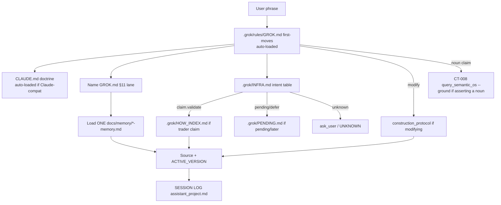
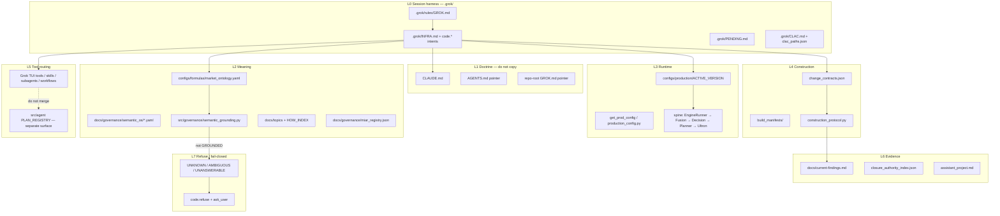
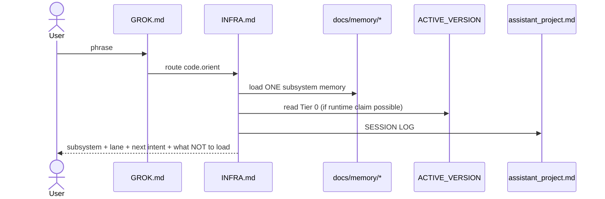
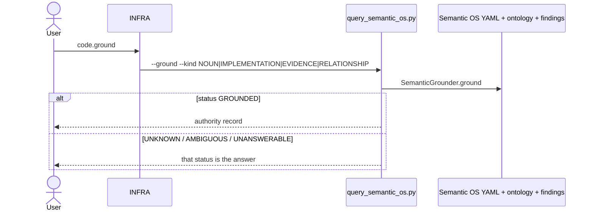
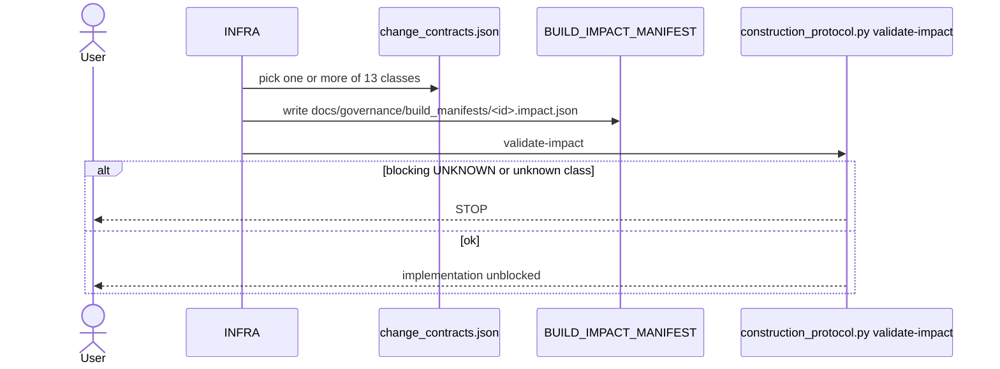
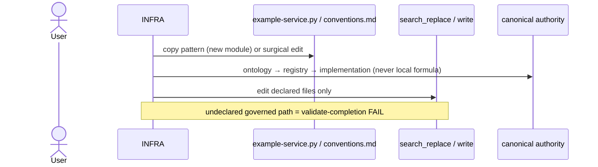
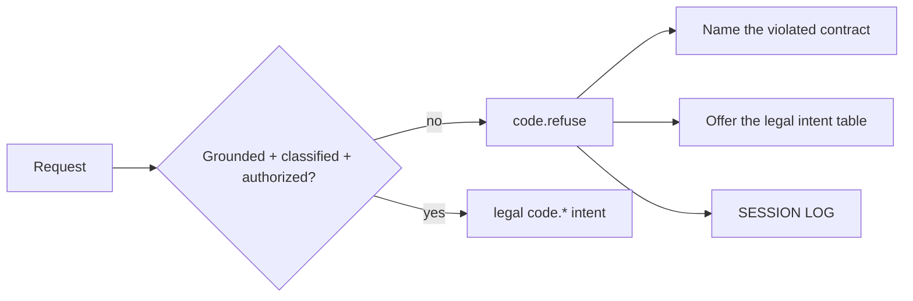

# Coding-LLM Architecture Closure (CLAC)

| Field | Value |
|---|---|
| **Title** | Coding-LLM Architecture Closure — bind every incorporated asset to a fail-closed coding path |
| **Author** | Grok (design; implementation is a later authorized PR) |
| **Date** | 2026-08-18 |
| **Status** | Accepted (user 2026-08-18) |
| **Lane** | **semantic certification** of the *coding-LLM operating architecture* (GROK.md §11). Measurement of the new KPI is allowed as **measurement/evidence**. Economic qualification is **out of scope**. |
| **Branch (design context)** | `feature/truth-registry-v2` |
| **Workspace** | `D:\Tradelatest` |
| **Authority granted** | **NONE.** No G001, no promotion, no `ACTIVE_VERSION` edit, no CRT recertification, no live rail. |

**CURRENT / INTENDED / RECOMMENDED are kept distinct throughout.** This document does not collapse them.

---

## Overview

A coding LLM in the Grok Build TUI can already *touch* this repository. It cannot yet *prove* that every coding action has a bound, fail-closed path from a user phrase to an authority to source to a validation floor. GCMC v1 = 100% (1,281 / 1,281 `.py` files under `src/` + `scripts/` + `tests/` listed in the three functionality Excels — `.grok/CLOSURE_KPI.md`) is **file-map closure**. It is not “an LLM can code safely.” Deep architecture-memory covers **~40% of `src/` by name** (`docs/memory/architecture-memory.md` “Known coverage”). Topic extracts still say **38-dim** while source is **schema v5.0 / 48-dim** (`src/features/feature_schema.py:141` `CANONICAL_FEATURE_DIM = 48`; `:292` `SCHEMA_VERSION = "5.0"`). Those are honest CURRENT gaps.

This design closes the *operating* architecture for a coding LLM by **extending owners that already exist** — `.grok/INFRA.md` (session intents), Semantic OS CT-008 (`src/governance/semantic_grounding.py`), the construction protocol (`docs/governance/REPOSITORY_CONSTRUCTION_PROTOCOL.md` + `docs/governance/change_contracts.json`), subsystem memory (`docs/memory/`), and the Grok TUI tool/skill/subagent surface — **not** by writing a second doctrine or a parallel “LLM OS.”

The named KPI is **CLAC** (Coding-LLM Architecture Closure). Target 100%. Formula, denominator, and what 100% does *not* mean are in §9. GCMC is not renamed and is not mixed in.

Every already-incorporated asset (TUI tools, skills, user-guide, `.grok/` overlay, doctrine/memory/governance, in-repo agent, multi-LLM pipeline, MCP, media) gets a **named job** in the coding happy flow, or is declared **INTENTIONAL SEMANTIC SEPARATION** with an owner path. Nothing is “nice to have.”

---

## Background & Motivation

### Why this change is needed

The user asked for “full closure to codebase architecture for coding llm and design plan of using every asset incorporated in tool.” Interpreted strictly:

- Close the **coding-LLM operating architecture** (what the TUI implementer is allowed to do, against which authority, with which tool).
- Use **every already-incorporated asset** — bind or refuse, never ignore.
- Do **not** recertify CRT, do **not** seize production, do **not** mint G001.

### CURRENT state (file-driven; source wins)

| Surface | CURRENT truth | Evidence |
|---|---|---|
| Runtime version | `v2_htfcrt_2026_08` | `configs/production/ACTIVE_VERSION` (read 2026-08-18). **Tier 0.** |
| Historical finding on `patch` | F-016 still records `v2_multi_2026_04` as active on `patch` | `CLAUDE.md` Repository Truths Index. **History / other-branch.** Do not collapse into Tier 0. |
| CRT surface | **OPEN / REOPENED** (F-074 directional displacement) | `docs/governance/closure_authority_index.json` `surfaces[CRT].status = OPEN` |
| CRT object relations | **CLOSED** (CT-009) | same index, `CRT_OBJECT_RELATIONS` |
| GCMC v1 | **100.0%** file-map (1,281 / 1,281) | `.grok/CLOSURE_KPI.md` |
| GCMC v2 | **100.0%** of `mt5_analytics` + `oss_lab` + `tools` (97 / 97) | same file; **listed ≠ production control** |
| Session intents | Closed set of **12** trader/session intents; **no coding intents** | `.grok/INFRA.md` §2 |
| In-repo agent | `PLAN_REGISTRY` has **22** keys (comment still says “All 14 intents”) | `src/agent/plan_compiler.py:41-148` |
| In-repo tools | **35** `@register_tool` names across 7 mode modules | `src/agent/modes/*.py` |
| Construction | 13 change classes; `GOVERNANCE_REGISTRY_ADDITION` still missing (disclosed residual) | `docs/governance/change_contracts.json`; `CH-closed-semantic-environment.impact.json` unknowns |
| Grounding | CT-008 Closed Semantic Environment is **shipped** | `scripts/governance/query_semantic_os.py --ground`; agent `truth.ground_claim` |
| Feature schema | **v5.0 / 48-dim** | `feature_schema.py:141` `CANONICAL_FEATURE_DIM = 48`; `:292` `SCHEMA_VERSION = "5.0"` |
| Topic / How-index | Still describe **38-dim** vectors | `.grok/HOW_INDEX.md` feature-schema extract; `docs/architecture/service-boundary-map.md:42` |
| Memory coverage | Deep map **~40% of `src/` by name**; spine packages high; `src/research/` package-level only | `docs/memory/architecture-memory.md:73-75` |
| Live rail | **No caller** (F-073) | `docs/architecture/entry-exit-map.md` Live tick = `NO-CALLER` |
| P-GOAL-04 | **OPEN** (“Three MCs INSUFFICIENT”). Not an authority to measure. T4 diagnostic walk is recorded **INSUFFICIENT** under `P-GOAL-13` / `.grok/T4_MEASUREMENT.md`. Sense B **promote** still refused. | `.grok/PENDING.md` P-GOAL-04 (OPEN), P-GOAL-13; `.grok/T4_MEASUREMENT.md`; `.grok/FOUR_TRACKS.md` T4 |
| P-GOAL-09 | Thin INFRA intent router **LATER**, table only today | `.grok/PENDING.md` |
| P-GOAL-11 | Production control **REFUSED as a grab** | `.grok/FOUR_TRACKS.md` T2 |
| LLM on spine | Advisory only; never execution authority | `docs/architecture/llm-governance-layer.md` |
| Grok TUI role | Acting implementer in this session (not the six-model Claude-only executor) | `.grok/rules/GROK.md` §1 |

### Pain points (CURRENT, not defects-by-difference)

1. **Intent gap.** `.grok/INFRA.md` routes trader phrases (`claim.validate`, `spine.walk`, `review.semantic`). A coding phrase (“add a SITS row”, “classify this edit”, “implement the gate”) today falls through to `ask_user` or is improvised against GROK.md first-moves. First-moves *mention* construction and memory but are not an intent table.
2. **KPI mix-risk.** GCMC 100% is easy to misread as “architecture closed.” `.grok/CLOSURE_KPI.md` already forbids that mix; this design adds a *second named number* rather than widening GCMC.
3. **Two agent surfaces.** In-repo `PLAN_REGISTRY` (`src/agent/plan_compiler.py`) and Grok session infra (`.grok/INFRA.md`) are declared separate (`INFRA.md` lines 11, 165). A coding-LLM design that merged them would violate that contract.
4. **Asset orphans.** TUI tools (X/Twitter, media, MCP `voice`, game skills) have no named job. Without an explicit unused-on-coding-path declaration they will be invented-into the coding path or silently ignored — both fail the “use every asset” requirement.
5. **Token blow-up.** Auto-loading HOW_INDEX / INFRA / the deep map / all 1,281 Excel rows is already forbidden (`INFRA.md` line 51; GROK.md §6). Closure cannot mean “load everything.”
6. **Trigger vocabulary vs INFRA.** `docs/architecture/trigger-vocabulary.md` (verified path; not `TRIGGER_VOCABULARY.md`) is the CLAUDE.md §12 surface. INFRA is the Grok session surface. They compose; they are not one table.

---

## Goals & Non-Goals

### Goals

1. Define **CLAC** — a new, non-mixed KPI whose 100% means: every coding-LLM **action class** has a **bound path** `user phrase → INFRA intent → authority documents → source → validation floor`, with **fail-closed UNKNOWN**.
2. Add **proposed INFRA.md rows** for coding (`code.orient`, `code.ground`, `code.classify`, `code.implement`, `code.validate`, `code.document`, `code.refuse`, `code.regenerate`). Do not create a second intent registry.
3. Publish a **complete asset-binding matrix** (every TUI tool, skill, user-guide chapter, `.grok/` file, doctrine/memory/governance surface, in-repo agent, multi-LLM, MCP, media).
4. Specify **happy flows** (sequence diagrams) a coding LLM can execute without inventing the next file.
5. Specify a **thin intent router** (P-GOAL-09) as a spec only. Implementation stays **LATER / table-only** — not authorized after PR-2b.
6. Produce an incremental **PR plan** whose first PRs are doc/KPI/INFRA/binding-table/floor-test. No production code. No `ACTIVE_VERSION` edit.
7. Reconcile the new KPI with existing-doc-first and P-GOAL-10: **sibling file `.grok/CLAC.md` is accepted.** P-GOAL-10 is narrowed to “single *file-map* number.” PR-1 updates `.grok/CLOSURE_KPI.md` (anti-mix pointer) and `docs/knowledge-map.md`.

### Non-Goals

- CRT recertification or flipping `CRT_CLOSURE_STATUS` (still REOPENED / F-074).
- G001 / Sense B money / promoting any config / seizing T2 production control.
- A second doctrine file that copies `CLAUDE.md`.
- Merging `.grok/INFRA.md` with `PLAN_REGISTRY`.
- Mixing CLAC into GCMC v1 or v2.
- Inventing Semantic OS ids, FM ids, or F-ids.
- Changing `ACTIVE_VERSION`.
- Implementing the INFRA router (P-GOAL-09 stays LATER / table-only; not authorized after PR-2b).
- New change classes (`GOVERNANCE_REGISTRY_ADDITION` / `TEST_FLOOR_ADDITION`) — disclosed residual is enough.
- Promoting `CLAC-P-GROUND` to required; a Semantic OS Concept for this program; a `P-CLAC-01` PENDING row in PR-1; a GREEN_FLOOR pin this turn.
- Auto-injecting HOW_INDEX or the 1,281 Excel rows.
- A live order path (F-073).
- Activating BitNet, rr_fusion, TradeNet, or any inert model.
- Fixing HOW_INDEX 38-dim vs schema v5.0 48-dim in this design (DOC_DRIFT; owner is the topic / How-index regenerate — see PR-5).

---

## Current-state map — how a coding LLM is *supposed* to work today

This is **CURRENT**, not INTENDED.



### CURRENT happy path (what GROK.md actually orders)

1. **Boot.** Goal `.grok/GOAL.md`, playground `.grok/PLAYGROUND.md`, Sense A done (CRT = structure). **P-GOAL-04 is OPEN** — it is **not** an authority to measure. T4 walk is recorded INSUFFICIENT (`T4_MEASUREMENT.md` / P-GOAL-13). Sense B promote stays refused. After `CRT_OBJECT_RELATIONS` CLOSED, name the lane (`semantic certification` | `measurement/evidence` | `economic qualification`).
2. **Harness.** Treat GROK.md as harness. Do not re-read `CLAUDE.md` wholesale.
3. **Memory.** Identify subsystem → load **only** the matching `docs/memory/{agent,runtime,feature,engine,governance,architecture}-memory.md` (`CLAUDE.md` §0; `docs/memory/README.md`).
4. **Before modify.** `docs/governance/REPOSITORY_CONSTRUCTION_PROTOCOL.md`: classify against `change_contracts.json` → BUILD_IMPACT_MANIFEST (`docs/governance/build_manifests/<id>.impact.json`) → STOP on blocking UNKNOWN → implement through canonical authorities → `python scripts/governance/construction_protocol.py validate-completion <manifest>` or `… check`.
5. **Session log.** Append `📝 SESSION LOG ENTRY` to `assistant_project.md` (codebase) or `llm_project_assistant.md` (workflow).
6. **Pending retrieve.** Open `.grok/PENDING.md` on “pending / later”; do not answer from memory.
7. **Trader claim.** Open `.grok/HOW_INDEX.md`, pick one NEEDED topic, Ins/Outs → cited files → Excel inventory. Do not load 1,281 rows.
8. **Intent.** Route to `.grok/INFRA.md`. Unknown → `ask_user`. Do not invent an intent.

### CURRENT authorities a coding turn already has (but not as INFRA intents)

| Step | Authority | Command / file |
|---|---|---|
| Ground a noun | CT-008 | `python scripts/governance/query_semantic_os.py --ground --kind NOUN --token <id>` |
| Ground implementation | CT-008 | `--kind IMPLEMENTATION --token <path> --symbol <Name>` |
| Ground evidence | CT-008 | `--kind EVIDENCE --token F-048` |
| Classify change | 13 classes | `docs/governance/change_contracts.json` |
| Pre-build gate | construction | `python scripts/governance/construction_protocol.py validate-impact <manifest>` |
| Post-build gate | construction | `… validate-completion <manifest>` |
| One-command floor | construction | `… check` |
| GREEN_FLOOR | invariants | `python scripts/maintenance/check_governance_invariants.py` |
| In-repo agent ground | PLAN_REGISTRY `semantic_ground` | `truth.ground_claim` (`src/agent/modes/truth_mode.py`) |
| In-repo janitor | PLAN_REGISTRY `truth_janitor` | `truth.construction_check`, `truth.feature_math_lint`, `truth.script_census`, `truth.citation_floor`, `truth.hygiene_pack` |
| SITS register script | conventions §2.1 | `script_census.py --write-stubs` → `seed_script_registry.py` → `scripts/analysis/generate_script_matrix.py` |
| Triggers (Claude surface) | `docs/architecture/trigger-vocabulary.md` | Orient / Map / Implement / Validate / Register scripts |

### CURRENT gaps (honest)

| Gap | What is missing | Why it matters |
|---|---|---|
| No `code.*` INFRA intents | Coding phrases are not in the closed set | LLM improvises the next file |
| No CLAC number | Only GCMC exists | Easy to claim “architecture closed” |
| No asset-binding table | Tools have no named coding job | Assets get ignored or abused |
| HOW_INDEX / topics 38-dim vs schema v5.0 48-dim | DOC_DRIFT | Coding LLM that trusts How-index writes the wrong vector size |
| `PLAN_REGISTRY` comment “14 intents” vs 22 keys | DOC_DRIFT | Census of the in-repo agent is stale |
| `entry-exit-map.md` “25 tools / 17 intents” vs 35 tools / 22 intents | DOC_DRIFT | Same |
| Deep memory ~40% of `src/` | Coverage, not a bug | Closure cannot mean “the map names every function” |
| No `GOVERNANCE_REGISTRY_ADDITION` class | Disclosed residual | Adding Semantic-OS-like src/governance files under-describes the class |
| Intent router unbuilt | P-GOAL-09 LATER | Classification is still LLM-in-the-loop against a table |
| Two trigger vocabularies | INFRA vs `trigger-vocabulary.md` | Must compose, not merge |

---

## Proposed Design — closed architecture as layers

This is **INTENDED** (what “architecture closed for a coding LLM” will mean after the PRs). It is **not** CURRENT. It is **not** a recommendation to skip authorities.



### Layer contracts

| Layer | Load when | Authorizes | Must not | Fail-closed if missing |
|---|---|---|---|---|
| **L0 Harness** | Every Grok session (GROK.md auto-loaded; INFRA/CLAC/PENDING on demand) | Session role, intent table, CLAC definition, later-ledger | Doctrine, meaning, runtime | Missing GROK.md overlay → stop (`grok inspect`). Missing INFRA on a coding phrase → `ask_user`. Missing PENDING on “pending” → stop. |
| **L1 Doctrine** | Already injected; open a *section* only | Ritual, findings index, constraints, triggers | Be re-authored into `.grok/` | If Claude-compat off and CLAUDE.md unread, do not invent ritual — open the needed section. |
| **L2 Meaning** | Before asserting a repo noun, FM, SEM, F-id, or join | What a concept **means** (ontology #1 for meaning) | Promotion, runtime mutation, inventing ids | `query_semantic_os.py --ground` not `GROUNDED` → that status **is** the answer. |
| **L3 Runtime** | Before any “the engine does X” / config claim | What runs **today** (Tier 0 = `ACTIVE_VERSION`) | History/findings overriding Tier 0 | File missing or `get_active_version()` raises → schema/version mismatch; do not migrate. |
| **L4 Construction** | Before any modify | Class, manifest, required checks, rollback | Local formula math; silent defaults | Blocking UNKNOWN in manifest → STOP. Unknown change class → STOP. |
| **L5 Tool routing** | Every coding step | Which TUI tool / skill / subagent / in-repo tool | Using an unused-on-coding-path tool as authority | Tool not in binding table → treat as UNKNOWN, do not invent a job. |
| **L6 Evidence** | When a conclusion flips, or a closure token is cited | Findings / closure **records** (not authority to promote) | Mixing AUDITED with CLOSED; mixing GCMC with CLAC | Ungrounded F-id / surface → UNANSWERABLE. |
| **L7 Refuse** | Unauthorized, unknown, production grab, live claim, money without MC | Stopping | Soft-yes | If refuse path itself is unclear → `ask_user`. |

### Action classes (the CLAC denominator axis)

| Action class | Meaning | Default INFRA intent |
|---|---|---|
| **read** | Orient, map, open authorities, do not edit | `code.orient` (+ `code.ground` when asserting a noun) |
| **classify** | Name change class + write impact manifest | `code.classify` |
| **implement** | Surgical edit through canonical authorities | `code.implement` |
| **test** | Run the class’s required checks + construction floor | `code.validate` |
| **document** | Drift protocol, topic/citation/session log | `code.document` |
| **refuse** | Unauthorized / UNKNOWN / production grab / live / money | `code.refuse` |

`code.regenerate` is a **derived** action (rebuild How-index, GCMC snapshot, citation map, SITS, Portable Mind). It is in the INFRA table so it is routable, and it is a CLAC path under **document** (derived artifacts) plus **test** (sync floors). It is not a seventh action class.

---

## Per-coding-task happy flows

All flows start with: name the GROK.md §11 **lane** (`semantic certification` for this design’s own implementation PRs). Unknown lane on a money ask → do not skip to economic qualification.

### 1. Orient (`code.orient` — action class **read**)

**User says:** “orient”, “where do I start”, “map this change”, “what subsystem is this.”



**Tools:** `read_file`, `list_dir` (optional `grep` for symbol location). Subagent `explore` only if the landing package is unknown after memory.

**Authorities loaded:** GROK.md first-moves, one memory doc, `docs/architecture/signal-flow.md` only if spine-crossing, `entry-exit-map.md` / `service-boundary-map.md` only if I/O or seam is the question.

**Must not:** load all six memories; open HOW_INDEX (that is `claim.validate`); edit; assert a noun without `code.ground`.

**Fail-closed:** subsystem not in the six-row map → `ask_user`. Memory file missing → STOP.

**Trigger compose:** Claude-surface `Orient` / `Map` (`docs/architecture/trigger-vocabulary.md`) **are** this flow’s synonyms. Do not run both as separate work.

### 2. Ground a noun (`code.ground` — action class **read**)

**User says:** “what is CN-… / FM-… / F-… / EngineRunner”, “does this join exist.”



**Command (verbatim):**

```text
python scripts/governance/query_semantic_os.py --ground --kind NOUN --token <id-or-name>
python scripts/governance/query_semantic_os.py --ground --kind IMPLEMENTATION --token src/core/engine_runner.py --symbol EngineRunner
python scripts/governance/query_semantic_os.py --ground --kind EVIDENCE --token F-048
python scripts/governance/query_semantic_os.py --ground --kind RELATIONSHIP --relation owns --source <id> --dest <id>
```

**Tools:** `run_terminal_command` (venv interpreter — P-ENV-01: bare `python` may lack `jsonschema`). Optional in-repo agent tool `truth.ground_claim` if the operator is already in `python -m src.agent.cli`. Do **not** start the in-repo REPL just to ground.

**Must not:** invent a CN/BD/JN/CT/FM/F-/H- id. Do not treat `UNKNOWN` as “create the node.” Creating a node is a classified ontology change (FEATURE_IDENTITY_CHANGE or Semantic OS hand-edit under construction).

**Fail-closed:** CLI exit ≠ 0 or status ≠ GROUNDED → do not introduce the noun.

### 3. Classify a change (`code.classify` — action class **classify**)

**User says:** “classify this”, “write the manifest”, “what change class.”



**Mandatory manifest fields** (`construction_protocol.py` `_IMPACT_MANDATORY`): `change_id`, `objective`, `change_classes`, `affected_files`, `required_checks_ack`, `unknowns`, `rollback_boundary`.

**Template (copy the shape of `docs/governance/build_manifests/CH-closed-semantic-environment.impact.json`):**

```json
{
  "change_id": "CH-clac-v1-paths",
  "objective": "…",
  "change_classes": ["DOCUMENTATION_ONLY"],
  "affected_files": ["…"],
  "affected_feature_ids": [],
  "affected_models": "none",
  "affected_production_config": "none",
  "required_checks_ack": [
    "tests/test_current_findings.py",
    "tests/test_doc_citations.py",
    "tests/test_topic_docs.py"
  ],
  "unknowns": [],
  "rollback_boundary": "single commit",
  "authority_granted": "NONE"
}
```

**Class cheat-sheet — all 13 keys in `docs/governance/change_contracts.json` (closed set; do not invent a 14th).** If the change is not in this table, **STOP** and open the JSON — do not guess.

| If you are changing… | Class |
|---|---|
| Add/rename/retire a governed feature identity (FM-id, lifecycle, name) | `FEATURE_IDENTITY_CHANGE` |
| The mathematics of a registered formula, or add a new one | `FORMULA_CHANGE` |
| A deterministic derived metric (ATR/price-relative) | `DERIVED_METRIC_CHANGE` |
| `CANONICAL_FEATURES` / feature-vector schema / dataset builders | `DATASET_SCHEMA_CHANGE` |
| Which features/values feed a model at train or serve time | `MODEL_INPUT_CHANGE` |
| Training pipelines / datasets / labels | `MODEL_TRAINING_CHANGE` |
| Add/replace a serialized model artifact under `models/` | `MODEL_ARTIFACT_CHANGE` |
| Activate/deactivate/rewire a model on the live/backtest spine | `ACTIVE_MODEL_CHANGE` |
| `configs/production/*` or `ACTIVE_VERSION` | `PRODUCTION_CONFIG_CHANGE` — **user-gated; this design forbids it** |
| Gates / engines / fusion / decision / planner / Ultron behavior | `RUNTIME_DECISION_PATH_CHANGE` |
| Delete code proven unreachable | `DEAD_CODE_REMOVAL` |
| Docs / comments / findings text only — no behavior surface | `DOCUMENTATION_ONLY` |
| Add/move/classify/retire a script registry record or new `scripts/**` / repo-root `*.py` | `SCRIPT_LIFECYCLE_CHANGE` |

The JSON is the closed set. The cheat-sheet is exhaustive of those 13 keys.

**Known residual:** adding `src/governance/` registry-like modules has **no** `GOVERNANCE_REGISTRY_ADDITION` class (disclosed in `CH-closed-semantic-environment.impact.json`). Adding a floor test has **no** `TEST_FLOOR_ADDITION` class. CURRENT workaround = declare every `src/` / `tests/` path + reuse existing classes + non-blocking unknown. **User 2026-08-18: no new change classes in this program.** Disclosed residual is enough.

**Fail-closed:** class not in the JSON → STOP. Mandatory field `UNKNOWN` → STOP. `PRODUCTION_CONFIG_CHANGE` without explicit user approval → `code.refuse`.

**Plan mode:** if the class or landing package is ambiguous, `enter_plan_mode` (user-approved). Plan file only is writable.

### 4. Implement a governed edit (`code.implement` — action class **implement**)

**Precondition:** `validate-impact` green. Lane named. No blocking UNKNOWN.



**Tools:** `read_file` first, then `search_replace` (preferred) or `write`. `grep` to find citations (`docs/architecture/citation-map.generated.md`) the same turn (`CLAUDE.md` §6.3). `todo_write` for 3+ steps.

**New `src/` module pattern:** copy `docs/reference/example-service.py` into the package from `docs/reference/conventions.md` §2. Fail-fast `_require`, `from_prod_config`, named flow logger, no magic numbers.

**Must not:** edit `configs/production/ACTIVE_VERSION`; add local formula math; merge INFRA into `PLAN_REGISTRY`; skip SITS when adding a script; write exploits; read `.env`; auto-activate the bundled `implement` skill (Key Decision 16).

**Fail-closed:** file not on the manifest `affected_files` → do not touch it. Construction class requires an ontology node that does not exist → STOP and classify a FEATURE_IDENTITY_CHANGE first. If the bundled `implement` skill is already active → **stop** and `ask_user`; do not spawn unguarded implementer children.

**Subagent:** `general-purpose` for a single bounded file-set after the plan is approved. **Not** `explore` for writes. **Not** a workflow Rhai unless the file list is known and the workflow is a registered project workflow (see §10). **Not** the bundled `implement` skill’s persona loop (ISS unless the user typed `/implement`).

### 5. Add a script (SITS) — `code.implement` + `SCRIPT_LIFECYCLE_CHANGE`

CURRENT procedure (`docs/reference/conventions.md` §2.1; trigger **Register scripts**):

Quote `docs/reference/conventions.md` §2.1 verbatim (do not relocate the generator):

```text
python scripts/analysis/script_census.py --write-stubs docs/governance/script_registry_stubs.jsonl
# update grandfather pin path list if freezing a new epoch (or wait for PR-3 ratchet)
python scripts/governance/seed_script_registry.py
python scripts/analysis/generate_script_matrix.py
```

Then add a seed overlay with `purpose != GRANDFATHER_UNCLASSIFIED` (the §2.1 comment on the grandfather pin is separate from the overlay). The matrix generator lives at `scripts/analysis/generate_script_matrix.py` — **not** `scripts/governance/`.

Required checks: `tests/test_script_registry.py`, `tests/test_script_matrix_sync.py`, `tests/test_construction_protocol.py`.

**Must not:** leave a new `scripts/**/*.py` as `GRANDFATHER_UNCLASSIFIED`. Do not put production logic in `scripts/` (thin wrappers only).

### 6. Add a test (`code.implement` + `code.validate`)

**Placement:** `tests/` flat or `tests/<subpackage>/` (`conventions.md` §2). Grok-session floors that pin INFRA/CLAC belong in `tests/Grok/` (existing package: `test_A_…` through `test_I_…`) **or** `tests/test_clac.py` — PR-2 chooses one; this design RECOMMENDS `tests/Grok/test_clac.py` so CLAC stays next to other Grok-session floors.

**Must:** cover the APPROVE path and every hard-failure / fail-closed branch the new code introduces (`CLAUDE.md` §3.1 item 6). For CLAC itself: missing path row, missing file cited by a path, unknown tool in `tool_route`, implement-path without a `change_contracts` class.

**GCMC side-effect:** a new `tests/*.py` **drops GCMC v1 below 100%** until the three Excel generators are re-run (`.grok/CLOSURE_KPI.md`). PR-2a accepts the documented dip; **PR-2b** regenerates the tests inventory (and SITS) so GCMC returns to 100%. Do not mix the two numbers. How-index refresh stays `how.regenerate` (not `code.regenerate`).

### 7. Validate (`code.validate` — action class **test**)

```text
python scripts/governance/construction_protocol.py validate-completion <manifest>
# or, before claiming any governed completion:
python scripts/governance/construction_protocol.py check
```

Plus the class’s `required_checks` (executed by the validator — never log-trusted).

Targeted pytest (example):

```text
venv/Scripts/python.exe -m pytest -q tests/Grok/test_clac.py tests/test_construction_protocol.py
```

**Read-only.** `code.validate` does not edit. If a check is red, the next intent is `code.implement` (fix) or `code.refuse` (out of scope), not a silent xfail invert (`SEMANTIC_REVIEW_PROTOCOL`: never invert an xfail that encodes an unresolved decision).

**Compose:** Claude-surface `Validate` (`trigger-vocabulary.md`) = this flow + Five Governance Questions + SESSION LOG.

### 8. Regenerate derived artifacts (`code.regenerate`)

| Artifact | Command | Owner |
|---|---|---|
| How-index | `python .grok/_build_how_index.py` | `.grok/HOW_INDEX.md` (generated). Owner intent: **`how.regenerate`** (do not clone onto `code.regenerate`). |
| GCMC v2 book | `python .grok/_build_gcmc_v2.py` | `.grok/gcmc_v2_inventory.xlsx` |
| Portable Mind | `python scripts/context/build_context.py` | `context/*.md` (gitignored derived) |
| Citation map | `python scripts/analysis/gen_citation_map.py` | `docs/architecture/citation-map.generated.md` |
| Code map | `python scripts/analysis/gen_code_map.py` | `docs/architecture/code-map.generated.md` |
| SITS matrix | `scripts/governance/seed_script_registry.py` + `scripts/analysis/generate_script_matrix.py` | `docs/reference/script-matrix.md` |
| Semantic OS objects | `python scripts/governance/seed_semantic_os.py` | generated objects |
| Coverage dashboard | `python scripts/governance/coverage_dashboard.py` | `docs/governance/REPOSITORY_COVERAGE_DASHBOARD.md` |
| Findings JSONL | `python scripts/governance/export_findings.py` | `data/findings.jsonl` (GENERATED) |
| CLAC snapshot (INTENDED, lands PR-2a) | `python scripts/governance/build_clac.py` | `.grok/clac_snapshot.json` + “Current reading” table in `.grok/CLAC.md`. **PR-1 must not claim this command exists.** |

**Must not:** hand-edit GENERATED artifacts (`CLAUDE.md` machine-readable truth sources).

### 9. Review a defect claim (`review.semantic` — existing INFRA intent)

Do **not** invent `code.review`. The coding LLM uses the **existing** `review.semantic` row (`INFRA.md` §2) + `docs/governance/SEMANTIC_REVIEW_PROTOCOL.md`. Close in exactly one of the 10 classes. **No production edit.**

External “this is a bug” = hypothesis. Reproduce against source (F-067 / F-068 lesson).

**Tools:** `read_file`, `grep`, `run_terminal_command` (reproduce). Skill **review** (bundled) activates here. Subagent `explore` for blast-radius. `enter_plan_mode` only if remediation is later authorized — review itself is not implementation.

### 10. Refuse unauthorized work (`code.refuse` — action class **refuse**)

**Triggers:** production grab (T2 / P-GOAL-11), `ACTIVE_VERSION` edit, live-order claim (F-073), G001 without sealed MC + P-GOAL-04 discipline, inventing an INFRA intent, merging PLAN_REGISTRY, mixing CLAC into GCMC, reading `.env`, CRT recert by implication, economic qualification disguised as a coding task.



**Tools:** `ask_user_question` if the refuse needs a product fork; otherwise state the refuse and stop. Do not “just peek” if the user said not to read the codebase (`GROK.md` §3).

---

## Proposed INFRA.md rows (add to the closed set — do not create a second table)

These are **proposed rows** for `.grok/INFRA.md` §2. Implementing the file edit is PR-1.

**PR-1 also edits the existing `boot` row** so examples stay disjoint (see phrase-collision matrix). Do **not** copy the pre-revision “orient” example onto both `boot` and `code.orient`.

### Existing-row edits (PR-1, same table)

| Intent | Change in PR-1 |
|---|---|
| `boot` | **User says** becomes `new session / grok inspect / who am I`. Remove the token `orient` from this row. **Happy flow** sentence: replace “P-GOAL-04 still later” with “P-GOAL-04 OPEN; T4 walk INSUFFICIENT; Sense B promote refused. P-GOAL-04 is not an authority to measure.” |
| `how.regenerate` | **Unchanged.** Remains the How-index owner. Examples stay `refresh How-index`. |
| `closure.record` | **Unchanged.** Remains the PENDING / GROK.md / findings-ledger write. Session-log-on-a-coding-turn is a step inside `code.document`, not a clone of this intent. |
| All other existing rows | Unchanged examples. |

### New rows (PR-1)

| Intent | User says (examples) | Happy flow | Stop if |
|---|---|---|---|
| `code.orient` | orient this change / which subsystem / map the landing | GROK.md §11 lane → one memory doc → (optional) signal-flow / entry-exit / service-boundary → name next `code.*` | Subsystem unknown; user asked for money |
| `code.ground` | what is X / does this join exist / ground EngineRunner | `query_semantic_os.py --ground` (kind NOUN / IMPLEMENTATION / EVIDENCE / RELATIONSHIP) | Status ≠ GROUNDED |
| `code.classify` | classify / write the manifest / which change class | `change_contracts.json` → `build_manifests/<id>.impact.json` → `validate-impact` | Blocking UNKNOWN; unknown class; PRODUCTION_CONFIG_CHANGE without user |
| `code.implement` | surgical edit / add the classified module / implement the classified change | Impact green → example-service / conventions → parent edits **declared** files → citation sync | No green impact; file not declared; local formula; bundled `implement` skill already active without `/implement` |
| `code.validate` | validate the floor / run construction check / pytest the class | `construction_protocol.py validate-completion` or `check` + required_checks | Treated as a write; inverted xfail |
| `code.document` | sync the topic / drift protocol / citation sync | Owning doc first (`CLAUDE.md` §6.2) → topic + citations + SESSION LOG (coding-turn ritual) | New standalone doc without existing-doc-first search |
| `code.refuse` | seize production / edit ACTIVE_VERSION / we’re live / this makes money so ship it | Name contract; offer table; stop | — |
| `code.regenerate` | refresh CLAC / refresh citation map / refresh SITS / refresh Portable Mind | The command in §8 table for **that** artifact (never How-index) | Hand-edit of a GENERATED file; user said “refresh How-index” (that is `how.regenerate`) |

Existing intents stay. `ask_user` remains the unknown sink. `claim.validate` remains the **trader-claim** path (not coding). `review.semantic` remains the **defect-claim** path. `how.regenerate` remains the How-index owner (compose, do not clone).

### Phrase-collision matrix (PR-1 acceptance check)

An implementer **must** apply this table before merging PR-1. After the edits, no token in any “User says” cell may appear in two rows. If a later P-GOAL-09 router would score two intents, PR-1 failed this check.

| Token / phrase | Old owner | New owner after PR-1 | Rule |
|---|---|---|---|
| `orient` (bare) | `boot` (“new session / orient”) | **`code.orient` only** | `boot` drops `orient` |
| `new session` / `grok inspect` / `who am I` | `boot` | **`boot`** | Keep on boot |
| `refresh How-index` | `how.regenerate` | **`how.regenerate`** | Do not put on `code.regenerate` |
| `refresh CLAC` / `refresh citation map` / `refresh SITS` / `refresh Portable Mind` | (none) | **`code.regenerate`** | How-index excluded |
| `record this` / `close that` | `closure.record` | **`closure.record`** | Ledger write (PENDING / GROK / findings) |
| `sync the topic` / `drift protocol` / `citation sync` | (none) | **`code.document`** | Not a clone of `closure.record` |
| `session log` (ritual on a coding turn) | mentioned on `closure.record` happy flow | **step inside `code.document`**; `closure.record` still owns ledger writes | Do not put “session log” as a `code.document` *example token* that would steal `closure.record` |
| `implement` (bare) vs `/implement` | (none in INFRA) | Bare “implement the classified change” → **`code.implement`**. Slash `/implement` → bundled **`implement` skill** (ISS unless user typed it) | Key Decision 16 |
| `validate` (bare) | `validate_only` is **PLAN_REGISTRY**, not INFRA | INFRA: `code.validate` examples are `validate the floor` / `run construction check` | Do not collide with in-repo `validate_only` (different surface) |
| `measure` / Sense B | `edge.measure` | **`edge.measure`** (still blocked as promote; P-GOAL-04 is OPEN, not an authority) | `code.*` never takes “does it make money” |

**P-GOAL-09 router spec (do not implement in PR-1–3):**

- **Input:** user phrase (string).
- **Output:** exactly one intent id from the INFRA table, or `ask_user`.
- **Algorithm:** case-insensitive phrase-example match first; then keyword overlap with the “User says” column; no LLM tool-choice. If two intents score, `ask_user`. After PR-1 the collision matrix must make two-score impossible for the tokens above.
- **Location:** a function that *reads* `.grok/INFRA.md` (or a generated `.grok/infra_intents.json` compiled from it). **Not** a new key in `PLAN_REGISTRY`. **Not** `src/agent/intent_router.py` (that classifies operator NL into in-repo intents).
- **Fail-closed:** unreadable INFRA → `ask_user`.
- **Authority:** advisory routing only. Does not grant write.

---

## Asset-binding matrix

**Legend**

- **Job** = the named job on the *coding* happy path.
- **ISS** = INTENTIONAL SEMANTIC SEPARATION — unused on the coding path; another path owns it.
- **Fail-closed** = what the coding LLM does if the asset is missing or the tool errors.

A coding LLM **may not** give an unbound asset a new job in-session.

### A1. Grok Build TUI — file / code tools

| Asset | Job | When | Authorizes | Must not | Fail-closed |
|---|---|---|---|---|---|
| `read_file` | Primary read of authorities and source | Every `code.orient` / ground / classify / implement | Seeing file contents | Treat contents as promotion authority | Missing path → do not invent; `code.refuse` or `ask_user` |
| `list_dir` | Package / tree orientation | Orient when memory does not name the file | Existence of children | Completeness census (use GCMC / Excel) | Empty / missing dir → UNKNOWN package |
| `grep` | Symbol / citation / call-site search | Map, citation sync, reproduce a defect | Location hypotheses | Semantic meaning (ground first) | Zero hits ≠ “does not exist in domain” |
| `search_replace` | Surgical implement | `code.implement` after green impact | Editing a **declared** file | New-file creation; manifest-undeclared paths | Tool fail / unique-match fail → stop, do not `write` the whole file unless new |
| `write` | New file create (manifests, tests, CLAC tables) | Only when the path does not yet exist | Creating a declared new path | Overwriting large existing files | Path exists → use `search_replace` |
| `run_terminal_command` | Ground CLI, construction, pytest, regenerate, SITS | `code.ground` / `validate` / `regenerate` | Executing a **named** command from this doc or construction contracts | `cat`/print `.env`; unbounded whole-repo scans; treating stdout as a finding | Non-zero → report; do not claim COMPLETE |

### A2. Search / web

| Asset | Job | When | Authorizes | Must not | Fail-closed |
|---|---|---|---|---|---|
| `web_search` | External library / protocol docs only | User-approved dependency question | Nothing in-repo | Repo claims, findings, CRT meaning | If used for a repo noun → discard; ground via CT-008 |
| `web_fetch` | Fetch a **cited** external URL | Same | Nothing in-repo | Secrets, private GitHub, `.env` hosts | Auth-fail → UNANSWERABLE |
| `open_page` | Long-form external page | Same | Nothing in-repo | Same | Same |
| `open_page_with_find` | Regex extract from an external page | Same | Nothing in-repo | Same | Same |

### A3. X / Twitter

| Asset | Job | Classification |
|---|---|---|
| `x_user_search` | **ISS** | Unused on coding path. Owner: optional later market-narrative research (not this design; not HOW_INDEX NEEDED). |
| `x_semantic_search` | **ISS** | Same. |
| `x_keyword_search` | **ISS** | Same. |
| `x_thread_fetch` | **ISS** | Same. |

**Fail-closed:** if invoked during `code.*`, treat as a routing error → `code.refuse` (wrong surface). Do not cite a tweet as a finding.

### A4. Agents / orchestration

| Asset | Job | When | Authorizes | Must not | Fail-closed |
|---|---|---|---|---|---|
| `spawn_subagent` type `explore` | Bounded read-only blast-radius / “where is X” | After memory miss, before classify | A summary of locations | Writes; conclusions; F-ids | Child UNKNOWN → parent does not promote the guess |
| `spawn_subagent` type `plan` | Ambiguous implementation approach | Only with user-visible plan intent | A plan draft | Code edits; production config | No user approval → do not implement |
| `spawn_subagent` type `general-purpose` | Bounded implement of an **already classified** file-set | After `validate-impact` green | Edits inside the child’s brief | Expanding scope; ACTIVE_VERSION | Child touches undeclared path → parent `code.refuse` + revert |
| `get_command_or_subagent_output` | Join on **one** child / background | After spawn or `background: true` | Output bytes | Treating partial output as COMPLETE | Timeout → report INCOMPLETE |
| `wait_commands_or_subagents` | Join on **several** children / background commands at once (`wait_any` / `wait_all`) | After parallel `code.validate` / `code.regenerate` / explore fan-out (user-guide `20-background-tasks.md`) | Status+output for every listed `task_id` | Treating a timeout as tests-passed; waiting on a promote/live command | Timeout / missing id → report INCOMPLETE; do not claim COMPLETE |
| `kill_command_or_subagent` | Stop a runaway child / hang | Hang, wrong scope, user cancel | Termination | Punishment; hiding output | Kill fail → say so |
| `workflow` (Rhai) | Fan-out over a **known** file list (e.g. regenerate N derived artifacts) | Only after a **registered** project workflow exists (`.grok/workflows/` or `~/.grok/workflows/`) | Orchestration of children | Authority; determinism of trading; ad-hoc inline scripts in a coding turn | No registered workflow → do not invent one in-session (`create-workflow` skill is later — §10) |
| `todo_write` | Multi-step coding progress | 3+ steps inside one intent | UX of the turn | A second PENDING ledger | — |
| `monitor` | Watch a long test / regen | `code.validate` of a long suite | Event lines | Trading; GREEN_FLOOR replacement | Monitor death ≠ tests passed |
| `scheduler_create` | **Optional operator reminder** | User explicitly asks to repeat a **read-only** floor (e.g. weekly `construction_protocol.py check`) | Recurring **advisory** prompt | Production mutation; money walks; second doctrine | Missing scheduler → run the floor by hand |
| `scheduler_list` | Inspect those reminders | Same | List | — | Empty ≠ “no construction needed” |
| `scheduler_delete` | Cancel a reminder | User asks | Delete | Deleting PENDING rows | Unknown id → false, report |

### A5. Modes

| Asset | Job | When | Must not | Fail-closed |
|---|---|---|---|---|
| `enter_plan_mode` | Ambiguous coding approach (class or landing package unclear) | User-approved | Editing anything except the plan file | User declines → stay in normal; do not implement |
| `exit_plan_mode` | Present the plan | After plan file written | Silent implement | No plan file → do not claim a plan |

Compose with Claude-surface `Plan` trigger and user-guide `19-plan-mode.md`.

### A6. MCP

| Asset | Job | Classification |
|---|---|---|
| `search_tool` | Discover MCP tool schemas **before** `use_tool` | Required whenever an MCP tool is considered. **Never guess schemas.** |
| `use_tool` | Invoke a discovered MCP tool | Only after `search_tool` + a named job below |
| `tasks__list` | See whether a CLAC/GREEN_FLOOR reminder already exists | Optional operator automation — **not** on the default coding happy path |
| `tasks__create` | User-authorized recurring **read-only** reminder (“weekly run construction check and report”) | Same. Prompt must be fail-closed and must not edit production. |
| `tasks__update` | Edit that reminder | Same |
| `tasks__delete` | Archive that reminder | Same |
| `tasks__pause` | Pause/resume | Same |
| `tasks__run_now` | Test-fire the reminder | Same |
| `tasks__get_results` | Read last reminder output | Advisory only — not a COMPLETE claim |
| `tasks__list_trigger_catalog` | Only if the user wants a GitHub-PR-triggered hygiene reminder | Feature-flagged; catalog presence ≠ enabled |
| `tasks__list_trigger_resources` | Resolve numeric GitHub repo id if that reminder is GitHub-triggered | Never put `owner/name` in `dimensions.repo` |
| `voice__list_voices` | **ISS** | Unused on coding path. Owner: accessibility / TUI voice UX (`user-guide` not a coding authority). Fail-closed: do not narrate architecture via TTS as a source of truth. |

**Why tasks is not on the default path:** the repo already has `construction_protocol.py check`, GREEN_FLOOR, and TUI `scheduler_*`. MCP `tasks` is a **user-account** automation fabric (Gmail / Outlook / GitHub / Finance). Binding it as a required coding step would create a third scheduler and a cloud dependency the repo doctrine forbids (`CLAUDE.md` §1: file-backed, no cloud deps for the system). **Default = ISS.** **Named optional job** = user-authorized read-only reminder. Missing MCP server → skip; coding path still closed.

### A7. Media

| Asset | Job | Classification |
|---|---|---|
| `image_gen` | **Optional** refresh of a *visual* architecture diagram when the user asks | Owner: `docs/architecture/architecture-diagram.html`. Not a source of truth. |
| `image_edit` | **ISS** unless user asks to edit that diagram | Same |
| `image_to_video` | **ISS** | Unused on coding path. Owner: none in-repo. |
| `reference_to_video` | **ISS** | Same |

**Fail-closed:** a generated image is **not** an architecture authority. Do not cite it in findings.

### A8. UX

| Asset | Job | When | Must not |
|---|---|---|---|
| `ask_user_question` | Product forks already resolved (see Resolved decisions). Remaining use: `ask_user` sink | Ambiguous *new* intent not in INFRA; PRODUCTION_CONFIG_CHANGE | Asking the user to resolve domain meaning the repo already establishes (`PLAYGROUND.md`); reopening Resolved decisions |

### A9. Bundled skills

Activate **only** when the skill’s description matches the current intent. Skills do not grant authority.

Disk-verified 2026-08-18 under `C:\Users\Hi\.grok\bundled\skills\` (every directory with a `SKILL.md` is a row; **no prefix wildcards**).

| Skill | Job on coding path | When | Must not | If N/A |
|---|---|---|---|---|
| `design` | This document’s own genre; later design-only turns | User asks for a design | Implementing in the same un-classified breath | — |
| `create-workflow` | Author a **registered** Rhai workflow **after** design consensus | PR-6+ and user says “make this a workflow” | Ad-hoc workflows that encode trading or promotion | Before consensus = do not activate |
| `create-skill` | Optional later: a **thin** `code.classify` skill that points at INFRA (does not copy CLAUDE.md) | After CLAC paths exist and the team wants a skill | A second doctrine | Default unused |
| `execute-plan` | Run an **approved** plan’s steps | After `exit_plan_mode` + user approve | Using a plan as production authority | — |
| `review` | Optional aid under existing `review.semantic` | Defect claims | Silent remediation; replacing SEMANTIC_REVIEW_PROTOCOL | — |
| `code-review` | **ISS** (or optional under `review.semantic` if the user invokes it) | User-invoked review of a *diff* | Production edit; skipping source reproduce | Owner: operator `/code-review`. Default unused on `code.*` |
| `implement` | **ISS on the default coding path** (Key Decision 16) | Only if the user types `/implement` | Auto-activate on “implement”; parent-must-not-write loop that skips construction | Owner: operator `/implement`. Coding LLM uses INFRA `code.implement` (parent edits, green manifest). If skill already active → `ask_user` |
| `skill-design-principles` | **ISS** | Authoring a new skill (not this program’s default) | A second doctrine | Owner: `create-skill` later |
| `remove-wall-of-text` | **ISS** | Operator UX / prose trim | Deleting SESSION LOG or findings rows | Owner: operator UX |
| `pr-babysit` | Watch CI on an **already opened** coding PR | After PR-1+ lands | Merging without GREEN_FLOOR | Disk name is `pr-babysit` (not `pr-babitsit`) |
| `resume-claude` | **ISS** on Grok-TUI coding path | Six-model Lane I resume | Pretending Grok is Claude-in-pipeline | Owner: `multi_llm/` Lane I |
| `resume-codex` | **ISS** | Foreign session resume | Importing ungrounded foreign plans | Owner: operator personal |
| `resume-cursor` | **ISS** | Same | Same | Same |
| `build-with-ai` | **ISS** | Generic product skill | Replacing construction protocol | Owner: none in this repo |
| `docx` | **ISS** unless the user asks to export a design | Document export | Treating office files as repo authority | Owner: operator export |
| `pdf` | **ISS** | Same | Same | Same |
| `pptx` | **ISS** | Same | Same | Same |
| `imagine` | **ISS** (same as `image_gen` unless user asks for the architecture diagram) | — | — | — |
| `game-asset-core` | **ISS** | Unused | — | Owner: none. N/A. |
| `game-animation-frames` | **ISS** | Unused | — | Same |
| `game-character-consistency` | **ISS** | Unused | — | Same |
| `game-tilesets` | **ISS** | Unused | — | Same |
| `game-ui-icons` | **ISS** | Unused | — | Same |

### A9b. Bundled personas

Disk-verified 2026-08-18: `C:\Users\Hi\.grok\bundled\personas\` (`*.toml`) and `C:\Users\Hi\.grok\bundled\skills\shared\personas\` (`*.md`). Same names are **one** asset (the persona identity), not two.

| Persona `asset_id` | Classification | Job / owner | Fail-closed |
|---|---|---|---|
| `persona.implementer` | **ISS** on default coding path | Injected only when the user invoked `/implement` (bundled `implement` skill). Owner: that skill. | If injected without `/implement` → `ask_user`; do not let it write |
| `persona.reviewer` | **ISS** | Injected only when `review` / `code-review` skill is user-invoked. Owner: those skills. | Do not close a `review.semantic` as CONFIRMED DEFECT from the persona alone |
| `persona.security-auditor` | **ISS** | Owner: operator security review. Not a GREEN_FLOOR. | Do not treat as construction COMPLETE |
| `persona.design-doc-writer` | **ISS** vs this design’s already-written artifact | Owner: `design` skill. | Do not re-author CLAUDE.md |
| `persona.design-doc-reviewer` | **ISS** | Owner: design-review turns. | Same 10-class close as `review.semantic` if used on code |
| `persona.researcher` | **ISS** | Owner: research lane / `claim.validate`. Not `code.implement`. | Do not promote |
| `persona.test-writer` | **ISS** | Owner: operator `/` test-writing. Coding path writes tests via `code.implement` + conventions. | Do not skip required_checks |

User-guide 16 binds agent **types** (`explore` / `plan` / `general-purpose`). Personas are a different surface (overlay on a child). They do not grant construction authority.

### A10. User-guide (`C:\Users\Hi\.grok\docs\user-guide\`)

These are **harness manuals**, not repo doctrine. Load the chapter when the matching TUI feature is in use. They authorize *how the TUI works*, never *what the trading system means*.

| Chapter | Job on coding path |
|---|---|
| `01-getting-started.md` | Boot literacy only. Do not reload every turn. |
| `02-authentication.md` | **ISS** for coding (auth to xAI). Never dump tokens. |
| `03-keyboard-shortcuts.md` | Operator UX. ISS for architecture claims. |
| `04-slash-commands.md` | `/plan`, `/config-agents` discovery. Load if the user uses slash commands. |
| `05-configuration.md` | `.grok/config.toml` / `~/.grok/config.toml` — MCP/plugins/permissions only (GROK.md §6). |
| `06-theming.md` | **ISS** (UX). |
| `07-mcp-servers.md` | Bind MCP `search_tool`/`use_tool` and the tasks/voice decision above. |
| `08-skills.md` | When to activate a skill; discovery order (`.grok/skills` > repo > user). |
| `09-plugins.md` | **ISS** unless a plugin is actually configured for this project. |
| `10-hooks.md` | Optional later: a *local* hook that reminds `construction_protocol.py check`. Does not replace CI `governance.yml`. Honest residual: “No local git hook is installed in this clone” (`REPOSITORY_CONSTRUCTION_PROTOCOL.md`). |
| `11-custom-models.md` | **ISS** for coding-architecture (model picker ≠ repo authority). |
| `12-project-rules.md` | Explains why `AGENTS.md` / `CLAUDE.md` / `.grok/rules/*.md` auto-load. Bind as the mechanism behind GROK.md §2. |
| `13-memory.md` | TUI cross-session memory is **experimental and default-off**. **ISS** vs repo `docs/memory/` and `assistant_project.md`. Do not store production secrets or `.env` in TUI memory. |
| `14-headless-mode.md` | **ISS** on interactive TUI coding; owner = CI/eval later. |
| `15-agent-mode.md` | **ISS** on interactive TUI; owner = ACP/IDE. Do not `--always-approve` a production-config edit. |
| `16-subagents.md` | Bind `spawn_subagent` types (`explore` / `plan` / `general-purpose`). |
| `17-sessions.md` | Session identity / resume. Bind to SESSION LOG (do not replace it). |
| `18-sandbox.md` | When sandbox is on, `run_terminal_command` may not see the network / may have write limits. Fail-closed: sandbox deny ≠ test passed. |
| `19-plan-mode.md` | Bind `enter_plan_mode` / `exit_plan_mode`. |
| `20-background-tasks.md` | Bind `background: true`, `monitor`, `scheduler_*`. |
| `21-terminal-support.md` | Windows console: non-ASCII via `src/utils/console_safe.py` (`CLAUDE.md` §4). |
| `22-permissions-and-safety.md` | y/N and deny-rules sit **above** agent write-authority. Bind as the TUI half of the confirm-gate. |
| `23-dashboard.md` | **ISS** for architecture (usage dashboard ≠ GREEN_FLOOR). |
| `24-monitoring-usage.md` | **ISS** for architecture (token/cost telemetry ≠ CLAC). |

### B. Repo session / Grok overlay (`.grok/`)

| Asset | Job | When | Authorizes | Must not | Fail-closed |
|---|---|---|---|---|---|
| `rules/GROK.md` | Session bootloader | Auto-loaded | Role, first-moves, lane table, GCMC pointer | Doctrine copy | Missing → `grok inspect` fail; stop |
| `GOAL.md` | Economic goal + 5-gate | Boot / money phrase | What “earn money” means **as a validation goal** | Production authority; CRT-as-strategy | Missing → do not invent a goal |
| `PLAYGROUND.md` | Review contract + CURRENT/INTENDED/RECOMMENDED | `review.semantic` and any meaning claim | Review rules | Edits | Missing → use `SEMANTIC_REVIEW_PROTOCOL.md` |
| `PENDING.md` | Later ledger | `pending` / `defer` | What is deferred | Session-memory lists | Missing → stop (do not invent leftovers) |
| `HOW_INDEX.md` | Trader-claim How | `claim.validate` only | Topic → Ins/Outs → files | Coding-path default load; 38-dim as CURRENT schema | Missing → `claim.validate` STOP |
| `INFRA.md` | Intent happy flows | Every routed phrase | Closed intent set | PLAN_REGISTRY merge | Missing → `ask_user` |
| `CLOSURE_KPI.md` | GCMC v1/v2 definition | File-map questions | File-map number only | “Architecture closed” | Missing → do not quote GCMC |
| `FOUR_TRACKS.md` | T1–T4 separation | Production / CRT CLOSED / edge asks | Track “done” definitions | Collapsing tracks | Missing → refuse T2 grab anyway (P-GOAL-11) |
| `T4_MEASUREMENT.md` | Sense B walk evidence | `edge.measure` | INSUFFICIENT record | Edge / promote | Missing → do not quote n=3/12/16 |
| `STUDY_FUNNEL_SL_ULTRON.md` | Funnel / two-Ultron naming | Structure-completion questions | Named counts on NS walk | Architecture change | Missing → do not invent funnel rates |
| `_build_how_index.py` | Regenerate How-index | `how.regenerate` / `code.regenerate` | Derived How-index | Hand-editing How-index | Script fail → How-index stale |
| `_build_gcmc_v2.py` | Regenerate GCMC v2 book | After `mt5_analytics`/`oss_lab`/`tools` `.py` added | v2 listing | Production control | Same |
| `gcmc_v2_inventory.xlsx` | v2 numerator | GCMC v2 read | Listing | Meaning | Missing → v2 UNVERIFIED |
| `excel_file_list.json` | Package rollup counts | How-index build | Counts | Completeness of understanding | Stale vs disk → regenerate |
| `run_mc_crt_sb.py` (+ `_ns`, `_soff`) | **ISS** on coding path | Owner: T4 measurement (economic lane) | — | Do not run as a coding validate | Wrong-lane if invoked under `code.validate` |
| `ns_transition_dates/` | **ISS** on coding path | Owner: T4 / funnel study evidence | — | Same | Same |

### C. Doctrine / memory / architecture / governance (bind, do not duplicate)

| Asset | Job on coding path | Must not |
|---|---|---|
| `CLAUDE.md` | Doctrine. Cite sections. Open a section when needed. | Copy into GROK.md / CLAC.md |
| `AGENTS.md` | Pointer only (Claude → CLAUDE.md, Grok → `.grok/rules/GROK.md`) | A third bootloader |
| Repo-root `GROK.md` | Human pointer (not auto-loaded) | Treating it as the harness |
| `docs/memory/README.md` + 6 subsystem memories + `ARCHITECTURE_MEMORY_POLICY.md` | `code.orient` load-one rule | Loading all six; treating ~40% deep-map as complete |
| `docs/architecture/signal-flow.md` | Spine walk when the change is candle→order | Using it as a spec (it is a map) |
| `entry-exit-map.md` | I/O catalog when adding a CLI / agent tool / HTTP surface | Trusting stale “25 tools / 17 intents” without counting source |
| `service-boundary-map.md` | Seam / blast radius | Trusting 38-dim sentence as CURRENT schema |
| `docs/architecture/architecture-memory.md` | Deep map **on demand** | Default load |
| `three-layer-codebase-atlas.md` | Static / runtime / authority views | Treating 351-module census as 2026-08 disk truth (dated 2026-07-17; GCMC trees are larger) |
| `codebase-wiring-guide.md` | Wiring when adding an engine/gate | New patterns |
| `llm-governance-layer.md` | LLM = advisory, never execution | Putting an LLM on replay / Ultron |
| `docs/architecture/trigger-vocabulary.md` | Claude-surface triggers; compose with INFRA | A second INFRA |
| `docs/architecture/goal.md` | Constitution candle→order (INFRA §4 consumes it) | Replacing INFRA |
| `event-taxonomy.md` | Event names when emitting telemetry | Inventing event types |
| `code-map.md` / `*.generated.md` / `citation-map.generated.md` | Generated maps; citation sync | Hand-edit generated |
| `docs/architecture/architecture-diagram.html` | Optional visual; `image_gen` target only if user asks | Authority |
| `docs/book/` | Onboarding narrative | Source of runtime truth |
| `docs/topics/*.md` | Ins/Outs for meaning (HOW_INDEX extracts 13 NEEDED / 14 USEFUL) | Coding default load of all topics |
| `docs/current-findings.md` + CLAUDE.md thin index | Conclusions; Findings Mandate | Deleting rows; silent revive of KILLED |
| `docs/governance/closure_authority_index.json` + `tests/test_closure_authority_index.py` | Surface status tokens | Transitive CLOSED claims |
| Semantic OS YAML + `query_semantic_os.py` | `code.ground` | Inventing ids |
| `SEMANTIC_OS_CONTRACT.md` | CT-008 rules | A trading OS |
| MIAR md + `miar_registry.json` | Owner of a market question (`claim.validate` gate 3; also `code.classify` when two layers share a word) | Unifying two owners |
| Construction protocol + `change_contracts.json` + `build_manifests/` | `code.classify` / `implement` / `validate` | Local formula; COMPLETE by prose |
| `configs/formulas/market_ontology.yaml` + `src/features/registry/` + `feature_dag_layers.py` + freeze-pin | Meaning + formula authority | Activating a deferred formula without authority |
| `configs/production/ACTIVE_VERSION` + `get_prod_config()` + `src/config_layer/` | Tier 0 | Editing in this program |
| `src/agent/` `PLAN_REGISTRY` + `tool_registry.py` + modes incl. `truth_mode.py` | **Separate** operator kitchen. May be *invoked* as a tool (`truth.ground_claim`, `truth_janitor`) | Merging with INFRA |
| `src/control_plane/registry.py` + `docs/reference/cli-matrix.md` | Adding a control-plane command | Inventing a REST API |
| `tests/` + `docs/reference/testing.md` + GREEN_FLOOR | `code.validate` | Inverting xfails; claiming full suite green when only GREEN_FLOOR is the floor |
| Three functionality Excels + GCMC v2 book | File listed? (GCMC) | Understanding |
| `multi_llm/` + `scripts/context/build_context.py` | **ISS** vs Grok-TUI implementer. Owner: six-model User-bridge pipeline (`CLAUDE.md` §13). `Compile` trigger regenerates `context/*.md`. | Treating Portable Mind as the only coding surface (Alternative D, rejected as exclusive) |
| SITS stubs + `seed_script_registry.py` | `SCRIPT_LIFECYCLE_CHANGE` | Unregistered new scripts |
| `active_models.yaml` | Model identity / reachability when a coding change touches a model family | Enabling an inert model |
| `assistant_project.md` / `llm_project_assistant.md` | SESSION LOG | Skipping; dumping secrets |
| `docs/reference/example-service.py` | New module template | New patterns |
| `docs/reference/conventions.md` | Placement, SITS, naming | — |
| `docs/reference/schemas.md` | Dataclass / JSONL / report shapes | Inventing tables/ORM |

### D. Existing session intents (already bound; remain)

`boot`, `pending`, `defer`, `claim.validate`, `structure.name`, `edge.measure` (blocked as *promote*; P-GOAL-04 is OPEN and is **not** an authority to measure; T4 walk INSUFFICIENT), `concept.discover` (blocked), `review.semantic`, `spine.walk`, `closure.record`, `how.regenerate`, `ask_user`.

**ISS vs coding:** `edge.measure` and `concept.discover` are **not** coding intents. A coding LLM that is asked to “just add the edge” routes to `code.refuse` (or `edge.measure` if the user is actually asking to measure — still not a promote).

### In-repo `PLAN_REGISTRY` keys (separate surface — do not add `code.*` here)

`tune_only`, `tune_and_validate`, `tune_and_promote`, `validate_only`, `promote_only`, `backtest_only`, `full_pipeline`, `advise_signal`, `veto_query`, `resize_query`, `governance_inspect`, `governance_propose`, `governance_run`, `audit_inspect`, `findings_synthesize`, `findings_recent`, `findings_explain`, `ops_diagnose`, `campaign_run`, `campaign_tune_validate`, `truth_janitor`, `semantic_ground`.

**Coding-path use:** only `semantic_ground` and `truth_janitor` are *invocable analogues* of `code.ground` / `code.validate`. They run **inside** `python -m src.agent.cli` under path-guard + y/N. The Grok TUI implementer normally calls the underlying CLIs directly (`query_semantic_os.py`, `construction_protocol.py`) instead of booting the kitchen.

### In-repo agent tools (35) — coding-path binding

| Tools | Coding-path job |
|---|---|
| `truth.ground_claim` | Optional in-REPL analogue of `code.ground` |
| `truth.construction_check` | Optional in-REPL analogue of `code.validate` |
| `truth.feature_math_lint` | Optional in-REPL janitor |
| `truth.script_census` | Optional in-REPL janitor |
| `truth.citation_floor` | Optional in-REPL janitor |
| `truth.hygiene_pack` | Optional in-REPL janitor (WRITE, confirm-gated) |
| `engine.run` | **ISS**. Owner: copilot kitchen |
| `fusion.explain` | **ISS**. Owner: copilot kitchen |
| `planner.plan` | **ISS**. Owner: copilot kitchen |
| `risk.check` | **ISS**. Owner: copilot kitchen |
| `advise.veto` | **ISS**. Owner: copilot kitchen |
| `advise.resize` | **ISS**. Owner: copilot kitchen |
| `collector.tail` | **ISS**. Owner: copilot kitchen |
| `tuner.run_multi` | **ISS**. Owner: pipeline kitchen |
| `validator.validate` | **ISS**. Owner: pipeline kitchen |
| `promotion.promote_from_checkpoint` | **ISS** / `code.refuse` from a coding turn |
| `backtest.run_v2` | **ISS**. Owner: pipeline kitchen |
| `live_hook.dry_run` | **ISS**. Owner: pipeline kitchen |
| `live_hook.enable` | `code.refuse` unless separately authorized |
| `log.get_run` | Optional evidence read. Not required for CLAC |
| `log.get_trade` | Optional evidence read |
| `log.query` | Optional evidence read |
| `ops.throughput_snapshot` | **ISS**. Owner: OpsDoctor |
| `ops.funnel_diagnose` | **ISS**. Owner: OpsDoctor |
| `ops.fail_reasons` | **ISS**. Owner: OpsDoctor |
| `ops.incident_pack` | **ISS**. Owner: OpsDoctor |
| `reflection.load_merge` | **ISS**. Owner: governance kitchen |
| `reflection.generate_prompt` | **ISS**. Owner: governance kitchen |
| `meta_governor.dry_run` | **ISS**. Owner: governance kitchen |
| `shadow.stage_candidate` | **ISS**. Owner: governance kitchen |
| `governance.run_loop` | **ISS** / `code.refuse` (may promote) |
| `audit.tail` | **ISS**. Owner: governance kitchen |
| `findings.synthesize` | Findings kitchen; coding conclusion-flip uses `docs/current-findings.md` |
| `findings.list_recent` | Findings kitchen (read-only) |
| `findings.explain` | Findings kitchen (read-only) |

### Exhaustive `asset_id` freeze (PRIMARY completeness list)

`tests/Grok/test_clac.py::test_every_asset_is_bound_or_iss` asserts `clac_assets.json` contains **exactly these ids** (order-insensitive). No extras without a design amendment. No prefix wildcards.

**tui_tool (33):** `read_file`, `search_replace`, `write`, `list_dir`, `grep`, `run_terminal_command`, `web_search`, `web_fetch`, `open_page`, `open_page_with_find`, `x_user_search`, `x_semantic_search`, `x_keyword_search`, `x_thread_fetch`, `spawn_subagent`, `get_command_or_subagent_output`, `wait_commands_or_subagents`, `kill_command_or_subagent`, `workflow`, `todo_write`, `monitor`, `scheduler_create`, `scheduler_list`, `scheduler_delete`, `enter_plan_mode`, `exit_plan_mode`, `search_tool`, `use_tool`, `image_gen`, `image_edit`, `image_to_video`, `reference_to_video`, `ask_user_question`

Note: `spawn_subagent` is one asset_id; types `explore`/`plan`/`general-purpose` are usage modes of that tool, documented in A4, not extra ids.

**skill (23):** `design`, `create-workflow`, `create-skill`, `execute-plan`, `review`, `code-review`, `implement`, `skill-design-principles`, `remove-wall-of-text`, `pr-babysit`, `resume-claude`, `resume-codex`, `resume-cursor`, `build-with-ai`, `docx`, `pdf`, `pptx`, `imagine`, `game-asset-core`, `game-animation-frames`, `game-character-consistency`, `game-tilesets`, `game-ui-icons`

**persona (7):** `persona.implementer`, `persona.reviewer`, `persona.security-auditor`, `persona.design-doc-writer`, `persona.design-doc-reviewer`, `persona.researcher`, `persona.test-writer`

**mcp (10):** `tasks__create`, `tasks__list`, `tasks__update`, `tasks__delete`, `tasks__pause`, `tasks__run_now`, `tasks__get_results`, `tasks__list_trigger_catalog`, `tasks__list_trigger_resources`, `voice__list_voices`

**user_guide (24):** `ug.01-getting-started`, `ug.02-authentication`, `ug.03-keyboard-shortcuts`, `ug.04-slash-commands`, `ug.05-configuration`, `ug.06-theming`, `ug.07-mcp-servers`, `ug.08-skills`, `ug.09-plugins`, `ug.10-hooks`, `ug.11-custom-models`, `ug.12-project-rules`, `ug.13-memory`, `ug.14-headless-mode`, `ug.15-agent-mode`, `ug.16-subagents`, `ug.17-sessions`, `ug.18-sandbox`, `ug.19-plan-mode`, `ug.20-background-tasks`, `ug.21-terminal-support`, `ug.22-permissions-and-safety`, `ug.23-dashboard`, `ug.24-monitoring-usage`

**grok_overlay (16):** `.grok/rules/GROK.md`, `.grok/GOAL.md`, `.grok/PLAYGROUND.md`, `.grok/PENDING.md`, `.grok/HOW_INDEX.md`, `.grok/INFRA.md`, `.grok/CLOSURE_KPI.md`, `.grok/CLAC.md`, `.grok/FOUR_TRACKS.md`, `.grok/T4_MEASUREMENT.md`, `.grok/STUDY_FUNNEL_SL_ULTRON.md`, `.grok/_build_how_index.py`, `.grok/_build_gcmc_v2.py`, `.grok/gcmc_v2_inventory.xlsx`, `.grok/excel_file_list.json`, `.grok/run_mc_crt_sb.py`

(`run_mc_crt_sb_ns.py` and `run_mc_crt_sb_soff.py` and `ns_transition_dates/` are ISS siblings of `run_mc_crt_sb.py` — add as `.grok/run_mc_crt_sb_ns.py`, `.grok/run_mc_crt_sb_soff.py` so they are not unbound.)

**grok_overlay extras (2):** `.grok/run_mc_crt_sb_ns.py`, `.grok/run_mc_crt_sb_soff.py`

**agent_tool (35):** `truth.ground_claim`, `truth.construction_check`, `truth.feature_math_lint`, `truth.script_census`, `truth.citation_floor`, `truth.hygiene_pack`, `engine.run`, `fusion.explain`, `planner.plan`, `risk.check`, `advise.veto`, `advise.resize`, `collector.tail`, `tuner.run_multi`, `validator.validate`, `promotion.promote_from_checkpoint`, `backtest.run_v2`, `live_hook.dry_run`, `live_hook.enable`, `log.get_run`, `log.get_trade`, `log.query`, `ops.throughput_snapshot`, `ops.funnel_diagnose`, `ops.fail_reasons`, `ops.incident_pack`, `reflection.load_merge`, `reflection.generate_prompt`, `meta_governor.dry_run`, `shadow.stage_candidate`, `governance.run_loop`, `audit.tail`, `findings.synthesize`, `findings.list_recent`, `findings.explain`

**repo_doc (minimum PRIMARY set — these are the coding-path authorities, not every file under `docs/`):** `CLAUDE.md`, `AGENTS.md`, `GROK.md`, `docs/memory/README.md`, `docs/memory/agent-memory.md`, `docs/memory/runtime-memory.md`, `docs/memory/feature-memory.md`, `docs/memory/engine-memory.md`, `docs/memory/governance-memory.md`, `docs/memory/architecture-memory.md`, `docs/memory/ARCHITECTURE_MEMORY_POLICY.md`, `docs/architecture/signal-flow.md`, `docs/architecture/entry-exit-map.md`, `docs/architecture/service-boundary-map.md`, `docs/architecture/architecture-memory.md`, `docs/architecture/three-layer-codebase-atlas.md`, `docs/architecture/codebase-wiring-guide.md`, `docs/architecture/llm-governance-layer.md`, `docs/architecture/trigger-vocabulary.md`, `docs/architecture/goal.md`, `docs/architecture/event-taxonomy.md`, `docs/architecture/architecture-diagram.html`, `docs/current-findings.md`, `docs/knowledge-map.md`, `docs/governance/closure_authority_index.json`, `docs/governance/SEMANTIC_OS_CONTRACT.md`, `docs/governance/semantic_os/concepts.yaml`, `docs/governance/semantic_os/contracts.yaml`, `docs/governance/semantic_os/boundaries.yaml`, `docs/governance/semantic_os/file_identities.yaml`, `docs/governance/semantic_os/journeys.yaml`, `docs/governance/MODEL_INTENT_AUTHORITY_REGISTER.md`, `docs/governance/miar_registry.json`, `docs/governance/REPOSITORY_CONSTRUCTION_PROTOCOL.md`, `docs/governance/change_contracts.json`, `docs/governance/DOCUMENTATION_DRIFT_PROTOCOL.md`, `docs/governance/SEMANTIC_REVIEW_PROTOCOL.md`, `configs/formulas/market_ontology.yaml`, `configs/production/ACTIVE_VERSION`, `src/agent/plan_compiler.py`, `src/agent/tool_registry.py`, `src/control_plane/registry.py`, `docs/reference/cli-matrix.md`, `docs/reference/testing.md`, `docs/reference/conventions.md`, `docs/reference/example-service.py`, `docs/reference/schemas.md`, `docs/governance/script_registry_stubs.jsonl`, `scripts/governance/seed_script_registry.py`, `scripts/analysis/generate_script_matrix.py`, `scripts/analysis/script_census.py`, `scripts/governance/query_semantic_os.py`, `scripts/governance/construction_protocol.py`, `scripts/governance/build_clac.py`, `scripts/maintenance/check_governance_invariants.py`, `active_models.yaml`, `assistant_project.md`, `llm_project_assistant.md`, `multi_llm/README.md`, `scripts/context/build_context.py`

`.grok/CLAC.md` and `scripts/governance/build_clac.py` are listed now so PR-2a’s completeness test is green **after** PR-1 and PR-2a create them. They are not CURRENT on disk today.

---

## Closure KPI — CLAC

### Name

**CLAC** — Coding-LLM Architecture Closure.

Do **not** rename GCMC. Do **not** mix trees, numerators, or “done” meanings.

### Question the number answers

> For every coding-LLM action class (`read` / `classify` / `implement` / `test` / `document` / `refuse`), is there a **bound path** from user phrase → session intent → authority documents → source → validation floor — with fail-closed UNKNOWN?

### Formula (frozen once PR-1/2 land; changing the formula requires renaming the KPI)

```
CLAC = 100 × (count of required paths that are BOUND)
            / (count of required paths)
```

**Required paths** live in `.grok/clac_paths.json` (INTENDED file; not CURRENT). v1 seeds **one required path per action class**, plus the derived regenerate path tagged `document` (7 required rows). Additional paths may be added later; adding a row can drop CLAC until it is BOUND — same snapshot discipline as GCMC.

### What counts as BOUND

A path row is BOUND iff **all** of the following machine-checkable predicates hold:

| # | Predicate | Distinguishes |
|---|---|---|
| 1 | `intent_id` exists as a row in `.grok/INFRA.md` intent table | tool-routable at the session layer |
| 2 | Every `authority_docs[]` path exists on disk | meaning / doctrine presence (not “understood”) |
| 3 | `fail_closed` is a non-empty string | fail-closed UNKNOWN is named |
| 4 | `tool_route[]` is non-empty and every name appears in `.grok/clac_assets.json` | tool-routable at the TUI/asset layer |
| 5 | If `construction_class` is set (not JSON `null`), it **must** be a key in `docs/governance/change_contracts.json` **or** the sentinel `"declared_per_manifest"`. Path rows for `classify` / `implement` / `test` use `null` (the path *teaches* classification; the per-edit class lives on the manifest). | construction-classifiable |
| 6 | `validation_floor` is always a **JSON array of strings** (paths). Empty `[]` means n/a. If `action_class` ∈ {`implement`,`test`} the array is non-empty and every path exists on disk (`scripts/…` or `tests/…`). | validation floor |
| 7 | If `requires_grounding` is true then `ground_cli` equals the CT-008 CLI prefix | meaning grounded (tool exists) |
| 8 | If `requires_runtime` is true then `runtime_pointer` is `configs/production/ACTIVE_VERSION` and that file exists | runtime reachable (pointer exists; **not** “every call path proven”) |
| 9 | `gcmc_scope` is one of `n/a`, `src`, `scripts`, `tests`, `v2` — informational, **not** scored | file listed (GCMC) is a *sibling* fact |

**Not scored into CLAC (supporting floor, separate):** every `asset_id` in this design’s **Exhaustive asset_id freeze** appears in `clac_assets.json` with `classification` ∈ {`JOB`,`INTENTIONAL_SEMANTIC_SEPARATION`} plus `owner` and `fail_closed`. This is `test_clac.py::test_every_asset_is_bound_or_iss`. It can fail the PR without changing the CLAC percentage. Same pattern as GCMC vs “understanding.” Do not shrink the freeze list in the test.

### v1 required path rows (human summary — the JSON below is authoritative)

| path_id | action_class | intent_id | construction_class | validation_floor (array) |
|---|---|---|---|---|
| `CLAC-P-READ` | read | `code.orient` | `null` | `[]` |
| `CLAC-P-CLASSIFY` | classify | `code.classify` | `null` | `[]` (classify teaches; floor is `validate-impact` on the *manifest*, not this path) |
| `CLAC-P-IMPLEMENT` | implement | `code.implement` | `null` | `["scripts/governance/construction_protocol.py"]` |
| `CLAC-P-TEST` | test | `code.validate` | `null` | `["scripts/governance/construction_protocol.py","scripts/maintenance/check_governance_invariants.py"]` |
| `CLAC-P-DOCUMENT` | document | `code.document` | `"DOCUMENTATION_ONLY"` | `["tests/test_topic_docs.py"]` |
| `CLAC-P-REFUSE` | refuse | `code.refuse` | `null` | `[]` |
| `CLAC-P-REGEN` | document | `code.regenerate` | `"DOCUMENTATION_ONLY"` | `["scripts/governance/build_clac.py"]` |

`code.ground` is a **supporting** path (`CLAC-P-GROUND`, `required: false` in v1) so v1 can close at 7/7 once INFRA rows + files exist, without blocking on every noun in Semantic OS. **User 2026-08-18:** do not promote `CLAC-P-GROUND` to required in this program (not in v1.1 either).

**PR-1 must not paste this seed JSON into `.grok/CLAC.md`.** Encodings freeze in PR-2a. PR-1 `CLAC.md` states the formula, BOUND predicates, and “regenerator lands in PR-2a at `scripts/governance/build_clac.py`.”

### Frozen `clac_paths.json` (PR-2a — all 7 required rows; paste must pass predicates 1–9)

```json
{
  "kpi_name": "CLAC",
  "version": "1.0.0",
  "target": 100.0,
  "formula": "100 * bound_required / required",
  "paths": [
    {
      "path_id": "CLAC-P-READ",
      "required": true,
      "action_class": "read",
      "intent_id": "code.orient",
      "phrase_examples": ["orient this change", "which subsystem", "map the landing"],
      "authority_docs": [".grok/rules/GROK.md", "docs/memory/README.md"],
      "source_hop": "memory Reading order → src",
      "validation_floor": [],
      "fail_closed": "subsystem unknown → ask_user; memory file missing → STOP",
      "tool_route": ["read_file", "list_dir"],
      "requires_grounding": false,
      "ground_cli": "",
      "requires_runtime": true,
      "runtime_pointer": "configs/production/ACTIVE_VERSION",
      "construction_class": null,
      "gcmc_scope": "n/a"
    },
    {
      "path_id": "CLAC-P-CLASSIFY",
      "required": true,
      "action_class": "classify",
      "intent_id": "code.classify",
      "phrase_examples": ["classify", "write the manifest", "which change class"],
      "authority_docs": [
        "docs/governance/REPOSITORY_CONSTRUCTION_PROTOCOL.md",
        "docs/governance/change_contracts.json"
      ],
      "source_hop": "change_contracts.json → build_manifests/<id>.impact.json",
      "validation_floor": [],
      "fail_closed": "unknown class or blocking UNKNOWN → STOP; PRODUCTION_CONFIG_CHANGE without user → code.refuse",
      "tool_route": ["read_file", "write"],
      "requires_grounding": false,
      "ground_cli": "",
      "requires_runtime": false,
      "runtime_pointer": "",
      "construction_class": null,
      "gcmc_scope": "n/a"
    },
    {
      "path_id": "CLAC-P-IMPLEMENT",
      "required": true,
      "action_class": "implement",
      "intent_id": "code.implement",
      "phrase_examples": ["surgical edit", "add the classified module", "implement the classified change"],
      "authority_docs": [
        "docs/reference/example-service.py",
        "docs/reference/conventions.md"
      ],
      "source_hop": "canonical authority → declared files only",
      "validation_floor": ["scripts/governance/construction_protocol.py"],
      "fail_closed": "no green impact or undeclared file → STOP; implement skill active without /implement → ask_user",
      "tool_route": ["read_file", "search_replace", "write"],
      "requires_grounding": false,
      "ground_cli": "",
      "requires_runtime": false,
      "runtime_pointer": "",
      "construction_class": null,
      "gcmc_scope": "n/a"
    },
    {
      "path_id": "CLAC-P-TEST",
      "required": true,
      "action_class": "test",
      "intent_id": "code.validate",
      "phrase_examples": ["validate the floor", "run construction check", "pytest the class"],
      "authority_docs": ["docs/reference/testing.md"],
      "source_hop": "construction_protocol.py check / validate-completion",
      "validation_floor": [
        "scripts/governance/construction_protocol.py",
        "scripts/maintenance/check_governance_invariants.py"
      ],
      "fail_closed": "treated as a write → code.refuse; inverted xfail → STOP",
      "tool_route": ["run_terminal_command"],
      "requires_grounding": false,
      "ground_cli": "",
      "requires_runtime": false,
      "runtime_pointer": "",
      "construction_class": null,
      "gcmc_scope": "n/a"
    },
    {
      "path_id": "CLAC-P-DOCUMENT",
      "required": true,
      "action_class": "document",
      "intent_id": "code.document",
      "phrase_examples": ["sync the topic", "drift protocol", "citation sync"],
      "authority_docs": [
        "docs/governance/DOCUMENTATION_DRIFT_PROTOCOL.md",
        "docs/topics/_template.md"
      ],
      "source_hop": "owning doc first → topic + citations + SESSION LOG",
      "validation_floor": ["tests/test_topic_docs.py"],
      "fail_closed": "new standalone doc without existing-doc-first search → STOP",
      "tool_route": ["read_file", "search_replace"],
      "requires_grounding": false,
      "ground_cli": "",
      "requires_runtime": false,
      "runtime_pointer": "",
      "construction_class": "DOCUMENTATION_ONLY",
      "gcmc_scope": "n/a"
    },
    {
      "path_id": "CLAC-P-REFUSE",
      "required": true,
      "action_class": "refuse",
      "intent_id": "code.refuse",
      "phrase_examples": ["seize production", "edit ACTIVE_VERSION", "we're live", "this makes money so ship it"],
      "authority_docs": [".grok/PLAYGROUND.md", ".grok/FOUR_TRACKS.md"],
      "source_hop": "name the violated contract → offer the table → stop",
      "validation_floor": [],
      "fail_closed": "if refuse path itself is unclear → ask_user",
      "tool_route": ["ask_user_question"],
      "requires_grounding": false,
      "ground_cli": "",
      "requires_runtime": false,
      "runtime_pointer": "",
      "construction_class": null,
      "gcmc_scope": "n/a"
    },
    {
      "path_id": "CLAC-P-REGEN",
      "required": true,
      "action_class": "document",
      "intent_id": "code.regenerate",
      "phrase_examples": ["refresh CLAC", "refresh citation map", "refresh SITS", "refresh Portable Mind"],
      "authority_docs": [".grok/CLAC.md", ".grok/CLOSURE_KPI.md"],
      "source_hop": "scripts/governance/build_clac.py (CLAC) or the §8 command for that artifact; How-index stays how.regenerate",
      "validation_floor": ["scripts/governance/build_clac.py"],
      "fail_closed": "hand-edit of a GENERATED file → STOP; 'refresh How-index' → how.regenerate not this path",
      "tool_route": ["run_terminal_command"],
      "requires_grounding": false,
      "ground_cli": "",
      "requires_runtime": false,
      "runtime_pointer": "",
      "construction_class": "DOCUMENTATION_ONLY",
      "gcmc_scope": "n/a"
    }
  ]
}
```

Predicate walk on this paste (PR-2a must stay true):

- 1: every `intent_id` is a proposed INFRA row (PR-1 must land first).
- 2: every `authority_docs` path exists today **except** `.grok/CLAC.md` (created in PR-1). After PR-1 all exist.
- 3: every `fail_closed` is a non-empty string.
- 4: every `tool_route` name is in the exhaustive `asset_id` list (`read_file`, `list_dir`, `write`, `search_replace`, `run_terminal_command`, `ask_user_question`).
- 5: `construction_class` is `null` or a real key (`DOCUMENTATION_ONLY`). No `"(any of the 13)"`, no `"declared_per_manifest"` on these path rows (sentinel remains legal in predicate 5 *if* a future row sets it).
- 6: `validation_floor` is an array. Implement/test rows are non-empty and name existing scripts. Document/read/refuse/classify may be empty or name existing tests. `CLAC-P-REGEN` names `scripts/governance/build_clac.py`, which **exists only after PR-2a adds it** — so this row becomes BOUND in the same PR that adds the script (not before).
- 7: `requires_grounding` is false on all v1 required rows.
- 8: only READ requires runtime; pointer file exists.
- 9: `gcmc_scope` is `n/a` on all v1 rows.

### Regenerator (single path)

```text
python scripts/governance/build_clac.py
```

**This file does not exist until PR-2a.** It is the only regenerator. There is no `.grok/_build_clac.py`.

Writes `.grok/clac_snapshot.json` and refreshes the “Current reading” table in `.grok/CLAC.md` (same shape as `CLOSURE_KPI.md`). Does **not** write `CLAUDE.md`. Does **not** hand-edit `clac_paths.json` / `clac_assets.json` (PRIMARY).

### Asset-row schema (`clac_assets.json` — PRIMARY, PR-2a)

No prefix wildcards (`ops.*`, `game-asset-*` forbidden in PRIMARY). Expand in the design tables, flatten one object per id.

```json
{
  "asset_id": "read_file",
  "surface": "tui_tool",
  "classification": "JOB",
  "job": "Primary read of authorities and source",
  "owner": "code.orient / code.ground / code.classify / code.implement",
  "fail_closed": "missing path → do not invent; code.refuse or ask_user"
}
```

Required keys: `asset_id`, `surface`, `classification`, `job`, `owner`, `fail_closed`.

`surface` enum: `tui_tool` | `skill` | `persona` | `user_guide` | `grok_overlay` | `repo_doc` | `agent_tool` | `mcp`.

`classification` enum: `JOB` | `INTENTIONAL_SEMANTIC_SEPARATION`.

`asset_id` convention: TUI/MCP/agent-tool = exact tool name; skill = skill directory name; persona = `persona.<name>`; user-guide = `ug.<filename-stem>`; grok overlay = repo-relative path; repo doc = repo-relative path.

### Floor test (PR-2a)

`tests/Grok/test_clac.py`:

1. `test_clac_formula_fields_present` — JSON has `kpi_name == "CLAC"`, `target == 100`, `paths` non-empty.
2. `test_required_paths_are_bound` — apply predicates 1–9; assert CLAC == 100 and print any unbound `path_id`. **Do not xfail.** Order: PR-1 (INFRA + `CLAC.md`) then PR-2a (JSON + builder + this test).
3. `test_action_classes_covered` — `{read,classify,implement,test,document,refuse}` ⊆ path action classes.
4. `test_intents_exist_in_infra` — every `intent_id` appears in INFRA.md.
5. `test_no_gcmc_mix` — file must not name the KPI `GCMC`; CLAC.md must contain “does **not** mean” plus CRT / G001 / GCMC.
6. `test_every_asset_is_bound_or_iss` — `clac_assets.json` `asset_id` set **equals** the exhaustive list in this design’s “Exhaustive asset_id freeze” (not a hand-shrunk subset). Every row has `classification` ∈ {`JOB`,`INTENTIONAL_SEMANTIC_SEPARATION`} plus `owner` and `fail_closed`.
7. `test_plan_registry_not_containing_code_star` — `src/agent/plan_compiler.py` `PLAN_REGISTRY` keys do not include `code.orient` etc.
8. `test_no_wildcard_asset_ids` — no `asset_id` contains `*`.
9. `test_validation_floor_is_array` — every path’s `validation_floor` is a list of strings.

### What 100% means

Every **required** coding action class has a bound, fail-closed path whose cited files exist and whose tools are in the asset table.

### What 100% does **not** mean

- The LLM understands every function (deep map ~40% of `src/` by name).
- GCMC 100% (sibling KPI; file-map only).
- CRT CLOSED / REOPENED flipped.
- Money / G001 / a sealed MC that admits economic claims.
- Live trading control (F-073).
- Every `src/` file has a topic or a Semantic OS FileIdentity of high confidence.
- Every call path from `ACTIVE_VERSION` is proven (predicate 8 only checks the pointer file exists and the path *says* to read it).
- Production seized (T2 refused).
- Multi-LLM pipeline replaced.
- `PLAN_REGISTRY` completeness.

### CURRENT reading

**UNVERIFIED / not computed.** The table does not exist on disk today. Do not invent a percentage. After PR-2 the first snapshot is written.

### Distinguishing the five “closed?” questions

| Question | KPI / tool | 100% means |
|---|---|---|
| Is the `.py` listed? | **GCMC v1 / v2** | Excel row exists |
| Is the meaning grounded? | **CT-008** + topics / ontology | `GROUNDED` for that token |
| Is runtime reachable? | **ACTIVE_VERSION** + call-path evidence | Pointer exists; call-path is a *separate* proof |
| Is the change classifiable? | **change_contracts.json** | Class name exists + manifest validates |
| Is the action tool-routable? | **CLAC** + INFRA + asset table | Bound path |

CLAC is the **join** of those questions **for coding action classes**, not a replacement for any one of them.

---

## Subagent / workflow plan

### When to use which child

| Child | Use | Do not use |
|---|---|---|
| `explore` | Read-only: “which package owns this symbol after memory miss”; blast radius before classify | Writes; findings; “is this a bug” (that is `review.semantic` in the parent) |
| `plan` | Ambiguous approach; output is a plan | Implementing; user already named the file and class |
| `general-purpose` | Implement a **closed** file list from a green manifest | Open-ended “fix architecture”; production config; promotion |

Parent always: name the lane, keep the SESSION LOG, refuse undeclared files.

### When to use `workflow` (Rhai)

- **Yes:** a **registered** workflow that fans out identical *read-only* or *regenerate* work over a known list (e.g. “run `query_semantic_os.py --ground IMPLEMENTATION` for each path in `clac_paths.json` authority_docs”).
- **No:** trading, promotion, ACTIVE_VERSION, anything that must be deterministic on the replay path, anything whose next file is not known, anything that would hide a blocking UNKNOWN inside a child.

Token: a workflow that loads CLAUDE.md + all memories + HOW_INDEX into every child **fails the design**. Children get a **brief**, not the doctrine.

Determinism: workflow orchestration is non-deterministic in scheduling. It must not sit on `BacktestRunner` or fusion.

### `create-workflow` skill

Activate **only after** this design is accepted and PR-1 + PR-2a exist, and the user asks to automate a *named* fan-out. The first candidate workflow (optional PR-6): `clac-check` — run `python scripts/governance/build_clac.py` + `pytest tests/Grok/test_clac.py`. Until then the skill is idle.

---

## MCP `tasks` / `voice`

See §8 A6. Summary:

- **`tasks` (9 tools):** `create`, `list`, `update`, `delete`, `pause`, `run_now`, `get_results`, `list_trigger_catalog`, `list_trigger_resources`. **Default ISS** on the coding happy path. **Named optional job:** user-authorized read-only hygiene reminder. Not fail-closed if the MCP server is absent.
- **`voice` (1 tool):** `list_voices`. **ISS.** Owner: TUI accessibility. A voice list is not an architecture authority.

---

## Media tools / game skills

See §8 A7 and A9. **Default ISS.** The only optional exception is `image_gen` → `docs/architecture/architecture-diagram.html` when the user asks for a picture. Pictures are not authorities.

---

## API / Interface Changes

No runtime API. No HTTP route. No `PLAN_REGISTRY` key.

| Surface | Change (INTENDED) | When |
|---|---|---|
| `.grok/INFRA.md` | Add 8 `code.*` rows; edit `boot` examples (drop `orient`); edit `boot` happy-flow P-GOAL-04 sentence | PR-1 |
| `.grok/CLAC.md` | New sibling KPI definition (formula + predicates + what 100% is not). **No seed JSON.** Regenerator path named as landing in PR-2a | PR-1 |
| `.grok/CLOSURE_KPI.md` | One row: CLAC is defined in `.grok/CLAC.md`; do not mix into GCMC. Narrows P-GOAL-10 to “single *file-map* number” | PR-1 |
| `docs/knowledge-map.md` | One record-systems row for CLAC vs GCMC | PR-1 |
| `.grok/rules/GROK.md` | **One insertion point:** a new row in the §6 table (see PR-1) | PR-1 |
| Repo-root `GROK.md` | One line pointing at `.grok/CLAC.md` | PR-1 |
| `.grok/PENDING.md` | **Excluded** from PR-1. No `P-CLAC-01` row. | — |
| `docs/governance/build_manifests/CH-clac-v1-paths.impact.json` | Filled impact manifest | PR-1 |
| `.grok/clac_paths.json` + `clac_assets.json` + `scripts/governance/build_clac.py` | Machine tables + **the** regenerator | PR-2a |
| `tests/Grok/test_clac.py` | Floor | PR-2a |
| SITS stubs/overlays/matrix + tests Excel | Restore GCMC 100% | PR-2b |
| Optional `.grok/infra_intents.json` + `_route_intent.py` | P-GOAL-09 router | **Not authorized.** Stays LATER / table-only. |
| `docs/memory/architecture-memory.md` | One-line Related: CLAC | PR-3 |
| HOW_INDEX / feature-schema topic | 38 → 48 / v5.0 DOC_DRIFT fix | PR-5 (separate; not CLAC-blocking) |

`src/agent/plan_compiler.py`: **no change**.

---

## Data Model Changes

No trading schema change. No `CANONICAL_FEATURES` change. No ontology node in v1 (do not invent a CN/SEM for “coding LLM”).

**User 2026-08-18:** no Semantic OS Concept for the coding-LLM operating architecture in this program. Do not invent a CN/SEM id. CLAC 100% does not require one.

GENERATED vs PRIMARY: `clac_paths.json` and `clac_assets.json` are **PRIMARY** (hand-authored). `scripts/governance/build_clac.py` writes only `.grok/clac_snapshot.json` and the “Current reading” section of `CLAC.md`. Do not generate the path or asset definitions. Do not put the builder at `.grok/_build_clac.py`.

---

## Alternatives Considered

### A — Fat new “LLM OS” document

Write `docs/architecture/coding-llm-os.md` (or `.grok/LLM_OS.md`) that restates CLAUDE.md + GROK.md + construction + Semantic OS.

| + | − |
|---|---|
| One place to read | **Violates existing-doc-first and “do not create a second doctrine.”** Drift within weeks (F-007/F-016 class). Token blow-up. |

**Rejected.**

### B — Extend INFRA + sibling CLAC KPI (ACCEPTED 2026-08-18)

Add `code.*` rows, `.grok/CLAC.md`, asset table, floor test. Cite CLAUDE.md / CT-008 / construction by reference.

| + | − |
|---|---|
| Owners stay owners; token-cheap; matches GROK.md “keep this file short”; mechanical floor | Intent classification still LLM-in-the-loop until P-GOAL-09 |

**ACCEPTED (user 2026-08-18).** This is the design. KPI prose lives in sibling `.grok/CLAC.md`. PR-1 points `CLOSURE_KPI.md` + `docs/knowledge-map.md` so P-GOAL-10 stays the single *file-map* number.

### C — Implement a real in-process intent router now

Build `_route_intent.py` (or worse, add keys to `PLAN_REGISTRY`) in the same breath as the design.

| + | − |
|---|---|
| Deterministic routing | P-GOAL-09 stays **LATER / table-only** (not authorized after PR-2b); merging into `PLAN_REGISTRY` violates INFRA.md |

**Rejected for this program.** Specified, not built. P-GOAL-09 stays LATER / table-only; not authorized after PR-2b.

### D — Portable Mind / `context/*.md` as the only surface

Make `scripts/context/build_context.py` the coding LLM’s sole context.

| + | − |
|---|---|
| Already exists; multi-LLM friendly | Generated + gitignored; not fail-closed on UNKNOWN; not construction-classifiable; collapses Grok-TUI implementer into the six-model pipeline; token-heavy |

**Rejected as exclusive.** Bound as ISS-vs-coding-default: use `Compile` when handing off to another model, not as the TUI coding OS.

---

## Security & Privacy Considerations

| Threat | Severity | Mitigation |
|---|---|---|
| Reading / echoing `.env` | High | Doctrine + this design: never read `.env`. `code.refuse`. |
| MCP `tasks` creating a cloud automation that runs promote/live | High | Default ISS; if user creates one, prompt is read-only floor only |
| `--always-approve` / ACP yoloMode on production config | High | `code.refuse` on `PRODUCTION_CONFIG_CHANGE` without interactive user |
| Subagent expanding into `configs/production/` | High | Parent manifest path-guard; undeclared governed file fails `validate-completion` |
| TUI memory (`13-memory.md`) storing secrets | Medium | ISS vs repo logs; memory default-off |
| Web/X tools used as repo authority | Medium | ISS / discard |
| Windows encoding leaks / crashes | Low | `console_safe.py`; user-guide 21 |
| Control plane `localhost:8787` no auth | Existing | Do not expose; coding path does not start it |

No new auth system. No TLS. No secrets in CLAC tables.

---

## Observability

| Signal | Where | Use |
|---|---|---|
| SESSION LOG | `assistant_project.md` | Every coding turn |
| Construction COMPLETE | `build_manifests/<id>.completion.json` + repo-state hash | Gate 6 |
| CLAC snapshot | `.grok/CLAC.md` Current reading | KPI |
| GCMC snapshot | `.grok/CLOSURE_KPI.md` | Sibling KPI |
| Agent audit (if kitchen used) | `logs/agent_audit.jsonl` | Separate surface |
| GREEN_FLOOR | `check_governance_invariants.py` / CI `governance.yml` | PR-4 pin is optional after soak; not authorized this turn |
| Advisory LLM events | `llm-governance-layer.md` target `LLM_ADVISORY` | Not required for CLAC |

**Alerting:** none in-process. Optional MCP `tasks` / TUI scheduler reminder is operator-side.

**Metrics:** CLAC % (this KPI), GCMC % (sibling), not token usage (user-guide 24 is ISS).

---

## Rollout Plan

1. **PR-1** — docs: INFRA rows + `boot` disambiguation, `CLAC.md` definition (no seed JSON), `CLOSURE_KPI.md` pointer, `knowledge-map.md` row, GROK §6 table row. `DOCUMENTATION_ONLY`. Phrase-collision matrix is an acceptance check. CLAC still UNVERIFIED.
2. **PR-2a** — `clac_paths.json` + `clac_assets.json` + `scripts/governance/build_clac.py` + `tests/Grok/test_clac.py`. Accept documented GCMC dip. No xfail on `test_required_paths_are_bound`.
3. **PR-2b** — SITS + tests-Excel regenerate so GCMC v1 returns to 100%.
4. **PR-3** — memory / architecture one-line pointers. `DOCUMENTATION_ONLY`.
5. **PR-4** — **optional / after soak / not authorized this turn.** One-line `GREEN_FLOOR` append only if `construction_protocol.py check` is green in CI once. Do not schedule it as committed work.
6. **PR-5** — HOW_INDEX / topic 38→48 DOC_DRIFT. Does not block CLAC.
7. **PR-6** — optional registered `clac-check` workflow. User-authorized.
8. **Not in this program:** P-GOAL-09 router (stays LATER / table-only), new change classes, Semantic OS Concept, `CLAC-P-GROUND` required, `P-CLAC-01` PENDING row.

**Feature flags:** none. These are session-layer docs + a test. No `ACTIVE_VERSION` key.

**Rollback:** revert the PR. Construction `rollback_boundary`: single commit each. CLAC disappearance returns the world to CURRENT (GCMC-only).

---

## Risks

| Risk | Severity | Mitigation |
|---|---|---|
| Split-brain with CLAUDE.md (second doctrine) | High | CLAC.md / INFRA cite sections; GROK.md stays short; Alternative A rejected |
| Token blow-up (load everything) | High | Load-one memory; INFRA/HOW/CLAC on demand; children get briefs |
| False “CLOSED” (CLAC 100% quoted as CRT CLOSED or money) | High | Frozen “does not mean” list; floor test `test_no_gcmc_mix`; FOUR_TRACKS stay separate |
| Merging Grok infra with `PLAN_REGISTRY` | High | Explicit non-goal; floor test forbids `code.*` keys in PLAN_REGISTRY |
| Mixing CLAC into GCMC | High | Separate files, formulas, regenerators |
| GCMC dip when adding `test_clac.py` treated as failure of *this* program | Medium | PR-2a documents the dip; PR-2b regenerates Excels |
| LLM invents a 14th change class or a CN-id | Medium | `code.refuse`; CT-008 |
| `validate-completion` on DOCUMENTATION_ONLY + tests/ | Medium | Declare tests/; disclose missing TEST_FLOOR class as non-blocking unknown (existing residual pattern) |
| Plan-mode / subagent silent writes | Medium | Plan file only; parent path-guard |
| HOW_INDEX 38-dim mis-teaches implement | Medium | PR-5; until then `code.orient` must read `feature_schema.py` for dim (source wins) |
| P-ENV-01 bare `python` | Medium | Document `venv/Scripts/python.exe` on all CLI snippets |
| Scheduler / MCP tasks mutate prod | High | Default ISS; prompts read-only |

---

## Key Decisions

1. **Extend INFRA + one new KPI (CLAC), do not write an LLM OS.** Existing-doc-first. **Alternative B accepted (user 2026-08-18).** A/C/D rejected. KPI prose lives in sibling `.grok/CLAC.md`, not a section of `CLOSURE_KPI.md` and not `CLAUDE.md`. That narrows P-GOAL-10’s “single number” to “single *file-map* number.” PR-1 updates `CLOSURE_KPI.md` (anti-mix pointer) and `docs/knowledge-map.md`.
2. **CLAC is path-binding, not file-map and not understanding.** GCMC stays the listing number. Rationale: the user’s definition is action-class bound paths with fail-closed UNKNOWN. Do not mix formulas.
3. **Eight proposed INFRA intents (`code.*`), zero `PLAN_REGISTRY` keys.** Rationale: INFRA.md line 11 / 165 — do not merge surfaces. In-repo `semantic_ground` / `truth_janitor` remain kitchen analogues.
4. **Every asset gets a job or ISS + owner.** Rationale: “use every incorporated asset” cannot mean “load every tool”; ISS is the legal unused state (`SEMANTIC_REVIEW_PROTOCOL` vocabulary).
5. **MCP `tasks` default ISS; optional user-authorized read-only reminder.** Rationale: third scheduler + cloud dep would violate repo “no cloud deps” and construction-as-floor.
6. **`voice`, X/Twitter, game skills, office skills, resume-foreign, `build-with-ai` = ISS.** Rationale: no coding-architecture contract.
7. **`image_gen` optional only for `architecture-diagram.html` on user request.** Pictures are not authorities.
8. **P-GOAL-09 router is specified, not built, and stays LATER / table-only.** User 2026-08-18: do not authorize the router after PR-2b.
9. **Do not invent Semantic OS / FM / F-ids for this program.** User 2026-08-18: no Semantic OS Concept now. CLAC 100% does not require a new CN.
10. **Do not edit `ACTIVE_VERSION`.** CURRENT pointer is `v2_htfcrt_2026_08`. F-016’s `v2_multi_2026_04` stays historical / other-branch. Do not collapse.
11. **Lane is semantic certification.** Measurement of CLAC is allowed. Economic qualification is out of scope.
12. **Construction class for PR-1 = `DOCUMENTATION_ONLY`.** PR-2a declares `tests/` + `scripts/governance/build_clac.py` and reuses `SCRIPT_LIFECYCLE_CHANGE` + the disclosed residual. **User 2026-08-18: no new change classes.** PR-2b is the SITS + Excel regenerate.
13. **`review.semantic` is reused, not cloned as `code.review`.** Rationale: closed-set discipline; defect review is already specified.
14. **Source wins on schema: 48-dim / v5.0.** Cite `feature_schema.py:141` and `:292`. How-index 38-dim is DOC_DRIFT, fixed in PR-5, not mixed into CLAC.
15. **Grok TUI implementer ≠ Claude-only executor** (GROK.md §1). Multi-LLM Lane I remains a separate bound surface (ISS on the default TUI coding path).
16. **Default coding path is INFRA `code.implement` (parent edits declared files after a green impact manifest).** The bundled `implement` skill is **ISS** unless the user types `/implement`. Fail-closed: if that skill is already active, stop and `ask_user` rather than spawn unguarded implementer/reviewer children that do not load construction protocol. Rationale: the skill’s when-to-use collides with the highest-traffic coding phrase; leaving it implicit means construction loses.

---

## Resolved decisions (user 2026-08-18)

Final. No remaining product forks in this design.

| # | Question | Decision |
|---|---|---|
| 1 | Alternative A / B / C / D | **B accepted.** Extend INFRA + sibling CLAC KPI. A, C, D rejected. |
| 8 | Sibling `.grok/CLAC.md` vs section of `CLOSURE_KPI.md` | **Sibling file.** P-GOAL-10 narrowed to “single *file-map* number.” PR-1 updates `CLOSURE_KPI.md` pointer + `docs/knowledge-map.md`. |
| 2 | Authorize P-GOAL-09 after PR-2b? | **No.** Stays LATER / table-only. Spec remains; do not build. |
| 3 | PR-4 GREEN_FLOOR pin? | **Not yet.** Optional after soak (`construction_protocol.py check` green in CI once). Not committed work this turn. |
| 4 | New change classes? | **No.** Disclosed residual is enough. |
| 5 | Promote `CLAC-P-GROUND` to required in v1.1? | **No.** Stays optional in v1. Not promoted in this program. |
| 6 | Append `P-CLAC-01` to PENDING.md in PR-1? | **No.** Keep `PENDING.md` excluded from the PR-1 file list. |
| 7 | Semantic OS Concept now? | **No.** Do not invent an id. |

---

## References

- `.grok/rules/GROK.md`, `.grok/INFRA.md`, `.grok/HOW_INDEX.md`, `.grok/CLOSURE_KPI.md`, `.grok/GOAL.md`, `.grok/PLAYGROUND.md`, `.grok/PENDING.md`, `.grok/FOUR_TRACKS.md`, `.grok/T4_MEASUREMENT.md`
- `CLAUDE.md` §0, §3, §4.0, §6–§6.8, §12, §13.8
- `docs/memory/README.md`, `docs/memory/architecture-memory.md`, `docs/memory/agent-memory.md`, `docs/memory/governance-memory.md`, `docs/memory/ARCHITECTURE_MEMORY_POLICY.md`
- `docs/architecture/llm-governance-layer.md`, `three-layer-codebase-atlas.md`, `signal-flow.md`, `entry-exit-map.md`, `service-boundary-map.md`, `trigger-vocabulary.md`, `goal.md`
- `docs/governance/SEMANTIC_OS_CONTRACT.md` §10 CT-008
- `docs/governance/REPOSITORY_CONSTRUCTION_PROTOCOL.md`
- `docs/governance/change_contracts.json` (13 classes)
- `docs/governance/closure_authority_index.json` (`allowed_status`, CRT OPEN, CRT_OBJECT_RELATIONS CLOSED)
- `docs/governance/SEMANTIC_REVIEW_PROTOCOL.md`
- `docs/governance/DOCUMENTATION_DRIFT_PROTOCOL.md`
- `docs/governance/build_manifests/CH-closed-semantic-environment.impact.json`
- `scripts/governance/query_semantic_os.py`
- `scripts/governance/construction_protocol.py` (`validate-impact`, `validate-completion`, `check`)
- `src/agent/plan_compiler.py` `PLAN_REGISTRY`
- `src/agent/tool_registry.py` + `src/agent/modes/*.py` (35 tools)
- `src/features/feature_schema.py:141` (`CANONICAL_FEATURE_DIM = 48`); `:292` (`SCHEMA_VERSION = "5.0"`)
- `docs/knowledge-map.md` record-systems table
- `scripts/analysis/generate_script_matrix.py` (SITS; not under `scripts/governance/`)
- `C:\Users\Hi\.grok\bundled\skills\` and `C:\Users\Hi\.grok\bundled\personas\` (2026-08-18 census)
- `configs/production/ACTIVE_VERSION` = `v2_htfcrt_2026_08`
- `docs/reference/conventions.md` §2.1 SITS
- `docs/reference/example-service.py`
- `multi_llm/README.md`
- User-guide `01`–`24` under `C:\Users\Hi\.grok\docs\user-guide\`

---

## PR Plan

Each PR is independently reviewable and mergeable. First PRs are doc/KPI/INFRA/binding-table/floor-test. No `ACTIVE_VERSION` edit. No CRT recert. No G001. Construction-classify each PR.

### PR-1 — CLAC definition + INFRA `code.*` rows + pointers

- **Title:** `docs(grok): define CLAC and add code.* INFRA intents`
- **Change class:** `DOCUMENTATION_ONLY`
- **Closed file list (this is the complete set):**
  - `.grok/INFRA.md`
  - `.grok/CLAC.md` (new)
  - `.grok/CLOSURE_KPI.md` (pointer only)
  - `.grok/rules/GROK.md` (one insertion)
  - `GROK.md` (repo-root pointer, one line)
  - `docs/knowledge-map.md` (one record-systems row)
  - `docs/governance/build_manifests/CH-clac-v1-paths.impact.json` (new)
  - `assistant_project.md` (SESSION LOG)
- **Explicitly excluded:** `.grok/PENDING.md` (no `P-CLAC-01` row), `src/**`, `configs/production/**`, `src/agent/plan_compiler.py`, `.grok/clac_paths.json`, `.grok/clac_assets.json`, `scripts/governance/build_clac.py`, `tests/Grok/test_clac.py`, `CLAUDE.md` findings index.
- **Dependencies:** none. **Accepted:** sibling `.grok/CLAC.md` is in the file list (not a `CLOSURE_KPI.md` section).
- **INFRA.md edits (not “append only”):**
  1. Edit existing `boot` **User says** to `new session / grok inspect / who am I` (drop `orient`).
  2. Edit existing `boot` happy flow: replace “P-GOAL-04 still later” with “P-GOAL-04 OPEN; T4 walk INSUFFICIENT; Sense B promote refused. P-GOAL-04 is not an authority to measure.”
  3. Leave `how.regenerate` and `closure.record` examples unchanged.
  4. Append the 8 new `code.*` rows **verbatim from this design’s “New rows” table** (already disambiguated).
  5. Add one paragraph above the table: coding phrases use `code.*`; trader phrases stay on `claim.validate`; How-index refresh stays `how.regenerate`.
  6. **Acceptance check:** apply the phrase-collision matrix. Fail PR-1 if any “User says” token appears in two rows.
- **`.grok/CLAC.md` contents (prose only):** name, formula, BOUND predicates 1–9 (updated), what 100% means / does not mean, CURRENT reading = not yet computed, sibling-of-GCMC banner. **Do not copy** the seed JSON. **Must say:** “Regenerator lands in PR-2a at `scripts/governance/build_clac.py` (does not exist yet).” Do not paste CLAUDE.md. Do not paste the asset freeze list (that is PR-2a PRIMARY).
- **`.grok/CLOSURE_KPI.md` insertion** (after “What 100% does **not** mean”):

```markdown
## Sibling number (not this KPI)

**CLAC** (Coding-LLM Architecture Closure) is defined in [`.grok/CLAC.md`](CLAC.md).
It is a *path-binding* number for coding-LLM action classes. It is **not** GCMC.
Do not mix trees, numerators, or “done” meanings. P-GOAL-10 remains: GCMC is the
single *file-map* number.
```

- **`docs/knowledge-map.md` insertion** (one row in “The record systems”):

| System | Entry point | Authoritative for | Open it when you ask… |
|---|---|---|---|
| **File-map closure (GCMC)** | [`.grok/CLOSURE_KPI.md`](../.grok/CLOSURE_KPI.md) | Whether every `src/`+`scripts/`+`tests/` `.py` has an Excel row | “is this file listed?” |
| **Coding-LLM path closure (CLAC)** | [`.grok/CLAC.md`](../.grok/CLAC.md) | Whether each coding action class has a bound INFRA→authority→source→floor path | “can a coding LLM do this action fail-closed?” |

- **GROK.md overlay — one insertion point.** Add **one row** to the §6 table (do not add a new numbered section; do not edit §3 first-moves except if a single extra bullet is required to point at INFRA `code.*` — prefer the §6 table only):

| Thing | Where |
|---|---|
| Coding-LLM closure number | [`.grok/CLAC.md`](../CLAC.md) — CLAC, not GCMC. Coding phrases route via [`.grok/INFRA.md`](../INFRA.md) `code.*`. Do not merge with `PLAN_REGISTRY`. |

Keep the overlay short. 8–12 lines of *added* text maximum including the table row.

- **Repo-root `GROK.md`:** add one line after the GCMC line: `Coding-LLM path closure (CLAC, not GCMC): [.grok/CLAC.md](.grok/CLAC.md).`
- **Filled BUILD_IMPACT_MANIFEST** — write this file as `docs/governance/build_manifests/CH-clac-v1-paths.impact.json`:

```json
{
  "change_id": "CH-clac-v1-paths",
  "objective": "Define CLAC (coding-LLM path-binding KPI) and add disambiguated INFRA code.* intents so a TUI coding LLM can route without inventing a second doctrine or merging PLAN_REGISTRY. No production behavior. No ACTIVE_VERSION edit. No seed JSON.",
  "change_classes": ["DOCUMENTATION_ONLY"],
  "affected_files": [
    ".grok/INFRA.md",
    ".grok/CLAC.md",
    ".grok/CLOSURE_KPI.md",
    ".grok/rules/GROK.md",
    "GROK.md",
    "docs/knowledge-map.md",
    "docs/governance/build_manifests/CH-clac-v1-paths.impact.json",
    "assistant_project.md"
  ],
  "affected_feature_ids": [],
  "affected_models": "none",
  "affected_production_config": "none",
  "required_checks_ack": [
    "tests/test_current_findings.py",
    "tests/test_doc_citations.py",
    "tests/test_topic_docs.py"
  ],
  "unknowns": [],
  "rollback_boundary": "single commit; revert restores pre-PR-1 INFRA/GROK/CLOSURE_KPI/knowledge-map and deletes CLAC.md + this manifest",
  "authority_granted": "NONE"
}
```

Do **not** append `.grok/PENDING.md`. Do **not** drop `.grok/CLAC.md`.

- **Description:** Makes the closed intent set exist on disk so a coding LLM can route without inventing. CLAC is defined in prose; not yet machine-measured. Run `python scripts/governance/construction_protocol.py validate-impact docs/governance/build_manifests/CH-clac-v1-paths.impact.json` then merge. Required checks: the three DOCUMENTATION_ONLY tests. No `src/`, no `configs/production/`.
- **Rollback:** revert commit.
- **Implementer notes:**
  1. Do **not** copy the pre-review INFRA examples; use the disambiguated “New rows” + `boot` edit.
  2. Do **not** copy the seed JSON into `CLAC.md`.
  3. Do **not** add `code.*` to `plan_compiler.py`.
  4. Pass the phrase-collision matrix before review.

### PR-2a — Machine tables, regenerator, floor test (accept GCMC dip)

- **Title:** `test(grok): measure CLAC via clac_paths + asset binding floor`
- **Change classes:** `SCRIPT_LIFECYCLE_CHANGE` (`scripts/governance/build_clac.py`) + declare `tests/Grok/test_clac.py` in `affected_files`. Non-blocking unknown: no `TEST_FLOOR_ADDITION` class (same residual pattern as `CH-closed-semantic-environment`).
- **Files / components:**
  - `.grok/clac_paths.json` — paste the frozen 7-row JSON from this design (must pass predicates 1–9)
  - `.grok/clac_assets.json` — one object per id in the exhaustive freeze list (schema in §9)
  - `scripts/governance/build_clac.py` — **the** regenerator
  - `tests/Grok/test_clac.py` — tests 1–9 in §9. **Do not xfail** `test_required_paths_are_bound`
  - `.grok/CLAC.md` — Current reading table only (written by the builder)
- **Dependencies:** PR-1 (INFRA rows + `.grok/CLAC.md` must exist)
- **Description:** First computed CLAC reading. Target 100% on the 7 seed paths. New `tests/Grok/test_clac.py` **drops GCMC v1** until PR-2b. Document the dip in the SESSION LOG. Do not mix the numbers.
- **Rollback:** revert commit.

### PR-2b — SITS + Excel regenerate (GCMC back to 100%)

- **Title:** `chore(sits): register build_clac.py and restore GCMC 100%`
- **Change class:** `SCRIPT_LIFECYCLE_CHANGE`
- **Files / components:**
  - `docs/governance/script_registry_stubs.jsonl` via `python scripts/analysis/script_census.py --write-stubs docs/governance/script_registry_stubs.jsonl`
  - seed overlay in `scripts/governance/seed_script_registry.py` with `purpose != GRANDFATHER_UNCLASSIFIED`
  - `python scripts/governance/seed_script_registry.py`
  - `python scripts/analysis/generate_script_matrix.py` → `docs/reference/script-matrix.md`
  - tests functionality Excel regenerate (`docs/analysis/tests_functionality_inventory.xlsx` By File) so GCMC v1 returns to 100%
- **Dependencies:** PR-2a
- **Description:** Independently mergeable hygiene slice. Does not change CLAC predicates.
- **Rollback:** revert commit.

### PR-3 — Existing-doc pointers (no new standalone architecture doc)

- **Title:** `docs: point memory and architecture maps at CLAC`
- **Change class:** `DOCUMENTATION_ONLY`
- **Files / components:**
  - `docs/memory/architecture-memory.md` Related documents — one row
  - `docs/memory/agent-memory.md` — one sentence: Grok-TUI `code.*` intents live in INFRA, not PLAN_REGISTRY
  - `docs/architecture/llm-governance-layer.md` — one sentence: TUI coding path is advisory-implementer under construction; still never execution authority on the spine
  - Optional: `docs/topics/ai-automation-agent.md` Discussion — dated note that INFRA ≠ PLAN_REGISTRY
- **Dependencies:** PR-1
- **Description:** Stops the next session from inventing a parallel map.
- **Rollback:** revert.

### PR-4 — Optional GREEN_FLOOR pin (after soak; **not authorized this turn**)

- **Title:** `ci: pin tests/Grok/test_clac.py on GREEN_FLOOR`
- **Status:** **optional / after soak / not committed work.** User 2026-08-18: do not schedule PR-4 now.
- **Change class:** treat as governance-hygiene (`DOCUMENTATION_ONLY` is wrong — this is a `scripts/` pin). Declare `scripts/maintenance/check_governance_invariants.py` only.
- **Files / components:** `scripts/maintenance/check_governance_invariants.py` + `assistant_project.md`. **Do not** edit `.github/workflows/governance.yml` (`--all` already runs the tuple). **Do not** edit `tests/test_governance_invariant_check.py`.
- **Edit (when later authorized):** append `"tests/Grok/test_clac.py",` to the `GREEN_FLOOR` tuple (`check_governance_invariants.py` lines 69–95).
- **Soak gate (prerequisite, not a schedule):** PR-2a green on `python scripts/governance/construction_protocol.py check` in CI **once**.
- **Description:** Would make “I forgot to update clac_paths when I added a code.* intent” a mechanical fail — only after soak and a new authorization.
- **Rollback:** remove that one line.

### PR-5 — HOW_INDEX / topic schema DOC_DRIFT (38 → 48 / v5.0)

- **Title:** `docs: align How-index and feature-schema topic to schema v5.0 (48-dim)`
- **Change class:** `DOCUMENTATION_ONLY` (and `how.regenerate` if the extract is generated)
- **Files / components:** `.grok/HOW_INDEX.md` (or its generator inputs / `docs/topics/feature-schema.md`), possibly `docs/architecture/service-boundary-map.md` 38-dim sentence, `docs/reference/conventions.md` “38-dim” if still present
- **Dependencies:** none (can parallel PR-3). **Does not block CLAC.**
- **Description:** Source (`feature_schema.py:141` dim 48, `:292` `SCHEMA_VERSION = "5.0"`) already wins; this stops a coding LLM from trusting the extract.
- **Rollback:** revert.

### PR-6 — Optional registered `clac-check` workflow

- **Title:** `chore(grok): register clac-check workflow`
- **Change class:** `DOCUMENTATION_ONLY` or `SCRIPT_LIFECYCLE_CHANGE` if a script wrapper is added
- **Files / components:** `.grok/workflows/clac-check.rhai` (or user `~/.grok/workflows/`), authored via `create-workflow` **after** user consensus
- **Dependencies:** PR-2a
- **Description:** Fan-out is unnecessary for one pytest; this is a convenience, not a close.
- **Rollback:** delete the workflow file.

### Later (not in this program)

| Item | Status | Note |
|---|---|---|
| P-GOAL-09 thin router | **Not authorized.** LATER / table-only | Spec stays in this doc. Do not put in `PLAN_REGISTRY`. Do not build after PR-2b. |
| `create-skill` thin `code.classify` | Optional later | Must not copy CLAUDE.md |
| Semantic OS Concept for coding-LLM architecture | **Rejected this program** | Do not invent an id |
| `GOVERNANCE_REGISTRY_ADDITION` / `TEST_FLOOR_ADDITION` | **Rejected this program** | Disclosed residual is enough |
| `CLAC-P-GROUND` required | **Rejected this program** | Stays optional in v1 |
| `P-CLAC-01` on PENDING.md | **Rejected this program** | PR-1 excludes `PENDING.md` |
| HOW_INDEX coverage of `code.*` as a USEFUL topic | Optional later | Not NEEDED for money |

---

*End of design. Status: **Accepted (user 2026-08-18).** Committed implementation slices: PR-1 → PR-2a → PR-2b → PR-3 (then optional PR-5 / PR-6). PR-4 is optional after soak and is not authorized this turn. Do not implement any repo PR from this acceptance turn.*
