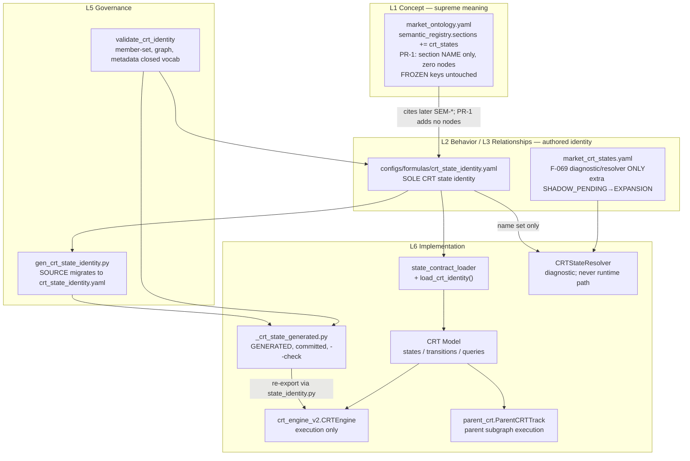

# CRT State Identity Ontology — One Authority, One Runtime

| Field | Value |
|---|---|
| **Title** | CRT State Identity Ontology: YAML owns meaning, engine owns execution |
| **Author** | Grok |
| **Date** | 2026-09-02 |
| **Status** | Draft (user decisions incorporated 2026-09-02); **REVISED 2026-09-03 (constructor-neutral identity, Alternative I) — PR-1 IMPLEMENTED** — see the Revision Note immediately below Overview |
| **Lane** | semantic certification (NOT measurement, NOT economic qualification, NOT implementation) |
| **Grants** | NO G001 · NO promotion · NO live-rail · NO CRT CLOSED · NO production behaviour change |
| **Workspace** | `D:\Tradelatest` |
| **Classification** | Design only. Construction protocol / PR Plan are future work. This turn implements none of them. |
| **User decisions (2026-09-02)** | (1) Identity home = `configs/formulas/crt_state_identity.yaml`, wrap `{ identity: <schema> }`, walk `data["identity"]`. (2) WHO identity keys **kept as DERIVED copy** (not deleted). (3) SEM-* = PR-1 section-name only, zero nodes. |

---

## Overview

> ### REVISION NOTE (2026-09-03) — constructor-neutral identity, PR-1 IMPLEMENTED
>
> This document's original `StateDefinition` (§3 below) mixed constructor-neutral semantics
> (`is_ground`, `can_emit_signal`, `occupancy_class`) with **engine-implementation facts**
> (`handler`, `dispatch`, `htf_protected`, `records_entry_index`, `reset_telemetry`, `ttl_kind`,
> `creates_shadow_on_htf_reset`, `ends_expansion_telemetry_on_enter`). Authored as one flat
> schema, identity became engine-shaped — the resolver could never satisfy it, and a future
> constructor would be born non-conformant. User direction (2026-09-03): CRT identity exists
> **independently** of Engine and Resolver; both are *constructors* of one identity, not
> authorities on it, and Resolver = Runtime is the long-term direction (F-069's 88.16% parity is
> accepted, not disputed — it is evidence two constructors of one identity differ, not a defect
> to close).
>
> The identity file was re-partitioned into **three tiers** — see **Alternative I** below for the
> full rationale, and `configs/formulas/crt_state_identity.yaml` (as shipped) for the concrete
> shape:
>
> - **Tier 1** `identity.states.<NAME>` — semantic core, constructor-neutral (18 fields: `id`,
>   `name`, `sem_id`, `timeframe_role`, `subgraph`, `description`, `occupancy_class`,
>   `requires_memory`, `is_ground`, `can_emit_signal`, `can_emit_bias`, `is_cycle_reset`,
>   `is_one_bar_archive`, `self_loop_legal`, `lifecycle`, `knowledge_status`, `epistemic`, `notes`).
> - **Tier 2** `identity.constructors.<C>.states.<NAME>` — per-constructor bindings. Every field
>   this document's original §3 table called "engine-shaped" moved here verbatim (same names,
>   same values) under `constructors.engine.states.<NAME>`.
> - **Tier 3** `identity.constructors.<C>.capabilities` — the capability contract, and the
>   Resolver = Runtime ledger: `produces_occupancy` / `produces_memory` / `covers_states` /
>   `reaches_signal_state` / `produces_trade_geometry` / `runtime_eligible` / `blocking_gaps`.
>   `blocking_gaps` non-empty mechanically forces `runtime_eligible: false`
>   (`tests/test_crt_state_identity.py::test_blocking_gaps_non_empty_forces_runtime_eligible_false`).
>
> **The resolver's extra edge stops being a rival graph.** `SHADOW_PENDING -> EXPANSION` moves
> from an untyped second `valid_transitions` in another file to a typed, ratcheted
> `constructors.resolver.projection_allowances[0]` entry inside the SAME identity object —
> still absent from `identity.valid_transitions` (KD-5 unchanged), still justified by the same
> two-hop-collapse evidence, but now a delta of one graph instead of a rival graph.
>
> **Load-bearing correction to the premise of "Resolver = Runtime":** parity is NOT the blocker.
> `_continuous_gates_pass` fail-closes `EXECUTION` when `raw.get('score'/'risk_score'/'crt_score')`
> is `None`, and none of those three keys exist in `CANONICAL_FEATURES`
> (`src/features/crt_state_resolver.py:1302-1309`; `reports/crt_semantic_parity_report.md:100`).
> The resolver emits **0 EXECUTION / 0 RESOLUTION on any real vector, by construction**, and has
> no entry/SL/TP geometry at all. Closing the 11.84% construction gap (F-069) touches neither.
> These are now `GAP-RESOLVER-001` / `GAP-RESOLVER-002` on `constructors.resolver.capabilities.
> blocking_gaps` — a machine-checked ledger, not prose, and each gap carries
> `independent_of_f069: true`.
>
> **What did NOT change:** the generator (`gen_crt_state_identity.py`) still reads only
> `identity.{state_list,valid_transitions,parent_timeframe_states}` — `identity.constructors` is
> invisible to it, so PR-3 (source migration) is unaffected by this revision. KD-8 is REFRAMED
> below (marked, not silently rewritten, per CLAUDE.md §6.2 rule 4) — the resolver is a
> *registered constructor, not yet runtime-eligible*, rather than "diagnostic only, forever."
> F-069 itself is not touched, reopened, or re-measured. No authority moves (§6.5 unchanged).
>
> PR-1 as revised is IMPLEMENTED: `configs/formulas/crt_state_identity.yaml`,
> `src/config_layer/crt_identity_schema.py` (`validate_crt_identity`, not wired into
> `CRTEngine.__init__` — KD-16 unchanged), `tests/test_crt_state_identity.py` (52 tests), and
> `configs/formulas/market_ontology.yaml` `semantic_registry.sections += crt_states` (name only,
> zero nodes). Hash-neutral; `gen_crt_state_identity.py --check` unchanged;
> `_crt_state_generated.py` byte-identical. See the plan file this revision was executed from for
> the full verification transcript.

CRT state identity is already *partially* generated — `scripts/maintenance/gen_crt_state_identity.py` emits `CRTState`, `VALID_TRANSITIONS`, `PARENT_TIMEFRAME_STATES`, and `EXECUTION_TIMEFRAME_STATES` from `active_models.yaml:crt.runtime` into `src/config_layer/_crt_state_generated.py` (CH-crt-state-generation-v1, 2026-08-31). That is **generate-Enum-from-YAML**. It removes one duplication (hand-authored enum members) and **does not** remove authority fragmentation.

Measured split-brain (this design, source-verified):

| Surface | What it currently owns | Layer (WHO/HOW/WHAT) |
|---|---|---|
| `configs/formulas/market_ontology.yaml` | Supreme *semantic* authority; `structural_walks` **explicitly refuse** to own `CRTState` / `VALID_TRANSITIONS` (`state_identity.py` stays Tier-0) | WHAT |
| `configs/formulas/market_crt_states.yaml` | Resolver predicates + a *second* `valid_transitions` graph (extra `SHADOW_PENDING → EXPANSION`) | WHAT / RESEARCH shadow |
| `active_models.yaml:crt.runtime` | **Generation source** for enum + graph + parent split; `state_contracts` (WHO ids only) | WHO |
| `src/config_layer/_crt_state_generated.py` | Generated artifact (committed) | L6 |
| `src/config_layer/state_identity.py` | Re-export + governance rationale; still the **import site**; `Direction` / `RejectReason` / `CRTConfig` hand-authored | L6 import façade |
| `src/config_layer/crt_engine_v2.py` | Execution: `try_*` guards + **17 name-matched `CRTState.` branches** in 2 files | HOW execution |
| `src/features/crt_state_resolver.py` | **Second interpreter** of the same 9 M15 names (F-069: 88.16% agreement; 96.1% residual = Category C) | RESEARCH / MARKET REALITY |

The user's named chain started at `market_crt_states.yaml`. That file is the F-069 resolver surface. `gen_crt_state_identity.py:8-17` refuses generation **from that file**, not from a key path: *"Generating from the resolver's file would adopt the divergent side's declaration surface."* A sibling `identity:` key inside the same file is not a firewall (two graphs, same leaf name `valid_transitions`, resolver binds `cfg["valid_transitions"]` at `crt_state_resolver.py:863-871` and ignores extra keys).

**Default home (implementable, no split-brain):** sibling WHAT file `configs/formulas/crt_state_identity.yaml`. User may still choose colocation, but only by merging nest/rename of the resolver graph **in the same change** that adds identity, **before** any generator migration (see Alternatives F/G). This document implements the sibling-file default.

```
market_ontology.yaml                 (supreme MEANING: cites; PR-1 = section name only)
        │ cites, does not duplicate the graph, holds no edges
        ▼
configs/formulas/crt_state_identity.yaml
        SOLE authored CRT state identity
        (members, engine graph, timeframe_role, metadata)
        │
        ├──────────────────────────────────────────┐
        ▼                                          ▼
Ontology Loader                            market_crt_states.yaml
(extend state_contract_loader;             F-069 diagnostic/resolver ONLY
 NO second loader family)                  extra SHADOW_PENDING→EXPANSION
        │                                  stays here on purpose
        ▼
CRT Model
        │
        ▼
CRT Engine v2  (execution only; consumes metadata, not name-equality)
        │
generated _crt_state_generated.py   (ONE-WAY YAML → artifact; never hand-edited)
```

YAML owns **all CRT meaning** — in the identity file, not in the resolver file. The engine owns **how a state is evaluated at runtime**. The Enum remains a generated artifact whose *authored source* moves from the WHO file (`active_models.yaml`) to the WHAT identity file. WHO keeps a **derived** copy of `state_list` / `valid_transitions` / `parent_timeframe_states` (user decision 2026-09-02). The resolver stays diagnostic-only (F-069: do not build a second interpreter, and do not promote the existing one). Generator reads **only** `crt_state_identity.yaml` and emits the WHO projection; a mutation test fails if it binds `market_crt_states.yaml` or that file's top-level `valid_transitions`.

This design **rejects** "delete engine logic and execute directly from YAML". Both `market_ontology.yaml` (`formula` / `condition` never `eval`'d; `CONFIG-DECLARED, CODE-EXECUTED`) and `market_crt_states.yaml` ("The CRT engine remains the EXECUTION authority") already forbid it.

---

## Background & Motivation

### Why this change is needed

The north star is:

```
One ontology
One authority
One runtime
No split brain
No duplicated definitions
```

"Generate Enum from YAML" is already shipped and is **not** that north star. The generator's own docstring records the downgrade it caused: `tests/test_crt_state_invariants.py` and `state_contract_loader._validate_transition_graph` became **freshness checks** on a generated artifact, not independent cross-record drift detectors, because both sides now derive from `active_models.yaml` (`scripts/maintenance/gen_crt_state_identity.py:50-55`, `state_contract_loader.py:142-146`).

Identity authorship currently sits in the **WHO** file. Meaning supremacy sits in the **WHAT** ontology, which then *disclaims* CRTState identity (`market_ontology.yaml:191-192`: "Does NOT redeclare CRTState identity or VALID_TRANSITIONS — state_identity.py stays the Tier-0 authority"). The resolver file carries a third graph. The engine still name-matches. That is four authorities for one noun.

### Current state (verified, not copied from the prompt)

**Already in YAML (verified):**

- `active_models.yaml:crt.runtime.state_list` — 12 names, load-bearing order.
- `active_models.yaml:crt.runtime.valid_transitions` — engine graph (no `SHADOW_PENDING → EXPANSION`).
- `active_models.yaml:crt.runtime.parent_timeframe_states` — `[RANGE_C1, MANIPULATION_C2, DISTRIBUTION_C3]`.
- `active_models.yaml:crt.runtime.state_contracts` — WHO only: `required_fm` / `config_keys` / `eligible_models`. Fail-closed on extra keys (`state_contract.py:22-24`).
- `market_crt_states.yaml:states` — 9 M15 predicate blocks (`EXECUTION` … `RANGE`); **no** `RANGE_C1` / `MANIPULATION_C2` / `DISTRIBUTION_C3` state *definitions*.
- `market_crt_states.yaml:valid_transitions` — 9 M15 + 3 parent edges; **plus** `SHADOW_PENDING: [SWEEP, EXPANSION, RANGE]`.

**Still in Python (verified):**

- `CRTState` Enum — generated, but *consumed as a name-matched type*.
- `PARENT_TIMEFRAME_STATES` / `EXECUTION_TIMEFRAME_STATES` — generated partition.
- `Direction`, `RejectReason`, `CRTConfig`, `_VALID_KILL_PRECEDENCE` — hand-authored in `state_identity.py` (explicitly out of generation).
- Runtime state semantics — `try_*` methods, `process_candle` dispatch, `ParentCRTTrack.on_parent_close`.

**Still in the engine (verified):**

- Transition *execution* (`StateMachine._transition` fail-closed against the loaded graph).
- Detector / guard algorithms (`RangeDetector.detect_sweep`, `try_sweep_to_displacement`, …).
- Lifecycle (HTF/gap reset, shadow TTL, expansion TTL, soft-confirmation flag).

**Authority still distributed (verified):** `active_models.yaml` + `state_identity.py` (façade) + `crt_engine_v2.py` + `market_crt_states.yaml` + `market_ontology.yaml` (disclaimer) + FileIdentity `crt.state_topology` (still claims `state_identity.py` *owns* CRTState).

### Measured branch-site count (user claimed 16 in 2 files)

Grep of `== CRTState.` / `in [CRTState.` / `elif s == CRTState` under `src/` produced **17 matching lines in 2 files**. The count differs from 16; every site is listed in [API / Interface Changes](#api--interface-changes) and the Source Coverage Appendix. Classification:

| Class | Count | Meaning |
|---|---:|---|
| M15 `process_candle` dispatch (`if s == CRTState.X`) | 6 | RANGE, SHADOW_PENDING, SWEEP, DISPLACEMENT, EXPANSION, EXPIRED |
| Parent `on_parent_close` dispatch | 3 | RANGE_C1, MANIPULATION_C2, DISTRIBUTION_C3 |
| Parent bias gate | 1 | `DISTRIBUTION_C3` → `Direction` |
| `_transition` entry-index / telemetry side effects | 3 | DISPLACEMENT, EXPANSION, RETEST |
| `reset_to_range` telemetry / shadow-create | 3 | DISPLACEMENT ×2, EXPANSION |
| HTF-protect set | 1 | `in [EXPANSION, RETEST]` |
| **Total** | **17** | |

Absent from name-match dispatch (load-bearing for metadata design):

- `CRTState.RETEST` is **not** a `process_candle` `s ==` branch. Soft-confirmation runs on `elif self.state.evaluating_soft_conf` (`crt_engine_v2.py:3262`).
- `CRTState.EXECUTION` is **not** a `s ==` branch. Open-trade handling runs on `state.active_trade` *before* the state-machine switch (`:2930-2955`).
- `CRTState.RESOLUTION` is not dispatched; `try_execution_to_resolution` + immediate `reset_to_range` consume it.

A schema that only generates enum *names* cannot retire those 17 sites. A schema that carries **consumable metadata** (`htf_protected`, `records_entry_index`, `dispatch`, `can_emit_signal`, `can_emit_bias`, `ttl_applies`, `creates_shadow_on_htf_reset`) can.

### Pain points

1. **Adding a state is a multi-file ritual** even after generation: YAML identity + WHO `state_contracts` (required three fields) + resolver `states:`/`valid_transitions:` + engine `if s ==` + parent track + tests + FileIdentity/CN/BD/topic citations. The generator only collapsed the enum/graph/partition slice.
2. **Three graphs, one declared difference.** Engine/generated: `SHADOW_PENDING → {SWEEP, RANGE}`. Resolver YAML: adds `EXPANSION`. Pinned as a deliberate per-bar exit-state projection (`tests/test_crt_states_yaml_transition_parity.py:19-35`), not a bug — and therefore proof that "the YAML graph" is not one object.
3. **Second interpreter.** F-069: config-only resolver vs engine = 88.16% (41,607/47,197); residual 96.1% Category C (divergent EXPANSION-entry construction). Closing it by threshold-tuning is structurally unreachable. Promoting the resolver, or generating identity *from* `market_crt_states.yaml`'s current `valid_transitions`, would adopt the divergent side (`gen_crt_state_identity.py:8-17` already refuses this).
4. **WHO cannot carry meaning.** `parse_state_contract` rejects any field outside `{required_fm, config_keys, eligible_models}`. The generator considered per-state `description:` and **rejected** it because it would raise at every `CRTEngine()` construction (`gen_crt_state_identity.py:38-42`). Metadata has no legal home today.
5. **DOC_DRIFT on ownership.** FileIdentity `crt.state_topology` still says `state_identity.py` *owns* CRTState (`file_identities.yaml:1123-1135`). Code says it re-exports a generated module from `active_models.yaml`. Ontology walks say `state_identity.py` stays Tier-0. Three stories, one type.

---

## Goals & Non-Goals

### Goals

1. **One authored identity** for CRT states: existence, order, classification (`timeframe_role`), transition graph, and engine-consumable metadata.
2. **One runtime.** Ontology → CRT Model → CRT Engine v2. Resolver remains an observation/diagnostic consumer of the *same* identity names, never a parallel runtime path.
3. **Metadata, not name-matching.** Engine classification queries (`is_parent`, `htf_protected`, `can_emit_signal`, `ttl_applies`, …) read `model.states[state]`. `try_*` algorithms stay Python.
4. **One-way generation.** YAML identity → generated `CRTState` / `VALID_TRANSITIONS` / partition. Artifacts are not edited by hand. Bidirectional YAML ↔ Enum authority is forbidden.
5. **Fail-closed load (from PR-3).** Missing identity, extra state, illegal edge, stale generated hash, or eval-shaped identifier → raise. Never silent default. PR-2 validates in tests/hold only — not `CRTEngine.__init__`.
6. **Preserve the frozen-runtime constraint.** New node types live in non-frozen sibling sections. Production behaviour still cascades through parity-proof + promotion. This design does not mutate frozen ontology keys (`id`/`impl`/`formula`/…).
7. **Reuse loaders.** Extend `state_contract_loader._load_yaml`. Do not invent a second loader family. Do not parse identity via `features.registry._loader.load_ontology` or Semantic OS fail-open `load_ontology`.

### Non-Goals (hard)

- **Not** deleting `try_*` / `RangeDetector` / soft-confirmation / TTL and executing predicates from YAML via `eval`. Rejected by ontology (`CONFIG-DECLARED, CODE-EXECUTED`; `condition` never executed) and by `market_crt_states.yaml` header (engine = EXECUTION authority).
- **Not** generating from the resolver's current `valid_transitions` (would adopt `SHADOW_PENDING → EXPANSION` as identity).
- **Not** collapsing M15 `RANGE` with parent `RANGE_C1`, or `DISTRIBUTION_C3` with `HTFState.DISTRIBUTION` (F-077 / `htf_state.py:4-20`).
- **Not** adding `HTFState` / `ObjectiveStatus` members to `CRTState`.
- **Not** moving `Direction`, `RejectReason`, `CRTConfig`, or `_VALID_KILL_PRECEDENCE` in Phase 1–3 (Phase 4 scope; see Open Questions).
- **Not** retuning SEM-031 / F-095. Sujan is out of scope (no CRTState-consumer hit required a Sujan identity change).
- **Not** CRT recertification, G001, promotion, live-rail, or flipping `market_reality_v1.yaml:crt_state.enabled`.
- **Not** a second doctrine file. Cite CLAUDE.md §6.6 / §6.5; do not copy them.
- **Not** implementing any PR in this turn.

---

## Proposed Design

### Architecture



```mermaid
sequenceDiagram
  participant YAML as crt_state_identity.yaml
  participant Loader as state_contract_loader
  participant Model as CRT Model
  participant Eng as CRTEngine.process_candle
  participant SM as StateMachine.try_*
  participant Parent as ParentCRTTrack

  YAML->>Loader: load_crt_identity() (PR-2: tests/hold; PR-3+: engine init)
  Loader->>Loader: member-set == generated CRTState
  Loader->>Loader: graph == generated VALID_TRANSITIONS
  Note over Loader: sha256 stamp is PR-3 only
  Loader->>Model: CRTModel(states, transitions, queries)
  Eng->>Eng: prelude 1: HTF/gap reset then fall through
  Eng->>Eng: prelude 2: if active_trade OPEN/TP1 then manage/return
  Eng->>Eng: prelude 3: if evaluating_soft_conf then manifold
  Eng->>Model: defn = model.definition(s)
  alt defn.dispatch == state_eq
    Eng->>SM: bound process_* still Python try_*
  else defn.dispatch == none
    Note over Eng: occupancy only (RETEST/EXECUTION/RESOLUTION)
  end
  SM->>SM: _transition allowed by model.is_legal(src, dst)
  Parent->>Parent: prelude: if _range is None then _become_c1
  Parent->>Model: is_legal then process_c1/c2/c3
  Note over Eng,Parent: NEVER eval YAML when-blocks
```

### Authority reconstruction (increasing keyword strength)

Keyword strength, as grepped, from weakest description to strongest prohibition:

| Strength | Quote (truncated) | File | Maps to |
|---|---|---|---|
| descriptive | "This is a MARKET REALITY layer — it runs alongside the CRT engine, not replacing it." | `crt_state_resolver.py:10-11` | L2 observation |
| split declared | "The CRT engine (crt_engine_v2.py) remains the EXECUTION authority for live trading." | `market_crt_states.yaml:21-22` | L2 vs L6 |
| WHO vs WHAT | "active_models.yaml = WHO … configs/formulas/*.yaml = WHAT" | `market_ontology.yaml:5-7` | L1 |
| generation already | "so the ontology is the single authored source for state IDENTITY" — but the file it names is `active_models.yaml` | `state_identity.py:21-25` | L6 / split-brain |
| refused home | "Per-state descriptions were considered for the ontology and REJECTED … `state_contracts` … fail-closed on unknown fields" | `gen_crt_state_identity.py:38-42` | L5 |
| refused source | "Generating from the resolver's file would adopt the divergent side's declaration surface" | `gen_crt_state_identity.py:14-17` | L5 REJECTS Alt A-from-resolver |
| supreme meaning | "The ontology is the SUPREME semantic authority … LITERAL SUPERSESSION — authority #1" | `market_ontology.yaml:142-144` | L0/L1 |
| walks do not own identity | "Does NOT redeclare CRTState identity or VALID_TRANSITIONS — state_identity.py stays the Tier-0 authority" | `market_ontology.yaml:191-192` | L3 CONSTRAINS: walks ≠ identity |
| never eval | "the `formula` strings below are the human/LLM-readable AUTHORITY for what each quantity MEANS; the single authority for HOW it is COMPUTED is the named Python callable … NEVER `eval`'d" | `market_ontology.yaml:12-15` | REJECTS execute-from-YAML |
| never eval (states) | "`condition` is documentation, NEVER eval'd, same rule as `formula`" | `market_ontology.yaml:130-136` | REJECTS execute-from-YAML |
| F-069 | "The residual is declared structurally config-unreachable" | `reports/crt_semantic_parity_report.md:119` | L4 REJECTS second interpreter as runtime |
| FileIdentity | "This module ENFORCES transitions; it does not define them." | `file_identities.yaml:1087-1089` | L6 engine role SUPPORTS |
| CN-004 | "Resolver parity with the engine may be incomplete by construction (F-069) — engine is authority for trades." | `concepts.yaml:437` | L1 SUPPORTS |
| Semantic OS | "Humans write meaning; machines write derived facts." | `SEMANTIC_OS_CONTRACT.md:36` | L0 SUPPORTS one-way generation |
| §6.5 | Evidence ≠ production authority. This design grants none. | CLAUDE.md §6.5 (cite, not paste) | L5 |

**Reconstructed chain (this design):**

```
L0 Identity     CRT state is a MarketStructure identity_kind (SEMANTIC_OS_V1_DESIGN.md:112)
L1 Concept      market_ontology.yaml supreme for MEANING; crt_states section name in PR-1 (zero nodes until SEM-* allocated)
L2 Behavior     crt_state_identity.yaml states.<NAME> metadata + engine try_* (execution)
L3 Relationships crt_state_identity.yaml valid_transitions SOLE identity graph; parent/execution partition
L4 Evidence     F-069, parity floors, generated-parity anchor
L5 Governance   validators, --check, promotion still required for behaviour
L6 Implementation generated types + crt_engine_v2 / parent_crt execution only
```

Principle: **Meaning is declared once. Execution consumes meaning. One meaning, one authority, many consumers.**

### Where identity lives (default: sibling WHAT file)

The current generator chose `active_models.yaml` because it is already fail-closed into `CRTEngine.__init__`. That was the right *wiring* choice and the wrong *authority* choice:

- `active_models.yaml` is WHO (`market_ontology.yaml:5`).
- Identity is meaning (WHAT).
- WHO `state_contracts` **cannot** grow metadata (fail-closed allowed-keys).
- Ontology is supreme for meaning, but its frozen keys cannot hold a new graph (constraint 1), and `structural_walks` are forbidden from becoming a third graph (`market_ontology.yaml:4993-4998`).
- `market_crt_states.yaml` is the resolver's file. The generator refuses it **at file level** (`gen_crt_state_identity.py:8-17`). Colocating identity as a sibling key leaves the divergent top-level `valid_transitions` (`SHADOW_PENDING → EXPANSION` at line 249) as the resolver's required binding (`crt_state_resolver.py:863-871` requires that key and does not fail on extras).

**Default (this document):** `configs/formulas/crt_state_identity.yaml` — a new WHAT sibling file. Document root is **exactly** `{ identity: <schema> }` (one wrapping `identity:` key; `additionalProperties: false` at file root). Generator and loader walk `data["identity"]`. Missing `identity` fail-closes — the firewall if the generator is pointed at `market_crt_states.yaml`. `market_crt_states.yaml` remains the F-069 diagnostic surface; its extra `SHADOW_PENDING → EXPANSION` edge stays there **on purpose**. Ontology `semantic_registry.sections` gains `crt_states` as a non-frozen sibling **name** in PR-1 (zero nodes; no CRT-S-* in the ontology namespace; no edges). `active_models.yaml:crt.runtime.state_list` / `valid_transitions` / `parent_timeframe_states` remain after PR-3 as a **DERIVED freshness projection** of `crt_state_identity.yaml` (user decision 2026-09-02 — not independently authored; fail-closed equal to identity and to the generated artifact). `state_contracts` stay authored in WHO.

**Mechanical firewall (not a comment):**

1. Generator `SOURCE_YAML` = `configs/formulas/crt_state_identity.yaml` only. Walk is `data["identity"]` (then `["valid_transitions"]` on that mapping). Missing `identity` fail-closes.
2. Mutation test: fail if the generator's source path basename is `market_crt_states.yaml` **or** if the walk binds **top-level** `valid_transitions` (that is the resolver-file bind). The correct walk is never top-level `valid_transitions`.
3. Ratchet: `SHADOW_PENDING → EXPANSION` exists only in `market_crt_states.yaml`. `test_crt_states_yaml_transition_parity.py` continues to pin **resolver file vs identity file** (that is the declared difference). Identity file must **not** contain that edge.
4. Colocation is Alternative G, not the default. User confirmed Alternative F (2026-09-02).
5. WHO identity keys after PR-3: **derived copy, not deleted.** Generator **reads** `crt_state_identity.yaml` only. The same generator (or a second writer it invokes) **emits** `active_models.yaml:crt.runtime.{state_list,valid_transitions,parent_timeframe_states}` so the two cannot drift. YAML comment on those keys: `DERIVED FROM crt_state_identity.yaml`. Independent hand-edit of WHO identity keys fails `--check` / `test_crt_state_invariants.py`. `state_contracts` stay authored in WHO.

### Engine consumption pattern (target)

Today:

```python
if s == CRTState.RANGE:
    ...
elif s == CRTState.SHADOW_PENDING:
    ...
```

**Process-level preludes stay in Python** (`process_candle` `:2841+`). They are **not** occupancy dispatch:

1. HTF/gap `should_reset` then **fall through** (`:2892-2908`) — including the OPEN-trade abort that STOP+resets then continues into RANGE on the same candle. Unstated invariant `OPEN/TP1 ⇒ current_state == EXECUTION` is **not** proven (reset can clear state while a just-STOPPED trade is no longer OPEN). Do not fold this into `EXECUTION.dispatch`.
2. Active-trade interrupt (`:2911-2955`) runs **before** `s = self.state.current_state` and **returns** on close. Occupancy `EXECUTION` is not the predicate.
3. Soft confirmation (`:3262`) is `elif self.state.evaluating_soft_conf`, **after** the `s ==` chain. RETEST with the flag false is a no-op. Same-candle EXPANSION→RETEST sets the flag inside the EXPANSION branch (`:3174-3177`) and does not fall through. Do not re-dispatch on the new state in the same call.

Target occupancy dispatch (after the three preludes):

```python
# classification without name-matching (PR-4) — ResetLogic and ParentCRTTrack
# receive CRTModel (or a narrow query view) in their constructors:
if model.htf_protected(state.current_state):
    return False, ""
if model.can_emit_bias(self._state) and self._sweep is not None:
    return self._sweep.direction
if model.reset_telemetry(state.current_state) == "displacement_age":
    _disp_age = candle.index - state._displacement_entry_idx
elif model.reset_telemetry(state.current_state) == "candidate_age":
    _cand_age = state._expansion_entry_idx - state._displacement_entry_idx

# occupancy dispatch (PR-5) — M15, after preludes
defn = model.definition(s)
if defn.dispatch == "state_eq":
    handler = self._handlers[defn.handler]  # process_range / process_sweep / ...
    handler(candle)
# defn.dispatch == "none" → occupancy only (RETEST, EXECUTION, RESOLUTION)
```

Parent track is a **different process** (`on_parent_close`), not an `alt` arm of `process_candle`:

```python
# ParentCRTTrack.on_parent_close — process-level prelude, not dispatch
if self._range is None:
    self._become_c1(parent)          # first candle ever
    return self._state
defn = model.definition(self._state)
handler = self._handlers[defn.handler]  # process_c1 / process_c2 / process_c3
# each handler assigns via model.is_legal(src, dst) then self._state = dst
# ParentCRTTrack does NOT call StateMachine._transition (M15-only today)
```

`handler` names are **Python method identifiers**, not YAML expressions. YAML may say `handler: process_sweep`; it may not say `handler: "abs(close-open)"`. Phase 1 ships a **planned-name allowlist** (methods need not exist yet). Phase 5 extracts the methods and fail-closes on missing attributes.

### Resolver posture (F-069)

`CRTStateResolver` is confirmed a **second interpreter**:

- Own config: `market_crt_states.yaml` (`crt_state_resolver.py:15-16, 96`).
- Own sequencing + own graph (SK-1 comment: "deliberately untouched — the F-069 construction difference stays OPEN", `:88-90`).
- `market_reality_v1.yaml:crt_state.enabled: false` — already fail-closed shadow-only (`:326`).
- F-069: 88.16% config-only; Category C 96.1% of residual; structurally config-unreachable.

Design rule: the resolver **may** remain as OBSERVATION / DIAGNOSTIC. It **must not** invent a 13th state: PR-1 floor `every market_crt_states.yaml states[].name ∈ identity.state_list` (9 ⊆ 12 today). Identity may have parent names the resolver does not define. Resolver does **not** load the identity file at runtime in PR-1 — the test is the join. It **must not** be a parallel runtime path, an engine-oracle with `engine_state_to=` injection in production, or the generation source. `src/runtime/crt_construction_trace.py:7-9` currently calls the resolver YAML **"the declarative MEANING layer"** — that docstring is the old split-brain; PR-7 retitles it as a diagnostic JOIN (resolver occupancy ≠ meaning).

---

## Data Model / Schema

This is the load-bearing section. An engineer should be able to implement the YAML without inventing fields.

### 0. File layout and frozen-runtime constraint

| File | Role after this design | Frozen? |
|---|---|---|
| `configs/formulas/market_ontology.yaml` | Supreme meaning. PR-1 adds section **name** `crt_states` under `semantic_registry.sections` with **zero nodes**. Frozen keys unchanged. | Frozen keys stay FLAT + additive |
| `configs/formulas/crt_state_identity.yaml` | **SOLE authored CRT identity** (new file). Document root is `{ identity: <schema> }`. Generator/loader walk `data["identity"]`. | Not a frozen-runtime file |
| `configs/formulas/market_crt_states.yaml` | F-069 diagnostic/resolver ONLY. Top-level `states` / `valid_transitions` / `thresholds` unchanged as the resolver binding. Extra `SHADOW_PENDING → EXPANSION` stays. PR-6 may nest under `resolver:` later; **not** a PR-3 blocker under the sibling-file default. | Not a frozen-runtime file |
| `active_models.yaml` | WHO: `state_contracts` stay **authored**. After PR-3, `state_list` / `valid_transitions` / `parent_timeframe_states` are a **DERIVED** freshness projection of `crt_state_identity.yaml` (comment: `DERIVED FROM crt_state_identity.yaml`). Never independently edited. Fail-closed equal to identity + generated artifact. | WHO |
| `src/config_layer/_crt_state_generated.py` | GENERATED artifact | Do not hand-edit |
| `src/config_layer/state_identity.py` | Import façade + rationale + `Direction`/`RejectReason`/`CRTConfig` | Hand-authored remainder |

The identity file does not nest inside resolver `states:`. It does not live in `state_contracts` (WHO, fail-closed). It does not live in `structural_walks` (explicitly not a second graph). It does not live in `market_crt_states.yaml` (generator file-level refusal).

Loader default path: `configs/formulas/crt_state_identity.yaml`. utf-8 (`io.open(..., encoding="utf-8")`, same as the generator). Walk `data["identity"]` (fail-closed if missing). Identity load **re-reads** its own file via `state_contract_loader._load_yaml`; it does **not** share the resolver's parsed dict and it does **not** go through `features.registry._loader.load_ontology` or Semantic OS fail-open `load_ontology`.

### 1. Closed vocabularies

```text
timeframe_role:     parent_timeframe | execution_timeframe
subgraph:           m15_execution | parent_three_candle
dispatch:           state_eq | parent_track | none
                    # flag_evaluating_soft_conf and active_trade are NOT occupancy
                    # dispatch values. They are process-level preludes in Python.
ttl_kind:           none | pending_displacement | expansion_age
reset_telemetry:    none | displacement_age | candidate_age
                    # mutually exclusive leave-path telemetry on reset_to_range
occupancy_class:    ground | event | memory | trade | archive
knowledge_status:   UNKNOWN | OBSERVED | CHARACTERIZED | MATHEMATICALLY_DEFINED
                    | FORMULA_DERIVED | VALIDATED
                    # PRODUCTION_CERTIFIED and STABLE are ontology/G001 rungs.
                    # Identity schema FORBIDS them (this program cites no G001).
lifecycle:          proposed | research | registered | parity_verified | consumable | deprecated
handler allowlist:  null | process_range | process_shadow_pending | process_sweep
                    | process_displacement | process_expansion | process_expired
                    | process_c1 | process_c2 | process_c3
                    # planned names; methods need not exist until PR-5
```

**Term choice: `timeframe_role`, not `layer`.** Sources name the split `PARENT_TIMEFRAME_STATES` / `EXECUTION_TIMEFRAME_STATES` and "parent-timeframe" / "execution-timeframe" (`state_identity.py:103-123`, `active_models.yaml:143-153`, F-075). `layer` collides with Semantic OS L0–L6 and with `market_reality_v1.yaml`'s "Layer-5 CRT state dimension". `category` is too weak (FileIdentity already uses `semantic_category`). `timeframe_role` is the repo's actual split and refuses the M15-RANGE / RANGE_C1 collapse.

`EXECUTION_TIMEFRAME_STATES` is **not authored**. It is the derived complement (`_crt_state_generated.py:71-73`). The schema repeats that rule.

### 2. File shape: wrap everywhere

`crt_state_identity.yaml` document root is **exactly** `{ identity: <schema> }`. There is no bare-root form. Generator and loader walk `data["identity"]`. Missing `identity` fail-closes. JSON Schema for the inner mapping applies to `doc["identity"]`. File-root schema: `{ required: [identity], additionalProperties: false }`.

The inner mapping (under `identity:`) has these keys:

```yaml
schema: crt_state_identity/v1      # required string, closed
version: 1                         # required int >= 1
authority: user_approved           # required closed vocab; documentary; grants no G001
generated_artifact: src/config_layer/_crt_state_generated.py
generator: scripts/maintenance/gen_crt_state_identity.py
# identity_sha256 is WRITTEN BY THE GENERATOR into the artifact header (PR-3),
# not authored here. PR-2 does not compare a stamp that does not exist yet.

state_list: []                     # required, ordered, unique, SCREAMING_SNAKE
# Order is LOAD-BEARING: Enum auto() values 1..N. Reordering renumbers .value
# (pinned by tests/test_crt_state_generated_parity.py).

parent_timeframe_states: []        # required subset of state_list; the ONLY authored partition
# execution_timeframe_states MUST NOT appear. Derived = state_list minus this set.

valid_transitions: {}              # required: every state_list name is a key
                                   # values: list of state_list names, unique, order stable
                                   # SOLE identity graph = engine graph, NOT resolver projection

states: {}                         # required mapping name -> StateDefinition
                                   # keys == set(state_list) exactly
```

**Root constraints (fail-closed):**

| Rule | On violation |
|---|---|
| `schema == "crt_state_identity/v1"` | `CRTIdentityError` |
| `authority == "user_approved"` | closed vocab (documentary; not a promotion grant) |
| `len(state_list) == len(set(state_list))` | duplicate names |
| `set(valid_transitions) == set(state_list) == set(states)` | incomplete identity set (mirrors `state_topology.py:83-91`) |
| every transition target ∈ `state_list` | undeclared state |
| `parent_timeframe_states ⊆ state_list` | unknown parent name |
| `parent_timeframe_states ∩ execution_derived = ∅` and union = `state_list` | partition broken |
| no edge with `timeframe_role` crossing parent ↔ execution | disjoint-subgraph invariant (F-075) |
| `RANGE_C1` self-loop allowed; M15 `RANGE` self-loop forbidden unless declared | explicit |
| identifier fields (`id`, `name`, `reset_target`, `handler`, `state_list` members, transition endpoints, `sem_id` when not null) reject `= * / ( )` whitespace | WHO-id injection guard (`state_contract.py:109-113`) scoped to **identifiers only** |
| `description`, `notes`, `epistemic.*` **exempt** from the injection guard | prose may contain `(F-074)`, `h_ref/l_ref`, etc. |
| `when:` / `condition:` / `formula:` **forbidden** at identity root and under `states.*` | those belong to resolver / ontology, never identity |
| extra keys under a StateDefinition | fail-closed (closed field set) |
| `knowledge_status` ∈ identity enum (no `PRODUCTION_CERTIFIED` / `STABLE`) | G001 lock — this program cites none |
| `SHADOW_PENDING → EXPANSION` absent from this file | ratchet; that edge lives only on the resolver surface |

Negative test (must pass): `description` containing `(F-074)` is legal. Positive test (must fail): `handler: "abs(close-open)"`.

### 3. `StateDefinition` — every field

Every state in `states` **must** carry every field below. Never omit a key.

**Empty-values rule (identity's own, not the ontology's):** identifiers are required strings; optional links use YAML `null`; lists use `[]`; bools use `true`/`false`; never a bare key. This is **not** `market_ontology.yaml:79-81` (that contract is `always [] — never null` because `entry.get("states", [])` returns None). Identity YAML is **not** parsed by `load_ontology`. Do not reuse that helper.

`id: CRT-S-<NAME>` is a **local identity-schema handle** inside `crt_state_identity.yaml` only. It is **not** a `semantic_registry` id. Do not insert `CRT-S-*` into `market_ontology.yaml` (single namespace there is FM-0NN + SEM-/UNK-; `validate_semantic_registry` / `test_no_duplicate_ids_across_all_sections`). `sem_id` stays `null` until a later PR allocates a real `SEM-*`.

| Field | Type | Required | Default | Constraint | Why it exists (source) |
|---|---|---|---|---|---|
| `id` | string | yes | — | `CRT-S-<NAME>`; unique in this file; **not** an ontology id | Stable handle inside the identity document |
| `name` | string | yes | — | Must equal mapping key and a `state_list` entry | Identity |
| `sem_id` | string or `null` | yes | `null` | If set, must be an existing SEM-/UNK- in `semantic_registry` | Optional future link; do not invent SEM ids |
| `timeframe_role` | enum | yes | — | `parent_timeframe` \| `execution_timeframe` | `PARENT_TIMEFRAME_STATES` / `EXECUTION_TIMEFRAME_STATES` |
| `subgraph` | enum | yes | — | `m15_execution` \| `parent_three_candle` | SP-010 vs SP-011 (`market_ontology.yaml:5005-5042`) |
| `description` | string | yes | — | prose; injection-guard **exempt** | Generator currently keeps this in `state_identity.py` comments |
| `occupancy_class` | enum | yes | — | closed vocab | Distinguishes RANGE (ground) from EXECUTION (trade) from EXPIRED (archive) |
| `requires_memory` | bool | yes | — | — | Already on resolver `states:` (`market_crt_states.yaml:105-107`) |
| `is_ground` | bool | yes | — | exactly one ground per subgraph | RANGE, RANGE_C1 |
| `can_emit_signal` | bool | yes | `false` | only EXECUTION is `true` today | TRADE_OPENED commitment (`concepts.yaml:442`) |
| `can_emit_bias` | bool | yes | `false` | only DISTRIBUTION_C3 is `true` today | `parent_crt.py:102-110` |
| `is_cycle_reset` | bool | yes | `false` | RESOLUTION is `true`; not a dead-end | `active_models.yaml:137`, `test_crt_state_invariants.py:61-62` |
| `is_one_bar_archive` | bool | yes | `false` | EXPIRED is `true` | `market_crt_states.yaml:199-206`, `crt_engine_v2.py:3255-3259` |
| `ttl_applies` | bool | yes | `false` | — | RANGE ticks pending-displacement TTL; EXPANSION has expansion-age TTL. SHADOW_PENDING does **not** tick TTL (F-068). |
| `ttl_kind` | enum | yes | `none` | if `ttl_applies` then not `none` | Distinguishes the two TTL machines |
| `htf_protected` | bool | yes | `false` | EXPANSION, RETEST | `ResetLogic.should_reset` `in [EXPANSION, RETEST]` (`crt_engine_v2.py:2580`) |
| `htf_protect_via_active_trade` | bool | yes | `false` | EXECUTION | `should_reset` returns false if `active_trade` OPEN/TP1 (`:2574-2575`) — not a state-set membership |
| `creates_shadow_on_htf_reset` | bool | yes | `false` | DISPLACEMENT | `reset_to_range` `_create_shadow` (`:1893-1897`) |
| `records_entry_index` | bool | yes | `false` | DISPLACEMENT, EXPANSION | `_transition` **entry** recording `:1036-1039` only. Does **not** encode reset telemetry. |
| `records_entry_timestamp` | bool | yes | `false` | EXPANSION | `_transition` `:1040` |
| `ends_expansion_telemetry_on_enter` | bool | yes | `false` | RETEST | `_transition` `:1043-1051` |
| `reset_telemetry` | enum | yes | `none` | `none` \| `displacement_age` \| `candidate_age`; at most one of the two age arms is true per state | `reset_to_range` leave-path telemetry `:1859` vs `:1880` — mutually exclusive; sharing `records_entry_index` would change `on_reset` payloads |
| `reset_target` | string | yes | — | must be a `state_list` name | RANGE (execution subgraph), RANGE_C1 (parent subgraph) |
| `dispatch` | enum | yes | — | `state_eq` \| `parent_track` \| `none` | Occupancy dispatch only. Preludes (active-trade, soft-conf, `_range is None`) stay Python. |
| `handler` | string or `null` | yes | `null` | Phase-1 allowlist (planned names or `null`). `null` iff `dispatch == none`. Unknown strings fail. Methods need not exist until PR-5. | Binds metadata to **extracted** process_* / process_c* methods, not to `on_parent_close` as a whole |
| `self_loop_legal` | bool | yes | `false` | RANGE_C1 is `true` | `VALID_TRANSITIONS` RANGE_C1 → RANGE_C1; M15 RANGE has no self-loop |
| `lifecycle` | enum | yes | `registered` | ontology lifecycle vocab | Verification maturity, not usage |
| `knowledge_status` | enum | yes | `CHARACTERIZED` | identity ladder (no PRODUCTION_CERTIFIED / STABLE) | Meaning axis. G001 is not earned here. |
| `epistemic` | mapping or `null` | yes | `null` | required if `knowledge_status` in `{UNKNOWN, OBSERVED}` | Evolution contract |
| `notes` | string | yes | `""` | prose; injection-guard **exempt** | Governance rationale currently trapped in `state_identity.py` comments |

**Forbidden fields under `states.*`:** `when`, `condition`, `formula`, `eval`, `code`, `thresholds`, `required_fm`, `config_keys`, `eligible_models`. Those belong to resolver / HOW / WHO respectively.

**The 17-site table is not a 1:1 field map.** Classification/entry fields retire the sites they name. Reset telemetry is a **separate** field. Occupancy dispatch does not retire process-level preludes. Parent `on_parent_close` name-matches are retired only by **distinct** `process_c1` / `process_c2` / `process_c3` handlers extracted in PR-5, plus `model.is_legal` on assignment.

**`epistemic` block** (when present; mandatory for UNKNOWN/OBSERVED — `MARKET_ONTOLOGY_EVOLUTION_CONTRACT.md:58-74`):

```yaml
epistemic:
  observation: ""                 # measured facts
  known_invariants: []            # validated
  unknown_mechanism: ""           # the one open question
  candidate_hypotheses: []        # untested, never truth
  resolution_metric: ""
  falsification_conditions: []
```

### 4. Complete identity example (all 12 states)

This is the intended contents of `configs/formulas/crt_state_identity.yaml` after Phase 1 (document root has the `identity:` mapping so the generator walk is `data["identity"]["valid_transitions"]` — a missing `identity` key fail-closes if the generator is accidentally pointed at the resolver file). Values are transcribed from measured engine behaviour, not invented unused knobs.

```yaml
identity:
  schema: crt_state_identity/v1
  version: 1
  authority: user_approved
  generated_artifact: src/config_layer/_crt_state_generated.py
  generator: scripts/maintenance/gen_crt_state_identity.py

  state_list:
    - RANGE
    - SHADOW_PENDING
    - SWEEP
    - DISPLACEMENT
    - EXPANSION
    - EXPIRED
    - RETEST
    - EXECUTION
    - RESOLUTION
    - RANGE_C1
    - MANIPULATION_C2
    - DISTRIBUTION_C3

  parent_timeframe_states:
    - RANGE_C1
    - MANIPULATION_C2
    - DISTRIBUTION_C3

  # SOLE identity graph = engine / generated graph.
  # NOT the resolver projection (no SHADOW_PENDING → EXPANSION).
  valid_transitions:
    RANGE:          [SWEEP, SHADOW_PENDING]
    SHADOW_PENDING: [SWEEP, RANGE]
    SWEEP:          [DISPLACEMENT, EXPANSION, RANGE]
    DISPLACEMENT:   [EXPANSION, RANGE]
    EXPANSION:      [RETEST, EXPIRED, RANGE]
    EXPIRED:        [RANGE]
    RETEST:         [EXECUTION, RANGE]
    EXECUTION:      [RESOLUTION]
    RESOLUTION:     [RANGE]
    RANGE_C1:       [MANIPULATION_C2, RANGE_C1]
    MANIPULATION_C2:[DISTRIBUTION_C3, RANGE_C1]
    DISTRIBUTION_C3:[RANGE_C1]

  states:
    RANGE:
      id: CRT-S-RANGE
      name: RANGE
      sem_id: null
      timeframe_role: execution_timeframe
      subgraph: m15_execution
      description: "Default/ground state — no structural event active."
      occupancy_class: ground
      requires_memory: false
      is_ground: true
      can_emit_signal: false
      can_emit_bias: false
      is_cycle_reset: false
      is_one_bar_archive: false
      ttl_applies: true          # pending_displacement TTL is ticked HERE, not in SHADOW_PENDING
      ttl_kind: pending_displacement
      htf_protected: false
      htf_protect_via_active_trade: false
      creates_shadow_on_htf_reset: false
      records_entry_index: false
      records_entry_timestamp: false
      ends_expansion_telemetry_on_enter: false
      reset_telemetry: none
      reset_target: RANGE
      dispatch: state_eq
      handler: process_range     # CRTEngine.process_candle RANGE branch
      self_loop_legal: false
      lifecycle: registered
      knowledge_status: CHARACTERIZED
      epistemic: null
      notes: >
        process_candle RANGE also decrements pending_displacement_ttl (F-068
        created_idx guard). Ground fall-through for the resolver is a resolver
        fact, not an identity fact.

    SHADOW_PENDING:
      id: CRT-S-SHADOW_PENDING
      name: SHADOW_PENDING
      sem_id: null
      timeframe_role: execution_timeframe
      subgraph: m15_execution
      description: "Cross-window displacement memory; awaiting confirming sweep."
      occupancy_class: memory
      requires_memory: true
      is_ground: false
      can_emit_signal: false
      can_emit_bias: false
      is_cycle_reset: false
      is_one_bar_archive: false
      ttl_applies: false         # TTL is consumed on the RANGE branch (F-068)
      ttl_kind: none
      htf_protected: false
      htf_protect_via_active_trade: false
      creates_shadow_on_htf_reset: false
      records_entry_index: false
      records_entry_timestamp: false
      ends_expansion_telemetry_on_enter: false
      reset_telemetry: none
      reset_target: RANGE
      dispatch: state_eq
      handler: process_shadow_pending
      self_loop_legal: false
      lifecycle: registered
      knowledge_status: CHARACTERIZED
      epistemic: null
      notes: >
        Collapse SHADOW_PENDING → SWEEP → EXPANSION is TWO legal hops inside one
        process_candle (try_shadow_pending_to_expansion). Identity graph does
        NOT contain SHADOW_PENDING → EXPANSION. Resolver projection that adds
        that edge is diagnostic (test_crt_states_yaml_transition_parity
        _DECLARED_ALLOWANCES).

    SWEEP:
      id: CRT-S-SWEEP
      name: SWEEP
      sem_id: null
      timeframe_role: execution_timeframe
      subgraph: m15_execution
      description: "Liquidity taken, closed back inside the founding range."
      occupancy_class: event
      requires_memory: false
      is_ground: false
      can_emit_signal: false
      can_emit_bias: false
      is_cycle_reset: false
      is_one_bar_archive: false
      ttl_applies: false         # age expiry is a try_* guard, not a TTL state
      ttl_kind: none
      htf_protected: false
      htf_protect_via_active_trade: false
      creates_shadow_on_htf_reset: false
      records_entry_index: false
      records_entry_timestamp: false
      ends_expansion_telemetry_on_enter: false
      reset_telemetry: none
      reset_target: RANGE
      dispatch: state_eq
      handler: process_sweep
      self_loop_legal: false
      lifecycle: registered
      knowledge_status: CHARACTERIZED
      epistemic: null
      notes: "try_sweep_to_displacement owns F-074 directional impulse. YAML does not."

    DISPLACEMENT:
      id: CRT-S-DISPLACEMENT
      name: DISPLACEMENT
      sem_id: null
      timeframe_role: execution_timeframe
      subgraph: m15_execution
      description: "Directional impulse away from the swept side (F-074)."
      occupancy_class: event
      requires_memory: true
      is_ground: false
      can_emit_signal: false
      can_emit_bias: false
      is_cycle_reset: false
      is_one_bar_archive: false
      ttl_applies: false
      ttl_kind: none
      htf_protected: false
      htf_protect_via_active_trade: false
      creates_shadow_on_htf_reset: true
      records_entry_index: true
      records_entry_timestamp: false
      ends_expansion_telemetry_on_enter: false
      reset_telemetry: displacement_age
      reset_target: RANGE
      dispatch: state_eq
      handler: process_displacement
      self_loop_legal: false
      lifecycle: registered
      knowledge_status: CHARACTERIZED
      epistemic: null
      notes: "Unsigned energy-only SWEEP→DISPLACEMENT is illegal (F-074)."

    EXPANSION:
      id: CRT-S-EXPANSION
      name: EXPANSION
      sem_id: null
      timeframe_role: execution_timeframe
      subgraph: m15_execution
      description: "Post-displacement extension. TTL may archive to EXPIRED."
      occupancy_class: event
      requires_memory: true
      is_ground: false
      can_emit_signal: false
      can_emit_bias: false
      is_cycle_reset: false
      is_one_bar_archive: false
      ttl_applies: true
      ttl_kind: expansion_age
      htf_protected: true
      htf_protect_via_active_trade: false
      creates_shadow_on_htf_reset: false
      records_entry_index: true
      records_entry_timestamp: true
      ends_expansion_telemetry_on_enter: false
      reset_telemetry: candidate_age
      reset_target: RANGE
      dispatch: state_eq
      handler: process_expansion
      self_loop_legal: false
      lifecycle: registered
      knowledge_status: CHARACTERIZED
      epistemic: null
      notes: >
        F-069 Category C: resolver reaches EXPANSION via a declarative when-block,
        never via try_displacement_to_expansion. Identity does not encode the
        resolver predicate.

    EXPIRED:
      id: CRT-S-EXPIRED
      name: EXPIRED
      sem_id: null
      timeframe_role: execution_timeframe
      subgraph: m15_execution
      description: "One-candle soft archive after expansion TTL; then RANGE."
      occupancy_class: archive
      requires_memory: true
      is_ground: false
      can_emit_signal: false
      can_emit_bias: false
      is_cycle_reset: false
      is_one_bar_archive: true
      ttl_applies: false
      ttl_kind: none
      htf_protected: false
      htf_protect_via_active_trade: false
      creates_shadow_on_htf_reset: false
      records_entry_index: false
      records_entry_timestamp: false
      ends_expansion_telemetry_on_enter: false
      reset_telemetry: none
      reset_target: RANGE
      dispatch: state_eq
      handler: process_expired
      self_loop_legal: false
      lifecycle: registered
      knowledge_status: CHARACTERIZED
      epistemic: null
      notes: ""

    RETEST:
      id: CRT-S-RETEST
      name: RETEST
      sem_id: null
      timeframe_role: execution_timeframe
      subgraph: m15_execution
      description: "Price returned to the retest band; soft-confirmation window."
      occupancy_class: event
      requires_memory: true
      is_ground: false
      can_emit_signal: false
      can_emit_bias: false
      is_cycle_reset: false
      is_one_bar_archive: false
      ttl_applies: false
      ttl_kind: none
      htf_protected: true
      htf_protect_via_active_trade: false
      creates_shadow_on_htf_reset: false
      records_entry_index: false
      records_entry_timestamp: false
      ends_expansion_telemetry_on_enter: true
      reset_telemetry: none
      reset_target: RANGE
      dispatch: none
      handler: null
      self_loop_legal: false
      lifecycle: registered
      knowledge_status: CHARACTERIZED
      epistemic: null
      notes: >
        Occupancy only. Soft-confirmation is a process-level prelude
        (`elif self.state.evaluating_soft_conf`, after the s == chain).
        RETEST with the flag false is a no-op. Same-candle EXPANSION→RETEST
        sets the flag inside the EXPANSION branch and does not fall through.
        F-067 double-EMA is preserved as-is; out of this design.

    EXECUTION:
      id: CRT-S-EXECUTION
      name: EXECUTION
      sem_id: null
      timeframe_role: execution_timeframe
      subgraph: m15_execution
      description: "Trade opened. Only state that can emit TRADE_OPENED."
      occupancy_class: trade
      requires_memory: true
      is_ground: false
      can_emit_signal: true
      can_emit_bias: false
      is_cycle_reset: false
      is_one_bar_archive: false
      ttl_applies: false
      ttl_kind: none
      htf_protected: false
      htf_protect_via_active_trade: true
      creates_shadow_on_htf_reset: false
      records_entry_index: false
      records_entry_timestamp: false
      ends_expansion_telemetry_on_enter: false
      reset_telemetry: none
      reset_target: RANGE
      dispatch: none
      handler: null
      self_loop_legal: false
      lifecycle: registered
      knowledge_status: CHARACTERIZED
      epistemic: null
      notes: >
        Occupancy only. Open-trade management is a process-level prelude
        (`active_trade.status in OPEN/TP1` BEFORE `s = current_state`, and
        returns). HTF-reset abort STOPs an OPEN trade then falls through to
        RANGE on the same candle — OPEN/TP1 ⇒ EXECUTION is NOT an invariant.
        Resolver EXECUTION is structurally 0 — F-069 Category B.

    RESOLUTION:
      id: CRT-S-RESOLUTION
      name: RESOLUTION
      sem_id: null
      timeframe_role: execution_timeframe
      subgraph: m15_execution
      description: "Trade resolved (TP/SL). Cycle-reset to RANGE, not a dead-end."
      occupancy_class: trade
      requires_memory: true
      is_ground: false
      can_emit_signal: false
      can_emit_bias: false
      is_cycle_reset: true
      is_one_bar_archive: false
      ttl_applies: false
      ttl_kind: none
      htf_protected: false
      htf_protect_via_active_trade: false
      creates_shadow_on_htf_reset: false
      records_entry_index: false
      records_entry_timestamp: false
      ends_expansion_telemetry_on_enter: false
      reset_telemetry: none
      reset_target: RANGE
      dispatch: none
      handler: null
      self_loop_legal: false
      lifecycle: registered
      knowledge_status: CHARACTERIZED
      epistemic: null
      notes: >
        Occupancy only (`dispatch: none`). try_execution_to_resolution then
        reset_to_range in the same candle; no s == RESOLUTION branch.

    RANGE_C1:
      id: CRT-S-RANGE_C1
      name: RANGE_C1
      sem_id: null
      timeframe_role: parent_timeframe
      subgraph: parent_three_candle
      description: "C1: reference parent candle; H/L become h_ref/l_ref."
      occupancy_class: ground
      requires_memory: true
      is_ground: true
      can_emit_signal: false
      can_emit_bias: false
      is_cycle_reset: false
      is_one_bar_archive: false
      ttl_applies: false
      ttl_kind: none
      htf_protected: false
      htf_protect_via_active_trade: false
      creates_shadow_on_htf_reset: false
      records_entry_index: false
      records_entry_timestamp: false
      ends_expansion_telemetry_on_enter: false
      reset_telemetry: none
      reset_target: RANGE_C1
      dispatch: parent_track
      handler: process_c1
      self_loop_legal: true
      lifecycle: registered
      knowledge_status: CHARACTERIZED
      epistemic: null
      notes: >
        Disjoint from M15 RANGE. Never a process_candle current_state.
        First-candle `_range is None` → `_become_c1` is a process-level
        prelude, not occupancy dispatch. PR-5 extracts process_c1.
        Assignments via model.is_legal(src, dst).

    MANIPULATION_C2:
      id: CRT-S-MANIPULATION_C2
      name: MANIPULATION_C2
      sem_id: null
      timeframe_role: parent_timeframe
      subgraph: parent_three_candle
      description: "C2: parent-scale sweep of C1 boundary, close back inside."
      occupancy_class: event
      requires_memory: true
      is_ground: false
      can_emit_signal: false
      can_emit_bias: false
      is_cycle_reset: false
      is_one_bar_archive: false
      ttl_applies: false
      ttl_kind: none
      htf_protected: false
      htf_protect_via_active_trade: false
      creates_shadow_on_htf_reset: false
      records_entry_index: false
      records_entry_timestamp: false
      ends_expansion_telemetry_on_enter: false
      reset_telemetry: none
      reset_target: RANGE_C1
      dispatch: parent_track
      handler: process_c2
      self_loop_legal: false
      lifecycle: registered
      knowledge_status: CHARACTERIZED
      epistemic: null
      notes: >
        A C2 sweep alone does not set bias (parent_crt.py:105-106).
        PR-5 extracts process_c2 from the MANIPULATION_C2 name-match.
        Assignments go through model.is_legal(src, dst); ParentCRTTrack
        does not call StateMachine._transition (M15-only today).

    DISTRIBUTION_C3:
      id: CRT-S-DISTRIBUTION_C3
      name: DISTRIBUTION_C3
      sem_id: null
      timeframe_role: parent_timeframe
      subgraph: parent_three_candle
      description: "C3: directional impulse away from the swept side (F-074 at parent scale)."
      occupancy_class: event
      requires_memory: true
      is_ground: false
      can_emit_signal: false
      can_emit_bias: true
      is_cycle_reset: false
      is_one_bar_archive: false
      ttl_applies: false
      ttl_kind: none
      htf_protected: false
      htf_protect_via_active_trade: false
      creates_shadow_on_htf_reset: false
      records_entry_index: false
      records_entry_timestamp: false
      ends_expansion_telemetry_on_enter: false
      reset_telemetry: none
      reset_target: RANGE_C1
      dispatch: parent_track
      handler: process_c3
      self_loop_legal: false
      lifecycle: registered
      knowledge_status: CHARACTERIZED
      epistemic: null
      notes: >
        NOT HTFState.DISTRIBUTION (F-077). NOT a trade-opening state.
        Bias feeds process_candle parent_state keyword only.
        PR-5 extracts process_c3. Assignments via model.is_legal.
```

**Derived (never authored):**

```text
execution_timeframe_states = state_list \ parent_timeframe_states
# today: RANGE, SHADOW_PENDING, SWEEP, DISPLACEMENT, EXPANSION,
#        EXPIRED, RETEST, EXECUTION, RESOLUTION
```

### 5. Graph rules

1. **Sole identity graph** is `crt_state_identity.yaml` `identity.valid_transitions`. Byte-identical (as a set of edges) to generated `VALID_TRANSITIONS` and to today's `active_models.yaml:crt.runtime.valid_transitions`.
2. **M15 illegal transitions fail-closed** in `StateMachine._transition` (`crt_engine_v2.py:1000-1005`) — already true; the model supplies the same graph.
3. **Parent assignments currently bypass `_transition`.** `ParentCRTTrack` sets `self._state = CRTState.*` directly (`parent_crt.py:127, 136, 145, 154`). That is a real gap: parent legality is hardcoded, not graph-enforced. PR-4/5 require `model.is_legal(src, dst)` (or a parent-local `_advance`) around those assignments so there is **one executable graph**. Do not call M15 `StateMachine._transition` from the parent track (different object, different timeframe).
4. **Force-reset** (`reset_to_range`) **bypasses** the graph. That is an *execution* fact (`crt_executable_state_graph.json` `incoming_via_force_reset`). Identity does not pretend force-reset is a legal edge. Do not add `* → RANGE` as identity edges to "make reset legal".
5. **Parent/execution disjointness:** no authored edge may have `timeframe_role` of source ≠ target. Validator enumerates the cartesian product (existing test pattern in `tests/Grok/test_I_parent_htf_journeys.py:68-87`).
6. **Resolver graph** (`market_crt_states.yaml:valid_transitions` today) is **not** identity. The one declared difference `SHADOW_PENDING → EXPANSION` stays a `_DECLARED_ALLOWANCES` pin on the diagnostic surface. Under the sibling-file default, PR-6 (optional nest under `resolver:`) is **not** a generator-migration blocker.

### 6. Generation contract

| Item | Rule |
|---|---|
| Direction | YAML `crt_state_identity.yaml` `identity:` → `_crt_state_generated.py`. Never the reverse. |
| When | Build time / CI `--check`. **Never at import** (`gen_crt_state_identity.py:44-48`). |
| Emits | `CRTState`, `VALID_TRANSITIONS`, `PARENT_TIMEFRAME_STATES`, `EXECUTION_TIMEFRAME_STATES` (derived). |
| Does not emit | `Direction`, `RejectReason`, `CRTConfig`, metadata dataclasses, handler bindings, rationale prose. |
| Stamp | **PR-3:** artifact header carries `IDENTITY_SCHEMA`, `IDENTITY_SHA256`, `SOURCE_PATH`. Today's header has none of these — PR-2 must not require the stamp. |
| Check | `python scripts/maintenance/gen_crt_state_identity.py --check` exit 1 if committed ≠ render. |
| Path | Keep `src/config_layer/_crt_state_generated.py`. |
| Consumers | Continue to import from `config_layer.state_identity` (façade). |
| Source migration | **PR-3:** `SOURCE_YAML` = `configs/formulas/crt_state_identity.yaml`. Walk = `data["identity"]["valid_transitions"]` only. Fail-closed if `identity` key missing. Mutation test fails if basename is `market_crt_states.yaml` or if the walk binds top-level `valid_transitions`. |
| WHO projection | Generator **reads identity only**. It (or a writer it invokes) **emits** `active_models.yaml:crt.runtime.{state_list,valid_transitions,parent_timeframe_states}` as a derived copy. `--check` fails if WHO keys ≠ identity. Independent hand-edit of WHO identity keys is forbidden. `state_contracts` are not emitted (authored). |
| Until PR-3 | Phase 1 identity file is declaration-only; parity-checked **against** the current WHO generation source. Generator still reads `active_models.yaml`. |

### 7. CRT Model object (designed, not implemented)

Reuse `StateContractBundle` as the WHO half. Add a sibling frozen object for identity:

```python
@dataclass(frozen=True, slots=True)
class StateDefinition:
    id: str
    name: str
    sem_id: Optional[str]
    timeframe_role: str          # closed vocab
    subgraph: str
    occupancy_class: str
    requires_memory: bool
    is_ground: bool
    can_emit_signal: bool
    can_emit_bias: bool
    is_cycle_reset: bool
    is_one_bar_archive: bool
    ttl_applies: bool
    ttl_kind: str
    htf_protected: bool
    htf_protect_via_active_trade: bool
    creates_shadow_on_htf_reset: bool
    records_entry_index: bool
    records_entry_timestamp: bool
    ends_expansion_telemetry_on_enter: bool
    reset_telemetry: str         # none | displacement_age | candidate_age
    reset_target: str
    dispatch: str                # state_eq | parent_track | none
    handler: Optional[str]
    self_loop_legal: bool
    lifecycle: str
    knowledge_status: str
    # description / notes / epistemic are available but not on the hot path

@dataclass(frozen=True, slots=True)
class CRTModel:
    schema_version: str
    states: Mapping[CRTState, StateDefinition]          # MappingProxyType
    transitions: Mapping[CRTState, tuple[CRTState, ...]]
    parent_states: frozenset[CRTState]
    source_path: str
    identity_sha256: str

    def definition(self, state: CRTState) -> StateDefinition: ...
    def is_parent(self, state: CRTState) -> bool: ...
    def is_execution(self, state: CRTState) -> bool: ...
    def can_emit_signal(self, state: CRTState) -> bool: ...
    def can_emit_bias(self, state: CRTState) -> bool: ...
    def htf_protected(self, state: CRTState) -> bool: ...
    def successors(self, state: CRTState) -> tuple[CRTState, ...]: ...
    def predecessors(self, state: CRTState) -> tuple[CRTState, ...]: ...
    def is_legal(self, src: CRTState, dst: CRTState) -> bool: ...
    def reset_telemetry(self, state: CRTState) -> str: ...
    def reset_target(self, state: CRTState) -> CRTState: ...
    def ground_of(self, subgraph: str) -> CRTState: ...
```

`identity_sha256` on the model is optional until PR-3 (`""` allowed in PR-2).

**Load-time validation, split by PR:**

| Step | PR-1 (YAML floor, no loader) | PR-2 (`load_crt_identity`, tests/hold only — **not** `CRTEngine.__init__`) | PR-3+ (generator migrated; then bind at engine construction) |
|---|---|---|---|
| YAML schema / closed vocab / partition / disjoint edges | yes | yes | yes |
| `handler` ∈ planned allowlist or `null` | yes | yes | yes |
| `knowledge_status` not PRODUCTION_CERTIFIED/STABLE | yes | yes | yes |
| Member-set / edge-set vs **current** generated artifact (WHO-sourced until PR-3) | yes (test) | yes | yes (now identity-sourced) |
| `identity_sha256` vs artifact stamp | no (stamp does not exist) | **no** | yes |
| `handler` is an attribute on the owning class | no | no | required PR-5 |
| WHO `state_contracts` keys == identity `state_list` | yes (test) | yes | yes |
| Fail-closed `CRTEngine.__init__` | no | **no** — unused hold must not take down production | yes, after generator switch |

Hot-path budget: `definition()` is a dict lookup. No YAML I/O, no SHA, no schema walk inside `process_candle`.

`ParentCRTTrack` and `ResetLogic` constructors take `CRTModel` (or a narrow query view) in **PR-4**, when they first consume classification queries. PR-2 does not change those constructors.

### 8. Ontology `crt_states` section (non-frozen sibling)

**PR-1 is section-name-only.** Add to `market_ontology.yaml spec_schema.semantic_registry.sections`:

```yaml
- crt_states    # PLACEHOLDER. Graph lives in crt_state_identity.yaml.
                # Does NOT redeclare edges. Walks still REFERENCE names.
                # Empty block is legal (validate_semantic_registry skips None).
                # Zero nodes ship in PR-1. Do not claim ontology nodes exist
                # until a later PR writes 25-field SEM-* entries.
```

Rules for any **later** node (not PR-1):

- `id:` must be `SEM-*` or `UNK-*` (existing single namespace). **No `CRT-S-*` in the ontology.** `CRT-S-*` stays a local handle inside `crt_state_identity.yaml`.
- `transitions: []` always (list field `_SEMANTIC_LIST_FIELDS`). Never a string pointer. Never a copied edge list (anti-third-graph, `market_ontology.yaml:4993-4998`).
- `knowledge_status: CHARACTERIZED` requires non-empty `evidence` and `origin`.
- Do not invent SEM ids in this program. Allocate via Semantic OS before writing nodes.

This satisfies supreme-meaning (ontology #1 as the citing authority) without violating frozen-runtime keys, without a third id namespace, and without making walks a third graph. PR-1 does **not** "cite identity ids" with nodes; it reserves the section.

### 9. JSON Schema (sidecar; implementers may compile this)

```json
{
  "$schema": "https://json-schema.org/draft/2020-12/schema",
  "$id": "crt_state_identity/v1",
  "title": "CRT State Identity",
  "type": "object",
  "additionalProperties": false,
  "required": [
    "schema", "version", "authority", "generated_artifact", "generator",
    "state_list", "parent_timeframe_states", "valid_transitions", "states"
  ],
  "properties": {
    "schema": { "const": "crt_state_identity/v1" },
    "version": { "type": "integer", "minimum": 1 },
    "authority": { "const": "user_approved", "description": "Documentary closed vocab; not a promotion grant." },
    "generated_artifact": { "type": "string" },
    "generator": { "type": "string" },
    "state_list": {
      "type": "array",
      "minItems": 1,
      "uniqueItems": true,
      "items": { "type": "string", "pattern": "^[A-Z][A-Z0-9_]*$" }
    },
    "parent_timeframe_states": {
      "type": "array",
      "uniqueItems": true,
      "items": { "type": "string" }
    },
    "valid_transitions": {
      "type": "object",
      "additionalProperties": {
        "type": "array",
        "uniqueItems": true,
        "items": { "type": "string" }
      }
    },
    "states": {
      "type": "object",
      "additionalProperties": { "$ref": "#/$defs/StateDefinition" }
    }
  },
  "$defs": {
    "StateDefinition": {
      "type": "object",
      "additionalProperties": false,
      "required": [
        "id", "name", "sem_id", "timeframe_role", "subgraph", "description",
        "occupancy_class", "requires_memory", "is_ground", "can_emit_signal",
        "can_emit_bias", "is_cycle_reset", "is_one_bar_archive", "ttl_applies",
        "ttl_kind", "htf_protected", "htf_protect_via_active_trade",
        "creates_shadow_on_htf_reset", "records_entry_index",
        "records_entry_timestamp", "ends_expansion_telemetry_on_enter",
        "reset_telemetry", "reset_target", "dispatch", "handler", "self_loop_legal",
        "lifecycle", "knowledge_status", "epistemic", "notes"
      ],
      "properties": {
        "id": { "type": "string", "pattern": "^CRT-S-[A-Z][A-Z0-9_]*$" },
        "name": { "type": "string" },
        "sem_id": { "type": ["string", "null"] },
        "timeframe_role": { "enum": ["parent_timeframe", "execution_timeframe"] },
        "subgraph": { "enum": ["m15_execution", "parent_three_candle"] },
        "description": { "type": "string" },
        "occupancy_class": { "enum": ["ground", "event", "memory", "trade", "archive"] },
        "requires_memory": { "type": "boolean" },
        "is_ground": { "type": "boolean" },
        "can_emit_signal": { "type": "boolean" },
        "can_emit_bias": { "type": "boolean" },
        "is_cycle_reset": { "type": "boolean" },
        "is_one_bar_archive": { "type": "boolean" },
        "ttl_applies": { "type": "boolean" },
        "ttl_kind": { "enum": ["none", "pending_displacement", "expansion_age"] },
        "htf_protected": { "type": "boolean" },
        "htf_protect_via_active_trade": { "type": "boolean" },
        "creates_shadow_on_htf_reset": { "type": "boolean" },
        "records_entry_index": { "type": "boolean" },
        "records_entry_timestamp": { "type": "boolean" },
        "ends_expansion_telemetry_on_enter": { "type": "boolean" },
        "reset_telemetry": { "enum": ["none", "displacement_age", "candidate_age"] },
        "reset_target": { "type": "string" },
        "dispatch": { "enum": ["state_eq", "parent_track", "none"] },
        "handler": {
          "anyOf": [
            { "type": "null" },
            {
              "type": "string",
              "enum": [
                "process_range", "process_shadow_pending", "process_sweep",
                "process_displacement", "process_expansion", "process_expired",
                "process_c1", "process_c2", "process_c3"
              ]
            }
          ]
        },
        "self_loop_legal": { "type": "boolean" },
        "lifecycle": {
          "enum": [
            "proposed", "research", "registered",
            "parity_verified", "consumable", "deprecated"
          ]
        },
        "knowledge_status": {
          "enum": [
            "UNKNOWN", "OBSERVED", "CHARACTERIZED", "MATHEMATICALLY_DEFINED",
            "FORMULA_DERIVED", "VALIDATED"
          ]
        },
        "epistemic": { "type": ["object", "null"] },
        "notes": { "type": "string" }
      }
    }
  }
}
```

This JSON Schema describes the **inner** `identity:` mapping. Apply it to `doc["identity"]`, never to the file root and never to the resolver file.

File-root schema (the YAML document itself):

```json
{
  "$schema": "https://json-schema.org/draft/2020-12/schema",
  "$id": "crt_state_identity_file/v1",
  "type": "object",
  "additionalProperties": false,
  "required": ["identity"],
  "properties": {
    "identity": { "$ref": "crt_state_identity/v1" }
  }
}
```

Cross-field constraints not expressible in pure JSON Schema are enforced by `validate_crt_identity` (Python, fail-closed): partition, disjoint subgraphs, `ttl_kind` consistency, `reset_telemetry` mutually exclusive with a state that would fire both age arms, `handler` is `null` iff `dispatch == none`, exactly one `is_ground` per subgraph, `can_emit_signal` cardinality (currently exactly one: EXECUTION), `can_emit_bias` cardinality (currently exactly one: DISTRIBUTION_C3), no `SHADOW_PENDING → EXPANSION` edge, identifier-only injection guard (prose exempt).

---

## API / Interface Changes

Designed, not implemented. No production caller changes in this turn.

### Loader

Extend `src/config_layer/state_contract_loader.py` (already YAML + fail-closed + cached). Do **not** add `src/config_layer/crt_identity_loader.py`.

Default `path` = repo-root `configs/formulas/crt_state_identity.yaml`. Mandate utf-8. Re-read via `_load_yaml`; do **not** share the resolver's parsed dict.

```python
def load_crt_identity(
    path: Path | str | None = None,  # default: configs/formulas/crt_state_identity.yaml
    *,
    force_reload: bool = False,
) -> CRTModel:
    """Load configs/formulas/crt_state_identity.yaml — fail-closed. Never eval.

    Walk: data = _load_yaml(path); inner = data["identity"]  # KeyError → CRTIdentityError
    Inner mapping is the schema in Data Model §2. Top-level keys other than
    `identity` fail-closed (file-root additionalProperties: false).
    """
```

YAML read uses `_load_yaml` (utf-8). Walk `data["identity"]` — the same walk as the generator. Missing `identity` fail-closes. Do **not** call `features.registry._loader.load_ontology` for identity (null-is-a-trap on ontology `states:` lists). `src/governance/semantic_os.py:load_ontology` is fail-open (`{}` on error) — identity load must **not** use it.

PR-2 loads from tests / an optional hold path only. **Not** from `CRTEngine.__init__`. After PR-3 generator switch, bind fail-closed load at engine construction.

`load_and_validate_state_contracts` stays WHO (`state_contracts` +, until PR-3, the current `valid_transitions` freshness check). After PR-3 it still fail-closes WHO `state_list` / `valid_transitions` / `parent_timeframe_states` **equal** to identity (and to the generated artifact). Those WHO keys are a derived projection, not a second author. `state_contracts` remain independently authored.

### Engine

| Before | After | When |
|---|---|---|
| `if state.current_state in [CRTState.EXPANSION, CRTState.RETEST]:` | `if model.htf_protected(state.current_state):` | PR-4 (`ResetLogic` takes CRTModel) |
| `if self._state == CRTState.DISTRIBUTION_C3 and self._sweep is not None:` | `if model.can_emit_bias(self._state) and self._sweep is not None:` | PR-4 (`ParentCRTTrack` takes CRTModel) |
| `if target == CRTState.DISPLACEMENT and candle:` | `if defn.records_entry_index and candle:` | PR-4 |
| reset telemetry `:1859` / `:1880` | `model.reset_telemetry(state)` → `displacement_age` / `candidate_age` / `none` | PR-4 |
| `if s == CRTState.RANGE:` (and siblings) | `defn.dispatch == state_eq` → `process_*` | PR-5 |
| parent `:123/:133/:142` | distinct `process_c1` / `process_c2` / `process_c3` + `model.is_legal` | PR-5 |
| active-trade interrupt `:2911` | **stays Python prelude** | never occupancy dispatch |
| `elif evaluating_soft_conf` `:3262` | **stays Python prelude** | never occupancy dispatch |
| `_range is None` first-candle | **stays Python prelude** | never occupancy dispatch |

`try_*` method *bodies* do not move. `RangeDetector.detect_sweep` does not move. Soft-confirmation math does not move. PR-5 byte-identical gate **must** include an open-trade bar, a RETEST bar, and a same-candle EXPANSION→RETEST bar.

### Measured 17 name-match sites (complete list)

**`src/config_layer/crt_engine_v2.py` (13):**

| Line | Snippet | What actually retires it | PR |
|---|---|---|---|
| 1036 | `if target == CRTState.DISPLACEMENT and candle:` | `records_entry_index` | PR-4 |
| 1038 | `if target == CRTState.EXPANSION and candle:` | `records_entry_index` + `records_entry_timestamp` | PR-4 |
| 1043 | `if target == CRTState.RETEST and self.telemetry._expansion_active:` | `ends_expansion_telemetry_on_enter` | PR-4 |
| 1859 | `if state.current_state == CRTState.DISPLACEMENT` (reset `_disp_age`) | `reset_telemetry: displacement_age` — **not** `records_entry_index` | PR-4 |
| 1880 | `if state.current_state == CRTState.EXPANSION else 0` (reset candidate age) | `reset_telemetry: candidate_age` — **not** `records_entry_index` | PR-4 |
| 1894 | `state.current_state == CRTState.DISPLACEMENT` (shadow create) | `creates_shadow_on_htf_reset` | PR-4 |
| 2580 | `if state.current_state in [CRTState.EXPANSION, CRTState.RETEST]:` | `htf_protected` (`ResetLogic` needs CRTModel) | PR-4 |
| 2960 | `if s == CRTState.RANGE:` | `dispatch: state_eq` + `handler: process_range` | PR-5 |
| 3066 | `elif s == CRTState.SHADOW_PENDING:` | `dispatch: state_eq` + `handler: process_shadow_pending` | PR-5 |
| 3126 | `elif s == CRTState.SWEEP:` | `dispatch: state_eq` + `handler: process_sweep` | PR-5 |
| 3163 | `elif s == CRTState.DISPLACEMENT:` | `dispatch: state_eq` + `handler: process_displacement` | PR-5 |
| 3168 | `elif s == CRTState.EXPANSION:` | `dispatch: state_eq` + `handler: process_expansion` | PR-5 |
| 3257 | `elif s == CRTState.EXPIRED:` | `dispatch: state_eq` + `handler: process_expired` | PR-5 |

**`src/config_layer/parent_crt.py` (4):**

| Line | Snippet | What actually retires it | PR |
|---|---|---|---|
| 108 | `if self._state == CRTState.DISTRIBUTION_C3 and self._sweep is not None:` | `can_emit_bias` (`ParentCRTTrack` needs CRTModel) | PR-4 |
| 123 | `if self._state == CRTState.RANGE_C1:` | `handler: process_c1` (extracted; **not** `on_parent_close`) + `model.is_legal` | PR-5 |
| 133 | `if self._state == CRTState.MANIPULATION_C2:` | `handler: process_c2` + `model.is_legal` | PR-5 |
| 142 | `if self._state == CRTState.DISTRIBUTION_C3:` | `handler: process_c3` + `model.is_legal` | PR-5 |

User claimed 16; measured **17**. Difference: include the bias gate (`parent_crt.py:108`).

**Not occupancy-dispatch sites (stay Python preludes):** `:2911` active-trade interrupt; `:3262` `evaluating_soft_conf`; `:118-121` `_range is None` first-candle. Metadata `dispatch: none` on RETEST/EXECUTION/RESOLUTION records occupancy; it does **not** claim to retire those preludes.

### What the engine is FORBIDDEN to do

- Hand-author `CRTState` members.
- Hand-author `VALID_TRANSITIONS`.
- Hand-author `PARENT_TIMEFRAME_STATES`.
- `eval` / `exec` / `literal_eval` of YAML predicates or formulas.
- Construct a second runtime interpreter of `identity.states.*.when` (there is no `when` on identity).
- Treat `CRTStateResolver` as a production `current_state` producer.
- Cross parent/execution graphs.
- Add `HTFState` members onto `CRTState`.

### What stays in Python (Phase 4 scope — not this program's identity move)

| Symbol | File | Why it stays |
|---|---|---|
| `Direction` | `state_identity.py:79-83` | Not declared in any CRT identity YAML; trade axis, not a CRT state |
| `RejectReason` | `state_identity.py:86-93` | Rejection vocabulary for risk, not state identity |
| `CRTConfig` | `state_identity.py:137+` | HOW (53 fields); production JSON / `from_prod_config` |
| `_VALID_KILL_PRECEDENCE` | `state_identity.py:133` | SEM-021 policy vocab |
| `HTFState` / `ObjectiveStatus` | `htf_state.py` | Second parent dimension (F-078); "Do NOT add these members to CRTState" |
| `try_*` algorithm bodies | `crt_engine_v2.py` | EXECUTION authority |
| Active-trade interrupt, soft-conf flag, `_range is None` prelude | `process_candle` / `on_parent_close` | Process-level control flow; not occupancy dispatch |

### Consumers of `CRTState` (imports; not all are branch sites)

`src/` import sites of `CRTState` from `state_identity` (measured): `crt_engine_v2.py`, `parent_crt.py`, `state_topology.py`, `state_contract_loader.py`, `crt_state_resolver.py`, `parent_crt_feed.py`, `research/synthetic/ontology.py`. Additional name uses: `_crt_state_generated.py` (definition), `backtest_v2.py` (re-export via engine), `crt_construction_trace.py` (resolver join), `charts/*` (colour overlay), `identity/certify.py` (`VALID_TRANSITIONS` only). Façade remains the import site.

---

## Alternatives Considered

### (A) Generate Enum only (status quo / "done")

**What:** Keep CH-crt-state-generation-v1. YAML (`active_models.yaml`) → enum + graph + partition. Engine still `if s == CRTState.SWEEP`. Metadata still homeless.

**Pros:** Already shipped; `--check` + generated-parity floor exist; no behaviour change.

**Cons:** User-explicit: this removes duplication, not authority fragmentation. WHO file still authors WHAT. 17 name-match sites remain. Adding a state still touches engine dispatch. `state_contracts` still cannot hold meaning. Freshness ≠ independence (`gen_crt_state_identity.py:50-55`).

**Verdict:** Necessary substrate, **insufficient** as the end state. This design **keeps** one-way generation and **moves** its source + **adds** metadata.

### (B) Execute directly from YAML / delete engine logic

**What:** Predicates in YAML become the runtime. Delete `try_*`. Resolver *is* the engine.

**Pros:** One interpreter; adding a state is a YAML edit.

**Cons:** Rejected by:

- `market_ontology.yaml:12-15` — `NEVER eval'd`; HOW is a named Python callable.
- `market_ontology.yaml:130-136` — `condition` is documentation, never executed.
- `market_crt_states.yaml:20-22` — engine remains EXECUTION authority.
- `state_topology.py:15-19` — "Never eval YAML expressions / change detector/guard algorithms".
- F-069 — the YAML-predicate interpreter already exists and diverges 11.84% (Category C construction). Making it the runtime would silently change TRADE_OPENED.
- Force-reset, shadow collapse-as-two-hops, soft-confirmation flag, active-trade loop, F-074 impulse, F-067 EMA — none are expressible as `when:` AND/OR lists.

**Verdict:** REJECTED. Semantic authority ≠ execution authority.

### (C) Keep dual resolver + engine forever

**What:** Engine is runtime; resolver is a permanent second construction; identity stays split; parity tests pin the gap.

**Pros:** Honest about F-069; no false unification; research can still classify bars without `CRTEngine`.

**Cons:** Permanent split-brain on the *names* (12 vs 9, extra edge, occupancy). `market_reality_v1.yaml` still documents "9 CRT states". FileIdentity/CN/BD drift continues. Adding a state still means two graphs.

**Verdict:** The **resolver-as-diagnostic** half is kept. The **dual identity** half is not. Resolver must consume `identity.state_list` so it cannot invent states; its `when:` graph remains a projection with declared allowances.

### (D) Put identity inside `market_ontology.yaml` frozen or `structural_walks`

**What:** One file to rule them all.

**Cons:** Frozen keys would crash `crt_engine_v2` import if nested (`market_ontology.yaml:69-77`). `structural_walks` explicitly must not become a third graph (`:4993-4998`). Walks declare sequencing, not identity.

**Verdict:** REJECTED as the graph home. Ontology gets a **non-frozen citing section** only.

### (E) Runtime YAML load of identity at import (no generated artifact)

**What:** Delete `_crt_state_generated.py`; `state_identity` reads YAML on import.

**Cons:** Generator already rejected this (`gen_crt_state_identity.py:44-48`): import-time I/O, cycle risk (`state_contract_loader` imports `state_identity`), Windows encoding, and every consumer pays parse cost. Semantic OS: "Humans write meaning; machines write derived facts."

**Verdict:** REJECTED. Keep committed generated artifact + `--check`.

### (F) Sibling WHAT file `configs/formulas/crt_state_identity.yaml` — DEFAULT

**What:** New file, not the resolver surface. Sole **authored** identity. Generator `SOURCE_YAML` is that path; walk `data["identity"]["valid_transitions"]`. `market_crt_states.yaml` stays F-069-divergent on purpose. `active_models.yaml` identity keys remain as a **DERIVED** freshness projection (user decision 2026-09-02). Ontology cites via empty `crt_states` section name.

**Pros:** Honors the generator's **file-level** refusal (`gen_crt_state_identity.py:8-17`). One authored key path. Mutation test is well-defined (wrong basename / top-level `valid_transitions` bind). Resolver extra edge cannot be "unified" by a same-file edit. Doctrine: WHAT file authors meaning; WHO may hold a fail-closed derived copy.

**Cons:** One more YAML file (minimize-doc-count tension). User's named chain started at `market_crt_states.yaml`. Loader/census/SITS must register the new path.

**Verdict:** **DEFAULT.** Implements the north star without recreating split-brain.

### (G) Colocate in `market_crt_states.yaml identity:` (user-named chain)

**What:** Sibling *key* in the resolver file.

**Pros:** Matches the user's original diagram; one CRT WHAT file.

**Cons:** Generator refuses the **file**. Until the resolver graph is nested/renamed, two `valid_transitions` live in one document; resolver binds the top-level key (`crt_state_resolver.py:863-871`) and ignores extras. Comment-only "read identity.valid_transitions" is not a firewall. PR-3-before-PR-6 is the accident the generator was written to prevent.

**If chosen:** merge PR-1+PR-6 (nest/rename resolver graph in the **same** change that adds `identity:`), **before** any generator migration, plus mutation tests and the extra-edge ratchet. Not an open comment.

**Verdict:** Not the default. Blocking prerequisite if the user overrides.

### (H) Sibling key on `active_models.yaml:crt.runtime` (not inside `state_contracts`)

**What:** Same pattern already used for `parent_timeframe_states` (`active_models.yaml:149-152`) to dodge `state_contracts` fail-closed.

**Pros:** Lowest-risk generator migration (source file already wired fail-closed into `CRTEngine.__init__`). Metadata can live as a sibling of `state_contracts`.

**Cons:** WHO file authors WHAT. Doctrine (`market_ontology.yaml:5-7`) argues against it. This is how we got generate-Enum-only "the ontology is the source" while the file is WHO. Leaves identity in the wrong authority layer.

**Verdict:** Rejected as the end state. Acceptable only as a **temporary** PR-3 staging step if sibling-WHAT-file load is not yet wired — not as the home.

### (I) Constructor-neutral identity (three-tier partition) — CHOSEN (2026-09-03 revision)

**What:** Same file location as (F) (`configs/formulas/crt_state_identity.yaml`, sibling WHAT
file, `{identity: <schema>}` root — Alternative F's file-siting argument is fully retained). What
changes is the SHAPE of `StateDefinition`: it splits into three tiers instead of one flat schema.
`identity.states.<NAME>` keeps ONLY constructor-neutral semantics (existence, classification,
occupancy shape, capability declarations like `can_emit_signal`/`can_emit_bias`).
`identity.constructors.<C>.states.<NAME>` holds every field this document originally put in
`StateDefinition` that names a Python symbol or a construction mechanism (`handler`, `dispatch`,
`htf_protected`, `records_entry_index`, `reset_telemetry`, `ttl_kind`,
`creates_shadow_on_htf_reset`, `ends_expansion_telemetry_on_enter`) — verbatim, same names, same
values, different home. `identity.constructors.<C>.capabilities` adds a Tier-3 contract
(`produces_occupancy`, `produces_memory`, `covers_states`, `reaches_signal_state`,
`produces_trade_geometry`, `runtime_eligible`, `blocking_gaps`) that is new relative to the
original draft.

**Pros:** Engine and Resolver become genuinely interchangeable readers of Tier 1 — a future
constructor registers under `constructors.<name>` without touching `states.*`. The resolver's
`SHADOW_PENDING -> EXPANSION` divergence becomes a typed `projection_allowances` delta on ONE
graph instead of an implicit second graph pinned only by a cross-file test. The Resolver = Runtime
question becomes machine-checked (`blocking_gaps` non-empty forces `runtime_eligible: false`) —
the *original* draft could only express that in prose (KD-8's "resolver stays diagnostic" was a
sentence, not an enforceable field). Directly answers "what semantic metadata must every CRT state
expose?" — the Tier-1 field list IS that answer, and it is provably constructor-neutral because a
validator rejects any Tier-2 field name appearing in Tier 1 (the "neutrality lint",
`tests/test_crt_state_identity.py::test_engine_field_leaking_into_tier1_is_rejected`).

**Cons:** More structure than the original single-tier `StateDefinition` (three nesting levels
under one state name instead of one flat mapping) — a reader must know which tier a field lives in
before writing it. `CRTModel` (§7, PR-2) needs two accessor shapes (`model.definition(state)` for
Tier 1, `model.binding("engine", state)` for Tier 2) instead of one.

**Verdict:** **CHOSEN**, superseding this document's original flat `StateDefinition` (Alternative
(A)'s critique — "necessary substrate, insufficient as the end state" — otherwise stands
unchanged; this alternative is orthogonal to A/F's file-siting choice and composes with it).

---

## Semantic OS Mapping (L0–L6)

| L | Semantic OS question | This design |
|---|---|---|
| **L0 Identity** | What kind of thing? | CRT state = `identity_kind: MarketStructure` (`SEMANTIC_OS_V1_DESIGN.md:112` — line 114 is `DecisionAct`; do not confuse). FileIdentity `crt.state_topology` is a *record*, not this L0 kind (`:124-128`). |
| **L1 Concept** | Why does it exist? | CN-004 CRT Market Structure (`concepts.yaml:397-437`). Ontology supreme for meaning. PR-1 adds `crt_states` **section name only** (zero nodes, no CRT-S-* in the ontology namespace). PR-7 is load-bearing: move CN-004 `canonical_source` meaning vs execution split (YAML identity = meaning; `crt_engine_v2.py` = execution). |
| **L2 Behavior** | What happens? | JN step "Advance CRT market structure" (`journeys.yaml:75`). Identity metadata describes occupancy/dispatch; engine `try_*` still happens. |
| **L3 Relationships** | How does it interact? | BD-006 CRT Structural Engine (`boundaries.yaml:327-370`). `identity.valid_transitions` is the only edge set. Parent/execution disjoint. CT-004 / CT-009 unchanged. |
| **L4 Evidence** | Why believe this? | F-069, F-074, F-075, F-077, F-068; `reports/crt_semantic_parity_report.md`; generated-parity + yaml-transition-parity tests. |
| **L5 Governance** | Who decides? | Ontology #1 for meaning; ACTIVE_VERSION / promotion for behaviour; this design grants no G001. Validators + `--check`. |
| **L6 Implementation** | Where is the code? | Generated types + `crt_engine_v2.py` + `parent_crt.py`. Resolver is L6 diagnostic, not L6 runtime. |

Rule from Semantic OS: **implementation is the last hop**, never the starting vocabulary (`SEMANTIC_OS_V1_DESIGN.md:93`). This design starts at identity/concept, ends at generated code.

---

## Authority Chain

Increasing keyword strength, reconstructed from grep (full quotes in Appendix):

1. **Advisory / descriptive** — Semantic OS `authority: advisory`; market_reality `crt_state.enabled: false`; story ontology "grants NO runtime".
2. **Split declared** — "engine = EXECUTION authority"; "resolver = MARKET REALITY"; WHO/HOW/WHAT triad.
3. **Mechanical fail-closed** — `state_contract_loader._validate_transition_graph`; `StateMachine._transition` illegal → false; `parse_state_contract` unknown fields → raise; generator `--check`.
4. **Supreme meaning** — ontology LITERAL SUPERSESSION authority #1 for *meaning*, with two physical constraints (frozen keys; behaviour still promoted).
5. **Explicit refusals** — never eval; walks do not redeclare CRTState; do not generate from resolver YAML; do not add HTFState to CRTState; evidence ≠ production authority.

This design sits at (4) for meaning and (3) for load-time, and **refuses** to climb to production authority.

---

## Anti-Patterns

### Resolver mistake (second interpreter as runtime)

Treating `CRTStateResolver.resolve()` occupancy as `EngineState.current_state`. F-069 measured 88.16% config-only agreement; 96.1% of the residual is Category C (resolver EXPANSION via `when: {displacement_flag:[Displacement]}` vs engine `try_displacement_to_expansion` ATR-extension). EXECUTION/RESOLUTION/EXPIRED are structurally unreachable on the resolver (Category B). `crt_construction_trace.py` already has to say the resolver is a JOIN, and injection=`engine` is the measurement class F-069's Reversal disowns.

**Forbidden:** wiring resolver output into `process_candle`, fusion, TRADE_OPENED, or live rail.

### Second interpreter (new)

Building `CRTStateResolverV2` / "ontology executor" / SK-4 walk engine as a *parallel* runtime next to `CRTEngine`. SK-4 is documented as a future walk *consumer* with a byte-identical gate (`market_ontology.yaml:5032`) — that is a migration of execution *into* a single engine, not a second path. This design does not open SK-4.

### Execute-from-YAML

`eval(when)`, YAML-as-bytecode, deleting `try_*`. Rejected by ontology, by `state_topology.py:15-19`, and by F-069 (the predicate interpreter already lost).

### Generate-Enum-only as "one authority"

Declaring CH-crt-state-generation-v1 complete because members are generated. Authority remains fragmented across WHO YAML, WHAT resolver YAML, ontology disclaimers, and 17 engine name-matches.

### Bidirectional YAML ↔ Enum

Hand-editing `_crt_state_generated.py` *or* treating the Enum as an authored source that YAML must match. Generation is one-way. The pre-generation hand-transcribed anchor (`test_crt_state_generated_parity.py:43-65`) stays as an independent pin, not as a second author.

### Collapsing timeframe_role

Using `layer: parent` for both M15 RANGE and RANGE_C1, or treating `HTFState.DISTRIBUTION` as `DISTRIBUTION_C3`. Sources: F-075 disjoint subgraph; F-077; `htf_state.py:4-20`.

---

## Security & Privacy Considerations

This repository has no auth layer, no TLS, no cloud, no database. The threat model for *this* design is **semantic**, not credential:

| Threat | Severity | Mechanism | Mitigation |
|---|---|---|---|
| Split-brain identity (two graphs silently diverge) | **High** | Already happened (`SHADOW_PENDING → EXPANSION` extra edge; 9 vs 12; WHO vs WHAT) | Sole `identity.valid_transitions`; fail-closed load; `--check`; independent generated-parity anchor |
| Silent semantic divergence (docs/FileIdentity claim a different owner) | **High** | FileIdentity still says `state_identity.py` owns CRTState | PR-7 doc sync; citation tests |
| Second interpreter promoted to runtime | **High** | F-069 class: 11.84% disagreement, Category C construction | Resolver diagnostic-only; `enabled: false` stays; no eval |
| Expression injection in YAML identity fields | **Medium** | `state_contract.py` already rejects `= * / ( )` in WHO ids | Guard **identifiers only** (`id`, `name`, `reset_target`, `handler`, `state_list` members, transition endpoints, `sem_id` when not null). Prose (`description`, `notes`, `epistemic.*`) is exempt. `when`/`condition`/`formula` are forbidden on the identity mapping regardless of wrap. |
| Stale generated artifact (committed Enum ≠ YAML) | **Medium** | Import uses artifact, not YAML | `--check` CI; sha256 stamp; loader member-set equality |
| Import-time YAML parse as an attack/DoS surface | **Low** | Windows encoding, missing PyYAML, cycle | Keep generate-at-build; utf-8 forced (already) |
| Secrets | n/a | `.env` out of scope; never read | Unchanged |

No PII, no user data, no network. Fail-closed on missing identity is the privacy analogue: a bar without a known state does not trade.

---

## Observability

| Signal | Where | What it catches |
|---|---|---|
| `gen_crt_state_identity.py --check` | CI / GREEN_FLOOR | Stale artifact |
| `load_crt_identity` raise | PR-2: tests/hold only. PR-3+: CRTEngine construction | Schema / partition mismatch (sha256 stamp only after PR-3) |
| `StateMachine._transition` `ILLEGAL` log | Runtime | Graph violation (already) |
| `tests/test_crt_state_generated_parity.py` | CI | Generator faithful-to-wrong-source (hand-transcribed anchor) |
| `tests/test_crt_states_yaml_transition_parity.py` | CI | Resolver projection vs identity graph; `_DECLARED_ALLOWANCES` ratchet |
| New `tests/test_crt_identity_schema.py` | CI (PR-1) | Closed vocab, 12 definitions, disjoint edges, metadata cardinality, prose-`(F-074)` pass, `handler: "abs(close-open)"` fail |
| `tests/test_crt_states_yaml_state_names.py` | CI (PR-1 splits) | Identity `state_list` = 12 names. Separate resolver-predicate name test = 9 M15 `states[]` definitions (no parent predicate blocks). **Subset floor:** every resolver `states[].name` ∈ identity `state_list` (9 ⊆ 12). Identity may have parent names the resolver does not define. Resolver does not load identity at runtime in PR-1. |
| F-069-class detector | CI import-guard (PR-6) | One grep: `src/runtime` + `src/core` + `src/engines` + `src/config_layer`. Allowlist `crt_construction_trace.py` (and tests). Pin `market_reality_v1.yaml:crt_state.enabled` stays `false` (`:326`). |
| `emit_integrity_event("SHADOW_LEAK")` / `EXPANSION_EXPIRED` | Existing | Unchanged |
| Metrics | n/a new | Do not add Prometheus. File-backed JSONL only. Optional: log `identity_sha256` once at engine init (existing named flow logger pattern). |

Alerting: none (localhost control plane, no ops org). The "alert" is a red CI or a fail-closed constructor.

Parity validators must **not** treat resolver occupancy == engine occupancy as success (F-069 Reversal: oracle-assist 4625/4625 is the contaminated class).

---

## Rollout Plan

Design of phases. **This turn implements none.**

### Phase 1 — Declare identity (hash-neutral)

- Add **new file** `configs/formulas/crt_state_identity.yaml` (transcribed example).
- Add `crt_states` to ontology `semantic_registry.sections` — **section name only, zero nodes**.
- Add `validate_crt_identity` + floor test (including injection-guard split, extra-edge ratchet, 12 vs 9 name tests).
- **Do not** change generator source, engine, or active_models.
- Parity: identity `valid_transitions` edge-set == `active_models.yaml` == generated `VALID_TRANSITIONS`.
- `PRODUCTION_BEHAVIOR_CHANGED = NO`.

### Phase 2 — CRT Model + loader (hash-neutral)

- `StateDefinition` / `CRTModel` in `state_contract.py` (or sibling under `config_layer/`).
- `load_crt_identity()` used from **tests / optional hold only**. **Not** `CRTEngine.__init__`. No sha256 stamp (does not exist yet). Member-set/edge-set vs current WHO-sourced generated artifact.
- `PRODUCTION_BEHAVIOR_CHANGED = NO`.

### Phase 3 — Move generation source WHO → sibling WHAT file

- Generator `SOURCE_YAML` = `crt_state_identity.yaml`; walk `data["identity"]["valid_transitions"]`.
- Mutation test: fail on `market_crt_states.yaml` basename or top-level `valid_transitions` bind.
- **Keep** `active_models.yaml` `state_list` / `valid_transitions` / `parent_timeframe_states` as a **DERIVED** freshness projection of identity (comment: `DERIVED FROM crt_state_identity.yaml`). Generator reads identity only; emits the WHO projection so the two cannot drift. Independent hand-edit of WHO identity keys fails `--check` / invariants. Keep `state_contracts` authored.
- Stamp artifact header (`IDENTITY_SCHEMA`, `IDENTITY_SHA256`, `SOURCE_PATH`).
- **Then** bind fail-closed `load_crt_identity` at `CRTEngine` construction. WHO keys remain fail-closed equal to identity + generated artifact.
- Independent guards: generated-parity hand-anchor + resolver-projection allowance test (resolver **file** vs identity **file**) + WHO-vs-identity equality.

### Phase 4 — Engine consumes classification metadata (behavior-gated)

- `ResetLogic` and `ParentCRTTrack` take `CRTModel`.
- Replace protect / bias / entry-index / `reset_telemetry` / shadow-create name-matches.
- Still `if s ==` occupancy dispatch. Preludes unchanged.
- Construction protocol class: `RUNTIME_DECISION_PATH_CHANGE` (already on BD-006). Parity-prove. No G001.

### Phase 5 — Occupancy dispatch table (behavior-gated)

- Extract `process_range` … `process_expired` and `process_c1`/`process_c2`/`process_c3`.
- Keep three Python preludes: reset-fallthrough, active-trade interrupt, `evaluating_soft_conf`. Parent `_range is None` prelude stays.
- Parent assignments via `model.is_legal`.
- Byte-identical gate **must** include: open-trade bar, RETEST bar, same-candle EXPANSION→RETEST bar, plus SHADOW_PENDING/EXPIRED fixtures.
- Construction protocol: `RUNTIME_DECISION_PATH_CHANGE`. Do not fix F-067/F-068 while moving.

### Phase 6 — Resolver diagnostic posture (optional under sibling-file default)

- Not a PR-3 blocker (identity is not in this file).
- Nest current predicate surface under `resolver:` (additive alias first) for clarity.
- Unified import-guard (runtime+core+engines+config_layer, allowlist construction-trace).
- Pin `enabled: false`. Do **not** "fix" F-069.

### Rollback

- Phase 1–3: revert YAML + generated artifact via `--check` against the previous identity dump; no runtime change.
- Phase 4–5: revert engine to name-match; model may remain unused (fail-open unused is worse — prefer revert the consumer PR).
- Never rollback by hand-editing `_crt_state_generated.py`.

Feature flags: none required for Phase 1–3. Phase 4–5 are code changes on the spine → construction protocol, not a config switch, unless a later PR adds `crt_engine.identity_dispatch: false` default (strict `_require`, default matching today's name-match). Prefer no flag: ship behind parity or don't ship.

---

## Risks

| ID | Risk | Severity | Mitigation |
|---|---|---|---|
| R1 | Identity block becomes a *fourth* graph | High | **Accepted-by-user (2026-09-02):** WHO keeps a derived copy of identity keys. Mitigation: fail-closed equality identity == WHO projection == generated artifact; YAML comment `DERIVED FROM crt_state_identity.yaml`; `--check` fails on independent WHO hand-edit. Resolver file remains a **declared** F-069 projection with allowance ratchet. Authored graph is one file. |
| R2 | Metadata that cannot retire the site it is mapped to | High | Split `reset_telemetry`; distinct parent handlers; preludes stay Python; 17-site table is not 1:1 |
| R3 | Phase 5 dispatch changes TRADE_OPENED (prelude inequivalence) | High | Keep active-trade / soft-conf / `_range is None` in Python; byte-identical gate includes those bars; do not "fix" F-067/F-068 |
| R4 | Generator pointed at resolver file binds divergent `valid_transitions` | High | `SOURCE_YAML` is `crt_state_identity.yaml`; walk `data["identity"]["valid_transitions"]`; mutation test on basename + top-level bind |
| R5 | FileIdentity / CN-004 / BD-006 / construction-trace "meaning layer" go stale | Medium | PR-7 **load-bearing** with PR-3; includes `crt_construction_trace.py` header |
| R6 | `auto()` renumber if `state_list` reordered | Medium | Already pinned (`test_crt_state_generated_parity.py:75-78`); keep |
| R7 | WHO `state_contracts` extra-key fail-closed blocks descriptions | Low | Descriptions live in identity file, not `state_contracts` |
| R8 | Semantic OS / ontology `load_ontology` used for identity | Medium | Identity load = `state_contract_loader._load_yaml` only (utf-8). Not ontology helper (null-trap). Not Semantic OS fail-open. |
| R9 | Scope creep into Direction/CRTConfig/HTFState | Medium | Explicit stay-in-Python table |
| R10 | PR-2 fail-closed init takes down production on unused YAML | High | PR-2 does not bind `CRTEngine.__init__` |

---

## Open Questions

1. **RESOLVED 2026-09-02 (user).** Identity home = sibling file `configs/formulas/crt_state_identity.yaml` (Alternative F). Wrap `{ identity: <schema> }`. Walk `data["identity"]`. Colocation (G) is not chosen.
2. **RESOLVED 2026-09-02 (user).** WHO identity keys = **KEEP a derived copy** in `active_models.yaml:crt.runtime.{state_list,valid_transitions,parent_timeframe_states}`. Not deleted. Not independently authored. Fail-closed equal to identity + generated artifact. Comment: `DERIVED FROM crt_state_identity.yaml`. Generator reads identity only; emits the WHO projection. `state_contracts` stay authored. (Overrides the document's prior "delete at PR-3" recommendation.)
3. **Phase 4 vs 5 gating:** classification metadata first, occupancy dispatch second (recommended; already sequenced).
   *(2026-09-03: unaffected by the constructor-neutral revision — PR-4 reads
   `model.binding("engine", s)` classification fields, PR-5 reads `.dispatch`/`.handler`;
   the gating order is unchanged.)*
4. **`Direction` / `RejectReason` / `CRTConfig`:** stay Python. Future program only.
5. **SK-4 walk engine** vs CRT Model: SK-4, if ever authorized, *consumes* CRT Model.
6. **RESOLVED 2026-09-02 (user).** SEM-* = PR-1 section-name only. Zero ontology nodes in PR-1. No 25-field SEM write in this program.
7. **User-claimed 16 vs measured 17:** working census is 17 unless a later rule excludes `parent_crt.py:108`.

---

## Key Decisions

Each decision is grounded in a source quote (see Appendix for fuller context).

**KD-1 — Generate-Enum-from-YAML is substrate, not the end state.**  
Rationale: the generator already emits CRTState from YAML (`state_identity.py:21-25`) and records that this converted independent drift detectors into freshness checks (`gen_crt_state_identity.py:50-55`). User north star is one authority, not one less duplicate.

**KD-2 — Semantic authority ≠ execution authority.**  
Rationale: "The CRT engine (crt_engine_v2.py) remains the EXECUTION authority for live trading" (`market_crt_states.yaml:21-22`); ontology "NEVER `eval`'d" (`market_ontology.yaml:14-15`). Rejects Alternative B.

**KD-3 — Authored identity lives in sibling WHAT file `configs/formulas/crt_state_identity.yaml`, wrapped as `{ identity: <schema> }`. Not authored in `active_models.yaml`. Not in `market_crt_states.yaml`.**  
Rationale: WHO/WHAT split (`market_ontology.yaml:5-7`); `state_contracts` cannot grow fields (`state_contract.py:22-24`); generating from the resolver **file** "would adopt the divergent side" (`gen_crt_state_identity.py:8-17`) — a sibling *key* is not a firewall. One shape: document root `{ identity: <schema> }`; generator and loader walk `data["identity"]`; missing `identity` fail-closes; mutation test fails a top-level `valid_transitions` bind. **User confirmed Alternative F 2026-09-02.** WHO may hold a derived copy (KD-17); it is not a second author.

**KD-17 — WHO identity keys are a DERIVED freshness projection (user decision 2026-09-02).**  
Rationale: User overrode the prior "delete at PR-3" recommendation. `active_models.yaml:crt.runtime.state_list` / `valid_transitions` / `parent_timeframe_states` stay, marked `DERIVED FROM crt_state_identity.yaml`, fail-closed equal to identity and to the generated artifact. Generator **reads identity only** and **emits** the WHO projection. Independent hand-edit of WHO identity keys fails `--check` / invariants. `state_contracts` stay authored. Split-brain risk is accepted-by-user and mitigated by fail-closed equality (R1).

**KD-18 — Metadata is partitioned into three tiers; Tier 1 is closed and constructor-neutral (2026-09-03 revision).**  
Rationale: a single flat `StateDefinition` mixing `handler`/`dispatch`/`htf_protected`/
`reset_telemetry` with `is_ground`/`can_emit_signal`/`occupancy_class` makes identity engine-shaped
— the resolver could never satisfy it and a future constructor is born non-conformant. Tier 1
(`identity.states.<NAME>`) is CLOSED to exactly 18 constructor-neutral fields; a "neutrality lint"
mechanically rejects any Tier-2 field name appearing there
(`crt_identity_schema.py::_validate_tier1_states`, `_FORBIDDEN_IN_TIER1`). Tier 2
(`identity.constructors.<C>.states.<NAME>`) carries every field this document's original §3 put in
one schema, unchanged in name and value, moved to a per-constructor namespace.

**KD-19 — Projection allowances are typed deltas of ONE graph, not a second graph (2026-09-03 revision).**  
Rationale: the resolver's `SHADOW_PENDING -> EXPANSION` (KD-5's "one declared difference") moves
from an implicit second `valid_transitions` in `market_crt_states.yaml`, pinned only by a
cross-file test, to `identity.constructors.resolver.projection_allowances[0]` — still absent from
`identity.valid_transitions`, still justified by the same two-hop-collapse evidence
(`test_crt_states_yaml_transition_parity.py::test_allowance_is_grounded_in_engine_behaviour`), now
inside the ONE identity object as a typed `{from, to, reason}` record instead of a rival top-level
key. The validator rejects a projection allowance that duplicates an existing identity edge
(`_validate_projection_allowances`), so the delta can never silently become the graph.

**KD-20 — Capability contract makes Resolver = Runtime measurable, not aspirational (2026-09-03 revision, user-directed).**  
Rationale: `identity.constructors.<C>.capabilities` declares `produces_occupancy`,
`produces_memory`, `covers_states`, `reaches_signal_state`, `produces_trade_geometry`,
`runtime_eligible`, and `blocking_gaps`. The validator enforces `blocking_gaps` non-empty
`<=>` `runtime_eligible: false` in both directions
(`crt_identity_schema.py::_validate_capabilities`) — the flag cannot silently drift from the
ledger. Today exactly one constructor (`engine`) is runtime-eligible
(`test_exactly_one_constructor_is_runtime_eligible`); `resolver` carries `GAP-RESOLVER-001`
(EXECUTION unreachable — score/risk_score/crt_score absent from `CANONICAL_FEATURES`,
`crt_state_resolver.py:1302-1309`) and `GAP-RESOLVER-002` (no trade-geometry construction), each
tagged `independent_of_f069: true` because closing F-069's 11.84% construction gap touches
neither. This grants NO authority (§6.5) — it is a typed roadmap, not a promotion.

**KD-4 — Ontology remains supreme for meaning via a non-frozen citing section; it does not hold the edge list.**  
Rationale: LITERAL SUPERSESSION (`market_ontology.yaml:142-144`) + frozen-key crash risk (`:69-77`) + walks "must not become a third" graph (`:4993-4998`).

**KD-5 — Sole identity graph = engine graph (no `SHADOW_PENDING → EXPANSION`).**  
Rationale: that extra edge is a per-bar exit-state projection of a two-hop collapse (`test_crt_states_yaml_transition_parity.py:19-35`; YAML comment B1d at `market_crt_states.yaml:247-249`).

**KD-6 — Term is `timeframe_role: parent_timeframe | execution_timeframe`, not `layer`.**  
Rationale: `PARENT_TIMEFRAME_STATES` / `EXECUTION_TIMEFRAME_STATES` (`_crt_state_generated.py:65-73`); F-075 disjoint subgraph; do not collapse RANGE / RANGE_C1.

**KD-7 — `EXECUTION_TIMEFRAME_STATES` is derived, never authored.**  
Rationale: `_crt_state_generated.py:71-73`; `active_models.yaml:147-148`.

**KD-8 — SUPERSEDED 2026-09-03 (kept per CLAUDE.md §6.2 rule 4, never silently deleted).**  
Original text: "Resolver is diagnostic only; not a second runtime." Rationale was: F-069 88.16% / Category C 96.1% (`reports/crt_semantic_parity_report.md:8,117-119`); CN-004 "engine is authority for trades" (`concepts.yaml:437`); `market_reality_v1.yaml:326` `enabled: false`.  
**REPLACED BY — KD-8r — Resolver is a registered constructor, not currently runtime-eligible (user direction, 2026-09-03).**  
Rationale: user-directed reframing — Resolver = Runtime is the long-term direction; the resolver is registered under `identity.constructors.resolver` with a measured Tier-3 capability contract (`runtime_eligible: false`, two named `blocking_gaps`:
`GAP-RESOLVER-001` EXECUTION structurally unreachable — score/risk_score/crt_score absent from `CANONICAL_FEATURES` (`src/features/crt_state_resolver.py:1302-1309`); `GAP-RESOLVER-002` no trade-geometry construction), rather than a permanent diagnostic. F-069 itself is NOT reversed — both gaps carry `independent_of_f069: true`: closing the 11.84% construction gap does not close either gap. `market_reality_v1.yaml:326` `enabled: false` is UNCHANGED (no authority moves — §6.5). CN-004 "engine is authority for trades" is unchanged as a statement about TODAY; it is no longer read as a permanent architectural ceiling on the resolver. See the Revision Note after Overview and Alternative (I).

**KD-9 — Metadata fields are derived from measured engine branches; the 17-site table is not a 1:1 map.**  
Rationale: `records_entry_index` is `_transition` entry recording (`:1036/:1038`), not reset telemetry (`:1859/:1880` need `reset_telemetry`). Parent `on_parent_close` is not a handler that retires `:123/:133/:142` — those need `process_c1/c2/c3`. Active-trade and soft-conf are preludes, not occupancy dispatch (`process_candle:2911`, `:3262`).
**KD-9r — (2026-09-03 revision) the 17-site table is now `identity.constructors.engine.states.<NAME>`.**  
Rationale: every field KD-9 discusses (`records_entry_index`, `reset_telemetry`,
`ends_expansion_telemetry_on_enter`, dispatch/handler) lives under the `engine` constructor
binding, sourced with `source_ref` citations per state
(`configs/formulas/crt_state_identity.yaml` `constructors.engine.states.*`). PR-4/PR-5 (below)
read `model.binding("engine", s).*` instead of a bare Tier-1 field — KD-9's original
distinctions (entry-index vs reset-telemetry vs process-level prelude) are unchanged, only
their storage location moved.

**KD-10 — Generation stays one-way, committed, not at import.**  
Rationale: `gen_crt_state_identity.py:44-48`; Semantic OS "Humans write meaning; machines write derived facts" (`SEMANTIC_OS_CONTRACT.md:36`).

**KD-11 — Reuse `state_contract_loader._load_yaml`; do not add a loader family; do not use ontology/Semantic OS loaders for identity.**  
Rationale: existing fail-closed pipeline (`state_contract_loader.py:1-17`); Semantic OS `load_ontology` is fail-open (`semantic_os.py:251-257`); ontology helper treats `null` as a trap (`market_ontology.yaml:79-81`) and identity uses `null` for optional links.

**KD-15 — Process-level preludes stay in Python; occupancy `dispatch: none` does not run them.**  
Rationale: active-trade is a pre-switch interrupt that can return (`:2911-2955`); HTF-reset abort falls through to RANGE (`:2895-2908`); soft-conf is flag-gated after the `s ==` chain (`:3262`); same-candle EXPANSION→RETEST does not fall through (`:3174-3177`); parent `_range is None` is a first-candle prelude (`:118-121`).

**KD-16 — PR-2 must not fail-close `CRTEngine.__init__`; sha256 stamp is PR-3.**  
Rationale: today's `_crt_state_generated.py` header has no `IDENTITY_SHA256`. Binding unused identity YAML at construction would take down production on a schema typo with no runtime consumer.

**KD-12 — `Direction` / `RejectReason` / `CRTConfig` / `HTFState` stay Python.**  
Rationale: generator "NOT GENERATED" list (`gen_crt_state_identity.py:23-27`); `htf_state.py:4-5` "Do NOT add these members to CRTState".

**KD-13 — This design grants no G001, promotion, live-rail, or CRT CLOSED.**  
Rationale: CRT_CLOSURE_STATUS = REOPENED (`crt_closure_report.md:14`); CLAUDE.md §6.5 Authority Ladder; F-073 no production live rail.

**KD-14 — Force-reset is execution, not an identity edge.**  
Rationale: `crt_executable_state_graph.json` `incoming_via_force_reset`: "ANY state via reset_to_range (bypasses VALID_TRANSITIONS)".

---

## PR Plan

Future PRs only. Independently reviewable. This turn implements none. Construction protocol applies when any PR is authorized.

### PR-1 — Declare identity file (docs + YAML + validator, no runtime)

- **Title:** CRT identity schema: add `configs/formulas/crt_state_identity.yaml`
- **Affects:** new `configs/formulas/crt_state_identity.yaml` (`{ identity: <schema> }` wrap); `configs/formulas/market_ontology.yaml` (`semantic_registry.sections += crt_states`, empty); `src/features/registry/` validator hook; `tests/test_crt_identity_schema.py`; `tests/test_semantic_registry.py` (section list); split `tests/test_crt_states_yaml_state_names.py` (12 identity names vs 9 resolver predicates **plus 9 ⊆ 12 subset**)
- **Depends on:** nothing
- **Description:** Transcribe the 12-state example as `{ identity: <schema> }` (wrap everywhere). Parity-assert edge-set vs current generated `VALID_TRANSITIONS`. Extra-edge ratchet: identity file must not contain `SHADOW_PENDING → EXPANSION`. **Name subset floor:** every `market_crt_states.yaml` `states[].name` ∈ identity `state_list` (today 9 ⊆ 12). Identity may include parent names the resolver does not define. Resolver does **not** load the identity file at runtime in PR-1 — the test is enough. Hash-neutral. No generator/engine change. No CRT-S-* in the ontology. No SEM nodes.

### PR-2 — CRT Model + `load_crt_identity` (tests/hold only)

- **Title:** CRT Model object loaded from the identity file — not wired into `CRTEngine.__init__`
- **Affects:** `src/config_layer/state_contract.py` (or sibling); `src/config_layer/state_contract_loader.py`; tests for fail-closed extras/missing/crossing-edges
- **Depends on:** PR-1
- **Description:** Default path `configs/formulas/crt_state_identity.yaml`, utf-8, `_load_yaml`. Member-set/edge-set vs **current** WHO-sourced generated artifact. **No** sha256 stamp. **No** `CRTEngine.__init__` bind. Byte-identical production.

### PR-3 — Migrate generator source WHO → sibling WHAT file

- **Title:** Generate CRTState from `crt_state_identity.yaml`; emit WHO identity keys as a derived projection
- **Affects:** `scripts/maintenance/gen_crt_state_identity.py`; `_crt_state_generated.py` (byte-identical regenerate); `active_models.yaml` (`state_list`/`valid_transitions`/`parent_timeframe_states` marked **DERIVED FROM crt_state_identity.yaml**, fail-closed equal to identity; `state_contracts` stay authored); `tests/test_crt_state_invariants.py`; generator mutation test; artifact stamp
- **Depends on:** PR-2. **Does not depend on PR-6** (sibling-file default, user-confirmed F).
- **Description:** Walk `data["identity"]["valid_transitions"]` only. Fail if source basename is `market_crt_states.yaml`. Emit WHO projection so identity == WHO keys == generated artifact. Independent WHO hand-edit fails `--check`. Then bind fail-closed `load_crt_identity` at engine construction. `--check` green; hand-transcribed generated-parity still independent.

### PR-4 — Engine classification queries consume metadata

- **Title:** Replace CRTState name-matches for protection/bias/entry-index/reset-telemetry/shadow-create
- **Affects:** `crt_engine_v2.py` (1036, 1038, 1043, 1859, 1880, 1894, 2580); `parent_crt.py` (108); `ResetLogic` / `ParentCRTTrack` constructors take CRTModel
- **Depends on:** PR-3
- **Description:** Change class `RUNTIME_DECISION_PATH_CHANGE` (`docs/governance/change_contracts.json` via BD-006). Parity-prove XAUUSD transition stream. Does not touch `if s ==` dispatch or preludes. Uses `reset_telemetry`, not `records_entry_index`, for 1859/1880.

### PR-5 — Occupancy dispatch table

- **Title:** Extract `process_*` / `process_c1/c2/c3`; keep preludes in Python
- **Affects:** `crt_engine_v2.py` RANGE/SHADOW/SWEEP/DISP/EXP/EXPIRED branches; `parent_crt.py` C1/C2/C3 + `model.is_legal` on assignment
- **Depends on:** PR-4
- **Description:** Change class `RUNTIME_DECISION_PATH_CHANGE`. Byte-identical gate **includes** open-trade bar, RETEST bar, same-candle EXPANSION→RETEST bar, SHADOW_PENDING/EXPIRED fixtures. Preludes (active-trade, soft-conf, `_range is None`) stay in Python. Do not fix F-067/F-068 while moving.

### PR-6 — Register the resolver constructor binding + capability ledger (revised 2026-09-03; not a generator-migration blocker)

- **Title:** Resolver capability contract + optional predicate-nest under `resolver:`
- **Affects:** `configs/formulas/crt_state_identity.yaml` `constructors.resolver.*` (already shipped in PR-1 — this PR is the CODE-side consumer, e.g. a `capabilities` diagnostic report); `market_crt_states.yaml` (additive alias, optional); `crt_state_resolver.py` key path; `tests/test_crt_states_yaml_transition_parity.py`; import-guard test (`src/runtime`+`core`+`engines`+`config_layer`, allowlist `crt_construction_trace.py`)
- **Depends on:** PR-1. May parallel PR-2/3/4/5 under the sibling-file default.
- **Description:** No F-069 "fix". Pin `market_reality_v1.yaml:crt_state.enabled: false`. Allowance pin stays. **Revision (2026-09-03):** the resolver is now a REGISTERED constructor (`identity.constructors.resolver`, PR-1) with a measured capability ledger (`GAP-RESOLVER-001`/`GAP-RESOLVER-002`) rather than a permanent diagnostic — this PR is about consuming/reporting that ledger, still granting no runtime authority (`runtime_eligible` stays `false` until both gaps close, which is out of this program's scope).

### PR-7 — Documentation / Semantic OS drift (load-bearing)

- **Title:** FileIdentity / CN-004 / BD-006 / construction-trace / 9-state notes sync
- **Affects:** `docs/governance/semantic_os/file_identities.yaml` (`crt.state_topology` ownership); `boundaries.yaml:353` "nine"; `concepts.yaml` CN-004 `canonical_source` (YAML identity = meaning, engine = execution); `src/runtime/crt_construction_trace.py:7-9` (resolver occupancy = diagnostic JOIN, not "declarative MEANING layer"); `docs/topics/crt-spine.md`; `configs/research/market_story_ontology.yaml:8`; `configs/market_reality/market_reality_v1.yaml:324-336`
- **Depends on:** PR-3 (so the cited owner is true)
- **Description:** DOC_DRIFT only. Code already wins. Mark SUPERSEDED lines, do not silent-delete.

Each PR is independently reviewable: PR-1 is declaration in a **new** file; PR-2 unused hold (not engine init); PR-3 generation source with byte-identical artifact + mutation test + **derived WHO projection emit** (does **not** wait on PR-6; user confirmed sibling-file F); PR-4/5 are the only spine behaviour candidates, classified `RUNTIME_DECISION_PATH_CHANGE`, PR-4 before PR-5; PR-6 is optional diagnostic nesting; PR-7 is load-bearing doc sync after PR-3.

---

## References

- `configs/formulas/market_ontology.yaml` — supreme semantic authority; frozen keys; walks disclaimer
- `configs/formulas/market_crt_states.yaml` — resolver predicates; EXECUTION vs semantic split
- `active_models.yaml` — current generation source; WHO `state_contracts`
- `src/config_layer/state_identity.py` — façade; Direction/RejectReason/CRTConfig
- `src/config_layer/_crt_state_generated.py` — generated artifact
- `scripts/maintenance/gen_crt_state_identity.py` — generator; why not resolver YAML
- `src/config_layer/state_contract_loader.py` / `state_contract.py` / `state_topology.py`
- `src/config_layer/crt_engine_v2.py` — execution; 13 name-match sites
- `src/config_layer/parent_crt.py` — parent subgraph; 4 name-match sites
- `src/config_layer/htf_state.py` — do not add to CRTState
- `src/features/crt_state_resolver.py` — second interpreter
- `src/features/registry/_loader.py` — `load_ontology`
- `docs/governance/SEMANTIC_OS_CONTRACT.md` / `SEMANTIC_OS_V1_DESIGN.md` / `MARKET_ONTOLOGY_EVOLUTION_CONTRACT.md`
- `docs/governance/semantic_os/{concepts,boundaries,contracts,file_identities,journeys}.yaml`
- `docs/governance/crt_closure_report.md` — REOPENED
- `docs/governance/crt_executable_state_graph.json` — 9-state census, force-reset
- `docs/current-findings.md` F-069 / F-074 / F-075 / F-077
- `reports/crt_semantic_parity_report.md`
- `tests/test_crt_state_invariants.py` / `test_crt_state_generated_parity.py` / `test_crt_states_yaml_transition_parity.py` / `test_semantic_registry.py`
- `docs/topics/crt-spine.md`
- `configs/market_reality/market_reality_v1.yaml`
- `configs/research/market_story_ontology.yaml`
- CLAUDE.md §4.0, §6.5, §6.6 (cite, not paste)

---

## Source Coverage Appendix

100% coverage means: every file in the CRT semantic/authority set was grepped and classified. ZERO-HIT is coverage.

### Coverage stats

| | Count |
|---|---:|
| Authority-set files opened/grepped (minimum list + expansions) | 32 |
| Files with authority-bearing hits | 30 |
| ZERO-HIT files | 2 (`docs/governance/change_contracts.json` CRTState/identity; `configs/formulas/market_story_ontology.yaml` — path does not exist, actual file is `configs/research/market_story_ontology.yaml` which DID hit) |
| Measured CRTState members | 12 |
| Measured `CRTState.` name-match branch sites in `src/` | **17** in 2 files (user claimed 16) |
| CRTState import sites in `src/` (`from config_layer.state_identity import`) | 18 lines / 17 files (includes Direction/CRTConfig-only imports) |

### Level 0 — Identity

**Keywords:** `identity`, `authority`, `supreme`, `meaning`

**Files searched / hit:**

| File | Result |
|---|---|
| `configs/formulas/market_ontology.yaml` | HIT — supreme semantic authority |
| `docs/governance/SEMANTIC_OS_CONTRACT.md` | HIT — meaning interface; humans write meaning |
| `docs/governance/SEMANTIC_OS_V1_DESIGN.md` | HIT — L0–L6; CRT → L2+L0 MarketStructure (`:112` MarketStructure, **not** `:114` DecisionAct) |
| `docs/governance/MARKET_ONTOLOGY_EVOLUTION_CONTRACT.md` | HIT — permanent semantic authority |
| `docs/governance/semantic_os/*.yaml` | HIT — CN-004, BD-006, FileIdentity |

**Quotes:**

> "The ontology is the SUPREME semantic authority (user decision 2026-07-25: LITERAL SUPERSESSION — authority #1, first-mover; runtime/models and the historical §4.0/§6.5 precedence DERIVE from it for MEANING)."  
> — `market_ontology.yaml:142-144` · L0/L1 · **SUPPORTS** ontology-first meaning; **CONSTRAINS** not a promotion bypass.

> "Humans write meaning; machines write derived facts. Hand-authored derived fields are schema violations."  
> — `SEMANTIC_OS_CONTRACT.md:36` · L0 · **SUPPORTS** one-way generation.

> "frozen_runtime_keys stay FLAT + additive … New node types live in the NON-frozen sibling sections"  
> — `market_ontology.yaml:148-152` · L0 · **CONSTRAINS** schema placement.

### Level 1 — Concept

**Keywords:** `ontology`, `semantic authority`, `concept`, `meaning`, `WHAT`, `HOW`

**Quotes:**

> "active_models.yaml = WHO (which model uses which feature, and why) / configs/production/*.json = HOW / configs/formulas/*.yaml = WHAT"  
> — `market_ontology.yaml:5-7` · L1 · **SUPPORTS** moving identity off WHO; **REJECTS** leaving generation source on `active_models.yaml` as the end state.

> "CONFIG-DECLARED, CODE-EXECUTED — the `formula` strings below are the human/LLM-readable AUTHORITY for what each quantity MEANS; the single authority for HOW it is COMPUTED is the named Python callable … NEVER `eval`'d."  
> — `market_ontology.yaml:12-15` · L1 · **REJECTS** Alternative B.

> "Does NOT redeclare CRTState identity or VALID_TRANSITIONS — state_identity.py stays the Tier-0 authority for those (§4.0); a walk REFERENCES them."  
> — `market_ontology.yaml:191-192` · L1/L3 · **CONSTRAINS** walks; **SUPPORTS** a dedicated identity home (today the façade; this design replaces the *authored* home, not the import site).

### Level 2 — Behavior

**Keywords:** `state`, `predicate`, `transition`, `valid_transitions`, `EXECUTION authority`, `semantic authority`

**Quotes:**

> "This config describes WHAT each CRT state means in terms of feature states. The CRT engine (crt_engine_v2.py) remains the EXECUTION authority for live trading."  
> — `market_crt_states.yaml:20-22` · L2 · **SUPPORTS** split; **REJECTS** execute-from-YAML.

> "This is a MARKET REALITY layer — it runs alongside the CRT engine, not replacing it."  
> — `crt_state_resolver.py:10-11` · L2 · **SUPPORTS** diagnostic resolver; **CONSTRAINS** not runtime.

> "`condition` is documentation, NEVER eval'd, same rule as `formula`."  
> — `market_ontology.yaml:130-136` · L2 · **REJECTS** Alternative B.

### Level 3 — Relationships

**Keywords:** `valid_transitions`, `PARENT_TIMEFRAME`, `htf_states`, `graph`, `parent`, `execution`

**Quotes:**

> "DISJOINT from the 9 execution states -- no edge crosses between the two sub-graphs"  
> — `state_identity.py:103-111` · L3 · **SUPPORTS** `timeframe_role` partition + fail-closed crossing edges.

> "EXECUTION_TIMEFRAME_STATES is NOT declared — it is the derived complement"  
> — `active_models.yaml:147-148` · L3 · **SUPPORTS** KD-7.

> "htf_states  # CH-htf-state-objective: HTFState dimension (not CRTState)"  
> — `market_ontology.yaml:172` · L3 · **REJECTS** folding HTFState into CRTState.

> "The repository already carries one un-gated second transition graph in configs/formulas/market_crt_states.yaml — this section must not become a third."  
> — `market_ontology.yaml:4996-4998` · L3 · **CONSTRAINS** ontology walks; **SUPPORTS** collapsing to one identity graph rather than adding another.

**Graph comparison (measured):**

| Edge | Engine / generated / active_models | market_crt_states.yaml |
|---|---|---|
| SHADOW_PENDING → SWEEP | yes | yes |
| SHADOW_PENDING → RANGE | yes | yes |
| SHADOW_PENDING → EXPANSION | **no** | **yes** (B1d projection) |
| RANGE_C1 → RANGE_C1 | yes | yes (doc-only for resolver) |

### Level 4 — Evidence

**Keywords:** `F-069`, `parity`, `88.16`, `Category C`, `CRTStateResolver`

**Quotes:**

> "Config-only (`injection=none`, `engine_mode=exit`), XAUUSD M15, 47,197 aligned bars: **88.1560%** (41,607/47,197)."  
> — `reports/crt_semantic_parity_report.md:8` · L4 · **SUPPORTS** second-interpreter finding.

> "By mismatch volume … {'C': 96.1, 'D': 3.8, 'B': 0.1}% … **The residual is declared structurally config-unreachable** — no threshold value in `market_crt_states.yaml` bridges a different construction"  
> — `reports/crt_semantic_parity_report.md:117-119` · L4 · **REJECTS** tuning the resolver into the engine; **REJECTS** generating identity from resolver YAML.

> "Resolver parity with the engine may be incomplete by construction (F-069) — engine is authority for trades."  
> — `concepts.yaml:437` · L4/L1 · **SUPPORTS** KD-8.

### Level 5 — Governance

**Keywords:** `authority`, `governance`, `validator`, `promotion`, `Grants NO authority`, `CRTState identity`

**Quotes:**

> "authority: user_approved  # WHAT layer; grants no promotion authority (§6.5 — HOW stays in production/*.json)"  
> — `market_ontology.yaml:59` · L5 · **SUPPORTS** KD-13.

> "Python VALID_TRANSITIONS remains executable transition authority."  
> — `state_contract_loader.py:16` · L5 · **CONSTRAINS** Phase 1–3 (graph still enforced in Python); identity YAML becomes the *authored* source, generated Python remains the *executable* view.

> `docs/governance/change_contracts.json` — **ZERO-HIT** on `CRTState` / `state_identity` / `market_crt_states`. Classification of future PRs still uses existing contract classes (`RUNTIME_DECISION_PATH_CHANGE` is listed on BD-006). · L5 · coverage.

> CRT closure **REOPENED** (`crt_closure_report.md:14-35`). · L5 · **CONSTRAINS** no CRT CLOSED claim.

### Level 6 — Implementation

**Keywords:** `CRTState`, `VALID_TRANSITIONS`, `PARENT_TIMEFRAME_STATES`, `runtime`, `execution`

**Measured CRTState members** (`_crt_state_generated.py:35-46`):

```
RANGE, SHADOW_PENDING, SWEEP, DISPLACEMENT, EXPANSION, EXPIRED,
RETEST, EXECUTION, RESOLUTION, RANGE_C1, MANIPULATION_C2, DISTRIBUTION_C3
```

**Quotes:**

> "This module ENFORCES transitions; it does not define them."  
> — `file_identities.yaml:1087-1089` · L6 · **SUPPORTS** engine-as-execution.

> "Name matches responsibility: owns CRTState, Direction, RejectReason, CRTConfig, and the VALID_TRANSITIONS graph"  
> — `file_identities.yaml:1123-1125` · L6 · **DOC_DRIFT** vs generation (authored in `active_models.yaml` as of 2026-08-31). PR-7.

> "Do NOT add these members to `CRTState`"  
> — `htf_state.py:4-5` · L6 · **REJECTS** HTFState merge.

> "Never: invent states not in CRTState / eval YAML expressions / dispatch models / change detector/guard algorithms"  
> — `state_topology.py:15-19` · L6 · **REJECTS** Alternative B; **SUPPORTS** fail-closed unknown names.

> "SEMANTICS CHANGED 2026-08-31 … the code seed is now GENERATED from this same YAML block, so this is a FRESHNESS check … not an independent cross-record comparison."  
> — `state_contract_loader.py:142-146` · L6 · **SUPPORTS** KD-1 (generation ≠ one authority).

### Additional required greps

| # | Search | Result |
|---|---|---|
| 1 | CRTState Enum members | 12 members, generated, order load-bearing (`auto()` 1..12) |
| 2 | PARENT_TIMEFRAME_STATES | `{RANGE_C1, MANIPULATION_C2, DISTRIBUTION_C3}`; execution = complement |
| 3 | VALID_TRANSITIONS definition sites | generated module; YAML copies in `active_models.yaml` and `market_crt_states.yaml` (extra edge); loader parity |
| 4 | `if state == CRTState.` / `== CRTState.` in `src/` | **17** lines, 2 files (listed above) |
| 5 | CRTState consumers (imports) | façade `state_identity`; see API section |
| 6 | state_contract_loader / ontology loader | `state_contract_loader.py`; `features.registry._loader.load_ontology`; `governance.semantic_os.load_ontology` (fail-open — do not reuse for identity) |
| 7 | htf_states in semantic_registry | section listed; SEM-008/009; not CRTState |
| 8 | market_story_ontology | `configs/research/market_story_ontology.yaml` (not under `configs/formulas/`). "9 CRT runtime states — crt_engine_v2.py (CRTState + VALID_TRANSITIONS) [UNCHANGED]". Descriptive, no authority. |
| 9 | semantic_os YAML CRT nouns | CN-004, BD-006, FileIdentity `crt.state_machine` / `crt.state_topology`, journeys step Advance CRT |
| 10 | tests pinning CRTState / VALID_TRANSITIONS | `test_crt_state_invariants.py`, `test_crt_state_generated_parity.py`, `test_crt_states_yaml_transition_parity.py`, `test_crt_adversarial_closure.py`, `tests/Grok/test_I_parent_htf_journeys.py`, `tests/Claude/test_K_smc_identity.py`, `test_semantic_registry.py` |
| 11 | active_models.yaml CRT engine state list | 12 names, `states: 12`, parent_timeframe_states, state_contracts for all 12 |
| 12 | market_crt_states.yaml header EXECUTION vs semantic | lines 19-26 as quoted |
| 13 | generated-from-yaml pattern | `gen_crt_state_identity.py` + formula_registry / `load_ontology` (declaration→callable, never eval). Reuse; no second family. |
| 14 | CRTStateResolver second interpreter | Confirmed (header + F-069 + SK-1 comment leaving sequencing untouched) |
| 15 | Direction, RejectReason, CRTConfig | Stay in `state_identity.py`; generator NOT GENERATED list |

### Authority-set file census (minimum list + expansions)

| File | Status |
|---|---|
| `configs/formulas/market_ontology.yaml` | OPENED / HIT |
| `configs/formulas/market_crt_states.yaml` | OPENED / HIT (resolver surface; extra SHADOW_PENDING→EXPANSION) |
| `configs/formulas/crt_state_identity.yaml` | **NEW (this design)** — not on disk yet; default identity home |
| `configs/formulas/market_story_ontology.yaml` | **ZERO-HIT (does not exist)**; actual path `configs/research/market_story_ontology.yaml` OPENED / HIT |
| `configs/formulas/crt_resolver_links.yaml` | EXISTS (listed dir); not identity-authoring; resolver-links tests consume it — classified diagnostic |
| `configs/market_reality/market_reality_v1.yaml` | OPENED / HIT (`crt_state.enabled: false`, 9-state note) |
| `src/config_layer/state_identity.py` | OPENED / HIT |
| `src/config_layer/state_topology.py` | OPENED / HIT |
| `src/config_layer/state_contract_loader.py` | OPENED / HIT |
| `src/config_layer/state_contract.py` | OPENED / HIT |
| `src/config_layer/_crt_state_generated.py` | OPENED / HIT |
| `src/config_layer/crt_engine_v2.py` | OPENED / HIT (13 sites) |
| `src/config_layer/parent_crt.py` | OPENED / HIT (4 sites) |
| `src/config_layer/htf_state.py` | OPENED / HIT |
| `src/features/crt_state_resolver.py` | OPENED / HIT |
| `src/runtime/crt_construction_trace.py` | OPENED / HIT (`:7-9` wrongly names resolver YAML as MEANING — PR-7) |
| `src/features/registry/_loader.py` | OPENED / HIT |
| `src/governance/semantic_os.py` | OPENED / HIT (fail-open load_ontology) |
| `scripts/maintenance/gen_crt_state_identity.py` | OPENED / HIT |
| `docs/governance/semantic_os/concepts.yaml` | OPENED / HIT |
| `docs/governance/semantic_os/contracts.yaml` | OPENED / HIT (CT mentions VALID_TRANSITIONS nine states — DOC_DRIFT) |
| `docs/governance/semantic_os/boundaries.yaml` | OPENED / HIT |
| `docs/governance/semantic_os/file_identities.yaml` | OPENED / HIT |
| `docs/governance/semantic_os/journeys.yaml` | OPENED / HIT |
| `docs/governance/SEMANTIC_OS_CONTRACT.md` | OPENED / HIT |
| `docs/governance/SEMANTIC_OS_V1_DESIGN.md` | OPENED / HIT |
| `docs/governance/MARKET_ONTOLOGY_EVOLUTION_CONTRACT.md` | OPENED / HIT |
| `docs/governance/crt_closure_report.md` | OPENED / HIT |
| `docs/governance/crt_executable_state_graph.json` | OPENED / HIT |
| `docs/current-findings.md` | HIT via CLAUDE.md F-069 text + reports |
| `active_models.yaml` | OPENED / HIT |
| `docs/topics/crt-spine.md` | OPENED / HIT |
| `CLAUDE.md` §6.6 | CITED, not pasted |
| `tests/test_crt_state_invariants.py` | OPENED / HIT |
| `tests/test_crt_state_generated_parity.py` | OPENED / HIT |
| `tests/test_crt_states_yaml_transition_parity.py` | OPENED / HIT |
| `tests/test_semantic_registry.py` | OPENED / HIT |
| `reports/crt_semantic_parity_report.md` | OPENED / HIT |
| `docs/governance/change_contracts.json` | GREPPED · **ZERO-HIT** on CRTState/identity tokens |
| `docs/governance/closure_authority_index.json` | Not line-opened this turn; CRT OPEN is cited from CLAUDE.md Closure Index / `crt_closure_report.md` (REOPENED) — classified via those authorities |

---

*End of design document. Status: Draft. Lane: semantic certification. Grants no production authority.*
