# Live Rail Repair: Tick → Bar → Spine → Ultron → Order I/O

| Field | Value |
|---|---|
| **Title** | Live Rail Repair Path — MarketDataPort, BarBuilder, UltronLiveAdapter, OrderManager |
| **Author** | Grok (design-only; implementation is a later authorized turn) |
| **Date** | 2026-08-19 (rev 4 — user OQ 1–3 locked) |
| **Status** | Draft |
| **ACTIVE_VERSION** | `v2_htfcrt_2026_08` (Tier 0, read from `configs/production/ACTIVE_VERSION`) |
| **Lane** | Architecture / F-073 repair-path proposal — **not** economic qualification, **not** live-money |
| **Authority granted** | None. No G001, no promotion, no `P-GOAL-04`, no live book. |
| **Task class** | Design document only. Construction protocol applies to later implementation PRs. |

---

## Overview

Tradelatest already has a candle→decision spine and a live *tail* that was never called. CRT reaches `EXECUTION` and records `TRADE_OPENED` (`src/config_layer/crt_engine_v2.py:3366-3379`; the preceding `:3341-3358` is the shadow-advisory *block*, not the open). That event is a **structure record**, not a broker instruction. Downstream of it, `HookedLiveEngine.process` (`src/runtime/live_engine_hook.py:688`) already runs `EngineRunner → ExecutionPlannerV1_2 → compute_crt_levels` and then **`UltronRiskGateWrapper.evaluate`** (hook `:1008-1017` — regime-pre-scales `risk_percent`, then always calls `UltronRiskGate.evaluate`). On `"APPROVE"` (a token Ultron never returns — see landmines) it optionally talks to `MT5Bridge`. Finding **F-073** is that `HookedLiveEngine` is never instantiated: the only would-be caller (`src/agent/modes/pipeline_mode.py:160`) imports a class named `LiveEngineHook` that does not exist, constructs it with a production-config dict, and calls `simulate_one` — none of which exist — then swallows the `ImportError`. There is therefore no live execution rail.

This document designs the **missing surrounding production system** as a repair of that rail, not a replacement stack. A venue-pluggable `MarketDataPort` streams normalized ticks (default: file-backed **TickDB** replay). `data_venue` and `order_venue` are **separate** knobs. A `BarBuilder` closes M15 (or configured) bars on the period boundary only — grid-phased to the existing XAUUSD broker M15 open (F-080, 01:00 broker) — and emits the existing 6-column OHLCV contract plus optional spread extras. A thin `LiveRailOrchestrator` is the missing caller of `HookedLiveEngine.process`, but **only after** PR-4a wires XOR-as-code and the DM-001 ATR-absolute fix at hook `:916`. An `UltronLiveAdapter` (“RiskManager”) maintains live `portfolio_state` and **delegates every capital decision to the same `UltronRiskGate` instance the hook wraps**. An `OrderManager` submits the size the **wrapper** already approved, tracks fills, and updates the position book. It does **not** compute ATR size. Paper fills are **fire-and-forget**: there is no live exit loop in this design.

Default mode is `dry_run=True` and `AUTO_EXECUTE=False`. WebSocket reconnect is a real code shape; orders do not hit a live book unless a later authorized turn flips the gate. CRT stays OPEN / REOPENED by F-074. This design does not close CRT, does not make money, and does not promote a config.

### User decisions (2026-08-19)

Final locks — not recommendations:

| # | Decision | Implication |
|---|---|---|
| 1 | **TickDB first** as the PR-1 data venue (not Alternative B, not Binance first, not LongPort). | PR-1 stays TickDB + BarBuilder, zero live I/O. Alternative B (`ingest_closed_bar` / `mt5_candles`) remains a later subset, not the first PR. |
| 2 | **F-073: Repair.** This document is the repair path. | `LiveRailOrchestrator` is the missing caller of `HookedLiveEngine.process`, **only after PR-4a** (XOR-as-code + DM-001). Paper / `dry_run` only. Do not retire the hook. |
| 3 | **CRT EXECUTION / `TRADE_OPENED` must NOT skip EngineRunner.** | Live path stays `EngineRunner → planner → compute_crt_levels → UltronRiskGateWrapper → OrderManager`. A CRT-only shortcut is **rejected**. |

---

## Background & Motivation

### Current state (source-verified)

| Layer | What exists | What is missing |
|---|---|---|
| Runtime truth | `ACTIVE_VERSION = v2_htfcrt_2026_08`. HTF-CRT, typically XAUUSD, `parent_crt.enabled: true`. | A live loop that consumes broker-time XAUUSD bars and calls the hook. |
| Data | `mt5_candle_fetcher.py`, `hummingbot_candle_fetcher.py`, `alphavantage_candle_fetcher.py`. Contract: `REQUIRED_OHLCV_COLUMNS` = `{timestamp, open, high, low, close, volume}` (`src/data_ingestion/ohlcv_schema.py:84-86`). Clock provenance F-066. | Tick-level adapter. No LongPort. No TickDB. Fetchers are CLI/CSV, not a streaming port. |
| Features | Schema v5.0, 48-dim (`src/features/feature_schema.py`). Batch `FeaturePipeline` on a DataFrame. Live hook uses `FeatureStore.process` (`src/core/feature_store.py`). | A bar-close feeder that produces 6-col candles + extras without inventing a 48-dim builder. |
| Structure | CRT 12-state machine. `TRADE_OPENED` at RETEST→EXECUTION. `ParentCRTFeed` already threads H4 bias in **backtest**. | Live `process_candle` loop (F-073). Parent bias is not reachable live. |
| Decision | Live path is supposed to run 4-engine fusion (F-037). `HookedLiveEngine.process` does call `EngineRunner.run`. | A caller. Research backtests are CRT-only when `engine_gate` is off. |
| Planner | `ExecutionPlannerV1_2.plan` — intent + entry + gate. SL/TP **not** here (`compute_crt_levels`). | Nothing — already correct. |
| Risk | **Live size path is `UltronRiskGateWrapper.evaluate`** (`live_engine_hook.py:1008-1017`): constructs `UltronRiskGate(ultron_cfg)` then wraps it; default omitted regime is `"neutral"` → 0.6× `risk_percent`. The inner gate owns TTL, cost-taxed min RR (F-048), daily trade limit, kill-switch (`max_daily_loss_pct` + `logs/kill_switch_state.json`), portfolio exposure, SL distance, **final size**. Hook `portfolio_state` (`:989-995`) **omits `positions`**, so FRAG-2 is not on the real evaluate path today. Second kill-switch: `src/uat/kill_switch.py` (same file, **incompatible JSON schema**). | A live-state adapter that keeps `portfolio_state` (incl. `positions` for FRAG-2) and **shares one Ultron instance** with the hook. Preflight is **read-only** (no dummy `evaluate()`). No second risk engine. |
| Orders | `src/live/mt5_bridge.py` `MT5Bridge` (`dry_run=True` default). `LiveEngine` docstring: “this system NEVER places orders.” `OverrideHandler.AUTO_EXECUTE=False`. `ExecutionLoop` (F-013) is orphaned/test-only. | Fill tracking, position book, venue Protocol. A caller that does not dual-submit with the hook’s own `send_order`. |
| Agent | `live_hook.dry_run` imports `LiveEngineHook` — **wrong name**, swallowed. | Repair the import *or* retire the tool. This design repairs. |

### Pain points

1. **F-073.** “Live vs backtest equivalence” is not a measurable question — only backtest is runnable. Repair vs retire needs user authorization; this document is the repair-path proposal.
2. **F-010.** Live PnL (planner + Ultron) is UNVERIFIED because the live path never runs.
3. **User-named four-class stack** (MarketDataAdapter / BarBuilder / OrderManager / RiskManager) would, if implemented as a greenfield, create a second sizer and a second daily-loss gate — a convention break and a dual-authority defect.
4. **Venue mismatch.** User offered Binance / LongPort / TickDB. ACTIVE_VERSION is XAUUSD/HTF-CRT on broker time. Binance is the wrong live venue for that instrument. LongPort has **zero** repo presence. TickDB has **zero** presence but is the only option that is file-backed, deterministic, and money-safe.
5. **CRT EXECUTION ≠ strategy signal.** `.grok/GOAL.md`: CRT is structure, not the strategy. A LONG/SHORT at EXECUTION must still pass EngineRunner, DecisionEngine (semantic only), planner, `compute_crt_levels`, and Ultron.

### Existing defects the repair must not reproduce

These live in the *uncalled* hook. They are not findings to register here; they are implementation landmines.

| Defect | Evidence | Repair rule |
|---|---|---|
| Decision-token case split | Ultron returns `"approve"` (`ultron_risk_gate.py:344`). Hook’s Telegram/MT5 arm checks `"APPROVE"` (`live_engine_hook.py:1069, 1094`). | Single vocabulary: normalize to lowercase `approve`/`reject` at the adapter boundary. |
| Wrong order fields | Hook reads `trade_plan["sl_price"]` / `["tp_price"]` (`:1100-1101`). Planner+CRT write `stop_loss` / `take_profit_1` (`:922-924`). | OrderManager reads `stop_loss` / `take_profit_1` only. |
| Intent used as side | Hook passes `trade_intent` (`BREAKOUT`/`PULLBACK`/…) as MT5 `action` (`:1099`). Side lives in `direction` ∈ `{1, -1}`. | Map `direction==1 → BUY`, `direction==-1 → SELL`. |
| Dual kill-switch writers + **schema clash** | Ultron `_save_ks_state` writes `{tripped, reason, updated_at}`. UAT `KillSwitch` expects `{tripped, trip_reason, trip_ts, daily_loss_inr, weekly_loss_inr, current_day, current_week}`. Hook still uses **both** (`:1050` UAT + Ultron evaluate). Either writer `os.replace`s the other’s file. | Adapter preflight **must not call `evaluate()`** (Check 4 writes). Read `_kill_switch_tripped` / `_load_ks_state()` only. Test: preflight does not change on-disk JSON. Do not add a third writer. Unify is Open Question 5 / PR-7. |
| Documented `LiveEngineContext` | `docs/topics/live-execution.md:19` cites `LiveEngineContext` at hook:507. Source has `_build_ohlcv_and_auxiliary`. **No `LiveEngineContext` symbol in `src/`.** Topic also cites `HookedLiveEngine` at `:582` (actual class is `:688`). | Do not pretend it exists. Orchestrator owns a new `LiveRailContext`. PR-6 refreshes topic line refs. |
| DM-001 / F-072 relative ATR | `compute_crt_levels` wants price-unit ATR. Canonical `atr` is close-relative (FM-041). Hook `:916` still passes `float(engine_input["atr"])`. Left unfixed **because the hook was dead** (F-073). `execution_planner.py:394` and `model_runners/adapters/execution_plan.py:282` already recover `atr_abs = atr * close` (FM-074). On XAUUSD the SL buffer is ~2000× too small. | **Blocking paired fix in PR-4a** (before any caller). Same identity as the planner/adapter. Magnitude regression on XAUUSD-scale ATR vs SL. |
| Parent `LiveEngine.process` kill-switch is ignored | `HookedLiveEngine.process` **always** calls `super().process` (`:698-700`) then **continues** into EngineRunner / planner / Ultron / MT5 regardless of `result`. Parent returns early when `LiveEngineConfig.enabled` is False (`live_engine.py:850-854`). Default `LiveEngineConfig.enabled=False`. Env: `LIVE_ENGINE_ENABLED` default `"0"`, enabled iff `== "1"` (`:478`). | Orchestrator fail-closed: refuse start unless env `== "1"` **and** `live_rail.enabled=true`. Unset = refuse. Do **not** treat `super().process` as XOR/safety. Pass `LiveEngineConfig(enabled=False)` explicitly and never rely on it to stop the hook spine. |
| Hook auxiliary is schema-v5-incomplete | `_build_ohlcv_and_auxiliary` (`:517-572`) `_require`s a large set but does **not** emit v3 tail `liquidity_distance` / `liquidity_pressure_score` / `volume_spike` nor the 9 v5 SMC keys. `FeatureStore.process` `_validate_schema` against **all** `CANONICAL_FEATURES` (48). FeatureStore docstring still says “39 names under schema v4.0” (`feature_store.py:88`) — comments stale, check is 48. | PR-4b: pipeline fills `trade_data` with the full 48; FeatureStore remains the validator. Existing hook auxiliary gap is a **repair landmine**, not a new finding. |
| `pipeline_mode.live_hook.dry_run` is not a rename | `:160-165` imports `LiveEngineHook`, constructs with `get_prod_config(instrument)`, calls `simulate_one`. `HookedLiveEngine.__init__` takes `Optional[LiveEngineConfig]`, has no `simulate_one`. | PR-4d **rewrites** the tool. A one-line import fix either returns `dry_run_ok` without calling `process` or TypeErrors. |

---

## Goals & Non-Goals

### Goals

1. Specify a **venue-pluggable** `MarketDataPort` with **split** `data_venue` ∈ {`tickdb`, `binance`, `mt5_candles`} and `order_venue` ∈ {`paper`, `mt5`}. Default TickDB + paper. LongPort is a stub only. `MT5VenueExecutor` is isolation-tested and **factory-unreachable** until a later authorized turn.
2. Specify a **no-lookahead** `BarBuilder` that emits `Candle` + optional spread extras and satisfies `REQUIRED_OHLCV_COLUMNS`. Extra metrics are never a 7th mandatory column. Derive `timeframe_seconds` from `timeframe`; pin XAUUSD M15 grid to F-080 broker 01:00 open.
3. Feed the **existing** 48-dim feature path: **pipeline fills `trade_data`; FeatureStore validates**. Do not invent a 48-dim builder. Publish `REQUIRED_LIVE_TRADE_DATA_KEYS`. Warmup = `required_warmup_rows()` (**78** on active config) before the first `process()`.
4. Specify `UltronLiveAdapter` as a thin live-state wrapper around **one shared** `UltronRiskGate`. Authoritative live evaluate is `UltronRiskGateWrapper.evaluate` **inside the hook**. Preflight is read-only (KS flag / daily_limit / duplicate symbol) — **never dummy `evaluate()`**.
5. Specify `OrderManager` as Layer-5 fill-tracking + broker I/O. Size = wrapper `final_position_size` only. Call `MT5Bridge.send_order` with the same **keywords** as the hook. Lot clamp is a Layer-5 mutation (fail-closed if clamped ≠ requested unless `allow_lot_clamp`).
6. Specify `LiveRailOrchestrator` as the missing caller of `HookedLiveEngine.process` (F-073 repair), **after** PR-4a XOR-as-code + DM-001. It does **not** replace `EngineRunner`. TickDB uses `run_until_exhausted` (deterministic exit), not a hanging `run_forever`.
7. Config-first: new top-level `live_rail` section, nested dataclasses each `_require()` every key, no silent defaults. Hash-neutral if kept out of `params`. **Do not edit the active config in this design-only turn.** Example `order_manager.enabled: false`.
8. Error recovery: WS disconnect, stale book, sequence gaps, bar-boundary miss, partial fill, reject, venue timeout, kill-switch persistence, `CancelledError` / stop_event / TickDB EOF.
9. Default `dry_run=True`, `auto_execute=false`. Refuse start unless `LIVE_ENGINE_ENABLED == "1"` **and** `live_rail.enabled=true` (unset = refuse; matches `LiveEngineConfig.from_env`). In-process `asyncio.Queue` only — no Kafka/Redis/RabbitMQ/cloud.

### Non-Goals

- Placing live money, flipping `dry_run`, promoting a config, or authorizing `P-GOAL-04`.
- Closing CRT (OPEN / REOPENED by F-074). Equivalence of Romeo/Sujan 4H CRT vs repo ParentCRT (F-077).
- A second ATR sizer, a second daily-loss engine, or a CRT-EXECUTION→broker shortcut that skips EngineRunner.
- Replacing `FeaturePipeline` / schema v5 / `CandleLoader`.
- Reviving `ExecutionLoop` (`src/execution/loop.py`) as the production rail (F-013, orphaned).
- Implementing LongPort, adding a hard `websockets` dependency, or reading `.env` secrets.
- Inventing Semantic OS ids, FM ids, or new F-ids.
- Writing any file under `D:\Tradelatest\src/**` in this turn.
- Measuring live vs backtest PnL (F-010 stays OPEN until a later measurement contract).
- Acting on FeatureMonitor drift (F-008 — logged only; out of scope).
- **A live exit loop.** No SL/TP/TTL monitor, no `VenueExecutor.close` from the orchestrator, no `register_close` on bar close. Paper fills are **fire-and-forget**. `mark_to_market` / `equity` / `unrealized_pct` are **mark only**, not realized PnL. `daily_loss_pct` is **not** live-honest until an authorized exit PR exists. F-010 stays OPEN. `allow_partial` is stored but `submit()` today is all-or-none (MT5 IOC); do not pretend partials unwind the book.

---

## Key Decisions

OQ 1–3 are now **user locks** (2026-08-19): TickDB first · F-073 repair · no CRT-only skip of EngineRunner. See Overview “User decisions.”

| # | Decision | Rationale |
|---|---|---|
| KD-1 | **Repair F-073, do not greenfield.** Orchestrator calls `HookedLiveEngine.process` **only after PR-4a**. EngineRunner stays the fusion authority. | A parallel four-class stack would dual-own risk and size, break conventions §2, and make F-010 worse. |
| KD-2 | **TickDB-first *data* venue; paper *order* venue.** `data_venue` ≠ `order_venue`. Default `tickdb` + `paper`. Binance = crypto paper-data. `mt5_candles` is Alternative B (`ingest_closed_bar`). `order_venue=mt5` (`MT5VenueExecutor`) is isolation-tested and **factory-unreachable** until authorized. LongPort = stub. | ACTIVE_VERSION is HTF-CRT/XAUUSD. Conflating venues made `MT5VenueExecutor` unreachable while `venue=mt5` raised. |
| KD-3 | **CRT EXECUTION is not an order.** No path from `TRADE_OPENED` to `OrderManager` that skips EngineRunner / planner / Ultron. | `.grok/GOAL.md` + F-037 + planner module docstring (Layers 1–5). Recommend **NO** if asked to skip. |
| KD-4 | **`UltronRiskGateWrapper` is the live size path.** Hook `:1008-1017` pre-scales `risk_percent` by regime (omitted → `"neutral"` 0.6×) then **always** calls `UltronRiskGate.evaluate`. OrderManager submits that `final_position_size`. Adapter never recomputes ATR risk and never calls a second gate. Share **one** `UltronRiskGate` instance (KS in-memory flag is load-once, `:113`). | Raw adapter `evaluate()` would not match live hook size. F-048 still holds: economic RR + final size live in Ultron; the wrapper is not a second engine. |
| KD-5 | **XOR is a hook-side code branch, not a config assert.** PR-4a adds `hook_submit_orders: bool` (constructor + `live_rail` read) that **skips** `:1092-1113` `send_order` (and Telegram-as-order-adjacent send) when false. `_get_mt5()` remaining a singleton is **not** XOR. Keep `"APPROVE"` comparisons until that guard exists, **or change them in the same PR-4a patch**. **PR-4a test:** `hook_submit_orders=false` ⇒ hook `MT5Bridge.send_order` count **0** and Telegram `send_signal_alert` count **0**, even if `"APPROVE"` is lowercased in the same patch. **PR-4c test:** XOR end-to-end — OrderManager submit count **1**, hook send **0**. | Config-only XOR + later case-fix = dual-submit. The case split currently *masks* the hook send; that is not a safety design. PR-4a has no orchestrator to count OM submits. |
| KD-6 | **Market-data and order I/O fail-CLOSED.** Kill-switch **file read** stays fail-open (existing Ultron `_load_ks_state`). LLM stays fail-open. Preflight **must not write** the KS file. | `example-service.py` fail-open is for *advisory* I/O. Dummy `evaluate()` Check 4 would `os.replace` UAT state. |
| KD-7 | **Spread metrics are extras, not schema.** `Candle` stays 6-col. Extras ride a sidecar dict. | `REQUIRED_OHLCV_COLUMNS` is load-bearing. |
| KD-8 | **Clock: tick label ≠ session basis.** `ClockBasis` labels ticks only. `require_reviewed_clock(path)` takes `feature_pipeline.session_timestamp_basis` (`broker_local` / `utc_corrected`) or omits `basis` — **never** `ClockBasis.UTC` (`"utc"` is rejected at `clock_registry.py:332-336`). Refuse naive timestamps; **do not** `replace(tzinfo=timezone.utc)` in TickDB `_parse`. Register new `data/ticks/*.jsonl` via `scripts/governance/review_ohlcv_clocks.py`. Pin M15 grid to F-080 broker **01:00** open. Derive `timeframe_seconds` from `timeframe`. | Passing `basis="utc"` cannot start. Stamping naive as UTC is the F-066 lie. UTC-epoch flooring of a true-UTC file labeled `broker_local` silently mis-buckets vs `ParentCandleBuilder`. |
| KD-9 | **`websockets` is an optional extra**, not a hard dep. Missing import → `BinanceWsAdapter` refuses to start. | Repo pattern: MetaTrader5 / hummingbot optional-import guards. |
| KD-10 | **In-process `asyncio.Queue` only.** Two queues: ticks, closed bars. Audit is direct JSONL (no phantom `report_queue`). `stop_event` + cancel-on-EOF + `run_until_exhausted` for TickDB. `asyncio.to_thread` around `OrderManager.submit`. | CLAUDE.md: no message broker. A hanging `run_forever` after TickDB EOF is not deterministic replay. |
| KD-11 | **`live_rail` nested dataclasses**, each `_require()` every key, constructed in `from_prod_config`. Default `enabled=false`, `dry_run=true`, **`order_manager.enabled=false`**. Not under `params` → hash-neutral. Drop unused keys or use them (`account_balance_source`). | Top-level-only `_require` delayed KeyError to start. Example `order_manager.enabled=true` would paper-submit on first `live_rail.enabled=true`. |
| KD-12 | **ParentCRT bias must be threadable** on this version. First PRs do **not** invent a live `process_candle`. Later PR reuses `ParentCandleBuilder` / `htf_bars.py`, not a second H4 aggregator. | F-075 reachable in backtest. Hook comment `:822-827` is honest. |
| KD-13 | **This design grants no production authority.** Paper TickDB → (optional) Binance paper data → (later, authorized) venue live. | Authority ladder §6.5. |
| KD-14 | **DM-001 is in-scope for PR-4a** (hook `:916` uses FM-074 `atr * close`). `compute_crt_levels` the *function* is unchanged; the *call site* is not “leave as-is.” | First caller on XAUUSD without this emits ~2000× tight SL that OrderManager will paper-submit. |
| KD-15 | **No live exit loop** in this design. Paper fills fire-and-forget. F-010 stays OPEN. MTM/`daily_loss_pct` are not live-honest realized PnL. | Completeness-by-implication was a design hole. Exit is PR-7 / separate authorization. |
| KD-16 | **`LIVE_ENGINE_ENABLED` fail-closed matches `LiveEngineConfig.from_env`.** Refuse start unless env `== "1"` **and** `live_rail.enabled=true`. Unset = refuse. Parent `LiveEngine.process` is **not** the execution authority. | Design v1 inverted the default (`"1"` vs `"0"`) and claimed a kill-switch the hook ignores. |

---

## Proposed Design

### 1. Existing spine vs proposed live tail

```mermaid
flowchart TB
  subgraph EXISTING_BACKTEST["Existing exercised spine (backtest_v2)"]
    CSV["CSV / CandleLoader<br/>6-col OHLCV + clock record"] --> FP["FeaturePipeline.run<br/>schema v5 / 48-dim"]
    FP --> CRT["CRTEngine.process_candle<br/>ParentCRTFeed.bias on v2_htfcrt"]
    CRT --> GATE{"backtest.engine_gate_enabled?"}
    GATE -->|off F-037| TO["TRADE_OPENED<br/>structure event only"]
    GATE -->|on| ER1["EngineRunner 4-engine fusion"]
    ER1 --> TO
  end

  subgraph EXISTING_DEAD["Existing live tail — CODE PRESENT, NO CALLER F-073"]
    MISSING["pipeline_mode imports LiveEngineHook<br/>ImportError swallowed"] -.-> HOOK
    HOOK["HookedLiveEngine.process"] --> ER2["EngineRunner.run"]
    ER2 --> PLN["ExecutionPlannerV1_2.plan"]
    PLN --> LVL["compute_crt_levels"]
    LVL --> ULT["UltronRiskGate.evaluate"]
    ULT --> KS["uat.KillSwitch + logs/kill_switch_state.json"]
    KS --> TG["TelegramBridge"]
    KS --> MT5["MT5Bridge.send_order<br/>dry_run=True"]
  end

  subgraph PROPOSED["Proposed live rail — wraps the dead tail, does not replace it"]
    PORT["data_venue: TickDB default / Binance WS / mt5_candles / LongPort stub"] --> Q1["asyncio.Queue NormalizedTick"]
    Q1 --> BB["BarBuilder<br/>F-080 broker 01:00 M15 grid"]
    BB --> Q2["asyncio.Queue ClosedBar"]
    INGEST["ingest_closed_bar Alternative B"] --> Q2
    Q2 --> ORCH["LiveRailOrchestrator after PR-4a"]
    ORCH --> PRE["preflight READ-ONLY KS/daily_limit/dup"]
    PRE --> HOOK2["HookedLiveEngine.process<br/>hook_submit_orders=false skips send_order"]
    HOOK2 --> WRAP["UltronRiskGateWrapper + shared Ultron"]
    WRAP --> ADAPT["register_fill fire-and-forget"]
    ADAPT -->|approve AND order_venue=paper| OM["OrderManager.submit wrapper size"]
    OM --> VEX["PaperVenueExecutor default<br/>MT5VenueExecutor factory-unreachable"]
    VEX --> BOOK["NO exit loop"]
  end

  EXISTING_BACKTEST -.->|same EngineRunner / planner / Ultron / Candle / schema| PROPOSED
  EXISTING_DEAD -.->|orchestrator INSTANTIATES hook; hook_submit_orders=false| PROPOSED
```



### 2. Tick → bar → feature → CRT/fusion → planner → Ultron → OrderManager

```mermaid
sequenceDiagram
  autonumber
  participant V as MarketDataPort
  participant TQ as tick_queue
  participant B as BarBuilder
  participant BQ as bar_queue
  participant O as LiveRailOrchestrator
  participant R as UltronLiveAdapter
  participant H as HookedLiveEngine
  participant E as EngineRunner
  participant P as ExecutionPlannerV1_2
  participant C as compute_crt_levels
  participant W as UltronRiskGateWrapper
  participant U as UltronRiskGate
  participant M as OrderManager

  V->>TQ: NormalizedTick (fail-closed on schema/clock)
  TQ->>B: get()
  alt tick.ts < period_end
    B->>B: update OHLC / last quote
  else tick.ts >= period_end
    B->>BQ: ClosedBar (Candle + extras)<br/>validate_ohlcv_row
    Note over B: NO lookahead. Incomplete bar is dropped, not invented.
  end
  BQ->>O: ClosedBar
  O->>R: preflight READ-ONLY (no evaluate)
  alt KS flag or daily_limit or duplicate
    R-->>O: REJECT (planner never asked; file unchanged)
  else pass
    O->>H: process(trade_data + positions + 48-dim keys)
    H->>E: run(engine_input, context)
    E-->>H: decision / scores / regime
    H->>P: plan(...)
    alt plan.decision != execute
      P-->>H: reject_*
    else execute
      H->>C: SL/TP via FM-074 atr*close (PR-4a)
      H->>W: evaluate(plan, portfolio, regime)
      W->>U: evaluate (always; SR-1)
      U-->>H: approve + final_position_size
    end
    Note over H: if hook_submit_orders=false: skip send_order :1092-1113
    H-->>O: result[trade_plan] + result[ultron]
    O->>R: MTM mark-only (not realized)
    alt ultron.decision == approve AND order_manager.enabled AND order_venue=paper
      O->>M: to_thread submit(plan, size)
      M-->>O: FillReport fire-and-forget
      O->>R: register_fill (no close path)
    end
  end
```

### 3. Module placement (conventions §2)

| Component | Path | Why |
|---|---|---|
| Tick / port / WS / BarBuilder | `src/inout/live_rail/` | Live-mode I/O. Next to existing fetchers. No backtest logic. |
| `UltronLiveAdapter`, `LivePortfolioState` | `src/core/ultron_live_adapter.py` | Decision/risk stays in `core/`. Do not scatter. |
| `OrderManager`, `VenueExecutor`, paper/MT5 executors | `src/live/order_manager.py` | Next to `mt5_bridge.py`. Anything that can hit a real book stays `dry_run` gated. Live-armed placement that is *demo-only* remains `manual_tools/` (unchanged). |
| `LiveRailOrchestrator`, `LiveRailContext` | `src/runtime/live_rail_orchestrator.py` | Harness, like `live_engine_hook.py`. No decision math. |
| `LiveRailFeeder` | `src/runtime/live_rail_feeder.py` | PR-4b. Pipeline fill + warmup. Bound on `LiveRailContext.feeder`. |
| Shared types / config | `src/inout/live_rail/types.py`, `src/inout/live_rail/config.py` | Dataclasses + `from_prod_config`. |
| Reconnect / breaker | `src/inout/live_rail/resilience.py` | Copied shape from `docs/reference/example-service.py`, fail-closed policy. |
| Tests | `tests/test_live_rail_*.py` | Flat `tests/` per conventions. |
| CLI | `scripts/live/run_live_rail.py` | Thin argparse wrapper only. SITS-register in the implementing PR. |

Do **not** put production logic in `scripts/`. Do **not** revive `src/execution/loop.py`.

### 4. Runtime topology (in-process only)

```
Venue adapter  --put-->  tick_queue  --get + task_done-->  BarBuilder
        |                                                    |
     TickDB EOF                                              put ClosedBar
        |                                                    v
        v                                              bar_queue
 run_until_exhausted DRAIN (not cancel-all):                 |
   1. await t_pump                                           |
   2. await tick_q.join()   # remaining ticks become bars    |
   3. cancel _pump_bars     # DROP in-progress accumulator   |
   4. await bar_q.join()    # every already-closed bar       |
   5. cancel _consume_bars; return 0                         v
                                        _consume_bars (try/except hook.process)
                                              |
                                    to_thread(OrderManager.submit)
                                              |
                                    append logs/live_rail.jsonl
                                    (NO report_queue)
```

Single event loop. `asyncio.Event` `stop_event` is the **live-WS** halt; TickDB uses the drain sequence above so already-queued ticks and already-closed bars are not dropped. `queue.join()` requires a matching `task_done()` after every `get()` (`_pump_bars` / `_consume_bars`). Incomplete bar on EOF is still dropped (`emit_incomplete_on_stop=false`) — that is step 3, **not** the same as cancelling consume while `bar_q` still has closed bars. API: `run_until_exhausted()` for paper replay (deterministic exit 0 after last **closed** bar flushed); `run_forever()` only for live WS until `stop_event`. Wrap `OrderManager.submit` in `asyncio.to_thread`. Alternative B: `ingest_closed_bar(ClosedBar)` puts directly on `bar_queue` (no tick pump); caller still `await bar_q.join()` before stop.

### 5. Feature feed (do not invent a 48-dim builder)

**One authority, two stages (PR-4b).** Wiring contract: `LiveRailFeeder` (`src/runtime/live_rail_feeder.py`) is a **required field** on `LiveRailContext`. Every closed bar: `feeder.push(bar)`; if `not feeder.ready()` return; else `trade_data = feeder.as_trade_data(bar, portfolio_state)`. No `hasattr`. `_trade_data_from_bar` does not exist.

1. **`FeaturePipeline` fills `trade_data` (inside the feeder).** Rolling closed-bar DataFrame (6-col only + timestamp). `pipeline.run()` → last row’s `CANONICAL_FEATURES` dict is merged. Also set the hook’s legacy alias `macd_hist` = `macd_hist_z` (hook `:564` still `_req(trade_data, "macd_hist")`) and `double_sweep`.
2. **`FeatureStore.process` validates** inside the hook (T-11 fail-closed). Do not invent a third builder. Do not zero-fill.

**Warmup:** do not call `hook.process` until the rolling window length ≥ `required_warmup_rows()` (`src/features/feature_pipeline.py:291-326`). On the active `feature_pipeline` config (`ma_periods[0]=20`, `trend_strength_window=10`, `zscore_window=50`) that is **78**. Bars 0..77 are ingested into the window only.

**`hook.process` is wrapped** in fail-closed `try/except` (error matrix). A T-11 / missing-key raise skips the bar, JSONL `FEATURE_REJECT`, does not cancel `gather`.

#### `REQUIRED_LIVE_TRADE_DATA_KEYS`

| Group | Keys | Source |
|---|---|---|
| Identity | `symbol`, `timeframe`, `timestamp` | orchestrator / bar |
| OHLCV (6) | `open`, `high`, `low`, `close`, `volume` | `ClosedBar.candle` |
| Portfolio (Ultron + hook `:979-984`) | `account_balance`, `total_open_risk_pct`, `trades_today`, `daily_loss_pct`, `open_positions` | `LivePortfolioState` |
| FRAG-2 | `positions` (map symbol → truthy) | `LivePortfolioState.positions` — hook today **omits** this; PR-4a/4c must pass it through `trade_data` so the **real** wrapper evaluate sees it |
| Hook `_req` auxiliary (`:517-572`) | `atr`, `ema_fast`, `ema_slow`, `ema_spread`, `trend_bias`, `trend_strength`, `momentum_score`, `volatility_ratio`, `volume_ratio`, `sweep_detected`, `liquidity_sweep`, `break_of_structure`, `swing_high`, `swing_low`, `higher_high`, `lower_low`, `volatility_regime`, `rsi_14`, `macd_line`, `macd_signal`, **`macd_hist`** (legacy alias), `hour_of_day`, `disp_strength`, `retest_depth`, `candles_since_retest` | FeaturePipeline last row |
| Hook-derived (not feeder) | `body_size`, `candle_range`, `body_ratio`, `macd_hist_raw`, `session` | hook `_build_ohlcv_and_auxiliary` from OHLCV |
| **v5 remainder — hook auxiliary does NOT emit these** | `liquidity_distance`, `liquidity_pressure_score`, `volume_spike`, `order_block_distance`, `fvg_distance`, `breaker_distance`, `mitigation_block_distance`, `pdh_distance`, `pdl_distance`, `eqh_distance`, `eql_distance`, `change_of_character` | **must** come from FeaturePipeline. Existing hook is schema-v5-incomplete — repair landmine, not a new finding |

`FeatureStore` docstring (`feature_store.py:88`) still says “39 names under schema v4.0”; `_validate_schema` uses `CANONICAL_FEATURES` (48). Trust the check, not the comment.

Spread extras stay on `ClosedBar.extras`. Not registered. Ultron `spread_pips` stays the cost-tax input.

CRT `process_candle` is **not** started by PR-1–4c. Hook comment `:822-827` is honest. `TRADE_OPENED` (`:3366-3379`) does not fire on this rail until a later authorized CRT loop. Fusion runs on feeder features the way the hook already does.

### 6. Error recovery matrix

| Failure | Detection | Action | Close / open |
|---|---|---|---|
| WS disconnect / timeout | `websockets` exception; heartbeat miss | `ReconnectPolicy.sleep(attempt)`; `CircuitBreaker.record_failure` | Fail-closed: stop emitting ticks |
| Stale book | `now - tick.ts > max_quote_age_ms` | Drop tick; increment `stale_quotes`; after N, open breaker | Fail-closed |
| Sequence gap | TickDB only: `tick.seq != last_seq+1` when seq present | Abort replay. **Do not claim SEQ_GAP for Binance** (adapter-local `+=1` is always contiguous; real book `u`/`U` is out of scope) | Fail-closed (TickDB) |
| Clock / schema | Missing fields, NaN, unknown `ClockBasis` label, TickDB missing reviewed record | Refuse adapter start **or** refuse that tick. Naive ts refused (no UTC stamp-over) | Fail-closed |
| Bar-boundary miss | Next tick jumps ≥2 periods | Log `BAR_BOUNDARY_MISS`; **do not invent** OHLC; reset accumulator | Fail-closed (no synthetic bar) |
| Incomplete bar on shutdown / cancel | `stop_event` or TickDB EOF / `CancelledError` | Drop in-progress bar (`emit_incomplete_on_stop=false`) | Fail-closed |
| Planner reject / Ultron reject | Existing return shapes | Do not submit. JSONL the reason | n/a |
| Venue reject / timeout | `send_order is None` or timeout | `CircuitBreaker.record_failure`; no position open | Fail-closed |
| Partial fill | Config `allow_partial` is stored; **`submit()` is all-or-none** (MT5 IOC / paper full). No residual book | Do not imply a partial-unwind path. Exit loop is a Non-Goal | n/a |
| Kill-switch file read error | `json.loads` / missing file | **Keep Ultron’s fail-open** (`_load_ks_state` returns False) | Fail-open (existing) |
| Kill-switch tripped | Ultron in-memory `_kill_switch_tripped` or `_load_ks_state()` | Preflight **reads only** — does not call `evaluate()`, does not write the file. Test: on-disk JSON byte-identical | Fail-closed on new risk |
| Hook FeatureStore validation fail | T-11 raise | Orchestrator `try/except`, JSONL `FEATURE_REJECT`, skip bar, **do not cancel** sibling tasks | Fail-closed |

### 7. Config-first: proposed `live_rail` section

New **top-level** key (not under `params` → hash-neutral). Nested dataclasses each `_require()` every key in `from_prod_config` (not `[]` at start). **Do not write this into `v2_htfcrt_2026_08.json` in this turn.**

`timeframe_seconds` is **derived** from `timeframe` (`M15` → 900). If `bar_builder.timeframe_seconds` is present it **must equal** the derived value or load fails.

```json
{
  "live_rail": {
    "enabled": false,
    "dry_run": true,
    "auto_execute": false,
    "data_venue": "tickdb",
    "order_venue": "paper",
    "symbol": "XAUUSD",
    "timeframe": "M15",
    "clock_basis": "broker_local",
    "hook_submit_orders": false,
    "account_balance_source": "paper",
    "tickdb": {
      "path": "data/ticks/XAUUSD.jsonl",
      "speed_mult": 0.0,
      "require_clock_record": true
    },
    "binance": {
      "ws_base": "wss://stream.binance.com:9443",
      "streams": ["btcusdt@bookTicker", "btcusdt@trade"],
      "max_quote_age_ms": 2000,
      "heartbeat_s": 15
    },
    "longport": {
      "enabled": false
    },
    "bar_builder": {
      "emit_incomplete_on_stop": false,
      "volume_mode": "sum_size"
    },
    "reconnect": {
      "base_delay_s": 1.0,
      "max_delay_s": 60.0,
      "max_attempts": 20,
      "fail_count_disable": 10
    },
    "order_manager": {
      "enabled": false,
      "default_order_type": "MARKET",
      "fill_timeout_s": 5.0,
      "allow_partial": false,
      "allow_lot_clamp": false
    },
    "portfolio": {
      "paper_balance": 10000.0
    },
    "queues": {
      "tick_maxsize": 4096,
      "bar_maxsize": 256
    }
  }
}
```

Env **names** only (never values, never read `.env` in this design):

- `BINANCE_API_KEY`, `BINANCE_API_SECRET` — unused while paper-data. Adapter must refuse start if a future live-order path is armed and these are unset.
- `MT5_LOGIN`, `MT5_PASSWORD`, `MT5_SERVER` — owned by `live_integration.mt5`. Do not duplicate.
- `LIVE_ENGINE_ENABLED` — **fail-closed, matches `LiveEngineConfig.from_env` (`live_engine.py:478`)**: enabled iff `os.environ.get("LIVE_ENGINE_ENABLED", "0") == "1"`. Orchestrator refuses start unless this is `"1"` **and** `live_rail.enabled=true`. **Unset = refuse.** `"0"` = refuse. Parent `HookedLiveEngine.process` **ignores** `super().process` kill-switch return (`:698-700` then continues) — do not treat that return as safety.
- LongPort keys: do not name a vendor secret until the adapter is authorized.

### 8. Class skeletons

Skeletons are the implementation contract. Bodies are the critical 5–15 lines only. Comments mark non-obvious constraints.

```python
# src/inout/live_rail/types.py
from __future__ import annotations

from dataclasses import dataclass, field
from datetime import datetime, timezone
from enum import Enum
from typing import Any, AsyncIterator, Optional, Protocol, runtime_checkable

from config_layer.crt_engine_v2 import Candle
from data_ingestion.ohlcv_schema import validate_ohlcv_row


class ClockBasis(str, Enum):
    """Tick *label* only. NOT `feature_pipeline.session_timestamp_basis`.
    Do not pass ClockBasis.value into require_reviewed_clock(basis=).
    'utc' is a legal tick label; it is an illegal session basis.
    """
    UTC = "utc"
    BROKER_LOCAL = "broker_local"       # F-066: MT5 server time labeled UTC
    UTC_CORRECTED = "utc_corrected"     # opt-in; existing feature_pipeline knob


class DataVenue(str, Enum):
    TICKDB = "tickdb"
    BINANCE = "binance"
    MT5_CANDLES = "mt5_candles"         # Alternative B: ingest_closed_bar
    LONGPORT = "longport"               # stub


class OrderVenue(str, Enum):
    PAPER = "paper"                     # default; factory-selected
    MT5 = "mt5"                         # isolation-tested; factory-unreachable until authorized


# Back-compat alias used on NormalizedTick.venue (data venue of the tick)
VenueName = DataVenue


@dataclass(frozen=True)
class NormalizedTick:
    """Venue-normalized quote/trade. Not an OHLCV row."""
    ts: datetime
    symbol: str
    bid: float
    ask: float
    last: float
    size: float
    seq: Optional[int]
    clock_basis: ClockBasis
    venue: VenueName
    raw_kind: str                       # "book" | "trade" | "replay"

    def mid(self) -> float:
        return (self.bid + self.ask) / 2.0

    def spread_abs(self) -> float:
        return max(0.0, self.ask - self.bid)

    def spread_bps(self) -> float:
        m = self.mid()
        if m <= 0.0:
            raise ValueError("NormalizedTick: mid<=0 — refuse (fail-closed)")
        return 10_000.0 * self.spread_abs() / m

    def validate(self) -> None:
        if self.ts.tzinfo is None:
            raise ValueError(
                "NormalizedTick.ts must be timezone-aware — refuse naive; "
                "do NOT replace(tzinfo=timezone.utc) (that is the F-066 lie)"
            )
        if self.bid <= 0 or self.ask <= 0 or self.last <= 0:
            raise ValueError("NormalizedTick: non-positive price")
        if self.ask < self.bid:
            raise ValueError("NormalizedTick: crossed book")
        if self.size < 0:
            raise ValueError("NormalizedTick: negative size")
        if self.symbol.strip() == "":
            raise ValueError("NormalizedTick: empty symbol")


@dataclass(frozen=True)
class ClosedBar:
    candle: Candle                      # 6-col contract only
    extras: dict[str, float]            # mid/spread_*/bid_at_close/ask_at_close
    symbol: str
    clock_basis: ClockBasis
    venue: VenueName
    n_ticks: int
    period_start: datetime
    period_end: datetime

    def validate(self) -> None:
        c = self.candle
        validate_ohlcv_row(c.open, c.high, c.low, c.close, c.volume, source="BarBuilder")
        # extras are OPTIONAL — never required by CandleLoader
        if self.period_end <= self.period_start:
            raise ValueError("ClosedBar: empty period")


@runtime_checkable
class MarketDataPort(Protocol):
    """Venue-pluggable tick source. Adapters fail-closed on clock/schema."""

    name: VenueName

    async def start(self) -> None: ...
    async def stop(self) -> None: ...
    def ticks(self) -> AsyncIterator[NormalizedTick]: ...
```

```python
# src/inout/live_rail/config.py
from __future__ import annotations

from dataclasses import dataclass
from typing import Any

from config_layer.production_config import get_prod_section
from inout.live_rail.types import ClockBasis, DataVenue, OrderVenue

_TF_SECONDS = {
    "M1": 60, "M5": 300, "M15": 900, "M30": 1800,
    "H1": 3600, "H4": 14400, "D1": 86400,
}


def _require(cfg: dict, key: str, *, where: str = "live_rail") -> Any:
    if key not in cfg:
        raise KeyError(
            f"Required config key '{key}' missing from {where}. "
            "Add it to the production JSON live_rail section (no silent default)."
        )
    return cfg[key]


def _tf_seconds(timeframe: str) -> int:
    if timeframe not in _TF_SECONDS:
        raise KeyError(f"live_rail.timeframe={timeframe!r} is not in {_TF_SECONDS}")
    return _TF_SECONDS[timeframe]


@dataclass(frozen=True)
class TickDBCfg:
    path: str
    speed_mult: float
    require_clock_record: bool

    @classmethod
    def from_dict(cls, d: dict) -> "TickDBCfg":
        return cls(
            path=str(_require(d, "path", where="live_rail.tickdb")),
            speed_mult=float(_require(d, "speed_mult", where="live_rail.tickdb")),
            require_clock_record=bool(_require(d, "require_clock_record", where="live_rail.tickdb")),
        )


@dataclass(frozen=True)
class BinanceCfg:
    ws_base: str
    streams: list[str]
    max_quote_age_ms: int
    heartbeat_s: float

    @classmethod
    def from_dict(cls, d: dict) -> "BinanceCfg":
        w = "live_rail.binance"
        return cls(
            ws_base=str(_require(d, "ws_base", where=w)),
            streams=list(_require(d, "streams", where=w)),
            max_quote_age_ms=int(_require(d, "max_quote_age_ms", where=w)),
            heartbeat_s=float(_require(d, "heartbeat_s", where=w)),
        )


@dataclass(frozen=True)
class BarBuilderCfg:
    emit_incomplete_on_stop: bool
    volume_mode: str

    @classmethod
    def from_dict(cls, d: dict) -> "BarBuilderCfg":
        w = "live_rail.bar_builder"
        flag = bool(_require(d, "emit_incomplete_on_stop", where=w))
        if flag:
            raise ValueError("bar_builder.emit_incomplete_on_stop must be false")
        if "timeframe_seconds" in d:
            raise KeyError(
                "live_rail.bar_builder.timeframe_seconds is derived from live_rail.timeframe "
                "— do not declare it independently (disagreement is a split-brain)."
            )
        return cls(
            emit_incomplete_on_stop=flag,
            volume_mode=str(_require(d, "volume_mode", where=w)),
        )


@dataclass(frozen=True)
class ReconnectCfg:
    base_delay_s: float
    max_delay_s: float
    max_attempts: int
    fail_count_disable: int

    @classmethod
    def from_dict(cls, d: dict) -> "ReconnectCfg":
        w = "live_rail.reconnect"
        return cls(
            base_delay_s=float(_require(d, "base_delay_s", where=w)),
            max_delay_s=float(_require(d, "max_delay_s", where=w)),
            max_attempts=int(_require(d, "max_attempts", where=w)),
            fail_count_disable=int(_require(d, "fail_count_disable", where=w)),
        )


@dataclass(frozen=True)
class OrderManagerCfg:
    enabled: bool
    default_order_type: str
    fill_timeout_s: float
    allow_partial: bool
    allow_lot_clamp: bool

    @classmethod
    def from_dict(cls, d: dict) -> "OrderManagerCfg":
        w = "live_rail.order_manager"
        return cls(
            enabled=bool(_require(d, "enabled", where=w)),
            default_order_type=str(_require(d, "default_order_type", where=w)),
            fill_timeout_s=float(_require(d, "fill_timeout_s", where=w)),
            allow_partial=bool(_require(d, "allow_partial", where=w)),
            allow_lot_clamp=bool(_require(d, "allow_lot_clamp", where=w)),
        )


@dataclass(frozen=True)
class PortfolioCfg:
    paper_balance: float

    @classmethod
    def from_dict(cls, d: dict) -> "PortfolioCfg":
        return cls(paper_balance=float(_require(d, "paper_balance", where="live_rail.portfolio")))


@dataclass(frozen=True)
class QueuesCfg:
    tick_maxsize: int
    bar_maxsize: int

    @classmethod
    def from_dict(cls, d: dict) -> "QueuesCfg":
        w = "live_rail.queues"
        if "report_maxsize" in d:
            raise KeyError("live_rail.queues.report_maxsize removed — no report_queue")
        return cls(
            tick_maxsize=int(_require(d, "tick_maxsize", where=w)),
            bar_maxsize=int(_require(d, "bar_maxsize", where=w)),
        )


@dataclass(frozen=True)
class LiveRailConfig:
    enabled: bool
    dry_run: bool
    auto_execute: bool
    data_venue: DataVenue
    order_venue: OrderVenue
    symbol: str
    timeframe: str
    timeframe_seconds: int              # derived
    clock_basis: ClockBasis
    hook_submit_orders: bool
    account_balance_source: str         # must be read: "paper" → paper_balance
    tickdb: TickDBCfg
    binance: BinanceCfg
    bar_builder: BarBuilderCfg
    reconnect: ReconnectCfg
    order_manager: OrderManagerCfg
    portfolio: PortfolioCfg
    queues: QueuesCfg
    longport_enabled: bool

    @classmethod
    def from_prod_config(cls, prod_cfg: dict | None = None) -> "LiveRailConfig":
        section = prod_cfg if prod_cfg is not None else get_prod_section("live_rail")
        if not isinstance(section, dict) or not section:
            raise RuntimeError("live_rail section missing — refuse to start (fail-fast).")
        tf = str(_require(section, "timeframe"))
        return cls(
            enabled=bool(_require(section, "enabled")),
            dry_run=bool(_require(section, "dry_run")),
            auto_execute=bool(_require(section, "auto_execute")),
            data_venue=DataVenue(str(_require(section, "data_venue"))),
            order_venue=OrderVenue(str(_require(section, "order_venue"))),
            symbol=str(_require(section, "symbol")),
            timeframe=tf,
            timeframe_seconds=_tf_seconds(tf),
            clock_basis=ClockBasis(str(_require(section, "clock_basis"))),
            hook_submit_orders=bool(_require(section, "hook_submit_orders")),
            account_balance_source=str(_require(section, "account_balance_source")),
            tickdb=TickDBCfg.from_dict(dict(_require(section, "tickdb"))),
            binance=BinanceCfg.from_dict(dict(_require(section, "binance"))),
            bar_builder=BarBuilderCfg.from_dict(dict(_require(section, "bar_builder"))),
            reconnect=ReconnectCfg.from_dict(dict(_require(section, "reconnect"))),
            order_manager=OrderManagerCfg.from_dict(dict(_require(section, "order_manager"))),
            portfolio=PortfolioCfg.from_dict(dict(_require(section, "portfolio"))),
            queues=QueuesCfg.from_dict(dict(_require(section, "queues"))),
            longport_enabled=bool(_require(dict(_require(section, "longport")), "enabled", where="live_rail.longport")),
        )

    def assert_safe_to_start(self) -> None:
        if self.data_venue is DataVenue.LONGPORT or self.longport_enabled:
            raise RuntimeError("LongPort adapter is a stub — refuse to start")
        if self.data_venue is DataVenue.BINANCE and self.symbol.upper() == "XAUUSD":
            raise RuntimeError("Binance data_venue cannot feed XAUUSD. Use tickdb or mt5_candles.")
        if self.hook_submit_orders and self.order_manager.enabled:
            raise RuntimeError("XOR violated: hook_submit_orders and order_manager.enabled both true")
        if not self.dry_run and self.auto_execute:
            raise RuntimeError("Refusing live auto-execute at config load.")
        if self.order_venue is OrderVenue.MT5:
            raise RuntimeError(
                "order_venue=mt5 is factory-unreachable in this design. "
                "MT5VenueExecutor is isolation-tested only (PR-3). "
                "A later authorized turn may open the factory."
            )
        if self.account_balance_source != "paper":
            raise RuntimeError(
                "account_balance_source must be 'paper' in this design "
                "(broker-balance source is unauthorized)."
            )
```

```python
# src/inout/live_rail/resilience.py
from __future__ import annotations

import asyncio
import random
from dataclasses import dataclass

from utils.logging_config import get_flow_logger

logger = get_flow_logger("LIVE_RAIL")


@dataclass
class ReconnectPolicy:
    """Exponential backoff + jitter. No silent default: constructed from live_rail.reconnect."""
    base_delay_s: float
    max_delay_s: float
    max_attempts: int

    async def sleep(self, attempt: int) -> None:
        if attempt >= self.max_attempts:
            raise RuntimeError(
                f"ReconnectPolicy: attempt {attempt} >= max_attempts={self.max_attempts} "
                "— fail-closed (do not invent ticks, do not place orders)"
            )
        delay = min(self.max_delay_s, self.base_delay_s * (2 ** attempt))
        delay = delay * (0.5 + random.random())   # full-jitter
        logger.warning("LIVE_RAIL: reconnect sleep %.2fs (attempt=%d)", delay, attempt)
        await asyncio.sleep(delay)


class CircuitBreaker:
    """Shape matches docs/reference/example-service.py _CircuitBreaker.

    POLICY DIVERGENCE (intentional): example-service fail-OPENs advisory I/O.
    Live-rail market data and order I/O fail-CLOSED when open — callers must
    not emit ticks or submit orders. Kill-switch *file read* remains fail-open
    inside UltronRiskGate._load_ks_state (do not change that here).
    """

    def __init__(self, fail_count_disable: int) -> None:
        self._fail_count_disable = fail_count_disable
        self._fails = 0
        self._open = False

    def is_open(self) -> bool:
        return self._open

    def record_failure(self) -> None:
        self._fails += 1
        if self._fails > self._fail_count_disable and not self._open:
            self._open = True
            logger.error("LIVE_RAIL: circuit OPEN after %d failures — fail-closed", self._fails)

    def record_success(self) -> None:
        if self._fails or self._open:
            logger.info("LIVE_RAIL: circuit reset after recovery")
        self._fails = 0
        self._open = False
```

```python
# src/inout/live_rail/tickdb_adapter.py
from __future__ import annotations

import asyncio
import json
from datetime import datetime, timezone
from pathlib import Path
from typing import AsyncIterator

from data_ingestion.ohlcv_schema import ClockProvenanceError, require_reviewed_clock
from inout.live_rail.config import LiveRailConfig, _require
from inout.live_rail.types import ClockBasis, MarketDataPort, NormalizedTick, VenueName
from utils.logging_config import get_flow_logger

logger = get_flow_logger("LIVE_RAIL")


class TickDBAdapter:
    """File-backed JSONL tick replay. Default venue. Zero network. Zero money."""

    name = VenueName.TICKDB

    def __init__(self, cfg: LiveRailConfig) -> None:
        self._cfg = cfg
        self._path = Path(cfg.tickdb.path)
        self._speed = cfg.tickdb.speed_mult
        self._require_clock = cfg.tickdb.require_clock_record
        self._running = False

    async def start(self) -> None:
        if not self._path.is_file():
            raise FileNotFoundError(f"TickDB: missing {self._path}")
        if self._require_clock:
            # Phase-3: a file's own 'UTC' claim is not evidence (F-066).
            # basis= is feature_pipeline.session_timestamp_basis, NOT ClockBasis.
            # ClockBasis.UTC ("utc") is ILLEGAL here (clock_registry.py:332-336).
            from config_layer.production_config import get_prod_section
            fp = get_prod_section("feature_pipeline") or {}
            session_basis = fp.get("session_timestamp_basis")  # may be absent
            if session_basis is None:
                require_reviewed_clock(self._path)            # omit basis
            else:
                require_reviewed_clock(self._path, basis=str(session_basis))
            # Register new files with:
            #   python scripts/governance/review_ohlcv_clocks.py --review <path> \
            #     --timezone MT5_SERVER_NY_DST --reviewed-by <human>
        if self._cfg.clock_basis is ClockBasis.UTC and self._cfg.symbol == "XAUUSD":
            raise RuntimeError(
                "TickDB: clock_basis=utc on XAUUSD refuses start — "
                "XAUUSD corpus is broker_local (F-066 / F-080). "
                "A true-UTC tick file mislabeled broker_local would silently mis-bucket M15."
            )
        self._running = True

    async def stop(self) -> None:
        self._running = False

    async def ticks(self) -> AsyncIterator[NormalizedTick]:
        last_ts: datetime | None = None
        last_seq: int | None = None
        with self._path.open("r", encoding="utf-8") as fh:
            for line_no, line in enumerate(fh, start=1):
                if not self._running:
                    return
                if not line.strip():
                    continue
                raw = json.loads(line)
                tick = self._parse(raw, line_no)
                tick.validate()
                if tick.clock_basis is not self._cfg.clock_basis:
                    raise ClockProvenanceError(
                        f"TickDB line {line_no}: clock_basis {tick.clock_basis} "
                        f"!= configured {self._cfg.clock_basis}"
                    )
                if last_seq is not None and tick.seq is not None and tick.seq != last_seq + 1:
                    raise RuntimeError(f"TickDB SEQ_GAP at line {line_no}")
                if last_ts is not None and tick.ts < last_ts:
                    raise RuntimeError(f"TickDB time-reversed at line {line_no}")
                if self._speed > 0.0 and last_ts is not None:
                    dt = (tick.ts - last_ts).total_seconds() / self._speed
                    if dt > 0:
                        await asyncio.sleep(min(dt, 1.0))
                last_ts, last_seq = tick.ts, tick.seq
                yield tick

    def _parse(self, raw: dict, line_no: int) -> NormalizedTick:
        try:
            ts = datetime.fromisoformat(str(raw["ts"]).replace("Z", "+00:00"))
            if ts.tzinfo is None:
                raise ValueError(
                    f"TickDB line {line_no}: naive timestamp refused "
                    "(do not stamp timezone.utc — F-066)"
                )
            return NormalizedTick(
                ts=ts,
                symbol=str(raw["symbol"]),
                bid=float(raw["bid"]),
                ask=float(raw["ask"]),
                last=float(raw["last"]),
                size=float(raw.get("size", 0.0)),
                seq=int(raw["seq"]) if raw.get("seq") is not None else None,
                clock_basis=ClockBasis(str(raw["clock_basis"])),
                venue=VenueName.TICKDB,
                raw_kind=str(raw.get("raw_kind", "replay")),
            )
        except (KeyError, ValueError) as exc:
            raise ValueError(f"TickDB schema fail line {line_no}: {exc}") from exc
```

```python
# src/inout/live_rail/binance_ws_adapter.py
from __future__ import annotations

import asyncio
import json
from datetime import datetime, timezone
from typing import AsyncIterator, Optional

from inout.live_rail.config import LiveRailConfig, _require
from inout.live_rail.resilience import CircuitBreaker, ReconnectPolicy
from inout.live_rail.types import ClockBasis, NormalizedTick, VenueName
from utils.logging_config import get_flow_logger

logger = get_flow_logger("LIVE_RAIL")

# Optional import — do NOT add a hard dependency. Missing → refuse to start.
try:
    import websockets  # type: ignore
    _WS_AVAILABLE = True
except Exception:
    websockets = None  # type: ignore[assignment]
    _WS_AVAILABLE = False


class BinanceWsAdapter:
    """Async bookTicker + trade. Crypto PAPER-DATA only. Not XAUUSD.

    Combined stream: {ws_base}/stream?streams=btcusdt@bookTicker/btcusdt@trade
    """

    name = VenueName.BINANCE

    def __init__(self, cfg: LiveRailConfig, breaker: CircuitBreaker, policy: ReconnectPolicy) -> None:
        self._cfg = cfg
        self._breaker = breaker
        self._policy = policy
        self._max_age_ms = cfg.binance.max_quote_age_ms
        self._heartbeat_s = cfg.binance.heartbeat_s
        self._ws_base = cfg.binance.ws_base
        self._streams: list[str] = list(cfg.binance.streams)
        self._running = False
        self._last_bid: Optional[float] = None
        self._last_ask: Optional[float] = None
        # Adapter-local counter is NOT a venue sequence. Do not SEQ_GAP on it.

    async def start(self) -> None:
        if not _WS_AVAILABLE:
            raise RuntimeError(
                "BinanceWsAdapter: 'websockets' extra is not installed. "
                "Install optional extra live_rail (websockets>=12) or use venue=tickdb."
            )
        if self._cfg.clock_basis is not ClockBasis.UTC:
            raise RuntimeError("BinanceWsAdapter: Binance timestamps are UTC — refuse other clock_basis")
        if self._cfg.symbol.upper() == "XAUUSD":
            raise RuntimeError("BinanceWsAdapter: refuse XAUUSD (wrong venue for ACTIVE_VERSION)")
        self._running = True

    async def stop(self) -> None:
        self._running = False

    def _url(self) -> str:
        return f"{self._ws_base}/stream?streams={'/'.join(self._streams)}"

    async def ticks(self) -> AsyncIterator[NormalizedTick]:
        attempt = 0
        while self._running:
            if self._breaker.is_open():
                raise RuntimeError("BinanceWsAdapter: circuit open — fail-closed")
            try:
                async for tick in self._session():
                    attempt = 0
                    self._breaker.record_success()
                    yield tick
            except Exception as exc:
                logger.warning("BinanceWsAdapter: session ended: %s", exc)
                self._breaker.record_failure()
                if not self._running:
                    return
                await self._policy.sleep(attempt)
                attempt += 1

    async def _session(self) -> AsyncIterator[NormalizedTick]:
        assert websockets is not None
        async with websockets.connect(
            self._url(),
            ping_interval=self._heartbeat_s,
            ping_timeout=self._heartbeat_s,
        ) as ws:
            async for raw in ws:
                if not self._running:
                    return
                msg = json.loads(raw)
                tick = self._coerce(msg)
                if tick is None:
                    continue
                tick.validate()
                age_ms = (datetime.now(timezone.utc) - tick.ts).total_seconds() * 1000.0
                if age_ms > self._max_age_ms:
                    logger.warning("BinanceWsAdapter: stale quote age_ms=%.0f — drop", age_ms)
                    self._breaker.record_failure()
                    continue
                yield tick

    def _event_ts(self, data: dict) -> Optional[datetime]:
        """Exchange event time only. E (event) or T (trade). Absent → drop (fail-closed).
        Do NOT stamp datetime.now — that makes max_quote_age_ms a no-op.
        """
        ms = data.get("E") if data.get("E") is not None else data.get("T")
        if ms is None:
            return None
        return datetime.fromtimestamp(int(ms) / 1000.0, tz=timezone.utc)

    def _coerce(self, msg: dict) -> Optional[NormalizedTick]:
        data = msg.get("data", msg)
        stream = str(msg.get("stream", ""))
        ts = self._event_ts(data)
        if ts is None:
            return None  # no exchange time — drop, do not use wall clock
        if "bookTicker" in stream or ("b" in data and "a" in data):
            self._last_bid = float(data["b"])
            self._last_ask = float(data["a"])
            last = (self._last_bid + self._last_ask) / 2.0
            size = 0.0
            kind = "book"
        elif "trade" in stream or "p" in data:
            last = float(data["p"])
            size = float(data.get("q", 0.0))
            kind = "trade"
            if self._last_bid is None or self._last_ask is None:
                return None  # no book yet — fail-closed, do not invent bid/ask
        else:
            return None
        if self._last_bid is None or self._last_ask is None:
            return None
        return NormalizedTick(
            ts=ts,
            symbol=self._cfg.symbol,
            bid=self._last_bid,
            ask=self._last_ask,
            last=last,
            size=size,
            seq=None,                    # do not invent SEQ_GAP from a local counter
            clock_basis=ClockBasis.UTC,
            venue=VenueName.BINANCE,
            raw_kind=kind,
        )
```

```python
# src/inout/live_rail/longport_adapter.py
from __future__ import annotations

from typing import AsyncIterator

from inout.live_rail.types import NormalizedTick, VenueName


class LongPortAdapter:
    """Interface reservation only. Zero repo presence today — do not pretend an SDK is wired."""

    name = VenueName.LONGPORT

    async def start(self) -> None:
        raise NotImplementedError(
            "LongPortAdapter is a stub. Do not select venue=longport. "
            "Implement only after an authorized adapter PR + clock declaration."
        )

    async def stop(self) -> None:
        return None

    async def ticks(self) -> AsyncIterator[NormalizedTick]:
        raise NotImplementedError("LongPortAdapter is a stub")
        if False:  # pragma: no cover — keep this an AsyncIterator
            yield None  # type: ignore[misc]
```

```python
# src/inout/live_rail/bar_builder.py
from __future__ import annotations

from datetime import datetime, timedelta, timezone
from typing import Optional

from config_layer.crt_engine_v2 import Candle
from inout.live_rail.config import LiveRailConfig, _require
from inout.live_rail.types import ClosedBar, NormalizedTick
from utils.logging_config import get_flow_logger

logger = get_flow_logger("LIVE_RAIL")


def _floor_period(ts: datetime, seconds: int) -> datetime:
    """Floor the timestamp *label* to the period grid.

    XAUUSD M15 (F-080): engine day opens 01:00 broker; 00:00–00:45 slots are empty.
    TickDB stamps MUST be on the same clock as the XAUUSD corpus (broker_local
    labeled). Flooring a true-UTC file labeled broker_local silently mis-buckets
    vs ParentCandleBuilder / htf_bars.py. Do not convert to true UTC before flooring.
    Later parent-CRT PR reuses ParentCandleBuilder — not a second H4 aggregator.
    """
    # Floor in the timestamp's own offset, not a forced UTC reinterpretation.
    epoch = int(ts.timestamp())
    floored = epoch - (epoch % seconds)
    return datetime.fromtimestamp(floored, tz=ts.tzinfo)


class BarBuilder:
    """Aggregate ticks into OHLCV + optional spread extras.

    NO LOOKAHEAD: a bar emits only when a tick arrives with ts >= period_end.
    That tick belongs to the *next* bar (standard close-on-boundary).
    Skipped periods are logged, never synthesized.
    Candle.timestamp = period start (CandleLoader convention).
    """

    def __init__(self, cfg: LiveRailConfig) -> None:
        bb = cfg.bar_builder
        self._tf = cfg.timeframe_seconds          # derived from timeframe; not a second knob
        self._emit_incomplete = bb.emit_incomplete_on_stop
        self._volume_mode = bb.volume_mode
        self._clock = cfg.clock_basis
        self._venue = cfg.data_venue
        self._symbol = cfg.symbol
        self._reset()
        self._index = 0

    def _reset(self, period_start: Optional[datetime] = None) -> None:
        self._start = period_start
        self._open = self._high = self._low = self._close = None
        self._vol = 0.0
        self._n = 0
        self._bid = self._ask = self._mid = None

    def on_tick(self, tick: NormalizedTick) -> Optional[ClosedBar]:
        tick.validate()
        if tick.symbol != self._symbol:
            raise ValueError(f"BarBuilder: symbol {tick.symbol} != {self._symbol}")
        period = _floor_period(tick.ts, self._tf)
        emitted: Optional[ClosedBar] = None

        if self._start is None:
            self._start = period
        elif period > self._start:
            gap = int((period - self._start).total_seconds() // self._tf)
            if gap > 1:
                logger.error(
                    "BarBuilder: BAR_BOUNDARY_MISS start=%s jumped_to=%s gap=%d — no synthetic bars",
                    self._start, period, gap,
                )
            emitted = self._close_bar()
            self._reset(period)
        elif period < self._start:
            raise RuntimeError("BarBuilder: time-reversed tick (fail-closed)")

        px = tick.last
        if self._open is None:
            self._open = self._high = self._low = px
        self._high = max(self._high, px)  # type: ignore[arg-type]
        self._low = min(self._low, px)    # type: ignore[arg-type]
        self._close = px
        if self._volume_mode == "sum_size":
            self._vol += float(tick.size)
        else:
            self._vol += 1.0              # tick count
        self._n += 1
        self._bid, self._ask, self._mid = tick.bid, tick.ask, tick.mid()
        return emitted

    def _close_bar(self) -> Optional[ClosedBar]:
        if self._open is None or self._start is None:
            return None
        end = self._start + timedelta(seconds=self._tf)
        candle = Candle(
            timestamp=self._start,        # bar OPEN time (CandleLoader convention)
            open=float(self._open),
            high=float(self._high),
            low=float(self._low),
            close=float(self._close),
            volume=float(self._vol),
            index=self._index,
        )
        extras = {
            "mid": float(self._mid or self._close),
            "spread_abs": float((self._ask or 0.0) - (self._bid or 0.0)),
            "spread_bps": 0.0,
            "bid_at_close": float(self._bid or self._close),
            "ask_at_close": float(self._ask or self._close),
        }
        mid = extras["mid"]
        if mid > 0:
            extras["spread_bps"] = 10_000.0 * extras["spread_abs"] / mid
        bar = ClosedBar(
            candle=candle,
            extras=extras,
            symbol=self._symbol,
            clock_basis=self._clock,
            venue=self._venue,
            n_ticks=self._n,
            period_start=self._start,
            period_end=end,
        )
        bar.validate()
        self._index += 1
        return bar
```

```python
# src/core/ultron_live_adapter.py
from __future__ import annotations

from dataclasses import dataclass, field
from datetime import date, datetime, timezone
from typing import Any, Optional

from core.ultron_risk_gate import UltronRiskGate
from utils.logging_config import get_flow_logger

logger = get_flow_logger("ULTRON_LIVE_ADAPTER")


@dataclass
class LivePosition:
    symbol: str
    direction: int                      # +1 long / -1 short
    qty: float                          # Ultron-approved size that filled
    entry: float
    stop_loss: float
    take_profit_1: float
    risk_pct: float
    ticket: int
    opened_at: datetime
    unrealized_pct: float = 0.0


@dataclass
class LivePortfolioState:
    """Feeds UltronRiskGate.evaluate. Keys MUST match the hook's required set."""
    account_balance: float
    total_open_risk_pct: float
    trades_today: int
    daily_loss_pct: float
    open_positions: int
    positions: dict[str, LivePosition] = field(default_factory=dict)
    realized_pnl: float = 0.0
    equity: float = 0.0
    asof: datetime = field(default_factory=lambda: datetime.now(timezone.utc))

    def to_ultron_dict(self) -> dict[str, Any]:
        return {
            "account_balance": float(self.account_balance),
            "total_open_risk_pct": float(self.total_open_risk_pct),
            "trades_today": int(self.trades_today),
            "daily_loss_pct": float(self.daily_loss_pct),
            "open_positions": int(self.open_positions),
            "positions": {k: True for k in self.positions},  # FRAG-2 duplicate guard
        }


class UltronLiveAdapter:
    """RiskManager in the user's vocabulary: live-state adapter, NOT a second engine.

    preflight() is READ-ONLY (KS flag / daily_limit / duplicate) and runs
    BEFORE HookedLiveEngine.process so a tripped kill-switch never asks the
    planner. Live evaluate is UltronRiskGateWrapper inside the hook on the
    shared UltronRiskGate. This class has no evaluate() entry point.
    """

    def __init__(self, gate: UltronRiskGate, paper_balance: float) -> None:
        self._gate = gate
        self._state = LivePortfolioState(
            account_balance=float(paper_balance),
            total_open_risk_pct=0.0,
            trades_today=0,
            daily_loss_pct=0.0,
            open_positions=0,
            equity=float(paper_balance),
        )
        self._day: date | None = None

    def state(self) -> LivePortfolioState:
        return self._state

    def _roll_day(self) -> None:
        today = datetime.now(timezone.utc).date()
        if self._day == today:
            return
        # Mirrors live_engine_hook._DailyResetTracker (GAP-006). Does NOT clear
        # Ultron's persisted kill-switch — that is reset_kill_switch() only.
        self._state.trades_today = 0
        self._state.daily_loss_pct = 0.0
        self._day = today

    def preflight(self, symbol: str) -> dict[str, Any]:
        """READ-ONLY capital halt. Does NOT call evaluate() (Check 4 writes the KS file).

        Covers only: already-tripped KS, daily trade count, duplicate symbol.
        Does NOT cover over_exposure, RR, TTL, or min_sl — dummy risk_percent=0
        would false-pass those. Authoritative size/RR/exposure is
        UltronRiskGateWrapper.evaluate inside the hook.
        Test: on-disk logs/kill_switch_state.json is byte-identical after preflight.
        """
        self._roll_day()
        tripped = bool(self._gate._kill_switch_tripped) or bool(self._gate._load_ks_state())
        if tripped:
            logger.warning("UltronLiveAdapter.preflight REJECT kill_switch_active")
            return {"decision": "reject", "risk_reason": "kill_switch_active", "final_position_size": 0.0}
        max_trades = int(self._gate.config["max_trades_per_day"])
        if self._state.trades_today >= max_trades:
            return {"decision": "reject", "risk_reason": "daily_limit", "final_position_size": 0.0}
        if symbol in self._state.positions:
            return {"decision": "reject", "risk_reason": "position_already_open", "final_position_size": 0.0}
        return {"decision": "pass", "risk_reason": "ok"}

    # evaluate() is NOT a live-rail entry point. The hook's UltronRiskGateWrapper
    # is the size path. Adapter.evaluate must not exist as a parallel sizer.

    def mark_to_market(self, symbol: str, last: float) -> None:
        pos = self._state.positions.get(symbol)
        if pos is None or pos.qty <= 0:
            return
        sl_dist = abs(pos.entry - pos.stop_loss)
        if sl_dist <= 0:
            return
        signed = (last - pos.entry) * pos.direction
        pos.unrealized_pct = 100.0 * signed / self._state.account_balance
        self._state.equity = self._state.account_balance + signed * pos.qty
        self._state.asof = datetime.now(timezone.utc)

    def register_fill(self, pos: LivePosition, allowed_risk_pct: float) -> None:
        self._state.positions[pos.symbol] = pos
        self._state.open_positions = len(self._state.positions)
        self._state.total_open_risk_pct += float(allowed_risk_pct)
        self._state.trades_today += 1

    def register_close(self, symbol: str, realized_pnl: float) -> None:
        """Exists for a later authorized exit PR. Orchestrator does NOT call this.

        Percent is vs **pre-close** balance (Ultron docstring: realized loss today
        as % of balance). UTC day-roll is inherited GAP-006, not broker day.
        """
        pos = self._state.positions.pop(symbol, None)
        self._state.open_positions = len(self._state.positions)
        pre_balance = self._state.account_balance
        self._state.realized_pnl += realized_pnl
        self._state.account_balance += realized_pnl
        if pos is not None:
            self._state.total_open_risk_pct = max(
                0.0, self._state.total_open_risk_pct - pos.risk_pct
            )
        if realized_pnl < 0 and pre_balance > 0:
            self._state.daily_loss_pct += 100.0 * (-realized_pnl) / pre_balance
        # NOT live-honest until an exit loop exists (Non-Goal). Do not treat
        # mark_to_market equity as daily_loss_pct.
```

```python
# src/live/order_manager.py
from __future__ import annotations

import time
from dataclasses import dataclass
from datetime import datetime, timezone
from typing import Any, Optional, Protocol, runtime_checkable

from core.ultron_live_adapter import LivePosition
from live.mt5_bridge import MT5Bridge
from utils.logging_config import get_flow_logger

logger = get_flow_logger("ORDER_MANAGER")


@dataclass(frozen=True)
class FillReport:
    execution_id: str
    symbol: str
    side: str                           # BUY | SELL
    requested_qty: float
    filled_qty: float
    avg_price: float
    ticket: int                         # -1 = dry-run sentinel (MT5Bridge)
    status: str                         # FILLED | PARTIAL | REJECTED | TIMEOUT
    reason: str
    ts: datetime


@runtime_checkable
class VenueExecutor(Protocol):
    def send(
        self, *, symbol: str, side: str, qty: float, sl: float, tp: float, comment: str
    ) -> Optional[int]: ...
    def close(self, ticket: int, symbol: str, qty: float) -> bool: ...


class MT5VenueExecutor:
    """Thin wrap. Isolation-tested in PR-3. Factory-unreachable until authorized.

    Sizing is NOT computed here. Lot clamp inside MT5Bridge.send_order (:179)
    is a Layer-5 mutation of Ultron's size — surface it via would_clamp().
    """

    def __init__(self, bridge: MT5Bridge) -> None:
        self._bridge = bridge

    def would_clamp(self, qty: float) -> float:
        lo, hi = self._bridge._lot_min, self._bridge._lot_max
        return max(lo, min(hi, round(qty, 2)))

    def send(self, *, symbol: str, side: str, qty: float, sl: float, tp: float, comment: str) -> Optional[int]:
        # Same keywords as live_engine_hook.py:1102-1106. Do not pass positionally.
        return self._bridge.send_order(
            symbol=symbol, action=side, lot_size=qty,
            sl_price=sl, tp_price=tp, comment=comment,
        )

    def close(self, ticket: int, symbol: str, qty: float) -> bool:
        return self._bridge.close_position(ticket, symbol, qty)


class PaperVenueExecutor:
    """Deterministic full fill at given price. Used for TickDB / dry_run."""

    def send(self, *, symbol: str, side: str, qty: float, sl: float, tp: float, comment: str) -> Optional[int]:
        logger.info("PaperVenue: FILL %s %s qty=%.6f sl=%.5f tp=%.5f %s", side, symbol, qty, sl, tp, comment)
        return -1

    def close(self, ticket: int, symbol: str, qty: float) -> bool:
        logger.info("PaperVenue: CLOSE ticket=%s %s qty=%.6f", ticket, symbol, qty)
        return True


class OrderManager:
    """Layer 5. Submits Ultron-approved size. Tracks fills. Updates the book.

    DOES NOT compute ATR size. DOES NOT apply daily-loss math.
    """

    def __init__(
        self,
        executor: VenueExecutor,
        *,
        dry_run: bool,
        fill_timeout_s: float,
        allow_partial: bool,
        allow_lot_clamp: bool = False,
    ) -> None:
        self._ex = executor
        self._dry_run = dry_run
        self._timeout = fill_timeout_s
        self._allow_partial = allow_partial  # stored; submit() is all-or-none (no partial path)
        self._allow_lot_clamp = allow_lot_clamp
        self._working: dict[str, FillReport] = {}

    def submit(self, trade_plan: dict[str, Any], ultron_result: dict[str, Any]) -> FillReport:
        if str(ultron_result.get("decision", "")).lower() != "approve":
            return self._reject(trade_plan, "ultron_not_approved")
        qty = float(ultron_result.get("final_position_size") or 0.0)
        if qty <= 0:
            return self._reject(trade_plan, "size_not_approved")
        # MT5Bridge.send_order clamps lot_size to [lot_min, lot_max] rounded 2dp
        # (mt5_bridge.py:179). That is a Layer-5 size MUTATION, not "not sizing."
        # Fail-closed unless allow_lot_clamp: a clamped fill is not the Ultron size.
        if not self._dry_run and hasattr(self._ex, "would_clamp"):
            clamped = self._ex.would_clamp(qty)
            if clamped != qty and not self._allow_lot_clamp:
                return self._reject(trade_plan, "LOT_CLAMPED")
            qty = clamped
        sl = float(trade_plan["stop_loss"])          # not sl_price (hook landmine)
        tp = float(trade_plan["take_profit_1"])      # not tp_price
        if sl == 0.0 or tp == 0.0:
            return self._reject(trade_plan, "MISSING_SL_TP")
        direction = int(trade_plan["direction"])     # not trade_intent
        if direction not in (1, -1):
            return self._reject(trade_plan, "direction_none")
        side = "BUY" if direction == 1 else "SELL"
        symbol = str(trade_plan["symbol"])
        t0 = time.monotonic()
        ticket = self._ex.send(
            symbol=symbol, side=side, qty=qty, sl=sl, tp=tp,
            comment=str(trade_plan.get("execution_id", "tradelatest")),
        )
        elapsed = time.monotonic() - t0
        if ticket is None:
            return self._reject(trade_plan, "venue_reject")
        if elapsed > self._timeout:
            # Paper/MT5 send is sync; timeout is a defensive envelope for future async venues.
            logger.error("OrderManager: venue timeout %.2fs — fail-closed", elapsed)
            return self._reject(trade_plan, "venue_timeout")
        report = FillReport(
            execution_id=str(trade_plan.get("execution_id", "UNKNOWN")),
            symbol=symbol,
            side=side,
            requested_qty=qty,
            filled_qty=qty,              # MT5 IOC today is all-or-none at this layer
            avg_price=float(trade_plan["entry_price"]),
            ticket=int(ticket),
            status="FILLED",
            reason="ok",
            ts=datetime.now(timezone.utc),
        )
        self._working[report.execution_id] = report
        return report

    def to_position(self, trade_plan: dict[str, Any], fill: FillReport, risk_pct: float) -> LivePosition:
        return LivePosition(
            symbol=fill.symbol,
            direction=int(trade_plan["direction"]),
            qty=fill.filled_qty,
            entry=fill.avg_price,
            stop_loss=float(trade_plan["stop_loss"]),
            take_profit_1=float(trade_plan["take_profit_1"]),
            risk_pct=risk_pct,
            ticket=fill.ticket,
            opened_at=fill.ts,
        )

    def _reject(self, trade_plan: dict[str, Any], reason: str) -> FillReport:
        return FillReport(
            execution_id=str(trade_plan.get("execution_id", "UNKNOWN")),
            symbol=str(trade_plan.get("symbol", "")),
            side="",
            requested_qty=0.0,
            filled_qty=0.0,
            avg_price=0.0,
            ticket=0,
            status="REJECTED",
            reason=reason,
            ts=datetime.now(timezone.utc),
        )
```

```python
# src/runtime/live_rail_orchestrator.py
from __future__ import annotations

import asyncio
import json
import os
from dataclasses import dataclass
from datetime import datetime, timezone
from pathlib import Path
from typing import Any, Optional

from core.ultron_live_adapter import UltronLiveAdapter
from core.ultron_risk_gate import UltronRiskGate
from inout.live_rail.bar_builder import BarBuilder
from inout.live_rail.binance_ws_adapter import BinanceWsAdapter
from inout.live_rail.config import LiveRailConfig
from inout.live_rail.longport_adapter import LongPortAdapter
from inout.live_rail.resilience import CircuitBreaker, ReconnectPolicy
from inout.live_rail.tickdb_adapter import TickDBAdapter
from engines.live_engine import LiveEngineConfig
from inout.live_rail.types import ClosedBar, DataVenue, MarketDataPort, OrderVenue
from live.order_manager import OrderManager, PaperVenueExecutor
from runtime.live_engine_hook import HookedLiveEngine
from runtime.live_rail_feeder import LiveRailFeeder
from utils.logging_config import get_flow_logger

logger = get_flow_logger("LIVE_RAIL")

_REPORT_PATH = Path("logs") / "live_rail.jsonl"


class LiveRailFeeder:
    """PR-4b. Rolling FeaturePipeline window → REQUIRED_LIVE_TRADE_DATA_KEYS.

    Lives in src/runtime/live_rail_feeder.py. Bound on LiveRailContext.feeder.
    Every closed bar is push()'d (including the bar about to be decided).
    ready() is True iff window length >= required_warmup_rows() (78) AND
    the last pipeline row validates. as_trade_data merges §5 table
    (48 CANONICAL_FEATURES + macd_hist alias + double_sweep + portfolio).
    Missing any required key → KeyError (fail-closed). Zero-fill forbidden.
    """

    def __init__(self, *, symbol: str, timeframe: str) -> None:
        self._symbol = symbol
        self._timeframe = timeframe
        self._bars: list[ClosedBar] = []
        self._warmup = self._warmup_needed()

    def _warmup_needed(self) -> int:
        from features.feature_pipeline import required_warmup_rows
        return int(required_warmup_rows())   # 78 on active config

    def push(self, bar: ClosedBar) -> None:
        self._bars.append(bar)

    def ready(self) -> bool:
        return len(self._bars) >= self._warmup

    def as_trade_data(self, bar: ClosedBar, ps: LivePortfolioState) -> dict[str, Any]:
        # Implementation: FeaturePipeline on the rolling 6-col frame;
        # last row → CANONICAL_FEATURES; macd_hist = macd_hist_z.
        c = bar.candle
        out = {
            "symbol": self._symbol,
            "timeframe": self._timeframe,
            "timestamp": c.timestamp,
            "open": c.open, "high": c.high, "low": c.low, "close": c.close, "volume": c.volume,
            "account_balance": ps.account_balance,
            "total_open_risk_pct": ps.total_open_risk_pct,
            "trades_today": ps.trades_today,
            "daily_loss_pct": ps.daily_loss_pct,
            "open_positions": ps.open_positions,
            "positions": {k: True for k in ps.positions},
        }
        out.update(self._last_pipeline_row())   # must include every §5 key
        return out

    def _last_pipeline_row(self) -> dict[str, Any]:
        raise NotImplementedError("PR-4b: FeaturePipeline last-row merge")


@dataclass
class LiveRailContext:
    """DI for the orchestrator. Not the documented-but-absent LiveEngineContext."""
    cfg: LiveRailConfig
    port: Optional[MarketDataPort]      # None when Alternative B ingest-only
    bars: BarBuilder
    risk: UltronLiveAdapter
    orders: OrderManager
    hook: HookedLiveEngine
    breaker: CircuitBreaker
    ultron: UltronRiskGate              # THE shared instance
    feeder: LiveRailFeeder              # required — no hasattr


class LiveRailOrchestrator:
    """Missing F-073 caller of HookedLiveEngine.process. Lands in PR-4c.

    Does NOT replace EngineRunner. Does NOT size. Does NOT skip Ultron.
    Does NOT run until PR-4a (XOR + DM-001) has merged.
    """

    def __init__(self, ctx: LiveRailContext) -> None:
        self._ctx = ctx
        self._tick_q: asyncio.Queue = asyncio.Queue(maxsize=ctx.cfg.queues.tick_maxsize)
        self._bar_q: asyncio.Queue = asyncio.Queue(maxsize=ctx.cfg.queues.bar_maxsize)
        self._stop = asyncio.Event()

    @classmethod
    def from_prod_config(cls) -> "LiveRailOrchestrator":
        cfg = LiveRailConfig.from_prod_config()
        cfg.assert_safe_to_start()
        if not cfg.enabled:
            raise RuntimeError("live_rail.enabled=false — refuse to start")
        # Fail-closed: match LiveEngineConfig.from_env (live_engine.py:478).
        # Unset default is "0"; only explicit "1" starts. Unset = refuse.
        if os.environ.get("LIVE_ENGINE_ENABLED", "0") != "1":
            raise RuntimeError(
                "LIVE_ENGINE_ENABLED is not '1' — refuse to start "
                "(fail-closed; matches LiveEngineConfig.from_env)"
            )
        policy = ReconnectPolicy(
            base_delay_s=cfg.reconnect.base_delay_s,
            max_delay_s=cfg.reconnect.max_delay_s,
            max_attempts=cfg.reconnect.max_attempts,
        )
        breaker = CircuitBreaker(fail_count_disable=cfg.reconnect.fail_count_disable)
        port: Optional[MarketDataPort]
        if cfg.data_venue is DataVenue.TICKDB:
            port = TickDBAdapter(cfg)
        elif cfg.data_venue is DataVenue.BINANCE:
            port = BinanceWsAdapter(cfg, breaker, policy)
        elif cfg.data_venue is DataVenue.MT5_CANDLES:
            port = None  # Alternative B: ingest_closed_bar only
        elif cfg.data_venue is DataVenue.LONGPORT:
            port = LongPortAdapter()
        else:
            raise RuntimeError(f"unknown data_venue {cfg.data_venue}")
        # ONE Ultron instance — KS in-memory flag is load-once (:113).
        from config_layer.production_config import get_prod_section
        ultron = UltronRiskGate(get_prod_section("ultron_risk_gate"))
        risk = UltronLiveAdapter(ultron, paper_balance=cfg.portfolio.paper_balance)
        # Factory selects Paper only. MT5VenueExecutor is isolation-tested (PR-3)
        # and unreachable here until a later authorized turn (assert_safe_to_start).
        if cfg.order_venue is not OrderVenue.PAPER:
            raise RuntimeError("factory refused non-paper order_venue")
        orders = OrderManager(
            PaperVenueExecutor(),
            dry_run=cfg.dry_run,
            fill_timeout_s=cfg.order_manager.fill_timeout_s,
            allow_partial=cfg.order_manager.allow_partial,
            allow_lot_clamp=cfg.order_manager.allow_lot_clamp,
        )
        # Parent LiveEngineConfig.enabled=False: super().process returns early.
        # Hook IGNORES that return and continues — do not treat it as XOR/safety.
        hook = HookedLiveEngine(
            LiveEngineConfig(enabled=False),
            hook_submit_orders=cfg.hook_submit_orders,  # PR-4a constructor
            ultron_gate=ultron,                         # shared instance
        )
        feeder = LiveRailFeeder(symbol=cfg.symbol, timeframe=cfg.timeframe)
        ctx = LiveRailContext(
            cfg=cfg, port=port, bars=BarBuilder(cfg), risk=risk,
            orders=orders, hook=hook, breaker=breaker, ultron=ultron,
            feeder=feeder,
        )
        return cls(ctx)

    async def ingest_closed_bar(self, bar: ClosedBar) -> None:
        """Alternative B: push a pre-closed Candle/ClosedBar (MT5 fetcher / CSV).
        No tick pump. Same consume path.
        """
        bar.validate()
        await self._bar_q.put(bar)

    async def run_until_exhausted(self) -> int:
        """TickDB paper replay. Deterministic exit after last CLOSED bar flushed.

        Drain sequence (also stated in §4) — do not cancel-all on EOF:
          1. await t_pump                  # all ticks have been put
          2. await tick_q.join()           # _pump_bars consumed remaining ticks
          3. cancel _pump_bars             # DROP in-progress accumulator only
          4. await bar_q.join()            # _consume_bars processed every closed bar
          5. cancel consume; return 0
        """
        if self._ctx.port is None:
            raise RuntimeError("run_until_exhausted requires a tick port")
        await self._ctx.port.start()
        try:
            t_pump = asyncio.create_task(self._pump_ticks())
            t_bars = asyncio.create_task(self._pump_bars())
            t_cons = asyncio.create_task(self._consume_bars())
            await t_pump                            # (1) TickDB EOF
            await self._tick_q.join()               # (2) remaining ticks → bars
            t_bars.cancel()                         # (3) drop in-progress bar
            try:
                await t_bars
            except asyncio.CancelledError:
                pass
            await self._bar_q.join()                # (4) every already-closed bar
            t_cons.cancel()                         # (5)
            try:
                await t_cons
            except asyncio.CancelledError:
                pass
            return 0
        finally:
            await self._ctx.port.stop()

    async def run_forever(self) -> None:
        """Live WS only, until stop_event. Not used for TickDB."""
        if self._ctx.port is None:
            raise RuntimeError("run_forever requires a tick port")
        await self._ctx.port.start()
        try:
            await asyncio.gather(self._pump_ticks(), self._pump_bars(), self._consume_bars())
        finally:
            await self._ctx.port.stop()

    async def _pump_ticks(self) -> None:
        assert self._ctx.port is not None
        async for tick in self._ctx.port.ticks():
            if self._stop.is_set() or self._ctx.breaker.is_open():
                return
            await self._tick_q.put(tick)
        # TickDB iterator exhausted — caller drains via join() then cancels.

    async def _pump_bars(self) -> None:
        try:
            while not self._stop.is_set():
                tick = await self._tick_q.get()
                try:
                    closed = self._ctx.bars.on_tick(tick)
                    self._ctx.risk.mark_to_market(tick.symbol, tick.last)
                    if closed is not None:
                        await self._bar_q.put(closed)
                finally:
                    self._tick_q.task_done()          # required for tick_q.join()
        except asyncio.CancelledError:
            # Drop in-progress accumulator (emit_incomplete_on_stop=false).
            raise

    async def _consume_bars(self) -> None:
        try:
            while not self._stop.is_set():
                bar: ClosedBar = await self._bar_q.get()
                try:
                    await self._on_closed_bar(bar)
                finally:
                    self._bar_q.task_done()           # required for bar_q.join()
        except asyncio.CancelledError:
            raise

    async def _on_closed_bar(self, bar: ClosedBar) -> None:
        cfg = self._ctx.cfg
        feeder = self._ctx.feeder
        feeder.push(bar)                              # ALWAYS, including the decision bar
        if not feeder.ready():
            return
        pre = self._ctx.risk.preflight(bar.symbol)
        if pre["decision"] == "reject":
            self._audit({"kind": "PREFLIGHT_REJECT", "reason": pre["risk_reason"]})
            return
        trade_data = feeder.as_trade_data(bar, self._ctx.risk.state())
        # try/except: T-11 must not cancel sibling tasks.
        try:
            result = self._ctx.hook.process(trade_data, gaussian_model=None, scaler=None)
        except Exception as exc:
            self._audit({"kind": "FEATURE_REJECT", "error": str(exc)})
            return
        ultron = result.get("ultron") or {}
        decision = str(ultron.get("decision", "")).lower()
        plan = result.get("trade_plan") or {}
        if (
            decision == "approve"
            and cfg.order_manager.enabled
            and not cfg.hook_submit_orders
            and cfg.order_venue is OrderVenue.PAPER
        ):
            if not cfg.dry_run and not cfg.auto_execute:
                self._audit({"kind": "HUMAN_GATE", "execution_id": plan.get("execution_id")})
                return
            fill = await asyncio.to_thread(self._ctx.orders.submit, plan, ultron)
            self._audit({"kind": "FILL", **fill.__dict__})
            if fill.status == "FILLED":
                pos = self._ctx.orders.to_position(
                    plan, fill, float(ultron.get("allowed_risk_pct", 0.0))
                )
                self._ctx.risk.register_fill(pos, float(ultron.get("allowed_risk_pct", 0.0)))
            # No close / no register_close — fire-and-forget (Non-Goal / KD-15).
        else:
            self._audit({"kind": "NO_ORDER", "decision": decision, "reason": ultron.get("risk_reason")})

    def _audit(self, rec: dict[str, Any]) -> None:
        rec.setdefault("ts", _now())
        _REPORT_PATH.parent.mkdir(parents=True, exist_ok=True)
        with _REPORT_PATH.open("a", encoding="utf-8") as fh:
            fh.write(json.dumps(rec, default=str) + "\n")


def _now() -> str:
    return datetime.now(timezone.utc).isoformat()
```

**Implementation note (PR-4a hook surface — XOR + DM-001, no caller):**

1. `HookedLiveEngine.__init__(self, config=None, *, hook_submit_orders: bool = False, ultron_gate: UltronRiskGate | None = None)`. Store both. If `ultron_gate` is None, keep today’s per-execute construct (tests). Orchestrator always passes the shared instance.
2. **XOR as code** around `:1092-1113` (and Telegram-as-order-adjacent `:1069-1090`):

```python
if self._hook_submit_orders and ultron_result.get("decision") == "APPROVE" and not _ks_blocked:
    ... existing send_order ...
```

Keep the `"APPROVE"` comparisons **until this guard exists**. Change them to `.lower() == "approve"` **in the same PR-4a patch** as the guard, never earlier. **PR-4a test:** `hook_submit_orders=false` ⇒ hook `MT5Bridge.send_order` count **0** and Telegram `send_signal_alert` count **0**, even if `"APPROVE"` is lowercased in this patch. **PR-4c test:** XOR end-to-end — OM submit count **1**, hook send **0**. `_get_mt5()` remaining a singleton is not XOR.

3. **DM-001 / F-072** at `:916` — same identity as `execution_planner.py:394` / `execution_plan.py:282`:

```python
atr_abs = float(engine_input["atr"]) * float(engine_input["close"])  # FM-074
_crt = compute_crt_levels(..., atr=atr_abs, ...)
```

Magnitude regression: XAUUSD-scale `atr` (relative ~0.001) × close (~2000) vs SL distance. `compute_crt_levels` the function is unchanged; the **call site** is in-scope.

4. Additive `result["trade_plan"] = trade_plan` and `result["ultron"] = ultron` before `return result` (`:1115`). Pass `trade_data["positions"]` into hook `portfolio_state` so FRAG-2 is on the real wrapper evaluate (`:989-995` today omits it).

5. Do **not** treat `super().process` (`:698-700`) as a kill-switch. Parent returns early when `LiveEngineConfig.enabled=False`; the hook continues anyway.

**Implementation note (PR-4b feature feeder):** Pipeline fills `REQUIRED_LIVE_TRADE_DATA_KEYS` (table in §5). Warmup = `required_warmup_rows()` = **78**. `macd_hist` alias = `macd_hist_z`. FeatureStore validates. Existing hook auxiliary is schema-v5-incomplete (9 SMC + 3 v3 tail missing) — landmine of the repair.

**Implementation note (PR-4d):** Rewrite `pipeline_mode._live_dry_run`. Not a rename. `HookedLiveEngine` does not take a production-config dict and has no `simulate_one`. The tool builds `trade_data` via the PR-4b adapter (or refuses), calls `process(..., hook_submit_orders=False)`, returns that dict. `hasattr(hook, "simulate_one")` fallback is deleted.

### 9. Factory for ports

```python
# src/inout/live_rail/factory.py
def build_port(cfg: LiveRailConfig, breaker, policy) -> Optional[MarketDataPort]:
    if cfg.data_venue is DataVenue.TICKDB:
        return TickDBAdapter(cfg)
    if cfg.data_venue is DataVenue.BINANCE:
        return BinanceWsAdapter(cfg, breaker, policy)
    if cfg.data_venue is DataVenue.LONGPORT:
        return LongPortAdapter()
    if cfg.data_venue is DataVenue.MT5_CANDLES:
        return None  # Alternative B: ingest_closed_bar
    raise RuntimeError(f"unknown data_venue {cfg.data_venue} — fail-closed")
```

### 10. Risks (severity → mitigation)

| Severity | Risk | Mitigation |
|---|---|---|
| **High** | Dual-submit (hook MT5 + OrderManager) | KD-5 **code** branch around `:1092-1113`; test OM=1 hook=0 |
| **High** | DM-001 relative ATR at first caller | PR-4a FM-074 `atr * close` at `:916` + XAUUSD magnitude regression **before** PR-4c |
| **High** | CRT EXECUTION treated as a strategy fill | KD-3; tests that `TRADE_OPENED` alone never calls `OrderManager.submit` |
| **High** | Silent live-money arm | `enabled=false`, `dry_run=true`; `LIVE_ENGINE_ENABLED` unset/`0` refuse; factory-unreachable MT5 orders |
| **High** | Invented bars on sequence holes | `BAR_BOUNDARY_MISS` drops, never synthesizes |
| **Med** | Hook auxiliary schema-v5-incomplete → T-11 | PR-4b `REQUIRED_LIVE_TRADE_DATA_KEYS` + warmup 78 + try/except |
| **Med** | Dummy preflight writes KS / false-passes exposure | Read-only preflight; shared Ultron instance |
| **Med** | Decision-token / SL-field landmines | XOR guard **same patch** as any `"APPROVE"` change |
| **Med** | Dual KS writers + incompatible JSON | Preflight does not write; document clash; no third writer |
| **Med** | `websockets` accidental hard dep | Optional import; TickDB path has zero WS |
| **Med** | F-066 / F-080 clock mis-bucket | Tick label ≠ session basis; no naive→UTC stamp; 01:00 broker grid |
| **Low** | Queue backpressure | bounded queues; `await put` |
| **Low** | MT5 sync call stalls loop | `asyncio.to_thread` around `submit` |
| **Low** | Treating MTM as realized PnL | KD-15 Non-Goal; no exit loop |

---

## API / Interface Changes

### New public surfaces

| Symbol | Module | Change |
|---|---|---|
| `MarketDataPort` | `src/inout/live_rail/types.py` | New Protocol |
| `NormalizedTick`, `ClosedBar`, `ClockBasis`, `DataVenue`, `OrderVenue` | same | New |
| `TickDBAdapter` / `BinanceWsAdapter` / `LongPortAdapter` | `src/inout/live_rail/` | New |
| `BarBuilder` | `src/inout/live_rail/bar_builder.py` | New |
| `ingest_closed_bar` | orchestrator | Alternative B entry |
| `LivePortfolioState`, `UltronLiveAdapter` | `src/core/ultron_live_adapter.py` | New wrapper (read-only preflight) |
| `OrderManager`, `VenueExecutor`, `MT5VenueExecutor` | `src/live/order_manager.py` | New; MT5 executor factory-unreachable |
| `LiveRailOrchestrator` | `src/runtime/live_rail_orchestrator.py` | New — **the F-073 caller** (PR-4c) |
| `LiveRailFeeder` | `src/runtime/live_rail_feeder.py` | New — `push` / `ready` / `as_trade_data`; required on `LiveRailContext` |
| `LiveRailConfig` + nested cfgs | `src/inout/live_rail/config.py` | New nested `_require` |

### Additive changes to existing surfaces

| Symbol | PR | Change |
|---|---|---|
| `HookedLiveEngine.__init__` | **4a** | `hook_submit_orders`, `ultron_gate`. XOR **code** around `:1092-1113`. Keep `"APPROVE"` until that guard exists, or change in the **same** patch. |
| `HookedLiveEngine.process` `:916` | **4a** | DM-001: `atr_abs = atr * close` (FM-074) into `compute_crt_levels`. Magnitude regression. |
| `HookedLiveEngine.process` return | **4a** | Additive `result["trade_plan"]`, `result["ultron"]`. Pass `positions` into portfolio_state. |
| Feature feeder | **4b** | Pipeline fills `REQUIRED_LIVE_TRADE_DATA_KEYS`; warmup 78. |
| `src/agent/modes/pipeline_mode.py:160-165` | **4d** | **Rewrite** `_live_dry_run` (not a rename). No `simulate_one`. |
| `docs/topics/live-execution.md` | **6** | Drop phantom `LiveEngineContext`; fix `:582` → `:688`. |
| `pyproject.toml` optional extra | **5** | `live_rail = ["websockets>=12"]` |

### Unchanged (must stay the authority)

- `UltronRiskGate.evaluate` **signature and check order**. (Call site in the hook stays the wrapper.)
- `UltronRiskGateWrapper` SR-1 (always delegates).
- `ExecutionPlannerV1_2.plan` (no SL/TP/size).
- `compute_crt_levels` **the function**. The hook **call site** `:916` is **in-scope for PR-4a** (DM-001).
- `REQUIRED_OHLCV_COLUMNS` (still 6).
- `CANONICAL_FEATURES` / schema v5 / 48-dim.
- `MT5Bridge.send_order` signature (call it with keywords).
- `LiveEngine` “NEVER places orders” — parent never does; subclass hook does, gated by XOR.
- `OverrideHandler.AUTO_EXECUTE=False` default.
- `VALID_TRANSITIONS` / CRTState.
- `logs/kill_switch_state.json` path and Ultron persist/reset API. Adapter does not write it.

### Before / after (caller)

**Before (today):** no caller. `pipeline_mode._live_dry_run` → `from runtime.live_engine_hook import LiveEngineHook` → `ImportError` **or**, if renamed blindly, `HookedLiveEngine(cfg)` TypeError / `simulate_one` missing → `{"status":"dry_run_ok"}` without `process`.

**After (repair, PR-4c+4d):**

```python
# scripts/live/run_live_rail.py  — thin CLI only
from runtime.live_rail_orchestrator import LiveRailOrchestrator
import asyncio
orch = LiveRailOrchestrator.from_prod_config()
raise SystemExit(asyncio.run(orch.run_until_exhausted()))  # TickDB; not run_forever
```

---

## Data Model Changes

No database. No migration. File-backed additions only.

### TickDB JSONL line (new)

```json
{
  "ts": "2026-01-02T01:00:00.123+00:00",
  "symbol": "XAUUSD",
  "bid": 2650.12,
  "ask": 2650.22,
  "last": 2650.15,
  "size": 1.0,
  "seq": 1,
  "clock_basis": "broker_local",
  "raw_kind": "replay"
}
```

Clock sidecar: existing Phase-3 record next to the file (same mechanism as OHLCV corpora via `data_ingestion.clock_registry`). `require_reviewed_clock(path, basis=...)`.

### ClosedBar extras (not CSV columns)

`mid`, `spread_abs`, `spread_bps`, `bid_at_close`, `ask_at_close` — sidecar only.

### Portfolio state (in-memory + audit)

Same five Ultron keys the hook already requires (`live_engine_hook.py:979-984`), plus `positions` map for FRAG-2.

### Audit JSONL

`logs/live_rail.jsonl` — append-only `{ts, kind, ...}` where `kind ∈ {PREFLIGHT_REJECT, FEATURE_REJECT, NO_ORDER, HUMAN_GATE, FILL, BAR_BOUNDARY_MISS, SEQ_GAP, CIRCUIT_OPEN}`.

### Kill-switch

No new file. Continue `logs/kill_switch_state.json`.

**Schema clash (landmine, not a new F-id):**

| Writer | Keys |
|---|---|
| Ultron `_save_ks_state` | `{tripped, reason, updated_at}` |
| UAT `KillSwitch` | `{tripped, trip_reason, trip_ts, daily_loss_inr, weekly_loss_inr, current_day, current_week}` |

Either `os.replace`s the other. Hook still uses **both**. Adapter preflight **reads** Ultron’s `_kill_switch_tripped` / `_load_ks_state()` and **must not write**. Test: preflight leaves the file byte-identical. Unify is OQ-5 / PR-7.

### Config

New `live_rail` section as specified. Not written in this turn. When an implementation PR adds it to a **non-active** shadow config first, then (separate authorized turn) to a candidate production file.

---

## Alternatives Considered

### Alternative A — Greenfield four-class stack (MarketDataAdapter / BarBuilder / OrderManager / RiskManager as new authorities)

User-shaped names become new engines: RiskManager sizes from ATR × account risk %; OrderManager owns daily loss; CRT EXECUTION submits directly.

| | |
|---|---|
| Pros | Matches the prompt vocabulary 1:1. Fast to sketch. |
| Cons | Dual risk engines (breaks F-048 / Ultron ownership). Dual sizer (breaks Layer 5). Bypasses EngineRunner (breaks F-037 live fusion). New 7th OHLCV column risk. Convention break (`src/core` vs invented package). Makes F-010 unverifiable against two different rails. |
| Verdict | **REJECT.** |

### Alternative B — Only repair the F-073 caller; keep MT5 candles; no ticks/spread

Instantiate `HookedLiveEngine` after PR-4a, feed `mt5_candle_fetcher` M15 bars (or CSV) via `ingest_closed_bar`. No tick `MarketDataPort`, no BarBuilder, no spread extras. `data_venue=mt5_candles`.

| | |
|---|---|
| Pros | Smallest live-data PR. Uses the only existing XAUUSD live data path. No `websockets`. Directly answers F-073 after 4a. |
| Cons | No tick/spread metrics. No deterministic paper replay without a broker. Incomplete vs the requested surrounding system. |
| Verdict | **Valid narrower fallback** if the user rejects TickDB-first. Now a **real API** (`ingest_closed_bar`), not a comment. Still requires PR-4a (XOR + DM-001) first. |

### Alternative C — This design (Protocol + TickDB first + wrap Ultron/MT5)

Venue Protocol; TickDB default; Binance WS paper-data; MT5 kept as XAUUSD candle+order venue; LongPort stub; UltronLiveAdapter; OrderManager; orchestrator is the F-073 caller.

| | |
|---|---|
| Pros | Wraps every named authority. Money-safe default. Deterministic tests with zero network. Leaves a slot for Binance without lying about XAUUSD. Fail-closed I/O. Config-first. Incremental PRs. |
| Cons | More surface area than B. Hook still has no live CRT state machine (parent bias not live until a later PR). Feature-key population is real work (PR-4). Dual kill-switch file collision is documented, not fixed (out of scope). |
| Verdict | **ACCEPT** as the design. B remains the emergency subset. |

### Alternative D — Revive `ExecutionLoop` (scan→allocate→gate)

| | |
|---|---|
| Pros | Already named in F-013. |
| Cons | Test-only skeleton, different pipeline (scanner/ranker/allocator), not the EngineRunner spine, `AUTO_EXECUTE` lives there but the loop is not the CRT/fusion path. |
| Verdict | **REJECT** as the live rail. Leave F-013 orphaned until a separate authorization. |

---

## Security & Privacy Considerations

| Threat | Handling |
|---|---|
| Accidental live order | `enabled=false`, `dry_run=true`, refuse `not dry_run and auto_execute`; `LIVE_ENGINE_ENABLED` unset/`"0"` **refuse** (match `LiveEngineConfig.from_env`); XOR **code**; `order_venue=mt5` factory-unreachable; `MT5Bridge` itself defaults `dry_run=True`. |
| Secret leakage | Never read `.env` in this design or in logs. Reference env **names** only. Active `live_integration.mt5.password` is already an empty string in config — do not copy values into docs, JSONL, or skeletons. |
| Path traversal (TickDB path) | Resolve under repo `data/ticks/` ; reject `..` and absolute paths outside the repo (path-guard, same spirit as the agent executor). |
| WS SSRF | `binance.ws_base` is config-required, not user-free-form at runtime. No redirect following in the skeleton. |
| Kill-switch bypass | Ultron persists `logs/kill_switch_state.json` atomically (`os.replace`). Adapter does not reset it. Operator-only `reset_kill_switch()`. Preflight runs first. |
| Dependency attack surface | `websockets` optional. TickDB path needs no new package. Do not vendor LongPort SDK. |
| Control plane | Existing localhost-only `:8787`. Do not expose the rail over HTTP in v1. |
| Audit tampering | JSONL append-only. No deletes. Same `logs/` convention as `live_alerts.jsonl`. |

---

## Observability

- **Named flow loggers:** `LIVE_RAIL`, `ULTRON_LIVE_ADAPTER`, `ORDER_MANAGER`. Reuse `LIVE_HOOK` / `ULTRON_RISK_GATE` / `EXECUTION_PLANNER` inside existing classes. `get_flow_logger` from `src/utils/logging_config.py`.
- **JSONL:** `logs/live_rail.jsonl` (rail events), existing `logs/kill_switch_state.json` (KS), existing `logs/live_alerts.jsonl` (LiveEngine).
- **Metrics (in-process counters, logged periodically — no Prometheus/broker):** ticks_in, ticks_dropped_stale, bars_closed, bar_boundary_miss, preflight_reject, ultron_approve, ultron_reject, fills, venue_reject, circuit_open.
- **Alerting:** reuse `TelegramBridge` only when Ultron approves **and** not KS-blocked — existing hook path. No new alerter.
- **Drift:** FeatureMonitor stays log-only (F-008). Do not convert drift into a veto in this design.
- **Provenance:** hook already best-effort stamps `result["provenance"]` via `_build_provenance_base`. Keep it.

Latency targets (paper TickDB, local disk): tick→bar close decision < 5 ms in-process; hook.process dominates (feature + 4 engines) — no new SLO until F-010 is measurable. Binance WS: drop quotes older than `max_quote_age_ms` (default 2000).

Storage: TickDB JSONL ~100–200 bytes/tick. XAUUSD M15-equivalent replay at 1 tick/s is ~6 MB/day. Acceptable under `data/` (gitignored corpora pattern).

---

## Rollout Plan

This design **grants no G001, no promotion, no live-money authority.**

| Stage | Venue | Orders | Exit criterion |
|---|---|---|---|
| 0 — Design (this doc) | n/a | n/a | Review. User accepts TickDB-first **or** picks Alternative B. |
| 1 — Contracts + TickDB + BarBuilder | TickDB | none | pytest `test_live_rail_*` green; determinism: same JSONL → same ClosedBar sequence (byte-identical extras) |
| 2 — UltronLiveAdapter | none | none | Read-only preflight; KS file byte-identical; no dummy `evaluate`; no second sizer |
| 3 — OrderManager paper | PaperVenue | dry_run fills | Size == wrapper size; no ATR math; MT5 executor isolation-tested + factory-unreachable |
| 4a — Hook XOR + DM-001 | none | none | send_order count 0 when OM on; XAUUSD ATR×close SL magnitude |
| 4b — Feature feeder | none | none | 48 keys + warmup 78; T-11 try/except |
| 4c — Orchestrator TickDB paper | TickDB | paper dry_run | `run_until_exhausted` exits; fire-and-forget fills |
| 4d — Rewrite live_hook.dry_run | none | none | Calls `process`; no `simulate_one` |
| 5 — Binance paper-data | Binance WS | still dry_run / no crypto orders | Optional extra installed; XAUUSD start refused |
| 6 — Later, **separately authorized** | MT5 XAUUSD | still `dry_run=true` until a written user `y/N` | F-010 measurement contract; parent-CRT live loop decision; construction protocol COMPLETE |
| 7 — Live money | forbidden here | forbidden here | Requires promotion + `P-GOAL-04` + kill-switch drill + human gate |

**Rollback:** set `live_rail.enabled=false` (or delete the section and the orchestrator refuses to start). No config hash change if `live_rail` stays out of `params`. TickDB / JSONL / new modules are unused if nothing imports the orchestrator. Hook behavior without the additive keys remains as today (still uncalled).

**Feature flags:** `live_rail.enabled`, `live_rail.dry_run`, `live_rail.auto_execute`, `live_rail.data_venue`, `live_rail.order_venue`, `live_rail.order_manager.enabled` (example **false**), `live_rail.hook_submit_orders`, existing `live_integration.mt5.dry_run`, `LIVE_ENGINE_ENABLED` (must be `"1"` to start).

---

## Open Questions

### RESOLVED 2026-08-19 (user locks)

1. **Venue priority if TickDB-first is rejected?** — **RESOLVED 2026-08-19: TickDB first.**  
   User chose TickDB as the PR-1 data venue (not Alternative B, not Binance first, not LongPort). Implication: PR-1 stays TickDB + BarBuilder, zero live I/O; Alternative B remains a later subset only.

2. **Repair vs retire F-073?** — **RESOLVED 2026-08-19: Repair.**  
   This document stays the repair path. Implication: add `LiveRailOrchestrator` as the missing caller of `HookedLiveEngine.process`, **only after PR-4a** (XOR-as-code + DM-001). Paper / `dry_run` only. Do not retire the hook.

3. **May CRT-only EXECUTION / `TRADE_OPENED` ever skip EngineRunner and go to OrderManager?** — **RESOLVED 2026-08-19: NO.**  
   Live path stays `EngineRunner → planner → compute_crt_levels → UltronRiskGateWrapper → OrderManager`. A CRT-only shortcut is rejected.

### Still open (user)

4. **When should a live `CRTEngine.process_candle` + `ParentCRTFeed` loop be added?**  
   Not in PR-1–4c. The hook explicitly has no CRT state machine today. Adding it is a behavior change on a rail that has never run. Separate authorization; `parent_crt.enabled: true` on ACTIVE_VERSION makes it *relevant*, not automatic.

5. **Should the dual `logs/kill_switch_state.json` writers (Ultron vs `uat.KillSwitch`) be unified?**  
   Out of this design’s scope. Recommend a later hygiene PR. Do not add a third writer. Not PR-7-scheduled as implied work.

6. **Binance paper-data: is crypto even wanted on this rail given ACTIVE_VERSION = XAUUSD HTF-CRT?**  
   Designed as an adapter slot only (PR-5). If the user says no later, drop PR-5. Not started now.

---

## References

- `configs/production/ACTIVE_VERSION` → `v2_htfcrt_2026_08`
- `src/core/ultron_risk_gate.py` — `UltronRiskGate.evaluate`, KS persist, final size
- `src/config_layer/execution_planner.py` — Layers 1–5; no SL/TP/size
- `src/core/gate_intelligence.py` — `compute_crt_levels` (cited by planner / hook)
- `src/runtime/live_engine_hook.py` — `HookedLiveEngine.process` (F-073: never instantiated)
- `src/live/mt5_bridge.py` — `MT5Bridge.send_order` / `from_prod_config`
- `src/engines/live_engine.py` — “NEVER places orders”
- `src/execution/loop.py` — orphaned `AUTO_EXECUTE=False` loop (F-013)
- `src/execution/override_handler.py` — `AUTO_EXECUTE=False`
- `src/data_ingestion/ohlcv_schema.py` — 6-col contract + `ClockProvenanceError`
- `src/inout/mt5_candle_fetcher.py:186` — broker-server time labeled UTC (F-066)
- `src/inout/hummingbot_candle_fetcher.py` — existing Binance-adjacent OHLCV CSV path
- `src/config_layer/crt_engine_v2.py:3366-3379` — `TRADE_OPENED` at RETEST→EXECUTION (`:3341-3358` is the shadow-advisory block)
- `src/core/ultron_risk_gate_wrapper.py` — live size path (hook `:1008-1017`)
- `src/research/model_runners/adapters/execution_plan.py:279-288` — FM-074 `atr * close` pattern for PR-4a
- `src/features/feature_pipeline.py:291-326` — `required_warmup_rows()` = 78
- `src/data_ingestion/clock_registry.py:332-336` — `basis` ∈ {`broker_local`, `utc_corrected`} only
- `scripts/governance/review_ohlcv_clocks.py` — TickDB clock registration
- `src/runtime/parent_crt_feed.py` — live-relevant later; backtest-reachable now (F-075)
- `src/features/feature_schema.py` — schema v5.0, `CANONICAL_FEATURE_DIM = 48` (F-076)
- `src/features/feature_pipeline.py` — batch 6-col → 48-dim; no-lookahead swings
- `src/core/feature_store.py` — live hook feature boundary (T-11 fail-closed)
- `src/uat/kill_switch.py` — second KS writer to the same file
- `src/agent/modes/pipeline_mode.py:160` — wrong class name
- `docs/reference/example-service.py` — `_require`, `from_prod_config`, circuit breaker
- `docs/reference/conventions.md` §2 — folder placement
- `docs/topics/live-execution.md` — topic (stale `LiveEngineContext` citation)
- `docs/architecture/signal-flow.md` — candle→order spine
- `.grok/GOAL.md` — not a license to trade live; CRT is not the strategy
- Findings (existing only): F-073, F-072 / DM-001, F-010, F-013, F-037, F-048, F-066, F-074, F-075, F-076, F-080, F-008
- `docs/governance/REPOSITORY_CONSTRUCTION_PROTOCOL.md` — binds implementation PRs

---

## PR Plan

Each PR is independently reviewable and mergeable. Later PRs wrap existing classes; they do not replace them. Construction protocol + SITS apply when `src/` / `scripts/` are touched. No PR in this list promotes a config or sets `dry_run=false`.

### PR-1 — Live-rail contracts + TickDB replay + BarBuilder (zero live I/O)

- **Title:** `live-rail: NormalizedTick, MarketDataPort, TickDBAdapter, BarBuilder`
- **Files / components:**
  - `src/inout/live_rail/__init__.py`
  - `src/inout/live_rail/types.py`
  - `src/inout/live_rail/config.py`
  - `src/inout/live_rail/tickdb_adapter.py`
  - `src/inout/live_rail/bar_builder.py`
  - `src/inout/live_rail/resilience.py` (`ReconnectPolicy`, `CircuitBreaker`)
  - `src/inout/live_rail/longport_adapter.py` (stub — keeps the Protocol closed)
  - `tests/test_live_rail_contracts.py`
  - `tests/test_live_rail_tickdb.py`
  - `tests/test_live_rail_bar_builder.py`
  - Fixture JSONL under `tests/fixtures/ticks/` (small, committed)
  - Shadow/example `live_rail` block in a **non-active** experimental config or test monkeypatch — **not** `v2_htfcrt_2026_08.json`
- **Depends on:** none
- **Changes:** Frozen types (`DataVenue` / `OrderVenue` / `ClockBasis` as tick label). Nested `_require` dataclasses. TickDB: `require_reviewed_clock` with session basis (never `ClockBasis.UTC`); refuse naive ts (no UTC stamp-over); SEQ_GAP on file seq only. BarBuilder: `timeframe_seconds` derived from `timeframe`; F-080 broker 01:00 M15 grid; no-lookahead extras sidecar. LongPort stub. No EngineRunner, no orders, no network.

### PR-2 — UltronLiveAdapter (RiskManager wrapper)

- **Title:** `live-rail: UltronLiveAdapter + LivePortfolioState`
- **Files / components:**
  - `src/core/ultron_live_adapter.py`
  - `tests/test_live_rail_ultron_adapter.py`
- **Depends on:** PR-1 (types only; can land in parallel if `LivePortfolioState` stays in `core/`)
- **Changes:** Add a public read-only `UltronRiskGate.is_tripped()` (thin alias of `_kill_switch_tripped` / `_load_ks_state`) so the adapter does not poke privates. Read-only preflight (KS flag / daily_limit / duplicate) — **no dummy `evaluate()`**, test on-disk KS JSON byte-identical. Share one Ultron instance with future hook. `daily_loss_pct` vs pre-close balance. MTM is mark-only (not realized). **No new thresholds.** Grep-test: no ATR sizing formula. Document Ultron vs UAT JSON schema clash.

### PR-3 — OrderManager around MT5Bridge (dry_run)

- **Title:** `live-rail: OrderManager + VenueExecutor (paper + MT5)`
- **Files / components:**
  - `src/live/order_manager.py`
  - `tests/test_live_rail_order_manager.py`
- **Depends on:** PR-2 (`LivePosition`)
- **Changes:** Submit wrapper size only. Read `stop_loss` / `take_profit_1` / `direction`. Call `send_order` with **keywords** (`action=`, `lot_size=`, `sl_price=`, `tp_price=`). Lot clamp = Layer-5 mutation; fail-closed if clamped ≠ requested unless `allow_lot_clamp`. Paper executor default. `MT5VenueExecutor` **isolation-tested** and **factory-unreachable**. No independent sizer. `dry_run=True` in all tests (`exec_dry_run` marker).

### PR-4a — Hook XOR + DM-001 (no caller)

- **Title:** `live-rail: hook_submit_orders XOR + FM-074 atr at compute_crt_levels`
- **Files / components:**
  - `src/runtime/live_engine_hook.py` (`__init__` `hook_submit_orders` / `ultron_gate`; guard around `:1092-1113` and Telegram-as-order send; `:916` `atr * close`; additive `result["trade_plan"]`/`result["ultron"]`; `positions` into portfolio_state)
  - `tests/test_live_rail_hook_xor.py` — `hook_submit_orders=false` ⇒ hook `send_order` count 0 **and** Telegram count 0, even after `"APPROVE"` is lowercased in this patch
  - `tests/test_live_rail_dm001_atr.py` — XAUUSD-scale ATR vs SL distance
- **Depends on:** none (can land before PR-1). **Must merge before PR-4c.**
- **Changes:** XOR is **code**, not a config assert. Keep `"APPROVE"` until the guard exists, or change `.lower()` **in this same patch**. DM-001 no longer pinned. No orchestrator. No OrderManager count (that is PR-4c). No `pipeline_mode` rewrite.

### PR-4b — Feature-key feeder + warmup

- **Title:** `live-rail: REQUIRED_LIVE_TRADE_DATA_KEYS + warmup=required_warmup_rows()`
- **Files / components:**
  - New feeder helper (e.g. `src/runtime/live_rail_feeder.py`) — FeaturePipeline rolling window → `trade_data`
  - `tests/test_live_rail_feeder.py` — 48 keys present; `macd_hist` alias; refuse process before 78 bars; no zero-fill
- **Depends on:** PR-1
- **Changes:** `LiveRailFeeder` with `push` / `ready` / `as_trade_data`. Pipeline fills; FeatureStore validates. Documents existing hook auxiliary as schema-v5-incomplete. Bound onto `LiveRailContext.feeder` in PR-4c.

### PR-4c — Orchestrator + TickDB paper (`run_until_exhausted`)

- **Title:** `live-rail: orchestrator calls HookedLiveEngine (F-073 repair, paper)`
- **Files / components:**
  - `src/runtime/live_rail_orchestrator.py`
  - `src/inout/live_rail/factory.py`
  - `scripts/live/run_live_rail.py` — thin CLI + SITS (`run_until_exhausted`)
  - `tests/test_live_rail_orchestrator.py`
- **Depends on:** PR-1, PR-2, PR-3, **PR-4a**, **PR-4b**
- **Changes:** Missing caller exists. `LiveRailContext.feeder` required (no hasattr). Drain sequence after TickDB EOF (`tick_q.join` → cancel pump_bars → `bar_q.join` → cancel consume). Shared Ultron instance. `LIVE_ENGINE_ENABLED=="1"` and `live_rail.enabled`. `ingest_closed_bar` for Alternative B. try/except around `process` / `to_thread(submit)`. **Test:** XOR end-to-end — OM submit count 1, hook send 0. Paper fills fire-and-forget. Still `enabled=false` on active config.

### PR-4d — Rewrite `live_hook.dry_run`

- **Title:** `live-rail: rewrite pipeline_mode live_hook.dry_run (not a rename)`
- **Files / components:**
  - `src/agent/modes/pipeline_mode.py` — rewrite `_live_dry_run`
  - `tests/test_live_rail_dry_run_tool.py`
- **Depends on:** PR-4a, PR-4b (and 4c if it goes through the orchestrator)
- **Changes:** Builds `trade_data` via the feeder (or refuses). Calls `HookedLiveEngine.process` with `hook_submit_orders=False`. Deletes `simulate_one` / `LiveEngineHook` / `hasattr` fallback. Does **not** construct `HookedLiveEngine(prod_cfg_dict)`.

### PR-5 — Binance WebSocket paper-data adapter

- **Title:** `live-rail: BinanceWsAdapter (optional websockets, paper-data)`
- **Files / components:**
  - `src/inout/live_rail/binance_ws_adapter.py`
  - `pyproject.toml` optional extra `live_rail = ["websockets>=12"]`
  - `tests/test_live_rail_binance_ws.py` (mocked WS; optional-import-absent path)
- **Depends on:** PR-1
- **Changes:** Heartbeat, exponential backoff, breaker, stale-quote drop, refuse XAUUSD, refuse start if `websockets` missing. No orders. Can merge in parallel with PR-2/3.

### PR-6 — Docs / config completeness (no behavior)

- **Title:** `live-rail: document live_rail section + topic sync`
- **Files / components:**
  - `docs/topics/live-execution.md` (if anything left after PR-4)
  - `docs/reference/config-reference.md` — `live_rail` keys
  - `docs/reference/schemas.md` — `NormalizedTick` / `ClosedBar` shapes
  - Non-active example config only
- **Depends on:** PR-4a, PR-4c
- **Changes:** Documentation drift protocol only. Refresh `docs/topics/live-execution.md` line refs (`HookedLiveEngine` is `:688` not `:582`; drop phantom `LiveEngineContext`). No `ACTIVE_VERSION` edit. No `params` hash change.

### PR-7 — Out of this design’s authority (do not schedule as implied work)

- **No live exit loop** — no SL/TP/TTL monitor, no `VenueExecutor.close` from the orchestrator, no `register_close` on bar close. Paper fills stay fire-and-forget. MTM/`daily_loss_pct` are not live-honest realized PnL. **F-010 stays OPEN.**
- Live `CRTEngine.process_candle` + `ParentCRTFeed` on the rail (reuse `ParentCandleBuilder`, not a second H4 aggregator)
- Unify dual kill-switch writers (incompatible JSON schemas)
- `dry_run=false` / `auto_execute=true` / live money
- Open factory for `order_venue=mt5`
- LongPort implementation
- F-010 live-PnL measurement contract
- Promotion of any config
- Acting on FeatureMonitor drift (F-008)

Each of those needs its own authorization, construction-protocol manifest, and (for money) `P-GOAL-04`.
