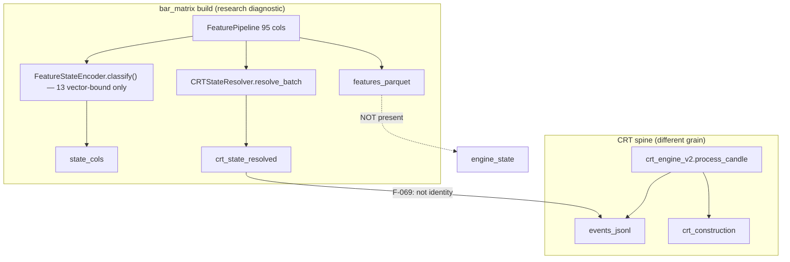
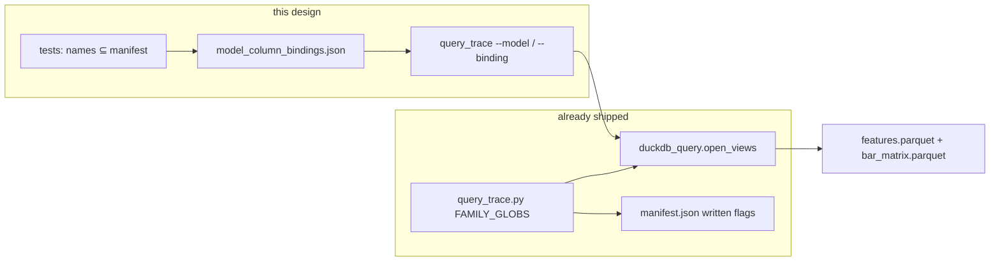

# Model × Parquet Column Binding

> **Grok parallel window** (`parquet-model-binding`). Not DeepSeek (`cost-model-identity-stamping.md`). Not Claude UNKNOWN. Construction class of this landing: `DOCUMENTATION_ONLY` (`CH-model-parquet-binding-docs`). Implementation of `--model` is a later PR.

**Author:** Grok (design + PR-1 docs)  
**Date:** 2026-09-16  
**Status:** Draft (reviewed to 0 open issues; PR-1 landed as docs only)  
**Lane:** semantic certification of existing assets + research-query binding  
**ACTIVE_VERSION (Tier 0, file-read):** `v2_htfcrt_2026_08`  
**Corpus / artifact:** `results/research/bar_matrix/XAUUSD_M15/` (schema 6.0, `rows_emitted` 47197, `feature_column_count` 95, `bar_matrix` 128 cols)  
**Authority:** research-query binding only. No retrain, no promote, no `ACTIVE_VERSION` change, no G001, no live-spine swap.

---

## Overview

The Excel the user remembers (`features.xlsx`, 91 cols pre-v6) is now a **95-column** pipeline block (`94` FeaturePipeline columns + `_pos`) written beside `features.parquet` by `scripts/research/build_bar_matrix.py`. Models that “pick from Parquet / DuckDB” must **SELECT names that exist in that Excel / `manifest.feature_columns`**, not invent `wick_size`, `macd_hist`, `trend_strength`, `candles_since_retest`, or `disp_str`.

This design freezes a **Model × Parquet binding table** for every MIAR Stage 1–5 model plus the two shadow consumers (`CRTStateResolver`, `FeatureStateEncoder`). Lookup key is **`binding_id`**, not `miar_id` (Gaussian is one MIAR id with two implementations; CRT is one MIAR id with three questions; resolver/encoder have no MIAR id). It specifies a **query adapter** that extends the existing `scripts/analysis/query_trace.py` / `src/utils/duckdb_query.open_views` surface: per-`binding_id` SELECT of the bound names. v1 `--model` is **SELECT-only**. A `_pos` JOIN helper is **new work** (the `query_trace.py:81-85` comment documents the build, it is not a runtime join API). Same-directory + sibling `manifest.corpus_sha256` is the existing lineage contract. Refuse illegal grain joins, refuse missing written-flags, fail-closed on a missing column.

Production stays Alternative A (live `FeaturePipeline` dict). This binding is Alternative B (research / LLM query). Alternative C (L0–L5 identity Parquet, P-FLOW-04 INTENDED) stays unauthorized.

---

## Background & Motivation

### Current state

- Feature values live in `results/research/bar_matrix/XAUUSD_M15/features.parquet` (and `features.xlsx`). Manifest `feature_columns` is the name list. Verified 2026-09-16: `schema_version` `"6.0"`, `feature_column_count` 95, `features_parquet_written` true, `features_xlsx_written` true.
- Interpreted states, resolver occupancy, parent/HTF context, candle-state axes, `regime_label`, and `trade_intent` live only on `bar_matrix.parquet` (128 = 95 + 33 extras). CSV is the **rebuild source** (`query_trace.py:74-77`); Parquet is the DuckDB scan, optional and gated by `manifest.parquet_written`.
- DuckDB views already exist: families `bar_matrix` and `bar_matrix_features` in `scripts/analysis/query_trace.py` (`FAMILY_GLOBS`). The `:81-85` comment says the pipeline block “joins to it on `_pos`” — that is **build documentation**, not a runtime INNER JOIN helper. Existing contract: same directory + written flags + sibling `manifest.corpus_sha256` via `_bar_matrix_lineage`. A JOIN helper is PR-5.
- MIAR (`docs/governance/MODEL_INTENT_AUTHORITY_REGISTER.md` + `miar_registry.json`) owns **why** each model exists. The topic `docs/topics/model-intent-and-feature-ownership.md` owns the feature × model ownership matrix. Code still wins on **which names are actually read**.

### Pain

1. LLMs and research scripts invent column names (`wick_size`, `candles_since_retest`) that are not in the Excel.
2. `state__*` looks like the interpreted vocabulary, but three families are **100% null** in both builds (`state__displacement_flag`, `state__retest_flag`, `state__rsi_state`) while the RAW value columns are fully populated.
3. CRT **engine** occupancy is not a Parquet column. Resolver occupancy is `crt_state_resolved`. Collapsing them is F-069 / `CC-L3-FORBIDDEN-JOIN` (`jsonl_claim_catalog.yaml:348-355`: `llm_claim: "Engine state equals resolver state"`).
4. Trained artifacts (ZoneGate `feature_order`, BitNet catalog, RR 38-dim positional, Gaussian JSON) still carry pre-v6 / pre-v4 names. A silent alias SELECT would score the wrong slot.

### Why now

The 95-col Excel is the only honest DESCRIBE of what a DuckDB query can return for this build. Binding MIAR intent → those names is semantic certification, not a new lab.

---

## Goals & Non-Goals

### Goals

1. One **name-authority rule**: Excel / Parquet DESCRIBE / `manifest.feature_columns` is the only allowed feature-name source; `state__*` is the only allowed interpreted-state source.
2. A **binding table** for every Stage 1–5 MIAR model + resolver + FeatureStateEncoder: CURRENT vs INTENDED, feature columns, state columns, DuckDB view, fail-closed rule, contamination caveats.
3. A **query adapter** that extends `query_trace.py` / `open_views` — per-`binding_id` SELECT-only in v1; extras via `bar_matrix` (JOIN helper is new); refuse illegal grains, UNUSABLE `state__*`, and missing written-flags on both `--model` and `--sql`.
4. Keep CRT engine occupancy vs resolver occupancy as two grains.
5. Declare the three all-null `state__*` columns **UNUSABLE** until a separately authorized `classify_value` join.
6. Construction-class the later implementation honestly. Pin tests: every bound name ∈ Excel/manifest; DuckDB DESCRIBE equals manifest; missing column raises; no economic claim.

### Non-goals

- Do **not** implement in this turn.
- Do **not** replace `FeaturePipeline` / `EngineRunner` with DuckDB at runtime.
- Do **not** retrain, remap production artifacts as a silent fix, enable `use_bitnet`, re-enable `rr_fusion`, or change `ACTIVE_VERSION`.
- Do **not** claim G001, expectancy, or promotion authority (`CC-PRESENCE-NOT-G001`).
- Do **not** build Alternative C (L0–L5 identity Parquet).
- Do **not** “fix” the null `state__*` trio in this program as if it were already fixed.
- Do **not** join `opportunities` / `clean_labels` ↛ `events` / `telemetry` (`catalog.py` SURFACES). DuckDB view names are `FAMILY_GLOBS` keys (`crt_telemetry`, not `telemetry`). Grain refuse uses those view names.
- Do **not** collapse CRT engine occupancy with `crt_state_resolved` (F-069).
- Do **not** treat FeatureStateEncoder output as spine-consumed (module docstring: shadow-only).

---

## Name-authority rule

```
name is legal
  iff it appears in this build's manifest.feature_columns
   or it is one of the 19 `state__{family}` columns on bar_matrix
   or it is one of the documented bar_matrix extras
        (atr_abs, context_hash, crt_state_resolved, htf_window_id,
         parent_track_state, parent_bias, htf_state, objective_status,
         candle_direction, candle_vol, candle_structure, candle_trend,
         regime_label, trade_intent)
```

**Emit keys** are v6.0 live names. Canonical index 11 is `trend_strength_z`. Canonical index 35 is `candles_since_sweep`.

**Aliases are decode-only.** Live names are the only columns in a result schema (“never emit”). Historical names:

| Alias (historical) | Live Excel name | Registry |
|---|---|---|
| `trend_strength` | `trend_strength_z` | `SCHEMA_V5_ALIASES` (`feature_schema.py:141`) |
| `candles_since_retest` | `candles_since_sweep` | `SCHEMA_V5_ALIASES` |
| `wick_size` | `candle_range` | `SCHEMA_V3_ALIASES` (`feature_schema.py:130`) |
| `macd_hist` | `macd_hist_z` | `SCHEMA_V3_ALIASES` |

One rewrite rule, two surfaces (do not mix):

**A. `--model` and adapter request decode** (a binding or a named request that still uses a historical token, e.g. BitNet catalog `candles_since_retest`):

1. If the name is in `manifest.feature_columns` → SELECT it as-is.
2. Else if it is in `SCHEMA_V5_ALIASES` **or** `SCHEMA_V3_ALIASES` and the **target** is in `manifest.feature_columns` → SELECT the **target**, record `decoded_from`. Result schema contains the live name only — never the alias.
3. Else → `MissingColumnError`. Do not invent. Do not `.get(name, default)`.

Names with **no alias table entry** and not in the 95: `disp_str` (and any other CRT-local leftover). Refuse. `disp_str` is a fallback on `live_engine_hook.py:454-457` and CRT `_derive_trade_intent` (`crt_engine_v2.py:2352`); it is **not** in `SCHEMA_V3_ALIASES` or `SCHEMA_V5_ALIASES`.

**Raw `--sql` is not rewritten.** `SELECT wick_size FROM bar_matrix_features` is sent to DuckDB as written. The column is absent → DuckDB errors (the illegal-example case). `query_trace` does not alias-rewrite operator SQL. UNUSABLE `state__*` names in `--sql` are refused by an identifier scan **before** execute (Issue 20) — those columns *exist* in DESCRIBE, so DuckDB would otherwise return 47197 nulls.

**B. `gaussian_ml` trained-schema resolve (must match production load; not v1 CLI):**

`src/features/gaussian_schema_contract.py:33-36, 44-61` remaps **only** `SCHEMA_V3_ALIASES`. A v4/v5 bundle that still names `trend_strength` / `candles_since_retest` raises `GaussianSchemaError` on the live spine. v1 `--model gaussian_ml` is always `UnbindableModelError` (Issue 19). Policy B is a later CLI, kept on the registry row so test 7 can pin “V5 is not remapped.” `alias_policy: research_rename_not_production_load` is not a v1 escape.

ZoneGate v4 and BitNet `LEGACY6_KEYS` already store live v6 names. Non-active `models/zone_registry.json` (still lists `wick_size` / `macd_hist`) is **not** a v1 `binding_id`.

**JSONL vs Parquet vs CSV**

- JSONL families (`events`, `crt_telemetry`, `opportunities`, `clean_labels`, `crt_construction`, `bar_structure`): JSONL is system of record. Parquet is a projection (`CC-PARQUET-PROJECTION`). Disagreement → JSONL wins.
- `bar_matrix` / `bar_matrix_features`: **CSV is the rebuild source**, not the DuckDB scan. `query_trace.py:74-77, 105-125` refuses a skipped writer (`parquet_written` / `features_parquet_written` not true). When the written flag is true, DuckDB `read_parquet` returns Parquet values — there is no v1 CSV-vs-Parquet byte-compare. Do not claim “CSV wins on value disagreement” for this family; that overstates DESCRIBE + written-flag. Names come from `manifest.feature_columns`; the query engine reads Parquet iff the flag is true.

---

## Verified artifact inventory (2026-09-16)

Path: `D:\Tradelatest\results\research\bar_matrix\XAUUSD_M15\`

| File | Role | Verified |
|---|---|---|
| `manifest.json` | name authority + written flags + contamination caveats | `schema_version` 6.0, `canonical_dim` 48, `feature_column_count` 95, `rows_emitted` 47197, `features_parquet_written` true, `parquet_written` true, `features_xlsx_written` true, `known_contaminated_inputs`: `session`, `ema_spread_momentum_score` |
| `features.parquet` / `features.xlsx` | pipeline block | DESCRIBE = 95 names, identical to `manifest.feature_columns` |
| `bar_matrix.parquet` | pipeline + 33 extras | DESCRIBE = 128 names; extras listed below |
| `bar_matrix.csv` | rebuild source for the 128-col frame | DuckDB does not scan it; written-flag gates whether Parquet may be opened |

**95 feature columns** (copy of `manifest.feature_columns`; this is the Excel list):

`timestamp`, `open`, `high`, `low`, `close`, `volume`, `_pos`, `prev_close`, `delta_close`, `candle_body`, `upper_wick`, `lower_wick`, `direction`, `volume_range_proxy`, `volume_ma20`, `volume_ratio`, `volume_range_proxy_ratio`, `volume_spike`, `ma_20`, `ma_50`, `ma_200`, `rsi_14`, `rsi_state`, `true_range`, `atr_14_raw`, `atr_14`, `bb_upper`, `bb_lower`, `bb_width_raw`, `bb_position`, `macd_line`, `macd_signal`, `macd_hist_raw`, `price_vs_ma20_raw`, `price_vs_ma50_raw`, `ma_slope_20`, `trend_strength_raw`, `volatility_regime_global_batch`, `volatility_regime_expanding_causal`, `volatility_regime_rolling_causal`, `volatility_regime`, `day_of_week`, `hour_of_day`, `session`, `swing_high_centered_batch`, `swing_low_centered_batch`, `last_swing_high_price_centered_batch`, `last_swing_low_price_centered_batch`, `swing_high_causal_confirmed`, `swing_low_causal_confirmed`, `last_swing_high_price_causal`, `last_swing_low_price_causal`, `swing_high`, `swing_low`, `last_swing_high_price`, `last_swing_low_price`, `higher_high`, `lower_low`, `break_of_structure`, `liquidity_sweep`, `macd_hist_z`, `trend_strength_z`, `bb_width_z`, `price_vs_ma20_z`, `price_vs_ma50_z`, `body_size`, `candle_range`, `body_ratio`, `price_position`, `atr`, `range_size`, `volatility_ratio`, `ema_fast`, `ema_slow`, `ema_spread`, `momentum_score`, `trend_bias`, `sweep_detected`, `displacement_flag`, `retest_flag`, `double_sweep`, `disp_strength`, `retest_depth`, `candles_since_sweep`, `liquidity_distance`, `liquidity_pressure_score`, `order_block_distance`, `fvg_distance`, `breaker_distance`, `mitigation_block_distance`, `pdh_distance`, `pdl_distance`, `eqh_distance`, `eql_distance`, `change_of_character`

**48-name canonical subset** (`src/features/feature_schema.py` `CANONICAL_FEATURES`, schema v6.0) — all 48 are in the 95. ZoneGate `filter_canonical_inputs`, TradeNet SchemaObject, and Gaussian SchemaObject bind this subset, not the full 95.

**33 bar_matrix extras** (verified DESCRIBE; not in `features.parquet`):

`atr_abs`,  
`state__atr_magnitude`, `state__body_commitment`, `state__break_of_structure`, `state__change_of_character`, `state__displacement_flag`, `state__double_sweep`, `state__higher_high`, `state__liquidity_sweep`, `state__lower_low`, `state__momentum_magnitude`, `state__retest_flag`, `state__rsi_state`, `state__session`, `state__sweep_detected`, `state__swing_high`, `state__swing_low`, `state__trend_bias`, `state__volatility_regime`, `state__volume_spike`,  
`context_hash`, `crt_state_resolved`, `htf_window_id`, `parent_track_state`, `parent_bias`, `htf_state`, `objective_status`, `candle_direction`, `candle_vol`, `candle_structure`, `candle_trend`, `regime_label`, `trade_intent`

**Null-trio measurement (this build, n=47197):**

| Column | nulls |
|---|---|
| `state__displacement_flag` | 47197 / 47197 |
| `state__retest_flag` | 47197 / 47197 |
| `state__rsi_state` | 47197 / 47197 |
| `displacement_flag` (RAW) | 0 / 47197 |
| `retest_flag` (RAW) | 0 / 47197 |
| `rsi_state` (RAW) | 0 / 47197 |

---

## CRT occupancy split (load-bearing)



| Occupancy | Where it lives | Grain | What a Parquet SELECT is |
|---|---|---|---|
| **Resolver** | `bar_matrix.crt_state_resolved` | one label per emitted pipeline bar (`_pos`) | a statement about `CRTStateResolver`, not the engine (F-069). This build's distribution: RANGE 21745, SWEEP 15186, DISPLACEMENT 3127, SHADOW_PENDING 47, EXPANSION 7092. No RETEST / EXECUTION / RESOLUTION / EXPIRED — structurally config-unreachable on the resolver (F-069). |
| **Engine FSM** | `events` / `crt_construction` families (JSONL SoR; Parquet projection) | per BacktestRunner pass, event / bar_index | **not** in `features.parquet`. Not a column on `bar_matrix`. |
| **CRT fusion score** | computed by `engines.crt_engine.compute` → `scoring_engine.compute_scores` | per TRADE_OPENED / engine_runner call | reconstructable from 7 **value** columns (below). Score ≠ state. MIAR alignment 🟡. |

**Illegal:** `JOIN bar_matrix.crt_state_resolved = events.state_from` as identity (`CC-L3-FORBIDDEN-JOIN`, F-069). Coincidence counts on timestamp are research diagnostics with the F-069 caveat, not occupancy equality. Enforce this in `query_trace` (bar_matrix is **not** a `catalog.SURFACES` id — do not call `catalog.assert_join("bar_matrix", "events")`).

**How CRT “picks from Parquet” (the only honest answers):**

1. **Score-path query (`binding_id=crt_score`):** SELECT the 7 value columns from `bar_matrix_features`. v1 is SELECT-only — it does **not** call `crt_engine.compute` (that needs `context["score_component_weights"]` from config, PLAN-002, not a parquet column).
2. **Resolver occupancy query (`binding_id=crt_resolver_occupancy`):** SELECT `crt_state_resolved` from `bar_matrix`. Label it resolver occupancy.
3. **Engine occupancy query (`binding_id=crt_engine_occupancy`, unbindable on this Parquet):** open `crt_construction` / `events` via `query_trace.py --run-dir <one emit>`. Different family, different grain.
4. **FSM reconstruction:** re-run `process_candle` on OHLCV. That is Alternative A, not a Parquet pick. Pipeline `ema_fast`/`ema_slow` are EMA(9,21); CRT’s internal EMA is (2,5). Do not feed parquet EMAs into the FSM.

---

## Null `state__*` trio (known defect — do not “fix” in this plan)

`scripts/research/build_bar_matrix.py:214-234`:

```python
vector_states = [fse.classify(r) for r in rows]   # 13 vector-bound keys only
for fam in sorted(fse.stateful_features):         # 19 names
    enriched[f"state__{fam}"] = [vs.get(fam) for vs in vector_states]
```

`FeatureStateEncoder.classify()` (`feature_states.py:170-184`) returns only `vector_bound_features` (13). Non-vector families need `classify_value`. The six non-vector stateful names are `displacement_flag`, `retest_flag`, `rsi_state`, `body_commitment`, `atr_magnitude`, `momentum_magnitude`. The last three are overwritten by `MagnitudeStateEncoder` (`build_bar_matrix.py:235-236`). The first three stay **100% null**.

**Rule for this design (recorded default K5):** those three `state__*` columns are **UNUSABLE**. Models that need those semantics bind the RAW feature columns (`displacement_flag`, `retest_flag`, `rsi_state`) from the 95-col Excel and say they are **VALUES, not interpreted states**. A `classify_value` join is a **follow-on** (`build_bar_matrix.py` behavior change, not this adapter). User may override; v1 does not fill them.

---

## Model × Parquet binding table

Legend:

- **`binding_id`** = unique registry / CLI key. **`miar_id`** is nullable (shadow consumers have none; Gaussian/CRT share one MIAR id across several bindings).
- **CURRENT** = what the executable path actually reads today (code wins).
- **INTENDED** = MIAR locked question (meaning). Divergence is the finding; this design does not pick a winner by editing production.
- **Query columns** = what DuckDB SELECTs in v1 (`--model` is SELECT-only).
- **Serve presence** = what `compute()` / `filter_canonical_inputs` / `plan()` asserts if a later harness feeds rows back into code. Not executed in v1. Includes non-parquet inputs (CRT HOW weights from config).
- **STATE cols** = usable `state__*` from the 19-family list, or `NONE`. UNUSABLE trio is never a query column.
- **View** = `bar_matrix_features` (95) vs `bar_matrix` (128 extras live here). JOIN on `_pos` is new (PR-5), not an existing API.
- **Bindable** = adapter may SELECT these query columns from this build without lying.

**`binding_id` index** (CLI `--model` takes these; aliases noted):

| binding_id | miar_id | v1 CLI | Notes |
|---|---|---|---|
| `crt_score` | `crt` | yes (PR-4) | 7 query cols |
| `crt_resolver_occupancy` | `crt` | PR-5 (extras) | `crt_state_resolved` extra |
| `crt_engine_occupancy` | `crt` | refuse | wrong grain |
| `gaussian_heuristic` | `gaussian` | yes; `--model gaussian` **aliases here** (`gaussian_impl: heuristic`) | 3 query cols |
| `gaussian_ml` | `gaussian` | refuse (always `UnbindableModelError` in v1) | registry row + test 7 only |
| `zone_gate_v4_38` | `zone_gate` | yes; `--model zone_gate` **aliases here** | active scoring vector |
| `zone_gate_48` | `zone_gate` | yes (PR-4) | 48 canonical query cols |
| `rr_engine` | `rr_engine` | yes | 3 OHLC |
| `regime` | `regime` | yes (single-view) | 6 values; not `regime_label` |
| `tradenet` | `tradenet` | not v1 CLI | query-only 48; not a serve bind |
| `rr_trained` | `rr_trained` | refuse | unbindable |
| `bitnet` | `bitnet` | yes (single-view) | 6 Excel/code names |
| `decision_fusion` | `decision_fusion` | refuse in v1 | compose needs serve presence (dropped PR-7) |
| `execution_planner` | `execution_intent` | yes (13 keys, single-view) | `atr_abs` extra optional |
| `resolver` | `None` | registry yes | 13 `when:` **values** |
| `feature_states` | `None` | extras on `bar_matrix` | UNUSABLE trio excluded |

v1 CLI **is** the PR-4 single-view set: `crt_score`, `gaussian_heuristic`, `zone_gate_v4_38`, `zone_gate_48`, `rr_engine`, `bitnet`, `regime`, `execution_planner`. `crt_resolver_occupancy` / `feature_states` / optional `atr_abs` ship in PR-5. Q1 is not blocking. Full registry still pins every row.

### Stage 1 — Market understanding

#### 1. CRT (`miar_id=crt`; binding_ids `crt_score` / `crt_resolver_occupancy` / `crt_engine_occupancy`)

| Field | Content |
|---|---|
| **MIAR question** | What structural state is the market in? |
| **CURRENT** | Dual surfaces. (a) FSM: `crt_engine_v2.process_candle` on raw `Candle` OHLCV + internal EMA(2,5)/ATR(14) + `Candle.body_ratio` (FM-010). Does not read the 95-col Parquet. Occupancy is the events / construction-trace grain. (b) Fusion scorer: `engines.crt_engine.compute` → `scoring_engine.compute_scores` reads `body_ratio`, `disp_strength` (as `move`), `atr`, `retest_depth`, `candles_since_sweep` (`.get` default 0), `sweep_detected` (`.get` default False), `double_sweep` (required). **Also requires** `context["score_component_weights"]` (PLAN-002, `crt_engine.py:19-25`) — config, not a parquet column. Alignment 🟡 — score ≠ state. |
| **INTENDED** | Structural classification. Never p(win), never economic RR, never zone neighbourhood, never trade approval. |
| **Query columns (`crt_score`)** | `body_ratio`, `disp_strength`, `atr`, `retest_depth`, `candles_since_sweep`, `sweep_detected`, `double_sweep`. Optional context (not score inputs): `open`, `high`, `low`, `close`, `volume`, `session` (F-066), `timestamp`. |
| **Serve presence (`crt_score`)** | The 7 query columns **plus** `score_component_weights` from production config. v1 does not call `compute()`. |
| **Query columns (`crt_resolver_occupancy`)** | `crt_state_resolved` (bar_matrix extra). |
| **FEATURE cols (FSM / `crt_engine_occupancy`)** | **NONE from this Parquet.** Bindable = NO. |
| **STATE cols** | **NONE as CRT inputs.** Resolver *output* `crt_state_resolved` is a different producer. Do not bind `state__sweep_detected` as CRT state. |
| **View** | `crt_score`: `bar_matrix_features`. `crt_resolver_occupancy`: `bar_matrix`. Engine occupancy: `crt_construction` / `events` (not this join). |
| **Fail-closed** | Score-path adapter: all 7 names required (stricter than production `.get` on `candles_since_sweep` / `sweep_detected` — F-018 class). `--model crt_engine_occupancy` → `UnbindableModelError` / `GrainError`. |
| **Caveats** | F-069 resolver ≠ engine (`CC-L3-FORBIDDEN-JOIN`). F-066 `session` if used as context. F-050 CRT `cached_features` emit FM-027/FM-028 (`displacement_retrace` / `displacement_atr_ratio`) which are **absent from the 95-col Excel** — CRT-local, not pipeline. `disp_str` is also CRT-local, **not** in alias tables — refuse as emit key. F-074 directional displacement is engine-only. Parent extras (`parent_bias`, `htf_state`, `objective_status`) are F-075/F-078 context on `bar_matrix`, not FSM inputs. |
| **Bindable** | `crt_score` YES (SELECT). `crt_resolver_occupancy` YES (labeled). `crt_engine_occupancy` NO. |

#### 2. Gaussian heuristic (`binding_id=gaussian_heuristic`; `miar_id=gaussian`; `--model gaussian` aliases here)

| Field | Content |
|---|---|
| **MIAR question** | How statistically **conformant** is this market state to previously observed states (EMA/momentum axis)? |
| **CURRENT** | `HeuristicGaussianEngine.compute` (`heuristic_gaussian_engine.py:316-341`) requires `ema_fast`, `ema_slow`, `momentum_score` (KeyError, fail-closed). Also asserts `len(input_data) >= len(CANONICAL_FEATURES)` (48) but **reads only those 3**. `gaussian_impl: heuristic` on `v2_htfcrt_2026_08`. Names did not change in v6. |
| **INTENDED** | Conformity **score**, not probability, not entry permission. |
| **Query columns** | `ema_fast`, `ema_slow`, `momentum_score` |
| **Serve presence** | All 48 `CANONICAL_FEATURES` keys present in the dict (the `len >= 48` assert), even though only 3 are read. v1 `--model` does **not** call `compute()`; a 3-col SELECT fed to `HeuristicGaussianEngine.compute` would assert. |
| **STATE cols** | **NONE** — kernel over values. `state__trend_bias` / `state__momentum_magnitude` are not inputs. |
| **View** | `bar_matrix_features` (single-view) |
| **Fail-closed** | Missing any of the 3 query columns → error. Do not substitute `ema_spread`. |
| **Caveats** | F-060 information-inert (~constant 0.8825). F-061 / F-064: `momentum_score` is FM-023 price-scaled (`atr_relative`); `tanh` saturates on XAUUSD. Manifest `known_contaminated_inputs.ema_spread_momentum_score`. Descriptive only. |
| **Bindable** | YES (SELECT of 3). Serve harness is not v1. |

#### 3. Gaussian ML (`binding_id=gaussian_ml`; same `miar_id=gaussian`)

| Field | Content |
|---|---|
| **MIAR question** | Same as heuristic (conformity). Implementation is the NB / trained path. |
| **CURRENT** | `MLGaussianEngine.compute` builds the vector **by trained name order** via `gaussian_schema_contract.extract_model_feature_vector` (`ml_gaussian_engine.py:163-209`). Load remaps **only** `SCHEMA_V3_ALIASES` (`wick_size`→`candle_range`, `macd_hist`→`macd_hist_z`). **V5 aliases are not remapped at load** (`gaussian_schema_contract.py` imports `SCHEMA_V3_ALIASES` only). Unresolvable names (including leftover `trend_strength` / `candles_since_retest`) → `GaussianSchemaError`. Live spine default is heuristic; ML is not the active `gaussian_impl`. SchemaObject `GAUSSIAN_SCHEMA` auto-tracks all 48 `CANONICAL_FEATURES`. |
| **INTENDED** | Same conformity question. Grants no re-enable. |
| **Query columns** | The **V3-resolved** live names of the loaded artifact, each of which must be in the 95-col list. Honest 48-dim bind = the 48 canonical names. |
| **Serve presence** | Same resolved name list, width == `model.n_features`. v1 does not call `compute()`. |
| **STATE cols** | **NONE** |
| **View** | `bar_matrix_features` |
| **Fail-closed** | v1 `--model gaussian_ml` → **always** `UnbindableModelError`. No V3-resolve escape in v1. Later CLI (not this program) may match `resolve_trained_feature_name` (V3 only). Registry row stays so test 7 can pin “V5 aliases are not remapped.” |
| **Caveats** | Artifacts may be pre-v4 (35/38/39). v5 +9 SMC dims are absent from older bundles — dim-mismatch, not a parquet alias. F-060/F-061 still apply to overlapping slots. No activation authority. |
| **Bindable** | Registry row exists (`bindable: false` for v1 CLI). |

#### 4. ZoneGate (`binding_id=zone_gate_v4_38` default CLI; `zone_gate_48` for serve presence)

| Field | Content |
|---|---|
| **MIAR question** | Is this state occurring in a structurally valid location (zone neighbourhood)? |
| **CURRENT** | `filter_canonical_inputs` requires **all 48** `CANONICAL_KEYS` (`zone_gate_engine.py:163-167`). `_extract_vector` then assembles by registry `feature_order` **by NAME**. Active config `engine_runner.zone_registry_path` = `models/zone_registry_v4_2026_07.json` — 38 names, v6-remapped (`trend_strength_z`, `candles_since_sweep`, `candle_range`, `macd_hist_z`). `models/zone_registry.json` (not the active path) still lists `wick_size` and `macd_hist`. |
| **INTENDED** | Geometric neighbourhood quality. Never CRT transitions, never TP probabilities, never SL/TP. |
| **Query columns (`zone_gate_v4_38`)** | The 38 `feature_order` names from `zone_registry_v4_2026_07.json` — all 38 are in the 95. Deliberately **absent** from that order: `macd_hist_raw` + 9 SMC (`order_block_distance` … `change_of_character`). `--model zone_gate` aliases here. |
| **Query columns (`zone_gate_48`)** | All 48 canonical names (all present in the 95). |
| **Serve presence** | All 48 keys (`filter_canonical_inputs`). Scoring then uses the 38. A 38-col SELECT fed to `filter_canonical_inputs` raises. v1 does not call the engine. |
| **STATE cols** | **NONE** — geometric over values. Zone is not a `state__*` family. |
| **View** | `bar_matrix_features` (single-view) |
| **Fail-closed** | Query columns are the live v4 38 or the 48 canonical names — all already in the 95. Do not zero-fill SMC dims to “help” a 38-dim registry. Non-active `models/zone_registry.json` is **not** a v1 `binding_id` (its `wick_size` / `macd_hist` are irrelevant to `--model zone_gate`). |
| **Caveats** | F-036 non-pivotal. F-041B HONEST_NO_EDGE / F-022 label contamination on stored zone labels. F-051 PIT_UNCLEAN centered swings feed several of the 38. F-061 saturating dims still sit in the vector. No retrain. |
| **Bindable** | YES for `zone_gate_v4_38` and `zone_gate_48`. |

#### 5. RR Engine (`binding_id=rr_engine`)

| Field | Content |
|---|---|
| **MIAR question** | How strong is the candle **commitment** and geometric quality? |
| **CURRENT** | `RREngine.compute` (`rr_engine.py:45-49`) reads `close`, `high`, `low` only. Not a vector model. `rr_fusion.enabled: false` on active config — this **is** the live RR slot (F-038). |
| **INTENDED** | Geometric commitment. Not economic reward:risk (Ultron, F-048). Not a probability. |
| **Query columns** | `close`, `high`, `low` |
| **Serve presence** | Same 3 names. Aligns with `compute()` (no extra assert). |
| **STATE cols** | **NONE** |
| **View** | `bar_matrix_features` (single-view) |
| **Fail-closed** | Missing any of 3 → error. `high >= close >= low` is a data invariant, not a default. |
| **Caveats** | Name “RR” vs polarity semantics (MIAR 🟡). Do not bind `atr` / `disp_strength` as if they were RR Engine inputs. |
| **Bindable** | YES |

#### 6. Regime / dual (`binding_id=regime`; adjuncts `breakout`, `trap`)

| Field | Content |
|---|---|
| **MIAR question** | What market regime currently exists? (Adjuncts: breakout-style pressure? trap/deception pattern?) |
| **CURRENT** | `detect_regime` (`engine_runner.py:150-167`) reads `ema_spread`, `momentum_score`, `volatility_ratio` via `_safe_float(.get, default)` — F-018 class. `breakout_engine` reads `trend_bias`, `momentum_score`, `ema_spread`. `trap_engine` reads `sweep_detected`, `disp_strength`, `trend_bias`. Output of `detect_regime` is `"trend"` / `"range"` / `"neutral"`. |
| **INTENDED** | Coarse regime label for weight selection. Never open trades, never CRT states. |
| **Query columns** | `ema_spread`, `momentum_score`, `volatility_ratio`, `trend_bias`, `sweep_detected`, `disp_strength` (all on `bar_matrix_features`; **not** a split-join). |
| **Serve presence** | Same 6 names. Production `.get` defaults are **not** reproduced by the adapter. |
| **STATE cols** | **NONE as inputs.** Do **not** bind `bar_matrix.regime_label` (`C`/`N`/`E` from `RegimeLabeler`) as `detect_regime` output — different producer, different vocabulary. `state__volatility_regime` / `state__trend_bias` are FeatureStateEncoder interpretations of values, not the dual-engine label. |
| **View** | `bar_matrix_features` (single-view) |
| **Fail-closed** | Adapter requires all 6 names (stricter than production `.get`). |
| **Caveats** | F-061 / F-064: `ema_spread`/`momentum_score` saturate → `detect_regime` pins `"trend"` on XAUUSD (99.8% `|tanh(momentum_score)|>0.999` re-measured 2026-09-16). F-061 also pins `breakout_engine` score. Descriptive, no activation of FM-030/031. |
| **Bindable** | YES (values). Output-label equality with `regime_label` is **not** a bind. |

### Stage 2 — Opportunity understanding

#### 7. TradeNet (`binding_id=tradenet`)

| Field | Content |
|---|---|
| **MIAR question** | What **expected trading outcomes** (discrete milestones) follow from this semantic market state? |
| **CURRENT** | UNWIRED on the spine (F-005). `TRADENET_SCHEMA` auto-tracks `len(CANONICAL_FEATURES)=48`. Artifacts are pre-v4 (35/38/39). No live consumer. |
| **INTENDED** | Milestone estimates / scores until calibrated. Never CRT structure, never Envelope MFE/MAE, never BitNet veto. |
| **Query columns** | All 48 canonical names from the 95 (research inspection of “what the SchemaObject would read today”). |
| **Serve presence** | 48-dim live SchemaObject. A pre-v4 artifact against this 48 is a **dim mismatch**, not a bind. v1 CLI does not serve. |
| **STATE cols** | **NONE** — TradeNet is a vector model over values. |
| **View** | `bar_matrix_features` |
| **Fail-closed** | Missing any of the 48 in a query-only SELECT of this binding → error. Positional slice of 38 from 48 → refuse. |
| **Caveats** | F-005 unwired. F-022 if anyone tries to use stream `outcome` as y. No TN_QUAL_V1, no G001, no wire-up. Registry row exists in PR-3 as query-only; not in v1 CLI subset. |
| **Bindable** | YES as a 48-name research SELECT. NO as “this artifact scores these rows.” v1 CLI: not in default subset. |

#### 8. RR trained (`binding_id=rr_trained`)

| Field | Content |
|---|---|
| **MIAR question** | What **learned reward behavior** is associated with this semantic state (parametric), distinct from deterministic candle commitment? |
| **CURRENT** | `models/rr_model.json`: `n_features` 38, `incompatible_with_schema: "4.0"`, quarantined positional `scale_mu`/`ridge_w`/`zero_indices` aligned to v3.0 **name order**. v4 inserted `macd_hist_z` at index 19 → every later index shifted. `rr_fusion.enabled: false`. F-044/F-045/F-059 grant no retrain. |
| **INTENDED** | Learned reward + model confidence. Not RR Engine polarity. Not KNN retrieval (`RRPatternMiner` is ⚫ DESIGN_ONLY). |
| **Query columns** | **NONE.** UNBINDABLE by position to the 48-dim / 95-col Parquet. |
| **Serve presence** | n/a |
| **STATE cols** | **NONE** |
| **View** | n/a — adapter must **refuse** this `binding_id`. |
| **Fail-closed** | `UnbindableModelError: rr_trained is positional 38-dim, incompatible_with_schema 4.0`. Do not SELECT the first 38 canonical names. Do not decode aliases and pretend the weights moved. Registry row exists in PR-3 with `bindable: false`. |
| **Caveats** | F-022 labels on the original train. F-038 fusion off. F-044 gate mis-scaled. F-059 KEEP_CANDIDATE is research-only. |
| **Bindable** | **NO** |

### Stage 3 — Safety

#### 9. BitNet (`binding_id=bitnet`)

| Field | Content |
|---|---|
| **MIAR question** | Should this opportunity be **rejected** because the semantic state is unsafe? |
| **CURRENT** | Veto, inert: `use_bitnet: false` on `v2_htfcrt_2026_08` (F-004/F-055). **Code** `LEGACY6_KEYS` (`src/bitnet/defaults.py:17-24`) = `body_ratio`, `retest_depth`, `disp_strength`, `atr`, **`candles_since_sweep`**, `double_sweep`. **Catalog / `active_models.yaml:633`** still lists `candles_since_retest`. That split is named, not silently picked. |
| **INTENDED** | Hard-reject safety score (`state_acceptability_score`). Never optimize entries, never replace fusion. |
| **Query columns** | `body_ratio`, `retest_depth`, `disp_strength`, `atr`, `candles_since_sweep`, `double_sweep` — the **Excel / code** names (single-view). |
| **Serve presence** | Same 6. Catalog leftover is not a 7th column. |
| **STATE cols** | **NONE** |
| **View** | `bar_matrix_features` (single-view — belongs in PR-4, not PR-6) |
| **Fail-closed** | All 6 required. A `--model` / adapter request that still names `candles_since_retest` (catalog leftover) is rewritten to `candles_since_sweep` (`decoded_from` recorded); result schema has the live name only. Raw `--sql SELECT candles_since_retest` is not rewritten (DuckDB unknown-column). Not a gaussian_ml load remap. |
| **Caveats** | Name split (catalog vs code vs Excel) is the load-bearing fact. F-050 CRT cached path may alias FM-027/028 into `retest_depth`/`disp_strength` at serve time — those CRT-local keys are **not** in the 95-col Excel; parquet bind is the **pipeline** FM-021/FM-020 values, which is a known train/serve skew if BitNet were enabled (it is not). F-055 enabling the existing gate did not improve the book. No enable. |
| **Bindable** | YES (the 6 Excel names). Catalog leftover is a DOC_DRIFT vs code, not a second parquet column. |

### Stage 4 — Decision

#### 10. Fusion + DecisionEngine (`binding_id=decision_fusion`)

| Field | Content |
|---|---|
| **MIAR question** | Given all evidence, should this trade be **approved**? |
| **CURRENT** | Consumes **upstream scores / vetoes**, not the 95-col vector. `EngineRunner` completeness over `{crt, gaussian, zone_gate, rr}`. `DecisionEngine.evaluate` (`decision_engine.py:120-163`) reads `score`, `p_win` (fed from Gaussian — MIAR-forbidden reinterpretation), `zone_gate.valid`, `fusion.normalized_score` / `weak_component`. No economic RR (F-048). Active `fusion_use_evaluate` is `false` (`v2_htfcrt_2026_08.json:49`); hot path is `FusionEngine.compute`. `FusionEngine.evaluate` **docstring** mentions `disp_str` (`fusion_engine.py:566`) — not a parquet column, not a `SCHEMA_V3`/`V5` alias. `disp_str` also appears as a fallback on `live_engine_hook.py:454-457` and CRT `_derive_trade_intent` (`:2352`). |
| **INTENDED** | Sole scoring-stack owner of approval. Never rediscover structure, never invent features, never own economic min_rr, never treat Gaussian as probability. |
| **Query columns** | **NONE as fusion/decision inputs.** Composition of Stage-1 **serve** contracts (not query-column SELECTs) would be required to call `compute()`. That split is not v1. |
| **Serve presence** | Upstream engine `compute()` dicts + CRT HOW weights from config. A 3-col gaussian SELECT is not a legal serve input. |
| **STATE cols** | **NONE.** `crt_state_resolved` is not a fusion input. |
| **View** | None directly. |
| **Fail-closed** | `--model decision_fusion` in v1 → `NotAFeatureModelError`. Do not SELECT `disp_str` (no alias table entry; `MissingColumnError`). |
| **Caveats** | F-037/F-058/F-070 gate-ON/OFF epochs. F-036 zone non-pivotal. F-060 gaussian inert. F-048 RR gate removed. Scores are not stored on this Parquet. Compose PR dropped from v1 (needs query vs serve split first). |
| **Bindable** | Registry row exists; v1 CLI refuse. Not a column set. |

### Stage 5 — Execution

#### 11. Execution Planner (`binding_id=execution_planner`; `miar_id=execution_intent`)

| Field | Content |
|---|---|
| **MIAR question** | How should the **already approved** trade be executed (SL/TP/TTL/size intent)? |
| **CURRENT** | `ExecutionPlannerV1_2._REQUIRED_FEATURE_KEYS` (`execution_planner.py:53-67`): `close`, `high`, `low`, `atr`, `body_ratio`, `disp_strength`, `sweep_detected`, `double_sweep`, `retest_depth`, `candles_since_sweep`, `ema_fast`, `ema_slow`, `momentum_score`. `_derive_intent` still uses `.get(..., default)` internally (F-018 residue). `plan()` on missing keys returns `decision: reject_invalid` (`:192-198`); it does **not** raise (docstring `:186-187` claims `ValueError` — existing DOC_DRIFT, not this design’s to fix). `_compute_entry` recovers `atr_abs = atr * close` (FM-074; `atr_abs` is a bar_matrix extra, not a required key). **`bar_matrix.trade_intent` is an OUTPUT** of `ExecutionEngine._derive_trade_intent` (CRT-rail classifier, starved cache — 2026-09-16 census), **not** an input to the planner. Two classifiers, rail-disjoint (F-103). |
| **INTENDED** | Post-approval execution geometry. Never rescore features, never re-run fusion. |
| **Query columns** | The 13 `_REQUIRED_FEATURE_KEYS` (all in the 95, single-view). Optional extra: `atr_abs` from `bar_matrix` **or** recompute as `atr * close` (FM-074). |
| **Serve presence** | Same 13. Feeding them to production `plan()` yields `reject_invalid` on missing keys, not an exception. Adapter query fail-closed **raises**; do not write a test that expects `ExecutionPlanner.plan` to raise. |
| **STATE cols** | **NONE.** Do not bind `trade_intent` as an input. |
| **View** | 13 values: `bar_matrix_features`. Optional `atr_abs`: `bar_matrix` extra (PR-5). |
| **Fail-closed** | Adapter: all 13 required. Missing `candles_since_sweep` → `MissingColumnError` (do not default 99). Production: `plan()` → `reject_invalid`. |
| **Caveats** | F-061 `momentum_score` contaminates PULLBACK. F-066 unused unless session gating is added (it is not a required key). CRT-rail `_derive_trade_intent` is a **different function** reading a different cache; joining planner inputs to `trade_intent` column as “the planner’s label” is a false identity. Ownership of CRT-rail intent is a recorded default: this binding will not adjudicate it (Q4). |
| **Bindable** | YES (the 13). `trade_intent` column = CRT-rail output, labeled as such if selected. |

### Shadow consumers (not MIAR Stage 1–5 models; not on the spine)

#### 12. CRTStateResolver (`binding_id=resolver` for the 13 values; occupancy is `crt_resolver_occupancy`)

| Field | Content |
|---|---|
| **MIAR question** | n/a (`miar_id=None`) — declarative occupancy projector. Not a model. Shadow relative to the engine. |
| **CURRENT** | `required_when_features` (default `create_resolver()`, `enabled_links` empty) = 13 **VALUE** names: `break_of_structure`, `displacement_flag`, `double_sweep`, `higher_high`, `liquidity_sweep`, `lower_low`, `retest_flag`, `rsi_state`, `session`, `sweep_detected`, `swing_high`, `swing_low`, `trend_bias`. **LINK-001** is `change_of_character_predicate` (`crt_resolver_links.yaml:41-63`), bound on DISPLACEMENT; enabling it adds **`change_of_character`** (already in the 95-col Excel) as the 14th, **not** `volume_spike`. **LINK-003** is `volume_spike_predicate`, status `declared`, not bound (`crt_resolver_links.yaml:78-100`). These are **not** `state__*` tokens (`crt_state_resolver.py:406-412, 1270-1292`). Encoder overlay: `classify()` + opportunistic `classify_value` (`:1363-1393`). |
| **INTENDED** | A bar-wise CRT **label** from feature predicates. Not the engine FSM. |
| **Query columns (`resolver`)** | The 13 value names (all in the 95). `displacement_flag`, `retest_flag`, `rsi_state` are RAW values — populated. LINK-001 on → also `change_of_character`. LINK-003 (`volume_spike`) stays declared-not-bound; **not** a resolver input in this program. |
| **Query columns (`crt_resolver_occupancy`)** | `crt_state_resolved` extra on `bar_matrix` (prefer this when the question is occupancy of **this build**). |
| **Serve presence** | Same 13 (or 14 with LINK-001). Resolver already fail-closes on missing `when:` names. |
| **STATE cols** | **NONE as inputs.** Output is `crt_state_resolved`. |
| **View** | 13 values: `bar_matrix_features`. Occupancy extra: `bar_matrix`. |
| **Fail-closed** | Missing any of the 13 → error. Do not substitute `state__rsi_state` (null). |
| **Caveats** | F-069 / `CC-L3-FORBIDDEN-JOIN`. F-066 `session`. F-065 `volume_spike` is declared on the live path and consumed by neither; it is LINK-003, not LINK-001. Recompute ≠ recover (identity contract). |
| **Bindable** | YES (13 values + stored occupancy). |

#### 13. FeatureStateEncoder (`binding_id=feature_states`; `miar_id=None`; shadow-only)

| Field | Content |
|---|---|
| **MIAR question** | n/a — “Features measure. States interpret.” Spine consumes **nothing** of this output (`feature_states.py` docstring). |
| **CURRENT** | `stateful_features` (19): `atr_magnitude`, `body_commitment`, `break_of_structure`, `change_of_character`, `displacement_flag`, `double_sweep`, `higher_high`, `liquidity_sweep`, `lower_low`, `momentum_magnitude`, `retest_flag`, `rsi_state`, `session`, `sweep_detected`, `swing_high`, `swing_low`, `trend_bias`, `volatility_regime`, `volume_spike`. `vector_bound_features` (13): `double_sweep`, `trend_bias`, `sweep_detected`, `liquidity_sweep`, `break_of_structure`, `swing_high`, `swing_low`, `higher_high`, `lower_low`, `volatility_regime`, `session`, `volume_spike`, `change_of_character`. |
| **INTENDED** | Value → declared ontology state. Not a feature computer. Not on the decision path. |
| **Query columns (inputs)** | The 13 vector-bound **value** names (in the 95). Non-vector value names `displacement_flag`, `retest_flag`, `rsi_state` plus magnitude inputs `atr`, `momentum_score`, `body_ratio`/`body_size` as the magnitude encoder needs. |
| **Query columns (outputs)** | 16 usable `state__*` (13 vector-bound + 3 magnitude) on `bar_matrix`. **3 UNUSABLE:** `state__displacement_flag`, `state__retest_flag`, `state__rsi_state`. |
| **Serve presence** | `classify()` requires the 13 vector-bound values. |
| **View** | Inputs on `bar_matrix_features` or `bar_matrix`; outputs are extras on `bar_matrix` (PR-5). |
| **Fail-closed** | Selecting an UNUSABLE `state__*` for a predicate → `UnusableStateColumnError` naming the RAW substitute. Applies on `--model` **and** `--sql` (see adapter surfaces). `classify()` missing a vector-bound value → KeyError (already). |
| **Caveats** | Shadow-only. F-066 `state__session` inherits broker-local mislabel. Manifest `state_families` duplicates the 3 magnitude names (pipeline bug in the list, not extra columns). |
| **Bindable** | YES with the UNUSABLE trio excluded from state outputs. |

---

## Query adapter design

Extend the **existing** DuckDB path. Not a parallel lab. Not a FeatureStore. Not live inference.



### Placement

| Piece | Path | Why |
|---|---|---|
| Binding registry | `src/research/evidence/model_column_bindings.py` (+ optional JSON twin under `docs/research/`) | Next to `catalog.py` illegal-join rules. Research-only. No import from `engine_runner`. |
| CLI | `scripts/analysis/query_trace.py --model <id>` | Same DuckDB connection, same `--run-dir` / written-flag gates. |
| Docs | extend `docs/research/parquet_evidence_layer.md` (existing-doc-first). Implementation plan file under `docs/implementation_plan/` when implementation is authorized. | Do not create a third evidence layer. |

### Three CLI surfaces (v1)

`query_trace.py` today defaults to opening **all** admissible families; `--sql` is already legal. Fail-closed that lives only on `--model` does not stop `SELECT state__rsi_state FROM bar_matrix` (column exists, 47197 nulls) or a `bar_matrix` ⋈ `events` join.

| Surface | Behavior |
|---|---|
| **(1) `--model <binding_id>`** | Frozen SELECT of **live** query columns. Historical tokens in a binding request are rewritten (policy A); result schema never contains the alias. Refuse missing columns, UNUSABLE `state__*`, unbindable ids. `--model gaussian` → `gaussian_heuristic`. `--model zone_gate` → `zone_gate_v4_38`. `--model gaussian_ml` → `UnbindableModelError`. |
| **(2) `--sql`** | Operator SQL is **not** alias-rewritten (`SELECT wick_size` → DuckDB unknown-column error). `query_trace` adds a **gate** (not `catalog.assert_join`): refuse SQL that joins `bar_matrix` / `bar_matrix_features` to any of `GRAIN_REFUSE_FAMILIES` = `{events, opportunities, clean_labels, crt_telemetry, crt_construction, bar_structure}` (`FAMILY_GLOBS` names; there is no view `telemetry`). Refuse UNUSABLE `state__*` identifiers with the same `UnusableStateColumnError` as `--model` (identifier scan of the SQL string, or DuckDB `json_serialize_sql` — not a parser project). `assert_view_lineage` stays as today. |
| **(3) catalog** | Do **not** call `catalog.assert_join("bar_matrix", "events")`. `assert_join` is scoped to four surfaces only (`catalog.py:7-18, 116-147`). Bar-matrix grain rules live in `query_trace`. |

### Runtime algorithm (`--model`)

```text
open_model_binding(binding_id, build_dir=results/research/bar_matrix/XAUUSD_M15):
  1. Read sibling manifest.json.
  2. If binding needs features.parquet and features_parquet_written is not true → refuse
     (skipped writer is not a completed DuckDB family; CSV is rebuild source, not the scan).
  3. If binding needs bar_matrix extras and parquet_written is not true → refuse.
  4. DESCRIBE opened views. Assert DESCRIBE(bar_matrix_features) == manifest.feature_columns
     (order-insensitive set equality; fail on extras or missing).
  5. Name resolve (this is --model / adapter request, not raw --sql):
       - policy A: SCHEMA_V3 + V5 aliases → live targets; record decoded_from;
         result schema never contains the alias.
       - gaussian_ml: v1 always UnbindableModelError (policy B is later CLI).
       - disp_str and any name in neither table nor Excel: MissingColumnError.
  6. Every live query column must be in DESCRIBE. Else MissingColumnError (no .get default).
  7. If any name is in UNUSABLE_STATE_COLUMNS → UnusableStateColumnError
     (same exception on --sql via identifier scan).
  8. If binding.bindable is false (rr_trained, gaussian_ml, crt_engine_occupancy,
     decision_fusion) → UnbindableModelError. No v1 escape for gaussian_ml.
  9. Extras: SELECT from bar_matrix (128-col file already carries the 95 + extras).
     If both views are open, INNER JOIN ON _pos is **new** (PR-5). First assert sibling
     manifest.corpus_sha256 match via _bar_matrix_lineage. query_trace.py:81-85 is a comment.
 10. Grain refuse is in query_trace (surface 2), not catalog.assert_join.
     Tokens = GRAIN_REFUSE_FAMILIES (FAMILY_GLOBS names). Includes crt_construction
     (F-069 engine-grain hole) and crt_telemetry (not catalog id "telemetry").
 11. Refuse joining crt_state_resolved to events or crt_construction as identity
     (CC-L3-FORBIDDEN-JOIN).
 12. Emit the SELECT (query columns only — not serve presence). Tag binding_id,
     schema_version, corpus_sha256, contamination caveats from
     manifest.known_contaminated_inputs.
 13. Authority footer: RESEARCH_DIAGNOSTIC_ONLY. No G001.
```

### Example SELECTs (illustrative; names from the Excel)

Gaussian heuristic (`bar_matrix_features` only):

```sql
SELECT _pos, timestamp, ema_fast, ema_slow, momentum_score
FROM bar_matrix_features
```

Resolver occupancy + session value (join on `_pos`):

```sql
SELECT f._pos, f.timestamp, f.session, b.crt_state_resolved, b.state__session
FROM bar_matrix_features f
INNER JOIN bar_matrix b ON f._pos = b._pos
```

BitNet six (Excel names, not catalog):

```sql
SELECT _pos, timestamp, body_ratio, retest_depth, disp_strength, atr,
       candles_since_sweep, double_sweep
FROM bar_matrix_features
```

Illegal:

```sql
-- raw --sql: NOT rewritten. Column absent → DuckDB unknown-column error
-- (test 5b). Adapter --model never emits wick_size in the result schema (test 5a).
SELECT wick_size FROM bar_matrix_features;

-- unusable state: query_trace refuses BEFORE execute (same UnusableStateColumnError
-- as --model). Identifier scan / json_serialize_sql; column exists in DESCRIBE.
SELECT state__rsi_state FROM bar_matrix;

-- grain crime: FAMILY_GLOBS names. Also refuse crt_telemetry, crt_construction,
-- bar_structure, opportunities, clean_labels (GRAIN_REFUSE_FAMILIES).
SELECT b.crt_state_resolved, e.state_from
FROM bar_matrix b JOIN events e ON b.timestamp = e.timestamp;
```

### What this is not

- Not `FeatureStore` / live_engine_hook ingestion.
- Not a replacement for `FeaturePipeline.run()`.
- Not `src/identity/` L0–L5 recovery (`RECOMPUTE != RECOVER`).
- Not `query_decision_atlas.py` (stays on its own path; `query_trace.py` docstring already says so).

---

## API / Interface Changes

**This design does not change production APIs.** Proposed research-only additions (implementation PRs):

```python
# src/research/evidence/model_column_bindings.py  (NEW)

UNUSABLE_STATE_COLUMNS = frozenset({
    "state__displacement_flag",
    "state__retest_flag",
    "state__rsi_state",
})

# FAMILY_GLOBS keys only — not catalog surface ids. No view named "telemetry".
GRAIN_REFUSE_FAMILIES = frozenset({
    "events",
    "opportunities",
    "clean_labels",
    "crt_telemetry",
    "crt_construction",
    "bar_structure",  # per-run spine sidecar; refuse with the others
})

class MissingColumnError(KeyError): ...
class UnusableStateColumnError(ValueError): ...
class UnbindableModelError(ValueError): ...
class GrainError(ValueError): ...

NO_ALIAS_REFUSE = frozenset({"disp_str"})  # not in SCHEMA_V3/V5 tables

@dataclass(frozen=True)
class ModelColumnBinding:
    binding_id: str                    # unique key / CLI --model
    miar_id: str | None                # None for resolver / feature_states
    stage: str | None
    question: str
    bindable: bool
    query_columns: tuple[str, ...]     # DuckDB SELECT; ⊆ manifest.feature_columns ∪ extras
    serve_presence: tuple[str, ...]    # compute()/filter/plan contract; not used in v1 SELECT
    serve_config_keys: tuple[str, ...] # e.g. crt score_component_weights; not parquet
    state_columns: tuple[str, ...]     # ⊆ usable state__* or empty
    extra_columns: tuple[str, ...]     # bar_matrix extras, e.g. crt_state_resolved
    view: str                          # bar_matrix_features | bar_matrix | split
    alias_policy: str                  # "excel_v3_v5" | "gaussian_ml_v3_only" | "none"
    fail_closed: str
    caveats: tuple[str, ...]

def get_binding(binding_id: str) -> ModelColumnBinding: ...
def select_sql(binding: ModelColumnBinding, manifest: dict) -> str: ...
def assert_names_in_manifest(binding: ModelColumnBinding, manifest: dict) -> None: ...
```

CLI aliases (documented, not guessed): `--model gaussian` → `gaussian_heuristic`; `--model zone_gate` → `zone_gate_v4_38`. `--list-bindings` prints `binding_id`.

```text
venv\Scripts\python.exe scripts/analysis/query_trace.py ^
  --run-dir results/research/bar_matrix/XAUUSD_M15 ^
  --model gaussian_heuristic

venv\Scripts\python.exe scripts/analysis/query_trace.py --list-bindings
```

`--model` and `--family` are mutually exclusive in v1. `--compose` / in-process `compute()` is **not** v1 (dropped PR-7 until serve presence is wired).

**Production unchanged:** `FeaturePipeline`, `EngineRunner`, `CANONICAL_FEATURES`, ontology, `ACTIVE_VERSION`, model JSON on disk.

---

## Data Model Changes

**None to schema v6.0, ontology, or the 95-col Excel.**

The binding registry is metadata **about** the existing projection. It does not add columns.

Follow-on (unauthorized here): a `classify_value` pass that fills the three null `state__*` columns would be a **new build** of `bar_matrix`, new `generated_utc`, same column names, different null counts. That is a `build_bar_matrix.py` behavior change, not this adapter.

---

## Key Decisions

| Decision | Choice | Rationale |
|---|---|---|
| K1 Name authority | Excel / `manifest.feature_columns` / DuckDB DESCRIBE only | User requirement. Prevents LLM-invented `wick_size` / `candles_since_retest` emit keys. |
| K2 Aliases | `--model` / adapter request: rewrite V3+V5 to live names; result schema never contains the alias. Raw `--sql` is not rewritten (DuckDB unknown-column). `gaussian_ml` v1 CLI always refuse. `disp_str` has no alias — refuse. | Unifies test 5 (no alias in output / raw `--sql` errors) with test 6 (adapter decode). |
| K3 Production vs research | Alt A stays production; Alt B is this design; Alt C unauthorized | DuckDB on the hot path would be a live-spine swap. Identity Parquet is P-FLOW-04 INTENDED, not CURRENT. |
| K4 CRT split | Engine occupancy ≠ resolver occupancy; parquet holds the latter | F-069, `CC-L3-FORBIDDEN-JOIN`. Score path is a third `binding_id`. |
| K5 Null trio | UNUSABLE `state__*`; bind RAW value columns | Measured 47197/47197 null. `classify()` vs `classify_value`. Do not pretend they are states. |
| K6 Fail-closed | Missing required column raises; no `.get(name, default)` | F-018 / F-056 class. Adapter is stricter than some production `.get` sites on purpose. |
| K7 RR trained | Unbindable | Positional 38-dim, `incompatible_with_schema: "4.0"`. Honest refuse > fake 48-col map. |
| K8 BitNet name | Bind `candles_since_sweep` (Excel + `LEGACY6_KEYS`) | Catalog/`active_models.yaml` leftover `candles_since_retest` is DOC_DRIFT vs code, not a parquet column. |
| K9 ZoneGate registry | Active v4 `feature_order` (38 live names) + 48-key engine contract | `v2_htfcrt_2026_08` points at `zone_registry_v4_2026_07.json`. Non-active `zone_registry.json` is not a v1 `binding_id`. |
| K10 Construction class | **New** `RESEARCH_QUERY_BINDING`, not `TRACE_OBSERVATION_JOIN` | Wrong object (`crt_construction_trace` / `bar_structure_snapshot`). Include `artifacts_to_update` + `rollback_boundary`. PR-2 bumps `len(c)==18` → 19; required_checks only existing files. |
| K11 Docs | Extend `docs/research/parquet_evidence_layer.md` | Existing-doc-first. No third evidence layer. |
| K12 Join | `_pos` JOIN helper is **new** (PR-5). Lineage = sibling `manifest.corpus_sha256`. | `query_trace.py:81-85` is a comment, not an API. `assert_view_lineage` does not check `_pos`. |
| K13 Authority | Research diagnostic. No G001, no retrain, no promote | CLAUDE.md §6.5. `CC-PRESENCE-NOT-G001`. Manifest `authority: research_diagnostic_only`. |
| K14 `trade_intent` / `regime_label` | Outputs on `bar_matrix`, not planner / `detect_regime` inputs | Different producers (CRT `_derive_trade_intent` vs planner; `RegimeLabeler` vs `detect_regime`). |
| K15 Query vs serve | v1 `--model` is SELECT of **query columns** only | Heuristic gaussian `len>=48` and ZoneGate 48-key filter are serve presence. CRT HOW weights are config. Drop in-process `compute()` from v1. |
| K16 Registry key | `binding_id`, not `miar_id` | Gaussian/CRT are one MIAR id × several CURRENTs; resolver has no MIAR id. |

---

## Alternatives Considered

### A — Live FeaturePipeline dict (CURRENT production)

**What:** Keep `EngineRunner` / live_hook / backtest feeding engines from the in-memory canonical dict.

**Pros:** Already the spine. Byte-identical with existing ledgers. No DuckDB on the hot path.

**Cons:** Does not give an LLM/research query a named, DESCRIBE-able column list. Does not stop invented names.

**Verdict:** **Retain as production.** This design does not touch it.

### B — Parquet / DuckDB binding for research and LLM (THIS DESIGN)

**What:** Per-model SELECT of Excel-legal names over existing `query_trace` views.

**Pros:** Names are grounded. Reuses shipped DuckDB surface. Fail-closed. Grain rules already exist. Matches the user’s “pick from the Excel” instruction.

**Cons:** Stale if `build_bar_matrix.py` is not rebuilt after schema edits. Does not equal live inference (warmup drop 78 bars; resolver ≠ engine). Null trio.

**Verdict:** **Recommend.** Research/LLM only.

### C — New L0–L5 identity Parquet (P-FLOW-04 INTENDED)

**What:** Identity-addressed store projected to Parquet so occupancy is recovered, not recomputed.

**Pros:** Would close `RECOMPUTE != RECOVER` for query consumers.

**Cons:** Not CURRENT. `src/identity/` is a different program (`IDENTITY_STORE_CHANGE`). This task forbids expanding into it. Would not by itself bind MIAR models to Excel names.

**Verdict:** **Out of scope.** List as future; do not design it here.

---

## Security & Privacy Considerations

| Threat | Severity | Mitigation |
|---|---|---|
| Adapter imported onto the live spine | High (behavior change, unauthorized) | Module lives under `src/research/evidence/`; no import from `engine_runner` / `live_engine_hook` / `backtest_v2`. AST isolation test (same spirit as `IDENTITY_STORE_CHANGE`). |
| SQL injection via `--sql` | Medium | Existing `open_views` already interpolates paths with quoting; `--model` only expands a **frozen** SELECT from the registry. `--sql` is not alias-rewritten. Grain refuse = `GRAIN_REFUSE_FAMILIES` (`FAMILY_GLOBS` names). UNUSABLE `state__*` → same `UnusableStateColumnError` as `--model` (identifier scan). Not `catalog.assert_join`. |
| Path traversal to other corpora | Medium | `--run-dir` + sibling `manifest.json` + `corpus_sha256` lineage check already in `assert_view_lineage`. |
| Secrets | n/a | No `.env`. Bar matrix is OHLCV features. |
| Economic overclaim from a SELECT | High (epistemic) | Footer `RESEARCH_DIAGNOSTIC_ONLY`; tests forbid G001 language in the adapter docstring; `CC-PRESENCE-NOT-G001`. |

No auth layer (control plane is localhost-only; this script is CLI). No PII.

---

## Observability

- Reuse `query_trace` lineage print: `run_id` / `corpus_sha256` / UNATTRIBUTABLE families.
- New log line per `--model`: `binding={id} view={...} n_cols={n} schema_version={v} unusable_rejected={...} decoded_aliases={...}`.
- Manifest `known_contaminated_inputs` copied onto every result envelope.
- Metrics (research only, no alerting): rows returned, missing-column raises, refused joins. No Prometheus. File-backed JSONL optional under `results/research/model_bindings/` if a later PR wants an audit; not required for v1.

---

## Risks

| Risk | Severity | Mitigation |
|---|---|---|
| Stale parquet vs HEAD pipeline after schema edits | High | Pin `manifest.schema_version` / `schema_hash` / `feature_order_hash`. v1 = query-time DESCRIBE≠manifest fail (Q2 recorded default). CI rebuild is a later optional `SCRIPT_LIFECYCLE_CHANGE`, not v1. |
| Name drift (docs vs Excel vs code) | High | Tests: every `feature_columns` entry in the registry ∈ `manifest.feature_columns`. Citation floor already exists for docs. |
| Silent null `state__*` used as predicates | High | UNUSABLE set; `--model` and `--sql` both raise `UnusableStateColumnError` (identifier scan of the SQL string or DuckDB `json_serialize_sql`). |
| Positional RR “mapped” to 48 cols | High | UnbindableModelError. |
| BitNet catalog vs code vs Excel | Medium | Bind Excel/code name; document catalog leftover; do not emit `candles_since_retest`. |
| Joining resolver state to engine trades | High | `query_trace` grain refuse (`CC-L3-FORBIDDEN-JOIN`). Do not call `catalog.assert_join` with bar_matrix ids. |
| Adapter stricter than production `.get` (CRT score, detect_regime, planner internals) | Low (intended) | Named in CURRENT vs INTENDED. Research fail-closed is not a production patch. |
| `trade_intent` / `regime_label` mistaken for model inputs | Medium | Binding table marks them outputs. |
| Warmup: 47275 raw → 47197 emitted | Low | `_pos` is post-warmup. Do not join raw CSV row numbers. |

---

## Rollout Plan

### Construction class

Inspected `docs/governance/change_contracts.json`. Existing classes:

- `TRACE_OBSERVATION_JOIN` — CRTConstructionTrace envelope. **Wrong object.**
- `DOCUMENTATION_ONLY` — docs/findings, no `src/` diff. Fits PR-1 only.
- `SCRIPT_LIFECYCLE_CHANGE` — add/move/classify/retire a script **registry record**. `query_trace.py` is already registered; adding `--model` is **not** a new path. Do not force SITS stub+seed+matrix unless a new `scripts/**` file appears.
- `IDENTITY_STORE_CHANGE` — L0–L5 store. **Wrong object.**
- `MODEL_INPUT_CHANGE` — train/serve feature set on the spine. **Out of scope** (we are not changing what models read live).
- `RUNTIME_DECISION_PATH_CHANGE` — engines/fusion. **Forbidden.**

**Recommend a new class `RESEARCH_QUERY_BINDING`** (18 classes today; `tests/test_construction_protocol.py:70` pins `len(c) == 18`; PR-2 must bump to **19**. `:80-83` requires every `tests/` check to exist on disk — do **not** list `tests/test_model_column_bindings.py` until PR-3 creates it):

```text
description: Add or change a research-only DuckDB/Parquet column binding for a
  MIAR model (query_trace --model, model_column_bindings). Strictly no live
  spine, no FeaturePipeline swap, no CANONICAL_FEATURES change, no G001.
authorities_to_inspect:
  - docs/research/parquet_evidence_layer.md
  - src/research/evidence/catalog.py
  - scripts/analysis/query_trace.py
  - src/utils/duckdb_query.py
  - docs/governance/MODEL_INTENT_AUTHORITY_REGISTER.md
  - results/research/bar_matrix/**/manifest.json (name list, not a source of meaning)
artifacts_to_update:
  - docs/research/parquet_evidence_layer.md
  - docs/research/model_column_bindings.json (optional machine twin)
required_checks:   # PR-2 ships with EXISTING files only
  - tests/test_query_trace.py
  - tests/test_construction_protocol.py
  # PR-3 appends tests/test_model_column_bindings.py once that file exists
rollback_boundary: >
  delete binding module + CLI flags + tests; parquet files and production
  configs untouched; query_trace.py returns to family-only operation
completion_criteria:
  every bound name ∈ pinned manifest.feature_columns;
  DESCRIBE == manifest; missing column raises;
  illegal joins raise in query_trace (not catalog.assert_join with bar_matrix ids);
  adapter modules are not imported from engine_runner / backtest_v2 /
  live_engine_hook (AST); no economic claim in module docs.
```

PR-1 = `DOCUMENTATION_ONLY`. PR-2/3/4/5/6 = `RESEARCH_QUERY_BINDING` only, unless a new `scripts/**` file is added (then also `SCRIPT_LIFECYCLE_CHANGE`).

### Feature flags

None on the live config. `--model` is opt-in. Default `--family` listing stays as today. `--sql` gains `GRAIN_REFUSE_FAMILIES` + UNUSABLE identifier refuse (PR-4) — research-CLI fail-closed, not a live-config flag. `--sql` is not alias-rewritten.

### Staged rollout

See **PR Plan** (single copy at the bottom). Do **not** enable on `ACTIVE_VERSION`. Do **not** rebuild parquet in v1 (query-time DESCRIBE≠manifest is the gate).

### Rollback

Delete the binding module + CLI flags + tests. Parquet files and production configs untouched. `query_trace.py` returns to family-only operation.

---

## Tests (implementation, not this turn)

Pin, fail-closed, no economics:

1. `test_every_bound_feature_name_in_manifest_feature_columns` — parametrize all bindable models.
2. `test_every_bound_state_name_in_bar_matrix_extras` — and not in the UNUSABLE set.
3. `test_duckdb_describe_equals_manifest` — skip if parquet extras missing / duckdb absent.
4. `test_missing_column_raises` — monkeypatch DESCRIBE without `ema_fast` → `MissingColumnError` for `gaussian_heuristic`.
5. `test_wick_size_never_in_result_schema` — `--model` output has no `wick_size` column; raw `--sql SELECT wick_size` is not rewritten and DuckDB errors.
6. `test_candles_since_retest_adapter_decodes_to_candles_since_sweep` — adapter/request decode (policy A), not raw `--sql`.
7. `test_gaussian_ml_v1_cli_unbindable_and_v5_not_remapped` — `--model gaussian_ml` → `UnbindableModelError`; registry still pins V5 is not remapped at load.
8. `test_disp_str_refused_not_in_alias_tables`.
9. `test_rr_trained_unbindable`.
10. `test_state_rsi_state_unusable_points_at_raw_rsi_state` — `--model` **and** `--sql` raise `UnusableStateColumnError` (not WARN).
11. `test_sql_bar_matrix_join_events_raises` — `query_trace` gate on `FAMILY_GLOBS` name `events`, **not** `catalog.assert_join`.
12. `test_sql_bar_matrix_join_crt_construction_and_crt_telemetry_raises` — same gate; tokens `crt_construction` / `crt_telemetry` (not catalog `telemetry`). Also `bar_structure`.
13. `test_adapter_not_imported_by_engine_runner` (AST).
14. `test_no_g001_language_in_adapter_module`.
15. `test_execution_planner_plan_returns_reject_invalid_not_raise` — pin production CURRENT; adapter raise is a separate test. Do **not** expect `ExecutionPlanner.plan` to raise.
16. `test_get_binding_uses_binding_id` — `get_binding("gaussian")` is not the API; alias table is explicit.

Do not add a GREEN_FLOOR target until the construction class exists and the user asks; the floor grows monotonically.

---

## Open Questions

**None blocking.** v1 CLI **is** PR-4’s single-view list (Issue 21 option b). User may later shrink CLI without shrinking the registry.

**Recorded defaults (user may override):**

1. **Model-set scope (not blocking).** PR-4 wires `crt_score`, `gaussian_heuristic`, `zone_gate_v4_38`, `zone_gate_48`, `rr_engine`, `bitnet`, `regime`, `execution_planner`. PR-3 pins every registry row. `crt_resolver_occupancy` is PR-5. Sidecars stay out.

2. **Rebuild-as-gate.** **Recommend query-time DESCRIBE≠manifest for v1** (already algorithm step 4). A CI rebuild of `features.xlsx` (~340 s) is a later optional `SCRIPT_LIFECYCLE_CHANGE`, not this program.

3. **Null `state__*` trio.** **UNUSABLE** (K5). `classify_value` fill is a follow-on `build_bar_matrix.py` change, not the adapter.

4. **CRT-rail `trade_intent` vs planner.** This binding **will not adjudicate** ownership. `trade_intent` on `bar_matrix` stays labeled CRT-rail output. Planner intent is not a column.

5. **Gaussian ML.** v1 CLI **always** `UnbindableModelError`. Registry row + test 7 pin V5-not-remapped. V3-resolve success is a later CLI, not a v1 escape.

---

## References

- `docs/governance/MODEL_INTENT_AUTHORITY_REGISTER.md` + `docs/governance/miar_registry.json`
- `docs/topics/model-intent-and-feature-ownership.md`
- `docs/research/parquet_evidence_layer.md`
- `docs/governance/change_contracts.json` (`TRACE_OBSERVATION_JOIN` vs proposed `RESEARCH_QUERY_BINDING`)
- `docs/governance/jsonl_claim_catalog.yaml` (`CC-L3-FORBIDDEN-JOIN`, `CC-PARQUET-PROJECTION`, `CC-PRESENCE-NOT-G001`)
- `src/features/feature_schema.py` — `CANONICAL_FEATURES`, `SCHEMA_V3_ALIASES`, `SCHEMA_V5_ALIASES`, `_SCHEMA_REGISTRY`
- `src/features/feature_states.py` — shadow-only encoder
- `src/features/crt_state_resolver.py` — `required_when_features`
- `src/engines/heuristic_gaussian_engine.py` · `ml_gaussian_engine.py` · `rr_engine.py` · `zone_gate_engine.py` · `crt_engine.py` · `scoring_engine.py`
- `src/core/engine_runner.py` — `detect_regime` / `breakout_engine` / `trap_engine`
- `src/core/decision_engine.py` · `src/core/fusion_engine.py`
- `src/config_layer/execution_planner.py` — `_REQUIRED_FEATURE_KEYS`, `_derive_intent`
- `src/bitnet/defaults.py` — `LEGACY6_KEYS`
- `src/features/gaussian_schema_contract.py`
- `src/research/evidence/catalog.py` — illegal joins
- `src/utils/duckdb_query.py` — `open_views`
- `scripts/analysis/query_trace.py` — families `bar_matrix`, `bar_matrix_features`
- `scripts/research/build_bar_matrix.py` — features block vs extras; `classify()` null mechanism
- `results/research/bar_matrix/XAUUSD_M15/manifest.json`
- `models/zone_registry_v4_2026_07.json` (active) vs `models/zone_registry.json` (wick_size residue)
- `models/rr_model.json` — `incompatible_with_schema: "4.0"`
- `active_models.yaml` — BitNet `candles_since_retest` leftover
- Findings cited, not reopened: F-005, F-018, F-022, F-036, F-037, F-038, F-044, F-048, F-050, F-051, F-055, F-056, F-060, F-061, F-064, F-065, F-066, F-069, F-070, F-074, F-075, F-103
- `configs/formulas/crt_resolver_links.yaml` — LINK-001 `change_of_character_predicate` (bound); LINK-003 `volume_spike_predicate` (declared)

---

## PR Plan

Each PR independently reviewable. No PR changes `ACTIVE_VERSION`, ontology frozen sections, findings conclusions, or engine math. **This is the only PR Plan.** In-process `--compose` / `compute()` is **not** a v1 PR.

### PR-1 — Document the binding (no code)

- **Title:** `docs: Model × Parquet name-authority and binding table`
- **Files / components:** `docs/research/parquet_evidence_layer.md` (extend; existing-doc-first); this design linked from `docs/implementation_plan/` when the user wants it in-repo; `docs/topics/model-intent-and-feature-ownership.md` Discussion block (pointer only).
- **Dependencies:** none
- **Changes:** Publish name-authority, CRT occupancy split, null-trio UNUSABLE, `binding_id` index, query vs serve split. Class: `DOCUMENTATION_ONLY`. No `src/`.

### PR-2 — Construction class `RESEARCH_QUERY_BINDING`

- **Title:** `gov: add RESEARCH_QUERY_BINDING change class`
- **Files / components:** `docs/governance/change_contracts.json`; `tests/test_construction_protocol.py` (`len(c) == 18` → **19**; required fields include `artifacts_to_update` + `rollback_boundary`)
- **Dependencies:** none (parallel to PR-1)
- **Changes:** Register the class. `required_checks` = **existing** files only (`tests/test_construction_protocol.py`, `tests/test_query_trace.py`). Do **not** list `tests/test_model_column_bindings.py` yet (`:80-83` existence floor). No runtime behavior.

### PR-3 — Frozen binding registry + name-pin tests

- **Title:** `research: freeze model column bindings against bar_matrix manifest`
- **Files / components:** `src/research/evidence/model_column_bindings.py`; `tests/test_model_column_bindings.py`; optional `docs/research/model_column_bindings.json`; extend `RESEARCH_QUERY_BINDING.required_checks` with the new test file
- **Dependencies:** PR-2, PR-1
- **Changes:** `binding_id` dataclass for every row in the index (including `gaussian_ml` `bindable: false`, `tradenet` query-only, `rr_trained` / `crt_engine_occupancy` / `decision_fusion` `bindable: false`). `assert_names_in_manifest`. UNUSABLE set. `GRAIN_REFUSE_FAMILIES`. `NO_ALIAS_REFUSE` includes `disp_str`. No DuckDB required. Class: `RESEARCH_QUERY_BINDING`.

### PR-4 — `query_trace --model` single-view bindable + `--sql` holes

- **Title:** `analysis: query_trace --model single-view bindings and --sql grain/UNUSABLE gates`
- **Files / components:** `scripts/analysis/query_trace.py`; `tests/test_query_trace.py` (extend existing file; **no** SITS unless a new script path is added)
- **Dependencies:** PR-3
- **Changes:** `--list-bindings`. `--model` for **all single-view bindable ids:** `gaussian_heuristic`, `rr_engine`, `crt_score`, `zone_gate_v4_38` (alias `zone_gate`), `zone_gate_48`, `bitnet`, `regime`, `execution_planner` (13 keys). This **is** the v1 CLI (Q1 not blocking). Missing-column raise. `--model` alias-rewrites historical names to live targets (result schema never contains the alias). Raw `--sql` is **not** rewritten. `--sql` refuse `bar_matrix*` ⋈ any of `GRAIN_REFUSE_FAMILIES` (`events`, `opportunities`, `clean_labels`, `crt_telemetry`, `crt_construction`, `bar_structure`). `--sql` UNUSABLE identifiers → `UnusableStateColumnError` (identifier scan / `json_serialize_sql`, not WARN). Written-flag refuse. Default `--family` path byte-identical. Class: `RESEARCH_QUERY_BINDING` only.

### PR-5 — `bar_matrix` extras + `_pos` JOIN helper

- **Title:** `analysis: query_trace extras on bar_matrix and _pos join helper`
- **Files / components:** `query_trace.py`; `model_column_bindings.py`; tests
- **Dependencies:** PR-4
- **Changes:** Frozen SELECTs that read extras: `crt_resolver_occupancy`, `feature_states` (usable `state__*` only), optional `atr_abs` on `execution_planner`. **New** INNER JOIN ON `_pos` when both views are open; lineage = sibling `manifest.corpus_sha256` (`_bar_matrix_lineage`). The `:81-85` comment is not the API. Class: `RESEARCH_QUERY_BINDING`.

### PR-6 — Unbindable ids

- **Title:** `analysis: fail-closed unbindable binding_ids`
- **Files / components:** `model_column_bindings.py`; `query_trace.py`; tests. **Not** `catalog.py` (keep 4-surface scope).
- **Dependencies:** PR-4
- **Changes:** `--model rr_trained` / `gaussian_ml` / `crt_engine_occupancy` / `decision_fusion` → **always** `UnbindableModelError` in v1 (no V3-resolve escape). AST: adapter not imported by spine modules. BitNet already shipped in PR-4. Class: `RESEARCH_QUERY_BINDING`.

No PR retrains ZoneGate / Gaussian ML / TradeNet / RR / BitNet. No PR fills the null `state__*` trio. No PR-7 compose/`compute()` harness.
