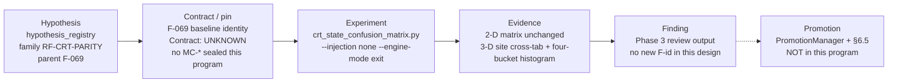
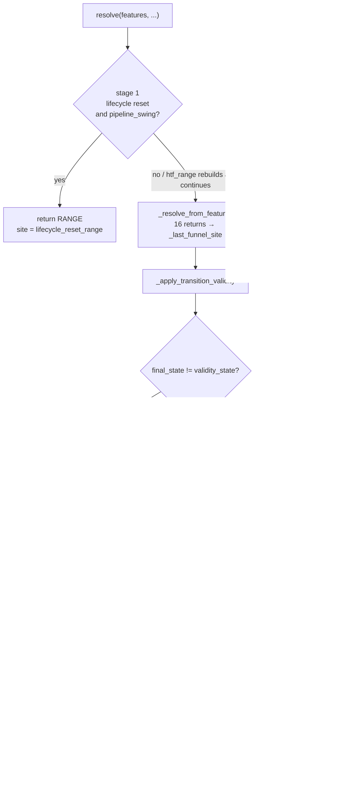
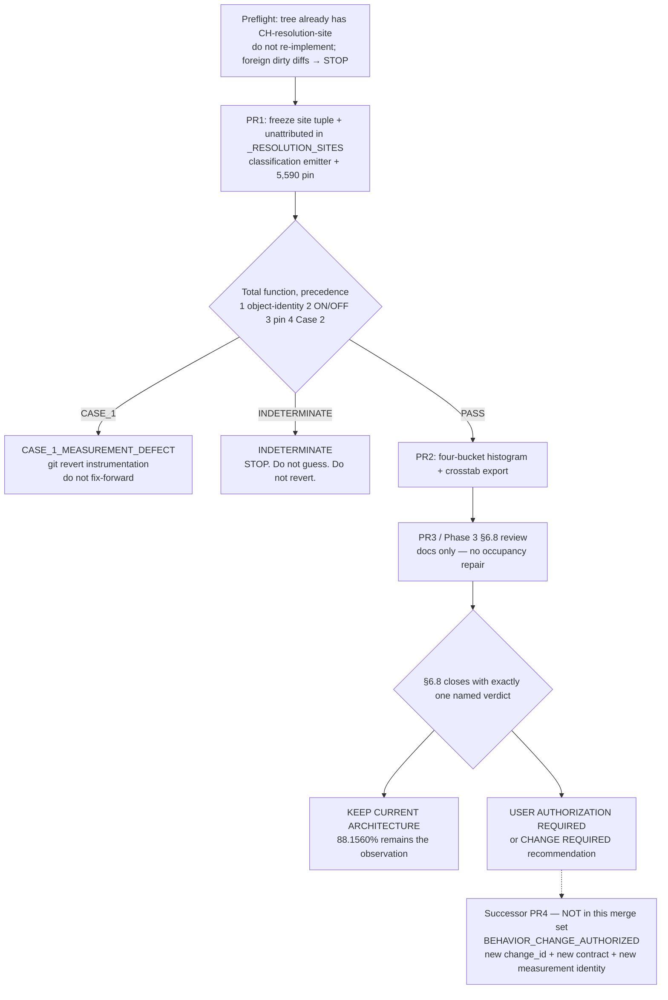

# `resolution_site` provenance with classified (not automatic) occupancy delta

| Field | Value |
|---|---|
| **Status** | Draft (revised 2026-09-05 after design review) |
| **Date** | 2026-09-05 |
| **Author** | Grok (design pass; implementation is a later authorized turn) |
| **Lane** | Measurement / evidence (Phases 1–2); semantic certification (Phase 3). Not economic qualification. |
| **Parent finding** | F-069 (`docs/current-findings.md`, VALIDATED / Certain, 2026-08-05) |
| **Existing plan** | Instrumentation sections of `docs/implementation_plan/good-idea-before-tracing-wobbly-hennessy.md` are **incorporated**. That plan's Verification pin (mismatch total **5,447** and **95.8%** EXPANSION-side) is **SUPERSEDED** by this document. Implementers must not follow those two numbers. |
| **Starting state** | Working tree already contains the CH-resolution-site recorder, AST floors, and 3-D harness fields. PR1/PR2 **rebase on that tree**; they are not greenfield. Do not re-implement or rename live site ids. |
| **Refinement** | Occupancy/agreement delta is **classified**, not automatically reverted |
| **TASK_CLASS** | Phase 1–2: `OBSERVATION_ONLY`. Phase 3: review only (not `OBSERVATION_ONLY`). Successor model correction: `BEHAVIOR_CHANGE_AUTHORIZED` and **out of this design's merge set**. |
| **Out of authority** | P-GOAL-04 stays closed. No G001. CRT surface stays OPEN (F-074). No production promotion. No new SEM- / FM- / F- / CC- / CH- ids minted here. |

---

## Overview

F-069 measured `CRTStateResolver` vs `BacktestRunner` at **88.1560%** agreement (41,607 / 47,197 XAUUSD M15 bars, `injection=none`, `engine_mode=exit`) and classified the residual by **mismatch cell**, never by **which code path produced the resolver's answer**. Stage-aware `resolution_site` provenance on the default-OFF `last_resolver_evidence` recorder is the measurement that answers "which mechanism produced this state?"

**That recorder is already in the working tree.** This design does not ask anyone to add `_RESOLUTION_SITES` or a `--record-sites` flag. It freezes the live site tuple, adds a classification machine with explicit precedence, runs the 5,590-mismatch F-069 pin, and replaces the harness's two-way residual split (which stuffs stage 3/4 into "predicate-derived") with a four-bucket histogram.

The existing plan's Verification section treated any occupancy movement as automatic revert. That rule is **SUPERSEDED**. The replacement, which remains load-bearing, is:

```text
Any behavior change = automatic classification
```

Two outcomes are not the same object:

| Case | What happened | What it is | Action |
|---|---|---|---|
| **1** | Recorder/instrumentation moved occupancy with no intended semantic change | Measurement-system defect | **Revert** the instrumentation. Do not "fix forward." |
| **2** | Attribution showed occupancy is produced by a path inconsistent with the declared CRT contract, and a §6.8 review then authorized a model correction that moves occupancy | Model correction | **Do not revert.** Freeze the delta as evidence. Measure it. Occupancy change is a later `BEHAVIOR_CHANGE_AUTHORIZED` construction turn, not this program. |

**Parity ≠ truth.** 88.1560% is a pinned *observation*, not a goal and not a permanent golden. The goal of this program is:

```text
Observed → Measured → Attributed → classified against market reality and the declared contract
```

The instrumentation does not maximize parity. It answers *which mechanism is producing the state?* Only after that can anyone ask *should that mechanism exist?*

Classification is a **total function with precedence**. Object-identity guards (`INDETERMINATE`) fire **before** Case 1. A default CLI run (`--injection` defaults to `full`) is not a pin comparison and must not revert the recorder.

---

## Background & Motivation

### Current state (verified 2026-09-05 against this working tree)

- **F-069** (`docs/current-findings.md`): config-only resolver↔engine agreement is **88.1560% (41,607/47,197)**; RANGE/SWEEP/DISPLACEMENT recall already 96.75 / 96.40 / 97.59; EXPANSION recall **10.77%** (498/4,625). Best anti-Simpson-safe config candidate **+0.30pp**. Residual declared **structurally config-unreachable**.
- Authoritative write-up: `reports/crt_semantic_parity_report.md` (same text as `reports/CRT_SEMANTIC_PARITY_REPORT.md` in this checkout). Machine twin: `results/analysis/crt_semantic_parity.classified.json`. Pre-registration: `docs/research/preregistration-crt-semantic-parity.md`.
- Mismatch cells are classified by `scripts/research/crt_parity_classifier.py::classify_mismatch`, which takes a **cell**, not a bar.
- **Recorder already shipped in this tree (do not re-implement):**
  - `_RESOLUTION_SITES` / `_PRE_PREDICATE_SITES` at `src/features/crt_state_resolver.py:202-251`
  - Unconditional `_last_funnel_site` on all 16 funnel returns and the stage-1 RANGE return (`:678`, `:1272-1432`)
  - `_last_injection_site` on each `engine_state_to` branch (`:714-748`)
  - `_publish_resolution_evidence` (`:1539-1574`) with injection > validity > funnel and `engine_injection_unattributed` fallback
  - AST exhaustiveness + default-OFF + precedence tests in `tests/research/test_rc003_distinct_object.py:129-391`
  - `build_resolver_timeline` **always** sets `record_resolver_evidence = True` (`crt_state_confusion_matrix.py:389`) — there is **no** `record_sites` / `--record-sites`
  - `build_confusion` already emits `site_matrix` / `residual_pre_predicate` / `residual_predicate_derived` (`:619-687`, JSON at `:1010-1018`)
- `record_resolver_evidence` still defaults `False` on `CRTStateResolver.__init__` (`:346`). The confusion-matrix harness turns it on; the class default is unchanged.
- CLI default is `--injection full` (`crt_state_confusion_matrix.py:1207-1216`) and `--engine-mode exit` (`:1171-1176`). `full` is the F-069-reversed contamination (unconditional oracle → 64–99% figures). A pin comparison that omits `--injection none` is the wrong object.

### Pain

Without stage-aware provenance, "how much of the residual is decided before the `when:` predicates are evaluated?" is an argument, not a number. The tree now records sites, but (a) the F-069 occupancy pin with classification precedence has not been run, (b) the harness's two-way split stuffs stage 3/4 into `residual_predicate_derived`, and (c) a default CLI run would compare oracle-injected occupancy to the config-only pin.

### Why the parity-guard refinement is load-bearing

The existing plan said: if agreement, matches, total, mismatches, or per-state recall move, revert — "the whole claim is that it does not." That is the correct rule **for an `OBSERVATION_ONLY` recorder after the run is known to be the F-069 object**. It is the wrong standing rule **for the program**, because (1) a later authorized model correction that *should* move occupancy would be indistinguishable from a broken recorder, and (2) a wrong-object run (default `--injection full`, dirty tree) must not revert the recorder.

`docs/governance/TASK_CLASSIFICATION_BEHAVIOR_POLICY.md` already SUPERSEDED the general "future work must preserve baseline transition/event/trade hashes" rule (2026-07-14). This design does **not** re-impose hash-golden-forever. It pins the F-069 observation **because Phase 1 claims observation-only**, then **classifies** any later delta, with object-identity guards first.

Same lesson as corpus-freeze drift:

```text
Green tests ≠ valid evidence
High parity ≠ correct state construction
```

### Number correction (E-001) — SUPERSEDES the existing plan's Verification pin

The existing plan's Verification section still says:

> confirm agreement reproduces **88.1560% (41,607/47,197)** and the mismatch total **5,447**

That mix is wrong. **This document SUPERSEDES those two Verification numbers (5,447 and 95.8%).** Implementers must not follow them. Instrumentation sections of that plan remain incorporated.

Verified against `reports/crt_semantic_parity_report.md` and `results/analysis/crt_semantic_parity.classified.json`:

| Object | Agreement | Matches | Total | Mismatches |
|---|---:|---:|---:|---:|
| **F-069 baseline** (`injection=none`, `engine_mode=exit`, untouched resolver config) | **88.1560%** | **41,607** | **47,197** | **5,590** (= 47,197 − 41,607) |
| Iter-18 best anti-Simpson-safe candidate (`body_ratio_min=0.55` + `max_expansion_age_candles=250`, 88.4590%) | 88.4590% | 41,750 | 47,197 | **5,447** (sum of the 22 classified off-diagonal cells in report §4) |

Report §4 sits immediately after §3 (best candidate) and is the remaining-mismatch table for **that** candidate, not the baseline. Baseline top confusions in the pre-registration (`EXPANSION→RANGE 3,335`, `RANGE→EXPANSION 1,052`, `EXPANSION→SWEEP 735`, `SWEEP→EXPANSION 242`, `EXPANSION→DISPLACEMENT 54`) already differ from the §4 cells (`3,374 / 870 / 726 / 203 / 50`).

**Phase 1 pins the F-069 baseline identity, not the iter-18 residual.**

The existing plan's **"95.8% of mismatched bars are EXPANSION-side"** is also SUPERSEDED as a pin. Verified from report §5: Category C volume is **5,233 / 5,447 = 96.1%**, the six EXPANSION-involving `C-GEOMETRY` cells of the **iter-18** table. Phase 2 will *measure* a four-bucket residual histogram of the **Phase 1 pinned residual** (baseline 5,590 mismatches). It will not copy 95.8% or 96.1% as a Phase 1 constant.

`classified.json` `baseline` stores `agreement_rate` and per-state `engine_n`/`resolver_n`/`tp`/`recall`. It does **not** store `matches` / `total` / `mismatches`. Those three integers are derived: matches = 41,607, total = 47,197, mismatches = 5,590. Do not "load the pin from the JSON" as if those keys existed.

---

## Goals & Non-Goals

### Goals

1. **Freeze** the working-tree `resolution_site` recorder (do not re-implement, do not rename live ids). Additive only: put `engine_injection_unattributed` in `_RESOLUTION_SITES` so the published fallback is a declared id.
2. Prove Phase 1 identity with the pinned F-069 observation via a **mechanical comparator**. If that identity breaks after object-identity guards pass, and no intended semantic change was declared: **Case 1**, revert.
3. Export the existing 3-D `site_matrix` and replace the two-way residual split with a **four-bucket histogram** that does not stuff stage 3/4 into predicate-derived.
4. When any occupancy/agreement delta is detected, emit a **structured classification** (`CASE_1_MEASUREMENT_DEFECT` | `CASE_2_CONTRACT_QUESTION` | `INDETERMINATE`) as a **total function with explicit precedence**. Object-identity failures are `INDETERMINATE`, not Case 1.
5. Run a §6.8 semantic review of the dominant site against the intended CRT contract. Review does not edit production code. Occupancy repair, if any, is a separate authorized turn.

### Non-goals (deliberate, inherited and extended)

- No parity-maximizing repair. F-069 already swept 33 candidates; best safe +0.30pp; residual structurally config-unreachable.
- `max_displacement_strength=3.0` recovers +2.65pp (`reports/crt_semantic_parity_report.md` §6, +2.648pp) and has **no resolver counterpart**. That is a behavior change, not this program.
- Not reopening CRT closure (OPEN per F-074 directional displacement).
- Not a new CRT object, not Sujan, not live rail, not production promotion, not P-GOAL-04, not G001.
- Do not touch `scripts/research/crt_parity_classifier.py` or `scripts/research/crt_parity_report.py`.
- No new production-config key in Phase 1. `resolve()` signature unchanged.
- Do **not** add `--record-sites`. The harness already always records. Do not wrap always-on capture in a default-off flag the tree does not have.
- Do not mint SEM- / FM- / F- / CC- / CH- ids in this document. Implementers allocate a construction-protocol `change_id` at PR time.
- A hypothetical later "authorized model correction" PR is **named as a successor** and is **out of this design's merge set**.

---

## Key Decisions

1. **`Parity ≠ truth`; 88.1560% is an observation, not a goal.** Rationale: F-069 already proved that raising the headline can destroy EXPANSION recall (anti-Simpson guard). Maximizing agreement would repeat that failure. The question is mechanism, then contract.

2. **Any occupancy/agreement delta is classified, not auto-reverted and not auto-accepted.** Rationale: Case 1 (broken recorder) and Case 2 (authorized model correction) are different objects that can produce the same numeric movement. A single revert rule cannot tell them apart. This is the operationalization of `TASK_CLASSIFICATION_BEHAVIOR_POLICY.md` for this program, not a revival of hash-golden-forever.

3. **Classification is a total function with precedence: object-identity `INDETERMINATE` before Case 1 before pin-field Case 1 before Case 2.** Rationale: the first-row "any moved pin under OBSERVATION_ONLY → Case 1" rule would git-revert the recorder after a default `--injection full` run or a dirty tree. That is the opposite of STOP-and-do-not-guess.

4. **Phase 1 FAIL (pin fields moved) with no intended semantic change, *after* object-identity guards pass, is Case 1.** Rationale: Phase 1's claim *is* observation-only on the F-069 object. A moved baseline on that object is a measurement defect. Case 2 cannot be declared by the implementer mid-PR.

5. **Case 2 occupancy change does not happen inside Phase 1 or Phase 2.** Rationale: Phase 2 attributes the *unchanged* residual. Phase 3 reviews. Only a later `BEHAVIOR_CHANGE_AUTHORIZED` construction turn may change occupancy. If occupancy moves during Phase 1/2 after guards pass, that is Case 1, never Case 2.

6. **Who decides Case 2: the §6.8 review, not the implementer.** Rationale: `docs/governance/SEMANTIC_REVIEW_PROTOCOL.md` §17 — a review never edits production code; implementation is a separate authorized turn through `REPOSITORY_CONSTRUCTION_PROTOCOL.md`.

7. **Revert means git-revert of the instrumentation, not fix-forward.** Rationale: retuning thresholds or rewriting occupancy to recover 88.1560% would manufacture the pin. Revert is only legal after the machine has emitted `CASE_1_MEASUREMENT_DEFECT`.

8. **Phase 1 pins the F-069 *baseline* identity (mismatches = 5,590), not the iter-18 5,447 table. The existing plan's Verification pin is SUPERSEDED.** Rationale: mixing those two objects is how a recorder could "pass" against the wrong residual.

9. **Freeze the working-tree site tuple. Do not rename. Add `engine_injection_unattributed` to `_RESOLUTION_SITES`.** Rationale: funnel 16 ids already match; stage-4 ids in the tree are `engine_injection_shadow_pending` / `engine_injection_expansion` / `engine_injection_expansion_exit` / `engine_injection_range_leave`. Renaming them fights existing tests. The unattributed fallback is already published (`_publish_resolution_evidence:1560`) and tested (`test_rc003_distinct_object.py:334-350`) but is absent from the frozen tuple.

10. **Adopt the working-tree deciding-site rule (injection applied → `_last_injection_site` or `engine_injection_unattributed`; never bill a nameless override to the funnel).** Rationale: `engine_injection_*` is not a function. A missed branch that falls through to the funnel is the silent-gap the fallback exists to prevent.

11. **Pin comparison is mechanical integers + `round(100.0 * tp / engine_n, 2)`, not 4-decimal rate floats.** Rationale: source recalls are `0.9675206376316539` etc. Exact-float compare of `0.9675` fails a correct run.

12. **Phase 2 headline is a four-bucket residual histogram, not `_PRE_PREDICATE_SITES` as a binary split.** Rationale: the current harness (`build_confusion:684-687`) does `s in _PRE_PREDICATE_SITES` else post, which puts `transition_validity_rewrite` and all `engine_injection_*` into `residual_predicate_derived` and `lifecycle_reset_range` into pre. That is exactly the mix Phase 2 forbids.

13. **This design's merge set is PR1 + PR2 + PR3. PR4 is a named successor, not scheduled as approved.** Rationale: Phase 3 may conclude `INTENTIONAL SEMANTIC SEPARATION` or `INSUFFICIENT EVIDENCE`.

14. **Map the user's "TradeImpl" pipeline onto the existing repo chain. Do not invent a TradeImpl package.**

```text
Hypothesis  →  Contract  →  Experiment  →  Evidence  →  Finding  →  Promotion
     │              │              │              │            │            │
 hypothesis    F-069 is     crt_state_        cross-tab    current-     PromotionManager
 registry      Contract:    confusion_        + pin        findings.md  + §6.5 Authority
 (RF-CRT-      UNKNOWN;     matrix.py         artifacts    (no new      Ladder (this
 PARITY)       no MC-*      --injection none                 F-id here)   program never
               sealed here  --engine-mode exit                             reaches this)
```

15. **PR1 completion arm is the F-069 occupancy pin + ON/OFF state-series identity, not a 2-instrument trade ledger.** Rationale: `RUNTIME_DECISION_PATH_CHANGE`'s default rollback language is a BNB/SOL ledger. `CRTStateResolver` is not the trade-admitter (`ConstructionTraceEmitter` in `src/runtime/crt_construction_trace.py` is sidecar, default-off).

---

## Proposed Design

### Starting state — rebase, do not re-implement

Preflight before any PR1 edit:

1. `git status --porcelain` on `src/features/crt_state_resolver.py`, `scripts/research/crt_state_confusion_matrix.py`, `tests/research/test_rc003_distinct_object.py`.
2. If `_RESOLUTION_SITES` is already present (it is, at `:202`): **do not re-implement the recorder.** PR1 is freeze + classify + pin.
3. Concurrent *foreign* uncommitted diffs on those files remain `INDETERMINATE` until classified. The CH-resolution-site work in *this* tree is the starting state, not a foreign collision.

### Research-pipeline mapping (existing chain, not a new package)



This program stops at Evidence (Phases 1–2) and Finding-as-review (Phase 3). §6.5: information ≠ value ≠ authority ≠ architecture.

### Four-stage overwrite (load-bearing constraint)

Verified against `src/features/crt_state_resolver.py` in this working tree (line numbers drift; re-check before implementing):

| Stage | Symbol | Lines (this tree) | Can it decide the returned state? |
|---|---|---|---|
| 1. lifecycle reset | `_apply_lifecycle_resets` → `resolve()` RANGE return | `resolve` `:498`; early return `:671-685` | Yes — but **only** when `_sweep_geometry != "htf_range"` (`pipeline_swing`). Default config is `sweep_geometry: htf_range`. On the F-069 baseline this early return is structurally unreached; `lifecycle_reset_range` occupancy ~0 is expected. |
| 2. funnel | `_resolve_from_features` | `:1253`, **16** `return`s | Yes |
| 3. transition validity | `_apply_transition_validity` | `:1788` | Yes — rewrites, e.g. sticky-age expiry → `"RANGE"` |
| 4. engine-oracle injection | `engine_state_to` block | `:698-748` | Yes — overrides everything when `engine_state_to` is passed. **At `injection=none` this block does not fire.** Mixing injection modes with the F-069 pin is `INDETERMINATE` (object-identity guard, first). |

`resolve()` has **2** returns (early RANGE on pipeline_swing reset; final return). `_resolve_from_features` has **16**. Later stages overwrite earlier ones.



### Site catalog (freeze the working-tree tuple; do not rename)

`_RESOLUTION_SITES` at `crt_state_resolver.py:202-233` is the frozen vocabulary. Funnel 16 ids already match this design's original catalog. Stage-4 ids **in the tree** (keep these names):

| Working-tree id | Set at | When |
|---|---|---|
| `engine_injection_shadow_pending` | `:714` | `eng_to == "SHADOW_PENDING"` and `cur_pre` in RANGE/SWEEP/SHADOW_PENDING |
| `engine_injection_expansion` | `:726, :729, :733` | EXPANSION inject along engine-legal edges |
| `engine_injection_expansion_exit` | `:741` | EXPANSION leave → RETEST/EXPIRED/RANGE/RESOLUTION/SWEEP |
| `engine_injection_range_leave` | `:748` | DISP/SWEEP/SHADOW → RANGE leave |
| `engine_injection_unattributed` | publish fallback `:1560` | `final_state != validity_state` and `_last_injection_site is None` |

**PR1 additive (not a rename):** append `"engine_injection_unattributed"` to `_RESOLUTION_SITES`. It is already published and tested; it is the one declared-id gap. Do not rename `engine_injection_shadow_pending` → `engine_injection_shadow`, etc.

**Funnel, pre-predicate (11)** — decided before the `when:` loop. These eleven (and only these eleven) are `pre_predicate_funnel` in the Phase 2 histogram:

`ttl_expiry`, `expansion_dwell_hold`, `execution_resolution`, `execution_age_resolution`, `sweep_age_expiry`, `shadow_collapse_expansion`, `shadow_leak_range`, `htf_founding_shadow`, `htf_founding_sweep`, `funnel_displacement`, `funnel_expansion`

**Funnel, predicate-derived (5)** — `when:` loop and fallthrough. These five (and only these five) are `predicate_derived_funnel`:

`funnel_entry_sweep_override`, `sticky_protects_range_match`, `predicate_match`, `sticky_hold_no_match`, `ground_state_fallthrough`

Same-output/opposite-reason pairs that must stay distinct: `sweep_age_expiry` vs `ground_state_fallthrough`; `sticky_protects_range_match` vs `sticky_hold_no_match`.

**Non-funnel (own histogram keys, not stuffed into 11 or 5):**

| Site id | Stage | Histogram key |
|---|---|---|
| `lifecycle_reset_range` | 1 | `lifecycle_reset_range` (expected ~0 at F-069 `htf_range`) |
| `transition_validity_rewrite` | 3 | `stage3_validity` |
| the four named `engine_injection_*` plus `engine_injection_unattributed` | 4 | `stage4_injection` (expected ~0 at `injection=none`) |

`_PRE_PREDICATE_SITES` (`:238-251`) currently includes `lifecycle_reset_range` plus the 11 and **excludes** stage 3/4. Leave that frozenset as the published `pre_predicate` boolean on `last_resolver_evidence` (existing tests depend on it). **Ban using it as the Phase 2 headline split.**

### Recorder mechanics (already implemented; freeze)

Do not change `resolve()`'s signature. Do not add a second mechanism.

`last_resolver_evidence` keys already published by `_publish_resolution_evidence` (`:1565-1574`):

```text
funnel_site, funnel_state, validity_state, validity_rewrote,
injection_state, injection_applied, resolution_site, pre_predicate
```

plus the older RC-003 keys (`feature_states`, `sweep_geometry`, `sweep_sig`, `range_h_ref`, `range_l_ref`, `range_ready`).

**Working-tree deciding-site rule (adopt as written; this is the implementable form):**

```python
# crt_state_resolver.py _publish_resolution_evidence :1555-1564
validity_rewrote = validity_state != funnel_state
injection_applied = final_state != validity_state
if injection_applied:
    site = self._last_injection_site or "engine_injection_unattributed"
elif validity_rewrote:
    site = "transition_validity_rewrite"
else:
    site = self._last_funnel_site
```

Each injection branch assigns a concrete id (`:714-748`). If injection changed the answer but named no site, publish `engine_injection_unattributed` — **never the funnel**.

`_last_funnel_site` / `_last_injection_site` are written unconditionally; only publish is flag-gated. `record_resolver_evidence` defaults `False`.

### AST exhaustiveness floor (already implemented; keep)

`tests/research/test_rc003_distinct_object.py:129-391` already walks every `ast.Return` in `_resolve_from_features`, pins 16 distinct funnel ids, pins `lifecycle_reset_range` on the stage-1 return, pins the 5 predicate-derived ids out of `_PRE_PREDICATE_SITES`, pins publish-off, pins injection > validity > funnel, and pins the unattributed fallback. PR1 extends that file only to assert `engine_injection_unattributed in _RESOLUTION_SITES`. Do not start a new test module.

ON/OFF state-series identity stays a **pytest** check (class default off vs capture on, same inputs, identical returned states). There is no CLI `--record-sites`. The 47,197-bar pin run uses the harness's always-on capture; that is the object F-069 occupancy must match.

### Confusion-matrix harness (already records; PR1/PR2 change classification + histogram)

Current tree (do not wrap in a new default-off flag):

- `build_resolver_timeline` `:389` always sets `resolver.record_resolver_evidence = True` and appends `resolution_site` per bar; `meta` has `site_counts` / `n_site_unattributed`.
- `build_confusion` takes optional `resolution_sites` and fills `site_matrix` over **mismatched** bars only (`:666-687`).
- JSON artifact already has a `resolution_site` object (`:1010-1018`).
- CLI `--injection` **default is `full`**. `--engine-mode` default is `exit`.

**PR1** adds the classification emitter (function in this script, not a new unregistered path) and the pin-run fail-closed argv check. **PR2** adds `residual_histogram` (schema below) next to the existing two-way fields. The two-way fields may remain as labeled-contaminated diagnostics; they are **not** the Phase 2 headline.

Do **not** touch `crt_parity_classifier.py` or `crt_parity_report.py`. Do **not** add `--record-sites`.

### Phase 2 residual histogram (implementable schema)

Ban: `if s in _PRE_PREDICATE_SITES: pre else: post` as the headline.

New object, counted **only over mismatched bars**, keys sum to `obs.mismatches`:

```json
"residual_histogram": {
  "pre_predicate_funnel": 0,
  "predicate_derived_funnel": 0,
  "stage3_validity": 0,
  "stage4_injection": 0,
  "lifecycle_reset_range": 0,
  "unattributed": 0
}
```

| Key | `resolution_site` membership |
|---|---|
| `pre_predicate_funnel` | the 11 funnel pre-predicate ids listed above (**not** `lifecycle_reset_range`) |
| `predicate_derived_funnel` | the 5 funnel predicate-derived ids |
| `stage3_validity` | `transition_validity_rewrite` |
| `stage4_injection` | `engine_injection_shadow_pending`, `engine_injection_expansion`, `engine_injection_expansion_exit`, `engine_injection_range_leave`, `engine_injection_unattributed` |
| `lifecycle_reset_range` | `lifecycle_reset_range` only |
| `unattributed` | `resolution_site is None` (harness `n_site_unattributed` on a mismatched bar) |

Invariant: `sum(residual_histogram.values()) == obs.mismatches`. At the F-069 pin that is 5,590. `lifecycle_reset_range` and `stage4_injection` expected ~0 at `injection=none` + `htf_range`; non-zero after object-identity guards pass is a pin/classification event.

The 11+5 buckets are computed **only** on funnel-decided mismatched bars (`resolution_site` in the 16 funnel ids). Stage 3/4 bars are not dual-counted into those buckets.

Keep `site_matrix` `(engine_state, resolver_state, resolution_site) → n` over mismatched bars as the 3-D export (already computed). PR2 writes `reports/crt_resolution_site_crosstab.json` + `.md` from that matrix + `residual_histogram`. Do not mutate `reports/crt_semantic_parity_report.md` numbers.

### Artifacts

| Artifact | Role | Mutation this program |
|---|---|---|
| `reports/crt_semantic_parity_report.md` | F-069 2-D write-up | **Do not rewrite numbers.** Optional one-line pointer in PR3. |
| `results/analysis/crt_semantic_parity.classified.json` | F-069 machine twin | Untouched. Not a complete pin recipe (no matches/total/mismatches keys). |
| Existing confusion-matrix 2-D fields | Historical 2-D | Regenerated 2-D fields must match the F-069 pin; new fields are additive |
| `reports/crt_state_confusion_matrix.json` `resolution_site` object | Harness 3-D (already present) | PR2 adds `residual_histogram`; do not use two-way fields as headline |
| `reports/crt_resolution_site_crosstab.json` + `.md` | **New in PR2.** 3-D tab + four-bucket histogram of the Phase 1 residual | Created in PR2 |
| `reports/crt_occupancy_delta_classification.json` | **New in PR1.** Structured Case 1 / Case 2 / INDETERMINATE record | Emitted whenever a pin comparison is run |
| F-069 2-D matrix identity | Observation pin | Byte-reproducible for the life of Phase 1/2. After a later authorized correction, **new measurement identity**. |

### Three-phase flow



---

## Classification machine (load-bearing)

When Phase 1, an ON/OFF comparison, or a later occupancy run detects a delta, the system **emits a structured classification**. It does not silently revert and does not silently proceed.

This is a **total function**. Rows are not an unordered set. Evaluate **in this order** and return on the first match.

### Pin-run argv (fail closed)

A comparison against the F-069 pin is illegal unless the run record shows these flags were **present in argv** (not inherited from argparse defaults). The live CLI default `--injection full` is the F-069-reversed object.

Exact pin command (interpreter `D:\Tradelatest\venv\Scripts\python.exe`):

```text
venv\Scripts\python.exe scripts/research/crt_state_confusion_matrix.py ^
  --injection none ^
  --engine-mode exit ^
  --ohlcv data/mt5/XAUUSD_M15.csv ^
  --events results/run_20260724_104845_XAUUSD/XAUUSD_events.jsonl ^
  --reference-summary results/run_20260724_104845_XAUUSD/XAUUSD_summary.json
```

`--engine-mode exit` is the argparse default; it is still **required in argv** for a pin comparison so omission cannot silently succeed. If `--injection` or `--engine-mode` is omitted, the classification emitter **must not** emit `PASS` or `CASE_1_MEASUREMENT_DEFECT`. It emits `INDETERMINATE` (wrong object / unspecified object) and does not revert.

Echo corpus path + row count before the run (CLAUDE.md §1.5). Aligned N must be 47,197 (raw OHLCV 47,275, warmup drop 78).

### Mechanical pin comparator

Do not compare 4-decimal recall floats. `classified.json` `baseline.per_state` fractions are `0.9675206376316539`, `0.9640205596801827`, `0.9758713136729222`, `0.10767567567567568`. Agreement `41607/47197 = 0.8815602686611437` is exact and may be stored; it is **not** the recall comparator.

A pin field has **moved** iff any of these fail:

```text
obs.matches == 41607
obs.total   == 47197
obs.mismatches == obs.total - obs.matches == 5590

round(100.0 * tp / engine_n, 2) equals:
  RANGE        96.75   (engine_n=35130, tp=33989)
  SWEEP        96.40   (engine_n=7004,  tp=6752)
  DISPLACEMENT 97.59   (engine_n=373,   tp=364)
  EXPANSION    10.77   (engine_n=4625,  tp=498)
```

Optionally also require `engine_n`/`tp` identity on those four states so a reconstruction change cannot hide behind rounded recall. Headline agreement rate is implied by matches/total; do not separately float-compare 0.8815602686611437 unless as a checksum of 41607/47197.

### Inputs (run record)

```text
argv.injection_explicit          # bool: --injection present
argv.engine_mode_explicit        # bool: --engine-mode present
argv.injection                   # value if present
argv.engine_mode                 # value if present
corpus_path, aligned_n
working_tree_clean_resolver      # no concurrent FOREIGN uncommitted diff on the three files
on_off_state_series_identical    # pytest: capture on vs off, identical returned states
task_class
intended_semantic_change_declared
s68_review_artifact_closed       # path to a review that closed with exactly one named verdict, or None
behavior_change_authorized_manifest  # path to a BEHAVIOR_CHANGE_AUTHORIZED impact json, or None
obs.matches, obs.total, obs.mismatches
obs.engine_n, obs.tp             # per RANGE/SWEEP/DISPLACEMENT/EXPANSION
```

### Precedence (return on first match)

```text
(1) Object-identity guards — INDETERMINATE if any fail
    comparing to F-069 pin AND (
         not argv.injection_explicit
      OR not argv.engine_mode_explicit
      OR argv.injection != "none"
      OR argv.engine_mode != "exit"
      OR aligned_n != 47197
      OR corpus_path is not the F-069 OHLCV
      OR working_tree_clean_resolver is false
    )
    → INDETERMINATE, action=stop
    Do not revert. Do not proceed. A default CLI run (--injection full) dies here.

(2) ON/OFF identity — Case 1 if failed
    on_off_state_series_identical is false
    → CASE_1_MEASUREMENT_DEFECT, action=revert_instrumentation
    (Guards in (1) already passed, so this is the recorder changing states.)

(3) Pin fields under OBSERVATION_ONLY — Case 1 if moved
    task_class == OBSERVATION_ONLY
    AND intended_semantic_change_declared == false
    AND mechanical comparator fails
    → CASE_1_MEASUREMENT_DEFECT, action=revert_instrumentation

    task_class == OBSERVATION_ONLY
    AND intended_semantic_change_declared == false
    AND mechanical comparator passes
    AND on_off_state_series_identical
    → PASS, action=proceed

(4) Case 2 — only with a closed §6.8 artifact AND a BEHAVIOR_CHANGE_AUTHORIZED manifest
    s68_review_artifact_closed is not None
    AND behavior_change_authorized_manifest is not None
    AND mechanical comparator fails
    → CASE_2_CONTRACT_QUESTION, action=freeze_delta
    Do not revert. Do not treat obs as the new golden.

    intended_semantic_change_declared == true
    AND (s68_review_artifact_closed is None OR manifest is None)
    → INDETERMINATE, action=stop
    Implementer cannot self-certify Case 2.

(5) Anything else → INDETERMINATE, action=stop
```

**Who decides Case 2:** the §6.8 review, not the implementer mid-PR. A PR description that says "this is Case 2" without a review artifact that closes with exactly one named verdict is step (4)'s `INDETERMINATE` arm.

### What "revert" means (Case 1 only)

- `git revert` of the instrumentation commit(s), or restore the recorder to the pre-PR tree.
- **Do not** change `market_crt_states.yaml` thresholds to recover 88.1560%.
- **Do not** "fix forward" occupancy.
- **Do not** proceed to Phase 2 on a moved baseline.
- **Do not** revert on `INDETERMINATE`.
- After revert, re-run the pin **with the exact argv**. If the pin is still moved, the cause is not this recorder — that is a new `INDETERMINATE`, not a second Case 1 against a ghost.

### What "measure it" means (Case 2)

- Freeze **before** and **after** occupancy tables (engine_n / tp / rounded recall, matches, total, mismatches) as evidence artifacts next to the classification JSON.
- Keep the F-069 88.1560% / 5,590 row on disk labeled as the **pre-correction observation**.
- Do not silently overwrite that row as "the new golden."
- The correction turn carries its own BUILD_IMPACT_MANIFEST, its own `change_id` (allocated then, not here), and a new measurement identity.
- Case 2 does not grant promotion, G001, or CRT closure.

### Emission shape

`reports/crt_occupancy_delta_classification.json`:

```json
{
  "kind": "OCCUPANCY_DELTA_CLASSIFICATION",
  "task_class": "OBSERVATION_ONLY",
  "intended_semantic_change_declared": false,
  "argv": {
    "injection_explicit": true,
    "engine_mode_explicit": true,
    "injection": "none",
    "engine_mode": "exit"
  },
  "pin": {
    "source": "F-069 baseline / reports/crt_semantic_parity_report.md §1",
    "matches": 41607,
    "total": 47197,
    "mismatches": 5590,
    "recall_pct_rounded": {
      "RANGE": 96.75,
      "SWEEP": 96.40,
      "DISPLACEMENT": 97.59,
      "EXPANSION": 10.77
    },
    "engine_n": {"RANGE": 35130, "SWEEP": 7004, "DISPLACEMENT": 373, "EXPANSION": 4625},
    "tp": {"RANGE": 33989, "SWEEP": 6752, "DISPLACEMENT": 364, "EXPANSION": 498}
  },
  "observed": {},
  "on_off_state_series_identical": true,
  "working_tree_clean_resolver": true,
  "precedence_step_matched": "1|2|3|4|5",
  "verdict": "PASS | CASE_1_MEASUREMENT_DEFECT | CASE_2_CONTRACT_QUESTION | INDETERMINATE",
  "action": "proceed | revert_instrumentation | freeze_delta | stop",
  "notes": ""
}
```

Compared values in this JSON are the mechanical integers and the two-decimal percents from `round(100.0 * tp / engine_n, 2)`. Do not emit 4-decimal rate floats as the compared recall.

---

## Phase 1 — Instrumentation validation

**`TASK_CLASS = OBSERVATION_ONLY`**

Must remain identical to the F-069 **baseline** (not iter-18), via the mechanical comparator:

| Quantity | Pin | How compared |
|---|---:|---|
| Matches | **41,607** | `obs.matches == 41607` |
| Total aligned bars | **47,197** | `obs.total == 47197` |
| Mismatches | **5,590** | `obs.mismatches == 5590` (and `== obs.total - obs.matches`) |
| RANGE recall | **96.75%** | `round(100.0 * 33989 / 35130, 2) == 96.75` |
| SWEEP recall | **96.40%** | `round(100.0 * 6752 / 7004, 2) == 96.40` |
| DISPLACEMENT recall | **97.59%** | `round(100.0 * 364 / 373, 2) == 97.59` |
| EXPANSION recall | **10.77%** | `round(100.0 * 498 / 4625, 2) == 10.77` |
| injection | `none` | **explicit argv**; default `full` is not this object |
| engine_mode | `exit` | **explicit argv** |

Also required:

- `record_resolver_evidence` still defaults `False` on the class.
- Flag-ON vs flag-OFF state series byte-identical (pytest).
- `resolve()` signature unchanged.
- No new key in `configs/production/*` or `market_crt_states.yaml`.
- Live `_RESOLUTION_SITES` ids not renamed.
- Pin run used the exact argv above.

If Phase 1 pin fields move **after** object-identity guards pass: **Case 1**. Revert. Do not proceed to Phase 2 on a moved baseline. If the pin run omitted `--injection none`: **INDETERMINATE**, do not revert.

---

## Phase 2 — Attribution

**Still `OBSERVATION_ONLY`.** Does not rewrite the Phase 1 observation. It attributes it.

Produce:

```text
Resolution Site  ×  Mismatch Cell
```

i.e. the existing `site_matrix` over the 5,590-bar baseline residual, plus `residual_histogram` (four buckets + `lifecycle_reset_range` + `unattributed`).

Phase 2 does **not** copy 95.8% or 96.1%. It *measures* the histogram. It does **not** report `residual_pre_predicate` / `residual_predicate_derived` as the headline.

If Phase 2's *occupancy* (not the new histogram) differs from Phase 1: classification machine fires with the same precedence. Under `OBSERVATION_ONLY` after guards pass, that is Case 1, not Case 2.

---

## Phase 3 — Semantic review

**`TASK_CLASS` does not stay `OBSERVATION_ONLY`.** This phase is review. It is not a behavior change and it is not instrumentation.

Question:

```text
Does the dominant resolution site represent the intended CRT contract?
```

Must follow `docs/governance/SEMANTIC_REVIEW_PROTOCOL.md` (CLAUDE.md §6.8): five questions in order; close with **exactly one** of:

`CONFIRMED DEFECT` · `INTENTIONAL SEMANTIC SEPARATION` · `STALE / LEGACY ARTIFACT` · `COMPATIBILITY ARTIFACT` · `DEFENSE-IN-DEPTH OPPORTUNITY` · `TEST / CONTRACT GAP` · `DOCUMENTATION GAP` · `DORMANT BUT VALID` · `INSUFFICIENT EVIDENCE` · `USER AUTHORIZATION REQUIRED`

- A review **never** edits production code, active config, production tests, or xfails (§17).
- Never conclude "defect" from difference alone (`different ≠ wrong`).
- Never collapse CURRENT / INTENDED / RECOMMENDED.
- If the verdict is that occupancy SHOULD change, that is a **separate** `BEHAVIOR_CHANGE_AUTHORIZED` construction-protocol turn with its own BUILD_IMPACT_MANIFEST. Do not silently fold repair into instrumentation.
- Do not use the word "bug" unless a violated semantic contract is named.
- Do not invent SEM- / FM- / F- ids to hold the verdict.

PR3 is **docs/review only**. Merge set of this design ends there.

---

## API / Interface Changes

### `CRTStateResolver.resolve` — no signature change

Already returns `str`. Callers unchanged.

### `last_resolver_evidence` — already additive in this tree

Keys listed above. When `record_resolver_evidence` is False, the dict stays `None`.

### `_resolve_from_features` — return type stays `str`

Already sets `self._last_funnel_site` immediately before each return. Do not change to a tuple.

### `build_resolver_timeline` / `build_confusion`

Already record sites (always-on in the harness) and accept `resolution_sites`. PR2 adds `residual_histogram` on `ConfusionReport`. No `--record-sites`.

No production-config key. No `ACTIVE_VERSION` edit. No `market_crt_states.yaml` threshold edit in Phases 1–3.

---

## Data Model Changes

No `CANONICAL_FEATURES` / schema-hash change. No identity-store PK change. No new JSONL claim class.

New research artifacts as listed. Rollback of a Case 1 PR1 is git revert of the classification emitter / unattributed-tuple append; the pre-existing recorder stays unless Case 1 proved *that* recorder moved occupancy (then revert the recorder commits too — still git revert, not fix-forward).

---

## Change classification and BUILD_IMPACT_MANIFEST

Classes from `docs/governance/change_contracts.json`. Implementers allocate `change_id` at PR time (this design does not mint CH-*).

Mandatory impact fields: `change_id`, `objective`, `change_classes`, `affected_files`, `required_checks_ack`, `unknowns`, `rollback_boundary`. Completion fields: `change_id`, `declared_files`, `checks_executed`, `repo_state_hash`, `completion_status`.

`GOVERNED_SURFACE_PREFIXES` include `src/`, `configs/`, `scripts/`, `models/`, `tests/`. Declaring a `scripts/**/*.py` path requires `tests/test_script_registry.py` on the executed/acked set (SITS belt at `construction_protocol.py:164-186`).

### Phase 1 / PR1

| Field | Value |
|---|---|
| `change_classes` | `RUNTIME_DECISION_PATH_CHANGE` (closest existing class that may touch `src/features/crt_state_resolver.py`) |
| `production_behavior_changed` | `NO` |
| `TASK_CLASS` | `OBSERVATION_ONLY` |
| `authority_granted` | `NONE` — live spine / fusion / decision / planner / risk / G001 / CRT closure / promotion are not granted. `CRTStateResolver` is not the trade-admitter. |
| Completion arm | **F-069 occupancy pin** (mechanical comparator, exact argv) **+ ON/OFF state-series identity**. The class's default "2-instrument byte-identical **ledger**" rollback language is **N/A** for this change. Do not run a BNB/SOL ledger and call the class satisfied. |
| `required_checks_ack` | class required checks (`tests/test_feature_math_lint.py`, `tests/test_geometry_census.py`, `tests/test_current_findings.py`) **plus** `tests/research/test_rc003_distinct_object.py` **plus** `tests/test_script_registry.py` (SITS: `scripts/research/crt_state_confusion_matrix.py` is declared) |
| `affected_files` | `src/features/crt_state_resolver.py` (append `engine_injection_unattributed` to `_RESOLUTION_SITES` only, unless the pin proves the recorder itself moved occupancy), `tests/research/test_rc003_distinct_object.py`, **`scripts/research/crt_state_confusion_matrix.py`** (classification emitter + argv fail-closed), impact/completion manifests, `assistant_project.md` |
| `rollback_boundary` | git revert of PR1; no threshold write-back |
| Blocking UNKNOWN | concurrent **foreign** uncommitted diff on the three files — STOP. The in-tree CH-resolution-site recorder is the starting state, not a blocker. |

Do **not** classify PR1 as `DOCUMENTATION_ONLY`. Do **not** classify as `FEATURE_IDENTITY_CHANGE` / `FORMULA_CHANGE` / `PRODUCTION_CONFIG_CHANGE`.

### Phase 2 / PR2

| Field | Value |
|---|---|
| `change_classes` | `RUNTIME_DECISION_PATH_CHANGE` if `src/` is still touched for histogram helpers; otherwise declare `scripts/research/crt_state_confusion_matrix.py` + tests + reports and **ack `tests/test_script_registry.py`**. In-place edit of an already-registered script does not by itself require `SCRIPT_LIFECYCLE_CHANGE`, but the SITS belt fires if the script path is in `declared_files` without that floor. |
| `production_behavior_changed` | `NO` |
| `TASK_CLASS` | `OBSERVATION_ONLY` |
| `authority_granted` | `NONE` |
| New files | `reports/crt_resolution_site_crosstab.json`, `.md` |
| `rollback_boundary` | delete the new reports; revert histogram extras; 2-D F-069 artifacts remain |

### Phase 3 / PR3

| Field | Value |
|---|---|
| `change_classes` | `DOCUMENTATION_ONLY` |
| Surfaces | review write-up under `docs/` and/or `reports/`; optional pointer from the F-069 evidence/note **without** reversing F-069 |
| Guard | `validate-completion` fails if `src/`, `configs/`, or `models/` change |
| `required_checks_ack` | `tests/test_current_findings.py`, `tests/test_doc_citations.py`, `tests/test_topic_docs.py` |
| `authority_granted` | `NONE` |
| `production_behavior_changed` | `NO` |

### Successor (not scheduled)

A later occupancy-changing repair: new `change_id`, `TASK_CLASS = BEHAVIOR_CHANGE_AUTHORIZED`, likely `RUNTIME_DECISION_PATH_CHANGE`. User authorization required. New measurement identity. Classification machine may then emit `CASE_2_CONTRACT_QUESTION` at precedence step (4). **Not in this merge set.**

---

## Relation to the SUPERSEDED hash-parity rule

`TASK_CLASSIFICATION_BEHAVIOR_POLICY.md`:

- General `VERIFY ZERO BEHAVIORAL CHANGE AGAINST BASELINE TRANSITION / EVENT / TRADE HASHES` is **SUPERSEDED**.
- Historical baselines are preserved as comparison evidence, not permanent goldens.
- `OBSERVATION_ONLY` still requires behavior preservation against the *current* executable path under same inputs.
- `BEHAVIOR_CHANGE_AUTHORIZED` requires before/after evidence, not historical-hash equality.

This design pins 88.1560% / 41,607 / 47,197 / 5,590 **because Phase 1's claim is observation-only**, not because hashes are sacred. It classifies any later delta instead of either (a) auto-reverting forever or (b) silently accepting a new golden. After a Case 2 correction, the F-069 row remains historical evidence.

Separately, this document **SUPERSEDES** the existing plan's Verification pin (5,447 and 95.8%). That is a number correction, not a hash-golden revival.

---

## Alternatives Considered

### A. Keep "any delta = automatic revert" as the standing rule

**Pros:** Simple.  
**Cons:** Makes a later authorized model correction indistinguishable from a broken recorder; re-imposes hash-golden-forever; and, without precedence, git-reverts the recorder after a default `--injection full` run.  
**Rejected** by explicit user requirement, and by Issue 1.

### B. Drop the Phase 1 pin entirely

**Pros:** Avoids worshipping 88.1560%.  
**Cons:** Then a broken recorder is undetectable (F-083 class).  
**Rejected.** Pin the observation; do not promote the pin into a permanent truth.

### C. Return `(state, site)` from `resolve()` / change the public signature

**Rejected.** RC-003 already pins a bare `str`. Already implemented as `_last_funnel_site`.

### D. Record `resolution_site` only inside the funnel

**Rejected.** Working tree already does stage-aware publish. Funnel-only would mis-attribute stage 3/4.

### E. Reuse `crt_parity_classifier.py` cells as site ids

**Rejected.** Cells are orthogonal to code path.

### F. Seal an `MC-*` instance before Phase 1

**Rejected for this merge set.** F-069 is `Contract: UNKNOWN`; this program is attribution of an existing observation, not an economic claim.

### G. Add `--record-sites` default-off around the always-on harness

**Rejected.** The tree already always records in `build_resolver_timeline`. Wrapping that in a new default-off flag fights the working tree and would make the pin run a different binary than today's harness.

### H. Unordered decision table with Case 1 first

**Rejected (this revision).** That is Issue 1. Precedence is now a total function.

---

## Security & Privacy Considerations

No live I/O, no secrets, no `.env` reads. Threat is **measurement contamination**: default `--injection full` compared to the config-only pin, or dirty-tree occupancy billed to the recorder. Mitigated by precedence step (1) fail-closed argv.

---

## Observability

- Research logs: `CRT_CONFUSION` in `crt_state_confusion_matrix.py`. No raw `print` of non-ASCII without `console_safe`.
- Classification JSON is the alert: `CASE_1` / `INDETERMINATE` fail the Phase 1 PR.
- `residual_histogram` is the Phase 2 dashboard.
- No production metric.

GREEN_FLOOR: re-measure before claiming new reds. Targeted pytest:

```text
venv\Scripts\python.exe -m pytest tests/research/test_rc003_distinct_object.py -q
venv\Scripts\python.exe scripts/maintenance/check_governance_invariants.py --all
```

Do not run the full suite inline. Do not run `rotate_session_log.py`.

---

## Rollout Plan

| Stage | What ships | Flag | Rollback |
|---|---|---|---|
| PR1 | Freeze site tuple; add `engine_injection_unattributed` to `_RESOLUTION_SITES`; classification emitter; fail-closed argv; Phase 1 pin | class `record_resolver_evidence` default False (unchanged); harness stays always-on | git revert PR1 |
| PR2 | `residual_histogram` + crosstab report | n/a | delete new reports; revert histogram extras |
| PR3 | §6.8 review write-up | n/a (docs) | revert docs |
| Successor | Only if review + user authorize | new manifest | own rollback_boundary |

---

## Risks

| Risk | Severity | Mitigation |
|---|---|---|
| Default `--injection full` compared to F-069 pin → false Case 1 revert | High | Precedence step (1); fail-closed unless `--injection none` and `--engine-mode exit` are explicit in argv |
| Case 1 swallowing INDETERMINATE (dirty tree, corpus mix) | High | Same precedence: object-identity before Case 1 |
| Silent occupancy change from the recorder, on the real F-069 object | High | Mechanical pin + ON/OFF identity after guards pass → Case 1 |
| Site-id rename fighting live tests | High | Freeze working-tree names; do not rename |
| Site-id collision (RANGE from age-expiry vs fallthrough) | High | Already distinct in the frozen tuple; AST test |
| Two-way split stuffing stage 3/4 into predicate-derived | High | Four-bucket `residual_histogram`; ban `_PRE_PREDICATE_SITES` as headline |
| `engine_injection_*` glob / missed branch billed to funnel | High | Working-tree fallback `engine_injection_unattributed`; add it to `_RESOLUTION_SITES` |
| Pinning 5,447 (iter-18) instead of 5,590 (baseline) | High | This document SUPERSEDES the existing plan's Verification pin |
| 4-decimal recall float compare failing a correct run | High | `round(100.0 * tp / engine_n, 2)` plus integer matches/total/mismatches |
| Re-implementing the recorder on top of CH-resolution-site | High | Starting-state preflight; PR1 is freeze + classify + pin |
| Treating 88.1560% as a forever golden after a real contract fix | Medium | Case 2 + new measurement identity |
| Folding occupancy repair into PR1/PR2/PR3 | High | PR3 is `DOCUMENTATION_ONLY`; successor out of merge set |
| Running a BNB/SOL ledger as the RUNTIME_DECISION_PATH_CHANGE completion arm | Medium | Completion arm is F-069 occupancy pin + ON/OFF identity; ledger N/A |
| GREEN_FLOOR pre-existing reds mistaken for regression | Medium | Capture failure count before changing anything |

---

## Open Questions

1. **Phase 2 artifact location.** This design proposes `reports/crt_resolution_site_crosstab.{json,md}` in addition to the harness JSON. Colocating only in `reports/crt_state_confusion_matrix.json` is acceptable if the four-bucket schema is present; do not write into `crt_semantic_parity.classified.json`.
2. **Whether to split `transition_validity_rewrite`.** Deferred. One id answers "is stage 3 material?"
3. **Whether a later economic test of a corrected object needs a sealed `MC-*`.** Almost certainly yes, and out of this program.
4. **GREEN_FLOOR baseline at implementation time.** Re-measure; do not reuse a prior session's 15/525 snapshot as current truth.

Question 4 from the previous draft ("is `crt_state_resolver.py` modified-uncommitted?") is **answered**: this tree already contains CH-resolution-site. That is the starting state. Foreign concurrent diffs are still a preflight STOP / `INDETERMINATE`.

None of the remaining questions block writing PR1. The pin run is blocked until argv fail-closed and the mechanical comparator exist.

---

## References

- Agreed instrumentation (incorporated; Verification pin SUPERSEDED): `docs/implementation_plan/good-idea-before-tracing-wobbly-hennessy.md`
- F-069: `docs/current-findings.md`
- Report: `reports/crt_semantic_parity_report.md` / `reports/CRT_SEMANTIC_PARITY_REPORT.md`
- Classified JSON: `results/analysis/crt_semantic_parity.classified.json`
- Pre-registration: `docs/research/preregistration-crt-semantic-parity.md`
- Task class: `docs/governance/TASK_CLASSIFICATION_BEHAVIOR_POLICY.md`
- Review: `docs/governance/SEMANTIC_REVIEW_PROTOCOL.md` (CLAUDE.md §6.8)
- Construction: `docs/governance/REPOSITORY_CONSTRUCTION_PROTOCOL.md`, `docs/governance/change_contracts.json`, `scripts/governance/construction_protocol.py`
- Epistemic integrity: `docs/governance/EPISTEMIC_INTEGRITY.md` (E-001)
- Measurement contract layer (not sealed here): `docs/governance/MEASUREMENT_CONTRACT.md`
- Resolver (live recorder): `src/features/crt_state_resolver.py` (`_RESOLUTION_SITES`, `_publish_resolution_evidence`, `record_resolver_evidence`)
- Harness: `scripts/research/crt_state_confusion_matrix.py` (`build_resolver_timeline:389` always-on capture, `build_confusion` `site_matrix`, CLI `--injection` default `full`)
- Floor: `tests/research/test_rc003_distinct_object.py`
- Sidecar (not the pin object): `src/runtime/crt_construction_trace.py` `ConstructionTraceEmitter`
- Promotion (not reached): `src/governance/promotion_manager.py`, CLAUDE.md §6.5
- Hypothesis registry: `src/governance/hypothesis_registry.py`
- Parent CRT finding that keeps CRT OPEN: F-074

---

## PR Plan

Each PR is independently reviewable and mergeable. PR3 does not require occupancy to have moved. PR4 is listed so it is not forgotten into chat, and is **not** part of this design's merge set.

**Starting state:** the recorder, AST tests, and 3-D `site_matrix` already exist. PRs rebase on that tree.

### PR1 — Freeze live `resolution_site` tuple, classification machine, F-069 5,590 pin

- **Title:** Classify occupancy deltas against the F-069 baseline pin (observation-only)
- **Files / components:**
  - `src/features/crt_state_resolver.py` — **do not re-implement the recorder.** Append `"engine_injection_unattributed"` to `_RESOLUTION_SITES`. Do not rename live ids.
  - `tests/research/test_rc003_distinct_object.py` — assert that id is in the tuple; keep existing AST/default-OFF/precedence tests
  - `scripts/research/crt_state_confusion_matrix.py` — classification emitter; fail-closed unless `--injection none` and `--engine-mode exit` are explicit when comparing to the pin; write `reports/crt_occupancy_delta_classification.json`. **Do not add `--record-sites`.**
  - `docs/governance/build_manifests/<allocated-change-id>.impact.json` (+ completion after)
  - `assistant_project.md`
- **Dependencies:** none. Preflight: CH-resolution-site is the starting state; foreign dirty diffs → STOP.
- **Description:** Run the exact pin argv. Mechanical comparator must hold (41,607 / 47,197 / 5,590 / rounded recalls). `PASS` required to merge. `CASE_1` → revert this PR (and the recorder only if the pin on the real F-069 object failed). `INDETERMINATE` (including omitted `--injection`) → do not merge, do not revert. No threshold edits. No new config key. `resolve()` signature unchanged. Completion arm is this occupancy pin + ON/OFF identity, not a 2-instrument ledger.

### PR2 — Four-bucket residual histogram + crosstab export

- **Title:** Export F-069 residual by site without stuffing stage 3/4 into predicate-derived
- **Files / components:**
  - `scripts/research/crt_state_confusion_matrix.py` — add `residual_histogram` on `ConfusionReport` / JSON; do not use `_PRE_PREDICATE_SITES` as the headline binary split; keep `site_matrix`
  - `reports/crt_resolution_site_crosstab.json` and `.md` (new)
  - tests: 2-D matrix fields remain identical to the Phase 1 pin; histogram keys sum to mismatches; 11+5 counted only on funnel-decided mismatched bars
  - SITS floor acked (`tests/test_script_registry.py`)
  - manifest + SESSION LOG
- **Dependencies:** PR1 merged **and** Phase 1 classification `PASS` on the pin.
- **Description:** One XAUUSD M15 pass at the exact pin argv. Report `site_matrix` over the 5,590 mismatched bars and `residual_histogram`. Do not rewrite `reports/crt_semantic_parity_report.md` numbers. Do not touch `crt_parity_classifier.py` / `crt_parity_report.py`. Occupancy movement vs PR1 pin goes through the same classification precedence.

### PR3 — §6.8 semantic review of the dominant site (docs only)

- **Title:** Semantic review: does the dominant `resolution_site` represent the intended CRT contract?
- **Files / components:**
  - review write-up (owning doc first: extend `reports/crt_resolution_site_crosstab.md` and/or a `docs/analysis/` point-in-time review)
  - optional pointer from F-069's evidence/note **without** reversing F-069
  - `DOCUMENTATION_ONLY` manifest
  - SESSION LOG
- **Dependencies:** PR2 merged (the review needs the histogram).
- **Description:** Answer the five §6.8 questions in order. Close with exactly one named verdict. Produce the required review-output headings (`SEMANTIC_REVIEW_PROTOCOL.md` §15). **No** `src/` / config / occupancy repair. If the verdict is that occupancy SHOULD change, stop at the recommendation and `USER AUTHORIZATION REQUIRED` choices.

### Successor (out of merge set) — PR4 named so it is not scheduled as approved

- **Title:** (do not write this PR now) Authorized CRT occupancy correction following Phase 3 verdict
- **Files / components:** unknown until the review names the mechanism; new allocated `change_id`, likely `RUNTIME_DECISION_PATH_CHANGE`, `TASK_CLASS = BEHAVIOR_CHANGE_AUTHORIZED`, frozen before/after occupancy tables, classification `CASE_2_CONTRACT_QUESTION` at precedence step (4)
- **Dependencies:** PR3 closed with a verdict that occupancy SHOULD change **and** explicit user authorization **and** a new construction-protocol manifest. Not implied by merging PR1–PR3.
- **Description:** Out of this design. Would create a **new measurement identity**; must not overwrite the F-069 88.1560% / 5,590 observation. Grants no G001, no CRT closure, no promotion by itself.

---

*End of design. Implementation is a separate authorized turn.*
