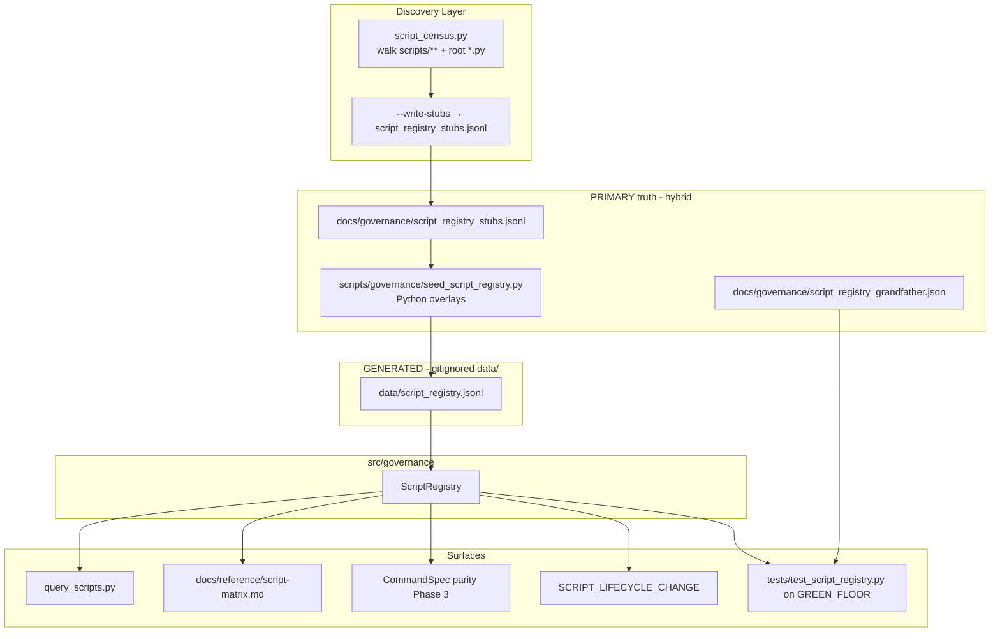
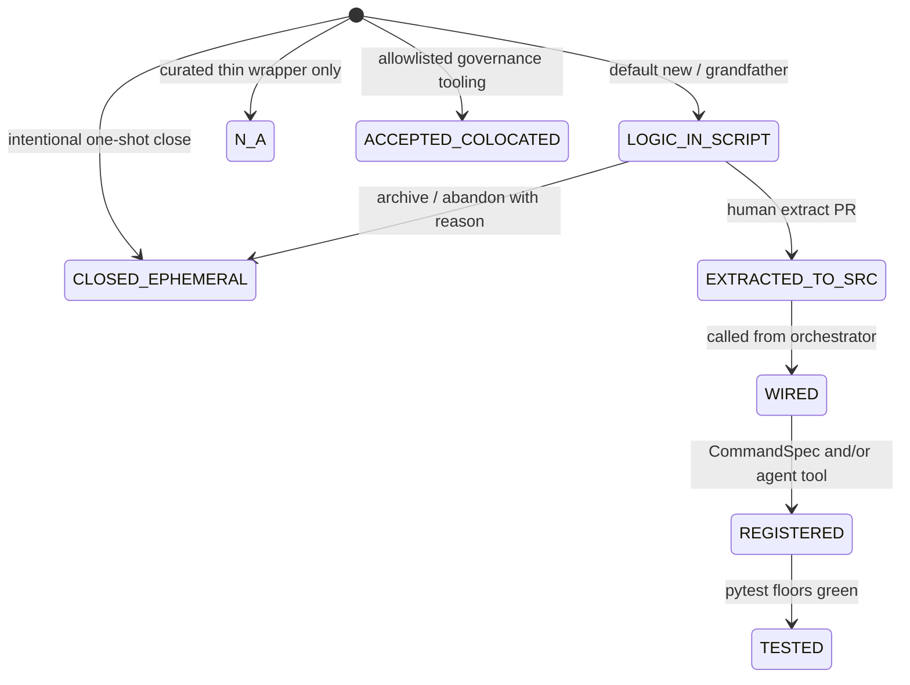
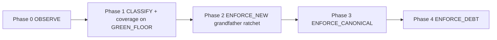

# Script & Implementation Traceability System (SITS)

| Field | Value |
|---|---|
| **Document title** | Script & Implementation Traceability System (SITS) |
| **Author** | Design (Grok Build) — for User / Claude Executor review |
| **Date** | 2026-08-02 |
| **Revised** | 2026-08-02 (R2 — stub regen contract + Phase-2 checklist) |
| **Status** | Draft (R2) |
| **Authority class** | Inventory / hygiene only — **no** economic or production-trading authority (§6.5) |
| **Production behavior** | `PRODUCTION_BEHAVIOR_CHANGED=NO` for inventory PRs (PR-1…PR-5); PR-6 extract has an explicit spine boundary |
| **ACTIVE_VERSION context** | `v2_multi_2026_04` (Tier-0 runtime; this design does not alter it) |
| **Owning doctrine** | Extends Construction Protocol + conventions §2 scripts rule; does **not** create a parallel governance tree |

---

## Overview

Coding agents and humans create large volumes of Python files under `scripts/**` and the repo root (`_*.py` probes). Production doctrine says production logic belongs in `src/` and scripts should be **thin CLI wrappers** (`docs/reference/conventions.md`), but nothing inventories scripts, links them to destination modules, or ratchets visibility of stranded logic. Consequence: **implementations become invisible** — algorithms live only in ephemeral scripts, never appear in control plane / agent tools / tests / later sessions.

**What SITS actually delivers (honest scope):** make every script **visible, classified, and debt-ratcheted**. It does **not** auto-extract logic into `src/`, does **not** enforce thin-wrapper purity in v1, and does **not** grant promote authority. Promotion of logic is a **tracked backlog** (visibility + optional TTL debt), executed only in user-gated extract PRs (PR-6).

**Proposed solution:** a file-backed **Script & Implementation Traceability System (SITS)** that reuses the Framework/Hypothesis registry pattern (hybrid stubs JSONL + Python overlays → `data/script_registry.jsonl` + pytest floor + query CLI), extends Construction Protocol with `SCRIPT_LIFECYCLE_CHANGE`, and climbs **OBSERVE → CLASSIFY → ENFORCE** so existing scripts (observed 2026-08-02: 331 under `scripts/`, 20 root `*.py`) are grandfathered without a big-bang rewrite.

---

## Background & Motivation

### Current measured state (dated observation — regenerate via census in PR-1)

> Counts below are a **point-in-time workspace observation (2026-08-02)**, not a frozen golden. PR-1’s `script_census.py` becomes the recompute path; do not treat prose numbers as CI pins.

| Surface | Count / fact (2026-08-02) |
|---|---|
| `scripts/**/*.py` | **331** |
| `src/**/*.py` | **453** |
| Root-level `*.py` | **20** (incl. **12** `_*.py` probes) |
| Control-plane `CommandSpec` entries | **39** (`src/control_plane/registry.py`) |
| `src/` modules with `if __name__` | **~29** (approximate; optional inventory scope) |
| Scripts by category (approx.) | research 117 · analysis 109 · governance 26 · data 22 · training 13 · maintenance 9 · misc/other ~35 |

Category layout already encodes intent partially (`scripts/analysis/`, `scripts/research/`, …) but is **not** a registry: no stable IDs, no promotion status, no owner, no task link, no “logic still only in script” flag.

### Pain points

1. **Discovery failure.** Later sessions cannot answer “Did we already build an RR confidence probe?” without full-text search.
2. **Promotion leakage (visibility gap).** Logic written in a probe is never *tracked* as `LOGIC_IN_SCRIPT` debt, so extraction never enters a backlog.
3. **Catalog gap.** `docs/reference/cli-matrix.md` is generated only from curated `CommandSpec`s. Most scripts never appear.
4. **Root probe pollution.** Underscore probes at repo root bypass category conventions.
5. **Agent completion theater.** Construction Protocol tracks governed *change surfaces* (`scripts/` is already a `GOVERNED_SURFACE_PREFIX` in `construction_protocol.py`) but not *script lifecycle*. Pre-commit GREEN_FLOOR today only path-gates `scripts/analysis/` (not `scripts/governance/`), so seed edits may skip local floors.
6. **Intelligence loss (§6.1).** Stranded scripts are unfrozen thoughts with no durable memory.

### What already exists (reuse — do not invent parallel governance)

| Pattern | Path | Role for SITS |
|---|---|---|
| Framework registry | `src/governance/framework_registry.py` + seed + `data/framework_registry.jsonl` + query + tests | **Primary structural twin** |
| Hypothesis registry | `src/governance/hypothesis_registry.py` + seed + query + tests | Pinned authority + seed pattern |
| Model-paths debt pin | `docs/governance/model_paths_literal_debt.json` + `tests/test_model_paths_literals.py` | **Grandfather pin / shrink-only ratchet twin** |
| Findings export | `scripts/governance/export_findings.py` → `data/findings.jsonl` | PRIMARY→GENERATED discipline |
| Control plane | `CommandSpec` / `ArgSpec` in `cp_types.py`; catalog in `registry.py` | Target for curated `CANONICAL_CLI` |
| Agent tools | `src/agent/tool_registry.py` + `PLAN_REGISTRY` | Third productization surface; **v1.1** optional field |
| CLI matrix + sync test | `generate_cli_matrix.py` + `tests/test_cli_matrix_sync.py` | Matrix + sync-floor pattern |
| Behavior / source census | `behavior_census.py`, `python_source_static_census.py` | AST discovery helpers / exclusions |
| Construction protocol | `REPOSITORY_CONSTRUCTION_PROTOCOL.md` + `construction_protocol.py` + `change_contracts.json` | `SCRIPT_LIFECYCLE_CHANGE` |
| GREEN_FLOOR | `scripts/maintenance/check_governance_invariants.py` | Monotonic floor; `GOVERNED_FILES` extension |
| Multi-LLM | `HANDOFF.md`, `multi_llm/build_queue.jsonl` | Debt export / Orient consumption |

**Tier rule (CLAUDE.md machine-readable truth):** hand-maintained PRIMARY → GENERATED `data/*.jsonl` → RUNTIME logs. Never hand-edit GENERATED under gitignored `data/`.

**When shipping SITS, update CLAUDE.md** machine-readable sources table with a script_registry row (see § Doc checklist).

---

## Goals & Non-Goals

### Goals

1. **Inventory** every `.py` under `scripts/**` and repo-root `*.py` (and optionally `src/**` CLI modules) with stable IDs, path, owner class, purpose, task/story link, lifecycle, `has_main`, and implementation destination fields.
2. **Classify** into a closed **role** taxonomy (PROBE, DIAGNOSTIC, RESEARCH_RUNNER, CANONICAL_CLI, TRAINING, GOVERNANCE, DATA, MAINTENANCE, ORPHAN). Terminal/dead states live **only** on `lifecycle`.
3. **Make stranded logic visible and debt-ratcheted** — track `implementation_status` / `logic_in_script` / promotion plans; export gap reports. **Not** auto-extract.
4. **Prevent future invisibility** via mechanical floors: path coverage, new-script registration ratchet, CANONICAL_CLI ↔ CommandSpec parity (Phase 3), TTL debt (Phase 4).
5. **Agent fail matrix** so unregistered scripts fail CI / GREEN_FLOOR / construction checks when those surfaces run (honest residual: mid-session uncommitted work).
6. **Human views:** generated markdown index + sync test, query CLI, gap report.
7. **Migrate existing scripts** via grandfather + ratchet (OBSERVE → CLASSIFY → ENFORCE), hybrid auto-stubs, not hand-authored 350 `_rec` blocks.

### Non-Goals

- Changing trading spine behavior, fusion weights, or ACTIVE_VERSION (inventory PRs hash-neutral).
- Granting production / economic / promote authority to any script (inventory authority only).
- Requiring every research probe to become a control-plane command or agent tool.
- Auto-deleting scripts (archive under `archive/scripts/` + lifecycle update only; human gate for `DEAD_CODE_REMOVAL`).
- Database, message broker, cloud inventory services.
- Full static “extract logic to src” automation (status + debt only; extract = user-gated PR-6).
- Replacing MIAR / framework registry / findings (SITS is a *sibling*).
- Reading `.env` or any secrets path.
- **Mechanically enforcing thin-wrapper purity in v1** — SITS only tracks `logic_in_script`; it does not fail CI because a script is fat.
- **Agent tool parity in v1** — optional `agent_tool_id` reserved for v1.1; not required for Phase 0–4.
- Failing `--validate` on `os.environ` / dotenv usage (hygiene heuristic is **report-only forever** in v1).

---

## Proposed Design

### 1. Architecture (layers)



### 2. Identity & schema

**Stable ID format:** `SCR-NNN` (zero-padded, monotonic; never reuse IDs). Path may move; ID must not.

**Record shape** (closed schema — reject unknown keys):

```python
{
  "id": "SCR-001",
  "path": "scripts/analysis/rr_confidence_probe.py",  # POSIX, repo-relative
  "category": "DIAGNOSTIC",       # ROLE only — see CATEGORY_ENUM (no DEAD/SUPERSEDED)
  "lifecycle": "ACTIVE",          # sole terminal/status axis
  "implementation_status": "LOGIC_IN_SCRIPT",
  "owner_kind": "AGENT",          # HUMAN | AGENT | MIXED | UNKNOWN
  "owner_ref": "session:2026-07-31-rr-probe",
  "purpose": "In-sample RR Mahalanobis confidence distribution probe (F-044).",
  "task_refs": ["F-044"],
  "dest_modules": [],             # planned or actual src/ paths
  "tests": [],
  "config_keys": [],
  "control_plane_id": null,       # CommandSpec.id when linked
  "agent_tool_id": null,          # v1.1 reserved; always null in v1; rejected if non-null until v1.1 ships
  "has_main": true,               # AST: if __name__ == "__main__" present
  "superseded_by": null,          # SCR-id when lifecycle=SUPERSEDED
  "created": "2026-07-31T00:00:00Z",
  "last_validated": "2026-08-02T00:00:00Z",
  "ttl_days": null,               # null until Phase 4 curated debt
  "logic_in_script": true,
  "notes": "",
  "authority": "inventory"        # pinned literal
}
```

**Pinned authority:** `"authority": "inventory"` always. No promote/size/fusion fields.

**Enums (closed):**

| Field | Values |
|---|---|
| `category` | `PROBE`, `DIAGNOSTIC`, `RESEARCH_RUNNER`, `CANONICAL_CLI`, `TRAINING`, `GOVERNANCE`, `DATA`, `MAINTENANCE`, `ORPHAN` |
| `lifecycle` | `ACTIVE`, `EPHEMERAL`, `SUPERSEDED`, `DEAD`, `ARCHIVED` |
| `implementation_status` | `LOGIC_IN_SCRIPT`, `EXTRACTED_TO_SRC`, `WIRED`, `REGISTERED`, `TESTED`, `CLOSED_EPHEMERAL`, `N_A`, `ACCEPTED_COLOCATED` |
| `owner_kind` | `HUMAN`, `AGENT`, `MIXED`, `UNKNOWN` |

#### Lifecycle is the sole terminal axis

```python
TERMINAL_LIFECYCLES = frozenset({"SUPERSEDED", "DEAD", "ARCHIVED"})
```

**Path existence rule (closed):**

| lifecycle | path must exist on disk? |
|---|---|
| `ACTIVE`, `EPHEMERAL` | **Yes** — missing file → validation error |
| `SUPERSEDED`, `DEAD`, `ARCHIVED` | **No** — file may be gone or under `archive/`; path is historical |

Coverage assert uses only **non-terminal** rows for “registry covers disk”:

```python
# discovered ⊆ paths of records where lifecycle NOT IN TERMINAL_LIFECYCLES
# every discovered path must appear on some non-terminal record
```

`category` is **role only**. Illegal combinations rejected in `validate_record`:

| Rule | Reject if |
|---|---|
| R1 | `category` ∈ old terminal names (not in CATEGORY_ENUM) |
| R2 | `lifecycle ∈ TERMINAL` and `implementation_status` is a climbing status without note (`EXTRACTED_TO_SRC`…`TESTED`) without `notes` explaining terminal close — soft warn optional; hard: `lifecycle=DEAD` requires `notes` non-empty |
| R3 | `lifecycle=SUPERSEDED` and `superseded_by` is null |
| R4 | `category=CANONICAL_CLI` and `lifecycle=ACTIVE` and Phase≥3 → `control_plane_id` or allowlist (Phase 3 floor) |
| R5 | `implementation_status=N_A` and `logic_in_script=true` |
| R6 | `implementation_status=ACCEPTED_COLOCATED` and path not in colocated allowlist (see §2.1) |

#### §2.1 `ACCEPTED_COLOCATED` (governance tooling exception)

Some files under `scripts/governance/` intentionally hold non-trivial logic (e.g. `construction_protocol.py`) rather than being thin wrappers. Do **not** label these `N_A` / thin.

- `implementation_status=ACCEPTED_COLOCATED`
- `logic_in_script=true` (honest: logic is in the script path)
- Path listed in `docs/governance/script_colocated_allowlist.json` (small, curated)
- Counts as **accepted debt**, not Phase-4 TTL spam (excluded from `promotion_debt()` unless allowlist entry sets `review_by`)

#### Promotion ladder (`implementation_status`) — visibility, not auto-extract



**Minimal promotion policy (when debt bites — Phase 4; tracking from Phase 1):**

| Trigger | Required action |
|---|---|
| DIAGNOSTIC reused in ≥2 stories / task_refs | Within 30d of second ref: set valid **promotion plan** OR reclassify `CLOSED_EPHEMERAL` with `notes` containing `wontfix:reason=` |
| File imported by another `scripts/` or `src/` module | Category must not be `PROBE`; prefer `DIAGNOSTIC` / role matching path |
| `LOGIC_IN_SCRIPT` with `ttl_days` set and expired | Valid promotion plan or CI debt fail (Phase 4) |
| Grandfather / new with `ttl_days=null` | **No** debt fail until Phase 4 curator sets TTL |

**Valid promotion plan** (mechanical):

```text
(notes non-empty AND (
    len(dest_modules) >= 1
    OR notes matches r"wontfix:reason=.+"
))
```

Empty `notes` + empty `dest_modules` + expired TTL = invalid.

**Export:** `query_scripts.py --missing-impl --jsonl` emits lines consumable by Orient / optional `multi_llm/build_queue.jsonl` seed helpers (no auto-queue mutation without User).

### 3. Module layout

| Artifact | Path | Tier |
|---|---|---|
| Core class | `src/governance/script_registry.py` | code |
| Stub PRIMARY (bulk) | `docs/governance/script_registry_stubs.jsonl` | PRIMARY (committed, auto-regenerable) |
| Overlay PRIMARY | `scripts/governance/seed_script_registry.py` | PRIMARY (curated refinements) |
| Grandfather pin | `docs/governance/script_registry_grandfather.json` | PRIMARY pin (model-paths style) |
| Colocated allowlist | `docs/governance/script_colocated_allowlist.json` | PRIMARY small |
| Canonical CLI allowlist | `docs/governance/script_canonical_allowlist.json` | PRIMARY small (Phase 3) |
| Generated registry | `data/script_registry.jsonl` | GENERATED (gitignored) |
| Query CLI | `scripts/governance/query_scripts.py` | thin wrapper |
| Census | `scripts/analysis/script_census.py` | observe + `--write-stubs` |
| Matrix generator | `scripts/analysis/generate_script_matrix.py` | generates MD |
| Human index | `docs/reference/script-matrix.md` | committed GENERATED view |
| Matrix sync floor | `tests/test_script_matrix_sync.py` | like `test_cli_matrix_sync` |
| Schema docs | `docs/reference/schemas.md` §9.8 | living |
| Registry floor | `tests/test_script_registry.py` | enforcement |

**Hybrid seed pipeline (K11 — closes OQ#1):**

```text
script_census --write-stubs docs/governance/script_registry_stubs.jsonl
    → seed_script_registry.py:
         load stubs
         apply Python overlays (by id or path; overlay wins field-wise)
         validate_record each
         dump data/script_registry.jsonl (sorted by id, sort_keys)
```

- **PR-2 is generator + committed stubs + coverage**, not a 3k-line hand-authored `_rec` list.
- **All purpose / category / lifecycle / implementation_status / owner / task_refs curation lives in overlays only** — never hand-edit stubs for refinement (stubs are machine-owned).

#### `--write-stubs` algorithm (path-stable IDs — K14 / K19)

**Never** naive full-rewrite that renumbers by filesystem walk order. Implementers must follow this merge contract:

```python
# scripts/analysis/script_census.py — write_stubs(out_path) conceptual

CENSUS_OWNED_FIELDS = frozenset({
    "path", "has_main",  # recomputed from disk/AST each run
    # optional report-only: may refresh default category suggestion if still GRANDFATHER
})
# All other fields on existing rows are PRESERVED from prior stubs
# (id, purpose, category, lifecycle, implementation_status, owner_*, task_refs,
#  dest_modules, notes, ttl_days, control_plane_id, agent_tool_id, authority, created, ...)

def write_stubs(out_path: Path, discovered: list[DiscoveredFile]) -> None:
    existing_by_path: dict[str, dict] = {}
    if out_path.exists():
        for rec in read_jsonl(out_path):
            p = normalize_posix(rec["path"])
            existing_by_path[p] = rec

    max_n = max((_scr_num(r["id"]) for r in existing_by_path.values()), default=0)
    out: list[dict] = []
    seen_paths: set[str] = set()

    for f in sorted(discovered, key=lambda x: x.path):  # stable sort for byte-stable dump
        path = normalize_posix(f.path)
        seen_paths.add(path)
        if path in existing_by_path:
            rec = dict(existing_by_path[path])  # preserve id + all non-census fields
            rec["path"] = path
            rec["has_main"] = f.has_main          # census-owned refresh only
            rec["last_validated"] = PINNED_TS or utc_now_z()
            # do NOT touch purpose/category/status/id
        else:
            max_n += 1
            rec = new_stub_record(id=f"SCR-{max_n:03d}", path=path, has_main=f.has_main)
            # purpose="GRANDFATHER_UNCLASSIFIED", implementation_status=LOGIC_IN_SCRIPT, ...
        out.append(rec)

    # Paths in stubs but no longer on disk: keep row if lifecycle terminal elsewhere via overlay;
    # for stubs file: drop only if path gone AND no overlay claims it — preferred: leave orphan
    # stub rows in place until seed validate_paths + human marks SUPERSEDED (do not auto-delete ids).
    for path, rec in existing_by_path.items():
        if path not in seen_paths:
            out.append(rec)  # preserve id; seed/coverage will surface missing-file for non-terminal

    out.sort(key=lambda r: r["id"])
    write_jsonl_deterministic(out_path, out)  # sort_keys within each object
```

| Rule | Contract |
|---|---|
| Match key | **`path`** (POSIX, repo-relative) |
| Existing path | **Preserve `id` forever**; never renumber |
| New path | `id = max(existing SCR numbers) + 1` only |
| Census-owned fields | May refresh `has_main` (and path normalize) only |
| Curation fields | **Overlays only** — never hand-edit stubs for purpose/category/status |
| Missing from disk | Do not recycle id; keep stub row until lifecycle terminal via overlay/seed |
| Byte-stability | Two runs on fixed disk set → identical stubs file (optional PR-1 floor) |
| Overlay keys | Prefer match by `path`; `id` match also allowed; overlay wins field-wise after load |

**Forbidden:** deleting and regenerating all SCR ids; assigning ids by `os.walk` order without reading existing stubs; putting curated purpose into stubs instead of overlays.

**Persistence:** `utils.jsonl_writer`; append-only status flips on the generated `data/` file if runtime-updated; seed rebuild remains the normal path.

### 4. ScriptRegistry API (sketch)

```python
# src/governance/script_registry.py
CATEGORY_ENUM = frozenset({
    "PROBE", "DIAGNOSTIC", "RESEARCH_RUNNER", "CANONICAL_CLI",
    "TRAINING", "GOVERNANCE", "DATA", "MAINTENANCE", "ORPHAN",
})
LIFECYCLE_ENUM = frozenset({"ACTIVE", "EPHEMERAL", "SUPERSEDED", "DEAD", "ARCHIVED"})
TERMINAL_LIFECYCLES = frozenset({"SUPERSEDED", "DEAD", "ARCHIVED"})
IMPL_STATUS_ENUM = frozenset({
    "LOGIC_IN_SCRIPT", "EXTRACTED_TO_SRC", "WIRED", "REGISTERED", "TESTED",
    "CLOSED_EPHEMERAL", "N_A", "ACCEPTED_COLOCATED",
})
AUTHORITY = "inventory"

class ScriptRegistry:
    def load(self, path) -> int: ...
    def get(self, script_id: str) -> dict: ...
    def filter(...) -> list[dict]: ...
    def summary(self) -> dict: ...
    @staticmethod
    def validate_record(rec: dict) -> None: ...
    def validate_all(self) -> list[ValidationError]: ...
    def validate_paths(self, repo_root: Path) -> list[ValidationError]:
        """Non-terminal ⇒ path exists; terminal ⇒ path optional."""
    def validate_control_plane_parity(self, command_ids: set[str], allowlist: set[str]) -> list[ValidationError]:
        """ACTIVE CANONICAL_CLI ⇒ control_plane_id in command_ids or path in allowlist."""
    def coverage_against_disk(self, discovered_paths: set[str]) -> dict:
        """unregistered = discovered - non_terminal_reg_paths; ..."""
    def promotion_debt(self, *, now=None) -> list[dict]:
        """LOGIC_IN_SCRIPT with ttl expired and invalid plan; excludes ACCEPTED_COLOCATED default."""
    def is_valid_promotion_plan(self, rec: dict) -> bool: ...
```

### 5. Discovery census (`script_census.py`)

**Purpose:** OBSERVE + stub emission.

**Universe (default):**

| Include | Exclude |
|---|---|
| `scripts/**/*.py` | `**/__pycache__/**`, `venv`, `.venv`, `node_modules`, `.git` |
| Repo-root `*.py` | `archive/**` (including `archive/scripts/`) — terminal history lives in registry lifecycle, not re-discovered as live |
| Optional `--include-src-cli` | only `src/**/*.py` with `has_main` |

Reuse exclusion helpers aligned with `python_source_static_census.canonical_python_files()` / `EXCLUDED_PARTS`.

**Include-all under `scripts/` is intentional** (including library-like modules without `__main__`). Field `has_main: bool` records entry-point shape; do not drop non-entry modules from the universe in v1.

**Grandfather defaults (Phase 1 — no thin heuristic auto-N_A):**

| Field | Default for auto-stubs |
|---|---|
| `implementation_status` | **`LOGIC_IN_SCRIPT`** always |
| `logic_in_script` | `true` |
| `ttl_days` | `null` (no Phase-4 debt until curated) |
| `purpose` | `"GRANDFATHER_UNCLASSIFIED"` |
| `owner_kind` | `UNKNOWN` |
| `category` | directory heuristic (**never** auto-`CANONICAL_CLI`) |
| `lifecycle` | `EPHEMERAL` if root `_*.py` else `ACTIVE` |
| `has_main` | AST detect |

**Strict thin heuristic** (curated / overlay only — optional helper, **not** auto-seed):

```python
# module constants in script_census.py (hash-neutral; not production config)
THIN_MAX_NON_IMPORT_LOC = 40
THIN_ALLOWED_IMPORT_PREFIXES = ("src.", "governance.", "utils.", "config_layer.", "core.", "features.")
# passes only if: has_main AND non_import_loc <= THIN_MAX AND all imports under allowed prefixes
# AND no nested class defs / ≤1 top-level function besides main
# Result may SUGGEST N_A in a report column; never auto-write N_A into stubs.
```

**CLI:**

```text
python scripts/analysis/script_census.py                  # report
python scripts/analysis/script_census.py --write-stubs docs/governance/script_registry_stubs.jsonl
python scripts/analysis/script_census.py --json reports/script_census.LATEST.json
```

Env/dotenv AST hits → report field `hygiene_env_access: bool` only; **never** `--validate` fail (Issue 17).

### 6. Classification taxonomy (mapping guide)

Directory → **default category** (candidate role only; refinement is human/overlay):

| Default category | Typical location | Auto CANONICAL_CLI? | Control plane? |
|---|---|---|---|
| `PROBE` | root `_*.py`, `scripts/probes/`, `scripts/tmp/` | No | No |
| `DIAGNOSTIC` | `scripts/analysis/` | No | No (unless refined) |
| `RESEARCH_RUNNER` | `scripts/research/` | No | No |
| `TRAINING` | `scripts/training/` | **No** | Candidate only after refine |
| `GOVERNANCE` | `scripts/governance/` | No | Selective after refine |
| `DATA` | `scripts/data/` | **No** | Candidate only after refine |
| `MAINTENANCE` | `scripts/maintenance/` | No | Optional |
| `ORPHAN` | 0 refs / broken (manual) | No | No |
| `CANONICAL_CLI` | *(never auto from path)* | — | **Yes** Phase 3 (or allowlist) |

**`CANONICAL_CLI` is set only by human/agent overlay** when the script is an intentional operator entry point. Path tables must not say “expected control plane: yes” for `scripts/data/` or `scripts/training/`.

**Root probes policy:** new root `_*.py` discouraged; prefer `scripts/probes/` or `scripts/tmp/`. Grandfather existing as `PROBE` + `EPHEMERAL`.

**Rename SOP (K14 / Issue 21):**

1. Move file on disk.
2. Update `path` on the same SCR id in stubs (regen) and/or overlay.
3. Update path string in `script_registry_grandfather.json` same commit (id stable; pin is path-keyed).
4. Regenerate matrix; run `tests/test_script_registry.py`.
5. Never allocate a new SCR id for a rename.

### 7. Query CLI & human views

| Flag | Behavior |
|---|---|
| `--summary` | totals by category / lifecycle / implementation_status |
| `--category` / `--status` / `--lifecycle` / `--task` / `--path` | filters |
| `--unregistered` | census − non-terminal registry paths |
| `--debt` | `promotion_debt()` |
| `--missing-impl` | `logic_in_script` and no valid promotion plan |
| `--missing-impl --jsonl` | machine lines for Orient / queue helpers |
| `--canonical-gap` | ACTIVE CANONICAL_CLI without CommandSpec / allowlist |
| `--validate` | schema + paths + (phase floors); exit 1 on errors; **not** env hygiene |
| `--export-debt-queue` | optional JSONL shaped for build_queue consumption (write path explicit) |

**Matrix:** `docs/reference/script-matrix.md` via `generate_script_matrix.py`.  
**Sync floor:** `tests/test_script_matrix_sync.py` — assert committed matrix == generator output (same pattern as `tests/test_cli_matrix_sync.py`).

### 8. Construction Protocol extension

```json
"SCRIPT_LIFECYCLE_CHANGE": {
  "description": "Add/move/classify/retire a script registry record or related SITS artifacts; register new scripts.",
  "authorities_to_inspect": [
    "src/governance/script_registry.py",
    "scripts/governance/seed_script_registry.py",
    "docs/governance/script_registry_stubs.jsonl",
    "docs/governance/script_registry_grandfather.json",
    "docs/reference/conventions.md",
    "src/control_plane/registry.py"
  ],
  "artifacts_to_update": [
    "docs/governance/script_registry_stubs.jsonl and/or seed overlays",
    "docs/reference/script-matrix.md (regenerate)",
    "docs/reference/schemas.md §9.8 if schema changes"
  ],
  "required_checks": [
    "tests/test_script_registry.py",
    "tests/test_script_matrix_sync.py",
    "tests/test_construction_protocol.py"
  ],
  "rollback_boundary": "single commit; stubs + overlays + grandfather pin are PRIMARY",
  "completion_criteria": "tests/test_script_registry.py green; seed dump deterministic; every declared new scripts/**/*.py or root *.py path present in registry non-terminal records"
}
```

**Machine-checkable completion** (encoded in required checks + coverage test, not phase prose).

Optional hard rule in `validate-completion`: if any declared file matches `scripts/**/*.py` or root `[^/]+\.py`, require `tests/test_script_registry.py` in executed checks (belt-and-suspenders with class required_checks).

### 9. Agent workflow integration — fail matrix

#### What fails when (mechanical)

| # | Surface | When it runs | Failure condition | Catches unregistered new scripts? |
|---|---|---|---|---|
| F1 | **CI always** (`governance.yml` `--all`) | every push/PR | `tests/test_script_registry.py` path coverage / validate | **Yes** if file is committed |
| F2 | **Pre-commit GREEN_FLOOR path gate** | staged changes under governed paths | same tests when gate fires | **Yes** if staged path is governed (see GOVERNED_FILES below) |
| F3 | **Construction `validate-completion`** | agent/human runs protocol with manifest | required_checks include `test_script_registry`; undeclared surfaces fail | **Yes** if script path declared or undeclared governed |
| F4 | **SESSION LOG / HANDOFF** | habit | none mechanical | No — advisory |

#### GOVERNED_FILES (required in PR that enables coverage floor)

Add at minimum to `check_governance_invariants.GOVERNED_FILES`:

```python
"src/governance/script_registry.py",
"scripts/governance/seed_script_registry.py",
"docs/governance/script_registry_stubs.jsonl",
"docs/governance/script_registry_grandfather.json",
"tests/test_script_registry.py",
"tests/test_script_matrix_sync.py",
```

**Residual (document honestly):** full `scripts/` as `GOVERNED_PREFIXES` may be too broad for pre-commit runtime (research flood). Preferred residual:

- Keep existing `scripts/analysis/` prefix.
- Add `scripts/probes/` and `scripts/tmp/` as prefixes when those dirs exist (new ephemera).
- Do **not** claim every `scripts/research/` edit pulls GREEN_FLOOR locally — **CI `--all` remains the backstop** (same residual as Gate-6: no mid-edit hook).

#### Explicit non-claim

Mid-session probes that are **never committed** can skip registration until the next floor run. SITS does **not** claim “or fails completion” for uncommitted ephemeral work. Same residual as Construction Protocol today.

#### Agent checklist (when committing a script)

**Phase 1 only** (coverage floor, pre-ratchet): registering the path is enough.

1. Place under `scripts/<role>/` (not root); probes → `scripts/probes/`.
2. Run `script_census.py --write-stubs` so the path appears in stubs (merge-safe; preserves ids).
3. `seed_script_registry.py` + `query_scripts.py --validate`.
4. Regenerate matrix if committed.
5. SESSION LOG SCR-ids (advisory).

**Phase 2+ (after grandfather ratchet is green — required):**  
`--write-stubs` alone is **not** enough for a *new* path (`discovered - grandfather`). Auto-stubs set `purpose="GRANDFATHER_UNCLASSIFIED"`, which **fails** the Phase-2 floor.

1. Steps 1–2 above (write-stubs merge adds path + stable new SCR id).
2. **Must** add a Python overlay for that path (or id) with **non-stub purpose**, e.g.:
   - real one-liner purpose + `category` + `implementation_status=LOGIC_IN_SCRIPT`, or
   - intentional probe: `category=PROBE`, `lifecycle=EPHEMERAL`, `implementation_status=CLOSED_EPHEMERAL`, purpose explaining one-shot, or
   - `purpose` containing explicit product intent (anything ≠ `GRANDFATHER_UNCLASSIFIED`).
3. `seed_script_registry.py` + `query_scripts.py --validate` + coverage/ratchet tests locally if possible.
4. Regenerate matrix; SESSION LOG SCR-ids.

Do **not** hand-edit `script_registry_stubs.jsonl` for purpose/category — overlays only.

### 10. Enforcement ladder



| Phase | What is green | Debt-only |
|---|---|---|
| 0 OBSERVE | census runs; `--write-stubs` works; empty registry validate OK | all |
| 1 CLASSIFY | 100% path coverage on GREEN_FLOOR **same PR** as assert | promotion |
| 2 ENFORCE_NEW | `discovered - grandfather_paths` must be registered **and** `purpose != "GRANDFATHER_UNCLASSIFIED"` (overlay required for new paths; write-stubs alone fails) | legacy grandfather paths may keep stub purpose |
| 3 ENFORCE_CANONICAL | ACTIVE CANONICAL_CLI ⊆ CommandSpec ∪ allowlist | probes |
| 4 ENFORCE_DEBT | expired TTL without valid plan fails | `ttl_days=null` exempt |

#### Grandfather pin artifact (model-paths style)

**Path:** `docs/governance/script_registry_grandfather.json`

```json
{
  "version": 1,
  "frozen_at": "2026-08-02T00:00:00Z",
  "match_key": "path",
  "semantics": "freeze_set",
  "paths": [
    "scripts/analysis/rr_confidence_probe.py",
    "_gate0_check.py"
  ],
  "notes": "Frozen at Phase-1 close. Phase-2: paths not in this set must be registered with purpose != GRANDFATHER_UNCLASSIFIED. Rename: update path string here + stubs same commit; SCR id stable. Optional future: shrink-only if paths removed from disk+registry."
}
```

**Phase-2 floor:**

```python
discovered = discover_paths()
grandfather = set(load_grandfather()["paths"])
reg = non_terminal_records()
# every discovered path must be registered
assert discovered <= {r["path"] for r in reg}
# new paths (not in grandfather) must not keep stub purpose
new_paths = discovered - grandfather
for p in new_paths:
    rec = by_path[p]
    assert rec["purpose"] != "GRANDFATHER_UNCLASSIFIED"
    assert rec["id"]  # present
```

**Hard rule (K10 / Issue 15):** path-coverage assert may land in PR-2 **only if the same PR** appends `tests/test_script_registry.py` (and matrix sync test) to `GREEN_FLOOR`. Never enable 100% coverage without GREEN_FLOOR membership in the same merge.

### 11. Integration with control plane and agent tools

- Reverse map `CommandSpec.script` → `control_plane_id` when unique.
- Phase 3: ACTIVE `CANONICAL_CLI` must have `control_plane_id` ∈ command ids **or** path ∈ `script_canonical_allowlist.json`.
- Do **not** auto-register hundreds of CommandSpecs.
- **Agent tools:** v1 field `agent_tool_id` always `null`; parity phase deferred (v1.1). Implementers must not assume CommandSpec is the only productization surface long-term (`tool_registry.py` / `PLAN_REGISTRY`).

### 12. Relationship to MIAR / framework registry / agent

| System | Question |
|---|---|
| Framework registry | What system components exist? |
| MIAR | Why does a model exist? |
| Control plane | What operator commands exist? |
| Agent tool registry | What NL-agent tools exist? |
| **SITS** | What runnable script paths exist, and is their logic productized / debt-tracked? |

### 13. Doc checklist (CLAUDE.md / conventions)

When shipping PR-2 or PR-3 docs:

| Item | Action |
|---|---|
| `docs/reference/schemas.md` §9.8 | Full schema |
| `docs/reference/conventions.md` | SITS pointer; enforcement **phased**; thin-wrapper not CI-enforced in v1 |
| `CLAUDE.md` machine-readable sources table | Row: `data/script_registry.jsonl` ← stubs + seed overlays; guard `tests/test_script_registry.py` |
| `CLAUDE.md` §3.1 | Bullet: new script → register SCR same turn (commit path) |
| Optional trigger vocab | `Register scripts` advisory |
| `REPOSITORY_CONSTRUCTION_PROTOCOL.md` | Thin cross-link to class |

---

## API / Interface Changes

1. `src.governance.script_registry.ScriptRegistry`
2. CLIs: `query_scripts.py`, `seed_script_registry.py`, `script_census.py` (`--write-stubs`), `generate_script_matrix.py`
3. Control plane: no required new CommandSpec in inventory phases; Phase 3 optional 2–5 high-value specs
4. `change_contracts.json` → `SCRIPT_LIFECYCLE_CHANGE`
5. `GOVERNED_FILES` / GREEN_FLOOR extensions as in §9–10
6. SITS modules must **not** be imported by spine (`engine_runner`, `live_engine_hook`, `backtest_v2`) — inventory packages only

---

## Data Model Changes

| Store | Format | Mutability |
|---|---|---|
| Stubs PRIMARY | `docs/governance/script_registry_stubs.jsonl` | regen via census; commit |
| Overlays PRIMARY | Python in `seed_script_registry.py` | hand-maintained small |
| Grandfather pin | `docs/governance/script_registry_grandfather.json` | freeze at Phase-1 close; rename updates |
| Generated | `data/script_registry.jsonl` | dump from seed |
| Matrix | `docs/reference/script-matrix.md` | regenerate + sync test |
| Allowlists | colocated / canonical JSON | small curated |
| Archive | `archive/scripts/` | move on CLOSED_EPHEMERAL / DEAD |

**ID allocation (K14/K19):** single stub file + overlays; path-keyed; preserve existing ids on regen; `id = max(existing SCR numbers)+1` **only** for paths never seen in stubs; rebase discipline on conflicts.

**No production config keys.**

---

## Alternatives Considered

### A — Expand CommandSpec / cli-matrix only
Insufficient for research inventory; destroys operator UX if bulk. SITS **links** CommandSpec for CANONICAL_CLI only.

### B — Prose conventions only
Already failing; no mechanical floor.

### C — AST auto-registry only (no curated seed)
No durable purpose/owner/task; conflicts PRIMARY→GENERATED doctrine. Census observes; stubs+overlays decide.

### D — Full SITS (registry + census + ratchet) ★ **Selected**

### E — Git notes / PR labels only
Not queryable offline; lost on squash.

### F — Census + committed debt JSON only (no ScriptRegistry class)
- **Pros:** Smaller API; model-paths-like ratchet for unregistered paths; fast to ship coverage.
- **Cons:** No purpose/owner/task_refs, no promotion ladder, no CommandSpec link field, no query UX (`--debt` / `--missing-impl` / filters), no ACCEPTED_COLOCATED / lifecycle terminals, weaker Orient/HANDOFF integration.
- **Verdict:** Rejected as sole solution. May inspire grandfather pin format (reused) but not replace the registry.

---

## Security & Privacy Considerations

| Threat | Mitigation |
|---|---|
| `.env` secrets | Never read `.env`. Env-access AST hits are **report-only forever** in v1; never fail `--validate` |
| Path traversal in registry | Repo-relative only; reject `..` and absolutes |
| Control plane | Localhost-only unchanged |
| Agent write amplification | Stubs/overlays behind normal write authority; no auto trading promote |

---

## Observability

| Signal | Mechanism |
|---|---|
| Coverage | `--summary`, coverage test on GREEN_FLOOR |
| Debt | `--debt`, `--missing-impl` |
| Unregistered | `--unregistered` (CI) |
| Matrix drift | `test_script_matrix_sync` |
| Session | SESSION LOG SCR-ids (advisory) |

---

## Rollout Plan

### Phase 0 — OBSERVE (PR-1)
- `ScriptRegistry` skeleton, census with `--write-stubs`, query basic, schema stub.
- **No** full coverage assert; validate allows empty/partial.

### Phase 1 — CLASSIFY (PR-2)
- Commit stubs for full universe; grandfather.json freeze; matrix + **sync test**.
- **Coverage assert + GREEN_FLOOR append in the same PR.**
- Doc checklist (schemas, conventions phased enforcement, CLAUDE table row).

### Phase 2 — ENFORCE_NEW (PR-3)
- Grandfather ratchet for non-stub purpose on new paths.
- `SCRIPT_LIFECYCLE_CHANGE` + GOVERNED_FILES entries.
- Agent fail matrix documented in conventions.

### Phase 3 — ENFORCE_CANONICAL (PR-4)
- Only curated CANONICAL_CLI rows; CommandSpec parity + allowlist.

### Phase 4 — ENFORCE_DEBT (PR-5)
- TTL + valid promotion plan gate; `--missing-impl --jsonl`.

### PR-6 extract (optional) — spine boundary
- User-authorized extracts only.
- **Completion criterion (required):** either  
  **(a)** new module **not** imported by spine (`src/core/engine_runner.py`, `src/runtime/live_engine_hook.py`, `src/runtime/backtest_v2.py`) — grep evidence in PR description; inventory-only consumers OK; **or**  
  **(b)** declared behavior change with `RUNTIME_DECISION_PATH_CHANGE` (or appropriate class) + required checks / parity proof.
- Update SCR `implementation_status` to `EXTRACTED_TO_SRC` / `TESTED`.
- SITS inventory modules themselves must remain off the spine import graph.

### Rollback
Additive phases; revert commit restores stubs/pin. No production config rollback.

---

## Risks

| Risk | Severity | Mitigation |
|---|---|---|
| Bulk seed thrash | High | Hybrid stubs (K11); PR-2 = generator artifact |
| Agents ignore registration | High | F1 CI + F2 GOVERNED_FILES + F3 construction; honest mid-session residual |
| False CANONICAL_CLI flood | Med | Never auto-category CANONICAL_CLI from path |
| Path renames | Med | Rename SOP; path-keyed grandfather update same commit |
| Dual terminal taxonomy | Mitigated | lifecycle-only terminals (Issue 1) |
| Overclaim “fails completion” mid-session | Mitigated | Explicit non-claim §9 |
| Env heuristic gate creep | Mitigated | Report-only forever v1 |
| PR-6 spine import | Med | Explicit a/b completion criterion |

---

## Open Questions (residual — non-blocking for PR-1)

| # | Topic | Decision status |
|---|---|---|
| OQ1 | Seed representation | **CLOSED — K11 hybrid stubs + Python overlays** |
| OQ2 | TTL default | **CLOSED — K12 `null` until Phase 4** |
| OQ3 | `mt5_analytics/` / `manual_tools/` in universe | **Out of v1**; optional later phase |
| OQ4 | Delete vs archive | **CLOSED — K13 archive only** |
| OQ5 | ID allocation | **CLOSED — K14 max+1 + rebase** |
| OQ6 | Include all `scripts/**/*.py` vs entry-points only | **CLOSED — include all; `has_main` field** |
| OQ7 | Whether to add full `scripts/` to GOVERNED_PREFIXES | **Prefer selective prefixes + CI backstop**; Executor may widen if pre-commit time OK |

---

## Key Decisions

| # | Decision | Rationale |
|---|---|---|
| K1 | Sibling `ScriptRegistry` (Framework/Hypothesis twin) | Proven pattern; §6.2 existing-doc-first |
| K2 | Pinned `authority: inventory` | §6.5 — no false promote channel |
| K3 | OBSERVE → CLASSIFY → ENFORCE ladder | Only feasible migration for ~330 scripts |
| K4 | Census observes; stubs+overlays decide | Purpose/owner require PRIMARY curation layer |
| K5 | CommandSpec is a subset link | Protect control-plane UX |
| K6 | `SCRIPT_LIFECYCLE_CHANGE` extends Gate-6 | No parallel protocol |
| K7 | Inventory PRs hash-neutral; no production config | Hygiene only |
| K8 | Root probes discouraged; `scripts/probes/` preferred | Conventions without forced mass move |
| K9 | Promotion = visibility + debt ratchet, not auto-extract | Honest scope; PR-6 user-gated |
| K10 | GREEN_FLOOR only when green; coverage assert atomic with GREEN_FLOOR membership | E-001F |
| K11 | **Hybrid seed:** committed `script_registry_stubs.jsonl` + Python overlays | Avoids 350-row hand PR thrash |
| K12 | **Default `ttl_days=null`** until Phase 4 curation | No debt spam on grandfather |
| K13 | **CLOSED_EPHEMERAL / DEAD → archive under `archive/scripts/`**, never silent delete | §6.2 preserve history |
| K14 | **ID = max+1 only for new paths**; path-stable preserve on regen; rename keeps id; grandfather path update same commit | Stable identity |
| K15 | **lifecycle sole terminal axis**; category is role-only | No dual DEAD/SUPERSEDED encoding |
| K16 | **Grandfather pin** `docs/governance/script_registry_grandfather.json` (model-paths style) | Implementable Phase-2 ratchet |
| K17 | **Never auto-category CANONICAL_CLI** from path | Prevents Phase-3 allowlist explosion |
| K18 | **Grandfather default `LOGIC_IN_SCRIPT`** (no thin auto-N_A) | Prevents hidden debt |
| K19 | **`--write-stubs` is path-keyed merge**, not full renumber; curation only in overlays | ID hygiene + no clobber |
| K20 | **Phase 2+ new paths require overlay** (non-stub purpose or PROBE CLOSED_EPHEMERAL); write-stubs alone insufficient | Matches grandfather ratchet |

---

## PR Plan

### PR-1 — Observe: census + ScriptRegistry + write-stubs
- **Title:** `feat(governance): script census + ScriptRegistry skeleton (SITS Phase 0)`
- **Files:**
  - `src/governance/script_registry.py` (enums incl. TERMINAL_LIFECYCLES, ACCEPTED_COLOCATED, validate_record R1–R6, has_main field)
  - `scripts/analysis/script_census.py` (`discover_paths`, `--write-stubs` **merge algorithm** per K19, env hygiene report-only, exclusions)
  - `scripts/governance/seed_script_registry.py` (load stubs + overlays → dump; empty overlays OK)
  - `scripts/governance/query_scripts.py` (`--summary`, `--validate` allows empty)
  - `tests/test_script_registry.py` (schema unit tests only; **no** full coverage assert)
  - Optional: `test_write_stubs_preserves_ids` / double-run byte-stable given fixed fixture tree
  - `docs/reference/schemas.md` §9.8 stub
- **Dependencies:** none
- **Description:** Land pattern + stub writer with path-stable merge (preserve ids; max+1 new only; census-owned fields only). Counts from census, not prose. PRODUCTION_BEHAVIOR_CHANGED=NO. No GREEN_FLOOR coverage yet.

### PR-2 — Classify: stubs + grandfather pin + matrix + coverage on GREEN_FLOOR
- **Title:** `feat(governance): grandfather script registry coverage + matrix sync (SITS Phase 1)`
- **Files:**
  - `docs/governance/script_registry_stubs.jsonl` (census `--write-stubs` output, full universe)
  - `docs/governance/script_registry_grandfather.json` (freeze_set of paths at close)
  - `docs/governance/script_colocated_allowlist.json` (e.g. construction_protocol path)
  - Seed overlays for known colocated / refined rows (small)
  - `scripts/analysis/generate_script_matrix.py` + `docs/reference/script-matrix.md`
  - `tests/test_script_registry.py` (**path coverage assert**)
  - `tests/test_script_matrix_sync.py`
  - `scripts/maintenance/check_governance_invariants.py` — **append both tests to GREEN_FLOOR in this PR**
  - GOVERNED_FILES entries for SITS artifacts (may complete in PR-3 if preferred; **recommended here** for seed/stubs)
  - `docs/reference/conventions.md` (SITS; phased thin-wrapper enforcement)
  - CLAUDE.md machine-readable table row + §3.1 bullet
  - Optional `scripts/probes/`, `scripts/tmp/` READMEs
- **Dependencies:** PR-1
- **Description:** 100% registration with LOGIC_IN_SCRIPT stubs. Coverage floor and GREEN_FLOOR membership are **atomic**. Human refinement not required for green.

### PR-3 — Enforce new + construction class + fail matrix
- **Title:** `feat(governance): SCRIPT_LIFECYCLE_CHANGE + grandfather ratchet (SITS Phase 2)`
- **Files:**
  - `docs/governance/change_contracts.json` (`SCRIPT_LIFECYCLE_CHANGE` with machine completion_criteria)
  - Grandfather ratchet tests in `test_script_registry.py`
  - Complete `GOVERNED_FILES` if not done in PR-2
  - Optional `scripts/probes/` + `scripts/tmp/` in `GOVERNED_PREFIXES`
  - Trigger vocabulary optional entry; construction protocol thin cross-link
- **Dependencies:** PR-2
- **Description:** New paths fail if unregistered or still GRANDFATHER_UNCLASSIFIED. Document agent fail matrix F1–F4 + mid-session residual.

### PR-4 — Canonical CLI parity
- **Title:** `feat(governance): CANONICAL_CLI ↔ CommandSpec parity (SITS Phase 3)`
- **Files:** overlays setting CANONICAL_CLI only where intentional; `script_canonical_allowlist.json`; parity validator; optional 2–5 CommandSpecs; cli-matrix regen if needed
- **Dependencies:** PR-3
- **Description:** No mass CommandSpec dump; no path-heuristic CANONICAL_CLI.

### PR-5 — Debt gate + missing-impl export
- **Title:** `feat(governance): LOGIC_IN_SCRIPT debt gate + missing-impl export (SITS Phase 4)`
- **Files:** `promotion_debt` floor; `--missing-impl --jsonl`; optional `reports/script_promotion_debt.LATEST.md`; curated TTLs on hot DIAGNOSTIC rows only
- **Dependencies:** PR-4
- **Description:** Visibility + ratchet only; no forced extract.

### PR-6 (optional) — Extract wave with spine boundary
- **Title:** `refactor: extract selected script logic into src/ (user-gated)`
- **Files:** selected modules under `src/`; thin script wrappers; SCR status updates; tests
- **Dependencies:** PR-5 + User authorization per extract
- **Description:** Completion: spine non-import evidence **or** declared RUNTIME_DECISION_PATH_CHANGE + checks. Not part of inventory MVP.

---

## References

| Doc / code | Relevance |
|---|---|
| `docs/reference/conventions.md` §2 | Scripts vs `src/` placement |
| `docs/governance/REPOSITORY_CONSTRUCTION_PROTOCOL.md` | Gate-6 residuals (no mid-edit hook) |
| `docs/governance/change_contracts.json` | Change classes |
| `docs/governance/model_paths_literal_debt.json` | Grandfather pin twin |
| `scripts/governance/construction_protocol.py` | Governed surfaces include `scripts/` |
| `scripts/maintenance/check_governance_invariants.py` | GREEN_FLOOR / GOVERNED_FILES / prefixes |
| `src/control_plane/cp_types.py` | `CommandSpec.script` |
| `src/agent/tool_registry.py` | Agent productization surface (v1.1) |
| `tests/test_cli_matrix_sync.py` | Matrix sync pattern |
| `src/governance/framework_registry.py` / `hypothesis_registry.py` | Registry twins |
| `scripts/analysis/python_source_static_census.py` | Exclusion helpers |
| `CLAUDE.md` §3.1, §6.1–6.5 | Doctrine |
| `multi_llm/build_queue.jsonl` | Optional debt export consumer |

---

## Appendix A — Example records (corrected)

```python
# Overlay example: non-thin governance tooling — NOT N_A
_overlay(
    path="scripts/governance/construction_protocol.py",
    category="GOVERNANCE",
    lifecycle="ACTIVE",
    implementation_status="ACCEPTED_COLOCATED",  # allowlisted colocated logic
    owner_kind="HUMAN",
    purpose="Gate-6 construction contract validator (logic lives under scripts/; accepted colocated debt).",
    logic_in_script=True,
    has_main=True,
    notes="Candidate future extract to src/governance/construction_protocol.py; not a thin wrapper.",
)

# Diagnostic probe — default debt-visible shape
_overlay(
    path="scripts/analysis/rr_confidence_probe.py",
    category="DIAGNOSTIC",
    lifecycle="ACTIVE",
    implementation_status="LOGIC_IN_SCRIPT",
    owner_kind="AGENT",
    purpose="F-044 in-sample Mahalanobis confidence distribution (read-only).",
    task_refs=["F-044"],
    dest_modules=[],
    ttl_days=None,
    logic_in_script=True,
    has_main=True,
)

# Root ephemeral probe
_overlay(
    path="_gate0_check.py",
    category="PROBE",
    lifecycle="EPHEMERAL",
    implementation_status="CLOSED_EPHEMERAL",
    owner_kind="AGENT",
    purpose="Schema hash gate-0 probe; not a product entry point.",
    logic_in_script=True,
    has_main=True,
    notes="Prefer scripts/probes/ for successors. Archive if deleting from root.",
)

# Thin wrapper — only after curated strict heuristic or human confirmation
_overlay(
    path="scripts/control_plane/run_server.py",
    category="CANONICAL_CLI",  # set by overlay, NOT path auto
    lifecycle="ACTIVE",
    implementation_status="N_A",
    logic_in_script=False,
    control_plane_id="...",  # if registered
    purpose="HTTP control plane server entry.",
    has_main=True,
)
```

Auto-stub row shape (no overlay):

```json
{
  "id": "SCR-142",
  "path": "scripts/research/some_runner.py",
  "category": "RESEARCH_RUNNER",
  "lifecycle": "ACTIVE",
  "implementation_status": "LOGIC_IN_SCRIPT",
  "owner_kind": "UNKNOWN",
  "owner_ref": "",
  "purpose": "GRANDFATHER_UNCLASSIFIED",
  "task_refs": [],
  "dest_modules": [],
  "tests": [],
  "config_keys": [],
  "control_plane_id": null,
  "agent_tool_id": null,
  "has_main": true,
  "superseded_by": null,
  "created": "2026-08-02T00:00:00Z",
  "last_validated": "2026-08-02T00:00:00Z",
  "ttl_days": null,
  "logic_in_script": true,
  "notes": "",
  "authority": "inventory"
}
```

---

## Appendix B — Completion criteria by phase

### Phase 2 “done enough” to stop *new* invisibility
1. Every path in universe has a non-terminal SCR row (or terminal with history).
2. Coverage test on GREEN_FLOOR; CI `--all` fails on unregistered committed scripts.
3. Grandfather ratchet active for new paths.
4. `query_scripts.py --missing-impl` / `--debt` usable.
5. `SCRIPT_LIFECYCLE_CHANGE` exists; GOVERNED_FILES include SITS core artifacts.
6. Docs: schemas §9.8, conventions phased note, CLAUDE machine-readable row, matrix + sync test.
7. `PRODUCTION_BEHAVIOR_CHANGED=NO` for inventory work.
8. **Honest:** stranded logic may still live in scripts; it is **visible and ratcheted**, not extracted.

### Phase 3–4
Progressive quality (CommandSpec parity; TTL debt). Not blockers for MVP inventory.

### PR-6
Spine boundary (a) or declared behavior class (b) — see PR plan.

---

## Appendix C — Agent fail matrix (quick card)

```text
Committed new script without registry row
  → F1 CI fails test_script_registry coverage
  → F2 pre-commit fails IF path/seed is in GOVERNED_* and staged
  → F3 construction completion fails IF SCRIPT_LIFECYCLE / required checks run

Phase 2+: new path (not in grandfather) with only --write-stubs
  → FAIL ratchet: purpose still GRANDFATHER_UNCLASSIFIED
  → Fix: overlay with real purpose OR PROBE + CLOSED_EPHEMERAL (not hand-edit stubs)

Uncommitted mid-session probe
  → No mechanical fail (Gate-6 residual) — register before commit

Env access in script
  → Report-only hygiene; never validate fail v1

Thin-wrapper purity
  → Not enforced v1; logic_in_script tracking only

--write-stubs regen
  → Must preserve SCR ids by path; max+1 only for new paths; no renumber
```

---

*End of design document (R2).*
