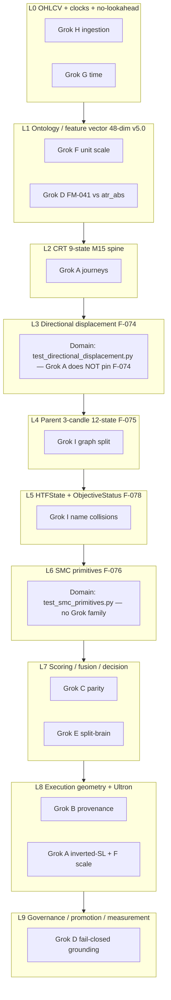

# Topic Ladder + Grok Test-Intent Excel

| Field | Value |
|---|---|
| Author | Grok (design pass) |
| Date | 2026-08-16 |
| Status | Approved (review 0 open, 2026-08-16). PR-1 implemented same turn. |
| Audience | Senior engineers who already know Tradelatest |
| Authority | Design only. Grants **no** `ACTIVE_VERSION` change, **no** G001, **no** CRT CLOSED stamp |
| Construction class (implementation PRs) | **`DOCUMENTATION_ONLY`** for PR-1 and PR-2. Do **not** invent `GENERATOR_EDIT`. Do **not** take `SCRIPT_LIFECYCLE_CHANGE` (no new `scripts/**` path; `SCR-359` stays `GRANDFATHER_UNCLASSIFIED`). PR-1 declares `scripts/analysis/test_functionality_excel.py` → SITS rule 2b requires `tests/test_script_registry.py` in `required_checks_ack` / `checks_executed`. PR-2 has no `scripts/` in `declared_files`. Close with `construction_protocol.py validate-completion`. |

---

## Overview

This design does two jobs without inventing a second architecture book.

**Track 1 — Topic ladder.** A numbered reading/ownership map from raw OHLCV to governed promotion. Each layer names the *already-canonical* book chapter, HOW topic, code, and tests. After F-074 / F-075 / F-076 / F-077 / F-078 the live system is a 12-state CRT (`9` M15 + `3` parent, disjoint), plus a second parent dimension (`HTFState` / `ObjectiveStatus`) and a 48-dim schema (v5.0, +9 SMC). The book and HOW extract have not all caught up. This ladder **maps onto** `docs/book/` Parts I–IX (chs. 00–24 + A1/A2) and `.grok/HOW_INDEX.md` (27 topics). It does **not** rewrite them. Stale chapters are named as `DOC_DRIFT` for a later, user-gated PR. The **durable repo home** of the compact ladder is a new subsection of `docs/book/A1-testing.md` (PR-2). Field-level layer tables stay in this design until the user-gated book refresh (PR-3).

**Track 2 — Grok test-intent Excel.** `docs/analysis/tests_functionality_inventory.xlsx` is class-grain and is **fully overwritten** by `scripts/analysis/test_functionality_excel.py`. The user asked for one row per Grok test *case*: intent + what the case is trying to do. The existing generator already has `method_intent()` (`scripts/analysis/test_functionality_excel.py:252-256`) but collapses it into `Methods cover: a; b; c`. This design extends that generator to emit a **sibling workbook** `docs/analysis/grok_test_intent.xlsx` at **pytest-nodeid grain** (140 rows today), so regenerate cannot wipe a hand-authored sheet and the positional header contract on the class-grain book stays untouched.

Source always wins. No Semantic OS / FM / F-ids are invented here. Cited findings are the real ones: F-074, F-075, F-076, F-077, F-078 (plus older ones already in `CLAUDE.md` when they bound a layer).

---

## Background & Motivation

### Current state

Tradelatest already has a layered narrative:

| Authority | Role |
|---|---|
| `docs/book/README.md` | Sequential reconstruction, Parts I–IX + A1/A2 |
| `.grok/HOW_INDEX.md` | 13 NEEDED + 14 USEFUL topics with Ins/Outs |
| `docs/topics/*.md` | One human-language file per concept |
| `docs/architecture/goal.md` | Candle → order constitution |
| `docs/memory/*-memory.md` | Subsystem indexes |
| `docs/current-findings.md` | Living conclusions (F-074…F-078 included) |

The user asked for a “basic → top-notch” architecture plan. Writing another book would violate `CLAUDE.md` §6.2 (existing-doc-first, minimize doc count). The missing artifact is a **ladder that says which existing chapter to read at which maturity**, plus an honest gap list after the 2026-08-13…16 parent-CRT / SMC program. That compact table lands in A1, not in a new chapter.

Independently, Grok shipped an auditor suite at `tests/Grok/` (families A–I). Last run: **`pytest tests/Grok` → 140 passed**. Family I = 63 nodeids (includes 27+27 parametrize cells). The class-grain Excel folds all of family I into one `(module-level tests)` row. That is the pain.

### Pain points

1. **Book / HOW lag the 12-state + 48-dim code.** Chapter 08 still classifies “the 9-state CRT lifecycle” as Production **CLOSED**. Code is 12 members (`state_identity.py:43-62`), CRT closure is **OPEN** (F-074). Chapter 07 still says 39-dim / schema v4.0. Code is `CANONICAL_FEATURE_DIM = 48`, `SCHEMA_VERSION = "5.0"` (`feature_schema.py:141`, `:292`). HOW_INDEX’s crt-spine extract still narrates 9 states; its feature-schema extract still says 38-float. `docs/topics/feature-schema.md` is aligned (Updated 2026-08-15, 48-dim / v5.0). `docs/topics/crt-spine.md` Discussion is aligned (12-state, F-074…F-078), but its **In plain language** block (`:12-18`) still says “fixed 9-state graph (`RANGE → SWEEP → …`)”. HOW_INDEX is generated from that extract, so regenerating HOW without editing that sentence leaves the 9-state line. Named `DOC_DRIFT`; one-line repair is PR-2, not “already aligned.”
2. **Excel grain is class, not case.** `method_intent()` exists and is thrown away at write time.
3. **Regenerate wipes unknown sheets.** `write_excel()` (`test_functionality_excel.py:440-543`) constructs a new `Workbook()` and `wb.save(out)`. Any sheet not re-emitted is deleted. `tests/test_semantic_identity_workbooks.py:77-88` pins columns A–F of `"Test Functionality"` and `"By File"` as a positional contract — new headers on those sheets must be **appended**, never inserted.
4. **Family I’s meaning is in the parametrize cells.** `RANGE → RANGE_C1` and `DISTRIBUTION_C3 → EXECUTION` are different failure modes. A function-level row hides them.

### Why now

F-075 wired `ParentCRTFeed.bias` into `BacktestRunner`. F-078 added `HTFState`/`ObjectiveStatus` as a second dimension (activation default OFF). F-076 grew the vector 39→48 and left the six model families stale. F-077 forbids treating Romeo/Sujan “DISTRIBUTION” as `DISTRIBUTION_C3`. An auditor family (I) now pins the graph split. Without a ladder + a method-grain inventory, the next session will re-derive this from chat memory.

---

## Goals & Non-Goals

### Goals

1. Publish a **10-layer reading/ownership ladder** (0–9) that a new session can follow from candles to promotion, citing only existing paths. **Durable home:** a compact Layer / Book / Topic / Grok family / Gap table as a new subsection of `docs/book/A1-testing.md` (PR-2). Field-level tables stay in this design until the user-gated book refresh. No chapter 25.
2. At each layer, name what “top-notch” means as **invariants**, not new features.
3. Name real post-F-074…F-078 gaps (`DOC_DRIFT`, missing Grok family, missing HOW extract line) without rewriting chapters in this turn.
4. Specify a **durable Excel schema** for every Grok test *case*: intent + what it is trying to do, extracted from existing docstrings.
5. Solve the overwrite problem so regenerate cannot destroy the intent sheet.
6. Keep GCMC v1 recoverable at 100% (`src/` + `scripts/` + `tests/` listed∩disk; `.grok/CLOSURE_KPI.md`). Prefer extending the existing generator so no new `scripts/**` path drops the number.

### Non-goals

- Do **not** generate 140 rows of invented prose in this document. Schema + 5 worked examples + a function census. The implementation PR fills the workbook.
- Do **not** change production code, `ACTIVE_VERSION`, or CRT closure status.
- Do **not** merge `tests/Grok` into the YAML↔enum floors (`test_crt_state_invariants.py`, `test_semantic_registry.py`, etc.).
- Do **not** create `docs/book/25-grok-tests.md`. The compact ladder table + a Grok-auditor pointer go in Appendix A1 (PR-2). Field-level layer tables do **not** move into A1.
- Do **not** invent a new HOW topic for Parent CRT / SMC / HTF. Those already live under `docs/topics/crt-spine.md` and `docs/topics/feature-schema.md` (existing-doc-first).
- Do **not** invent Semantic OS ids, FM ids, or F-ids.
- Per-method sheet for **all** `tests/**` is out of scope for v1 (named as later PR).

---

## Track 1 — Topic Ladder (basic → top-notch)

This ladder is a **reading/ownership map, not a rewrite of the book.** Follow it in order. At each layer, load only the owning memory doc (`CLAUDE.md` §0), then the cited chapter, then source.

### Publication path (PR-2 — existing-doc-first)

The field-level tables below (Prerequisites / Book / HOW / Memory / Code / Domain tests / Grok / Top-notch / Gaps) stay in **this design** until a user-gated book refresh (PR-3). They are too large for A1.

**What lands in the repo in PR-2:** a new subsection of [`docs/book/A1-testing.md`](docs/book/A1-testing.md), titled **“Topic ladder (candle → promotion) + Grok auditor”**, containing:

1. Two sentences of purpose (reading map, not a second book; CRT stays OPEN).
2. The compact table immediately below (Layer / Book / Topic / Grok family / Gap).
3. A pointer to `tests/Grok/` and, after PR-1, `docs/analysis/grok_test_intent.xlsx`.
4. A one-line repair of `docs/topics/crt-spine.md` In-plain-language (`:12-18` still says “fixed 9-state graph” — sentence 2 is what `_build_how_index.py` extracts). Same edit **must** bump the topic header `Updated:` to the PR date and append one dated `## Discussion` bullet that the In-plain-language block now states the 9+3 partition (`CLAUDE.md` §6.4). Keep heading names so `tests/test_topic_docs.py` `_REQUIRED_SECTIONS` still match (CI only checks that `Updated:` and `## Discussion` *exist*, not that they moved). Then regenerate `.grok/HOW_INDEX.md` via `.grok/_build_how_index.py`.

Do **not** put this table in `docs/book/03-how-this-book-fits.md` (that chapter owns how the book relates to other record systems, not how the test suite indexes the spine). Do **not** create chapter 25.

| Layer | Book | Topic | Grok family | Gap after F-074…F-078 |
|---|---|---|---|---|
| 0 OHLCV + clocks + no-lookahead | Ch.05 | `feature-schema.md` (`stream()`); F-066 | H, G | F-039 L3 not universal; F-066 `broker_local` default. No new HOW topic. |
| 1 Ontology / feature vector | Ch.06–07 | `feature-schema.md` (48-dim / v5.0) | F (primary); D also serves | Ch.07 still 39-dim / v4.0. HOW extract still 38-float until regen. `conventions.md` §2 still “38-dim”. |
| 2 CRT 9-state M15 spine | Ch.08 | `crt-spine.md` | A (primary; inverted-SL also L8) | Ch.08 / Ch.02 still 9-state **CLOSED**. CRT **OPEN**. In-plain-language still 9-state (`:12-18`) — PR-2 one-liner. |
| 3 Directional displacement F-074 | none (belongs in Ch.08 later) | `crt-spine.md` Discussion | **none** (Grok) · **J** (Claude, 2026-08-18) | Domain: `test_directional_displacement.py`. Auditor gap CLOSED by Claude family J. |
| 4 Parent 3-candle 12-state F-075 | none | `crt-spine.md` | I (primary; HTF/Objective also L5) | No book chapter. HOW extract 9-state until In-plain-language repair + regen. CRT stays OPEN. |
| 5 HTFState + ObjectiveStatus F-078 | none | `crt-spine.md` Discussion | I (name-collision tests) | F-077 spelling collision. `objective_gate` default OFF. |
| 6 SMC primitives F-076 | belongs in Ch.07 later | `feature-schema.md` | **none** (Grok) · **K** (Claude, 2026-08-18) | Domain: `test_smc_primitives.py`. E1b still “9-state” / “39-dim”. Auditor gap CLOSED by Claude family K. |
| 7 Scoring / fusion / decision | Ch.10–12 | `scoring-engines.md`, `fusion-decision.md` | C; E (primary) | ≤39-dim models stale (F-076). No retrain authority. |
| 8 Execution geometry + Ultron | Ch.13–14 | `execution-planning.md`, `ultron-risk-gate.md` | B; A inverted-SL; F also serves | F-073 no live rail. Ch.15 still describes it. |
| 9 Governance / promotion / measurement | Ch.16–17, 19 | `promotion-governance.md`, `research-measurement-contract.md` | D (primary); E also serves | `parent_crt`/`smc` not in `PromotionManager` overlay. 0 sealed `MC-*`. |



**How to use the diagram:** a Grok family is a *pin*, not the layer’s only test. Domain suites remain the YAML↔enum / golden / wiring floors. Grok asks the journey / substitution / name-collision questions those floors do not.

### Layer 0 — OHLCV + clocks + no-lookahead

| Field | Value |
|---|---|
| Prerequisites | none (constitution: `docs/architecture/goal.md` happy flow step 1) |
| Book | [Ch.05](docs/book/05-data-ingestion-no-lookahead.md) — L1/L2/L3/RT conjunction |
| HOW / topic | No dedicated NEEDED topic. Closest living prose: `docs/topics/feature-schema.md` “Why `stream()` is more than CSV parsing”; clocks: F-066 in `docs/current-findings.md` |
| Memory | `docs/memory/runtime-memory.md` |
| Code | `src/data_ingestion/ohlcv_schema.py` · `validate_ohlcv_row`; `src/data_ingestion/dataset_integrity.py` · `validate_dataset`; `src/runtime/backtest_v2.py` · `CandleLoader.stream`; `src/features/broker_clock.py` · `mt5_server_to_utc` |
| Domain tests | `tests/data_ingestion/*`, `tests/test_dataset_integrity.py`, `tests/test_ohlcv_clock_provenance.py` |
| Grok family | **H** (impossible OHLC, L1 vs L3), **G** (inclusive vs half-open, broker vs UTC) |
| Top-notch | A candle that cannot exist never becomes a `Candle`. Session decisions name their clock. No-lookahead is the **conjunction** of L1+L2+L3+generator (F-039). Default clock remains `broker_local` until a gated flip of `feature_pipeline.session_timestamp_basis`. |
| Gaps after F-074…F-078 | None caused by those findings. Residuals: F-039 (L3 not universal); F-066 (`broker_local` default still mislabels 53% of XAUUSD *feature* sessions); HOW has no ingestion topic — **do not create one** unless a later PR promotes a stub from `docs/topics/_template.md`. Book Ch.05 is still the owner. |

### Layer 1 — Ontology / feature vector

| Field | Value |
|---|---|
| Prerequisites | L0 |
| Book | [Ch.06](docs/book/06-market-ontology.md), [Ch.07](docs/book/07-feature-pipeline.md) |
| HOW / topic | NEEDED `docs/topics/feature-schema.md` (updated 2026-08-15: **48-dim / v5.0**). HOW_INDEX extract still says “38-float vector” — extract drift. |
| Memory | `docs/memory/feature-memory.md` (last generation 2026-08-07 — pre-v5.0) |
| Code | `configs/formulas/market_ontology.yaml`; `src/features/feature_schema.py` (`CANONICAL_FEATURES`, `CANONICAL_FEATURE_DIM=48`, `SCHEMA_VERSION="5.0"`); `src/features/feature_pipeline.py`; `src/features/candle_math.py`; `src/features/derived_math.py`; `src/features/smc/` |
| Domain tests | `tests/test_feature_pipeline.py`, `tests/test_schema_contracts.py`, `tests/features/test_feature_schema_registry.py`, `tests/test_feature_lineage.py` |
| Grok family | **F** (relative ATR as SL operand, 100× scale), **D** (`FM-041` vs local `atr_abs`) |
| Top-notch | Vector shape is a single frozen list; no local formula math (ontology → registry → impl). Price-offset consumers use `atr_abs` / FM-074, not FM-041. Schema hash re-baselined after any identity change. |
| Gaps after F-074…F-078 | **DOC_DRIFT (real):** Book Ch.07 classification table still says “39-dim, schema v4.0”. Code is 48 / v5.0 (F-076). HOW_INDEX feature-schema extract + `docs/reference/conventions.md` §2 “Canonical 38-dim schema” are also stale. Topic file `feature-schema.md` **is** aligned (48-dim / v5.0). Regenerating HOW_INDEX after no topic edit will refresh that extract. **Do not rewrite Ch.07 in this design.** Later PR (PR-3), existing-doc-first. |

### Layer 2 — CRT 9-state M15 spine

| Field | Value |
|---|---|
| Prerequisites | L0, L1 |
| Book | [Ch.08](docs/book/08-crt-state-machine.md) |
| HOW / topic | NEEDED `docs/topics/crt-spine.md`. Discussion (2026-08-16) documents the 12-state partition. **In plain language (`:12-18`) is DOC_DRIFT:** still “fixed 9-state graph (`RANGE → SWEEP → …`)”. HOW_INDEX is generated from that extract, so a HOW regen without a one-line repair leaves the 9-state line. |
| Memory | `docs/memory/engine-memory.md` |
| Code | `src/config_layer/state_identity.py` · `CRTState`, `VALID_TRANSITIONS` (`:85-107`), `EXECUTION_TIMEFRAME_STATES` (`:123`); `src/config_layer/state_topology.py:109`; `src/config_layer/crt_engine_v2.py` · `StateMachine`, `CRTEngine.process_candle` |
| Domain tests | `tests/test_crt_state_invariants.py`, `tests/test_crt_executable_state_graph.py`, `tests/test_crt_adversarial_closure.py` |
| Grok family | **A** (illegal M15 hops, missing intermediates, inverted SL, trade prerequisites) |
| Top-notch | Every M15 hop is an edge in `VALID_TRANSITIONS`. `SHADOW_PENDING → EXPANSION` is two hops (`try_shadow_pending_to_expansion` inserts `SWEEP`). `build_trade` requires range+sweep+displacement+direction and refuses inverted geometry. Census `docs/governance/crt_executable_state_graph.json` `scope_note` (`:8`) stays scoped to the original 9; `state_identity.EXECUTION_TIMEFRAME_STATES` (`:123`) is the single source of that boundary. The comment at `state_identity.py:113-119` *points at* the census; it is not the `scope_note` field. |
| Gaps after F-074…F-078 | **DOC_DRIFT (real):** Ch.08 + Ch.02 still say the 9-state lifecycle is Production **CLOSED**. CRT surface is **OPEN** (reopened 2026-08-13 by F-074; F-075 widened scope again). Topic Discussion is aligned; In-plain-language (`:12-18`) is not — fold a one-line repair into PR-2, then regenerate HOW_INDEX. Family A still correctly pins the *M15* graph; it does not know the parent sub-graph (that is family I / L4). |

### Layer 3 — Directional displacement (F-074)

| Field | Value |
|---|---|
| Prerequisites | L2 |
| Book | No dedicated chapter. Belongs in Ch.08 when that chapter is refreshed. |
| HOW / topic | `docs/topics/crt-spine.md` Discussion, Findings (F-074) |
| Memory | `docs/memory/engine-memory.md` |
| Code | `src/config_layer/crt_engine_v2.py` · `try_sweep_to_displacement` (impulse away from swept side); resolver `_displacement_entry_allowed` (F-069 parity) |
| Domain tests | `tests/test_directional_displacement.py`, `tests/test_crt_state_resolver_displacement_gate.py` |
| Grok family | **None.** Family A pins hops and inverted SL, not the F-074 body-direction contract. **Claude family J** (2026-08-18) opens it. |
| Top-notch | LONG displacement = bullish close *above* `sweep.price`; SHORT = bearish close *below*. Unsigned energy-only SWEEP→DISPLACEMENT is illegal. Jul 28 XAUUSD 01:15 UTC dump after a LONG sweep is REJECT. Shadow-resume unchanged. |
| Gaps after F-074…F-078 | ~~Real gap: **no Grok family pins F-074.**~~ CLOSED 2026-08-18 by `tests/Claude/test_J_directional_displacement.py` (user-named). Original note kept for history: do not invent family J in this design. If a later auditor increment is authorized, it belongs as a new `tests/Grok/test_J_*.py` that forbids unsigned energy — not a rewrite of `test_directional_displacement.py`. Book Ch.08 has no F-074 paragraph (`DOC_DRIFT`). |

### Layer 4 — Parent 3-candle CRT, 12-state, disjoint (F-075)

| Field | Value |
|---|---|
| Prerequisites | L2, L3 (C3 uses the F-074 impulse contract — `state_identity.py:62`) |
| Book | **None.** Ch.08 still ends at 9 states. |
| HOW / topic | `docs/topics/crt-spine.md` (CH-htfcrt-parent-candle-smc-v1 + CH-parent-crt-caller-wire). Do **not** create `docs/topics/parent-crt.md`. |
| Memory | `docs/memory/runtime-memory.md` (feed lives under runtime; last generation 2026-08-07 does not list `parent_crt_feed.py`) |
| Code | `src/config_layer/state_identity.py` · `PARENT_TIMEFRAME_STATES`, parent edges `:104-106`; `src/config_layer/parent_crt.py` · `ParentCRTTrack`; `src/features/parent_candle.py` · `ParentCandleBuilder`; `src/features/calendar_periods.py`; `src/runtime/parent_crt_feed.py` · `ParentCRTFeed`; `src/runtime/backtest_v2.py` threads `feed.bias` |
| Domain tests | `tests/test_parent_crt_track.py`, `tests/test_parent_candle_builder.py`, `tests/test_parent_crt_feed.py`, `tests/test_parent_crt_wiring.py`, `tests/test_calendar_periods.py` |
| Grok family | **I** (disjoint graphs, C3 ≠ EXECUTION, 9+3 partition) |
| Top-notch | `PARENT_TIMEFRAME_STATES ∩ EXECUTION_TIMEFRAME_STATES = ∅` and union = `CRTState`. No M15 hop into C1/C2/C3; no parent hop into EXECUTION. C3 classifies a parent impulse; `TRADE_OPENED` still requires M15 `EXECUTION`. `enabled:false` returns `None` (v2_multi byte-identical). Live still has no `process_candle` loop (F-073). Reachability ≠ 12-state re-certification. |
| Gaps after F-074…F-078 | **DOC_DRIFT:** no book chapter; HOW extract still 9-state until the `crt-spine.md` In-plain-language one-liner (PR-2) + HOW regen. **Closure:** CRT stays OPEN. F-077: Romeo/Sujan 4H CRT ≠ repo H4 ParentCRT ≠ M15 episode — equivalence NOT established. |

### Layer 5 — HTFState + ObjectiveStatus (F-078)

| Field | Value |
|---|---|
| Prerequisites | L4 |
| Book | **None.** |
| HOW / topic | `docs/topics/crt-spine.md` Discussion (CH-htf-state-objective / Stage 3) |
| Memory | none dedicated (belongs in engine-memory + runtime-memory on next regen) |
| Code | `src/config_layer/htf_state.py` · `HTFState`, `ObjectiveStatus`; `ParentCRTFeed` computes both on every closed parent; objective activation `allow_exists_only` is a new EXECUTION elif, **default OFF** |
| Domain tests | `tests/test_htf_state.py`, `tests/test_htf_objective.py`, `tests/test_htf_objective_gate.py` |
| Grok family | **I** (`test_htf_distribution_is_not_crt_distribution_c3`, `test_objective_status_is_not_a_crt_state`) |
| Top-notch | `HTFState` is **not** `CRTState`. Same spelling (`EXPANSION`, `DISTRIBUTION`) is a name collision, not identity (`HTFState.EXPANSION.name == CRTState.EXPANSION.name` and `is not`). `ObjectiveStatus.NONE is not Direction.NONE`. Flipping `objective_gate.enabled` is a separate authorized step (P-HTF-01 already measured; n=3 UNDETERMINED; do not flip from this design). |
| Gaps after F-074…F-078 | F-077 name collision is the operational risk. No HOW topic of its own — correctly folded into crt-spine. Book silent (`DOC_DRIFT`). |

### Layer 6 — SMC primitives (F-076)

| Field | Value |
|---|---|
| Prerequisites | L1 (schema identity), L0 (no-lookahead) |
| Book | Belongs in Ch.07 when refreshed. Encyclopedia E1b still says “CRT 9-state resolve”. |
| HOW / topic | `docs/topics/feature-schema.md` (48-dim / 9 SMC primitives listed) |
| Memory | `docs/memory/feature-memory.md` (does not yet list `src/features/smc/`) |
| Code | `src/features/smc/`; `feature_schema.py` indices 39–47; `FeaturePipeline.run` emits the tail |
| Domain tests | `tests/test_smc_primitives.py`, `tests/test_schema_contracts.py`, `tests/test_crt_feature_builder_v4_schema.py` |
| Grok family | **None.** **Claude family K** (2026-08-18) opens it. |
| Top-notch | 9 primitives exist as canonical features. All 6 model families (zone_gate / rr / rr_fusion / gaussian / bitnet / tradenet) stay as inert/degraded as they already were (F-004 / F-036 / F-038 / F-041B / F-055 / F-060). Retrain is separate authorized work. SMC does **not** open trades. |
| Gaps after F-074…F-078 | ~~No Grok family for SMC name collisions (e.g. treating a feature column as a `CRTState`).~~ CLOSED 2026-08-18 by `tests/Claude/test_K_smc_identity.py`. Book Ch.07 + memory file stale. |

### Layer 7 — Scoring / fusion / decision

| Field | Value |
|---|---|
| Prerequisites | L1, L2 (structure exists before it is scored) |
| Book | [Ch.10](docs/book/10-four-scoring-engines.md), [Ch.11](docs/book/11-fusion.md), [Ch.12](docs/book/12-decision-engine.md) |
| HOW / topic | NEEDED `docs/topics/scoring-engines.md`, `fusion-decision.md`, `model-intent-and-feature-ownership.md` |
| Memory | `docs/memory/engine-memory.md` |
| Code | `src/engines/crt_engine.py`, `heuristic_gaussian_engine.py`, `zone_gate_engine.py`, `rr_engine.py`; `src/core/engine_runner.py` · `EXPECTED_ENGINES`; `src/core/fusion_engine.py`; `src/core/decision_engine.py` |
| Domain tests | `tests/test_engine_runner_rr_fusion.py`, `tests/test_fusion_and_validator_regression.py`, `tests/test_engine_runner_dual_gate.py`, `tests/test_zone_gate.py` |
| Grok family | **C** (two owners of the same rule: filter vs feature windows, ATR abs vs relative), **E** (`ACTIVE_VERSION` vs bare `CRTConfig`) |
| Top-notch | Four engines mandatory. Completeness check rejects silent partial fusion. `rr_fusion.enabled` stays false (F-038/F-044). DecisionEngine is semantic-approval only (F-048); economic RR is Ultron’s. `use_bitnet` stays false on active (F-004/F-055). |
| Gaps after F-074…F-078 | F-076 makes every ≤39-dim model artifact schema-stale; that does **not** license a retrain. F-070: on the ACTIVE epoch the 4-engine gate vetoed 0/30 CRT entries — descriptive, no authority. Book 10–12 do not mention parent-bias as a pre-fusion EXECUTION filter (`DOC_DRIFT`, low urgency — the filter lives in `crt_engine_v2`, not Fusion). |

### Layer 8 — Execution geometry + Ultron

| Field | Value |
|---|---|
| Prerequisites | L7 |
| Book | [Ch.13](docs/book/13-execution-planner.md), [Ch.14](docs/book/14-ultron-risk-gate.md) |
| HOW / topic | NEEDED `docs/topics/execution-planning.md`, `ultron-risk-gate.md` |
| Memory | `docs/memory/runtime-memory.md` |
| Code | `src/config_layer/execution_planner.py` · `ExecutionPlannerV1_2`; `src/core/ultron_risk_gate.py`; `src/config_layer/crt_engine_v2.py` · `ExecutionEngine.build_trade` (SL = extreme ± `sl_atr_buffer * state.atr_abs`) |
| Domain tests | `tests/test_execution_planner.py`, `tests/test_execution_contract_v1.py`, `tests/test_ultron_risk_gate.py`, `tests/test_ultron_gate.py` |
| Grok family | **A** (inverted SL refuse), **B** (substitute wrong SL operand), **F** (relative ATR collapses the buffer) |
| Top-notch | A quantity used as a price offset is in price units. Wrong ATR / wrong extreme / wrong buffer / wrong direction formula is a detectable mismatch. Inverted geometry never computes TP/RR. Ultron is the sole capital authority. |
| Gaps after F-074…F-078 | F-073: no live execution rail (`HookedLiveEngine` uninstantiated). F-072: `atr_absolute` (FM-074) registered; `live_engine_hook.py:916` deliberately unfixed (pinned DM-001). Not new work for this design. Book Ch.15 (live/INOUT) still describes a rail that F-073 says does not run. |

### Layer 9 — Governance / promotion / measurement contract

| Field | Value |
|---|---|
| Prerequisites | L7, L8 (you cannot promote what you cannot measure) |
| Book | [Ch.16](docs/book/16-config-first-and-promotion.md), [Ch.17](docs/book/17-truth-maintenance.md), [Ch.19](docs/book/19-research-programs.md) |
| HOW / topic | NEEDED `docs/topics/promotion-governance.md`, `config-validation.md`, `research-measurement-contract.md`, `goal-layer.md` |
| Memory | `docs/memory/governance-memory.md` |
| Code | `src/governance/promotion_manager.py`; `src/config_layer/config_validator.py`; `src/config_layer/production_config.py` · `get_active_version`; `src/governance/semantic_grounding.py` · `SemanticGrounder.ground`; `docs/governance/MEASUREMENT_CONTRACT.md` |
| Domain tests | `tests/test_shadow_promotion_gate.py`, `tests/test_measurement_contract.py`, `tests/test_current_findings.py`, `tests/test_semantic_grounding.py`, `tests/test_f057_f058_config_authority.py` |
| Grok family | **D** (fail-closed grounding; do not invent FM/F-ids), **E** (Tier-0 `ACTIVE_VERSION`) |
| Top-notch | `ACTIVE_VERSION` is the only runtime truth (`CLAUDE.md` §4.0). Promotion requires `ValidationReport.decision == "APPROVE"`. Grounding statuses `GROUNDED|UNKNOWN|AMBIGUOUS|UNANSWERABLE` — if not `GROUNDED`, do not assert the noun. Measurement contract still **OPEN** (0 sealed `MC-*`). Evidence ≠ authority; only demonstrated G001 improvement grants production weight (`CLAUDE.md` §6.5). |
| Gaps after F-074…F-078 | `v2_htfcrt_2026_08` is ACTIVE (`parent_crt.enabled: true`). Promotion of that version was by hand because `PromotionManager.promote_*` would have stripped the new top-level `parent_crt`/`smc` keys (documented on the config + `promotion_log.jsonl`). That is a real governance residue, not a task for this design. This design grants no flip of `objective_gate.enabled`. |

### Layers deliberately *not* on this ladder

Part VIII (agent / control plane / multi-LLM) and Part IX (encyclopedia) are real, but they are not on the candle→order money path. HOW already marks them USEFUL. Do not inflate the ladder to 15 layers so it “covers the book.” A1 (testing) is the **index of how we test the ladder**, not a layer of the spine — that is Track 2.

---

## Track 2 — Grok Test-Intent Excel

### 1. Artifact path (overwrite-safe)

**Primary (v1):** sibling workbook

`docs/analysis/grok_test_intent.xlsx`

Sheets (all **generated**; never hand-edit):

| Sheet | Grain | Why |
|---|---|---|
| `Grok Method Intent` | one row per pytest **nodeid** | User asked for each test *case* |
| `By Method` | one row per `def test_*` | Rollup when a function has 27 cells |
| `README` | notes + regenerate command | Same pattern as the class-grain book |

**Why a sibling, not only a new sheet on `tests_functionality_inventory.xlsx`:**

- `write_excel()` builds a brand-new `Workbook()` and saves over the path. A sheet that the generator does not emit is deleted. Putting intent on that book *without* extending the writer is how the data dies.
- The positional consumer contract (`tests/test_semantic_identity_workbooks.py:77-88`) pins columns A–F of `"Test Functionality"` and `"By File"`. An A–O (15-column) method sheet in the same book is safe *only if* those two sheets stay byte-identical in the first six headers. A sibling removes the blast radius.
- The Semantic Identity enricher (`scripts/governance/enrich_workbooks_with_semantic_identity.py`) walks the tests book. A new sheet with a different grain would be a new consumer contract for free.

**Also emit, from the same generator, a thin pointer sheet** on the existing book:

- Sheet name: `Grok Intent Pointer`
- One row: sibling path, generated-at UTC, family count, function count, nodeid count, last `pytest tests/Grok` expected nodeids (140 today).
- This sheet **must** be written by `write_excel()` every regenerate, or it will be wiped. It carries no method text, so the header-append contract is unaffected (new sheet, not new columns on A–F).

**Rejected alternative:** hand-maintained sheet inside the class-grain book. First `python scripts/analysis/test_functionality_excel.py` destroys it.

### 2. Extend the existing generator (no new script)

File: `scripts/analysis/test_functionality_excel.py` (`SCR-359`).

Add:

```text
analyze_grok_methods(path) -> list[dict]     # AST: functions, docstrings, parametrize source
collect_grok_nodeids() -> list[str]          # pytest --collect-only -q tests/Grok
parse_grok_docstring(fn) -> IntentFields     # Intent / Source / Failure mode / Trying-to-do
write_grok_intent_excel(rows, out)           # sibling workbook
# write_excel: create sheet "Grok Intent Pointer" after README
```

CLI:

```text
python scripts/analysis/test_functionality_excel.py
    # ALWAYS write class-grain book + Grok Intent Pointer.
    # Sibling is best-effort: write nodeid grain if collect succeeds.
    # If collect fails: class-grain still saved, pointer says COLLECT_FAILED,
    # sibling is overwritten with a one-row COLLECT_FAILED stub (never leave
    # yesterday's 140 rows), exit 0.

python scripts/analysis/test_functionality_excel.py --require-grok-intent
    # class-grain + sibling; non-zero exit if collect fails (no fake nodeid sheet)

python scripts/analysis/test_functionality_excel.py --skip-grok-intent
    # class-grain only; pointer sheet says SKIPPED; never invoke pytest

python scripts/analysis/test_functionality_excel.py --grok-only
    # sibling only (no class-grain write). Non-zero if collect fails.
    # Floor test uses this against tmp_path.
```

**Default is class-grain always, sibling best-effort.** GCMC regenerate must not fail because Semantic OS / CRT import broke. On collect failure the sibling is **overwritten with a `COLLECT_FAILED` stub**, not left at the last good 140 rows. Non-zero exit only for `--grok-only` or `--require-grok-intent` when collect fails. `--skip-grok-intent` is the explicit “do not even try” hatch (does not touch the sibling).

**SITS:** no new `scripts/**` path ⇒ **no** `SCRIPT_LIFECYCLE_CHANGE` (and do not re-purpose `SCR-359` off `GRANDFATHER_UNCLASSIFIED` in v1). Rule 2b still fires because PR-1 *declares* `scripts/analysis/test_functionality_excel.py`: put `tests/test_script_registry.py` in `required_checks_ack` and `checks_executed`. Overlay purpose update is a later hygiene PR.

**GCMC:** extending this file does not add a `.py`. Adding `tests/test_grok_intent_workbook.py` (floor) **does** drop GCMC until the class-grain generator is re-run (the new test file must appear on `By File`). Sequence in the implementation PR: write floor → run `test_functionality_excel.py` once → GCMC returns to 100%.

### 3. Exact columns and types

Sheet `Grok Method Intent` — **one row per nodeid**. Columns **A–O (15)**. New columns may be appended after O later; never insert in front of the v1 set.

| # | Column | Type | Required | Source |
|---|---|---|---|---|
| A | Family | `A`–`Z` | yes | first letter after `test_` in filename (`test_I_parent_htf_journeys.py` → `I`) |
| B | Topic layer | int + short name | yes | static map Family→layer (table below); unknown family → `UNMAPPED` |
| C | File | str, repo-relative `/` | yes | `tests/Grok/test_*.py` |
| D | Method | str | yes | `fn.name` |
| E | Nodeid | str | yes | pytest nodeid (`tests/Grok/test_I_....py::test_m15_cannot_hop_into_parent_states[RANGE-RANGE_C1]`) |
| F | Case id | str | yes | parametrize id, or `-` if unparametrized |
| G | Intent | str | yes | first docstring paragraph, else `verifies {humanized}` |
| H | Trying to do | str | yes | rest of docstring before `Source:` / `Failure mode:`, else same as Intent |
| I | Source contract | str | no | docstring line `Source:` (may be multi-line joined with `; `) |
| J | Failure mode | str | no | docstring line `Failure mode:` |
| K | Why ordinary tests miss it | str | no | docstring line `Why ordinary tests miss it:` |
| L | Intent quality | enum | yes | `FROM_DOCSTRING` \| `INTENT_INFERRED` \| `INTENT_PARTIAL` |
| M | Parametrize arity | int | yes | 1 if no params; else cell count of that function |
| N | Added by | str | yes | `Grok` for `tests/Grok/**` (v1). **No date.** File mtime is checkout-unstable; do not use `stat.mtime`. Do not call `git log` in v1. |
| O | Referred files | str | yes | reuse `extract_imports()` already in the generator |

Sheet `By Method` — one row per function. Same columns except `Nodeid` is blank, `Case id` becomes a `; `-joined list of ids (or `(unparametrized)`), and `Parametrize arity` is the count.

**Family → Topic layer map (v1, frozen in the generator as a dict, not inferred from chat).** Column B is the **primary** home. Dual homes are named here so D/E/F are as honest as A/I; they are not a second Excel column in v1.

| Family | Primary (column B) | Also serves |
|---|---|---|
| A | `2 CRT 9-state M15 spine` | L8 (inverted-SL / `build_trade` refuse) |
| B | `8 Execution geometry + Ultron` | — |
| C | `7 Scoring / fusion / decision` | — |
| D | `9 Governance / promotion / measurement` | L1 (`test_denominator_fm041_and_atr_abs_are_distinct_nouns`) |
| E | `7 Scoring / fusion / decision` | L9 (`test_active_version_is_the_tier0_pointer`) |
| F | `1 Ontology / feature vector` | L8 (relative ATR as SL operand) |
| G | `0 OHLCV + clocks + no-lookahead` | — |
| H | `0 OHLCV + clocks + no-lookahead` | — |
| I | `4 Parent 3-candle 12-state` | L5 (HTF / Objective name-collision tests) |

A later family J+ that is not in this dict is still inventoried (`Family` from filename, `Topic layer` = `UNMAPPED`). That is how the sheet stays in sync without a design-doc edit.

### 4. How intent is authored (do not invent)

Grok tests already use a house style:

```text
"""One-sentence intent.

Source: module.symbol
Failure mode: what would be true if this failed in production meaning
Why ordinary tests miss it: …
"""
```

Extractor rules (deterministic, AST + collect):

Recognized labels (line-start, case-sensitive as written in A–I today):
`Source:`, `Failure mode:`, `Why ordinary tests miss it:`, `Numbers:`.

1. Take `ast.get_docstring(fn)`.
2. Split into paragraphs on blank lines.
3. Paragraph 0 → `Intent` (collapse whitespace) **unless** its first line starts with a recognized label — then there is no intent paragraph.
4. Remaining paragraphs that do **not** start with a recognized label → `Trying to do` (joined). If empty, copy `Intent` (or leave blank if there is no Intent either — then step 6/7 fills Intent).
5. Lines starting with a recognized label → that field. Continuation lines stay with that label. **`Numbers:` is recognized so it is not used as Intent.** v1 does **not** add a `Numbers` column (A–O stay 15); the value is discarded after classification. Do not harvest assert bodies or first-assert comments.
6. If there is **no** docstring: `Intent = f"verifies {_humanize_token(fn.name)}"`, `Intent quality = INTENT_INFERRED`. Do **not** write a story.
7. `FROM_DOCSTRING` requires an intent paragraph **and** a `Source:` line **and** a `Failure mode:` line. A docstring missing either `Source:` or `Failure mode:` (or whose only prose is a recognized label such as `Numbers:`) is `INTENT_PARTIAL`. If there is no intent paragraph, `Intent = f"verifies {_humanize_token(fn.name)}"`. Do not hallucinate a source path.
8. Module docstring is **not** copied into every row. It is used only for the README sheet’s family blurb (first line of each `test_*.py`).

v1 will therefore have a non-zero `INTENT_INFERRED` / `INTENT_PARTIAL` count. That is correct. Filling those docstrings is a later, optional hygiene PR on `tests/Grok` (documentation-in-tests, still no production change). Observed today (do not invent replacements):

| Quality | Examples |
|---|---|
| `FROM_DOCSTRING` | Most of A, B, C, I that carry both `Source:` and `Failure mode:` |
| `INTENT_PARTIAL` | `test_build_trade_refuses_inverted_long_from_traced_episode` (docstring is only `Numbers: proof_…` → Intent becomes `verifies build trade refuses inverted long from traced episode`; `Numbers:` is not Intent); `test_parent_cannot_hop_into_m15_states` (has `Failure mode:`, no `Source:`); several D/H bodies with no `Source:` |
| `INTENT_INFERRED` | `test_build_trade_refuses_missing_displacement`, `test_build_trade_refuses_direction_none`, `test_active_version_is_the_tier0_pointer`, `test_sl_atr_buffer_on_production_merge_is_the_runtime_value`, most H geometry rejects, several D fail-closed helpers |

### 5. Grain decision: one row per nodeid

| Option | Rows today | What the user sees | Cost |
|---|---|---|---|
| **A. One row per pytest nodeid (recommended)** | **140** | Every illegal hop (`RANGE→RANGE_C1`, `C3→EXECUTION`, …) is a filterable row | Wider sheet; generator must expand parametrize |
| B. One row per function + `Parametrize` column | 81 | Family I collapses 54 cross-graph cells into two semicolon lists | Hides the thing family I exists to show |
| C. One row per class/module (status quo) | 9 | `Methods cover: a; b; c` | Already rejected by the user |

**Recommend A** as the primary sheet, with B as the `By Method` rollup. Rationale: the user asked for the intent of each *test case*. Family I’s 27×2 cells are the cases. A function-level primary sheet would make the design look done while the actual failure modes stay concatenated.

#### How parametrize cells are expanded

AST **cannot** expand

```python
@pytest.mark.parametrize("src,dst",
    [(src, dst) for src in EXECUTION_TIMEFRAME_STATES for dst in PARENT_TIMEFRAME_STATES])
```

without importing `state_identity`. The only honest 140-row census is pytest’s own collector.

#### Collector contract

Implement collect exactly as:

```python
subprocess.run(
    [sys.executable, "-m", "pytest", "--collect-only", "-q", "tests/Grok"],
    cwd=REPO,            # Path(__file__).resolve().parents[2]
    timeout=120,
    capture_output=True,
    text=True,
    encoding="utf-8",
    errors="replace",
)
```

| Rule | Contract |
|---|---|
| argv | `sys.executable -m pytest` — not a `pytest` on PATH (Windows). |
| cwd | `REPO`. `pyproject.toml` `[tool.pytest.ini_options] pythonpath = ["src", "scripts", "."]` is picked up because cwd finds that file. Do **not** also set `PYTHONPATH` unless documenting that env wins. |
| env | inherit. Do **not** set `PYTEST_DISABLE_PLUGIN_AUTOLOAD=1`. `tests/conftest.py` still loads; that is intended (same import surface as CI). Do not pass extra `-p` plugins that execute tests. |
| timeout | 120s. `subprocess.TimeoutExpired` → `COLLECT_FAILED` (same as non-zero return / pytest missing). |
| parse | Keep stdout lines that contain `::` and start with `tests/Grok/` (or are relative-normalized to that). Drop the summary (`N tests collected in Xs`) and warnings. Floor pins this filter. |
| skip / xfail | Inventory **collected** items, including future skip/xfail. Do not drop them. None in `tests/Grok` today. |
| join | Nodeid → AST function on `(file, method)`. `Case id` = substring inside the final `[…]`, else `-`. |
| encoding | `encoding="utf-8", errors="replace"` (same as the generator’s source reads). Do **not** rely on `text=True` alone — Windows locale is cp1252; a unicode pytest warning must not raise `UnicodeDecodeError` and look like `COLLECT_FAILED`. |
| on `COLLECT_FAILED` | Do **not** emit a fake 81-row “nodeid” sheet and do **not** leave yesterday’s 140-row sibling on disk. Default CLI: write class-grain + pointer `COLLECT_FAILED`, **overwrite** the sibling with a stub workbook (`Grok Method Intent` = one data row whose Intent is `COLLECT_FAILED`; `README` = UTC stamp + stderr tail; no nodeids), exit 0. If the sibling did not exist, still write the stub so pointer and sibling agree. `--grok-only` / `--require-grok-intent`: same stub write, then exit non-zero. `--skip-grok-intent` does not invoke collect and **does not** touch the sibling. |

Family A parametrize has **no** explicit `ids=`. Pytest default ids look like `EXECUTION-RETEST` (enum `name`s). Family I similarly: `RANGE-RANGE_C1`. The design treats whatever pytest emits as the authority, so the Excel matches this environment’s collect output.

Do **not** hand-write 54 hop names into the generator.

### 6. Regeneration command

```text
python scripts/analysis/test_functionality_excel.py
```

Always produces:

- `docs/analysis/tests_functionality_inventory.xlsx` (class grain, sheets 1–3 unchanged + `Grok Intent Pointer`)

Best-effort (collect success):

- `docs/analysis/grok_test_intent.xlsx` (nodeid grain, A–O)

If collect fails under the default invocation, the pointer sheet records `COLLECT_FAILED` **and** the sibling is overwritten with the one-row `COLLECT_FAILED` stub (never left at the previous successful 140 rows). Use `--require-grok-intent` when the operator needs a hard fail.

Then, if the implementation PR added `tests/test_grok_intent_workbook.py`, GCMC is restored because the new test file now appears on `By File`.

Recompute GCMC only if a new `.py` landed (`.grok/CLOSURE_KPI.md`).

### 7. Staying in sync when family J+ is added

1. Drop `tests/Grok/test_J_<slug>.py` following the existing module-doc + `Source:` / `Failure mode:` house style.
2. Re-run the generator. Family letter comes from the filename. Unmapped letter → `Topic layer = UNMAPPED` (visible, not fatal).
3. Optionally add `J` to the Family→layer dict in the same PR that adds the tests.
4. Floor test (`tests/test_grok_intent_workbook.py`):
   - **CI-runnable:** call `write_grok_intent_excel` / `--grok-only` into `tmp_path` and assert `row_count == len(collect_grok_nodeids())`. `collect_grok_nodeids()` is the **subprocess** helper in the Collector contract — the same `sys.executable -m pytest --collect-only -q tests/Grok` invocation. Do **not** use `request.session.items` / ambient pytest collection (that count includes the floor file and whatever else was selected). Drop the phrase “in-process.”
   - **Optional on-disk check:** if `docs/analysis/grok_test_intent.xlsx` exists **and** is not a `COLLECT_FAILED` stub, also assert its row count matches `collect_grok_nodeids()`; skip when absent or stubbed (same honesty as `tests/test_semantic_identity_workbooks.py`).
   - Every `tests/Grok/test_*.py` (except `__init__.py`, `_fixtures.py`) appears. A new family forgotten by the extractor fails the tmp floor.

`__init__.py` and `_fixtures.py` are **not** rows (no `def test_`). They already appear on the class-grain `By File` sheet as support modules.

### 8. All-tests per-method sheet (later PR, out of v1)

`method_intent()` already knows how to read any `tests/**` function. A later PR may add sheet `All Method Intent` (or a third workbook) for the whole tree. That is thousands of rows, mostly `INTENT_INFERRED`, and it would change HOW_INDEX’s “tests workbook = file list” story. **Out of scope.** Mentioned so nobody “just extends v1” into a 3,000-row dump without a decision.

### 9. Worked examples (5 rows) — golden for the floor

These five rows are **byte-reproducible from §4 against the current docstrings**. Trying-to-do is a copy of Intent when there is no extra unlabeled paragraph. Source is blank when the docstring has no `Source:` line. The floor test may pin these five `(nodeid → Intent, Trying to do, Source contract, Failure mode, Intent quality)` tuples as a golden fixture. The implementation PR must emit **these** strings, not richer test-body prose. The other 135 rows follow the same extractor; they are not listed here.

Whitespace: collapse internal newlines in a labeled field to a single space (rule 3/5). Failure-mode first letter stays as in the docstring (A’s first Failure mode is lowercase `skipped`).

| Family | Topic layer | File | Method | Nodeid / case id | Intent | Trying to do | Source contract | Failure mode | Intent quality | Added by |
|---|---|---|---|---|---|---|---|---|---|---|
| A | 2 CRT 9-state M15 spine | `tests/Grok/test_A_crt_journeys.py` | `test_impossible_direct_range_to_execution_is_rejected` | `tests/Grok/test_A_crt_journeys.py::test_impossible_direct_range_to_execution_is_rejected` / `-` | RANGE → EXECUTION is not a legal hop. | RANGE → EXECUTION is not a legal hop. | StateMachine._transition + VALID_TRANSITIONS | skipped causal events (sweep/disp/retest) still open a trade path. | FROM_DOCSTRING | Grok |
| A | 2 CRT 9-state M15 spine | `tests/Grok/test_A_crt_journeys.py` | `test_missing_intermediate_hops_are_illegal` | `tests/Grok/test_A_crt_journeys.py::test_missing_intermediate_hops_are_illegal[SHADOW_PENDING-EXPANSION]` / `SHADOW_PENDING-EXPANSION` | Skipped causal events must not be a single legal transition. | Skipped causal events must not be a single legal transition. | VALID_TRANSITIONS | a trace that writes SHADOW_PENDING→EXPANSION as one hop looks legal even though the engine only allows it as SHADOW_PENDING→SWEEP→EXPANSION. | FROM_DOCSTRING | Grok |
| I | 4 Parent 3-candle 12-state | `tests/Grok/test_I_parent_htf_journeys.py` | `test_m15_cannot_hop_into_parent_states` | `tests/Grok/test_I_parent_htf_journeys.py::test_m15_cannot_hop_into_parent_states[RANGE-RANGE_C1]` / `RANGE-RANGE_C1` | No M15 execution state may become C1/C2/C3 in one hop. | No M15 execution state may become C1/C2/C3 in one hop. | VALID_TRANSITIONS disjoint-split comment (state_identity.py:95-103) | process_candle writes RANGE → RANGE_C1 and the parent narrative is treated as the M15 episode. | FROM_DOCSTRING | Grok |
| I | 4 Parent 3-candle 12-state | `tests/Grok/test_I_parent_htf_journeys.py` | `test_parent_cannot_hop_into_m15_states` | `tests/Grok/test_I_parent_htf_journeys.py::test_parent_cannot_hop_into_m15_states[DISTRIBUTION_C3-EXECUTION]` / `DISTRIBUTION_C3-EXECUTION` | C3 is not EXECUTION. A parent impulse cannot open an M15 trade path. | C3 is not EXECUTION. A parent impulse cannot open an M15 trade path. | *(blank)* | DISTRIBUTION_C3 → EXECUTION looks like F-075 'wired'. | INTENT_PARTIAL | Grok |
| I | 4 Parent 3-candle 12-state | `tests/Grok/test_I_parent_htf_journeys.py` | `test_htf_distribution_is_not_crt_distribution_c3` | `tests/Grok/test_I_parent_htf_journeys.py::test_htf_distribution_is_not_crt_distribution_c3` / `-` | F-077 name collision: Sujan HTF DISTRIBUTION ≠ parent C3 impulse. | F-077 name collision: Sujan HTF DISTRIBUTION ≠ parent C3 impulse. | htf_state.py module doc + HTFState enum | a report that says 'DISTRIBUTION' is treated as C3. | FROM_DOCSTRING | Grok |

### 10. Function census (not 140 prose rows)

Use this as the extractor’s expected function list. Nodeid counts are from the 2026-08-16 run (`140 passed`).

| Family | File | Functions | Nodeids | Module one-liner (from docstring) |
|---|---|---|---:|---|
| A | `tests/Grok/test_A_crt_journeys.py` | 14 | 21 | CRT episode journeys — impossible paths, missing intermediates, trade prerequisites |
| B | `tests/Grok/test_B_provenance.py` | 9 | 9 | Number-trace / provenance — substitute the wrong operand and require a detectable mismatch |
| C | `tests/Grok/test_C_parity.py` | 6 | 6 | Dual-implementation parity — two owners of the same semantic rule |
| D | `tests/Grok/test_D_semantic_os.py` | 11 | 11 | Semantic OS — fail-closed identity, relations, journeys, provenance |
| E | `tests/Grok/test_E_config_split_brain.py` | 5 | 5 | Config split-brain — authoritative A vs used B |
| F | `tests/Grok/test_F_unit_scale.py` | 7 | 7 | Unit / scale mismatches — relative ATR, absolute ATR, price, RR, range |
| G | `tests/Grok/test_G_time_semantics.py` | 6 | 6 | Time semantics — timezone, session bounds, candle age, DST, broker vs UTC |
| H | `tests/Grok/test_H_ingestion.py` | 12 | 12 | Data ingestion — duplicates, order, malformed/impossible OHLC, empty, edges |
| I | `tests/Grok/test_I_parent_htf_journeys.py` | 11 | 63 | Parent-timeframe / HTF journeys — disjoint graphs, name collisions |
| — | `tests/Grok/__init__.py`, `_fixtures.py` | 0 | 0 | Package marker + fixtures; not inventoried as methods |
| **Total** | 9 test modules | **81** | **140** | |

Family A functions: `test_declared_spine_edges_are_in_valid_transitions`, `test_impossible_direct_range_to_execution_is_rejected`, `test_impossible_retest_to_sweep_is_rejected`, `test_missing_intermediate_hops_are_illegal` (8 cells), `test_shadow_collapse_is_two_legal_hops_not_one`, `test_shadow_collapse_restores_older_displacement_than_confirming_bar`, `test_transition_legality_is_graph_only`, `test_duplicated_identical_transition_is_not_idempotent_log`, `test_build_trade_refuses_missing_range_or_sweep`, `test_build_trade_refuses_missing_displacement`, `test_build_trade_refuses_direction_none`, `test_build_trade_refuses_inverted_short_from_traced_episode`, `test_build_trade_refuses_inverted_long_from_traced_episode`, `test_build_trade_succeeds_when_entry_is_on_the_protective_side`.

Family I functions: `test_parent_spine_edges_are_in_valid_transitions`, `test_range_c1_self_loop_is_legal_unlike_m15_range`, `test_m15_cannot_hop_into_parent_states` (9×3=27), `test_parent_cannot_hop_into_m15_states` (3×9=27), `test_state_machine_refuses_range_to_range_c1`, `test_state_machine_refuses_distribution_c3_to_execution`, `test_state_machine_is_graph_only_on_parent_edges`, `test_distribution_c3_is_not_a_trade_opening_state`, `test_htf_distribution_is_not_crt_distribution_c3`, `test_objective_status_is_not_a_crt_state`, `test_parent_and_execution_sets_partition_crtstate`.

---

## API / Interface Changes

None in production. Generator-only:

| Surface | Change |
|---|---|
| `scripts/analysis/test_functionality_excel.py` | New helpers + optional CLI flags; `write_excel` gains pointer sheet |
| `docs/analysis/grok_test_intent.xlsx` | New generated artifact (untracked, same class as the existing tests book) |
| `tests/test_grok_intent_workbook.py` | New floor: generate to `tmp_path` via `--grok-only` / `write_grok_intent_excel` and assert `row_count == len(collect_grok_nodeids())` (the **subprocess** helper, not ambient `session.items`). Optional skip-if-absent check of a non-stub on-disk sibling. Pin the five §9 goldens. |
| `tests/test_semantic_identity_workbooks.py` | **No header insert.** Optionally assert the new pointer sheet exists *if* the book is present — append-only addition to that test file |

No `src/` change. No config change. No `PLAN_REGISTRY` tool.

---

## Data Model Changes

No runtime schema. Generated Excel only.

Migration: first regenerate after the generator lands creates the sibling from scratch. There is no old method-grain sheet to convert.

The class-grain book remains the GCMC v1 numerator for `tests/` (`.grok/CLOSURE_KPI.md`). The sibling is **not** added to the GCMC formula.

---

## Alternatives Considered

### Track 1 alternatives

| Alternative | Why rejected |
|---|---|
| **New book Part or Ch.25 “Grok tests”** | Violates existing-doc-first and “minimize doc count.” A1 already owns “how the suite is organized.” |
| **New HOW topics** (`parent-crt.md`, `smc.md`, `htf-state.md`) | Those concepts already have a living home (`crt-spine.md`, `feature-schema.md`). A third file would drift within a week. |
| **Rewrite Ch.07/Ch.08 in this design** | This document is a design, not the book PR. Named as `DOC_DRIFT` + later user-gated PR. |

### Track 2 alternatives

| Alternative | Trade-off | Verdict |
|---|---|---|
| **New script** `scripts/analysis/grok_test_intent_excel.py` | Cleaner single-purpose file; costs `SCRIPT_LIFECYCLE_CHANGE` + GCMC drop + SITS overlay | Rejected for v1. Prefer extend `SCR-359`. |
| **Only a new sheet on the class-grain book** | One artifact; overwrite-safe *if* the generator emits it. Mixes 6-col class grain with 15-col nodeid grain; enricher/positional tests gain a new sheet to ignore | Acceptable as a *pointer* sheet; rejected as the *data* home. |
| **Hand-maintained xlsx** | User can write rich intent; first regenerate destroys it; unenforceable | Rejected. |
| **pytest `--report` / junit XML checked in** | Machine grain is perfect; no Intent/Failure-mode columns unless we still parse docstrings | Insufficient alone. Collect for nodeids, AST for intent. |
| **Function-level primary sheet** | 81 rows, simpler AST-only generator | Rejected as primary. Hides family I. Kept as rollup. |
| **Default-on collect that fails class-grain** | One command, but GCMC regen dies if Grok imports break | Rejected. Class-grain always; sibling best-effort (Issue 14). |
| **Skip-if-absent as the only floor** | Honest for untracked xlsx; never runs in CI | Insufficient. Add generate-to-`tmp_path` (Issue 10). |

---

## Security & Privacy Considerations

- Generator is read-only over `tests/`. It must not open `.env`, `configs` secrets, or live logs.
- Collect is `sys.executable -m pytest --collect-only -q tests/Grok` (Collector contract). It imports `tests/Grok` and therefore `src/` — the same surface CI already has. Do not pass extra `-p` plugins. Do not set `PYTEST_DISABLE_PLUGIN_AUTOLOAD=1` (`tests/conftest.py` load is intended).
- Sibling xlsx is an untracked generated artifact (same policy as `tests_functionality_inventory.xlsx`). Do not commit secrets into docstrings; none exist in A–I today.
- Threat: a future test that embeds account numbers in a docstring would be copied into Excel. Mitigation: extractor does not read fixture *values*, only docstrings + names. Reviewers keep proof-trace numbers (already public in A3 markdown) as they are.

No auth surface. No network.

---

## Observability

| Signal | Where |
|---|---|
| Generator stdout | `files=… rows=… out=…` today; add `grok_functions=81 grok_nodeids=140 grok_out=… inferred=N` |
| Floor test | `tests/test_grok_intent_workbook.py` — always generate to `tmp_path` and assert `row_count == len(collect_grok_nodeids())` + §9 goldens. `collect_grok_nodeids()` is the subprocess collector. If on-disk sibling exists and is not a `COLLECT_FAILED` stub, also assert it matches; skip that half when absent or stubbed. |
| Auditor gate | `pytest tests/Grok` (140 passed as of 2026-08-16). Not added to GREEN_FLOOR by this design (separate authorization). |
| Drift | `UNMAPPED` topic-layer rows; pointer `COLLECT_FAILED`; `INTENT_INFERRED` count on README |

No production metrics. No alerts.

---

## Rollout Plan

This is documentation + a generator. There is no feature flag and no production rollout.

1. **Classify** (`docs/governance/REPOSITORY_CONSTRUCTION_PROTOCOL.md`): PR-1 and PR-2 are `DOCUMENTATION_ONLY`. PR-1 `declared_files` includes `scripts/analysis/test_functionality_excel.py` → acknowledge `tests/test_script_registry.py` (rule 2b). PR-2 `declared_files` contains **no** `scripts/`. Do not invent `GENERATOR_EDIT`. Do not take `SCRIPT_LIFECYCLE_CHANGE`. If a new test file is added, regenerate the class-grain Excel in the same PR so GCMC does not stay dropped. Close each PR with `construction_protocol.py validate-completion <manifest>`.
2. **BUILD_IMPACT_MANIFEST** before any edit. Blocking UNKNOWN = STOP.
3. Land **PR-1 then PR-2**. PR-3 is user-gated and may run in parallel after “yes.” PR-4 only if named. Book rewrites (PR-3) touch Ch.07/08 classification tables that currently say CLOSED / 39-dim.
4. **Rollback:** delete the sibling xlsx; revert the generator. Class-grain book regenerates as today. No runtime rollback.
5. **Do not** add `pytest tests/Grok` to GREEN_FLOOR in these PRs.

---

## Risks

| Risk | Severity | Mitigation |
|---|---|---|
| Generator collect step imports a broken `tests/Grok` | Medium | Default: class-grain still writes; pointer `COLLECT_FAILED`; sibling overwritten with a one-row `COLLECT_FAILED` stub (not left at yesterday’s 140 rows); exit 0. Non-zero only with `--require-grok-intent` / `--grok-only`. `--skip-grok-intent` never invokes pytest and does not touch the sibling. |
| Construction-protocol 2b rejects a naive PR-1 manifest | High | Class is `DOCUMENTATION_ONLY`; `tests/test_script_registry.py` in `required_checks_ack` and `checks_executed`. No `GENERATOR_EDIT`. No `SCRIPT_LIFECYCLE_CHANGE`. |
| Track 1 ladder lives only in a temp design file | High | PR-2 writes the compact table into `docs/book/A1-testing.md`. |
| Someone inserts columns into `"Test Functionality"` while adding the pointer | High | Pointer is a **new sheet**. Floor `test_semantic_identity_workbooks.py` already pins A–F. Do not touch those headers. |
| Design is treated as CRT CLOSED or G001 | High | Stated in metadata, Track 1 L4, and Key Decisions. CRT stays OPEN. |
| `INTENT_INFERRED` rows get hand-written stories in the xlsx | Medium | README: “never hand-edit; fix the test docstring and regenerate.” |
| Family→layer map goes stale | Low | Unknown family → `UNMAPPED` (visible). Update the dict when adding J+. |
| New test `.py` drops GCMC | Low (known) | Regenerating the class-grain book is a required step of the implementation PR. |
| Pytest default parametrize ids change across pytest versions | Low | Floor compares Excel nodeids to *this environment’s* collect, not to a frozen 140-string golden. |

---

## Open Questions

1. **Promote `pytest tests/Grok` into GREEN_FLOOR / CI?** Not in this design. The 2026-08-02 session log already called it a “recommended CI gate.” Needs a separate authorization (touches `.github/workflows/governance.yml`).
2. **Fill `INTENT_INFERRED` docstrings in `tests/Grok`?** Hygiene-only; improves Excel quality; no production behavior. Optional follow-up.
3. ~~**Family J for F-074 directional displacement and/or SMC name collisions?** Real gaps (L3, L6). Not opened here. User names the next family.~~ **ANSWERED 2026-08-18** — the user named all four candidates; see "Claude auditor suite" below. L3 and L6 now have a family.
4. **Book Ch.07 / Ch.08 refresh (PR-3)** — user-gated because it changes a CLOSED stamp and a dimension number that the book previously treated as a corrected fact (the 38→39 fix). Confirm before touching those chapters.
5. **HOW_INDEX regen is not enough by itself.** `feature-schema.md` is aligned — a HOW regen clears the 38-float extract. `crt-spine.md` In-plain-language (`:12-18`) is still 9-state — a HOW regen without that one-liner leaves the 9-state extract. Fold the one-liner + HOW regen into PR-2. Not an open product question.

---

---

## Claude auditor suite (families J-M) — 2026-08-18

Answers Open Question 3. The user named all four candidate families and chose to
**continue the alphabet** (Grok owns A-I, Claude owns J-M) so a family letter means one
thing across both workbooks. Same house structure throughout: a `tests/Claude/` package
with its own `__init__.py` doctrine and `_fixtures.py` ("No production math"), the same
`Source:` / `Failure mode:` docstring labels, the same 15-column A-O nodeid grain, a
sibling workbook, and a mirrored floor.

Same authority as the rest of this design: **none**. No `ACTIVE_VERSION` change, no G001,
no CRT CLOSED stamp, no `objective_gate` flip, no model retrain, no GREEN_FLOOR expansion.
No `src/` and no `configs/` change.

| Family | File | Topic layer (column B) | Also serves | Contract |
|---|---|---|---|---|
| J | `test_J_directional_displacement.py` | `3 Directional displacement F-074` | L2 | A legal edge is not a legal journey: `SWEEP -> DISPLACEMENT` is in `VALID_TRANSITIONS` yet `try_sweep_to_displacement` refuses on sign; the sign guards run **before** the energy guard; `sweep_event.direction` outranks `state.direction`; closing exactly *at* the swept price is a REJECT; a refused hop writes no `transition_log` row |
| K | `test_K_smc_identity.py` | `6 SMC primitives F-076` | L1 | The 9 SMC primitives are vector slots 39-47 of the 48-dim v5.0 schema, not `CRTState` members; the collision is checked in both directions; no SMC name appears in the transition graph, and `EXECUTION`'s only predecessor is `RETEST` |
| L | `test_L_schema_artifact_staleness.py` | `1 Ontology / feature vector` | L7 | A stale `feature_order` naming a retired column (`macd_hist`, `wick_size`) raises, and `run_zone_gate_engine` turns that into a **BLOCK** even when the model would score 0.99; `SCHEMA_V3_ALIASES` is migration vocabulary, deliberately **not** a scoring fallback; alignment is by NAME (a shorter trained order is aligned, not truncated); registry errors fail **open** while vector errors fail **closed** — both asserted side by side |
| M | `test_M_reachability_vs_certification.py` | `4 Parent 3-candle 12-state` | L8, L9 | `parent_crt.enabled: true` is armed but `objective_gate` is OFF, both `process_candle` parent keywords still default to `None`, the CRT surface is still `OPEN` in `closure_authority_index.json`, `HookedLiveEngine` is instantiated nowhere in `src/`, its would-be caller imports a name that does not exist inside a broad `except`, and SMC has no top-level config section at all |

Census (2026-08-18 run): **4 families, 27 functions, 66 nodeids, 100% `FROM_DOCSTRING`,
0 `UNMAPPED`.** The Grok suite is unchanged at 9 / 81 / 140.

### Generator: generalized, not duplicated

`scripts/analysis/test_functionality_excel.py` (`SCR-359`) was extended in place — still **no
new `scripts/**` path**, so still no `SCRIPT_LIFECYCLE_CHANGE`. A `Suite` NamedTuple plus a
`_SUITES` registry parameterizes the collector, row builder, writer, `COLLECT_FAILED` stub,
pointer and emit paths; `_GROK_FAMILY_LAYER` merged into one `_FAMILY_LAYER` (letters are
globally unique). **Every previously public Grok name is retained as a thin wrapper**
(`_GROK_INTENT_HEADERS`, `_GROK_FAMILY_LAYER`, `family_from_grok_filename`,
`analyze_grok_methods`, `collect_grok_nodeids`, `build_grok_intent_rows`,
`write_grok_intent_excel`, `write_grok_collect_failed_stub`, `emit_grok_intent`), so
`tests/test_grok_intent_workbook.py` stays green **unmodified** — that is the back-compat proof.

New sheet `Claude Intent Pointer` on the class-grain book, alongside `Grok Intent Pointer`.
Both are **new sheets**: columns A-F of `"Test Functionality"` and `"By File"` are untouched,
so the positional contract in `tests/test_semantic_identity_workbooks.py` is unaffected.

CLI is additive — the three Grok flags keep their exact meaning, and
`--claude-only` / `--skip-claude-intent` / `--require-claude-intent` sit in a **separate**
mutually-exclusive group. Default writes the class-grain book plus both siblings best-effort.
Passing `--grok-only` and `--claude-only` together means "both siblings, no class-grain book".

### Regeneration order (learned this turn)

`write_excel` builds a fresh `Workbook()`, so regenerating the class-grain book **drops the
Semantic Identity enrichment columns**. The documented order is generator **then** enricher:

```text
python scripts/analysis/test_functionality_excel.py
python scripts/governance/enrich_workbooks_with_semantic_identity.py --workbook tests
```

Skipping the second command leaves `tests/test_semantic_identity_workbooks.py` red on a missing
`Covers Semantic ID` column. The enricher is idempotent and additive.

### Floors

`tests/test_claude_intent_workbook.py` mirrors the Grok floor (tmp_path generation, subprocess
collector parity, module coverage, `COLLECT_FAILED` stub) and adds three Claude-specific ones:
every row is a mapped J-M family, every case is `FROM_DOCSTRING` with both labels present, and
the two suites' family letters are disjoint.

## References

- `docs/book/` Parts I–IX (chs. 00–24 + A1/A2). Do not freeze a “26 chapters” count.
- `docs/book/A1-testing.md` — suite layout (does not yet mention `tests/Grok`); **PR-2 home** of the compact ladder table
- `.grok/HOW_INDEX.md` — 27 topics × Excel (generated from `docs/topics/*.md`)
- `.grok/CLOSURE_KPI.md` — GCMC v1 definition
- `docs/architecture/goal.md` — candle → order constitution
- `docs/topics/feature-schema.md` — living owner for 48-dim / v5.0
- `docs/topics/crt-spine.md` — living owner for 12-state / F-074…F-078 in Discussion; In-plain-language (`:12-18`) is DOC_DRIFT
- `docs/governance/crt_executable_state_graph.json` `scope_note` — census stays on the original 9; `state_identity.EXECUTION_TIMEFRAME_STATES` is the boundary
- `docs/memory/{runtime,feature,engine,governance,architecture}-memory.md`
- `scripts/analysis/test_functionality_excel.py` — class-grain generator; `method_intent()` at `:252`
- `tests/test_semantic_identity_workbooks.py` — header-append contract
- `docs/governance/REPOSITORY_CONSTRUCTION_PROTOCOL.md`, `docs/governance/change_contracts.json`
- `src/config_layer/state_identity.py` — 12-state `CRTState`, disjoint `VALID_TRANSITIONS`
- `src/features/feature_schema.py` — `CANONICAL_FEATURE_DIM = 48`, `SCHEMA_VERSION = "5.0"`
- `tests/Grok/` — families A–I, 81 functions, 140 nodeids
- Findings: F-074, F-075, F-076, F-077, F-078 (`docs/current-findings.md`); older bounds F-039, F-048, F-057, F-066, F-069, F-073

---

## Key Decisions

1. **The ladder maps onto the existing book and HOW topics. It is not a second book.** Creating `docs/book/25-grok-tests.md` or new topic files would be documentation entropy. **Durable home:** compact Layer/Book/Topic/Grok/Gap table as a new subsection of `docs/book/A1-testing.md` (PR-2). Field-level tables stay here until user-gated PR-3.
2. **Post-F-074…F-078 gaps that are real are named as `DOC_DRIFT` or “no Grok family,” not fixed in this design (except the one-line `crt-spine.md` In-plain-language repair in PR-2).** Ch.07 still 39-dim; Ch.08 still 9-state CLOSED; CRT is OPEN. `feature-schema.md` is aligned. `crt-spine.md` Discussion is aligned; In-plain-language (`:12-18`) is not.
3. **Sibling workbook `docs/analysis/grok_test_intent.xlsx` (A–O, 15 columns), generated by extending `SCR-359`.** Solves overwrite. Avoids `SCRIPT_LIFECYCLE_CHANGE`. Leaves the A–F positional contract untouched. A thin `Grok Intent Pointer` sheet on the class-grain book is the only addition there. PR-1 class token is `DOCUMENTATION_ONLY` + SITS 2b (`tests/test_script_registry.py`).
4. **Primary grain = pytest nodeid (140), not function (81).** Family I’s 54 cross-graph cells are the product. Collect via the Collector contract (`sys.executable -m pytest --collect-only -q tests/Grok`, `cwd=REPO`, timeout 120). Do not reimplement parametrize expansion.
5. **Intent is extracted, never authored in Excel.** §9 goldens are byte-reproducible from §4. Missing docstring → `verifies {name}` + `INTENT_INFERRED`. `Numbers:` is a recognized label, not Intent.
6. **This design grants no production authority.** No `ACTIVE_VERSION` change, no G001, no CRT CLOSED, no `objective_gate` flip, no SMC retrain, no GREEN_FLOOR expansion.
7. **Class-grain always, sibling best-effort.** GCMC regenerate must survive a red `tests/Grok` import graph. Collect failure overwrites the sibling with a one-row `COLLECT_FAILED` stub so yesterday’s 140 rows cannot sit next to today’s failed pointer.

---

## PR Plan

Order: **PR-1 then PR-2.** PR-3 is independent of both and may run in parallel after user yes. PR-4 only if the user names it. These are not independently mergeable as a set (PR-2 points at the sibling path PR-1 creates, and at the compact table that is useless without the generator existing).

### PR-1 — Grok intent Excel generator

| Field | Value |
|---|---|
| Title | `inventory: emit grok_test_intent.xlsx at pytest-nodeid grain` |
| Class | **`DOCUMENTATION_ONLY`**. Do not invent `GENERATOR_EDIT`. Do **not** take `SCRIPT_LIFECYCLE_CHANGE`. |
| `required_checks_ack` / `checks_executed` | `tests/test_current_findings.py`, `tests/test_doc_citations.py`, `tests/test_topic_docs.py` (class list) **and** `tests/test_script_registry.py` (SITS rule 2b — declared script path). Plus the PR-local floors below. |
| `declared_files` | `scripts/analysis/test_functionality_excel.py`; `tests/test_grok_intent_workbook.py`; (optional append-only touch of `tests/test_semantic_identity_workbooks.py`); generated xlsx paths as untracked |
| Dependencies | none |
| Description | Implement Track 2 §§1–7 + Collector contract (`encoding="utf-8", errors="replace"`). Keep `"Test Functionality"` / `"By File"` / `"README"` headers identical in columns A–F. Add `"Grok Intent Pointer"`. Sibling (A–O) has `Grok Method Intent` + `By Method` + `README`. Default CLI: class-grain always; sibling nodeid grain on collect success; `COLLECT_FAILED` stub overwrite on collect fail. Floor generates to `tmp_path`, calls `collect_grok_nodeids()` (subprocess), and pins §9 goldens. Re-run the class-grain generator in the same PR so the new test file is listed (GCMC). |
| Validate | `pytest tests/Grok tests/test_grok_intent_workbook.py tests/test_semantic_identity_workbooks.py tests/test_script_registry.py` then `python scripts/governance/construction_protocol.py validate-completion <manifest>` |

### PR-2 — Compact ladder in A1 + crt-spine one-liner + HOW regen

| Field | Value |
|---|---|
| Title | `docs: A1 topic-ladder table; crt-spine In-plain-language 12-state; HOW regen` |
| Class | **`DOCUMENTATION_ONLY`**. `declared_files` contains **no** `scripts/`. |
| Files | `docs/book/A1-testing.md` (new subsection: compact Layer/Book/Topic/Grok/Gap table + `tests/Grok` pointer + sibling path); `docs/topics/crt-spine.md` (In-plain-language `:12-18` → 9+3 partition, not “fixed 9-state graph”; bump header `Updated:` to the PR date; append one dated `## Discussion` bullet that the In-plain-language block now states the 9+3 partition; keep heading names); regenerate `.grok/HOW_INDEX.md` via `.grok/_build_how_index.py` |
| Dependencies | PR-1 (sibling path exists to point at) |
| Description | No new chapter. Do not dump field-level tables or 140 rows into the book. The In-plain-language one-liner is existing-doc-first (`CLAUDE.md` §6.4 Topic Sync: bump `Updated:`, append Discussion). `tests/test_topic_docs.py` will not fail a stale date, so the bump is a named PR obligation, not “CI will catch it.” HOW regen after that edit clears the 9-state extract (sentence 2 is what `_build_how_index.py` reads) and the already-aligned feature-schema 38-float line. |
| Validate | `pytest tests/test_topic_docs.py tests/test_doc_citations.py` then `python scripts/governance/construction_protocol.py validate-completion <manifest>` |

### PR-3 — Book DOC_DRIFT (user-gated)

| Field | Value |
|---|---|
| Title | `docs(book): Ch.07 48-dim v5.0; Ch.08 12-state OPEN (F-074…F-078)` |
| Class | `DOCUMENTATION_ONLY` — **user approval required** (changes a CLOSED stamp and a dimension the book previously “corrected”) |
| Files | `docs/book/07-feature-pipeline.md`, `docs/book/08-crt-state-machine.md`, `docs/book/02-invariants-and-happy-flow.md` (9-state CLOSED row), optionally E1b one-liner, A2 rollup |
| Dependencies | none technically; should follow a user “yes, update the book” |
| Description | Code wins. Ch.07 → 48-dim / v5.0 with F-076 citation. Ch.08 → 9+3 partition, CRT **OPEN**, disjoint parent graph, HTFState second dimension. Do not claim CLOSED. Do not rewrite the whole chapter. Include E1b one-liner if that file is touched. |
| Validate | `pytest tests/test_doc_citations.py tests/test_current_findings.py` then `python scripts/governance/construction_protocol.py validate-completion <manifest>` |

### PR-4 — Optional later

| Field | Value |
|---|---|
| Title | `inventory: optional all-tests per-method sheet` **or** `tests(Grok): fill INTENT_INFERRED docstrings` **or** `tests(Grok): family J F-074/SMC` |
| Dependencies | PR-1; explicit user pick |
| Description | Out of v1. Listed so they are not silently mixed into PR-1. |

---

## Construction-protocol note (for the implementer)

Before editing:

```text
python scripts/governance/construction_protocol.py check
```

Classify against `docs/governance/change_contracts.json` using **only existing tokens**. Produce `docs/governance/build_manifests/<id>.impact.json`. STOP on blocking UNKNOWN.

| PR | `change_classes` | 2b / declared_files |
|---|---|---|
| PR-1 | `["DOCUMENTATION_ONLY"]` | Declares `scripts/analysis/test_functionality_excel.py`. Behavior-surface guard allows scripts+tests (`construction_protocol.py:157-162` only blocks `src/` / `configs/` / `models/`). Rule 2b (`:164-186`) still requires `tests/test_script_registry.py` in `required_checks_ack` or `checks_executed`. Do **not** invent `GENERATOR_EDIT`. Do **not** take `SCRIPT_LIFECYCLE_CHANGE` (that would force re-purposing `SCR-359` off `GRANDFATHER_UNCLASSIFIED`). |
| PR-2 | `["DOCUMENTATION_ONLY"]` | **No** `scripts/` in `declared_files`. Docs + HOW extract only. |
| PR-3 | `["DOCUMENTATION_ONLY"]` | Book chapters only. User-gated. |

After implementation, **every** PR:

```text
python scripts/governance/construction_protocol.py validate-completion <manifest>
```

`validate-impact` rejects empty/unknown classes (`construction_protocol.py:116-120`). Completion executes required checks; results are never log-trusted.

Do not add feature math. Do not touch `configs/production/*`. Do not invent FM / F / Semantic OS ids.
