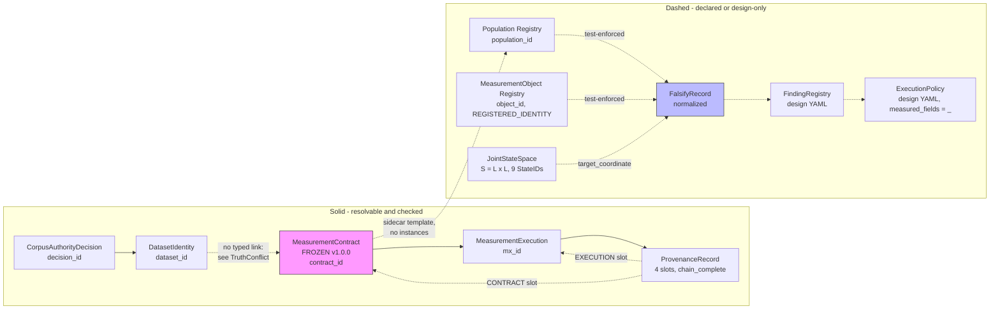

# Schemas for FALSIFY / Measurement architecture (ARCH-REVIEW.v1)

**run_id:** `arch_review_falsify_pack_20260908_023341`  
**version:** `ARCH-REVIEW.v1`  
**Pin:** `d7c25f6e55616261b8b229b000875abd3bd315eb`

These schemas make the FALSIFY Evidence Pack and registries machine-checkable. They do **not** reopen L-003 doctrine; they bind identities already frozen under L-003L/M + MOR.

## Files

| Schema | Purpose |
|---|---|
| `measurement_object.schema.json` | MeasurementObject identity: `object_id`, **`formula_map` (domain→codomain)**, producer, value_domain, projections, status |
| `joint_state_space.schema.json` | Freeze **L** (OutcomeLabel), **S=L×L**, StateID map, aliases, `Y_joint:Ω→S` |
| `population.schema.json` | Population registry entries: id, unit, membership_rule, instrument_scope |
| `falsify_record.schema.json` | One falsification/association record: H0, predictor, target, metric, result, scope, artifacts, non_claims |
| `registry_shape_references.json` | Keys mirrored from existing `measurement_object_registry.json` / L-003L / L-003M |

## How schemas bind to FALSIFY records

1. **`falsify_record.MeasurementObject`** SHOULD cite a `measurement_object.schema.json`-valid object (or `object_id` registered in MOR).
2. **`falsify_record.Population`** SHOULD cite a `population.schema.json`-valid `population_id` from Population Registry.
3. **Targets** that are joint coordinates (e.g. `STATE_SL_TP`) MUST be members of **S** in `joint_state_space.schema.json` / L-003L `Omega_joint`.
4. Mathematical maps are first-class:
   - `Y_scanner : Ω → L` (OutcomeLabel)
   - `Y_oracle  : Ω → L`
   - `Y_joint   : Ω → S` where `S = L × L`
5. Producer refs alone are insufficient; `formula_map.notation` must appear on Y_* registry entries.

## Companion human artifacts

- Report: `docs/research/reports/L003_JSE_ARCHITECTURE_REVIEW_AND_FALSIFY_EVIDENCE.md`
- Pack: `docs/research/reports/l003_jse_falsify_evidence_pack-2026-09-08.json`
- Population Registry: `docs/governance/POPULATION_REGISTRY.md` + `population_registry.json`

---

## Enforcement status (2026-09-09)

The five binding rules above were prose until 2026-09-09. When first measured, **rules 1 and 2
were violated by 4 of 4 records** in the pack: `MeasurementObject` was an ad-hoc dict carrying
four *different* key shapes across four records with `object_id` never present as a key, and
`Population` was a prose string fusing the id, `n` and base-rate together. A declared linkage
that nothing verifies is indistinguishable from an enforced one — the silent-gap class of
F-079 / F-083 / F-085 / F-056.

Two things changed, both **enforcement, not promotion**:

1. **The substrate is now git-tracked.** `docs/research/reports/` was 0-of-8 tracked and the
   registries were untracked while 397 other `docs/governance` files were tracked (a live F-071
   recurrence). This mattered mechanically: `provenance_record.schema.json` defines a binding as
   resolving via *"git ls-files, **never** the filesystem"*, so none of these identities resolved
   from any other clone.
2. **`tests/governance/test_falsify_record_binding.py`** now enforces all five rules, plus a
   git-tracked assertion. Records were normalised **additively** — `object_id` added inside
   `MeasurementObject`, `population_id` added as a sibling field. `Population` deliberately stays
   a verbatim string because `falsify_record.schema.json` types it `{"type": "string"}`; making
   it an object would break rule-4 validation. No original key or value was removed or altered
   (verified by recursive comparison against the committed version: 0 entries lost or changed).

Records 3–4 target path-geometry buckets that have **no** registered MeasurementObject. Rather
than invent an id (forbidden, CLAUDE.md §6.6), they carry `object_id: null` with a required
`object_id_absent_reason`, so the gap stays visible. The test rejects a bare missing key.

**No registry was promoted.** Entries keep `status: REGISTERED_IDENTITY` (identity, not edge).
This grants no authority (§6.5).

## TruthConflict — contract ↔ population / dataset linkage

Surfaced per §6.2 rule 3 (*never silently resolve a conflict*); recorded rather than decided.

| | |
|---|---|
| **Source A** | An architecture review proposed replacing the contract's embedded population with `population_ref → PopulationRegistry`, and adding `contract_id → dataset_ids[]`, on the grounds that `clock_basis` / `volume_semantic` / `source_family` are measurement *assumptions*, not metadata. |
| **Source B** | `measurement_contract.schema.json` is **FROZEN v1.0.0** with `additionalProperties: false`. `docs/governance/JSONL_CLAIM_SURFACE.md:730` forbids mutating it. Precedent `MC-CTXATTR-XAUUSD-M15-V1.json:254`: *"The schema is not loosened to fit an instance; the instance conforms."* |
| **Evidence** | The contract embeds `population` inline with 9 required fields (`unit_of_analysis`, `instruments`, `timeframe`, `calendar_window`, `inclusion_rule`, `exclusion_rule`, `n_declared_min`, `detection_vs_trade`, `population_hash_inputs`) and no `population_id`. It references datasets only indirectly, via `pipeline_identity.dataset_integrity_level`. Both gaps are real. |
| **Impact** | Two population vocabularies coexist — the contract's embedded block and the L-003 `Ω` Population Registry — with no declared mapping. Neither is wrong; they are *different objects* that share a word. |
| **Resolution** | **Not resolved. Frozen schema untouched.** The linkage is expressible in the additive sidecar `schemas/measurement_binding.schema.json` (template only — no instances exist by design, `grants_authority` pinned false). The sidecar annotates; the contract's own `population` block remains authoritative. |

Deciding to actually *populate* that sidecar is a separate, user-authorised episode. It is not
implied by this enforcement pass, and the pack's own `recommended_next_episode` is
`PATH_GENERATION_FOR_STATE_SL_TP` ("observe before predict"), not an ontology build-out.

## Flow: what resolves vs what is only declared

Solid = mechanically resolvable today (tracked artifact + typed id + a test or schema that
checks it). Dashed = declared or design-only. The L-003 research edges stay **dashed even though
the floor test enforces them**: the test proves the link *holds*, it does not grant the link
*authority* (§6.5 — enforcement ≠ promotion).

Two edges are dashed specifically because they **cannot** be made solid without breaking a frozen
schema: `DatasetIdentity → MeasurementContract` and `MeasurementContract → Population Registry`.
That is the TruthConflict above, drawn.

## Reconciliation: the two `unit_of_analysis` enums

`MeasurementContract` exists as two files with the same title. The **JSON is authoritative**; the
YAML is `design_draft` and subordinate.

| | `docs/governance/measurement_contract.schema.json` (FROZEN v1.0.0) | `docs/design/context-finding-odp/schemas/measurement_contract.schema.yaml` (design_draft) |
|---|---|---|
| Shared | `candle`, `signal_event`, `trade_decision`, `settlement_event`, `panel_row` | same five |
| Only here | **`rebalance`** | **`context_bar`** |
| Meaning of the difference | supports cashflow/turnover populations (the F-034 carry-harvest class) | Context/ODP-facing: "every bar matching a Context" |
| Disposition | authoritative — a sealed `MC-*` validates against this enum alone | `context_bar` is a **design-only term**; it does not validate against the frozen schema |

A DRAFT ODP may use the YAML vocabulary for exploratory work. Anything claiming comparability or
promotion must set `sealed_mc_ref` and defer to the JSON enum. Never treat a YAML-only member as
if it validates against the frozen schema.

The full four-field divergence (this row plus `detection_vs_trade`, `splits.holdout_procedure`
vs `splits.scheme`, and `overlap_policy`) is recorded once, at the source, in that YAML file's
`vocabulary_divergence_from_formal_schema` block — not restated here (§6.2 rule 5).
