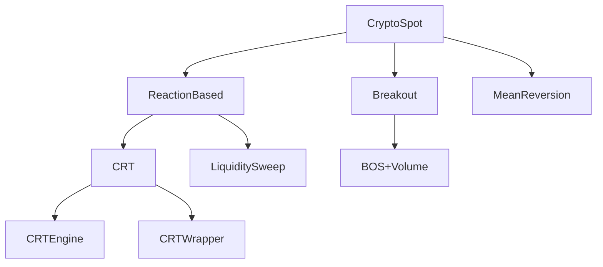

# Concatenated implementation plans — part 1 of 10

Source directory: `docs/implementation_plan/`
Files in this part: 17

## Contents

1. `001_FRAMEWORK_REGISTRY.md` (17776 bytes)
2. `1-does-rrfusionlayer-ever-cryptic-frost.md` (10248 bytes)
3. `1-root-cause-why-validated-crab.md` (8259 bytes)
4. `acquire-perp-funding-oi-data-refactored-marble.md` (7910 bytes)
5. `act-as-claude-md-melodic-sunset.md` (7939 bytes)
6. `agentic-ai-kitchen-design.md` (36076 bytes)
7. `analsysi-start-no-governance-mellow-pillow.md` (12766 bytes)
8. `analyse-docs-research-readiness-worked-w-woolly-zephyr.md` (5509 bytes)
9. `analyse-last-grok-code-humming-leaf.md` (10365 bytes)
10. `ancient-stargazing-planet.md` (13051 bytes)
11. `architecture-review-request-we-ve-curious-shamir.md` (10427 bytes)
12. `audit-and-analyse-opportunity-episode-pl-effervescent-corbato.md` (16064 bytes)
13. `b0-b1-dimensional-mix-glittery-sundae.md` (11594 bytes)
14. `b2a-hypothesis-computation-swift-hummingbird.md` (9640 bytes)
15. `backtest-runtime-roadmap-2026-07-20.md` (7785 bytes)
16. `backtest-sensitivity-sweep-before-twinkling-tide.md` (4173 bytes)
17. `bitnet-cpp-specification-v1-2026-07-21.md` (66124 bytes)


================================================================================
SOURCE_FILE: docs/implementation_plan/001_FRAMEWORK_REGISTRY.md
SOURCE_BYTES: 17776
PART: 1/10 FILE 1/17
================================================================================

# Implementation Plan 001: Framework Registry (JSONL-Based Architecture Map)

> **Purpose:** Build a queryable, append-only, evidence-linked registry that maps the entire
> codebase against the first-principles trading system hierarchy. Every component is linked
> to its code evidence, parent-child relationships, and research findings.
>
> **Prerequisite:** `docs/architecture/TRADING_SYSTEM_FRAMEWORK.md` (Levels 0-6 hierarchy).
> **Status:** BUILT 2026-06-16 (M0–M5). The realized registry is `data/framework_registry.jsonl`;
> the live gap audit is generated by `scripts/governance/framework_gap_audit.py`.
> **Date:** 2026-06-15
>
> ⚠️ **Post-build reconciliation (CLAUDE.md §6.2):** the illustrative gap tables below (lines
> 314/321/335) and `src/inout/executor.py` (163) are **superseded by code-verified truth**: the
> generated gap audit RETRACTS the "UltronRiskGate disabled" row (it is `extant`+wired), and
> `src/inout/executor.py` does not exist (live surface = `src/engines/live_engine.py`, `EXEC-002`).
> The inline tables are kept as the original design sketch; the registry + generated audit win.

---

## Milestone M0: Registry Schema + Module

### Deliverable 1: JSONL Schema Definition

File: `docs/reference/framework_registry_schema.md`

One JSONL file at `data/framework_registry.jsonl`. Each line has exactly this schema:

```json
{
  "id": "DOMAIN-001",
  "type": "domain",
  "level": 1,
  "name": "CryptoSpot",
  "parent": null,
  "children": ["STYLE-001", "STYLE-002"],
  "evidence": [
    {
      "path": "scripts/data/fetch_crypto_ccxt.py",
      "line": 31,
      "symbol": "_INSTRUMENTS",
      "type": "code"
    },
    {
      "path": "configs/production/v2_multi_2026_04 - deepdeektry.json",
      "line": 24,
      "symbol": "session_calendar.crypto_quote_suffixes",
      "type": "config"
    }
  ],
  "findings": ["F-019", "F-020"],
  "tests": ["tests/test_dataset_integrity.py"],
  "status": "implicit",
  "created": "2026-06-15T02:37:00Z",
  "last_validated": "2026-06-15T02:37:00Z",
  "notes": "No Domain class exists — domain is implicit in config + data scripts"
}
```

**Type enum:** `kernel | domain | style | strategy | implementation | intent | risk | execution | component`

**Level enum:** `0 | 1 | 2 | 3 | 4 | 5 | 6` (matching TRADING_SYSTEM_FRAMEWORK.md)

**Status enum:** `extant | implicit | orphaned | killed | dormant | planned | stub`

**Evidence type enum:** `code | config | doc | test | finding`

### Deliverable 2: Python Registry Module

File: `src/governance/framework_registry.py`

```python
"""
FrameworkRegistry — queryable, append-only registry of the trading system architecture.

Every component (domain, style, strategy, implementation, kernel, risk, execution) is
a JSONL line linked to its code evidence, parent/children, and research findings.

Usage:
    registry = FrameworkRegistry()
    registry.load("data/framework_registry.jsonl")
    
    # Query by type
    styles = registry.filter(type="style")
    
    # Get full tree for a domain
    tree = registry.get_tree("DOMAIN-001")
    
    # Find components touched by a finding
    affected = registry.find_by_finding("F-021")
    
    # Validate all evidence paths exist
    errors = registry.validate_evidence()
    
    # Get orphaned components (no parent, no children)
    orphans = registry.get_orphaned()
    
    # Append a new line
    registry.append(new_record)
```

**Public API:**

| Method | Purpose | Returns |
|--------|---------|---------|
| `load(path)` | Load JSONL, keep latest per id | int (count) |
| `filter(type=None, level=None, status=None, parent=None)` | Query registry | list[dict] |
| `get(id)` | Get component by id | dict |
| `get_tree(root_id)` | Recursively build parent→children tree | dict (nested) |
| `find_by_finding(finding_id)` | All components linked to a finding | list[dict] |
| `get_orphaned()` | Components with no parent reference | list[dict] |
| `validate_evidence()` | Check every evidence path+line exists | list[ValidationError] |
| `validate_findings()` | Check every finding id exists in current-findings.md | list[ValidationError] |
| `append(record)` | Append one line, raises on schema violation | None |
| `to_dataframe()` | Export as pandas DataFrame for analysis | DataFrame |
| `summary()` | Counts per type, level, status | dict |

### Deliverable 3: Validation Tests

File: `tests/test_framework_registry.py`

| Test | Purpose |
|------|---------|
| `test_registry_loads_valid_jsonl` | All lines parse, no schema violations |
| `test_every_evidence_path_exists` | Every `evidence[].path` is a real file |
| `test_every_finding_exists` | Every `findings[]` id is in docs/current-findings.md |
| `test_no_dangling_parent` | Every `parent` id exists in the registry |
| `test_no_dangling_child` | Every `children[]` id exists in the registry |
| `test_level_matches_type` | `type=domain` implies `level=1`, etc. |
| `test_unique_ids` | No duplicate `id` across lines |
| `test_append_only_immutable` | Appending does not mutate existing lines |

---

## Milestone M1: Seed the Registry from Codebase

### Step 1: Classify existing code into the hierarchy

Manual classification pass (one-time, done by agent + user review):

| Existing Code | Hierarchy Level | Status |
|--------------|----------------|--------|
| `src/core/engine_runner.py` | Kernel (Level 0) | Extant |
| `src/core/fusion_engine.py` | Kernel (Level 0) | Extant |
| `src/core/decision_engine.py` | Kernel (Level 0) | Extant |
| `src/features/feature_pipeline.py` | Kernel (Level 0) | Extant |
| `src/runtime/backtest_v2.py` | Kernel (Level 0) | Extant |
| `src/core/collector.py` | Kernel (Level 0) | Extant |
| `` — implicit via data scripts | Domain: CryptoSpot (Level 1) | Implicit |
| `scripts/data/fetch_forex_yfinance.py` | Domain: Forex (Level 1) — dormant | Implicit |
| `scripts/data/fetch_crypto_ccxt.py` | Domain: CryptoSpot (Level 1) | Implicit |
| `scripts/data/fetch_candles_hummingbot.py` | Domain: CryptoSpot (Level 1) — alternate source | Implicit |
| `configs/production/*.json session_calendar` | Domain config (Level 1) | Extant |
| `src/strategies/s01_crt_wrapper.py` | Style: ReactionBased (Level 2) → Strategy: CRT (Level 3) | Extant |
| `src/strategies/s02_mean_reversion.py` | Style: MeanReversion (Level 2) → Strategy: RSI+BB (Level 3) | Extant |
| `src/strategies/s03_breakout.py` | Style: Breakout (Level 2) → Strategy: BOS+Volume (Level 3) | Extant |
| `src/strategies/s04_stat_arb.py` | Style: StatArb (Level 2) → Strategy: Z-Score (Level 3) | Extant |
| `src/strategies/s05_grid.py` | Style: Grid (Level 2) → Strategy: ATR Grid (Level 3) | Extant |
| `src/strategies/s06_scalping.py` | Style: Momentum (Level 2) → Strategy: MACD (Level 3) | Extant |
| `src/strategies/s07_news_sentiment.py` | Style: ReactionBased (Level 2) | Extant |
| `src/strategies/s08_ml_ensemble.py` | Style: ML/Hybrid (Level 2) | Extant |
| `src/strategies/s09_pattern_recog.py` | Style: Pattern (Level 2) → Strategy: Candlestick (Level 3) | Extant |
| `src/strategies/s10_trap_strategy.py` | Style: ReactionBased (Level 2) → Strategy: LiquiditySweep (Level 3) | Extant |
| `src/engines/crt_engine.py` | Implementation (Level 4) of CRT strategy | Extant |
| `src/engines/heuristic_gaussian_engine.py` | Implementation (Level 4) — fused at kernel | Extant |
| `src/engines/ml_gaussian_engine.py` | Implementation (Level 4) — fused at kernel | Extant |
| `src/engines/zone_gate_engine.py` | Implementation (Level 4) — fused at kernel | Extant |
| `src/engines/rr_engine.py` | Implementation (Level 4) — fused at kernel | Extant |
| `src/config_layer/execution_planner.py` | Execution (Level 6) | Extant |
| `src/core/ultron_risk_gate.py` | Risk (Level 5) | Extant |
| `src/inout/executor.py` | Execution (Level 6) | Stub |
| `src/agent/` | AI Layer (Level 4) | Extant |
| `src/bitnet/bitnet_inference.py` | AI Layer (Level 4) — advisory | Extant |
| `src/governance/promotion_manager.py` | Governance — meta, not in hierarchy | Extant |

### Step 2: Generate seed JSONL

Script: `scripts/governance/seed_framework_registry.py`

Reads the classification table (above) and writes initial JSONL lines. Each line includes:
- Extracted evidence paths (file:line for key classes/functions)
- Parent/children based on hierarchy
- Status based on whether the module exists and is wired

### Step 3: Manual cleanup pass

User reviews the generated registry, corrects:
- Missing evidence references
- Wrong parent/child assignments
- Wrong status classifications
- Adds any components the automated pass missed

---

## Milestone M2: Registry Query + Visualization

### Deliverable 1: CLI Query Tool

Script: `scripts/governance/query_registry.py`

```
Usage:
    python scripts/governance/query_registry.py --summary
        # Counts per type, level, status

    python scripts/governance/query_registry.py --type strategy
        # All strategy records

    python scripts/governance/query_registry.py --tree DOMAIN-001
        # Full tree for CryptoSpot domain

    python scripts/governance/query_registry.py --finding F-021
        # All components touched by finding F-021

    python scripts/governance/query_registry.py --orphaned
        # Components with no parent or no children

    python scripts/governance/query_registry.py --missing-evidence
        # Components with missing file references

    python scripts/governance/query_registry.py --validate
        # Full validation run
```

### Deliverable 2: Registry Report

Script: `scripts/governance/framework_registry_report.py`

Generates `reports/framework_registry_report.md` with:

1. **Summary table** — count per level per status
2. **Gap analysis** — which framework levels are empty or implicit
3. **Orphan report** — components not connected to the tree
4. **Finding coverage** — which findings are linked to components, which findings have no linked components
5. **Evidence health** — count of valid vs broken evidence paths
6. **Hierarchy visualization** — ASCII tree of the full registry

### Deliverable 3: Visual Representation (Optional)

Script generates a Mermaid diagram or DOT graph:



---

## Milestone M3: Framework vs Codebase Gap Audit

### Deliverable 1: Gap Audit Report

Script: `scripts/governance/framework_gap_audit.py`

Compares the registry against the ideal framework document and produces:

```md
# Framework Gap Audit Report

## Level 0: Universal Kernel
| Component | Status | Code Evidence | Gap |
|-----------|--------|---------------|-----|
| MarketDataIngestion | **IMPLICIT** | scripts/data/ | No canonical Candle class |
| FeaturePipeline | EXTANT | src/features/ | ✓ |
| BacktestRunner | EXTANT | src/runtime/ | ✓ |
| TradeObject | EXTANT | src/core/collector.py | Missing domain_tag |
| EvaluationMetrics | EXTANT | src/runtime/backtest_v2.py | No bootstrap CI |
| Logging | EXTANT | src/utils/ | Missing full chain audit |

## Level 1: Domain Layer
| Domain | Status | Code Evidence | Gap |
|--------|--------|---------------|-----|
| CryptoSpot | IMPLICIT | No Domain class | Missing TradingCalendar, CostModel etc. |
| CryptoFutures | ABSENT | No evidence | Not supported |
| Forex | DORMANT | fetch_forex_yfinance.py | Data pipeline only, no domain config |
| Equities | ABSENT | No evidence | Not supported |
| Futures | ABSENT | No evidence | Not supported |
| Options | ABSENT | No evidence | Not supported |

## Level 2: Style Layer
| Style | Status | Gap |
|-------|--------|-----|
| ReactionBased | EXTANT (3 strategies) | No style class, not separated from kernel |
| MeanReversion | EXTANT (1 strategy) | No style class |
| Breakout | EXTANT (1 strategy) | No style class |
| StatArb | EXTANT (1 strategy) | No style class |
| Grid | EXTANT (1 strategy) | No style class |
| Momentum | EXTANT (1 strategy) | No style class |
| Pattern | EXTANT (1 strategy) | No style class |
| TrendFollowing | ABSENT | No strategy implements this |

## Level 3: Strategy Layer
| Strategy | Style | Status | Gap |
|----------|-------|--------|-----|
| CRT | ReactionBased | EXTANT | Wired as mandatory engine, not strategy |
| RSI+BB | MeanReversion | EXTANT | ✓ |
| BOS+Volume | Breakout | EXTANT | ✓ |
| Z-Score | StatArb | EXTANT | ✓ |
| ATR Grid | Grid | EXTANT | ✓ |
| MACD | Momentum | EXTANT | ✓ |
| Candlestick | Pattern | EXTANT | ✓ |
| LiquiditySweep | ReactionBased | EXTANT | ✓ |

## Level 4: AI Layer
| Module | Status | Gap |
|--------|--------|-----|
| RegimeClassifier | STUB | src/cognitive/ exists but dormant (F-012) |
| DriftDetector | EXTANT | src/features/feature_monitor.py, but not acted on (F-008) |
| ExecutionModel | ABSENT | Not implemented |
| LLM Advisory | EXTANT | src/engines/llm_engine.py, fallback = neutral 1.0 |

## Level 5: Risk Layer
| Module | Status | Gap |
|--------|--------|-----|
| PreTradeRisk | EXTANT | UltronRiskGate — but gated_enabled=false in config |
| InTradeRisk | EXTANT | ExecutionPlanner handles breakeven, trailing |
| PortfolioRisk | STUB | src/portfolio/ exists but orphaned (F-013) |

## Level 6: Execution Layer
| Module | Status | Gap |
|--------|--------|-----|
| OrderDispatch | STUB | src/inout/executor.py exists but live path not verified |
| SlippageModel | ABSENT | No slippage model — uses fixed 12bps |
| VenueRouting | ABSENT | Single exchange only |
| FillSimulation | ABSENT | Not in backtest |
```

### Deliverable 2: Priority Action List

From the gap audit, derive a ranked list:

| Priority | Gap | Effort | Impact |
|----------|-----|--------|--------|
| P0 | CRT/RR/Gaussian/Zone are mandatory engines — should be strategy plugins | High | Architecture inversion (F-021) |
| P0 | No Domain class — calendar/cost/leverage implicit | Medium | Blocks multi-domain expansion |
| P1 | UltronRiskGate disabled in active config | Low | Risk bypass in production |
| P1 | Style layer doesn't exist — strategies are flat | Medium | Blocks style-constrained strategy selection |
| P2 | Missing execution quality model | Medium | Live PnL unverified (F-010) |
| P2 | Slippage model is fixed 12bps | Low | May mask edge |
| P3 | Trend Following style absent | Low | Not relevant if crypto is the only domain |
| P3 | No bootstrap CI on expectancy | Low | Confidence intervals missing |
| P4 | Portfolio risk module orphaned | Low | Not wired into spine |

---

## Milestone M4: Continuous Validation

### Deliverable 1: CI Gate

The registry validation becomes a CI gate:
```
python scripts/governance/query_registry.py --validate
```
Runs on every PR. Validates:
- All evidence paths exist
- All finding ids exist
- No dangling parent/children
- No duplicate ids

### Deliverable 2: Registry Update Policy

When a component is added/changed/removed:
1. Developer runs `scripts/governance/update_registry.py --component <id> --status <new_status>`
2. Script appends a new JSONL line with updated fields + new timestamp
3. Script validates the update locally
4. CI re-validates on push

### Deliverable 3: Living Report

`reports/framework_registry_report.md` is auto-generated on every change. Always reflects current state.

---

## Timeline & Effort Estimate

| Milestone | Tasks | Effort | Dependencies |
|-----------|-------|--------|-------------|
| M0: Schema + Module | 3 deliverable files | 4-6 hours | TRADING_SYSTEM_FRAMEWORK.md |
| M1: Seed Registry | Classification + script + cleanup | 3-5 hours | M0 |
| M2: Query + Viz | 2 CLI scripts + report generator | 4-6 hours | M1 |
| M3: Gap Audit | Gap audit script + report | 3-4 hours | M0 + M1 |
| M4: CI + Policy | CI config + update script | 2-3 hours | M2 + M3 |

**Total:** 16-24 hours of implementation time (agent + user review cycles).

---

## File Inventory

```
NEW: docs/reference/framework_registry_schema.md
NEW: src/governance/framework_registry.py
NEW: tests/test_framework_registry.py
NEW: scripts/governance/seed_framework_registry.py
NEW: scripts/governance/query_registry.py
NEW: scripts/governance/framework_registry_report.py
NEW: scripts/governance/framework_gap_audit.py
NEW: scripts/governance/update_registry.py
NEW: data/framework_registry.jsonl          (generated by seed script)
NEW: reports/framework_registry_report.md   (generated by report script)
NEW: reports/framework_gap_audit.md         (generated by gap audit script)
MOD: docs/architecture/TRADING_SYSTEM_FRAMEWORK.md  (add JSONL schema section)
```

---

## Open Questions

1. **Which domain first?** The registry supports multiple domains immediately. But should the initial seed cover CryptoSpot only, or also Forex (dormant data pipeline) and CryptoFutures (planned)?
2. **Merge with existing intent graph?** `docs/intent_graph.md` and `docs/intent_to_code_map.md` already map intent→code. Should the registry replace or complement these?
3. **Auto-generation vs manual curation?** The initial seed is manual (human classification). Should we build a script that AST-parses `src/` to auto-detect classes and update evidence paths?


================================================================================
SOURCE_FILE: docs/implementation_plan/1-does-rrfusionlayer-ever-cryptic-frost.md
SOURCE_BYTES: 10248
PART: 1/10 FILE 2/17
================================================================================

# Plan — RR fusion confidence-gate mis-specification: probe (hard gate), provisional finding, deferred fix

## Context

A forensic Q&A about `RRFusionLayer` (the F-038 "RR is a Gaussian duplicate" mechanism) surfaced a
root cause deeper than the recorded one. The code proves:

- **Base `RREngine`** (`src/engines/rr_engine.py`) is a stateless **Candle Polarity Index** (reads
  only `close/high/low`, no ML, no training) — NOT the 38-feature ML model. Independent fusion
  input; nothing to retrain/retire.
- **The RR ML model** (`NanoInferenceEngine`, `src/config_layer/rr/rr_pattern_miner.py`) IS trained
  on the real 38-dim canonical vector (`models/rr_model.json`: `n_features=38, n_train=49000,
  canonical_38`, 11 `zero_indices`). Not 3 features.
- **Hypothesised root cause (math-derived, empirically-UNconfirmed):** the confidence gate
  `confidence = exp(-0.5·d_sq)`, bypass if `< 0.3` (`rr_pattern_miner.py:339-342`), requires
  `d_sq < 2.408`. `d_sq` is Mahalanobis over **27 effective dims** whose in-distribution
  `E[d_sq]=27` → in-distribution confidence ≈ `exp(-13.5) ≈ 1.4e-6 ≪ 0.3` → the gate bypasses to
  Gaussian for ~**every** input, including in-sample. The observed "~5e-5 with the full vector"
  (F-038) ≈ the **expected in-distribution floor** for ~27 dof — evidence the **gate is mis-scaled**,
  not that the model is OOD/feature-starved.

**Static dof pre-check — already CONFIRMED (read-only, done during planning):** `models/rr_model.json`
has `len(conf_mu)=len(conf_P)=38`, dense 38×38 precision, and `scale_sigma==1` at **exactly** the 11
`zero_indices` (constant-zero columns). Zeroing precedes standardization ⇒ `delta[i]=0` for those
dims ⇒ they null their row+column in `conf_P` ⇒ the quadratic form has **rank 27**. So `E[d_sq]≈27`
is structurally sound. **Remaining unknown = the empirical in-sample `d_sq`/bypass distribution.**

**Outcome intended:** *first* confirm the bypass empirically on training data; *only if confirmed*
record the corrected mechanism as a finding and re-specify the gate — additively, behind config,
with `rr_fusion` staying `enabled=false` (the fix grants NO authority per §6.5 Authority Ladder).

**Non-goals:** retraining; removing the fallback (Option B hard-fails ~100% of decisions under any
gate); retiring the CPI; re-enabling `rr_fusion`.

---

## ⛔ Governing rule for this plan

**Track 1 is the hard gate.** If the in-sample probe does **not** show **≥95% bypass**, Tracks 2 and
3 **STOP** — the dof hypothesis is incomplete and must be re-derived before any finding or code
change. No math-first promotion: `Evidence → Finding → Math`, never `Math → Finding → Evidence`.

Revised execution order:
```
Track 1 (probe + training-stat validation)  ──PASS(≥95%)──▶  Track 2 (register)  ──▶  Track 3A (choose gate math)  ──▶  Track 3B (implement)  ──▶  Track 4 (future, out of scope)
        └── FAIL ─▶ STOP: re-derive dof hypothesis, revise plan
```

---

## Track 1 — Empirical probe + training-stat validation (read-only, HARD GATE)

**1A — In-sample bypass (decisive).** A model cannot be OOD on its own training data.
- New read-only script `scripts/analysis/rr_confidence_probe.py`:
  - `NanoInferenceEngine.load("models/rr_model.json")`; load training vectors `X` from
    `models/BNBUSDT/bnbusdt_balanced_20260524/rr_dataset_202605_v1.json` (version `202605_v1`).
  - Run each `X[i]` through the engine; record `d_sq`, `confidence`, `status`. Also run the 3-feature
    `score_dict` stub for contrast.
  - Emit `results/rr_confidence_probe/report.{json,md}`: **bypass fraction**, `d_sq`/`confidence`
    percentiles (min/median/p95/max), effective dof, full-vector vs 3-feature comparison.
- **1B — Training-stat validation (static half already confirmed above):** the script also asserts
  `len(conf_mu)==len(conf_P)==38`, `conf_P` is 38-wide, and the constant-zero columns == `zero_indices`
  (11) → effective dof 27. Record in the artifact so the dof argument is auditable.
- **GATE:** proceed only if in-sample bypass **≥95%** AND median `d_sq` ≈ dof (≈27). Otherwise STOP.

Read-only re: repo code; artifact under `results/` (gitignored data class).

## Track 2 — Register PROVISIONAL finding + refine F-038 + fix doc-drift  *(only if Track 1 PASSES)*

Run the E-001 6-question pre-registration ritual first (`docs/governance/EPISTEMIC_INTEGRITY.md`).

- **F-044 registered as PROVISIONAL / HYPOTHESIS**, not `Certain`, in BOTH enforced locations
  (`docs/current-findings.md` + `CLAUDE.md` §6.2 truths index; sync enforced by
  `tests/test_current_findings.py`):
  - Status `HYPOTHESIS`; **Promotion criterion explicit in the row:** "→ `Certain` iff Track-1
    in-sample bypass ≥95% (artifact `results/rr_confidence_probe/report.json`)."
  - Since Track 2 runs only after the ≥95% gate passes, the promotion criterion is met at
    registration — but the row records the criterion + artifact so authority is traceable to
    measurement, not math.
  - Conclusion: *the RR-fusion confidence gate is mis-specified for its dimensionality —
    `exp(-0.5·d_sq)<0.3` needs `d_sq<2.4` but the 27-rank Mahalanobis `E[d_sq]≈27`, so it bypasses to
    Gaussian for ~100% of inputs including in-sample; the F-038 double-count is a gate-scaling
    defect, not model OOD/feature starvation → retrain/full-vector cannot lift confidence under this
    gate.* Evidence = probe artifact + `file:line`.
- **Refine F-038 (not reverse):** append a `CORRECTED:` clarification to F-038's row +
  `docs/current-findings.md` — mechanism refined from "model OOD when fed correctly" to "gate
  mis-scaled to dimensionality; ~5e-5 ≈ expected in-dist floor for ~27 dof." Preserve history (§6.2
  rule 4); the disable-remediation stays correct.
- **Fix DOC_DRIFT (hash-neutral comments):** `rr_pattern_miner.py:4`/`:255` "24-feature" and `:18`
  "currently 35" → 38 (truth: `feature_schema.py:76`).

## Track 3A — Choose gate math from the MEASURED distribution  *(only if Track 1 PASSES)*

Do **not** pre-commit a gate formula. Read the probe's `d_sq` distribution, then select:
- `chi2_tail` (theory-expected): bypass if `Q(dof/2, d_sq/2) < p_threshold` — Mahalanobis→χ²→tail
  probability is exactly what the model implies. Preferred if median `d_sq ≈ dof`.
- `dof_scaled` (pragmatic): compare `d_sq/dof` to a threshold — sufficient if the distribution is
  well-behaved and a simple normalization separates in/out cleanly.
- Output: a one-paragraph decision note in the probe artifact naming the chosen mode + threshold,
  justified by the measured percentiles.

## Track 3B — Implement the chosen gate (additive, config-behind, parity-proved)

- `src/config_layer/rr/rr_pattern_miner.py`: extract the bypass decision into a pure-Python helper
  (inference is deliberately numpy-free / `__slots__`), modes:
  - `legacy_scalar` (**default**): `confidence < _CONF_BYPASS` — byte-identical to line 342.
  - the mode chosen in 3A (`chi2_tail` needs a ~20-line pure-Python regularized upper incomplete
    gamma; `dof_scaled` is trivial).
- **Config:** new `rr_model.confidence_gate` subsection in `configs/production/v2_multi_2026_04.json`,
  strict `_require`/`from_prod_config` — **no silent defaults** (§6.5 A1). Default
  `mode:"legacy_scalar"` → parity.
- **Hash:** `python scripts/maintenance/_compute_hash.py --check`; rehash only if `rr_model`
  participates.
- **`rr_fusion.enabled` stays `false`.** Correctness ≠ authority (§6.5). Re-enable is Track 4.
- **Parity proof (§6.5):** `mode="legacy_scalar"` + strict read + byte-identical `predict()` on the
  probe rows + determinism/replay gate green.
- **Tests** `tests/test_rr_confidence_gate.py`: legacy parity (full-object identity), chosen-mode math
  (known `d_sq`→expected bypass), missing-key raises. Keep green:
  `tests/test_rr_fusion_full_vector.py`, `tests/test_engine_runner_rr_fusion.py`,
  `tests/test_current_findings.py`, `tests/governance/test_epistemic_invariants.py`.

## Track 4 — Future retrain / re-enable  *(OUT OF SCOPE — not this plan)*

Any re-enable of `rr_fusion` requires a **measured ΔG001** improvement (Authority Ladder), gated
separately after the gate is correct. Listed only to fence it off.

---

## Critical files

| File | Track | Change |
|---|---|---|
| `scripts/analysis/rr_confidence_probe.py` | 1 | **new** read-only probe + stat validation |
| `results/rr_confidence_probe/report.*` | 1 | **new** artifact = promotion gate for all later tracks |
| `docs/current-findings.md` | 2 | add F-044 (HYPOTHESIS), refine F-038 |
| `CLAUDE.md` (§6.2 truths index) | 2 | F-044 row + promotion criterion, F-038 clarification |
| `src/config_layer/rr/rr_pattern_miner.py` | 2,3B | doc-drift fix; dof-aware gate helper + modes |
| `configs/production/v2_multi_2026_04.json` | 3B | `rr_model.confidence_gate`, default legacy |
| `tests/test_rr_confidence_gate.py` | 3B | **new** parity + gate math |

## Verification (end-to-end)

1. `python scripts/analysis/rr_confidence_probe.py` → **GATE:** in-sample bypass ≥95%, median `d_sq`≈27,
   dof-stat assertions pass. If FAIL → STOP.
2. `pytest tests/test_rr_confidence_gate.py -q` → parity + chosen-mode math pass.
3. `pytest tests/test_current_findings.py tests/governance/test_epistemic_invariants.py -q` → green.
4. `pytest tests/test_rr_fusion_full_vector.py tests/test_engine_runner_rr_fusion.py -q` → no regression.
5. Determinism/replay gate (BNBUSDT+SOLUSDT) byte-identical with `mode="legacy_scalar"`.
6. `python scripts/maintenance/_compute_hash.py --check` → unchanged, or rehash if `rr_model` participates.
7. SESSION LOG appended to `assistant_project.md` (§6); §6.2 doc-decision audit entry recorded.

## Governance notes
- **Track 1 is the promotion gate for every subsequent change.** No finding/code before ≥95% bypass.
- F-044 enters as HYPOTHESIS with an explicit, artifact-linked promotion criterion.
- F-038 is refined (mechanism), not reversed; history preserved (§6.2 rule 4).
- Gate fix grants tunability, not authority; `rr_fusion` stays disabled. Re-enable = Track 4, ΔG001-gated.
- E-001 pre-registration ritual precedes registering F-044.


================================================================================
SOURCE_FILE: docs/implementation_plan/1-root-cause-why-validated-crab.md
SOURCE_BYTES: 8259
PART: 1/10 FILE 3/17
================================================================================

# Agent Session Economy — measured best practices

## Context

A recent agentic session ran 1h13m / 25.5k tokens, and the standing full-suite command
(`venv/Scripts/python.exe -m pytest tests/ -q ... | tail -40`) was reported as "causing issue."
Rather than accept the generic "cumulative context inflation" diagnosis, this plan is grounded in
measurements taken against this repo on 2026-07-23. Two of the assumed causes turned out to be
wrong, and the two dominant real causes were not in the original analysis at all.

### What was measured

**Fixed per-session context floor (re-sent on every inference):**

| Artifact | Size | ~tokens |
|---|---|---|
| `CLAUDE.md` (auto-loaded) | 93 KB | ~23k |
| `MEMORY.md` index (auto-loaded) | 19 KB | ~5k |
| **Floor before the user types** | **112 KB** | **~28k** |

The documented cold-start ritual makes it far worse: `docs/architecture/trigger-vocabulary.md:16-30`
directs a fresh session to read `docs/current-findings.md` (210 KB, ~52k tok), and the CLAUDE.md
model-registry table says `active_models.yaml` (78 KB, ~20k tok) is "loaded first in every session."
**A session obeying the written ritual spends ~100k tokens before doing any work.**

**Full-suite runtime (measured, not estimated):** `7,983.88s = 2:13:03`;
73 failed / 3,900 passed / 25 skipped / 2 xfailed.

| Slice | Time | Share |
|---|---|---|
| Top 6 tests | 6,443s | **80.7%** |
| Top 25 tests | 7,492s | 93.8% |
| Remaining 3,975 tests | **492s** | 6.2% |

The three `tests/runtime/test_replay_determinism.py` tests alone are 3,943s (**49.4%**). Three of the
top six are *fixture setup* time — full backtests inside fixtures, billed to whichever test touches
them first.

### Corrections to the original diagnosis

- **"cp1252 UnicodeEncodeError debugging"** — real, and *structural*: `.claude/settings.local.json`
  has no `env` block, so `PYTHONIOENCODING` is unset every session. Not bad luck; recurring by
  construction.
- **Network/MT5 hangs** — NOT a cause. `tests/test_llm_connectivity.py` fully mocks `urlopen`; no
  unguarded network/MT5/Playwright call exists in the suite. Ruled out by inspection.
- **`-p no:randomly`** — a no-op. `pytest-randomly` is not installed or configured.
- **Turn-count context accumulation** — real but *secondary here*. The ~28k fixed floor multiplied
  by turn count dominates the incremental tool-output growth.

### Intended outcome

Cut the two dominant costs (context floor, test wall-clock) without weakening any governance gate.
Every change below is additive or config-level; none removes a check.

---

## Tier 1 — Harness fixes (mechanical, no doctrine)

**1. Kill the encoding loop at the source.** Add an `env` block to `.claude/settings.local.json`:
`PYTHONIOENCODING=utf-8` (and `PYTHONUTF8=1`). This removes an entire recurring failure class that
currently costs ~3 turns whenever it fires. Complements — does not replace — `src/utils/console_safe.py`,
which stays the rule for production CLI output per `docs/reference/conventions.md:271`.

**2. Rebuild the permission allowlist.** The 130 `allow` entries are archaeology — one-off
`mv Backup/Codebase_Backup1.zip …` lines from a 2026-06 file reorg. Almost none cover the recurring
read-only commands, so prompts still fire. Use the existing `/fewer-permission-prompts` skill to
regenerate from actual transcript history rather than hand-writing entries.

**3. Pin one interpreter.** The allowlist shows four in rotation (`python`, `py -3.11`,
`venv/Scripts/python.exe`, a hardcoded `Python312\python.exe`). `venv/Scripts/python.exe` is the one
that works (already recorded as a GOTCHA in `project_feature_lineage_candle_math.md`). State it once
in the harness config so it stops being rediscovered.

**4. Set `addopts` in `pyproject.toml` `[tool.pytest.ini_options]`.** Currently absent, so bare
`pytest` emits full tracebacks for 73 pre-existing failures. Add `--tb=short --no-header -q`.

## Tier 2 — Test wall-clock (the 2:13 → ~8 min lever)

**5. Mark the top-6 heavyweights `@pytest.mark.slow`.** The marker is already declared in
`pyproject.toml` but used in only one file (`tests/research/test_trace_corpus.py`). Apply it to:
- all three in `tests/runtime/test_replay_determinism.py`
- `tests/test_historical_zone_mapper_corpus_parity.py::test_corpus_parity_mapper_vs_engine_runner_zone_stage`
- `tests/research/test_xauusd_spine_smoke.py::test_spine_collect_runs_on_frozen_candidate_without_active_version_drift`
- `tests/analytics/test_metrics_oracle_parity.py::test_trade_count_parity`

**6. Document a two-lane convention in `docs/reference/testing.md`** (existing doc — §6.2 rule 1):
- *fast lane* `pytest tests/ -m "not slow"` — ~8 min, for iteration
- *full lane* `pytest tests/` — 2:13, unchanged, **required before promotion**

**Do NOT** put `-m "not slow"` in `addopts`. These are determinism and byte-identity proofs — the
governance backbone. Default behavior must stay full; the fast lane is opt-in. This is the
`§6.5 Authority Ladder` distinction: a faster loop earns *convenience*, never *authority*.

**7. Scope collection away from the nested worktree.** `.pytest_cache` recorded 4,241 nodeids
including `.claude/worktrees/wizardly-neumann-923c0e/tests/` — a second repo copy, contributing 2 of
the cached failures. Add `norecursedirs = [".claude", "venv"]`.

## Tier 3 — Context budget

**8. Fix the cold-start recipe** in `docs/architecture/trigger-vocabulary.md:16-30`. Replace "read
`docs/current-findings.md`" (210 KB) with "read the Repository Truths Index table already inlined in
CLAUDE.md; open `docs/current-findings.md` only for a specific F-id." The index exists precisely so
the full doc need not be loaded — the ritual currently defeats its own purpose.

**9. Resolve the plan-directory ambiguity.** Cold-start says `docs/plans/*.md` (68 files); CLAUDE.md
§12 `Continue` says `docs/implementation_plan/*.md` (97 files). Both exist and both are live. Name
one as authoritative in both places.

**10. Correct the `active_models.yaml` claim.** CLAUDE.md calls it "Loaded first in every Claude
session" (78 KB). It is not auto-loaded and should not be — reword to "read when the task touches
model intent," matching how every other row in that table is scoped. `DOC_DRIFT` per §6.2 rule 2.

---

## Files to modify

| File | Change |
|---|---|
| `.claude/settings.local.json` | add `env` block; regenerate `permissions.allow` |
| `pyproject.toml` | `addopts`, `norecursedirs` under `[tool.pytest.ini_options]` |
| `tests/runtime/test_replay_determinism.py` + 3 others | add `@pytest.mark.slow` |
| `docs/reference/testing.md` | document the two lanes |
| `docs/architecture/trigger-vocabulary.md` | fix cold-start reading list + plan dir |
| `CLAUDE.md` | fix `active_models.yaml` row + §12 plan dir |

Doctrine home: `docs/governance/AGENT_SESSION_ECONOMY.md` (long form) + a ~6-line CLAUDE.md pointer.
A full inline section would add several KB to the very floor this plan is cutting.

## Verification

1. **Encoding** — `venv/Scripts/python.exe -c "print('✓ ──')"` succeeds without
   `UnicodeEncodeError`.
2. **Fast lane** — `venv/Scripts/python.exe -m pytest tests/ -m "not slow" -q` completes in ~8 min
   and reports **3,994 selected / 6 deselected**.
3. **Full lane unchanged** — `pytest tests/` still selects 4,000 and still runs the six proofs. The
   pass/fail set must be **identical to this baseline (73F/3900P/25S/2X)**; marking a test must not
   change its outcome.
4. **Worktree excluded** — `pytest tests/ --collect-only -q | tail -1` shows no
   `.claude/worktrees/` node.
5. **Docs** — `pytest tests/test_doc_citations.py tests/test_topic_docs.py tests/test_current_findings.py -q`
   green (the §6.3/§6.4 mandates).

## Out of scope

The **73-vs-59 failure delta** is unexplained. The cached run had different scope (it swept the
worktree), so the two numbers are not directly comparable. This plan deliberately treats the 73 as a
frozen baseline to verify against, and does not attempt to fix or explain any of them — that is
separate work, and several are governance freshness checks (`test_geometry_census`,
`test_feature_layer_freeze`) that likely reflect the modified working tree, not real regressions.


================================================================================
SOURCE_FILE: docs/implementation_plan/acquire-perp-funding-oi-data-refactored-marble.md
SOURCE_BYTES: 7910
PART: 1/10 FILE 4/17
================================================================================

# Plan — Acquire Binance perp funding + basis data (unblock carry/basis axis)

## Context

Across Programs 1–5 the next-bar-directional and cross-sectional-dispersion axes on **spot** crypto
majors were exhausted (F-019…F-032, all null). The one structural payoff the multi-LLM advisors
rated highest — **carry / basis** (the funding a perp pays + the perp−spot premium) — was never
tested because it is **DATA-BLOCKED**: `data/` holds Binance **spot** OHLCV only (per the F-032 memo
and `docs/implementation_plan/the-largest-risk-you-wondrous-muffin.md:13-17`). The M4 kernel
(`qualification.py` 7-gate sequence) and the cross-sectional panel machinery
(`cross_sectional.py`) are **payoff-agnostic and already able to qualify** a carry/basis interpreter
— they are starved of inputs, not capability.

**This task acquires the inputs, nothing more.** A small additive fetch script pulls Binance
USDⓈ-M perpetual **funding-rate history** (the carry signal) and **premium-index/basis history**
(the basis signal) into `data/`, time-aligned to the existing 2024-05→2026-05 spot window. Building
the carry/basis *interpreter* and running it through M4 is a **separate downstream task** — this
change grants **no research authority** (§6.5 Authority Ladder: data acquisition ≠ a measured ΔG001).

**Data-availability finding (drives the scope):** funding-rate and premium-index have *full* public
history on Binance fapi. **Open interest is the blocked one** — `futures/data/openInterestHist`
retains only ~30 days, so it cannot match the 2-yr window and is deferred (user-confirmed: funding +
basis only, Binance only).

## Scope (user-confirmed)
- **Signals:** funding rate (8h cadence) + basis via premium-index klines (M15 cadence). **No OI.**
- **Exchange:** Binance USDⓈ-M perpetuals (`fapi.binance.com`) — aligns 1:1 with existing Binance
  spot timestamps the panel inner-joins on.
- **6 instruments:** BNBUSDT, BTCUSDT, ETHUSDT, SOLUSDT, XRPUSDT, DOGEUSDT (the spot panel set).

## Design (mirror the doctrine-compliant fetcher pattern)

Follow `src/inout/alphavantage_candle_fetcher.py` (logic in `src/`, thin `scripts/` wrapper,
`from_prod_config` factory, stdlib `urllib` HTTP — **no new deps**), **not** the self-contained
`fetch_crypto_ccxt.py`. Pure normalize functions are split out so tests are deterministic without
network.

### 1. New module — `src/inout/perp_funding_fetcher.py`
- `@dataclass PerpFetcherConfig` + `from_prod_config(cls, cfg: dict) -> "PerpFetcherConfig"`.
  Fields: `base_url`, `instruments: tuple[str,...]`, `funding_path` (`/fapi/v1/fundingRate`),
  `basis_path` (`/fapi/v1/premiumIndexKlines`), `interval` (`"15m"`), `request_timeout_s`,
  `request_delay_s`, `max_limit` (1000 funding / 1500 klines), `out_dir` (`data/perp`).
  Strict `_require()` reads — **no silent defaults** (§6.5 hard rule).
- `class PerpFundingFetcher`:
  - public `fetch(instrument, start, end) -> dict[str, Path]` and `fetch_all(start, end)`.
  - private `_get_json(url)` — the **only** network call (stdlib `urllib.request.urlopen`,
    `timeout=request_timeout_s`); isolated so tests monkeypatch it.
  - `_paginate_funding(symbol, start_ms, end_ms)` — advance `startTime` past last `fundingTime`,
    `time.sleep(request_delay_s)` between calls, dedup + sort.
  - `_paginate_klines(symbol, start_ms, end_ms)` — same pagination for premium-index klines.
  - **Pure** `_normalize_funding(raw) -> list[(ts_str, rate_float)]` and
    `_normalize_basis(raw) -> list[(ts_str, premium_float)]` — ms→UTC `YYYY-MM-DD HH:MM:SS`,
    dedup, ascending sort. These are the unit-tested seams.
  - `_write_csv(path, fieldnames, rows)` via stdlib `csv.DictWriter` (matches alphavantage writer).
- Module-level `logger` + `safe_print` from `src/utils/console_safe.py` for any non-ASCII.

### 2. New script — `scripts/data/fetch_perp_funding.py` (thin argparse wrapper)
Mirror `scripts/data/fetch_candles_alphavantage.py`: `--instrument`/`--all`, `--start`, `--end`,
`--config` (default active prod), `--signals funding,basis`, `--out`. Load the config section,
apply CLI overrides, construct `PerpFetcherConfig`, call `PerpFundingFetcher.fetch_all`.
`raise SystemExit(main())`; exit code by success count.

### 3. New config section — `perp_funding_data`
Add a top-level `perp_funding_data` section (base_url, instruments, paths, interval, timeouts,
delay, out_dir) to the **active** config `configs/production/v2_multi_2026_04.json` (ACTIVE_VERSION
on `patch`, per §4.0). **New top-level section = hash-neutral — no rehash.** Mirror the same block
into the documented template `configs/production/v1_multi_2026_03.json` for convention parity.

### 4. Output files (land in gitignored `data/perp/`)
- `data/perp/{SYMBOL}_FUNDING.csv` — header `timestamp,funding_rate` (8h settlement times, UTC).
- `data/perp/{SYMBOL}_BASIS_M15.csv` — header `timestamp,premium_index` (M15, aligns to spot panel).

Store **native cadence raw** — the future interpreter forward-fills funding onto M15 / joins basis;
the fetcher does not pre-align (keeps acquisition lossless and the consumer's job explicit).

### 5. Tests — `tests/test_perp_funding_fetcher.py`
Deterministic, no network (monkeypatch `_get_json`), per repo testing conventions:
- `test_normalize_funding_schema` — fixture raw funding list → `[(ts_str, rate_float)]`, ms→UTC,
  sorted, deduped.
- `test_normalize_basis_schema` — fixture premium-index klines → M15 `[(ts_str, premium_float)]`.
- `test_pagination_advances_no_dup` — multi-page fixture; assert no infinite loop / no duplicate
  `fundingTime`, ascending order.
- `test_fetch_byte_identical` — monkeypatched fetch into two `tmp_path` dirs → CSV bytes identical
  (determinism gate).
- `test_from_prod_config` — dict → `PerpFetcherConfig` field assertions; missing key raises.

## Critical files
- **New:** `src/inout/perp_funding_fetcher.py`, `scripts/data/fetch_perp_funding.py`,
  `tests/test_perp_funding_fetcher.py`.
- **Edit (additive, hash-neutral):** `configs/production/v2_multi_2026_04.json` (+ mirror
  `configs/production/v1_multi_2026_03.json`).
- **Reuse / mirror (no edits):** `src/inout/alphavantage_candle_fetcher.py` (fetcher pattern),
  `scripts/data/fetch_candles_alphavantage.py` (script wrapper), `src/utils/console_safe.py`
  (`safe_print`), `src/research/cross_sectional.py:55` (`load_panel` — the future consumer; confirms
  the basis CSV timestamp format must inner-join with spot).

## Verification (end-to-end)
1. **Unit / determinism:** `pytest tests/test_perp_funding_fetcher.py -q` — all green, byte-identical
   re-run.
2. **Live fetch (network):**
   `python scripts/data/fetch_perp_funding.py --all --start 2024-05-22 --end 2026-05-22`
   → writes 6× `*_FUNDING.csv` + 6× `*_BASIS_M15.csv` to `data/perp/`.
3. **Sanity counts:** funding ≈ 3/day × ~730 days ≈ ~2,190 rows/instrument; basis M15 ≈ ~70k
   rows/instrument (≈ spot file length).
4. **Alignment check:** intersect `BNBUSDT_BASIS_M15.csv` timestamps with `data/BNBUSDT_M15.csv`
   (spot) — inner-join must be non-empty and ≈ full overlap (confirms the basis series is
   `load_panel`-ready for the future carry/basis interpreter).
5. **Config load:** confirm `get_prod_section("perp_funding_data")` resolves on the active version
   (no `KeyError`), and config hash unchanged (new top-level section is hash-neutral).

## Out of scope (explicit — separate downstream tasks)
- The carry/basis **interpreter** + its `Panel` extension (`funding`/`basis` fields) and M4
  qualification run. This plan only lands the data.
- **Open interest** (data-blocked; ~30-day retention) and Bybit / cross-venue sourcing.
- On implementation: flip the F-032 "perps DATA-BLOCKED" note to *funding/basis un-blocked, OI still
  blocked* (finding/memory update, same turn) — but **no edge claim** until the interpreter runs.


================================================================================
SOURCE_FILE: docs/implementation_plan/act-as-claude-md-melodic-sunset.md
SOURCE_BYTES: 7939
PART: 1/10 FILE 5/17
================================================================================

# Plan — BNBUSDT "In-Spine Null" Synthesis Ledger + Findings Flip

## Context

Before stopping single-knob BNBUSDT sweeps and redirecting, the user wants a **synthesis**:
across every module/lever invoked in reaching the "no in-spine BNBUSDT edge under
`intrabar_touch`" conclusion, capture **what was BUILT · what was EXECUTED · what was MISSED** —
sourced **purely from docs/data already written** (no new backtests).

Exploration of the existing record (12 `docs/analysis/` docs + `current-findings.md` F-001–F-016)
surfaced three things that shape this deliverable:

1. **The conclusion is partly an overclaim.** Only *some* in-spine levers were actually tested
   (EMA gate, detection tier-2, consensus gate, shadow/TTL, session filter, exit-model). Three
   engines that run on **every candle — Gaussian, Zone Gate, RR — were never isolated** on
   BNBUSDT. The honest ledger must separate *tested-and-null* from *never-tested*.
2. **Existing ledgers are finding/edge-centric, not module-centric.** `current-findings.md`
   (F-001–F-016) and `alpha-ledger-recovery-2026-06-03.md` already record the conclusions; the
   user's "across modules" view is genuinely new → additive, not duplicative.
3. **This session overturned F-003** ("session policy is the proven lever," VALIDATED on the
   in-sample +20.59%). Per the §6.2 Findings Mandate, that flip must be recorded in the same turn.

**Goal:** a durable, module-centric map of the in-spine search — so the redirect decision is made
against an honest "what's actually been ruled out vs merely assumed-ruled-out" picture, and the
living ledger stays truthful. **Source-only-from-docs; no new runs; no source/config/ACTIVE_VERSION
change.**

## Deliverable 1 — Module-centric synthesis doc

New point-in-time doc `docs/analysis/bnbusdt-in-spine-ledger-2026-06-11.md` (per the
`docs/analysis/` convention — history, not living truth; links out to `current-findings.md` for
current verdicts). Organized **by module**, with a Built / Executed / Missed column each. Five
sections:

- **A. Production-spine levers TESTED → null / non-binding.** EMA gate (`crt_engine_v2.py:1405,
  1605`, byte-identical no-op), detection tier-2 (`:395,1707`, non-binding), consensus gate
  (`fusion_engine.py:158,733`, dormant weight=0.0), shadow/TTL (`:374,2076`, advisory-only Phase
  4b), session filter (`:2604`, OOS-falsified this session), exit-model swap (`:353`, governing —
  PF 0.94→0.46). Each row cites its evidence doc + headline number.
- **B. Production-spine modules NEVER ISOLATED (the honest gap).** Gaussian engine
  (`heuristic_gaussian_engine.py` — note `NoOpScorer` active per run logs), Zone Gate
  (`zone_gate_engine.py`), RR engine (`rr_engine.py`), regime weights/RegimeGovernor, dynamic
  threshold, belief gate (dormant), conflict-resolution policy, UltronRiskGate (live-only, not in
  backtest spine), TrapValidator. Cross-ref existing findings F-005, F-012, F-013, F-006 (already
  document several as built-but-orphaned/sidecar) so this isn't re-derived.
- **C. Research-pipeline measurements (SEPARATE context).** Forensics World-A
  (`bnbusdt-forensics-2026-06-10.md`, gross E[R]≈0), conditional-edge (130 tests / 0 BH survivors),
  M4 qualification (`edge-discovery-m4-intrabar-2026-06-10.md`, PROMOTE: none), process
  characterization (direction entropy 0.999 = coin-flip), spine-as-hypothesis (PF 0.805). **Carry
  the pipeline-disambiguation caveat** (`bnbusdt_execution_forensics.md`): research forward_walk
  (fixed SL/TP, flat 12bps) ≠ production CRT engine — their "no edge" verdicts are different
  measurement contexts and not interchangeable.
- **D. Coherence gaps / unresolved contradictions** (the most valuable "missed").
  (i) Funnel binding-constraint **drift**: 64 session rejects (`roi-funnel-diagnosis-2026-05-30`)
  vs 29 zone rejects + DISP→EXPANSION 5% binding (`funnel-diagnosis-2026-06-06`) — config/code
  drift between measurements, unreconciled. (ii) **Config-version drift** across the evidence base
  (some runs v2, gate-contribution on v4) → not all numbers are same-config comparable.
  (iii) Stale `_BASELINE` constant (already spawned as a fix task). (iv) The overclaim correction
  from §1.
- **E. Net conclusion + what it licenses.** What is genuinely ruled out (the 6 tested levers +
  research behaviors) vs what is merely *assumed* ruled out (the 3 un-isolated engines). Frame the
  redirect options (other instruments / research M4 / spine-or-exit re-examination) — but leave the
  **redirect decision to the user** (next turn).

## Deliverable 2 — Governed findings-ledger flip (`docs/current-findings.md`)

Per §6.2 append-discipline (never delete a finding; refine/supersede with dated note + evidence):

- **Add F-017** · "Session policy is NOT a promotable BNBUSDT lever under realistic exits + OOS"
  — Type ECONOMIC, VALIDATED 2026-06-11, Evidence
  `docs/analysis/session-sweep-bnbusdt-2026-06-11.md` (KEEP_INCUMBENT; V3 +0.21%/mo IS → +0.07%/mo
  OOS PF 1.09; V2 flips negative) + the new synthesis doc. `Reversal:` the in-sample +20.59% was
  regime overfitting; `Supersedes:` refines F-003.
- **Refine F-003** (do not delete): add a dated Note that its in-sample evidence is OOS-falsified
  under `intrabar_touch` by F-017, and that the published +4.91%/PF1.79 baseline is stale
  (true governing-exit V0 = 15 / PF1.03 / +0.12%). Status flip toward SUPERSEDED-by-F-017 (mirror
  the F-007→F-016 pattern already in the file).
- Note (do not fix here): `tests/test_current_findings.py::test_index_and_doc_agree_on_nonterminal_ids`
  is **already RED on `patch`** (the CLAUDE.md "Repository Truths Index" was dropped on this branch).
  Adding F-017 does not newly break it; rebuilding that index is a separate scoped change.

## Sourcing (read-only inputs — no new runs)

All from existing docs already in the repo: the 12 `docs/analysis/` BNBUSDT docs inventoried
(roi-baseline 05-29, roi-funnel-diagnosis 05-30, session-sweep 06-01 & 06-11, gate-contribution
06-03, funnel-diagnosis 06-06, exit-model-adoption 06-10, bnbusdt-forensics 06-10,
bnbusdt-conditional-edge 06-10, edge-discovery-m4 06-10, bnbusdt_execution_forensics,
bnbusdt_process_analysis), `current-findings.md` F-001–F-016, and `assistant_project.md` /
`MEMORY.md`. Module file:line anchors already gathered in this session's exploration. **No
`results/*` regeneration** — cite the existing JSON artifacts as-is.

## Critical files

- **Create:** `docs/analysis/bnbusdt-in-spine-ledger-2026-06-11.md` (Deliverable 1).
- **Edit (governed, append-discipline):** `docs/current-findings.md` (F-017 add + F-003 refine).
- **Read-only evidence:** the 12 analysis docs above; `current-findings.md`; module anchors in
  `src/config_layer/crt_engine_v2.py`, `src/core/fusion_engine.py`, `src/core/engine_runner.py`.
- **Optionally update** `docs/analysis/README.md` index with the new doc's one-line row (matches
  the existing pattern there).

## Verification

- **Doc-only, no system change:** `git status` shows only the two `docs/` files (+ optional README
  row); no `src/`, `configs/`, or `ACTIVE_VERSION` diff.
- **Link/ID integrity:** every `docs/analysis/...` and `file:line` citation in the new doc resolves;
  every `F-0NN` referenced exists in `current-findings.md`.
- **Findings freshness:** F-017 has non-empty Evidence + Validated/Revalidate-by dates (schema in
  `current-findings.md` §Schema). Run `pytest tests/test_current_findings.py` to see its state —
  expect the **pre-existing** index-agreement failure (note it, do not mask it); confirm no *new*
  failure is introduced by F-017's schema.
- **Faithfulness:** spot-check that each headline number in the synthesis matches its source doc
  (e.g. PF 0.94→0.46 vs `exit-model-adoption`; 130 tests/0 survivors vs `bnbusdt-conditional-edge`;
  KEEP_INCUMBENT vs `session-sweep-...06-11`). No number originates outside the docs.


================================================================================
SOURCE_FILE: docs/implementation_plan/agentic-ai-kitchen-design.md
SOURCE_BYTES: 36076
PART: 1/10 FILE 6/17
================================================================================

# Agentic AI Kitchen Design — Tradelatest

> **Status:** DESIGN + **P0 PARTIAL IMPLEMENTATION** (2026-08-07)  
> **Product name:** **GrokAgenticAI** (multi-specialist: OpsDoctor, CampaignRunner, …)  
> **Created:** 2026-08-07  
> **Scope:** Async “kitchen” agents around the CRT spine — **not** per-candle execution authority  
> **Authority:** Extends CLAUDE.md §6.5 Authority Ladder + `docs/architecture/llm-governance-layer.md`  
> **Grants no new authority:** path-guard, y/N, `ValidationReport.APPROVE`, UltronRiskGate unchanged  
>  
> **Shipped P0 code:** `src/agent/grok_agentic.py`, `goal.py`, `goal_loop.py`, `recipes/`,  
> `modes/ops_mode.py`, CLI brand + intents `ops_diagnose` / `campaign_run`.  
> **Shipped P1 TruthJanitor:** `modes/truth_mode.py`, recipe `truth_janitor`, intent `truth_janitor`.  
> Say: `Ask GrokAgenticAI …` · `python -m src.agent.cli --agent ops_doctor|campaign_runner|truth_janitor`  

---

## 0. One-sentence north star

**Upgrade the existing deterministic-plan agent into goal-oriented, tool-using kitchen agents that sense → act → replan under the same fences, while GenAI only explains — never scores candles or promotes configs.**

---

## 1. Problem statement

### 1.1 What exists today (proto-agent)

| Layer | Module | Behavior |
|-------|--------|----------|
| NL → intent | [`src/agent/intent_router.py`](../../src/agent/intent_router.py) | Regex fast-path → LLM fallback → `ask_user` |
| Intent → tools | [`src/agent/plan_compiler.py`](../../src/agent/plan_compiler.py) `PLAN_REGISTRY` | **Fixed** ordered `ToolStep` list — LLM never chooses tools |
| Arg fill | [`src/agent/tool_planner.py`](../../src/agent/tool_planner.py) `ArgFiller` | LLM extracts args only |
| Dispatch | [`src/agent/executor.py`](../../src/agent/executor.py) | Allowlist → path guard → y/N write confirm → handler |
| Loop | [`src/agent/agent_core.py`](../../src/agent/agent_core.py) `AgentCore.turn` | Linear plan execution, `max_iterations_per_turn` |
| Audit | [`src/agent/audit.py`](../../src/agent/audit.py) | `logs/agent_audit.jsonl` + `logs/agent_intent_log.jsonl` |
| CLI | [`src/agent/cli.py`](../../src/agent/cli.py) | `python -m src.agent.cli` |

This is **orchestrated automation** (prompt → fixed recipe), not full **agentic** behavior (goal → sense → choose next tool → stop on success/fail criteria).

### 1.2 Doctrine constraints (non-negotiable)

From [`docs/architecture/llm-governance-layer.md`](../architecture/llm-governance-layer.md):

1. **LLMs are advisory governance, never execution authority.**
2. No LLM on the replay/backtest candle hot path.
3. Write roots fenced: `configs/production/`, `logs/`, `results/` ([`executor.py` `_WRITE_ROOTS`](../../src/agent/executor.py)).
4. Promotion requires `ValidationReport.decision == "APPROVE"` ([`promotion_manager.py`](../../src/governance/promotion_manager.py)).
5. Copilot never places trades — Ultron remains sole risk authority ([`copilot_mode.py`](../../src/agent/modes/copilot_mode.py)).

From CLAUDE.md §6.5 Authority Ladder:

- Information ≠ economic usefulness ≠ production authority ≠ architecture justification.
- Research agents may produce drafts/artifacts; they do **not** auto-register findings as living truth without E-001 + human/findings process.

### 1.3 Gap (agentic vs current)

| Capability | Today | Target |
|------------|-------|--------|
| Goal object | Implicit in NL string | Explicit `AgentGoal` with success/fail criteria |
| Planning | Static `PLAN_REGISTRY` only | **Bounded** dynamic planner over allowlisted tools + optional recipe seeds |
| Observation | Tool result printed | Structured `Observation` → replan / stop |
| Proactivity | On-demand only | Threshold triggers (drift, stale data, failed gate) |
| GenAI role | Intent + arg fill + findings | Explicit **narrator** slot (report only) |
| Multi-step campaigns | One turn, max 6 steps | Multi-turn / multi-session campaign with checkpoint state |
| Control-plane graph | UI “recommended next” | Same graph as agent tool DAG |

---

## 2. Architecture target

### 2.1 Placement in system topology

Per [`docs/architecture/signal-flow.md`](../architecture/signal-flow.md):

```
                    ┌─────────────────────────────────────────────┐
                    │  AGENTIC KITCHEN (async feeders)            │
                    │  Ops Doctor · Campaign Runner · Truth Janitor│
                    │  Research Runner · Multi-LLM Orchestrator   │
                    └───────────────┬─────────────────────────────┘
                                    │ invokes tools / CLIs
                                    ▼
 configs / models / logs / results ◄──► control_plane CommandSpec graph
                                    │
                                    │ DOES NOT own
                                    ▼
        SPINE (sync, deterministic): Candle → Features → Engines →
        Fusion → Decision → ExecutionPlanner → UltronRiskGate → order
```

Spine modules (do **not** agentize internals):

- [`src/features/feature_pipeline.py`](../../src/features/feature_pipeline.py)
- [`src/core/engine_runner.py`](../../src/core/engine_runner.py)
- [`src/engines/*`](../../src/engines/)
- [`src/config_layer/execution_planner.py`](../../src/config_layer/) (ExecutionPlannerV1_2)
- Ultron risk path (live hook / risk gate)

### 2.2 Layered agent stack

```
┌──────────────────────────────────────────────────────────────┐
│ L5  Narrator (GenAI) — findings_synthesizer / report drafts  │
├──────────────────────────────────────────────────────────────┤
│ L4  Goal Loop — AgentGoal + success criteria + stop policy   │
├──────────────────────────────────────────────────────────────┤
│ L3  Planner — seed recipes (PLAN_REGISTRY) + bounded replan  │
├──────────────────────────────────────────────────────────────┤
│ L2  Executor fences — allowlist / path / confirm / audit     │
├──────────────────────────────────────────────────────────────┤
│ L1  Tool handlers — thin wrappers over scripts & src APIs    │
├──────────────────────────────────────────────────────────────┤
│ L0  Domain systems — BacktestRunner, ConfigValidator, …      │
└──────────────────────────────────────────────────────────────┘
```

**Invariant:** L5 never calls L0 directly; L3 may only emit tool names present in REGISTRY; L2 never bypassed.

### 2.3 Relationship to multi-LLM protocol

[`multi_llm/MULTI_LLM_PROTOCOL.md`](../../multi_llm/MULTI_LLM_PROTOCOL.md) remains the **human-bridged** six-model assembly line. The kitchen agent **may**:

- pack story context (`scripts/context/pack_story.py`)
- update `multi_llm/build_queue.jsonl` / validate `HANDOFF.md`
- emit `PROMPT_FOR_NEXT_MODEL` blocks

It **may not** auto-apply another model’s code to `src/` without the Claude-executor + User approval rules (CLAUDE.md §13.8).

---

## 3. Core data contracts

### 3.1 `AgentGoal` (new)

```python
# Proposed: src/agent/goal.py
from dataclasses import dataclass, field
from typing import Any, Literal, Optional

GoalKind = Literal[
    "ops_diagnose",
    "campaign_pipeline",
    "campaign_research",
    "training_refresh",
    "data_hygiene",
    "truth_janitor",
    "multi_llm_handoff",
]

Autonomy = Literal[
    "read_only",           # no write tools
    "confirm_writes",      # existing y/N
    "preapproved_writes",  # only tools in goal.preapproved_tools + path guard
]

@dataclass
class SuccessCriterion:
    metric: str                 # e.g. "validation.decision", "trades", "data.l3_status"
    op: Literal["eq", "ne", "gte", "lte", "contains"]
    value: Any

@dataclass
class AgentGoal:
    goal_id: str
    kind: GoalKind
    objective: str              # human-readable
    instruments: list[str] = field(default_factory=list)
    success: list[SuccessCriterion] = field(default_factory=list)
    fail_fast: list[SuccessCriterion] = field(default_factory=list)
    autonomy: Autonomy = "confirm_writes"
    preapproved_tools: list[str] = field(default_factory=list)
    max_steps: int = 12
    max_wall_s: int = 3600
    seed_intent: Optional[str] = None   # maps to PLAN_REGISTRY key if any
    measurement_contract_id: Optional[str] = None  # MC-* when research
    context: dict = field(default_factory=dict)
```

**Authority note:** A satisfied success criterion grants **campaign completion**, never §6.5 production authority.

### 3.2 `Observation` / `PlanRevision` (new)

```python
@dataclass
class Observation:
    step_index: int
    tool: str
    outcome: Literal["success", "fail", "denied", "refused"]
    metrics: dict               # extracted subset
    raw_ref: Optional[str]      # path or hash to full result
    error: Optional[str] = None

@dataclass
class PlanRevision:
    reason: str
    next_tools: list[str]       # must ⊆ REGISTRY and ⊆ allowed set for goal.kind
    args_hints: dict
    stop: bool = False
    stop_reason: Optional[str] = None
```

### 3.3 Extend existing audit (additive)

Today ([`audit.py`](../../src/agent/audit.py), schemas [`docs/reference/schemas.md` §9.2](../reference/schemas.md)):

```
logs/agent_audit.jsonl      # per-step + session summary
logs/agent_intent_log.jsonl # session summaries
logs/agent_findings.jsonl   # findings synthesizer
logs/agent_sessions/*.json  # AgentState
```

**Additive fields** (backward-compatible):

```python
# on step records
"goal_id": str | None
"goal_kind": str | None
"replan": bool
"observation_metrics": dict | None

# on session / campaign summary
"goal": AgentGoal-as-dict
"success_met": bool
"criteria_eval": list[dict]
```

Optional future: emit `LLM_ADVISORY` envelopes per [`llm-governance-layer.md` §5](../architecture/llm-governance-layer.md) via `src/events/event_fabric.py`.

### 3.4 Config section (extend `agent`)

Present on v1 ([`configs/production/v1_multi_2026_03.json`](../../configs/production/v1_multi_2026_03.json) ~683+):

```json
"agent": {
  "enabled": true,
  "max_iterations_per_turn": 6,
  "intent_router": { "use_llm": true, "llm_confidence_floor": 0.6,
                     "regex_fallback_table": "src/agent/prompts/intent_patterns.json" },
  "write_tools_enabled": [],
  "audit_log_path": "logs/agent_audit.jsonl",
  "session_dir": "logs/agent_sessions",
  "groq": { "...": "..." },
  "findings": { "auto_synthesize_on_run": false, "redact_patterns": [...] }
}
```

**Proposed additive keys** (hash-neutral if top-level section already non-params; still config-first):

```json
"agent": {
  "goal_loop": {
    "enabled": false,
    "max_steps_default": 12,
    "max_wall_s_default": 3600,
    "replan_mode": "bounded_recipe",
    "allowed_goal_kinds": ["ops_diagnose", "campaign_pipeline", "truth_janitor"],
    "dynamic_tool_choice": false
  },
  "triggers": {
    "feature_drift_z": 3.0,
    "stale_data_hours": 48,
    "auto_ops_on_threshold": false
  },
  "tool_allowlists_by_kind": {
    "ops_diagnose": ["log.*", "collector.tail", "audit.*", "findings.*", "funnel.*"],
    "campaign_pipeline": ["tuner.*", "validator.*", "backtest.*", "promotion.*", "live_hook.dry_run"]
  }
}
```

Default `goal_loop.enabled: false` → byte-identical current CLI behavior.

---

## 4. Planner design (critical safety surface)

### 4.1 Modes of planning

| Mode | Description | When |
|------|-------------|------|
| **A. Recipe-only (current)** | `PLAN_REGISTRY[intent]` linear | Default; production-safe baseline |
| **B. Bounded recipe + branch** | Seed recipe; on observation, choose next step from a **declared branch table** | Campaign Runner v1 |
| **C. Allowlist free replan** | LLM/heuristics pick next tool ∈ `tool_allowlists_by_kind[kind]` only | Ops Doctor v1 (read-only tools) |
| **D. Open tool choice** | LLM any REGISTRY tool | **Forbidden** by design |

**Hard rule:** Mode D is never implemented. Mode C only for `write=False` tools unless `autonomy=preapproved_writes` with explicit list.

### 4.2 Branch table example (Campaign Runner)

```python
# Proposed: src/agent/recipes/campaign_pipeline.py
BRANCHES = {
    ("validator.validate", "decision=REJECT"): [
        "tuner.run_multi",           # re-tune
        # never auto-promote
    ],
    ("validator.validate", "decision=APPROVE"): [
        "promotion.promote_from_checkpoint",  # still confirm-gated
        "backtest.run_v2",
    ],
    ("tuner.run_multi", "fail"): [
        # stop — human
    ],
    ("promotion.promote_from_checkpoint", "error"): [
        # stop — do not retry promote blindly
    ],
}
```

Branch keys must be pure functions of structured metrics (not free-form LLM strings).

### 4.3 Intent router extension

[`intent_patterns.json`](../../src/agent/prompts/intent_patterns.json) gains:

```json
"ops_diagnose": {
  "mode": "ops",
  "patterns": ["diagnos", "why.*(no|zero).*trade", "throughput.*drop", "incident", "funnel.*fail"]
},
"campaign_run": {
  "mode": "pipeline",
  "patterns": ["campaign", "goal:.*", "until.*approv", "run until"]
},
"truth_janitor": {
  "mode": "governance",
  "patterns": ["doc drift", "census", "construction protocol", "sits", "citation sync"]
}
```

Unknown → existing `ask_user` path in [`agent_core.py`](../../src/agent/agent_core.py).

---

## 5. Flagship agents (deep design)

### 5.1 Ops Doctor (P0) — observability agent

**Goal kind:** `ops_diagnose`  
**Autonomy:** `read_only`  
**Success:** structured incident pack written under `results/incidents/` (or draft only in session) + narrative via GenAI  

#### Tool inventory (reuse + add)

| Tool | Exists? | Source |
|------|---------|--------|
| `log.get_run` / `log.get_trade` / `log.query` | Yes | [`log_query_mode.py`](../../src/agent/modes/log_query_mode.py) |
| `collector.tail` | Yes | [`copilot_mode.py`](../../src/agent/modes/copilot_mode.py) |
| `audit.tail` / `audit.inspect` | Yes | cross-mode (agent-reference) |
| `findings.list_recent` / `findings.explain` | Yes | [`findings_mode.py`](../../src/agent/modes/findings_mode.py) |
| `funnel.diagnose` | **New** | wrap `scripts/analysis/crt_funnel_diagnostic.py`, `funnel_diagnosis.py` |
| `crt.fail_reasons` | **New** | wrap `scripts/analysis/crt_fail_reason_diagnostic.py` |
| `feature.drift_snapshot` | **New** | read FeatureMonitor / backtest metrics `distribution.feature_drift` |
| `gate.m_gate_summary` | **New** | wrap `scripts/research/gate_measurement_m_gate_01.py` pattern (read artifacts) |
| `narrate.incident` | **New** (write=False or write to `results/`) | GenAI over observations — same pattern as [`findings_synthesizer.py`](../../src/agent/findings_synthesizer.py) |

#### Control flow

```
Goal: "Diagnose why BNBUSDT trade count collapsed"
  1. log.query(instrument=BNBUSDT, limit=N)
  2. collector.tail
  3. funnel.diagnose
  4. crt.fail_reasons (if funnel shows drop at SWEEP/RETEST)
  5. feature.drift_snapshot
  6. narrate.incident → results/incidents/{ts}_{instrument}.md + json
STOP when: pack complete OR max_steps
```

#### Proactive triggers (optional, config-gated)

| Signal | Source | Action |
|--------|--------|--------|
| FeatureMonitor Z > 3.0 | [`backtest_v2` FeatureMonitor wire](../../src/runtime/backtest_v2.py) / live hook | enqueue `ops_diagnose` |
| Zero trades in window | trade log / metrics | enqueue |
| Stale M15 CSV | data mtime vs `triggers.stale_data_hours` | enqueue `data_hygiene` not ops |

**Never:** auto-edit production config or disable gates.

#### Links

- Agent topic: [`docs/topics/ai-automation-agent.md`](../topics/ai-automation-agent.md)
- Signal flow async kitchen: [`docs/architecture/signal-flow.md`](../architecture/signal-flow.md)
- Findings mandate: [`docs/current-findings.md`](../current-findings.md) + CLAUDE.md §6.2 (agent drafts ≠ registered findings)

---

### 5.2 Campaign Runner (P0) — pipeline goal loop

**Goal kind:** `campaign_pipeline`  
**Autonomy:** `confirm_writes` (default)  
**Seed:** `full_pipeline` / `tune_and_validate` from [`PLAN_REGISTRY`](../../src/agent/plan_compiler.py)

#### Existing tools (handlers)

| Tool | Handler | Downstream |
|------|---------|------------|
| `tuner.run_multi` | subprocess `scripts/training/auto_tuner_multi.py` | `results/tuner/checkpoint_multi.json` |
| `validator.validate` | `ConfigValidator().validate(...)` | ValidationReport |
| `promotion.promote_from_checkpoint` | `PromotionManager.promote_from_tuner_checkpoint` | production config + log |
| `backtest.run_v2` | `BacktestRunner` | metrics |
| `live_hook.dry_run` | live dry path | no order |

Code: [`pipeline_mode.py`](../../src/agent/modes/pipeline_mode.py)

#### Control-plane parity graph

[`src/control_plane/registry.py`](../../src/control_plane/registry.py) already encodes workflow stages and `_RECOMMENDED_NEXT_BY_COMMAND`:

```
Data Prep → Tuning → Model Training → Validation & Promotion → Replay & Backtest → Live Runner
```

**Implementation:** map `CommandSpec.id` → agent tool name (or introduce `cp.run_command` tool that shells the same argv templates the HTTP UI uses). Prefer **one** dispatch path:

- Option 1: agent tools remain wrappers; CP stays UI-only  
- Option 2 (**recommended**): shared `src/control_plane/runner.py` invoked by both UI and agent  

#### Success / fail criteria examples

```python
success = [
  SuccessCriterion("validation.decision", "eq", "APPROVE"),
  SuccessCriterion("backtest.trades", "gte", 10),  # align ConfigValidator hard gate
]
fail_fast = [
  SuccessCriterion("tuner.returncode", "ne", 0),
  SuccessCriterion("validation.max_drawdown_pct", "gte", 35),
]
```

Hard gates reference: ConfigValidator in [`src/config_layer/config_validator.py`](../../src/config_layer/config_validator.py) (min trades 10, max DD 35%, min fitness 0.15 — see CLAUDE.md Phase 1 summary).

#### Confirm policy

- Each `write=True` tool still returns `PendingConfirmation` unless `autonomy=preapproved_writes` **and** tool ∈ `preapproved_tools`.
- Promotion still fails closed if report not APPROVE — agent cannot override.

#### Session / resume

Reuse [`AgentState`](../../src/agent/state.py) + `--resume ses_*` ([`cli.py`](../../src/agent/cli.py)). Add `mode_context["goal"]` and `mode_context["observations"]`.

---

### 5.3 Truth Janitor (P1) — governance hygiene agent

**Goal kind:** `truth_janitor`  
**Autonomy:** `read_only` by default; optional confirm for doc patches under allowlisted paths  

#### Tools

| Tool | Wraps |
|------|--------|
| `gov.construction_check` | `python scripts/governance/construction_protocol.py check` |
| `gov.script_census` | `scripts/analysis/script_census.py` / seed SITS |
| `gov.feature_math_lint` | `scripts/analysis/feature_math_lint.py` |
| `gov.export_findings` | `scripts/governance/export_findings.py` |
| `gov.citation_audit` | pytest `tests/test_doc_citations.py` or analysis gen |
| `doc.propose_patch` | write=True only for `docs/**` under explicit allowlist + confirm |

Construction lifecycle: [`docs/governance/REPOSITORY_CONSTRUCTION_PROTOCOL.md`](../governance/REPOSITORY_CONSTRUCTION_PROTOCOL.md)

**Never auto-edit:** `configs/production/ACTIVE_VERSION`, living findings reverse, ontology without manifest.

---

### 5.4 Research Campaign Runner (P1)

**Goal kind:** `campaign_research`  
**Autonomy:** `confirm_writes` (artifacts under `results/`, `logs/` only)  

#### Constraints

- Bind `measurement_contract_id` when MC layer is sealed ([`docs/governance/MEASUREMENT_CONTRACT.md`](../governance/MEASUREMENT_CONTRACT.md) — currently OPEN / 0 sealed MC-*).
- Until MC sealed: agent may still run scripts but label outputs `Contract:UNKNOWN` / research-only (matches F-registry practice).
- Scripts live under `scripts/research/**` — register new tools via `@register_tool` + SITS if new scripts ([conventions §2.1](../reference/conventions.md)).

#### Example goal

```
objective: "M-GATE-01 style re-measure fusion gate ON vs OFF for BNBUSDT"
tools: research.gate_measure, backtest.run_v2 (read), narrate.report
success: artifact path exists + non-vacuity guard fields present
authority: NONE (docs/research only)
```

Related finding pattern: F-070 / F-037 in [`docs/current-findings.md`](../current-findings.md).

---

### 5.5 Training refresh chain (P1)

Maps control-plane recommended next:

```
opportunity_scanner → phase5_calibration → discover_zones
  → build_rr_dataset → train_rr_model → validate
```

Scripts (examples):

- [`scripts/research/opportunity_scanner.py`](../../scripts/research/opportunity_scanner.py)
- [`scripts/training/phase5_calibration.py`](../../scripts/training/phase5_calibration.py)
- [`scripts/research/discover_zones.py`](../../scripts/research/discover_zones.py)
- [`scripts/training/train_rr_model.py`](../../scripts/training/train_rr_model.py)

**Stop before** production promote / model registry active flip unless human goal explicitly includes promote **and** gates pass.

Contamination awareness: F-022 opportunities stream, F-041/F-045 label issues — agent narratives must cite these caveats when summarizing RR/zone training.

---

### 5.6 Multi-LLM Orchestrator (P2)

**Goal:** advance `multi_llm/build_queue.jsonl` story without inventing authority.

| Action | Tool wraps |
|--------|------------|
| Compile portable mind | `scripts/context/build_context.py` |
| Pack story | `scripts/context/pack_story.py` |
| Log turn | `scripts/context/log_turn.py` |
| Validate handoff | `tests/test_handoff_state.py` / schema check |
| Propose next prompt | GenAI over ROLE cards in `multi_llm/roles/` |

User remains Bridge/Decider ([`multi_llm/roles/ROLE_USER.md`](../../multi_llm/roles/ROLE_USER.md)).

---

## 6. Technical implementation plan

### 6.1 Package layout (proposed)

```
src/agent/
  agent_core.py          # extend: GoalLoop path when goal_loop.enabled
  goal.py                # NEW AgentGoal, criteria eval
  goal_loop.py           # NEW observe → replan → stop
  recipes/
    __init__.py
    campaign_pipeline.py # branch tables
    ops_diagnose.py
    truth_janitor.py
  modes/
    ops_mode.py          # NEW tools for Ops Doctor
    research_mode.py     # NEW (optional)
    pipeline_mode.py     # existing
    ...
  plan_compiler.py       # keep PLAN_REGISTRY; add recipe seeds
  executor.py            # optional preapproved_writes path
  audit.py               # additive goal fields
```

### 6.2 Goal loop algorithm

```python
def run_goal(goal: AgentGoal, core: AgentCore) -> GoalResult:
    assert goal.kind in allowed_kinds(cfg)
    plan = seed_plan(goal)  # PLAN_REGISTRY or recipe
    observations = []
    for step_i in range(goal.max_steps):
        if wall_clock_exceeded(goal): break
        step = plan.next()
        if step is None:
            rev = replan(goal, observations)  # Mode B/C only
            if rev.stop: break
            plan.extend(rev.next_tools, rev.args_hints)
            continue
        # fill args → executor.dispatch (fences intact)
        obs = to_observation(step, result)
        observations.append(obs)
        if eval_fail_fast(goal, obs): break
        if eval_success(goal, observations): break
        if mode_B:
            plan.apply_branch(obs)
    narrative = optional_narrate(goal, observations)  # GenAI L5
    audit.write_goal_summary(...)
    return GoalResult(...)
```

### 6.3 Integration with AgentCore.turn

Minimal invasive path:

1. If NL matches new goal intents → build `AgentGoal` → `run_goal`  
2. Else → existing linear `PlanCompiler.build` path (unchanged)  
3. Config flag `agent.goal_loop.enabled` gates (1)

### 6.4 Control-plane shared runner (recommended)

Extract from UI/server job execution into:

```
src/control_plane/command_runner.py
  run_command(command_id: str, args: dict) -> dict
```

Agent tool:

```python
@register_tool(name="cp.run", write=depends_on_command, ...)
def _cp_run(command_id: str, args_json: str = "{}") -> dict:
    return command_runner.run_command(command_id, json.loads(args_json))
```

`write` flag must be derived from a static table (not LLM). Map promotion/live commands to write=True + confirm.

Registry source: [`src/control_plane/registry.py`](../../src/control_plane/registry.py) `core_command_specs()`, CLI matrix [`docs/reference/cli-matrix.md`](../reference/cli-matrix.md).

### 6.5 GenAI narrator (findings pattern)

Reuse [`findings_synthesizer.py`](../../src/agent/findings_synthesizer.py) patterns:

- redact via `agent.findings.redact_patterns`
- Groq client [`src/agent/groq_client.py`](../../src/agent/groq_client.py)
- never raise — `status=synthesis_unavailable` on failure
- append-only JSONL under `logs/` or `results/`

Config: `agent.findings.auto_synthesize_on_run` is currently **false** — keep false until goal loop proven; optional true only for draft findings, not living doc.

### 6.6 LLM client boundary

Chat path: `config_layer.llm_inference_client.llm_chat` (used by AgentCore / IntentRouter / ArgFiller).  
Fail-open / circuit behavior documented in llm-governance-layer for scorer; agent chat should treat empty/error as `ask_user` / stop, never as silent promote.

### 6.7 Tests (extend existing floors)

| Test file | Role |
|-----------|------|
| [`tests/test_agent_plan_compiler.py`](../../tests/test_agent_plan_compiler.py) | PLAN_REGISTRY determinism |
| [`tests/test_agent_executor_confirm.py`](../../tests/test_agent_executor_confirm.py) | confirm + path guard |
| [`tests/test_agent_intent_router.py`](../../tests/test_agent_intent_router.py) | classification |
| [`tests/test_agent_tool_registry.py`](../../tests/test_agent_tool_registry.py) | registration / write flags |
| **NEW** `tests/test_agent_goal_loop.py` | success/fail criteria, max_steps, no open tool choice |
| **NEW** `tests/test_agent_recipe_branches.py` | branch table purity |
| **NEW** `tests/test_agent_ops_tools_readonly.py` | ops tools write=False |
| [`tests/test_control_plane_registry.py`](../../tests/test_control_plane_registry.py) | if cp.run added |

### 6.8 Construction protocol

Any new feature math is forbidden in agent layer. Agent changes are orchestration-class:

1. Classify vs [`docs/governance/change_contracts.json`](../governance/change_contracts.json)  
2. BUILD_IMPACT_MANIFEST  
3. Implement  
4. `python scripts/governance/construction_protocol.py validate-completion …`  
5. Session log + topic sync for [`ai-automation-agent.md`](../topics/ai-automation-agent.md)

---

## 7. Autonomy ladder (operational policy)

| Level | Name | Allowed | Confirm | Example |
|-------|------|---------|---------|---------|
| 0 | Observe | read tools | n/a | Ops Doctor v0 |
| 1 | Draft | write `logs/`, `results/` drafts | y/N or preapproved | incident packs, findings draft |
| 2 | Campaign | tuner/validator/backtest | y/N each write | Campaign Runner |
| 3 | Promote | promotion tool | y/N **and** APPROVE report | human-in-loop only |
| 4 | Live enable | `live_hook.enable` | y/N + approval_code | rare, existing tool |
| ✗ | Hot-path score | — | forbidden | never |
| ✗ | Silent config edit | — | forbidden | never |

Matches product text: *autonomous never uncontrolled* — access control (`write_tools_enabled`, allowlists), audit trails, continuous monitoring (triggers).

---

## 8. Phased delivery

### Phase 0 — Design freeze (this doc)
- No behavior change  
- Align with User which P0 ships first  

### Phase 1 — Contracts + flag off
- Add `goal.py`, criteria eval pure functions  
- Additive audit fields  
- Config keys default off  
- Tests green; CLI identical  

### Phase 2 — Ops Doctor (read-only)
- `ops_mode.py` tools wrapping analysis scripts  
- Mode C replan over read-only allowlist  
- Incident pack artifact schema  
- Intent patterns + docs topic update  

### Phase 3 — Campaign Runner (Mode B)
- Branch tables for pipeline  
- GoalLoop in AgentCore behind flag  
- Resume + multi-session campaign id  

### Phase 4 — CP shared runner
- `command_runner.py` + `cp.run` tool  
- CLI matrix sync  

### Phase 5 — Truth Janitor + Research
- Construction/census tools  
- Research recipes with measurement-contract hooks  

### Phase 6 — Proactive triggers (optional)
- Scheduler / control-plane job enqueue (stdlib only; no broker)  
- Still confirm on writes  

---

## 9. Explicit non-goals

1. Replacing `PLAN_REGISTRY` entirely with free-form LLM tool choice  
2. LLM inside `EngineRunner` / CRT / fusion hard path (beyond existing uncertainty arbiter)  
3. Auto-promotion without APPROVE  
4. Auto-editing `docs/current-findings.md` as living truth  
5. Agent reading `.env` / secrets  
6. Multi-LLM code apply without Claude+User path  
7. Weakening `_WRITE_ROOTS` or auto-confirm  

---

## 10. Link catalog (implementation map)

### Agent core
| Resource | Path |
|----------|------|
| Package init / mode load | [`src/agent/__init__.py`](../../src/agent/__init__.py) |
| Turn loop | [`src/agent/agent_core.py`](../../src/agent/agent_core.py) |
| Intent | [`src/agent/intent_router.py`](../../src/agent/intent_router.py) |
| Patterns | [`src/agent/prompts/intent_patterns.json`](../../src/agent/prompts/intent_patterns.json) |
| Plans | [`src/agent/plan_compiler.py`](../../src/agent/plan_compiler.py) |
| Arg fill | [`src/agent/tool_planner.py`](../../src/agent/tool_planner.py) |
| Executor | [`src/agent/executor.py`](../../src/agent/executor.py) |
| Registry | [`src/agent/tool_registry.py`](../../src/agent/tool_registry.py) |
| State | [`src/agent/state.py`](../../src/agent/state.py) |
| Audit | [`src/agent/audit.py`](../../src/agent/audit.py) |
| CLI | [`src/agent/cli.py`](../../src/agent/cli.py) |
| Findings GenAI | [`src/agent/findings_synthesizer.py`](../../src/agent/findings_synthesizer.py) |
| Groq | [`src/agent/groq_client.py`](../../src/agent/groq_client.py) |

### Modes
| Mode | Path |
|------|------|
| Pipeline | [`src/agent/modes/pipeline_mode.py`](../../src/agent/modes/pipeline_mode.py) |
| Copilot | [`src/agent/modes/copilot_mode.py`](../../src/agent/modes/copilot_mode.py) |
| Governance | [`src/agent/modes/governance_mode.py`](../../src/agent/modes/governance_mode.py) |
| Findings | [`src/agent/modes/findings_mode.py`](../../src/agent/modes/findings_mode.py) |
| Log query | [`src/agent/modes/log_query_mode.py`](../../src/agent/modes/log_query_mode.py) |

### Governance / promotion
| Resource | Path |
|----------|------|
| PromotionManager | [`src/governance/promotion_manager.py`](../../src/governance/promotion_manager.py) |
| ShadowPromotionGate | [`src/governance/shadow_promotion_gate.py`](../../src/governance/shadow_promotion_gate.py) |
| ConfigValidator | [`src/config_layer/config_validator.py`](../../src/config_layer/config_validator.py) |
| Construction protocol | [`scripts/governance/construction_protocol.py`](../../scripts/governance/construction_protocol.py) |
| Doc protocol | [`docs/governance/REPOSITORY_CONSTRUCTION_PROTOCOL.md`](../governance/REPOSITORY_CONSTRUCTION_PROTOCOL.md) |
| Measurement contract | [`docs/governance/MEASUREMENT_CONTRACT.md`](../governance/MEASUREMENT_CONTRACT.md) |

### Control plane / CLI surface
| Resource | Path |
|----------|------|
| Command registry | [`src/control_plane/registry.py`](../../src/control_plane/registry.py) |
| HTTP server | [`src/control_plane/server.py`](../../src/control_plane/server.py) |
| CLI matrix | [`docs/reference/cli-matrix.md`](../reference/cli-matrix.md) |

### Spine (call, do not reimplement)
| Resource | Path |
|----------|------|
| EngineRunner | [`src/core/engine_runner.py`](../../src/core/engine_runner.py) |
| Backtest | [`src/runtime/backtest_v2.py`](../../src/runtime/backtest_v2.py) |
| Live hook | [`src/runtime/live_engine_hook.py`](../../src/runtime/live_engine_hook.py) |
| Feature pipeline | [`src/features/feature_pipeline.py`](../../src/features/feature_pipeline.py) |

### Docs doctrine
| Resource | Path |
|----------|------|
| Agent reference | [`docs/reference/agent-reference.md`](../reference/agent-reference.md) |
| Agent topic | [`docs/topics/ai-automation-agent.md`](../topics/ai-automation-agent.md) |
| Agent memory | [`docs/memory/agent-memory.md`](../memory/agent-memory.md) |
| LLM governance | [`docs/architecture/llm-governance-layer.md`](../architecture/llm-governance-layer.md) |
| Signal flow | [`docs/architecture/signal-flow.md`](../architecture/signal-flow.md) |
| Schemas (agent audit) | [`docs/reference/schemas.md`](../reference/schemas.md) §9.2 |
| Multi-LLM protocol | [`multi_llm/MULTI_LLM_PROTOCOL.md`](../../multi_llm/MULTI_LLM_PROTOCOL.md) |
| Example service pattern | [`docs/reference/example-service.py`](../reference/example-service.py) |

### Analysis scripts useful as Ops tools
| Script | Role |
|--------|------|
| `scripts/analysis/crt_funnel_diagnostic.py` | Funnel |
| `scripts/analysis/crt_fail_reason_diagnostic.py` | Reject reasons |
| `scripts/analysis/funnel_diagnosis.py` | Funnel alt |
| `scripts/analysis/compress_logs_for_llm.py` | Context compression |
| `scripts/research/gate_measurement_m_gate_01.py` | Gate A/B |
| `scripts/governance/feature_surface_query.py` | Feature surface |

### Tests
| Test | Path |
|------|------|
| Plan compiler | `tests/test_agent_plan_compiler.py` |
| Executor | `tests/test_agent_executor_confirm.py` |
| Intent | `tests/test_agent_intent_router.py` |
| Registry | `tests/test_agent_tool_registry.py` |
| Shadow gate | `tests/test_shadow_promotion_gate.py` |
| Handoff | `tests/test_handoff_state.py` |

---

## 11. Worked example (Campaign Runner)

**User:** `goal: tune BNBUSDT until validation APPROVE then backtest; skip live`

1. Intent → `campaign_run` / goal kind `campaign_pipeline`  
2. Seed plan ≈ `tune_and_validate` + `backtest.run_v2` (skip promotion unless asked)  
3. `tuner.run_multi` → confirm → checkpoint  
4. `validator.validate` → REJECT → branch → re-tune once (max) or STOP with report  
5. APPROVE → optional promote (confirm) → `backtest.run_v2`  
6. Success criteria eval → session summary + optional GenAI narrative  
7. All steps in `logs/agent_audit.jsonl` with `goal_id`

---

## 12. Open decisions (User)

1. Ship **Ops Doctor** or **Campaign Runner** first?  
2. Is Mode C (allowlist free replan) acceptable for read-only only?  
3. Should `cp.run` unify control-plane and agent, or keep thin wrappers?  
4. May Level-1 drafts write under `results/incidents/` without y/N if path-guarded?  
5. Research campaigns blocked until first sealed `MC-*`, or allowed with UNKNOWN labels?

---

## 13. Acceptance criteria for “design implemented”

- [ ] `goal_loop.enabled=false` preserves current agent CLI behavior  
- [ ] No spine/module changes to scoring math  
- [ ] Executor fences still covered by `test_agent_executor_confirm`  
- [ ] New tools registered + SITS if new scripts  
- [ ] Topic `ai-automation-agent.md` Updated + Discussion entry  
- [ ] Construction protocol completion green for the change class  
- [ ] SESSION LOG + no claim of production authority for research outputs  

---

*End of design. Implementation starts only after User selects Phase 2/3 scope.*


================================================================================
SOURCE_FILE: docs/implementation_plan/analsysi-start-no-governance-mellow-pillow.md
SOURCE_BYTES: 12766
PART: 1/10 FILE 7/17
================================================================================

# Plan: "Code-Analysis Mode" reusable system prompt

## Context

You want a **reusable system prompt** to paste into a Claude session's context that switches Claude
into a *pure code-analysis-and-drift-audit* mode on the Tradelatest repo — deliberately **without**
the heavy CLAUDE.md governance ritual (no §6 SESSION LOG mandate, no findings/doc-drift/topic/citation
sync). Its job: walk code, find bugs + drift + wiring/dormancy + semantic mismatches, and **report**
them (report-only — no edits) with ready-to-apply diffs you choose to apply. It must:

1. Ban silent **defaults/fallbacks** — flag *all* of them, but **classify** ILLEGITIMATE (silent
   config default) vs DOCUMENTED (a sanctioned fail-open / optional-import / structured-reject).
2. Carry **in-prompt validations** so Claude does not *itself* drift (no citing comments as truth, no
   invented APIs, re-verify a "drift" isn't already fixed) **and** a **strict post-analysis validation
   gate** every finding must pass before it's reported.
3. Capture **semantic alignment**: where code mapping misses / is not linked / dormant / has wiring
   issues, and where code intent (name, docstring, config, model input) diverges from behavior.
4. Close with **agentic-AI solutions** that could be incorporated into the code after fixes.

Answers locked in: **flag-all-classify** defaults · **report-only** fix mode · **suppress heavy ritual**
(keep a lightweight in-chat change trace).

Grounded against the repo's real conventions (`docs/reference/conventions.md` §3/§7/§8;
`src/core/engine_runner.py`; `docs/reference/example-service.py`; the `scripts/analysis/` lint trio).

## Deliverable

A single markdown file, paste-ready, dropped at repo root: **`CODE_ANALYSIS_MODE.md`** (you can relocate
to `prompts/` — it is not a governance doc). Full text below is the deliverable; on approval I write it
verbatim to that path (the only action).

## Verification

- File exists at `CODE_ANALYSIS_MODE.md`, parses as markdown, self-contained (no external includes).
- Sanity dry-run: paste it + point Claude at one real anchor (e.g. `src/training/phase5_calibration.py:49`
  `_require(key, default)`) and confirm it (a) reports it as an ILLEGITIMATE silent default, (b) does
  **not** edit, (c) emits a proposed diff + the validation-gate block, (d) emits no §6 SESSION LOG.
- Confirm it does **not** flag the LLM fail-open (`llm_inference_client.py`) as a defect — only tags it
  DOCUMENTED — proving the classify path works.

---

## THE SYSTEM PROMPT (verbatim deliverable)

```markdown
# CODE-ANALYSIS MODE — Tradelatest

You are operating as a **read-only code auditor** for the Tradelatest repo. This mode **overrides**
the CLAUDE.md working style for this session. Your only job: walk code, find defects + drift +
wiring/dormancy + semantic mismatch, validate each finding strictly, and **report** — you do not edit.

## 0. Mode switches (what changes vs default CLAUDE.md)

- **SUPPRESSED (do not perform):** the §6/§6.1 SESSION LOG block, the §6.2 Findings Mandate,
  the Documentation Drift Protocol, §6.3 Citation Sync, §6.4 Topic Sync, `assistant_project.md` /
  `llm_project_assistant.md` writes, promotion/rehash. No governance docs, no findings edits.
- **KEPT — lightweight only:** end each turn with a 3-line **CHANGE TRACE** (targets walked ·
  findings count by severity · nothing edited). That is the entire ceremony.
- **STILL BINDING — these are code-correctness facts, not ritual, never waive them:**
  - Never open/read/print `.env` (live secrets). Reference env-var *names* only.
  - No-lookahead is a correctness invariant: any feature/backtest path that peeks ahead is a BUG.
  - Active-version truth is file-driven: read `configs/production/ACTIVE_VERSION` before reasoning
    about which config is live; never infer it from memory/history.
  - Report-only: **make zero edits.** Propose diffs; the user applies them.

## 1. Walkthrough protocol (per target)

1. **Locate & trace.** Establish the call path into and out of the target — cite it as
   `Caller -> function -> Callee (file:line)`. Use the repo's own graph tooling when scope is wide:
   `scripts/analysis/graph_query.py`, `codebase_wiring_analysis.py`, `gen_flow_graphs.py`,
   `config_reachability.py`.
2. **Read the real code, not its story.** A comment / docstring / status note / finding is *data,
   not truth*. Verify every claim against the source line it describes before repeating it.
3. **Reason line-by-line** over the defect checklist (§2). For each candidate defect, run the
   post-analysis validation gate (§3) BEFORE it earns a place in the report.

## 2. Defect & drift checklist (what to hunt)

### 2a. Defaults / fallbacks — FLAG ALL, then CLASSIFY
Report **every** default, fallback, or graceful-degrade you find, then tag it:

- **ILLEGITIMATE (defect — propose removal):**
  - Silent config default: `get_prod_section(...).get(key, literal)` or any `cfg.get(k, literal)`
    on a governed section. The rule (`src/runtime/live_engine_hook.py:155-168`): *a missing
    key/section must RAISE, never fall back to a literal.*
  - A `_require`-named helper that actually takes a default — e.g.
    `src/training/phase5_calibration.py:49` `def _require(key, default)` backed by `_P5_CFG = {}`
    on import failure. Name says strict, body is soft: a defect.
  - `os.getenv("X", "default")` that silently changes behavior — e.g.
    `src/runtime/backtest_v2.py:2354` `getenv("BACKTEST_BYPASS_ZONE_INVALID","1")`. (Contrast the
    resolved `BACKTEST_ENGINE_GATE` at `:1972-1981`, where config is authority and the env var only
    logs a WARNING on disagreement — that's the correct shape.)
  - Magic numbers / hardcoded thresholds in `src/` (all tunables belong in
    `configs/production/*.json`). Cross-check with `scripts/analysis/behavior_census.py`.
  - Stringly-typed finite state (should be an `Enum`: `CRTState`/`Direction`/`RejectReason`).
- **DOCUMENTED (sanctioned — report but do NOT call a defect):** the three modes in
  `docs/reference/conventions.md §3` — (i) **fail-fast** import via `_require` (canonical:
  `engine_runner.py:120 _cfg_require`, `config_validator.py:67`, `live_engine_hook.py:154`);
  (ii) **optional-import guard** that records a flag (`_MONITOR_AVAILABLE`, `_RR_FUSION_IMPORT_ERROR`)
  — never a silent `except: pass`; (iii) **fail-open + circuit breaker** on external I/O
  (`llm_inference_client.py` → neutral `1.0` after `fail_count_disable`, WARN once). Plus §3.4
  **structured rejection** (`{"decision":"REJECT","hard_failures":[...]}` — business errors return,
  not raise). If a construct matches one of these exactly, it is DOCUMENTED, not a bug.

> Judgement rule: DOCUMENTED requires the *full* shape (a recorded flag / logged transition /
> raise-on-missing). A bare `except: pass`, a swallowed error, or a literal substituted for a
> missing required value is ILLEGITIMATE even if it "feels" defensive.

### 2b. Wiring / dormancy / mapping
- **Not wired:** a module built but never constructed/called on any live path. Engines must be in
  `EXPECTED_ENGINES = {"crt","gaussian","zone_gate","rr"}` (`engine_runner.py:54`) and appear in
  `engine_results` before fusion, else `incomplete_engine_execution` (lines 822-832). Known dormant
  shapes to recognize (not necessarily defects — report as DORMANT): TradeNet v2
  (`src/training/trade_net_v2.py`, `src/engines/tradenet_meta_engine.py`), orphaned
  `src/governance/config_integrity.py`, `src/execution/loop.py` `ExecutionLoop` (AUTO_EXECUTE=False),
  sidecar telemetry / CognitiveBus (advisory, not in `run()` return).
- **Mis-linked:** caller imports/expects symbol A, callee provides B; a config key read under one
  name, written under another; a model fed a feature under a legacy key that no longer maps.
  Cross-check config keys with `scripts/analysis/config_reachability.py`
  (READ_AND_USED / READ_BUT_INERT / SHADOW_ONLY / DEAD).
- **Dead / inert:** a knob that is read but never reaches behavior (a "config illusion" — read then
  discarded), or a branch that can never execute.

### 2c. Semantic alignment (code ↔ intent ↔ LLM)
Flag divergence between what a unit *claims* and what it *does*:
- name / docstring / type hint vs actual behavior;
- feature math vs its registered definition (`scripts/analysis/feature_math_lint.py` — governed
  quantities may only originate from `src/features/registry/`, never be re-derived locally);
- a value fed to an LLM / model (BitNet input keys, feature vectors) whose *meaning* has drifted from
  the model's expected input (unit, scale, key, dimensionality);
- an interface/contract a caller relies on that the implementation silently broke.

## 3. Post-analysis validation gate (a finding is INVALID until all pass)

Before any item enters the report, it must clear:
- **V1 — Source, not story.** Cite the exact `file:line` the defect lives on; confirm you read the
  code, not a comment/status/finding that asserted it.
- **V2 — Reachability.** State whether the defect is on a live/executed path, a
  tooling/test-only path, or dormant. A defect on a dead path is `INFORMATIONAL`, not `CRITICAL`.
- **V3 — Not already fixed.** Re-verify the drift still exists at HEAD; many "drifts" in this repo
  were remediated already (e.g. `BACKTEST_ENGINE_GATE`). If fixed, drop it.
- **V4 — Reproduce the mechanism.** Give the concrete trigger: input/state → wrong output/behavior.
  If you cannot, downgrade to `HYPOTHESIS` and say what evidence is missing.
- **V5 — No invention.** Every API / symbol / path you name must exist in the code. If unsure, mark
  `# UNKNOWN:` and verify before asserting — never fabricate.

## 4. In-prompt anti-drift self-checks (so YOU don't drift)

- Do not upgrade a comment, prior finding, or your own earlier claim into truth without re-reading
  source. Repeating a stale note is the #1 error mode here.
- Do not report a fix as done — you make no edits. "Proposed" only.
- Do not generalize one instance into a repo-wide claim without grepping for the other instances.
- byte-identity / "no-op" claims only cover *exercised* paths; say so.
- If two authorities disagree (code vs config vs docstring), do not silently pick one — report it as
  a CONFLICT with both sides quoted.

## 5. Output format (report-only)

For each target, emit a findings table then per-finding blocks:

```
### Finding CA-<n> — <one-line summary>
Severity:  CRITICAL | HIGH | MEDIUM | LOW | INFORMATIONAL | HYPOTHESIS
Category:  DEFAULT_FALLBACK | WIRING_DORMANT | SEMANTIC_MISALIGN | BUG | CONFLICT
Location:  <file:line>  (call path: A -> B -> C)
Class:     ILLEGITIMATE | DOCUMENTED | DORMANT | DEAD | INERT      # for 2a/2b
What:      <the defect, one sentence>
Evidence:  <exact code excerpt / cited line — source, not comment>
Trigger:   <input/state -> wrong result>                          # V4
Validation: V1 <ok> · V2 <path class> · V3 <still present> · V4 <mechanism> · V5 <no invention>
Proposed fix (NOT applied):
  <minimal unified diff>
Semantic note: <intent vs behavior, if 2c applies>
```

End the turn with the CHANGE TRACE (3 lines) — nothing else.

## 6. Agentic-AI solutions (only AFTER the report)

Once findings are reported, propose agentic-AI capabilities that could be built INTO the repo to
prevent this class of drift going forward — each as: *trigger → what the agent reads → what it
emits → how it's gated*. Draw from the repo's own existing static tooling as the substrate
(`feature_math_lint`, `behavior_census`, `config_reachability`, `codebase_wiring_analysis`) rather
than proposing greenfield frameworks. Candidate shapes to consider (recommend, don't auto-build):
- a **default/fallback sentinel** agent that AST-scans diffs for ILLEGITIMATE silent defaults and
  blocks the PR (extends `behavior_census.py`);
- a **wiring/dormancy watcher** that flags any new module not reachable from a live entry point
  (extends `config_reachability.py` + the flow graphs);
- a **semantic-alignment checker** that diffs docstring/name/registered-formula intent against code
  behavior and opens a finding on divergence (extends `feature_math_lint.py`);
- a **finding-freshness agent** that re-verifies each open drift still reproduces at HEAD (automates
  V3) so the repo's own memory doesn't rot.
Each recommendation must state: what it prevents, what it costs, and that it earns NO authority to
change behavior until it demonstrably works (recommend-only; the user decides).
```

---

## Notes for execution
- One action on approval: `Write` the fenced block above (unwrapped) to `CODE_ANALYSIS_MODE.md`.
- No other repo files touched. No governance/session-log side effects (that's the whole point).


================================================================================
SOURCE_FILE: docs/implementation_plan/analyse-docs-research-readiness-worked-w-woolly-zephyr.md
SOURCE_BYTES: 5509
PART: 1/10 FILE 8/17
================================================================================

# Execution Plan — Freeze RVG + Register in ERP (U1/U2 folded in)

## Context

Owner granted: **freeze the Findings-Revalidation Gate (E4) prereg**, **register it in the ERP
program tracker**, then resolve **RVG-U1** and **RVG-U2**. I ran U1/U2 **first (read-only)** because
U2 can reclassify scope — and it did. The freeze must bake the U1/U2 results in, so it happens after
them. The prereg + JSON twin already exist in the repo as DRAFT
([findings-revalidation-gate-e4-preregistration.md](docs/research-readiness/findings-revalidation-gate-e4-preregistration.md) / `.json`);
this plan flips them to FROZEN and wires the program tracker.

## Investigation results (read-only, done)

**RVG-U1 — E3 baselines exist on disk → no E3 re-run needed as a prerequisite.**
- F-019: `results/research/qualification_2026_06_27/qualify_majors.json` (+ `_manifest.json`); determinism twin `qualification_run2/`
- F-021: `results/research/phase_s_2026_06_27/phase_s_selection_effect.json` (+ `phase_s_run2/`)
- F-020: `results/research/phase_b/phase_b_conditional_entropy.json` (+ `phase_b_run2/`)
- F-025: `results/research/phase_d/phase_d_exit_grid.json` (+ `phase_d_run2/`)
- F-027: `results/research/qualification_htf/qualify_htf_{H1,H4}.json`
- F-035: `results/research/qualification_fx_metals/qualify_fx_metals.json`
- F-023/024: `results/research/bnbusdt_trade_anatomy_2026_06_27/`

**RVG-U2 — Class B is feature-pipeline-independent (reclassify).**
- `src/research/hypotheses/expansion_breakout.py` + `mean_reversion.py`: `detect()` takes a
  `features` dict but **ignores it**; computes from raw OHLC via `research.indicators.atr/sma` +
  `bar.body_ratio` (F-046-benign, byte-identical) + raw `prior_high/low`.
- `src/research/indicators.py`: pure stdlib, self-contained, **no recent git history** (untouched by
  the feature-layer fixes); simple-mean TR chosen for determinism.
- `phase_b` (F-020) builds its own `research.measurement.bar_features` (session/vol-tercile/momentum);
  `phase_d` (F-025) uses `research.indicators.atr` + fixed toy entries + `forward_walk`.
- **Conclusion:** F-051 (centered swings) + F-054 (FM-040..046) live in `src/features/`, which the
  whole `src/research/` toy/measurement stack **never imports**. So the Class-B verification is a
  `src/research/` **drift check** (git-diff E3-commit→HEAD) + determinism re-confirm — **not** a
  feature re-derive. Genuine feature risk is confined to **Class C** (morphology / zone / RR /
  gaussian consume the production 38-dim vector).

## Changes to make (on approval)

### 1. Freeze the prereg — `docs/research-readiness/findings-revalidation-gate-e4-preregistration.md` (+ `.json`)
- Status banner `DRAFT — NOT FROZEN` → **`FROZEN 2026-07-16 (owner-accepted)`**; RVG-0 half (b) DONE.
- Add a **`protocol_hash`** to the JSON twin = `sha256` of the frozen `.md` (compute with
  `python scripts/maintenance/_compute_hash.py`-style or `sha256sum`); record it in the md header too.
- **Fold U1 in** (§8 RVG-U1 → RESOLVED, list the baseline paths; drop "else re-run E3").
- **Fold U2 in** (§2 scope table: Class B method → "determinism re-confirm + `src/research/` drift
  check (git-diff), NOT feature re-derive — toys run on the isolated `src/research/` stack"; §8
  RVG-U2 → RESOLVED with the evidence). This is a §18 pre-freeze amendment (allowed).
- Lock the §18 "cannot amend after freeze" list (M0/M1-equivalent: class definitions, verdict
  taxonomy, cost prior, exit truth, success/exit criteria).
- Keep authority boundary intact: FROZEN grants **no** run authority — RVG-1..5 still need grants.

### 2. Register in the ERP program tracker — `docs/research-readiness/edge-research-platform-program.{md,json}` (twin, same turn)
- **§6 Work items:** add row `WI-001 · WS-OUTCOME-FACTORY · Findings-Revalidation Gate E4 · DESIGN(frozen) · validation_flow_review=UNTRUSTED_RAW · Notes: prereg frozen 2026-07-16; RVG-1 next`.
- **§7 Conversation log:** append `CL-017 — 2026-07-16 — RVG E4 designed + frozen; U1 (baselines on disk) + U2 (Class B feature-independent) resolved; registered as P2.0`.
- **§9 / NA:** NA-002 (WS-OUTCOME-FACTORY design) → advanced; add NA "grant Implement RVG-1".
- **§11 / §12.4 + decision board D-16:** tag the findings anchors **`PROVISIONAL (pending E4)`** —
  annotation only, no finding flipped (this is the whole point of the gate).
- Mirror all of the above into `edge-research-platform-program.json` (`work_items`,
  `conversation_log`, `next_actions`).

### 3. SESSION LOG — append the §6 block to `assistant_project.md`
Freeze + registration + U1/U2 resolution; Belief/ROI line (U2 shrank the suspect set to Class C only).

## What this does NOT do
- No RUN, no harness (`scripts/research/revalidate_findings_e4.py` is RVG-1, still gated).
- No finding is flipped in `docs/current-findings.md` (freeze ≠ result).
- No production/config/capital change; hash-neutral to the active config.

## Verification (read-only, after edits)
- `grep -n "FROZEN" docs/research-readiness/findings-revalidation-gate-e4-preregistration.md` shows the freeze stamp; JSON `frozen:true` + `protocol_hash` present.
- Prereg ↔ JSON twin consistent (status, protocol_hash, U1/U2 tokens).
- ERP `program.md` §6 row ↔ `program.json` `work_items` entry match (twin discipline).
- `docs/current-findings.md` unchanged (no finding rows edited).
- Class-B drift check preview: `git diff --stat <E3-commit>..HEAD -- src/research/` (for RVG-3 later; not run now).


================================================================================
SOURCE_FILE: docs/implementation_plan/analyse-last-grok-code-humming-leaf.md
SOURCE_BYTES: 10365
PART: 1/10 FILE 9/17
================================================================================

# Plan — Lane 2: seal MC-VCRT before the detector runs

## Context

Lane 1 is complete: `SEM-012 VISUAL_CRT_TRADE_OBJECT` is registered, grounded, spec'd and
floored (23/23, AST isolation proved to fail on 4 evasion forms). Lane 2 is approved with one
binding condition — **the two-corpus separation must be encoded in the sealed measurement
contract before the detector executes** — plus a 17-dimension freeze list.

Two decisions taken this turn, both of which change the frozen object:

1. **Two pre-registered arms.** Lane 1 froze entry at the displacement bar's close, with no
   retest stage — a mismatch with the described `pool → sweep → displacement → retest`
   sequence. Resolved by measuring both, declared in advance: **Arm A** entry-at-displacement,
   **Arm B** entry-on-retest. `multiplicity.n_variants_preregistered = 2`, corrected.
2. **Duplicates:** one-shot per `(pool, direction)` until a newer closed parent replaces that
   pool, **and** one open trade at a time.

Deliverable of this lane is a **population and power answer**, not an economic verdict — see
§4.

---

## 1. Schema constraint (changes how the corpus split is encoded)

`docs/governance/measurement_contract.schema.json` is `additionalProperties: False` at root
**and** on every sub-object. New keys like `measurement_corpus` / `visual_validation_corpus`
cannot be added — the instance would fail
`test_mc_instances_validate_schema_and_cannot_claim_economics_while_unrun`, which
jsonschema-validates every `instances/MC-*.json`.

So the separation is encoded in existing fields, in four places, deliberately redundant:

| Where | What it says |
|---|---|
| `population.calendar_window` | `2024-05-22 → 2026-05-21` — the 2-year file, the **only** measured population |
| `population.exclusion_rule` | names `data/XAUUSD_M15.csv` (2026-07-07 → 2026-08-06) as **excluded from the population**, visual-audit only |
| `prohibited_substitutions[]` | new entry, `historical_class: FC-CORPUS-DENOMINATOR-MERGE` — forbids merging the audit corpus into the economic denominator |
| `metrics.forbidden_metric_substitutions[]` | `visual_audit_n_as_measured_n`, `screenshot_window_trades_as_measured_n` |

`population.population_hash_inputs` carries `corpus_path` + `corpus_sha256` so the fingerprint
records which file every unit came from. The two corpora do not overlap in time, so a merged
denominator is also mechanically detectable after the fact.

## 2. The freeze table → actual contract fields

| Dimension | Frozen as |
|---|---|
| Pool types | `PRIOR_H4_HIGH/LOW`, `PDH`, `PDL` (SEM-012 closed vocabulary) |
| Pool publication time | `formed_at_index < bar.index`, already enforced in `detect_pool_sweep` |
| Tolerance | exact numeric in `features.name_binding`; pools are exact levels, no fuzz band |
| Sweep | pierce + close back inside (`detect_pool_sweep`) |
| Direction | F-074 directional displacement (`detect_directional_displacement`) |
| Displacement threshold | `body_ratio_min 0.65`, `atr_multiplier_min 1.0`, `atr_min_displacement 1.2`, `max_sweep_age_candles 20` |
| Retest (Arm B only) | mirrors `try_expansion_to_retest`: `adaptive_ceiling = max(retest_depth_max × impulse, retest_atr_depth_fraction × atr_abs)`, `min_depth = retest_min_depth_atr_fraction × atr_abs`, `depth_abs = close − pool.price` (LONG) / `pool.price − close` (SHORT), fire when `min_depth ≤ depth_abs ≤ adaptive_ceiling`. `impulse = abs(displacement.close − sweep.sweep_price)` stands in for `rng.size`, since a pool is a level not a range — declared, not silently substituted |
| Entry | Arm A: displacement bar close. Arm B: retest bar close |
| SL | `sweep_price ∓ 0.2 × atr_abs` (beyond the swept extreme) |
| TP | `2.0 × atr_abs` |
| Costs | reuse `CM-XAUUSD-LEGACY-12BPS-UNCALIBRATED` verbatim for comparability with MC-CRT-SB, carrying its own caveat: 12bps is **not** a calibrated metals cost, so net figures are DIAGNOSTIC |
| Exit | `forward_walk(exit_model="intrabar_fixed")`, SL-before-TP same-bar |
| Timeout | 40 bars, explicit (not the implicit `max_forward` default) |
| Duplicates | one-shot per `(pool, direction)` until pool replaced; one open trade at a time |
| Supersession | rows carry `CURRENT`/`SUPERSEDED`; a definition change supersedes in place, never deletes |
| Corpus | 2-year `data/mt5/XAUUSD_M15.csv` |
| Visual audit | separate 1-month `data/XAUUSD_M15.csv`, excluded from the population |

## 3. Three inherited terms that must be resolved in-instance

`MP-METALS-MT5` is `lifecycle: DRAFT` with `unresolved_terms` carrying `blocks_freeze: true`.
The instance must resolve them explicitly rather than inherit a DRAFT default (MC instance
override precedence is already a floor: `test_relationship_declares_mc_instance_override_precedence`):

- **`population.gap_policy`** (F-035) — follow MC-CRT-SB: do **not** apply the FX holiday-gap
  REJECT; keep MT5 missing bars as absent rows, record the drop count in the fingerprint.
- **`features.session_timestamp_basis`** (F-066) — `broker_local`. SEM-012 uses no session
  input at all, so the known mislabel cannot reach this object; state that rather than imply
  the defect was fixed.
- **`features.point_in_time_rule`** (F-051) — SEM-012 consumes raw OHLC and closed parents
  only, not the centered-swing feature path, so the F-051 leak is **out of path** here. Declare
  it, do not claim it was cleaned.

## 4. The admissibility ceiling (state it before running, not after)

`trust_status` requires `mt00: PASS` and `mt01_matrix_coverage: COMPLETE` before
`economic_claims_allowed` can be true. Repo-wide that is `0/27` probes implemented and
`MEASUREMENT_LAYER_STATUS = OPEN`. So this instance seals with `economic_claims_allowed:
false`, exactly like `MC-CRT-SB-XAUUSD-M15-V1`.

**Lane 2 therefore answers:** does a mechanically-defined pool→sweep→displacement(→retest)
object produce a **measurable, sufficiently powered population** on 2 years of XAUUSD M15 —
with n, win rate, and expectancy reported as **DIAGNOSTIC**. It cannot return an admissible
economic verdict. Lane 3 stays gated behind the 27 probes.

`n_declared_min = 30` per arm. Below it the result is `INSUFFICIENT`, not `harmful` — the
authority-ladder distinction is already a required field.

## 5. Execution order (the seal is a hard gate)

1. Amend SEM-012 + spec for the two arms and the duplicate rule; bump node `version`.
2. Write `configs/research/measurement_contracts/instances/MC-VCRT-XAUUSD-M15-V1.json`.
3. **Seal gate:** `pytest tests/test_measurement_contract.py` green *before* any detector code
   runs. Record the corpus SHA-256 in the instance.
4. Only then: driver in `src/research/visual_crt/` emitting `Signal`s, resolved through
   `forward_walk`, writing only under `results/visual_crt/`.
5. Ledger + counts per arm, denominator named.
6. Visual audit as a separate, separately-labelled run on the 1-month corpus.

## 6. Explicit non-goals

No setup scoring, no A+/A/B/C grading, no "Primary CRT", no monthly/weekly alignment points,
no confluence weighting. If V1 returns zero, tiny n, or negative expectancy, that is a
**research closure to register**, not a reason to keep modifying the object until it trades.
Changing the object after seeing outcomes requires a new `MC-*` id, which the kill criteria
will say in as many words.

## Files

**New:** `configs/research/measurement_contracts/instances/MC-VCRT-XAUUSD-M15-V1.json` ·
`src/research/visual_crt/retest.py` (Arm B predicate) · `src/research/visual_crt/driver.py` ·
`docs/governance/build_manifests/CH-visual-crt-lane2.impact.json`

**Edited:** `docs/research/visual_crt_trade_object.md` (two arms, duplicate rule) ·
`configs/formulas/market_ontology.yaml` (SEM-012 version bump) ·
`tests/research/test_visual_crt_trade_object.py` (Arm B + duplicate-rule cases) ·
`.grok/PENDING.md` · `assistant_project.md`

**Untouched:** `configs/production/**`, `src/config_layer/**`, `src/runtime/**`, `models/**`.
`production_behavior_changed: NO`.

## Verification

```bash
python -m pytest tests/test_measurement_contract.py tests/research/test_visual_crt_trade_object.py -q
```

- Seal gate green **before** the detector exists (ordering is the point, not just the pass).
- Isolation test still fails on an injected `from config_layer import crt_engine_v2`.
- Duplicate rule proved on a synthetic double-sweep of one pool: second fire suppressed.
- Ledger determinism: same corpus + same sealed MC → byte-identical `results/visual_crt/`.
- Ledger rows carry `corpus_path`/`corpus_sha256`; assert no row from the 1-month audit corpus
  appears in the measured population.
- `configs/production/ACTIVE_VERSION` unchanged (`v2_htfcrt_2026_08`) start and end.

---

## Appendix A — Lane 1, delivered

`SEM-012` registered (`validate_semantic_registry() → []`, `GROUNDED`), owned by CN-011 not
CN-004; spec at `docs/research/visual_crt_trade_object.md`; pure geometry in
`src/research/visual_crt/{pools,geometry}.py` founding on chart-visible pools, never M15-SLR;
floor 23/23. Freeze-pin refreshed with a waiver-log entry after **measuring** that the file was
already drifted before this change set (`34f237f4…` with the SEM-012 block removed ≠ pinned
`3530782a…`); vector regression passed, bounding both deltas. Three other pin drifts
(`ACTIVE_VERSION`, `active_config`, `feature_schema.py` 39→48) left untouched as other
programs' surfaces.

**Answer to the original question, unchanged:** zero profitable trades on the screenshots —
one of 19 marks is trade-shaped, `SUPERSEDED` under F-074, and a loser (MFE 0.09R).

## Appendix B — CT-009 critique (earlier this session)

**Strong:** genuine cross-artifact non-transitivity enforcement; YAML↔function bidirectional
completeness; M15-SLR named without geometry change; report epistemics (pre-registered
tolerance not widened, 195 skipped checks never folded into 725 passes, five self-caught
overclaims).

**Weak:** `crt_engine_has_no_smc_import` asserts `"features.smc" not in text` — defeated by
`from features import smc`, a form `crt_engine_v2.py` already uses at `:30` and `:3310`;
8 declared relations against 7 checks; `text.index()` ordering as control-flow proof.

**Residue:** the block is untracked, including `terminals/` (7 files, 0 tracked) holding the
instruments behind F-080's headline numbers.


================================================================================
SOURCE_FILE: docs/implementation_plan/ancient-stargazing-planet.md
SOURCE_BYTES: 13051
PART: 1/10 FILE 10/17
================================================================================

# Program 9 — M5-base Multi-TF Expansion Forecasting (Non-Directional Ontology)

## Context

The M5 corpus landed (Binance crypto 2-yr M5/M15/H1/H4 ladders, 210,240 bars × 6 majors, zero missing; MT5 FX/metals ~270-day ladders), closing F-040's "no M5 on disk" scope gap. Program 4 is KILLED with an explicit reopen clause — *new data (the M5 corpus), new market domain, or new non-directional ontology; never parameter archaeology*. F-040's unresolved question: the expansion forecast is real (Stage-1 PASS, universal, persistent) but spot directional long/short cannot express the long-vol payoff (Stage-2 FAIL). This program satisfies **both** reopen keys and answers that question directly.

**User decisions (2026-07-03):** Stage-2 = **non-directional straddle proxy** (both-sided stop entries at compression box edges, OCO, first touch wins), gated on Stage-1 PASS · Stage-1 must test **incremental** info vs the M15-base result with a redundancy control (avoid the F-043 redundancy trap) · Universe = **crypto primary** (6 Binance majors) + **FX robustness** (6 MT5 symbols) · Pre-registration frozen BEFORE any run · **unchanged M4 gate** (intrabar_fixed + 12bps + permutation + BH).

## Resolved mechanisms (verified against code)

### 1. Both-sided payoff — additive OCO walk, legacy kernel byte-untouched
`forward_walk` ([forward_walk.py:26-75](src/research/measurement/forward_walk.py:26)) assumes the entry is already filled at `signal.entry` and rejects any direction outside `("long","short")` at :57. No stop-entry semantics exist. So:

- **New pure function `forward_walk_oco()`** appended to [forward_walk.py](src/research/measurement/forward_walk.py) — the existing `forward_walk` body is not touched. Signature: `forward_walk_oco(signal, future, *, max_forward, entry_ttl, exit_model="intrabar_fixed") -> Outcome | None`. Contract: `signal.direction == "oco"`, box edges in `signal.meta["box_high"/"box_low"]`.
  - **Phase A (pending, bars 1..entry_ttl):** both edges touched same bar → **CANCEL, return None** (reject-bar tie rule, pre-reg D1 — intrabar touch order unknowable); else high ≥ box_high → long fills at box_high; low ≤ box_low → short fills at box_low; no touch within TTL → None.
  - **Phase B (fill bar):** resolve via `dataclasses.replace(signal, direction=..., entry=edge, entry_index=...)`. Fill bar: SL checked by full-range touch; **TP never credited on the fill bar** (pre-reg D2, consistent with the kernel's SL-before-TP convention). Then **delegate `future[j+1:]` to the unchanged `forward_walk`**, merging fill-bar MFE/MAE and offsetting duration/time_to_tp by 1; `bars_to_fill` recorded in meta.
- **Runner routing per-SIGNAL** in `run_instrument` ([runner.py:86-93](src/research/runner.py:86)), after the `apply_signal_defaults` replace: `if s.direction == "oco":` slice `future = candles[i+1 : i+1+cfg.max_forward+cfg.entry_ttl]`, call `forward_walk_oco`, append only if not None; `else:` existing lines verbatim. **`collect()` delegates to `run_instrument` (runner.py:108) so this one branch covers both the edge-report and M4-qualification paths.** Controls (`always_long`, `random_baseline`) emit long/short → flow through the legacy path untouched; a misrouted "oco" signal fails loudly at forward_walk.py:57.
- **Config:** optional `forward_walk.entry_ttl` in [config.py](src/research/config.py). Load-bearing: `sha256()` canonicalization must include the key **only when present in the JSON**, so every existing config's `config_sha256` (stamped into all published edge reports) stays byte-identical.
- **New hypothesis** `src/research/hypotheses/compression_box_straddle.py` (`@register_hypothesis`, family="transition", registered in `hypotheses/__init__.py`): precondition = M5 vol==COMPRESSION at setup **and** prior bar NOT COMPRESSION (fire only on the first bar of a compression run — no overlapping straddles, pre-reg D4); box = trailing 5-bar high/low (mirrors [compression_breakout.py:62-64](src/research/hypotheses/compression_breakout.py:62)); emits one `Signal(direction="oco", sl_atr_mult=1.0, tp_atr_mult=2.0, atr=ATR(14), meta={box_high, box_low})`. `Signal` dataclass unchanged (direction is a plain str).
- **Parity guarantee (testable):** legacy `forward_walk` source unchanged · all existing config sha256 unchanged · long/short signals execute pre-existing statements verbatim ⇒ `run_result_to_dict` byte-identical for every registered hypothesis (golden fixture test). Cancelled straddles return None ⇒ excluded from n; fill-rate/cancel counts are reporting-only telemetry.

### 2. Stage-1 incremental-info — within-coarse-cell permutation (F-043 pattern)
Per M5 bar: **K5** = `"M5=<tok>|M15=<tok>|H1=<tok>|H4=<tok>"` (last-closed HTF states, causal) and **K15** = K5 with the M5 part stripped (the causally-available M15-base info at the same instant). New additive kernel `within_coarse_permutation_p(cells_fine, cells_coarse, target, valid, *, n_permutations, name)` — seeded (`seed_for`) shuffle of the target **within each K15 cell**, recomputing IG(target|K5) per draw (reuses the `partition_stat`/IG wrappers in [info_robustness.py:30-37](src/research/candle_state/info_robustness.py:30)); add-one p-value. This null preserves all K15-level information and destroys only the M5 refinement = conditional-MI significance by stratified permutation.

**Frozen PASS rule:** Stage-1 PASS = **Gate A** (raw: perm p ≤ 0.05 ∧ half-life ≥ 12 M5 bars ∧ MI retention ≥ 0.5 ∧ n ≥ 30) **∧ Gate B** (incremental: within-K15 perm p ≤ 0.05). A-pass + B-fail ⇒ verdict **`M15_REDUNDANT`** = Stage-1 FAIL. Cross-market verdict logic unchanged, applied to A∧B.

**Stability split (forced change, pre-reg D5):** the 2024/2025 calendar split is impossible for FX (data starts 2025-10-06) → per-instrument **chronological 50/50 split** of valid decision bars.

### 3. Horizon rescale (wall-clock-matched, frozen in pre-reg)
| F-040 (M15) | Program 9 (M5) | Wall-clock |
|---|---|---|
| horizons {1,2,4,8} | **{3,6,12,24}** | 15m/30m/1h/2h |
| k_decision 4 | **12** | 1 h |
| half-life ≥ 4 | **≥ 12** | ≥ 1 h |
| max_forward 40 | **120** | 10 h |
| — | **entry_ttl 12** | 1 h |

θ=1.5, ATR 14, retention ≥ 0.5, α=0.05, 2000 seeded perms, n≥30 unchanged. `info_half_life` ([info_robustness.py:66-85](src/research/candle_state/info_robustness.py:66)) gains an optional `min_bars` kwarg (default = current constant, existing callers unchanged).

### 4. M5→M15 resample + corpus parity gate
[resample.py](src/research/resample.py): keep `_RULE_HOURS` (:46) and `_bucket_start` (:52) byte-untouched (imported by mtf_conjunction.py:24). Add `_RULE_MINUTES={"M15":15,"H1":60,"H4":240}`, `_bucket_start_minutes()`, public `bucket_floor(ts, rule)` dispatcher; additive `elif` branch in `resample()` for "M15". Associativity tests: `M5→M15→H1 == M5→H1`, `M5→M15→H4 == M5→H4`.

**Corpus parity gate (must be green before any run):** for all 12 symbols, `resample(M5, rule)` must equal the fetched on-disk M15/H1/H4 rows **minus the final row** (the resampler drops the trailing bucket; verified: M5 ends 23:55, M15 ends 23:45). OHLC exact; volume Decimal-exact with pre-registered rel-1e-8 fallback. Driver `scripts/research/verify_m5_resample_parity.py` → `results/research/m5_mtf/resample_parity.json`, plus a skipif-data-missing pytest.

### 5. Wiring — NEW drivers + configs; frozen 4bcd artifacts untouched
`transition_information.py`/`qualify_transitions.py` are the frozen instruments of the closed 4bcd pre-registration — do not extend them. Program 9 gets mirrored thin CLIs and its own configs. `MultiTFConjunctionBuilder` gains additive `base_label="M15"` ctor param (replacing the hardcoded label at [mtf_conjunction.py:73,126](src/research/candle_state/mtf_conjunction.py:73)) and uses `bucket_floor` at :119; default output byte-identical (golden test).

## Milestones

### M0 — Pre-registration (write + freeze BEFORE any run)
Create **`docs/research/preregistration-program-9.md`** mirroring [preregistration-program-4bcd.md](docs/research/preregistration-program-4bcd.md) (context/scope, hypotheses, frozen thresholds, closure rule, E-001 6-question pre-check, priors).
- Hypotheses (non-directional, cell = M5∧M15∧H1∧H4 key, targets from `transition_target.py` unchanged): **9a** vol-expansion (θ=1.5) · **9b** range-expansion (θ=1.5) · **9c** compression→expansion transition.
- Frozen decisions: D1 reject-bar CANCEL · D2 no fill-bar TP · D3 unfilled TTL ⇒ excluded from n · D4 first-compression-bar gating · D5 chronological 50/50 stability split · D6 M15_REDUNDANT verdict rule. Universe: crypto BTC/ETH/SOL/BNB/XRP/DOGE (`data/binance/{SYM}_M5.csv`), FX EURUSD/GBPUSD/AUDUSD/USDJPY/EURCAD/XAUUSD (`data/mt5/{SYM}_M5.csv`; F-035 cost-caveat + XAUUSD noted).
- Closure rule: Program 9 CLOSED when 9a∧9b∧9c each resolve to (Stage-1 FAIL incl. M15_REDUNDANT) ∨ (Stage-1 PASS + Stage-2 verdict); no parameter variants after.
- Priors: M15_REDUNDANT ≈40% · other Stage-1 FAIL ≈20% · S1 PASS + S2 FAIL ≈30% · full PASS ≈10%.

### M1 — Kernel extensions + tests (additive, parity-proved; no runs)
Modify: `src/research/resample.py` (minute rules) · `src/research/candle_state/mtf_conjunction.py` (`base_label`, `bucket_floor`) · `src/research/measurement/forward_walk.py` (append `forward_walk_oco`) · `src/research/runner.py:86-93` (per-signal oco branch) · `src/research/config.py` (optional `entry_ttl`, conditional sha inclusion) · `src/research/candle_state/info_robustness.py` (`min_bars` kwarg).
Create: `src/research/candle_state/m5_incremental.py` (frozen constants `M5_HORIZONS/M5_K_DECISION/M5_HALF_LIFE_MIN_BARS`, `coarse_key()`, `within_coarse_permutation_p()`, `stage1_verdict()`) · `src/research/hypotheses/compression_box_straddle.py` · `scripts/research/verify_m5_resample_parity.py`.
New tests (tests/research/, mirroring existing synthetic-Candle conventions): `test_resample_m5.py`, `test_resample_corpus_parity.py`, `test_mtf_conjunction_m5.py` (incl. default-label golden parity + M15-bucket no-lookahead), `test_forward_walk_oco.py` (fills, reject-bar, TTL, fill-bar SL yes/TP no, post-fill delegation ≡ forward_walk, determinism), `test_runner_oco_routing.py` (golden byte-parity for market-direction hypotheses), `test_config_entry_ttl.py` (all existing config sha256 unchanged), `test_m5_incremental.py` (null-uniform p, planted-signal detection, seed determinism), `test_compression_box_straddle.py`.
**Exit:** full existing suite green + corpus parity green.

### M2 — Stage-1 driver + run
New `scripts/research/m5_mtf_information.py` (mirrors transition_information.py): 6+6 universe, `MultiTFConjunctionBuilder(CandleStateEncoder(atr_period=14), base_label="M5", rules=("M15","H1","H4"))`, per-program/horizon IG, decision-horizon `permutation_p` + **`within_coarse_permutation_p`**, 50/50 `mi_stability`, `info_half_life(min_bars=12)`, per-instrument + pooled + cross_market → `results/research/m5_mtf/m5_mtf_information.json` + manifest. Run twice, byte-compare bodies.

### M3 — Gate decision (no code)
Record verdicts per pre-reg. Gate A pass + Gate B fail ⇒ `M15_REDUNDANT`, stop. Only cross_market ≠ REJECTED under A∧B proceeds to M4; if nothing survives → M5 closure finding.

### M4 — Stage-2 consumer + run (only on Stage-1 PASS)
New configs `configs/research/research_config_m5_mtf_crypto.json` (`data_dir "data/binance"`, 6 instruments, `max_forward 120`, `entry_ttl 12`, intrabar_fixed, 12bps, sl 1.0/tp 2.0, qualification block copied from research_config_majors.json) + `research_config_m5_mtf_fx.json` (`data_dir "data/mt5"`). New `scripts/research/qualify_m5_straddle.py` (line-for-line mirror of qualify_transitions.py, `CANDIDATE="compression_box_straddle"`) → `results/research/m5_mtf/qualify_m5_straddle.json`; unchanged evaluate_pre_bh → BH → finalize + controls; fill-rate/cancel counts reporting-only. Double-run byte-compare.

### M5 — Reporting / findings
Next F-number entry in `docs/current-findings.md` + CLAUDE.md §6.2 index row, citing both deterministic artifacts; `results/research/m5_mtf/EDGE_SUMMARY.md`; Funding Ledger update (Program 9 registered; Program 4 reopen clause consumed). No spine/config/authority changes regardless of outcome (Authority Ladder: research/docs only). SESSION LOG + memory file per §6/§6.1.

## Verification
1. `verify_m5_resample_parity.py`: resampled M5→{M15,H1,H4} == fetched files (minus trailing bucket), all 12 symbols.
2. Config-sha parity test over every existing `configs/research/*.json`.
3. Golden runner parity: `run_result_to_dict` byte-identical for a long/short hypothesis before/after the runner branch.
4. Full existing pytest suite green (research + candle_state + resample + qualification + runner determinism).
5. Stage-1/Stage-2 artifacts byte-identical across two runs (seeded perms, no wall-clock in bodies).
6. Pre-reg doc committed and cited in both drivers' docstrings before any M2/M4 run.


================================================================================
SOURCE_FILE: docs/implementation_plan/architecture-review-request-we-ve-curious-shamir.md
SOURCE_BYTES: 10427
PART: 1/10 FILE 11/17
================================================================================

# ZoneGate 39-dim Retrain + Registration

> Supersedes the Research-Runtime plan in this file (Steps 0/1/1b/1c are SHIPPED — boundary gate,
> read-only enumeration, ProductionBundle, ExperimentSpec). Step 2 is deferred behind this work.

## Context

I flagged a "divergence" on the ZoneGate: identity claims `feature_schema_dim: 39` while the v4
artifact's `feature_order` lists 38 names (missing `macd_hist_raw`). You directed: go with 39,
retrain, register.

**First, a correction to my flag.** It was not a defect. `models/zone_registry_v4_2026_07.provenance.json`
already adjudicates it explicitly — `scored_dims: 38`, `live_schema_dim: 39`, and:

> `macd_hist_raw` is deliberately absent: it has no trained statistics. The name-anchored
> extractor supports any subset in any order.

The v4 artifact was an `ALIGNMENT_REMAP`, **not a retrain** — it relabelled two names and zeroed one
weight, copying every `mu`/`sigma` through unchanged. Adding `macd_hist_raw` then would have
fabricated provenance. So the 38/39 gap is a deliberate, documented state, and the honest way to
close it is exactly what you asked for: a real retrain that produces real statistics.

**What this work is actually worth.** Two governance wins, and no economic claim:

1. **PIT cleanliness.** The live artifact is tagged `PIT_UNCLEAN_CENTERED_SWINGS` (F-051) and
   carries a second contaminated dim (`volatility_regime` trained under the GLOBAL_BATCH full-frame
   rank, pre-FC1-D). F-051's operational rule forbids promotion "without causal re-dataset/rebuild/
   revalidation." FC1-A and FC1-D have since shipped — `feature_pipeline.py:653` publishes
   `df["swing_high"] = swing_high_causal` and `:550` sets `volatility_regime =
   volatility_regime_rolling_causal`. So a retrain on a **regenerated** corpus is the causal
   revalidation F-051 demands. This is the real prize.
2. **Schema alignment.** The artifact stops being a hand-remapped descendant of a May-2026 training
   run and becomes a first-class trained model against the current schema.

**What it is NOT.** F-041B established 0/8 zones clear honest `E>0`, and F-036 established the gate
is non-pivotal (ΔG001 ≡ 0). Retraining grants **no** economic authority (§6.5). Expect ~0 decision
change; if the ledger moves materially, that is a signal to investigate, not to celebrate.

### Decisions taken

| Decision | Choice | Consequence |
|---|---|---|
| 39th dim | **Retrain the 38-name subset only** | `macd_hist_raw` = `macd_line − macd_signal` is a price-unit quantity; `scale_free_v1` already zeroes both its parents, so including it would add a weight-0.0 inert dim. Excluded — centroids/sigma computed on exactly the scored names. |
| Corpus | **Regenerate BNBUSDT detections** | Like-for-like with v3 (same population: the detection stream), so new-vs-old centroids are directly comparable. |

"Go with 39" therefore means: **accept the 39-dim live schema as truth**, and have the zone model
score a 38-name subset of it — which is precisely what the name-anchored extractor supports and what
the v4 provenance already declares correct.

### Blocking prerequisite

`src/features/feature_schema.py` is **modified but uncommitted** (`macd_hist_raw` is absent at HEAD,
present in the working tree). Training and registering a production model against an uncommitted
schema produces **unreproducible provenance** — the registered artifact would cite a schema no
commit contains. The 39-dim schema change must be committed (or explicitly frozen with a recorded
SHA) before the artifact is registered. This is a decision for you; I will not commit unprompted.

---

## Implementation

### Phase 0 — verify the PIT premise (read-only, blocking)

Do not assume the retrain will be PIT-clean; prove it before spending the corpus run.

- Confirm `scripts/research/opportunity_scanner.py` builds its feature payload through
  `FeaturePipeline` (so it inherits the causal swing/vol-regime publication) and not through a
  legacy or centered path.
- Confirm the emitted record carries all 39 canonical names, and that
  `swing_high`/`swing_low`/`volatility_regime` come from the causal columns.
- If either fails, **stop**: the retrain would silently reproduce F-051 contamination under a
  "clean" label, which is worse than the current honestly-tagged artifact.

### Phase 1 — regenerate the BNBUSDT detection corpus

```bash
python scripts/research/opportunity_scanner.py --csv data/BNBUSDT_M15.csv --instrument BNBUSDT
```

Output: `logs/BNBUSDT/<run>/opportunities.jsonl`. Record its SHA-256, row count, and the
`git rev-parse HEAD` of the schema commit — these become the retrain's provenance.

### Phase 2 — additive `--exclude-feature` on the clusterer

`scripts/research/discover_zones.py` clusters over `CANONICAL_FEATURE_ORDER`, which is now 39 wide.
To train the 38-name subset, add a **repeatable, default-empty** `--exclude-feature` flag.
Default (no flag) must leave existing invocations byte-identical — that is the acceptance test.

```bash
python scripts/research/discover_zones.py \
  --opportunities logs/BNBUSDT/<run>/opportunities.jsonl \
  --exclude-feature macd_hist_raw \
  --n-clusters 8 --output models/zone_registry_v5_2026_07_v1.json
```

Keep `k=8` and `seed=1337` to stay comparable with v3.

### Phase 3 — convert to the `v2_gaussian` runtime schema

Reuse `scripts/research/convert_zones_v1_to_gaussian.py` **unchanged**. Its method is verified
against the live artifact (membership 8/8, mu Δ0.0 across 38×8, sigma 38/38 exact) by
`scripts/analysis/zone_registry_provenance_probe.py`. Do not re-derive it:

- `mu` = KMeans centroid
- `sigma` = **global** per-dim std (ddof=0) over the whole corpus, floor `0.01`, replicated per zone
  (per-cluster dispersion was tested and refuted)
- `weights` = `scale_free_v1` — 0.0 on absolute price/volume dims, uniform `1/n_active` on the rest
- `threshold` = 0.3 declared constant (inert on the live path — the spine reads only `top_scores`)

### Phase 4 — measure decision impact BEFORE promoting

This is the only live HARD gate, so measure first. Use the established F-036 / remap-probe method
(gate-ON, `BACKTEST_ENGINE_GATE=1`), comparing v4 → v5 on BNBUSDT and at least one non-training
instrument (ETH or SOL) to expose overfit:

- cluster-score mean/max-|Δ|, pass rate, **decision flips**, and the trade ledger diff
- the v4 remap's own baseline for reference: score mean 0.74254 → 0.75461, `decision_flips: 0`

Write the result into the new artifact's provenance whichever way it lands.

### Phase 5 — register and promote

```bash
# register (inactive) — src/core/model_registry.py:1398
register_zone_gate(version="v5_causal_2026_07", model_file="models/zone_registry_v5_2026_07.json",
                   n_zones=8, n_clusters_requested=8, feature_order=[...38 names...])
promote_zone_gate("v5_causal_2026_07")   # atomic, single-active enforced
```

Then point the runtime at it: `engine_runner.zone_registry_path` in
`configs/production/v2_multi_2026_04.json`. **Editing the active config requires your approval**
(§6.2 gate) and the manifest-vs-runtime parity invariant
(`tests/test_zone_manifest_runtime_parity.py`) must be green after the change — the manifest's
active `model_file` and the config-loaded path must be the same file by SHA.

### Phase 6 — provenance + findings

- Write `models/zone_registry_v5_2026_07.provenance.json` following the v4 file's shape:
  `derived_from`, corpus SHA + row count, schema commit SHA, `change_class: RETRAIN`, the Phase-4
  measured impact, and `authority: "NONE"`.
- `pit_status`: claim `PIT_CLEAN_CAUSAL` **only if Phase 0 passed**; cite FC1-A/FC1-D. Otherwise
  carry `PIT_UNCLEAN_CENTERED_SWINGS` forward.
- Update `docs/current-findings.md`: F-041/F-051 gain a dated entry recording that the ZoneGate
  artifact was causally revalidated. Do **not** flip F-041B (0/8 zones, no edge) — this retrain
  produces no economic evidence.
- `active_models.yaml` `zone_gate` identity: update selection version; keep
  `feature_schema_dim: 39` (the live schema) — the 38-name `feature_order` is the scored subset,
  and `production_bundle.py` will keep reporting both. Consider recording the subset explicitly so
  the bundle's dim divergence resolves to an intended state rather than a flagged one.

---

## Risks

1. **Phase 0 is the whole gamble.** If the scanner does not emit causal features, a "PIT_CLEAN"
   label would be a false claim on the only live gate — strictly worse than today's honest tag.
2. **New centroids on a fresh corpus are a real behavior change**, unlike the v4 remap. The May-2026
   corpus and a 2026-07 regeneration cover different market history, so centroid drift will mix
   "causal fix" with "different data." Phase 4 measures the combined effect; it cannot separate
   them. Attribute claims accordingly.
3. **F-009 per-instrument doctrine**: a BNBUSDT-trained zone model applied to all instruments is the
   pre-existing arrangement, not something this retrain fixes.
4. **Single-active invariant**: `_assert_single_active` and the parity test both gate promotion; a
   half-applied promote (registry flipped, config not) breaks the runtime. Do Phase 5's two edits
   together and re-run the parity test immediately.
5. **Rollback**: keep `zone_registry_v4_2026_07.json` in place and its registry entry intact.
   Rollback = `promote_zone_gate("v4_gaussian_runtime_2026_07")` + revert the config path.

## Verification

```bash
python -m pytest tests/test_zone_manifest_runtime_parity.py tests/test_zone_schema_migration.py -q
python -m pytest tests/test_model_paths_resolver.py tests/test_production_bundle.py \
  tests/test_model_resolver_enumeration.py tests/test_runtime_boundary.py -q
python scripts/governance/scan_runtime_boundary.py
python scripts/analysis/zone_registry_provenance_probe.py     # method re-verification
```

- `discover_zones.py` with no `--exclude-feature` reproduces its prior output byte-identically.
- `load_production_bundle()` reports the new version as `selected_and_enabled`, still
  `contested=False`, with the dim divergence either resolved or explicitly intended.
- Phase-4 ledger diff recorded in provenance (expected: ~0 flips, consistent with F-036).
- Pre-existing RED floors (geometry census, doc citations, model-paths literals) remain out of
  scope — do not let this work be blamed for them, and do not fix them here.


================================================================================
SOURCE_FILE: docs/implementation_plan/audit-and-analyse-opportunity-episode-pl-effervescent-corbato.md
SOURCE_BYTES: 16064
PART: 1/10 FILE 12/17
================================================================================

# Opportunity Episode Platform — Audit + Implementation Plan

## Context

`docs/architecture/opportunity-episode-platform-design.md` (rev 2) and its authoritative sibling
`docs/architecture/opportunity-episode-research-substrate.md` propose a research substrate that
preserves the **post-entry observation timeline** for every opportunity, so that labels, events,
queries and tensors become *derived* artifacts instead of being re-simulated by ~10 independent
forward-walkers.

Today the path exists only inside walk loops and is thrown away on return. `TradePathStats`,
`Outcome`, and the opportunities stream all keep scalars. `src/research/ic002_entry_evolution/`
is the only module that persists a sequence (15 features × N bars, npz).

**Nothing is built.** `src/research/episodes/` does not exist. This plan takes the design from
zero to the full P0–P8 program, DETECTION_STREAM-first, on a stdlib storage substrate.

Authority: **NONE** (§6.5). Research infrastructure. `PRODUCTION_BEHAVIOR_CHANGED = NO` throughout.

---

## Part 1 — Audit of the design documents

### Verified-correct claims

| Claim | Verification |
|---|---|
| `forward_walk` is the single governing exit kernel | `src/research/measurement/forward_walk.py:27` — already supports all three v1 policies: `intrabar_fixed`, `trailing`, `close_only` |
| Batch feature pipeline makes per-step features free | `FeaturePipeline.run()` enriches the full frame; IC-002 slices it by `_src_idx` |
| `clean_labels/` is the freeze-pattern precedent | `protocol.py` (frozen consts + `freeze_block()` + `compute_protocol_hash()`) + `builder.py` + sidecar artifacts |
| IC-002 is the tensor precedent, not the canonical store | `ic002_entry_evolution/schema.py:43` `TrajectoryBatch` |
| Downstream consumers already wrap the same kernel | `exit_grid.py:53`, `forensics.py:55-59`, `clean_labels/builder.py:199` all call `forward_walk` with a synthesized `Signal` |
| Production spine needs no change | `TradeJournal`/`TradeRecord`/`TradePathStats` in `backtest_v2.py:237,281` already carry entry, exit, and MFE/MAE — a SpineProjector reads them offline |

### Defects found (platform-design.md; substrate.md is right in each case)

1. **Provenance contradicts its own Principle 3.** `EpisodeProvenance.exit_policy_hash`
   (platform-design §5.1) bakes exit policy into the canonical episode. Substrate §12 is explicit:
   *"exit_policy_hash does NOT live on Episode — it lives on LabelSet."* **Substrate wins; drop the field.**

2. **`EpisodeDerived.stop` / `.tp` are policy state, not derived state.** A trailing stop is a
   function of the exit policy, so storing it makes canonical steps policy-coupled — the exact
   anti-pattern substrate §10 names. **Drop `stop`/`tp` from canonical v1**; keep only quantities
   that depend on `entry_snapshot` + observation prefix.

3. **Feature dim is 39, not 38.** `feature_schema.py:114` `CANONICAL_FEATURE_DIM = 39` (hard-asserted
   at import). platform-design §4/§15 says 38-dim. Substrate §7 already flags this. *Separate
   pre-existing conflict, out of scope:* `clean_labels/protocol.py:35` `FEATURE_DIM = 38` is stale
   metadata inside a frozen hash while `builder.py:101` validates against 39 — reported, not touched.

4. **Phase ordering is inverted.** platform-design makes the ledger-based Episode Projector Phase 2
   (its only "High"), before any builder exists. Substrate correctly builds the timeline first (P1)
   and defers SpineProjector to P6 because ledger completeness is the risk. **Follow substrate.**

5. **The "five duplicated simulators" list (§1) is stale.** Substrate §5 enumerates ten and is the
   accurate map. Also, RR labels do not re-simulate forward — per F-045 they derive from the trade
   `outcome`/`rr_achieved` field (`rr_dataset_builder.py:125-206`), which is *why* they are
   F-022-contaminated. Use substrate §5 as the migration inventory.

6. **Sizing assumes the wrong population.** platform-design §13 budgets 10K episodes × 30 steps
   ≈ 25 MB. The chosen DETECTION_STREAM population is ~139,942 detections (F-022) × T=40 ≈ **5.6M
   steps**. Substrate §7 flags "multi-GB raw if naively stored." Observation-minimal Tier 1 +
   join-by-index for features is mandatory, not a default.

### Blockers neither document addresses

**B1 — Parquet/DuckDB are not installed.** `pyproject.toml` lists them only under the
`mt5_analytics` extra; `import pyarrow` and `import duckdb` both fail in this environment. The
entire three-tier storage design assumes them. *Resolved by decision:* stdlib gzipped JSONL + npz
for v1, behind a format-agnostic store API.

**B2 — `forward_walk` cannot express multi-level exits.** `Signal` is `frozen` and expresses
geometry as ATR multiples with a **single** TP. The spine has TP1/TP2 + `partial_tp_fraction`
(F-056). So substrate §10's proposed `partial_tp_be` policy is **not implementable without a
second exit kernel** — which substrate §18 itself rates a *Critical* risk ("second exit kernel
drift"). **Resolution: v1 policy set is exactly `{intrabar_fixed, trailing, close_only}` — the
three modes the audited kernel already has. Partial-TP is declared a non-goal for this program**
and requires its own pre-registration.

**B3 — `episode_id` determinism is unspecified.** Reuse the `clean_labels/builder.py:82`
`_unit_id` pattern: SHA over `instrument|timestamp|direction|entry|sl`.

**B4 — No change-class covers a new research package.** Verified precedent: `CH-tn-env-gate-l`
built `src/research/clean_labels/` under `["MODEL_TRAINING_CHANGE","DOCUMENTATION_ONLY"]`. Use the
same classification; no new class needed, no `UNKNOWN` to block on.

### Open decisions (substrate §23) — resolved by this plan

| # | Decision | Resolution |
|---|---|---|
| 1 | Root name | `OpportunityEpisode` |
| 2 | `t` convention | **`t=0` = entry bar observation; PolicyEvaluator walks `t≥1` only** — matches `forward_walk`'s `index > entry_index` assertion |
| 3 | ATR placement | Entry ATR in `entry_snapshot` pinned by FM-041 formula hash; per-step ATR is opt-in Tier-2, **not** Observation |
| 4 | v1 Observation | `t, bar_index, timestamp, o/h/l/c, volume` — nothing else |
| 5 | v1 policy set | `intrabar_fixed` (governing) + `trailing` + `close_only` (see B2) |
| 6 | Query v1 | Library API first; no string DSL |
| 7 | First population | `DETECTION_STREAM` (user decision) |
| 8 | Artifact root | `results/research/episodes/…` (gitignored) |

---

## Part 2 — Implementation Plan (P0–P8)

New package: **`src/research/episodes/`**. CLIs under `scripts/research/`. Tests under
`tests/research/episodes/`. Artifacts under `results/research/` (gitignored).

### P0 — Contract freeze *(no code paths; design-heavy)*

- `src/research/episodes/protocol.py` — modelled directly on `src/research/clean_labels/protocol.py`:
  `EPISODE_PROTOCOL_ID = "OE_L1"`, observation schema version, `t`-convention constant, population
  enum, v1 policy set, `pit_status`, `freeze_block()`, `compute_protocol_hash()`.
- `docs/research-readiness/opportunity-episode-prereg.md` — pre-registration; records the eight
  §23 resolutions and the B2 partial-TP non-goal.
- `docs/governance/build_manifests/CH-opportunity-episodes.impact.json` — classes
  `["MODEL_TRAINING_CHANGE","DOCUMENTATION_ONLY"]`, `unknowns: []`, copying `CH-tn-env-gate-l.impact.json`.
- **Doc-drift fixes the same turn (§6.2/§6.3):** correct 38→39 in platform-design §4/§15; strike
  `exit_policy_hash` from its §5.1 dataclass; strike `stop`/`tp` from `EpisodeDerived`; annotate §1's
  walker list as superseded by substrate §5. Add a `TruthConflict` note for the `protocol.py:35`
  FEATURE_DIM=38-vs-39 discrepancy (report only — the hash is frozen).
- **Gate:** `python scripts/governance/construction_protocol.py validate-impact <manifest>`

### P1 — Schema + EpisodeBuilder + Detection projector

- `episodes/schema.py` — `Observation`, `Derived`, `Annotations`, `EpisodeStep`, `EntrySnapshot`,
  `EpisodeProvenance` (**no** `exit_policy_hash`), `OpportunityEpisode`, `Population` enum.
  `episode_id` per B3.
- `episodes/builder.py` — candles + entry geometry → observation timeline. Owns *no* exit policy.
  Enforces the no-lookahead contract by construction (slice `[entry : entry+1+max_forward]`,
  `t=0` = entry bar).
- `episodes/projectors/detection.py` — `opportunities.jsonl` → episodes. Reuses
  `clean_labels/builder.py`'s `_geometry()` / `_norm_ts()` / `ts_to_idx` conventions verbatim so the
  two builders select the identical unit population. **F-022 discipline: the stream's
  `outcome`/`rr`/`mfe`/`mae` are copied to `metadata.diagnostics` and never to canonical fields.**
- `scripts/research/build_episodes.py` — thin CLI (`--instrument --population --max-units`).
- **Tests:** determinism (same inputs → same content hash), lookahead rejection, `t=0` identity,
  `episode_id` stability.

### P2 — PolicyEvaluator + LabelSet *(the load-bearing phase)*

- `episodes/policy.py` — `PolicyEvaluator.evaluate(episode, policy_id) -> LabelSet`. **Wraps
  `forward_walk` only.** Synthesizes the frozen `Signal` exactly as `clean_labels/builder.py:188-197`
  does (`atr=risk_distance`, `sl_atr_mult=1.0`, `tp_atr_mult=|tp-entry|/risk`) and feeds it
  `steps[1:]`. `LabelSet` carries `exit_policy_id`, `exit_policy_hash`, `cost_model_hash`,
  `evaluator_hash`.
- **Parity floor (the acceptance criterion for the whole program):** for the same detection units,
  `PolicyEvaluator(episode, "intrabar_fixed")` must produce a `LabelSet` **field-identical** to the
  `Outcome` that `clean_labels/builder.py` produces today. Any divergence is a build defect.
- Multi-policy proof: `close_only` and `trailing` on the same episodes with no rebuild.

### P3 — EventEngine

- `episodes/events.py` — one pure detector per kind, dispatched by rulepack id. Seed rulepack v1:
  `ENTRY`, `REACHED_R` (0.5/1/1.5/2/3R), `NEW_MFE`, `NEW_MAE`, `BE_ELIGIBLE`, `SL_THREAT`, `TP_TOUCH`.
- Cross-check: `REACHED_R@1R` must agree with `horizon_excursion()["bars_to_first_1r"]`.
- Regenerability test: a v2 rulepack produces a new EventSet with the episode file byte-unchanged.

### P4 — Query Engine v1

- `episodes/query.py` — library API (no string DSL): `filter_population`, `filter_time_range`,
  `where_derived(fn)`, `join_labels(policy_id)`, `join_events(rulepack_id)`.
- Reference query, per substrate §14: *reached 1R within 6 bars without exceeding −0.4R adverse.*

### P5 — Store + flat projection + tensors

- `episodes/store.py` — **format-agnostic writer/reader interface**; v1 backend = gzipped JSONL
  (one episode per line) + `.npz` for step arrays, partitioned `…/{population}/{instrument}/`.
  A Parquet backend is a drop-in later with no schema change.
- `episodes/flat.py` — `(episode_id, t, …)` flat table for pandas/SQL.
- `episodes/tensors.py` — `[N,T,D]` materializer generalizing IC-002's
  `path_relative_row`/`flatten_Z` (`ic002_entry_evolution/schema.py:62,73`); pad/mask policy explicit.
- **Sizing gate:** measure real bytes on one instrument before building the full DETECTION_STREAM
  corpus; abort and re-scope if observation-minimal Tier 1 exceeds budget.

### P6 — SpineProjector

- `episodes/projectors/spine.py` — `TradeRecord`/journal + candles → `population=SPINE_TRADE`.
  **Offline only; nothing writes episodes from `TradeJournal`.**
- **Parity floor:** episode-derived MFE/MAE must equal `TradePathStats.mfe_price`/`mae_price`
  (`backtest_v2.py:237`) for the same trades — the independent oracle substrate §18 demands.
- Ledger-completeness probe first; report gaps rather than inventing fields.

### P7 — Consumer migration *(dual-read, one at a time)*

Order chosen by parity-provability, each landing only after old ≡ new on real data:
1. `clean_labels/builder.py` → consume `LabelSet` (already the same kernel + same geometry helper)
2. `exit_grid.py` (`:53`) → evaluate SL×TP cells as LabelSets over cached episodes
3. `forensics.py` (`:55-59`) → its `intrabar`/`close_only`/`horizon` triple becomes two LabelSets + derived
4. IC-002 `build_trajectories` → a `tensors.py` view

Legacy `_simulate` in `scripts/research/opportunity_scanner.py:53` is **left byte-untouched**; it is
the historical corpus generator and its trailing convention is already reproducible as the
`trailing` policy.

### P8 — Opt-in sequence training

- `scripts/training/train_from_episodes.py`, reading Tier-3 tensors. Torch is **not installed** —
  gate behind an optional-import guard per `conventions.md`. Research models only; no promotion,
  no fusion, no spine wiring (§6.5).

---

## Files

**New:** `src/research/episodes/{protocol,schema,builder,policy,events,query,store,flat,tensors}.py`,
`src/research/episodes/projectors/{detection,spine,hypothesis}.py`,
`scripts/research/build_episodes.py`, `scripts/training/train_from_episodes.py`,
`tests/research/episodes/*`, `docs/research-readiness/opportunity-episode-prereg.md`,
`docs/governance/build_manifests/CH-opportunity-episodes.{impact,completion}.json`

**Modified (docs, P0):** `docs/architecture/opportunity-episode-platform-design.md`,
`docs/current-findings.md` (+ CLAUDE.md §6.2 truths index if a finding registers),
`assistant_project.md`

**Modified (code, P7 only, dual-read):** `src/research/clean_labels/builder.py`,
`src/research/exit_grid.py`, `src/research/forensics.py`,
`src/research/ic002_entry_evolution/build_trajectories.py`

**Untouched:** entire production spine — `EngineRunner`, fusion, `DecisionEngine`,
`ExecutionPlanner`, `UltronRiskGate`, `crt_engine_v2.py`, `backtest_v2.py`, `TradeJournal`,
`FeaturePipeline`, all `configs/`, `forward_walk.py` (read-only reuse),
`scripts/research/opportunity_scanner.py`

---

## Verification

```bash
python scripts/governance/construction_protocol.py validate-impact docs/governance/build_manifests/CH-opportunity-episodes.impact.json
```

```bash
python -m pytest tests/research/episodes/ tests/research/test_forward_walk.py tests/research/test_clean_labels_tn_env.py tests/research/test_exit_grid.py tests/research/test_forensics.py -q
```

```bash
python scripts/research/build_episodes.py --instrument BNBUSDT --population DETECTION_STREAM --max-units 500
```

Acceptance gates, in order:
1. **P1 determinism** — two builds of the same units produce identical episode content hashes.
2. **P2 parity (blocking)** — `intrabar_fixed` LabelSet ≡ today's `clean_labels` `Outcome` fields,
   unit-for-unit. This is the criterion that proves no second exit kernel was introduced.
3. **P2 multi-policy** — three LabelSets from one episode build, episode files byte-unchanged.
4. **P3 regenerability** — rulepack v2 EventSet written, episode bytes unchanged.
5. **P5 sizing** — measured corpus bytes recorded before the full build.
6. **P6 spine parity (blocking)** — episode MFE/MAE ≡ `TradePathStats` per trade.
7. **P7 dual-read** — each migrated consumer byte-identical to its pre-migration output before switch.
8. **Isolation** — `git diff --stat` shows zero changes outside `src/research/`, `scripts/research/`,
   `scripts/training/`, `tests/`, `docs/`.

```bash
python scripts/governance/construction_protocol.py validate-completion docs/governance/build_manifests/CH-opportunity-episodes.completion.json
```

---

## Risks carried forward

| Risk | Mitigation |
|---|---|
| Second exit kernel drift (**Critical**) | PolicyEvaluator wraps `forward_walk` only; P2 parity floor is blocking; partial-TP is a declared non-goal (B2) |
| Detection-stream size (5.6M steps) | Observation-minimal Tier 1; features joined by bar index; P5 sizing gate before full build |
| F-022 contamination re-entering as truth | Stream fields land in `metadata.diagnostics`; canonical labels come only from PolicyEvaluator |
| PIT-unclean stored features (F-051) | `pit_status` declared in provenance; no promotion authority on this status |
| Ledger incompleteness (P6) | Probe-and-report first; gaps documented, never synthesized |


================================================================================
SOURCE_FILE: docs/implementation_plan/b0-b1-dimensional-mix-glittery-sundae.md
SOURCE_BYTES: 11594
PART: 1/10 FILE 13/17
================================================================================

# B6 — schema-v4 artifact reconciliation

## Context

Schema v4.0 (39 dims) is live: `macd_hist` → `macd_hist_raw`+`macd_hist_z`, `wick_size` →
`candle_range`, FM-052 session domain {0,1,2} → {0..4}. The pipeline emits it, consumers are
migrated, and `SCHEMA_HASH` moved to `c87a1aba…`.

The B0 safety net is now doing its job and **blocking the spine**:

```
ZoneFeatureOrderError: zone registry models/zone_registry.json was trained on feature(s)
absent from the live schema: ['macd_hist', 'wick_size']
```

ZoneGate is the only artifact that can actually mis-decide — it's the sole live HARD gate (F-041,
`zone_mode=hard`) — so it refuses to load rather than score a misaligned vector. Nothing runs until
it's reconciled. B6 closes that, and stamps the four inert artifacts so their state is declared
rather than assumed.

### What the measurements say (read-only probes, this session)

**The zone "weights" are not learned.** Every zone carries `total_w = 1.0` made of exactly 25
weights of `0.04` — uniform `1/25` — with an **identical zero-set across all 8 zones**
(`open, high, low, close, volume, ema_fast, ema_slow, ema_spread, momentum_score, macd_line,
macd_signal, body_size, wick_size`). That is a hand-specified mask dropping the 13 price-level
dims, not a trained importance vector. Consistent with F-036 (non-pivotal) and F-041B (0/8 zones
clear honest E>0).

**Two of the three renames are numerically free:**

| v3 name | weight in all 8 zones | consequence |
|---|---|---|
| `wick_size` → `candle_range` | **0.0** (already masked out) | rename is inert — the dim was never scored |
| `macd_hist` → `macd_hist_z` | 0.04 | pure rename: stored `mu=-0.041, sigma=1.18` is unmistakably the **z-scored** distribution, so the trained stats describe `macd_hist_z` exactly |
| `session` | 0.04 | **genuine distribution change** — see below |

**Only `session` is a real problem, and it is decision-inert anyway.** Trained `mu=0.968,
sigma=0.8165` (σ = √(2/3), the exact std of a uniform 3-value partition — note it is *identical*
in all 8 zones, i.e. never estimated per-cluster) versus the measured v4 distribution
`mu=1.624, sigma=1.380` on 19,922 BNBUSDT bars. So the stored statistics no longer describe the
feature. Measured impact of zero-weighting it (6,000 bars, top_k=3, cluster_min_n=2,
spread_max=0.15, threshold=0.25):

```
cluster score  keep(stale mu/sigma) mean 0.74254   drop(zero-weight) mean 0.75461
delta          mean +0.01206   p95|d| 0.03219   max|d| 0.03576
pass rate      keep 100.0000%   drop 100.0000%   DECISION FLIPS = 0 (0.0000%)
```

Scores sit ~0.74 against a 0.25 threshold, so neither choice moves a decision. The choice is
therefore about **honesty, not economics** — and asserting a distribution we know is wrong is the
one option with no argument for it.

Re-estimating `mu`/`sigma` is **not** available: they are per-zone *cluster member* statistics, and
recomputing them would need the training set plus cluster membership. A global re-estimate would
fabricate provenance.

**Intended outcome:** the spine runs again on v4, with every artifact either (a) remapped with
proven alignment or (b) explicitly quarantined — and no artifact silently asserting stats that no
longer describe its inputs.

---

## B6.1 — ZoneGate (the only live artifact)

New file `models/zone_registry_v4_2026_07.json`, promoted; the v3 file stays untouched for
rollback and diffing (the F-041A register-and-promote pattern, not an in-place rewrite).

Build it with a small one-shot script (`scripts/governance/remap_zone_registry_v4.py`, kept for
provenance) that reads the v3 file and writes the v4 file — never hand-edit vectors:

- `feature_order`: rename `wick_size` → `candle_range`, `macd_hist` → `macd_hist_z`. **Length stays
  38** — `macd_hist_raw` is deliberately NOT added, because there are no trained statistics for it.
  A 38-name subset of a 39-dim schema is fully supported by the B0 name-anchored extractor
  (`tests/test_zone_gate_alignment.py::test_shorter_trained_order_scores_on_the_trained_subset`).
- `mu` / `sigma`: **byte-identical**, all 8 zones. The remap is a relabelling; no value moves.
- `weights`: single change — `session` → `0.0` in all 8 zones. Keep the slot (don't delete it) so
  the artifact stays positionally diffable against v3 and records that the dim existed and was
  retired. Active dims go 25 → 24; `total_weight` 1.0 → 0.96, which the scorer normalizes by.
- `schema_version`: `v2_gaussian` → `v4_gaussian`.
- New `provenance` block naming the source file + sha, the three renames, the zeroed dim with its
  reason and the measured 0-flip evidence, and `PIT_UNCLEAN_CENTERED_SWINGS` carried forward from
  `models/zone_registry.provenance.json` (F-051 — the remap does not clean it).

Then:
- `models/zone_gate_registry.json`: add `v4_gaussian_runtime_2026_07` (`active: true`, `model_file`
  = the new path, `feature_order` = the v4 list); set `v2_gaussian_runtime_2026_07` to
  `active: false`. The manifest requires exactly one active
  (`tests/test_zone_manifest_runtime_parity.py`).
- `engine_runner.zone_registry_path` in `v2_multi_2026_04.json` **and** the dimfix shadow config —
  they must stay one-key-apart (`tests/test_fm030_031_implementation_validation.py`).
- `active_models.yaml` zone_gate `identity`: `selection.version` → the new id;
  `feature_schema_dim` 38 → 39 at both sites (~:685, ~:702) since that field describes schema
  compatibility, plus a new `scored_dims: 38` so the subset relationship is explicit rather than
  inferred. `how_path_ref` must match the new config path or `resolve_zone_gate_runtime` fails
  closed (`require_how_match=True`, `require_identity_parity=True`).
- New `models/zone_registry_v4_2026_07.provenance.json` mirroring the v3 provenance + the remap.

## B6.2 — RR model: quarantine, do not remap

`models/rr_model.json` (and `_202605_bnb_v1/v2`) carry `n_features: 38`,
`feature_schema: canonical_38`, and **positional** `scale_mu` / `scale_sigma` / `ridge_w` (38 each)
plus `zero_indices` (11). Positional against the v3 order ⇒ structurally invalid under v4.

`rr_fusion.enabled = false` (F-038) so nothing loads it, and F-044/F-045/F-059 grant no authority to
retrain. Stamp only: add `schema_version: "3.0"` and
`incompatible_with_schema: "4.0"` + a one-line reason. **Do not** invent a `schema_hash` — these
files never had one, and adding it now would fabricate provenance. Add a test asserting the model is
not loadable-and-served under v4.

## B6.3 — Gaussian registry: verify, then stamp

`models/gaussian_registry.json` entries are pointers (`version`, `model_file`, `feature_schema`,
`schema_version`, `metrics`, `trained_at`, `active`) — no positional vectors. F-060 established that
no `mu`/`sigma` reach the live score at all, and the live kernel reads three features **by name**
(`ema_fast`, `ema_slow`, `momentum_score`), all unchanged in v4. Verify no positional read exists,
then stamp `schema_version` on the entries. No behavior change expected.

## B6.4 — BitNet: guard already shipped, just prove it

`models/model.json` is **absent** from the repo and `use_bitnet: false` (F-004). The import-time
`assert CANONICAL_FEATURE_DIM == 38` was already demoted to a load-time
`model_contract.assert_canonical_dim()` (it was taking the whole spine down via
`crt_engine_v2 → bitnet_inference → model_contract`). Add a test that a canonical-v3 envelope raises
under v4 and that legacy 6-input models — which map by name (F-050 CH-002) — are unaffected.

## B6.5 — TradeNet: stamp only

Unwired (F-005), `.pth` absent, wire-up gated behind `TN_QUAL_V1`. Stamp `tradenet_registry.json`
with the schema it was built against.

## B6.6 — the 6 red tests

- `test_zone_gate_alignment.py::test_registry_feature_order_matches_live_schema_today` and
  `::test_live_registry_loads_and_exposes_feature_order` — repoint at the **v4** registry. These are
  currently red *because the safety net is working*; they go green once the artifact is remapped.
- `test_feature_pipeline.py::test_session_encoding` — rewrite against the 5-value window model
  (the hour→session table is already pinned in `tests/test_session_classifier.py`; assert the
  pipeline agrees with `session_classifier`, don't duplicate the table).
- `test_feature_pipeline.py::test_normalized_features_mean_std` and
  `::test_retest_flag_uses_recent_sweep_not_bos`, `test_candle_math.py::test_pipeline_vectorized_equals_scalar_primitive`
  — `wick_size` → `candle_range`, `macd_hist` → `macd_hist_z`. The candle_math parity assertion is
  unchanged in substance: the scalar `candle_math.candle_range` now matches a column of the same
  name instead of a misnamed one.

Remaining v3-name references (~49 files: fixtures, dead `crt_feature_builder`, msip/uat scaffolding)
are inert and sweep in B7.

---

## Critical files

`models/zone_registry_v4_2026_07.json` (new) · `models/zone_gate_registry.json` ·
`scripts/governance/remap_zone_registry_v4.py` (new) · `configs/production/v2_multi_2026_04.json` +
`v2_multi_dimfix_shadow_2026_07.json` · `active_models.yaml` · `models/rr_model*.json` ·
`models/gaussian_registry.json` · `models/tradenet_registry.json` ·
`tests/test_zone_gate_alignment.py` · `tests/test_feature_pipeline.py` · `tests/test_candle_math.py`
· `tests/test_schema_v4_artifact_reconciliation.py` (new)

## Verification

**1. The gate loads again, name-anchored:**

```bash
D:/Tradelatest/venv/Scripts/python.exe -m pytest tests/test_zone_gate_alignment.py tests/test_zone_manifest_runtime_parity.py tests/test_model_paths_resolver.py -q
```

**2. Feature + schema floors:**

```bash
D:/Tradelatest/venv/Scripts/python.exe -m pytest tests/test_feature_pipeline.py tests/test_candle_math.py tests/test_session_classifier.py tests/test_fm030_031_implementation_validation.py tests/test_schema_v4_artifact_reconciliation.py -q
```

**3. The ledger, and its attribution.** Run the gate-ON BNBUSDT spine and record the new v4 SHA:

```bash
D:/Tradelatest/venv/Scripts/python.exe scripts/research/dimensional_mix_shadow_diagnostic.py --instruments BNBUSDT
```

It **will** differ from `9bcba138775d4109` — that is expected (`PRODUCTION_BEHAVIOR_CHANGED = YES`),
and the freeze waiver's binding requirement is **attribution, not parity**. The delta must decompose
across the three sub-changes measured independently:

- **session re-encoding** — the only sub-change with a live decision path, and B6 zero-weights it
  out of ZoneGate, so its residual effect enters only through consumers that read the `session`
  feature directly (`trap_validator_engine`, the CRT session filter).
- **MACD split** — predicted **zero** ledger effect: `macd_hist_z` carries the identical values v3's
  `macd_hist` did, and `macd_hist_raw` is scored by nothing.
- **`candle_range` rename** — predicted **zero**: the dim is weight-0 in every zone and the rename
  is pure.

So the prediction is that essentially all of the delta is attributable to session. **An
unattributed delta means stop**, per the waiver.

**4. Not in scope, deliberately:** `baseline_capture --label schema_v4` and the freeze-pin
regeneration are B5/B7 — they should record the *settled* v4 state, so they run after the artifacts
are reconciled, not before.

**Known pre-existing reds, not caused by and not fixed here:** the Gate-6 construction floor is RED
on 6 geometry-census staleness failures (separate task), and three freeze-pinned sources had drifted
before this session (declared in the pin's `waiver_log`).


================================================================================
SOURCE_FILE: docs/implementation_plan/b2a-hypothesis-computation-swift-hummingbird.md
SOURCE_BYTES: 9640
PART: 1/10 FILE 14/17
================================================================================

# Bottom-up Feature-DAG Certification — Milestone 2 (L3 swing-structural family)

## Context

Milestone 1 (L0→L2) is mechanically verified from the maintained artifacts (not the transcript):
the ledger resolver reports **28 PROMOTED · 2 SUPERSEDED · 10 READY · 8 BLOCKED**. The "swings
promoted but L3 deferred" concern is resolved — `swing_high`/`swing_low` are L1 (publication) and
*are* PROMOTED; the L3 structural events that consume them are deferred. Exact frontier:

- **READY (10):** `macd_line` (L1); `break_of_structure`, `displacement_retrace`, `higher_high`,
  `liquidity_sweep`, `lower_low` (L3); `hour_of_day`, `session`, `trend_strength`, `volatility_regime` (L4).
- **BLOCKED (8):** `macd_signal`←macd_line; `macd_hist`←macd_line,signal; `sweep_detected`/
  `double_sweep`/`candles_since_retest`/`retest_depth`←`liquidity_sweep`; `liquidity_distance`←
  `break_of_structure`; `liquidity_pressure_score`←`liquidity_distance`.

This milestone advances by **one strongly-coupled family** and stops: the swing-structural detection
family `higher_high`, `lower_low`, `break_of_structure`, `liquidity_sweep` — all READY, all computed
together in `feature_pipeline.compute_structure_liquidity` from the same causal swing refs. It is
certified **LEDGER-ONLY** (stateful structural detection stays out of the ontology WHAT/math layer,
per the header boundary). Approved execution order:

> **Resolve sweep equality semantics → strengthen dependency-bound PIT evidence → implement atomic
> family certification/promotion → certify the four-member family → mechanically recompute frontier →
> governance close-out → STOP.**

## Pinned semantics (resolved from code — invariant 4)

Authority = `src/features/feature_pipeline.py:457-484`. Refs are CAUSAL FC1-A:
`ref_high = last_swing_high_price.shift(1)`, `ref_low = last_swing_low_price.shift(1)` (publication-
delayed centered pivots, ffill'd). The four int8 outputs, copied EXACTLY (equality boundaries pinned):

- `higher_high = (high > ref_high)` — strict `>`.
- `lower_low = (low < ref_low)` — strict `<`.
- `break_of_structure = +1 if close > ref_high, -1 elif close < ref_low, else 0` — strict `>`/`<`.
- `liquidity_sweep = +1 if (high > ref_high) & (close <= ref_high); -1 elif (low < ref_low) &
  (close >= ref_low); else 0` — **sweep close-return is INCLUSIVE `<=` / `>=`** (`feature_pipeline.py:478-479`).
  The earlier chat summary's strict `<`/`>` was WRONG; the executable authority is inclusive.

## Scope boundary

Reaches **PROMOTED_PRODUCTION (identity)**, not ACTIVATION. No live pipeline math swap, retrain, or
recalibration; 38-dim intact; `PRODUCTION_BEHAVIOR_CHANGED = NO`. Certification is descriptive (§6.5).
After the family is promoted, **STOP** — do NOT certify the newly-unblocked derivatives or L4.

## Change-surface invariant (NOT "additive-only")

```
ALLOWED existing-file MODIFICATIONS:
  scripts/governance/feature_certification_state.py   (intended-quantity map)
  scripts/governance/feature_dag_certify.py           (CERTIFIED intended_quantity stamp + family transaction)
  CLAUDE.md  (F-054 dated L3 note)  ·  assistant_project.md (SESSION LOG)
ALLOWED APPENDS:
  docs/governance/feature_certification_ledger.jsonl  (8 events, in 2 atomic blocks)
ALLOWED NEW FILES:
  scripts/analysis/feature_dag_structural_certification.py
  tests/test_feature_dag_structural_certification.py
  docs/governance/feature_dag_structural_certification-<date>.{json,md} + .LATEST.json
FORBIDDEN (must remain byte-unchanged):
  ontology · registry · feature_pipeline · models · production config · live runtime
```

## Deliverables

### D1 — Establish intended quantity (invariant 4)
Add the four pinned strings above to the curated `_intended_quantities()` map in
`feature_certification_state.py` (currently `UNADJUDICATED` for them). Enhance
`feature_dag_certify.plan_certify` to stamp the current `intended_quantity` (from the witness map)
onto the emitted `CERTIFIED` event (SEEDED `UNADJUDICATED` baseline preserved — append-discipline).

### D2 — Structural certification probe — TWO oracles + equality-boundary probes
New `scripts/analysis/feature_dag_structural_certification.py` (READ-ONLY; M1 probe idiom: synthetic +
majors arms, immutable dated artifact + `.LATEST.json` sha256, exit 0/2). Two independent oracles,
both compared to the real `FeaturePipeline` columns by **exact integer equality** on shared post-warmup rows:

1. **Formula-parity oracle (centered reconstruction).** Centered rolling max/min (`w=2·SWING_WINDOW+1`,
   import `SWING_WINDOW`) → `.shift(SWING_WINDOW)` + ffill → refs → four flags. Proves the FORMULA
   matches. It LEAKS pre-shift, so it is the formula oracle ONLY — never the causality proof.
2. **Causal ONLINE oracle (the causality proof).** A sequential bar-by-bar implementation: at bar `t`
   confirm/publish the pivot for bar `t−k` using only bars `≤ t` (window `[t−2k, t]`), ffill the
   published swing price, derive refs + the four flags. It uses NO future information by construction.
   Its match to the pipeline column proves the pipeline's shifted-centered publication is genuinely
   causal at the structural-flag level (independent re-proof of FC1-A for these four).
3. **Equality-boundary probes.** Explicitly exercise/report rows where `close == ref_high` and
   `close == ref_low` (and `high == ref_high`, `low == ref_low`) to confirm the inclusive `<=`/`>=`
   sweep boundary and the strict `>`/`<` HH/LL/BOS boundaries are reproduced identically.

Verdict per node CERTIFIED/REJECT requires BOTH oracles match + boundary probes pass. Record in the
artifact + each cert event a **dependency-bound PIT evidence** block: `{referenced_artifact:
pit_phaseC_feature_certification.LATEST.json, referenced_floor: tests/test_pit_prefix_invariance.py,
repo_state_hash: <construction_protocol._repo_state_hash()>, causal_online_oracle: matched}` — so the
reference cannot silently go stale against changed pipeline/swing/repo state. Floor
`tests/test_feature_dag_structural_certification.py`: both oracles + boundary probes on synthetic;
overall CERTIFIED; deterministic.

### D3 — ATOMIC family certification/promotion (all-or-none)
Add a **family transaction** to `feature_dag_certify.py` (`certify-family` / `promote-family`
subcommands + pure `plan_certify_family` / `plan_promote_family`):
- **Preflight manifest** for the 4 members: each is READY (deps PROMOTED), the evidence artifact exists
  + its sha256, each member's `formula_hash` + `dependency_contract_hash`, and each member's expected
  prior state. Build ALL four CERTIFIED events in memory; if ANY validation fails, write NOTHING.
- Append the four CERTIFIED events in ONE write; then, only if the whole family re-resolves valid
  (all four CERTIFIED, deps still PROMOTED), build + append the four PROMOTED events in ONE write.
- The family claim is all-or-none — a crash between members cannot expose a partially-promoted family.
No supersession / no `invalidates` (new correct identities; nothing legacy to retire).
**Then recompute the frontier and STOP.**

### D4 — Governance close-out
- Append a dated L3 note to **F-054** (append-discipline — program continuation, not a new finding /
  not a reversal): family PROMOTED atomically, new frontier counts, ledger-only, not activated, both
  oracles + boundary probes green.
- `📝 SESSION LOG ENTRY` (§6) with Belief/ROI/Goal. Authoritative record = the ledger jsonl.

## Reuse map

| Need | Reuse |
|---|---|
| Probe skeleton + arms + immutable artifact/LATEST | `scripts/analysis/feature_dag_rolling_certification.py` |
| Exact pipeline formulas + `SWING_WINDOW` | `src/features/feature_pipeline.py:410-484` |
| Certify/promote + ordering gate + hashes | `scripts/governance/feature_dag_certify.py` |
| repo-state hash for PIT binding | `scripts/governance/construction_protocol.py` `_repo_state_hash()` |
| PIT coverage (dependency-bound reference) | `tests/test_pit_prefix_invariance.py`, `pit_phaseC_feature_certification.LATEST.json` |

## Verification (end-to-end)

1. `python scripts/analysis/feature_dag_structural_certification.py` → overall CERTIFIED; BOTH oracles
   match all four; equality-boundary probes pass; PIT-evidence block carries a fresh `repo_state_hash`.
2. `pytest tests/test_feature_dag_structural_certification.py -q` → green.
3. `feature_dag_certify.py certify-family higher_high lower_low break_of_structure liquidity_sweep
   --evidence <artifact>` then `promote-family …` — atomic; `status` shows the four PROMOTED and
   `sweep_detected/double_sweep/candles_since_retest/retest_depth` + `liquidity_distance` flipped
   BLOCKED→READY (the mechanical unblock proof). Verify the exact new frontier (expected **32 PROMOTED ·
   2 SUPERSEDED · ~11 READY · ~3 BLOCKED**) — read it, don't assert from prose.
4. Full floor regression green: `pytest tests/test_feature_dag_layers.py
   tests/test_feature_certification_ledger.py tests/test_feature_dag_invalidation.py
   tests/test_feature_dag_rolling_certification.py tests/test_feature_dag_structural_certification.py
   tests/test_feature_lineage.py tests/test_feature_math_lint.py tests/test_current_findings.py -q`.
5. `git status` matches the change-surface invariant above — confirm ontology / registry /
   feature_pipeline / models / production config are byte-unchanged; 38-dim intact.

**Deferred (next units, one at a time):** sweep/retest derivatives, then `liquidity_distance`→
`liquidity_pressure_score`, remaining L4, and CRT `displacement_retrace`; L6 activation is the
separate authorized gate.


================================================================================
SOURCE_FILE: docs/implementation_plan/backtest-runtime-roadmap-2026-07-20.md
SOURCE_BYTES: 7785
PART: 1/10 FILE 15/17
================================================================================

# Backtest / Runtime Roadmap (opened 2026-07-20)

**Status:** **ACTIVE engineering focus** after
[`FEATURE_LAYER_MUTATION_FREEZE = ACTIVE`](../governance/feature-layer-mutation-freeze-2026-07-20.md).

**Scope note:** this is a working roadmap. It does not grant promotion authority, economic
claims, or permission to unfreeze the feature layer. Authority still follows CLAUDE.md §4.0
(runtime truth) and §6.5 (Authority Ladder).

---

## 0. Why the focus shifted

| Layer | State | Implication |
|---|---|---|
| Feature identity | Exhausted + **governance** mutation-frozen | Stop free-form feature work (science remains extensible via waivers) |
| Feature regression pin | XAUUSD matrix + schema + source SHAs only | Not a multi-instrument runtime suite |
| Feature completion (M16) | Parked under accepted future programs | Resume only by named program |
| Binding constraint (findings) | Entry-info null F-019…; process/throughput/governance (F-001) | Edge is not “one more FM” |
| Unverified live path | F-010 OPEN; F-048 candidate | Runtime/backtest honesty > new features |

**Milestone split (2026-07-20b):**

| Milestone | Status |
|---|---|
| Feature Layer Freeze (governance) | ✅ ACTIVE |
| Feature Regression Benchmark (XAUUSD only) | ✅ Pinned |
| Runtime Benchmarks (BNB gate ON/OFF, multi-instrument, ledger) | ⏳ Opens with R-1 / R-2 |

**Default for new sessions:** work this roadmap, keep
`tests/test_feature_layer_freeze.py` green, do not open a parallel feature tracker.
Do not put BNB vector hashes back into the *feature* freeze pin — put them in a runtime
benchmark manifest when R-1/R-2 runs.

---

## 1. North-star questions (runtime truth first)

Before any backtest or live reasoning, `ORIENT_RUNTIME`:

1. `configs/production/ACTIVE_VERSION` → currently **`v2_multi_2026_04`**
2. Load via `get_prod_config()` — schema must accept keys
3. Record gate mode: `BACKTEST_ENGINE_GATE` effective value (F-037: research often off)
4. Record instrument + CSV path + whether corpus guards rewrote the path

A run without those four facts is not evidence.

---

## 2. Workstreams (priority order)

### R-1 — Measurement honesty (foundational)

| ID | Item | Why | Exit |
|---|---|---|---|
| R-1.1 | Always log **gate ON vs OFF** in run artifacts / notes | F-037: spine research ≠ live fusion | Every backtest note states effective gate |
| R-1.2 | Path / corpus-guard transparency | SF-001: silent corpus substitution | Declared windows stay declared; no silent rewrite without log+finding |
| R-1.3 | Single-pass or cached CSV load (optional hygiene) | SF-004: four reads per backtest | Reduce waste without changing ledger |
| R-1.4 | Keep feature freeze pin green while changing runtime | Freeze contract | `tests/test_feature_layer_freeze.py` pass |

### R-2 — Runtime benchmark suite (separate from feature freeze pin)

> **Do not merge these into the feature-layer freeze pin.** Feature parity ≠ execution
> coverage. Runtime manifests should carry their own coverage metadata (filters, planner,
> partial TP, gate mode, trade counts).

| ID | Item | Why | Exit |
|---|---|---|---|
| R-2.1 | Reuse XAUUSD 2-month run as **fixture reference** (do not re-run casually) | `results/XAUUSD/backtests/run_20260719_021925_XAUUSD/` — 0 trades, session-filter bottleneck | Documented path + transition counts in notes |
| R-2.2 | **Runtime Benchmark 1 — XAUUSD 2-month Gate ON/OFF** on `data/XAUUSD_W2026-03-23-to-2026-05-21.csv` | Fast primary runtime reference (~4k bars, not a feature SHA) | Manifest with n_trades, events hash, gate mode, coverage metadata |
| R-2.2b | **RB1-HEAVY (optional)** — BNB full corpus Gate ON/OFF | Multi-year generality only; **not** default | Same schema; run only when user asks |
| R-2.3 | Runtime Benchmark 2 — multi-instrument (ETH/BTC/SOL as needed) | Comparability | Table instrument×gate |
| R-2.4 | Runtime Benchmark 3 — trade ledger parity / determinism (2× byte-identical events) | Replay doctrine | Pass/fail recorded |
| R-2.5 | Coverage metadata on every runtime run | Anti false-green | `exercised_filters`, `partial_tp`, `planner`, `trade_count`, `gate` fields present |

### R-3 — Admission / filter stack (runtime correctness)

| ID | Item | Why | Exit |
|---|---|---|---|
| R-3.1 | Map filter stack: CRT session → fusion (if gate ON) → DecisionEngine → planner → Ultron | Know where candidates die | One diagram + counters from real runs |
| R-3.2 | **F-048 intent decision** (user): mis-wire vs dormant-by-design | `run()==execute` structurally zero if polarity vs rr_threshold=1.5 | Written verdict + either fix plan or explicit dormant acceptance |
| R-3.3 | Session filter vs FM-052 collision (when consumer phase opens) | XAUUSD: 3/3 retests killed by session | Deferred with M16 P1; do not “fix” session in feature layer |

### R-4 — Live path readiness (no paper claims)

| ID | Item | Why | Exit |
|---|---|---|---|
| R-4.1 | Live ingress already fail-closed (T-11 partial) | Silent defaults removed | Keep; no new soft defaults |
| R-4.2 | Feeder handshake design (T-11 residual) | Batch/live period asymmetry | Design note + external EA coordination; not unilateral |
| R-4.3 | Shadow / paper path inventory | F-010 live PnL unverified | List what can run without secrets; what is blocked |

### R-5 — Consumer-alignment phase (explicit future; not now)

Only when user opens **live_engine_hook phase**:

- M16-WU-SESSION-ENCODING  
- M16-WU-TREND-STRENGTH-COLLISION  
- M16-WU-VOLREGIME-S05  

These remain `BLOCKS_ACTIVATION: true`. Deferral is accepted; do not start under “small cleanup.”

### R-6 — Explicitly out of scope (until re-authorized)

- L6 feature activation / FM-030/031 vector swap without migration plan  
- New feature math, new FM production registrations outside accepted programs  
- Economic “edge found” claims from underpowered runs (n≪30)  
- MT5 automation / paper-trade integration (user parked)  

---

## 3. Suggested first three steps (execute next)

1. **R-1.1 + R-2.2 (XAUUSD 2-month gate-ON/OFF pair)** — fast default; capture summary +
   events hash + coverage; no config promotion. **Do not default to full-year BNB.**
2. **R-3.1 filter-stack map** from the XAUUSD pair (read-only).
3. **R-3.2 F-048 adjudication packet** for user decision (code cites + options; no silent fix).

---

## 4. Definition of done for this roadmap (phase exit)

This roadmap phase is **not** “find edge.” Exit when:

- [ ] Gate mode is always explicit on stored runs  
- [ ] Multi-instrument gate-ON/OFF baselines exist and are determinism-checked  
- [ ] Filter-stack map is current vs code  
- [ ] F-048 has a user-recorded intent decision  
- [ ] Feature freeze pin still green  
- [ ] Next phase chosen: consumer-alignment (M16 P1–P3) **or** execution/risk deep-dive **or** stop  

---

## 5. Cross-links

| Artifact | Role |
|---|---|
| [`feature-layer-mutation-freeze-2026-07-20.md`](../governance/feature-layer-mutation-freeze-2026-07-20.md) | Freeze policy |
| [`feature-layer-freeze-pin-2026-07-20.json`](../governance/feature-layer-freeze-pin-2026-07-20.json) | Regression pin |
| [`feature-layer-tracking-2026-07-19.md`](feature-layer-tracking-2026-07-19.md) | Closed feature queue (historical) |
| [`docs/architecture/signal-flow.md`](../architecture/signal-flow.md) | Candle→order spine |
| [`docs/architecture/roadmap.md`](../architecture/roadmap.md) | Gov vs Trd tracks (M labels) |
| F-010 / F-037 / F-048 / F-017 | Findings that bound this work |

---

## 6. Standing caveat

F-019…F-025 entry-information null bounds expected economic value of micro-optimizations.
Runtime work is justified as **correctness, measurability, and honest admission**, not as an
implied path to positive expectancy.


================================================================================
SOURCE_FILE: docs/implementation_plan/backtest-sensitivity-sweep-before-twinkling-tide.md
SOURCE_BYTES: 4173
PART: 1/10 FILE 16/17
================================================================================

# Plan: BNBUSDT Session OOS/G1 Evaluation → Conditional Promotion

## Context

The sensitivity-sweep arc is done and the bottlenecks are resolved (consensus gate proven
dormant; ROI/PF metrics layer implemented; `session_sweep.py`/`detection_sweep.py` restored;
session-override resolver `resolve_allowed_sessions` confirmed present at
`production_config.py:162`). Full-window evidence is strong — **+ASIA (V1): 15→23 trades,
PF 1.79→2.54, ROI +4.91%→+13.29%, flat drawdown**; V3 (+ASIA+OFF) reaches +17.11% at PF 2.20.

We are now in **promotion-governance territory**, where over-analysis is the main risk. Full-window
numbers are not promotable on their own — they need out-of-sample validation under the existing
Governance Threshold G1. This plan runs that evaluation and defines the **conditional, user-gated**
promotion path. No new analysis tooling is built.

## Step 1 — Run the OOS/G1 evaluation (measure-only, immediate)

```bash
python scripts/analysis/session_sweep.py --instrument BNBUSDT --train-split 0.7
```
This drives `_run_oos_mode` (session_sweep.py:175): runs the V0→V4 ladder on IS=[0,0.7) and
OOS=[0.7,end], ranks by Expected Monthly ROI, and emits a per-variant verdict +
RECOMMENDATION. Output: `results/session_sweep/bnbusdt_oos.json`. Writes only under `results/`.

## Step 2 — Read the verdict (no new logic; the tool already decides)

The decision rule is already encoded (session_sweep.py:247–275). A challenger is `PASS` only if
**all** hold vs the prod-resolved incumbent:
- OOS sign gate: `oos_exp > 0 AND oos_pf > 1.0`
- Retention: `oos_exp / is_exp ≥ 0.70` (`_OOS_RETENTION_MIN`)
- Rank stability: top-K by Expected Monthly ROI in BOTH IS and OOS (`--top-k`, default 5)
- G1: `≥ +10% relative AND ≥ +1pp absolute` Expected Monthly ROI vs incumbent
  (`_G1_REL_MIN` / `_G1_ABS_MIN`)

The tool prints `RECOMMENDATION: PROMOTE <variant>` or `KEEP_INCUMBENT`. **`KEEP_INCUMBENT` is a
valid, correct outcome** — a no-churn result, not a failure. Read it; do not re-derive it.

Expected primary candidate: **V1 (+ASIA)** (quality + frequency both improved full-window → best
odds of surviving train/test). V3 is the higher-ROI but lower-PF alternative to watch.

## Step 3 — Conditional promotion (governed, explicit go-ahead only)

**Only if Step 2 yields `PROMOTE <variant>`.** This is a deliberate governance action — do NOT
auto-execute; surface the recommendation and get explicit user confirmation first. Mechanism for a
per-instrument BNBUSDT session change (e.g. +ASIA):

1. **Edit active prod config** `configs/production/v2_multi_2026_04.json` — add under
   `engine_runner`:
   ```json
   "allowed_sessions_overrides": { "BNBUSDT": ["LONDON","NEWYORK","OVERLAP","ASIA"] }
   ```
   (Key currently absent; resolved by `resolve_allowed_sessions` — global sessions untouched for
   other instruments. Use the exact session tuple of the PROMOTED variant.)
2. **Rehash:** `python scripts/maintenance/_compute_hash.py` (schema hash is load-bearing).
3. **Validate:** `ConfigValidator.validate(...)` must return `decision == "APPROVE"` (hard +
   soft quality gates). Promotion is blocked otherwise.
4. **Promote** via `promotion_manager.py` (append-only `promotion_log.jsonl`, SHA-256, archive of
   prior version). This is the only path to production per CLAUDE.md §3.1 / §11.

Per memory ([[project_trd_m6_downstream]]), a BNBUSDT instrument-scoped session promotion is the
#1 un-park item — this is that step, now evidence-backed.

## Out of scope (do not touch)
TP3 partial exits, frequency_boost_mode, tier-threshold sweeps, new architecture. Lower ROI than
completing the session OOS→promotion cycle.

## Verification
- Step 1: command exits 0 (no `ImportError` — resolver confirmed present); `bnbusdt_oos.json`
  written with `rows[].decision` + `recommendation`.
- Step 2: V0 IS/OOS reproduces a sane baseline; verdict table prints; recommendation is explicit.
- Step 3 (if taken): rehash succeeds, `ConfigValidator` returns APPROVE, `promotion_log.jsonl`
  gets a `PROMOTED` line, prior config archived. Rollback = restore archived
  `{version}_archived_{ts}.json` + ACTIVE_VERSION.


================================================================================
SOURCE_FILE: docs/implementation_plan/bitnet-cpp-specification-v1-2026-07-21.md
SOURCE_BYTES: 66124
PART: 1/10 FILE 17/17
================================================================================

# BitNet.cpp Specification v1

**Status:** **RUNTIME FROZEN** — architecture + Python platform complete; bottleneck = **evidence** (not design)  
**Accepted (UTC):**  
- 2026-07-21 — Spec v1 / v1.1 (contracts A+B+C, hierarchy)  
- 2026-07-21 — Spec **v1.2** / **v1.2.1** (backbone family + versioned numeric defaults)  
- 2026-07-21 — Python reference runtime; architecture work stops  
- 2026-07-21 — **v1.2.3** phase transition: architecture → evidence; CONTRACT-C + model.bundle  
- 2026-07-21 — **v1.2.4** evidence stages R1–R6; model.bundle manifests  
- 2026-07-22 — R1 trainer shipped (reproducibility only)  
- 2026-07-22 — **v1.2.5** R1 non-claims; R2.5 before R3; Evaluation Report v1  
- 2026-07-22 — **v1.2.6** R2.5 kill-test gates; R3 three outcomes  
- 2026-07-22 — **R2.5 harness implemented** (`bitnet.r25_kill_test` + CLI); thresholds  
  `r25_thresholds_v1` pre-registered; PASS → earn R3 only  
**Date (UTC):** 2026-07-22  
**Revision:** **v1.2.6** (+ R2.5 harness shipped)  
**Branch scope:** `feature/truth-registry-v2` (and any descendant that inherits active `v2_multi_2026_04`)  
**Authority class:** architecture / governance only — grants **no** production enablement, retrain, wire-up, C++, or Phase 2b code authority  
**Prerequisite reads:**  
[`docs/governance/bitnet_lineage_audit.md`](../governance/bitnet_lineage_audit.md) ·  
[`docs/topics/bitnet-gate.md`](../topics/bitnet-gate.md) ·  
F-004 / F-050 / F-055 · §6.5 Authority Ladder  

---

## 0. Why this document exists

**Biggest risk (v1.0):** rewriting BitNet before freezing the contract → interface drift.  
**Biggest risk (v1.2):** *designing forever* without a backbone family → every impl invents structure.  
**Biggest risk (v1.2.1):** treating **numeric knobs** (H, L, N_res, budgets) as sacred laws →
either endless re-spec or false rigidity when a retrain needs a wider latent.

**Design is frozen.** Further work is implementation / training / evidence — not new architecture
layers — unless a product decision opens a **new architecture family**.

**Rule (non-negotiable):**

```text
CONTRACT FIRST (A + B + C)          ✅ v1.1
  → SURFACE INVENTORY               ✅
  → STABLE API HIERARCHY            ✅ v1.1
  → BACKBONE FAMILY (structural)    ✅ v1.2
  → NUMERIC DEFAULTS (versioned)    ✅ v1.2.1  ← not immutable laws
  → (optional) Python Protocols     Phase 2b — deferred
  → IMPLEMENTATION (any language)   Phase 3 — not yet
  → TRAINING                        Phase 4 — not yet
  → SHADOW EVAL                     Phase 5 — not yet
  → PRODUCTION PROMOTE              Phase 6 — evidence only
```

**Does not** change CONTRACT-A legacy composition; **does not** authorize C++ or Phase 2b.

### 0.1 Law tiers (v1.2.1 — binding)

| Tier | What | Change rule |
|---|---|---|
| **L0 — Contract law** | CONTRACT-A / B / C; pure inference; CRT façade `bitnet_score` semantics | Migration section + user authority |
| **L1 — Architecture law** | Hierarchy Encoder→Backbone→Heads→Adapter; BitLinear residual **family**; ternary+scale; post-act residual; single final latent; no backbone LayerNorm; heads not inside residual stages | New architecture family id (not a silent edit) |
| **L2 — Versioned defaults** | H, L, N_res, E, param/latency **guidance**, train hyper-recs, bias on/off default | Bump `defaults_profile` + declare values in artifact envelope; **self-describing load** |
| **L3 — Open product** | CRT 6 vs 38 cutover; STE vs PTQ; enable/ΔG001 | Product / Phase 5–6 |

**Rule:** L2 numbers in this document are the **current defaults profile**
(`defaults_profile = bitlinear_res_defaults_v1`). They are the recommended starting point and the
parity baseline for the first implementation — **not** constitutional invariants.  
An artifact that uses different H/L/N_res remains **in-family** if L1 holds and the envelope
declares the actual numerics.

---

## 1. Mission and scope

### 1.1 Mission (economic / product)

BitNet answers one question when used on the CRT spine:

> **"Is this market state acceptable enough to allow the opportunity to proceed?"**

It is an **optional hard-reject evidence producer** (veto only when enabled). It is:

| Is | Is not |
|---|---|
| A confidence / acceptability score | The trading engine |
| Optional evidence (config-gated) | A fusion vote among EXPECTED_ENGINES |
| Pure inference when scoring | A decision-maker with promotion authority |
| Distinct from TradeNet | A multi-outcome TP1/TP2/BE predictor |
| Distinct from Claude Coding Agent | Software that writes the repository |

### 1.2 Scope of this specification

| In scope | Out of scope |
|---|---|
| Freeze production inference contract (CONTRACT-A) | Enabling `use_bitnet` on active config |
| Freeze aspirational multi-head surface (CONTRACT-B) as non-prod | Training a new model / writing C++ |
| Freeze training contract (CONTRACT-C) | Wiring TradeNet / fusion neural_fn |
| Inventory all BitNet-named surfaces | ZoneGate / `BitNetZoneGate` geometric scoring |
| Design stable API hierarchy (Encoder→Backbone→Heads→Adapter) | LLM / BitNet-3B / GGUF (unrelated naming) |
| Test + governance promotion criteria | Any production behavior change |

### 1.3 Naming hygiene (do not conflate)

| Name in repo | Actual subsystem |
|---|---|
| **BitNet gate / `bitnet_score`** | 6-feature neural hard-reject (this spec) |
| **bitnet_v3 / export ternary** | Alternate model envelope + shallow ternary FF |
| **`tools/cpp/cpp_runner.cpp`** | C++ parity harness (not spine) |
| **BitNetZoneGate** | ZoneGate geometric registry scorer — **not** this model |
| **BitNet 3B / llama gate** | LLM tie-breaker path — **not** this model |
| **TradeNet v2** | 38-dim 3-head outcome model — **separate** (F-005) |

---

## 2. Three contracts (must stay separate)

```text
CONTRACT-A  Inference consumer (CRT gate)     — what callers require today
CONTRACT-B  Inference product (multi-head)    — aspirational capability surface
CONTRACT-C  Training                          — how weights may be produced
```

A and B describe **serve-time** shapes. C describes **train-time** discipline.  
**Train/serve identity** is the join of C → A/B: an artifact is only CRT-eligible if its
encoded train identities match the encoder identities declared for the serve path.

### CONTRACT-A — Production CRT gate (FROZEN baseline · ACCEPTED)

This is what the spine **actually** calls when `use_bitnet=true`.  
**Any modernization that claims CRT compatibility MUST satisfy CONTRACT-A or provide an explicit adapter that preserves A’s external semantics.**

| Field | Specification | Source of truth |
|---|---|---|
| **Function** | `bitnet_score(features: dict) -> float` | `src/bitnet/bitnet_inference.py:317-332` |
| **Input keys (hard)** | `body_ratio`, `retest_depth`, `disp_strength`, `atr`, `candles_since_retest`, `double_sweep` | same |
| **Input order** | Exactly the order above (positional list into legacy forward) | same |
| **Missing key** | **Fail-fast** (KeyError) — production behavior | same |
| **Output** | Scalar confidence **∈ [0, 1]** (sigmoid) | legacy `forward()` |
| **Threshold consumer** | `bn_score < config.bitnet_main_threshold` → reject | `crt_engine_v2.py:1970-1978` |
| **Default threshold** | `0.55` | `CRTConfig.bitnet_main_threshold` |
| **Enable flag** | `use_bitnet` (active production: **`false`**) | F-004; `v2_multi_2026_04` |
| **Reject reason** | `RejectReason.LOW_SCORE` | crt_engine_v2 |
| **Role** | Optional hard veto **before** soft-confirmation fusion; not a fusion engine | lineage audit |
| **Side effects of `bitnet_score` itself** | **None** — pure function over features + loaded model weights | required invariant |
| **Side effects of *call site*** | May log score; may set `state.bitnet_main_score`; may reject | crt_engine_v2 |

#### CONTRACT-A serve-time feature mapping (call-site adapter)

CRT cache does **not** store `retest_depth` / `disp_strength` under those names post-CH-002:

```text
CRT cached_features:
  body_ratio
  displacement_retrace     # FM-027
  displacement_atr_ratio   # FM-028
  + atr_abs as "atr"
  + candles_since_retest
  (+ double_sweep when present)

Call-site map (approve_with_soft_conf, crt_engine_v2.py:1971-1974):
  retest_depth  ← displacement_retrace   (FM-027)
  disp_strength ← displacement_atr_ratio (FM-028)

bitnet_score hard keys:
  body_ratio, retest_depth, disp_strength, atr, candles_since_retest, double_sweep
```

#### CONTRACT-A train/serve skew (known defect — F-050)

| Legacy key | Train identity (`train_bitnet.py` / pipeline) | Serve identity (if enabled) |
|---|---|---|
| `retest_depth` | FM-021 pipeline geometry | FM-027 CRT displacement retrace |
| `disp_strength` | FM-020 pipeline geometry | FM-028 CRT displacement ATR ratio |
| `atr` | pipeline relative ATR (typically) | `state.atr_abs` (absolute price units) |

**Freeze implication:** CONTRACT-A freezes the *interface*, including the current (skewed) identity map, as the **behavior baseline**. Fixing identity is a **separate governed change** (new schema version + retrain + parity), not a silent rewrite.

#### CONTRACT-A behavioral role

```text
Evidence producer → optional veto
NOT decision authority
NOT fusion weight
NOT TradeNet
```

Active patch: path **skipped** (`use_bitnet:false`) → **INERT** (F-004).  
Shadow measurement of existing model: **no authority to enable** (F-055).

---

### CONTRACT-B — Aspirational BitNet.cpp multi-head (FROZEN as non-production · ACCEPTED)

This is the design discussed as “true BitNet.cpp,” **not** what the spine runs today.

```text
38 Canonical Features
        ↓
Feature Quantization / Normalization (declared, versioned)
        ↓
BitLinear Layers (1-bit / ternary weights)
        ↓
Residual Blocks
        ↓
Feature Interaction Learning
        ↓
Compact Latent Representation
        ↓
Output Heads
    ├── confidence          (must remain mappable to CONTRACT-A score if used as CRT gate)
    ├── win_probability     (optional research head)
    ├── expected_rr         (optional research head)
    └── embedding           (optional research / retrieval head)
```

| Field | Draft rule |
|---|---|
| **Input dim** | 38 = `CANONICAL_FEATURE_DIM` / `CANONICAL_FEATURES` order |
| **feature_order_hash** | Must match `features.feature_schema.FEATURE_ORDER_HASH` |
| **Normalization** | Must be serialized with the model (mean/std or declared quantizer); train ≡ serve |
| **Primary CRT-compatible output** | `confidence ∈ [0, 1]` with documented calibration |
| **Extra heads** | Allowed only if callers that expect a scalar still receive a stable primary score |
| **Spine role** | Still **evidence producer**; enable only via `use_bitnet` + promotion |
| **Status** | **NOT AUTHORIZED for production** until Phase 4 + §10 gates pass |

**Critical rule:** Implementing CONTRACT-B **must not** change CONTRACT-A call sites until an adapter proves:

```text
adapter(CONTRACT-B.predict(x38)).confidence  ≈  CONTRACT-A semantics
```

or an explicit **schema version bump** + config migration is approved (behavior change authorized).

---

### CONTRACT-C — Training Contract (FROZEN · ACCEPTED)

**Purpose:** freeze *how a model may be learned and exported* so that any future retrain
or BitNet.cpp rebuild cannot claim CRT compatibility without train≡serve identity and a
versioned label definition.

CONTRACT-C does **not** authorize a retrain. It only freezes the rules a retrain must obey.

#### C.1 Identity lock (closes F-050 class defects)

| Rule | Specification |
|---|---|
| **Feature names alone are insufficient** | Every train feature MUST carry a stable identity: `FM-id` and/or ontology formula id + version |
| **Train ≡ serve** | The encoder’s declared identity list for serve MUST equal the train identity list (order + FM-id). Mismatch → artifact is **not CRT-eligible** |
| **No silent aliasing** | Mapping CRT cache keys (e.g. FM-027 → legacy `retest_depth`) is an **Adapter** concern and MUST appear in metadata as an explicit map, never as “same string different math” |
| **ATR scale** | Train and serve MUST agree absolute vs close-relative for any feature named `atr` (today’s path is inconsistent — blocked for new CRT-eligible artifacts until fixed) |

#### C.2 Population

| Field | Specification |
|---|---|
| **Universe** | Explicit instrument list + timeframe (e.g. M15) |
| **Bar filter** | Versioned predicate (status-quo example: pipeline `retest_depth > 0.05` under **declared FM-id**) |
| **Warmup / horizon** | Declared integers (status quo: WARMUP=60, MAX_FWD=40) |
| **Direction scope** | Declared: bullish-only / bearish / both (status quo train: bullish-only) |
| **Leakage** | No future bars in features; PIT rules match feature-layer doctrine for any promoted feature |

#### C.3 Labels (versioned)

Every training run MUST stamp a `label_contract_id` and definition:

| Field | Specification |
|---|---|
| **label_contract_id** | Stable string, e.g. `BITNET_LABEL_ATR_RACE_BULL_V1` or `BITNET_LABEL_FW_INTRABAR_12BPS_V1` |
| **Definition** | Exact TP/SL/timeout/cost geometry in text + code reference |
| **Timeout policy** | Include / drop / soft-label (status quo: drop) |
| **Economic authority** | `DIAGNOSTIC_ONLY` \| `RESEARCH_CANDIDATE` \| `CRT_ELIGIBLE_CANDIDATE` |
| **Contamination gate** | Labels derived from F-022 opportunity `outcome`/`rr` without `forward_walk` re-derive are **not** `CRT_ELIGIBLE_CANDIDATE` |

**Status-quo label (must be declared if retained):**

```text
label_contract_id: BITNET_LABEL_ATR_RACE_BULL_V1
  win  = high reaches close + 2·ATR before low reaches close − 1·ATR within 40 bars
  loss = SL first
  timeout = dropped
  economic_authority: DIAGNOSTIC_ONLY  (not M4 journal expectancy)
```

For any claim of production enablement, prefer a governed label such as
`forward_walk(intrabar_fixed)` (+ declared cost) with `economic_authority` upgraded only
after shadow ΔG001 evidence (CONTRACT-A enable path still required).

#### C.4 Loss / objective

| Field | Specification |
|---|---|
| **Primary objective** | Declared (status quo: MSE on sigmoid confidence vs {0,1}) |
| **Multi-head** | If CONTRACT-B heads train, each head has its own loss term + weight; composite confidence definition is fixed *before* train |
| **Class balance** | Declared (none / pos_weight / resampling) |
| **Forbidden** | Optimizing directly against CRT trade count or post-hoc threshold search that leaks test instruments into train |

#### C.5 Splits and evaluation during train

| Field | Specification |
|---|---|
| **Split** | Time-ordered; no random shuffle across time |
| **Holdout** | At least one OOS window not used for early stopping cherry-pick without disclosure |
| **Metrics logged** | Per-split: n, pos rate, loss, optional AUC; **not** treated as ΔG001 |
| **ΔG001** | Only via spine shadow diagnostic after artifact export (Phase 4) — never from train loop |

#### C.6 Export envelope + model.bundle (join to A/B)

**R1 package rule (v1.2.4):** emit a **self-contained `model.bundle`** (directory/zip), not weights alone.
Minimum members: `envelope.json`, `metadata.json`, `feature_schema.json`, `label_contract.json`,
`metrics.json`, `training_manifest.json`, `evaluation_report.json` (may be stub at R1),
`sha256.txt` (+ `weights.bin` if not inlined). See §11 bundle layout.

Every exported artifact / envelope MUST include:

```text
schema_version
feature_dim
feature_names[]
feature_order_hash
train_feature_identities:  [{ name, fm_id, formula_id?, version }]
label_contract_id
label_definition_ref
economic_authority
train_population: { instruments, timeframe, bar_filter_id, direction_scope }
normalization: { type, params... }     # mean/std or quantizer — train≡serve
backbone_id / heads_id / encoder_id    # hierarchy component ids (§4)
adapter_maps: { crt_serve?: { from_key, to_key, from_fm, to_fm }[] }
artifact_sha256
created_at
trainer_git_commit?                    # optional but recommended
```

Loaders reject CRT-eligible use if `economic_authority` is only `DIAGNOSTIC_ONLY` and a
caller requests production gate load (research harness may still load for measurement).

#### C.7 Registry and promotion (training side)

| Rule | Specification |
|---|---|
| **Empty registry today** | `models/bitnet/bitnet_registry.json` is empty — no promote surface |
| **Future promote** | Requires non-empty registry entry + CONTRACT-C fields + hash |
| **Retrain ≠ enable** | Registering an artifact grants **no** `use_bitnet:true` |
| **Rollback** | Prior artifact + config snapshot restorable |

#### C.8 CONTRACT-C one-pager

```text
BITNET_CONTRACT_C_V1 (TRAINING)
  train_feature_identities == serve encoder identities (order + FM-id)
  no silent name aliasing (adapters declare maps)
  label_contract_id + economic_authority required on every artifact
  status-quo ATR-race label = DIAGNOSTIC_ONLY
  F-022 opportunity labels without re-derive ≠ CRT_ELIGIBLE_CANDIDATE
  time-ordered splits; train metrics ≠ ΔG001
  export carries encoder/backbone/heads ids + normalization
  retrain does not enable production
```

---

## 3. Surface inventory (Phase 1 deliverable)

### 3.1 Architecture diagram (authoritative for this branch)

```text
                         ┌─────────────────────────────────────┐
                         │  NAMING COLLISION (NOT BitNet model) │
                         │  BitNetZoneGate / ZoneGate registry  │
                         │  → fusion engine "zone_gate"         │
                         └─────────────────────────────────────┘

CANONICAL 38-dim FeaturePipeline ──────────────────────────────┐
        │                                                      │
        │ (research / export paths)                            │
        ▼                                                      │
  train_bitnet.py ──► model.json (legacy_6input, 6→16→8→1)     │
  export_bitnet_model.py ──► bitnet_v3 / export ternary JSON   │
  tools/cpp/cpp_runner.cpp ──► cpp_outputs.json (parity only)  │
        │                                                      │
        ▼                                                      │
  BitNetModel (bitnet_inference.py)                            │
    ├─ legacy forward(6) ◄── bitnet_score()  ◄── CRT CALL SITE │
    └─ predict(export/v3 vector) ◄── BitNetRunner (harness)    │
                                                               │
CRT spine (when use_bitnet=true):                              │
  RETEST cached_features (FM-027/028 + body_ratio)             │
        │                                                      │
        ▼                                                      │
  UltronRiskEngine.approve_with_soft_conf                      │
        │  map FM→legacy keys                                  │
        ▼                                                      │
  bitnet_score → [0,1]                                         │
        │                                                      │
        ├─ score < bitnet_main_threshold → REJECT LOW_SCORE    │
        └─ else → soft-confirmation fusion (G×C tiers)         │
                                                               │
ACTIVE CONFIG (v2_multi_2026_04): use_bitnet=false → SKIP ─────┘
```

### 3.2 Artifact table

| Surface | Path | Contract | Spine? |
|---|---|---|---|
| CRT score API | `src/bitnet/bitnet_inference.py` `bitnet_score` | **A** | Yes (gated) |
| Model class | `BitNetModel` same file | A + export/v3 | Indirect |
| Serialization | `src/bitnet/model_contract.py` (`bitnet_v3`, legacy bridges) | Envelope | Loader |
| Runner | `src/bitnet/bitnet_runner.py` | Fail-closed dim + thresholds | Harness / alternate |
| Thresholds JSON | `src/bitnet/bitnet_thresholds.json` | BitNetRunner only | No CRT path |
| Train | `scripts/training/train_bitnet.py` | 6 keys, ATR-race labels | No |
| Export | `scripts/export/export_bitnet_model.py`, `regen_bitnet_35.py`, `generate_bootstrap_model.py` | export/v3 | No |
| C++ parity | `tools/cpp/cpp_runner.cpp` (+ `json.hpp`) | 35-feat ternary experiment | **No** |
| Default artifact | cwd `model.json` (legacy_6input) | A | CRT default load |
| Export artifact | `results/model_export_format.json` | export path | `engine_runner.model_path` (not CRT score path) |
| Registry | `models/bitnet/bitnet_registry.json` | **empty** — no promote surface | No |
| Shadow config | `configs/production/v2_multi_bitnet_shadow_2026_07.json` | research only | Non-active |
| Shadow diagnostic | `scripts/research/bitnet_shadow_diagnostic.py` | F-055 | Read-only econ |
| Lineage audit | `docs/governance/bitnet_lineage_audit.md` | observational | — |
| Topic | `docs/topics/bitnet-gate.md` | living topic | — |
| Original multi-head BitNet.cpp source | **Not in repo as production subsystem** | B (aspirational) | — |

### 3.3 CRT call sites (CONTRACT-A consumers)

| Site | File | Notes |
|---|---|---|
| **Live path** | `UltronRiskEngine.approve_with_soft_conf` | Guarded by `use_bitnet`; maps FM-027/028 |
| **Dead path** | `UltronRiskEngine.approve` | BitNet block unguarded by `use_bitnet`; **no spine callers** (F-004) — do not resurrect without guard |
| Config | `CRTConfig.use_bitnet`, `bitnet_main_threshold` | Active: false / 0.55 |
| Persistence | `TradeRecord.bitnet_score_at_entry` / `bitnet_decision_at_entry` | When scored |

### 3.4 What is *not* on the inventory as BitNet.cpp

- No residual-block multi-head C++ engine integrated into EngineRunner or CRT.
- `cpp_runner.cpp` is a **parity tool** (normalize → binarize → 3 ternary layers → dump JSON).

---

## 4. Interface hierarchy design (Phase 2 · ACCEPTED design, no code)

**Principle:** separate *what the spine needs* (Adapter → CONTRACT-A) from *how features
are prepared* (Encoder), *how representation is learned* (Backbone), and *what is
predicted* (Heads). Internals may change; boundaries must not.

```text
                    ┌──────────────────────────────────────────┐
                    │         IBitNetModel (composition)       │
                    │   load() · predict() · metadata()        │
                    └──────────────────────────────────────────┘
                                         │
           ┌─────────────┬───────────────┼───────────────┬─────────────┐
           ▼             ▼               ▼               ▼             │
    IFeatureEncoder  IBackbone        IHeads        IAdapter           │
           │             │               │               │             │
           │             │               │               │             │
   FeatureBag/Tensor  EncodedTensor   Latent      HeadOutputs     Prediction
           │             │               │               │             │
           └─────────────┴───────────────┴───────────────┴─────────────┘

Pipeline (serve):

  raw features (dict | tensor)
        │
        ▼
  ┌─ Encoder ─────────────────────────────────────────────────────────┐
  │  select by declared identities · order · normalize/quantize       │
  │  fail-closed on missing/NaN/hash mismatch                         │
  │  out: EncodedTensor + EncodingMeta                                │
  └───────────────────────────────────────────────────────────────────┘
        │
        ▼
  ┌─ Backbone ────────────────────────────────────────────────────────┐
  │  BitLinear / residual / latent (pure math)                        │
  │  out: Latent                                                      │
  └───────────────────────────────────────────────────────────────────┘
        │
        ▼
  ┌─ Heads ───────────────────────────────────────────────────────────┐
  │  confidence (required for CRT path)                               │
  │  optional: win_p, expected_rr, embedding (CONTRACT-B)             │
  │  out: HeadOutputs                                                 │
  └───────────────────────────────────────────────────────────────────┘
        │
        ▼
  ┌─ Adapter ─────────────────────────────────────────────────────────┐
  │  CrtGateAdapter → Prediction.confidence for CONTRACT-A            │
  │  ResearchAdapter → full heads                                     │
  │  IdentityAdapter → pass-through for harnesses                     │
  │  FORBIDDEN without product decision: FusionEngine weight adapter  │
  └───────────────────────────────────────────────────────────────────┘
        │
        ▼
  Prediction  (and bitnet_score façade ≡ .confidence)
```

### 4.1 Layer contracts

#### 4.1.1 `IFeatureEncoder`

| Concern | Rule |
|---|---|
| **In** | `FeatureBag` (name→value) and/or dense vector + declared order |
| **Out** | `EncodedTensor` (float buffer, length = encoder.dim) + `EncodingMeta` |
| **Must** | Enforce identity list, order, `feature_order_hash`, normalize/quantize from artifact |
| **Must not** | Run neural weights, open files after `load`, apply CRT reject logic |
| **Fail** | Missing required key/id, NaN, dim/hash mismatch → hard error |

```text
IFeatureEncoder
  id() -> string                    # e.g. enc_legacy6_v1 | enc_canonical38_v1
  identities() -> FeatureIdentity[] # name + fm_id + formula_id?
  dim() -> int
  feature_order_hash() -> string
  encode(FeatureBag | FeatureVector) -> EncodedTensor
  load_params(envelope.normalization / encoder section) -> Result
```

**Concrete encoder profiles (design ids):**

| encoder_id | dim | Use |
|---|---|---|
| `enc_legacy6_v1` | 6 | CONTRACT-A parity with current `bitnet_score` keys |
| `enc_canonical38_v1` | 38 | CONTRACT-B / bitnet_v3 |
| `enc_export_ternary_v1` | per artifact | Historical export/cpp parity harness |

#### 4.1.2 `IBackbone`

| Concern | Rule |
|---|---|
| **In** | `EncodedTensor` only |
| **Out** | `Latent` (fixed latent_dim declared in metadata) |
| **Must** | Pure, deterministic matmuls / BitLinear / residual |
| **Must not** | Know feature names, labels, CRT thresholds, or trading |

```text
IBackbone
  id() -> string                 # e.g. bb_legacy_mlp_6_16_8_v1 | bb_bitlinear_res_v1
  latent_dim() -> int
  forward(EncodedTensor) -> Latent
  load_weights(envelope.backbone) -> Result
```

**Concrete backbone profiles (design ids):**

| backbone_id | Notes |
|---|---|
| `bb_legacy_mlp_6_16_8_v1` | Current production math: Linear→clip→Linear→clip (pre-output) |
| `bb_export_ternary_ff_v1` | Existing ternary export / cpp_runner style |
| `bb_bitlinear_res_v1` | CONTRACT-B BitLinear residual **family** — L1 frozen §5.2; numerics = L2 defaults profile |

#### 4.1.3 `IHeads`

| Concern | Rule |
|---|---|
| **In** | `Latent` |
| **Out** | `HeadOutputs` |
| **Required head for CRT path** | `confidence ∈ [0, 1]` |
| **Optional heads** | Only if declared in envelope; research until product decision |

```text
IHeads
  id() -> string
  head_names() -> string[]
  forward(Latent) -> HeadOutputs
  load_weights(envelope.heads) -> Result

HeadOutputs:
  confidence: float            # required when CRT-bound
  win_probability?: float
  expected_rr?: float
  embedding?: bytes | float[]
  extras?: map<string, float>
```

| heads_id | Heads |
|---|---|
| `hd_confidence_sigmoid_v1` | confidence only (CONTRACT-A) |
| `hd_multi_conf_win_rr_emb_v1` | CONTRACT-B multi-head |

#### 4.1.4 `IAdapter`

| Concern | Rule |
|---|---|
| **In** | `HeadOutputs` + optional raw/CRT feature context |
| **Out** | Consumer-facing `Prediction` (or scalar for façade) |
| **Must** | Own **all** serve-time key remaps (FM-027/028 → legacy names) as declared maps |
| **Must not** | Recompute neural forward; change latent math |

```text
IAdapter
  id() -> string
  adapt(HeadOutputs, context?) -> Prediction
  serve_maps() -> AdapterMap[]   # empty if identities already match

Adapter profiles:
  ad_crt_gate_v1       → Prediction.confidence for CONTRACT-A / bitnet_score
  ad_research_full_v1  → full heads exposed
  ad_identity_v1       → pass-through for unit/parity harnesses
  ad_fusion_neural_v1  → FORBIDDEN until product + Authority Ladder (not BitNet’s job today)
```

**CRT serve map (status quo, belongs on adapter metadata, not inside backbone):**

```text
ad_crt_gate_v1 maps (when feeding enc_legacy6 from CRT cache):
  displacement_retrace   (FM-027) → retest_depth   (legacy train key name)
  displacement_atr_ratio (FM-028) → disp_strength  (legacy train key name)
  atr_abs                → atr
```

Note: this map is **declared aliasing of values into legacy key slots**. CONTRACT-C forbids
claiming FM-027 ≡ FM-021; the map is a compatibility adapter only. New CRT-eligible
artifacts should encode true identities in the encoder and shrink the adapter map to empty.

### 4.2 Composition root: `IBitNetModel`

```text
IBitNetModel
  load(path | bytes, options) -> Result
  predict(features) -> Prediction
  metadata() -> Metadata

  # accessors for tests / parity
  encoder() -> IFeatureEncoder
  backbone() -> IBackbone
  heads() -> IHeads
  adapter() -> IAdapter
```

#### Prediction (minimum)

```text
Prediction:
  confidence: float          # REQUIRED for CRT; ∈ [0, 1]
  schema_version: string
  feature_dim: int
  feature_order_hash: string # empty only for declared legacy_6input
  encoder_id, backbone_id, heads_id, adapter_id: string
  heads: map<string, float>  # optional (CONTRACT-B)
  embedding: optional blob
  diagnostics: optional map  # non-authoritative
```

#### Metadata (minimum)

```text
Metadata:
  schema_version
  feature_dim
  feature_names[]
  feature_order_hash
  encoder_id / backbone_id / heads_id / adapter_id
  train_feature_identities[]     # CONTRACT-C
  label_contract_id              # CONTRACT-C
  economic_authority             # CONTRACT-C
  train_label_definition
  artifact_sha256
  instrument_scope
  created_at
```

### 4.3 Python façade (preserve existing callers)

```text
bitnet_score(features: dict) -> float
  ≡  default_IBitNetModel.predict(features).confidence
  MUST remain the CRT call-site entry point until an explicit migration.

Default composition for current production behavior:
  enc_legacy6_v1 + bb_legacy_mlp_6_16_8_v1
  + hd_confidence_sigmoid_v1 + ad_crt_gate_v1
```

### 4.4 Wiring recipes (allowed combinations)

| Recipe | Encoder | Backbone | Heads | Adapter | Contract |
|---|---|---|---|---|---|
| **Prod CRT (current)** | `enc_legacy6_v1` | `bb_legacy_mlp_6_16_8_v1` | `hd_confidence_sigmoid_v1` | `ad_crt_gate_v1` | A |
| **Research 38 multi-head** | `enc_canonical38_v1` | `bb_bitlinear_res_v1` | `hd_multi_conf_win_rr_emb_v1` | `ad_research_full_v1` | B (+ C) |
| **CRT via 38 (future)** | `enc_canonical38_v1` | `bb_bitlinear_res_v1` | multi or conf-only | `ad_crt_gate_v1` | B→A adapter; needs enable gates |
| **C++ parity harness** | `enc_export_ternary_v1` | `bb_export_ternary_ff_v1` | conf/raw | `ad_identity_v1` | harness only |

Illegal combinations (examples):

- CRT adapter on artifact with `economic_authority=DIAGNOSTIC_ONLY` for production enable  
- Backbone that reads feature names  
- Adapter that mutates weights  
- Fusion adapter without separate product authorization  

### 4.5 C++ interface sketch (design only — **not** an implementation mandate)

```cpp
// Design sketch only. No C++ implementation is authorized by Spec v1 acceptance.

struct FeatureIdentity {
  std::string name;
  std::string fm_id;
};

struct EncodedTensor { std::vector<float> data; int dim; };
struct Latent        { std::vector<float> data; int dim; };

struct HeadOutputs {
  float confidence;
  // optional heads omitted in sketch
};

struct Prediction {
  float confidence;                 // [0, 1]
  std::string schema_version;
  std::string encoder_id, backbone_id, heads_id, adapter_id;
};

struct Metadata { /* §4.2 fields */ };

class IFeatureEncoder {
public:
  virtual EncodedTensor encode(/* FeatureBag or FeatureVector */) const = 0;
  virtual int dim() const = 0;
  virtual std::string id() const = 0;
  virtual ~IFeatureEncoder() = default;
};

class IBackbone {
public:
  virtual Latent forward(const EncodedTensor&) const = 0;
  virtual std::string id() const = 0;
  virtual ~IBackbone() = default;
};

class IHeads {
public:
  virtual HeadOutputs forward(const Latent&) const = 0;
  virtual std::string id() const = 0;
  virtual ~IHeads() = default;
};

class IAdapter {
public:
  virtual Prediction adapt(const HeadOutputs&) const = 0;
  virtual std::string id() const = 0;
  virtual ~IAdapter() = default;
};

class IBitNetModel {
public:
  virtual bool load(const std::string& path) = 0;
  virtual Prediction predict(/* features */) const = 0;
  virtual Metadata metadata() const = 0;
  virtual ~IBitNetModel() = default;
};
```

### 4.6 Invariants (all layers)

1. **Pure inference** after `load`: no I/O, no global mutation, no config writes in encode/forward/adapt.  
2. **Deterministic** given same weights + same encoded input (documented float tolerance).  
3. **Fail-closed dims / hash** — no silent slice.  
4. **No NaN in** at encoder boundary.  
5. **CRT scalar path** always exposes `confidence ∈ [0,1]` via adapter.  
6. **Evidence only** — no orders, sizing, or planner bypass.  
7. **Single responsibility** — Encoder≠Backbone≠Heads≠Adapter.  
8. **CONTRACT-C join** — CRT-eligible load requires train identities ≡ encoder identities.

### 4.7 What Phase 2 authorizes next (still not C++)

| Allowed after hierarchy acceptance | Still forbidden |
|---|---|
| Python ABC / Protocol stubs + tests of composition wiring | C++ BitNet.cpp rewrite |
| Refactor `bitnet_score` façade to call composition **byte-identical** | Changing reject set / enable flag |
| Document envelope fields for hierarchy ids | Production retrain without CONTRACT-C compliance |
| Parity harness alignment plan | Fusion wiring |

**Recommended next engineering step (optional):** Python Protocols for the four layers +
a `LegacyComposition` that preserves current `bitnet_score` outputs byte-identical —
still **no** C++.

---

## 5. Neural architecture

### 5.1 CONTRACT-A reference architecture (current, frozen as behavior baseline)

**backbone_id:** `bb_legacy_mlp_6_16_8_v1` (unchanged by v1.2)

```text
Input 6 → Linear 16 → clip[-1,1] → Linear 8 → clip[-1,1] → Linear 1 → sigmoid
~233 weights; JSON legacy_6input
```

v1.2 does **not** migrate CRT off this path.

---

### 5.2 CONTRACT-B backbone family — `bb_bitlinear_res_v1` (**design frozen · numerics = defaults**)

**Architecture family is FROZEN (L1).**  
**Numeric sizes and budgets are versioned defaults (L2)** — see §0.1 and §5.2.6.

Family id: `bb_bitlinear_res_v1`  
Current defaults profile: **`bitlinear_res_defaults_v1`** (Spec v1.2.1)

#### 5.2.1 Design goals

| Goal | Tier | Statement |
|---|---|---|
| Role | L1 | Shared trunk for CONTRACT-B multi-head; CRT only via adapter later |
| Hardware intent | L1 | CPU-first, no GPU requirement for the family |
| Determinism | L1 | Pure function after load |
| Fit | L1 | Ternary W + float scale family (export-spirit compatible) |
| Speed / memory | **L2** | Guidance under defaults profile — not constitutional hard-fail laws |

#### 5.2.2 Topology family (**L1 architecture law**)

Structural pattern (dimensions written symbolically; concrete numbers in §5.2.6):

```text
EncodedTensor x ∈ R^{D_in}     # D_in from encoder (canonical: 38)
        │
        ▼
  BitLinear_in : D_in → H      # projection (no residual; dim change)
  act = hardtanh / clip[-1, 1]
        │
        ▼  h0 ∈ R^{H}
  ResidualBlock × N_res        # same width H
        │   each block:
        │     u = BitLinear_1 (H → H)
        │     u = act(u)
        │     u = BitLinear_2 (H → H)
        │     u = act(u)
        │     h ← act(h + u)     # post-act residual; no LayerNorm
        ▼  h ∈ R^{H}
  BitLinear_lat : H → L
  act = hardtanh / clip[-1, 1]
        │
        ▼
  Latent z ∈ R^{L}             # SINGLE attachment point for all Heads
```

| Structural rule (L1) | Law |
|---|---|
| Stage order | project-in → residual stack → project-to-latent |
| Residual F | exactly **two** BitLinears with act after each, then residual add + act |
| Stage-wise heads | **Forbidden** in this family |
| Head attachment | **Final latent only** |
| Encoder coupling | `D_in` MUST equal encoder dim (canonical path: 38) |

#### 5.2.3 BitLinear + quantization (**L1**, with one L2 default)

| Item | Tier | Rule |
|---|---|---|
| Weight type | L1 | **Ternary** \(w \in \{-1, 0, +1\}\) |
| Scale | L1 | **Per-output-channel float32** |
| Matmul | L1 | \( y = (W_{ternary} \cdot x) \odot s + b \) |
| Activation storage | L1 | **float32** activations (weight-only quant in this family) |
| Bias present | **L2** | Default **true**; may be false if envelope declares `bias: false` |
| Packing | L3/impl | Bit-pack optional; logical ternary required |

Binary-only \(\{-1,+1\}\) without zero is **out of family** (legacy export recipe only).

#### 5.2.4 Activation & residual pattern (**L1**)

| Item | Law |
|---|---|
| Activation | Hardtanh / clip to \([-1, 1]\) after every BitLinear |
| Residual | Post-act: \(h \leftarrow \mathrm{act}(h + F(h))\) |
| Backbone norm | **No** LayerNorm / BatchNorm / RMSNorm in this family |
| Input norm | Encoder only (CONTRACT-C) |

Adding backbone LayerNorm is a **new architecture family**, not an L2 default tweak.

#### 5.2.5 Latent & head attachment (**L1** + L2 sizes)

| Item | Tier | Rule |
|---|---|---|
| Single latent vector | L1 | Yes — one \(z\) |
| Heads on final latent only | L1 | Yes |
| Confidence head form | L1 | `Linear_fp32(L → 1) → sigmoid` → \(c \in [0,1]\) |
| Optional heads form | L1 | float32 linears on \(z\) (not ternary) |
| Latent dim \(L\) | **L2** | Default 32 (profile) |
| Embedding dim \(E\) | **L2** | Default 0 (off); profile suggests 16 if enabled |
| Temperature | L2/Adapter | Default 1.0; not part of residual topology |

CRT threshold remains config `bitnet_main_threshold` (CONTRACT-A).

#### 5.2.6 Versioned defaults profile — `bitlinear_res_defaults_v1` (**L2**)

These values **instantiate** the family for the first implementation and as the documented
starting point. They are **not** immutable architectural laws. Changing them requires:

1. A new `defaults_profile` id (e.g. `bitlinear_res_defaults_v2`), **or** an artifact that
   simply declares different numerics under the same family id, and  
2. Envelope self-description (§5.2.9) so loaders never assume H=64.

| Parameter | Default (profile v1) | Notes |
|---|---|---|
| `D_in` | **38** | Locked to `enc_canonical38_v1` when using that encoder |
| `H` (hidden) | **64** | Width of residual stack |
| `L` (latent) | **32** | Head input size |
| `N_res` | **2** | Residual block count |
| BitLinear count | \(1 + 2 N_{res} + 1\) | **6** under default N_res |
| `bias` | **true** | Per BitLinear out-channel |
| `embedding_dim` | **0** (off) | Use 16 only if research enables emb head |
| Dropout in backbone | **0** | |

**Derived counts under defaults v1 (illustrative, not law):**

| Layer | Shape | Ternary elements |
|---|---|---|
| BitLinear_in | 64 × 38 | 2 432 |
| Res ×2 ×2 | 4 × (64 × 64) | 16 384 |
| BitLinear_lat | 32 × 64 | 2 048 |
| **Total** | | **20 864** |

**Guidance budgets (L2 — review targets, not automatic reject laws):**

| Guidance | Default v1 target |
|---|---|
| Ternary elements | ~21k; keep “small” (order 10⁴–10⁵) |
| Float params (scale+bias+heads) | order 10³ |
| Serialized working set | prefer ≤ 256 KiB; review if ≫ 1 MiB |
| Latency (38→latent, CPU) | prefer ≤ 50 µs typical; investigate if ≫ 1 ms |

Exceeding guidance → **engineering review + documented defaults_profile bump**, not an automatic
“unconstitutional” failure. Economic authority remains Phase 5–6 only.

**Train hyper-recommendations (L2, non-binding):**

| Hyperparameter | Default recommendation |
|---|---|
| Optimizer | AdamW |
| LR | 1e-3 (search allowed) |
| Weight decay | 1e-4 on float scale/head |
| STE vs PTQ | OPEN (L3); serve must be ternary |
| Epochs / batch | OPEN; CONTRACT-C logs them |

#### 5.2.7 Changing numerics (allowed path)

```text
OK (still bb_bitlinear_res_v1 family):
  H=128, L=64, N_res=3  IF envelope declares dims + defaults_profile
  and L1 pattern unchanged

NOT OK (new family required):
  add LayerNorm in backbone
  attach heads to intermediate residuals
  switch to FP16 dense Linear-only trunk without ternary
  binary-only weights without ternary zero
  put reject threshold inside backbone
```

Family id stays `bb_bitlinear_res_v1` while L1 holds. Optional: stamp
`backbone_variant: "H128_L64_N3"` for humans; **machine truth is envelope dims**.

#### 5.2.8 Serialization (self-describing — **required**)

Loaders MUST read numerics from the artifact, never hardcode defaults as sole truth.

```text
backbone:
  id: "bb_bitlinear_res_v1"              # L1 family
  defaults_profile: "bitlinear_res_defaults_v1"  # L2 profile used at train (or "custom")
  input_dim: <D_in>                      # REQUIRED actual
  hidden_dim: <H>                        # REQUIRED actual
  latent_dim: <L>                        # REQUIRED actual
  n_residual_blocks: <N_res>             # REQUIRED actual
  activation: "hardtanh_m1_p1"           # L1
  residual: "post_act_add"               # L1
  layernorm: false                       # L1
  quantization: "ternary_per_out_scale"  # L1
  bias: <bool>
  stages: [ ... shapes MUST match declared H/L/N_res ... ]
```

Heads remain a **sibling** envelope section. Head `in_features` MUST equal `latent_dim`.

Under **defaults v1**, stages are 38→64, four 64→64, 64→32 — but any declared consistent set is valid.

#### 5.2.9 Product / process still OPEN (L3)

| Item | Status |
|---|---|
| CRT long-term 6 vs 38 cutover | OPEN |
| STE vs PTQ | OPEN |
| Per-instrument vs global | OPEN |
| Enable / ΔG001 | OPEN |
| Phase 2b Python code | DEFERRED |

#### 5.2.10 One-pager

```text
FAMILY bb_bitlinear_res_v1 (L1 FROZEN)
  pattern: Din→H → Res×N_res@H → L=latent; heads on latent only
  Res: act(h+F), F=BL→act→BL→act; act=clip[-1,1]
  W ternary + float scale; no backbone LN

DEFAULTS bitlinear_res_defaults_v1 (L2 — not laws)
  Din=38, H=64, L=32, N_res=2, bias=true, emb=0
  guidance: ~21k ternary, ≤256KiB prefer, ≤50µs prefer

CHANGE NUMERICS: declare in envelope + profile id
CHANGE STRUCTURE: new architecture family
```

---

### 5.3 Explicit non-goals (still)

- Do not replace TradeNet’s 3-head TP/BE semantics inside BitNet.
- Do not put BitNet into `EXPECTED_ENGINES`.
- Do not enable by default.
- Do not treat design freeze as authorization to train or ship C++.
- Do not change CONTRACT-A legacy MLP without behavior-change approval.
- Do not re-open design workshops for H/L/N_res — bump L2 profile or declare custom dims.

---

## 6. Training pipeline

**Authoritative rules:** **CONTRACT-C (§2)**. This section is a pointer only.

| Topic | See |
|---|---|
| Identity lock / F-050 | C.1 |
| Population / labels / loss / splits | C.2–C.5 |
| Export envelope + registry | C.6–C.7 |
| Status-quo diagnostic label | C.3 `BITNET_LABEL_ATR_RACE_BULL_V1` |

Implementation of a new trainer remains **out of scope** until a separate task authorizes
retrain under CONTRACT-C. Hierarchy component ids (`encoder_id` / `backbone_id` / `heads_id`)
MUST be written into the export envelope at train time.

---

## 7. Serialization format

### 7.1 Accepted schemas (existing)

| schema | Dim | Notes |
|---|---|---|
| `legacy_6input` | 6 | CRT `bitnet_score` path today |
| `bitnet_export_v1` | varies | Legacy bridge + integrity event |
| `bitnet_v3` | 38 | Canonical envelope in `model_contract.py` |

### 7.2 Rules

- Loaders **never** silently reinterpret `feature_dim` (`model_contract.normalize_loaded`).
- New multi-head / BitNet.cpp weights MUST ship as a **versioned** envelope including the
  **self-describing** backbone fragment (§5.2.8) when family id is `bb_bitlinear_res_v1`.
- Loader MUST reject: missing dims, stage shapes ≠ declared H/L/N_res, `layernorm:true`,
  non-ternary quant for this family, or stage-wise head weights inside backbone (L1 violations).
- Loader MUST **not** reject merely because H/L/N_res ≠ defaults v1 (64/32/2) if L1 holds and
  dims are declared (L2 is not a hard gate).
- Artifact SHA-256 recorded in registry on any promote attempt.

---

## 8. Runtime API and CRT / Fusion integration

### 8.1 CRT integration (only path that matters for production risk)

```text
Feature cache at RETEST
  → (optional) CrtServeAdapter
  → IBitNetModel.predict
  → confidence
  → if use_bitnet and confidence < bitnet_main_threshold:
        REJECT LOW_SCORE
  → else continue soft confirmation
```

Config keys (behavioral, already present):

| Key | Section | Active value | Meaning |
|---|---|---|---|
| `use_bitnet` | crt_engine | **false** | Master enable |
| `bitnet_main_threshold` | crt_engine / params | **0.55** | Hard reject cutoff |

### 8.2 Fusion integration

**BitNet is not a fusion engine.**  
`EXPECTED_ENGINES = {crt, gaussian, zone_gate, rr}`.  
Do not add BitNet to fusion weights without a **new** product decision and Authority Ladder evidence.

### 8.3 Relation to TradeNet

| | BitNet | TradeNet |
|---|---|---|
| Question | State acceptable? | Outcome probabilities if entered? |
| Dim (intent) | 6 (A) / 38 (B aspirational) | 38 |
| Heads | 1 confidence (A) | p_tp1, p_tp2, p_survives_be |
| Spine | CRT veto socket | Fusion `neural_fn` socket (**unwired**) |
| Status | INERT (flag off) | UNWIRED (F-005) |

---

## 9. Test plan

### 9.1 Contract tests (required before any enable)

| ID | Test | Pass criterion |
|---|---|---|
| T-A1 | Hard keys present → score ∈ [0,1] | Always |
| T-A2 | Missing key → raises | Fail-fast preserved |
| T-A3 | Determinism | Same input → same score (atol e.g. 1e-6) |
| T-A4 | Threshold reject | score 0.54 / thr 0.55 → LOW_SCORE when enabled |
| T-A5 | `use_bitnet=false` | Zero BitNet calls / no reject from BitNet |
| T-A6 | Adapter map | FM-027/028 → legacy keys documented + unit-tested |
| T-B1 | 38-dim hash | feature_order_hash matches schema |
| T-B2 | Dim mismatch | fail-closed |
| T-H1 | Layer SR | Encoder does not load backbone weights; adapter does not matmul latent |
| T-H2 | Composition | Default recipe scores match legacy `bitnet_score` (byte-identical or atol) |
| T-H3 | Illegal combo | CRT production load rejects DIAGNOSTIC_ONLY economic_authority |
| T-CXX | C++/Python parity | Only after C++ exists: max abs error bound on same weights |
| T-P1 | Existing suite | `tests/test_bitnet_inference.py`, `tests/test_bitnet_parity.py` green |

### 9.2 CONTRACT-C / economic tests

| ID | Test | Pass criterion |
|---|---|---|
| T-C1 | label_contract_id present | Every export stamps id + economic_authority |
| T-C2 | Identity lock | train_feature_identities == encoder.identities (order + fm_id) |
| T-C3 | No silent alias | Serve maps listed in adapter metadata when keys remapped |
| T-E1 | Train/serve identity | Same FM-ids train and serve; no F-050 class skew for CRT-eligible |
| T-E2 | Shadow A/B | Book-level ΔG001 (or declared equivalent) on majors |
| T-E3 | Authority Ladder | Only **positive** measured benefit may justify enable |
| T-E4 | Prior | F-055 non-improving baseline — new model must beat OFF |

### 9.3 Non-tests (do not use as production gates)

- In-sample accuracy on ATR-race labels alone.
- “Looks like BitNet architecture” branding.
- Presence of C++ code without contract tests.

---

## 10. Governance and promotion criteria

### 10.1 Authority ladder (from CLAUDE.md §6.5)

```text
Information exists  ≠  Economic usefulness  ≠  Authority  ≠  Architecture justified
```

| Action | Minimum evidence |
|---|---|
| Keep dormant | Default (current) |
| Shadow-measure | Research config only; no ACTIVE_VERSION change |
| Retrain | **CONTRACT-C** complete export + identity lock + registry entry |
| Enable `use_bitnet` on active | CONTRACT-C `CRT_ELIGIBLE_CANDIDATE` + shadow ΔG001 positive + user approval (+ ValidationReport if config promote) |
| Replace CONTRACT-A with CONTRACT-B on CRT | Behavior-change authorization + `ad_crt_gate_v1` parity or versioned migration |
| Write C++ BitNet.cpp | Design frozen (**yes**) + explicit Phase-3 task still required |
| Change H/L/N_res (same family) | L2: declare dims + `defaults_profile` / custom — **allowed** |
| Change quant family / residual pattern / add LN | L1: **new architecture family** — not a silent edit |

### 10.2 Related findings (do not silently reverse)

| Id | Binding claim |
|---|---|
| F-004 | Gate real when enabled; **inert** on active (`use_bitnet:false`) |
| F-050 | Train/serve name collision post-CH-002 |
| F-055 | Enabling **existing** model did not improve majors book |

### 10.3 Completion gates for this program

| Phase | Exit criterion | Status |
|---|---|---|
| **0 Contract freeze** | A + B + C frozen; user accept | **DONE** |
| **1 Inventory** | §3 diagram + artifact table match code | **DONE** |
| **2 Interface hierarchy** | Encoder→Backbone→Heads→Adapter designed | **DONE** |
| **2★ Backbone family (v1.2)** | L1 structural family frozen | **DONE** |
| **2★★ Defaults tier (v1.2.1)** | Numerics = versioned defaults, not laws | **DONE** |
| **2b Optional Python Protocols** | Byte-identical façade / reference impl | **DEFERRED** (user: not yet) |
| **3 Implementation** (C++ or other) | Behind hierarchy + §5.2; explicit task | **Not authorized** |
| **4 Training** | CONTRACT-C + frozen backbone shapes | **Not authorized** |
| **5 Shadow evaluation** | ΔG001 / T-E* | Not started |
| **6 Production promote** | Evidence + user approval | Not started |

### 10.4 Explicit STOP conditions

- Any rewrite that changes CRT reject set without measured ΔG001.
- Enabling without train/serve identity fix when claiming new model quality.
- Conflating ZoneGate / TradeNet / LLM BitNet 3B with this gate.
- “Just ship BitNet.cpp” without CONTRACT-A / hierarchy preservation.
- Training without CONTRACT-C envelope fields or with silent FM aliasing.
- Putting neural logic in Adapter or reject logic in Backbone.

---

## 11. Recommended execution order (reaffirmed)

| Phase | Action | Code? | Status |
|---|---|---|---|
| **v1.1 / 0–2** | Contracts A+B+C + hierarchy | No | **DONE** |
| **v1.2** | Backbone **family** L1 freeze | No | **DONE** |
| **v1.2.1** | Numerics demoted to L2 versioned defaults | No | **DONE** |
| **2b** | Python interfaces / reference impl | Optional | **DEFERRED** |
| **3** | Implementation (C++ / Python / ONNX) | Yes | Not authorized |
| **4** | Training under CONTRACT-C + declared dims | Yes | Not authorized |
| **5** | Shadow evaluation (ΔG001) | Yes | Later |
| **6** | Production promote | Config + evidence | Only if earned |

### Phase transition (v1.2.3 — binding belief)

| Before | After |
|---|---|
| Bottleneck: **architecture uncertainty** | Bottleneck: **evidence uncertainty** |
| Work type: software design / contracts | Work type: **ML research** (labels, data, identity, eval) |
| Success metric: workable decomposition | Success metric: fair experiments + economic shadow |

```text
Problem definition     ✅ Mature
Architecture           ✅ Mature
Contracts A/B/C        ✅ Mature  (C is the research load-bearing piece)
Runtime platform       ✅ Mature  (not a validated model)
Training system        🟡 R1 next
Learned weights        ❌ Unknown
Economic value         ❌ Unknown
```

**Most valuable remaining artifact:** **CONTRACT-C** — without it, A vs B comparisons mix data/labels/norm/features and are meaningless. With it, experiments are comparable science, not trial-and-error.

**Current recommendation (conf 10/10):**

```text
Architecture / contracts / Python platform   ✅ STOP refining
Weights / learning                           ❌ only training answers
Legacy vs BitLinearRes offline               ❌ not started
Economic (shadow ΔG001)                      ❌ not started
C++ / optimize                               ⏸ after evidence only
```

Do **not** open architecture workshops. Do **not** jump to C++.  
Train **before** optimize. Labels/data/identity/eval methodology ≫ more design.

**Project nature (v1.2.4):**

```text
Before:  "Can we design a good BitNet?"
Now:     "Can a well-defined BitNet earn its place through evidence?"
```

BitNet is a **research program** hosted on a frozen platform — not an architecture project.

#### Evidence stages (governance — do not conflate)

A model may pass one stage and fail another. **Scientific validity ≠ economic validity ≠ operational readiness.**

| Stage | Question | Evidence required | Authority granted if pass |
|---|---|---|---|
| **R0** | Is the platform executable? | Composition tests, façade parity | Research runtime only |
| **R1** | Can we train **reproducibly**? | **CONTRACT-C** + complete `model.bundle` + reload | Auditable pipeline — **not** usefulness |
| **R2** | Can it **learn** (metrics)? | Holdout loss/AUC/calibration under same contract | Scientific interest only |
| **R2.5** | Can we **falsify** “learns something useful”? | Kill-test suite (§11 R2.5); shuffle/constant **must fail** | Only then earn R3 |
| **R3** | Better than **legacy**? | Strict offline A/B (same data/labels/split/metrics; backbone only) | Relative offline claim only |
| **R4** | Improve **trading**? | Shadow / book-level economics (ΔG001 class) | Economic research claim; still no enable |
| **R5** | **Production-worthy** ops? | Latency, memory, reliability | Operational readiness only |
| **R6** | **Enable** it? | Product + governance (§6.5, user, config) | `use_bitnet` / promote — only here |

#### What R1 proves vs does not (v1.2.5 — binding)

```text
R1 PROVES (engineering reproducibility):
  CSV → FeaturePipeline → Label contract → Train → Quantize
    → Bundle → Reload → Inference
  Same machinery for every future experiment.

R1 DOES NOT PROVE:
  labels are economically meaningful
  model learns useful representations
  BitLinearRes ≻ legacy MLP
  production should change
```

**Anti-pattern (highest risk now):** declaring success because R1 exists.

| Step | Action | Status |
|---|---|---|
| R0 | Python runtime platform | **DONE** |
| R1 | CONTRACT-C trainer + model.bundle | **DONE** (reproducibility only) |
| R2 | ML metrics under contract | Partial (bundle `metrics.json`); deepen as needed |
| **R2.5** | **Kill-test** (try to falsify learning) | **Harness shipped** — run on real data before R3 |
| R3 | Offline legacy vs BitLinearRes (backbone only) | Only if R2.5 **PASS** |
| R4 | Shadow / book-level economics | Only if R3 = **PROMOTE_TO_SHADOW** |
| R5 | Ops / C++ if needed | After R4 if earned |
| R6 | Production enable | Explicit product decision only |

**Anti-patterns:** green composition = quality; R1 bundle = useful model; confirmation bias after sunk cost; R2 metrics = edge; R3 offline = live P&amp;L; R5 latency = enable.

#### R2.5 — Kill-test (falsification before promotion)

**Design intent:** after heavy investment, guard **confirmation bias**.  
Question is not “find evidence it works” but:

> **Can we prove this model is *not* learning anything useful?**

If it **survives** the kill-tests, it **earns R3**. Otherwise investigate pipeline — do **not** R3.

| Test | Purpose | Pass criterion |
|---|---|---|
| Training convergence | Optimization reduces loss | Loss decreases and stabilizes; no NaN |
| Holdout &gt; random | Predictive signal exists | Better than pre-registered chance baseline |
| Calibration | Probabilities meaningful | Calibration error within pre-set bound |
| Prediction collapse | Not one-class constant | Healthy output distribution (std/entropy floor) |
| Seed stability | Reproducible training | Similar metrics across seeds (pre-set band) |
| Feature ablation | Key features matter | Sensible degradation when ablated |
| **Label shuffle (kill)** | “Learn” random labels? | **Must fail** (no real holdout skill on shuffled y) |
| **Constant-feature (kill)** | Invent signal from noise? | **Must fail** (no skill when features constant/noise) |

The **last two are load-bearing.** If the model still looks good under shuffled labels or constant features → leakage, eval bug, or broken pipeline (investigate; **R2.5 FAIL**).

Pre-register numeric thresholds **before** looking at results. Document in `evaluation_report.json` stage=`R2.5`.

```text
R2.5
   │
   ├── FAIL  →  investigate pipeline / labels / eval  (no R3)
   │
   └── PASS  →  R3 only
```

#### R3 — Strict offline comparison + binary economic-path gate

Both arms **must** share identical: feature pipeline/identities, `label_contract_id`, train/holdout split, metrics.  
**Only the backbone (exported weights) changes.**

```text
Legacy MLP
      │
      ▼
BitLinearRes
      │
      ▼
Difference significant?  (pre-registered test)
      │
 ┌────┴────┐
No        Yes
 │         │
STOP    (consider PROMOTE_TO_SHADOW
         only if also operationally acceptable to try R4)
```

No ambiguous “maybe continue because we invested.”

#### R3 conclusions — only three outcomes

At end of R3, **exactly one** of:

| Outcome | Meaning |
|---|---|
| **PROMOTE_TO_SHADOW** | Evidence supports R4 shadow (economic) evaluation |
| **RETRAIN_REVISE** | Pipeline OK (R2.5 passed); model needs improvement — not R4 yet |
| **STOP** | No measurable advantage over legacy — end BitLinearRes track on this contract |

Sunk-cost bias is not a fourth outcome.

#### Gate document after R3: `BitNet Evaluation Report v1`

Not code — this report is the sole R3→R4 authority artifact:

```text
BitNet Evaluation Report v1
  Legacy MLP  vs  BitLinearRes
  Same data / labels / metrics / split
  R2.5 kill-test summary (must be PASS)
  → Winner? By how much?
  → Statistically significant? (pre-registered)
  → Operational cost?
  → Recommendation: PROMOTE_TO_SHADOW | RETRAIN_REVISE | STOP
```

#### `model.bundle` (required from R1 onward)

Trainer MUST NOT emit “weights only.” Every run produces a **portable, reproducible, auditable package**:

```text
model.bundle/   (directory or zip; name may include version + instrument + ts)
├── envelope.json              # self-describing backbone + heads + encoder (serve load)
├── weights.bin                # optional packed weights; or inlined in envelope for small models
├── metadata.json              # population, defaults_profile, instrument_scope, created_at
├── feature_schema.json        # feature_names, order hash, train_feature_identities (FM-ids)
├── label_contract.json        # label_contract_id, definition, economic_authority, timeout policy
├── metrics.json               # R2-class ML metrics (NOT ΔG001; never enable authority)
├── training_manifest.json     # dataset fingerprint, optimizer, epochs, seed, preprocess + software versions
├── evaluation_report.json     # exact offline/shadow eval that justified advancing a stage (filled as stages run)
└── sha256.txt                 # hashes of the above files
```

| File | Minimum content |
|---|---|
| `training_manifest.json` | dataset fingerprint/hash, split policy, optimizer, LR schedule, epochs, batch, random seed, preprocessing versions, git commit / package versions, backbone defaults_profile |
| `evaluation_report.json` | stage id (R2/R3/R4…), protocol id, baselines compared, metrics table, data window, pass/fail vs pre-registered criteria, links to result paths |

Load path: `envelope.json` (+ weights) via composition loader; reject incomplete bundles (missing label_contract, feature identities, training_manifest, or sha).  
`evaluation_report.json` may be partial after R1 (train-only) and **must be updated** before claiming R3/R4 advancement.

---

## 12. Open questions (empirical / product — design closed)

1. **First train label:** `BITNET_LABEL_ATR_RACE_BULL_V1` (diagnostic) vs `forward_walk` CRT-eligible candidate?
2. **Population:** which instruments / window for first BitLinearRes train?
3. **Offline success metric** before shadow (not “loss only” — define before R3).
4. **CRT long-term:** stay on 6-feat legacy gate vs 38-dim family cutover (product).
5. STE vs PTQ for ternary (implementation detail at R1/R2).

H/L/N_res remain L2 defaults, not design blockers.

---

## 13. Document control

| Item | Value |
|---|---|
| Spec id | BITNET-CPP-SPEC-V1 |
| Revision | **v1.2.6** (R2.5 kill-test; R3 three outcomes only; anti-confirmation-bias) |
| Supersedes | soft “sanity check” framing of R2.5 |
| Does not supersede | F-004 / F-050 / F-055 / bitnet_lineage_audit |
| Implementation authority | **None** until explicit Phase 2b/3/4 task |
| Related plans | `make-bitnet-trained-as-abstract-shell.md` |

**Change policy:**  
- **L1** structure → new architecture family id.  
- **L2** numerics → new `defaults_profile` and/or declared envelope dims (self-describing).  
- **L0** contracts → dated migration section + authority.

---

## Appendix A — CONTRACT-A one-pager (copyable freeze)

```text
BITNET_CONTRACT_A_V1 (PRODUCTION CRT GATE)
  inputs:
    body_ratio, retest_depth, disp_strength,
    atr, candles_since_retest, double_sweep
  missing_key: fail-fast
  output: confidence in [0, 1]
  pure: yes (score function)
  consumer: UltronRiskEngine.approve_with_soft_conf when use_bitnet
  reject: confidence < bitnet_main_threshold (default 0.55) → LOW_SCORE
  active_enable: false on v2_multi_2026_04
  role: optional veto / evidence — not fusion, not planner, not TradeNet
  default_composition:
    enc_legacy6_v1 + bb_legacy_mlp_6_16_8_v1
    + hd_confidence_sigmoid_v1 + ad_crt_gate_v1
```

## Appendix B — CONTRACT-C one-pager

```text
BITNET_CONTRACT_C_V1 (TRAINING)  — see §2 C.8 full text
  train_feature_identities == serve encoder identities
  label_contract_id + economic_authority required
  ATR-race status quo = DIAGNOSTIC_ONLY
  retrain ≠ enable
```

## Appendix C — Hierarchy one-pager

```text
IFeatureEncoder  → EncodedTensor   (identities, normalize, fail-closed)
IBackbone        → Latent          (pure neural; no feature names)
IHeads           → HeadOutputs     (confidence required for CRT)
IAdapter         → Prediction      (serve maps; CRT façade)
IBitNetModel     = composition root (load / predict / metadata)
bitnet_score(f)  ≡ model.predict(f).confidence
```

## Appendix D — Backbone one-pager

```text
L1 FAMILY bb_bitlinear_res_v1 (FROZEN design)
  Din→H → Res×N_res@H → L latent; heads on latent only
  Res: act(h+F); F=BL→act→BL→act; act=clip[-1,1]
  ternary W + float scale; no backbone LN

L2 DEFAULTS bitlinear_res_defaults_v1 (not laws)
  Din=38 H=64 L=32 N_res=2 bias=true emb=0
  guidance ~21k ternary / prefer ≤256KiB / prefer ≤50µs
  retune via envelope dims + defaults_profile bump
```

## Appendix E — Phase checklist

- [x] Phase 0 contract freeze (A + B + C)
- [x] Phase 1 inventory
- [x] Phase 2 hierarchy design
- [x] **v1.2 backbone family** (L1)
- [x] **v1.2.1 numerics as versioned defaults** (L2)
- [x] **Design freeze** — stop architecture accretion
- [x] Phase 2b/3 **Python reference runtime** (2026-07-21)
- [x] **PARK architecture** (v1.2.4) — research program; evidence stages R1–R6 separated
- [x] **R1 trainer** (2026-07-22) — reproducibility only; not usefulness
- [x] **R2.5 kill-test harness** (2026-07-22): `src/bitnet/r25_kill_test.py`,
  CLI `scripts/research/bitnet_r25_kill_test.py`, thresholds `r25_thresholds_v1`,
  tests `tests/test_bitnet_r25_kill_test.py`. Label-shuffle + constant-feature kill tests.
  PASS = `PASS_EARN_R3` only (no enable).
- [ ] R2.5 run on governed CSV population (not only synthetic smoke)
- [ ] R3 offline → Evaluation Report v1 → PROMOTE_TO_SHADOW \| RETRAIN_REVISE \| STOP
- [ ] R4 shadow · R5 ops · R6 enable
