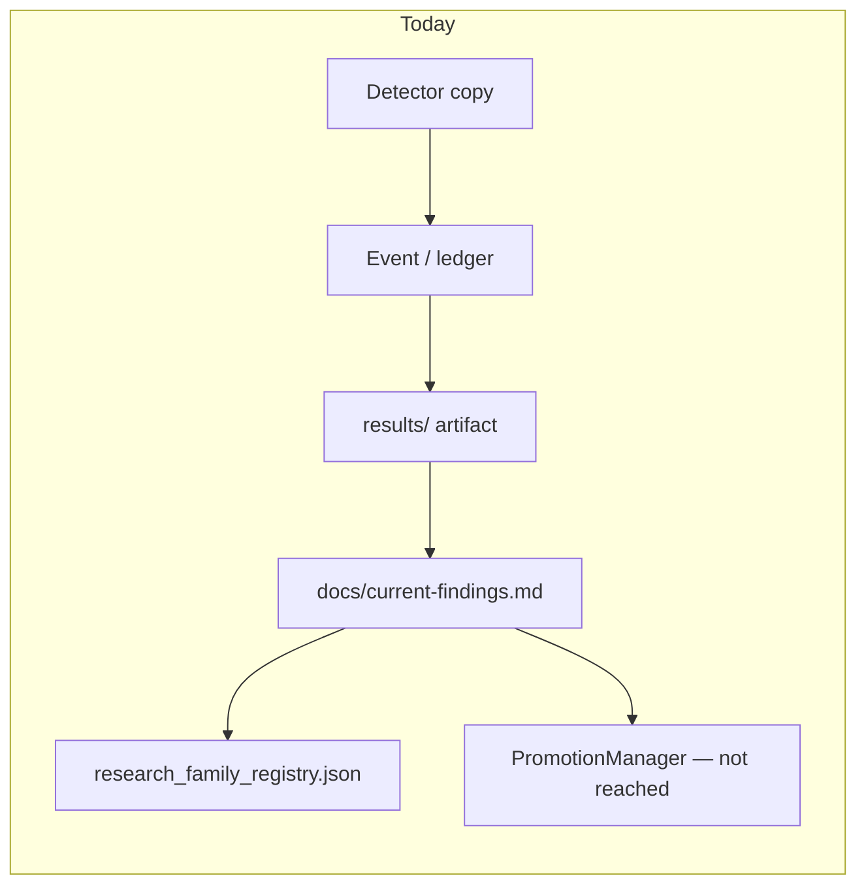
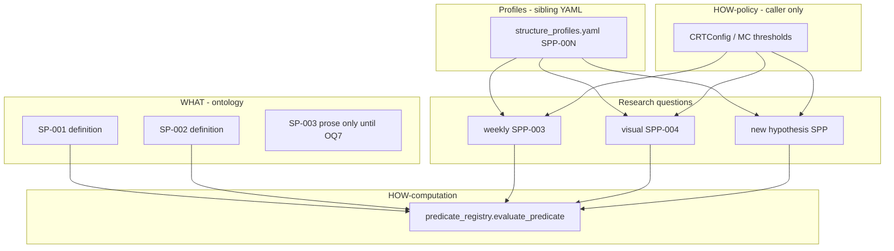
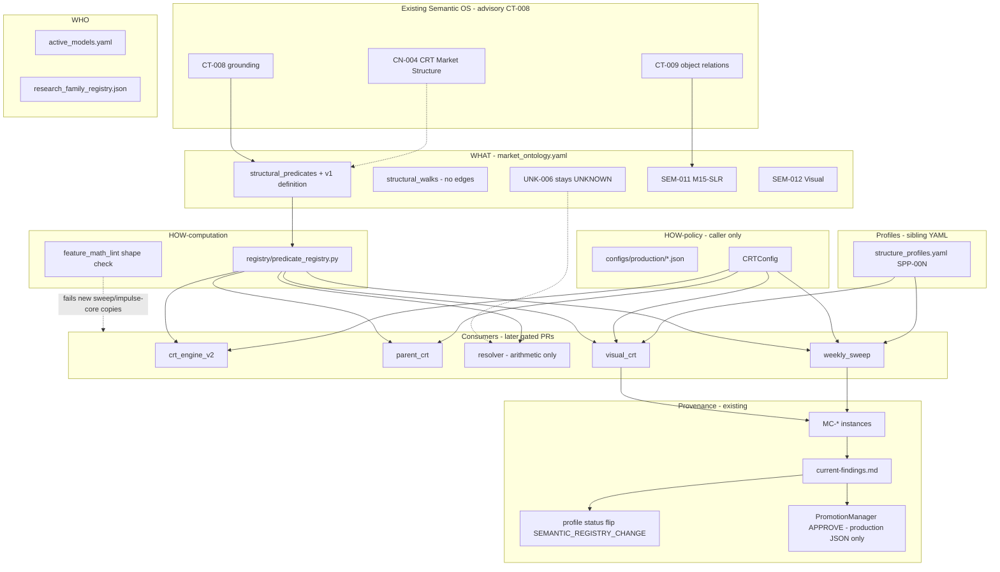
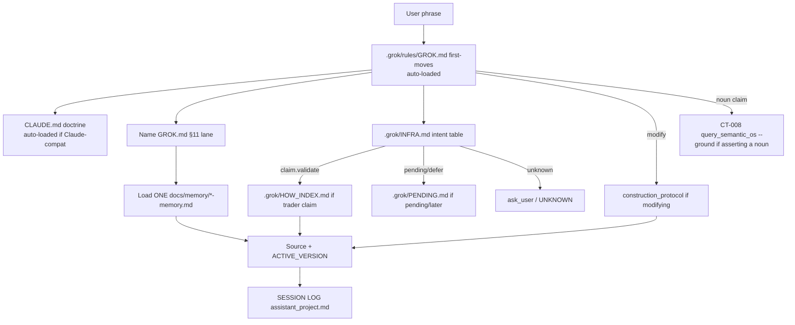
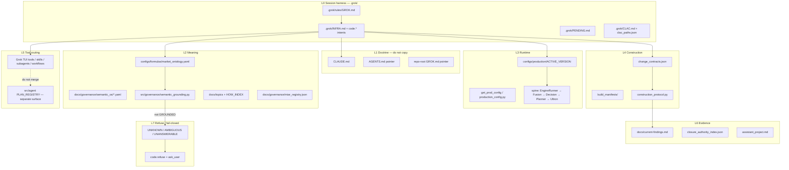
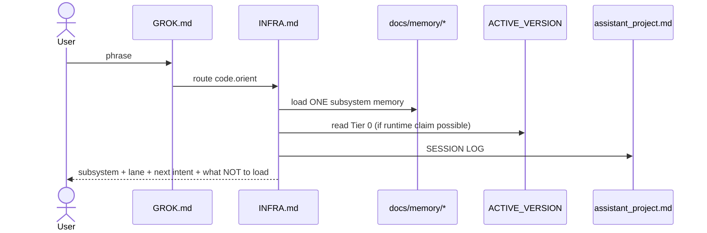
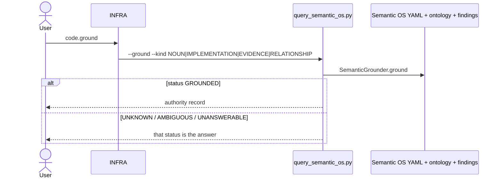
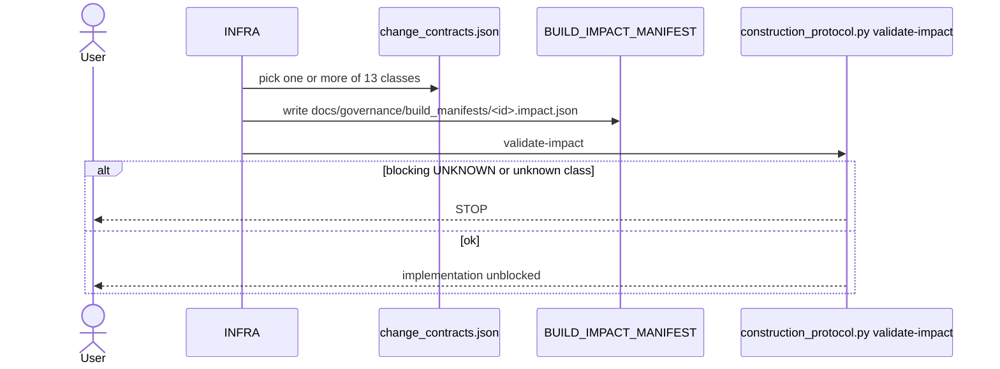
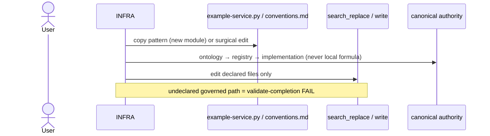
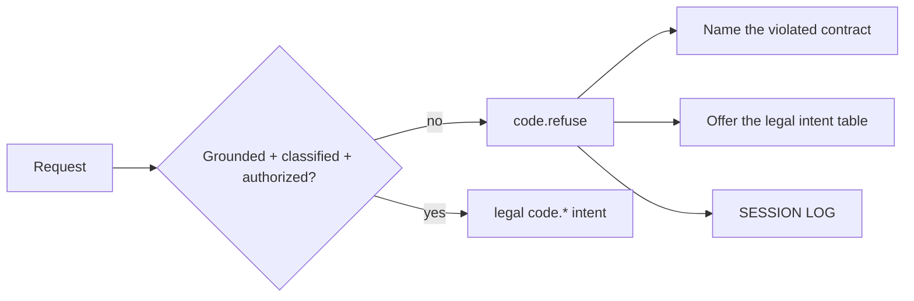

# Concatenated implementation plans — part 2 of 10

Source directory: `docs/implementation_plan/`
Files in this part: 17

## Contents

1. `build-an-updated-hashed-pike.md` (8272 bytes)
2. `c-users-hi-downloads-chatgpt-workflow-2-wondrous-mist.md` (7853 bytes)
3. `c-users-hi-downloads-intelligence-compo-imperative-panda.md` (5452 bytes)
4. `c-users-hi-downloads-zone-x-spec-v0-8-m-steady-turing.md` (11529 bytes)
5. `canonical-knowledge-book-encapsulated-pike.md` (10506 bytes)
6. `canonical-structural-semantics-existing-architecture.md` (86650 bytes)
7. `chatgpt-i-m-here-what-cozy-trinket.md` (4635 bytes)
8. `check-in-how-many-distributed-brook.md` (7939 bytes)
9. `claude-prompt-glittery-rabbit.md` (9846 bytes)
10. `claude-reachability-of-code-polymorphic-dove.md` (10185 bytes)
11. `claude-share-all-bugs-silly-lagoon.md` (6883 bytes)
12. `claude-system-prompt-zany-finch.md` (7702 bytes)
13. `claude-without-running-any-tranquil-cocoa.md` (7112 bytes)
14. `clean-walk-through-of-atomic-rain.md` (3624 bytes)
15. `coding-llm-architecture-closure-clac.md` (119685 bytes)
16. `config-first-migration-prompt-you-nested-music.md` (13434 bytes)
17. `context-check-what-wondrous-whale.md` (12785 bytes)


================================================================================
SOURCE_FILE: docs/implementation_plan/build-an-updated-hashed-pike.md
SOURCE_BYTES: 8272
PART: 2/10 FILE 1/17
================================================================================

# Plan — Feature Lineage Matrix + wick_size semantic reconciliation (phased)

## Context

Started as a Feature Lineage Matrix (`OHLCV → Formula → Feature → State → CRT → Gaussian → ZoneGate
→ RR → Fusion Weight`). Building it source-verifiably surfaced the real risk: **`wick_size` /
`body_ratio` semantic divergence across code paths.** Verifying the CRT engine internals **corrected
the severity**:

- **CRT engine** ([crt_engine_v2.py:105-114](src/config_layer/crt_engine_v2.py:105)): `wick_size = high - low`,
  `body_ratio = body/(high-low)` — **identical to the batch pipeline** ([feature_pipeline.py:444](src/features/feature_pipeline.py:444)).
- **Only outlier:** single-row [`crt_feature_builder.py:110`](src/features/crt_feature_builder.py:110)
  `wick_size = (high-low) - body_size` → `body_ratio = body/total_wick` (unbounded).
- **Canonical = `body/range`** (bounded [0,1]; the only metric a `0.70` gate is coherent against, and
  what CRT+pipeline both run). The outlier's only consumer is `build_bitnet_features` → BitNet, which
  is **OFF on active config** (`use_bitnet:false`). ⇒ **dormant latent bug**, not an active one.
  (`crt_feature_builder` is also stale v2.0: builds 35 keys, would `AssertionError` vs the 38-schema —
  likely already dead on the 38-vector path; confirm in Phase 1.)

Correction recorded (E-001): the earlier "three interpretations, ambiguous, ask which is canonical"
framing was an **overclaim** — it is **two** definitions, CRT matches the pipeline, canonical is
`body/range`, and the divergent path is dormant.

**Runtime truth (active `v2_multi_2026_04`, source-verified):** live Gaussian = 3-feat heuristic
(`gaussian_impl:heuristic`); `rr_fusion.enabled:false` (RR = base geometric polarity); `use_bitnet:false`;
ZoneGate 38-key but NON_PIVOTAL (F-036/F-041); fusion weights crt 0.4 / gaussian 0.2 / zone 0.2 / rr 0.2
(config wins over code defaults 0.4/0.3/0.2/0.1); 4-engine fusion OFF in research backtests (F-037).

## Phased approach (evidence-gated — §6.5 "evidence outranks doctrine; parity-prove before freezing")

### Phase 1 — Divergence audit (READ-ONLY diagnostic; the highest-leverage step)
`scripts/analysis/wick_semantics_audit.py` over ~1–2k real candles (BNBUSDT + one FX), computing
`body_ratio` three ways — CRT-Candle property, batch-pipeline column, single-row builder — and
reporting: max/mean divergence, how many bars cross the `0.70` gate under each, and **whether
`build_bitnet_features` is reachable on any live path** (grep call-sites; confirm dead-vs-guarded).
Expected: CRT ≡ pipeline (Δ0), single-row diverges, single-row feeds only BitNet(off). Output a small
JSON under `docs/analysis/`. **This gates Phases 2–5** — if reachable+live, severity escalates.

### Phase 2 — Unify the primitive (the agreed core of your CandleMath idea)
Introduce one immutable primitives module — `src/features/candle_math.py` — with
`body_size/candle_range/upper_wick/lower_wick/total_wick` as pure functions (mechanism in code,
never config, never `eval`). Route all three paths through it so divergence is **structurally
impossible**:
- CRT `Candle.wick_size`/`body_ratio` → call `candle_math` (byte-identical: already `high-low`).
- Batch pipeline `body_size`/`body_ratio` → same (byte-identical).
- **Fix** `crt_feature_builder.py:110` to the canonical `body/range` (this is the actual bug fix;
  behavior-changing **only** if BitNet is later enabled — parity-proved inert on active config since
  BitNet is off).
Add `tests/test_candle_math.py` (primitive identities + cross-path equality on a candle battery incl.
your `O100/H110/L95/C108 → 0.533`). No config hash change (no `params` edit).

### Phase 3 — Fusion weights: config-only, fail-fast (your "no runtime defaults" rule)
Remove the embedded weight defaults so production policy has one authority. `engine_runner` already
uses `_cfg_require` for the four weights ([:384-390](src/core/engine_runner.py:384)); the drift is the
`ENGINE_RUNNER_DEFAULTS` dict ([:107-111](src/core/engine_runner.py:107)) — delete the weight keys (or
assert they're never the source), so a missing `fusion_engine.weight_*` raises at load, not silently
falls back to `0.3/0.1`. Regression test: missing key → `KeyError`/`ValueError`. Scope-limited to
fusion weights this task (a repo-wide "no production-policy defaults" sweep = separate program, filed
as a follow-up — it's large and needs the census instrument, §6.5).

### Phase 4 — Feature Lineage Matrix (the original deliverable, on the reconciled base)
Publish the 38-row matrix (OHLCV→Formula→Feature→State→CRT→Gaussian→ZoneGate→RR→Fusion-weight, every
cell file:line-cited) to **WHO** = [`docs/topics/model-intent-and-feature-ownership.md`](docs/topics/model-intent-and-feature-ownership.md)
(new "Feature Lineage Matrix" section) + machine-readable `feature_lineage:` block in
[`active_models.yaml`](active_models.yaml) (additive, `authority:none`). Branch-scope F-004 in
[`docs/current-findings.md`](docs/current-findings.md) + fix its `:1804`→`:1731` citation. Record the
wick_size reconciliation as a finding/Discussion entry.

### Phase 5 — (DEFERRED / your call) Formula registry as a 3rd authority (WHAT)
Your `configs/formulas/market_ontology.yaml` — CONFIG-**DECLARED**, CODE-**EXECUTED** (a
`FORMULA_REGISTRY` of named lambdas; YAML is the authority, a parity test asserts YAML formula ==
Python impl; **never** `eval`). Clean separation: `active_models.yaml`=WHO · `production/*.json`=HOW ·
`market_ontology.yaml`=WHAT. This is the CONFIG_DRIVEN graduation of feature *compositions*
(`body_ratio.denominator ∈ {range, total_wick, ...}`) enabling no-code permutation research. **Real
but large**, and per §6.5 it earns adoption only after Phases 1–2 prove the primitive layer — so it's
proposed, not committed. Primitives stay immutable-in-code either way.

## TruthConflicts / corrections to record

1. **wick_size** — RESOLVED: 2-way (not 3), canonical `body/range`, single-row builder is the bug,
   dormant on active config. Fix in Phase 2; audit-confirm in Phase 1.
2. **Fusion-weight config vs code default** (`gaussian 0.2/rr 0.2` vs `0.3/0.1`) — removed in Phase 3.
3. **F-004 BitNet branch-scope** (user-approved) + citation fix — Phase 4.
4. **`crt_feature_builder` stale v2.0 (35-dim)** — confirm dead-vs-guarded in Phase 1; note (don't delete, §6.2 r4).

## Files touched (by phase)

- P1: `scripts/analysis/wick_semantics_audit.py` (new, read-only), `docs/analysis/*.json` (output).
- P2: `src/features/candle_math.py` (new), `src/config_layer/crt_engine_v2.py` (Candle props → primitive),
  `src/features/feature_pipeline.py` (→ primitive), `src/features/crt_feature_builder.py` (bug fix),
  `tests/test_candle_math.py` (new).
- P3: `src/core/engine_runner.py` (drop weight defaults), `tests/` (fail-fast regression).
- P4: `docs/topics/model-intent-and-feature-ownership.md`, `active_models.yaml`, `docs/current-findings.md`,
  CLAUDE.md §6.2 index; `tests/test_active_models_registry.py` (extend for `feature_lineage`).
- P5 (deferred): `configs/formulas/market_ontology.yaml`, `src/features/formula_registry.py`, parity test.

## Verification

- P1: run the audit; read its JSON; confirm the reachability grep.
- P2: `pytest tests/test_candle_math.py` + determinism — re-run a BNBUSDT backtest, assert **byte-identical
  ledger** (proves the primitive routing is inert on active config, BitNet off) before/after.
- P3: `pytest` the fail-fast regression; confirm active config still loads (keys present).
- P4: `pytest tests/test_topic_docs.py tests/test_active_models_registry.py tests/test_current_findings.py
  tests/test_doc_citations.py`.
- Every phase: §7.4 SESSION LOG to `assistant_project.md` + Documentation-Drift audit entry for the
  wick_size correction and F-004 branch-scope (§6.2).

## Out of scope (this task)

- No threshold recalibration (`body_ratio_min=0.70` etc.) — the canonical definition is what 0.70 was
  tuned against, so no recal is needed; any future denominator change (Phase 5) would require it and is
  explicitly gated.
- No re-enabling BitNet/rr_fusion/ml-gaussian; no fusion retune; repo-wide default-removal sweep deferred.


================================================================================
SOURCE_FILE: docs/implementation_plan/c-users-hi-downloads-chatgpt-workflow-2-wondrous-mist.md
SOURCE_BYTES: 7853
PART: 2/10 FILE 2/17
================================================================================

# Incorporate the "Jarvis" ChatGPT workflow pack into `multi_llm/`

## Context

The user dropped `ChatGpt workflow-20260615T142326Z-3-001.zip` (25 files: `.md`, `.docx`, `.js`,
`.json`) and asked to "incorporate into current workflows." The pack is a **multi-LLM
orchestration system ("Jarvis")** — the *same family* as the repo's existing `multi_llm/` layer
(CLAUDE.md §13), but authored independently, so it carries a **conflicting role map** and a
copy-paste/Jira flavor.

**The conflict (why this needs care, per CLAUDE.md §6.2 rule 3 — never silently overwrite frozen truth):**

| Stage | Repo `multi_llm/` (FROZEN, test-enforced) | Jarvis pack |
|---|---|---|
| Orchestrator | **User = Bridge/Principal** | Jarvis (a model) |
| Planner | **DeepSeek** | DeepSeek = Auditor |
| Navigator | **Gemini** | — |
| Interpreter | **ChatGPT** | ChatGPT = Architect |
| Optimizer/Quant | — | Gemini split → Think + Pro |
| Executor | **Claude** | Claude = Implementer ✓ |

The repo's roles are frozen in `multi_llm/roles/ROLE_*.md` and enforced by
`tests/test_handoff_state.py` (`_ROLES = {DeepSeek, Gemini, ChatGPT, Claude}`).

**User decisions (locked):**
1. **Keep the repo's frozen role map** — map Jarvis concepts *onto* existing roles; do not touch
   `ROLE_*.md`, `turn_ledger.py` ROLES, or the tests.
2. **Incorporate all four** new prompt categories: GATHER, ENHANCE, IMPLEMENT, Jira/diff-tracking.
3. **Fold into the repo as markdown; drop the binaries** (no `.docx`, no `build_doc.js`,
   no `jarvis_state.json`).

**Intended outcome:** the genuinely-additive value of the pack (reusable prompt transforms +
gather/implement prompt chains + a conversation-diff→issue capability) becomes part of the live
`multi_llm/` workflow, expressed in the repo's frozen role vocabulary and bound to the existing
single queue / handoff state — adding capability without adding doc entropy or a competing protocol.

## What is NOT incorporated (and why)

- **`build_doc.js`** (55 KB JS doc generator) — conflicts with the repo's Python generator
  (`scripts/context/build_context.py`) and the §13 "truth stays in repo / generated views only"
  doctrine. Dropped.
- **`jarvis_state.json`** — a parallel state file. Its fields already map onto existing state:
  `task`→`CURRENT_TASK` (§3 block), `spec/diff/tests/audit`→`turn_ledger.jsonl`,
  `agent_log`→`turn_ledger.jsonl`, queue→`build_queue.jsonl`. Adding it violates the anti-drift
  "one queue / one state" rule. Dropped — documented as a mapping instead.
- **Jarvis role cards / Gemini-Think-Pro split / ChatGPT-as-Architect** — conflicts with the frozen
  map (decision 1). The *stage concepts* are kept; the *role reassignments* are not.
- **The 25 raw `.docx`/`.js` binaries** — not committed (decision 3).

## Role mapping (Jarvis stage → repo frozen role)

This mapping is the core content; every prompt in the new docs is relabeled accordingly:

| Jarvis stage / agent | Repo owner |
|---|---|
| Jarvis (orchestrate, log, route) | **User = Bridge** (+ `turn_ledger.jsonl`) |
| G1 Clarifier (architecture snapshot JSON) | **ChatGPT = Interpreter** (assumption/risk exposure) + **Gemini = Navigator** (open-questions/gap check) |
| G2 Pyan DOT analysis | **Gemini = Navigator** / the `Map` trigger (aligns with `scripts/analysis/gen_pyan.py`, `graph.dot`) |
| G3 micro-service boundary audit | **Claude = Executor** + the `Validate` gate (aligns with `docs/architecture/service-boundary-map.md`) |
| E1–E5 ENHANCE transforms | **User = Bridge** crafting the §3 `PROMPT_FOR_NEXT_MODEL` field |
| I1 SpecWriter | **DeepSeek = Planner** |
| I2 DiffGen ‖ I3 TestGen | **Claude = Executor** |
| I4 Audit / sign-off | **Reality = Tests + Findings** via the `Validate` trigger (not a model) |
| Commit / PR / Changelog writers | **Claude = Executor** (already in CLAUDE.md §3 flow) |
| Jira issue modeling / conversation-compare | feeds the existing **`build_queue.jsonl`** (one queue) |

## Files to create

### 1. `multi_llm/PROMPT_PLAYBOOK.md` (new)
The operating prompt library for the workflow, in three sections mirroring GATHER → ENHANCE →
IMPLEMENT, **with every prompt relabeled to the frozen role names** per the table above. Source
text comes from the pack's `G1_clarifier.md`, `I2_diffgen.md`, `I4_audit.md`, `KICKOFF_TEMPLATE.md`,
`Jarvis_Prompt_Framework.docx` (GATHER/ENHANCE/IMPLEMENT sections, already extracted), and the
`AGENT_ROLES.md` constraint cards.
- **GATHER**: Clarifier JSON prompt, Pyan DOT-analysis prompt, boundary-audit checklist.
- **ENHANCE**: the 5 transforms (context layer · output format · uncertainty guard · role+constraint
  pairing · step-by-step trigger) — framed as how the Bridge sharpens `PROMPT_FOR_NEXT_MODEL`.
- **IMPLEMENT**: SpecWriter → DiffGen‖TestGen → Validate(Audit) → Commit/PR/Changelog prompts.
- Header cross-links to `MULTI_LLM_PROTOCOL.md` §3 (handoff block), `docs/architecture/trigger-vocabulary.md`,
  and CLAUDE.md §3. Explicit note: these are **advisory orchestration, grant no new authority** (§6.5 / §13).

### 2. `multi_llm/ISSUE_TRACKING_PLAYBOOK.md` (new)
The conversation-comparison → issue-modeling capability (the pack's `MultiLLMConversationComparisonPrompts.docx`
+ `Jira Task Creation.docx` + `Multi agent work flow tracking prompt.docx`), relabeled and **bridged to
the existing single queue**: the Jira-style issues these prompts produce are appended to
`multi_llm/build_queue.jsonl` as candidate `STORY-*` records (append-discipline, §6.2 rule 4) — not a
parallel tracker. Documents the 3-prompt chain: summarize → compare (strict diff) → ambiguity-resolve →
issue-model.

## Files to modify (surgical)

- **`multi_llm/README.md`** — add two bullet links to the new playbooks under the existing file map.
- **`CLAUDE.md` §13** — one sub-bullet pointer to `PROMPT_PLAYBOOK.md` / `ISSUE_TRACKING_PLAYBOOK.md`
  (minimal; §13 is already the multi_llm pointer section).
- **`docs/architecture/trigger-vocabulary.md`** — add a short cross-reference row/note: GATHER↔`Orient`/`Map`,
  ENHANCE↔prompt-crafting, IMPLEMENT↔`Implement`, Audit↔`Validate`. Keeps the new prompts discoverable
  from the trigger vocabulary instead of as an orphan layer.

## Explicitly unchanged (frozen-map guarantee)
`multi_llm/roles/ROLE_*.md`, `multi_llm/MULTI_LLM_PROTOCOL.md` role table, `src/multi_llm/turn_ledger.py`
`ROLES`, `tests/test_handoff_state.py`. No role added; no test contract changed.

## Optional (recommend, low cost)
`tests/test_multi_llm_playbooks.py` — assert both playbooks exist and that any "role:" assignment in
them uses only the frozen role names (a guard that catches future drift back toward the Jarvis map).
Mirrors the repo's "convert prose mandate → test floor" pattern.

## Verification

1. **Frozen-map compliance** — grep the two new docs to confirm no role *assignment* uses
   `Architect`/`Auditor`/`Think`/`Pro`/`Jarvis` (the words may appear only in a "mapped from" note).
2. **No regressions** — `pytest tests/test_handoff_state.py tests/test_context_compiler.py -q`
   (docs-only change; must stay green).
3. **No binaries / parallel state** — confirm no `.docx`, `build_doc.js`, or `jarvis_state.json`
   was added (`git status` shows only the 2 new `.md` + 3 edited files).
4. **Discoverability** — links resolve from `README.md`, CLAUDE.md §13, and trigger-vocabulary.
5. **SESSION LOG (CLAUDE.md §6, mandatory)** — append the `📝 SESSION LOG ENTRY` block to
   `assistant_project.md`. (Workflow-operation dimension → may also note in `llm_project_assistant.md`
   per §6 "two logs"; the codebase log is the primary.)
6. `context/` regeneration is **not** required (roles unchanged), but `python scripts/context/build_context.py`
   stays byte-identical — run only if you want to confirm.


================================================================================
SOURCE_FILE: docs/implementation_plan/c-users-hi-downloads-intelligence-compo-imperative-panda.md
SOURCE_BYTES: 5452
PART: 2/10 FILE 3/17
================================================================================

# Verify + Quality-Review: Intelligence Compounding Doctrine Transferable Synthesis

## Context
A synthesis doc (`C:\Users\Hi\Downloads\Intelligence_Compounding_Doctrine_Transferable_Synthesis.md`)
was authored in a *different* environment (it cites sandbox paths `attachments/`, `artifacts/`,
`/home/workdir/`) from the doctrine sources. The user asked, in this Tradelatest repo, to
**(1) verify it against the canonical source, then (2) review its quality** — both read-only, no
integration. Canonical truth here = [`docs/architecture/intelligence-compounding.md`](docs/architecture/intelligence-compounding.md)
(long-form) + CLAUDE.md §6.1 (always-loaded condensation). This file is the read-only report; no
repo edits are proposed.

---

## Part 1 — Verification (synthesis vs canonical)

### Substantively faithful — ALIGNED on every load-bearing element
Compared element-by-element against the canonical long-form; all reproduced correctly:
frozen sentence · one goal · utility function + learning loop · goal-first chain + forbidden
`Tool→Memory` path · "modules are frozen thoughts" table (all 5 rows) · per-result 5-question
ROI check · SESSION-LOG operational hook + EMA example · three checklists + Artifact checklist ·
7-level ladder · strengthened Memory Rule · Entropy Principle · 7-stage evolution path +
"what we don't know" · aspirational Weekly Alignment Sweep. The added "Repository Practice"
section (§6.1/6.2/6.5, Authority Ladder, F-001–F-035) is accurate.

### Drift / issues found (classified per CLAUDE.md §6.2)

1. **DOC_DRIFT — pre-existing, in the repo itself (the highest-value catch; NOT the synthesis's
   fault).** The "one frozen sentence" is not byte-identical between the two repo authorities:
   - CLAUDE.md §6.1: *"…intelligence is an ROI-weighted belief change **that increases the
     probability of achieving the user's long-term objectives** — not accumulated data."*
   - long-form `intelligence-compounding.md:11-13`: *"…intelligence is an ROI-weighted belief
     change, not accumulated data."* (no goal-probability clause)
   The synthesis reproduced the **shorter** long-form variant. Two different verbatim texts for a
   sentence explicitly labeled *frozen/immutable* → surface as a `TruthConflict`, do not silently
   resolve (§6.2 rule 3). Recommended winner: §6.1's fuller version (it ties ROI to
   goal-probability, which is the doctrine's core), but this is the user's call.

   > **RESOLVED (2026-06-21):** user chose §6.1's fuller wording (goal-probability clause). The
   > long-form frozen sentence (`intelligence-compounding.md:11-13`) was propagated to match §6.1;
   > the drift is closed. History preserved per §6.2 rule 4.

2. **Minor omissions vs canonical — these contradict the synthesis's own "zero loss" claim:**
   - Concrete memory path `C:\Users\Hi\.claude\projects\D--Tradelatest\memory\`
     (`intelligence-compounding.md:219-222`) dropped → generic "MEMORY.md".
   - The per-result ROI example's concrete A/B form (`baseline_pf == candidate_pf`,
     `:146-149`) compressed to prose.
   - "(immutable doctrine)" tag relocated onto the Modules section; canonical attaches it to the
     Memory-Rule line (`:215`).

3. **Path drift for repo use.** Source citations point to sandbox `attachments/`, `artifacts/`,
   `/home/workdir/`, not the repo-real `docs/architecture/intelligence-compounding.md`. Would need
   repointing before any in-repo use.

---

## Part 2 — Quality review

**Strengths:** complete coverage of load-bearing elements; clean transferable structure;
explicit source traceability + drift self-classification; self-referential (applies the doctrine
to itself). As a *standalone paste-to-another-LLM* artifact it is high quality.

**Weaknesses (per the repo's own Epistemic Integrity ritual, §6.2):**
- The absolute claim *"No information from the sources was omitted or invented"* is a mild
  overclaim given the Part-1 §2 omissions — should read "all load-bearing elements preserved;
  some concrete pointers compressed."
- Chose the weaker frozen-sentence variant (see §1) while asserting "verbatim."
- Flags "MEMORY.md vs assistant_project.md" as `AMBIGUOUS`; canonical is actually unambiguous —
  durable belief changes → `feedback`/`project` memory files indexed in `MEMORY.md`; per-turn
  lines → `assistant_project.md`.

---

## Verdict & recommendation
The synthesis is a **faithful, high-quality** transfer artifact. The single repo-relevant
discovery is the **pre-existing §6.1 ↔ long-form frozen-sentence DOC_DRIFT** the comparison
surfaced.

Per §6.2 **existing-doc-first** + **minimize-doc-count**: do **NOT** commit this synthesis as a
new repo doc — `docs/architecture/intelligence-compounding.md` already owns the topic; a duplicate
would *increase* entropy, the opposite of the doctrine. Keep the synthesis as an external
(Downloads) transfer artifact.

**Optional follow-on (separate, requires approval — not part of this read-only task):**
reconcile the frozen-sentence drift in one place (recommend §6.1's fuller wording as the
canonical text, propagated to the long-form). That is a 1-line doc edit gated on your choice of
which variant wins.

## Verification of this report
Read-only: compares two already-read files. No code/config/doc changed. To re-check, diff the
frozen sentence in `CLAUDE.md` §6.1 against `docs/architecture/intelligence-compounding.md:11-13`.


================================================================================
SOURCE_FILE: docs/implementation_plan/c-users-hi-downloads-zone-x-spec-v0-8-m-steady-turing.md
SOURCE_BYTES: 11529
PART: 2/10 FILE 4/17
================================================================================

# ZONE-X O-1 — MT5 Cost Calibration Script

## Context

The external research programme **ZONE-X** (`ZONE-X-SPEC-v0.8.md`, frozen spec, gold M15
region-discovery, not part of the Tradelatest governed pipeline) has produced a clean null
result on directional/straddle geometry (§6) and has exactly one blocking open item left:
**`O-1`** — the assumed round-trip trading cost (`c = 0.07` ATR/side, i.e. **$0.51/oz/side**
at the test-year median ATR) was **never verified against a real broker**. Halving it to
`c = 0.03` (**$0.22/oz/side**) would cut the required directional edge fourfold (2.1pp →
0.5pp) — no feature/model choice on the table moves the target that far, so this single
number governs whether the programme's next move is "stop" or "continue."

The user has an MT5 terminal already installed locally and wants a script that pulls the
four real numbers the spec asks for — spread by hour, commission, stop-order slippage, swap
— so `c` stops being an estimate. This is explicitly a **standalone research diagnostic**:
it does not touch production config, `ACTIVE_VERSION`, the promotion pipeline, or any
governed engine, and the user has asked to skip the full CLAUDE.md documentation-mandate
ritual for this thread (no SESSION LOG / doc-drift gating) — it follows the lighter
`scripts/research/` convention already used for scripts like `xauusd_price_cost_trace.py`.

Exploration confirmed the repo already has the two hard pieces reusable: `MT5Adapter`
(`mt5_analytics/core/mt5_adapter.py`) solves the MT5 connection lifecycle and — critically —
the broker-server-clock-to-UTC offset correction (the same class of bug F-066 found in
session labeling), and `xau_metals_protocol_v1.json` already carries a **pre-registered
prior of $0.40/oz round-trip (~$0.20/side)** for XAUUSD that this script's output will
directly validate or contradict.

## Design decisions

1. **Don't modify `mt5_adapter.py`.** It's the frozen read-surface of an audited kernel
   (`mt5_analytics/`) with its own migration log. Build a sibling reader
   (`MT5CostReader`) that wraps an already-`__enter__`-ed `MT5Adapter` and reuses its
   public `server_utc_offset` for the two new read calls (`copy_ticks_range`,
   `symbol_info`) this task needs beyond the adapter's existing five. Zero duplication of
   the offset-detection math, zero risk to the audited kernel.
2. **Never fabricate a number.** Every one of the four quantities carries an explicit
   `status ∈ {MEASURED, INSUFFICIENT_DATA, UNKNOWN}`. Commission and stop-slippage need
   real trade history the account may not have yet — those degrade honestly instead of
   defaulting to 0.
3. **Cite the spec's ATR constants, don't recompute.** `ZONE-X-SPEC-v0.8.md §3.2` already
   froze ATR14 test-year median $7.342 (p10 $3.467, p90 $15.489) — the summary converts
   `c_per_side` to ATR units using these cited constants rather than pulling in a new
   feature-pipeline dependency for a throwaway diagnostic.
4. **Stop-order slippage is the target metric, not market-order slippage** — per the spec's
   own reasoning (every ZONE-X barrier is a stop order; 29% of bars gap from the prior
   close), `stop_slippage_median_usd`/`stop_status` are tracked as first-class fields
   distinct from the overall order-type breakdown, and only `stop_status` gates whether
   `c_per_side` can use a real number.
5. **Commission extraction handles both broker forms.** `mt5_analytics/MIGRATIONS.md`
   (2026-06-26 entry) already documents that a real broker (IC Markets Raw) folds
   commission onto each trade leg's own deal record rather than emitting a separate
   zero-volume commission deal — the extractor sums `commission` across all deals per
   `position_id` so it's correct under either form, and records which form was observed.
6. **Never persist account identity/balance.** `account_info()` is read transiently only
   (to check account currency for the swap $-conversion), matching the existing
   `FORBIDDEN_KEYS = ("balance","equity","margin","login","server")` no-persist rule
   enforced by `tests/manual/live_smoke.py:45`.
7. **The script never places or modifies orders** — strictly read-only, same posture as
   `MT5Adapter`. Building up real stop-order fill history (needed for items 2/3) is a
   manual step the user does in the MT5 GUI on a demo account; the plan documents the
   minimal-effort way to do that.

## Files to create

### `src/research/mt5_cost_calibration.py` (new — extraction library)
Style-matches `src/inout/mt5_candle_fetcher.py` (numbered section headers, fail-soft
`import MetaTrader5 as mt5` + fail-fast `RuntimeError`, dataclass config + strict
`_require()`, always `mt5.shutdown()` in `finally` — handled by the `MT5Adapter` context
manager here).

- `Status` enum: `MEASURED | INSUFFICIENT_DATA | UNKNOWN`.
- `CostCalibrationConfig` dataclass: `symbol="XAUUSD"`, `tick_lookback_days=14`,
  `history_lookback_days=90`, `tick_chunk_days=1`, `min_stop_fills_for_confidence=5`
  (reporting hint, never a silent gate), `out_dir`, `server_utc_offset_hours=None`.
- `MT5CostReader` — composition wrapper around an `MT5Adapter` instance; adds
  `copy_ticks_range_chunked()` (chunks `[date_from, date_to)` by `chunk_days`, pulls
  `mt5.COPY_TICKS_ALL`, filters ticks to `bid > 0 and ask > 0 and ask >= bid`, shifts
  timestamps via the adapter's `server_utc_offset`) and `symbol_info()`.
- Result dataclasses, each carrying `status`: `SpreadResult`, `CommissionResult`,
  `SlippageResult` (with a separate `stop_status`), `SwapResult`.
- Four extraction functions:
  - `extract_spread_by_hour(reader, symbol, date_from, date_to, chunk_days)` — groups
    `ask - bid` by `hour_utc` (24 buckets), reports median/p90/mean/n per hour.
  - `extract_commission(mt5a, symbol, date_from, date_to)` — groups
    `history_deals_get()` results by `position_id`, sums `commission` across all deals in
    each position (handles both the folded-per-leg and separate-zero-volume-deal forms),
    normalizes to $/lot/side and $/oz; `status=UNKNOWN` if zero nonzero-commission deals
    exist anywhere in the window.
  - `extract_slippage(mt5a, symbol, date_from, date_to)` — joins `history_orders_get()` to
    `history_deals_get()` on `deal["order"] == order["ticket"]`, classifies by
    `order["type"]` read from live `mt5.ORDER_TYPE_*` constants (MARKET / STOP / LIMIT /
    STOP_LIMIT), computes sign-adjusted adverse slippage `deal.price - order.price_open`
    per side; `stop_status=INSUFFICIENT_DATA` whenever `n_stop_fills == 0`.
  - `extract_swap(reader, symbol)` — reads `symbol_info()` (`swap_long`, `swap_short`,
    `swap_mode`, `trade_contract_size`, `swap_rollover3days`, `point`), converts to
    $/oz/night per the live `swap_mode` enum (POINTS / CURRENCY_SYMBOL handled; percent/
    interest-based modes and non-USD account currency → `UNKNOWN` with raw fields dumped).
- `compute_c_per_side(spread, commission, slippage)` — `spread_median/2 + commission_per_oz
  + stop_slippage_median`; overall status = worst-of-three (`UNKNOWN` > `INSUFFICIENT_DATA`
  > `MEASURED`), never silently substitutes 0 for a missing term.
- Output writers: `write_spread_csv`, `write_commission_json`, `write_slippage_csv`,
  `write_swap_json`, `render_summary_md`.

### `scripts/research/xauusd_mt5_cost_calibration.py` (new — thin CLI entry point)
Style-matches `scripts/research/xauusd_price_cost_trace.py` / `qualify_xauusd.py`
(`RESEARCH_ONLY` header docstring, `sys.stdout.reconfigure(...)` Windows console safety,
argparse wrapper delegating to `src/research/mt5_cost_calibration.py`).

CLI flags: `--symbol` (default `XAUUSD`), `--tick-days` (14), `--history-days` (90),
`--tick-chunk-days` (1), `--server-utc-offset-hours` (None, passthrough to `MT5Adapter`),
`--out-dir` (`results/research/xauusd_mt5_cost_calibration`), `--skip-ticks`,
`--skip-history`, `--min-stop-fills` (5, reporting only).

`main()`: opens `MT5Adapter` as context manager → builds `MT5CostReader` → runs the four
extractors → writes CSV/JSON + timestamped and `_LATEST` variants + an umbrella manifest
JSON (statuses, `c_per_side`, sha256 of each artifact, ZONE-X citation block — no account
identity/balance) → renders `XAUUSD_MT5_COST_CALIBRATION.md` → prints a short console
summary.

## Output artifacts

`results/research/xauusd_mt5_cost_calibration/`:
- `spread_by_hour_{ts}.csv` / `_LATEST.csv` — 24 rows, `hour_utc, n_ticks, median_spread_usd,
  p90_spread_usd, mean_spread_usd`
- `commission_{ts}.json` / `_LATEST.json`
- `slippage_by_order_type_{ts}.csv` / `_LATEST.csv` — one row per {MARKET, STOP, LIMIT,
  STOP_LIMIT}, STOP row is the one that matters
- `swap_{ts}.json` / `_LATEST.json`
- `xauusd_mt5_cost_calibration_manifest_{ts}.json` / `_LATEST.json`
- `XAUUSD_MT5_COST_CALIBRATION.md` — human summary: four-quantity status table,
  `c_per_side` in $/oz and in ATR units (citing `ZONE-X-SPEC-v0.8.md §3.2`), comparison
  against the repo's own `xau_metals_protocol_v1.json` 0.40 prior, comparison against
  ZONE-X §8.1's own thresholds (0.07 vs 0.03 ATR), and an explicit "what's still
  UNKNOWN/INSUFFICIENT_DATA and why" section.

## Known edge cases handled (see exploration for full detail)

- Tick chunking by day to bound IPC/memory cost; tick validity filter on raw bid/ask
  values rather than flag bits (flag-bit filtering would systematically undercount).
- Order-type constants read live from the `mt5` module, never hardcoded ints (broker/build
  sensitive). Unmatched order↔deal joins are counted and excluded, not zero-filled.
- `swap_rollover3days` read from the live enum, not assumed to be Wednesday.
- Thin/fresh account: spread and swap are measurable immediately (no trade history
  needed); commission and stop-slippage need real fills. If the account has none, the
  script reports `UNKNOWN`/`INSUFFICIENT_DATA` and the summary documents the manual path
  (place a spread of small STOP orders on the demo account at varied distances, let a few
  trigger over a few days, re-run with `--skip-ticks` to check accumulation) — the script
  itself never places orders.

## Setup prerequisite (blocking, before first run)

`MetaTrader5` is declared as an optional dependency (`pyproject.toml`
`[project.optional-dependencies].mt5_analytics`) but is **not installed** in either
`venv` or `.venv`. Requires `pip install MetaTrader5` (Windows-only wheel) plus a running,
logged-in MT5 desktop terminal before the script can execute.

## Verification

1. `pip install MetaTrader5` into the project venv; confirm a demo/live MT5 terminal is
   running and logged in.
2. Run `python scripts/research/xauusd_mt5_cost_calibration.py --tick-days 7
   --history-days 30` first as a fast smoke test (small windows) — confirm it connects,
   pulls at least some ticks, and writes all output files without exceptions, even if
   commission/slippage come back `UNKNOWN`/`INSUFFICIENT_DATA` on a fresh account.
3. Inspect `XAUUSD_MT5_COST_CALIBRATION.md` — verify the spread-by-hour table looks
   sane (tighter during London/NY overlap hours, wider in the Asian session per the
   spec's own expectation) as a sanity check on timestamp/offset correctness.
4. Once satisfied, re-run with production-sized windows (`--tick-days 30`,
   `--history-days 180`) for the real O-1 answer, and — if commission/slippage are still
   `UNKNOWN`/`INSUFFICIENT_DATA` — follow the manual stop-order path, then re-run with
   `--skip-ticks` periodically until enough stop fills accumulate.


================================================================================
SOURCE_FILE: docs/implementation_plan/canonical-knowledge-book-encapsulated-pike.md
SOURCE_BYTES: 10506
PART: 2/10 FILE 5/17
================================================================================

# Canonical Knowledge Book — Build Plan

## Context

Tradelatest has grown into ~900 doc files and ~1,400 source files across years of experimentation,
research, refactors, and governance work. The knowledge is real but fragmented: `docs/knowledge-map.md`
is already a "map of maps" (which record system answers which question), `docs/topics/` holds 26
one-concept files, `docs/memory/` routes by subsystem, and `docs/architecture/goal.md` is a
near-complete "why this exists" chapter — but nothing sequences these into a single narrative a reader
can walk start-to-finish. The user's ask is exactly that: reconstruct the repository into a **coherent
sequence of ideas** — a book — not a new pile of documentation.

Three Explore passes (repo-wide structure, core pipeline, governance/research/agent layers) confirmed:
**no `docs/book/` or table-of-contents exists yet.** The book is new construction, not a rewrite. The
plan below designs its structure and scopes what gets written in this first pass, consistent with the
repo's own doctrine (CLAUDE.md §6.2 rule 1 "existing-doc-first", §6.2 rule 5 "minimize doc count", the
"Canonical Concept Rule" in the task prompt): **the book teaches and sequences; it does not duplicate**.
Every chapter ends by pointing at the doc/code that actually owns the detail.

## Design decisions

**Location & naming.** New directory `docs/book/`, following the existing `docs/topics/` /
`docs/architecture/` convention (flat files + one index). `docs/book/README.md` is the master
Table of Contents (Parts → chapters, one-line description, status). Chapters are flat files
`docs/book/NN-slug.md` with a global two-digit number (not per-part numbering) so cross-references
stay stable as the book grows — matches the "Living Book" requirement to never renumber.

**Chapter template** (every chapter uses this shape, per the task's Chapter Rules + Cross References
sections):
```
# Chapter NN — Title
Part: <Roman numeral — Part name>
Status of this chapter: <Written | Orientation-level | Planned>

## Why this chapter exists
## What problem it solves
## What you need to already know   (links to earlier chapters)
## The idea                         (the actual teaching content — narrative prose, not API dump)
## Classification                   (Production / Experimental / Research / Legacy / Deprecated / Partial / Unknown — per concept covered)
## Authoritative sources            (source files, config keys, tests — book is a map, code wins)
## Unresolved questions             (only if any — never invented)
## Previous · Next · Related chapters · Relevant memory docs
```

**Canonical Concept Rule enforcement.** Each concept (CRT, Fusion, Decision Engine, Feature Pipeline,
Governance, Promotion, Control Plane, Market Ontology, Execution Planner, Ultron Risk Gate, etc.) gets
exactly one chapter that owns its explanation. Later chapters that touch the same concept link back
instead of re-explaining (e.g., Ch.16 Governance references Ch.06's ontology explanation rather than
re-describing it).

**Source-of-truth discipline.** Every claim in the book traces to a real file:line or doc already
verified by the three Explore passes this session (signal-flow.md's 7-step walk, goal.md's invariants,
the engine/fusion/decision/execution/risk file paths, the governance/research/agent directory maps).
Nothing is invented; anywhere evidence was thin, the chapter gets an explicit "Unresolved Questions"
section instead of a guess (per the task's "Missing Knowledge" rule).

**Known doc-drift to surface, not silently fix.** The feature-pipeline chapter (Ch.07) must flag that
`docs/reference/schemas.md` still documents the 38-dim v3.0 tuple while `src/features/feature_schema.py`
is live at 39-dim v4.0 (`CANONICAL_FEATURE_DIM = 39`, F-062 already fixed the code side, the reference
doc appears to lag). Per CLAUDE.md §6.2 this is a `DOC_DRIFT` classification — the book chapter notes it
and points at the authoritative code constant; it does **not** silently patch `schemas.md` as a side
effect of book-writing (that's a separate, explicit doc-drift turn if the user wants it done).

## Scope of this pass

Full 23-chapter skeleton is designed now (all Parts get a README.md entry so the book's shape is
honest and complete), but chapters are written at different depths matched to how well-evidenced they
are, consistent with "Living Book" (later passes deepen without renumbering):

- **Parts I–V (chapters 01–15, the core candle→order spine)** — written in full. This is the
  best-evidenced material: `goal.md`, `signal-flow.md`'s 7-step walk (with failure modes / cross-refs
  already extracted), and verified file paths for ontology → features → CRT → four engines → fusion →
  decision → execution planner → risk gate → live/INOUT.
- **Parts VI–VIII (chapters 16–23, Governance / Research / Agent Intelligence)** — written as solid
  **orientation chapters**: enough narrative to understand what the layer is for, how it's organized,
  and its classification status, with clear pointers into the deep corpus (`docs/reference/governance.md`,
  `docs/current-findings.md` Funding Ledger, `docs/reference/agent-reference.md`) rather than attempting
  to compress ~250 governance files and ~60 research-readiness files into prose. This matches the task's
  own instruction to classify rather than exhaustively narrate ungrounded material.
- **Appendix (A1 Testing, A2 Unresolved Questions rollup)** — short, pointer-style.

## Chapter list (final)

**Part I — Foundations**
01. Why Tradelatest Exists — `docs/architecture/goal.md` §1
02. The Invariants and the Happy Flow — `goal.md` §2–4, `docs/architecture/signal-flow.md`
03. How This Book Fits the Repository's Knowledge — `docs/knowledge-map.md`, `docs/memory/README.md`, `docs/topics/readme.md`, CLAUDE.md §0/§2 (meta chapter; also defines the classification vocabulary used throughout)
04. Architecture at a Glance — `docs/reference/architecture.md`, `docs/architecture/code-map.generated.md` (L0 graph), `module-roles.generated.md`

**Part II — Market Understanding**
05. Data Ingestion and the No-Lookahead Discipline — signal-flow.md Step 1, L1/L2/L3 integrity stack, F-039
06. The Market Ontology — Canonical Semantic Authority — `configs/formulas/market_ontology.yaml`, `MARKET_ONTOLOGY_EVOLUTION_CONTRACT.md`, F-047, CLAUDE.md §6.6
07. The Feature Pipeline and the Canonical Vector — `src/features/feature_pipeline.py`, `feature_schema.py` (39-dim v4.0; flags the schemas.md drift)

**Part III — Market Semantics**
08. The CRT State Machine — the Spine — `src/config_layer/crt_engine_v2.py`, `event-taxonomy.md`; status CLOSED (`crt_closure_report.md`)
09. Interpreters and the Pattern Contract — `src/interpreters/`, Interpreter Contract topic; status Research/Partial (P&F etc. measured, never asserted)

**Part IV — Decision Making**
10. The Four Scoring Engines — CRT-score / Gaussian / Zone Gate / RR, `src/engines/*`; statuses AUDITED (F-036, F-041B, F-038/044/045/059, F-060)
11. Fusion — Combining Independent Signals — `src/core/fusion_engine.py`
12. The Decision Engine — Semantic Approval Only — `src/core/decision_engine.py`, F-048 (RR-gate removal, ownership split with Ultron)

**Part V — Execution**
13. The Execution Planner — From Decision to Order Geometry — `src/config_layer/execution_planner.py` (`ExecutionPlannerV1_2`), F-057 caveat
14. Ultron Risk Gate — the Final Capital Check — `src/core/ultron_risk_gate.py`
15. Live Execution and INOUT — `src/inout/`, `src/live/`; status: INOUT currently archived per `goal.md`

**Part VI — Governance**
16. Config-First Doctrine and the Promotion Path — CLAUDE.md §6.5, `docs/reference/governance.md`, `src/governance/promotion_manager.py`
17. Truth Maintenance — Findings, Closure, and Authority — CLAUDE.md §6.2, `current-findings.md`, `closure_authority_index.json`, `EPISTEMIC_INTEGRITY.md`
18. A Field Guide to `docs/governance/` — orientation over the ~250-file certification ledger, grouped by theme (promotion, closure, lineage audits, ontology contracts, feature-DAG, CRT, OHLCV corpus, MSIP) with pointers, not exhaustive listing

**Part VII — Research**
19. The Research Programs — Falsification as a Discipline — Funding Ledger Programs 1–9 in `current-findings.md`, the Authority Ladder (CLAUDE.md §6.5)
20. The Research Platform — `src/research/` (17 subpackages) and the Edge Research Platform docs, `docs/research-readiness/`

**Part VIII — Agent Intelligence**
21. The AI Automation Agent — `docs/reference/agent-reference.md`, `src/agent/` (modes, tool_registry, `PLAN_REGISTRY` in `plan_compiler.py`)
22. The Control Plane — `src/control_plane/registry.py` (`CommandSpec` catalog), `docs/reference/control-plane.md`
23. Multi-LLM Coordination — CLAUDE.md §13, `multi_llm/MULTI_LLM_PROTOCOL.md`, `multi_llm/roles/`

**Appendix**
A1. Testing the System — `docs/reference/testing.md`
A2. Unresolved Questions (rollup) — collects every chapter's open items in one place

## Execution notes (for the implementation turn)

- Write `docs/book/README.md` first (full TOC with status column), then chapters in order 01→23,
  A1, A2 — each chapter is a small Write, so this is naturally incremental and resumable.
- This repo's CLAUDE.md mandates a `📝 SESSION LOG ENTRY` appended to `assistant_project.md` on every
  response during execution, and the Documentation Drift Protocol applies if any doc-drift is fixed
  (not just flagged) along the way — follow both during implementation, not just at the end.
- After the book exists, propose (don't silently do) one small follow-up: add a `docs/book/README.md`
  row to CLAUDE.md §2's Companion Documentation table so future sessions discover it — this is a
  one-line addition, flagged separately since CLAUDE.md itself is governed content.
- Do not touch `docs/reference/schemas.md`'s 38-dim text as part of this task — flag it in Ch.07 only;
  fixing it is a separate, explicit doc-drift turn.

## Verification

- Every chapter's "Authoritative sources" section resolves (files/paths exist) — spot-check a sample
  with `Read`/`Glob` after writing.
- `docs/book/README.md` links to all 23 chapters + 2 appendix files with no dead links.
- Skim-read Part I→V end-to-end to confirm it reads as one continuous narrative (the book's own success
  criterion) rather than 15 disconnected summaries.


================================================================================
SOURCE_FILE: docs/implementation_plan/canonical-structural-semantics-existing-architecture.md
SOURCE_BYTES: 86650
PART: 2/10 FILE 6/17
================================================================================

# Fit Structural/CRT Research into the Existing Architecture

| Field | Value |
|---|---|
| **Title** | Centralize structural *meaning* and one governed mechanism — do not invent a Structural OS |
| **Author** | Grok (design only) |
| **Date** | 2026-08-18 |
| **Status** | **Accepted** (user locks 2026-08-18; OQ1–OQ7 decided) |
| **Lane** | **semantic certification** (GROK.md §11). Not CRT recert. Not G001. Not economic qualification. |
| **Authority** | **NONE.** No G001. CRT stays OPEN/REOPENED. `parent_crt` / `objective_gate` unchanged. `ACTIVE_VERSION` stays `v2_htfcrt_2026_08`. Do not re-enable `rr_fusion`. |
| **ACTIVE_VERSION (observed, not edited)** | `v2_htfcrt_2026_08` (`configs/production/ACTIVE_VERSION:1`) |
| **Self-test every change must pass** | *Am I centralizing code, or am I centralizing meaning?* Desired: **CENTRALIZE MEANING + CENTRALIZE GOVERNED MECHANISM + PARAMETERIZE FOUNDING + ALLOW MANY RESEARCH QUESTIONS + PRESERVE COMPLETE PROVENANCE.** Forbidden fallback: move six functions into one Python file and declare the problem solved. |

---

## Overview

The repository already has one CRT *vocabulary* (`CRTState` + `VALID_TRANSITIONS`) and six independent *copies* of the same sweep arithmetic. SK-0 registered that arithmetic as ontology nodes (`SP-001`/`SP-002`/`SP-003`, `SP-010`/`SP-011`) and gated the second transition graph. That is declaration only: `formula` fields are prose strings, `impl` is unbound, `traceability` still names `src/structure/predicates.py` and `src/structure/walk.py` **which do not exist**, and nothing stops a seventh copy of `high > ref and close < ref`.

This design does **not** invent a Structural OS, does **not** start by building `src/structure/`, and does **not** treat F-046's "one Python function" as sufficient. It fits structural research into the existing stack:

- **Meaning** stays in `configs/formulas/market_ontology.yaml` (WHAT) under the already-declared `structural_predicates` / `structural_walks` sections.
- **A constrained definition** is added as an *additive* field on those existing nodes (frozen runtime keys stay flat).
- **One registered evaluator** lives in the existing `src/features/registry/` package (sibling of `derived_registry.py`). Never `eval`. Never a second OS.
- **Founding** (what counts as liquidity) stays data/pluggable via profiles in the existing `configs/formulas/` tree.
- **Research** consumes the canonical predicate result; a new hypothesis is a new profile, not a new detector.
- **Provenance** attaches to existing findings + `MC-*` + `research_family_registry.json`.
- **Two promotion surfaces, not one:** a profile `status` flip is an ontology/profile YAML edit under `SEMANTIC_REGISTRY_CHANGE`. Production HOW-policy still goes through `ValidationReport.decision == "APPROVE"` + `PromotionManager` (production JSON only). Never "copy research code into production." `PromotionManager` never writes `configs/formulas/`.

**Governing invariant (acceptance test for every PR in this program):**

> The repository must have one governed structural meaning and one governed execution mechanism; configuration/ontology declares WHAT, WHO and WHY, the implementation provides HOW, research consumes the canonical result, and every research discovery remains traceable through evidence → finding → promotion without creating a competing implementation.

---

## Background & Motivation

### Why this change is needed

When F-074 landed (2026-08-13), the directional-impulse contract had to be hand-propagated to three files. Each copy's docstring asserts it "mirrors" `RangeDetector.detect_sweep` / `try_sweep_to_displacement` — and nothing checks that it still does. That is the failure mode: a geometry fix is a manual broadcast, and drift is silent.

The old research-isolation policy (`weekly_sweep` / `visual_crt` module docs: *"reimplement the small shared arithmetic locally; never import the live spine"*) conflated two independences:

| Independence | Value | Verdict |
|---|---|---|
| **Founding** — *what do we call liquidity?* (M15-SLR, ParentRange C1 H/L, WeeklyRange Mon–Tue, Visual pool PDH/PDL/prior H4) | This is what made F-042 and F-081 legitimate NEW ontologies (F-028's only reopen condition). | **Preserve permanently** |
| **Arithmetic** — *how do we test "swept"?* | Bought nothing. Costs correctness: 6 copies, 1 broadcast per fix, 0 mechanical checks. | **Eliminate as a legal production/research path** |

### Current state (source-verified 2026-08-18)

- `src/structure/` **does not exist**. The SK plan (`docs/implementation_plan/we-have-states-defined-whimsical-penguin.md`) proposed it as L0–L3 authority. This design **rejects that as the first move**.
- SK-0 **is on disk as declaration**: `spec_schema.semantic_registry.sections` lists `structural_predicates` and `structural_walks` (`market_ontology.yaml:181-192`); nodes `SP-001`/`SP-002`/`SP-003` (`:3583-3673`) and `SP-010`/`SP-011` (`:3691-3751`); `UNK-006` (`:3385-3425`); `_ONTOLOGY_ID_RE` already matches `SP-` (`semantic_grounding.py:95-98`); `tests/test_crt_states_yaml_transition_parity.py` already pins the SHADOW_PENDING collapse.
- Semantic nodes are **not** in `_ITERATED_SECTIONS` (`src/features/registry/__init__.py:39-40`) and are **not** bound through `FORMULA_REGISTRY`.
- There is **no expression/AST DSL evaluator** in the repository today. Formula strings are "NEVER `eval`'d" (`market_ontology.yaml:14`; `formula_registry.py:11`).

### Pain points

1. Six sweep sites, three impulse sites, two retest sites — founding differs, arithmetic is copy-paste.
2. Impulse copies are **not identical** (see Map B). Unifying them blindly would change parent-CRT or visual-CRT behavior.
3. Two transition graphs: executable `VALID_TRANSITIONS` vs resolver YAML. The difference is now *gated* as a declared allowance, but not *named as a projection relationship* in the ontology.
4. Research events carry no `profile_id`. Findings `Contract:` cannot resolve `MC-*` instance ids (`P-GOV-MC-01`).
5. SK-0 `traceability` fields already claim a future `src/structure/` that does not exist — a forward-looking citation that will become DOC_DRIFT if Alternative A is rejected.

---

## Goals & Non-Goals

### Goals

1. One governed **meaning** for SP-001/002 as inspectable v1 data (boolean core + closed emit). SP-003 *meaning* stays the existing prose node; its `definition` is **deferred** (OQ7 locked AMBIGUOUS). Do not encode `abs` / subtraction in v1.
2. One governed **mechanism** that interprets that data (constrained generic tree-walk in the existing registry package).
3. Founding remains pluggable via profiles (data), so F-042 / F-081-class hypotheses stay legal.
4. Research consumes the canonical predicate result; independent arithmetic copies are marked **NON-CANONICAL** in notes/`status` (not a new FM `lifecycle` token).
5. Transition authority is declared, not silently reconciled: `VALID_TRANSITIONS` = executable contract; `market_crt_states.yaml` = resolver projection; SHADOW_PENDING collapse stays an explicit allowance.
6. `feature_math_lint` fails on a *new* sweep-shape copy (`high > ref and close < ref`). PR-4 also pins the F-074 **core** shape (body-sign AND clear-the-level). Retest-band copies stay an **explicit residual** until OQ7 (not claimed as covered by Goal 6).
7. Provenance attaches (`semantic_id` / profile / definition version) using existing findings + `MC-*` + research family — no second registry.
8. Successful research is a finding + sealed `MC-*`, then either a profile `status` flip (`SEMANTIC_REGISTRY_CHANGE`) or a production-config `APPROVE` — never copy-paste research into the engine, never `PromotionManager` writing formula YAML.
9. First PRs do not change `ACTIVE_VERSION` or production trade behavior.

### Non-Goals

- Invent a Structural OS, a second Semantic OS, a new intent registry, or a meta-agent.
- Create `src/structure/` as a *semantic authority* (if a thin HOW module is ever needed, it is a registry impl, not PR-1).
- Close CRT. Recertify the 12-state machine. Re-close CT-009.
- Re-enable `rr_fusion`. Touch `ACTIVE_VERSION`. Change `parent_crt` / `objective_gate` policy.
- Unify `candle_state/encoder.py` (`BULL_STRONG`/`COMPRESSION`/…) or `market_state_cluster_engine.py` (`TREND_EXPANSION`/…) — different vocabularies, not CRT.
- Migrate `msip_1_verification_package/` (frozen snapshot).
- Silently close UNK-006 / F-069 (resolver EXPANSION construction). `different ≠ wrong` (§6.8).
- Silently unify SP-003's two *reference anchors* (engine `rng.size` vs visual `impulse`-for-`rng.size` substitution — F-081 Arm B caveat).
- **Unify or route the FM-058 feature family through SP-001** (added 2026-08-19, RC-8 — this
  document did not mention it: zero hits for `FM-058`, `liquidity_sweep`, `pipeline_swing`,
  `causal_structure`, `feature_pipeline`). `liquidity_sweep` (FM-058) / `sweep_detected`
  (FM-059) / `double_sweep` (FM-060) are a **different market object** that shares the English
  word "sweep": they reference a swing pivot (`last_swing_high_price.shift(1)`) with an
  **inclusive** boundary (`close <= ref`) and emit int8 into the 48-dim vector, where SP-001
  references a founding range with a **strict** boundary and emits a `SweepEvent`. The
  repository already exposes the two as selectable alternatives —
  `market_crt_states.yaml` `thresholds.sweep_geometry` ∈ {`htf_range`, `pipeline_swing`}.
  Routing one through the other would silently redefine a registered feature and move the
  feature vector. Enforced by `tests/test_fm058_boundary_is_not_sp001.py`.
- Grant G001 / production / promotion authority (§6.5). Evidence ≠ finding ≠ production.
- Walks becoming a third transition graph (SP-010/011 already say they declare no edges).

---

## Map A — Current Authority Map

### A.1 Existing WHO / HOW / WHAT (repo header — do not overwrite)

Source: `configs/formulas/market_ontology.yaml:3-16`.

```
active_models.yaml           = WHO   (which model uses which feature, and why)
configs/production/*.json    = HOW   (runtime policy: thresholds, weights, switches)
configs/formulas/*.yaml      = WHAT  (mathematical meaning)
```

Plus the computation split on the same page (`:10-16`):

```
Ontology (WHAT, descriptive)
  → Formula Registry (authoritative dispatch)
    → Implementations (named scalar callables — NEVER eval'd)
      → Consumers (read the registry)
CONFIG-DECLARED, CODE-EXECUTED
```

`HOW` is already overloaded in-repo:

| Repo use of HOW | Home | Example |
|---|---|---|
| **HOW-policy** | `configs/production/*.json` | `body_ratio_min`, `retest_atr_depth_fraction`, `parent_crt.enabled` |
| **HOW-computation** | `src/features/registry/` named callable | `candle_math.body_ratio` via `FORMULA_REGISTRY` |

`WHO` in the header is *model consumption* (`active_models.yaml`), not "who authored a research program." Why-it-exists already lives in ontology `semantics.why_it_exists` (`spec_schema.additive_spec_blocks`, `:98-101`) and, for Semantic OS, in Concept `why` (`concepts.yaml` CN-004).

### A.2 User vocabulary mapped onto the existing split

**Do not create a second naming scheme that fights the ontology header.** User terms are *roles*; repo terms stay the printed names.

| User term | Role in this design | Repo home (existing name) | Not |
|---|---|---|---|
| **WHAT** | The structural predicate / walk *meaning* | Ontology WHAT: `structural_predicates` / `structural_walks` + additive `definition` field | A new YAML vocabulary named WHAT |
| **WHO** | Which consumer or program uses this meaning, and why | WHO = `active_models.yaml` for models; `lineage.consumed_by` / node `owner` / profile `program_id` / `research_family_registry.json` family for research | A new "WHO registry" |
| **WHY** | Why the meaning exists (decision it serves) | Already: `semantics.why_it_exists`, node `description`, CN-004 `why` | A new why-layer |
| **HOW** | Governed implementation of the meaning | HOW-computation = one registry evaluator + (later, optional) named callable. HOW-policy remains production JSON thresholds. | Overwriting header HOW, or a `src/structure/` package-as-architecture |

Reading the governing invariant through this map:

> configuration/ontology declares WHAT, WHO and WHY → **ontology + active_models + profiles**  
> the implementation provides HOW → **one registry evaluator (HOW-computation) + production thresholds (HOW-policy)**  
> research consumes the canonical result → **call the evaluator; vary founding profile**  
> evidence → finding → (profile `status` flip via `SEMANTIC_REGISTRY_CHANGE`) and/or (production HOW-policy via `PromotionManager` APPROVE)

### A.3 Layer-by-layer current authority

| Layer | Current owner | What it may assert | What it may not |
|---|---|---|---|
| **Semantic definition** | `market_ontology.yaml` non-frozen sections; `validate_semantic_registry` (`registry/__init__.py:281`) | Meaning, ladder status, evidence, UNK-* | Production behavior (constraint 2, `MARKET_ONTOLOGY_EVOLUTION_CONTRACT.md:32-36`) |
| **Configuration (HOW-policy)** | `configs/production/v2_htfcrt_2026_08.json` via `ACTIVE_VERSION`; `CRTConfig` (`state_identity.py:131`) | Thresholds, switches | Meaning of "swept" |
| **Implementation (HOW-computation)** | `FORMULA_REGISTRY` for FM-*; **nothing** for SP-* today | Named callable, never eval | Inventing a quantity not in the ontology |
| **Registry** | `src/features/registry/` + facade `formula_registry.py` | Dispatch `impl` → callable | Semantic authority |
| **Evidence** | Sealed `MC-*` instances under `configs/research/measurement_contracts/instances/`; artifacts under `results/` | Measurement basis + ledger | A finding; production |
| **Finding** | `docs/current-findings.md` + `data/findings.jsonl` | Validated/overturned conclusion | Promotion |
| **Promotion** | `PromotionManager` (`promotion_manager.py:11-16`): only `ValidationReport.decision == "APPROVE"`; `promotion_log.jsonl` | Move approved JSON into production registry | Bypass APPROVE; promote a research module |
| **Provenance** | Findings `Evidence`/`Contract`/`Family`; Semantic OS grounding (CT-008); construction manifests | Trace a claim to an artifact | A second evidence OS |

Semantic OS remains **advisory** (CT-008, `SEMANTIC_OS_CONTRACT.md:150-180`). Prefer fitting SP-* into the ontology + existing CN-004 (`CRT Market Structure`, `concepts.yaml:397-508`). **No new Concept** unless a later PR proves CN-004 cannot ground the predicate nouns — and then only one CN, never a Structural OS.

Construction stays `change_contracts.json` → BUILD_IMPACT_MANIFEST → `construction_protocol.py validate-completion`. **`DOCUMENTATION_ONLY` is illegal for any PR that touches `src/`, `configs/`, or `models/`** (`construction_protocol.py:157-162`). PR-0 must land first and bump `tests/test_construction_protocol.py` `len(c) == 13` → `14` (`:70`). Ontology / evaluator / lint / profile / comment-in-src PRs use `SEMANTIC_REGISTRY_CHANGE`. Parent and engine consumer PRs use `RUNTIME_DECISION_PATH_CHANGE`. No first-PR `DOCUMENTATION_ONLY` fallback.

---

## Map B — Current Duplicate Map

Verified against source. Line numbers are the predicate, not the function header (unless noted).

### B.1 Sweep — `high > ref and close < ref` (symmetric low)

> **CORRECTED 2026-08-19 (RC-8).** This map said **six** sites; a wider census (any variable
> naming, both boundary sides) found **NINE**. The three missed are
> `crt_engine_v2.py:2944` and `:3039` — two telemetry re-derivations *inside the authority's
> own file* — and `scripts/research/crt_range_rebuild_probe.py:70`. Same undercount, same
> cause as the SK plan's first pass: matching only `h_ref`-named references. Consequence for
> this document: the PR-7…PR-11 per-site sequence was missing three sites, **two of them
> inside PR-11's engine scope**. All nine were migrated 2026-08-19 (SK-1); SP-001
> `observed_behaviour` is now version 2 and records the true count.
>
> | Missed site | Why it matters |
> |---|---|
> | `crt_engine_v2.py:2944` `_cross_high`/`_cross_low` | telemetry re-derivation ~2,000 lines from `detect_sweep` — a change at the authority left trace packets describing a different event |
> | `crt_engine_v2.py:3039` | second copy of the same, same file |
> | `crt_range_rebuild_probe.py:70` | outside `src/`, so `feature_math_lint` cannot reach it at all |

Six sites, **arithmetic agrees today**, founding differs. SP-001 `observed_behaviour` (`market_ontology.yaml:3592`) matches.

| # | Site | Founding | Output |
|---|---|---|---|
| 1 | `src/config_layer/crt_engine_v2.py:882` `RangeDetector.detect_sweep` | SEM-011 M15-SLR (`active_range.h_ref/l_ref`) | `SweepEvent` + direction SHORT-on-high |
| 2 | `src/config_layer/parent_crt.py:154` `_detect_parent_sweep` | ParentRange (C1 H/L) | `ParentSweepEvent` |
| 3 | `src/research/weekly_sweep/weekly_range.py:185` `detect_weekly_sweep` | WeeklyRange (Mon–Tue) | `WeeklySweepEvent` |
| 4 | Same file `:160` `_first_sweep_this_week` | Same WeeklyRange, earlier bars | `bool` (one-shot guard) |
| 5 | `src/research/visual_crt/geometry.py:93` `detect_pool_sweep` | Visual pool price (PDH/PDL/prior H4) | `PoolSweepEvent` (deepest pierce) |
| 6 | `src/features/crt_state_resolver.py:1068` `_detect_htf_range_sweep` | Resolver memory `range_h_ref/l_ref` | `+1 / -1 / 0` |

Isolation policy (to SUPERSEDE, not delete): `weekly_range.py:5-8`, `visual_crt/geometry.py:6-8`, `parent_crt.py:27-34`.

### B.2 Impulse — F-074 direction contract — **3 copies, NOT identical**

| Site | What it actually tests |
|---|---|
| `crt_engine_v2.py:1083` `try_sweep_to_displacement` | **Full gates**: direction present, close vs open, close vs `sweep.price`, plus age / `body_ratio_min` / ATR size (`:1088-1148+`) |
| `parent_crt.py:162` `_directional_impulse_confirmed` | **Direction + close vs sweep only** (`:168-171`). No age, no body, no ATR. |
| `visual_crt/geometry.py:162` `detect_directional_displacement` | **6-gate clone** of the engine (age, direction present, body sign, close vs sweep, body_ratio, ATR size) (`:124-183`) |

SP-002 already draws the correct line (`market_ontology.yaml:3632-3635`): the shared contract is `LONG: close > open AND close > sweep_price` (symmetric SHORT). Magnitude gates are **caller parameters**, not the predicate. **TruthConflict if anyone treats the three as interchangeable implementations.** They share a *core*; they do not share a *function*.

### B.3 Retest — 2 sites, **founding-different anchors**

| Site | Reference | Ceiling |
|---|---|---|
| `crt_engine_v2.py:1582` `try_expansion_to_retest` | `active_range` boundary; `static_ceiling = retest_depth_max * rng.size` (`:1609`) | `max(static, atr_ceiling)` |
| `visual_crt/retest.py:49` `detect_pool_retest` | Swept **pool price**; `static_ceiling = retest_depth_max * impulse` where `impulse = \|displacement.close - sweep.sweep_price\|` (`:92-95`) | same `max` form |

SP-003 notes this explicitly (`:3652`, `:3673`). Unifying anchors would move F-081 Arm B evidence. **Leave as founding, not as two predicates.**

### B.4 State calculators (9 sites — do not flatten)

**Production (3)**

| Module | Vocabulary | Authority |
|---|---|---|
| `crt_engine_v2.StateMachine` | 9 execution `CRTState` | Executable M15 machine |
| `parent_crt.ParentCRTTrack` | 3 parent `CRTState` (disjoint sub-graph, `state_identity.py:104-106`) | Armed on `v2_htfcrt_2026_08` (F-075) |
| `htf_state.classify_htf_state` (`htf_state.py:88`) | **HTFState** (REVERSAL/EXPANSION/DISTRIBUTION/ACCUMULATION) — F-078, not CRTState | Second parent dimension, default OFF |

**Second construction (1)**

| Module | Vocabulary | Status |
|---|---|---|
| `crt_state_resolver.py` (~1,545 lines; does **not** import `CRTState`; YAML-driven) | Resolver labels that *look like* CRTState | F-069: 88.16% agreement, EXPANSION recall 10.77%. **UNK-006 stays UNKNOWN.** |

**Research re-implementations (5)**

| Module | Vocabulary | Unify? |
|---|---|---|
| `visual_crt/geometry.py` + `retest.py` | SEM-012 events | Consume SP-* arithmetic; keep VisualPool founding |
| `weekly_sweep/weekly_range.py` | WeeklySweepEvent | Consume SP-001; keep WeeklyRange founding |
| `src/research/candle_state/encoder.py:29-40` | `BULL_STRONG` / `COMPRESSION` / `INSIDE_BAR` / … | **Do not unify** |
| `zone_mapping/displacement_zone_event_study.py:35` | Parses CRT `DISPLACEMENT` *labels* | Consumer of events, not a detector |
| `regime/market_state_cluster_engine.py:14-19` | `TREND_EXPANSION` / `RANGE_TRAP` / … | **Do not unify** |

`msip_1_verification_package/` is a frozen snapshot (contains its own `crt_engine_v2.py`). **Must not be migrated.** It already causes construction-floor noise; bringing it into the kernel would contaminate the living tree.

---

## Map C — Current Research Consumers

| Consumer | Copies arithmetic? | Varies founding? | Notes |
|---|---|---|---|
| `src/research/weekly_sweep/weekly_range.py` | **Yes** (sites 3+4) | Yes — Mon–Tue weekly range | F-042. Isolation docstring `:5-8`. |
| `src/research/visual_crt/geometry.py` | **Yes** (sweep + 6-gate impulse) | Yes — chart-visible pools (SEM-012) | F-081. Isolation `:6-8`. Imports `candle_math` (F-046) but re-derives sweep/impulse. |
| `src/research/visual_crt/retest.py` | **Yes** (band test) | Yes — pool + impulse-for-`rng.size` | Declared modelling substitution (SEM-012 `validation_rules`, F-081 Note). |
| `src/research/adapters/structural_event_source.py` | **No** — parses `{INSTR}_events.jsonl` | No | Consumer of engine events. No `profile_id`. |
| `src/research/zone_mapping/displacement_zone_event_study.py` | **No** — `find_displacement_starts` reads labels | No | Consumer. |
| `src/features/crt_state_resolver.py` | **Yes** (site 6) | Same envelope idea, own memory | Sequencing stays owned by YAML + UNK-006. |
| `src/config_layer/parent_crt.py` | **Yes** (sweep + thin impulse) | Yes — C1 ParentRange | Production-armed. Isolation `:27-34` is the same policy as research. |
| Program 2 / spine adapters | No (engine events) | No | Historical F-019…F-026 corpora. |
| `candle_state/encoder.py` | N/A (different math) | N/A | Out of scope. |
| `market_state_cluster_engine.py` | N/A (cluster stats) | N/A | Out of scope. |

**Pattern:** every *new ontology* (weekly, visual, parent) copied the 3-line sweep test. Every *measurement* of the incumbent spine parsed events. The copies are not "research freedom"; they are an unregistered HOW.

---

## Map D — Current Provenance Path and Holes



| Step | Current | Hole |
|---|---|---|
| Detector identity | Implicit in module path | No `semantic_id` (SP-001…), no predicate version |
| Founding identity | Implicit in type (`WeeklyRange` vs `LiquidityPool`) | No `profile_id` on events (`structural_event_source.StructuralEvent` has stage/entry/direction/atr/completed only, `:28-34`) |
| Measurement basis | `MC-*` JSON under `instances/` (e.g. `MC-VCRT-XAUUSD-M15-V1.json`) | **P-GOV-MC-01**: `tests/test_current_findings.py:265-288` resolves `Contract:` only against `MP-*` in `configs/research/measurement_contracts/*.json` **or** a 64-hex sha256. F-081 worked around this by pinning sha256 `12be71be…`, not `MC-VCRT-…`. Instance ids do not resolve. |
| Family | `research_family_registry.json` (`RF-CRT-STRUCTURE`, `RF-CRT-PARITY`, `RF-WEEKLY-CALENDAR`, …) | Cells are `UNVERIFIED_HISTORICAL` / `Contract:UNKNOWN` on most findings. Not a second registry — keep using it. |
| Grounding | `query_semantic_os.py --ground`; SP-* now GROUNDED as nouns (`semantic_grounding.py:98`) | Grounding ≠ executable meaning. |
| Promotion | `PromotionManager` requires `APPROVE` of a **production config JSON** only (`promotion_manager.py:10-14`) | No path that promotes a *profile*. A profile `status` flip is a later `SEMANTIC_REGISTRY_CHANGE` on the sibling YAML — not a PromotionManager write. |

---

## Proposed Design

### Design principle

```
Am I centralizing code, or am I centralizing meaning?
```

| If we… | Verdict |
|---|---|
| Add `src/structure/predicates.py` and rewrite 6 call sites first | Centralizing **code**. Forbidden as PR-1. That is Alternative A. |
| Add `candle_math.swept_boundary()` and leave `formula:` as a string | Centralizing HOW-computation only. Necessary later, **not sufficient**. Alternative B. |
| Make the definition **data** on existing SP nodes, interpret it with **one** registry evaluator, parameterize founding, lint new copies, attach provenance | Centralizing **meaning** + **one governed mechanism**. Alternative C. **Recommended.** |

### 1. Where the semantic contract belongs NOW

**Already belongs** in `market_ontology.yaml` non-frozen sections:

- `structural_predicates` — SP-001 / SP-002 / SP-003 (`:3583-3673`)
- `structural_walks` — SP-010 / SP-011 (`:3691-3751`)
- `canonical_unknowns` — UNK-006 (`:3385-3425`)
- Distinct from `structural_states` (FM-054… vector slots, `_ITERATED_SECTIONS`)

`validate_semantic_registry` already walks these sections (`registry/__init__.py:317`) because they are listed in `spec_schema.semantic_registry.sections` (`:181-192`). Frozen keys stay flat (`:84-93`). Constraint 1 of §6.6 is already satisfied.

**Still missing for "definition as data":**

| Gap | Today | Needed |
|---|---|---|
| `formula` | Free string, e.g. `"swept_high = high > h_ref and close < h_ref; …"` (`:3595`) | A **closed**, machine-checkable `definition` map (additive sibling; `formula` stays as the human/LLM string) |
| Operator vocabulary | Unconstrained English | Closed set (below) |
| Evaluator | None. NEVER eval — and there is no alternative interpreter | One registered interpreter in `src/features/registry/` |
| `impl` binding | Semantic nodes have no `impl`; not in `FORMULA_REGISTRY` | Optional later: `impl: registry.evaluate_predicate` — **not** a new package |
| Traceability | Points at `src/structure/predicates.py` (`:3612`, `:3642`, `:3720`) | PR-1 rewrites to **artifacts that exist in that PR** (this node's `definition` block, `validate_semantic_registry`, the six census paths). Evaluator / `SPP-*` ids are named only in the PR that creates them |
| Founding | Mentioned in prose (`RangeFounding`, `:3598`) | Sibling profile YAML + dedicated validator (Decision B, §3) |
| Lint | Name-ownership of FM-*; Compare is derivation only when the *target name* is registered (`feature_math_lint.py:377-378`) | Sweep-shape + F-074-core-shape checks. Retest band is a named residual until OQ7 |
| Tests pinning SP nodes | `test_semantic_registry.py` pins SEM-001/002/003/UNK-001 (`:50-64`), **not** SP-* | Pin SP-001/002/003/010/011 + UNK-006 |

### 2. Constrained declarative definition (additive field)

**Home:** additive key `definition:` on existing `structural_predicates` nodes. Not a frozen_runtime_key. Not nested under a key that `fm_resolve` reads. Semantic sections are already unread on the runtime binding path (`market_ontology.yaml:157-159`).

**Not** `eval` of the `formula` string. **Not** Python AST parsed from that string (too open: attribute loads, calls, comprehensions). A **closed JSON/YAML operator tree** the evaluator accepts and everything else rejects.

#### v1 is boolean core only (SP-001 / SP-002 hit clauses)

| Op | Meaning | Allowed operands |
|---|---|---|
| `gt` `lt` `ge` `le` `eq` `ne` | Comparisons | **named inputs only** (keys listed in `definition.inputs`) |
| `and` `or` | N-ary bool | definition nodes |
| `not` | Unary bool | definition node |

`any` / `all` are **not** extra operators — they are sugar for `or` / `and` and must desugar to those two before the walk. The frozenset the walker matches is exactly:

```python
OPERATORS = frozenset({"gt", "lt", "ge", "le", "eq", "ne", "and", "or", "not"})
```

**Forbidden in v1 (and therefore illegal in any `definition` shipped in PR-1):** arithmetic (`+ - * /`), function calls (`abs`, …), attribute access, subscript, conditionals, string/enum literals inside the boolean tree, Python names outside `definition.inputs`.

**Config-key names in `definition.inputs` are a validator error.** Legal input names are OHLC fields, founding fields, and caller-precomputed scalars (`high`, `low`, `open`, `close`, `h_ref`, `l_ref`, `sweep_price`, `direction`). Illegal: `body_ratio_min`, `atr_min_displacement`, any `CRTConfig` field name, any production-JSON key. The evaluator **does not import or read `CRTConfig`**. Magnitude (`body_ratio >= θ`, `atr * k`) stays **outside** SP-001/002: those are HOW-policy parameters applied by the **caller** (already SP-002 `validation_rules`). Putting them in the tree would silently unify parent (core-only, `parent_crt.py:168-171`) with visual (6 gates).

#### `emit` is a separate closed schema, not v1 operators

The boolean tree only answers `hit`. Direction / `sweep_price` are **not** encoded by inventing Python per id. They use `predicate_emit/v1`:

| Emit op | Meaning | Closed tokens |
|---|---|---|
| `hit` | boolean, must be a v1 tree over clause names | same `OPERATORS` |
| `select_enum` | map winning clause → enum token | tokens from a pinned set (`LONG`, `SHORT` only in v1) |
| `select_input` | map winning clause → a name in `definition.inputs` | input names only |

No free strings. No per-id Python extract. An unknown emit op is `PredicateDefinitionError`.

#### SP-003 `definition` is **not** in v1

SP-003's prose (`min_depth <= abs(close - reference) <= max_depth AND not closed_back_through`) needs `abs` and subtraction. Open Question 7 leaves signed-vs-`abs` **AMBIGUOUS**. Encoding `abs` now would force one convention and contradict that fork.

**Defer** the SP-003 `definition` block until OQ7 is measured. The node stays as today's prose (`market_ontology.yaml:3646-3673`). `spec_schema.semantic_registry.definition_deferred` lists `SP-003` with reason `OQ7`. `validate_predicate_definitions` **must not** require a `definition` on deferred ids. A later v1.1 may add a tiny closed arithmetic set (`sub`, `abs`, chained `le`) — that is a new schema version, not a silent v1 grow.

#### Example (SP-001) — additive, existing keys untouched

```yaml
# configs/formulas/market_ontology.yaml  — structural_predicates.swept_boundary
# existing keys (id, formula, …) unchanged
definition:                    # NEW additive block — unread by fm_resolve
  schema: predicate_definition/v1
  inputs: [high, low, close, h_ref, l_ref]
  clauses:
    swept_high:
      op: and
      args:
        - {op: gt, left: high,  right: h_ref}
        - {op: lt, left: close, right: h_ref}
    swept_low:
      op: and
      args:
        - {op: lt, left: low,   right: l_ref}
        - {op: gt, left: close, right: l_ref}
  emit:
    schema: predicate_emit/v1
    hit:
      op: or
      args: [swept_high, swept_low]
    select_enum:
      direction:
        swept_high: SHORT
        swept_low: LONG
    select_input:
      sweep_price:
        swept_high: high
        swept_low: low
```

SP-002 similarly: `inputs: [open, close, sweep_price, direction]`; clauses `long_impulse` / `short_impulse` exactly as `market_ontology.yaml:3625` (boolean core only). Emit may `select_enum` nothing extra — the caller already holds `direction` from SP-001.

#### Evaluator — generic tree-walk, existing registry package, never a second OS

New internal module: `src/features/registry/predicate_registry.py` (sibling of `derived_registry.py`).

The walker is **generic**: `match node["op"]` over `OPERATORS`. Adding a new SP node that only has YAML (no Python `if semantic_id == "SP-00N"` branch) must evaluate. **Required test:** a fixture node `SP-099` (or a throwaway in the test ontology copy) with only YAML clauses evaluates to the expected `hit`; deleting a hidden per-id branch is not possible because none exists.

```python
# src/features/registry/predicate_registry.py  (HOW-computation)

OPERATORS = frozenset({"gt", "lt", "ge", "le", "eq", "ne", "and", "or", "not"})
EMIT_OPS = frozenset({"hit", "select_enum", "select_input"})
ENUM_TOKENS_V1 = frozenset({"LONG", "SHORT"})
ILLEGAL_INPUT_NAMES = frozenset({  # CRTConfig / production-JSON keys — validator error
    "body_ratio_min", "atr_min_displacement", "atr_multiplier_min",
    "max_sweep_age_candles", "retest_depth_max", "retest_atr_depth_fraction",
    "retest_min_depth_atr_fraction",
})

def evaluate_predicate(semantic_id: str, inputs: dict, *, ontology: dict | None = None) -> dict:
    """Generic tree-walk of definition.clauses + definition.emit. NEVER eval.
    NEVER reads CRTConfig. Returns {"hit": bool, "emit": dict}.
    Unknown operator / unknown input / deferred id → PredicateDefinitionError.
    """

def validate_predicate_definitions(ontology: dict | None = None) -> list[str]:
    """Require a v1 definition on every structural_predicates node EXCEPT
    ids listed in spec_schema.semantic_registry.definition_deferred.
    Reject config-key names in definition.inputs. Reject unknown emit ops.
    """
```

**Import rule (load-bearing):** `src/features/registry/__init__.py` must **not** have a module-level `from .predicate_registry import …`. `crt_engine_v2.py:33` → `fm_resolve.py:71` → `from features.registry import FORMULA_REGISTRY`, so an eager import puts the new module on the live engine import path. Wire `validate_predicate_definitions` by a **lazy import inside** `validate_semantic_registry()` only. Re-export `evaluate_predicate` **only** from the facade `formula_registry.py` (or a lazy `__getattr__` on the package). **Required test:** `import config_layer.crt_engine_v2` does not load `features.registry.predicate_registry` (`sys.modules` assertion).

`FORMULA_REGISTRY` stays FM-impl dispatch. **Do not** stuff boolean predicates into `DERIVED` (`derived_registry.py:18` is the first mapping entry `derived_math.disp_strength`, a named callable — not a type declaration). A `PREDICATE_REGISTRY` dict is unnecessary if the walker is generic over YAML; do not add a per-id Python table that would re-create Alternative B.

**Parity (no production rewire in first PRs):** a read-only probe compares evaluator `hit` to each of the six sweep sites on a **synthetic fixture** (not a live corpus rewrite). Divergence is a **TruthConflict**, not a silent fix.

### 3. Founding stays data / pluggable — no package-as-architecture

Founding answers *what is the box?* — already four first-class objects:

| Founding | Identity | Home today |
|---|---|---|
| M15-SLR | SEM-011 | `src/config_layer/m15_structural_range.py` |
| ParentRange | C1 H/L | `parent_crt.py` `ParentRange` |
| WeeklyRange | Mon–Tue | `weekly_range.py:29` |
| Visual pool | SEM-012 | `visual_crt/pools.py` |

**Do not wrap these in `src/structure/founding.py`.** They already exist. What is missing is a **profile** that names: which founding + which walk + which predicate versions + which HOW-policy threshold *references* + `status` + owner.

#### Decision B (closed — not left as a fork)

Profiles are **not** a `spec_schema.semantic_registry.sections` entry. Putting them there would force all 25 `semantic_node_required_fields` (`market_ontology.yaml:231-256`) onto a five-field seed table, and `SP-PROF-…` would not match `_ONTOLOGY_ID_RE = r"^(FM|SEM|UNK|RC|IND|SP)-\d+$"` (`semantic_grounding.py:98`). Mixing FM `_VALID_LIFECYCLE` (`registry/__init__.py:28-30`) onto semantic/`status` nodes is also forbidden.

**Chosen home:** sibling `configs/formulas/structure_profiles.yaml` + dedicated `validate_structural_profiles()` wired *beside* `validate_semantic_registry` (called from the same test, not stuffed into the 25-field walker).

**Ids must ground in the same PR as the first profile.** Two independent changes — the SK-0 collected-but-not-recognized gap **inverted** (regex-only would be recognized-but-not-collected):

1. Extend `_ONTOLOGY_ID_RE` to `r"^(FM|SEM|UNK|RC|IND|SP|SPP)-\d+$"` in `semantic_grounding.py` (`:98`). Without this, `ground_noun` never enters the ontology branch.
2. Extend `ontology_ids()` in `src/governance/semantic_os.py:260-276` so that when `spec_schema.semantic_registry.external_sections.structural_profiles` is present **and the sibling file exists**, that YAML is walked for `id:` values and unioned into the returned set. Today it walks **only** `market_ontology.yaml` (`load_ontology(path)` at `:275`). `SemanticGrounder.ground_noun` (`semantic_grounding.py:362-374`) requires `raw in self.ontology_ids` after the regex match; a sibling-only `SPP-001` would otherwise return `UNKNOWN` (`ontology id SPP-001 is not declared`).

Authority string on an `SPP-*` hit must be the **sibling path** (`configs/formulas/structure_profiles.yaml`), not a hard-coded `market_ontology.yaml` (`ground_noun` `:367-371` today always names the main ontology). Preferred shape: a helper `ontology_id_sources() -> dict[str, str]` (id → declaring path) that walks the main file plus every existing `external_sections` target; `ontology_ids()` stays `set(sources)` so current callers do not change.

Fail-closed matches `load_structural_profiles()`: missing sibling → those ids are not collected (validator already emits a problem); **never** an import-time raise.

**Required test after PR-3:** `python scripts/governance/query_semantic_os.py --ground --kind NOUN --token SPP-001` returns `GROUNDED`, not `UNKNOWN`.

Human names stay `aliases`.

**Pointer / fail-closed loader rule:**

```yaml
# market_ontology.yaml spec_schema.semantic_registry (additive)
external_sections:
  structural_profiles: configs/formulas/structure_profiles.yaml
```

- `load_ontology` stays a single-file cache (`_loader.py:13-21`) for the ontology itself. It does **not** raise on a missing sibling at import time (that would break `from features.registry import FORMULA_REGISTRY` → engine import).
- A new `load_structural_profiles()` reads the sibling **only when** `external_sections.structural_profiles` is present.
- If the key is present and the file is missing → `validate_structural_profiles()` returns a problem string. **Not** an import-time exception.
- Cache key for the sibling = that file's mtime, independent of the ontology cache.

**Do not** list `structural_profiles` in `semantic_registry.sections`.

Seed profiles (declaration only in PR-3; no runtime read). `status` reuses the semantic-node field already used by SP-001 (`registered` / `research`) — **not** FM `lifecycle`:

| id | alias | founding | walk | status | owner / finding |
|---|---|---|---|---|---|
| `SPP-001` | crt-m15-live | SEM-011 | SP-010 | `registered` (describes today's engine) | crt-state-program |
| `SPP-002` | parent-h4 | ParentRange C1 | SP-011 | `registered` (armed on active config) | F-075 |
| `SPP-003` | weekly-fx | WeeklyRange | SP-001 only | `research` | F-042 |
| `SPP-004` | visual-xau | SEM-012 pools | SP-001→SP-002 (SP-003 deferred) | `research` | F-081 |

Dedicated validator required keys (closed, **not** the 25-field semantic set): `id`, `aliases`, `founding`, `walk`, `status`, `owner`, `evidence`, `origin`, `version`. `status ∈ {research, registered}`. `id` matches `^SPP-\d+$`. Unknown `status` / missing file / ungroundable id → problem list.

Strict `_require()` when a later PR *reads* a profile. No silent defaults (F-056 / §6.5). Thresholds, when referenced, are **names of existing `CRTConfig` / measurement-contract fields for the caller to resolve** — they are not evaluator inputs (Issue 7).

**If a thin implementation module is eventually required** (e.g. a typed `FoundingView(h_ref, l_ref, formed_at_index, clock_id)` so the evaluator is not passed raw dicts): it is a registry HOW helper under `src/features/registry/` or a 40-line dataclass next to `m15_structural_range.py`. It is **not** semantic authority. It is **not PR-1**. It is not `src/structure/`.

### 4. Research consumes canonical events; new hypothesis = new profile



The evaluator sees only named numeric/enum inputs the **caller** already computed. `CRTConfig` stays at the call site. Profiles tell the caller *which* founding and *which* SP ids to invoke; they do not flow into the walker.

**How a new hypothesis becomes a profile**

1. Write the founding object (or reuse SEM-011/012 / Weekly / Parent). This is the F-028 reopen condition.
2. Add an `SPP-00N` row to `structure_profiles.yaml`: founding + walk + `status: research` + `owner` + `evidence` + `origin`. Ground `SPP-00N` the same turn (**both** `_ONTOLOGY_ID_RE` + `ontology_ids()` sibling walk; CLI `--ground --kind NOUN --token SPP-00N` must return `GROUNDED`).
3. Seal a new `MC-*` instance (new id if any frozen dimension changed — F-081 kill criteria).
4. Driver calls `evaluate_predicate("SP-001", …)` / `"SP-002"`. **Zero local geometry.** Do not call SP-003 until OQ7 ships a definition.
5. Events carry `profile_id` (`SPP-00N`), `semantic_id`, `definition_version`, `mc_id`.
6. Result → finding `Evidence` + `Family` + `Contract`. A later profile `status` flip is a `SEMANTIC_REGISTRY_CHANGE` (human + `validate_structural_profiles`), not a code copy and not `PromotionManager`.

**Independent construction that still copies arithmetic** is marked in notes (not a new lifecycle token):

```yaml
status: research
notes: "NON-CANONICAL arithmetic copy. SUPERSEDED isolation policy YYYY-MM-DD.
        Legal only while this pin exists; lint fails new copies."
```

Module docs in `weekly_range.py` / `visual_crt/geometry.py` / `parent_crt.py` get a `SUPERSEDED` banner (date + reason + pointer to this design). Text stays (§6.2 rule 4). Isolation of *founding* remains required; isolation of *arithmetic* becomes a lint failure.

`msip_1_verification_package/` stays frozen; lint allowlists it as a snapshot (it already dirties the construction floor — do not "fix" it by migrating).

### 5. Transition authority — declare the projection; do not pick a winner

Three records exist today. Walks must not become a fourth.

| Record | Role | Gate |
|---|---|---|
| `state_identity.VALID_TRANSITIONS` (`:85-107`) | **Executable contract.** Engine + parent sub-graph. `SHADOW_PENDING: [SWEEP, RANGE]` only. | Runtime `_transition` |
| `active_models.yaml` `crt.runtime.valid_transitions` | Gated projection of the executable graph | `state_contract_loader.py:175-178` fail-closed |
| `market_crt_states.yaml:245-249` | Resolver per-bar **exit-state** graph. `SHADOW_PENDING: [SWEEP, EXPANSION, RANGE]` | `tests/test_crt_states_yaml_transition_parity.py` `_DECLARED_ALLOWANCES` (`:64-70`) |

**Already encoded as an allowance, not as drift.** Do not silently call it drift. Do not silently add `EXPANSION` to `VALID_TRANSITIONS`.

**Still missing:** an ontology node that *names the projection relationship*. Add (PR-5, declaration only):

```yaml
# execution_behaviours or invariants
resolver_exit_state_projection:
  id: SEM-014   # only if unused; otherwise next free SEM — do not invent if a node exists
  canonical_name: RESOLVER_EXIT_STATE_PROJECTION
  knowledge_status: CHARACTERIZED
  description: >
    market_crt_states.yaml valid_transitions is a PER-BAR EXIT-STATE projection of
    VALID_TRANSITIONS. The sole declared extra edge is SHADOW_PENDING→EXPANSION,
    which the engine realizes as SHADOW_PENDING→SWEEP→EXPANSION inside one
    process_candle (try_shadow_pending_to_expansion).
  dependencies: []
  transitions: ["SHADOW_PENDING -> EXPANSION  # projection, not an executable edge"]
  validation_rules:
    - "VALID_TRANSITIONS remains the executable contract"
    - "YAML extra edges must appear in test_crt_states_yaml_transition_parity._DECLARED_ALLOWANCES"
    - "Walks (SP-010/011) declare no edges"
  evidence: ["tests/test_crt_states_yaml_transition_parity.py", "market_crt_states.yaml:247-249"]
  # UNK-006 remains the EXPANSION *entry construction* conflict — different question
```

**Check `SEM-014` is free before assigning.** If collision, next free SEM. Ground via CT-008. Prefer extending CN-004 rather than a new Concept.

UNK-006 stays `UNKNOWN` with its epistemic block (`:3411-3425`). SK-style predicate routing **must not** be narrated as closing F-069.

SP-010/011 `transitions` already say they declare no edges (`:3710`, `:3739`). Keep that rule mechanical: `validate_semantic_registry` rejects a `structural_walks` node whose `transitions` list contains an edge pair.

### 6. Extending `feature_math_lint` (do not clone)

Today the lint is **name-ownership**: it fires when an assignment *target* is a registered FM name and the RHS is a derivation (`feature_math_lint.py:13-28`, Compare → derivation at `:377-378`). Sweep copies assign `swept_high` / `swept_low` — **names that are not registered features** — so the existing lint is structurally blind to them.

**Do not** register `swept_high` as an FM. That would collide with local variables and miss sites that use other names (`if high > pool.price and close < pool.price` at `geometry.py:93` has no target name).

**Add a second check** in the same script (F-072 dimensional-mismatch is the precedent: same file, different question, `:30-42`):

**Structural-predicate shape check (PR-4)**

- Scan `src/` + `scripts/` (research copies live under `src/research/`). Exempt `tests/`, `msip_1_verification_package/`, and the single evaluator module.
- **Sweep (SP-001) — enforced:** detect the boolean pair `Compare(high, Gt, ref) BoolOp Compare(close, Lt, ref)` (and the low-side dual), including `float(x.high)` wrappers and attribute/subscript forms. Pin the six census sites in `_KNOWN_STRUCTURAL_COPIES`.
- **Impulse core (SP-002) — enforced:** detect the pair *body-sign AND clear-the-level* (`close > open` BoolOp `close > sweep_price`, and the SHORT dual). Pin the three census sites. Magnitude-only compares stay unflagged (they are caller policy).
- **Retest band (SP-003) — residual, not covered by Goal 6:** do **not** add a band shape (`min_depth <= depth <= ceiling`) in PR-4. OQ7 is still AMBIGUOUS; a heuristic that assumed `abs` would encode a convention we refused in §2. Named residual: "impulse/retest copy proliferation is **not** fully closed — retest copies remain free until OQ7 + a v1.1 definition."
- A match is OK only if it is inside `evaluate_predicate` **or** the site is pinned. Shrink-only ratchet (same as `_KNOWN_DIVERGENCES`).
- A **new** unpinned sweep or impulse-core match → `--check` exit 1.

This is a shape heuristic, not a proof of semantic equality — same honesty as the F-072 `_abs` / `* close` heuristic. Document the recall limits (obfuscated temps `a = high; a > ref` may evade; that is acceptable if the obvious copy fails).

Leaf-first consumption (later, gated PRs) *removes* pins as sites call the evaluator. Pins that remain are the honest residual.

### 7. Provenance using existing systems — no second registry

Attach four fields to any structural event / research ledger row that this program emits:

| Field | Source of truth |
|---|---|
| `semantic_id` | `SP-001` / `SP-002` / `SP-003` / walk id |
| `profile_id` | `SPP-00N` |
| `definition_version` | `definition.schema` + node `version` |
| `mc_id` | sealed `MC-*` or honest `UNKNOWN` |

**Reuse:**

- Findings: add `structure_profile: SPP-00N` to F-042 / F-081 `Evidence` (append, do not rewrite the measurement).
- `research_family_registry.json`: bind `RF-CRT-STRUCTURE.L1` / `RF-WEEKLY-CALENDAR` / a visual family cell to the profile id in `notes` — do not create `RF-STRUCTURAL-KERNEL`.
- `MC-*`: add optional `pipeline_identity.structure_profile` on **new** instances only (schema additive). Do not edit sealed V1 contracts in place (F-081 kill criteria).
- **P-GOV-MC-01** (OPEN, `.grok/PENDING.md`): validator should accept `MC-*` instance ids from `instances/`. That is a one-file test fix, independently valuable, and unblocks honest `Contract: MC-VCRT-…` on findings. Do it as PR-2b; do not loosen the test to "any string."

No `src/structure/events.py`. Extend the existing research event dataclasses (`WeeklySweepEvent`, `PoolSweepEvent`, `StructuralEvent`) additively when those modules are migrated — not before.

### 8. Promotion path (two surfaces)

`PromotionManager` (`promotion_manager.py:10-14`) only moves approved **production JSON** and updates the registry index. It does **not** write ontology or `structure_profiles.yaml`. Do not invent a second promotion engine.

```
evidence (MC-* ledger)  →  finding (docs/current-findings.md)
        │
        ├─ (1) Evidence only. A finding is not production.
        │
        ├─ (2) Profile status flip  research → registered
        │         = SEMANTIC_REGISTRY_CHANGE on structure_profiles.yaml
        │         human review + validate_structural_profiles()
        │         PromotionManager is not in this path
        │
        └─ (3) Production HOW-policy write (thresholds / switches on an instrument config)
                  = ValidationReport.decision == APPROVE
                  → PromotionManager.promote_from_report
                  → configs/production/*.json + promotion_log.jsonl
                  → user gate on ACTIVE_VERSION
```

**Successful research is not a PR that copies `visual_crt/geometry.py` into `crt_engine_v2.py`.** It is a finding + sealed `MC-*`, then (2) and/or (3). (2) never grants G001. (3) still requires measured ΔG001 before it is more than a shadow config (§6.5).

`PRODUCTION_CERTIFIED` on an SP node still requires measured G001 (`MARKET_ONTOLOGY_EVOLUTION_CONTRACT.md:55-56`). This program will not award it.

Shadow / research configs are allowed. `ACTIVE_VERSION` is not flipped by this design.

### 9. Validation order

```
inspect (this document, source-verified)
  → map (A–D above)
    → design (this section)
      → conflicts stay UNKNOWN / AMBIGUOUS / TruthConflict
        → implement only after authorization
          → first PRs: no ACTIVE_VERSION, no trade-behavior change
```

A milestone that cannot prove byte-identity **STOPS** and files a TruthConflict. It never reconciles a difference silently (§6.2 rule 3, §6.8).

Byte-identity, when a later PR *does* rewire a site: ledger + event stream on the corpora that finding rests on; freeze-pin vector SHA / `SCHEMA_HASH` / `FEATURE_ORDER_HASH` unchanged. Predicates are pure — exhaustive per-bar differential is decisive for SP-001/002 cores.

### Architecture diagram



---

## API / Interface Changes

### Before

- SP-* nodes: prose `formula`, no `definition`, `traceability` → missing `src/structure/*`.
- No public evaluate function for predicates.
- Research modules reimplement 3-line compares.
- Findings `Contract:` cannot name `MC-*`.

### After (additive)

```python
from features.formula_registry import evaluate_predicate  # facade re-export only

result = evaluate_predicate(
    "SP-001",
    {"high": h, "low": l, "close": c, "h_ref": href, "l_ref": lref},
)
# result["hit"] is bool; never eval; never reads CRTConfig
```

`validate_semantic_registry` **lazy-imports** `validate_predicate_definitions` (no module-level import in `registry/__init__.py`). Its contract (return `list[str]`, empty = clean) does not change.

Production `CRTEngine.process_candle` / `ParentCRTTrack.on_parent_close` signatures **do not change** in PR-1–PR-6.

### Change-class addition (PR-0)

`docs/governance/change_contracts.json` has 13 classes today (`tests/test_construction_protocol.py:70` pins `assert len(c) == 13`). Add the 14th and bump that ratchet:

```json
"SEMANTIC_REGISTRY_CHANGE": {
  "description": "Add/refine a non-frozen ontology semantic node (SEM-/UNK-/SP-/RC-) or a structural profile (SPP-). No frozen_runtime_key edit. No configs/production/ write. Research call-site migrations that consume registered predicates are in scope; production-armed rewires are not (those are RUNTIME_DECISION_PATH_CHANGE).",
  "authorities_to_inspect": [
    "configs/formulas/market_ontology.yaml",
    "docs/governance/MARKET_ONTOLOGY_EVOLUTION_CONTRACT.md",
    "src/features/registry/__init__.py",
    "src/governance/semantic_grounding.py",
    "src/governance/semantic_os.py"
  ],
  "artifacts_to_update": [
    "configs/formulas/market_ontology.yaml",
    "tests/test_semantic_registry.py"
  ],
  "required_checks": [
    "tests/test_semantic_registry.py",
    "tests/test_semantic_grounding.py"
  ],
  "rollback_boundary": "single commit; frozen sections byte-identical",
  "completion_criteria": "validate_semantic_registry()==[]; validate_registry()==[]; no configs/production/ diff unless a different class in the same manifest declares it"
}
```

PR-0 test edits: `assert len(c) == 14` and `assert "SEMANTIC_REGISTRY_CHANGE" in c`. **No `DOCUMENTATION_ONLY` fallback** for any PR that touches `src/`, `configs/`, or `models/`.

---

## Data Model Changes

| Artifact | Change | Migration |
|---|---|---|
| `market_ontology.yaml` `structural_predicates.swept_boundary` / `directional_impulse` | Additive `definition` + `emit` (v1). **Not** SP-003 | None; old keys remain |
| `spec_schema.semantic_registry.definition_deferred` | Lists `SP-003` / reason `OQ7` | Additive |
| `spec_schema.semantic_registry.external_sections.structural_profiles` | Pointer to sibling path | Additive; load only when key present |
| `configs/formulas/structure_profiles.yaml` | New sibling (Decision B) | Dedicated validator; missing file → problem list, not import raise |
| `_loader.py` | No import-time merge of sibling | `load_structural_profiles()` separate; sibling mtime cache |
| `semantic_grounding.py` `_ONTOLOGY_ID_RE` | Add `SPP` in the same PR as first profile | Necessary but **not sufficient** |
| `semantic_os.py` `ontology_ids()` | Walk `external_sections.structural_profiles` sibling for `id:` when the pointer is set and the file exists | Without this, regex matches and `ground_noun` still returns UNKNOWN (`:362-374`) |
| `ground_noun` authority | `SPP-*` hit names the sibling path, not `market_ontology.yaml` | Prefer `ontology_id_sources() -> dict[str, str]` |
| Research event dataclasses | Additive optional provenance fields | Default `None` until that module migrates |
| `measurement_contract.schema.json` | Optional `pipeline_identity.structure_profile` | Additive; sealed instances untouched |
| `tests/test_current_findings.py` | Resolve `MC-*` from `instances/` | Existing sha256 / `MP-*` still valid |
| Findings F-042 / F-081 | Append `structure_profile: SPP-00N` | No status flip |
| `src/structure/` | **Not created** | — |

No CANONICAL_FEATURES change. No schema hash bump. No `params` edit. Hash-neutral vs production config.

---

## Alternatives Considered

### Alternative A — SK plan as written (`src/structure/` kernel first)

`docs/implementation_plan/we-have-states-defined-whimsical-penguin.md:89-137`: L0 `predicates.py` → L1 `walk.py` → L2 `founding.py` → L3 `structure_profiles.yaml`.

| Pros | Cons |
|---|---|
| Fastest path to one Python function | **Centralizes code**, fails the self-test |
| Mirrors F-046 physically | F-046 is necessary-not-sufficient for predicates (user constraint) |
| Plan already written | Creates a package that *looks* like a Structural OS; fights "do not start by building `src/structure/`" |
| SK-4 walk engine is tempting | Walk engine is stateful (shadow TTL, EXPIRED, resets, F-067, parent-bias). Highest risk, last — and not required to stop arithmetic drift |

**Reject as the program's spine.** A later PR may add a 40-line HOW helper; it must not be named or imported as the meaning authority. SK-0 *declaration* work already shipped is kept.

### Alternative B — F-046-only (`candle_math.swept_boundary`, formula stays a comment)

| Pros | Cons |
|---|---|
| Known pattern; lint already understands registry calls | Definition remains an unenforced string — user explicitly said this is not enough |
| Tiny diff | Does not make the definition inspectable/governable as data |
| | Does not give research a profile surface |
| | Temptation to grow `candle_math.py` (OHLC identities) with *decision predicates* — category error (`candle_math.py:4-7`: mechanism not policy; primitives not interpretations) |

**Reject as sufficient.** A named callable *wrapping the evaluator* is allowed later as syntactic sugar; it is not the authority.

### Alternative C — recommended

Existing ontology nodes + additive constrained `definition` + one registry evaluator + lint shape check + founding profiles as data. No new OS. No `src/structure/` as authority. First PRs hash-neutral / behavior-neutral.

| Pros | Cons |
|---|---|
| Passes the self-test | Evaluator is new machinery (mitigation: closed vocab, fail-closed, no eval, **lazy** import so `crt_engine_v2` does not load it) |
| Fits §6.6 / SK-0 already on disk | Shape-lint has recall limits (disclosed) |
| Founding independence preserved | Profiles unread until a later authorized consumer PR |
| Reuses findings / MC / promotion | P-GOV-MC-01 must be fixed for honest `MC-*` citations |

### Rejected without a letter

- New intent registry / second Semantic OS / meta-agent / parallel governance.
- `eval(formula_string)`.
- Unifying candle_state / cluster-engine vocabularies.
- Promoting on backtest profit factor.
- Closing UNK-006 inside this program.
- Re-enabling `rr_fusion`.

---

## Security & Privacy Considerations

| Topic | Assessment |
|---|---|
| `eval` / `exec` / `literal_eval` of ontology strings | **Forbidden.** Evaluator is a closed `match`/`if op ==` dispatch over a frozenset of operators. Tests mutate an op to `import` / `__` and expect `PredicateDefinitionError`. |
| YAML load | Existing `yaml.safe_load` (`_loader.py:20`). Keep. No custom tags. |
| Path injection via profile ids | Profile ids are `^SPP-\d+$`. Unknown id fails closed. Evaluator does not load profiles. |
| Secrets | No `.env`. No live keys. Research corpora are local CSV. |
| Control plane | Unchanged; localhost-only remains. |
| Auth | N/A — file-backed, no new service. |

Threat: a future author adds `op: call` "just this once." Mitigation: operator frozenset + validator + a unit test that the allowed set is pinned.

---

## Observability

| Signal | Where | First PRs |
|---|---|---|
| `validate_semantic_registry()` problems | pytest / `construction_protocol` | Required |
| New structural-copy lint hits | `feature_math_lint.py --check` | Required once PR-4 lands |
| Evaluator unknown-op / unknown-input | raised, never swallowed | Required |
| Grounding SP-* / `SPP-*` | `query_semantic_os.py --ground --kind NOUN` | Required the same PR a new id is introduced. PR-3 must land **both** `_ONTOLOGY_ID_RE` += `SPP` **and** `ontology_ids()` walking `external_sections.structural_profiles`. Bar: `--token SPP-001` → `GROUNDED` |
| Production trade path | existing CRT logs / event JSONL | **Unchanged** (no new log lines on the spine until a consumer PR) |
| Research ledger | existing `results/**` + new provenance fields | When a research module migrates |

No new metrics pipeline. No alerting beyond CI red.

---

## Rollout Plan

| Stage | What | Behavior | Rollback |
|---|---|---|---|
| PR-0 | Change class + `len(c)==14` ratchet | None | revert JSON + test |
| PR-1 | `definition`+`emit` on SP-001/002 only; rewrite dangling `src/structure/` traceability to **existing** artifacts; pin SP nodes; `definition_deferred: [SP-003]` | None (unread) | revert YAML + tests |
| PR-2 | Evaluator (generic tree-walk) + lazy validate hook + facade re-export + `crt_engine_v2` import test | None | revert module; facade |
| PR-2b | P-GOV-MC-01: resolve `MC-*` instance ids | None (test-only) | revert test |
| PR-3 | Decision B: sibling YAML + `validate_structural_profiles` + `SPP` grounding (regex **and** `ontology_ids()` sibling walk) | None (no import-time raise) | revert sibling + regex + collector + validator |
| PR-4 | Lint sweep-shape + F-074-core-shape; pin known copies; retest residual named | CI-only | pin-widen forbidden; revert check |
| PR-5 | Transition projection node (SEM-0xx); walks-declare-no-edges check | None | revert YAML |
| PR-6 | SUPERSEDE isolation banners in `src/` comments | None | revert comments |
| PR-7+ | **Gated, one site at a time, leaf-first**: weekly → visual → parent → resolver arithmetic → engine last | Byte-identity required; manifest names corpus | per-site revert |

Feature flags: none required for PR-0–PR-6 (nothing is on the spine). A later consumer PR may hide the evaluator behind an unread config key defaulting to "legacy inline" if byte-identity is not yet proven — but the *preferred* gate is "don't merge the rewire until the differential is green," not a runtime switch (avoids F-018-class split-brain).

`ACTIVE_VERSION` is never written.

---

## Acceptance Criteria (user checklist)

| # | Criterion | How this design satisfies it | When |
|---|---|---|---|
| 1 | Fit into existing architecture (Semantic OS, ontology, formula registry, construction protocol, findings, MC, promotion) | Maps onto those owners; no new OS | Now (design) |
| 2 | Do **not** invent a Structural OS | Explicit non-goal; CN-004 reused | Now |
| 3 | Do **not** start by building `src/structure/` | Not in PR-0–PR-6; HOW helper only if later needed | Now |
| 4 | Lane = semantic certification | Stated; no CRT recert / G001 | Now |
| 5 | Governing invariant is the acceptance test | Printed at top; every PR description must quote it and answer the self-test | Every PR |
| 6 | Self-test: centralize meaning, not six functions in one file | Alternative C; A/B rejected | Now |
| 7 | Inspect source; source wins | Maps A–D cited `file:line` | Now |
| 8 | Do not overwrite repo WHO/HOW/WHAT | §A.2 mapping table | Now |
| 9 | Definition as data, constrained evaluator, never eval | §2 (v1 boolean + closed emit; SP-003 deferred) | PR-1/PR-2 |
| 10 | Founding pluggable without new package-as-architecture | §3 Decision B sibling YAML | PR-3 |
| 11 | Research consumes canonical; new hypothesis = profile; copies marked NON-CANONICAL | §4 (`status`/`notes`, not FM lifecycle) | PR-3/PR-6/PR-7 |
| 12 | Transition authority declared; SHADOW_PENDING collapse explicit; walks not a third graph | §5; test already on disk | PR-5 (node); test exists |
| 13 | Lint fails a new sweep-shape copy; impulse-core also pinned; retest residual named | §6 | PR-4 |
| 14 | Provenance via existing findings + MC + family | §7 | PR-2b/PR-7 |
| 15 | Promotion split: profile `status` flip ≠ PromotionManager | §8 | Policy now; no promote PR |
| 16 | First PRs do not change ACTIVE_VERSION or trade behavior | Rollout PR-0–PR-6 | First PRs |
| 17 | Conflicts stay UNKNOWN | UNK-006, impulse non-identity, SP-003 anchors | Now |
| 18 | No rr_fusion re-enable; no candle_state/cluster unify; no msip migrate | Non-goals | Now |
| 19 | Grants no production / G001 authority | Header | Now |
| 20 | `parent_crt` / `objective_gate` unchanged | Non-goals | Now |

Items marked "Now" are design obligations. Items marked PR-N are implementation after authorization.

---

## Risks

| Risk | Severity | Mitigation |
|---|---|---|
| Silent semantic unification of foundings (M15-SLR ≡ weekly ≡ pool) | **High** | Profiles required; SP-003 anchors stay inputs; F-081 substitution stays declared; CT-009 / P-CRT-LIQ-01 untouched |
| SK-1 smuggling F-069 close ("we routed the resolver through the kernel so EXPANSION is the same") | **High** | UNK-006 stays UNKNOWN; resolver sequencing out of scope; PR-7 resolver step is arithmetic-only |
| `eval` temptation ("the formula string is right there") | **High** | No `eval`/`exec`/`literal_eval` in evaluator; operator frozenset; mutation test |
| Overwriting WHO/HOW/WHAT in the ontology header | **Med** | §A.2; reviews reject any header rewrite |
| Promoting on backtest PF | **High** | §8; §6.5 ladder; `economic_claims_allowed: false` until E-MT-00/01 |
| Dangling `src/structure/` citations become "the package must exist" | **Med** | PR-1 rewrites traceability to artifacts that exist *in that PR* only |
| Shape-lint false positives on non-CRT compares (`close > open` everywhere) | **Med** | Require the *pair* (pierce AND close-back), not a lone compare |
| Shape-lint false negatives via temps | **Low** | Disclosed heuristic; ratchet still catches the obvious copy |
| Loader merge of a sibling YAML breaks import | **Med** | No import-time merge. Missing sibling → validator problem list only (`external_sections` pointer). Lazy predicate import; `import crt_engine_v2` test |
| Walk engine scope creep (SK-4) | **High** | Not in this design's PRs. Sequencing stays in `StateMachine` / `ParentCRTTrack`. |
| Treating parent thin-impulse as a bug vs engine full gates | **Med** | Already a documented split (SP-002 rules). TruthConflict if a PR "completes" parent gates without authorization. |

---

## Resolved decisions

User-accepted 2026-08-18. These are no longer forks. Do not re-open them in implementation PRs.

| Id | Decision |
|---|---|
| **OQ1** | Decision B (sibling YAML). Prefix is **`SPP-`**, not `SEM-0xx`. Grounding = `_ONTOLOGY_ID_RE` **and** `ontology_ids()` sibling walk. |
| **OQ2** | **(b)** Leaf-first after per-site byte-identity. Hard gate on PR-7+. Engine last (PR-11). **Never (a). Never (c).** |
| **OQ3** | **Yes.** Findings `Contract:` may resolve `MC-*` instance ids under `configs/research/measurement_contracts/instances/`. Keep sha256 and `MP-*`. (P-GOV-MC-01 = do this in PR-2b.) |
| **OQ4** | **New SEM node** for the resolver exit-state projection (PR-5). Assign the id only after `validate_semantic_registry` uniqueness check. **Do not fold into UNK-006** (projection vs EXPANSION construction are different questions). |
| **OQ5** | **No new Concept.** CN-004 only. Optional later `concepts.yaml` aliases; not a PR in this program. |
| **OQ6** | Docs SUPERSEDE in **PR-6**; code consumption in dedicated parent **PR-9**. |
| **OQ7** | **Leave AMBIGUOUS.** No SP-003 `definition`. No `abs`/`sub` in v1. Retest-band lint remains a named residual. A later v1.1 arithmetic set is a new schema version after a bar-level comparison — not this program. |

---

## Key Decisions

1. **Alternative C over A and B.** Centralize meaning (ontology `definition`) and one HOW-computation (registry evaluator). Do not create `src/structure/` as authority. Do not treat a Python function + comment string as sufficient. *Rationale:* user self-test + existing WHO/HOW/WHAT split + F-046 lesson.

2. **Map user WHAT/WHO/WHY/HOW onto the existing header; do not rename the header.** *Rationale:* the ontology header is load-bearing documentation; a second scheme would recreate the F-007/F-016 class of split-brain.

3. **SP-002 core is the F-074 direction+clear-the-level contract only.** Magnitude gates stay caller/HOW-policy. *Rationale:* the three impulse copies are not identical (`parent_crt.py:168-171` vs engine/visual). Unifying them is a behavior change, not a refactor.

4. **SP-003 reference identity is a founding input, not a second predicate.** *Rationale:* F-081 Arm B `impulse`-for-`rng.size` is a declared substitution; unifying anchors would invalidate that evidence.

5. **`VALID_TRANSITIONS` remains the executable contract; YAML is a declared exit-state projection; UNK-006 stays UNKNOWN.** *Rationale:* `test_crt_states_yaml_transition_parity.py` already pins the SHADOW_PENDING collapse; F-069 / §6.8 forbid silent close.

6. **Walks declare no edges.** *Rationale:* one un-gated second graph was the SK-0 problem; a third is worse. SP-010/011 already say this (`:3710`, `:3739`).

7. **Founding profiles are Decision B: sibling YAML + dedicated validator + `SPP-` grounding in the same PR. Grounding is two edits, not one:** `_ONTOLOGY_ID_RE` **and** `ontology_ids()` (walk `external_sections` sibling; `ground_noun` authority = sibling path). Not a `semantic_registry` section. Not FM `lifecycle`. *Rationale:* 25-field semantic contract would reject the five-column seed; regex-only is the SK-0 gap inverted (recognized-but-not-collected → `UNKNOWN`).

8. **Lint is a shape check in `feature_math_lint.py`, not a new census script.** Sweep + F-074 core are enforced in PR-4; retest-band copies are a named residual until OQ7. *Rationale:* F-072 precedent; do not encode `abs` in a heuristic while OQ7 is open.

9. **Provenance reuses findings + MC-* + research family.** Fix P-GOV-MC-01 rather than invent a structure registry. *Rationale:* §6.2 rule 1.

10. **Promotion is two surfaces.** Profile `status` flip = `SEMANTIC_REGISTRY_CHANGE` on the sibling YAML. Production HOW-policy = existing `ValidationReport` + `PromotionManager` (production JSON only). *Rationale:* `promotion_manager.py:10-14` has no formula-YAML write path; do not invent one.

11. **First PRs are unread by the spine.** *Rationale:* no production behavior change without a later gated, byte-identity-proved PR.

12. **Reuse CN-004; do not add a Concept in this program.** Optional later aliases only. *Rationale:* OQ5 locked 2026-08-18; CT-008 minimize-entities; Semantic OS is advisory.

13. **Do not unify non-CRT vocabularies; do not touch `msip_1_verification_package/`.** *Rationale:* source-verified different alphabets; snapshot is frozen.

14. **v1 definition is boolean core + closed `emit` schema. SP-003 `definition` is deferred. Evaluator is a generic tree-walk and never reads `CRTConfig`.** *Rationale:* v1 operators cannot express `abs`/`sub`; emit-as-Python would fail the self-test; config keys in `definition.inputs` would unify parent vs visual.

15. **User locks 2026-08-18 (final).** OQ2=(b) leaf-first, engine last, never (a)/(c). OQ1 leftover = `SPP-` prefix. OQ3 = yes (PR-2b resolves `MC-*` instance ids). OQ4 = new SEM node after uniqueness check; not UNK-006. OQ5 = no new Concept (CN-004 only). OQ6 = docs SUPERSEDE in PR-6, parent code in PR-9. OQ7 = leave AMBIGUOUS (no SP-003 `definition`, no `abs`/`sub` in v1). *Rationale:* user-accepted product forks; implementation must not re-litigate them.

---

## References

- `configs/formulas/market_ontology.yaml` (header `:3-16`, `semantic_registry` `:160-192`, SEM-011 `:2820`, SEM-012 `:2859`, UNK-006 `:3385`, SP-001… `:3583`, SP-010… `:3691`)
- `src/features/formula_registry.py`, `src/features/registry/__init__.py`, `derived_registry.py` (first `DERIVED` entry `:18` = `derived_math.disp_strength`), `_loader.py`
- `src/features/candle_math.py` (F-046 precedent)
- `scripts/analysis/feature_math_lint.py`
- `src/config_layer/state_identity.py` (`CRTState`, `VALID_TRANSITIONS:85`)
- `src/config_layer/state_contract_loader.py:175`
- `configs/formulas/market_crt_states.yaml:245-249`
- `tests/test_crt_states_yaml_transition_parity.py`
- `src/governance/semantic_grounding.py:95-98`
- `docs/governance/semantic_os/contracts.yaml` CT-008 `:288`, CT-009 `:330`
- `docs/governance/semantic_os/concepts.yaml` CN-004 `:397`
- `docs/governance/MARKET_ONTOLOGY_EVOLUTION_CONTRACT.md`
- `docs/governance/SEMANTIC_OS_CONTRACT.md` §10
- `docs/governance/REPOSITORY_CONSTRUCTION_PROTOCOL.md`
- `docs/governance/change_contracts.json`
- `docs/governance/MEASUREMENT_CONTRACT.md`
- `docs/governance/research_family_registry.json` (`RF-CRT-STRUCTURE:204`)
- `docs/current-findings.md` F-046, F-047, F-069, F-074, F-081
- `docs/implementation_plan/we-have-states-defined-whimsical-penguin.md` (Alternative A; SK-0 shipped)
- `.grok/PENDING.md` `P-GOV-MC-01`
- Duplicate sites: `crt_engine_v2.py:882/:1083/:1582`, `parent_crt.py:154/:162`, `weekly_range.py:160/:185`, `visual_crt/geometry.py:93/:162`, `visual_crt/retest.py:49`, `crt_state_resolver.py:1068`
- Non-CRT vocab (do not unify): `src/research/candle_state/encoder.py:29-40`

---

## PR Plan

Incremental, independently reviewable, mergeable. **None of PR-0–PR-6 change `ACTIVE_VERSION` or production trade behavior.** Each PR quotes the governing invariant and answers the self-test in its description. Combining PR-5+PR-6 after PR-4 is optional (both are thin), not required.

Consumer PRs (7–11): **OQ2 = (b) DECIDED** — hard gate on PR-7+. Never (a), never (c). Engine last (PR-11). The BUILD_IMPACT_MANIFEST must name the corpus path and the comparison artifact **before** the rewire lands. Do not invent `SP-GATE-xauusd-1m` (still unchosen). If a cited finding's artifacts are not replayable, STOP and file a TruthConflict — do not pick a new slice in the same PR as the rewire.

### PR-0 — Construction class for semantic-registry edits

- **Title:** Add `SEMANTIC_REGISTRY_CHANGE` to `change_contracts.json`
- **Change class:** n/a (this PR *adds* the class). Touches `docs/governance/` + `tests/` only.
- **Files:** `docs/governance/change_contracts.json`, `tests/test_construction_protocol.py`
- **Depends on:** none
- **Changes:** 14th class (see JSON above). Bump `assert len(c) == 13` → `14` (`tests/test_construction_protocol.py:70`) and `assert "SEMANTIC_REGISTRY_CHANGE" in c`. No runtime. **Deletes any `DOCUMENTATION_ONLY` path for later ontology/src PRs.**

### PR-1 — Definition-as-data on SP-001 / SP-002 only (unread)

- **Title:** Add closed v1 `definition`+`emit` to SP-001/SP-002; fix dangling `src/structure/` traceability to existing artifacts
- **Change class:** `SEMANTIC_REGISTRY_CHANGE` (PR-0 must land first — no `DOCUMENTATION_ONLY` fallback; that class fails if `configs/` changes)
- **Files:** `configs/formulas/market_ontology.yaml` (additive `definition`/`emit` on SP-001/002; `definition_deferred: [SP-003]`; rewrite `traceability` on SP-001/002/003/010/011); `tests/test_semantic_registry.py` (pin SP-* + UNK-006 presence)
- **Depends on:** PR-0
- **Traceability rewrite may name only artifacts that exist in this PR:** this node's `definition` block (SP-001/002), `validate_semantic_registry`, the six/three/two census paths. Do **not** name `predicate_registry.evaluate_predicate` or `SPP-*` here.
- **Changes:** Data only. `formula` strings retained. No SP-003 `definition`. No evaluator. Self-test: centralizing meaning.

### PR-2 — Constrained evaluator in the existing registry package

- **Title:** Add `predicate_registry.evaluate_predicate` (generic tree-walk, never eval)
- **Change class:** `SEMANTIC_REGISTRY_CHANGE`
- **Files:** `src/features/registry/predicate_registry.py` (new HOW module); `src/features/registry/__init__.py` (**lazy** import inside `validate_semantic_registry` only — no module-level import); `src/features/formula_registry.py` (facade re-export); `tests/test_predicate_registry.py` (new); `tests/test_semantic_registry.py`
- **Depends on:** PR-1
- **Changes:** Generic walker + fail-closed unknown-op tests + test that a **new SP node with only YAML** (no Python branch) evaluates + test that `import config_layer.crt_engine_v2` does **not** load `features.registry.predicate_registry` + read-only oracle on a **synthetic** sweep fixture. **No call-site migration.** Config-key names in `definition.inputs` fail validation.

### PR-2b — P-GOV-MC-01: findings can name `MC-*` instances

- **Title:** Resolve findings `Contract:` against `measurement_contracts/instances/MC-*.json`
- **Change class:** `DOCUMENTATION_ONLY` is legal here **only if** the diff stays in `tests/` (and optionally `.grok/PENDING.md`). If `docs/current-findings.md` is edited, add `SEMANTIC_REGISTRY_CHANGE` or keep findings as a declared `DOCUMENTATION_ONLY` companion — findings are not `src/`/`configs/`/`models/`.
- **Files:** `tests/test_current_findings.py:265-288`; optionally append F-081 `Contract:` dual-cite (keep sha256)
- **Depends on:** none (can land parallel to PR-1). **OQ3 DECIDED: yes.**
- **Changes:** Test-only. Resolve `MC-*` instance ids under `instances/`; keep sha256 and `MP-*`. Do not loosen to arbitrary strings. Mark `P-GOV-MC-01` DONE in `.grok/PENDING.md` in the same PR.

### PR-3 — Founding profiles as data (Decision B)

- **Title:** Add `structure_profiles.yaml`, `validate_structural_profiles`, and `SPP` grounding (regex + collector)
- **Change class:** `SEMANTIC_REGISTRY_CHANGE`
- **Files:** `configs/formulas/structure_profiles.yaml` (new); `configs/formulas/market_ontology.yaml` (`external_sections.structural_profiles` pointer only — **not** a `sections` entry); `src/features/registry/predicate_registry.py` or a sibling `profile_registry.py` for `validate_structural_profiles` / `load_structural_profiles` (lazy, not imported by `registry/__init__.py` at module level); `src/governance/semantic_grounding.py` (`SPP` in `_ONTOLOGY_ID_RE`; `ground_noun` authority from declaring path); **`src/governance/semantic_os.py`** (`ontology_ids()` walks the sibling via `external_sections`; optional `ontology_id_sources()`); `tests/test_semantic_registry.py`; `tests/test_semantic_grounding.py`
- **Depends on:** PR-1
- **Changes:** Seed `SPP-001`…`SPP-004`, `status: research|registered`, unread at runtime. Missing sibling → validator problem list, not import raise. Grounding is **two edits**: (1) `_ONTOLOGY_ID_RE` += `SPP`; (2) `ontology_ids()` unions `id:` values from the sibling when the pointer is set and the file exists. `ground_noun` authority for `SPP-*` is the sibling path. **Required test:** `python scripts/governance/query_semantic_os.py --ground --kind NOUN --token SPP-001` returns `GROUNDED` (not `UNKNOWN`). A regression that only changes the regex and not the collector must fail that test.

### PR-4 — Lint: fail a new sweep-shape or F-074-core copy

- **Title:** Extend `feature_math_lint` with structural-predicate shape checks
- **Change class:** `SEMANTIC_REGISTRY_CHANGE` (manifest also lists `scripts/analysis/feature_math_lint.py` + `tests/test_feature_math_lint.py`)
- **Files:** `scripts/analysis/feature_math_lint.py`; `tests/test_feature_math_lint.py`; pin list of known sweep (6) and impulse-core (3) copies
- **Depends on:** PR-1 (census is the pin source)
- **Changes:** CI-only. `msip_1_verification_package/` exempt. Shrink-only pins. **Retest-band copies are a named residual** (not pinned, not claimed covered). Self-test: enforcing meaning, not moving functions.

### PR-5 — Name the transition projection; keep UNK-006 open

- **Title:** Register the resolver exit-state projection; forbid walk-local edges
- **Change class:** `SEMANTIC_REGISTRY_CHANGE`
- **Files:** `configs/formulas/market_ontology.yaml` (new SEM node *or* invariant — assign id only after uniqueness check); `src/features/registry/__init__.py` (walks must not list edge pairs; lazy-safe); `tests/test_crt_states_yaml_transition_parity.py` (unchanged allowances); `tests/test_semantic_registry.py`
- **Depends on:** PR-0
- **Changes:** Declaration. Does **not** edit `VALID_TRANSITIONS` or YAML edges. Does **not** close UNK-006.

### PR-6 — SUPERSEDE arithmetic-isolation policy (comments)

- **Title:** Mark research/parent arithmetic isolation SUPERSEDED; keep founding isolation
- **Change class:** `SEMANTIC_REGISTRY_CHANGE` (comment-only `src/` edits must be **declared** in the BUILD_IMPACT_MANIFEST; `DOCUMENTATION_ONLY` is illegal because paths start with `src/`)
- **Files:** `src/research/weekly_sweep/weekly_range.py` (banner); `src/research/visual_crt/geometry.py` (banner); `src/config_layer/parent_crt.py` (banner only — **OQ6 DECIDED**: docs here, code in PR-9); optionally `docs/current-findings.md` (new ARCH finding only if the user wants a finding this turn)
- **Depends on:** PR-4 (so the SUPERSEDE is backed by a failing lint for *new* copies)
- **Changes:** Comments/docs. No behavior.

### PR-7 — First consumer: weekly_sweep arithmetic (gated)

- **Title:** `detect_weekly_sweep` / `_first_sweep_this_week` call `evaluate_predicate("SP-001")`
- **Change class:** `SEMANTIC_REGISTRY_CHANGE` (research consumer of a registered predicate; not production-armed)
- **Files:** `src/research/weekly_sweep/weekly_range.py`; `tests/research/test_weekly_sweep.py`; lint pin removal for those two sites
- **Depends on:** PR-2, PR-3, PR-4; **user authorization**; **OQ2 = (b) DECIDED** (hard gate; never (a)/(c))
- **Corpus / comparison (named in BUILD_IMPACT_MANIFEST before rewire):** the FX-majors corpus and artifacts **already cited by F-042** `Evidence` (do not invent a new slice). Comparison artifact: per-bar sweep-hit JSONL vs today's inline geometry. Existing unit tests in `tests/research/test_weekly_sweep.py` stay green. If F-042 artifacts are not replayable → STOP / TruthConflict.
- **Changes:** Research-only module. Founding (`WeeklyRange`) unchanged. Isolation of founding remains.

### PR-8 — visual_crt arithmetic (gated)

- **Title:** Pool sweep + F-074 *core* via evaluator; 6 magnitude gates stay local parameters
- **Change class:** `SEMANTIC_REGISTRY_CHANGE`
- **Files:** `src/research/visual_crt/geometry.py`; `tests/research/test_visual_crt_trade_object.py`. **`retest.py` is out of this PR** (SP-003 definition deferred; Arm B stays the existing local function).
- **Depends on:** PR-7 pattern proven
- **Corpus / comparison (named in BUILD_IMPACT_MANIFEST before rewire):** `data/mt5/XAUUSD_M15.csv` (F-081: 47,275 bars, sha256 `4d73f5ce…`); compare signal identity to `results/visual_crt/mc_vcrt_xauusd_m15_v1/{ledger_arm_A.jsonl, ledger_arm_B.jsonl}` under sealed `MC-VCRT-XAUUSD-M15-V1`. Byte-identical signals. Arm B substitution stays local (not a definition change).
- **Changes:** Must not alter F-081 ledgers.

### PR-9 — parent_crt arithmetic (gated)

- **Title:** `_detect_parent_sweep` / `_directional_impulse_confirmed` via evaluator (core only)
- **Change class:** `RUNTIME_DECISION_PATH_CHANGE` (`parent_crt.enabled: true` on `v2_htfcrt_2026_08`; production-armed even if byte-identical)
- **Files:** `src/config_layer/parent_crt.py`; `tests/test_parent_crt_track.py`
- **Depends on:** PR-8; **OQ6 DECIDED** (docs banner in PR-6; this PR is the code consumption)
- **Corpus / comparison (named in BUILD_IMPACT_MANIFEST before rewire):** the XAUUSD parent-armed path the F-075 evidence rests on; pin the comparison ledger / event stream in the manifest. `tests/test_parent_crt_track.py` stays green. **No** addition of engine magnitude gates to parent. `objective_gate.enabled` stays `false`.
- **Changes:** Production-armed module — highest bar so far besides the engine.

### PR-10 — resolver arithmetic only (gated)

- **Title:** `_detect_htf_range_sweep` via SP-001; sequencing untouched
- **Change class:** `SEMANTIC_REGISTRY_CHANGE` (research-shadow resolver; not production-armed)
- **Files:** `src/features/crt_state_resolver.py`; **`tests/test_crt_state_resolver_sweep_geometry.py`** (load-bearing, already on disk)
- **Depends on:** PR-9
- **Corpus / comparison:** the sweep-geometry fixture set already owned by `test_crt_state_resolver_sweep_geometry.py`. F-069 agreement numbers must remain comparable (arithmetic identity ⇒ agreement unchanged). Manifest names that test file.
- **Changes:** UNK-006 remains open. No YAML graph edit.

### PR-11 — engine last (gated, optional, separate authorization)

- **Title:** `RangeDetector.detect_sweep` and F-074 *core* inside `try_sweep_to_displacement` via evaluator
- **Change class:** `RUNTIME_DECISION_PATH_CHANGE`
- **Files:** `src/config_layer/crt_engine_v2.py`; `tests/test_directional_displacement.py`; `tests/test_shadow_ttl_lifecycle.py`; `tests/test_crt_object_relations.py`
- **Depends on:** PR-10 green; explicit user authorization
- **Corpus / comparison (named in BUILD_IMPACT_MANIFEST before rewire):** XAUUSD + the crypto-major corpora the live findings rest on; freeze-pin vector SHA / `SCHEMA_HASH` / `FEATURE_ORDER_HASH` unchanged; full ledger + event-stream byte-identity. This is a multi-hour measurement, not a unit test — the manifest names the corpus paths and the comparison artifacts *before* merge.
- **Changes:** Only PR that can touch the M15 trade path. Soft-confirmation, F-067, shadow TTL, EXPANSION ATR-extension, `build_trade` stay inline. Walks are **not** rewritten as `src/structure/walk.py`.

**There is no PR that builds `src/structure/`.** There is no PR that re-enables `rr_fusion`. There is no PR that flips `ACTIVE_VERSION`. There is no PR that closes CRT or UNK-006. There is no PR that ships an SP-003 `definition` (OQ7 locked AMBIGUOUS).


================================================================================
SOURCE_FILE: docs/implementation_plan/chatgpt-i-m-here-what-cozy-trinket.md
SOURCE_BYTES: 4635
PART: 2/10 FILE 7/17
================================================================================

# Plan — Add `BLOCKED_ON_EVIDENCE` primitive to the multi-LLM protocol

## Context
A multi-round adversarial review (ChatGPT ↔ Claude, User bridging) of a large ChatGPT proposal
(~20 new doctrine/protocol/MT5 files) collapsed, by full convergence, to a **single genuine delta**.
MT5 is explicitly out of scope. Evidence (read-only verified) showed 4 of ChatGPT's 5 "strong keeps"
already exist in the repo:
- Role specialization → `multi_llm/roles/ROLE_*.md` + CLAUDE.md §13.2
- User bridge → `roles/ROLE_USER.md` + `MULTI_LLM_PROTOCOL.md` §1/§4
- Information-flow discipline → `MULTI_LLM_PROTOCOL.md` §3 response block + §5 anti-drift
- Zero-assumption / anti-fabrication → §5 rule 4 + CLAUDE.md §13.3 E-3 "Uncertainty Guard" + §4.0 + E-001

The **only** primitive genuinely absent is a named, structured halt for when a required fact is
*absent* — distinct from `# UNKNOWN:` (uncertain, §13.3 E-3) and `TruthConflict` (two artifacts
disagree, §6.2 rule 3). Without it the failure path is: missing fact → inference → plausible
reasoning → hallucination. With it: missing fact → STOP → bridged evidence request → resume.

**Decision (User + ChatGPT converged):** surgical edit only. **Reject** `CONSTITUTION.md` (new file,
§6.2 rule 5), **reject** `CLAUDE.md §14` (always-loaded bloat, duplicates §13/§6.2/protocol). Goal:
maximum epistemic gain, near-zero entropy.

## The change (one edit, one file)
Append **anti-drift rule 6** to `multi_llm/MULTI_LLM_PROTOCOL.md` §5 (currently ends at rule 5,
line ~132). Existing-doc-first (§6.2 rule 1). No new files. Proposed text:

```
6. **Blocked on evidence.** When a required fact is *absent* — not merely uncertain (that's the
   `# UNKNOWN:` Uncertainty Guard, CLAUDE.md §13.3 E-3), and not two artifacts *conflicting* (that's
   a `TruthConflict`, §6.2 rule 3) — and any conclusion would therefore be speculative, the model
   **stops and emits a `BLOCKED_ON_EVIDENCE` block instead of inferring.** It does not advance the
   pipeline; the User (bridge) routes the request to the named model and returns the evidence before
   reasoning resumes. Grants no authority — it is a halt, not a decision.

   ```
   BLOCKED_ON_EVIDENCE
   Reason:                <why reasoning cannot continue>
   Required Evidence:     <the specific artifact needed — file:line, test result, config value…>
   Target Model:          <who can produce it: Claude=code/tests · ChatGPT/Gemini=analysis · User=external>
   PROMPT_FOR_NEXT_MODEL: <copy-paste request that returns exactly that evidence>
   Blocked Conclusions:   <what stays unstated until the evidence arrives>
   Status:                WAITING
   ```
   This reuses the §3 handoff fields (`Target Model` ↔ `FOR_NEXT_MODEL`; `PROMPT_FOR_NEXT_MODEL`):
   it is an *exception path* on the existing block, not a new mechanism.
```

**Critical file:** `multi_llm/MULTI_LLM_PROTOCOL.md` (§5, after line ~132).

## Obligations triggered by touching `multi_llm/` (CLAUDE.md §13.7 + §6)
- Emit the §3 handoff block (`CURRENT_TASK / NEXT_10_STEPS / CONTEXT_DELTA / FOR_NEXT_MODEL /
  PROMPT_FOR_NEXT_MODEL / CONFIRMATION`) in the implementing turn.
- Keep `HANDOFF.md` valid/consistent.
- Append a `📝 SESSION LOG ENTRY`. Routing (§6 tie-breaker): primary dimension is workflow/protocol →
  `llm_project_assistant.md`, with a one-line cross-link in `assistant_project.md` (satisfies the
  commit hook + `test_session_log.py`). Confirm routing at implement time.

## Verification
1. **Citation drift:** check `docs/architecture/citation-map.generated.md` for any `MULTI_LLM_PROTOCOL.md:§5`
   line-anchored citation; appending at the end of §5 shifts nothing above it, but confirm (`test_doc_citations.py`, ±30-line window).
2. **Run the guard tests** (no behavior change expected — doc-only additive edit):
   `python -m pytest tests/test_handoff_state.py tests/test_context_compiler.py tests/test_session_log.py tests/test_llm_project_assistant_log.py -q`
3. **Manual read-through:** the new rule 6 reads consistently with rules 1–5 and the §3 field names.
4. No config/code touched → no rehash, no determinism/oracle run needed.

## Out of scope (explicitly rejected this thread)
MT5 platform work; `CONSTITUTION.md`; `CLAUDE.md §14`; per-model `*_SYSTEM_PROMPT.md`; any new
findings registry / intelligence-promotion files; the Postgres/Kafka/Redis stack (violates §1
file-backed constraint). The "promote F-001" instruction was an id collision (F-001 is taken) and
is dropped; no finding is created — this is an orchestration-convenience rule, not an evidence claim.
```


================================================================================
SOURCE_FILE: docs/implementation_plan/check-in-how-many-distributed-brook.md
SOURCE_BYTES: 7939
PART: 2/10 FILE 8/17
================================================================================

# CRT State Hardcoding Census — register as F-082 (report only, no code change)

## Context

`ACTIVE_VERSION = v2_htfcrt_2026_08`. Question asked: **how many places are CRT states
hardcoded into the codebase, other than config?**

The repo runs a config-first doctrine (CLAUDE.md §6.5) with a declarative state layer
(`configs/formulas/market_crt_states.yaml`, `active_models.yaml`), so the expectation is that
state identity + the transition graph are declared once. The census below is what is actually
true today.

**Scope decision (user, this session): report only.** This is an `OBSERVATION_ONLY` audit —
no `src/`, config, or test changes. The census is already complete (findings below); the work
remaining is to record it per the CLAUDE.md §6.2 Findings Mandate so it does not evaporate into
chat, and to file the §6 SESSION LOG.

---

## The census (complete — this is the finding body)

Vocabulary counted: the 12 `CRTState` members (`RANGE`, `SHADOW_PENDING`, `SWEEP`,
`DISPLACEMENT`, `EXPANSION`, `EXPIRED`, `RETEST`, `EXECUTION`, `RESOLUTION`, `RANGE_C1`,
`MANIPULATION_C2`, `DISTRIBUTION_C3`), as typed enum references and as bare string literals.

| Surface | Files | Occurrences |
|---|---|---|
| `src/` — bare string literals | **25** | **267** |
| `src/` — typed `CRTState.X` refs | **4** | **48** |
| `scripts/` | **47** | — |
| `tests/` | **53** | — |
| `docs/governance/` artifacts | **~30** | — |
| **Declaration authorities (the graph itself)** | **3** | — |

**29 distinct `src/` modules** carry hardcoded CRT state vocabulary; only **3 places** declare
the state graph, and all 3 are already mutually parity-gated. The other 26 are ungated.

### Layer 1 — Declaration authorities (3, all gated) ✅

| # | Location | Gate |
|---|---|---|
| 1 | `src/config_layer/state_identity.py:43-61` (enum) + `:85-107` (`VALID_TRANSITIONS`) | §4.0 Tier-1 seed of record |
| 2 | `active_models.yaml:125` `valid_transitions` | fail-closed at **every** `CRTEngine()` construction via `state_contract_loader._validate_transition_graph` → `state_topology.build_runtime_transition_graph` |
| 3 | `configs/formulas/market_crt_states.yaml:245` | `tests/test_crt_states_yaml_transition_parity.py` (SK-0, 2026-08-18) |

(3) carries one declared divergence — `SHADOW_PENDING → EXPANSION` — because
`try_shadow_pending_to_expansion` collapses SHADOW_PENDING→SWEEP→EXPANSION inside one
`process_candle`, so a per-bar observer sees a direct edge. Pinned as an explicit allowance
with a stale-pin ratchet, behaviourally proven rather than grepped from a comment. This layer
is healthy.

### Layer 2 — Hardcoded state *logic* (4 modules, ungated — largely by design)

| Module | Count | What is hardcoded |
|---|---|---|
| `src/config_layer/crt_engine_v2.py` | 25 enum + 60 literals | The `try_*_to_*` guard methods **are** the executable transition machine. Config declares which edges are *legal*; nothing declares which the engine *attempts*. Plus reset-reason→state maps (`:399`, `:483-534`) and ~35 literal `from_state=`/`candidate_to_state=` telemetry pairs. |
| `src/features/crt_state_resolver.py` | 88 literals | Nominally YAML-driven, with a large hardcoded ladder on top: `_STICKY_STATES` (`:1336`), engine-event override ladder (`:463-495`), per-state entry gates (`:828-1005`), default `current_state = "RANGE"` (`:125`). This is the mechanism behind **F-069** (88.16% engine↔resolver parity, EXPANSION recall 10.77%, determined structurally config-unreachable). |
| `src/config_layer/parent_crt.py` | 8 enum refs | Parent 3-candle machine (`:85-154`) fully hardcoded; the YAML mirror of its sub-graph is explicitly documentation-only. |
| `src/config_layer/htf_state.py` | 5 + 4 members | `HTFState` + `ObjectiveStatus` (F-078) — a **second state dimension with no config declaration at all**, not even a documentation mirror. |

### Layer 3 — Ungated state-set duplicates in `src/` (the real drift risk) 🔴

Each re-declares a *subset* of the state set as a private literal collection; none is covered
by a parity test, so each silently mis-handles any state added to the enum.

- `src/utils/pattern_hasher.py:36-42` — a **7-state** alphabet (`RANGE→R … RESOLUTION→Z`).
  Missing `SHADOW_PENDING`, `EXPIRED`, and all 3 parent states → **5 of 12 silently unhashable.**
- `src/research/adapters/structural_event_source.py:24` — `_STAGES = ("SWEEP","DISPLACEMENT","EXPANSION","RETEST")`, plus a second literal list at `:88`.
- `src/msip/disagreement.py:92-95` — hardcoded 4-state "structural" subset.
- `src/research/zone_mapping/*.py` — 58 literals across 6 files (`rare_zone_fa_characterization` 22, `rare_zone_context_filter_eval` 18, `gaussian_family_shadow_eval` 14, `crt_zone_crosstab` 10, `boundary_hypothesis_eval` 3, `gaussian_delta_gap_eval` 3).
- `src/utils/episode_summarizer.py` (5), `src/research/synthetic/stories/*` (4 files, 8), + 6 single-occurrence modules.

**Name collision:** `src/research/candle_state/encoder.py:37` defines `VOL_EXPANSION = "EXPANSION"`
— a *volatility-regime* label whose string value equals the CRT state `EXPANSION`. Any
cross-module join keyed on the bare string conflates two unrelated vocabularies. Same shape as
the F-063 `trend_strength` collision.

### Layer 4 — Outside `src/`

47 `scripts/`, 53 `tests/`, ~30 `docs/governance/` artifacts. Four governance artifacts
independently record the transition graph (`crt_executable_state_graph.json`,
`CRT_TRANSITION_COVERAGE_MATRIX_V1.json`,
`crt_architecture_adjudication_v1/CRT_9_STATE_EXECUTABLE_GRAPH_V1.json`,
`semantic_os/concepts.yaml` CN-004) — all generated/census artifacts, not authorities, none
mechanically pinned to the enum.

---

## Work to perform

Three files, all documentation. **No `src/`, config, or test changes.**

### 1. `docs/current-findings.md` — add F-082

Append a new `### F-082 · …` entry immediately before the `## Funding Ledger` section, using
the exact field block that F-081 (`:1216-1226`) uses: `Type` / `Family` / `Contract` / `Status`
/ `Confidence` / `Validated` / `Revalidate-by` / `Evidence` / `Supersedes` / `Reversal` /
`Owner` / `Note`.

- Type: `ARCHITECTURE`
- Status: `VALIDATED`, Confidence: `Certain` (mechanical census, source-verified, not inferred)
- Validated: `2026-08-19`; Revalidate-by: a date consistent with neighbouring ARCH findings
- Contract: `UNKNOWN` (per the repo-wide state — `MEASUREMENT_LAYER_STATUS = OPEN`)
- Evidence: the Layer 1–4 tables above, with the `file:line` citations verbatim
- Note must state: **grants no authority (§6.5)** · **no G001** · `ACTIVE_VERSION` unchanged
  (`v2_htfcrt_2026_08`) · CRT closure stays **REOPENED**, this does not touch it ·
  `OBSERVATION_ONLY`, nothing remediated · relates to F-069 (resolver ladder), F-078
  (`HTFState` dimension), F-063 (prior name-collision precedent)

Follow §6.8 discipline in the wording: Layer 2 is `INTENTIONAL SEMANTIC SEPARATION` (transition
control flow is STRUCTURAL per §6.5 and correctly lives in code) — **not** a defect. Only
Layer 3 is a `TEST / CONTRACT GAP`. Do not call Layer 2 a bug.

### 2. `CLAUDE.md` §6.2 — add the F-082 row to the Repository Truths Index

One row in the truths table (`| F-082 | ARCH | … | Certain |`). This is **bidirectionally
enforced** by `tests/test_current_findings.py` — every non-terminal finding must appear in both
the living doc and the index, so omitting this row fails the floor.

### 3. `assistant_project.md` — append the §6 SESSION LOG entry

The codebase log (governed code/doc surface → `assistant_project.md`, not
`llm_project_assistant.md`). Include the `Belief Update / ROI / Goal` line per §7.4.

## Verification

```bash
python -m pytest tests/test_current_findings.py tests/test_session_log.py -q
```

Also confirm nothing behavioural moved (should be trivially true — doc-only change):

```bash
git status --short src/ configs/
```


================================================================================
SOURCE_FILE: docs/implementation_plan/claude-prompt-glittery-rabbit.md
SOURCE_BYTES: 9846
PART: 2/10 FILE 9/17
================================================================================

# Repository-Wide Fallback Sweep — Ambiguity-Hiding Fallback Removal

## Context

**Why:** The repo accumulated hidden defaults and silent compatibility bridges
(`.get(key, default)`, `x or literal`, `try/except → neutral`, multi-key lookups, silent
coercion). *Some* of these mask corruption — malformed data, schema drift, and missing config
get silently "recovered" instead of surfaced. The goal is to restore **fail-fast truth** per
CLAUDE.md §6.2 (drift discipline) and §6.5 ("NO silent config defaults").

**Corrected objective (user-directed):** the target is
**"remove ambiguity-hiding fallbacks; escalate uncertainty to the user"** — *not* blanket
removal of every default. The discriminating question for every site is:

> **Was this fallback masking corruption?** — not — *Does a default exist?*

Most defaults are legitimate semantic contracts or documented resilience. Blanket fail-fast
would over-remove resilience and change repository behavior without improving truth. So this is
**not** an aggressive-everywhere sweep and it does **not** override the byte-identical
determinism / golden-ledger mandate. Unambiguous corruption-maskers are removed (byte-identical,
because their masked branch never legitimately fires); everything uncertain is **escalated**.

**Inventory baseline (live spine, already measured):** ~298 `.get(key, literal)`, ~80
coercion/truncation, 21 `try/except → neutral`, ~18 env-var defaults, 7 `x or literal`. Only a
*subset* are corruption-maskers; how large that subset is, is itself something the sweep
measures.

---

## Truth hierarchy (the doctrine this sweep enforces)

When resolving any fallback, prefer in this order:
1. **Explicit schema** (strict read against a known field/section)
2. **Explicit version branches** (`if schema_version == 1: … elif == 2: … else: raise`)
3. **User decision** (escalate via `AMBIGUITY_REPORT.md`)
4. **Documented resilience** (the ALLOWED set below — kept as-is)

**Never:** hidden migration · multiple names for one concept · sentinel values · silent repair ·
guessed semantics · new magic numbers · compatibility bridges.

---

## Classification rubric

### REMOVE — FORBIDDEN (unambiguous corruption-maskers)
Convert to explicit read / explicit version branch / explicit raise:
- **Multiple names for one concept** — `d.get("a", d.get("b"))`,
  `trade.get("symbol", trade.get("instrument", ""))`. Pick the canonical key; if both are real
  schema variants, that is a *version branch*, not a fallback.
- **Missing required config hidden by literal** — `cfg.get("rr_threshold", 1.5)`,
  `get_prod_section(...).get(key, literal)`. Replace with strict `_require` / `cfg[key]`.
- **Corruption-swallowing except** — `except Exception: return {}` / `return 0.0` around config
  load or data parse, where the empty/neutral value silently degrades a real computation.
- **Silent enum remapping** — unknown enum value → SAFE/default member without raising.

### KEEP — ALLOWED (documented resilience, leave untouched)
- LLM circuit breaker (`except Exception: return 1.0`, `llm_scorer.py`)
- Optional-import guards (`_*_AVAILABLE = False`)
- Console encoding fallback (`console_safe.py` cp1252)
- External API / network failure fallbacks, named circuit breakers
- Genuinely user-facing display values (`.get(x, "")` for log/CLI text)

### ESCALATE — AMBIGUOUS (Claude must NOT decide)
The canonical example: `score = engines.get(name, 0.5)`. This *may* be a semantic neutral-fusion
contract (`convergence_controller.py:197-201` documents "default 0.5 for missing engines" and
reports `missing_engines`). Claude does **not** convert it. STOP and record it (template below).

**Hard rule — never replace `.get(...)` mechanically.** `zone["id"]` may be correct where
`zone.get("id")` was lazy; but `trade["risk"]` may introduce hundreds of crashes if `risk` is
legitimately optional. The decision is per-site and evidence-based (does the masked branch ever
fire on the replay corpus? what invariant does the default protect?), never pattern-mechanical.

---

## Ambiguity report template (per escalated site)

```
AMBIGUITY_REPORT.md

File:
Line:
Current behavior:
Who consumes this?
Can it fire on replay? (BNBUSDT + SOLUSDT corpus)
What invariant does it protect?
Alternatives:
User decision required.
```

---

## Execution phases

### Phase 1 — Full inventory → `FALLBACK_AUDIT.md`
Repo-wide Grep for all six pattern families (counts per package + every concrete `src/` hit).
Produce the `| File | Line | Pattern | Category | Risk |` table. Read-only.

### Phase 2 — Classify every occurrence
Tag each row REMOVE-FORBIDDEN / KEEP-ALLOWED / ESCALATE-AMBIGUOUS using the rubric + the
"was it masking corruption?" test. AMBIGUOUS rows seeded into `AMBIGUITY_REPORT.md`.

### Phase 3 — Remove FORBIDDEN only, batched
Batch order (highest leverage first):
1. **Config layer** — `src/config_layer/` (incl. `rr/`). Targets: `rr_fusion.py:23-30` (stacked
   `try/except → 1.5` config mask), `crt_gaussian_scorer.py:14-18` (`except → {}`),
   `rr_pattern_miner.py:34-42` (6 chained soft config defaults). Convert config-load masks to
   strict reads **where the section/key is present in the active config** (byte-identical).
2. **Core** — `src/core/`. Remove FORBIDDEN multi-key lookups (`engine_runner.py:639`,
   `ultron_risk_gate.py:251`, `execution_planner.py:215/343`). The `0.5` fusion defaults
   (`convergence_controller.py`, `fusion_engine.py`) are **ESCALATED, not removed** — they are
   the documented neutral-fusion contract.
3. **Engines** — `src/engines/` (incl. `live_engine.py` env-var defaults → escalate or strict
   parse per site).
4. **Governance** — `src/governance/`.
5. **Tests** — `tests/` (mostly ALLOWED fixtures; convert only genuine corruption-maskers).

Each edit: explicit read / validated parse-and-raise / explicit version branch. Every diff →
`CLEANUP_PATCHES.md` with class + the corruption-masking justification + fire-test result
(byte-identical confirmation).

### Phase 4 — Ambiguity escalation (STOP)
Finalize `AMBIGUITY_REPORT.md`. For every AMBIGUOUS site, STOP and wait for the user. Do not
modify. No guessed semantics.

### Phase 5 — Verification (per batch + final)
Run the checklist below. Because FORBIDDEN removals are byte-identical (masked branch never
legitimately fires), the determinism, golden-ledger, and oracle-parity gates **must all stay
green** — any ledger drift means a removal was actually a semantic contract and must be reverted
+ escalated. Distinguish new reds from the known pre-existing baseline.

---

## Deliverables (repo root, doc-only — hash-neutral)
1. **`FALLBACK_AUDIT.md`** — full classified inventory table.
2. **`AMBIGUITY_REPORT.md`** — STOP items awaiting user decision (rich template above).
3. **`CLEANUP_PATCHES.md`** — every FORBIDDEN-removal diff + corruption-masking justification +
   byte-identical confirmation.
4. **Test results** — before/after pytest baselines + per-batch determinism/oracle output.
5. **List of removed fallbacks** — by package.
6. SESSION LOG entry appended to `assistant_project.md` (CLAUDE.md §6 mandate).

---

## Verification checklist (Windows PowerShell)

```powershell
# These MUST stay green — FORBIDDEN removals are byte-identical; drift = a contract was removed
python -m pytest tests/runtime/test_replay_determinism.py tests/research/test_runner_determinism.py -q
python -m pytest tests/analytics/test_metrics_oracle_parity.py -q
python -m pytest tests/analytics/test_golden_ledgers.py tests/analytics/test_metric_invariants.py -q

# Config-first enforcement
python scripts/analysis/behavior_census.py --check
python scripts/analysis/config_reachability.py --check
python -m pytest tests/test_behavior_census.py tests/test_config_integrity.py -q

# Full suite — capture before/after to separate new reds from the known baseline
python -m pytest tests/ -q --tb=line | Tee-Object fallback_sweep_after.txt
# (capture fallback_sweep_before.txt on the unmodified tree first; diff the summaries)

# Only if a params-block value changed (most edits are code, hash-neutral):
python scripts/maintenance/_compute_hash.py
```

**Pass criteria:** all determinism / golden / oracle / invariant gates **green** (zero ledger
drift — drift means an escalation was mis-removed); no documented fail-open removed; no new red
outside the known baseline; every AMBIGUOUS site escalated, none guessed.

---

## Critical files
- **Reuse (fail-fast helpers):** `_require` (`src/config_layer/goal_schema.py:45-52`),
  `get_prod_section` / `get_active_version` (`src/config_layer/production_config.py:60-387`),
  `_validate_override_keys` (`src/config_layer/config_builder.py:186-193`).
- **Keep (ALLOWED):** `src/config_layer/llm_scorer.py`, `src/utils/console_safe.py`,
  optional-import `_*_AVAILABLE` guards.
- **FORBIDDEN-removal targets:** `src/config_layer/rr/rr_fusion.py`,
  `src/config_layer/crt_gaussian_scorer.py`, `src/config_layer/rr/rr_pattern_miner.py`,
  `src/core/engine_runner.py:639`, `src/core/ultron_risk_gate.py:251`,
  `src/config_layer/execution_planner.py:215/343`.
- **ESCALATE (do NOT remove):** `src/core/convergence_controller.py:197-201`,
  `src/core/fusion_engine.py:375-381` (0.5 neutral-fusion contract);
  `src/engines/live_engine.py:374-382` (env-var live defaults — per-site decision).

## Risks
- **Over-removing a semantic contract disguised as a default** — the primary failure mode.
  Mitigated by: ESCALATE-not-decide on any `engines.get(name, 0.5)`-class site, the
  "was it masking corruption?" test, and the byte-identical gate (drift ⇒ revert + escalate).
- **Mechanical `.get` replacement** — explicitly forbidden; every site is evidence-based.
- **Scale** — batching by leverage keeps each step independently reviewable.


================================================================================
SOURCE_FILE: docs/implementation_plan/claude-reachability-of-code-polymorphic-dove.md
SOURCE_BYTES: 10185
PART: 2/10 FILE 10/17
================================================================================

# Reachability Validation — Confidence Hardening + Evidence-Driven Testing

## Context

The reachability full-sweep (prior turn) came back GREEN (0 DEAD, 14 guard tests pass), but a
confidence audit — reading `scripts/analysis/config_reachability.py`, `tests/test_active_models_registry.py`,
and `tests/test_config_reachability.py` directly — found the instrument is prone to **false
"inert/dead" readings** and its **confidence limits don't travel with the report**. The user further
directed that tests be elevated from pass/fail gates into a **three-layer evidence system**:
`L1 unit/invariant → L2 regenerated evidence artifact → L3 semantic golden (regression detection)`.

Confirmed root causes (this session):
1. **Scope blind spot.** Analyzer scans `src/` only. Tooling-consumed keys read as INERT — **verified**:
   `tuner.{trade_count_floor,consistency_alpha,phase2_min_iter}`, `rr_model.dataset_min_samples` all
   appear in `scripts/training/auto_tuner_multi.py` & `auto_tuner_gemini_gate.py`.
2. **`strict_fetch` false-INERT.** `dataset_integrity.strict_fetch` occurs in `src/` only inside a
   docstring (`src/data_ingestion/dataset_integrity.py:277`, backticks — not a quoted literal), so
   `_string_literal_refs` misses it; its real consumer must be verified at implement time.
3. **Confidence not encoded**; the committed `docs/` report is stale (2026-06-12).

**Reuse-first alignment (important):** the repo already has the exact "executable truth" pattern the
user wants — `scripts/governance/export_findings.py` generates a deterministic artifact and offers a
`--check` mode that fails on drift-from-source, guarded by `tests/test_findings_export.py`; and
`scripts/update_config_hash.py` is the in-repo "regenerate the committed truth" accept-script idiom.
Golden fixtures exist too (`tests/analytics/test_golden_ledgers.py`). This plan realizes L2/L3 on
those patterns instead of inventing a new golden framework.

Scope guard: this is a **precision + evidence upgrade to a Level-1 instrument** (§6.5), NOT a
conclusion change. No registered finding depends on the counts; INERT→TOOLING_ONLY reclassification
flips no F-finding. Economic findings, CRT invariants, and the config/`params` (hash) are untouched.

## Approach

### Change 1 — `TOOLING_ONLY` verdict + scan `scripts/` (`config_reachability.py`)
Keep `READ_AND_USED` = **live-spine (`src/`) consumption**; add a distinct tier for tooling.
- Extend corpus to walk `src/` **and** `scripts/` (exclude `tests/`); rel-paths already tag origin.
- Add `_is_tooling(rel) = rel.startswith("scripts/")`.
- Rewrite `_classify_refs` with documented precedence:
  `live src/ non-dormant → READ_AND_USED` > `scripts/ → TOOLING_ONLY` > `dormant src/ only →
  SHADOW_ONLY` > none → `READ_BUT_INERT`.
- Register `TOOLING_ONLY` in the module-docstring Classification list, `render_md` verdict order +
  Legend + Flagged section (summary loop picks it up automatically).

### Change 2 — Curated indirect-consumer note for verified false-INERTs
Add `_INDIRECT_CONSUMERS: dict[str, str]` (sibling of existing `_HARDCODED_OVERRIDES`, lines 82–87),
keyed `section.key → note`, wired through `add()`. Candidate: `strict_fetch`. **Verify the real
consumer first** (grep the `validate_dataset` cfg_override / strict-profile path in `src/`+`scripts/`);
reclassify only with a cited `file:line`, else leave INERT with an explanatory note — never flip on
assumption (E-001).

### Change 3 — Confidence & limitations block in the report (`render_md` only)
Append "## Confidence & limitations": per-verdict confidence (`DEAD`=Certain/structural;
`READ_AND_USED`=referenced Likely / consumed Possible; `INERT/SHADOW/TOOLING`=advisory, confirm via
evidence column); scope = `src/`+`scripts/` not `tests/`; §6.5 caveat "GREEN certifies plumbing, not
behavioral correctness or economic authority." JSON stays data-shaped (no schema change).

### Change 4 — L1 guard-test update (`tests/test_config_reachability.py`)
Add `"TOOLING_ONLY"` to the allowed-verdict set (lines 39–42); keep `test_no_dead_config_keys`.

### Change 5 — L2 regenerated evidence artifact (`reports/`)
Thin driver (new `scripts/analysis/reachability_validation_report.py`, or a `--evidence` flag on the
existing tool) emits a consolidated, stable-named `reports/reachability_validation.{json,md}`:
```
{ generated_at, active_version, verdict_counts, dead_count,
  runtime_flags_verified: {bitnet, zone_mode, registry_file, gaussian_impl, rr_fusion},
  guard_suite: [test files], guards_passed: bool }   # guards_passed via pytest.main() rc
```
Stable filename (timestamp lives *inside*, so `git diff reports/` is meaningful — mirrors
`reports/framework_registry_report.md`). Confirm `reports/` tracking at implement time; if gitignored,
this stays session evidence (the committed regression truth is the L3 golden below).

### Change 6 — L3 semantic golden / drift detection (reuse `export_findings --check` idiom)
Compare **semantic subsets only** (never full markdown / timestamps / paths / ordering — the user's
brittleness caution, adopted as a hard rule).
- **Config golden = the committed report itself.** Add `build_summary(report)` returning the stable
  subset `{active_version, verdict_counts, dead_keys[], tooling_only_keys[](sorted)}`. New
  `tests/test_reachability_golden.py::test_config_summary_matches_committed_report` compares a fresh
  `build_report()` subset to the committed `docs/research-readiness/config-reachability-report.json`
  subset; on drift it fails with "re-run config_reachability.py and commit." **Accept = regenerate**
  (Change 8) — same flow as `export_findings`.
- **Registry golden = one new small fixture** (`tests/golden/registry_summary.json`, the single
  justified new file — `active_models.yaml` has no generator artifact to diff against). Pin
  `{model_count, model_names[](sorted), runtime_flags:{5 resolved values}}`.
  `test_registry_summary_matches_golden` compares a derived summary of `active_models.yaml` +
  ACTIVE_VERSION config to the fixture. Accept via a `--update` flag on the accept-script (Change 8).

### Change 7 — Refresh the stale committed report + doc sync
Regenerate via the sanctioned generator (never hand-edit a GENERATED file):
`python scripts/analysis/config_reachability.py` → overwrites
`docs/research-readiness/config-reachability-report.{json,md}` (this also seeds the Change-6 config
golden). §6.2: if `docs/research-readiness/README.md` enumerates verdicts, add `TOOLING_ONLY` (grep
first).

### Change 8 — Accept-changes script (mirror `scripts/update_config_hash.py`)
`scripts/analysis/update_reachability_golden.py`: regenerates the config report (reseeds the config
golden) and rewrites `tests/golden/registry_summary.json`. Makes verdict-count/model changes an
**explicit accepted truth change**, never silent drift. (Config side can also just re-run Change-7's
generator; the script bundles both for one-command accept.)

## Critical files
- `scripts/analysis/config_reachability.py` — corpus roots, `_classify_refs`, `TOOLING_ONLY`,
  `_INDIRECT_CONSUMERS`, `build_summary`, `render_md` legend + confidence block, optional `--evidence`.
- `tests/test_config_reachability.py` — allowed-verdict set (+`TOOLING_ONLY`).
- `tests/test_reachability_golden.py` — **new**, L3 semantic golden (config + registry).
- `tests/golden/registry_summary.json` — **new** committed fixture (only justified new data file).
- `scripts/analysis/update_reachability_golden.py` — **new**, accept-changes.
- `scripts/analysis/reachability_validation_report.py` (or `--evidence` flag) — **new**, L2 artifact.
- `docs/research-readiness/config-reachability-report.{json,md}` — regenerated (generated artifact).
- `docs/research-readiness/README.md` — verdict enumeration sync (if it lists them).

## Reused existing patterns (do not invent)
- `_HARDCODED_OVERRIDES` curated-map + `add()` hook (lines 82–87, 225–234) → mirror for `_INDIRECT_CONSUMERS`.
- `_is_dormant`/`_DORMANT_FRAGMENTS` → sibling `_is_tooling`.
- `export_findings.py --check` + `test_findings_export.py` → the drift-golden idiom.
- `scripts/update_config_hash.py` → the accept-script idiom.
- `tests/analytics/test_golden_ledgers.py` → committed-golden test style (semantic, not byte-snapshot).

## Verification (the L1→L2→L3 pipeline)
1. `python scripts/analysis/config_reachability.py --check` → **exit 0** (0 DEAD preserved).
2. Inspect fresh summary: `tuner.*`/`rr_model.dataset_*` now `TOOLING_ONLY`; `strict_fetch` flips with
   a cited note *or* stays INERT with a note (never silently flipped).
3. `venv/Scripts/python.exe -m pytest tests/test_config_reachability.py tests/test_reachability_golden.py tests/test_active_models_registry.py tests/test_crt_state_invariants.py -q`
   → all green (use `venv/` py3.12; default py3.14 lacks PyYAML).
4. Regression check: manually bump a verdict in the committed report (or add a model) → the L3 golden
   test **fails** with a clear regenerate message; run Change-8 accept script → green again.
5. L2 artifact present at `reports/reachability_validation.{json,md}` with verdict_counts + 5 verified
   flags + `guards_passed: true`.
6. Report markdown carries the "Confidence & limitations" section; Legend lists `TOOLING_ONLY`.
7. `git diff --stat`: only the files above; **no `src/` spine or config edits**.

## Guardrails / doctrine
- Semantic golden only — never pin `generated_at`, evidence paths, key ordering, or full markdown.
- No config/`params` edits → no rehash. Reachability + evidence artifacts are generated.
- Deviation flagged: the repo's native golden style is inline hand-verified fixtures; a stored
  `tests/golden/registry_summary.json` snapshot + accept-script is a **user-directed** extension
  (justified: the registry has no generator to `--check` against). Confined to one fixture.
- No finding changes; if reclassification reveals a genuinely DEAD or economically-relevant key,
  STOP and surface a §6.2 TruthConflict rather than absorb it.
- Append the §6 `📝 SESSION LOG ENTRY` to `assistant_project.md` at the end of the implementation turn.


================================================================================
SOURCE_FILE: docs/implementation_plan/claude-share-all-bugs-silly-lagoon.md
SOURCE_BYTES: 6883
PART: 2/10 FILE 11/17
================================================================================

# Bugs / Defects recorded in `docs/current-findings.md`

## Context
User asked to "share all bugs in findings.md". `docs/current-findings.md` holds 40+ findings, most of
which are **economic research nulls** (F-019…F-035, F-040, F-042, F-043 — conclusions, not defects).
This file extracts only the entries that document an actual **bug, defect, dead code, or unresolved
truth conflict** (Type = ARCHITECTURE / GOVERNANCE / RISK / OPERATIONAL). No code change is requested —
this is an inventory.

---

## 1. Live-risk defects — safety/risk gates that exist but don't fire
- **F-008 (RISK, Certain)** — Concept drift is *detected* but **not acted on**: on HARD drift
  `live_engine_hook.py:615` logs `"Trade signal unreliable"` and the trade **proceeds** (no block, no
  size-down, no gate).
- **F-013 (ARCH, Certain)** — Portfolio-level risk limits are **not applied on the live per-candle
  path**. `scan→allocate→ExecutionLoop`, `PortfolioAllocator` + `CorrelationEngine`, and zone-expectancy
  are BUILT but ORPHANED (`src/execution/loop.py:31`, `src/scanner/*`, `DecisionEngine.decide_batch`
  `:162` — zero callers); live runs the single-candle spine only.
- **F-006 (GOV, Certain)** — `config_integrity` is a real check but **ORPHANED** — its only caller is a
  one-off cutover script, so `validation_summary_is_fresh` / `active_version_is_governed` gate nothing
  at runtime (`src/governance/config_integrity.py`).
- **F-029 (OPER, Likely)** — `center=True` swing detection (`feature_pipeline.py:343`) is **LIVE-UNSAFE**
  (uses future bars). Benign for *backtest* trade generation (CRT path doesn't consume swing columns,
  ledger byte-identical under `TRUST_SWING_CAUSAL=1`), but the live-unsafe flag stands; global→causal
  conversion is gated on a future divergent config.

## 2. Fusion / engine correctness defects
- **F-038 (ARCH, Certain)** — The "RR" engine is a **GAUSSIAN DUPLICATE**. `rr_fusion` receives only
  2–3 of 38 features (`_empty_canonical_features()` starvation) → Mahalanobis confidence ≈1e-88 ≪ 0.3
  bypass threshold → passthrough returns the gaussian score on 100% of measured bars; base `RREngine`
  is discarded, gaussian effectively double-weighted (`rr/rr_fusion.py:35`, `engine_runner.py:694`).
  - Fix A (full-vector routing) shipped but **insufficient** — confidence still 5e-5 ≪ 0.3 (model is
    OOD/mis-calibrated even when fed real features).
  - Fix B (disable `rr_fusion.enabled`) shipped to `v2_multi_2026_04.json`, but **CORRECTED 2026-06-27:
    code-present, NOT deployed** — at HEAD, `ACTIVE_VERSION` resolves to `…- deepdeektry.json`
    (`enabled:true`); deploy requires committing the `ACTIVE_VERSION=v2_multi_2026_04` flip.
  - Residual sub-bugs (open): `NanoInferenceEngine.predict` **silent feature truncation**
    (`rr_pattern_miner.py:309-310`, needs schema-version guard); model retrain/recalibration open in the
    Funding Ledger.
- **F-005 (ARCH, Certain)** — TradeNet v2 is fully BUILT (`trade_net_v2.py`) but the fusion neural slot
  is a **permanent empty stub** (`fusion_engine.py:8`; EngineRunner never passes `neural_fn`).

## 3. Governance / version split-brain
- **F-016 (GOV, Certain)** — On `patch`, active config is `v2_multi_2026_04` (pre-TP3), not v4. The
  literal active string `"v2_multi_2026_04 - deepdeektry"` matches **no exact** `promotion_log` version,
  and the `- deepdeektry` suffix passed unchecked (because F-006's `active_version_is_governed` is
  orphaned). Supersedes F-007.
- **F-018 (GOV, Certain)** — config↔code split-brain: HEAD code expects `dataset_integrity` / `uat` /
  `live_integration` sections the active v2 config never carried, and several knobs
  (`bitnet_main_threshold`, `feature_monitor.{hard,soft}_drift_z`) were silently overridden by hardcoded
  literals → gates ran on code defaults. R1 + R2 remediated both symptoms (sections added, knobs wired,
  byte-identical ledgers); stays VALIDATED because the underlying F-016 branch split-brain persists.
- **F-041 (GOV, OPEN, Certain)** — **Unresolved TruthConflict.** ZoneGate scores through
  `models/zone_registry.json` (config `zone_registry_path`, HARD gate), but the version manifest
  `models/zone_gate_registry.json` `active:true` points to a *different* file
  (sha256 `aade29c4…` ≠ `e73e0893…`) → manifest ≠ scoring path (surfaced, not auto-reconciled).
  Observation: stored zone labels are ~98% SL-hit / 6-of-8 negative mean_RR (root-cause = Phase-5
  Go/No-Go gate, not yet asserted).
- **F-007 (GOV, SUPERSEDED)** — historical mislabel "active = v4_multi_2026_06"; both cited evidences
  false on `patch`. Kept for replay; corrected by F-016.

## 4. Data / artifact integrity defects
- **F-022 (GOV, Certain)** — `opportunities.jsonl` outcome/rr are only **36.8% self-consistent**
  (91,126 rows logged `SL_HIT` whose own MAE never touches the stop). It's a **detection stream, not a
  trade ledger**; realized truth must be derived via the governing intrabar exit. Mechanism: scanner
  `_simulate` (`opportunity_scanner.py:53`) labels under a 0.5R *trailing* stop, mismatching the
  governing fixed-stop. Frequency illusion: 139,942 detections ≠ 13 governed spine trades.
- **F-039 (ARCH, Certain)** — The L3 `validate_dataset` pre-flight has only **two call sites, both in
  `backtest_v2`**. Every other `CandleLoader.stream()` consumer (all of `src/research/`, analytics,
  governance, replay, config_validator + the entire `scripts/` fleet) relies solely on the inline L1/L2
  backstop → **single point of failure** (making `stream()` permissive would remove the sole net).

## 5. Dead / orphaned inventory (built-not-wired — dormant, not live bugs)
- **F-012 (ARCH, Certain)** — ReplayMemory / CognitiveBus / Cluster / HMF are sidecar-only (zero spine
  consumption; `cognitive_bus` gated off by absent `cognitive_layer`, `engine_runner.py:436`).
- **F-004 (ARCH, Certain)** — BitNet's **adaptive threshold is dormant** (hardcoded 0.55;
  `get_bitnet_threshold(regime)` never called). The hard-reject gate itself IS live (not a bug — a
  reversal of the older "BitNet dead" claim).

---

## Notes on status
- **Actively OPEN:** F-010 (live PnL unverified — a caveat, not a defect), **F-041** (TruthConflict).
- **Fix-in-flight but not deployed:** F-038 (needs `ACTIVE_VERSION` commit to deploy Fix B).
- **Remediated-but-retained:** F-018 (R1/R2 done, root F-016 persists).
- **Not bugs (excluded):** all ECONOMIC findings (F-001/F-002/F-003/F-009/F-011/F-014/F-015/F-017/
  F-019…F-028/F-030…F-036/F-040/F-042/F-043) — these are research nulls/conclusions.

## Verification
Read-only inventory. To re-derive: `grep "^- Type:" docs/current-findings.md` and filter to
ARCHITECTURE / GOVERNANCE / RISK / OPERATIONAL; cross-check each against the CLAUDE.md §6.2 Repository
Truths Index table. No code executes.


================================================================================
SOURCE_FILE: docs/implementation_plan/claude-system-prompt-zany-finch.md
SOURCE_BYTES: 7702
PART: 2/10 FILE 12/17
================================================================================

# Shadow CRT-State Pipeline — Consistency Audit & Remediation

## Context

The repo has a **complete parallel "semantic pipeline"** (Layers 1–5, built out over recent
days, culminating **today 2026-07-24**) that reinterprets the OHLCV→Features→Ontology→States flow:

```
OHLCV → feature_pipeline (39-dim v4.0) → market_ontology.yaml (WHAT + states)
      → feature_states.FeatureStateEncoder (values→declared states)
      → market_context / market_shape
      → crt_state_resolver.CRTStateResolver + market_crt_states.yaml  (9 CRT states)
```

This whole stack is **deliberately shadow/sidecar** — `feature_states.py:18` states plainly
"NOT on the decision path… nothing on the spine consumes this output," and
`crt_state_resolver.py:10` "runs alongside the CRT engine, not replacing it. The CRT engine
(`crt_engine_v2.py`) remains the execution authority." The resolver is a **hand-ported second
implementation** of the CRT state machine (SWEEP→DISPLACEMENT→EXPANSION funnel, continuous
gates, lifecycle HTF/gap resets, shadow-pending memory, TTL).

**Why validate it:** a shadow that silently diverges from the authority is worse than no shadow —
every research/validation artifact built on the resolver (`crt_state_confusion_matrix.py`,
`run_crt_state_on_mt5_xauusd.py`, `validate_crt_state_resolver.py`) then measures a *different*
state machine than the one that trades, and any conclusion drawn is contaminated. The scope of
this pass (user-selected): **semantic drift vs `crt_engine_v2`, dormancy, and fail-fast
violations** in the Layer-5 shadow. Governance is frozen for this session — deliverable is **code
fixes + a source-grounded divergence assessment reported in chat**, NOT audit/closure/governance
markdown.

## Confirmed defects (source-verified)

**D1 — v4.0 rename silently disables the DISPLACEMENT wick/ATR gate (semantic drift).**
`crt_state_resolver.py:763` reads `raw.get("wick_size")`. Schema v4.0 (`feature_schema.py:89`,
2026-07-22) renamed `wick_size`→`candle_range`; `_normalize_features` (`:551`) zips the canonical
vector with the v4.0 names, so `wick_size` is **absent** and the `if wick is not None` branch
(`:764`) is skipped → gate 4 never fires. The authoritative engine **does** enforce it
(`crt_engine_v2.py:1198`, `candle.wick_size < atr_multiplier_min * atr_abs`, where the engine's
`Candle.wick_size` ≡ FM-002 `candle_range` = high−low). Result: shadow DISPLACEMENT is looser than
the engine on the real vector path. Classification: **Semantic Drift + Wiring Drift**.

**D2 — Stale-dimension comments (DOC_DRIFT in code).** `market_crt_states.yaml:237` ("atr in the
38-dim vector") and `crt_state_resolver.py:766` region reference the 38-dim vector; schema is now
39-dim v4.0. Non-behavioral but misleading. Classification: **Semantic Drift (comment)**.

**D3 — Dead code in `_validate_predicates`.** `crt_state_resolver.py:518–522` builds
`declared_state_names` via `type("s", (), {"name": k})()` then discards it ("Rebuild properly").
Classification: **Dead Code**.

## Items to determine during the pass (grounded hypotheses, verify before fixing)

- **Systematic v4.0-rename sweep.** D1 may not be the only one. Grep the whole Layer-2→5 stack for
  pre-v4.0 canonical names (`wick_size`, `macd_hist`, and the {0..2}→{0..4} `session` domain
  change) to find every stale reference. Representative surfaces: `crt_state_resolver.py`,
  `feature_states.py`, `market_context.py`, `market_shape.py`, `market_crt_states.yaml`.
- **Fail-open continuous gates vs the stack's own fail-fast doctrine.** `_continuous_gates_pass`
  ("Missing values → pass", `:663`) contradicts `feature_states.py:20` ("no defaults, no
  fallbacks"). Catalog which engine gates are fail-open on the canonical path (D1 is the concrete
  instance) and decide fail-closed vs fail-open per gate against the engine's behavior.
- **`candle_range` unit.** When fixing D1, confirm whether the vector's `candle_range` is absolute
  price (high−low) or normalized — the engine compares absolute `wick_size` to `atr_abs`. The
  resolver's existing relative/absolute heuristic (`:766–770`) must stay unit-correct.
- **Divergence ledger: resolver gates/thresholds vs engine.** The core architectural exposure.
  Diff, per transition, the resolver's ported logic against `crt_engine_v2` `try_range_to_sweep` /
  `try_sweep_to_displacement` / `try_displacement_to_expansion` and the `thresholds` block vs
  `CRTConfig`. Report matches/divergences; do **not** rewrite the resolver to "match" without proof
  a given divergence is a defect (the header openly notes detector-geometry differences are
  intended). Minimal-change principle governs.
- **Reference-count provenance (dormancy/trust).** `market_crt_states.yaml:27–36` cites counts
  "from CRT engine run" (EXECUTION 5, RANGE 35,159…) with no instrument/config binding; the XAUUSD
  freeze slice produces 0 setups (memory: XAUUSD-only mandate). Establish which corpus produced
  them or mark them provisional — a tuning target pinned to an unnamed corpus is a silent trust
  hole.
- **`structural_states` dormancy.** FM-054..061 all declare `consumed_by: [UNKNOWN]`. Confirm the
  resolver/encoder is their only consumer and that the section is intentionally shadow (expected),
  vs. any claim of runtime consumption.

## Fixes (minimal, additive; only after the above are verified)

1. **D1:** read `candle_range` (v4.0) with `wick_size` fallback for pre-v4/synthetic dicts, keeping
   the unit heuristic correct. One-line-scope change at `crt_state_resolver.py:763`.
2. **Any other stale names** found by the sweep: same read-side reconciliation, name-anchored.
3. **D2:** correct the 38→39-dim comments.
4. **D3:** delete the dead block (`:518–522`), keep the real validation (`:522–529`).
5. **Fail-open gates:** where the engine is fail-closed on a value that IS present on the canonical
   path (D1-class), make the resolver fail-closed too; leave genuine synthetic-vector tolerance
   intact and documented.

## Verification (end-to-end, no governance ceremony)

- **Unit/floor:** run `tests/test_feature_states.py`, `tests/test_market_context.py`,
  `tests/test_market_shape.py`, and any `crt_state` resolver test — must stay green (D3/D2 are
  inert; D1 changes behavior only where the gate was silently off).
- **Behavioral proof for D1:** run `scripts/research/validate_crt_state_resolver.py` and
  `scripts/research/run_crt_state_on_mt5_xauusd.py` on `data/mt5/XAUUSD_M15.csv` (XAUUSD-only
  mandate) before/after; show the DISPLACEMENT/EXPANSION count delta and confirm it moves toward
  the engine's reference (looser→tighter). Compare against
  `scripts/research/crt_state_confusion_matrix.py` off-diagonal cells.
- **Consistency assertion:** the fixed gate must reproduce the engine's reject on a constructed bar
  where `candle_range < atr_multiplier_min*atr_abs` (previously passed by the shadow, rejected by
  the engine).
- Append the standard minimal `📝 SESSION LOG ENTRY` to `assistant_project.md` (§6). No new
  governance/audit/closure docs (session directive).

## Files in scope

- `src/features/crt_state_resolver.py` (primary — D1, D3, gate audit)
- `configs/formulas/market_crt_states.yaml` (D2, thresholds vs CRTConfig, ref-count provenance)
- `src/features/feature_states.py`, `src/features/market_context.py`,
  `src/features/market_shape.py` (rename sweep, fail-fast consistency)
- `src/config_layer/crt_engine_v2.py` (read-only — the authority being diffed against)
- `configs/formulas/market_ontology.yaml` (read-only — states/dormancy check)
- Verification drivers under `scripts/research/` (read-only; run, don't edit)


================================================================================
SOURCE_FILE: docs/implementation_plan/claude-without-running-any-tranquil-cocoa.md
SOURCE_BYTES: 7112
PART: 2/10 FILE 13/17
================================================================================

# Plan — Frozen-Sentence TruthConflict + Honest Self-Report Metrics Layer

## Context
A proposal (routed through the multi-LLM pipeline) suggested automating extraction of "7 empirical
observation metrics" from existing logs, to be used (in part) to settle a documentation
`TruthConflict`. Read-only investigation surfaced three facts that reshape the work:

1. **The 7 metrics are not a canonical artifact** — the fields (GP/Act/Rec/Find/Ent/NS/KROI) and the
   term "Metrics Block" appear nowhere in `docs/`, `CLAUDE.md`, or `assistant_project.md`. They are
   introduced for the first time in the proposal.
2. **No existing log contains a Metrics Block** — `grep 'GP:1' assistant_project.md` → 0. Any
   extractor is therefore *prospective only*; "works on current free-text logs" is false. (The
   proposal's `artifacts/assistant_project.md` path is also wrong; the file is at repo root.)
3. **The `TruthConflict` is the frozen-sentence DOC_DRIFT** between `CLAUDE.md` §6.1 (fuller wording,
   includes the goal-probability clause) and `docs/architecture/intelligence-compounding.md:11-13`
   (shorter variant, confirmed live). Per §6.2 rule 3 this is a *user decision*, not something a
   multi-session self-report study should "prove."

**User decisions (this session):** (a) do **Both** — resolve the conflict *and* build the metrics
layer; (b) frame the metrics strictly as **honest self-report / compliance telemetry with zero
authority**; (c) keep the two efforts **independent** — the metrics never settle the TruthConflict.

**Epistemic guardrail (binds the whole plan, per §6.5 Authority Ladder + E-001):** the 7 metrics are
self-rated grades. Automating their extraction tabulates self-report; it does not make them
empirical. They may inform personal/session hygiene; they may **never** gate behavior, settle a
TruthConflict, or "prove" a wording variant superior.

---

## Workstream A — Resolve the frozen-sentence TruthConflict (1-line doc edit)

**Winner (user choice):** §6.1's fuller wording, with the goal-probability clause.

**Edit:** `docs/architecture/intelligence-compounding.md` lines 11-13 — replace the blockquote's
final clause so it reads the §6.1 variant:
> …because intelligence is an ROI-weighted belief change **that increases the probability of
> achieving the user's long-term objectives** — not accumulated data.

**Sync / safety:**
- No test pins this text (verified: `grep` over `tests/` → no match) → no test change.
- §6.2 rule 4 (preserve history): leave the panda report
  [`docs/implementation_plan/c-users-hi-downloads-...-imperative-panda.md`](docs/implementation_plan/c-users-hi-downloads-intelligence-compo-imperative-panda.md)
  as-is — it documents the drift and its resolution.
- Optional one-line note in that report's verdict marking the conflict `RESOLVED` (date + winner),
  append-discipline only.
- Hash-neutral (doc-only). No `_compute_hash.py` run needed.

---

## Workstream B — Metrics Block as optional honest self-report telemetry (independent of A)

### B1 — Define the 7 metrics canonically (do this first; they don't exist yet)
Extend the existing owner of the operational hook rather than creating a new doc
(§6.2 existing-doc-first + minimize-doc-count):
- Add a **"Metrics Block (optional self-report telemetry)"** subsection to
  `docs/architecture/intelligence-compounding.md` (it already owns the operational hook + evolution
  path). Include: the field legend (stable order GP|Act|Rec|Find|Ent|NS|KROI), the one-line format,
  and an explicit **epistemic-status caveat** encoding decision (b)/(c) above — self-report, zero
  authority, never settles a TruthConflict or gates behavior.
- Annotate each field's epistemic tier so honesty is visible:
  - **Has an objective proxy (prefer the proxy over self-report):** `Find` (already enforced by
    `test_current_findings.py`), `Ent` (MEMORY.md / log byte-size vs limit — the system already
    flags MEMORY.md 24.9KB > 24.4KB), `NS` (detectable: did the turn reference the frozen sentence).
  - **Genuinely self-report:** `GP`, `Act`, `Rec`, `KROI`.
- Add a thin pointer in `CLAUDE.md` §7.4 (one line: "optionally append a `**Metrics**` block — see
  intelligence-compounding.md; self-report only, no authority"). Keep it **optional** — do not make
  it a §6 mandate.

### B2 — Prospective extractor (small, read-only, stdlib)
- `scripts/metrics/extract_metrics.py` — thin parser (no trading/production logic; sibling of
  `scripts/analysis/*`). Reads repo-root `assistant_project.md` (correct path), regex-matches
  `**Metrics**\nGP:...|...` blocks, emits structured dicts / JSON. Robust to absent blocks (returns
  `[]`, prints a notice that the convention is prospective).
- `argparse` CLI: `--file` (default repo-root log), `--json` (machine output), `--since <ISO date>`.
- Reuse the existing console-safe path (`src/utils/console_safe.py`) for any non-ASCII output
  (Windows cp1252 constraint, CLAUDE.md §4).

### B3 — Minimal test (per the doctrine-test-enforcement pattern)
- `tests/test_extract_metrics.py` — feed a sample log string with one Metrics Block, assert the
  parser returns the expected dict (stable field order, correct splitting). Assert empty input →
  `[]`. Shell is testable; the self-ratings' *meaning* stays doctrine (mirrors how
  `test_session_log.py` tests structure, not soundness).

### B4 — (Optional, note only — not v1) Reality cross-check
Where an objective proxy exists (B1), the extractor *could* later flag divergence between a
self-reported field and its proxy (e.g. self-reported `Ent:L` while MEMORY.md is over limit). This
is a genuine honesty mechanism but is deferred — keep v1 to pure extraction (no premature framework).

---

## Sequencing
1. Workstream A (1-line edit + optional RESOLVED note) — independent, ship first, trivial.
2. B1 (canonical definition + caveat + §7.4 pointer).
3. B2 (extractor) ‖ B3 (test).
4. B4 deferred.

A and B share no code path and no decision dependency (per user instruction (c)).

## Verification
- **A:** re-read `intelligence-compounding.md:11-13`; confirm byte-match with CLAUDE.md §6.1's
  sentence. Run `pytest tests/test_session_log.py tests/test_current_findings.py` (should stay green
  — no enforced text changed).
- **B:** `pytest tests/test_extract_metrics.py`. Run `python scripts/metrics/extract_metrics.py`
  against the live log → expect `[]` + the prospective-convention notice today; add one Metrics Block
  to a future SESSION LOG entry and confirm it now extracts to a correct dict.
- **Doctrine:** confirm `pytest tests/test_session_log.py` still passes (optional block is
  non-mandatory by design — `test_session_log.py:11` does not require even the Belief Update field).

## Out of scope / explicitly NOT doing
- Not making the Metrics Block mandatory (no change to `test_session_log.py`'s required fields).
- Not using any metric to settle the frozen-sentence conflict or gate behavior (decision (b)/(c)).
- Not building Stage-2 `intent.json` / `decision.json` / `invariant.json` artifacts (premature).


================================================================================
SOURCE_FILE: docs/implementation_plan/clean-walk-through-of-atomic-rain.md
SOURCE_BYTES: 3624
PART: 2/10 FILE 14/17
================================================================================

# Walkthrough — Grok's changes, last 8 hours (2026-08-18, ~06:36 → 14:36)

## Context

You asked for a clean walkthrough of what Grok changed in the last 8 hours. This is a
read-only reporting task, not a code change — the deliverable is the walkthrough itself,
delivered in chat. Nothing is written to the repo.

Two complications had to be resolved before the walkthrough could be honest:

1. **Nothing is committed.** `git log --since="10 hours ago"` is empty. All of today's work
   is working-tree only (248 modified/untracked paths). So "changes" = file mtimes, not diffs
   against a commit.
2. **Grok was not the only agent running.** Two Claude Code sessions overlapped the window.
   A walkthrough that credits Grok with their work would be wrong.

## Attribution method (how Grok's slice was isolated)

| Evidence | What it shows |
|---|---|
| `~/.claude/projects/D--Tradelatest/*.jsonl` mtimes | Only 2 Claude sessions today: `429e9f66` (ended 10:39), `0bff9abc` (ended 13:34) |
| Keyword fingerprint of those transcripts | `429e9f66` → `tv_engine_odds` (55), `capture_tv` (39). `0bff9abc` → `tests/Claude` (48), `grok_test_intent` (28) |
| Same fingerprint, Grok's artifacts | `visual_state_score` 0, `p_struct_01` 0, `disp_exp` 0 in **both** Claude sessions |
| `.grok/PENDING.md` (Grok's own ledger, updated 14:32) | Rows dated 2026-08-18: `P-VSTATE-01`, `P-VSTATE-02`, `P-STRUCT-01`, `P-STRUCT-02` — exactly the un-attributed work |

**Conclusion:** Claude did the TV-odds/F-080 denominator correction (~10:39) and the
`tests/Claude` auditor suite (12:37–12:55). Everything else in the window is Grok.

## Grok's four workstreams (chronological)

1. **10:46 → 13:15 — Visual CRT state fidelity, Experiment 1: sealed → labelled → scored → closed.**
   Result: prediction MISSED (V1 Δκ = +0.143 vs pre-registered ≥ +0.30), measurement valid,
   verdict `RENDERED_PENDING_HUMAN_ADJUDICATION`, STOP/ARCHIVE, no F-id, no §6.8 review.
2. **13:14 → 13:49 — P-VSTATE-02 (Experiment 2) attempted and refused on coverage.**
   Predictions sealed first (SHA `4e52b25e…`), then 213 windows across 5 DST season packs all
   failed to frame: public Superchart's oldest M15 bar is 2026-05-31, the frozen corpus ends
   2026-05-21. Captured n = 0/0. Logged as a measured coverage blocker, not a fidelity null.
3. **13:49 → 14:08 — Displacement structure inventory.** Mapped a proposed six-axis
   "displacement fingerprint" onto existing authorities; three of the six axes came back
   `UNDEFINED`. No fingerprint written.
4. **14:23 → 14:32 — P-STRUCT-01 narrow evidence table built, P-STRUCT-02 fenced it.**
   n=399 CRT DISPLACEMENT events extracted; enrichment restricted to an authoritative join or
   an explicit ontology-contract change.

## Blast radius

Grok touched `docs/research/`, `docs/governance/build_manifests/`, `scripts/research/`,
`scripts/governance/`, `tools/tv_forensic/`, `tests/`, `reports/`, `results/`, plus registry
housekeeping (`data/script_registry.jsonl`, `docs/reference/script-matrix.md`,
`docs/topics/crt-spine.md`) and its own `.grok/PENDING.md`.

**Zero** files under `src/` or `configs/production/`. No `ACTIVE_VERSION` change, no promotion-log
entry, no G001, no new F-id, no ontology node, no commits.

## Verification

- `git log --since="10 hours ago"` → empty (confirms nothing committed).
- `git status --porcelain | grep -E "^ M (src|configs/production)"` → no path in the 8h mtime window.
- `.grok/PENDING.md` rows dated 2026-08-18 match the session-log topics at
  `assistant_project.md:1915, 1952, 1964, 1976, 1988, 2000, 2012`.


================================================================================
SOURCE_FILE: docs/implementation_plan/coding-llm-architecture-closure-clac.md
SOURCE_BYTES: 119685
PART: 2/10 FILE 15/17
================================================================================

# Coding-LLM Architecture Closure (CLAC)

| Field | Value |
|---|---|
| **Title** | Coding-LLM Architecture Closure — bind every incorporated asset to a fail-closed coding path |
| **Author** | Grok (design; implementation is a later authorized PR) |
| **Date** | 2026-08-18 |
| **Status** | Accepted (user 2026-08-18) |
| **Lane** | **semantic certification** of the *coding-LLM operating architecture* (GROK.md §11). Measurement of the new KPI is allowed as **measurement/evidence**. Economic qualification is **out of scope**. |
| **Branch (design context)** | `feature/truth-registry-v2` |
| **Workspace** | `D:\Tradelatest` |
| **Authority granted** | **NONE.** No G001, no promotion, no `ACTIVE_VERSION` edit, no CRT recertification, no live rail. |

**CURRENT / INTENDED / RECOMMENDED are kept distinct throughout.** This document does not collapse them.

---

## Overview

A coding LLM in the Grok Build TUI can already *touch* this repository. It cannot yet *prove* that every coding action has a bound, fail-closed path from a user phrase to an authority to source to a validation floor. GCMC v1 = 100% (1,281 / 1,281 `.py` files under `src/` + `scripts/` + `tests/` listed in the three functionality Excels — `.grok/CLOSURE_KPI.md`) is **file-map closure**. It is not “an LLM can code safely.” Deep architecture-memory covers **~40% of `src/` by name** (`docs/memory/architecture-memory.md` “Known coverage”). Topic extracts still say **38-dim** while source is **schema v5.0 / 48-dim** (`src/features/feature_schema.py:141` `CANONICAL_FEATURE_DIM = 48`; `:292` `SCHEMA_VERSION = "5.0"`). Those are honest CURRENT gaps.

This design closes the *operating* architecture for a coding LLM by **extending owners that already exist** — `.grok/INFRA.md` (session intents), Semantic OS CT-008 (`src/governance/semantic_grounding.py`), the construction protocol (`docs/governance/REPOSITORY_CONSTRUCTION_PROTOCOL.md` + `docs/governance/change_contracts.json`), subsystem memory (`docs/memory/`), and the Grok TUI tool/skill/subagent surface — **not** by writing a second doctrine or a parallel “LLM OS.”

The named KPI is **CLAC** (Coding-LLM Architecture Closure). Target 100%. Formula, denominator, and what 100% does *not* mean are in §9. GCMC is not renamed and is not mixed in.

Every already-incorporated asset (TUI tools, skills, user-guide, `.grok/` overlay, doctrine/memory/governance, in-repo agent, multi-LLM pipeline, MCP, media) gets a **named job** in the coding happy flow, or is declared **INTENTIONAL SEMANTIC SEPARATION** with an owner path. Nothing is “nice to have.”

---

## Background & Motivation

### Why this change is needed

The user asked for “full closure to codebase architecture for coding llm and design plan of using every asset incorporated in tool.” Interpreted strictly:

- Close the **coding-LLM operating architecture** (what the TUI implementer is allowed to do, against which authority, with which tool).
- Use **every already-incorporated asset** — bind or refuse, never ignore.
- Do **not** recertify CRT, do **not** seize production, do **not** mint G001.

### CURRENT state (file-driven; source wins)

| Surface | CURRENT truth | Evidence |
|---|---|---|
| Runtime version | `v2_htfcrt_2026_08` | `configs/production/ACTIVE_VERSION` (read 2026-08-18). **Tier 0.** |
| Historical finding on `patch` | F-016 still records `v2_multi_2026_04` as active on `patch` | `CLAUDE.md` Repository Truths Index. **History / other-branch.** Do not collapse into Tier 0. |
| CRT surface | **OPEN / REOPENED** (F-074 directional displacement) | `docs/governance/closure_authority_index.json` `surfaces[CRT].status = OPEN` |
| CRT object relations | **CLOSED** (CT-009) | same index, `CRT_OBJECT_RELATIONS` |
| GCMC v1 | **100.0%** file-map (1,281 / 1,281) | `.grok/CLOSURE_KPI.md` |
| GCMC v2 | **100.0%** of `mt5_analytics` + `oss_lab` + `tools` (97 / 97) | same file; **listed ≠ production control** |
| Session intents | Closed set of **12** trader/session intents; **no coding intents** | `.grok/INFRA.md` §2 |
| In-repo agent | `PLAN_REGISTRY` has **22** keys (comment still says “All 14 intents”) | `src/agent/plan_compiler.py:41-148` |
| In-repo tools | **35** `@register_tool` names across 7 mode modules | `src/agent/modes/*.py` |
| Construction | 13 change classes; `GOVERNANCE_REGISTRY_ADDITION` still missing (disclosed residual) | `docs/governance/change_contracts.json`; `CH-closed-semantic-environment.impact.json` unknowns |
| Grounding | CT-008 Closed Semantic Environment is **shipped** | `scripts/governance/query_semantic_os.py --ground`; agent `truth.ground_claim` |
| Feature schema | **v5.0 / 48-dim** | `feature_schema.py:141` `CANONICAL_FEATURE_DIM = 48`; `:292` `SCHEMA_VERSION = "5.0"` |
| Topic / How-index | Still describe **38-dim** vectors | `.grok/HOW_INDEX.md` feature-schema extract; `docs/architecture/service-boundary-map.md:42` |
| Memory coverage | Deep map **~40% of `src/` by name**; spine packages high; `src/research/` package-level only | `docs/memory/architecture-memory.md:73-75` |
| Live rail | **No caller** (F-073) | `docs/architecture/entry-exit-map.md` Live tick = `NO-CALLER` |
| P-GOAL-04 | **OPEN** (“Three MCs INSUFFICIENT”). Not an authority to measure. T4 diagnostic walk is recorded **INSUFFICIENT** under `P-GOAL-13` / `.grok/T4_MEASUREMENT.md`. Sense B **promote** still refused. | `.grok/PENDING.md` P-GOAL-04 (OPEN), P-GOAL-13; `.grok/T4_MEASUREMENT.md`; `.grok/FOUR_TRACKS.md` T4 |
| P-GOAL-09 | Thin INFRA intent router **LATER**, table only today | `.grok/PENDING.md` |
| P-GOAL-11 | Production control **REFUSED as a grab** | `.grok/FOUR_TRACKS.md` T2 |
| LLM on spine | Advisory only; never execution authority | `docs/architecture/llm-governance-layer.md` |
| Grok TUI role | Acting implementer in this session (not the six-model Claude-only executor) | `.grok/rules/GROK.md` §1 |

### Pain points (CURRENT, not defects-by-difference)

1. **Intent gap.** `.grok/INFRA.md` routes trader phrases (`claim.validate`, `spine.walk`, `review.semantic`). A coding phrase (“add a SITS row”, “classify this edit”, “implement the gate”) today falls through to `ask_user` or is improvised against GROK.md first-moves. First-moves *mention* construction and memory but are not an intent table.
2. **KPI mix-risk.** GCMC 100% is easy to misread as “architecture closed.” `.grok/CLOSURE_KPI.md` already forbids that mix; this design adds a *second named number* rather than widening GCMC.
3. **Two agent surfaces.** In-repo `PLAN_REGISTRY` (`src/agent/plan_compiler.py`) and Grok session infra (`.grok/INFRA.md`) are declared separate (`INFRA.md` lines 11, 165). A coding-LLM design that merged them would violate that contract.
4. **Asset orphans.** TUI tools (X/Twitter, media, MCP `voice`, game skills) have no named job. Without an explicit unused-on-coding-path declaration they will be invented-into the coding path or silently ignored — both fail the “use every asset” requirement.
5. **Token blow-up.** Auto-loading HOW_INDEX / INFRA / the deep map / all 1,281 Excel rows is already forbidden (`INFRA.md` line 51; GROK.md §6). Closure cannot mean “load everything.”
6. **Trigger vocabulary vs INFRA.** `docs/architecture/trigger-vocabulary.md` (verified path; not `TRIGGER_VOCABULARY.md`) is the CLAUDE.md §12 surface. INFRA is the Grok session surface. They compose; they are not one table.

---

## Goals & Non-Goals

### Goals

1. Define **CLAC** — a new, non-mixed KPI whose 100% means: every coding-LLM **action class** has a **bound path** `user phrase → INFRA intent → authority documents → source → validation floor`, with **fail-closed UNKNOWN**.
2. Add **proposed INFRA.md rows** for coding (`code.orient`, `code.ground`, `code.classify`, `code.implement`, `code.validate`, `code.document`, `code.refuse`, `code.regenerate`). Do not create a second intent registry.
3. Publish a **complete asset-binding matrix** (every TUI tool, skill, user-guide chapter, `.grok/` file, doctrine/memory/governance surface, in-repo agent, multi-LLM, MCP, media).
4. Specify **happy flows** (sequence diagrams) a coding LLM can execute without inventing the next file.
5. Specify a **thin intent router** (P-GOAL-09) as a spec only. Implementation stays **LATER / table-only** — not authorized after PR-2b.
6. Produce an incremental **PR plan** whose first PRs are doc/KPI/INFRA/binding-table/floor-test. No production code. No `ACTIVE_VERSION` edit.
7. Reconcile the new KPI with existing-doc-first and P-GOAL-10: **sibling file `.grok/CLAC.md` is accepted.** P-GOAL-10 is narrowed to “single *file-map* number.” PR-1 updates `.grok/CLOSURE_KPI.md` (anti-mix pointer) and `docs/knowledge-map.md`.

### Non-Goals

- CRT recertification or flipping `CRT_CLOSURE_STATUS` (still REOPENED / F-074).
- G001 / Sense B money / promoting any config / seizing T2 production control.
- A second doctrine file that copies `CLAUDE.md`.
- Merging `.grok/INFRA.md` with `PLAN_REGISTRY`.
- Mixing CLAC into GCMC v1 or v2.
- Inventing Semantic OS ids, FM ids, or F-ids.
- Changing `ACTIVE_VERSION`.
- Implementing the INFRA router (P-GOAL-09 stays LATER / table-only; not authorized after PR-2b).
- New change classes (`GOVERNANCE_REGISTRY_ADDITION` / `TEST_FLOOR_ADDITION`) — disclosed residual is enough.
- Promoting `CLAC-P-GROUND` to required; a Semantic OS Concept for this program; a `P-CLAC-01` PENDING row in PR-1; a GREEN_FLOOR pin this turn.
- Auto-injecting HOW_INDEX or the 1,281 Excel rows.
- A live order path (F-073).
- Activating BitNet, rr_fusion, TradeNet, or any inert model.
- Fixing HOW_INDEX 38-dim vs schema v5.0 48-dim in this design (DOC_DRIFT; owner is the topic / How-index regenerate — see PR-5).

---

## Current-state map — how a coding LLM is *supposed* to work today

This is **CURRENT**, not INTENDED.



### CURRENT happy path (what GROK.md actually orders)

1. **Boot.** Goal `.grok/GOAL.md`, playground `.grok/PLAYGROUND.md`, Sense A done (CRT = structure). **P-GOAL-04 is OPEN** — it is **not** an authority to measure. T4 walk is recorded INSUFFICIENT (`T4_MEASUREMENT.md` / P-GOAL-13). Sense B promote stays refused. After `CRT_OBJECT_RELATIONS` CLOSED, name the lane (`semantic certification` | `measurement/evidence` | `economic qualification`).
2. **Harness.** Treat GROK.md as harness. Do not re-read `CLAUDE.md` wholesale.
3. **Memory.** Identify subsystem → load **only** the matching `docs/memory/{agent,runtime,feature,engine,governance,architecture}-memory.md` (`CLAUDE.md` §0; `docs/memory/README.md`).
4. **Before modify.** `docs/governance/REPOSITORY_CONSTRUCTION_PROTOCOL.md`: classify against `change_contracts.json` → BUILD_IMPACT_MANIFEST (`docs/governance/build_manifests/<id>.impact.json`) → STOP on blocking UNKNOWN → implement through canonical authorities → `python scripts/governance/construction_protocol.py validate-completion <manifest>` or `… check`.
5. **Session log.** Append `📝 SESSION LOG ENTRY` to `assistant_project.md` (codebase) or `llm_project_assistant.md` (workflow).
6. **Pending retrieve.** Open `.grok/PENDING.md` on “pending / later”; do not answer from memory.
7. **Trader claim.** Open `.grok/HOW_INDEX.md`, pick one NEEDED topic, Ins/Outs → cited files → Excel inventory. Do not load 1,281 rows.
8. **Intent.** Route to `.grok/INFRA.md`. Unknown → `ask_user`. Do not invent an intent.

### CURRENT authorities a coding turn already has (but not as INFRA intents)

| Step | Authority | Command / file |
|---|---|---|
| Ground a noun | CT-008 | `python scripts/governance/query_semantic_os.py --ground --kind NOUN --token <id>` |
| Ground implementation | CT-008 | `--kind IMPLEMENTATION --token <path> --symbol <Name>` |
| Ground evidence | CT-008 | `--kind EVIDENCE --token F-048` |
| Classify change | 13 classes | `docs/governance/change_contracts.json` |
| Pre-build gate | construction | `python scripts/governance/construction_protocol.py validate-impact <manifest>` |
| Post-build gate | construction | `… validate-completion <manifest>` |
| One-command floor | construction | `… check` |
| GREEN_FLOOR | invariants | `python scripts/maintenance/check_governance_invariants.py` |
| In-repo agent ground | PLAN_REGISTRY `semantic_ground` | `truth.ground_claim` (`src/agent/modes/truth_mode.py`) |
| In-repo janitor | PLAN_REGISTRY `truth_janitor` | `truth.construction_check`, `truth.feature_math_lint`, `truth.script_census`, `truth.citation_floor`, `truth.hygiene_pack` |
| SITS register script | conventions §2.1 | `script_census.py --write-stubs` → `seed_script_registry.py` → `scripts/analysis/generate_script_matrix.py` |
| Triggers (Claude surface) | `docs/architecture/trigger-vocabulary.md` | Orient / Map / Implement / Validate / Register scripts |

### CURRENT gaps (honest)

| Gap | What is missing | Why it matters |
|---|---|---|
| No `code.*` INFRA intents | Coding phrases are not in the closed set | LLM improvises the next file |
| No CLAC number | Only GCMC exists | Easy to claim “architecture closed” |
| No asset-binding table | Tools have no named coding job | Assets get ignored or abused |
| HOW_INDEX / topics 38-dim vs schema v5.0 48-dim | DOC_DRIFT | Coding LLM that trusts How-index writes the wrong vector size |
| `PLAN_REGISTRY` comment “14 intents” vs 22 keys | DOC_DRIFT | Census of the in-repo agent is stale |
| `entry-exit-map.md` “25 tools / 17 intents” vs 35 tools / 22 intents | DOC_DRIFT | Same |
| Deep memory ~40% of `src/` | Coverage, not a bug | Closure cannot mean “the map names every function” |
| No `GOVERNANCE_REGISTRY_ADDITION` class | Disclosed residual | Adding Semantic-OS-like src/governance files under-describes the class |
| Intent router unbuilt | P-GOAL-09 LATER | Classification is still LLM-in-the-loop against a table |
| Two trigger vocabularies | INFRA vs `trigger-vocabulary.md` | Must compose, not merge |

---

## Proposed Design — closed architecture as layers

This is **INTENDED** (what “architecture closed for a coding LLM” will mean after the PRs). It is **not** CURRENT. It is **not** a recommendation to skip authorities.



### Layer contracts

| Layer | Load when | Authorizes | Must not | Fail-closed if missing |
|---|---|---|---|---|
| **L0 Harness** | Every Grok session (GROK.md auto-loaded; INFRA/CLAC/PENDING on demand) | Session role, intent table, CLAC definition, later-ledger | Doctrine, meaning, runtime | Missing GROK.md overlay → stop (`grok inspect`). Missing INFRA on a coding phrase → `ask_user`. Missing PENDING on “pending” → stop. |
| **L1 Doctrine** | Already injected; open a *section* only | Ritual, findings index, constraints, triggers | Be re-authored into `.grok/` | If Claude-compat off and CLAUDE.md unread, do not invent ritual — open the needed section. |
| **L2 Meaning** | Before asserting a repo noun, FM, SEM, F-id, or join | What a concept **means** (ontology #1 for meaning) | Promotion, runtime mutation, inventing ids | `query_semantic_os.py --ground` not `GROUNDED` → that status **is** the answer. |
| **L3 Runtime** | Before any “the engine does X” / config claim | What runs **today** (Tier 0 = `ACTIVE_VERSION`) | History/findings overriding Tier 0 | File missing or `get_active_version()` raises → schema/version mismatch; do not migrate. |
| **L4 Construction** | Before any modify | Class, manifest, required checks, rollback | Local formula math; silent defaults | Blocking UNKNOWN in manifest → STOP. Unknown change class → STOP. |
| **L5 Tool routing** | Every coding step | Which TUI tool / skill / subagent / in-repo tool | Using an unused-on-coding-path tool as authority | Tool not in binding table → treat as UNKNOWN, do not invent a job. |
| **L6 Evidence** | When a conclusion flips, or a closure token is cited | Findings / closure **records** (not authority to promote) | Mixing AUDITED with CLOSED; mixing GCMC with CLAC | Ungrounded F-id / surface → UNANSWERABLE. |
| **L7 Refuse** | Unauthorized, unknown, production grab, live claim, money without MC | Stopping | Soft-yes | If refuse path itself is unclear → `ask_user`. |

### Action classes (the CLAC denominator axis)

| Action class | Meaning | Default INFRA intent |
|---|---|---|
| **read** | Orient, map, open authorities, do not edit | `code.orient` (+ `code.ground` when asserting a noun) |
| **classify** | Name change class + write impact manifest | `code.classify` |
| **implement** | Surgical edit through canonical authorities | `code.implement` |
| **test** | Run the class’s required checks + construction floor | `code.validate` |
| **document** | Drift protocol, topic/citation/session log | `code.document` |
| **refuse** | Unauthorized / UNKNOWN / production grab / live / money | `code.refuse` |

`code.regenerate` is a **derived** action (rebuild How-index, GCMC snapshot, citation map, SITS, Portable Mind). It is in the INFRA table so it is routable, and it is a CLAC path under **document** (derived artifacts) plus **test** (sync floors). It is not a seventh action class.

---

## Per-coding-task happy flows

All flows start with: name the GROK.md §11 **lane** (`semantic certification` for this design’s own implementation PRs). Unknown lane on a money ask → do not skip to economic qualification.

### 1. Orient (`code.orient` — action class **read**)

**User says:** “orient”, “where do I start”, “map this change”, “what subsystem is this.”



**Tools:** `read_file`, `list_dir` (optional `grep` for symbol location). Subagent `explore` only if the landing package is unknown after memory.

**Authorities loaded:** GROK.md first-moves, one memory doc, `docs/architecture/signal-flow.md` only if spine-crossing, `entry-exit-map.md` / `service-boundary-map.md` only if I/O or seam is the question.

**Must not:** load all six memories; open HOW_INDEX (that is `claim.validate`); edit; assert a noun without `code.ground`.

**Fail-closed:** subsystem not in the six-row map → `ask_user`. Memory file missing → STOP.

**Trigger compose:** Claude-surface `Orient` / `Map` (`docs/architecture/trigger-vocabulary.md`) **are** this flow’s synonyms. Do not run both as separate work.

### 2. Ground a noun (`code.ground` — action class **read**)

**User says:** “what is CN-… / FM-… / F-… / EngineRunner”, “does this join exist.”



**Command (verbatim):**

```text
python scripts/governance/query_semantic_os.py --ground --kind NOUN --token <id-or-name>
python scripts/governance/query_semantic_os.py --ground --kind IMPLEMENTATION --token src/core/engine_runner.py --symbol EngineRunner
python scripts/governance/query_semantic_os.py --ground --kind EVIDENCE --token F-048
python scripts/governance/query_semantic_os.py --ground --kind RELATIONSHIP --relation owns --source <id> --dest <id>
```

**Tools:** `run_terminal_command` (venv interpreter — P-ENV-01: bare `python` may lack `jsonschema`). Optional in-repo agent tool `truth.ground_claim` if the operator is already in `python -m src.agent.cli`. Do **not** start the in-repo REPL just to ground.

**Must not:** invent a CN/BD/JN/CT/FM/F-/H- id. Do not treat `UNKNOWN` as “create the node.” Creating a node is a classified ontology change (FEATURE_IDENTITY_CHANGE or Semantic OS hand-edit under construction).

**Fail-closed:** CLI exit ≠ 0 or status ≠ GROUNDED → do not introduce the noun.

### 3. Classify a change (`code.classify` — action class **classify**)

**User says:** “classify this”, “write the manifest”, “what change class.”



**Mandatory manifest fields** (`construction_protocol.py` `_IMPACT_MANDATORY`): `change_id`, `objective`, `change_classes`, `affected_files`, `required_checks_ack`, `unknowns`, `rollback_boundary`.

**Template (copy the shape of `docs/governance/build_manifests/CH-closed-semantic-environment.impact.json`):**

```json
{
  "change_id": "CH-clac-v1-paths",
  "objective": "…",
  "change_classes": ["DOCUMENTATION_ONLY"],
  "affected_files": ["…"],
  "affected_feature_ids": [],
  "affected_models": "none",
  "affected_production_config": "none",
  "required_checks_ack": [
    "tests/test_current_findings.py",
    "tests/test_doc_citations.py",
    "tests/test_topic_docs.py"
  ],
  "unknowns": [],
  "rollback_boundary": "single commit",
  "authority_granted": "NONE"
}
```

**Class cheat-sheet — all 13 keys in `docs/governance/change_contracts.json` (closed set; do not invent a 14th).** If the change is not in this table, **STOP** and open the JSON — do not guess.

| If you are changing… | Class |
|---|---|
| Add/rename/retire a governed feature identity (FM-id, lifecycle, name) | `FEATURE_IDENTITY_CHANGE` |
| The mathematics of a registered formula, or add a new one | `FORMULA_CHANGE` |
| A deterministic derived metric (ATR/price-relative) | `DERIVED_METRIC_CHANGE` |
| `CANONICAL_FEATURES` / feature-vector schema / dataset builders | `DATASET_SCHEMA_CHANGE` |
| Which features/values feed a model at train or serve time | `MODEL_INPUT_CHANGE` |
| Training pipelines / datasets / labels | `MODEL_TRAINING_CHANGE` |
| Add/replace a serialized model artifact under `models/` | `MODEL_ARTIFACT_CHANGE` |
| Activate/deactivate/rewire a model on the live/backtest spine | `ACTIVE_MODEL_CHANGE` |
| `configs/production/*` or `ACTIVE_VERSION` | `PRODUCTION_CONFIG_CHANGE` — **user-gated; this design forbids it** |
| Gates / engines / fusion / decision / planner / Ultron behavior | `RUNTIME_DECISION_PATH_CHANGE` |
| Delete code proven unreachable | `DEAD_CODE_REMOVAL` |
| Docs / comments / findings text only — no behavior surface | `DOCUMENTATION_ONLY` |
| Add/move/classify/retire a script registry record or new `scripts/**` / repo-root `*.py` | `SCRIPT_LIFECYCLE_CHANGE` |

The JSON is the closed set. The cheat-sheet is exhaustive of those 13 keys.

**Known residual:** adding `src/governance/` registry-like modules has **no** `GOVERNANCE_REGISTRY_ADDITION` class (disclosed in `CH-closed-semantic-environment.impact.json`). Adding a floor test has **no** `TEST_FLOOR_ADDITION` class. CURRENT workaround = declare every `src/` / `tests/` path + reuse existing classes + non-blocking unknown. **User 2026-08-18: no new change classes in this program.** Disclosed residual is enough.

**Fail-closed:** class not in the JSON → STOP. Mandatory field `UNKNOWN` → STOP. `PRODUCTION_CONFIG_CHANGE` without explicit user approval → `code.refuse`.

**Plan mode:** if the class or landing package is ambiguous, `enter_plan_mode` (user-approved). Plan file only is writable.

### 4. Implement a governed edit (`code.implement` — action class **implement**)

**Precondition:** `validate-impact` green. Lane named. No blocking UNKNOWN.



**Tools:** `read_file` first, then `search_replace` (preferred) or `write`. `grep` to find citations (`docs/architecture/citation-map.generated.md`) the same turn (`CLAUDE.md` §6.3). `todo_write` for 3+ steps.

**New `src/` module pattern:** copy `docs/reference/example-service.py` into the package from `docs/reference/conventions.md` §2. Fail-fast `_require`, `from_prod_config`, named flow logger, no magic numbers.

**Must not:** edit `configs/production/ACTIVE_VERSION`; add local formula math; merge INFRA into `PLAN_REGISTRY`; skip SITS when adding a script; write exploits; read `.env`; auto-activate the bundled `implement` skill (Key Decision 16).

**Fail-closed:** file not on the manifest `affected_files` → do not touch it. Construction class requires an ontology node that does not exist → STOP and classify a FEATURE_IDENTITY_CHANGE first. If the bundled `implement` skill is already active → **stop** and `ask_user`; do not spawn unguarded implementer children.

**Subagent:** `general-purpose` for a single bounded file-set after the plan is approved. **Not** `explore` for writes. **Not** a workflow Rhai unless the file list is known and the workflow is a registered project workflow (see §10). **Not** the bundled `implement` skill’s persona loop (ISS unless the user typed `/implement`).

### 5. Add a script (SITS) — `code.implement` + `SCRIPT_LIFECYCLE_CHANGE`

CURRENT procedure (`docs/reference/conventions.md` §2.1; trigger **Register scripts**):

Quote `docs/reference/conventions.md` §2.1 verbatim (do not relocate the generator):

```text
python scripts/analysis/script_census.py --write-stubs docs/governance/script_registry_stubs.jsonl
# update grandfather pin path list if freezing a new epoch (or wait for PR-3 ratchet)
python scripts/governance/seed_script_registry.py
python scripts/analysis/generate_script_matrix.py
```

Then add a seed overlay with `purpose != GRANDFATHER_UNCLASSIFIED` (the §2.1 comment on the grandfather pin is separate from the overlay). The matrix generator lives at `scripts/analysis/generate_script_matrix.py` — **not** `scripts/governance/`.

Required checks: `tests/test_script_registry.py`, `tests/test_script_matrix_sync.py`, `tests/test_construction_protocol.py`.

**Must not:** leave a new `scripts/**/*.py` as `GRANDFATHER_UNCLASSIFIED`. Do not put production logic in `scripts/` (thin wrappers only).

### 6. Add a test (`code.implement` + `code.validate`)

**Placement:** `tests/` flat or `tests/<subpackage>/` (`conventions.md` §2). Grok-session floors that pin INFRA/CLAC belong in `tests/Grok/` (existing package: `test_A_…` through `test_I_…`) **or** `tests/test_clac.py` — PR-2 chooses one; this design RECOMMENDS `tests/Grok/test_clac.py` so CLAC stays next to other Grok-session floors.

**Must:** cover the APPROVE path and every hard-failure / fail-closed branch the new code introduces (`CLAUDE.md` §3.1 item 6). For CLAC itself: missing path row, missing file cited by a path, unknown tool in `tool_route`, implement-path without a `change_contracts` class.

**GCMC side-effect:** a new `tests/*.py` **drops GCMC v1 below 100%** until the three Excel generators are re-run (`.grok/CLOSURE_KPI.md`). PR-2a accepts the documented dip; **PR-2b** regenerates the tests inventory (and SITS) so GCMC returns to 100%. Do not mix the two numbers. How-index refresh stays `how.regenerate` (not `code.regenerate`).

### 7. Validate (`code.validate` — action class **test**)

```text
python scripts/governance/construction_protocol.py validate-completion <manifest>
# or, before claiming any governed completion:
python scripts/governance/construction_protocol.py check
```

Plus the class’s `required_checks` (executed by the validator — never log-trusted).

Targeted pytest (example):

```text
venv/Scripts/python.exe -m pytest -q tests/Grok/test_clac.py tests/test_construction_protocol.py
```

**Read-only.** `code.validate` does not edit. If a check is red, the next intent is `code.implement` (fix) or `code.refuse` (out of scope), not a silent xfail invert (`SEMANTIC_REVIEW_PROTOCOL`: never invert an xfail that encodes an unresolved decision).

**Compose:** Claude-surface `Validate` (`trigger-vocabulary.md`) = this flow + Five Governance Questions + SESSION LOG.

### 8. Regenerate derived artifacts (`code.regenerate`)

| Artifact | Command | Owner |
|---|---|---|
| How-index | `python .grok/_build_how_index.py` | `.grok/HOW_INDEX.md` (generated). Owner intent: **`how.regenerate`** (do not clone onto `code.regenerate`). |
| GCMC v2 book | `python .grok/_build_gcmc_v2.py` | `.grok/gcmc_v2_inventory.xlsx` |
| Portable Mind | `python scripts/context/build_context.py` | `context/*.md` (gitignored derived) |
| Citation map | `python scripts/analysis/gen_citation_map.py` | `docs/architecture/citation-map.generated.md` |
| Code map | `python scripts/analysis/gen_code_map.py` | `docs/architecture/code-map.generated.md` |
| SITS matrix | `scripts/governance/seed_script_registry.py` + `scripts/analysis/generate_script_matrix.py` | `docs/reference/script-matrix.md` |
| Semantic OS objects | `python scripts/governance/seed_semantic_os.py` | generated objects |
| Coverage dashboard | `python scripts/governance/coverage_dashboard.py` | `docs/governance/REPOSITORY_COVERAGE_DASHBOARD.md` |
| Findings JSONL | `python scripts/governance/export_findings.py` | `data/findings.jsonl` (GENERATED) |
| CLAC snapshot (INTENDED, lands PR-2a) | `python scripts/governance/build_clac.py` | `.grok/clac_snapshot.json` + “Current reading” table in `.grok/CLAC.md`. **PR-1 must not claim this command exists.** |

**Must not:** hand-edit GENERATED artifacts (`CLAUDE.md` machine-readable truth sources).

### 9. Review a defect claim (`review.semantic` — existing INFRA intent)

Do **not** invent `code.review`. The coding LLM uses the **existing** `review.semantic` row (`INFRA.md` §2) + `docs/governance/SEMANTIC_REVIEW_PROTOCOL.md`. Close in exactly one of the 10 classes. **No production edit.**

External “this is a bug” = hypothesis. Reproduce against source (F-067 / F-068 lesson).

**Tools:** `read_file`, `grep`, `run_terminal_command` (reproduce). Skill **review** (bundled) activates here. Subagent `explore` for blast-radius. `enter_plan_mode` only if remediation is later authorized — review itself is not implementation.

### 10. Refuse unauthorized work (`code.refuse` — action class **refuse**)

**Triggers:** production grab (T2 / P-GOAL-11), `ACTIVE_VERSION` edit, live-order claim (F-073), G001 without sealed MC + P-GOAL-04 discipline, inventing an INFRA intent, merging PLAN_REGISTRY, mixing CLAC into GCMC, reading `.env`, CRT recert by implication, economic qualification disguised as a coding task.



**Tools:** `ask_user_question` if the refuse needs a product fork; otherwise state the refuse and stop. Do not “just peek” if the user said not to read the codebase (`GROK.md` §3).

---

## Proposed INFRA.md rows (add to the closed set — do not create a second table)

These are **proposed rows** for `.grok/INFRA.md` §2. Implementing the file edit is PR-1.

**PR-1 also edits the existing `boot` row** so examples stay disjoint (see phrase-collision matrix). Do **not** copy the pre-revision “orient” example onto both `boot` and `code.orient`.

### Existing-row edits (PR-1, same table)

| Intent | Change in PR-1 |
|---|---|
| `boot` | **User says** becomes `new session / grok inspect / who am I`. Remove the token `orient` from this row. **Happy flow** sentence: replace “P-GOAL-04 still later” with “P-GOAL-04 OPEN; T4 walk INSUFFICIENT; Sense B promote refused. P-GOAL-04 is not an authority to measure.” |
| `how.regenerate` | **Unchanged.** Remains the How-index owner. Examples stay `refresh How-index`. |
| `closure.record` | **Unchanged.** Remains the PENDING / GROK.md / findings-ledger write. Session-log-on-a-coding-turn is a step inside `code.document`, not a clone of this intent. |
| All other existing rows | Unchanged examples. |

### New rows (PR-1)

| Intent | User says (examples) | Happy flow | Stop if |
|---|---|---|---|
| `code.orient` | orient this change / which subsystem / map the landing | GROK.md §11 lane → one memory doc → (optional) signal-flow / entry-exit / service-boundary → name next `code.*` | Subsystem unknown; user asked for money |
| `code.ground` | what is X / does this join exist / ground EngineRunner | `query_semantic_os.py --ground` (kind NOUN / IMPLEMENTATION / EVIDENCE / RELATIONSHIP) | Status ≠ GROUNDED |
| `code.classify` | classify / write the manifest / which change class | `change_contracts.json` → `build_manifests/<id>.impact.json` → `validate-impact` | Blocking UNKNOWN; unknown class; PRODUCTION_CONFIG_CHANGE without user |
| `code.implement` | surgical edit / add the classified module / implement the classified change | Impact green → example-service / conventions → parent edits **declared** files → citation sync | No green impact; file not declared; local formula; bundled `implement` skill already active without `/implement` |
| `code.validate` | validate the floor / run construction check / pytest the class | `construction_protocol.py validate-completion` or `check` + required_checks | Treated as a write; inverted xfail |
| `code.document` | sync the topic / drift protocol / citation sync | Owning doc first (`CLAUDE.md` §6.2) → topic + citations + SESSION LOG (coding-turn ritual) | New standalone doc without existing-doc-first search |
| `code.refuse` | seize production / edit ACTIVE_VERSION / we’re live / this makes money so ship it | Name contract; offer table; stop | — |
| `code.regenerate` | refresh CLAC / refresh citation map / refresh SITS / refresh Portable Mind | The command in §8 table for **that** artifact (never How-index) | Hand-edit of a GENERATED file; user said “refresh How-index” (that is `how.regenerate`) |

Existing intents stay. `ask_user` remains the unknown sink. `claim.validate` remains the **trader-claim** path (not coding). `review.semantic` remains the **defect-claim** path. `how.regenerate` remains the How-index owner (compose, do not clone).

### Phrase-collision matrix (PR-1 acceptance check)

An implementer **must** apply this table before merging PR-1. After the edits, no token in any “User says” cell may appear in two rows. If a later P-GOAL-09 router would score two intents, PR-1 failed this check.

| Token / phrase | Old owner | New owner after PR-1 | Rule |
|---|---|---|---|
| `orient` (bare) | `boot` (“new session / orient”) | **`code.orient` only** | `boot` drops `orient` |
| `new session` / `grok inspect` / `who am I` | `boot` | **`boot`** | Keep on boot |
| `refresh How-index` | `how.regenerate` | **`how.regenerate`** | Do not put on `code.regenerate` |
| `refresh CLAC` / `refresh citation map` / `refresh SITS` / `refresh Portable Mind` | (none) | **`code.regenerate`** | How-index excluded |
| `record this` / `close that` | `closure.record` | **`closure.record`** | Ledger write (PENDING / GROK / findings) |
| `sync the topic` / `drift protocol` / `citation sync` | (none) | **`code.document`** | Not a clone of `closure.record` |
| `session log` (ritual on a coding turn) | mentioned on `closure.record` happy flow | **step inside `code.document`**; `closure.record` still owns ledger writes | Do not put “session log” as a `code.document` *example token* that would steal `closure.record` |
| `implement` (bare) vs `/implement` | (none in INFRA) | Bare “implement the classified change” → **`code.implement`**. Slash `/implement` → bundled **`implement` skill** (ISS unless user typed it) | Key Decision 16 |
| `validate` (bare) | `validate_only` is **PLAN_REGISTRY**, not INFRA | INFRA: `code.validate` examples are `validate the floor` / `run construction check` | Do not collide with in-repo `validate_only` (different surface) |
| `measure` / Sense B | `edge.measure` | **`edge.measure`** (still blocked as promote; P-GOAL-04 is OPEN, not an authority) | `code.*` never takes “does it make money” |

**P-GOAL-09 router spec (do not implement in PR-1–3):**

- **Input:** user phrase (string).
- **Output:** exactly one intent id from the INFRA table, or `ask_user`.
- **Algorithm:** case-insensitive phrase-example match first; then keyword overlap with the “User says” column; no LLM tool-choice. If two intents score, `ask_user`. After PR-1 the collision matrix must make two-score impossible for the tokens above.
- **Location:** a function that *reads* `.grok/INFRA.md` (or a generated `.grok/infra_intents.json` compiled from it). **Not** a new key in `PLAN_REGISTRY`. **Not** `src/agent/intent_router.py` (that classifies operator NL into in-repo intents).
- **Fail-closed:** unreadable INFRA → `ask_user`.
- **Authority:** advisory routing only. Does not grant write.

---

## Asset-binding matrix

**Legend**

- **Job** = the named job on the *coding* happy path.
- **ISS** = INTENTIONAL SEMANTIC SEPARATION — unused on the coding path; another path owns it.
- **Fail-closed** = what the coding LLM does if the asset is missing or the tool errors.

A coding LLM **may not** give an unbound asset a new job in-session.

### A1. Grok Build TUI — file / code tools

| Asset | Job | When | Authorizes | Must not | Fail-closed |
|---|---|---|---|---|---|
| `read_file` | Primary read of authorities and source | Every `code.orient` / ground / classify / implement | Seeing file contents | Treat contents as promotion authority | Missing path → do not invent; `code.refuse` or `ask_user` |
| `list_dir` | Package / tree orientation | Orient when memory does not name the file | Existence of children | Completeness census (use GCMC / Excel) | Empty / missing dir → UNKNOWN package |
| `grep` | Symbol / citation / call-site search | Map, citation sync, reproduce a defect | Location hypotheses | Semantic meaning (ground first) | Zero hits ≠ “does not exist in domain” |
| `search_replace` | Surgical implement | `code.implement` after green impact | Editing a **declared** file | New-file creation; manifest-undeclared paths | Tool fail / unique-match fail → stop, do not `write` the whole file unless new |
| `write` | New file create (manifests, tests, CLAC tables) | Only when the path does not yet exist | Creating a declared new path | Overwriting large existing files | Path exists → use `search_replace` |
| `run_terminal_command` | Ground CLI, construction, pytest, regenerate, SITS | `code.ground` / `validate` / `regenerate` | Executing a **named** command from this doc or construction contracts | `cat`/print `.env`; unbounded whole-repo scans; treating stdout as a finding | Non-zero → report; do not claim COMPLETE |

### A2. Search / web

| Asset | Job | When | Authorizes | Must not | Fail-closed |
|---|---|---|---|---|---|
| `web_search` | External library / protocol docs only | User-approved dependency question | Nothing in-repo | Repo claims, findings, CRT meaning | If used for a repo noun → discard; ground via CT-008 |
| `web_fetch` | Fetch a **cited** external URL | Same | Nothing in-repo | Secrets, private GitHub, `.env` hosts | Auth-fail → UNANSWERABLE |
| `open_page` | Long-form external page | Same | Nothing in-repo | Same | Same |
| `open_page_with_find` | Regex extract from an external page | Same | Nothing in-repo | Same | Same |

### A3. X / Twitter

| Asset | Job | Classification |
|---|---|---|
| `x_user_search` | **ISS** | Unused on coding path. Owner: optional later market-narrative research (not this design; not HOW_INDEX NEEDED). |
| `x_semantic_search` | **ISS** | Same. |
| `x_keyword_search` | **ISS** | Same. |
| `x_thread_fetch` | **ISS** | Same. |

**Fail-closed:** if invoked during `code.*`, treat as a routing error → `code.refuse` (wrong surface). Do not cite a tweet as a finding.

### A4. Agents / orchestration

| Asset | Job | When | Authorizes | Must not | Fail-closed |
|---|---|---|---|---|---|
| `spawn_subagent` type `explore` | Bounded read-only blast-radius / “where is X” | After memory miss, before classify | A summary of locations | Writes; conclusions; F-ids | Child UNKNOWN → parent does not promote the guess |
| `spawn_subagent` type `plan` | Ambiguous implementation approach | Only with user-visible plan intent | A plan draft | Code edits; production config | No user approval → do not implement |
| `spawn_subagent` type `general-purpose` | Bounded implement of an **already classified** file-set | After `validate-impact` green | Edits inside the child’s brief | Expanding scope; ACTIVE_VERSION | Child touches undeclared path → parent `code.refuse` + revert |
| `get_command_or_subagent_output` | Join on **one** child / background | After spawn or `background: true` | Output bytes | Treating partial output as COMPLETE | Timeout → report INCOMPLETE |
| `wait_commands_or_subagents` | Join on **several** children / background commands at once (`wait_any` / `wait_all`) | After parallel `code.validate` / `code.regenerate` / explore fan-out (user-guide `20-background-tasks.md`) | Status+output for every listed `task_id` | Treating a timeout as tests-passed; waiting on a promote/live command | Timeout / missing id → report INCOMPLETE; do not claim COMPLETE |
| `kill_command_or_subagent` | Stop a runaway child / hang | Hang, wrong scope, user cancel | Termination | Punishment; hiding output | Kill fail → say so |
| `workflow` (Rhai) | Fan-out over a **known** file list (e.g. regenerate N derived artifacts) | Only after a **registered** project workflow exists (`.grok/workflows/` or `~/.grok/workflows/`) | Orchestration of children | Authority; determinism of trading; ad-hoc inline scripts in a coding turn | No registered workflow → do not invent one in-session (`create-workflow` skill is later — §10) |
| `todo_write` | Multi-step coding progress | 3+ steps inside one intent | UX of the turn | A second PENDING ledger | — |
| `monitor` | Watch a long test / regen | `code.validate` of a long suite | Event lines | Trading; GREEN_FLOOR replacement | Monitor death ≠ tests passed |
| `scheduler_create` | **Optional operator reminder** | User explicitly asks to repeat a **read-only** floor (e.g. weekly `construction_protocol.py check`) | Recurring **advisory** prompt | Production mutation; money walks; second doctrine | Missing scheduler → run the floor by hand |
| `scheduler_list` | Inspect those reminders | Same | List | — | Empty ≠ “no construction needed” |
| `scheduler_delete` | Cancel a reminder | User asks | Delete | Deleting PENDING rows | Unknown id → false, report |

### A5. Modes

| Asset | Job | When | Must not | Fail-closed |
|---|---|---|---|---|
| `enter_plan_mode` | Ambiguous coding approach (class or landing package unclear) | User-approved | Editing anything except the plan file | User declines → stay in normal; do not implement |
| `exit_plan_mode` | Present the plan | After plan file written | Silent implement | No plan file → do not claim a plan |

Compose with Claude-surface `Plan` trigger and user-guide `19-plan-mode.md`.

### A6. MCP

| Asset | Job | Classification |
|---|---|---|
| `search_tool` | Discover MCP tool schemas **before** `use_tool` | Required whenever an MCP tool is considered. **Never guess schemas.** |
| `use_tool` | Invoke a discovered MCP tool | Only after `search_tool` + a named job below |
| `tasks__list` | See whether a CLAC/GREEN_FLOOR reminder already exists | Optional operator automation — **not** on the default coding happy path |
| `tasks__create` | User-authorized recurring **read-only** reminder (“weekly run construction check and report”) | Same. Prompt must be fail-closed and must not edit production. |
| `tasks__update` | Edit that reminder | Same |
| `tasks__delete` | Archive that reminder | Same |
| `tasks__pause` | Pause/resume | Same |
| `tasks__run_now` | Test-fire the reminder | Same |
| `tasks__get_results` | Read last reminder output | Advisory only — not a COMPLETE claim |
| `tasks__list_trigger_catalog` | Only if the user wants a GitHub-PR-triggered hygiene reminder | Feature-flagged; catalog presence ≠ enabled |
| `tasks__list_trigger_resources` | Resolve numeric GitHub repo id if that reminder is GitHub-triggered | Never put `owner/name` in `dimensions.repo` |
| `voice__list_voices` | **ISS** | Unused on coding path. Owner: accessibility / TUI voice UX (`user-guide` not a coding authority). Fail-closed: do not narrate architecture via TTS as a source of truth. |

**Why tasks is not on the default path:** the repo already has `construction_protocol.py check`, GREEN_FLOOR, and TUI `scheduler_*`. MCP `tasks` is a **user-account** automation fabric (Gmail / Outlook / GitHub / Finance). Binding it as a required coding step would create a third scheduler and a cloud dependency the repo doctrine forbids (`CLAUDE.md` §1: file-backed, no cloud deps for the system). **Default = ISS.** **Named optional job** = user-authorized read-only reminder. Missing MCP server → skip; coding path still closed.

### A7. Media

| Asset | Job | Classification |
|---|---|---|
| `image_gen` | **Optional** refresh of a *visual* architecture diagram when the user asks | Owner: `docs/architecture/architecture-diagram.html`. Not a source of truth. |
| `image_edit` | **ISS** unless user asks to edit that diagram | Same |
| `image_to_video` | **ISS** | Unused on coding path. Owner: none in-repo. |
| `reference_to_video` | **ISS** | Same |

**Fail-closed:** a generated image is **not** an architecture authority. Do not cite it in findings.

### A8. UX

| Asset | Job | When | Must not |
|---|---|---|---|
| `ask_user_question` | Product forks already resolved (see Resolved decisions). Remaining use: `ask_user` sink | Ambiguous *new* intent not in INFRA; PRODUCTION_CONFIG_CHANGE | Asking the user to resolve domain meaning the repo already establishes (`PLAYGROUND.md`); reopening Resolved decisions |

### A9. Bundled skills

Activate **only** when the skill’s description matches the current intent. Skills do not grant authority.

Disk-verified 2026-08-18 under `C:\Users\Hi\.grok\bundled\skills\` (every directory with a `SKILL.md` is a row; **no prefix wildcards**).

| Skill | Job on coding path | When | Must not | If N/A |
|---|---|---|---|---|
| `design` | This document’s own genre; later design-only turns | User asks for a design | Implementing in the same un-classified breath | — |
| `create-workflow` | Author a **registered** Rhai workflow **after** design consensus | PR-6+ and user says “make this a workflow” | Ad-hoc workflows that encode trading or promotion | Before consensus = do not activate |
| `create-skill` | Optional later: a **thin** `code.classify` skill that points at INFRA (does not copy CLAUDE.md) | After CLAC paths exist and the team wants a skill | A second doctrine | Default unused |
| `execute-plan` | Run an **approved** plan’s steps | After `exit_plan_mode` + user approve | Using a plan as production authority | — |
| `review` | Optional aid under existing `review.semantic` | Defect claims | Silent remediation; replacing SEMANTIC_REVIEW_PROTOCOL | — |
| `code-review` | **ISS** (or optional under `review.semantic` if the user invokes it) | User-invoked review of a *diff* | Production edit; skipping source reproduce | Owner: operator `/code-review`. Default unused on `code.*` |
| `implement` | **ISS on the default coding path** (Key Decision 16) | Only if the user types `/implement` | Auto-activate on “implement”; parent-must-not-write loop that skips construction | Owner: operator `/implement`. Coding LLM uses INFRA `code.implement` (parent edits, green manifest). If skill already active → `ask_user` |
| `skill-design-principles` | **ISS** | Authoring a new skill (not this program’s default) | A second doctrine | Owner: `create-skill` later |
| `remove-wall-of-text` | **ISS** | Operator UX / prose trim | Deleting SESSION LOG or findings rows | Owner: operator UX |
| `pr-babysit` | Watch CI on an **already opened** coding PR | After PR-1+ lands | Merging without GREEN_FLOOR | Disk name is `pr-babysit` (not `pr-babitsit`) |
| `resume-claude` | **ISS** on Grok-TUI coding path | Six-model Lane I resume | Pretending Grok is Claude-in-pipeline | Owner: `multi_llm/` Lane I |
| `resume-codex` | **ISS** | Foreign session resume | Importing ungrounded foreign plans | Owner: operator personal |
| `resume-cursor` | **ISS** | Same | Same | Same |
| `build-with-ai` | **ISS** | Generic product skill | Replacing construction protocol | Owner: none in this repo |
| `docx` | **ISS** unless the user asks to export a design | Document export | Treating office files as repo authority | Owner: operator export |
| `pdf` | **ISS** | Same | Same | Same |
| `pptx` | **ISS** | Same | Same | Same |
| `imagine` | **ISS** (same as `image_gen` unless user asks for the architecture diagram) | — | — | — |
| `game-asset-core` | **ISS** | Unused | — | Owner: none. N/A. |
| `game-animation-frames` | **ISS** | Unused | — | Same |
| `game-character-consistency` | **ISS** | Unused | — | Same |
| `game-tilesets` | **ISS** | Unused | — | Same |
| `game-ui-icons` | **ISS** | Unused | — | Same |

### A9b. Bundled personas

Disk-verified 2026-08-18: `C:\Users\Hi\.grok\bundled\personas\` (`*.toml`) and `C:\Users\Hi\.grok\bundled\skills\shared\personas\` (`*.md`). Same names are **one** asset (the persona identity), not two.

| Persona `asset_id` | Classification | Job / owner | Fail-closed |
|---|---|---|---|
| `persona.implementer` | **ISS** on default coding path | Injected only when the user invoked `/implement` (bundled `implement` skill). Owner: that skill. | If injected without `/implement` → `ask_user`; do not let it write |
| `persona.reviewer` | **ISS** | Injected only when `review` / `code-review` skill is user-invoked. Owner: those skills. | Do not close a `review.semantic` as CONFIRMED DEFECT from the persona alone |
| `persona.security-auditor` | **ISS** | Owner: operator security review. Not a GREEN_FLOOR. | Do not treat as construction COMPLETE |
| `persona.design-doc-writer` | **ISS** vs this design’s already-written artifact | Owner: `design` skill. | Do not re-author CLAUDE.md |
| `persona.design-doc-reviewer` | **ISS** | Owner: design-review turns. | Same 10-class close as `review.semantic` if used on code |
| `persona.researcher` | **ISS** | Owner: research lane / `claim.validate`. Not `code.implement`. | Do not promote |
| `persona.test-writer` | **ISS** | Owner: operator `/` test-writing. Coding path writes tests via `code.implement` + conventions. | Do not skip required_checks |

User-guide 16 binds agent **types** (`explore` / `plan` / `general-purpose`). Personas are a different surface (overlay on a child). They do not grant construction authority.

### A10. User-guide (`C:\Users\Hi\.grok\docs\user-guide\`)

These are **harness manuals**, not repo doctrine. Load the chapter when the matching TUI feature is in use. They authorize *how the TUI works*, never *what the trading system means*.

| Chapter | Job on coding path |
|---|---|
| `01-getting-started.md` | Boot literacy only. Do not reload every turn. |
| `02-authentication.md` | **ISS** for coding (auth to xAI). Never dump tokens. |
| `03-keyboard-shortcuts.md` | Operator UX. ISS for architecture claims. |
| `04-slash-commands.md` | `/plan`, `/config-agents` discovery. Load if the user uses slash commands. |
| `05-configuration.md` | `.grok/config.toml` / `~/.grok/config.toml` — MCP/plugins/permissions only (GROK.md §6). |
| `06-theming.md` | **ISS** (UX). |
| `07-mcp-servers.md` | Bind MCP `search_tool`/`use_tool` and the tasks/voice decision above. |
| `08-skills.md` | When to activate a skill; discovery order (`.grok/skills` > repo > user). |
| `09-plugins.md` | **ISS** unless a plugin is actually configured for this project. |
| `10-hooks.md` | Optional later: a *local* hook that reminds `construction_protocol.py check`. Does not replace CI `governance.yml`. Honest residual: “No local git hook is installed in this clone” (`REPOSITORY_CONSTRUCTION_PROTOCOL.md`). |
| `11-custom-models.md` | **ISS** for coding-architecture (model picker ≠ repo authority). |
| `12-project-rules.md` | Explains why `AGENTS.md` / `CLAUDE.md` / `.grok/rules/*.md` auto-load. Bind as the mechanism behind GROK.md §2. |
| `13-memory.md` | TUI cross-session memory is **experimental and default-off**. **ISS** vs repo `docs/memory/` and `assistant_project.md`. Do not store production secrets or `.env` in TUI memory. |
| `14-headless-mode.md` | **ISS** on interactive TUI coding; owner = CI/eval later. |
| `15-agent-mode.md` | **ISS** on interactive TUI; owner = ACP/IDE. Do not `--always-approve` a production-config edit. |
| `16-subagents.md` | Bind `spawn_subagent` types (`explore` / `plan` / `general-purpose`). |
| `17-sessions.md` | Session identity / resume. Bind to SESSION LOG (do not replace it). |
| `18-sandbox.md` | When sandbox is on, `run_terminal_command` may not see the network / may have write limits. Fail-closed: sandbox deny ≠ test passed. |
| `19-plan-mode.md` | Bind `enter_plan_mode` / `exit_plan_mode`. |
| `20-background-tasks.md` | Bind `background: true`, `monitor`, `scheduler_*`. |
| `21-terminal-support.md` | Windows console: non-ASCII via `src/utils/console_safe.py` (`CLAUDE.md` §4). |
| `22-permissions-and-safety.md` | y/N and deny-rules sit **above** agent write-authority. Bind as the TUI half of the confirm-gate. |
| `23-dashboard.md` | **ISS** for architecture (usage dashboard ≠ GREEN_FLOOR). |
| `24-monitoring-usage.md` | **ISS** for architecture (token/cost telemetry ≠ CLAC). |

### B. Repo session / Grok overlay (`.grok/`)

| Asset | Job | When | Authorizes | Must not | Fail-closed |
|---|---|---|---|---|---|
| `rules/GROK.md` | Session bootloader | Auto-loaded | Role, first-moves, lane table, GCMC pointer | Doctrine copy | Missing → `grok inspect` fail; stop |
| `GOAL.md` | Economic goal + 5-gate | Boot / money phrase | What “earn money” means **as a validation goal** | Production authority; CRT-as-strategy | Missing → do not invent a goal |
| `PLAYGROUND.md` | Review contract + CURRENT/INTENDED/RECOMMENDED | `review.semantic` and any meaning claim | Review rules | Edits | Missing → use `SEMANTIC_REVIEW_PROTOCOL.md` |
| `PENDING.md` | Later ledger | `pending` / `defer` | What is deferred | Session-memory lists | Missing → stop (do not invent leftovers) |
| `HOW_INDEX.md` | Trader-claim How | `claim.validate` only | Topic → Ins/Outs → files | Coding-path default load; 38-dim as CURRENT schema | Missing → `claim.validate` STOP |
| `INFRA.md` | Intent happy flows | Every routed phrase | Closed intent set | PLAN_REGISTRY merge | Missing → `ask_user` |
| `CLOSURE_KPI.md` | GCMC v1/v2 definition | File-map questions | File-map number only | “Architecture closed” | Missing → do not quote GCMC |
| `FOUR_TRACKS.md` | T1–T4 separation | Production / CRT CLOSED / edge asks | Track “done” definitions | Collapsing tracks | Missing → refuse T2 grab anyway (P-GOAL-11) |
| `T4_MEASUREMENT.md` | Sense B walk evidence | `edge.measure` | INSUFFICIENT record | Edge / promote | Missing → do not quote n=3/12/16 |
| `STUDY_FUNNEL_SL_ULTRON.md` | Funnel / two-Ultron naming | Structure-completion questions | Named counts on NS walk | Architecture change | Missing → do not invent funnel rates |
| `_build_how_index.py` | Regenerate How-index | `how.regenerate` / `code.regenerate` | Derived How-index | Hand-editing How-index | Script fail → How-index stale |
| `_build_gcmc_v2.py` | Regenerate GCMC v2 book | After `mt5_analytics`/`oss_lab`/`tools` `.py` added | v2 listing | Production control | Same |
| `gcmc_v2_inventory.xlsx` | v2 numerator | GCMC v2 read | Listing | Meaning | Missing → v2 UNVERIFIED |
| `excel_file_list.json` | Package rollup counts | How-index build | Counts | Completeness of understanding | Stale vs disk → regenerate |
| `run_mc_crt_sb.py` (+ `_ns`, `_soff`) | **ISS** on coding path | Owner: T4 measurement (economic lane) | — | Do not run as a coding validate | Wrong-lane if invoked under `code.validate` |
| `ns_transition_dates/` | **ISS** on coding path | Owner: T4 / funnel study evidence | — | Same | Same |

### C. Doctrine / memory / architecture / governance (bind, do not duplicate)

| Asset | Job on coding path | Must not |
|---|---|---|
| `CLAUDE.md` | Doctrine. Cite sections. Open a section when needed. | Copy into GROK.md / CLAC.md |
| `AGENTS.md` | Pointer only (Claude → CLAUDE.md, Grok → `.grok/rules/GROK.md`) | A third bootloader |
| Repo-root `GROK.md` | Human pointer (not auto-loaded) | Treating it as the harness |
| `docs/memory/README.md` + 6 subsystem memories + `ARCHITECTURE_MEMORY_POLICY.md` | `code.orient` load-one rule | Loading all six; treating ~40% deep-map as complete |
| `docs/architecture/signal-flow.md` | Spine walk when the change is candle→order | Using it as a spec (it is a map) |
| `entry-exit-map.md` | I/O catalog when adding a CLI / agent tool / HTTP surface | Trusting stale “25 tools / 17 intents” without counting source |
| `service-boundary-map.md` | Seam / blast radius | Trusting 38-dim sentence as CURRENT schema |
| `docs/architecture/architecture-memory.md` | Deep map **on demand** | Default load |
| `three-layer-codebase-atlas.md` | Static / runtime / authority views | Treating 351-module census as 2026-08 disk truth (dated 2026-07-17; GCMC trees are larger) |
| `codebase-wiring-guide.md` | Wiring when adding an engine/gate | New patterns |
| `llm-governance-layer.md` | LLM = advisory, never execution | Putting an LLM on replay / Ultron |
| `docs/architecture/trigger-vocabulary.md` | Claude-surface triggers; compose with INFRA | A second INFRA |
| `docs/architecture/goal.md` | Constitution candle→order (INFRA §4 consumes it) | Replacing INFRA |
| `event-taxonomy.md` | Event names when emitting telemetry | Inventing event types |
| `code-map.md` / `*.generated.md` / `citation-map.generated.md` | Generated maps; citation sync | Hand-edit generated |
| `docs/architecture/architecture-diagram.html` | Optional visual; `image_gen` target only if user asks | Authority |
| `docs/book/` | Onboarding narrative | Source of runtime truth |
| `docs/topics/*.md` | Ins/Outs for meaning (HOW_INDEX extracts 13 NEEDED / 14 USEFUL) | Coding default load of all topics |
| `docs/current-findings.md` + CLAUDE.md thin index | Conclusions; Findings Mandate | Deleting rows; silent revive of KILLED |
| `docs/governance/closure_authority_index.json` + `tests/test_closure_authority_index.py` | Surface status tokens | Transitive CLOSED claims |
| Semantic OS YAML + `query_semantic_os.py` | `code.ground` | Inventing ids |
| `SEMANTIC_OS_CONTRACT.md` | CT-008 rules | A trading OS |
| MIAR md + `miar_registry.json` | Owner of a market question (`claim.validate` gate 3; also `code.classify` when two layers share a word) | Unifying two owners |
| Construction protocol + `change_contracts.json` + `build_manifests/` | `code.classify` / `implement` / `validate` | Local formula; COMPLETE by prose |
| `configs/formulas/market_ontology.yaml` + `src/features/registry/` + `feature_dag_layers.py` + freeze-pin | Meaning + formula authority | Activating a deferred formula without authority |
| `configs/production/ACTIVE_VERSION` + `get_prod_config()` + `src/config_layer/` | Tier 0 | Editing in this program |
| `src/agent/` `PLAN_REGISTRY` + `tool_registry.py` + modes incl. `truth_mode.py` | **Separate** operator kitchen. May be *invoked* as a tool (`truth.ground_claim`, `truth_janitor`) | Merging with INFRA |
| `src/control_plane/registry.py` + `docs/reference/cli-matrix.md` | Adding a control-plane command | Inventing a REST API |
| `tests/` + `docs/reference/testing.md` + GREEN_FLOOR | `code.validate` | Inverting xfails; claiming full suite green when only GREEN_FLOOR is the floor |
| Three functionality Excels + GCMC v2 book | File listed? (GCMC) | Understanding |
| `multi_llm/` + `scripts/context/build_context.py` | **ISS** vs Grok-TUI implementer. Owner: six-model User-bridge pipeline (`CLAUDE.md` §13). `Compile` trigger regenerates `context/*.md`. | Treating Portable Mind as the only coding surface (Alternative D, rejected as exclusive) |
| SITS stubs + `seed_script_registry.py` | `SCRIPT_LIFECYCLE_CHANGE` | Unregistered new scripts |
| `active_models.yaml` | Model identity / reachability when a coding change touches a model family | Enabling an inert model |
| `assistant_project.md` / `llm_project_assistant.md` | SESSION LOG | Skipping; dumping secrets |
| `docs/reference/example-service.py` | New module template | New patterns |
| `docs/reference/conventions.md` | Placement, SITS, naming | — |
| `docs/reference/schemas.md` | Dataclass / JSONL / report shapes | Inventing tables/ORM |

### D. Existing session intents (already bound; remain)

`boot`, `pending`, `defer`, `claim.validate`, `structure.name`, `edge.measure` (blocked as *promote*; P-GOAL-04 is OPEN and is **not** an authority to measure; T4 walk INSUFFICIENT), `concept.discover` (blocked), `review.semantic`, `spine.walk`, `closure.record`, `how.regenerate`, `ask_user`.

**ISS vs coding:** `edge.measure` and `concept.discover` are **not** coding intents. A coding LLM that is asked to “just add the edge” routes to `code.refuse` (or `edge.measure` if the user is actually asking to measure — still not a promote).

### In-repo `PLAN_REGISTRY` keys (separate surface — do not add `code.*` here)

`tune_only`, `tune_and_validate`, `tune_and_promote`, `validate_only`, `promote_only`, `backtest_only`, `full_pipeline`, `advise_signal`, `veto_query`, `resize_query`, `governance_inspect`, `governance_propose`, `governance_run`, `audit_inspect`, `findings_synthesize`, `findings_recent`, `findings_explain`, `ops_diagnose`, `campaign_run`, `campaign_tune_validate`, `truth_janitor`, `semantic_ground`.

**Coding-path use:** only `semantic_ground` and `truth_janitor` are *invocable analogues* of `code.ground` / `code.validate`. They run **inside** `python -m src.agent.cli` under path-guard + y/N. The Grok TUI implementer normally calls the underlying CLIs directly (`query_semantic_os.py`, `construction_protocol.py`) instead of booting the kitchen.

### In-repo agent tools (35) — coding-path binding

| Tools | Coding-path job |
|---|---|
| `truth.ground_claim` | Optional in-REPL analogue of `code.ground` |
| `truth.construction_check` | Optional in-REPL analogue of `code.validate` |
| `truth.feature_math_lint` | Optional in-REPL janitor |
| `truth.script_census` | Optional in-REPL janitor |
| `truth.citation_floor` | Optional in-REPL janitor |
| `truth.hygiene_pack` | Optional in-REPL janitor (WRITE, confirm-gated) |
| `engine.run` | **ISS**. Owner: copilot kitchen |
| `fusion.explain` | **ISS**. Owner: copilot kitchen |
| `planner.plan` | **ISS**. Owner: copilot kitchen |
| `risk.check` | **ISS**. Owner: copilot kitchen |
| `advise.veto` | **ISS**. Owner: copilot kitchen |
| `advise.resize` | **ISS**. Owner: copilot kitchen |
| `collector.tail` | **ISS**. Owner: copilot kitchen |
| `tuner.run_multi` | **ISS**. Owner: pipeline kitchen |
| `validator.validate` | **ISS**. Owner: pipeline kitchen |
| `promotion.promote_from_checkpoint` | **ISS** / `code.refuse` from a coding turn |
| `backtest.run_v2` | **ISS**. Owner: pipeline kitchen |
| `live_hook.dry_run` | **ISS**. Owner: pipeline kitchen |
| `live_hook.enable` | `code.refuse` unless separately authorized |
| `log.get_run` | Optional evidence read. Not required for CLAC |
| `log.get_trade` | Optional evidence read |
| `log.query` | Optional evidence read |
| `ops.throughput_snapshot` | **ISS**. Owner: OpsDoctor |
| `ops.funnel_diagnose` | **ISS**. Owner: OpsDoctor |
| `ops.fail_reasons` | **ISS**. Owner: OpsDoctor |
| `ops.incident_pack` | **ISS**. Owner: OpsDoctor |
| `reflection.load_merge` | **ISS**. Owner: governance kitchen |
| `reflection.generate_prompt` | **ISS**. Owner: governance kitchen |
| `meta_governor.dry_run` | **ISS**. Owner: governance kitchen |
| `shadow.stage_candidate` | **ISS**. Owner: governance kitchen |
| `governance.run_loop` | **ISS** / `code.refuse` (may promote) |
| `audit.tail` | **ISS**. Owner: governance kitchen |
| `findings.synthesize` | Findings kitchen; coding conclusion-flip uses `docs/current-findings.md` |
| `findings.list_recent` | Findings kitchen (read-only) |
| `findings.explain` | Findings kitchen (read-only) |

### Exhaustive `asset_id` freeze (PRIMARY completeness list)

`tests/Grok/test_clac.py::test_every_asset_is_bound_or_iss` asserts `clac_assets.json` contains **exactly these ids** (order-insensitive). No extras without a design amendment. No prefix wildcards.

**tui_tool (33):** `read_file`, `search_replace`, `write`, `list_dir`, `grep`, `run_terminal_command`, `web_search`, `web_fetch`, `open_page`, `open_page_with_find`, `x_user_search`, `x_semantic_search`, `x_keyword_search`, `x_thread_fetch`, `spawn_subagent`, `get_command_or_subagent_output`, `wait_commands_or_subagents`, `kill_command_or_subagent`, `workflow`, `todo_write`, `monitor`, `scheduler_create`, `scheduler_list`, `scheduler_delete`, `enter_plan_mode`, `exit_plan_mode`, `search_tool`, `use_tool`, `image_gen`, `image_edit`, `image_to_video`, `reference_to_video`, `ask_user_question`

Note: `spawn_subagent` is one asset_id; types `explore`/`plan`/`general-purpose` are usage modes of that tool, documented in A4, not extra ids.

**skill (23):** `design`, `create-workflow`, `create-skill`, `execute-plan`, `review`, `code-review`, `implement`, `skill-design-principles`, `remove-wall-of-text`, `pr-babysit`, `resume-claude`, `resume-codex`, `resume-cursor`, `build-with-ai`, `docx`, `pdf`, `pptx`, `imagine`, `game-asset-core`, `game-animation-frames`, `game-character-consistency`, `game-tilesets`, `game-ui-icons`

**persona (7):** `persona.implementer`, `persona.reviewer`, `persona.security-auditor`, `persona.design-doc-writer`, `persona.design-doc-reviewer`, `persona.researcher`, `persona.test-writer`

**mcp (10):** `tasks__create`, `tasks__list`, `tasks__update`, `tasks__delete`, `tasks__pause`, `tasks__run_now`, `tasks__get_results`, `tasks__list_trigger_catalog`, `tasks__list_trigger_resources`, `voice__list_voices`

**user_guide (24):** `ug.01-getting-started`, `ug.02-authentication`, `ug.03-keyboard-shortcuts`, `ug.04-slash-commands`, `ug.05-configuration`, `ug.06-theming`, `ug.07-mcp-servers`, `ug.08-skills`, `ug.09-plugins`, `ug.10-hooks`, `ug.11-custom-models`, `ug.12-project-rules`, `ug.13-memory`, `ug.14-headless-mode`, `ug.15-agent-mode`, `ug.16-subagents`, `ug.17-sessions`, `ug.18-sandbox`, `ug.19-plan-mode`, `ug.20-background-tasks`, `ug.21-terminal-support`, `ug.22-permissions-and-safety`, `ug.23-dashboard`, `ug.24-monitoring-usage`

**grok_overlay (16):** `.grok/rules/GROK.md`, `.grok/GOAL.md`, `.grok/PLAYGROUND.md`, `.grok/PENDING.md`, `.grok/HOW_INDEX.md`, `.grok/INFRA.md`, `.grok/CLOSURE_KPI.md`, `.grok/CLAC.md`, `.grok/FOUR_TRACKS.md`, `.grok/T4_MEASUREMENT.md`, `.grok/STUDY_FUNNEL_SL_ULTRON.md`, `.grok/_build_how_index.py`, `.grok/_build_gcmc_v2.py`, `.grok/gcmc_v2_inventory.xlsx`, `.grok/excel_file_list.json`, `.grok/run_mc_crt_sb.py`

(`run_mc_crt_sb_ns.py` and `run_mc_crt_sb_soff.py` and `ns_transition_dates/` are ISS siblings of `run_mc_crt_sb.py` — add as `.grok/run_mc_crt_sb_ns.py`, `.grok/run_mc_crt_sb_soff.py` so they are not unbound.)

**grok_overlay extras (2):** `.grok/run_mc_crt_sb_ns.py`, `.grok/run_mc_crt_sb_soff.py`

**agent_tool (35):** `truth.ground_claim`, `truth.construction_check`, `truth.feature_math_lint`, `truth.script_census`, `truth.citation_floor`, `truth.hygiene_pack`, `engine.run`, `fusion.explain`, `planner.plan`, `risk.check`, `advise.veto`, `advise.resize`, `collector.tail`, `tuner.run_multi`, `validator.validate`, `promotion.promote_from_checkpoint`, `backtest.run_v2`, `live_hook.dry_run`, `live_hook.enable`, `log.get_run`, `log.get_trade`, `log.query`, `ops.throughput_snapshot`, `ops.funnel_diagnose`, `ops.fail_reasons`, `ops.incident_pack`, `reflection.load_merge`, `reflection.generate_prompt`, `meta_governor.dry_run`, `shadow.stage_candidate`, `governance.run_loop`, `audit.tail`, `findings.synthesize`, `findings.list_recent`, `findings.explain`

**repo_doc (minimum PRIMARY set — these are the coding-path authorities, not every file under `docs/`):** `CLAUDE.md`, `AGENTS.md`, `GROK.md`, `docs/memory/README.md`, `docs/memory/agent-memory.md`, `docs/memory/runtime-memory.md`, `docs/memory/feature-memory.md`, `docs/memory/engine-memory.md`, `docs/memory/governance-memory.md`, `docs/memory/architecture-memory.md`, `docs/memory/ARCHITECTURE_MEMORY_POLICY.md`, `docs/architecture/signal-flow.md`, `docs/architecture/entry-exit-map.md`, `docs/architecture/service-boundary-map.md`, `docs/architecture/architecture-memory.md`, `docs/architecture/three-layer-codebase-atlas.md`, `docs/architecture/codebase-wiring-guide.md`, `docs/architecture/llm-governance-layer.md`, `docs/architecture/trigger-vocabulary.md`, `docs/architecture/goal.md`, `docs/architecture/event-taxonomy.md`, `docs/architecture/architecture-diagram.html`, `docs/current-findings.md`, `docs/knowledge-map.md`, `docs/governance/closure_authority_index.json`, `docs/governance/SEMANTIC_OS_CONTRACT.md`, `docs/governance/semantic_os/concepts.yaml`, `docs/governance/semantic_os/contracts.yaml`, `docs/governance/semantic_os/boundaries.yaml`, `docs/governance/semantic_os/file_identities.yaml`, `docs/governance/semantic_os/journeys.yaml`, `docs/governance/MODEL_INTENT_AUTHORITY_REGISTER.md`, `docs/governance/miar_registry.json`, `docs/governance/REPOSITORY_CONSTRUCTION_PROTOCOL.md`, `docs/governance/change_contracts.json`, `docs/governance/DOCUMENTATION_DRIFT_PROTOCOL.md`, `docs/governance/SEMANTIC_REVIEW_PROTOCOL.md`, `configs/formulas/market_ontology.yaml`, `configs/production/ACTIVE_VERSION`, `src/agent/plan_compiler.py`, `src/agent/tool_registry.py`, `src/control_plane/registry.py`, `docs/reference/cli-matrix.md`, `docs/reference/testing.md`, `docs/reference/conventions.md`, `docs/reference/example-service.py`, `docs/reference/schemas.md`, `docs/governance/script_registry_stubs.jsonl`, `scripts/governance/seed_script_registry.py`, `scripts/analysis/generate_script_matrix.py`, `scripts/analysis/script_census.py`, `scripts/governance/query_semantic_os.py`, `scripts/governance/construction_protocol.py`, `scripts/governance/build_clac.py`, `scripts/maintenance/check_governance_invariants.py`, `active_models.yaml`, `assistant_project.md`, `llm_project_assistant.md`, `multi_llm/README.md`, `scripts/context/build_context.py`

`.grok/CLAC.md` and `scripts/governance/build_clac.py` are listed now so PR-2a’s completeness test is green **after** PR-1 and PR-2a create them. They are not CURRENT on disk today.

---

## Closure KPI — CLAC

### Name

**CLAC** — Coding-LLM Architecture Closure.

Do **not** rename GCMC. Do **not** mix trees, numerators, or “done” meanings.

### Question the number answers

> For every coding-LLM action class (`read` / `classify` / `implement` / `test` / `document` / `refuse`), is there a **bound path** from user phrase → session intent → authority documents → source → validation floor — with fail-closed UNKNOWN?

### Formula (frozen once PR-1/2 land; changing the formula requires renaming the KPI)

```
CLAC = 100 × (count of required paths that are BOUND)
            / (count of required paths)
```

**Required paths** live in `.grok/clac_paths.json` (INTENDED file; not CURRENT). v1 seeds **one required path per action class**, plus the derived regenerate path tagged `document` (7 required rows). Additional paths may be added later; adding a row can drop CLAC until it is BOUND — same snapshot discipline as GCMC.

### What counts as BOUND

A path row is BOUND iff **all** of the following machine-checkable predicates hold:

| # | Predicate | Distinguishes |
|---|---|---|
| 1 | `intent_id` exists as a row in `.grok/INFRA.md` intent table | tool-routable at the session layer |
| 2 | Every `authority_docs[]` path exists on disk | meaning / doctrine presence (not “understood”) |
| 3 | `fail_closed` is a non-empty string | fail-closed UNKNOWN is named |
| 4 | `tool_route[]` is non-empty and every name appears in `.grok/clac_assets.json` | tool-routable at the TUI/asset layer |
| 5 | If `construction_class` is set (not JSON `null`), it **must** be a key in `docs/governance/change_contracts.json` **or** the sentinel `"declared_per_manifest"`. Path rows for `classify` / `implement` / `test` use `null` (the path *teaches* classification; the per-edit class lives on the manifest). | construction-classifiable |
| 6 | `validation_floor` is always a **JSON array of strings** (paths). Empty `[]` means n/a. If `action_class` ∈ {`implement`,`test`} the array is non-empty and every path exists on disk (`scripts/…` or `tests/…`). | validation floor |
| 7 | If `requires_grounding` is true then `ground_cli` equals the CT-008 CLI prefix | meaning grounded (tool exists) |
| 8 | If `requires_runtime` is true then `runtime_pointer` is `configs/production/ACTIVE_VERSION` and that file exists | runtime reachable (pointer exists; **not** “every call path proven”) |
| 9 | `gcmc_scope` is one of `n/a`, `src`, `scripts`, `tests`, `v2` — informational, **not** scored | file listed (GCMC) is a *sibling* fact |

**Not scored into CLAC (supporting floor, separate):** every `asset_id` in this design’s **Exhaustive asset_id freeze** appears in `clac_assets.json` with `classification` ∈ {`JOB`,`INTENTIONAL_SEMANTIC_SEPARATION`} plus `owner` and `fail_closed`. This is `test_clac.py::test_every_asset_is_bound_or_iss`. It can fail the PR without changing the CLAC percentage. Same pattern as GCMC vs “understanding.” Do not shrink the freeze list in the test.

### v1 required path rows (human summary — the JSON below is authoritative)

| path_id | action_class | intent_id | construction_class | validation_floor (array) |
|---|---|---|---|---|
| `CLAC-P-READ` | read | `code.orient` | `null` | `[]` |
| `CLAC-P-CLASSIFY` | classify | `code.classify` | `null` | `[]` (classify teaches; floor is `validate-impact` on the *manifest*, not this path) |
| `CLAC-P-IMPLEMENT` | implement | `code.implement` | `null` | `["scripts/governance/construction_protocol.py"]` |
| `CLAC-P-TEST` | test | `code.validate` | `null` | `["scripts/governance/construction_protocol.py","scripts/maintenance/check_governance_invariants.py"]` |
| `CLAC-P-DOCUMENT` | document | `code.document` | `"DOCUMENTATION_ONLY"` | `["tests/test_topic_docs.py"]` |
| `CLAC-P-REFUSE` | refuse | `code.refuse` | `null` | `[]` |
| `CLAC-P-REGEN` | document | `code.regenerate` | `"DOCUMENTATION_ONLY"` | `["scripts/governance/build_clac.py"]` |

`code.ground` is a **supporting** path (`CLAC-P-GROUND`, `required: false` in v1) so v1 can close at 7/7 once INFRA rows + files exist, without blocking on every noun in Semantic OS. **User 2026-08-18:** do not promote `CLAC-P-GROUND` to required in this program (not in v1.1 either).

**PR-1 must not paste this seed JSON into `.grok/CLAC.md`.** Encodings freeze in PR-2a. PR-1 `CLAC.md` states the formula, BOUND predicates, and “regenerator lands in PR-2a at `scripts/governance/build_clac.py`.”

### Frozen `clac_paths.json` (PR-2a — all 7 required rows; paste must pass predicates 1–9)

```json
{
  "kpi_name": "CLAC",
  "version": "1.0.0",
  "target": 100.0,
  "formula": "100 * bound_required / required",
  "paths": [
    {
      "path_id": "CLAC-P-READ",
      "required": true,
      "action_class": "read",
      "intent_id": "code.orient",
      "phrase_examples": ["orient this change", "which subsystem", "map the landing"],
      "authority_docs": [".grok/rules/GROK.md", "docs/memory/README.md"],
      "source_hop": "memory Reading order → src",
      "validation_floor": [],
      "fail_closed": "subsystem unknown → ask_user; memory file missing → STOP",
      "tool_route": ["read_file", "list_dir"],
      "requires_grounding": false,
      "ground_cli": "",
      "requires_runtime": true,
      "runtime_pointer": "configs/production/ACTIVE_VERSION",
      "construction_class": null,
      "gcmc_scope": "n/a"
    },
    {
      "path_id": "CLAC-P-CLASSIFY",
      "required": true,
      "action_class": "classify",
      "intent_id": "code.classify",
      "phrase_examples": ["classify", "write the manifest", "which change class"],
      "authority_docs": [
        "docs/governance/REPOSITORY_CONSTRUCTION_PROTOCOL.md",
        "docs/governance/change_contracts.json"
      ],
      "source_hop": "change_contracts.json → build_manifests/<id>.impact.json",
      "validation_floor": [],
      "fail_closed": "unknown class or blocking UNKNOWN → STOP; PRODUCTION_CONFIG_CHANGE without user → code.refuse",
      "tool_route": ["read_file", "write"],
      "requires_grounding": false,
      "ground_cli": "",
      "requires_runtime": false,
      "runtime_pointer": "",
      "construction_class": null,
      "gcmc_scope": "n/a"
    },
    {
      "path_id": "CLAC-P-IMPLEMENT",
      "required": true,
      "action_class": "implement",
      "intent_id": "code.implement",
      "phrase_examples": ["surgical edit", "add the classified module", "implement the classified change"],
      "authority_docs": [
        "docs/reference/example-service.py",
        "docs/reference/conventions.md"
      ],
      "source_hop": "canonical authority → declared files only",
      "validation_floor": ["scripts/governance/construction_protocol.py"],
      "fail_closed": "no green impact or undeclared file → STOP; implement skill active without /implement → ask_user",
      "tool_route": ["read_file", "search_replace", "write"],
      "requires_grounding": false,
      "ground_cli": "",
      "requires_runtime": false,
      "runtime_pointer": "",
      "construction_class": null,
      "gcmc_scope": "n/a"
    },
    {
      "path_id": "CLAC-P-TEST",
      "required": true,
      "action_class": "test",
      "intent_id": "code.validate",
      "phrase_examples": ["validate the floor", "run construction check", "pytest the class"],
      "authority_docs": ["docs/reference/testing.md"],
      "source_hop": "construction_protocol.py check / validate-completion",
      "validation_floor": [
        "scripts/governance/construction_protocol.py",
        "scripts/maintenance/check_governance_invariants.py"
      ],
      "fail_closed": "treated as a write → code.refuse; inverted xfail → STOP",
      "tool_route": ["run_terminal_command"],
      "requires_grounding": false,
      "ground_cli": "",
      "requires_runtime": false,
      "runtime_pointer": "",
      "construction_class": null,
      "gcmc_scope": "n/a"
    },
    {
      "path_id": "CLAC-P-DOCUMENT",
      "required": true,
      "action_class": "document",
      "intent_id": "code.document",
      "phrase_examples": ["sync the topic", "drift protocol", "citation sync"],
      "authority_docs": [
        "docs/governance/DOCUMENTATION_DRIFT_PROTOCOL.md",
        "docs/topics/_template.md"
      ],
      "source_hop": "owning doc first → topic + citations + SESSION LOG",
      "validation_floor": ["tests/test_topic_docs.py"],
      "fail_closed": "new standalone doc without existing-doc-first search → STOP",
      "tool_route": ["read_file", "search_replace"],
      "requires_grounding": false,
      "ground_cli": "",
      "requires_runtime": false,
      "runtime_pointer": "",
      "construction_class": "DOCUMENTATION_ONLY",
      "gcmc_scope": "n/a"
    },
    {
      "path_id": "CLAC-P-REFUSE",
      "required": true,
      "action_class": "refuse",
      "intent_id": "code.refuse",
      "phrase_examples": ["seize production", "edit ACTIVE_VERSION", "we're live", "this makes money so ship it"],
      "authority_docs": [".grok/PLAYGROUND.md", ".grok/FOUR_TRACKS.md"],
      "source_hop": "name the violated contract → offer the table → stop",
      "validation_floor": [],
      "fail_closed": "if refuse path itself is unclear → ask_user",
      "tool_route": ["ask_user_question"],
      "requires_grounding": false,
      "ground_cli": "",
      "requires_runtime": false,
      "runtime_pointer": "",
      "construction_class": null,
      "gcmc_scope": "n/a"
    },
    {
      "path_id": "CLAC-P-REGEN",
      "required": true,
      "action_class": "document",
      "intent_id": "code.regenerate",
      "phrase_examples": ["refresh CLAC", "refresh citation map", "refresh SITS", "refresh Portable Mind"],
      "authority_docs": [".grok/CLAC.md", ".grok/CLOSURE_KPI.md"],
      "source_hop": "scripts/governance/build_clac.py (CLAC) or the §8 command for that artifact; How-index stays how.regenerate",
      "validation_floor": ["scripts/governance/build_clac.py"],
      "fail_closed": "hand-edit of a GENERATED file → STOP; 'refresh How-index' → how.regenerate not this path",
      "tool_route": ["run_terminal_command"],
      "requires_grounding": false,
      "ground_cli": "",
      "requires_runtime": false,
      "runtime_pointer": "",
      "construction_class": "DOCUMENTATION_ONLY",
      "gcmc_scope": "n/a"
    }
  ]
}
```

Predicate walk on this paste (PR-2a must stay true):

- 1: every `intent_id` is a proposed INFRA row (PR-1 must land first).
- 2: every `authority_docs` path exists today **except** `.grok/CLAC.md` (created in PR-1). After PR-1 all exist.
- 3: every `fail_closed` is a non-empty string.
- 4: every `tool_route` name is in the exhaustive `asset_id` list (`read_file`, `list_dir`, `write`, `search_replace`, `run_terminal_command`, `ask_user_question`).
- 5: `construction_class` is `null` or a real key (`DOCUMENTATION_ONLY`). No `"(any of the 13)"`, no `"declared_per_manifest"` on these path rows (sentinel remains legal in predicate 5 *if* a future row sets it).
- 6: `validation_floor` is an array. Implement/test rows are non-empty and name existing scripts. Document/read/refuse/classify may be empty or name existing tests. `CLAC-P-REGEN` names `scripts/governance/build_clac.py`, which **exists only after PR-2a adds it** — so this row becomes BOUND in the same PR that adds the script (not before).
- 7: `requires_grounding` is false on all v1 required rows.
- 8: only READ requires runtime; pointer file exists.
- 9: `gcmc_scope` is `n/a` on all v1 rows.

### Regenerator (single path)

```text
python scripts/governance/build_clac.py
```

**This file does not exist until PR-2a.** It is the only regenerator. There is no `.grok/_build_clac.py`.

Writes `.grok/clac_snapshot.json` and refreshes the “Current reading” table in `.grok/CLAC.md` (same shape as `CLOSURE_KPI.md`). Does **not** write `CLAUDE.md`. Does **not** hand-edit `clac_paths.json` / `clac_assets.json` (PRIMARY).

### Asset-row schema (`clac_assets.json` — PRIMARY, PR-2a)

No prefix wildcards (`ops.*`, `game-asset-*` forbidden in PRIMARY). Expand in the design tables, flatten one object per id.

```json
{
  "asset_id": "read_file",
  "surface": "tui_tool",
  "classification": "JOB",
  "job": "Primary read of authorities and source",
  "owner": "code.orient / code.ground / code.classify / code.implement",
  "fail_closed": "missing path → do not invent; code.refuse or ask_user"
}
```

Required keys: `asset_id`, `surface`, `classification`, `job`, `owner`, `fail_closed`.

`surface` enum: `tui_tool` | `skill` | `persona` | `user_guide` | `grok_overlay` | `repo_doc` | `agent_tool` | `mcp`.

`classification` enum: `JOB` | `INTENTIONAL_SEMANTIC_SEPARATION`.

`asset_id` convention: TUI/MCP/agent-tool = exact tool name; skill = skill directory name; persona = `persona.<name>`; user-guide = `ug.<filename-stem>`; grok overlay = repo-relative path; repo doc = repo-relative path.

### Floor test (PR-2a)

`tests/Grok/test_clac.py`:

1. `test_clac_formula_fields_present` — JSON has `kpi_name == "CLAC"`, `target == 100`, `paths` non-empty.
2. `test_required_paths_are_bound` — apply predicates 1–9; assert CLAC == 100 and print any unbound `path_id`. **Do not xfail.** Order: PR-1 (INFRA + `CLAC.md`) then PR-2a (JSON + builder + this test).
3. `test_action_classes_covered` — `{read,classify,implement,test,document,refuse}` ⊆ path action classes.
4. `test_intents_exist_in_infra` — every `intent_id` appears in INFRA.md.
5. `test_no_gcmc_mix` — file must not name the KPI `GCMC`; CLAC.md must contain “does **not** mean” plus CRT / G001 / GCMC.
6. `test_every_asset_is_bound_or_iss` — `clac_assets.json` `asset_id` set **equals** the exhaustive list in this design’s “Exhaustive asset_id freeze” (not a hand-shrunk subset). Every row has `classification` ∈ {`JOB`,`INTENTIONAL_SEMANTIC_SEPARATION`} plus `owner` and `fail_closed`.
7. `test_plan_registry_not_containing_code_star` — `src/agent/plan_compiler.py` `PLAN_REGISTRY` keys do not include `code.orient` etc.
8. `test_no_wildcard_asset_ids` — no `asset_id` contains `*`.
9. `test_validation_floor_is_array` — every path’s `validation_floor` is a list of strings.

### What 100% means

Every **required** coding action class has a bound, fail-closed path whose cited files exist and whose tools are in the asset table.

### What 100% does **not** mean

- The LLM understands every function (deep map ~40% of `src/` by name).
- GCMC 100% (sibling KPI; file-map only).
- CRT CLOSED / REOPENED flipped.
- Money / G001 / a sealed MC that admits economic claims.
- Live trading control (F-073).
- Every `src/` file has a topic or a Semantic OS FileIdentity of high confidence.
- Every call path from `ACTIVE_VERSION` is proven (predicate 8 only checks the pointer file exists and the path *says* to read it).
- Production seized (T2 refused).
- Multi-LLM pipeline replaced.
- `PLAN_REGISTRY` completeness.

### CURRENT reading

**UNVERIFIED / not computed.** The table does not exist on disk today. Do not invent a percentage. After PR-2 the first snapshot is written.

### Distinguishing the five “closed?” questions

| Question | KPI / tool | 100% means |
|---|---|---|
| Is the `.py` listed? | **GCMC v1 / v2** | Excel row exists |
| Is the meaning grounded? | **CT-008** + topics / ontology | `GROUNDED` for that token |
| Is runtime reachable? | **ACTIVE_VERSION** + call-path evidence | Pointer exists; call-path is a *separate* proof |
| Is the change classifiable? | **change_contracts.json** | Class name exists + manifest validates |
| Is the action tool-routable? | **CLAC** + INFRA + asset table | Bound path |

CLAC is the **join** of those questions **for coding action classes**, not a replacement for any one of them.

---

## Subagent / workflow plan

### When to use which child

| Child | Use | Do not use |
|---|---|---|
| `explore` | Read-only: “which package owns this symbol after memory miss”; blast radius before classify | Writes; findings; “is this a bug” (that is `review.semantic` in the parent) |
| `plan` | Ambiguous approach; output is a plan | Implementing; user already named the file and class |
| `general-purpose` | Implement a **closed** file list from a green manifest | Open-ended “fix architecture”; production config; promotion |

Parent always: name the lane, keep the SESSION LOG, refuse undeclared files.

### When to use `workflow` (Rhai)

- **Yes:** a **registered** workflow that fans out identical *read-only* or *regenerate* work over a known list (e.g. “run `query_semantic_os.py --ground IMPLEMENTATION` for each path in `clac_paths.json` authority_docs”).
- **No:** trading, promotion, ACTIVE_VERSION, anything that must be deterministic on the replay path, anything whose next file is not known, anything that would hide a blocking UNKNOWN inside a child.

Token: a workflow that loads CLAUDE.md + all memories + HOW_INDEX into every child **fails the design**. Children get a **brief**, not the doctrine.

Determinism: workflow orchestration is non-deterministic in scheduling. It must not sit on `BacktestRunner` or fusion.

### `create-workflow` skill

Activate **only after** this design is accepted and PR-1 + PR-2a exist, and the user asks to automate a *named* fan-out. The first candidate workflow (optional PR-6): `clac-check` — run `python scripts/governance/build_clac.py` + `pytest tests/Grok/test_clac.py`. Until then the skill is idle.

---

## MCP `tasks` / `voice`

See §8 A6. Summary:

- **`tasks` (9 tools):** `create`, `list`, `update`, `delete`, `pause`, `run_now`, `get_results`, `list_trigger_catalog`, `list_trigger_resources`. **Default ISS** on the coding happy path. **Named optional job:** user-authorized read-only hygiene reminder. Not fail-closed if the MCP server is absent.
- **`voice` (1 tool):** `list_voices`. **ISS.** Owner: TUI accessibility. A voice list is not an architecture authority.

---

## Media tools / game skills

See §8 A7 and A9. **Default ISS.** The only optional exception is `image_gen` → `docs/architecture/architecture-diagram.html` when the user asks for a picture. Pictures are not authorities.

---

## API / Interface Changes

No runtime API. No HTTP route. No `PLAN_REGISTRY` key.

| Surface | Change (INTENDED) | When |
|---|---|---|
| `.grok/INFRA.md` | Add 8 `code.*` rows; edit `boot` examples (drop `orient`); edit `boot` happy-flow P-GOAL-04 sentence | PR-1 |
| `.grok/CLAC.md` | New sibling KPI definition (formula + predicates + what 100% is not). **No seed JSON.** Regenerator path named as landing in PR-2a | PR-1 |
| `.grok/CLOSURE_KPI.md` | One row: CLAC is defined in `.grok/CLAC.md`; do not mix into GCMC. Narrows P-GOAL-10 to “single *file-map* number” | PR-1 |
| `docs/knowledge-map.md` | One record-systems row for CLAC vs GCMC | PR-1 |
| `.grok/rules/GROK.md` | **One insertion point:** a new row in the §6 table (see PR-1) | PR-1 |
| Repo-root `GROK.md` | One line pointing at `.grok/CLAC.md` | PR-1 |
| `.grok/PENDING.md` | **Excluded** from PR-1. No `P-CLAC-01` row. | — |
| `docs/governance/build_manifests/CH-clac-v1-paths.impact.json` | Filled impact manifest | PR-1 |
| `.grok/clac_paths.json` + `clac_assets.json` + `scripts/governance/build_clac.py` | Machine tables + **the** regenerator | PR-2a |
| `tests/Grok/test_clac.py` | Floor | PR-2a |
| SITS stubs/overlays/matrix + tests Excel | Restore GCMC 100% | PR-2b |
| Optional `.grok/infra_intents.json` + `_route_intent.py` | P-GOAL-09 router | **Not authorized.** Stays LATER / table-only. |
| `docs/memory/architecture-memory.md` | One-line Related: CLAC | PR-3 |
| HOW_INDEX / feature-schema topic | 38 → 48 / v5.0 DOC_DRIFT fix | PR-5 (separate; not CLAC-blocking) |

`src/agent/plan_compiler.py`: **no change**.

---

## Data Model Changes

No trading schema change. No `CANONICAL_FEATURES` change. No ontology node in v1 (do not invent a CN/SEM for “coding LLM”).

**User 2026-08-18:** no Semantic OS Concept for the coding-LLM operating architecture in this program. Do not invent a CN/SEM id. CLAC 100% does not require one.

GENERATED vs PRIMARY: `clac_paths.json` and `clac_assets.json` are **PRIMARY** (hand-authored). `scripts/governance/build_clac.py` writes only `.grok/clac_snapshot.json` and the “Current reading” section of `CLAC.md`. Do not generate the path or asset definitions. Do not put the builder at `.grok/_build_clac.py`.

---

## Alternatives Considered

### A — Fat new “LLM OS” document

Write `docs/architecture/coding-llm-os.md` (or `.grok/LLM_OS.md`) that restates CLAUDE.md + GROK.md + construction + Semantic OS.

| + | − |
|---|---|
| One place to read | **Violates existing-doc-first and “do not create a second doctrine.”** Drift within weeks (F-007/F-016 class). Token blow-up. |

**Rejected.**

### B — Extend INFRA + sibling CLAC KPI (ACCEPTED 2026-08-18)

Add `code.*` rows, `.grok/CLAC.md`, asset table, floor test. Cite CLAUDE.md / CT-008 / construction by reference.

| + | − |
|---|---|
| Owners stay owners; token-cheap; matches GROK.md “keep this file short”; mechanical floor | Intent classification still LLM-in-the-loop until P-GOAL-09 |

**ACCEPTED (user 2026-08-18).** This is the design. KPI prose lives in sibling `.grok/CLAC.md`. PR-1 points `CLOSURE_KPI.md` + `docs/knowledge-map.md` so P-GOAL-10 stays the single *file-map* number.

### C — Implement a real in-process intent router now

Build `_route_intent.py` (or worse, add keys to `PLAN_REGISTRY`) in the same breath as the design.

| + | − |
|---|---|
| Deterministic routing | P-GOAL-09 stays **LATER / table-only** (not authorized after PR-2b); merging into `PLAN_REGISTRY` violates INFRA.md |

**Rejected for this program.** Specified, not built. P-GOAL-09 stays LATER / table-only; not authorized after PR-2b.

### D — Portable Mind / `context/*.md` as the only surface

Make `scripts/context/build_context.py` the coding LLM’s sole context.

| + | − |
|---|---|
| Already exists; multi-LLM friendly | Generated + gitignored; not fail-closed on UNKNOWN; not construction-classifiable; collapses Grok-TUI implementer into the six-model pipeline; token-heavy |

**Rejected as exclusive.** Bound as ISS-vs-coding-default: use `Compile` when handing off to another model, not as the TUI coding OS.

---

## Security & Privacy Considerations

| Threat | Severity | Mitigation |
|---|---|---|
| Reading / echoing `.env` | High | Doctrine + this design: never read `.env`. `code.refuse`. |
| MCP `tasks` creating a cloud automation that runs promote/live | High | Default ISS; if user creates one, prompt is read-only floor only |
| `--always-approve` / ACP yoloMode on production config | High | `code.refuse` on `PRODUCTION_CONFIG_CHANGE` without interactive user |
| Subagent expanding into `configs/production/` | High | Parent manifest path-guard; undeclared governed file fails `validate-completion` |
| TUI memory (`13-memory.md`) storing secrets | Medium | ISS vs repo logs; memory default-off |
| Web/X tools used as repo authority | Medium | ISS / discard |
| Windows encoding leaks / crashes | Low | `console_safe.py`; user-guide 21 |
| Control plane `localhost:8787` no auth | Existing | Do not expose; coding path does not start it |

No new auth system. No TLS. No secrets in CLAC tables.

---

## Observability

| Signal | Where | Use |
|---|---|---|
| SESSION LOG | `assistant_project.md` | Every coding turn |
| Construction COMPLETE | `build_manifests/<id>.completion.json` + repo-state hash | Gate 6 |
| CLAC snapshot | `.grok/CLAC.md` Current reading | KPI |
| GCMC snapshot | `.grok/CLOSURE_KPI.md` | Sibling KPI |
| Agent audit (if kitchen used) | `logs/agent_audit.jsonl` | Separate surface |
| GREEN_FLOOR | `check_governance_invariants.py` / CI `governance.yml` | PR-4 pin is optional after soak; not authorized this turn |
| Advisory LLM events | `llm-governance-layer.md` target `LLM_ADVISORY` | Not required for CLAC |

**Alerting:** none in-process. Optional MCP `tasks` / TUI scheduler reminder is operator-side.

**Metrics:** CLAC % (this KPI), GCMC % (sibling), not token usage (user-guide 24 is ISS).

---

## Rollout Plan

1. **PR-1** — docs: INFRA rows + `boot` disambiguation, `CLAC.md` definition (no seed JSON), `CLOSURE_KPI.md` pointer, `knowledge-map.md` row, GROK §6 table row. `DOCUMENTATION_ONLY`. Phrase-collision matrix is an acceptance check. CLAC still UNVERIFIED.
2. **PR-2a** — `clac_paths.json` + `clac_assets.json` + `scripts/governance/build_clac.py` + `tests/Grok/test_clac.py`. Accept documented GCMC dip. No xfail on `test_required_paths_are_bound`.
3. **PR-2b** — SITS + tests-Excel regenerate so GCMC v1 returns to 100%.
4. **PR-3** — memory / architecture one-line pointers. `DOCUMENTATION_ONLY`.
5. **PR-4** — **optional / after soak / not authorized this turn.** One-line `GREEN_FLOOR` append only if `construction_protocol.py check` is green in CI once. Do not schedule it as committed work.
6. **PR-5** — HOW_INDEX / topic 38→48 DOC_DRIFT. Does not block CLAC.
7. **PR-6** — optional registered `clac-check` workflow. User-authorized.
8. **Not in this program:** P-GOAL-09 router (stays LATER / table-only), new change classes, Semantic OS Concept, `CLAC-P-GROUND` required, `P-CLAC-01` PENDING row.

**Feature flags:** none. These are session-layer docs + a test. No `ACTIVE_VERSION` key.

**Rollback:** revert the PR. Construction `rollback_boundary`: single commit each. CLAC disappearance returns the world to CURRENT (GCMC-only).

---

## Risks

| Risk | Severity | Mitigation |
|---|---|---|
| Split-brain with CLAUDE.md (second doctrine) | High | CLAC.md / INFRA cite sections; GROK.md stays short; Alternative A rejected |
| Token blow-up (load everything) | High | Load-one memory; INFRA/HOW/CLAC on demand; children get briefs |
| False “CLOSED” (CLAC 100% quoted as CRT CLOSED or money) | High | Frozen “does not mean” list; floor test `test_no_gcmc_mix`; FOUR_TRACKS stay separate |
| Merging Grok infra with `PLAN_REGISTRY` | High | Explicit non-goal; floor test forbids `code.*` keys in PLAN_REGISTRY |
| Mixing CLAC into GCMC | High | Separate files, formulas, regenerators |
| GCMC dip when adding `test_clac.py` treated as failure of *this* program | Medium | PR-2a documents the dip; PR-2b regenerates Excels |
| LLM invents a 14th change class or a CN-id | Medium | `code.refuse`; CT-008 |
| `validate-completion` on DOCUMENTATION_ONLY + tests/ | Medium | Declare tests/; disclose missing TEST_FLOOR class as non-blocking unknown (existing residual pattern) |
| Plan-mode / subagent silent writes | Medium | Plan file only; parent path-guard |
| HOW_INDEX 38-dim mis-teaches implement | Medium | PR-5; until then `code.orient` must read `feature_schema.py` for dim (source wins) |
| P-ENV-01 bare `python` | Medium | Document `venv/Scripts/python.exe` on all CLI snippets |
| Scheduler / MCP tasks mutate prod | High | Default ISS; prompts read-only |

---

## Key Decisions

1. **Extend INFRA + one new KPI (CLAC), do not write an LLM OS.** Existing-doc-first. **Alternative B accepted (user 2026-08-18).** A/C/D rejected. KPI prose lives in sibling `.grok/CLAC.md`, not a section of `CLOSURE_KPI.md` and not `CLAUDE.md`. That narrows P-GOAL-10’s “single number” to “single *file-map* number.” PR-1 updates `CLOSURE_KPI.md` (anti-mix pointer) and `docs/knowledge-map.md`.
2. **CLAC is path-binding, not file-map and not understanding.** GCMC stays the listing number. Rationale: the user’s definition is action-class bound paths with fail-closed UNKNOWN. Do not mix formulas.
3. **Eight proposed INFRA intents (`code.*`), zero `PLAN_REGISTRY` keys.** Rationale: INFRA.md line 11 / 165 — do not merge surfaces. In-repo `semantic_ground` / `truth_janitor` remain kitchen analogues.
4. **Every asset gets a job or ISS + owner.** Rationale: “use every incorporated asset” cannot mean “load every tool”; ISS is the legal unused state (`SEMANTIC_REVIEW_PROTOCOL` vocabulary).
5. **MCP `tasks` default ISS; optional user-authorized read-only reminder.** Rationale: third scheduler + cloud dep would violate repo “no cloud deps” and construction-as-floor.
6. **`voice`, X/Twitter, game skills, office skills, resume-foreign, `build-with-ai` = ISS.** Rationale: no coding-architecture contract.
7. **`image_gen` optional only for `architecture-diagram.html` on user request.** Pictures are not authorities.
8. **P-GOAL-09 router is specified, not built, and stays LATER / table-only.** User 2026-08-18: do not authorize the router after PR-2b.
9. **Do not invent Semantic OS / FM / F-ids for this program.** User 2026-08-18: no Semantic OS Concept now. CLAC 100% does not require a new CN.
10. **Do not edit `ACTIVE_VERSION`.** CURRENT pointer is `v2_htfcrt_2026_08`. F-016’s `v2_multi_2026_04` stays historical / other-branch. Do not collapse.
11. **Lane is semantic certification.** Measurement of CLAC is allowed. Economic qualification is out of scope.
12. **Construction class for PR-1 = `DOCUMENTATION_ONLY`.** PR-2a declares `tests/` + `scripts/governance/build_clac.py` and reuses `SCRIPT_LIFECYCLE_CHANGE` + the disclosed residual. **User 2026-08-18: no new change classes.** PR-2b is the SITS + Excel regenerate.
13. **`review.semantic` is reused, not cloned as `code.review`.** Rationale: closed-set discipline; defect review is already specified.
14. **Source wins on schema: 48-dim / v5.0.** Cite `feature_schema.py:141` and `:292`. How-index 38-dim is DOC_DRIFT, fixed in PR-5, not mixed into CLAC.
15. **Grok TUI implementer ≠ Claude-only executor** (GROK.md §1). Multi-LLM Lane I remains a separate bound surface (ISS on the default TUI coding path).
16. **Default coding path is INFRA `code.implement` (parent edits declared files after a green impact manifest).** The bundled `implement` skill is **ISS** unless the user types `/implement`. Fail-closed: if that skill is already active, stop and `ask_user` rather than spawn unguarded implementer/reviewer children that do not load construction protocol. Rationale: the skill’s when-to-use collides with the highest-traffic coding phrase; leaving it implicit means construction loses.

---

## Resolved decisions (user 2026-08-18)

Final. No remaining product forks in this design.

| # | Question | Decision |
|---|---|---|
| 1 | Alternative A / B / C / D | **B accepted.** Extend INFRA + sibling CLAC KPI. A, C, D rejected. |
| 8 | Sibling `.grok/CLAC.md` vs section of `CLOSURE_KPI.md` | **Sibling file.** P-GOAL-10 narrowed to “single *file-map* number.” PR-1 updates `CLOSURE_KPI.md` pointer + `docs/knowledge-map.md`. |
| 2 | Authorize P-GOAL-09 after PR-2b? | **No.** Stays LATER / table-only. Spec remains; do not build. |
| 3 | PR-4 GREEN_FLOOR pin? | **Not yet.** Optional after soak (`construction_protocol.py check` green in CI once). Not committed work this turn. |
| 4 | New change classes? | **No.** Disclosed residual is enough. |
| 5 | Promote `CLAC-P-GROUND` to required in v1.1? | **No.** Stays optional in v1. Not promoted in this program. |
| 6 | Append `P-CLAC-01` to PENDING.md in PR-1? | **No.** Keep `PENDING.md` excluded from the PR-1 file list. |
| 7 | Semantic OS Concept now? | **No.** Do not invent an id. |

---

## References

- `.grok/rules/GROK.md`, `.grok/INFRA.md`, `.grok/HOW_INDEX.md`, `.grok/CLOSURE_KPI.md`, `.grok/GOAL.md`, `.grok/PLAYGROUND.md`, `.grok/PENDING.md`, `.grok/FOUR_TRACKS.md`, `.grok/T4_MEASUREMENT.md`
- `CLAUDE.md` §0, §3, §4.0, §6–§6.8, §12, §13.8
- `docs/memory/README.md`, `docs/memory/architecture-memory.md`, `docs/memory/agent-memory.md`, `docs/memory/governance-memory.md`, `docs/memory/ARCHITECTURE_MEMORY_POLICY.md`
- `docs/architecture/llm-governance-layer.md`, `three-layer-codebase-atlas.md`, `signal-flow.md`, `entry-exit-map.md`, `service-boundary-map.md`, `trigger-vocabulary.md`, `goal.md`
- `docs/governance/SEMANTIC_OS_CONTRACT.md` §10 CT-008
- `docs/governance/REPOSITORY_CONSTRUCTION_PROTOCOL.md`
- `docs/governance/change_contracts.json` (13 classes)
- `docs/governance/closure_authority_index.json` (`allowed_status`, CRT OPEN, CRT_OBJECT_RELATIONS CLOSED)
- `docs/governance/SEMANTIC_REVIEW_PROTOCOL.md`
- `docs/governance/DOCUMENTATION_DRIFT_PROTOCOL.md`
- `docs/governance/build_manifests/CH-closed-semantic-environment.impact.json`
- `scripts/governance/query_semantic_os.py`
- `scripts/governance/construction_protocol.py` (`validate-impact`, `validate-completion`, `check`)
- `src/agent/plan_compiler.py` `PLAN_REGISTRY`
- `src/agent/tool_registry.py` + `src/agent/modes/*.py` (35 tools)
- `src/features/feature_schema.py:141` (`CANONICAL_FEATURE_DIM = 48`); `:292` (`SCHEMA_VERSION = "5.0"`)
- `docs/knowledge-map.md` record-systems table
- `scripts/analysis/generate_script_matrix.py` (SITS; not under `scripts/governance/`)
- `C:\Users\Hi\.grok\bundled\skills\` and `C:\Users\Hi\.grok\bundled\personas\` (2026-08-18 census)
- `configs/production/ACTIVE_VERSION` = `v2_htfcrt_2026_08`
- `docs/reference/conventions.md` §2.1 SITS
- `docs/reference/example-service.py`
- `multi_llm/README.md`
- User-guide `01`–`24` under `C:\Users\Hi\.grok\docs\user-guide\`

---

## PR Plan

Each PR is independently reviewable and mergeable. First PRs are doc/KPI/INFRA/binding-table/floor-test. No `ACTIVE_VERSION` edit. No CRT recert. No G001. Construction-classify each PR.

### PR-1 — CLAC definition + INFRA `code.*` rows + pointers

- **Title:** `docs(grok): define CLAC and add code.* INFRA intents`
- **Change class:** `DOCUMENTATION_ONLY`
- **Closed file list (this is the complete set):**
  - `.grok/INFRA.md`
  - `.grok/CLAC.md` (new)
  - `.grok/CLOSURE_KPI.md` (pointer only)
  - `.grok/rules/GROK.md` (one insertion)
  - `GROK.md` (repo-root pointer, one line)
  - `docs/knowledge-map.md` (one record-systems row)
  - `docs/governance/build_manifests/CH-clac-v1-paths.impact.json` (new)
  - `assistant_project.md` (SESSION LOG)
- **Explicitly excluded:** `.grok/PENDING.md` (no `P-CLAC-01` row), `src/**`, `configs/production/**`, `src/agent/plan_compiler.py`, `.grok/clac_paths.json`, `.grok/clac_assets.json`, `scripts/governance/build_clac.py`, `tests/Grok/test_clac.py`, `CLAUDE.md` findings index.
- **Dependencies:** none. **Accepted:** sibling `.grok/CLAC.md` is in the file list (not a `CLOSURE_KPI.md` section).
- **INFRA.md edits (not “append only”):**
  1. Edit existing `boot` **User says** to `new session / grok inspect / who am I` (drop `orient`).
  2. Edit existing `boot` happy flow: replace “P-GOAL-04 still later” with “P-GOAL-04 OPEN; T4 walk INSUFFICIENT; Sense B promote refused. P-GOAL-04 is not an authority to measure.”
  3. Leave `how.regenerate` and `closure.record` examples unchanged.
  4. Append the 8 new `code.*` rows **verbatim from this design’s “New rows” table** (already disambiguated).
  5. Add one paragraph above the table: coding phrases use `code.*`; trader phrases stay on `claim.validate`; How-index refresh stays `how.regenerate`.
  6. **Acceptance check:** apply the phrase-collision matrix. Fail PR-1 if any “User says” token appears in two rows.
- **`.grok/CLAC.md` contents (prose only):** name, formula, BOUND predicates 1–9 (updated), what 100% means / does not mean, CURRENT reading = not yet computed, sibling-of-GCMC banner. **Do not copy** the seed JSON. **Must say:** “Regenerator lands in PR-2a at `scripts/governance/build_clac.py` (does not exist yet).” Do not paste CLAUDE.md. Do not paste the asset freeze list (that is PR-2a PRIMARY).
- **`.grok/CLOSURE_KPI.md` insertion** (after “What 100% does **not** mean”):

```markdown
## Sibling number (not this KPI)

**CLAC** (Coding-LLM Architecture Closure) is defined in [`.grok/CLAC.md`](CLAC.md).
It is a *path-binding* number for coding-LLM action classes. It is **not** GCMC.
Do not mix trees, numerators, or “done” meanings. P-GOAL-10 remains: GCMC is the
single *file-map* number.
```

- **`docs/knowledge-map.md` insertion** (one row in “The record systems”):

| System | Entry point | Authoritative for | Open it when you ask… |
|---|---|---|---|
| **File-map closure (GCMC)** | [`.grok/CLOSURE_KPI.md`](../.grok/CLOSURE_KPI.md) | Whether every `src/`+`scripts/`+`tests/` `.py` has an Excel row | “is this file listed?” |
| **Coding-LLM path closure (CLAC)** | [`.grok/CLAC.md`](../.grok/CLAC.md) | Whether each coding action class has a bound INFRA→authority→source→floor path | “can a coding LLM do this action fail-closed?” |

- **GROK.md overlay — one insertion point.** Add **one row** to the §6 table (do not add a new numbered section; do not edit §3 first-moves except if a single extra bullet is required to point at INFRA `code.*` — prefer the §6 table only):

| Thing | Where |
|---|---|
| Coding-LLM closure number | [`.grok/CLAC.md`](../CLAC.md) — CLAC, not GCMC. Coding phrases route via [`.grok/INFRA.md`](../INFRA.md) `code.*`. Do not merge with `PLAN_REGISTRY`. |

Keep the overlay short. 8–12 lines of *added* text maximum including the table row.

- **Repo-root `GROK.md`:** add one line after the GCMC line: `Coding-LLM path closure (CLAC, not GCMC): [.grok/CLAC.md](.grok/CLAC.md).`
- **Filled BUILD_IMPACT_MANIFEST** — write this file as `docs/governance/build_manifests/CH-clac-v1-paths.impact.json`:

```json
{
  "change_id": "CH-clac-v1-paths",
  "objective": "Define CLAC (coding-LLM path-binding KPI) and add disambiguated INFRA code.* intents so a TUI coding LLM can route without inventing a second doctrine or merging PLAN_REGISTRY. No production behavior. No ACTIVE_VERSION edit. No seed JSON.",
  "change_classes": ["DOCUMENTATION_ONLY"],
  "affected_files": [
    ".grok/INFRA.md",
    ".grok/CLAC.md",
    ".grok/CLOSURE_KPI.md",
    ".grok/rules/GROK.md",
    "GROK.md",
    "docs/knowledge-map.md",
    "docs/governance/build_manifests/CH-clac-v1-paths.impact.json",
    "assistant_project.md"
  ],
  "affected_feature_ids": [],
  "affected_models": "none",
  "affected_production_config": "none",
  "required_checks_ack": [
    "tests/test_current_findings.py",
    "tests/test_doc_citations.py",
    "tests/test_topic_docs.py"
  ],
  "unknowns": [],
  "rollback_boundary": "single commit; revert restores pre-PR-1 INFRA/GROK/CLOSURE_KPI/knowledge-map and deletes CLAC.md + this manifest",
  "authority_granted": "NONE"
}
```

Do **not** append `.grok/PENDING.md`. Do **not** drop `.grok/CLAC.md`.

- **Description:** Makes the closed intent set exist on disk so a coding LLM can route without inventing. CLAC is defined in prose; not yet machine-measured. Run `python scripts/governance/construction_protocol.py validate-impact docs/governance/build_manifests/CH-clac-v1-paths.impact.json` then merge. Required checks: the three DOCUMENTATION_ONLY tests. No `src/`, no `configs/production/`.
- **Rollback:** revert commit.
- **Implementer notes:**
  1. Do **not** copy the pre-review INFRA examples; use the disambiguated “New rows” + `boot` edit.
  2. Do **not** copy the seed JSON into `CLAC.md`.
  3. Do **not** add `code.*` to `plan_compiler.py`.
  4. Pass the phrase-collision matrix before review.

### PR-2a — Machine tables, regenerator, floor test (accept GCMC dip)

- **Title:** `test(grok): measure CLAC via clac_paths + asset binding floor`
- **Change classes:** `SCRIPT_LIFECYCLE_CHANGE` (`scripts/governance/build_clac.py`) + declare `tests/Grok/test_clac.py` in `affected_files`. Non-blocking unknown: no `TEST_FLOOR_ADDITION` class (same residual pattern as `CH-closed-semantic-environment`).
- **Files / components:**
  - `.grok/clac_paths.json` — paste the frozen 7-row JSON from this design (must pass predicates 1–9)
  - `.grok/clac_assets.json` — one object per id in the exhaustive freeze list (schema in §9)
  - `scripts/governance/build_clac.py` — **the** regenerator
  - `tests/Grok/test_clac.py` — tests 1–9 in §9. **Do not xfail** `test_required_paths_are_bound`
  - `.grok/CLAC.md` — Current reading table only (written by the builder)
- **Dependencies:** PR-1 (INFRA rows + `.grok/CLAC.md` must exist)
- **Description:** First computed CLAC reading. Target 100% on the 7 seed paths. New `tests/Grok/test_clac.py` **drops GCMC v1** until PR-2b. Document the dip in the SESSION LOG. Do not mix the numbers.
- **Rollback:** revert commit.

### PR-2b — SITS + Excel regenerate (GCMC back to 100%)

- **Title:** `chore(sits): register build_clac.py and restore GCMC 100%`
- **Change class:** `SCRIPT_LIFECYCLE_CHANGE`
- **Files / components:**
  - `docs/governance/script_registry_stubs.jsonl` via `python scripts/analysis/script_census.py --write-stubs docs/governance/script_registry_stubs.jsonl`
  - seed overlay in `scripts/governance/seed_script_registry.py` with `purpose != GRANDFATHER_UNCLASSIFIED`
  - `python scripts/governance/seed_script_registry.py`
  - `python scripts/analysis/generate_script_matrix.py` → `docs/reference/script-matrix.md`
  - tests functionality Excel regenerate (`docs/analysis/tests_functionality_inventory.xlsx` By File) so GCMC v1 returns to 100%
- **Dependencies:** PR-2a
- **Description:** Independently mergeable hygiene slice. Does not change CLAC predicates.
- **Rollback:** revert commit.

### PR-3 — Existing-doc pointers (no new standalone architecture doc)

- **Title:** `docs: point memory and architecture maps at CLAC`
- **Change class:** `DOCUMENTATION_ONLY`
- **Files / components:**
  - `docs/memory/architecture-memory.md` Related documents — one row
  - `docs/memory/agent-memory.md` — one sentence: Grok-TUI `code.*` intents live in INFRA, not PLAN_REGISTRY
  - `docs/architecture/llm-governance-layer.md` — one sentence: TUI coding path is advisory-implementer under construction; still never execution authority on the spine
  - Optional: `docs/topics/ai-automation-agent.md` Discussion — dated note that INFRA ≠ PLAN_REGISTRY
- **Dependencies:** PR-1
- **Description:** Stops the next session from inventing a parallel map.
- **Rollback:** revert.

### PR-4 — Optional GREEN_FLOOR pin (after soak; **not authorized this turn**)

- **Title:** `ci: pin tests/Grok/test_clac.py on GREEN_FLOOR`
- **Status:** **optional / after soak / not committed work.** User 2026-08-18: do not schedule PR-4 now.
- **Change class:** treat as governance-hygiene (`DOCUMENTATION_ONLY` is wrong — this is a `scripts/` pin). Declare `scripts/maintenance/check_governance_invariants.py` only.
- **Files / components:** `scripts/maintenance/check_governance_invariants.py` + `assistant_project.md`. **Do not** edit `.github/workflows/governance.yml` (`--all` already runs the tuple). **Do not** edit `tests/test_governance_invariant_check.py`.
- **Edit (when later authorized):** append `"tests/Grok/test_clac.py",` to the `GREEN_FLOOR` tuple (`check_governance_invariants.py` lines 69–95).
- **Soak gate (prerequisite, not a schedule):** PR-2a green on `python scripts/governance/construction_protocol.py check` in CI **once**.
- **Description:** Would make “I forgot to update clac_paths when I added a code.* intent” a mechanical fail — only after soak and a new authorization.
- **Rollback:** remove that one line.

### PR-5 — HOW_INDEX / topic schema DOC_DRIFT (38 → 48 / v5.0)

- **Title:** `docs: align How-index and feature-schema topic to schema v5.0 (48-dim)`
- **Change class:** `DOCUMENTATION_ONLY` (and `how.regenerate` if the extract is generated)
- **Files / components:** `.grok/HOW_INDEX.md` (or its generator inputs / `docs/topics/feature-schema.md`), possibly `docs/architecture/service-boundary-map.md` 38-dim sentence, `docs/reference/conventions.md` “38-dim” if still present
- **Dependencies:** none (can parallel PR-3). **Does not block CLAC.**
- **Description:** Source (`feature_schema.py:141` dim 48, `:292` `SCHEMA_VERSION = "5.0"`) already wins; this stops a coding LLM from trusting the extract.
- **Rollback:** revert.

### PR-6 — Optional registered `clac-check` workflow

- **Title:** `chore(grok): register clac-check workflow`
- **Change class:** `DOCUMENTATION_ONLY` or `SCRIPT_LIFECYCLE_CHANGE` if a script wrapper is added
- **Files / components:** `.grok/workflows/clac-check.rhai` (or user `~/.grok/workflows/`), authored via `create-workflow` **after** user consensus
- **Dependencies:** PR-2a
- **Description:** Fan-out is unnecessary for one pytest; this is a convenience, not a close.
- **Rollback:** delete the workflow file.

### Later (not in this program)

| Item | Status | Note |
|---|---|---|
| P-GOAL-09 thin router | **Not authorized.** LATER / table-only | Spec stays in this doc. Do not put in `PLAN_REGISTRY`. Do not build after PR-2b. |
| `create-skill` thin `code.classify` | Optional later | Must not copy CLAUDE.md |
| Semantic OS Concept for coding-LLM architecture | **Rejected this program** | Do not invent an id |
| `GOVERNANCE_REGISTRY_ADDITION` / `TEST_FLOOR_ADDITION` | **Rejected this program** | Disclosed residual is enough |
| `CLAC-P-GROUND` required | **Rejected this program** | Stays optional in v1 |
| `P-CLAC-01` on PENDING.md | **Rejected this program** | PR-1 excludes `PENDING.md` |
| HOW_INDEX coverage of `code.*` as a USEFUL topic | Optional later | Not NEEDED for money |

---

*End of design. Status: **Accepted (user 2026-08-18).** Committed implementation slices: PR-1 → PR-2a → PR-2b → PR-3 (then optional PR-5 / PR-6). PR-4 is optional after soak and is not authorized this turn. Do not implement any repo PR from this acceptance turn.*


================================================================================
SOURCE_FILE: docs/implementation_plan/config-first-migration-prompt-you-nested-music.md
SOURCE_BYTES: 13434
PART: 2/10 FILE 16/17
================================================================================

# Config-First Migration — Practice → Evidence → (later) Doctrine

## Context

**Why this change.** The owner wants the repo to evolve toward *Frozen Engine + Mutable
Behavior + Governed Evolution*: code changes become rare, config changes become routine,
goal-seeking happens by generating configs rather than rewriting engines. Behavioral magic
numbers (thresholds, periods, weights, multipliers, percentiles) currently live as hardcoded
constants inside **live-spine** Python, which means tuning requires code edits and bypasses the
governance/hash/validation machinery.

**Explicit constraint from the prompt.** Do **NOT** add the doctrine to `CLAUDE.md` yet. First
*implement* the philosophy across several live-spine migrations, *prove* it with the existing
determinism / oracle-parity / reachability gates, and only later freeze the doctrine. The
sequence is **Practice → Evidence → Census → more Practice → Doctrine**, never Doctrine → Hope →
Reality.

**Scope decisions (confirmed with owner).**
- Batch A = 4 live-spine modules migrated to config, each proven byte-identical.
- Batch B = build a reusable classifier/census tool (`behavior_census.py`) + a test gate — the
  "evidence engine."
- Batch C (CRT split-brain / ~30 CRTConfig knobs in `params`, requires rehash) is **out of scope
  here** — higher blast radius, deferred to a later, separate change.
- CLAUDE.md is untouched. A *staging* doctrine doc is written instead.

**What already exists and must be reused (do not reinvent):**
- Config load/access: `get_prod_config()`, `get_prod_section()`, `get_active_version()` in
  [production_config.py](src/config_layer/production_config.py). `get_prod_section` fail-fasts on a
  missing section.
- Strict accessors: `_cfg_require()` ([engine_runner.py:112](src/core/engine_runner.py)),
  `_require_decision_cfg()` ([decision_engine.py:63](src/core/decision_engine.py)),
  `_planner_require()` ([execution_planner.py:122](src/core/execution_planner.py)).
- Factory convention: `from_prod_config()` classmethod with graceful default fallback
  (`TrainingTrigger`, `SLTPComparator`, `KillSwitch`, …).
- The exact "wire a hardcoded knob → config" pattern landed in commit **6e1048a (R2)** for
  `bitnet_main_threshold` + `feature_monitor` drift-Z. **Replicate that diff shape.**
- Reachability tooling: [config_reachability.py](scripts/analysis/config_reachability.py) +
  [tests/test_config_reachability.py](tests/test_config_reachability.py).
- Parity/determinism gates that MUST stay green:
  [test_replay_determinism.py](tests/runtime/test_replay_determinism.py),
  [test_metrics_oracle_parity.py](tests/analytics/test_metrics_oracle_parity.py),
  [test_golden_ledgers.py](tests/analytics/test_golden_ledgers.py).

**Hash discipline.** The config hash covers the `params` block only. Batch A touches **only
top-level non-`params` sections** (existing `decision_engine` + three new sections), so it is
**hash-neutral — no rehash required**. This is a deliberate scope boundary; anything needing a
rehash belongs to Batch C.

---

## Classification framework (the lens for every change)

Each constant is labeled before action:

| Class | Examples | Action |
|---|---|---|
| **STRUCTURAL** | interfaces, dataclass fields, enum members, state-machine transitions, execution order, array/vector dims, ATR/EMA *kernel* periods that define the feature shape | **Frozen.** Leave in code. |
| **BEHAVIORAL** | thresholds, percentiles, clamps, penalties, accept-rate targets, tier boundaries, multipliers, quotas, warn levels | **Externalize** to config (`cfg.*`), default == current literal. |
| **GOAL-SEEKING** | candidate-config generation, sweeps, optimization, promotion | Out of scope here; behavior is *generated as config*, engine untouched. |

Rule applied to every candidate: *Can this become configuration / data / a policy?* If yes →
do not modify the engine logic; expose the value through config.

---

## Batch A — four live-spine migrations (hash-neutral)

**Liveness verified:** `engine_runner.py` imports `SignalAuditRecorder`, `AcceptanceController`,
`ConvergenceController`, `UltronGovernor`/`RegimeGovernor` ([engine_runner.py:32-41](src/core/engine_runner.py));
`decision_engine.py` uses `DynamicThreshold` ([decision_engine.py:25,99,123](src/core/decision_engine.py)).
These are spine-imported, not dormant sidecars (contrast cognitive_bus/HMF, F-012).

**Per-module migration recipe (identical shape, mirrors R2 commit 6e1048a):**
1. Add the knob(s) to the target config section in
   [configs/production/v2_multi_2026_04.json](configs/production/v2_multi_2026_04.json), value ==
   current hardcoded literal.
2. Constructor gains typed params with defaults == current literals; the class uses
   `self.<knob>` instead of the module constant. (Keep the module constant only as the default
   source if convenient, or delete once unused.)
3. The construction site (engine_runner / decision_engine) wires values from
   `get_prod_section("<section>")` with `.get(key, <literal>)` defensive fallback + explicit
   `int()/float()` cast — exactly the `FeatureMonitor` wiring in
   [backtest_v2.py:1426](src/runtime/backtest_v2.py).
4. Prove byte-identical ledger + oracle parity (see Verification).

### A1 — `dynamic_threshold.py` → existing `decision_engine` section  *(flagship)*
- Constants ([dynamic_threshold.py:19-21](src/core/dynamic_threshold.py)): `_THRESHOLD_PERCENTILE=85`,
  `_THRESHOLD_MIN=0.45`, `_THRESHOLD_MAX=0.65`. The file header **already claims** these are
  "tuned via …→ decision_engine" but they are never read — a documented-but-unwired split-brain
  (DOC_DRIFT / F-018 symptom). Fixing it also resolves that TruthConflict.
- Wire: `DynamicThreshold.__init__(window, percentile=85, t_min=0.45, t_max=0.65)`; `compute()`
  uses `self._percentile/_min/_max`. `DecisionEngine.__init__` passes them from its already-present
  `self.config` via `_require_decision_cfg`-style reads (add keys `threshold_percentile`,
  `threshold_min`, `threshold_max` to the `decision_engine` JSON). Pattern already proven in-file
  by `_FALLBACK_TOP_N` ([decision_engine.py:38,101](src/core/decision_engine.py)).
- New keys: `decision_engine.threshold_percentile=85`, `.threshold_min=0.45`, `.threshold_max=0.65`.

### A2 — `regime_governor.py` → new `regime_governor` section
- Constants ([regime_governor.py:103-120](src/core/regime_governor.py)): `MAX_TRADES_PER_BATCH=3`,
  `REGIME_PENALTY` dict, `REGIME_ACCEPT_PERCENTILE` dict, `DIRECTION_PENALTY=0.10`,
  `FALLBACK_THRESHOLD=0.45`, `WINDOW_MIN_SAMPLES=10`, `WINDOW_MAXLEN=100`.
- Add `RegimeGovernor.from_prod_config()` (matches existing factory convention); engine_runner uses
  it. New top-level `regime_governor` section carries the dicts/scalars verbatim.
- `WINDOW_MAXLEN`/`WINDOW_MIN_SAMPLES` are borderline STRUCTURAL (buffer geometry) — classify in
  the doc; still externalizable as behavior since they change accept dynamics. Default == literal.

### A3 — `convergence_controller.py` → new `convergence_controller` section
- Constants ([convergence_controller.py:39-58](src/core/convergence_controller.py)): `_WARMUP_BARS=10`,
  `_THRESH_MIN/MAX/STEP=0.30/0.90/0.02`, `_ACCEPT_RATE_HIGH/LOW=0.30/0.10`,
  `_ABS_QUALITY_FLOOR=0.30`, `_SIG_K/_SIG_T=8.0/0.6`.
- Constructor params + `from_prod_config()`; new section verbatim.

### A4 — `acceptance_controller.py` → new `acceptance_controller` section
- Constants ([acceptance_controller.py:34-38](src/core/acceptance_controller.py)): `_THETA_MIN=0.50`,
  `_THETA_MAX=0.95`, `_MIN_HISTORY=10`.
- Constructor params + `from_prod_config()`; new section verbatim.

**Expected-finding note.** If a module turns out to be constructed-but-inert on the spine, the
byte-identical proof passes trivially — that is itself evidence (the knob is currently inert) and
will be recorded per module in the migration log, not hidden.

---

## Batch B — `behavior_census.py` (the evidence engine)

New tool, sibling to `config_reachability.py`:
- **Path:** `scripts/analysis/behavior_census.py`.
- **Input:** live-spine source under `src/core/`, `src/engines/`, `src/config_layer/` (exclude
  `src/research/`, `scripts/`, `tests/`, dormant sidecars).
- **Output:** JSON + Markdown report under `docs/research-readiness/` classifying each module's
  numeric/behavioral literals into `STRUCTURAL` / `BEHAVIORAL` / `GOAL_SEEKING`, plus a
  `BEHAVIORAL` + still-hardcoded list = the "Future Config Opportunities" deliverable. Shape:
  ```json
  { "src/core/dynamic_threshold.py": { "behavioral": ["_THRESHOLD_PERCENTILE=85"], "structural": [], "goal_seeking": [] } }
  ```
- **Method:** AST walk for module/class-level numeric assignments; a small curated allow/deny
  classifier (structural names: `*_period`, `*_dim`, `maxlen`, enum/transition tables; behavioral
  names: `*_threshold`, `*_pct`, `*_penalty`, `*_weight`, `*_min/_max`, `percentile`). Deterministic
  output (sorted keys) so the report is reproducible.
- **Test gate:** `tests/test_behavior_census.py` — (a) tool importable & runs; (b) report has the
  expected verdict shape; (c) **regression floor:** the four Batch-A modules report **zero
  remaining BEHAVIORAL-hardcoded** constants (proves the migration and prevents backsliding).
  Mirror [test_config_reachability.py](tests/test_config_reachability.py).

---

## Staging doctrine doc (NOT CLAUDE.md)

- **Path:** `docs/research-readiness/config-first-doctrine.md`, clearly headed *"STAGING — not yet
  frozen into CLAUDE.md."*
- Contents: the classification framework table above; the "before writing code" checklist; the
  per-module **migration log** (constant → config key → parity hash → verdict); the Required
  Deliverables below; the freeze criterion (*after N≥? successful migrations + green census gate,
  promote to CLAUDE.md*).
- Cross-link from [docs/current-findings.md](docs/current-findings.md) only if a finding flips
  (e.g., the dynamic_threshold split-brain resolved); otherwise no findings change.

---

## Required deliverables (produced into the staging doc)

1. **Structural changes** — list every interface/dataclass/contract modified and *why
   unavoidable* (expected: none; only constructor signatures gain optional params with defaults).
2. **Config changes** — every new key: default value, purpose, future-automation opportunity.
3. **Hardcoded constants remaining** — every magic number left, with the reason it can't yet be
   externalized (e.g., structural kernel period, dormant module out of scope).
4. **Future config opportunities** — auto-derived from `behavior_census.py`.
5. **Self-review** — assumptions, invariants preserved, edge cases, failure modes, tests added,
   oracle/parity risks, determinism risks, structural entropy introduced.

---

## Verification (end-to-end)

Run after **each** Batch-A migration (parity must hold per knob), and again after the full batch:

1. **Determinism / byte-identical ledger** (the parity proof):
   `pytest tests/runtime/test_replay_determinism.py -v` — ledger + all artifacts byte-identical
   pre/post on BNBUSDT **and** SOLUSDT (two instruments, not CSV-specific).
2. **Oracle parity:** `pytest tests/analytics/test_metrics_oracle_parity.py tests/analytics/test_golden_ledgers.py -v`.
3. **Reachability:** `python scripts/analysis/config_reachability.py` — new keys classify
   `READ_AND_USED`, zero `DEAD`; `pytest tests/test_config_reachability.py`.
4. **Census gate:** `python scripts/analysis/behavior_census.py` + `pytest tests/test_behavior_census.py`
   — the four migrated modules show zero remaining BEHAVIORAL-hardcoded.
5. **Full suite sanity:** `pytest` (expect no NEW reds vs. the documented `patch` baseline of
   pre-existing fails; branch-scoped TP3/v4 skips remain skipped).
6. Capture the two ledger SHA-256s in the migration log + (when committed) the commit message,
   exactly as R2 did.

**Self-document:** append a `📝 SESSION LOG ENTRY` to `assistant_project.md` (CLAUDE.md §6) and
write/refresh a `project`-type memory file for the Config-First migration per the Memory mandate.

---

## Self-review (plan-level)

- **Assumptions:** the four modules are live-imported (verified); defaults == literals guarantees
  parity; touching only non-`params` sections is hash-neutral (verified: hash = params-only).
- **Invariants preserved:** four-engine completeness, no-lookahead, frozen `CRTConfig` *fields*
  (no new dataclass fields in Batch A), strict-accessor fail-fast, determinism, oracle parity.
- **Edge cases:** missing config section → `get_prod_section` raises (fail-fast) OR `.get(default)`
  fallback == literal (chosen: defensive fallback, matching R2); inert module → trivial parity pass
  (recorded).
- **Failure modes:** a knob that *does* change the ledger → determinism test fails → that knob's
  JSON default was wrong; fix to match literal. No silent drift possible (gate is byte-identical).
- **Oracle/parity & determinism risks:** LOW — values unchanged by construction; the gates are the
  proof. Risk concentrated in A1 (ledger-affecting); A2-A4 may be inert (still valid evidence).
- **Structural entropy introduced:** MINIMAL — no new abstractions; new config sections follow the
  existing section pattern; one new analysis script mirroring `config_reachability.py`. Net entropy
  *decreases* (removes the dynamic_threshold doc/code split-brain).


================================================================================
SOURCE_FILE: docs/implementation_plan/context-check-what-wondrous-whale.md
SOURCE_BYTES: 12785
PART: 2/10 FILE 17/17
================================================================================

# Plan — Flow-scoped LLM context layer (M1 infra) + architecture-analyst report (M2)

## Context

The **Context** button ([InspectorPanel.jsx:216](ui_kits/control_plane/InspectorPanel.jsx:216)) sends a
run's executed source (`extract_code_context`) + logs to Claude, but the LLM has **no flow / architecture
awareness** — it can't situate the run in the pipeline or reason about impact radius. The only graph is the
global `graph.dot` (408 edges, AST-derived **import** graph, [gen_code_map.py](scripts/analysis/gen_code_map.py)) —
too coarse to feed whole, too undifferentiated for per-flow analysis.

**Goal:** an LLM-native **flow layer** where each run is analyzed against *its* flow's small graph (~20–60
edges) + executed code, producing an **architecture / impact-radius** analysis (not a bug hunt). Locked design:
- **Single human authority = `flow_context/<flow>.json`** (the only hand-maintained artifact). Everything
  else is **generated** — if another manually-maintained artifact appears, the architecture is degrading.
- **No new prose docs.** Manifests link the **existing** Layer-1 docs (§6.2 rule 1 *existing-doc-first*).
- **Edges are architectural, not runtime.** `graph.dot` is an *import* graph: `A -> B` = **"A `depends_on`
  / imports B"**, never "A calls B / executes before B." Vocabulary everywhere: `depends_on` · `imported_by`
  · `impact_radius` · `architectural_boundary`; never caller/callee/executes-before; **never infer execution
  order from imports.**
- **Two independent milestones**, not one feature: **M1 (infra) ships and is verified before M2 (report)**.

**Layer 1 already exists** — flows map onto the **S1–S9 service taxonomy**
([service-boundary-map.md](docs/architecture/service-boundary-map.md)) + [signal-flow.md](docs/architecture/signal-flow.md)
+ [services/](docs/architecture/services). Manifests *reference* these, never duplicate them.

## Architecture (3 layers; human judgment flows one way)

```
flow_context/<flow>.json   ← ONLY human authority (flow, doc-link, entrypoint, modules[], keywords[])  [L3]
        │  generator validates modules ⊆ graph.dot nodes, slices edges (AST-derived via build_graph())
        ▼
flow_graphs/<flow>.dot     ← DERIVED induced subgraph of graph.dot (~20–60 import edges)               [L2]
        │  Context button resolves run → flow → loads slice
        ▼
LLM analyst call (flow doc + .dot slice + manifest + executed code + logs + artifacts + meta)
        → 5-key architecture JSON                                                                  [consumer]
```
Human docs (signal-flow.md / service-boundary-map.md / services/*) are **Layer 1**, referenced by each
manifest's `doc` field — reused, never duplicated.

---

## M1 — Flow infrastructure (no prompt changes; ships independently)

### 1. Flow manifests (the only human-authored artifact) — new `flow_context/` (6 files)
One JSON per flow; `modules` use `graph.dot` node names. **Add a `keywords[]`** array (free, no new
artifact) so `pack_story.py` / future models can route by topic:
```json
{
  "flow": "runtime",
  "title": "Runtime / Signal Spine",
  "doc": "docs/architecture/signal-flow.md",
  "service_ids": ["S1","S2","S3","S4"],
  "entrypoint": "runtime.backtest_v2",
  "modules": ["features.feature_pipeline","core.engine_runner","core.fusion_engine",
              "core.decision_engine","config_layer.execution_planner","core.ultron_risk_gate"],
  "keywords": ["signal","fusion","decision_engine","ultron","execution"]
}
```
Initial set: `runtime` (signal-flow.md, S1–S4) · `governance` (S5 + replay-governance.md) · `training`
(S5/S6) · `agent` (S9) · `control_plane` (S9) · `research` (S6 + pipeline-linkage-spine-as-hypothesis.md).
`telemetry` (S7) **open** — add only if it earns a dedicated flow. **Membership = the only hand-judgment;**
cross-flow overlap (runtime/research/governance) is expected and acceptable.

### 2. Generator — new `scripts/analysis/gen_flow_graphs.py`
Stdlib-only, deterministic (mirrors [gen_code_map.py](scripts/analysis/gen_code_map.py); **reuse its
`build_graph()`** — one AST derivation, edges never hand-drawn). Per manifest:
- **validate** every `modules` entry ∈ `module_set` (else raise → drift caught at build time);
- emit `flow_graphs/<flow>.dot` = induced subgraph over the flow's modules + their 1-hop **dependency
  boundary** (boundary styled distinctly), same emit style as `emit_dot`; sort before emit (**byte-identical**);
- `--flow <name>` prints one slice to stdout (parity with gen_code_map's `--package`).

### 3. Drift test — new `tests/test_flow_manifests.py`
Mirror [tests/test_doc_citations.py](tests/test_doc_citations.py) / `test_current_findings.py`: every
`modules` entry resolves to a real `graph.dot` node; each `doc` path exists; `entrypoint` resolves;
`flow_graphs/<flow>.dot` regenerates **byte-identical**; valid JSON + required keys (incl. `keywords`). This
test is what makes "manifest = single authority" safe — it fails the instant a flow drifts from the code.

### 4. Flow resolver / graph context — new `src/control_plane/dot_graph_context.py`
Stdlib-only, no `src.*` imports, stateless — same contract as
[code_context_extractor.py](src/control_plane/code_context_extractor.py).
- `_file_to_module(file, repo_root)` — executed file → graph node (`src/core/engine_runner.py` →
  `core.engine_runner`; non-`src/` → None).
- `resolve_flow(code_context, repo_root)` — load `flow_context/*.json`, pick best overlap (entrypoint match
  first, then max module-set overlap; `keywords` available as a tiebreaker). Returns manifest or None.
- `extract_graph_context(code_context, repo_root)` — **public API**; neighbors labeled **`depends_on`**
  (outgoing imports) / **`imported_by`** (incoming / upstream consumers / `impact_radius`) — no caller/callee:
  - flow matched → load that `flow_graphs/<flow>.dot` slice → `source="flow_slice"` + `flow`/`title`/`doc`;
  - else → bounded 1-hop neighborhood from global `graph.dot` (caps `_MAX_GRAPH_NODES`/`_MAX_NEIGHBORS`,
    `source="global_neighborhood"`);
  - neither available → `{"available": False}` (**fail-open**).

### 5. Server wiring — `src/control_plane/server.py`
In the context route ([:1928](src/control_plane/server.py:1928)), after `extract_code_context(...)`:
`graph_ctx = extract_graph_context(code_ctx, _repo_root)` → pass into `context_api.context_analysis(...)`.
**M1 keeps the current report shape working** (graph_context accepted but prompt unchanged) — no behavior
change to the LLM output until M2.

**M1 Done = all of items 1–5 + the drift test green + byte-identical regeneration. No prompt/UI changes.**

---

## M2 — Architecture-analyst report (only after M1 is complete & verified)

### 6. New system prompt + 5-key output — `src/control_plane/context_report.py`
Swap `_SYSTEM_PROMPT` and the return schema for the flow-aware call to the **architecture-analyst** contract:
- **Role:** architecture analyst & code auditor — understand how components interact and how changes
  propagate. **Not** a debugger / style review / bug hunt. Inputs (authoritative): flow doc, `.dot` slice,
  manifest, executed source, logs, artifacts, metadata.
- **Embedded hard rule:** dependency edges are *architectural, not runtime*; never infer "A calls B" from
  `A -> B`; use depends_on / imported_by / upstream / downstream / impact_radius / architectural_boundary only.
- **Output = valid JSON only, exactly these 5 keys:**
  `executive_summary` · `architecture_notes` · `code_flow` · `impact_radius` · `structural_observations`
  - **`code_flow`** — architectural narration of how the executed modules fit the larger subsystem, from the
    flow slice + dependency edges (**architectural dependencies, not guaranteed runtime order**). Cover:
    modules depending on the current module → the current module → modules it depends on; subsystem
    boundaries, responsibilities, information movement, impact radius. Graph notation
    (`FeaturePipeline → EngineRunner → DecisionEngine → UltronRiskGate`). Only describe runtime sequencing
    when explicit evidence exists; **never infer execution order from imports**; no bug hunting, no fixes.
  - **`impact_radius`** — importing/imported modules + neighboring subsystems + likely propagation paths.
  - **`structural_observations`** (renamed from `observations` to fight bug-hunt drift) — *structural* findings
    only: orchestration hubs, fan-in, fan-out, coupling, boundary layers, isolated components. **Explicitly
    NOT** recommendations / improvements / suspected issues.
- `_build_prompt(...)` ([:65](src/control_plane/context_report.py:65)) renders `=== PIPELINE FLOW (<flow>) ===`
  with slice edges as `A depends on B` + the flow doc link. `context_analysis(...)`
  ([:162](src/control_plane/context_report.py:162)) takes `graph_context`; update the JSON-decode fallback
  ([:220](src/control_plane/context_report.py:220)) and success ([:239](src/control_plane/context_report.py:239))
  paths to the 5-key shape.
- **Supersession:** replaces the old root_cause/artifact_analysis/recommendations schema for the
  flow-analysis call. Keep the old path behind a flag only if a non-architecture report is still wanted
  (confirm at implementation).

### 7. Frontend — `ui_kits/control_plane/InspectorPanel.jsx`
In `ContextModal` ([:270](ui_kits/control_plane/InspectorPanel.jsx:270)) render the **5 analyst sections**
(`executive_summary`, `architecture_notes`, `code_flow`, `impact_radius`, `structural_observations`) reusing
`ctxSectionTitle`/`ctxBox`; show resolved flow name + doc link. `code_flow` in a monospace block (preserves
`→` arrows). Retire old section blocks (or same flag as item 6).

**M2 Done = items 6–7, the report returns the 5-key schema, UI renders it, no import edge described as a call.**

---

## M3 — Manual multi-LLM hook (optional)
Add `--flow <name>` to [pack_story.py](scripts/context/pack_story.py): bound a transfer pack to one flow's
manifest (incl. `keywords`) + doc + `.dot` slice → feeds the existing §13 hand-operated handoff (Claude
narration / Gemini completeness / DeepSeek planning / GPT synthesis). **No automated fan-out.** No new artifacts.

## M4 — Automated parallel-LLM merge engine — **deferred** (conflicts §13's hand-operated protocol).

---

## Critical files
- **New:** `flow_context/*.json` (M1) · `scripts/analysis/gen_flow_graphs.py` (M1) · `flow_graphs/*.dot`
  (generated, M1) · `src/control_plane/dot_graph_context.py` (M1) · `tests/test_flow_manifests.py` (M1).
- **Edit:** [context_report.py](src/control_plane/context_report.py) (M2) · [server.py](src/control_plane/server.py)
  (M1 wiring) · [InspectorPanel.jsx](ui_kits/control_plane/InspectorPanel.jsx) (M2) ·
  (M3) [pack_story.py](scripts/context/pack_story.py).
- **Reused:** [graph.dot](graph.dot) / [gen_code_map.py](scripts/analysis/gen_code_map.py) (`build_graph()`),
  S1–S9 docs, `extract_code_context`.

## Guardrails (§6.2 / §6.5)
- **Single authority:** only `flow_context/*.json` is hand-maintained; flow `.dot`, slices, contexts are
  generated. Any new manual artifact is a smell.
- **Import ≠ call:** all edge language architectural; enforced by the prompt rule + verification step.
- **Determinism / drift:** flow `.dot` from `build_graph()` (AST), byte-identical regen, drift test guards it.
- **Fail-open + bounded:** missing graph/flow → graceful degrade; slice + caps keep tokens small.
- **Additive / no new authority** (§6.5 / §13.8): context plumbing only — no gating, no automated cross-model calls.
- §6 SESSION LOG appended to `assistant_project.md` on implementation (deferred — plan mode is read-only).

## Verification
- **M1:** `python scripts/analysis/gen_code_map.py && python scripts/analysis/gen_flow_graphs.py` →
  `flow_graphs/*.dot` (~20–60 edges each); `python -m pytest tests/test_flow_manifests.py -v` green; rerun
  generator → byte-identical; Context button still returns the *current* report (no behavior change).
- **M2:** control plane (`python -m src.control_plane.server`, :8787) → open a **runtime** run → **🧠 Context**
  → 5-section report (`executive_summary · architecture_notes · code_flow · impact_radius ·
  structural_observations`) naming the `runtime` flow, `code_flow` narrating depends-on relationships in graph
  notation, linking `signal-flow.md`. Needs `ANTHROPIC_API_KEY`.
- **Fail-open:** no-flow-match → global neighborhood still renders; remove `flow_graphs/` → Context still works.
- **Language check:** report contains no "calls / executes before" claims about import edges, and
  `structural_observations` carries no recommendations / suspected issues.
