# Concatenated implementation plans — part 6 of 10

Source directory: `docs/implementation_plan/`
Files in this part: 16

## Contents

1. `lets-run-latest-backtest-logical-wadler.md` (6143 bytes)
2. `lisr-all-jsonl-file-graceful-naur.md` (7794 bytes)
3. `list-the-features-we-lexical-mountain.md` (11051 bytes)
4. `live-rail-repair-path.md` (123654 bytes)
5. `looking-at-your-intended-humming-quilt.md` (9643 bytes)
6. `make-bitnet-trained-as-abstract-shell.md` (5133 bytes)
7. `make-the-ontology-the-jaunty-gem.md` (14013 bytes)
8. `master-directive-vast-crane.md` (9227 bytes)
9. `mission-convert-the-repository-giggly-stream.md` (13059 bytes)
10. `mt5-first-trade-analytics-partitioned-sonnet.md` (6988 bytes)
11. `no-governance-keep-it-delegated-quilt.md` (8072 bytes)
12. `no-governance-no-validations-twinkling-dream.md` (12595 bytes)
13. `no-goverznnce-no-docs-graceful-crescent.md` (7005 bytes)
14. `orient-artifacts-tradelatest-state-summ-effervescent-backus.md` (8539 bytes)
15. `orient-the-scope-is-imperative-blum.md` (5424 bytes)
16. `oss-integration-benchmark-lab.md` (4586 bytes)


================================================================================
SOURCE_FILE: docs/implementation_plan/lets-run-latest-backtest-logical-wadler.md
SOURCE_BYTES: 6143
PART: 6/10 FILE 1/16
================================================================================

# FX/metals via MT5 — install, build MT5→CSV fetcher, then resume the qualification

## Context
The FX/metals cross-asset check (the chosen open frontier; F-029 OPEN) is **data-blocked**: the
on-disk FX CSVs are only ~5 weeks. Alpha Vantage free tier was the first attempt but `FX_INTRADAY`
is **premium-only** (proven by a 1-request probe). $50/mo premium was rejected; MT5 chosen as the
**free** source. (The env-var key wiring for the AV fetcher already shipped and stays — it's the
right pattern if a premium key ever appears.)

This plan covers: MT5 setup → a dedicated **MT5→CSV fetcher** (clean UTC M15, no timezone/resample
wrangling) → fetch EURUSD first (user's pick) → validate → then resume the already-approved FX/metals
M4 qualification.

**Why a new fetcher, not `historical_fetcher.py`:** that module has the right MT5 fetch logic
(`_fetch_from_mt5` → `mt5.copy_rates_range` → UTC OHLCV) but is **TimescaleDB-centric** with no
MT5→CSV writer (its CSV path is read-only fallback), and there's no DB here. A thin dedicated
fetcher mirroring `AlphaVantageCandleFetcher` is cleaner and reuses the proven conversion.

## Phase A — MT5 terminal (YOU, on this Windows machine)
1. Install the **MetaTrader 5** terminal (metaquotes.net or any broker).
2. Open a **free demo account** (MetaQuotes demo works) and log in — this grants historical-data
   access.
3. Leave the terminal **running and logged in** (the Python API attaches to the live terminal).
4. In Market Watch, confirm the symbols exist and note the broker's **gold** symbol (often
   `XAUUSD`, sometimes `GOLD`).

## Phase B — MT5 Python package (GATE — I run)
- `pip install MetaTrader5` on the active interpreter (**Python 3.14.3 / win32**).
- **#1 RISK / GATE:** `MetaTrader5` may have **no cp314 wheel** (3.14 is very new). If install fails
  → create a **Python 3.11/3.12 venv used only for the fetch step** (the fetcher emits plain CSV, so
  only this step needs the venv; the entire downstream pipeline runs on 3.14).
- Verify: `python -c "import MetaTrader5 as m; print(m.initialize())"` connects to the running
  terminal (`initialize()` → True).

## Phase C — Build the MT5→CSV fetcher (I build)
- **new** `src/inout/mt5_candle_fetcher.py` — `MT5CandleFetcher` + `MT5FetcherConfig.from_section`,
  mirroring [`AlphaVantageCandleFetcher`](src/inout/alphavantage_candle_fetcher.py). **Reuse the
  proven conversion** from [`historical_fetcher._fetch_from_mt5`](src/data_ingestion/historical_fetcher.py:462)
  (`copy_rates_range` → `datetime.fromtimestamp(r["time"], tz=utc)` → O/H/L/C/`tick_volume`). Writes
  the canonical `timestamp,open,high,low,close,volume` CSV via `ohlcv_schema`. Supports a
  **`--symbol` override** for broker-specific names (gold).
- **new** `scripts/data/fetch_candles_mt5.py` — thin CLI (`--pair`, `--timeframe M15`, `--start`,
  `--end`, `--out data`, `--symbol`), mirroring the AV CLI (thin wrapper; logic in `src/`).
- **config:** add a small hash-neutral `mt5_data` section (sibling to `data_ingestion`) for defaults,
  consumed via `from_section`/`_require` (config-first, no silent defaults).
- **No resampling needed** — MT5 serves native M15 in UTC, so `resample.py` and timezone surgery are
  not involved (the whole reason MT5 beats the free-CSV path).

## Phase D — Fetch EURUSD first, validate, then fan out
- `python scripts/data/fetch_candles_mt5.py --pair EURUSD --timeframe M15 --start 2024-05-01 --end 2026-05-01 --out data`
  (EURUSD isn't on disk → fresh file, no overwrite.)
- `python -m data_ingestion.dataset_integrity scan data` → expect APPROVE/WARN (session-aware FX gate).
- Then `AUDUSD, EURCAD, GBPUSD, USDJPY` + `XAUUSD` (broker symbol via `--symbol`). **Back up the
  existing 5-week files** to `data/_archive_5wk/` before replacing (look-before-overwrite).

## Phase E — Resume FX/metals qualification (already approved)
Build `scripts/research/qualify_fx_metals.py` + `configs/research/research_config_fx_metals.json` +
`research_config_spine_fx_metals.json` (clones of the `*_majors.json` pair, universe re-scoped,
`round_trip_bps=12.0` conservative, spine `prod_version=v2_multi_2026_04`). **Pre-register** (E-001
ritual), run the gate, prove determinism (run twice, byte-compare), register finding **F-035**, and
append the §6 SESSION LOG. Expectation: spine arm likely INSUFFICIENT (F-029); toy family is the
informative arm.

## Critical files
- **Reuse:** `src/data_ingestion/historical_fetcher.py` (`_fetch_from_mt5` conversion),
  `src/inout/alphavantage_candle_fetcher.py` (structure to mirror), `src/data_ingestion/ohlcv_schema.py`,
  `src/data_ingestion/dataset_integrity.py`, `src/research/qualification.py` + `runner.py` + `registry.py`.
- **New:** `src/inout/mt5_candle_fetcher.py`, `scripts/data/fetch_candles_mt5.py`,
  `scripts/research/qualify_fx_metals.py`, `configs/research/research_config_fx_metals.json`,
  `configs/research/research_config_spine_fx_metals.json`.
- **Data:** `data/{EURUSD,AUDUSD,EURCAD,GBPUSD,USDJPY,XAUUSD}_M15.csv` (5-week originals archived).

## Verification
1. `pip install MetaTrader5` succeeds (or venv fallback) **and** `mt5.initialize()` → True.
2. EURUSD fetch writes `data/EURUSD_M15.csv` with ~2yr of M15 bars, UTC, canonical schema.
3. `dataset_integrity scan data` → APPROVE/WARN, 0 REJECT.
4. `qualify_fx_metals` runs; **toy pooled n ≥ 30** (the power check that justified the fetch);
   determinism byte-identical across two runs; **F-035** registered; `tests/test_current_findings.py` green.

## Risks
- **MetaTrader5 no cp314 wheel** → Python 3.11/3.12 venv for the fetch step only.
- **MT5 history depth is broker-dependent** — `copy_rates_range` may need the terminal to download
  history first; demo accounts usually serve ≥2yr M15. If a broker caps M15 history, fetch what's
  available and note the reduced window.
- **Broker symbol naming** (gold especially) → `--symbol` override.
- MT5 Python API requires the terminal **running + logged in on this machine** for every fetch.
- No production-spine/config edits; research layer stays isolated from the live spine.


================================================================================
SOURCE_FILE: docs/implementation_plan/lisr-all-jsonl-file-graceful-naur.md
SOURCE_BYTES: 7794
PART: 6/10 FILE 2/16
================================================================================

# End-to-End Proof of the Parquet Projection on the Real XAUUSD Corpus

## Context

The Tier-1 projection layer is built and unit-tested (`src/utils/parquet_store.py`,
`scripts/maintenance/jsonl_to_parquet.py`, 15/15 tests green), but **every measurement so far
ran on scratchpad copies**. Nothing in the repository has been converted, and no reader has
ever actually taken the Parquet fast path on real data. That is the gap this plan closes.

A backtest was then run on the XAUUSD corpus (`run_20260822_162108_XAUUSD`), producing fresh
artifacts and a useful — but easily over-read — signal.

**What the run does prove:** it is **byte-identical** to `run_20260819_004755_XAUUSD` on the
same config across all four artifacts (`XAUUSD_events.jsonl`, `XAUUSD_crt_telemetry.jsonl`,
`XAUUSD_trades.csv`, `XAUUSD_summary.json`). The spine is deterministic.

**What it does NOT prove (stated so it is not silently assumed):** it is *not* evidence the
Parquet changes are safe. None of the three migrated modules — `replay_memory_engine`,
`timing_reconstructor`, `structural_event_source` — are imported anywhere on the backtest
path (grep-verified against `backtest_v2.py`, `engine_runner.py`, `crt_engine_v2.py`), and no
projections exist in the repo, so **none of the changed code ran**. The missing evidence has
to be built directly, which is step 3 below.

**Also measured, incidentally:** that single backtest appended **+1.32 MB** to
`crt_transitions.jsonl` and +8.7 KB to `integrity_events.jsonl`. The six unrotated monoliths
now total **13.12 GB**; the tree is at 30.45 GB. Out of scope here, but it is the standing
Tier-0 lever and it grows every run.

---

## Scope

Convert four real XAUUSD corpora **in place** (sidecars beside each source; sources never
modified) and prove a real reader is unaffected. Chosen to cover both the fresh run and the
two families with a genuine consumer and the largest measured query win:

| Target | Size | Family handling | Why this one |
|---|---:|---|---|
| `results/research/_spine_entries/XAUUSD__v2_multi_2026_04/run_20260822_162108_XAUUSD/XAUUSD_events.jsonl` | 1.8 MB | partition by `event` | The fresh run |
| `…/run_20260822_162108_XAUUSD/XAUUSD_crt_telemetry.jsonl` | 1.6 MB | partition by `kind` | The fresh run; sparse-union case |
| `logs/XAUUSD/xauusd_phase1_20260723/opportunities.jsonl` | 121.2 MB | skip `run_header` row | **Has a real migrated reader** (`replay_memory_engine`); 18.3x measured |
| `results/clean_labels/XAUUSD/20260723T083443Z/clean_labels.jsonl` | 285.1 MB | flatten `features`, `feature_vector` as `list<double>` | The 27.1x case; 35 columns |

All four verified stable with no concurrent writers at plan time.

**Honest caveat on the two fresh-run files:** their consumers do not read them.
`spine_signal_source.py:202` reads `XAUUSD_trades.csv`, not the JSONL, and
`structural_event_source` globs events files produced by a *different* runner
(`execution_planner_replay._run_backtest`). Converting them is a demonstration on genuinely
fresh output, not an operational speedup. The operational case rests on the other two.

---

## Steps

### 1. Convert, with the round-trip gate on

```bash
venv/Scripts/python.exe scripts/maintenance/jsonl_to_parquet.py \
  "results/research/_spine_entries/XAUUSD__v2_multi_2026_04/run_20260822_162108_XAUUSD/XAUUSD_events.jsonl" \
  "results/research/_spine_entries/XAUUSD__v2_multi_2026_04/run_20260822_162108_XAUUSD/XAUUSD_crt_telemetry.jsonl" \
  "logs/XAUUSD/xauusd_phase1_20260723/opportunities.jsonl" \
  "results/clean_labels/XAUUSD/20260723T083443Z/clean_labels.jsonl" \
  --verify
```

`--verify` reconstructs every record and compares it to the source. Any `MISMATCH` stops the
plan — that is the gate that already caught the absent-key-vs-explicit-null bug.

### 2. Confirm the sources were not touched

Capture `sha256` + size of all four sources **before** step 1 and re-check after. The
projection is additive by construction; this proves it rather than asserting it.

### 3. Real-reader parity — the evidence the backtest could not give

Exercise `ReplayMemoryEngine._parse_jsonl` against the real 121 MB
`opportunities.jsonl` twice: once with the projection FRESH (takes the Parquet fast path
added in `_parse_jsonl`) and once with the sidecar temporarily renamed (falls back to the
raw line-numbered path). Compare `ReplayRecord`s field-by-field.

Two traps to design around, both of which would produce a green-but-meaningless result:

- **Vacuity.** Record timestamps in this corpus are `2024-05-…`, roughly 2.3 years old, and
  `_parse_jsonl` drops anything older than `2 × staleness_threshold_days` (default 90 ⇒ 180
  days). A naive run compares `[] == []` and passes. Construct the engine with a large
  `staleness_threshold_days` (e.g. 5000) and **assert a non-vacuity floor** (record count > 0
  and equal on both paths) before comparing.
- **Identity comparison.** `ReplayRecord` uses `__slots__` with no `__eq__`, so `==` is
  identity. Compare via `{f: getattr(r, f) for f in ReplayRecord.__slots__}`.

Do the same seam check for the fresh events file using the exact column set
`structural_event_source` requests — `["event", "state_to", "timestamp"]` — against a plain
JSONL parse applying that module's own `event == "STATE_TRANSITION"` filter. `harvest()`
itself runs a backtest internally, so the seam is what is testable without a second run.

### 4. Measure on real data and record it

Per family: `bytes_in` / `bytes_out`, and a column-pruned read timed against the JSONL
baseline. Compare each against **gzip on the same file** — gzip is the alternative Parquet
has to beat, and on `crt_telemetry` it previously won (0.88x). Record what is measured, not
what was expected.

### 5. Close out

Append the §6 SESSION LOG entry to `assistant_project.md`, and update
`project_jsonl_parquet_projection.md` to replace "nothing in the repo has actually been
converted" with the real result.

---

## Files

No new modules. Existing, already-tested code does the work:
`src/utils/parquet_store.py` (`compact_jsonl`, `iter_records`, `verify_projection`),
`scripts/maintenance/jsonl_to_parquet.py`.

Additions are limited to two parity tests appended to `tests/test_parquet_store.py`
(marked to skip when the real corpora are absent, so the floor stays green on a clean clone),
plus the log/memory updates in step 5.

New untracked sidecars: four `*.parquet` (file or dataset dir) + four
`*.parquet.manifest.json`, beside their sources under gitignored `results/` and `logs/`.

---

## Verification

1. Step 1 reports `VERIFIED  mismatches=0` for **all four** files.
2. Step 2 shows all four source hashes unchanged.
3. Step 3 passes **with the non-vacuity floor asserted** — a passing test on zero records is
   treated as a failure of the test, not a success of the code.
4. `venv/Scripts/python.exe -m pytest tests/test_parquet_store.py tests/replay/ -q` — expect
   17 passed in the new file and `tests/replay/` unchanged at 52 passed with the same **5
   pre-existing failures** (`test_assign_cluster` ×4, `test_cluster_stats_built`), which were
   confirmed failing on HEAD before any of this work.
5. Rollback is `rm` on the eight sidecar paths; every reader returns to the JSONL source
   automatically, since `projection_status` reports `ABSENT` and `iter_records` falls back.

## Risks

- **Concurrency** (`MEMORY.md`: ~15 sessions share this repo). Sidecars are additive and
  sources are untouched, so a concurrent run cannot be corrupted. Never `git add -A`.
- **A future backtest overwrites the run dir** ⇒ its projection goes `STALE` ⇒ readers
  silently fall back to JSONL. Correct behaviour, but invisible; no `--refresh-if-stale`
  sweep exists yet. Worth noting in the log rather than building now.


================================================================================
SOURCE_FILE: docs/implementation_plan/list-the-features-we-lexical-mountain.md
SOURCE_BYTES: 11051
PART: 6/10 FILE 3/16
================================================================================

# Architectural Roadmap Review — layer inventory, conflicts, and the next safe phase

## Context

The platform is in an architecture consolidation phase: one canonical implementation per
responsibility, no parallel pipelines, no ambiguous ownership. This document reviews the 11-layer
target architecture against what is actually in the repository, and proposes the smallest safe next
phase.

Phase 1 (Feature Mathematics & Canonical Features) completed 2026-07-24: ontology v1.4, canonical
coverage 23/39 → 37/39, feature vector byte-identical.

**Headline finding:** the roadmap's Phase 2 is not a greenfield build. **Five parallel market-state
implementations already exist**, across five different consumption tiers. Building a sixth would
violate the consolidation policy in the same commit that claims to serve it. Phase 2 must be scoped
as a *consolidation*, not a new layer.

---

## 1. Layer inventory

| # | Layer | Status | Authoritative module(s) |
|---|---|---|---|
| 1 | Feature Mathematics | **COMPLETE** | `configs/formulas/market_ontology.yaml` (v1.4) · `features/candle_math.py` · `derived_math.py` · `features/registry/` |
| 2 | Canonical Features | **COMPLETE** | `features/feature_schema.py` (39-dim v4.0) · `features/feature_pipeline.py` |
| 3 | Feature States | **PARTIAL — 5 competing impls** | see §3 |
| 4 | Market Context | **MISSING** | no module aggregates states into one description |
| 5 | Market Shape / Cluster | **PARTIAL, off-spine** | `regime/market_state_cluster_engine.py` (sidecar) · `research/ic003_shapes/` · `research/synthetic/` story ontology |
| 6 | Historical Statistics | **PARTIAL, off-spine** | `replay/replay_memory_engine.py` · `models/zone_registry.json` stats · `research/measurement/` |
| 7 | Model Intent | **COMPLETE (declarative)** | `active_models.yaml` v2.1 — already has `intent`/`runtime`/`evidence`/`status` truth layers |
| 8 | Evidence Fusion | **EXISTS** | `core/fusion_engine.py` (+ `hierarchical_meta_fusion.py`, sidecar) |
| 9 | Trade Score | **EXISTS but STRUCTURALLY DEAD** | `core/decision_engine.py` — see §4 Conflict A |
| 10 | Trade Economics | **PARTIAL** | `config_layer/execution_planner.py` · `core/ultron_risk_gate.py` (spread + slippage tax, sizing) |
| 11 | Portfolio Validation | **EXISTS, off-spine** | `governance/portfolio_validation.py` · `portfolio/allocator.py` (**0 importers**) |
| 12 | Execution | **PARTIAL** | `runtime/live_engine_hook.py` (live) · `execution/alert_manager.py` · `live/mt5_bridge.py` · `execution/loop.py` (**orphaned**) |

Reading: layers 1–2 are consolidated and owned. Layers 3–6 exist as research/sidecar code with no
spine consumption. Layers 8–12 exist on the spine but are gated behind a structural defect.

## 2. What the live spine actually calls

`runtime/live_engine_hook.py` → `core/engine_runner.py` imports exactly: `crt_engine`,
`heuristic_gaussian_engine`, `ml_gaussian_engine`, `zone_gate_engine`, `zone_cluster_score`,
`rr_engine`, `fusion_engine`, `decision_engine`, `regime_governor`, `trap_validator_engine`,
`acceptance_controller`, `convergence_controller`, `collector`.

It imports **none** of: `regime/market_state_cluster_engine`, `replay/replay_memory_engine`,
`cognitive/cognitive_bus`, `msip/`, `research/candle_state/`, `interpreters/regime_observer`,
`portfolio/allocator`. Layers 3–6 are entirely off the decision path (consistent with F-012/F-013).

## 3. Conflict A — five parallel market-state implementations

This is the primary architectural debt the roadmap must resolve, and it is invisible from the layer
diagram because each implementation sits in a different tier:

| Implementation | Tier | Consumed by |
|---|---|---|
| `CRTState` state machine (`config_layer/state_identity.py`, 9 states) | **LIVE — canonical** | `crt_engine_v2`, the whole spine |
| `regime/regime_classifier.py` | **LIVE — second authority** | `runtime/live_engine_hook.py`, `execution/loop.py`, `regime/config_router.py`, `training/stage1_dataset_builder.py` |
| `regime/market_state_cluster_engine.py` (`MarketStateOutput`) | sidecar | `cognitive/cognitive_bus.py` only (F-012) |
| `research/candle_state/encoder.py` (`CandleStateEncoder`) | research | 4 research modules |
| `interpreters/regime_observer.py` (`RegimeLabeler`) | research | 2 research modules |
| `msip/market_state_vector.py` (`MarketStateVector`) | shadow | `msip/` only, hard-wired inert |

Two of these are on the **live** path simultaneously (`CRTState` and `RegimeClassifier`) with no
declared relationship. That is the ambiguous-ownership case the policy targets. The other four are
independent re-derivations of "what state is the market in".

**Migration position, not another abstraction:** `CRTState` owns *sequence* state (where we are in
the sweep→displacement→retest cycle). `RegimeClassifier` owns *conditions* state. These are
genuinely different questions and both should survive — but the ontology must say so, and the other
four must be reduced to consumers of one of them or explicitly retired.

## 4. Conflict B — layers 9–12 are gated behind a dead branch (BLOCKING)

F-048: `DecisionEngine`'s RR gate compares `fusion["rr"]` against `rr_threshold = 1.5`, but the
value wired into that slot at `engine_runner:957` is `RREngine.rr_ratio` — a candle-polarity score
bounded in [0.5, 1]. It can never exceed 1.5, so `low_rr` fires on every candle and `run()` has
returned `execute` **0 times in 70,002 bars**. `ExecutionPlanner:208` hard-gates on
`run() == "execute"`.

Consequence for this roadmap: **Trade Score → Trade Economics → Portfolio Validation → Execution is
structurally unreachable on the live path.** Any roadmap investment in layers 8–12 is unverifiable
until this is resolved — you cannot measure a layer that never receives input.

This is a one-line-class defect with a genuine open question attached (is the live path dormant *by
design*, or mis-wired?). It is not in Phase 2's scope, but it should be decided before any layer
8–12 work is scheduled.

## 5. Missing abstractions

1. **Market Context (layer 4)** — nothing aggregates individual states into one description. This
   is the genuine gap; everything else in 3–6 exists in some form.
2. **A state ENCODER on the spine** — the ontology now *declares* states (v1.4), but no runtime
   component converts a canonical feature vector into a state vector.
3. **Threshold ownership for continuous→state banding** — where does "ema_spread > X ⇒ Strong Bull"
   live? Per §6.5 these are BEHAVIORAL and belong in `configs/production/*.json`, not in code.
4. **Cost model ownership (layer 10)** — `research/costs.py` (12 bps, research) and
   `ultron_risk_gate` spread/slippage (live) are two unrelated cost models. Not yet in conflict
   because they never meet, but they will when layer 10 is built.

---

## 6. Recommended next phase — Phase 2, scoped as CONSOLIDATION

**Why this one:** it is the direct successor to completed Phase 1; **its declarative half already
exists** (ontology v1.4 `states` blocks); layers 3–6 cannot be built without it; and it is the
phase that forces the five-implementation conflict to be resolved rather than deferred. It is also
declarative-first, therefore behavior-preserving and reversible.

**Explicitly NOT in this phase:** no new runtime state engine, no spine wiring, no model changes,
no work on layers 8–12 (blocked by §4).

### Phase 2A — Declarative state definitions (ontology-only, zero code)

The 8 `structural_states` entries (FM-054…061) already carry full `states` blocks. Extend the same
`states` schema to the **continuous** canonical features that have a natural banding, using the
existing `states_shape` contract (`name` / `value` / `condition` / `description`):

| Feature | Proposed bands |
|---|---|
| `ema_spread` (FM-022) | StrongBear · WeakBear · Neutral · WeakBull · StrongBull |
| `volume_ratio` (FM-062) | Low · Normal · High |
| `retest_depth` (FM-021) | None · Healthy · Deep |
| `disp_strength` (FM-020) | NoDisplacement · Moderate · Strong |
| `volatility_ratio` (FM-024) | Compression · Normal · Expansion |
| `rsi_14` (FM-042) | Oversold · Neutral · Overbought |

Band **boundaries** are BEHAVIORAL → declared in `configs/production/*.json` under a new
`feature_states` section and referenced from the ontology via the existing `config_keys` mechanism,
never hardcoded. Reuses: `spec_schema.states_shape`, `_validate_spec_schema`, and the
`test_ontology_config_parity` token rule that already enforces config↔formula agreement.

**Files:** `configs/formulas/market_ontology.yaml`, `configs/production/v2_multi_2026_04.json`
(new hash-neutral section), `src/features/registry/__init__.py` (validation only).

### Phase 2B — Ownership adjudication (documentation, zero code)

Produce one decision record naming, for each of the five implementations in §3: canonical /
consumer / retire. Expected outcome — `CRTState` = canonical sequence state; `RegimeClassifier` =
canonical conditions state; `MarketStateClusterEngine` + `MarketStateVector` = retire or fold;
`CandleStateEncoder` + `RegimeLabeler` = research-only, declared as such.

This is the "document the conflict and propose migration" step the policy requires *before* any
code moves.

### Phase 2C — Runtime encoder (deferred until 2A + 2B are approved)

One `FeatureStateEncoder` consuming the canonical vector + the declared bands, emitting a state
vector. Additive and shadow-only at first: emitted alongside the existing vector, consumed by
nothing, proven inert by the same XAUUSD SHA parity gate used in Phase 1.

### Completion criteria for Phase 2

- Every canonical feature either declares `states` or is explicitly marked continuous-without-bands.
- Band boundaries live in config, strict-read, no silent defaults.
- One decision record with a named owner per state implementation.
- XAUUSD vector SHA `37f43f44…` unchanged; `validate_registry() == []`; no new test failures.

---

## 7. Sequencing recommendation for the remaining roadmap

`Phase 2 (states + ownership)` → `Phase 4 Market Context` (the real gap) → `Phase 5 Shape`
(consolidating onto the Phase-2 canonical encoder) → `Phase 6 Statistics`.

**Layers 8–12 should not be scheduled until the §4 F-048 decision is made.** Fixing that is
cheap and unblocks four layers; building on top of it while it is dead produces unverifiable work.

## Verification (applies to every phase above)

1. `python -c "import sys; sys.path.insert(0,'src'); from features.registry import validate_registry; print(validate_registry())"` → `[]`
2. `python -c "import sys; sys.path.insert(0,'src'); import config_layer.crt_engine_v2"` → clean (the import-time ontology read path)
3. `pytest tests/test_feature_spec_schema.py tests/test_feature_lineage.py tests/test_ontology_config_parity.py -q`
4. XAUUSD vector SHA re-run → `37f43f449af0720ff547dcb9cd0c45243f0e6c421e1f9475e9c9d75517601ef5`
5. `python scripts/analysis/feature_math_lint.py` → `NEW 0`


================================================================================
SOURCE_FILE: docs/implementation_plan/live-rail-repair-path.md
SOURCE_BYTES: 123654
PART: 6/10 FILE 4/16
================================================================================

# Live Rail Repair: Tick → Bar → Spine → Ultron → Order I/O

| Field | Value |
|---|---|
| **Title** | Live Rail Repair Path — MarketDataPort, BarBuilder, UltronLiveAdapter, OrderManager |
| **Author** | Grok (design-only; implementation is a later authorized turn) |
| **Date** | 2026-08-19 (rev 4 — user OQ 1–3 locked) |
| **Status** | Draft |
| **ACTIVE_VERSION** | `v2_htfcrt_2026_08` (Tier 0, read from `configs/production/ACTIVE_VERSION`) |
| **Lane** | Architecture / F-073 repair-path proposal — **not** economic qualification, **not** live-money |
| **Authority granted** | None. No G001, no promotion, no `P-GOAL-04`, no live book. |
| **Task class** | Design document only. Construction protocol applies to later implementation PRs. |

---

## Overview

Tradelatest already has a candle→decision spine and a live *tail* that was never called. CRT reaches `EXECUTION` and records `TRADE_OPENED` (`src/config_layer/crt_engine_v2.py:3366-3379`; the preceding `:3341-3358` is the shadow-advisory *block*, not the open). That event is a **structure record**, not a broker instruction. Downstream of it, `HookedLiveEngine.process` (`src/runtime/live_engine_hook.py:688`) already runs `EngineRunner → ExecutionPlannerV1_2 → compute_crt_levels` and then **`UltronRiskGateWrapper.evaluate`** (hook `:1008-1017` — regime-pre-scales `risk_percent`, then always calls `UltronRiskGate.evaluate`). On `"APPROVE"` (a token Ultron never returns — see landmines) it optionally talks to `MT5Bridge`. Finding **F-073** is that `HookedLiveEngine` is never instantiated: the only would-be caller (`src/agent/modes/pipeline_mode.py:160`) imports a class named `LiveEngineHook` that does not exist, constructs it with a production-config dict, and calls `simulate_one` — none of which exist — then swallows the `ImportError`. There is therefore no live execution rail.

This document designs the **missing surrounding production system** as a repair of that rail, not a replacement stack. A venue-pluggable `MarketDataPort` streams normalized ticks (default: file-backed **TickDB** replay). `data_venue` and `order_venue` are **separate** knobs. A `BarBuilder` closes M15 (or configured) bars on the period boundary only — grid-phased to the existing XAUUSD broker M15 open (F-080, 01:00 broker) — and emits the existing 6-column OHLCV contract plus optional spread extras. A thin `LiveRailOrchestrator` is the missing caller of `HookedLiveEngine.process`, but **only after** PR-4a wires XOR-as-code and the DM-001 ATR-absolute fix at hook `:916`. An `UltronLiveAdapter` (“RiskManager”) maintains live `portfolio_state` and **delegates every capital decision to the same `UltronRiskGate` instance the hook wraps**. An `OrderManager` submits the size the **wrapper** already approved, tracks fills, and updates the position book. It does **not** compute ATR size. Paper fills are **fire-and-forget**: there is no live exit loop in this design.

Default mode is `dry_run=True` and `AUTO_EXECUTE=False`. WebSocket reconnect is a real code shape; orders do not hit a live book unless a later authorized turn flips the gate. CRT stays OPEN / REOPENED by F-074. This design does not close CRT, does not make money, and does not promote a config.

### User decisions (2026-08-19)

Final locks — not recommendations:

| # | Decision | Implication |
|---|---|---|
| 1 | **TickDB first** as the PR-1 data venue (not Alternative B, not Binance first, not LongPort). | PR-1 stays TickDB + BarBuilder, zero live I/O. Alternative B (`ingest_closed_bar` / `mt5_candles`) remains a later subset, not the first PR. |
| 2 | **F-073: Repair.** This document is the repair path. | `LiveRailOrchestrator` is the missing caller of `HookedLiveEngine.process`, **only after PR-4a** (XOR-as-code + DM-001). Paper / `dry_run` only. Do not retire the hook. |
| 3 | **CRT EXECUTION / `TRADE_OPENED` must NOT skip EngineRunner.** | Live path stays `EngineRunner → planner → compute_crt_levels → UltronRiskGateWrapper → OrderManager`. A CRT-only shortcut is **rejected**. |

---

## Background & Motivation

### Current state (source-verified)

| Layer | What exists | What is missing |
|---|---|---|
| Runtime truth | `ACTIVE_VERSION = v2_htfcrt_2026_08`. HTF-CRT, typically XAUUSD, `parent_crt.enabled: true`. | A live loop that consumes broker-time XAUUSD bars and calls the hook. |
| Data | `mt5_candle_fetcher.py`, `hummingbot_candle_fetcher.py`, `alphavantage_candle_fetcher.py`. Contract: `REQUIRED_OHLCV_COLUMNS` = `{timestamp, open, high, low, close, volume}` (`src/data_ingestion/ohlcv_schema.py:84-86`). Clock provenance F-066. | Tick-level adapter. No LongPort. No TickDB. Fetchers are CLI/CSV, not a streaming port. |
| Features | Schema v5.0, 48-dim (`src/features/feature_schema.py`). Batch `FeaturePipeline` on a DataFrame. Live hook uses `FeatureStore.process` (`src/core/feature_store.py`). | A bar-close feeder that produces 6-col candles + extras without inventing a 48-dim builder. |
| Structure | CRT 12-state machine. `TRADE_OPENED` at RETEST→EXECUTION. `ParentCRTFeed` already threads H4 bias in **backtest**. | Live `process_candle` loop (F-073). Parent bias is not reachable live. |
| Decision | Live path is supposed to run 4-engine fusion (F-037). `HookedLiveEngine.process` does call `EngineRunner.run`. | A caller. Research backtests are CRT-only when `engine_gate` is off. |
| Planner | `ExecutionPlannerV1_2.plan` — intent + entry + gate. SL/TP **not** here (`compute_crt_levels`). | Nothing — already correct. |
| Risk | **Live size path is `UltronRiskGateWrapper.evaluate`** (`live_engine_hook.py:1008-1017`): constructs `UltronRiskGate(ultron_cfg)` then wraps it; default omitted regime is `"neutral"` → 0.6× `risk_percent`. The inner gate owns TTL, cost-taxed min RR (F-048), daily trade limit, kill-switch (`max_daily_loss_pct` + `logs/kill_switch_state.json`), portfolio exposure, SL distance, **final size**. Hook `portfolio_state` (`:989-995`) **omits `positions`**, so FRAG-2 is not on the real evaluate path today. Second kill-switch: `src/uat/kill_switch.py` (same file, **incompatible JSON schema**). | A live-state adapter that keeps `portfolio_state` (incl. `positions` for FRAG-2) and **shares one Ultron instance** with the hook. Preflight is **read-only** (no dummy `evaluate()`). No second risk engine. |
| Orders | `src/live/mt5_bridge.py` `MT5Bridge` (`dry_run=True` default). `LiveEngine` docstring: “this system NEVER places orders.” `OverrideHandler.AUTO_EXECUTE=False`. `ExecutionLoop` (F-013) is orphaned/test-only. | Fill tracking, position book, venue Protocol. A caller that does not dual-submit with the hook’s own `send_order`. |
| Agent | `live_hook.dry_run` imports `LiveEngineHook` — **wrong name**, swallowed. | Repair the import *or* retire the tool. This design repairs. |

### Pain points

1. **F-073.** “Live vs backtest equivalence” is not a measurable question — only backtest is runnable. Repair vs retire needs user authorization; this document is the repair-path proposal.
2. **F-010.** Live PnL (planner + Ultron) is UNVERIFIED because the live path never runs.
3. **User-named four-class stack** (MarketDataAdapter / BarBuilder / OrderManager / RiskManager) would, if implemented as a greenfield, create a second sizer and a second daily-loss gate — a convention break and a dual-authority defect.
4. **Venue mismatch.** User offered Binance / LongPort / TickDB. ACTIVE_VERSION is XAUUSD/HTF-CRT on broker time. Binance is the wrong live venue for that instrument. LongPort has **zero** repo presence. TickDB has **zero** presence but is the only option that is file-backed, deterministic, and money-safe.
5. **CRT EXECUTION ≠ strategy signal.** `.grok/GOAL.md`: CRT is structure, not the strategy. A LONG/SHORT at EXECUTION must still pass EngineRunner, DecisionEngine (semantic only), planner, `compute_crt_levels`, and Ultron.

### Existing defects the repair must not reproduce

These live in the *uncalled* hook. They are not findings to register here; they are implementation landmines.

| Defect | Evidence | Repair rule |
|---|---|---|
| Decision-token case split | Ultron returns `"approve"` (`ultron_risk_gate.py:344`). Hook’s Telegram/MT5 arm checks `"APPROVE"` (`live_engine_hook.py:1069, 1094`). | Single vocabulary: normalize to lowercase `approve`/`reject` at the adapter boundary. |
| Wrong order fields | Hook reads `trade_plan["sl_price"]` / `["tp_price"]` (`:1100-1101`). Planner+CRT write `stop_loss` / `take_profit_1` (`:922-924`). | OrderManager reads `stop_loss` / `take_profit_1` only. |
| Intent used as side | Hook passes `trade_intent` (`BREAKOUT`/`PULLBACK`/…) as MT5 `action` (`:1099`). Side lives in `direction` ∈ `{1, -1}`. | Map `direction==1 → BUY`, `direction==-1 → SELL`. |
| Dual kill-switch writers + **schema clash** | Ultron `_save_ks_state` writes `{tripped, reason, updated_at}`. UAT `KillSwitch` expects `{tripped, trip_reason, trip_ts, daily_loss_inr, weekly_loss_inr, current_day, current_week}`. Hook still uses **both** (`:1050` UAT + Ultron evaluate). Either writer `os.replace`s the other’s file. | Adapter preflight **must not call `evaluate()`** (Check 4 writes). Read `_kill_switch_tripped` / `_load_ks_state()` only. Test: preflight does not change on-disk JSON. Do not add a third writer. Unify is Open Question 5 / PR-7. |
| Documented `LiveEngineContext` | `docs/topics/live-execution.md:19` cites `LiveEngineContext` at hook:507. Source has `_build_ohlcv_and_auxiliary`. **No `LiveEngineContext` symbol in `src/`.** Topic also cites `HookedLiveEngine` at `:582` (actual class is `:688`). | Do not pretend it exists. Orchestrator owns a new `LiveRailContext`. PR-6 refreshes topic line refs. |
| DM-001 / F-072 relative ATR | `compute_crt_levels` wants price-unit ATR. Canonical `atr` is close-relative (FM-041). Hook `:916` still passes `float(engine_input["atr"])`. Left unfixed **because the hook was dead** (F-073). `execution_planner.py:394` and `model_runners/adapters/execution_plan.py:282` already recover `atr_abs = atr * close` (FM-074). On XAUUSD the SL buffer is ~2000× too small. | **Blocking paired fix in PR-4a** (before any caller). Same identity as the planner/adapter. Magnitude regression on XAUUSD-scale ATR vs SL. |
| Parent `LiveEngine.process` kill-switch is ignored | `HookedLiveEngine.process` **always** calls `super().process` (`:698-700`) then **continues** into EngineRunner / planner / Ultron / MT5 regardless of `result`. Parent returns early when `LiveEngineConfig.enabled` is False (`live_engine.py:850-854`). Default `LiveEngineConfig.enabled=False`. Env: `LIVE_ENGINE_ENABLED` default `"0"`, enabled iff `== "1"` (`:478`). | Orchestrator fail-closed: refuse start unless env `== "1"` **and** `live_rail.enabled=true`. Unset = refuse. Do **not** treat `super().process` as XOR/safety. Pass `LiveEngineConfig(enabled=False)` explicitly and never rely on it to stop the hook spine. |
| Hook auxiliary is schema-v5-incomplete | `_build_ohlcv_and_auxiliary` (`:517-572`) `_require`s a large set but does **not** emit v3 tail `liquidity_distance` / `liquidity_pressure_score` / `volume_spike` nor the 9 v5 SMC keys. `FeatureStore.process` `_validate_schema` against **all** `CANONICAL_FEATURES` (48). FeatureStore docstring still says “39 names under schema v4.0” (`feature_store.py:88`) — comments stale, check is 48. | PR-4b: pipeline fills `trade_data` with the full 48; FeatureStore remains the validator. Existing hook auxiliary gap is a **repair landmine**, not a new finding. |
| `pipeline_mode.live_hook.dry_run` is not a rename | `:160-165` imports `LiveEngineHook`, constructs with `get_prod_config(instrument)`, calls `simulate_one`. `HookedLiveEngine.__init__` takes `Optional[LiveEngineConfig]`, has no `simulate_one`. | PR-4d **rewrites** the tool. A one-line import fix either returns `dry_run_ok` without calling `process` or TypeErrors. |

---

## Goals & Non-Goals

### Goals

1. Specify a **venue-pluggable** `MarketDataPort` with **split** `data_venue` ∈ {`tickdb`, `binance`, `mt5_candles`} and `order_venue` ∈ {`paper`, `mt5`}. Default TickDB + paper. LongPort is a stub only. `MT5VenueExecutor` is isolation-tested and **factory-unreachable** until a later authorized turn.
2. Specify a **no-lookahead** `BarBuilder` that emits `Candle` + optional spread extras and satisfies `REQUIRED_OHLCV_COLUMNS`. Extra metrics are never a 7th mandatory column. Derive `timeframe_seconds` from `timeframe`; pin XAUUSD M15 grid to F-080 broker 01:00 open.
3. Feed the **existing** 48-dim feature path: **pipeline fills `trade_data`; FeatureStore validates**. Do not invent a 48-dim builder. Publish `REQUIRED_LIVE_TRADE_DATA_KEYS`. Warmup = `required_warmup_rows()` (**78** on active config) before the first `process()`.
4. Specify `UltronLiveAdapter` as a thin live-state wrapper around **one shared** `UltronRiskGate`. Authoritative live evaluate is `UltronRiskGateWrapper.evaluate` **inside the hook**. Preflight is read-only (KS flag / daily_limit / duplicate symbol) — **never dummy `evaluate()`**.
5. Specify `OrderManager` as Layer-5 fill-tracking + broker I/O. Size = wrapper `final_position_size` only. Call `MT5Bridge.send_order` with the same **keywords** as the hook. Lot clamp is a Layer-5 mutation (fail-closed if clamped ≠ requested unless `allow_lot_clamp`).
6. Specify `LiveRailOrchestrator` as the missing caller of `HookedLiveEngine.process` (F-073 repair), **after** PR-4a XOR-as-code + DM-001. It does **not** replace `EngineRunner`. TickDB uses `run_until_exhausted` (deterministic exit), not a hanging `run_forever`.
7. Config-first: new top-level `live_rail` section, nested dataclasses each `_require()` every key, no silent defaults. Hash-neutral if kept out of `params`. **Do not edit the active config in this design-only turn.** Example `order_manager.enabled: false`.
8. Error recovery: WS disconnect, stale book, sequence gaps, bar-boundary miss, partial fill, reject, venue timeout, kill-switch persistence, `CancelledError` / stop_event / TickDB EOF.
9. Default `dry_run=True`, `auto_execute=false`. Refuse start unless `LIVE_ENGINE_ENABLED == "1"` **and** `live_rail.enabled=true` (unset = refuse; matches `LiveEngineConfig.from_env`). In-process `asyncio.Queue` only — no Kafka/Redis/RabbitMQ/cloud.

### Non-Goals

- Placing live money, flipping `dry_run`, promoting a config, or authorizing `P-GOAL-04`.
- Closing CRT (OPEN / REOPENED by F-074). Equivalence of Romeo/Sujan 4H CRT vs repo ParentCRT (F-077).
- A second ATR sizer, a second daily-loss engine, or a CRT-EXECUTION→broker shortcut that skips EngineRunner.
- Replacing `FeaturePipeline` / schema v5 / `CandleLoader`.
- Reviving `ExecutionLoop` (`src/execution/loop.py`) as the production rail (F-013, orphaned).
- Implementing LongPort, adding a hard `websockets` dependency, or reading `.env` secrets.
- Inventing Semantic OS ids, FM ids, or new F-ids.
- Writing any file under `D:\Tradelatest\src/**` in this turn.
- Measuring live vs backtest PnL (F-010 stays OPEN until a later measurement contract).
- Acting on FeatureMonitor drift (F-008 — logged only; out of scope).
- **A live exit loop.** No SL/TP/TTL monitor, no `VenueExecutor.close` from the orchestrator, no `register_close` on bar close. Paper fills are **fire-and-forget**. `mark_to_market` / `equity` / `unrealized_pct` are **mark only**, not realized PnL. `daily_loss_pct` is **not** live-honest until an authorized exit PR exists. F-010 stays OPEN. `allow_partial` is stored but `submit()` today is all-or-none (MT5 IOC); do not pretend partials unwind the book.

---

## Key Decisions

OQ 1–3 are now **user locks** (2026-08-19): TickDB first · F-073 repair · no CRT-only skip of EngineRunner. See Overview “User decisions.”

| # | Decision | Rationale |
|---|---|---|
| KD-1 | **Repair F-073, do not greenfield.** Orchestrator calls `HookedLiveEngine.process` **only after PR-4a**. EngineRunner stays the fusion authority. | A parallel four-class stack would dual-own risk and size, break conventions §2, and make F-010 worse. |
| KD-2 | **TickDB-first *data* venue; paper *order* venue.** `data_venue` ≠ `order_venue`. Default `tickdb` + `paper`. Binance = crypto paper-data. `mt5_candles` is Alternative B (`ingest_closed_bar`). `order_venue=mt5` (`MT5VenueExecutor`) is isolation-tested and **factory-unreachable** until authorized. LongPort = stub. | ACTIVE_VERSION is HTF-CRT/XAUUSD. Conflating venues made `MT5VenueExecutor` unreachable while `venue=mt5` raised. |
| KD-3 | **CRT EXECUTION is not an order.** No path from `TRADE_OPENED` to `OrderManager` that skips EngineRunner / planner / Ultron. | `.grok/GOAL.md` + F-037 + planner module docstring (Layers 1–5). Recommend **NO** if asked to skip. |
| KD-4 | **`UltronRiskGateWrapper` is the live size path.** Hook `:1008-1017` pre-scales `risk_percent` by regime (omitted → `"neutral"` 0.6×) then **always** calls `UltronRiskGate.evaluate`. OrderManager submits that `final_position_size`. Adapter never recomputes ATR risk and never calls a second gate. Share **one** `UltronRiskGate` instance (KS in-memory flag is load-once, `:113`). | Raw adapter `evaluate()` would not match live hook size. F-048 still holds: economic RR + final size live in Ultron; the wrapper is not a second engine. |
| KD-5 | **XOR is a hook-side code branch, not a config assert.** PR-4a adds `hook_submit_orders: bool` (constructor + `live_rail` read) that **skips** `:1092-1113` `send_order` (and Telegram-as-order-adjacent send) when false. `_get_mt5()` remaining a singleton is **not** XOR. Keep `"APPROVE"` comparisons until that guard exists, **or change them in the same PR-4a patch**. **PR-4a test:** `hook_submit_orders=false` ⇒ hook `MT5Bridge.send_order` count **0** and Telegram `send_signal_alert` count **0**, even if `"APPROVE"` is lowercased in the same patch. **PR-4c test:** XOR end-to-end — OrderManager submit count **1**, hook send **0**. | Config-only XOR + later case-fix = dual-submit. The case split currently *masks* the hook send; that is not a safety design. PR-4a has no orchestrator to count OM submits. |
| KD-6 | **Market-data and order I/O fail-CLOSED.** Kill-switch **file read** stays fail-open (existing Ultron `_load_ks_state`). LLM stays fail-open. Preflight **must not write** the KS file. | `example-service.py` fail-open is for *advisory* I/O. Dummy `evaluate()` Check 4 would `os.replace` UAT state. |
| KD-7 | **Spread metrics are extras, not schema.** `Candle` stays 6-col. Extras ride a sidecar dict. | `REQUIRED_OHLCV_COLUMNS` is load-bearing. |
| KD-8 | **Clock: tick label ≠ session basis.** `ClockBasis` labels ticks only. `require_reviewed_clock(path)` takes `feature_pipeline.session_timestamp_basis` (`broker_local` / `utc_corrected`) or omits `basis` — **never** `ClockBasis.UTC` (`"utc"` is rejected at `clock_registry.py:332-336`). Refuse naive timestamps; **do not** `replace(tzinfo=timezone.utc)` in TickDB `_parse`. Register new `data/ticks/*.jsonl` via `scripts/governance/review_ohlcv_clocks.py`. Pin M15 grid to F-080 broker **01:00** open. Derive `timeframe_seconds` from `timeframe`. | Passing `basis="utc"` cannot start. Stamping naive as UTC is the F-066 lie. UTC-epoch flooring of a true-UTC file labeled `broker_local` silently mis-buckets vs `ParentCandleBuilder`. |
| KD-9 | **`websockets` is an optional extra**, not a hard dep. Missing import → `BinanceWsAdapter` refuses to start. | Repo pattern: MetaTrader5 / hummingbot optional-import guards. |
| KD-10 | **In-process `asyncio.Queue` only.** Two queues: ticks, closed bars. Audit is direct JSONL (no phantom `report_queue`). `stop_event` + cancel-on-EOF + `run_until_exhausted` for TickDB. `asyncio.to_thread` around `OrderManager.submit`. | CLAUDE.md: no message broker. A hanging `run_forever` after TickDB EOF is not deterministic replay. |
| KD-11 | **`live_rail` nested dataclasses**, each `_require()` every key, constructed in `from_prod_config`. Default `enabled=false`, `dry_run=true`, **`order_manager.enabled=false`**. Not under `params` → hash-neutral. Drop unused keys or use them (`account_balance_source`). | Top-level-only `_require` delayed KeyError to start. Example `order_manager.enabled=true` would paper-submit on first `live_rail.enabled=true`. |
| KD-12 | **ParentCRT bias must be threadable** on this version. First PRs do **not** invent a live `process_candle`. Later PR reuses `ParentCandleBuilder` / `htf_bars.py`, not a second H4 aggregator. | F-075 reachable in backtest. Hook comment `:822-827` is honest. |
| KD-13 | **This design grants no production authority.** Paper TickDB → (optional) Binance paper data → (later, authorized) venue live. | Authority ladder §6.5. |
| KD-14 | **DM-001 is in-scope for PR-4a** (hook `:916` uses FM-074 `atr * close`). `compute_crt_levels` the *function* is unchanged; the *call site* is not “leave as-is.” | First caller on XAUUSD without this emits ~2000× tight SL that OrderManager will paper-submit. |
| KD-15 | **No live exit loop** in this design. Paper fills fire-and-forget. F-010 stays OPEN. MTM/`daily_loss_pct` are not live-honest realized PnL. | Completeness-by-implication was a design hole. Exit is PR-7 / separate authorization. |
| KD-16 | **`LIVE_ENGINE_ENABLED` fail-closed matches `LiveEngineConfig.from_env`.** Refuse start unless env `== "1"` **and** `live_rail.enabled=true`. Unset = refuse. Parent `LiveEngine.process` is **not** the execution authority. | Design v1 inverted the default (`"1"` vs `"0"`) and claimed a kill-switch the hook ignores. |

---

## Proposed Design

### 1. Existing spine vs proposed live tail

```mermaid
flowchart TB
  subgraph EXISTING_BACKTEST["Existing exercised spine (backtest_v2)"]
    CSV["CSV / CandleLoader<br/>6-col OHLCV + clock record"] --> FP["FeaturePipeline.run<br/>schema v5 / 48-dim"]
    FP --> CRT["CRTEngine.process_candle<br/>ParentCRTFeed.bias on v2_htfcrt"]
    CRT --> GATE{"backtest.engine_gate_enabled?"}
    GATE -->|off F-037| TO["TRADE_OPENED<br/>structure event only"]
    GATE -->|on| ER1["EngineRunner 4-engine fusion"]
    ER1 --> TO
  end

  subgraph EXISTING_DEAD["Existing live tail — CODE PRESENT, NO CALLER F-073"]
    MISSING["pipeline_mode imports LiveEngineHook<br/>ImportError swallowed"] -.-> HOOK
    HOOK["HookedLiveEngine.process"] --> ER2["EngineRunner.run"]
    ER2 --> PLN["ExecutionPlannerV1_2.plan"]
    PLN --> LVL["compute_crt_levels"]
    LVL --> ULT["UltronRiskGate.evaluate"]
    ULT --> KS["uat.KillSwitch + logs/kill_switch_state.json"]
    KS --> TG["TelegramBridge"]
    KS --> MT5["MT5Bridge.send_order<br/>dry_run=True"]
  end

  subgraph PROPOSED["Proposed live rail — wraps the dead tail, does not replace it"]
    PORT["data_venue: TickDB default / Binance WS / mt5_candles / LongPort stub"] --> Q1["asyncio.Queue NormalizedTick"]
    Q1 --> BB["BarBuilder<br/>F-080 broker 01:00 M15 grid"]
    BB --> Q2["asyncio.Queue ClosedBar"]
    INGEST["ingest_closed_bar Alternative B"] --> Q2
    Q2 --> ORCH["LiveRailOrchestrator after PR-4a"]
    ORCH --> PRE["preflight READ-ONLY KS/daily_limit/dup"]
    PRE --> HOOK2["HookedLiveEngine.process<br/>hook_submit_orders=false skips send_order"]
    HOOK2 --> WRAP["UltronRiskGateWrapper + shared Ultron"]
    WRAP --> ADAPT["register_fill fire-and-forget"]
    ADAPT -->|approve AND order_venue=paper| OM["OrderManager.submit wrapper size"]
    OM --> VEX["PaperVenueExecutor default<br/>MT5VenueExecutor factory-unreachable"]
    VEX --> BOOK["NO exit loop"]
  end

  EXISTING_BACKTEST -.->|same EngineRunner / planner / Ultron / Candle / schema| PROPOSED
  EXISTING_DEAD -.->|orchestrator INSTANTIATES hook; hook_submit_orders=false| PROPOSED
```



### 2. Tick → bar → feature → CRT/fusion → planner → Ultron → OrderManager

```mermaid
sequenceDiagram
  autonumber
  participant V as MarketDataPort
  participant TQ as tick_queue
  participant B as BarBuilder
  participant BQ as bar_queue
  participant O as LiveRailOrchestrator
  participant R as UltronLiveAdapter
  participant H as HookedLiveEngine
  participant E as EngineRunner
  participant P as ExecutionPlannerV1_2
  participant C as compute_crt_levels
  participant W as UltronRiskGateWrapper
  participant U as UltronRiskGate
  participant M as OrderManager

  V->>TQ: NormalizedTick (fail-closed on schema/clock)
  TQ->>B: get()
  alt tick.ts < period_end
    B->>B: update OHLC / last quote
  else tick.ts >= period_end
    B->>BQ: ClosedBar (Candle + extras)<br/>validate_ohlcv_row
    Note over B: NO lookahead. Incomplete bar is dropped, not invented.
  end
  BQ->>O: ClosedBar
  O->>R: preflight READ-ONLY (no evaluate)
  alt KS flag or daily_limit or duplicate
    R-->>O: REJECT (planner never asked; file unchanged)
  else pass
    O->>H: process(trade_data + positions + 48-dim keys)
    H->>E: run(engine_input, context)
    E-->>H: decision / scores / regime
    H->>P: plan(...)
    alt plan.decision != execute
      P-->>H: reject_*
    else execute
      H->>C: SL/TP via FM-074 atr*close (PR-4a)
      H->>W: evaluate(plan, portfolio, regime)
      W->>U: evaluate (always; SR-1)
      U-->>H: approve + final_position_size
    end
    Note over H: if hook_submit_orders=false: skip send_order :1092-1113
    H-->>O: result[trade_plan] + result[ultron]
    O->>R: MTM mark-only (not realized)
    alt ultron.decision == approve AND order_manager.enabled AND order_venue=paper
      O->>M: to_thread submit(plan, size)
      M-->>O: FillReport fire-and-forget
      O->>R: register_fill (no close path)
    end
  end
```

### 3. Module placement (conventions §2)

| Component | Path | Why |
|---|---|---|
| Tick / port / WS / BarBuilder | `src/inout/live_rail/` | Live-mode I/O. Next to existing fetchers. No backtest logic. |
| `UltronLiveAdapter`, `LivePortfolioState` | `src/core/ultron_live_adapter.py` | Decision/risk stays in `core/`. Do not scatter. |
| `OrderManager`, `VenueExecutor`, paper/MT5 executors | `src/live/order_manager.py` | Next to `mt5_bridge.py`. Anything that can hit a real book stays `dry_run` gated. Live-armed placement that is *demo-only* remains `manual_tools/` (unchanged). |
| `LiveRailOrchestrator`, `LiveRailContext` | `src/runtime/live_rail_orchestrator.py` | Harness, like `live_engine_hook.py`. No decision math. |
| `LiveRailFeeder` | `src/runtime/live_rail_feeder.py` | PR-4b. Pipeline fill + warmup. Bound on `LiveRailContext.feeder`. |
| Shared types / config | `src/inout/live_rail/types.py`, `src/inout/live_rail/config.py` | Dataclasses + `from_prod_config`. |
| Reconnect / breaker | `src/inout/live_rail/resilience.py` | Copied shape from `docs/reference/example-service.py`, fail-closed policy. |
| Tests | `tests/test_live_rail_*.py` | Flat `tests/` per conventions. |
| CLI | `scripts/live/run_live_rail.py` | Thin argparse wrapper only. SITS-register in the implementing PR. |

Do **not** put production logic in `scripts/`. Do **not** revive `src/execution/loop.py`.

### 4. Runtime topology (in-process only)

```
Venue adapter  --put-->  tick_queue  --get + task_done-->  BarBuilder
        |                                                    |
     TickDB EOF                                              put ClosedBar
        |                                                    v
        v                                              bar_queue
 run_until_exhausted DRAIN (not cancel-all):                 |
   1. await t_pump                                           |
   2. await tick_q.join()   # remaining ticks become bars    |
   3. cancel _pump_bars     # DROP in-progress accumulator   |
   4. await bar_q.join()    # every already-closed bar       |
   5. cancel _consume_bars; return 0                         v
                                        _consume_bars (try/except hook.process)
                                              |
                                    to_thread(OrderManager.submit)
                                              |
                                    append logs/live_rail.jsonl
                                    (NO report_queue)
```

Single event loop. `asyncio.Event` `stop_event` is the **live-WS** halt; TickDB uses the drain sequence above so already-queued ticks and already-closed bars are not dropped. `queue.join()` requires a matching `task_done()` after every `get()` (`_pump_bars` / `_consume_bars`). Incomplete bar on EOF is still dropped (`emit_incomplete_on_stop=false`) — that is step 3, **not** the same as cancelling consume while `bar_q` still has closed bars. API: `run_until_exhausted()` for paper replay (deterministic exit 0 after last **closed** bar flushed); `run_forever()` only for live WS until `stop_event`. Wrap `OrderManager.submit` in `asyncio.to_thread`. Alternative B: `ingest_closed_bar(ClosedBar)` puts directly on `bar_queue` (no tick pump); caller still `await bar_q.join()` before stop.

### 5. Feature feed (do not invent a 48-dim builder)

**One authority, two stages (PR-4b).** Wiring contract: `LiveRailFeeder` (`src/runtime/live_rail_feeder.py`) is a **required field** on `LiveRailContext`. Every closed bar: `feeder.push(bar)`; if `not feeder.ready()` return; else `trade_data = feeder.as_trade_data(bar, portfolio_state)`. No `hasattr`. `_trade_data_from_bar` does not exist.

1. **`FeaturePipeline` fills `trade_data` (inside the feeder).** Rolling closed-bar DataFrame (6-col only + timestamp). `pipeline.run()` → last row’s `CANONICAL_FEATURES` dict is merged. Also set the hook’s legacy alias `macd_hist` = `macd_hist_z` (hook `:564` still `_req(trade_data, "macd_hist")`) and `double_sweep`.
2. **`FeatureStore.process` validates** inside the hook (T-11 fail-closed). Do not invent a third builder. Do not zero-fill.

**Warmup:** do not call `hook.process` until the rolling window length ≥ `required_warmup_rows()` (`src/features/feature_pipeline.py:291-326`). On the active `feature_pipeline` config (`ma_periods[0]=20`, `trend_strength_window=10`, `zscore_window=50`) that is **78**. Bars 0..77 are ingested into the window only.

**`hook.process` is wrapped** in fail-closed `try/except` (error matrix). A T-11 / missing-key raise skips the bar, JSONL `FEATURE_REJECT`, does not cancel `gather`.

#### `REQUIRED_LIVE_TRADE_DATA_KEYS`

| Group | Keys | Source |
|---|---|---|
| Identity | `symbol`, `timeframe`, `timestamp` | orchestrator / bar |
| OHLCV (6) | `open`, `high`, `low`, `close`, `volume` | `ClosedBar.candle` |
| Portfolio (Ultron + hook `:979-984`) | `account_balance`, `total_open_risk_pct`, `trades_today`, `daily_loss_pct`, `open_positions` | `LivePortfolioState` |
| FRAG-2 | `positions` (map symbol → truthy) | `LivePortfolioState.positions` — hook today **omits** this; PR-4a/4c must pass it through `trade_data` so the **real** wrapper evaluate sees it |
| Hook `_req` auxiliary (`:517-572`) | `atr`, `ema_fast`, `ema_slow`, `ema_spread`, `trend_bias`, `trend_strength`, `momentum_score`, `volatility_ratio`, `volume_ratio`, `sweep_detected`, `liquidity_sweep`, `break_of_structure`, `swing_high`, `swing_low`, `higher_high`, `lower_low`, `volatility_regime`, `rsi_14`, `macd_line`, `macd_signal`, **`macd_hist`** (legacy alias), `hour_of_day`, `disp_strength`, `retest_depth`, `candles_since_retest` | FeaturePipeline last row |
| Hook-derived (not feeder) | `body_size`, `candle_range`, `body_ratio`, `macd_hist_raw`, `session` | hook `_build_ohlcv_and_auxiliary` from OHLCV |
| **v5 remainder — hook auxiliary does NOT emit these** | `liquidity_distance`, `liquidity_pressure_score`, `volume_spike`, `order_block_distance`, `fvg_distance`, `breaker_distance`, `mitigation_block_distance`, `pdh_distance`, `pdl_distance`, `eqh_distance`, `eql_distance`, `change_of_character` | **must** come from FeaturePipeline. Existing hook is schema-v5-incomplete — repair landmine, not a new finding |

`FeatureStore` docstring (`feature_store.py:88`) still says “39 names under schema v4.0”; `_validate_schema` uses `CANONICAL_FEATURES` (48). Trust the check, not the comment.

Spread extras stay on `ClosedBar.extras`. Not registered. Ultron `spread_pips` stays the cost-tax input.

CRT `process_candle` is **not** started by PR-1–4c. Hook comment `:822-827` is honest. `TRADE_OPENED` (`:3366-3379`) does not fire on this rail until a later authorized CRT loop. Fusion runs on feeder features the way the hook already does.

### 6. Error recovery matrix

| Failure | Detection | Action | Close / open |
|---|---|---|---|
| WS disconnect / timeout | `websockets` exception; heartbeat miss | `ReconnectPolicy.sleep(attempt)`; `CircuitBreaker.record_failure` | Fail-closed: stop emitting ticks |
| Stale book | `now - tick.ts > max_quote_age_ms` | Drop tick; increment `stale_quotes`; after N, open breaker | Fail-closed |
| Sequence gap | TickDB only: `tick.seq != last_seq+1` when seq present | Abort replay. **Do not claim SEQ_GAP for Binance** (adapter-local `+=1` is always contiguous; real book `u`/`U` is out of scope) | Fail-closed (TickDB) |
| Clock / schema | Missing fields, NaN, unknown `ClockBasis` label, TickDB missing reviewed record | Refuse adapter start **or** refuse that tick. Naive ts refused (no UTC stamp-over) | Fail-closed |
| Bar-boundary miss | Next tick jumps ≥2 periods | Log `BAR_BOUNDARY_MISS`; **do not invent** OHLC; reset accumulator | Fail-closed (no synthetic bar) |
| Incomplete bar on shutdown / cancel | `stop_event` or TickDB EOF / `CancelledError` | Drop in-progress bar (`emit_incomplete_on_stop=false`) | Fail-closed |
| Planner reject / Ultron reject | Existing return shapes | Do not submit. JSONL the reason | n/a |
| Venue reject / timeout | `send_order is None` or timeout | `CircuitBreaker.record_failure`; no position open | Fail-closed |
| Partial fill | Config `allow_partial` is stored; **`submit()` is all-or-none** (MT5 IOC / paper full). No residual book | Do not imply a partial-unwind path. Exit loop is a Non-Goal | n/a |
| Kill-switch file read error | `json.loads` / missing file | **Keep Ultron’s fail-open** (`_load_ks_state` returns False) | Fail-open (existing) |
| Kill-switch tripped | Ultron in-memory `_kill_switch_tripped` or `_load_ks_state()` | Preflight **reads only** — does not call `evaluate()`, does not write the file. Test: on-disk JSON byte-identical | Fail-closed on new risk |
| Hook FeatureStore validation fail | T-11 raise | Orchestrator `try/except`, JSONL `FEATURE_REJECT`, skip bar, **do not cancel** sibling tasks | Fail-closed |

### 7. Config-first: proposed `live_rail` section

New **top-level** key (not under `params` → hash-neutral). Nested dataclasses each `_require()` every key in `from_prod_config` (not `[]` at start). **Do not write this into `v2_htfcrt_2026_08.json` in this turn.**

`timeframe_seconds` is **derived** from `timeframe` (`M15` → 900). If `bar_builder.timeframe_seconds` is present it **must equal** the derived value or load fails.

```json
{
  "live_rail": {
    "enabled": false,
    "dry_run": true,
    "auto_execute": false,
    "data_venue": "tickdb",
    "order_venue": "paper",
    "symbol": "XAUUSD",
    "timeframe": "M15",
    "clock_basis": "broker_local",
    "hook_submit_orders": false,
    "account_balance_source": "paper",
    "tickdb": {
      "path": "data/ticks/XAUUSD.jsonl",
      "speed_mult": 0.0,
      "require_clock_record": true
    },
    "binance": {
      "ws_base": "wss://stream.binance.com:9443",
      "streams": ["btcusdt@bookTicker", "btcusdt@trade"],
      "max_quote_age_ms": 2000,
      "heartbeat_s": 15
    },
    "longport": {
      "enabled": false
    },
    "bar_builder": {
      "emit_incomplete_on_stop": false,
      "volume_mode": "sum_size"
    },
    "reconnect": {
      "base_delay_s": 1.0,
      "max_delay_s": 60.0,
      "max_attempts": 20,
      "fail_count_disable": 10
    },
    "order_manager": {
      "enabled": false,
      "default_order_type": "MARKET",
      "fill_timeout_s": 5.0,
      "allow_partial": false,
      "allow_lot_clamp": false
    },
    "portfolio": {
      "paper_balance": 10000.0
    },
    "queues": {
      "tick_maxsize": 4096,
      "bar_maxsize": 256
    }
  }
}
```

Env **names** only (never values, never read `.env` in this design):

- `BINANCE_API_KEY`, `BINANCE_API_SECRET` — unused while paper-data. Adapter must refuse start if a future live-order path is armed and these are unset.
- `MT5_LOGIN`, `MT5_PASSWORD`, `MT5_SERVER` — owned by `live_integration.mt5`. Do not duplicate.
- `LIVE_ENGINE_ENABLED` — **fail-closed, matches `LiveEngineConfig.from_env` (`live_engine.py:478`)**: enabled iff `os.environ.get("LIVE_ENGINE_ENABLED", "0") == "1"`. Orchestrator refuses start unless this is `"1"` **and** `live_rail.enabled=true`. **Unset = refuse.** `"0"` = refuse. Parent `HookedLiveEngine.process` **ignores** `super().process` kill-switch return (`:698-700` then continues) — do not treat that return as safety.
- LongPort keys: do not name a vendor secret until the adapter is authorized.

### 8. Class skeletons

Skeletons are the implementation contract. Bodies are the critical 5–15 lines only. Comments mark non-obvious constraints.

```python
# src/inout/live_rail/types.py
from __future__ import annotations

from dataclasses import dataclass, field
from datetime import datetime, timezone
from enum import Enum
from typing import Any, AsyncIterator, Optional, Protocol, runtime_checkable

from config_layer.crt_engine_v2 import Candle
from data_ingestion.ohlcv_schema import validate_ohlcv_row


class ClockBasis(str, Enum):
    """Tick *label* only. NOT `feature_pipeline.session_timestamp_basis`.
    Do not pass ClockBasis.value into require_reviewed_clock(basis=).
    'utc' is a legal tick label; it is an illegal session basis.
    """
    UTC = "utc"
    BROKER_LOCAL = "broker_local"       # F-066: MT5 server time labeled UTC
    UTC_CORRECTED = "utc_corrected"     # opt-in; existing feature_pipeline knob


class DataVenue(str, Enum):
    TICKDB = "tickdb"
    BINANCE = "binance"
    MT5_CANDLES = "mt5_candles"         # Alternative B: ingest_closed_bar
    LONGPORT = "longport"               # stub


class OrderVenue(str, Enum):
    PAPER = "paper"                     # default; factory-selected
    MT5 = "mt5"                         # isolation-tested; factory-unreachable until authorized


# Back-compat alias used on NormalizedTick.venue (data venue of the tick)
VenueName = DataVenue


@dataclass(frozen=True)
class NormalizedTick:
    """Venue-normalized quote/trade. Not an OHLCV row."""
    ts: datetime
    symbol: str
    bid: float
    ask: float
    last: float
    size: float
    seq: Optional[int]
    clock_basis: ClockBasis
    venue: VenueName
    raw_kind: str                       # "book" | "trade" | "replay"

    def mid(self) -> float:
        return (self.bid + self.ask) / 2.0

    def spread_abs(self) -> float:
        return max(0.0, self.ask - self.bid)

    def spread_bps(self) -> float:
        m = self.mid()
        if m <= 0.0:
            raise ValueError("NormalizedTick: mid<=0 — refuse (fail-closed)")
        return 10_000.0 * self.spread_abs() / m

    def validate(self) -> None:
        if self.ts.tzinfo is None:
            raise ValueError(
                "NormalizedTick.ts must be timezone-aware — refuse naive; "
                "do NOT replace(tzinfo=timezone.utc) (that is the F-066 lie)"
            )
        if self.bid <= 0 or self.ask <= 0 or self.last <= 0:
            raise ValueError("NormalizedTick: non-positive price")
        if self.ask < self.bid:
            raise ValueError("NormalizedTick: crossed book")
        if self.size < 0:
            raise ValueError("NormalizedTick: negative size")
        if self.symbol.strip() == "":
            raise ValueError("NormalizedTick: empty symbol")


@dataclass(frozen=True)
class ClosedBar:
    candle: Candle                      # 6-col contract only
    extras: dict[str, float]            # mid/spread_*/bid_at_close/ask_at_close
    symbol: str
    clock_basis: ClockBasis
    venue: VenueName
    n_ticks: int
    period_start: datetime
    period_end: datetime

    def validate(self) -> None:
        c = self.candle
        validate_ohlcv_row(c.open, c.high, c.low, c.close, c.volume, source="BarBuilder")
        # extras are OPTIONAL — never required by CandleLoader
        if self.period_end <= self.period_start:
            raise ValueError("ClosedBar: empty period")


@runtime_checkable
class MarketDataPort(Protocol):
    """Venue-pluggable tick source. Adapters fail-closed on clock/schema."""

    name: VenueName

    async def start(self) -> None: ...
    async def stop(self) -> None: ...
    def ticks(self) -> AsyncIterator[NormalizedTick]: ...
```

```python
# src/inout/live_rail/config.py
from __future__ import annotations

from dataclasses import dataclass
from typing import Any

from config_layer.production_config import get_prod_section
from inout.live_rail.types import ClockBasis, DataVenue, OrderVenue

_TF_SECONDS = {
    "M1": 60, "M5": 300, "M15": 900, "M30": 1800,
    "H1": 3600, "H4": 14400, "D1": 86400,
}


def _require(cfg: dict, key: str, *, where: str = "live_rail") -> Any:
    if key not in cfg:
        raise KeyError(
            f"Required config key '{key}' missing from {where}. "
            "Add it to the production JSON live_rail section (no silent default)."
        )
    return cfg[key]


def _tf_seconds(timeframe: str) -> int:
    if timeframe not in _TF_SECONDS:
        raise KeyError(f"live_rail.timeframe={timeframe!r} is not in {_TF_SECONDS}")
    return _TF_SECONDS[timeframe]


@dataclass(frozen=True)
class TickDBCfg:
    path: str
    speed_mult: float
    require_clock_record: bool

    @classmethod
    def from_dict(cls, d: dict) -> "TickDBCfg":
        return cls(
            path=str(_require(d, "path", where="live_rail.tickdb")),
            speed_mult=float(_require(d, "speed_mult", where="live_rail.tickdb")),
            require_clock_record=bool(_require(d, "require_clock_record", where="live_rail.tickdb")),
        )


@dataclass(frozen=True)
class BinanceCfg:
    ws_base: str
    streams: list[str]
    max_quote_age_ms: int
    heartbeat_s: float

    @classmethod
    def from_dict(cls, d: dict) -> "BinanceCfg":
        w = "live_rail.binance"
        return cls(
            ws_base=str(_require(d, "ws_base", where=w)),
            streams=list(_require(d, "streams", where=w)),
            max_quote_age_ms=int(_require(d, "max_quote_age_ms", where=w)),
            heartbeat_s=float(_require(d, "heartbeat_s", where=w)),
        )


@dataclass(frozen=True)
class BarBuilderCfg:
    emit_incomplete_on_stop: bool
    volume_mode: str

    @classmethod
    def from_dict(cls, d: dict) -> "BarBuilderCfg":
        w = "live_rail.bar_builder"
        flag = bool(_require(d, "emit_incomplete_on_stop", where=w))
        if flag:
            raise ValueError("bar_builder.emit_incomplete_on_stop must be false")
        if "timeframe_seconds" in d:
            raise KeyError(
                "live_rail.bar_builder.timeframe_seconds is derived from live_rail.timeframe "
                "— do not declare it independently (disagreement is a split-brain)."
            )
        return cls(
            emit_incomplete_on_stop=flag,
            volume_mode=str(_require(d, "volume_mode", where=w)),
        )


@dataclass(frozen=True)
class ReconnectCfg:
    base_delay_s: float
    max_delay_s: float
    max_attempts: int
    fail_count_disable: int

    @classmethod
    def from_dict(cls, d: dict) -> "ReconnectCfg":
        w = "live_rail.reconnect"
        return cls(
            base_delay_s=float(_require(d, "base_delay_s", where=w)),
            max_delay_s=float(_require(d, "max_delay_s", where=w)),
            max_attempts=int(_require(d, "max_attempts", where=w)),
            fail_count_disable=int(_require(d, "fail_count_disable", where=w)),
        )


@dataclass(frozen=True)
class OrderManagerCfg:
    enabled: bool
    default_order_type: str
    fill_timeout_s: float
    allow_partial: bool
    allow_lot_clamp: bool

    @classmethod
    def from_dict(cls, d: dict) -> "OrderManagerCfg":
        w = "live_rail.order_manager"
        return cls(
            enabled=bool(_require(d, "enabled", where=w)),
            default_order_type=str(_require(d, "default_order_type", where=w)),
            fill_timeout_s=float(_require(d, "fill_timeout_s", where=w)),
            allow_partial=bool(_require(d, "allow_partial", where=w)),
            allow_lot_clamp=bool(_require(d, "allow_lot_clamp", where=w)),
        )


@dataclass(frozen=True)
class PortfolioCfg:
    paper_balance: float

    @classmethod
    def from_dict(cls, d: dict) -> "PortfolioCfg":
        return cls(paper_balance=float(_require(d, "paper_balance", where="live_rail.portfolio")))


@dataclass(frozen=True)
class QueuesCfg:
    tick_maxsize: int
    bar_maxsize: int

    @classmethod
    def from_dict(cls, d: dict) -> "QueuesCfg":
        w = "live_rail.queues"
        if "report_maxsize" in d:
            raise KeyError("live_rail.queues.report_maxsize removed — no report_queue")
        return cls(
            tick_maxsize=int(_require(d, "tick_maxsize", where=w)),
            bar_maxsize=int(_require(d, "bar_maxsize", where=w)),
        )


@dataclass(frozen=True)
class LiveRailConfig:
    enabled: bool
    dry_run: bool
    auto_execute: bool
    data_venue: DataVenue
    order_venue: OrderVenue
    symbol: str
    timeframe: str
    timeframe_seconds: int              # derived
    clock_basis: ClockBasis
    hook_submit_orders: bool
    account_balance_source: str         # must be read: "paper" → paper_balance
    tickdb: TickDBCfg
    binance: BinanceCfg
    bar_builder: BarBuilderCfg
    reconnect: ReconnectCfg
    order_manager: OrderManagerCfg
    portfolio: PortfolioCfg
    queues: QueuesCfg
    longport_enabled: bool

    @classmethod
    def from_prod_config(cls, prod_cfg: dict | None = None) -> "LiveRailConfig":
        section = prod_cfg if prod_cfg is not None else get_prod_section("live_rail")
        if not isinstance(section, dict) or not section:
            raise RuntimeError("live_rail section missing — refuse to start (fail-fast).")
        tf = str(_require(section, "timeframe"))
        return cls(
            enabled=bool(_require(section, "enabled")),
            dry_run=bool(_require(section, "dry_run")),
            auto_execute=bool(_require(section, "auto_execute")),
            data_venue=DataVenue(str(_require(section, "data_venue"))),
            order_venue=OrderVenue(str(_require(section, "order_venue"))),
            symbol=str(_require(section, "symbol")),
            timeframe=tf,
            timeframe_seconds=_tf_seconds(tf),
            clock_basis=ClockBasis(str(_require(section, "clock_basis"))),
            hook_submit_orders=bool(_require(section, "hook_submit_orders")),
            account_balance_source=str(_require(section, "account_balance_source")),
            tickdb=TickDBCfg.from_dict(dict(_require(section, "tickdb"))),
            binance=BinanceCfg.from_dict(dict(_require(section, "binance"))),
            bar_builder=BarBuilderCfg.from_dict(dict(_require(section, "bar_builder"))),
            reconnect=ReconnectCfg.from_dict(dict(_require(section, "reconnect"))),
            order_manager=OrderManagerCfg.from_dict(dict(_require(section, "order_manager"))),
            portfolio=PortfolioCfg.from_dict(dict(_require(section, "portfolio"))),
            queues=QueuesCfg.from_dict(dict(_require(section, "queues"))),
            longport_enabled=bool(_require(dict(_require(section, "longport")), "enabled", where="live_rail.longport")),
        )

    def assert_safe_to_start(self) -> None:
        if self.data_venue is DataVenue.LONGPORT or self.longport_enabled:
            raise RuntimeError("LongPort adapter is a stub — refuse to start")
        if self.data_venue is DataVenue.BINANCE and self.symbol.upper() == "XAUUSD":
            raise RuntimeError("Binance data_venue cannot feed XAUUSD. Use tickdb or mt5_candles.")
        if self.hook_submit_orders and self.order_manager.enabled:
            raise RuntimeError("XOR violated: hook_submit_orders and order_manager.enabled both true")
        if not self.dry_run and self.auto_execute:
            raise RuntimeError("Refusing live auto-execute at config load.")
        if self.order_venue is OrderVenue.MT5:
            raise RuntimeError(
                "order_venue=mt5 is factory-unreachable in this design. "
                "MT5VenueExecutor is isolation-tested only (PR-3). "
                "A later authorized turn may open the factory."
            )
        if self.account_balance_source != "paper":
            raise RuntimeError(
                "account_balance_source must be 'paper' in this design "
                "(broker-balance source is unauthorized)."
            )
```

```python
# src/inout/live_rail/resilience.py
from __future__ import annotations

import asyncio
import random
from dataclasses import dataclass

from utils.logging_config import get_flow_logger

logger = get_flow_logger("LIVE_RAIL")


@dataclass
class ReconnectPolicy:
    """Exponential backoff + jitter. No silent default: constructed from live_rail.reconnect."""
    base_delay_s: float
    max_delay_s: float
    max_attempts: int

    async def sleep(self, attempt: int) -> None:
        if attempt >= self.max_attempts:
            raise RuntimeError(
                f"ReconnectPolicy: attempt {attempt} >= max_attempts={self.max_attempts} "
                "— fail-closed (do not invent ticks, do not place orders)"
            )
        delay = min(self.max_delay_s, self.base_delay_s * (2 ** attempt))
        delay = delay * (0.5 + random.random())   # full-jitter
        logger.warning("LIVE_RAIL: reconnect sleep %.2fs (attempt=%d)", delay, attempt)
        await asyncio.sleep(delay)


class CircuitBreaker:
    """Shape matches docs/reference/example-service.py _CircuitBreaker.

    POLICY DIVERGENCE (intentional): example-service fail-OPENs advisory I/O.
    Live-rail market data and order I/O fail-CLOSED when open — callers must
    not emit ticks or submit orders. Kill-switch *file read* remains fail-open
    inside UltronRiskGate._load_ks_state (do not change that here).
    """

    def __init__(self, fail_count_disable: int) -> None:
        self._fail_count_disable = fail_count_disable
        self._fails = 0
        self._open = False

    def is_open(self) -> bool:
        return self._open

    def record_failure(self) -> None:
        self._fails += 1
        if self._fails > self._fail_count_disable and not self._open:
            self._open = True
            logger.error("LIVE_RAIL: circuit OPEN after %d failures — fail-closed", self._fails)

    def record_success(self) -> None:
        if self._fails or self._open:
            logger.info("LIVE_RAIL: circuit reset after recovery")
        self._fails = 0
        self._open = False
```

```python
# src/inout/live_rail/tickdb_adapter.py
from __future__ import annotations

import asyncio
import json
from datetime import datetime, timezone
from pathlib import Path
from typing import AsyncIterator

from data_ingestion.ohlcv_schema import ClockProvenanceError, require_reviewed_clock
from inout.live_rail.config import LiveRailConfig, _require
from inout.live_rail.types import ClockBasis, MarketDataPort, NormalizedTick, VenueName
from utils.logging_config import get_flow_logger

logger = get_flow_logger("LIVE_RAIL")


class TickDBAdapter:
    """File-backed JSONL tick replay. Default venue. Zero network. Zero money."""

    name = VenueName.TICKDB

    def __init__(self, cfg: LiveRailConfig) -> None:
        self._cfg = cfg
        self._path = Path(cfg.tickdb.path)
        self._speed = cfg.tickdb.speed_mult
        self._require_clock = cfg.tickdb.require_clock_record
        self._running = False

    async def start(self) -> None:
        if not self._path.is_file():
            raise FileNotFoundError(f"TickDB: missing {self._path}")
        if self._require_clock:
            # Phase-3: a file's own 'UTC' claim is not evidence (F-066).
            # basis= is feature_pipeline.session_timestamp_basis, NOT ClockBasis.
            # ClockBasis.UTC ("utc") is ILLEGAL here (clock_registry.py:332-336).
            from config_layer.production_config import get_prod_section
            fp = get_prod_section("feature_pipeline") or {}
            session_basis = fp.get("session_timestamp_basis")  # may be absent
            if session_basis is None:
                require_reviewed_clock(self._path)            # omit basis
            else:
                require_reviewed_clock(self._path, basis=str(session_basis))
            # Register new files with:
            #   python scripts/governance/review_ohlcv_clocks.py --review <path> \
            #     --timezone MT5_SERVER_NY_DST --reviewed-by <human>
        if self._cfg.clock_basis is ClockBasis.UTC and self._cfg.symbol == "XAUUSD":
            raise RuntimeError(
                "TickDB: clock_basis=utc on XAUUSD refuses start — "
                "XAUUSD corpus is broker_local (F-066 / F-080). "
                "A true-UTC tick file mislabeled broker_local would silently mis-bucket M15."
            )
        self._running = True

    async def stop(self) -> None:
        self._running = False

    async def ticks(self) -> AsyncIterator[NormalizedTick]:
        last_ts: datetime | None = None
        last_seq: int | None = None
        with self._path.open("r", encoding="utf-8") as fh:
            for line_no, line in enumerate(fh, start=1):
                if not self._running:
                    return
                if not line.strip():
                    continue
                raw = json.loads(line)
                tick = self._parse(raw, line_no)
                tick.validate()
                if tick.clock_basis is not self._cfg.clock_basis:
                    raise ClockProvenanceError(
                        f"TickDB line {line_no}: clock_basis {tick.clock_basis} "
                        f"!= configured {self._cfg.clock_basis}"
                    )
                if last_seq is not None and tick.seq is not None and tick.seq != last_seq + 1:
                    raise RuntimeError(f"TickDB SEQ_GAP at line {line_no}")
                if last_ts is not None and tick.ts < last_ts:
                    raise RuntimeError(f"TickDB time-reversed at line {line_no}")
                if self._speed > 0.0 and last_ts is not None:
                    dt = (tick.ts - last_ts).total_seconds() / self._speed
                    if dt > 0:
                        await asyncio.sleep(min(dt, 1.0))
                last_ts, last_seq = tick.ts, tick.seq
                yield tick

    def _parse(self, raw: dict, line_no: int) -> NormalizedTick:
        try:
            ts = datetime.fromisoformat(str(raw["ts"]).replace("Z", "+00:00"))
            if ts.tzinfo is None:
                raise ValueError(
                    f"TickDB line {line_no}: naive timestamp refused "
                    "(do not stamp timezone.utc — F-066)"
                )
            return NormalizedTick(
                ts=ts,
                symbol=str(raw["symbol"]),
                bid=float(raw["bid"]),
                ask=float(raw["ask"]),
                last=float(raw["last"]),
                size=float(raw.get("size", 0.0)),
                seq=int(raw["seq"]) if raw.get("seq") is not None else None,
                clock_basis=ClockBasis(str(raw["clock_basis"])),
                venue=VenueName.TICKDB,
                raw_kind=str(raw.get("raw_kind", "replay")),
            )
        except (KeyError, ValueError) as exc:
            raise ValueError(f"TickDB schema fail line {line_no}: {exc}") from exc
```

```python
# src/inout/live_rail/binance_ws_adapter.py
from __future__ import annotations

import asyncio
import json
from datetime import datetime, timezone
from typing import AsyncIterator, Optional

from inout.live_rail.config import LiveRailConfig, _require
from inout.live_rail.resilience import CircuitBreaker, ReconnectPolicy
from inout.live_rail.types import ClockBasis, NormalizedTick, VenueName
from utils.logging_config import get_flow_logger

logger = get_flow_logger("LIVE_RAIL")

# Optional import — do NOT add a hard dependency. Missing → refuse to start.
try:
    import websockets  # type: ignore
    _WS_AVAILABLE = True
except Exception:
    websockets = None  # type: ignore[assignment]
    _WS_AVAILABLE = False


class BinanceWsAdapter:
    """Async bookTicker + trade. Crypto PAPER-DATA only. Not XAUUSD.

    Combined stream: {ws_base}/stream?streams=btcusdt@bookTicker/btcusdt@trade
    """

    name = VenueName.BINANCE

    def __init__(self, cfg: LiveRailConfig, breaker: CircuitBreaker, policy: ReconnectPolicy) -> None:
        self._cfg = cfg
        self._breaker = breaker
        self._policy = policy
        self._max_age_ms = cfg.binance.max_quote_age_ms
        self._heartbeat_s = cfg.binance.heartbeat_s
        self._ws_base = cfg.binance.ws_base
        self._streams: list[str] = list(cfg.binance.streams)
        self._running = False
        self._last_bid: Optional[float] = None
        self._last_ask: Optional[float] = None
        # Adapter-local counter is NOT a venue sequence. Do not SEQ_GAP on it.

    async def start(self) -> None:
        if not _WS_AVAILABLE:
            raise RuntimeError(
                "BinanceWsAdapter: 'websockets' extra is not installed. "
                "Install optional extra live_rail (websockets>=12) or use venue=tickdb."
            )
        if self._cfg.clock_basis is not ClockBasis.UTC:
            raise RuntimeError("BinanceWsAdapter: Binance timestamps are UTC — refuse other clock_basis")
        if self._cfg.symbol.upper() == "XAUUSD":
            raise RuntimeError("BinanceWsAdapter: refuse XAUUSD (wrong venue for ACTIVE_VERSION)")
        self._running = True

    async def stop(self) -> None:
        self._running = False

    def _url(self) -> str:
        return f"{self._ws_base}/stream?streams={'/'.join(self._streams)}"

    async def ticks(self) -> AsyncIterator[NormalizedTick]:
        attempt = 0
        while self._running:
            if self._breaker.is_open():
                raise RuntimeError("BinanceWsAdapter: circuit open — fail-closed")
            try:
                async for tick in self._session():
                    attempt = 0
                    self._breaker.record_success()
                    yield tick
            except Exception as exc:
                logger.warning("BinanceWsAdapter: session ended: %s", exc)
                self._breaker.record_failure()
                if not self._running:
                    return
                await self._policy.sleep(attempt)
                attempt += 1

    async def _session(self) -> AsyncIterator[NormalizedTick]:
        assert websockets is not None
        async with websockets.connect(
            self._url(),
            ping_interval=self._heartbeat_s,
            ping_timeout=self._heartbeat_s,
        ) as ws:
            async for raw in ws:
                if not self._running:
                    return
                msg = json.loads(raw)
                tick = self._coerce(msg)
                if tick is None:
                    continue
                tick.validate()
                age_ms = (datetime.now(timezone.utc) - tick.ts).total_seconds() * 1000.0
                if age_ms > self._max_age_ms:
                    logger.warning("BinanceWsAdapter: stale quote age_ms=%.0f — drop", age_ms)
                    self._breaker.record_failure()
                    continue
                yield tick

    def _event_ts(self, data: dict) -> Optional[datetime]:
        """Exchange event time only. E (event) or T (trade). Absent → drop (fail-closed).
        Do NOT stamp datetime.now — that makes max_quote_age_ms a no-op.
        """
        ms = data.get("E") if data.get("E") is not None else data.get("T")
        if ms is None:
            return None
        return datetime.fromtimestamp(int(ms) / 1000.0, tz=timezone.utc)

    def _coerce(self, msg: dict) -> Optional[NormalizedTick]:
        data = msg.get("data", msg)
        stream = str(msg.get("stream", ""))
        ts = self._event_ts(data)
        if ts is None:
            return None  # no exchange time — drop, do not use wall clock
        if "bookTicker" in stream or ("b" in data and "a" in data):
            self._last_bid = float(data["b"])
            self._last_ask = float(data["a"])
            last = (self._last_bid + self._last_ask) / 2.0
            size = 0.0
            kind = "book"
        elif "trade" in stream or "p" in data:
            last = float(data["p"])
            size = float(data.get("q", 0.0))
            kind = "trade"
            if self._last_bid is None or self._last_ask is None:
                return None  # no book yet — fail-closed, do not invent bid/ask
        else:
            return None
        if self._last_bid is None or self._last_ask is None:
            return None
        return NormalizedTick(
            ts=ts,
            symbol=self._cfg.symbol,
            bid=self._last_bid,
            ask=self._last_ask,
            last=last,
            size=size,
            seq=None,                    # do not invent SEQ_GAP from a local counter
            clock_basis=ClockBasis.UTC,
            venue=VenueName.BINANCE,
            raw_kind=kind,
        )
```

```python
# src/inout/live_rail/longport_adapter.py
from __future__ import annotations

from typing import AsyncIterator

from inout.live_rail.types import NormalizedTick, VenueName


class LongPortAdapter:
    """Interface reservation only. Zero repo presence today — do not pretend an SDK is wired."""

    name = VenueName.LONGPORT

    async def start(self) -> None:
        raise NotImplementedError(
            "LongPortAdapter is a stub. Do not select venue=longport. "
            "Implement only after an authorized adapter PR + clock declaration."
        )

    async def stop(self) -> None:
        return None

    async def ticks(self) -> AsyncIterator[NormalizedTick]:
        raise NotImplementedError("LongPortAdapter is a stub")
        if False:  # pragma: no cover — keep this an AsyncIterator
            yield None  # type: ignore[misc]
```

```python
# src/inout/live_rail/bar_builder.py
from __future__ import annotations

from datetime import datetime, timedelta, timezone
from typing import Optional

from config_layer.crt_engine_v2 import Candle
from inout.live_rail.config import LiveRailConfig, _require
from inout.live_rail.types import ClosedBar, NormalizedTick
from utils.logging_config import get_flow_logger

logger = get_flow_logger("LIVE_RAIL")


def _floor_period(ts: datetime, seconds: int) -> datetime:
    """Floor the timestamp *label* to the period grid.

    XAUUSD M15 (F-080): engine day opens 01:00 broker; 00:00–00:45 slots are empty.
    TickDB stamps MUST be on the same clock as the XAUUSD corpus (broker_local
    labeled). Flooring a true-UTC file labeled broker_local silently mis-buckets
    vs ParentCandleBuilder / htf_bars.py. Do not convert to true UTC before flooring.
    Later parent-CRT PR reuses ParentCandleBuilder — not a second H4 aggregator.
    """
    # Floor in the timestamp's own offset, not a forced UTC reinterpretation.
    epoch = int(ts.timestamp())
    floored = epoch - (epoch % seconds)
    return datetime.fromtimestamp(floored, tz=ts.tzinfo)


class BarBuilder:
    """Aggregate ticks into OHLCV + optional spread extras.

    NO LOOKAHEAD: a bar emits only when a tick arrives with ts >= period_end.
    That tick belongs to the *next* bar (standard close-on-boundary).
    Skipped periods are logged, never synthesized.
    Candle.timestamp = period start (CandleLoader convention).
    """

    def __init__(self, cfg: LiveRailConfig) -> None:
        bb = cfg.bar_builder
        self._tf = cfg.timeframe_seconds          # derived from timeframe; not a second knob
        self._emit_incomplete = bb.emit_incomplete_on_stop
        self._volume_mode = bb.volume_mode
        self._clock = cfg.clock_basis
        self._venue = cfg.data_venue
        self._symbol = cfg.symbol
        self._reset()
        self._index = 0

    def _reset(self, period_start: Optional[datetime] = None) -> None:
        self._start = period_start
        self._open = self._high = self._low = self._close = None
        self._vol = 0.0
        self._n = 0
        self._bid = self._ask = self._mid = None

    def on_tick(self, tick: NormalizedTick) -> Optional[ClosedBar]:
        tick.validate()
        if tick.symbol != self._symbol:
            raise ValueError(f"BarBuilder: symbol {tick.symbol} != {self._symbol}")
        period = _floor_period(tick.ts, self._tf)
        emitted: Optional[ClosedBar] = None

        if self._start is None:
            self._start = period
        elif period > self._start:
            gap = int((period - self._start).total_seconds() // self._tf)
            if gap > 1:
                logger.error(
                    "BarBuilder: BAR_BOUNDARY_MISS start=%s jumped_to=%s gap=%d — no synthetic bars",
                    self._start, period, gap,
                )
            emitted = self._close_bar()
            self._reset(period)
        elif period < self._start:
            raise RuntimeError("BarBuilder: time-reversed tick (fail-closed)")

        px = tick.last
        if self._open is None:
            self._open = self._high = self._low = px
        self._high = max(self._high, px)  # type: ignore[arg-type]
        self._low = min(self._low, px)    # type: ignore[arg-type]
        self._close = px
        if self._volume_mode == "sum_size":
            self._vol += float(tick.size)
        else:
            self._vol += 1.0              # tick count
        self._n += 1
        self._bid, self._ask, self._mid = tick.bid, tick.ask, tick.mid()
        return emitted

    def _close_bar(self) -> Optional[ClosedBar]:
        if self._open is None or self._start is None:
            return None
        end = self._start + timedelta(seconds=self._tf)
        candle = Candle(
            timestamp=self._start,        # bar OPEN time (CandleLoader convention)
            open=float(self._open),
            high=float(self._high),
            low=float(self._low),
            close=float(self._close),
            volume=float(self._vol),
            index=self._index,
        )
        extras = {
            "mid": float(self._mid or self._close),
            "spread_abs": float((self._ask or 0.0) - (self._bid or 0.0)),
            "spread_bps": 0.0,
            "bid_at_close": float(self._bid or self._close),
            "ask_at_close": float(self._ask or self._close),
        }
        mid = extras["mid"]
        if mid > 0:
            extras["spread_bps"] = 10_000.0 * extras["spread_abs"] / mid
        bar = ClosedBar(
            candle=candle,
            extras=extras,
            symbol=self._symbol,
            clock_basis=self._clock,
            venue=self._venue,
            n_ticks=self._n,
            period_start=self._start,
            period_end=end,
        )
        bar.validate()
        self._index += 1
        return bar
```

```python
# src/core/ultron_live_adapter.py
from __future__ import annotations

from dataclasses import dataclass, field
from datetime import date, datetime, timezone
from typing import Any, Optional

from core.ultron_risk_gate import UltronRiskGate
from utils.logging_config import get_flow_logger

logger = get_flow_logger("ULTRON_LIVE_ADAPTER")


@dataclass
class LivePosition:
    symbol: str
    direction: int                      # +1 long / -1 short
    qty: float                          # Ultron-approved size that filled
    entry: float
    stop_loss: float
    take_profit_1: float
    risk_pct: float
    ticket: int
    opened_at: datetime
    unrealized_pct: float = 0.0


@dataclass
class LivePortfolioState:
    """Feeds UltronRiskGate.evaluate. Keys MUST match the hook's required set."""
    account_balance: float
    total_open_risk_pct: float
    trades_today: int
    daily_loss_pct: float
    open_positions: int
    positions: dict[str, LivePosition] = field(default_factory=dict)
    realized_pnl: float = 0.0
    equity: float = 0.0
    asof: datetime = field(default_factory=lambda: datetime.now(timezone.utc))

    def to_ultron_dict(self) -> dict[str, Any]:
        return {
            "account_balance": float(self.account_balance),
            "total_open_risk_pct": float(self.total_open_risk_pct),
            "trades_today": int(self.trades_today),
            "daily_loss_pct": float(self.daily_loss_pct),
            "open_positions": int(self.open_positions),
            "positions": {k: True for k in self.positions},  # FRAG-2 duplicate guard
        }


class UltronLiveAdapter:
    """RiskManager in the user's vocabulary: live-state adapter, NOT a second engine.

    preflight() is READ-ONLY (KS flag / daily_limit / duplicate) and runs
    BEFORE HookedLiveEngine.process so a tripped kill-switch never asks the
    planner. Live evaluate is UltronRiskGateWrapper inside the hook on the
    shared UltronRiskGate. This class has no evaluate() entry point.
    """

    def __init__(self, gate: UltronRiskGate, paper_balance: float) -> None:
        self._gate = gate
        self._state = LivePortfolioState(
            account_balance=float(paper_balance),
            total_open_risk_pct=0.0,
            trades_today=0,
            daily_loss_pct=0.0,
            open_positions=0,
            equity=float(paper_balance),
        )
        self._day: date | None = None

    def state(self) -> LivePortfolioState:
        return self._state

    def _roll_day(self) -> None:
        today = datetime.now(timezone.utc).date()
        if self._day == today:
            return
        # Mirrors live_engine_hook._DailyResetTracker (GAP-006). Does NOT clear
        # Ultron's persisted kill-switch — that is reset_kill_switch() only.
        self._state.trades_today = 0
        self._state.daily_loss_pct = 0.0
        self._day = today

    def preflight(self, symbol: str) -> dict[str, Any]:
        """READ-ONLY capital halt. Does NOT call evaluate() (Check 4 writes the KS file).

        Covers only: already-tripped KS, daily trade count, duplicate symbol.
        Does NOT cover over_exposure, RR, TTL, or min_sl — dummy risk_percent=0
        would false-pass those. Authoritative size/RR/exposure is
        UltronRiskGateWrapper.evaluate inside the hook.
        Test: on-disk logs/kill_switch_state.json is byte-identical after preflight.
        """
        self._roll_day()
        tripped = bool(self._gate._kill_switch_tripped) or bool(self._gate._load_ks_state())
        if tripped:
            logger.warning("UltronLiveAdapter.preflight REJECT kill_switch_active")
            return {"decision": "reject", "risk_reason": "kill_switch_active", "final_position_size": 0.0}
        max_trades = int(self._gate.config["max_trades_per_day"])
        if self._state.trades_today >= max_trades:
            return {"decision": "reject", "risk_reason": "daily_limit", "final_position_size": 0.0}
        if symbol in self._state.positions:
            return {"decision": "reject", "risk_reason": "position_already_open", "final_position_size": 0.0}
        return {"decision": "pass", "risk_reason": "ok"}

    # evaluate() is NOT a live-rail entry point. The hook's UltronRiskGateWrapper
    # is the size path. Adapter.evaluate must not exist as a parallel sizer.

    def mark_to_market(self, symbol: str, last: float) -> None:
        pos = self._state.positions.get(symbol)
        if pos is None or pos.qty <= 0:
            return
        sl_dist = abs(pos.entry - pos.stop_loss)
        if sl_dist <= 0:
            return
        signed = (last - pos.entry) * pos.direction
        pos.unrealized_pct = 100.0 * signed / self._state.account_balance
        self._state.equity = self._state.account_balance + signed * pos.qty
        self._state.asof = datetime.now(timezone.utc)

    def register_fill(self, pos: LivePosition, allowed_risk_pct: float) -> None:
        self._state.positions[pos.symbol] = pos
        self._state.open_positions = len(self._state.positions)
        self._state.total_open_risk_pct += float(allowed_risk_pct)
        self._state.trades_today += 1

    def register_close(self, symbol: str, realized_pnl: float) -> None:
        """Exists for a later authorized exit PR. Orchestrator does NOT call this.

        Percent is vs **pre-close** balance (Ultron docstring: realized loss today
        as % of balance). UTC day-roll is inherited GAP-006, not broker day.
        """
        pos = self._state.positions.pop(symbol, None)
        self._state.open_positions = len(self._state.positions)
        pre_balance = self._state.account_balance
        self._state.realized_pnl += realized_pnl
        self._state.account_balance += realized_pnl
        if pos is not None:
            self._state.total_open_risk_pct = max(
                0.0, self._state.total_open_risk_pct - pos.risk_pct
            )
        if realized_pnl < 0 and pre_balance > 0:
            self._state.daily_loss_pct += 100.0 * (-realized_pnl) / pre_balance
        # NOT live-honest until an exit loop exists (Non-Goal). Do not treat
        # mark_to_market equity as daily_loss_pct.
```

```python
# src/live/order_manager.py
from __future__ import annotations

import time
from dataclasses import dataclass
from datetime import datetime, timezone
from typing import Any, Optional, Protocol, runtime_checkable

from core.ultron_live_adapter import LivePosition
from live.mt5_bridge import MT5Bridge
from utils.logging_config import get_flow_logger

logger = get_flow_logger("ORDER_MANAGER")


@dataclass(frozen=True)
class FillReport:
    execution_id: str
    symbol: str
    side: str                           # BUY | SELL
    requested_qty: float
    filled_qty: float
    avg_price: float
    ticket: int                         # -1 = dry-run sentinel (MT5Bridge)
    status: str                         # FILLED | PARTIAL | REJECTED | TIMEOUT
    reason: str
    ts: datetime


@runtime_checkable
class VenueExecutor(Protocol):
    def send(
        self, *, symbol: str, side: str, qty: float, sl: float, tp: float, comment: str
    ) -> Optional[int]: ...
    def close(self, ticket: int, symbol: str, qty: float) -> bool: ...


class MT5VenueExecutor:
    """Thin wrap. Isolation-tested in PR-3. Factory-unreachable until authorized.

    Sizing is NOT computed here. Lot clamp inside MT5Bridge.send_order (:179)
    is a Layer-5 mutation of Ultron's size — surface it via would_clamp().
    """

    def __init__(self, bridge: MT5Bridge) -> None:
        self._bridge = bridge

    def would_clamp(self, qty: float) -> float:
        lo, hi = self._bridge._lot_min, self._bridge._lot_max
        return max(lo, min(hi, round(qty, 2)))

    def send(self, *, symbol: str, side: str, qty: float, sl: float, tp: float, comment: str) -> Optional[int]:
        # Same keywords as live_engine_hook.py:1102-1106. Do not pass positionally.
        return self._bridge.send_order(
            symbol=symbol, action=side, lot_size=qty,
            sl_price=sl, tp_price=tp, comment=comment,
        )

    def close(self, ticket: int, symbol: str, qty: float) -> bool:
        return self._bridge.close_position(ticket, symbol, qty)


class PaperVenueExecutor:
    """Deterministic full fill at given price. Used for TickDB / dry_run."""

    def send(self, *, symbol: str, side: str, qty: float, sl: float, tp: float, comment: str) -> Optional[int]:
        logger.info("PaperVenue: FILL %s %s qty=%.6f sl=%.5f tp=%.5f %s", side, symbol, qty, sl, tp, comment)
        return -1

    def close(self, ticket: int, symbol: str, qty: float) -> bool:
        logger.info("PaperVenue: CLOSE ticket=%s %s qty=%.6f", ticket, symbol, qty)
        return True


class OrderManager:
    """Layer 5. Submits Ultron-approved size. Tracks fills. Updates the book.

    DOES NOT compute ATR size. DOES NOT apply daily-loss math.
    """

    def __init__(
        self,
        executor: VenueExecutor,
        *,
        dry_run: bool,
        fill_timeout_s: float,
        allow_partial: bool,
        allow_lot_clamp: bool = False,
    ) -> None:
        self._ex = executor
        self._dry_run = dry_run
        self._timeout = fill_timeout_s
        self._allow_partial = allow_partial  # stored; submit() is all-or-none (no partial path)
        self._allow_lot_clamp = allow_lot_clamp
        self._working: dict[str, FillReport] = {}

    def submit(self, trade_plan: dict[str, Any], ultron_result: dict[str, Any]) -> FillReport:
        if str(ultron_result.get("decision", "")).lower() != "approve":
            return self._reject(trade_plan, "ultron_not_approved")
        qty = float(ultron_result.get("final_position_size") or 0.0)
        if qty <= 0:
            return self._reject(trade_plan, "size_not_approved")
        # MT5Bridge.send_order clamps lot_size to [lot_min, lot_max] rounded 2dp
        # (mt5_bridge.py:179). That is a Layer-5 size MUTATION, not "not sizing."
        # Fail-closed unless allow_lot_clamp: a clamped fill is not the Ultron size.
        if not self._dry_run and hasattr(self._ex, "would_clamp"):
            clamped = self._ex.would_clamp(qty)
            if clamped != qty and not self._allow_lot_clamp:
                return self._reject(trade_plan, "LOT_CLAMPED")
            qty = clamped
        sl = float(trade_plan["stop_loss"])          # not sl_price (hook landmine)
        tp = float(trade_plan["take_profit_1"])      # not tp_price
        if sl == 0.0 or tp == 0.0:
            return self._reject(trade_plan, "MISSING_SL_TP")
        direction = int(trade_plan["direction"])     # not trade_intent
        if direction not in (1, -1):
            return self._reject(trade_plan, "direction_none")
        side = "BUY" if direction == 1 else "SELL"
        symbol = str(trade_plan["symbol"])
        t0 = time.monotonic()
        ticket = self._ex.send(
            symbol=symbol, side=side, qty=qty, sl=sl, tp=tp,
            comment=str(trade_plan.get("execution_id", "tradelatest")),
        )
        elapsed = time.monotonic() - t0
        if ticket is None:
            return self._reject(trade_plan, "venue_reject")
        if elapsed > self._timeout:
            # Paper/MT5 send is sync; timeout is a defensive envelope for future async venues.
            logger.error("OrderManager: venue timeout %.2fs — fail-closed", elapsed)
            return self._reject(trade_plan, "venue_timeout")
        report = FillReport(
            execution_id=str(trade_plan.get("execution_id", "UNKNOWN")),
            symbol=symbol,
            side=side,
            requested_qty=qty,
            filled_qty=qty,              # MT5 IOC today is all-or-none at this layer
            avg_price=float(trade_plan["entry_price"]),
            ticket=int(ticket),
            status="FILLED",
            reason="ok",
            ts=datetime.now(timezone.utc),
        )
        self._working[report.execution_id] = report
        return report

    def to_position(self, trade_plan: dict[str, Any], fill: FillReport, risk_pct: float) -> LivePosition:
        return LivePosition(
            symbol=fill.symbol,
            direction=int(trade_plan["direction"]),
            qty=fill.filled_qty,
            entry=fill.avg_price,
            stop_loss=float(trade_plan["stop_loss"]),
            take_profit_1=float(trade_plan["take_profit_1"]),
            risk_pct=risk_pct,
            ticket=fill.ticket,
            opened_at=fill.ts,
        )

    def _reject(self, trade_plan: dict[str, Any], reason: str) -> FillReport:
        return FillReport(
            execution_id=str(trade_plan.get("execution_id", "UNKNOWN")),
            symbol=str(trade_plan.get("symbol", "")),
            side="",
            requested_qty=0.0,
            filled_qty=0.0,
            avg_price=0.0,
            ticket=0,
            status="REJECTED",
            reason=reason,
            ts=datetime.now(timezone.utc),
        )
```

```python
# src/runtime/live_rail_orchestrator.py
from __future__ import annotations

import asyncio
import json
import os
from dataclasses import dataclass
from datetime import datetime, timezone
from pathlib import Path
from typing import Any, Optional

from core.ultron_live_adapter import UltronLiveAdapter
from core.ultron_risk_gate import UltronRiskGate
from inout.live_rail.bar_builder import BarBuilder
from inout.live_rail.binance_ws_adapter import BinanceWsAdapter
from inout.live_rail.config import LiveRailConfig
from inout.live_rail.longport_adapter import LongPortAdapter
from inout.live_rail.resilience import CircuitBreaker, ReconnectPolicy
from inout.live_rail.tickdb_adapter import TickDBAdapter
from engines.live_engine import LiveEngineConfig
from inout.live_rail.types import ClosedBar, DataVenue, MarketDataPort, OrderVenue
from live.order_manager import OrderManager, PaperVenueExecutor
from runtime.live_engine_hook import HookedLiveEngine
from runtime.live_rail_feeder import LiveRailFeeder
from utils.logging_config import get_flow_logger

logger = get_flow_logger("LIVE_RAIL")

_REPORT_PATH = Path("logs") / "live_rail.jsonl"


class LiveRailFeeder:
    """PR-4b. Rolling FeaturePipeline window → REQUIRED_LIVE_TRADE_DATA_KEYS.

    Lives in src/runtime/live_rail_feeder.py. Bound on LiveRailContext.feeder.
    Every closed bar is push()'d (including the bar about to be decided).
    ready() is True iff window length >= required_warmup_rows() (78) AND
    the last pipeline row validates. as_trade_data merges §5 table
    (48 CANONICAL_FEATURES + macd_hist alias + double_sweep + portfolio).
    Missing any required key → KeyError (fail-closed). Zero-fill forbidden.
    """

    def __init__(self, *, symbol: str, timeframe: str) -> None:
        self._symbol = symbol
        self._timeframe = timeframe
        self._bars: list[ClosedBar] = []
        self._warmup = self._warmup_needed()

    def _warmup_needed(self) -> int:
        from features.feature_pipeline import required_warmup_rows
        return int(required_warmup_rows())   # 78 on active config

    def push(self, bar: ClosedBar) -> None:
        self._bars.append(bar)

    def ready(self) -> bool:
        return len(self._bars) >= self._warmup

    def as_trade_data(self, bar: ClosedBar, ps: LivePortfolioState) -> dict[str, Any]:
        # Implementation: FeaturePipeline on the rolling 6-col frame;
        # last row → CANONICAL_FEATURES; macd_hist = macd_hist_z.
        c = bar.candle
        out = {
            "symbol": self._symbol,
            "timeframe": self._timeframe,
            "timestamp": c.timestamp,
            "open": c.open, "high": c.high, "low": c.low, "close": c.close, "volume": c.volume,
            "account_balance": ps.account_balance,
            "total_open_risk_pct": ps.total_open_risk_pct,
            "trades_today": ps.trades_today,
            "daily_loss_pct": ps.daily_loss_pct,
            "open_positions": ps.open_positions,
            "positions": {k: True for k in ps.positions},
        }
        out.update(self._last_pipeline_row())   # must include every §5 key
        return out

    def _last_pipeline_row(self) -> dict[str, Any]:
        raise NotImplementedError("PR-4b: FeaturePipeline last-row merge")


@dataclass
class LiveRailContext:
    """DI for the orchestrator. Not the documented-but-absent LiveEngineContext."""
    cfg: LiveRailConfig
    port: Optional[MarketDataPort]      # None when Alternative B ingest-only
    bars: BarBuilder
    risk: UltronLiveAdapter
    orders: OrderManager
    hook: HookedLiveEngine
    breaker: CircuitBreaker
    ultron: UltronRiskGate              # THE shared instance
    feeder: LiveRailFeeder              # required — no hasattr


class LiveRailOrchestrator:
    """Missing F-073 caller of HookedLiveEngine.process. Lands in PR-4c.

    Does NOT replace EngineRunner. Does NOT size. Does NOT skip Ultron.
    Does NOT run until PR-4a (XOR + DM-001) has merged.
    """

    def __init__(self, ctx: LiveRailContext) -> None:
        self._ctx = ctx
        self._tick_q: asyncio.Queue = asyncio.Queue(maxsize=ctx.cfg.queues.tick_maxsize)
        self._bar_q: asyncio.Queue = asyncio.Queue(maxsize=ctx.cfg.queues.bar_maxsize)
        self._stop = asyncio.Event()

    @classmethod
    def from_prod_config(cls) -> "LiveRailOrchestrator":
        cfg = LiveRailConfig.from_prod_config()
        cfg.assert_safe_to_start()
        if not cfg.enabled:
            raise RuntimeError("live_rail.enabled=false — refuse to start")
        # Fail-closed: match LiveEngineConfig.from_env (live_engine.py:478).
        # Unset default is "0"; only explicit "1" starts. Unset = refuse.
        if os.environ.get("LIVE_ENGINE_ENABLED", "0") != "1":
            raise RuntimeError(
                "LIVE_ENGINE_ENABLED is not '1' — refuse to start "
                "(fail-closed; matches LiveEngineConfig.from_env)"
            )
        policy = ReconnectPolicy(
            base_delay_s=cfg.reconnect.base_delay_s,
            max_delay_s=cfg.reconnect.max_delay_s,
            max_attempts=cfg.reconnect.max_attempts,
        )
        breaker = CircuitBreaker(fail_count_disable=cfg.reconnect.fail_count_disable)
        port: Optional[MarketDataPort]
        if cfg.data_venue is DataVenue.TICKDB:
            port = TickDBAdapter(cfg)
        elif cfg.data_venue is DataVenue.BINANCE:
            port = BinanceWsAdapter(cfg, breaker, policy)
        elif cfg.data_venue is DataVenue.MT5_CANDLES:
            port = None  # Alternative B: ingest_closed_bar only
        elif cfg.data_venue is DataVenue.LONGPORT:
            port = LongPortAdapter()
        else:
            raise RuntimeError(f"unknown data_venue {cfg.data_venue}")
        # ONE Ultron instance — KS in-memory flag is load-once (:113).
        from config_layer.production_config import get_prod_section
        ultron = UltronRiskGate(get_prod_section("ultron_risk_gate"))
        risk = UltronLiveAdapter(ultron, paper_balance=cfg.portfolio.paper_balance)
        # Factory selects Paper only. MT5VenueExecutor is isolation-tested (PR-3)
        # and unreachable here until a later authorized turn (assert_safe_to_start).
        if cfg.order_venue is not OrderVenue.PAPER:
            raise RuntimeError("factory refused non-paper order_venue")
        orders = OrderManager(
            PaperVenueExecutor(),
            dry_run=cfg.dry_run,
            fill_timeout_s=cfg.order_manager.fill_timeout_s,
            allow_partial=cfg.order_manager.allow_partial,
            allow_lot_clamp=cfg.order_manager.allow_lot_clamp,
        )
        # Parent LiveEngineConfig.enabled=False: super().process returns early.
        # Hook IGNORES that return and continues — do not treat it as XOR/safety.
        hook = HookedLiveEngine(
            LiveEngineConfig(enabled=False),
            hook_submit_orders=cfg.hook_submit_orders,  # PR-4a constructor
            ultron_gate=ultron,                         # shared instance
        )
        feeder = LiveRailFeeder(symbol=cfg.symbol, timeframe=cfg.timeframe)
        ctx = LiveRailContext(
            cfg=cfg, port=port, bars=BarBuilder(cfg), risk=risk,
            orders=orders, hook=hook, breaker=breaker, ultron=ultron,
            feeder=feeder,
        )
        return cls(ctx)

    async def ingest_closed_bar(self, bar: ClosedBar) -> None:
        """Alternative B: push a pre-closed Candle/ClosedBar (MT5 fetcher / CSV).
        No tick pump. Same consume path.
        """
        bar.validate()
        await self._bar_q.put(bar)

    async def run_until_exhausted(self) -> int:
        """TickDB paper replay. Deterministic exit after last CLOSED bar flushed.

        Drain sequence (also stated in §4) — do not cancel-all on EOF:
          1. await t_pump                  # all ticks have been put
          2. await tick_q.join()           # _pump_bars consumed remaining ticks
          3. cancel _pump_bars             # DROP in-progress accumulator only
          4. await bar_q.join()            # _consume_bars processed every closed bar
          5. cancel consume; return 0
        """
        if self._ctx.port is None:
            raise RuntimeError("run_until_exhausted requires a tick port")
        await self._ctx.port.start()
        try:
            t_pump = asyncio.create_task(self._pump_ticks())
            t_bars = asyncio.create_task(self._pump_bars())
            t_cons = asyncio.create_task(self._consume_bars())
            await t_pump                            # (1) TickDB EOF
            await self._tick_q.join()               # (2) remaining ticks → bars
            t_bars.cancel()                         # (3) drop in-progress bar
            try:
                await t_bars
            except asyncio.CancelledError:
                pass
            await self._bar_q.join()                # (4) every already-closed bar
            t_cons.cancel()                         # (5)
            try:
                await t_cons
            except asyncio.CancelledError:
                pass
            return 0
        finally:
            await self._ctx.port.stop()

    async def run_forever(self) -> None:
        """Live WS only, until stop_event. Not used for TickDB."""
        if self._ctx.port is None:
            raise RuntimeError("run_forever requires a tick port")
        await self._ctx.port.start()
        try:
            await asyncio.gather(self._pump_ticks(), self._pump_bars(), self._consume_bars())
        finally:
            await self._ctx.port.stop()

    async def _pump_ticks(self) -> None:
        assert self._ctx.port is not None
        async for tick in self._ctx.port.ticks():
            if self._stop.is_set() or self._ctx.breaker.is_open():
                return
            await self._tick_q.put(tick)
        # TickDB iterator exhausted — caller drains via join() then cancels.

    async def _pump_bars(self) -> None:
        try:
            while not self._stop.is_set():
                tick = await self._tick_q.get()
                try:
                    closed = self._ctx.bars.on_tick(tick)
                    self._ctx.risk.mark_to_market(tick.symbol, tick.last)
                    if closed is not None:
                        await self._bar_q.put(closed)
                finally:
                    self._tick_q.task_done()          # required for tick_q.join()
        except asyncio.CancelledError:
            # Drop in-progress accumulator (emit_incomplete_on_stop=false).
            raise

    async def _consume_bars(self) -> None:
        try:
            while not self._stop.is_set():
                bar: ClosedBar = await self._bar_q.get()
                try:
                    await self._on_closed_bar(bar)
                finally:
                    self._bar_q.task_done()           # required for bar_q.join()
        except asyncio.CancelledError:
            raise

    async def _on_closed_bar(self, bar: ClosedBar) -> None:
        cfg = self._ctx.cfg
        feeder = self._ctx.feeder
        feeder.push(bar)                              # ALWAYS, including the decision bar
        if not feeder.ready():
            return
        pre = self._ctx.risk.preflight(bar.symbol)
        if pre["decision"] == "reject":
            self._audit({"kind": "PREFLIGHT_REJECT", "reason": pre["risk_reason"]})
            return
        trade_data = feeder.as_trade_data(bar, self._ctx.risk.state())
        # try/except: T-11 must not cancel sibling tasks.
        try:
            result = self._ctx.hook.process(trade_data, gaussian_model=None, scaler=None)
        except Exception as exc:
            self._audit({"kind": "FEATURE_REJECT", "error": str(exc)})
            return
        ultron = result.get("ultron") or {}
        decision = str(ultron.get("decision", "")).lower()
        plan = result.get("trade_plan") or {}
        if (
            decision == "approve"
            and cfg.order_manager.enabled
            and not cfg.hook_submit_orders
            and cfg.order_venue is OrderVenue.PAPER
        ):
            if not cfg.dry_run and not cfg.auto_execute:
                self._audit({"kind": "HUMAN_GATE", "execution_id": plan.get("execution_id")})
                return
            fill = await asyncio.to_thread(self._ctx.orders.submit, plan, ultron)
            self._audit({"kind": "FILL", **fill.__dict__})
            if fill.status == "FILLED":
                pos = self._ctx.orders.to_position(
                    plan, fill, float(ultron.get("allowed_risk_pct", 0.0))
                )
                self._ctx.risk.register_fill(pos, float(ultron.get("allowed_risk_pct", 0.0)))
            # No close / no register_close — fire-and-forget (Non-Goal / KD-15).
        else:
            self._audit({"kind": "NO_ORDER", "decision": decision, "reason": ultron.get("risk_reason")})

    def _audit(self, rec: dict[str, Any]) -> None:
        rec.setdefault("ts", _now())
        _REPORT_PATH.parent.mkdir(parents=True, exist_ok=True)
        with _REPORT_PATH.open("a", encoding="utf-8") as fh:
            fh.write(json.dumps(rec, default=str) + "\n")


def _now() -> str:
    return datetime.now(timezone.utc).isoformat()
```

**Implementation note (PR-4a hook surface — XOR + DM-001, no caller):**

1. `HookedLiveEngine.__init__(self, config=None, *, hook_submit_orders: bool = False, ultron_gate: UltronRiskGate | None = None)`. Store both. If `ultron_gate` is None, keep today’s per-execute construct (tests). Orchestrator always passes the shared instance.
2. **XOR as code** around `:1092-1113` (and Telegram-as-order-adjacent `:1069-1090`):

```python
if self._hook_submit_orders and ultron_result.get("decision") == "APPROVE" and not _ks_blocked:
    ... existing send_order ...
```

Keep the `"APPROVE"` comparisons **until this guard exists**. Change them to `.lower() == "approve"` **in the same PR-4a patch** as the guard, never earlier. **PR-4a test:** `hook_submit_orders=false` ⇒ hook `MT5Bridge.send_order` count **0** and Telegram `send_signal_alert` count **0**, even if `"APPROVE"` is lowercased in this patch. **PR-4c test:** XOR end-to-end — OM submit count **1**, hook send **0**. `_get_mt5()` remaining a singleton is not XOR.

3. **DM-001 / F-072** at `:916` — same identity as `execution_planner.py:394` / `execution_plan.py:282`:

```python
atr_abs = float(engine_input["atr"]) * float(engine_input["close"])  # FM-074
_crt = compute_crt_levels(..., atr=atr_abs, ...)
```

Magnitude regression: XAUUSD-scale `atr` (relative ~0.001) × close (~2000) vs SL distance. `compute_crt_levels` the function is unchanged; the **call site** is in-scope.

4. Additive `result["trade_plan"] = trade_plan` and `result["ultron"] = ultron` before `return result` (`:1115`). Pass `trade_data["positions"]` into hook `portfolio_state` so FRAG-2 is on the real wrapper evaluate (`:989-995` today omits it).

5. Do **not** treat `super().process` (`:698-700`) as a kill-switch. Parent returns early when `LiveEngineConfig.enabled=False`; the hook continues anyway.

**Implementation note (PR-4b feature feeder):** Pipeline fills `REQUIRED_LIVE_TRADE_DATA_KEYS` (table in §5). Warmup = `required_warmup_rows()` = **78**. `macd_hist` alias = `macd_hist_z`. FeatureStore validates. Existing hook auxiliary is schema-v5-incomplete (9 SMC + 3 v3 tail missing) — landmine of the repair.

**Implementation note (PR-4d):** Rewrite `pipeline_mode._live_dry_run`. Not a rename. `HookedLiveEngine` does not take a production-config dict and has no `simulate_one`. The tool builds `trade_data` via the PR-4b adapter (or refuses), calls `process(..., hook_submit_orders=False)`, returns that dict. `hasattr(hook, "simulate_one")` fallback is deleted.

### 9. Factory for ports

```python
# src/inout/live_rail/factory.py
def build_port(cfg: LiveRailConfig, breaker, policy) -> Optional[MarketDataPort]:
    if cfg.data_venue is DataVenue.TICKDB:
        return TickDBAdapter(cfg)
    if cfg.data_venue is DataVenue.BINANCE:
        return BinanceWsAdapter(cfg, breaker, policy)
    if cfg.data_venue is DataVenue.LONGPORT:
        return LongPortAdapter()
    if cfg.data_venue is DataVenue.MT5_CANDLES:
        return None  # Alternative B: ingest_closed_bar
    raise RuntimeError(f"unknown data_venue {cfg.data_venue} — fail-closed")
```

### 10. Risks (severity → mitigation)

| Severity | Risk | Mitigation |
|---|---|---|
| **High** | Dual-submit (hook MT5 + OrderManager) | KD-5 **code** branch around `:1092-1113`; test OM=1 hook=0 |
| **High** | DM-001 relative ATR at first caller | PR-4a FM-074 `atr * close` at `:916` + XAUUSD magnitude regression **before** PR-4c |
| **High** | CRT EXECUTION treated as a strategy fill | KD-3; tests that `TRADE_OPENED` alone never calls `OrderManager.submit` |
| **High** | Silent live-money arm | `enabled=false`, `dry_run=true`; `LIVE_ENGINE_ENABLED` unset/`0` refuse; factory-unreachable MT5 orders |
| **High** | Invented bars on sequence holes | `BAR_BOUNDARY_MISS` drops, never synthesizes |
| **Med** | Hook auxiliary schema-v5-incomplete → T-11 | PR-4b `REQUIRED_LIVE_TRADE_DATA_KEYS` + warmup 78 + try/except |
| **Med** | Dummy preflight writes KS / false-passes exposure | Read-only preflight; shared Ultron instance |
| **Med** | Decision-token / SL-field landmines | XOR guard **same patch** as any `"APPROVE"` change |
| **Med** | Dual KS writers + incompatible JSON | Preflight does not write; document clash; no third writer |
| **Med** | `websockets` accidental hard dep | Optional import; TickDB path has zero WS |
| **Med** | F-066 / F-080 clock mis-bucket | Tick label ≠ session basis; no naive→UTC stamp; 01:00 broker grid |
| **Low** | Queue backpressure | bounded queues; `await put` |
| **Low** | MT5 sync call stalls loop | `asyncio.to_thread` around `submit` |
| **Low** | Treating MTM as realized PnL | KD-15 Non-Goal; no exit loop |

---

## API / Interface Changes

### New public surfaces

| Symbol | Module | Change |
|---|---|---|
| `MarketDataPort` | `src/inout/live_rail/types.py` | New Protocol |
| `NormalizedTick`, `ClosedBar`, `ClockBasis`, `DataVenue`, `OrderVenue` | same | New |
| `TickDBAdapter` / `BinanceWsAdapter` / `LongPortAdapter` | `src/inout/live_rail/` | New |
| `BarBuilder` | `src/inout/live_rail/bar_builder.py` | New |
| `ingest_closed_bar` | orchestrator | Alternative B entry |
| `LivePortfolioState`, `UltronLiveAdapter` | `src/core/ultron_live_adapter.py` | New wrapper (read-only preflight) |
| `OrderManager`, `VenueExecutor`, `MT5VenueExecutor` | `src/live/order_manager.py` | New; MT5 executor factory-unreachable |
| `LiveRailOrchestrator` | `src/runtime/live_rail_orchestrator.py` | New — **the F-073 caller** (PR-4c) |
| `LiveRailFeeder` | `src/runtime/live_rail_feeder.py` | New — `push` / `ready` / `as_trade_data`; required on `LiveRailContext` |
| `LiveRailConfig` + nested cfgs | `src/inout/live_rail/config.py` | New nested `_require` |

### Additive changes to existing surfaces

| Symbol | PR | Change |
|---|---|---|
| `HookedLiveEngine.__init__` | **4a** | `hook_submit_orders`, `ultron_gate`. XOR **code** around `:1092-1113`. Keep `"APPROVE"` until that guard exists, or change in the **same** patch. |
| `HookedLiveEngine.process` `:916` | **4a** | DM-001: `atr_abs = atr * close` (FM-074) into `compute_crt_levels`. Magnitude regression. |
| `HookedLiveEngine.process` return | **4a** | Additive `result["trade_plan"]`, `result["ultron"]`. Pass `positions` into portfolio_state. |
| Feature feeder | **4b** | Pipeline fills `REQUIRED_LIVE_TRADE_DATA_KEYS`; warmup 78. |
| `src/agent/modes/pipeline_mode.py:160-165` | **4d** | **Rewrite** `_live_dry_run` (not a rename). No `simulate_one`. |
| `docs/topics/live-execution.md` | **6** | Drop phantom `LiveEngineContext`; fix `:582` → `:688`. |
| `pyproject.toml` optional extra | **5** | `live_rail = ["websockets>=12"]` |

### Unchanged (must stay the authority)

- `UltronRiskGate.evaluate` **signature and check order**. (Call site in the hook stays the wrapper.)
- `UltronRiskGateWrapper` SR-1 (always delegates).
- `ExecutionPlannerV1_2.plan` (no SL/TP/size).
- `compute_crt_levels` **the function**. The hook **call site** `:916` is **in-scope for PR-4a** (DM-001).
- `REQUIRED_OHLCV_COLUMNS` (still 6).
- `CANONICAL_FEATURES` / schema v5 / 48-dim.
- `MT5Bridge.send_order` signature (call it with keywords).
- `LiveEngine` “NEVER places orders” — parent never does; subclass hook does, gated by XOR.
- `OverrideHandler.AUTO_EXECUTE=False` default.
- `VALID_TRANSITIONS` / CRTState.
- `logs/kill_switch_state.json` path and Ultron persist/reset API. Adapter does not write it.

### Before / after (caller)

**Before (today):** no caller. `pipeline_mode._live_dry_run` → `from runtime.live_engine_hook import LiveEngineHook` → `ImportError` **or**, if renamed blindly, `HookedLiveEngine(cfg)` TypeError / `simulate_one` missing → `{"status":"dry_run_ok"}` without `process`.

**After (repair, PR-4c+4d):**

```python
# scripts/live/run_live_rail.py  — thin CLI only
from runtime.live_rail_orchestrator import LiveRailOrchestrator
import asyncio
orch = LiveRailOrchestrator.from_prod_config()
raise SystemExit(asyncio.run(orch.run_until_exhausted()))  # TickDB; not run_forever
```

---

## Data Model Changes

No database. No migration. File-backed additions only.

### TickDB JSONL line (new)

```json
{
  "ts": "2026-01-02T01:00:00.123+00:00",
  "symbol": "XAUUSD",
  "bid": 2650.12,
  "ask": 2650.22,
  "last": 2650.15,
  "size": 1.0,
  "seq": 1,
  "clock_basis": "broker_local",
  "raw_kind": "replay"
}
```

Clock sidecar: existing Phase-3 record next to the file (same mechanism as OHLCV corpora via `data_ingestion.clock_registry`). `require_reviewed_clock(path, basis=...)`.

### ClosedBar extras (not CSV columns)

`mid`, `spread_abs`, `spread_bps`, `bid_at_close`, `ask_at_close` — sidecar only.

### Portfolio state (in-memory + audit)

Same five Ultron keys the hook already requires (`live_engine_hook.py:979-984`), plus `positions` map for FRAG-2.

### Audit JSONL

`logs/live_rail.jsonl` — append-only `{ts, kind, ...}` where `kind ∈ {PREFLIGHT_REJECT, FEATURE_REJECT, NO_ORDER, HUMAN_GATE, FILL, BAR_BOUNDARY_MISS, SEQ_GAP, CIRCUIT_OPEN}`.

### Kill-switch

No new file. Continue `logs/kill_switch_state.json`.

**Schema clash (landmine, not a new F-id):**

| Writer | Keys |
|---|---|
| Ultron `_save_ks_state` | `{tripped, reason, updated_at}` |
| UAT `KillSwitch` | `{tripped, trip_reason, trip_ts, daily_loss_inr, weekly_loss_inr, current_day, current_week}` |

Either `os.replace`s the other. Hook still uses **both**. Adapter preflight **reads** Ultron’s `_kill_switch_tripped` / `_load_ks_state()` and **must not write**. Test: preflight leaves the file byte-identical. Unify is OQ-5 / PR-7.

### Config

New `live_rail` section as specified. Not written in this turn. When an implementation PR adds it to a **non-active** shadow config first, then (separate authorized turn) to a candidate production file.

---

## Alternatives Considered

### Alternative A — Greenfield four-class stack (MarketDataAdapter / BarBuilder / OrderManager / RiskManager as new authorities)

User-shaped names become new engines: RiskManager sizes from ATR × account risk %; OrderManager owns daily loss; CRT EXECUTION submits directly.

| | |
|---|---|
| Pros | Matches the prompt vocabulary 1:1. Fast to sketch. |
| Cons | Dual risk engines (breaks F-048 / Ultron ownership). Dual sizer (breaks Layer 5). Bypasses EngineRunner (breaks F-037 live fusion). New 7th OHLCV column risk. Convention break (`src/core` vs invented package). Makes F-010 unverifiable against two different rails. |
| Verdict | **REJECT.** |

### Alternative B — Only repair the F-073 caller; keep MT5 candles; no ticks/spread

Instantiate `HookedLiveEngine` after PR-4a, feed `mt5_candle_fetcher` M15 bars (or CSV) via `ingest_closed_bar`. No tick `MarketDataPort`, no BarBuilder, no spread extras. `data_venue=mt5_candles`.

| | |
|---|---|
| Pros | Smallest live-data PR. Uses the only existing XAUUSD live data path. No `websockets`. Directly answers F-073 after 4a. |
| Cons | No tick/spread metrics. No deterministic paper replay without a broker. Incomplete vs the requested surrounding system. |
| Verdict | **Valid narrower fallback** if the user rejects TickDB-first. Now a **real API** (`ingest_closed_bar`), not a comment. Still requires PR-4a (XOR + DM-001) first. |

### Alternative C — This design (Protocol + TickDB first + wrap Ultron/MT5)

Venue Protocol; TickDB default; Binance WS paper-data; MT5 kept as XAUUSD candle+order venue; LongPort stub; UltronLiveAdapter; OrderManager; orchestrator is the F-073 caller.

| | |
|---|---|
| Pros | Wraps every named authority. Money-safe default. Deterministic tests with zero network. Leaves a slot for Binance without lying about XAUUSD. Fail-closed I/O. Config-first. Incremental PRs. |
| Cons | More surface area than B. Hook still has no live CRT state machine (parent bias not live until a later PR). Feature-key population is real work (PR-4). Dual kill-switch file collision is documented, not fixed (out of scope). |
| Verdict | **ACCEPT** as the design. B remains the emergency subset. |

### Alternative D — Revive `ExecutionLoop` (scan→allocate→gate)

| | |
|---|---|
| Pros | Already named in F-013. |
| Cons | Test-only skeleton, different pipeline (scanner/ranker/allocator), not the EngineRunner spine, `AUTO_EXECUTE` lives there but the loop is not the CRT/fusion path. |
| Verdict | **REJECT** as the live rail. Leave F-013 orphaned until a separate authorization. |

---

## Security & Privacy Considerations

| Threat | Handling |
|---|---|
| Accidental live order | `enabled=false`, `dry_run=true`, refuse `not dry_run and auto_execute`; `LIVE_ENGINE_ENABLED` unset/`"0"` **refuse** (match `LiveEngineConfig.from_env`); XOR **code**; `order_venue=mt5` factory-unreachable; `MT5Bridge` itself defaults `dry_run=True`. |
| Secret leakage | Never read `.env` in this design or in logs. Reference env **names** only. Active `live_integration.mt5.password` is already an empty string in config — do not copy values into docs, JSONL, or skeletons. |
| Path traversal (TickDB path) | Resolve under repo `data/ticks/` ; reject `..` and absolute paths outside the repo (path-guard, same spirit as the agent executor). |
| WS SSRF | `binance.ws_base` is config-required, not user-free-form at runtime. No redirect following in the skeleton. |
| Kill-switch bypass | Ultron persists `logs/kill_switch_state.json` atomically (`os.replace`). Adapter does not reset it. Operator-only `reset_kill_switch()`. Preflight runs first. |
| Dependency attack surface | `websockets` optional. TickDB path needs no new package. Do not vendor LongPort SDK. |
| Control plane | Existing localhost-only `:8787`. Do not expose the rail over HTTP in v1. |
| Audit tampering | JSONL append-only. No deletes. Same `logs/` convention as `live_alerts.jsonl`. |

---

## Observability

- **Named flow loggers:** `LIVE_RAIL`, `ULTRON_LIVE_ADAPTER`, `ORDER_MANAGER`. Reuse `LIVE_HOOK` / `ULTRON_RISK_GATE` / `EXECUTION_PLANNER` inside existing classes. `get_flow_logger` from `src/utils/logging_config.py`.
- **JSONL:** `logs/live_rail.jsonl` (rail events), existing `logs/kill_switch_state.json` (KS), existing `logs/live_alerts.jsonl` (LiveEngine).
- **Metrics (in-process counters, logged periodically — no Prometheus/broker):** ticks_in, ticks_dropped_stale, bars_closed, bar_boundary_miss, preflight_reject, ultron_approve, ultron_reject, fills, venue_reject, circuit_open.
- **Alerting:** reuse `TelegramBridge` only when Ultron approves **and** not KS-blocked — existing hook path. No new alerter.
- **Drift:** FeatureMonitor stays log-only (F-008). Do not convert drift into a veto in this design.
- **Provenance:** hook already best-effort stamps `result["provenance"]` via `_build_provenance_base`. Keep it.

Latency targets (paper TickDB, local disk): tick→bar close decision < 5 ms in-process; hook.process dominates (feature + 4 engines) — no new SLO until F-010 is measurable. Binance WS: drop quotes older than `max_quote_age_ms` (default 2000).

Storage: TickDB JSONL ~100–200 bytes/tick. XAUUSD M15-equivalent replay at 1 tick/s is ~6 MB/day. Acceptable under `data/` (gitignored corpora pattern).

---

## Rollout Plan

This design **grants no G001, no promotion, no live-money authority.**

| Stage | Venue | Orders | Exit criterion |
|---|---|---|---|
| 0 — Design (this doc) | n/a | n/a | Review. User accepts TickDB-first **or** picks Alternative B. |
| 1 — Contracts + TickDB + BarBuilder | TickDB | none | pytest `test_live_rail_*` green; determinism: same JSONL → same ClosedBar sequence (byte-identical extras) |
| 2 — UltronLiveAdapter | none | none | Read-only preflight; KS file byte-identical; no dummy `evaluate`; no second sizer |
| 3 — OrderManager paper | PaperVenue | dry_run fills | Size == wrapper size; no ATR math; MT5 executor isolation-tested + factory-unreachable |
| 4a — Hook XOR + DM-001 | none | none | send_order count 0 when OM on; XAUUSD ATR×close SL magnitude |
| 4b — Feature feeder | none | none | 48 keys + warmup 78; T-11 try/except |
| 4c — Orchestrator TickDB paper | TickDB | paper dry_run | `run_until_exhausted` exits; fire-and-forget fills |
| 4d — Rewrite live_hook.dry_run | none | none | Calls `process`; no `simulate_one` |
| 5 — Binance paper-data | Binance WS | still dry_run / no crypto orders | Optional extra installed; XAUUSD start refused |
| 6 — Later, **separately authorized** | MT5 XAUUSD | still `dry_run=true` until a written user `y/N` | F-010 measurement contract; parent-CRT live loop decision; construction protocol COMPLETE |
| 7 — Live money | forbidden here | forbidden here | Requires promotion + `P-GOAL-04` + kill-switch drill + human gate |

**Rollback:** set `live_rail.enabled=false` (or delete the section and the orchestrator refuses to start). No config hash change if `live_rail` stays out of `params`. TickDB / JSONL / new modules are unused if nothing imports the orchestrator. Hook behavior without the additive keys remains as today (still uncalled).

**Feature flags:** `live_rail.enabled`, `live_rail.dry_run`, `live_rail.auto_execute`, `live_rail.data_venue`, `live_rail.order_venue`, `live_rail.order_manager.enabled` (example **false**), `live_rail.hook_submit_orders`, existing `live_integration.mt5.dry_run`, `LIVE_ENGINE_ENABLED` (must be `"1"` to start).

---

## Open Questions

### RESOLVED 2026-08-19 (user locks)

1. **Venue priority if TickDB-first is rejected?** — **RESOLVED 2026-08-19: TickDB first.**  
   User chose TickDB as the PR-1 data venue (not Alternative B, not Binance first, not LongPort). Implication: PR-1 stays TickDB + BarBuilder, zero live I/O; Alternative B remains a later subset only.

2. **Repair vs retire F-073?** — **RESOLVED 2026-08-19: Repair.**  
   This document stays the repair path. Implication: add `LiveRailOrchestrator` as the missing caller of `HookedLiveEngine.process`, **only after PR-4a** (XOR-as-code + DM-001). Paper / `dry_run` only. Do not retire the hook.

3. **May CRT-only EXECUTION / `TRADE_OPENED` ever skip EngineRunner and go to OrderManager?** — **RESOLVED 2026-08-19: NO.**  
   Live path stays `EngineRunner → planner → compute_crt_levels → UltronRiskGateWrapper → OrderManager`. A CRT-only shortcut is rejected.

### Still open (user)

4. **When should a live `CRTEngine.process_candle` + `ParentCRTFeed` loop be added?**  
   Not in PR-1–4c. The hook explicitly has no CRT state machine today. Adding it is a behavior change on a rail that has never run. Separate authorization; `parent_crt.enabled: true` on ACTIVE_VERSION makes it *relevant*, not automatic.

5. **Should the dual `logs/kill_switch_state.json` writers (Ultron vs `uat.KillSwitch`) be unified?**  
   Out of this design’s scope. Recommend a later hygiene PR. Do not add a third writer. Not PR-7-scheduled as implied work.

6. **Binance paper-data: is crypto even wanted on this rail given ACTIVE_VERSION = XAUUSD HTF-CRT?**  
   Designed as an adapter slot only (PR-5). If the user says no later, drop PR-5. Not started now.

---

## References

- `configs/production/ACTIVE_VERSION` → `v2_htfcrt_2026_08`
- `src/core/ultron_risk_gate.py` — `UltronRiskGate.evaluate`, KS persist, final size
- `src/config_layer/execution_planner.py` — Layers 1–5; no SL/TP/size
- `src/core/gate_intelligence.py` — `compute_crt_levels` (cited by planner / hook)
- `src/runtime/live_engine_hook.py` — `HookedLiveEngine.process` (F-073: never instantiated)
- `src/live/mt5_bridge.py` — `MT5Bridge.send_order` / `from_prod_config`
- `src/engines/live_engine.py` — “NEVER places orders”
- `src/execution/loop.py` — orphaned `AUTO_EXECUTE=False` loop (F-013)
- `src/execution/override_handler.py` — `AUTO_EXECUTE=False`
- `src/data_ingestion/ohlcv_schema.py` — 6-col contract + `ClockProvenanceError`
- `src/inout/mt5_candle_fetcher.py:186` — broker-server time labeled UTC (F-066)
- `src/inout/hummingbot_candle_fetcher.py` — existing Binance-adjacent OHLCV CSV path
- `src/config_layer/crt_engine_v2.py:3366-3379` — `TRADE_OPENED` at RETEST→EXECUTION (`:3341-3358` is the shadow-advisory block)
- `src/core/ultron_risk_gate_wrapper.py` — live size path (hook `:1008-1017`)
- `src/research/model_runners/adapters/execution_plan.py:279-288` — FM-074 `atr * close` pattern for PR-4a
- `src/features/feature_pipeline.py:291-326` — `required_warmup_rows()` = 78
- `src/data_ingestion/clock_registry.py:332-336` — `basis` ∈ {`broker_local`, `utc_corrected`} only
- `scripts/governance/review_ohlcv_clocks.py` — TickDB clock registration
- `src/runtime/parent_crt_feed.py` — live-relevant later; backtest-reachable now (F-075)
- `src/features/feature_schema.py` — schema v5.0, `CANONICAL_FEATURE_DIM = 48` (F-076)
- `src/features/feature_pipeline.py` — batch 6-col → 48-dim; no-lookahead swings
- `src/core/feature_store.py` — live hook feature boundary (T-11 fail-closed)
- `src/uat/kill_switch.py` — second KS writer to the same file
- `src/agent/modes/pipeline_mode.py:160` — wrong class name
- `docs/reference/example-service.py` — `_require`, `from_prod_config`, circuit breaker
- `docs/reference/conventions.md` §2 — folder placement
- `docs/topics/live-execution.md` — topic (stale `LiveEngineContext` citation)
- `docs/architecture/signal-flow.md` — candle→order spine
- `.grok/GOAL.md` — not a license to trade live; CRT is not the strategy
- Findings (existing only): F-073, F-072 / DM-001, F-010, F-013, F-037, F-048, F-066, F-074, F-075, F-076, F-080, F-008
- `docs/governance/REPOSITORY_CONSTRUCTION_PROTOCOL.md` — binds implementation PRs

---

## PR Plan

Each PR is independently reviewable and mergeable. Later PRs wrap existing classes; they do not replace them. Construction protocol + SITS apply when `src/` / `scripts/` are touched. No PR in this list promotes a config or sets `dry_run=false`.

### PR-1 — Live-rail contracts + TickDB replay + BarBuilder (zero live I/O)

- **Title:** `live-rail: NormalizedTick, MarketDataPort, TickDBAdapter, BarBuilder`
- **Files / components:**
  - `src/inout/live_rail/__init__.py`
  - `src/inout/live_rail/types.py`
  - `src/inout/live_rail/config.py`
  - `src/inout/live_rail/tickdb_adapter.py`
  - `src/inout/live_rail/bar_builder.py`
  - `src/inout/live_rail/resilience.py` (`ReconnectPolicy`, `CircuitBreaker`)
  - `src/inout/live_rail/longport_adapter.py` (stub — keeps the Protocol closed)
  - `tests/test_live_rail_contracts.py`
  - `tests/test_live_rail_tickdb.py`
  - `tests/test_live_rail_bar_builder.py`
  - Fixture JSONL under `tests/fixtures/ticks/` (small, committed)
  - Shadow/example `live_rail` block in a **non-active** experimental config or test monkeypatch — **not** `v2_htfcrt_2026_08.json`
- **Depends on:** none
- **Changes:** Frozen types (`DataVenue` / `OrderVenue` / `ClockBasis` as tick label). Nested `_require` dataclasses. TickDB: `require_reviewed_clock` with session basis (never `ClockBasis.UTC`); refuse naive ts (no UTC stamp-over); SEQ_GAP on file seq only. BarBuilder: `timeframe_seconds` derived from `timeframe`; F-080 broker 01:00 M15 grid; no-lookahead extras sidecar. LongPort stub. No EngineRunner, no orders, no network.

### PR-2 — UltronLiveAdapter (RiskManager wrapper)

- **Title:** `live-rail: UltronLiveAdapter + LivePortfolioState`
- **Files / components:**
  - `src/core/ultron_live_adapter.py`
  - `tests/test_live_rail_ultron_adapter.py`
- **Depends on:** PR-1 (types only; can land in parallel if `LivePortfolioState` stays in `core/`)
- **Changes:** Add a public read-only `UltronRiskGate.is_tripped()` (thin alias of `_kill_switch_tripped` / `_load_ks_state`) so the adapter does not poke privates. Read-only preflight (KS flag / daily_limit / duplicate) — **no dummy `evaluate()`**, test on-disk KS JSON byte-identical. Share one Ultron instance with future hook. `daily_loss_pct` vs pre-close balance. MTM is mark-only (not realized). **No new thresholds.** Grep-test: no ATR sizing formula. Document Ultron vs UAT JSON schema clash.

### PR-3 — OrderManager around MT5Bridge (dry_run)

- **Title:** `live-rail: OrderManager + VenueExecutor (paper + MT5)`
- **Files / components:**
  - `src/live/order_manager.py`
  - `tests/test_live_rail_order_manager.py`
- **Depends on:** PR-2 (`LivePosition`)
- **Changes:** Submit wrapper size only. Read `stop_loss` / `take_profit_1` / `direction`. Call `send_order` with **keywords** (`action=`, `lot_size=`, `sl_price=`, `tp_price=`). Lot clamp = Layer-5 mutation; fail-closed if clamped ≠ requested unless `allow_lot_clamp`. Paper executor default. `MT5VenueExecutor` **isolation-tested** and **factory-unreachable**. No independent sizer. `dry_run=True` in all tests (`exec_dry_run` marker).

### PR-4a — Hook XOR + DM-001 (no caller)

- **Title:** `live-rail: hook_submit_orders XOR + FM-074 atr at compute_crt_levels`
- **Files / components:**
  - `src/runtime/live_engine_hook.py` (`__init__` `hook_submit_orders` / `ultron_gate`; guard around `:1092-1113` and Telegram-as-order send; `:916` `atr * close`; additive `result["trade_plan"]`/`result["ultron"]`; `positions` into portfolio_state)
  - `tests/test_live_rail_hook_xor.py` — `hook_submit_orders=false` ⇒ hook `send_order` count 0 **and** Telegram count 0, even after `"APPROVE"` is lowercased in this patch
  - `tests/test_live_rail_dm001_atr.py` — XAUUSD-scale ATR vs SL distance
- **Depends on:** none (can land before PR-1). **Must merge before PR-4c.**
- **Changes:** XOR is **code**, not a config assert. Keep `"APPROVE"` until the guard exists, or change `.lower()` **in this same patch**. DM-001 no longer pinned. No orchestrator. No OrderManager count (that is PR-4c). No `pipeline_mode` rewrite.

### PR-4b — Feature-key feeder + warmup

- **Title:** `live-rail: REQUIRED_LIVE_TRADE_DATA_KEYS + warmup=required_warmup_rows()`
- **Files / components:**
  - New feeder helper (e.g. `src/runtime/live_rail_feeder.py`) — FeaturePipeline rolling window → `trade_data`
  - `tests/test_live_rail_feeder.py` — 48 keys present; `macd_hist` alias; refuse process before 78 bars; no zero-fill
- **Depends on:** PR-1
- **Changes:** `LiveRailFeeder` with `push` / `ready` / `as_trade_data`. Pipeline fills; FeatureStore validates. Documents existing hook auxiliary as schema-v5-incomplete. Bound onto `LiveRailContext.feeder` in PR-4c.

### PR-4c — Orchestrator + TickDB paper (`run_until_exhausted`)

- **Title:** `live-rail: orchestrator calls HookedLiveEngine (F-073 repair, paper)`
- **Files / components:**
  - `src/runtime/live_rail_orchestrator.py`
  - `src/inout/live_rail/factory.py`
  - `scripts/live/run_live_rail.py` — thin CLI + SITS (`run_until_exhausted`)
  - `tests/test_live_rail_orchestrator.py`
- **Depends on:** PR-1, PR-2, PR-3, **PR-4a**, **PR-4b**
- **Changes:** Missing caller exists. `LiveRailContext.feeder` required (no hasattr). Drain sequence after TickDB EOF (`tick_q.join` → cancel pump_bars → `bar_q.join` → cancel consume). Shared Ultron instance. `LIVE_ENGINE_ENABLED=="1"` and `live_rail.enabled`. `ingest_closed_bar` for Alternative B. try/except around `process` / `to_thread(submit)`. **Test:** XOR end-to-end — OM submit count 1, hook send 0. Paper fills fire-and-forget. Still `enabled=false` on active config.

### PR-4d — Rewrite `live_hook.dry_run`

- **Title:** `live-rail: rewrite pipeline_mode live_hook.dry_run (not a rename)`
- **Files / components:**
  - `src/agent/modes/pipeline_mode.py` — rewrite `_live_dry_run`
  - `tests/test_live_rail_dry_run_tool.py`
- **Depends on:** PR-4a, PR-4b (and 4c if it goes through the orchestrator)
- **Changes:** Builds `trade_data` via the feeder (or refuses). Calls `HookedLiveEngine.process` with `hook_submit_orders=False`. Deletes `simulate_one` / `LiveEngineHook` / `hasattr` fallback. Does **not** construct `HookedLiveEngine(prod_cfg_dict)`.

### PR-5 — Binance WebSocket paper-data adapter

- **Title:** `live-rail: BinanceWsAdapter (optional websockets, paper-data)`
- **Files / components:**
  - `src/inout/live_rail/binance_ws_adapter.py`
  - `pyproject.toml` optional extra `live_rail = ["websockets>=12"]`
  - `tests/test_live_rail_binance_ws.py` (mocked WS; optional-import-absent path)
- **Depends on:** PR-1
- **Changes:** Heartbeat, exponential backoff, breaker, stale-quote drop, refuse XAUUSD, refuse start if `websockets` missing. No orders. Can merge in parallel with PR-2/3.

### PR-6 — Docs / config completeness (no behavior)

- **Title:** `live-rail: document live_rail section + topic sync`
- **Files / components:**
  - `docs/topics/live-execution.md` (if anything left after PR-4)
  - `docs/reference/config-reference.md` — `live_rail` keys
  - `docs/reference/schemas.md` — `NormalizedTick` / `ClosedBar` shapes
  - Non-active example config only
- **Depends on:** PR-4a, PR-4c
- **Changes:** Documentation drift protocol only. Refresh `docs/topics/live-execution.md` line refs (`HookedLiveEngine` is `:688` not `:582`; drop phantom `LiveEngineContext`). No `ACTIVE_VERSION` edit. No `params` hash change.

### PR-7 — Out of this design’s authority (do not schedule as implied work)

- **No live exit loop** — no SL/TP/TTL monitor, no `VenueExecutor.close` from the orchestrator, no `register_close` on bar close. Paper fills stay fire-and-forget. MTM/`daily_loss_pct` are not live-honest realized PnL. **F-010 stays OPEN.**
- Live `CRTEngine.process_candle` + `ParentCRTFeed` on the rail (reuse `ParentCandleBuilder`, not a second H4 aggregator)
- Unify dual kill-switch writers (incompatible JSON schemas)
- `dry_run=false` / `auto_execute=true` / live money
- Open factory for `order_venue=mt5`
- LongPort implementation
- F-010 live-PnL measurement contract
- Promotion of any config
- Acting on FeatureMonitor drift (F-008)

Each of those needs its own authorization, construction-protocol manifest, and (for money) `P-GOAL-04`.


================================================================================
SOURCE_FILE: docs/implementation_plan/looking-at-your-intended-humming-quilt.md
SOURCE_BYTES: 9643
PART: 6/10 FILE 5/16
================================================================================

# Three-Track Semantic-Layer Program — Tradelatest

## Context — why this change

The user assessed the 11-phase target architecture and diagnosed the **semantic middle
(Phases 2–5: Feature States → Market Context → Market Shape → Historical Statistics)** as the
"biggest gap," mostly unbuilt, and asked to prioritize building it.

Exploration overturned that premise. Those four layers **already exist** — a coherent,
roadmap-numbered, tested, *shadow-only* pipeline, each module verified against source:

| Phase | Existing module | Self-label |
|---|---|---|
| 2 Feature States | `src/features/feature_states.py` `FeatureStateEncoder` | "Layer 2 … roadmap Phase 2C" |
| 3 Market Context | `src/features/market_context.py` `MarketContextBuilder` | "Layer 4 … roadmap Phase 3" |
| 4 Market Shape | `src/features/market_shape.py` `MarketShapeClassifier` | "Layer 5 … roadmap Phase 5" |
| 5 Historical Stats | `src/research/shape_statistics.py` | "Historical Statistics layer — Layer 6" |

They were deliberately built and **shelved** for two documented reasons: (a) §6.5 authority
discipline — stamped `DESCRIPTIVE_ONLY`, no demonstrated ΔG001 → no authority to wire; and (b) the
edge-seeking version was reported non-economic (F-023/F-041B/IC-003B).

**The user's governing correction:** those legacy nulls sit on contaminated substrate
(F-022 mislabels, F-051 centered-swing PIT leak, F-037 gate-off, F-044 RR mis-spec) and may not be
trustworthy — so **no legacy finding may be cited as a settled premise. Every verdict is
re-derived on a clean substrate.** The user chose to pursue all three directions (1+2+3).

**Intended outcome:** a PIT-honest descriptive semantic surface (A), a *fresh* clean-substrate
verdict on whether shape/context carries edge (B) that confirms-or-overturns F-023 on its own
data, and progress on the repo's own edge-independent value gaps (C) — calibration, portfolio,
live-PnL, drift actuator.

## Guiding principle (applies to all tracks)

Re-derive, never inherit. Clean labels only (`forward_walk(intrabar_fixed)` / `clean_labels` /
episode re-walk — never `opportunities.jsonl`). PIT-clean features. Explicit gate config. XAUUSD
corpus (`data/mt5/XAUUSD_M15.csv`). Additive/surgical only (§3, §6.5 fail-fast, no silent
defaults). Nothing earns production authority without demonstrated ΔG001 through the M4 gate.

## Sequencing (three waves; tracks coupled by substrate, not value)

The one hard dependency: **A2 (band FM-030) must land before B1 freezes its shape projection**,
else B re-tests the contaminated legacy magnitude or drops the trend axis entirely.

```
WAVE 1 (parallel):  A1 bootstrap CIs · C1 allocator shadow-replay · B0 pre-registration doc
WAVE 2 (A2→B1):     A2 FM-030 banding · B1 clean-substrate shape edge re-test · C2 calibration (shadow)
WAVE 3:             A3 unified market-state report · B2 register finding · C3 drift actuator
```

## Track A — Descriptive consolidation (PIT-honest interpretability surface)

- **A1 (first, auto-proceed):** bootstrap CIs in `shape_statistics.py`. New
  `src/research/measurement/bootstrap.py` — deterministic percentile `bootstrap_ci(values, *,
  n_boot, alpha, seed)` seeded like `qualification._seed_for`. Extend `CellStats` with
  `fwd_ret_ci_lo/hi` + `ci_method/n_boot/seed` provenance. Preserve the `DESCRIPTIVE_ONLY` /
  `insufficient` stamps.
- **A2 (user-gated — see gates):** unblock continuous banding by declaring **integer states on
  FM-030** in `configs/formulas/market_ontology.yaml` (registered, `parity_verified`,
  dimensionless, scale-invariant) — **not** the legacy FM-022 magnitude (F-061 defect). Band edges
  are a modeling choice: propose data-driven quantiles of the PIT-clean FM-030 distribution on
  XAUUSD; do not freeze unilaterally.
- **A3 (auto-proceed):** unified read-only report — "current bar: states → context → shape, and how
  that shape resolved historically (with CIs)." No spine wiring, no authority.

## Track B — Clean-substrate edge re-test (the epistemically load-bearing track)

**B1 first milestone:** one registered `Hypothesis` — new
`src/research/hypotheses/market_shape_hypothesis.py` (pattern: `spine_hypothesis.py`), whose
`detect()` classifies `window[-1]` via `MarketShapeClassifier.classify_vector` and emits a `Signal`
iff the shape/family matches a **pre-registered** target, direction from a **pre-declared,
non-fitted** rule. Reuse verbatim: `HypothesisRunner.collect()`, `forward_walk(intrabar_fixed)`,
`EdgeAggregator`, `qualification` (7 gates + BH-FDR), controls `always_long` + `random_baseline`.
Config: `configs/research/research_config_shape_xauusd.json` (XAUUSD, intrabar_fixed, explicit
`q_*` knobs + `round_trip_bps`).

**Anti-contamination design (five guarantees):**
1. **F-022 (labels):** labels only from `forward_walk` on raw CSV bars; `detect()` reads only
   OHLCV-derived features and fail-fasts if fed any `outcome`/`rr_achieved`/`mfe` key.
2. **F-051 (PIT leak):** blocking projection audit — `MarketShapeClassifier.projection` ∩
   centered-swing-contaminated dims **must be ∅** (test `tests/test_shape_hypothesis_pit.py`), or
   drop/re-derive that dim. Plus the kernel's structural no-future-bar guarantee (`.index >
   entry_index`), inherited free by adding no exit logic.
3. **Feature substrate:** shape trend axis bands **FM-030** (A2), not FM-022 — critical on XAUUSD
   (FX-class, where the legacy magnitude binds).
4. **F-037/F-044 (gate config):** pre-registration explicitly records `exit_model=intrabar_fixed`,
   explicit bps + a **0bps sensitivity twin** (XAUUSD M15 cost caveat), that a pure shape hypothesis
   never invokes the fusion spine (so `BACKTEST_ENGINE_GATE` is N/A — stated, not silent), and that
   `rr_fusion` stays `enabled:false`.
5. **Controls + registration:** gate-4 "beats winning control" vs `always_long` +
   `random_baseline` + a pre-registered **unconditional-entry twin** (isolates "shape selects" from
   "geometry pays"). Any multi-family sweep submitted as **one cohort** so BH-FDR (gate 7) corrects
   across it. **B2:** register the verdict as a new `F-0xx` in `docs/current-findings.md`
   (regenerate `data/findings.jsonl` via `scripts/governance/export_findings.py`) with a
   pre-registration doc `docs/research/preregistration-*-shape-edge-xauusd.md` written **before** the
   run. It updates F-023/F-041B as a prior, never cites them as premise. Authority: research-only.

## Track C — Decision/execution value gaps (edge-independent)

- **C1 (first, auto-proceed):** PortfolioAllocator shadow-replay (F-013). New `src/portfolio/
  replay.py` (logic) + `scripts/portfolio/replay_allocator.py` (thin CLI, §3.3). Streams a closed
  trade ledger through `PortfolioAllocator.allocate/open_position/close_position`, emits an
  allocation-decision JSONL; recompute realized-vs-shaped PnL via `metrics_oracle`. Spine-isolated
  (imports nothing from `src/runtime`/`src/inout`).
- **C2 (auto-proceed, shadow):** probability calibration layer — reliability curve / Brier on
  held-out **clean** labels (`forward_walk`, never stream). Shadow-only.
- **C3 (user-gated):** drift **actuator** (F-008: `live_engine_hook.py:676` drift is logged, never
  acted on). Live-spine-adjacent → `BEHAVIOR_CHANGE_AUTHORIZED`; actuation policy is a user decision.

## Critical files

- `src/research/shape_statistics.py`, new `src/research/measurement/bootstrap.py` (A1/A3)
- `configs/formulas/market_ontology.yaml` (A2 — FM-030 state declaration)
- `src/research/runner.py` + `src/research/qualification.py` (B — reuse verbatim)
- `src/features/market_shape.py` (B — classifier wrapped; projection = PIT audit target)
- new `src/research/hypotheses/market_shape_hypothesis.py` + `configs/research/research_config_shape_xauusd.json` (B1)
- `src/portfolio/allocator.py` + `src/analytics/metrics_oracle.py`, new `src/portfolio/replay.py` (C1)

## Verification

- **A:** `tests/test_shape_statistics.py` (seeded-bootstrap determinism, DESCRIPTIVE stamp
  preserved); A2 extends `tests/test_market_shape.py` + must keep `tests/test_fm030_031_
  normalization_basis.py` green; A3 golden-render + no-authority-language grep.
- **B:** two-run byte-identical `edge_report`; blocking `tests/test_shape_hypothesis_pit.py`
  (projection ∩ contaminated-dims == ∅; `detect` raises on stream fields); run the M4 gate, capture
  full 7-gate `reject_reasons`; cross-check n/PF/E against `metrics_oracle`; 0bps cost-sensitivity twin.
- **C:** `tests/portfolio/test_replay_allocator.py` (determinism + spine-isolation +
  metrics_oracle reconciliation); C2 reliability/Brier on clean labels; C3 behavior-preservation
  (inert below threshold) + SESSION LOG + doc-drift decision.
- **Cross-cutting:** each governed change → `📝 SESSION LOG ENTRY` in `assistant_project.md` +
  doc-drift decision (`DOCUMENTATION_DRIFT_PROTOCOL.md`); A2 also runs
  `scripts/governance/construction_protocol.py check`.

## User-decision gates (do not auto-proceed)

1. **A2 FM-030 band cut-points** — feature-layer change under freeze waiver; propose quantiles, user picks edges.
2. **B0/B2 pre-registration + any finding that overturns F-023/F-041B** — governance sign-off before the run and on the final finding.
3. **Sequencing appetite** — run all three waves concurrently vs. gate Wave 2 on Wave 1.
4. **C3 actuation policy** — what the drift actuator does (pause / downsize / alert-only).

**Auto-proceed (additive, shadow-only, no authority):** A1, A3, B1 authoring + M4 run (produces
evidence, earns nothing), C1, C2 — all enforced spine-isolated by tests.


================================================================================
SOURCE_FILE: docs/implementation_plan/make-bitnet-trained-as-abstract-shell.md
SOURCE_BYTES: 5133
PART: 6/10 FILE 6/16
================================================================================

# BitNet Enablement — Shadow-Diagnostic-First (reframed)

## Context

**Request:** "Make BitNet trained as true, trace the intent behind BitNet, come up with a design plan"
→ then "understand what and how BitNet is doing it."

**What BitNet is (mechanism):** a tiny fully-connected net (`6→16→8→1`, ~233 weights) — NOT an
LLM/GGUF. It answers *"is this market state acceptable?"* and outputs a confidence in [0,1].
Forward pass ([bitnet_inference.py:294](src/bitnet/bitnet_inference.py:294)):
`l1=clip₋₁,₁(W1·x+b1) → l2=clip₋₁,₁(W2·l1+b2) → out=W_o·l2+b_o → sigmoid(out)`.
Inputs (harvested at the CRT RETEST cache): `body_ratio`, `retest_depth`(←FM-027),
`disp_strength`(←FM-028), raw `atr`, `candles_since_retest`, `double_sweep`.
**Used as a hard-reject VETO** ([crt_engine_v2.py:1960](src/config_layer/crt_engine_v2.py:1960)):
when `use_bitnet=true`, `score<0.55` → `RejectReason.LOW_SCORE`, trade killed. It can only reject,
never boost; not part of fusion. `use_bitnet:false` on active `v2_multi_2026_04` (F-004).

**Why the naive flip is wrong (3 blockers):** (1) F-050 train/serve skew — trained on pipeline
FM-020/021, served CRT FM-027/028 under the same names; (2) `atr` fed raw/unnormalized → not
scale-invariant across instruments; (3) Authority Ladder §6.5 — no ΔG001 ever measured, empty
promotion registry, weak bullish-only ATR-race label.

**Reframe (user-approved):** the strong entry-gate null prior (F-019…F-041: entry information is
economically null; binding constraint = execution model, not predictability) + tiny spine
throughput (~5-13 entries/instrument) means a faithful retrain isn't even trainable. So run the
**cheap decisive measurement first** — shadow-measure the EXISTING model gate-ON vs OFF — before
any retrain. Research authority only; **no promotion, no active-config change, `use_bitnet` stays
false on active.**

---

## COMPLETED
- **Shadow config** `configs/production/v2_multi_bitnet_shadow_2026_07.json` — clone of active with
  `crt_engine.use_bitnet=true`. Hash-neutral (flag is in `crt_engine`, not `params`); loads clean
  via `load_prod_config_from_registry`, resolves `use_bitnet=True`. NOT active, NOT promoted.
- **Shadow spine research config** `configs/research/research_config_spine_bitnet_shadow.json`
  (`spine.prod_version` → shadow) — the gate-ON arm; OFF arm = `research_config_spine_majors.json`.
- **Diagnostic** `scripts/research/bitnet_shadow_diagnostic.py` — runs `ProductionSpineSource` OFF
  vs ON per instrument, compares at the BOOK level (entry sets are NOT nested: a reject resets the
  CRT state machine → divergent trajectory). Expectancy from the spine's own governed ledger
  (`SpineEntry.meta.backtest_pnl_rr_net`).
- **BNB result** (`results/bitnet/shadow_diagnostic_bnb.json`): gate fired **50 rejections**, net
  trades **11→11**, the 2 swapped-out entries averaged **+0.43R (winners)** → book leaning HARMFUL;
  OFF book already net-negative (E=−0.39R, PF 0.51). Confirms the entry-gate null.

## REMAINING (finish the completed pieces)
1. **Finish the 4-majors run** (`results/bitnet/shadow_diagnostic_majors.json`, in flight) — BNB +
   ETH + BTC + SOL book-level A/B; get pooled ΔE.
2. **Register finding F-0NN** in `docs/current-findings.md` + Repository Truths Index in `CLAUDE.md`:
   *enabling the EXISTING (F-050-skewed) BitNet on the active spine is economically non-additive
   (leaning harmful) and behaves as a state-machine-perturbing veto, not a filter; keep
   `use_bitnet:false`.* Cite evidence (script + result JSON). Confidence per pooled result.
3. **Governance sync:** append a dated entry to `docs/governance/bitnet_lineage_audit.md` (shadow
   measurement + the raw-`atr`/scale-invariance mechanical note); update `active_models.yaml` bitnet
   block; §7.4 SESSION LOG to `assistant_project.md`; save a `project` memory of the ΔG001 belief.
4. **Escalation gate:** only if the pooled result is *surprisingly positive* do we revisit the
   governed retrain (RETEST-candidate harvester + forward_walk labels). Otherwise STOP — null with a
   clear conclusion is high knowledge-ROI (§6.1).

## Critical files
- `scripts/research/bitnet_shadow_diagnostic.py` (built) · `src/research/adapters/spine_signal_source.py` (reused)
- `configs/production/v2_multi_bitnet_shadow_2026_07.json`, `configs/research/research_config_spine_bitnet_shadow.json` (built, non-active)
- `src/config_layer/crt_engine_v2.py:1960` (gate, read-only) · `src/bitnet/bitnet_inference.py:294,317` (net, read-only)
- Governance sync targets: `docs/current-findings.md`, `CLAUDE.md` Truths Index, `active_models.yaml`, `docs/governance/bitnet_lineage_audit.md`

## Verification
- Both configs load; `use_bitnet` resolves False (active) / True (shadow) — DONE.
- Diagnostic writes `results/bitnet/shadow_diagnostic_majors.json` with per-instrument + pooled
  book-level E_off/E_on/delta and reject/add counts.
- `configs/production/ACTIVE_VERSION` still `v2_multi_2026_04`; active hash unchanged.
- New finding ↔ Truths Index consistent (`pytest tests/test_current_findings.py`).


================================================================================
SOURCE_FILE: docs/implementation_plan/make-the-ontology-the-jaunty-gem.md
SOURCE_BYTES: 14013
PART: 6/10 FILE 7/16
================================================================================

# Plan — Grandfather Divergence Adjudication (read-only) + durable burn-down ledger

> Follows the shipped **F-047** enforcement phase (ontology-authoritative feature math +
> ownership-lint + parity + lineage — DONE; summary at the bottom). This phase does **not** expand the
> feature-math architecture and does **not** remediate any divergence.

## Context

F-047's ownership-lint census grandfathered **10 pre-existing live-surface divergences** into a flat
`key → note` dict — a *baseline ratchet*, not proof of canonicalization. Two flaws: pins are fragile
(keyed by `file::name`; a line move or edited formula wouldn't invalidate them) and unaccountable (no
owner/status/evidence); and reachability was assumed — two traces disagreed on whether the load-bearing
site (live `body_ratio = body/total_wick`) reaches a decision (`engine_runner.py:654` calls
`crt_compute(...)` **with `trade_id="Test:"`** — possibly a harness, not live `run()`). **Unresolved.**

**Goal:** turn the grandfather list into a **measurable, monotonically-shrinking debt-retirement
program** — durable identities, an auditable retirement manifest, source-authoritative reachability with
execution vs decision separated, and evidence kept distinct from inference — **without touching any of
the 10 sites.**

## Hard scope guard (per user answers)

- **ZERO edits to the 10 divergent sites** (`live_engine_hook`, `scoring_engine`, `crt_engine_v2`,
  `crt_sweep_taxonomy`, `rr_engine`). **Defer ALL remediation — even byte-identical — to per-unit
  Phase-B findings.** `git diff` on those files must be empty this phase.
- Code changed this phase = **only adjudication infrastructure** (lint pin *schema* + tests + a
  retirement manifest + a matrix doc; the drift harness is built later — see gates). Not architecture expansion.

---

## Execution order — two gates, two evidence checkpoints

```
GATE 1  (source evidence)
  1. Establish ledger identities (GD-001…GD-010).
  2. Establish durable site fingerprints.
  3. Verify ledger invariants (manifest-based ratchet).
  4. Perform source adjudication and FREEZE Matrix v1.

POST-GATE-1 SYNC
  5. Refine F-047 from frozen Matrix-v1 evidence only.

GATE 2  (source evidence + differential measurement)
  6. Design probes FROM verified consumer paths.
  7. Measure value → score → decision drift.
  8. FREEZE Matrix v2 and rank remediation units.
```
`Matrix v1 = source evidence` · `Matrix v2 = source evidence + differential measurements`. The drift
harness is not written until Matrix v1 is frozen — its architecture is *derived from* verified chains.

---

## GATE 1

### 1. Durable identity ledger — replace flat `_KNOWN_DIVERGENCES` (`scripts/analysis/feature_math_lint.py`)
Assign each grandfather a **stable immutable id `GD-001…GD-010`**. A count cap is not a ratchet
(retire 10→8, add 2, still ≤10). Enforce **set-subset monotonicity** against an append-only manifest
(item 3). Each pin is a structured record: `id (GD-0NN)`, `feature_id (FM-0NN collided)`, `file`,
`enclosing_qualname`, `target_symbol`, `statement_kind`, `rhs_ast_fingerprint`, `durable_key`,
`semantic_class`, `formula_equivalence`, `execution_reachability`, `decision_reachability`,
`observed_value_drift`, `observed_score_drift`, `observed_decision_flips`, `owner`, `evidence`
(two chains — see item 4), `opened`, `review_trigger`.

### 2. Compound durable fingerprint (identifies the SITE, not just the expression)
`file::name` + a bare RHS dump collides across methods. Use:
```
durable_key = SHA256( normalized_file + "\0" + enclosing_qualname + "\0" +
                      target_symbol + "\0" + statement_kind + "\0" + ast.dump(rhs, annotate_fields=False) )
```
- `enclosing_qualname` — module→class→function path via a scope stack during the existing `ast` walk in
  `_scan_module`; `statement_kind` ∈ {Assign, AnnAssign, AugAssign}; `ast.dump(…, annotate_fields=False)`
  is **location-independent, content-sensitive**. Line number stays advisory.
- A pin matches iff its `durable_key` matches. Editing the formula (fingerprint drift) OR moving it to
  another method (qualname drift) makes the pin stale → the site resurfaces as a NEW violation → forced
  re-adjudication.

### 3. Retirement manifest + ratchet tests — `docs/governance/feature-math-grandfather-retirements.json`
`_RETIRED_IDS` as a mutable source set is not truly append-only (a dev can delete an id and restore its
pin, all green). Move retirement into an **explicit, append-only governance manifest** so resurrection is
an *auditable governance violation*, not a one-line edit. Each retirement record:
`{ gd_id, retired_commit, finding_id, resolution_type, evidence_artifact, retired_at }`.
`_ORIGINAL_BASELINE_IDS = frozenset(GD-001 … GD-010)` (immutable in source).

Tests (`tests/test_feature_math_lint.py`):
- `test_grandfather_set_monotonic`: `CURRENT_IDS ∪ RETIRED_IDS == ORIGINAL_BASELINE_IDS`;
  `CURRENT_IDS ∩ RETIRED_IDS == ∅`; no id outside the baseline ever appears.
- `test_retirements_are_evidenced`: every manifest entry has non-empty `finding_id` + `retired_commit`
  + `evidence_artifact`.
- `test_every_pin_well_formed`: all record fields present; `observed_*` default to `not_measured`
  (evidence fields cannot be pre-filled with predictions).
- `test_pin_durable_keys_current`: every current pin's `durable_key` still matches a live site.

### 4. Source adjudication → FREEZE Matrix v1 — `docs/analysis/feature-math-divergence-adjudication.md` (+ `.json`)
Point-in-time forensic (`docs/analysis/`, not living — §6.2 rule 5). **Orthogonal dimensions** — an
inference must never masquerade as measurement:

| Dimension | Values |
|---|---|
| `semantic_class` | same_quantity · name_collision_distinct · transport · unknown |
| `formula_equivalence` | byte_identical · mathematically_equivalent · non_equivalent · unknown |
| `execution_reachability` | reachable · conditional · unreachable · unknown |
| `decision_reachability` | reachable · conditional · unreachable · unknown |
| `observed_value_drift` | measured(stats) · zero · **not_measured** |
| `observed_score_drift` | measured(stats) · zero · **not_measured** |
| `observed_decision_flips` | count/rate · **not_measured** |

**`same_quantity` identity criterion (all must hold, else `name_collision_distinct`/`unknown`):** same
intended market concept · same units/dimensionality · same observation timestamp · same timeframe/context
· same downstream semantic contract. (Name equality alone is insufficient; formula equality is a
separate dimension. Critical for the three `disp_strength` sites — likely distinct quantities.)

**Reachability = two fields, two evidence chains** (source-authoritative, read method boundaries):
- `execution_reachability` — evidence chain `entry point → derivation site` (does the line run at all?).
- `decision_reachability` — evidence chain `derivation site → decision boundary` (does it change
  APPROVE/REJECT, or only enter a diagnostic object?). Each verdict carries a **required call-chain
  citation** + uncertainty note. Resolve the contested cell by reading whether `engine_runner.py:654`
  `crt_compute(trade_id="Test:", …)` is inside live `EngineRunner.run()` or a harness (cite enclosing
  `def` + callers, e.g. `backtest_v2.py:2167`); and what `move` is at `scoring_engine.py:31`. Corroborate
  with `pyan_call_flow.dot` (`gen_pyan.py`) only — document the tooling gap.

Preliminary rows (HYPOTHESES; reachability starts `unknown` where contested):

| GD | Site | semantic | formula_equiv | exec_reach | decision_reach |
|---|---|---|---|---|---|
| 001 | live_engine_hook `body_ratio` (362) | same_quantity? | non_equivalent | unknown | **unknown** (contested) |
| 002 | live_engine_hook `wick_size` (361) | same_quantity? | non_equivalent | unknown | unknown |
| 003 | live_engine_hook `body_size` (360) | same_quantity | byte_identical | unknown | unknown |
| 004 | scoring_engine `disp_strength` (31) | name_collision_distinct? | non_equivalent | unknown | unknown |
| 005 | crt_engine_v2 `disp_strength` (1355) | name_collision_distinct | non_equivalent | reachable | reachable (hard REJECT) |
| 006/007 | crt_engine_v2 upper/lower_wick (1045/46) | name_collision_distinct | non_equivalent | reachable | unreachable (diagnostic) |
| 008/009 | crt_sweep_taxonomy upper/lower_wick (124/25) | name_collision_distinct | non_equivalent | unreachable (dead) | unreachable |
| 010 | rr_engine `candle_range` (59) | same_quantity | byte_identical | conditional (gate) | conditional |

**FREEZE Matrix v1** once every row's semantic/formula_equivalence/both-reachabilities/both-evidence-
chains/uncertainty are set. All `observed_*` remain `not_measured`. Matrix v1 is the Gate-1 deliverable.

## POST-GATE-1 SYNC

### 5. Refine F-047 from frozen evidence only (`docs/current-findings.md` + CLAUDE.md §6.2)
Upgrade the live `body_ratio` reachability from "UNVERIFIED / lands in auxiliary" to the **Matrix-v1
verdict with cited chains** — still NOT claiming production impact (preserve F-010/F-037 scoping). E-001:
sharpening an under-specified claim with new evidence, not a reversal.

## GATE 2 (unlocked only after Matrix v1 freeze)

### 6. Design the differential probe FROM verified chains — `scripts/analysis/feature_math_drift_probe.py` (NEW, READ-ONLY)
Mechanical eligibility: build **only for sites where `formula_equivalence == non_equivalent` AND
`decision_reachability ∈ {reachable, conditional}`**. byte_identical sites need no drift; execution-
reachable-but-decision-unreachable sites (006/007) and dead sites (008/009) are disposition-only. The
probe targets the **actual verified consumer path from Matrix v1**, never a pre-assumed
`s_breakout → CRT → fusion` chain. If 001 proves decision-unreachable, no flip-probe is built for it.

### 7. Measure value → score → decision (preserve denominators + event counts)
On a real M15 corpus (reuse `CandleLoader`): (a) **value-drift** — canonical vs current per bar (% bars
differing, |Δ| distribution, count of [0,1] violations: total_wick < body ⇒ body_ratio > 1);
(b) **score-drift** and (c) **decision-flips** — substitute canonical-vs-current into the *verified* path
under a **gate-ON** backtest, report flip **count/rate with denominator**. Strictly read-only.
**Scope caveat (E-001):** F-037 (research backtests run gate-OFF) + F-010 (live production unverified) —
a gate-ON flip-rate bounds *potential* impact; **production-loss claims prohibited absent production evidence.**

### 8. FREEZE Matrix v2 + rank remediation (defines Phase-B exits; fixes NOTHING)
Populate `observed_*`, freeze Matrix v2, rank by `decision_reachability × measured_decision_flip_rate ×
exposure`. Dispositions (all deferred to their own governed finding; a pin's GD-id is retired — via the
manifest — only in the change that resolves its site):
- non_equivalent + decision-reachable (e.g. 001/002 if confirmed) → behavior-changing finding, gated on
  measured flips + user approval.
- byte_identical (003, 010) → determinism-gated byte-identical finding (deferred).
- name_collision_distinct + decision-reachable (005) → **rename** finding (distinct quantity).
- name_collision + decision-unreachable/dead (006–009) → rename/accept or dead-code disposition.

## Critical files
- `scripts/analysis/feature_math_lint.py` — pin dict → GD-id records + compound `durable_key` (scan/
  classify logic unchanged)
- `docs/governance/feature-math-grandfather-retirements.json` — NEW append-only retirement manifest
- `tests/test_feature_math_lint.py` — set-monotonic + retirements-evidenced + well-formed + durable-key tests
- `docs/analysis/feature-math-divergence-adjudication.md` + `.json` — Matrix v1 (Gate 1) → v2 (Gate 2)
- `scripts/analysis/feature_math_drift_probe.py` — NEW, built in Gate 2 against verified paths
- `docs/current-findings.md`, `CLAUDE.md` §6.2 — F-047 note refinement (post-freeze)
- Reuse: `ast` scan + scope-stack in `feature_math_lint.py`; `CandleLoader` + corpus; `backtest_v2`
  gate-ON path; `gen_pyan.py`/`pyan_call_flow.dot` (reachability corroboration only)

## Verification
1. **Gate 1**: `pytest tests/test_feature_math_lint.py` — set-monotonic + retirements-evidenced +
   durable-key + well-formed green; existing floor green (10 pins match by `durable_key`). Bite tests:
   (a) edit a pinned RHS → pin stale, site resurfaces NEW; (b) move a pinned assignment to another method
   → qualname drift → stale; (c) add an 11th/new-id pin → `test_grandfather_set_monotonic` fails;
   (d) delete a retired id from the manifest → `CURRENT ∪ RETIRED == BASELINE` fails.
2. **Matrix v1**: all 10 rows carry semantic_class + formula_equivalence + BOTH reachability verdicts
   each **with a cited chain** + uncertainty; all `observed_*` = `not_measured`; contested cells resolved.
   Then F-047 note refined.
3. **Gate 2**: `python scripts/analysis/feature_math_drift_probe.py` → value/score/decision-flip report
   (with denominators) **only for non_equivalent + decision-reachable sites**; wrote nothing outside
   `docs/`/`reports/`. `observed_*` populated; Matrix v2 frozen.
4. **Scope guard**: `git diff` on the 10 divergent source files is EMPTY — only lint/tests/docs/harness/manifest changed.

---

## Prior phase — F-047 (COMPLETE, context only)

Shipped: ontology `derived_metrics` (FM-IDs / version / lifecycle / depends_on DAG); registry split
(`src/features/registry/` behind the `formula_registry` facade + scalar `derived_math.py`, never
`eval`'d); three enforcement layers (parity `test_derived_math.py`, ownership-lint
`feature_math_lint.py`, lineage exhaustiveness `test_feature_lineage.py`); parity-neutral
`crt_engine_v2:2539` routed through `candle_math.body_ratio` (determinism-verified). F-047 registered;
hash-neutral; 58 targeted tests green. This adjudication phase is the burn-down of the 10 pins that
phase grandfathered.


================================================================================
SOURCE_FILE: docs/implementation_plan/master-directive-vast-crane.md
SOURCE_BYTES: 9227
PART: 6/10 FILE 8/16
================================================================================

# Master Directive — Phase 1: Land Existing WIP, Investigate Clutter, Scaffold the Coverage Audit

## Context

The user's master directive asks for autonomous, full architecture understanding/validation/
closure of the entire repository. That is not a one-session task on a codebase this size (476+
`src/` modules, 70+ tracked findings, an 11-surface closure index, a Semantic OS, an 813-row
Encyclopedia). Before any of that could responsibly start, exploration surfaced that the working
tree already carries **~1,872 uncommitted lines of complete, tested research-shadow work**
(Phase 2a/2b/2c episode-semantic integration + an OSS-lab benchmark scaffold) sitting alongside
some unrelated hardening diffs and unclassified workspace clutter (root-level zip files, a
duplicate `oss_lab` tree, stray log dumps). Starting a repo-wide audit against that moving,
partially-uncommitted baseline would produce a coverage report that's wrong the moment it's
written.

The user confirmed the priority: **land the existing WIP first** (validate + commit only the
coherent, intended work — not a blind `git add -A`), **investigate the clutter's actual contents**
before deciding its disposition, then move to the formal coverage audit on a clean, frozen
baseline. This plan covers the first two steps concretely and scaffolds the third; full
architecture reconstruction and closure (the master directive's later sections) is out of scope
for this session and is handed off as a dependency-ordered roadmap.

## What's already known (from exploration, not re-derived)

- **5 build manifests, all self-report `COMPLETE`** under `docs/governance/build_manifests/`:
  `CH-phase2a-magnitude-states`, `CH-phase2b-episode-propositions`, `CH-phase2c-episode-agreement`,
  `CH-l4-l7-context-testimony`, `CH-oss-lab-scaffold` (this last one `COMPLETE_LAB_SCAFFOLD`,
  `authority_statement: RESEARCH_LAB_ONLY`).
- **Tests actually pass**, independently re-run (not just manifest-trusted): 116 passed across
  [magnitude_states](../../src/features/magnitude_states.py) /
  [episode_agreement](../../src/research/episode_agreement.py) /
  [episode_propositions](../../src/research/episode_propositions.py) / `market_context.py` /
  `model_evidence.py` / `feature_states.py`; 24 passed for `test_oss_lab.py`. A pre-existing,
  disclosed residual (`test_geometry_census.py` + `test_gate2b_closure.py`, 4 failed) predates this
  WIP and is explicitly called out in the phase2a manifest as not introduced by it.
- **Nothing new is wired into the spine** — `magnitude_states.py` / `episode_propositions.py` /
  `episode_agreement.py` have zero import references from `fusion_engine.py`, `decision_engine.py`,
  or any engine; only `scripts/research/xauusd_episode_*` and their own test suites use them. This
  matches every manifest's `PRODUCTION_BEHAVIOR_CHANGED=NO` / `research_shadow` claim.
- **One genuinely unbuilt, blocked item** lives alongside the complete work:
  [docs/implementation_plan/no-goverznnce-no-docs-graceful-crescent.md](../../docs/implementation_plan/no-goverznnce-no-docs-graceful-crescent.md)
  is a fully-specified but **not-yet-implemented** fix for a PnL unit bug in
  `oss_lab/adapters/tradelatest/adapter.py` (line 128-133: `net_pnl` currently aliases a
  dimensionless R-multiple instead of money). Its own closing line flags an explicit open question:
  a prior instruction told it to skip CLAUDE.md's §6 SESSION LOG mandate ("no governance, no
  docs"), and it defers that call to the user. **This plan does not implement that fix** — it's
  new code, out of scope for "land what's already done" — but the governance question needs a
  default for when it *is* built.
- **Unrelated diffs riding in the same tree**: `src/bitnet/bitnet_registry.py` and
  `src/engines/live_engine.py` only remove silent `try/except` fallback wrappers around
  `ModelPaths` imports — plausibly tied to `docs/governance/model_paths_literal_debt.json` (also
  modified) rather than to the episode-semantic work. Need confirming against each manifest's
  `impact.json` declared-surfaces list before deciding whether they ride with this commit or are
  held out.
- **Unclassified clutter, in no manifest**: `docs (2).zip`, `docs (3).zip`, `scripts (2).zip` at
  repo root, a second `tools/oss_lab/` directory alongside the real `oss_lab/`, `terminals/1.txt`,
  raw dumps under `agent-tools/` and `bundles/who_how_what_bundle.zip`.

## Phase 1 — Land the existing WIP

1. **Verify, don't trust.** For each of the 5 `CH-*` manifests, run
   `python scripts/governance/construction_protocol.py validate-completion <manifest>` (per
   CLAUDE.md §3.3b — this executes the declared checks rather than log-trusting the `COMPLETE`
   self-report). Re-run the already-passing test files as a second confirmation
   (`pytest tests/test_magnitude_states.py tests/test_episode_propositions.py
   tests/test_episode_agreement.py tests/test_market_context.py tests/test_model_evidence.py
   tests/test_feature_states.py tests/test_oss_lab.py -q`).
2. **Resolve file scope.** Read each manifest's paired `impact.json` for its declared changed-file
   list; cross-check `bitnet_registry.py`, `live_engine.py`, and `model_paths_literal_debt.json`
   against those lists. If declared → commit with the matching CH's files. If undeclared → hold out
   and surface to the user as a separate, unrelated change needing its own review.
3. **SESSION LOG compliance (default: follow CLAUDE.md, not the "no governance, no docs"
   exception).** Confirm `assistant_project.md` carries entries covering this WIP per the §6
   mandate; append any missing entries for the 5 landed changes before committing. The
   "no-governance-no-docs" exception in the adapter-fix plan doc applies only to that *unbuilt*
   future work, not to what's being landed now — flag this default explicitly to the user rather
   than silently deciding it covers everything.
4. **Stage and commit only the coherent WIP** — the 5 CH-manifested source/test/doc files, their
   supporting docs (`EPISODE_SEMANTIC_INTEGRATION_PHASE2.md`, `STATE_SEMANTIC_CENSUS_39.md`,
   `OSS_INTEGRATION_ARCHITECTURE.md`, the two new `docs/implementation_plan/*.md` files — the
   adapter-fix plan doc is safe to commit as a plan artifact even though its code isn't built), the
   real `oss_lab/` tree, and the two `scripts/research/xauusd_episode_*.py` files. Explicitly
   exclude the 3 root zips, `tools/oss_lab/`, `terminals/`, `agent-tools/`, `bundles/` (Phase 2
   territory), and anything from step 2 that turned out undeclared. Show `git status`/diff and the
   proposed commit message(s) before running `git commit` — no `git add -A`.

## Phase 2 — Investigate the clutter (read-only, no deletion)

Open and read (not just list) each unclassified item, then report a disposition recommendation
per item — duplicate / stale / historical-evidence / load-bearing / genuinely-orphaned — without
deleting or moving anything:

- `docs (2).zip`, `docs (3).zip`, `scripts (2).zip` (repo root)
- `tools/oss_lab/` vs the real `oss_lab/` — diff their contents to see if one is a stale copy
- `terminals/1.txt` and the rest of `terminals/`
- `agent-tools/*.txt` (looked like a raw hypothesis-framework JSON dump)
- `bundles/who_how_what_bundle.zip`

## Phase 3 — Freeze the baseline (this session if time remains, else handoff)

- Regenerate `graph.dot` via `scripts/analysis/gen_pyan.py` — it's currently stale (Aug 8 mtime vs
  today's Aug 12 commits).
- Run the GREEN_FLOOR check (`scripts/maintenance/check_governance_invariants.py` /
  `construction_protocol.py check`) post-commit to confirm no new breakage; the 4 pre-existing red
  tests (`test_geometry_census.py`, `test_gate2b_closure.py`) stay tracked as a known, disclosed
  residual — not a new blocker.

## Phase 4 — Scaffold the formal coverage audit (handoff roadmap, not executed this session)

Per the master directive's own "LLM Analysis Coverage Audit" methodology: reuse existing
denominators rather than inventing one — `scripts/analysis/script_census.py` (script universe),
`scripts/analysis/feature_dag_layers.py` (feature universe), and the Semantic OS's
`docs/governance/semantic_os/file_identities.yaml` (2,901-line FileIdentity registry, already
covering much of the repo but self-declaring ~1.3% *semantic* coverage vs its own ~92.5%
*documentation* coverage — the exact File-Discovery-vs-Source-Inspection distinction the directive
asks for). A first pass should target the architecturally-critical spine modules first
(`engine_runner.py`, `fusion_engine.py`, `decision_engine.py`, `execution_planner.py`,
`ultron_risk_gate.py`, `config_validator.py`, `promotion_manager.py`) rather than attempting all
476 modules at once — this becomes the next session's plan.

## Verification

- `pytest` targeted runs listed in Phase 1 step 1, plus `construction_protocol.py
  validate-completion` per manifest — all must pass before commit.
- `git status` clean (only intended files staged) and `git log -1` showing the new commit(s) after
  Phase 1.
- `git status` unchanged for clutter paths after Phase 2 (read-only confirmed).
- `graph.dot` mtime newer than HEAD's commit time after Phase 3.


================================================================================
SOURCE_FILE: docs/implementation_plan/mission-convert-the-repository-giggly-stream.md
SOURCE_BYTES: 13059
PART: 6/10 FILE 9/16
================================================================================

# Mission: Convert the Repository into a Trustworthy Research Laboratory

## Context

Before any new trading research begins, the repository must be proven a clean, deterministic,
auditable instrument. Research built on bugs, dead configs, split-brain version truth, dormant
paths, telemetry gaps, or doc drift produces **false findings**. This is an **infrastructure-only**
engagement: no strategy logic, indicators, parameter tuning, entry/exit changes, or production-config
edits.

**Key finding from exploration:** the repo is already heavily instrumented — far more than a
greenfield audit would assume. The work is therefore **consolidate + verify + fill specific gaps**,
not re-derive. Existing trust assets to lean on (do NOT duplicate, per CLAUDE.md §6.2 rule 1):

- `docs/current-findings.md` — living findings F-001…F-017 (confidence-graded, CI-enforced freshness).
- `src/analytics/metrics_oracle.py` + `tests/analytics/{test_golden_ledgers,test_metrics_oracle_parity,test_metric_invariants}.py` — Backtest Trust Layer (2026-06-10).
- `tests/runtime/test_replay_determinism.py` — byte-identical ledger + metrics gate.
- `docs/architecture/replay-governance.md` — determinism contract + replay-risk register.
- `docs/analysis/backtest-trust-audit-2026-06-10.md` — WS1–WS4 trade-accounting/metric/determinism trace.
- Rich telemetry: `logs/{collector,engine_telemetry,decision_lineage,crt_transitions}.jsonl`.
- Doc-drift CI gates: `test_doc_citations.py`, `test_current_findings.py`, `test_topic_docs.py`.

**Two concrete gaps already confirmed from source:**
1. Metrics oracle covers PF, win-rate, expectancy, max-DD (R & %), total-return, CAGR, MAR — but
   **Sharpe and Recovery Factor are absent** (mission requires both). [metrics_oracle.py:126](src/analytics/metrics_oracle.py:126)
2. Determinism test proves ledger + 7 metrics identical, but **only BNBUSDT / 45k candles / same-process /
   twice** — it does **not** assert telemetry JSONL artifacts are identical, nor test other instruments.
   [test_replay_determinism.py:54](tests/runtime/test_replay_determinism.py:54)

**Scope confirmed with user:** produce all 8 deliverables **and** build the missing verification gates
(additive audit/test code only). **Verification is executed empirically** (run pytest, run real
backtests, run oracle parity) so claims are proven facts, not hypotheses.

**Pre-flight (mandatory, CLAUDE.md §4.0 ORIENT_RUNTIME):** read `configs/production/ACTIVE_VERSION`
(`v2_multi_2026_04` on branch `patch`, per F-016), load via `get_prod_config()`, verify schema keys
exist in `CRTConfig`/`ConfigBuilder` before any reasoning. v4 is NOT loadable on `patch`.

---

## Deliverable Layout (minimize doc count, §6.2 rule 5)

A single hub directory `docs/research-readiness/` with the 8 deliverables as focused files, plus
surgical **extensions** to existing living docs (never duplicates):

| Deliverable | New file | Extends / cross-links |
|---|---|---|
| 1. Pipeline maps | `pipeline-maps.md` | `docs/architecture/signal-flow.md`, `code-map.generated.md` |
| 2. Finding inventory (severity lens) | `finding-inventory.md` | references F-ids in `docs/current-findings.md` (adds `research_blocking` severity, does not restate) |
| 3. Config reachability | `config-reachability-report.md` | generated by new tool below |
| 4. Metric integrity | `metric-integrity-report.md` | extends `docs/analysis/backtest-trust-audit-2026-06-10.md` |
| 5. Determinism | `determinism-report.md` | extends `replay-governance.md` risk register |
| 6. Telemetry completeness | `telemetry-report.md` | references `event-taxonomy.md` |
| 7. Test coverage gap | `test-gap-report.md` | corrects stale `docs/reference/testing.md` (51→actual) |
| 8. Research readiness score | `research-readiness-report.md` (hub) | A–D per pipeline + remediation roadmap |

New durable findings → appended/flipped in `docs/current-findings.md` the same turn (Findings Mandate).
Belief shifts → memory files per the Memory mandate.

---

## Phase-by-Phase Plan

### Phase 0 — Orient & freeze baseline (execute)
- Run `ORIENT_RUNTIME`; record `ACTIVE_VERSION=v2_multi_2026_04`.
- Run full `pytest -q` → capture the **actual** pass/fail set (memory flags `test_agents_path_alignment`
  and `TelemetryCollector.on_retest_replay` as red; the third Explore agent could not find the first —
  resolve this contradiction empirically). This is the ground-truth test baseline for Phase 7.
- Capture a reference backtest run (BNBUSDT) artifact set for determinism/telemetry phases.

### Phase 1 — Repository Truth Audit (report + findings)
- Reconstruct findings into the `FindingSeverity` schema: `{id, description, severity, impact, evidence,
  fix_cost, research_blocking}` where `severity ∈ {critical, medium, low}`.
  - **critical** = can *invalidate* conclusions (split-brain `ACTIVE_VERSION`, config-schema mismatch,
    runtime↔doc divergence, silent path differences).
  - **medium** = can *distort* (missing telemetry, untested modules, drift detected-but-inert e.g. F-008).
  - **low** = doc drift / cosmetic.
- Seed from F-001…F-017 + `docs/analysis/*` audits; map each to severity + research-blocking flag.
  Known critical candidates: version split-brain (F-016/F-007 history), F-013 orphaned portfolio/exec
  path, F-010 live-PnL unverified, F-006 orphaned config_integrity.
- Output `finding-inventory.md`; flip/append any newly proven items in `current-findings.md`.

### Phase 2 — Pipeline Mapping (report)
Map all 8 pipelines (Data, Decision, Analytics, Portfolio, Validation, Optimization, Governance,
Research). For each: `{inputs, outputs, intermediate artifacts, dependencies, duplicate computations,
dead paths, hidden assumptions, consumers}`. Anchor to real modules already located:
- Data: `dataset_integrity.py`, `ohlcv_schema.py`, `CandleLoader`.
- Decision: `engine_runner.py` (`EXPECTED_ENGINES`) → 4 engines → `fusion_engine`/`decision_engine` →
  `execution_planner` → `ultron_risk_gate`.
- Analytics: `backtest_v2.py` (`BacktestRunner`/`BacktestMetrics`), `feature_monitor.py`.
- Portfolio: `portfolio/allocator.py` — **flag DEAD (F-013, unwired)**.
- Validation: `config_validator.py`.
- Optimization: `expansion/*`, sweeps (`session_sweep.py`, `detection_sweep.py`, measure-only).
- Governance: `promotion_manager.py`, `production_config.py`, `model_registry.py`.
- Research: `src/research/*` (HypothesisRunner, process_characterization).
Note duplicate metric computations (oracle audit found `performance.py` / `research/measurement/metrics.py`
quarantined; `sl_tp_comparator.py` unified onto oracle) — confirm and record.

### Phase 3 — Wiring Verification + **NEW TOOL** (execute + build)
- **Build `scripts/analysis/config_reachability.py`** (additive, read-only analyzer). For every key in
  the active config's 27 sections, classify: `READ_AND_USED | READ_BUT_INERT | HARDCODED_OVERRIDE | DEAD |
  DOC_ONLY | SHADOW_ONLY`. Method: enumerate keys from the active JSON, grep consumption via
  `get_prod_section`/`get_prod_config`/`CRTConfig` field access across `src/`, cross-check resolver
  functions (`resolve_allowed_sessions`, `resolve_instrument_overrides`, `resolve_breakout_disp_threshold`).
- Emit `ConfigReachabilityReport` (JSON + the `.md`). Add a light pytest guard (`tests/test_config_reachability.py`)
  asserting no `DEAD` keys regress in (advisory, xfail-tolerant initially).
- Cross-reference against F-006 (config_integrity orphaned) and F-009 (per-instrument overrides).

### Phase 4 — Metric Integrity + **EXTEND ORACLE** (execute + build)
- Trace every metric formula from source (PnL, PF, win-rate, expectancy, DD, Sharpe, Recovery, MAR).
- **First determine whether production even computes Sharpe & Recovery** (search `BacktestMetrics`). 
  - If computed but unverified → **extend `metrics_oracle.py`** with independent `sharpe()` and
    `recovery_factor()` + add to `OracleResult`/`recompute()`, and extend `test_metrics_oracle_parity.py`
    + `test_metric_invariants.py`. (No production formula change — oracle is independent.)
  - If NOT computed → record as a metric-availability gap (do **not** invent/add a metric to production).
- Run the parity + golden + invariant suite; report reconciliation to the documented tolerance basis.
- Output `metric-integrity-report.md` with a per-metric "independently verified ✔ / gap" table.

### Phase 5 — Determinism Audit + **EXTEND GATE** (execute + build)
- Run `test_replay_determinism.py`; then run a real BNBUSDT backtest **twice** and diff ledger + the
  produced JSONL artifacts byte-for-byte.
- Locate nondeterminism sources: RNG seeding (F3 slippage fix already landed — confirm), wall-clock
  `run_id`, dict/set iteration order, float accumulation order, file mtimes in artifacts, `CognitiveBus`
  ordering (per replay-risk register).
- **Extend determinism coverage:** new test asserting telemetry JSONL artifacts are replay-identical
  (modulo whitelisted wall-clock fields) and add ≥1 second instrument. Update `replay-governance.md`
  risk register with proven/closed rows.
- Output `determinism-report.md` (proven-identical vs known-variant fields).

### Phase 6 — Telemetry Completeness (report)
- For each stage Data→Features→Engines→Fusion→Decision→Execution→Trades→Metrics, verify sufficient
  artifacts exist to **replay and explain** a decision. Inventory writers: `collector.jsonl` (57 fields),
  `engine_telemetry.jsonl`, `decision_lineage.jsonl`, `crt_transitions.jsonl`, `TelemetryCollector`,
  `RunRecord`.
- Identify missing logs (candidate gaps: fusion intermediate weights, UltronRiskGate sizing rationale,
  per-stage reject-reason coverage). Cross-link F-010 (live path unverified).
- Output `telemetry-report.md` with a stage×artifact coverage matrix.

### Phase 7 — Test Coverage Gap Analysis (execute + report)
- From the Phase-0 pytest run + `coverage` if available, classify every `src/` module
  `PROVEN | PARTIALLY_TESTED | UNTESTED` with a risk estimate (weight by spine-criticality).
- Correct the stale `docs/reference/testing.md` count (Explore found ~115 files / 13 dirs vs the doc's
  "51 files / 10 domains"). Record the contradiction as a `DOC_DRIFT` fix.
- Output `test-gap-report.md`.

### Phase 8 — Research Readiness Score (report + roadmap)
- Per pipeline score `{correctness, determinism, observability, testability, maintainability}` → grade A–D.
- Synthesize the **prioritized remediation roadmap** (critical→low, each with fix_cost +
  research_blocking + evidence). This is the action output; remediations themselves are out of scope
  this engagement unless separately approved.
- Output `research-readiness-report.md` (the hub), including assumptions, invariants, edge cases,
  failure modes, risks, and a self-review section.

---

## Files to be Created / Modified

**New (additive):**
- `scripts/analysis/config_reachability.py` — reachability analyzer (read-only).
- `tests/test_config_reachability.py` — advisory regression guard.
- Determinism extension test (telemetry-artifact identity + 2nd instrument) under `tests/runtime/`.
- `docs/research-readiness/*.md` — the 8 deliverables.

**Modified (surgical, additive only — NO strategy/config/entry/exit logic):**
- `src/analytics/metrics_oracle.py` — add `sharpe()`, `recovery_factor()` **iff** production computes them.
- `tests/analytics/test_metrics_oracle_parity.py`, `test_metric_invariants.py` — extend for new metrics.
- `docs/architecture/replay-governance.md` — risk-register rows (proven/closed).
- `docs/current-findings.md` + CLAUDE.md Truths Index — new/flipped findings (Findings Mandate).
- `docs/reference/testing.md` — correct stale counts.

**Explicitly untouched:** `configs/production/*`, engine logic, `execution_planner`, exits, entries,
fusion/decision thresholds, tuner parameters.

---

## Verification (end-to-end)

1. `pytest -q` green (new tests pass; any pre-existing reds documented as findings, not silently fixed).
2. `config_reachability.py` runs clean and its report matches a manual spot-check of ≥5 keys per class.
3. Metric oracle parity passes including new Sharpe/Recovery rows (or gap documented if uncomputed).
4. Two independent BNBUSDT backtests → byte-identical ledger **and** telemetry artifacts (new test green).
5. `test_current_findings.py` + `test_doc_citations.py` + `test_topic_docs.py` stay green after doc edits.
6. Determinism re-run on a 2nd instrument confirms generality.

## Risks & Self-Review notes
- **Scope creep into strategy:** strictly forbidden; every change is audit/test/doc only.
- **False green:** oracle must stay import-independent (enforced by parity step 4) — preserve that.
- **Doc duplication:** §6.2 rule 1 — extend living docs, new files only where no owner exists.
- **Stale memory vs reality:** memory notes (e.g. red tests) are verified empirically in Phase 0, not trusted.
- **Branch-scoped truth:** all version statements are `patch`-scoped (v2_multi_2026_04), never global.


================================================================================
SOURCE_FILE: docs/implementation_plan/mt5-first-trade-analytics-partitioned-sonnet.md
SOURCE_BYTES: 6988
PART: 6/10 FILE 10/16
================================================================================

# Execution Quality Observatory (Phase C-op) — execution science, NOT edge validation

## Context
Decision (user, Option 2, scope-reduced): a small **execution-telemetry extension** to the
already-complete system — capture what `order_send` knows and the deal history never will. **NOT**
strategy/edge validation, **NOT** F-010, **NOT** a router. The spine is research-null (F-019…F-039);
this layer characterizes *execution risk* (slippage / latency / retcodes / fill behavior) now, on
demo, at zero capital, so when a qualified strategy eventually exists only *strategy* risk is new.

**Two independent truths (keep them separate):**
```
Financial truth → mt5_analytics   (deals, commission, swap, margin, INOUT, partials — ALREADY DONE)
Execution truth → exec_telemetry  (requested vs filled price, send→fill latency, retcode/failure)
```
**Execution-time facts disappear forever after `order_send`** — pre-send price, send/fill timestamps,
retcode, fill price, failure reason are *permanently unknowable* unless captured at execution time.
That, and only that, is what this layer adds. Commission/swap/margin/symbol are already captured per
broker (v0.3–v0.5) — **do not re-measure them here.**

**Doctrine guards (non-negotiable):**
- **OPERATIONAL-ONLY.** This harness measures latency / slippage / retcodes / fills — **never** profit,
  expectancy, win-rate, or R (those belong to the truth + insight engines). Conflating execution
  robustness with strategy robustness is the prohibited error; every output carries that header.
- **Read-model invariant (structural):** `execution telemetry → HUMAN`, **never**
  `execution telemetry → execution decisions`. No router/planner/recommender ever consumes it.
- **Demo-gated, fingerprint-pinned, lot-capped** (inherited from `trade_generator`). First *repeated
  autonomous* order-placer ⇒ hard gate stays: refuse any non-DEMO account; **no real capital; no
  concurrent multi-terminal router / trade-copier / capital allocator (Phase D+, real-money — NOT
  built).** "Can ≠ should."

## Architecture (minimal; reuse-heavy)
```
MT5 Terminal → manual_tools/trade_generator.py → order_send()
                         ├── Deal History → mt5_analytics      (financial truth — exists)
                         └── ExecutionEvent → runtime/exec_telemetry/<broker>/orders.jsonl   (M1)
                                              → exec_telemetry/report.py  (M2, read-only) → HUMAN
```
"Multi-broker" = run the pattern set **per connected demo terminal** (MT5 Python attaches to one
terminal at a time — sequential-per-terminal is the correct model, matching today's manual flow); each
`ExecutionEvent` is self-describing (carries its broker fingerprint + margin_mode), so per-broker logs
aggregate in M2. **No concurrent N-terminal copier.**

## M0 — `ExecutionEvent` schema (frozen; same discipline as DealRecord/PositionEpisode/FeatureRecord)
**New `exec_telemetry/schemas/execution_event_v1.py`** — without a schema, JSONL → ad-hoc dicts →
silent drift → broken reports (a lesson already paid for in the truth engine).
```python
@dataclass(frozen=True)
class ExecutionEvent:
    ts: str                 # ISO-8601 UTC (str, JSONL-safe — mirrors PositionEpisode.entry_time)
    broker_fingerprint: str; company: str; server: str; login: int; margin_mode: int
    symbol: str; side: str
    requested_price: float; filled_price: float; slippage_points: float
    latency_ms: float
    retcode: int; retcode_name: str
    filling_mode: str; volume: float
    schema_version: str = "1.0"
```
`margin_mode` is on the row (not just the dir) so a row is fully self-describing outside its partition.

## M1 — telemetry capture (extend the generator; additive, gates unchanged)
In `manual_tools/trade_generator.py` `_send()`, around the existing `mt5.order_send(request)`:
capture pre-send tick (`symbol_info_tick` ask/bid for the side) = requested; time `order_send`
(`time.perf_counter()`) → latency_ms; read `result.{retcode,price,volume,deal}`; slippage_points =
signed `(filled − requested)/point`; build an `ExecutionEvent` and append it to
**`runtime/exec_telemetry/<company>_<server>_mm<margin_mode>/orders.jsonl`** (gitignored; keyed by
margin_mode so MetaQuotes-Demo *hedging* ≠ *netting* never collide — the v0.4.0 lesson). Opt-in via
**`--exec-log`** (absent ⇒ byte-identical to today). DEMO/L1 + fingerprint/L2 + lot-cap unchanged;
dry-run sends + logs nothing.

## M2 — Operational report (new, read-only, testable)
**New `exec_telemetry/report.py`** — `build_exec_report(events, *, min_n=30) -> ExecReport` (frozen),
per broker key: **fill-success rate** + **retcode histogram** (DONE / REQUOTE / MARKET_CLOSED /
CLIENT_DISABLES_AT / INVALID_FILL / …) · **slippage** median/p90/worst (signed) · **latency**
median/p90/worst · **filling-mode used** + **symbol accepted**. Reuse `analytics.metrics_oracle.median`
/`percentile` (no new math). Same **sufficiency discipline** as v0.6 (`n` + SUFFICIENT/INSUFFICIENT;
below `min_n`, counts only, no distributional claim). OPERATIONAL-ONLY header. **No profit/expectancy/R.**

## Critical files
- **New** `exec_telemetry/__init__.py`, `exec_telemetry/schemas/execution_event_v1.py`,
  `exec_telemetry/report.py`, `tests/exec_telemetry/test_report.py`
- **Edit** `manual_tools/trade_generator.py` (M1 capture + `--exec-log`)
- **Edit** `.gitignore` (add `runtime/exec_telemetry/`)
- **Reuse** `analytics.metrics_oracle` (`median`/`percentile`)
- **No change** to `mt5_analytics/` kernel/schema/insight, `src/live/mt5_bridge.py`, or any spine code

## Verification
- **Unit (`tests/exec_telemetry/test_report.py`):** fixtures of `ExecutionEvent`s → assert
  slippage/latency percentiles, retcode histogram, fill-rate, sufficiency gating (n<min_n ⇒
  INSUFFICIENT), determinism. (Note: like `manual_tools`, no `tests/exec_telemetry/__init__.py` — avoid
  the sys.path-shadow gotcha.)
- **M1 live:** dry-run logs nothing; a tiny `--confirm --exec-log` run on the IC Markets demo appends
  real `ExecutionEvent`s (non-null slippage/latency/retcode). Demo-gated, lot-capped.
- **Regression:** existing **85 mt5_analytics tests stay green**; generator without `--exec-log`
  byte-identical to today.

## NOT doing
No edge/expectancy/strategy/F-010 claim (OPERATIONAL-ONLY). **No router, trade-copier, capital
allocator, execution planner, or anything strategy-aware** (Phase D+, deferred). No real-capital
execution. No kernel/insight/spine change. No re-capture of commission/swap/margin/symbol (already
owned by the truth engine + coverage). Telemetry never feeds decisions — HUMAN only.

## Later (only when a qualified strategy exists — not now)
`Qualified strategy → existing hardened execution infra → F-010 comparator (backtest vs live)`. This
observatory de-risks the execution half in advance, so eventual F-010 closure carries only *strategy*
risk, not strategy+execution risk.


================================================================================
SOURCE_FILE: docs/implementation_plan/no-governance-keep-it-delegated-quilt.md
SOURCE_BYTES: 8072
PART: 6/10 FILE 11/16
================================================================================

# Reusable CRT trace workflow — playbook + instrument parameterization + driver

## Context

This session built three observe-only scripts that, chained, took a question from "what data do
we have" to a replayable numerical proof of why a specific trade was rejected:

| Stage | Script | Answers |
|---|---|---|
| **SURVEY** | `xauusd_excel_feature_state_trace.py` | What happened, bar by bar? OHLC → 39 features → CRT state |
| **LOCATE** | `session_filter_funnel_probe.py` | Where does it die, and what would change that? Gate funnel × counterfactual arms |
| **PROVE** | `crt_episode_number_trace.py` | Exactly which numbers produced that outcome? Provenance-classed operands + engine-parity |

Run once on XAUUSD it found: `OVERLAP` is a dead token in `allowed_sessions`, the session windows
cover 6 of 23 hours, the windows are commented UTC but compared against broker time, and behind
all of that a **second binding gate** (inverted SL) that the session filter was masking.

It also found two defects in its own instrumentation — both from asserts that could not fail.
That is the pattern worth institutionalizing: the method is only as good as its falsifiability
discipline.

The goal now is to be able to re-run this repeatedly — different instruments, different windows —
as a **bug-hunting loop over the trading flow**, not a one-off.

**A finding that shapes the design:** all six MT5 instruments (XAUUSD, EURUSD, GBPUSD, AUDUSD,
USDJPY, EURCAD) resolve to *identical* CRT config today — same `allowed_sessions`, same
`sl_atr_buffer`, same `body_ratio_min`. So the instrument axis varies **data only**, and the
`OVERLAP` dead-token defect is repo-wide rather than XAUUSD-specific. The driver should say this
out loud in its preflight so a cross-instrument run is never mistaken for a config comparison.

## 1. Playbook — `scripts/analysis/CRT_TRACE_WORKFLOW.md`

The methodology, written to be followed by someone (or some session) with no memory of this work.

- **The three stages**, what question each answers, what it consumes and emits, and when to stop.
- **Corpus sizing rule:** debug on the *small* corpus. 47k bars hid both instrumentation defects;
  1,195 bars exposed them in one run. Use the large corpus only to put rates on a mechanism the
  small corpus has already explained.
- **Assert discipline (the core of it):**
  - An assert that cannot fail is worse than none — it manufactures false confidence.
  - Both real instances from this session, as worked examples: defining
    `reached_session = passed + rejected` then asserting that identity; and
    `if "sl_engine" in names: assert ...` when the missing row *was* the bug.
  - Every parity-style assert ships with a **three-state demo**: normal → PASS, perturbed → FAIL,
    restored → PASS.
- **Provenance vocabulary** (`OHLC` / `FEATURE` / `STATE` / `CONFIG` / `DERIVED` / `ENGINE`) and
  the epistemic ladder (`OBSERVED` > `DERIVED` > `INFERRED_BY_ORDER`), with the two standing
  rules: never collapse `DERIVED` and `ENGINE` even when equal; never render
  `INFERRED_BY_ORDER` as `OBSERVED`.
- **Recurring failure-mode checklist** to run against any new probe:
  1. Does every assert have an input that would make it fail?
  2. Am I recomputing something the engine already emits? If I must, do I check against it?
  3. Does my counterfactual override a field something *else* also reads? (`session_windows`
     also feeds `score_time` → `final_S`.)
  4. Am I snapshotting after a reset that already cleared the state? (`reset_to_range`.)
  5. Copy or reference — will later enrichment reach the object I stored?
  6. Is a "0 results" outcome real, or is my terminal-detection missing a silent path?
     (`build_trade` failure leaves `action="NONE"`.)
- **Pre-registration:** hand-compute expected outcomes before running; a run that confirms four
  predicted cells is evidence, a run you read afterwards is a lookup.
- **Scope discipline:** these artifacts are descriptive. They explain behavior; they grant no
  authority to change it.

## 2. Parameterization — `--instrument` on all three scripts

Mechanical and contained: each script has `INSTRUMENT = "XAUUSD"` used in ~4 places
(`load_prod_config_from_registry`, `HTFBuilder`, EngineRunner `input_data`/`context`, manifest).

- Replace the module constant with a value resolved in `main()` and threaded through
  `replay*()` / `run_gate_overlay()` / manifest builders as a parameter. No global mutation.
- Default corpus: `data/mt5/{INSTRUMENT}_M15.csv`; `--csv` / `--xlsx` still override.
- In `crt_episode_number_trace.py`, default `--feature-csv` to the corpus itself when it is a CSV
  (the XAUUSD xlsx/CSV twin was a special case, and the existing same-corpus assert stays).
- De-XAUUSD the logger names, report titles, and default output dirs.

## 3. Driver — `scripts/analysis/run_crt_trace_workflow.py`

```bash
venv/Scripts/python.exe scripts/analysis/run_crt_trace_workflow.py --instrument EURUSD
venv/Scripts/python.exe scripts/analysis/run_crt_trace_workflow.py \
    --instrument XAUUSD --corpus data/XAUUSD_M15_20260807_203705.xlsx
```

- **Preflight (fail fast, before any replay):** config resolves for the instrument; corpus exists;
  report bar count + first/last timestamp; print the resolved `allowed_sessions` /
  `session_windows` / `sl_atr_buffer` **and** the note that config is currently instrument-invariant.
- **Stages run in-process** by importing each module and calling `main(argv)` — already proven to
  work, since `crt_episode_number_trace` imports the other two. Each stage gets an explicit
  `--output-dir` under one workflow directory; the driver resolves the stamped subdir it created.
- **Fail loudly.** Any assert firing in any stage aborts the workflow with that stage named. A
  partial workflow must never look like a complete one.
- **`INDEX.md`** — one page per run: preflight block, per-stage headline numbers (bars, RETESTs,
  where they died, per-arm passes/trades, parity verdict), and links to every artifact.

## Critical files

| File | Change |
|---|---|
| `scripts/analysis/CRT_TRACE_WORKFLOW.md` | **new** — the playbook |
| `scripts/analysis/run_crt_trace_workflow.py` | **new** — preflight + 3-stage driver + `INDEX.md` |
| `scripts/analysis/xauusd_excel_feature_state_trace.py` | `--instrument`, corpus default, de-XAUUSD naming |
| `scripts/analysis/session_filter_funnel_probe.py` | same |
| `scripts/analysis/crt_episode_number_trace.py` | same + `--feature-csv` defaulting |

No `src/`, no config, no `ACTIVE_VERSION`.

## Verification

1. **Regression on the known case** — full driver, XAUUSD, 17-day corpus. Must reproduce exactly:
   1,195 bars; 2 `RETEST_CONFIRMED`; A0 0 session passes / 0 trades; A3 2 passes / 0 trades /
   2 inverted-SL; parity `|delta_sl| = 1.429e-06` PASS. Any drift means the parameterization
   changed behavior.
2. **Second instrument end-to-end** — run on EURUSD from `data/mt5/EURUSD_M15.csv`. Must complete
   and produce a coherent `INDEX.md`. **No expectation on the numbers** — that is a fresh
   measurement, not a target. If it finds 0 RETESTs, the workflow must say so plainly rather than
   emit an empty-looking success.
3. **Perturbation demo still bites** — the three-state check on the parity assert after
   parameterization: normal → PASS, perturbed → FAIL, restored → PASS.
4. **Failure propagation** — deliberately point the driver at a nonexistent instrument and at a
   missing corpus; both must abort in preflight naming the cause, not half-run.
5. **INDEX.md integrity** — every linked artifact exists; assert no dead links at write time.
6. **No side effects** — `git status` shows only the analysis scripts and the playbook.

## Scope

The workflow is a descriptive bug-hunting instrument. It explains engine behavior and surfaces
defects; it grants no authority to change the SL rule, the session windows, the RETEST acceptance
rule, or any config. Anything it finds that warrants a behavior change is a separate, separately
authorized decision.


================================================================================
SOURCE_FILE: docs/implementation_plan/no-governance-no-validations-twinkling-dream.md
SOURCE_BYTES: 12595
PART: 6/10 FILE 12/16
================================================================================

# Implement `target-strategy-architecture.md` §13 (items 1–9)

## Context

`docs/architecture/goal.md` (constitution) and `docs/architecture/target-strategy-architecture.md`
(city plan) describe a target architecture. §13 of the city plan is an ROI-ordered
implementation sequence of 9 items, and §14 is the matching not-yet-built checklist. Almost
none of §13 is built — the docs are ahead of the code.

The user's instruction: **"No governance no validations. Pure implementation."** Confirmed to
mean *skip the CLAUDE.md meta-ritual* — no SESSION LOG blocks, no `docs/current-findings.md`
edits, no topic/citation sync, no ontology census, no BUILD_IMPACT_MANIFEST, no config re-hash
or promotion run. `ConfigValidator` / `PromotionManager` / `ACTIVE_VERSION` stay in the repo
untouched (goal.md invariant #4 is part of what we're implementing) — we simply don't feed them
paperwork. Pytest tests **are** still written where they're the cheapest verification.

Intended outcome: the numbers the system produces become reconstructible and path-independent,
and "what strategy are we running" becomes a nameable, versioned object.

---

## Ground truth established during exploration

| §13 item | Status in code today |
|---|---|
| 1 — F-057 | **OPEN.** `backtest_v2.py:1677` `bt_config.crt_config or ConfigBuilder.build(instrument or "EURUSD")`. `ConfigBuilder.build()` (`config_builder.py:91`) reads **only** `market_router`'s hardcoded `FOREX_CONFIG`/`CRYPTO_CONFIG` — production JSON is never opened. CLI path (`backtest_v2.py:2903`) correctly uses `load_prod_config_from_registry()`. Two configs diverge (e.g. `expansion_atr_min_distance` 0.08 vs 0.30). |
| — unknown instrument | **OPEN.** `market_router.classify_market():42` returns `"FOREX"  # safe default` for anything unlisted. `CRYPTO_SYMBOLS` is `{BTCUSDT, ETHUSDT}` only — so XAUUSD, BNBUSDT, SOLUSDT all silently take the FOREX profile. |
| 2 — F-058 | **MOSTLY DONE** (T-16, 2026-07-23): `backtest.engine_gate_enabled` is config-declared and strict-read (`backtest_v2.py:1977`), env is an explicit override that WARNs. **Residual:** `BACKTEST_BYPASS_ZONE_INVALID` (`backtest_v2.py:2354`) is the same bug class, still `os.getenv(..., "1")` with no config declaration; `active_models.yaml:1082` still says `backtest: OFF`. |
| 3 — hardcode census | Instrument exists (`scripts/analysis/behavior_census.py`) but its corpus is only `src/core`, `src/engines`, `src/config_layer`, and the report is stale (2026-06-14, 3 opportunities). It never scanned `src/runtime` — which is where F-056 found real undeclared trade-affecting constants. |
| 4 — CLI == programmatic parity | **Does not exist.** No harness compares the two entry points. |
| 5 — Strategy Registry | **Does not exist.** Zero hits for `StrategyRegistry`/`strategy_package`. `src/strategies/s01..s10` + `strategy_orchestrator.py` exist but nothing packages "what we trade with" as a version. |
| 6 — research vs G001 | `GoalSpec`/`load_goal_spec` (`goal_schema.py:79,136`) + `goal_report` exist on the **backtest** side. `EdgeReport` (`research/contracts.py:92`) has **no** G001 comparison; `research/provenance.py` stamps cost/exit realism but no config hash, feature-schema hash, or strategy id. |
| 7 — BitNet shadow slot | Driver exists (`scripts/research/bitnet_shadow_diagnostic.py`) + shadow config `research_config_spine_bitnet_shadow.json`. Not generalized into a reusable model-shadow protocol. |
| 8 — ledger completeness | **`TradeProvenanceV1` (`src/journal/trade_provenance_v1_0.py`) has ZERO consumers** — a dead dataclass. `utils/trade_logger.TradeLogger.log_entry()` writes no config version, no config hash, no model versions, no thresholds-fired, no strategy id. Live path (`runtime/live_engine_hook.py:701`) has no provenance at all — `trade_id` is a synthesized `f"{symbol}_{candle_idx}"` string. |
| 9 — config→consumer graph | `scripts/analysis/config_reachability.py` (495 lines) already classifies every config key by consumption. No graph emitter. |

---

## Workstreams

Ordered as §13 requires: integrity first (1–4), because every later measurement depends on it.

### Phase A — Single HOW source (§13.1, §14.A)

**A1. Config-drive the market router.**
- New top-level section `market_router` in `configs/production/v2_multi_2026_04.json`:
  `{"classes": {"CRYPTO": {...5 CRT knobs...}, "FOREX": {...}, "METALS": {...}}, "symbol_map": {"BTCUSDT": "CRYPTO", "XAUUSD": "METALS", ...}}`. Populate `classes.CRYPTO`/`classes.FOREX` with the **exact literals** currently in `market_router.py:12-26` so this step alone is byte-identical for listed symbols. New top-level section ⇒ hash-neutral.
- `src/config_layer/market_router.py`: `classify_market()` reads `symbol_map`; raise a new `UnknownInstrumentError` on a miss instead of `return "FOREX"`. `get_crt_config()` builds `CRTConfig(**classes[cls])` from config, not module literals.
- Every instrument in current use (XAUUSD, BNBUSDT, SOLUSDT, ETHUSDT, BTCUSDT, the 5 FX majors) must be seeded into `symbol_map` or the whole corpus breaks. XAUUSD → `METALS` seeded with the FOREX values verbatim so nothing moves.

**A2. Production JSON authoritative on the programmatic path.**
- `src/runtime/backtest_v2.py:1677` → `load_prod_config_from_registry(PROD_VERSION, bt_config.instrument)`; raise if `instrument` is empty rather than defaulting to `"EURUSD"`.
- Same fix at `src/runtime/unified_replay_harness.py:93` and `src/governance/portfolio_validation.py:82` (the latter also carries 5 hardcoded overrides — move them to config or drop them).
- `src/research/zone_mapping/{gaussian_family_shadow_eval,crt_zone_crosstab,collect_trade_opened_features}.py` call bare `ConfigBuilder.build()`; route through the prod loader too, keeping their existing `_harden_crt_config()` wrapper.

> ⚠️ **This is a deliberate behavior change, not a parity fix.** Every programmatic-path ledger
> (tuner workers, embedders, several tests) will move — that is the whole point of F-057. Capture
> the pre-change XAUUSD programmatic ledger first so the delta is measured, not discovered.

### Phase B — No undeclared env truth (§13.2)

- Declare `backtest.bypass_zone_invalid` in the active config, strict-read via the existing
  `_require_bt_cfg` helper, mirroring exactly the `engine_gate_enabled` pattern at
  `backtest_v2.py:1977-1990` (env stays an explicit override that logs WARNING on disagreement).
- Update `active_models.yaml:1082` `fusion_gate.backtest` to the config-declared value.

### Phase C — Behavioral hardcode census (§13.3, §14.B)

- Widen `behavior_census.py`'s corpus from `{core, engines, config_layer}` to add
  `src/runtime`, `src/features`, `src/journal`, `src/governance`.
- Re-run; migrate the resulting BEHAVIORAL backlog to config using the `_require` / fail-fast
  boundary from `docs/reference/example-service.py`. No `get_prod_section(...).get(key, literal)`.

### Phase D — Honest baseline (§13.4, §14.A last item)

- New `scripts/analysis/ledger_parity.py`: run XAUUSD through **both** entry points (CLI
  `main()` and `BacktestRunner(BacktestConfig.from_prod_config())`) on the same corpus, diff the
  trade ledgers field-by-field ignoring wall-clock/uuid, exit non-zero on divergence.
- This is the acceptance gate for Phase A. Reuse `src/runtime/unified_replay_harness.py`'s
  existing comparison plumbing rather than writing a new differ.

### Phase E — Strategy Registry (§13.5, §8, §14.C)

- `src/strategies/strategy_package.py` — frozen `StrategyPackage` dataclass matching the §8 shape
  (`name`, `version`, `features_used`, `thresholds`, `model` pins, `risk`, `provenance`), plus:
  - `StrategyPackage.from_active_config()` — **projects** the active production JSON sections
    (`crt_engine`, `fusion_engine`, `decision_engine`, `ultron_risk_gate`, `execution_planner`)
    and the model registries (`model_registry.get_active_version(instrument)`,
    `get_active_zone_gate()`, `get_active_rr()`, `get_active_tradenet_version()`) into a package.
    A **view**, never a second source of formula meaning (§8 "must complement, not replace").
  - `.content_hash()` — stable sha256 for stamping on trades.
- `src/strategies/strategy_registry.py` — load/list/resolve packages from `configs/strategies/*.json`;
  map strategy version ↔ production config version + hash.
- Wire `strategy_id` into `BacktestConfig` so a run can name what it ran.

### Phase F — Research loop reports G001 (§13.6, §14.D)

- `src/research/goal_alignment.py` — given an `EdgeReport` + observation window, emit the same
  gap block the backtest emits, reusing `config_layer/goal_schema.load_goal_spec()` and
  `goal_validator`. Attach as `edge_report["goal_report"]`.
- Extend `src/research/provenance.py:provenance_block()` with `strategy_id`, `config_version`,
  `config_hash`, `feature_schema_hash`.
- Add a `job_kind` field (`"threshold_search"` | `"model_retrain"`) to `research/config.py`;
  the runner refuses a config declaring both (§5 rule 4 / §14.D).

### Phase G — Model shadow protocol (§13.7, §14.E)

- Generalize `scripts/research/bitnet_shadow_diagnostic.py` into
  `scripts/research/model_shadow_protocol.py`: parameterized on `(model_flag, shadow_config,
  instruments)`, runs the A/B, reports ΔG001 via Phase F's goal block, and **never** writes the
  enable flag — it prints the decision and exits. `use_bitnet` stays `false`.

### Phase H — Ledger completeness (§13.8, §9, §14.F)

The largest correctness win. `TradeProvenanceV1` currently has zero call sites.

- Populate and stamp `TradeProvenanceV1` at trade-open in `backtest_v2.py` (~:2391, where
  `journal.on_trade_opened()` and `self._trade_logger.log_entry()` already fire):
  `config_version` + `config_hash` from `get_prod_metadata()`, `model_version` from the
  registries, `strategy_id` from Phase E, `promotion_version` from the active registry entry.
- Extend `src/utils/trade_logger.TradeLogger.log_entry()` with `provenance`, `feature_vector_sha`,
  and `gates_fired` (the threshold snapshot that allowed the trade). Additive fields only —
  existing readers keep working.
- Mirror the same stamping on the live path (`src/runtime/live_engine_hook.py`), which today
  emits none. Replace the synthesized `f"{symbol}_{candle_idx}"` id with
  `journal.trade_identity_v1_0.mint_trade_id()`.
- Note during implementation: two distinct `TradeLogger` classes exist
  (`src/utils/trade_logger.py` and `src/journal/trade_logger.py`). Do not conflate them; the
  backtest path uses the `utils` one.

### Phase I — Config→consumer graph (§13.9, §14.H)

- Add `--graph` to `scripts/analysis/config_reachability.py`, emitting
  `docs/architecture/config-consumer-graph.generated.{json,md}` from the loader references it
  already resolves. Cheap because the analysis exists; only the emitter is new.

---

## Sequencing

A → B → D (parity gate proves A) → C → E → H → F → G → I.

D is the gate: nothing after it is trustworthy until CLI and programmatic runs agree.

## Verification

Primary corpus is `data/mt5/XAUUSD_M15.csv` (per standing preference — do not swap in a crypto
major to make a step produce events).

1. **Baseline capture (before any edit):** run XAUUSD via CLI and programmatically, save both
   ledgers. Expect them to differ today — record the delta.
2. **Phase A/B:** re-run both; `scripts/analysis/ledger_parity.py` must exit 0. Confirm
   `classify_market("NOTAREALSYMBOL")` raises rather than returning `"FOREX"`.
3. **Phase C:** `python scripts/analysis/behavior_census.py --check` exits 0 on the widened corpus.
4. **Phase E:** `StrategyPackage.from_active_config()` round-trips to JSON and back; its
   `content_hash()` is stable across two calls.
5. **Phase H:** run a backtest that opens ≥1 trade; assert every ENTRY line in
   `logs/run_*/XAUUSD/XAUUSD_fusion.jsonl` carries non-null `config_hash`, `config_version`,
   `strategy_id`, `feature_vector_sha`, and joins to an EXIT on `trade_id`.
6. **Phase F/G:** run one existing research config end-to-end; `edge_report.json` contains a
   `goal_report` block and the extended provenance fields.
7. Targeted pytest for the new modules (`market_router` fail-closed, `StrategyPackage` hashing,
   provenance stamping). Full-suite regression is out of scope per "no validations".

## Explicitly out of scope

SESSION LOG entries, findings-doc edits, `active_models.yaml` beyond the one Phase-B line,
config re-hash, promotion runs, topic/citation sync, ontology/construction-protocol manifests.


================================================================================
SOURCE_FILE: docs/implementation_plan/no-goverznnce-no-docs-graceful-crescent.md
SOURCE_BYTES: 7005
PART: 6/10 FILE 13/16
================================================================================

# OSS-lab adapter: correct the PnL unit, then derive risk — Tradelatest baseline

## Context

The OSS lab's `TradelatestBaselineAdapter` normalizes Tradelatest trade rows into the
cross-engine `BenchmarkTradeRecord` contract. A read-only trace against a **fresh
Phase-1-pinned backtest** (`results/run_20260812_113506_XAUUSD/XAUUSD_trades.csv`, 1 trade,
`CRT-0001`) showed the adapter recognizes only ~4 of ~24 markable fields, and — more
seriously — that its one PnL mapping is unit-incorrect in a way that becomes actively
corrupting the moment a second field is fixed.

Implementation was gated on independently verifying the `net_pnl` unit from source. **That
verification is complete.**

### Verified from source

- `pnl_rr_net` is a **dimensionless R-multiple** — `backtest_v2.py:1051-1053`:
  `risk_pips = |entry_price_fill − sl_price| / pip_size`; `pnl_rr_net = (price_move_net /
  pip_size) / risk_pips`. `pip_size` cancels.
- `capital_after − capital_before` is **account currency** — `CapitalCurve.apply_trade`
  (`:421-427`): `dollar_pnl = pnl_per_unit × position_size`.
- `position_size` (`:411-419`) = `current_risk_amount / |entry − sl|`, so
  `size × price_distance = dollars` by construction.
- **Artifact precision** (`to_csv_rows`, `:1109-1128`): prices (`entry_raw`, `entry_fill`,
  `sl`, `tp1`, `tp2`, `exit_fill`) are written at full float precision; `position_size` and
  `capital_*` are rounded to 2dp, `pnl_pips_*` to 1dp, `pnl_rr_*` to 4dp.
- TP1/TP2 are **sequential ladder legs, not alternatives** — `:1335` counts a TP2 exit as
  also a TP1 hit; `tp1_hits`/`tp2_hits` are tracked and reported separately (`:1189-1190`,
  `:1247-1248`, `:1559`).
- Arithmetic closes on CRT-0001: price risk `1.1239`; money risk `889.73 × 1.1239 =
  1000.00` (1% of 100k); `−0.0430/1.1239 = −0.0383 = −38.27/1000`.

### The hazard this fixes

Today `net_pnl ← pnl_rr_net` (R) while the contract states unsuffixed fields are money
(`trade_record.py:107`). `initial_risk` is absent, so `expectancy_r` correctly reports
`UNKNOWN` (`canonical.py:143-148`). **Populating `initial_risk` without first fixing the
unit would compute `R ÷ price_distance` and label it `MEASURED`** — converting an honest
gap into a silent error. Hence the strict ordering below.

## Scope

`oss_lab/adapters/tradelatest/adapter.py` only. No spine/engine changes, no config, no
promotion path. See Open Decision re: repo governance mandates.

## Implementation

### Step 1 — Establish money as the contract unit (must be first)

| Contract field | Source | Note |
|---|---|---|
| `net_pnl` | `capital_after − capital_before` | replaces `pnl_rr_net` |
| `gross_pnl` | `pnl_pips_raw × pip_size × position_size` | derived |
| `spread_cost` | `spread_pips × pip_size × position_size` | derived |
| `slippage_cost` | `slippage_pips × pip_size × position_size` | derived |

`pip_size` is not a CSV column — take it from the adapter call site or infer via
`(exit_fill − entry_fill) / pnl_pips_net`; do **not** hardcode 0.01. If unavailable, leave
the three derived fields `NOT_AVAILABLE` — `net_pnl` needs no `pip_size`.

`fees`, `financing_cost`, `other_costs` stay `NOT_AVAILABLE` — no commission/swap model
exists in `TradeJournal`.

### Step 2 — Derive `initial_risk` (only after Step 1)

`initial_risk = |entry_filled − sl| × position_size` (money, matching Step 1) = 1000.00.

Mark `PRESENT`, `native_field="derived:|entry_filled − sl| × position_size"`, with reason:
**"deterministically derived from available artifact fields; precision bounded by the
producer's CSV rounding"** — *not* "exact." The price factors are full-precision but
`position_size` is 2dp, and the pip-derived cost fields are coarsest (`pnl_pips_*` at 1dp),
which is what produces the −38.26 vs −38.27 reconstruction residual. The contract must not
encode a stronger precision guarantee than the artifact provides.

**Never** alias `risk_score` here: it is CRT fusion decision-confidence (`:2240-2241`), a
0–1 score, not a risk amount.

### Step 3 — Safe aliases (source-confirmed)

`entry_raw→entry_requested`, `entry_fill→entry_filled`, `exit_fill→exit`,
`position_size→quantity`, `opened_at→fill_ts`. `opened_at` is set on the same bar as the
fill (`:960`, `:994-995`) — there is no separate signal/decision/order clock, so
`signal_ts`/`decision_ts`/`order_ts` stay `NOT_AVAILABLE`. `closed_at` has no contract
field → sidecar.

### Step 4 — `tp` → `NOT_APPLICABLE`

Reason string must carry the semantics explicitly: **"source has an applicable multi-leg
TP ladder (tp1→tp2) that this single-scalar contract field cannot represent"** — i.e.
`NOT_APPLICABLE` means *the contract shape is insufficient*, not *the data is missing*.
Do **not** add `legs[]`; do **not** pick `tp1` or `tp2`. `exit` carries the realized
aggregate.

### Step 5 — Testimony to sidecar

`adapter_meta["tradelatest"]`: `risk_score`, `risk_pct`, `htf_id`, `state_path`, `session`,
`shadow_used`, `bitnet_score_at_entry`, `config_version`, and the 39 canonical feature
columns. Never contract fields — `adapter_meta` is documented non-metric input
(`trade_record.py:121-122`) and `canonical.py` never reads it. Optionally set `intent` to a
comparable, metric-inert semantic label.

### Frozen boundary — never do these

`risk_score → initial_risk` · `pnl_rr_net → net_pnl` · `tp1 → tp` · `tp2 → tp`

### Out of scope

MFE/MAE stay `NOT_AVAILABLE`. They *are* computed (`observe_open_bar` `:912-939`,
`mfe_rr`/`mae_rr` `:1067-1068`) but dropped by `to_csv_rows` — recovering them is a
producer-side emission change to `backtest_v2`, not touched here.

## Verification

1. `venv/Scripts/python.exe -m pytest tests/test_oss_lab.py -q` — 11/11 stay green.
2. Normalize the real artifact through the adapter; assert on CRT-0001: `net_pnl ≈ −38.27`,
   `initial_risk = 1000.00`, `tp` presence `NOT_APPLICABLE`, `initial_risk` provenance
   marked derived-with-bounded-precision.
3. **Verify `canonical.py` consumes the normalized money-denominated PnL fields as
   intended** — read the actual implementation; do not infer denomination from the adapter
   change. (The backtest's *native* metrics are R-oriented — `total_pnl_rr_net`,
   `expectancy_rr`, `max_drawdown_rr` — and are a separate surface that this change does
   not alter.)
4. **Verify `expectancy_r` is reconstructed as `net_pnl / initial_risk` and equals the
   engine's own `pnl_rr_net` (−0.0383) to rounding** — two independent paths agreeing is
   the real correctness test.
5. Confirm no record mixes R and money within the PnL block.

## Open decision (blocking — see below)

Writing adapter code would normally trigger `CLAUDE.md` §6's SESSION LOG mandate, which
`tests/test_session_log.py` enforces (I have not checked whether it would fail on a skipped
entry). This thread has run under an explicit "no governance, no docs" instruction. That
choice is yours, not mine to assume.


================================================================================
SOURCE_FILE: docs/implementation_plan/orient-artifacts-tradelatest-state-summ-effervescent-backus.md
SOURCE_BYTES: 8539
PART: 6/10 FILE 14/16
================================================================================

# Plan: Make ZoneGate `k` configurable (config-first) + clean up the dead per-zone path

## Context

Conceptual discussion proposed switching ZoneGate from "per-zone threshold" gating to
kWTA / top-k "competition between zones." Grounding that against the real code shows the
live spine **already** does top-k (k=3) competitive aggregation — so the work is not a
re-architecture, it is two contained, doctrine-aligned cleanups:

1. **Externalize `k`** (currently hard-coded `3`) as a config-first BEHAVIORAL knob, default
   = current value, **byte-parity proven**. This is exactly the §6.5 "classify every constant"
   move (a top-k count is BEHAVIORAL → `CONFIG_WIRED`), giving optionality/measurability
   without claiming any new authority.
2. **Clean up the dead per-zone path** — the per-zone-threshold `allowed` decision in
   `BitNetZoneGate.check()` that the live spine never reads.

**Why this and not "install kWTA on the live gate":** ZoneGate is an entry/selection filter,
and the repo's evidence record (F-019…F-035, esp. **F-021** which killed "selection beyond
session" — ZONE produced 0 rejects) means new gating architecture has **no earned authority**
(§6.5 Authority Ladder). A config knob grants *tunability, never authority*. Default stays
identical, so live decisions do not change until evidence justifies a different `k`.

## Key finding — how the live ZoneGate actually decides today

- `BitNetZoneGate.check()` (`src/engines/live_engine.py:273-302`) scores the bar against **all**
  zones, computes a per-zone `allowed` (any zone over its own `threshold`), and returns
  `top_scores = sorted(all_scores, reverse=True)[:3]` plus `best_score`, `zone_id`, `reason`.
- The live spine `_zone_model_fn` (`src/core/engine_runner.py:596-615`) **ignores** the per-zone
  `allowed`/`reason`. It feeds `top_scores` into `compute_weighted_cluster_score()`
  (`src/engines/zone_gate_engine.py:106`, which itself applies a `>0.15` spread-rejection) and
  then `run_zone_gate_engine()` gates on the single global
  `engine_runner.zone_cluster_threshold` (= `0.25` in the active `v2_multi_2026_04.json`).
- **Net live decision = `weighted_top-3_cluster_score ≥ zone_cluster_threshold`.** The per-zone
  threshold path is computed-but-dead on the live spine.

The only hard-coded `k` is `[:3]` at `src/engines/live_engine.py:292`. A related magic number
`len(top_scores) >= 2` lives at `src/core/engine_runner.py:602`, and `0.15` (cluster spread)
lives in `compute_weighted_cluster_score`.

## Scope decision (chosen): A+B — configurable `k` + dead-code cleanup, recommend insertion point

**Recommended insertion point:** thread `k` through the gate constructor (mirrors the existing
`zone_min_samples` plumbing), single source of truth at `live_engine.py:292`. Do **not** change
the `engine_runner` aggregation math — it already consumes whatever `top_scores` it is given.

## Changes

### 1. Config: add the BEHAVIORAL knob (hash-neutral — `engine_runner` is not the `params` block)

`configs/production/v2_multi_2026_04.json` → `engine_runner` section (next to
`zone_cluster_threshold`, `zone_gate_execution_mode`, `zone_mode`):

```json
"zone_gate_top_k": 3
```

Also add `zone_gate_top_k: 3` to `ENGINE_RUNNER_DEFAULTS` in `src/core/engine_runner.py`
(the defaults layer tests merge via `dict(ENGINE_RUNNER_DEFAULTS)`), so `_cfg_require` resolves
under test and live. **Default = 3 ⇒ byte-identical.** No `_compute_hash.py` rehash (the hash
covers the `params` block only; `engine_runner` edits are hash-neutral — confirm in verification).

> Optional, same-section, same byte-parity discipline (fold in or defer): `zone_cluster_min_n: 2`
> (replaces the `>= 2` magic at `engine_runner.py:602`) and `zone_cluster_spread_max: 0.15`
> (the spread constant in `compute_weighted_cluster_score`). `k` is the must-have; these two are
> the "classify every constant" tail and can be a follow-up to keep the parity diff minimal.

### 2. Thread `k` into the gate (fail-fast, no silent default — §6.5 A1 rule)

- `src/engines/live_engine.py`
  - `BitNetZoneGate.__init__`: read `self._top_n = int(_cfg.get("zone_gate_top_k", 3))` from the
    existing `config` dict (same `_cfg` already used for `zone_min_samples`).
  - Line 292: `top_scores = sorted(all_scores, reverse=True)[: self._top_n]`.
  - `get_zone_gate(path, min_samples, top_n=3)`: pass `top_n` into the
    `config={"zone_min_samples": ..., "zone_gate_top_k": top_n}` dict.
- `src/core/engine_runner.py:416`: pass
  `top_n=_cfg_require(self.config, "zone_gate_top_k", "engine_runner")` into `get_zone_gate(...)`,
  using the strict `_cfg_require` accessor already used for `zone_cluster_threshold` (raises on a
  missing key — no `.get(key, literal)` soft default).

### 3. Dead-code cleanup — conservative, FLAGGED (do **not** mass-delete)

The per-zone `allowed`/`reason` is dead **on the live spine** but is part of the documented
public return contract of `check()` (`live_engine.py:84-86, 207-212`) and is referenced by the
manual `src/bitnet/_smoke_test.py` (via the disabled / missing-registry early-return branches).
`tests/test_zone_gate.py` exercises a *removed* `ZoneGate` class (all skipped) and does not pin
this path; `tests/test_zone_gate_instrumentation.py` only covers the module counters.

Recommended cleanup (truth-preserving, §6.2):
- **Keep** the `allowed`/`reason`/`zone_id`/`threshold` return fields (standalone-API contract).
- Add a short comment at the scoring loop documenting that the live spine bypasses per-zone
  `allowed` — the live decision is the cluster score vs the global `zone_cluster_threshold`. This
  removes the *confusion* (the actual "dead code" smell) without breaking the contract.
- Name the `>= 2` magic via the optional `zone_cluster_min_n` knob above (if folded in).

> Decision to confirm at implementation time: keep-and-document (recommended) vs. fully removing
> the per-zone `allowed` computation. Removal would also require trimming the contract + the
> `_smoke_test.py` references; given zero active-test coverage either is mechanically safe, but
> keep-and-document is the lower-risk, append-discipline choice.

## Files touched

- `configs/production/v2_multi_2026_04.json` (add `zone_gate_top_k`)
- `src/core/engine_runner.py` (`ENGINE_RUNNER_DEFAULTS`, `get_zone_gate` call at ~416,
  optional `>= 2` → knob at ~602)
- `src/engines/live_engine.py` (`BitNetZoneGate.__init__`, `check()` line 292, `get_zone_gate`)
- (optional) `src/engines/zone_gate_engine.py` (`compute_weighted_cluster_score` spread knob)
- `tests/` — add a focused test that `zone_gate_top_k` flows through and that `k=3` reproduces
  the incumbent `top_scores`.

## Verification (byte-parity is the gate — §6.5)

1. **Determinism / byte-identical ledger on BNBUSDT + SOLUSDT** with default `k=3`: run the
   existing backtest on both instruments before/after the change and diff the trade ledger —
   must be byte-identical (the §6.5 parity proof). Use the established determinism/full-artifact
   gate (`metrics_oracle` / determinism harness) referenced in prior batches.
2. **Hash-neutrality**: confirm `configs/production/ACTIVE_VERSION` config SHA-256 is unchanged
   after the JSON edit (verify `engine_runner` is outside the hashed `params` block); if it
   *does* change, run `python scripts/maintenance/_compute_hash.py` and note it.
3. **Targeted pytest**: new knob-flow test + `tests/test_zone_gate_instrumentation.py` (counters
   unaffected) + `python src/bitnet/_smoke_test.py` (contract intact).
4. **Knob actually bites**: a quick run with `zone_gate_top_k: 1` should change `top_scores`
   length to 1 (and is expected to alter the cluster score) — confirms the wire is live, then
   revert to `3`.
5. **ORIENT_RUNTIME**: confirm `ACTIVE_VERSION` = `v2_multi_2026_04` (patch branch, per F-016)
   before/after so the edit lands on the right config.

## Doctrine notes

- Authority Ladder (§6.5): this grants **tunability, not authority**. Default unchanged ⇒ no
  live behavior change; `k` may only earn a non-default value via demonstrated ΔG001.
- Config-First A1 rule: strict `_require`/`_cfg_require`, no `get(key, literal)` soft default.
- §6.2 truth-maintenance: cleanup is keep-and-document (append-discipline), not silent deletion.
- SESSION LOG (§6) on implementation; if a finding flips, update `docs/current-findings.md`.


================================================================================
SOURCE_FILE: docs/implementation_plan/orient-the-scope-is-imperative-blum.md
SOURCE_BYTES: 5424
PART: 6/10 FILE 15/16
================================================================================

# Plan — Verify & correct the backtest OHLCV file-read trace

## Context

A prior session produced a narrative trace of "how the backtest reads/validates OHLCV from
files." The user asked to **verify that trace against the real source and correct any drift
before it gets documented** (chosen deliverable: *Verify trace vs code*).

Verification (2 Explore sweeps + direct reads of the cited lines) found the narrative carried
several material errors, AND surfaced two genuine pre-existing drifts inside the repo itself
(a stale code comment and a stale doc citation). Per CLAUDE.md §6.2 this is **documentation
entropy (DOC_DRIFT), not a new economic/governance finding** — so the fix is surgical doc/comment
corrections into the docs that already own this material (existing-doc-first, no new doc, no new
F-id).

Ground truth established (file:line):
- `Candle` dataclass → `src/config_layer/crt_engine_v2.py:94-102`
  (`volume: float = 0.0`, `index: int = 0` have **defaults**; has `body_size`/`wick_size` props).
- CSV reader → `CandleLoader.stream()` in `src/runtime/backtest_v2.py:704-769`
  (lives **in** the runtime module, not data_ingestion). It delegates only *per-field validation
  helpers* to `src/data_ingestion/ohlcv_schema.py`: `require_unique_ohlcv_headers`,
  `require_ohlcv_columns`, `parse_ohlcv_timestamp`, `validate_ohlcv_row`, `OHLCV_DATE_FORMATS`.
- Always-on inline integrity in `stream()`: L1 duplicate-header reject (line 710) + L2
  duplicate/out-of-order timestamp backstop (lines 745-755) + Phase-1 column / Phase-2 value
  validation (raises, no silent skip).
- Full pre-flight gate → `dataset_integrity.validate_dataset()` returning
  `DatasetDecision.{APPROVE,WARN,REJECT}` (`src/data_ingestion/dataset_integrity.py:90-96`),
  called only by `MultiInstrumentRunner._preflight_dataset` (`backtest_v2.py:2542`), NOT by a
  standalone `BacktestRunner`; `backtest_bitnet.py` skips it (relies on the inline backstop).
- Feature enrichment → `FeaturePipeline.run()` (`feature_pipeline.py:805`) is **batch** over a
  DataFrame returning `(enriched_df, vectors)`; methods are `run()` + `finalize()` — there is **no**
  `transform(candle, history)`.
- Canonical vector = **38-dim**, indices 0-4 = open/high/low/close/volume
  (`feature_schema.py:46-76`, hard-asserted).
- `FeatureMonitor` (Z>3.0 hard → WARNING, updated on `TRADE_OPENED`) and
  `EXPECTED_ENGINES = {"crt","gaussian","zone_gate","rr"}` (`engine_runner.py:52`) — **verified accurate**.

## Changes

### 1. Code comment fix (hash-neutral, comment-only) — `src/features/feature_schema.py:45`
`# Total vector dimension = 32.` → `# Total vector dimension = 38.`
(The constant `CANONICAL_FEATURE_DIM = 38` on line 76 and two `assert`s already enforce 38; only the
comment is stale.) No rehash — comment change, not a `params` edit.

### 2. `docs/architecture/signal-flow.md` — Step 1 & Step 2 (real drift)
- **Step 2 entry point** (line 41): `FeaturePipeline.transform(candle, history)` →
  `FeaturePipeline.run()` (batch enrich → `(enriched_df, vectors)`). Remove the non-existent
  `transform` symbol so `tests/test_doc_citations.py` (±30-line window) resolves to a real symbol.
- **Step 2 dim** (line 42): `CANONICAL_FEATURES (35-dim)` → `(38-dim)`.
- **Step 2 emit framing** (line 44): clarify enrichment is **batch up-front**, then candles are
  streamed per-bar by `CandleLoader.stream()` into the engine loop — reconcile with the doc's
  "runs once per candle" framing (the per-bar unit is the *candle stream*, not a per-candle feature
  call).
- **Step 1** (lines 29-36): name the actual reader `CandleLoader.stream()` and the two-tier
  integrity model (always-on inline L1/L2 backstop in `stream()` + optional pre-flight
  `dataset_integrity.validate_dataset` via `MultiInstrumentRunner`). Keep edits surgical.

### 3. `docs/reference/schemas.md §2.1` Candle (minor alignment) — lines 27-36
Add the real defaults and fix the inline comment so the documented dataclass matches source:
`volume: float = 0.0`, `index: int = 0  # candle position; [PATCH 4] time-based rules`.
(Module citation `crt_engine_v2.py` is already correct — no change there.)

### 4. Topic sync (§6.4) — conditional
If a `docs/topics/` file covers feature-schema/ingestion, apply the 35→38 + `transform`→`run`
correction there too (only that file; bump `Updated:`). If none exists, skip — do **not** create one.

## Out of scope
- No new doc, no new `F-id` (this is DOC_DRIFT cleanup, §6.2 rule 1/5).
- No behavior change, no config edit, no rehash.
- The "two-tier integrity" and "rr=gaussian duplicate (F-038)" architecture questions are already
  tracked elsewhere — not reopened here.

## Verification
1. `python -m pytest tests/test_doc_citations.py -q` — Step-2 citation must resolve to a real
   symbol (`FeaturePipeline.run`) within the ±30-line window.
2. `python -m pytest tests/test_topic_docs.py -q` — if a topic file was touched.
3. `python -c "import src.features.feature_schema"` — import still passes the 38-dim asserts
   (sanity; comment change can't break it but confirms no accidental edit).
4. Grep guard: `rg "transform\(candle" docs/` and `rg "35-dim|dimension = 32" docs src/` return
   nothing after the edits.
5. Append the §6 SESSION LOG entry to `assistant_project.md` recording the DOC_DRIFT corrections
   (codebase log — it touches governed docs + a code comment).


================================================================================
SOURCE_FILE: docs/implementation_plan/oss-integration-benchmark-lab.md
SOURCE_BYTES: 4586
PART: 6/10 FILE 16/16
================================================================================

# Implementation Plan — OSS Integration Benchmark Lab

| Field | Value |
|---|---|
| Status | ACTIVE |
| Authority | RESEARCH_LAB_ONLY |
| Architecture | [`docs/governance/OSS_INTEGRATION_ARCHITECTURE.md`](../governance/OSS_INTEGRATION_ARCHITECTURE.md) |
| Lab | [`oss_lab/`](../../oss_lab/README.md) |

## Goal

Ship a **safe, isolated** lab so Tradelatest can compare itself to mature OSS engines on a
shared corpus and common evidence contract — without granting OSS production authority.

## Phase checklist

### Phase 0 — Discovery ✅

- [x] Trace spine / research / governance / Semantic OS
- [x] Inventory reuse candidates
- [x] Confirm physical home: top-level `oss_lab/` (like `mt5_analytics/`)

### Phase 1 — Registry + capability contract ✅

- [x] `oss_lab/registry/schema.json`
- [x] Seed JSONL (Tradelatest, Qlib, Nautilus, FinRL-X)
- [x] Fail-closed loader + T4 ban for external OSS

### Phase 2 — Canonical benchmark schema ✅

- [x] BenchmarkTradeRecord + Presence provenance
- [x] DatasetManifest (Phase-1 XAUUSD pin)
- [x] RunManifest, MetricCell, FillModelDeclaration

### Phase 3 — Tradelatest baseline adapter ✅ (real-artifact normalization)

- [x] Normalize native trade dicts → BenchmarkTradeRecord
- [x] Consume the real `backtest_v2` trades-CSV vocabulary (`TradeJournal.to_csv_rows`),
      verified against a fresh Phase-1-pinned run — 2026-08-12:
  - `net_pnl` ← `capital_after − capital_before` (**account currency**). R-valued
    `pnl_rr_net` / `rr_achieved` are refused: mapping R into an unsuffixed money field
    silently corrupts `expectancy_r` once `initial_risk` is present.
  - `initial_risk` ← derived `|entry_fill − sl| × position_size`; precision bounded by
    the producer's CSV rounding (`position_size` 2dp), never "exact".
  - `tp` ← `NOT_APPLICABLE`: the source carries a sequential TP **ladder** (`tp1`→`tp2`;
    a TP2 exit also counts a TP1 hit, `backtest_v2.py:1335`) that a single scalar cannot
    represent. Neither leg is picked.
  - `gross_pnl` / `spread_cost` / `slippage_cost` derived in money from the pip columns.
  - CRT testimony (`risk_score`, `state_path`, `htf_id`, feature columns) → `adapter_meta`
    sidecar only; never a metric input.
- [ ] Runner that shells to `backtest_v2` (still `runners/backtest_baseline.py`, PLANNED)
- [ ] Gate mode explicit (F-037) in run manifests

### Phase 4 — Independent metrics layer ✅ (scaffold)

- [x] CanonicalMetrics (PF, expectancy, DD, MFE/MAE, honest Sharpe UNKNOWN)
- [ ] Equity-curve series export for annualization-ready Sharpe
- [ ] Performance timing (min/median/p95/max, multi-run)

### Phase 5 — Qlib (not started)

- [ ] License + security + maintenance assessment
- [ ] Version pin; optional isolated install path
- [ ] Dataset adapter (no silent download)
- [ ] Normalize → BenchmarkTradeRecord
- [ ] Lifecycle → APPROVED_FOR_LAB only after gate

### Phase 6 — Nautilus (not started)

- [ ] **LGPL-3.0 legal review**
- [ ] Version pin; isolated adapter only
- [ ] Fill-model declaration + sensitivity runs
- [ ] Never wire into Decision/Ultron

### Phase 7 — FinRL-X (not started)

- [ ] License verification (currently UNKNOWN)
- [ ] Independent reproduction protocol
- [ ] Observed vs annualized return separation

### Phase 8 — Certifications (partial)

- [x] Lookahead compare_snapshots helper
- [ ] Full CRT/feature future-mutation on Phase-1 corpus
- [ ] Cost NO_COST vs WITH_COST matrix
- [ ] Fill model A/B/C sensitivity

### Phase 9 — Semantic OS

- [x] Mapping seed JSON
- [ ] Author CN/BD/CT into live YAML under strict validator
- [ ] Seed projection + tests green

### Phase 10 — Governance

- [x] Lifecycle + risk + UNKNOWN registers
- [ ] Optional change_class `OSS_LAB_CHANGE` if needed later
- [ ] No auto-finding registration from lab metrics

## Next lowest-risk step

**Priority after OSS monitor scan (2026-08-12):**

1. **Codebase-Memory** controlled local benchmark vs `graph.dot`/pyan (repo-intel H2H scenario) — no production install; security audit + pin first.
2. **LEAN** registered for execution three-way with Nautilus (still DISCOVERED; no install yet).
3. Wire `TradelatestBaselineAdapter` to a real `backtest_v2` trades artifact under the Phase-1 pin.
4. Do **not** install Qlib/Nautilus/FinRL/LEAN/Codebase-Memory/Infigraph until APPROVED_FOR_LAB.
5. VectorBT remains DEFERRED (Commons Clause legal review).

## Non-goals

- Replacing CRT / ontology / Fusion / Decision / Ultron
- Promoting OSS metrics into production findings
- Deep live-rail integration (blocked F-073)
