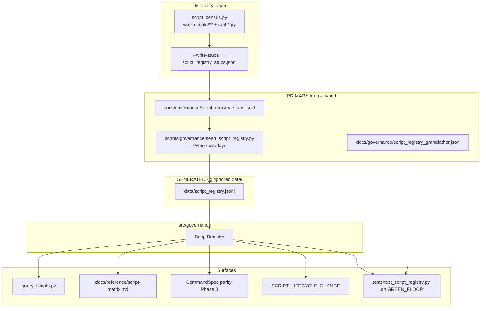
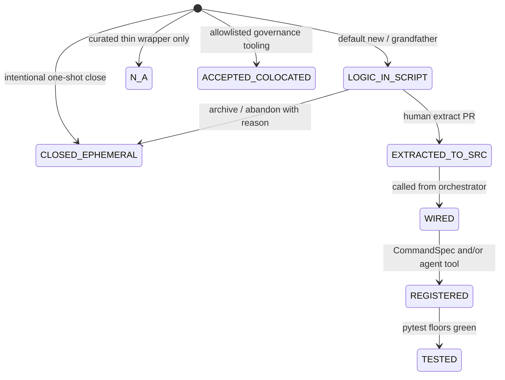
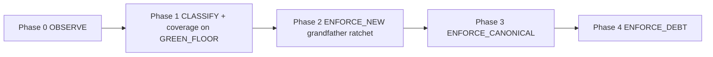

# Concatenated implementation plans — part 7 of 10

Source directory: `docs/implementation_plan/`
Files in this part: 16

## Contents

1. `phase1-state-contract-review-phase2-fm-resolution.md` (14011 bytes)
2. `plan-for-execution-golden-puzzle.md` (7983 bytes)
3. `pre-converstion-dont-read-cryptic-liskov.md` (10447 bytes)
4. `pure-claude-coding-agent-floofy-locket.md` (25270 bytes)
5. `pure-claude-md-formation-dicussion-adaptive-coral.md` (8736 bytes)
6. `pure-conversation-and-analysis-ethereal-lynx.md` (11051 bytes)
7. `pure-conversation-no-governance-toasty-nest.md` (1880 bytes)
8. `pure-conversation-when-you-curried-ocean.md` (15217 bytes)
9. `read-domain-glimmering-kernighan.md` (14476 bytes)
10. `read-https-claude-ai-code-artifact-0c974-async-cupcake.md` (11031 bytes)
11. `read-only-below-files-cheerful-wilkinson.md` (14387 bytes)
12. `repository-truth-maintenance-doctrine-cheerful-comet.md` (7252 bytes)
13. `role-you-are-the-effervescent-popcorn.md` (3448 bytes)
14. `run-backtest-v2-py-on-bnbusdt-recursive-sketch.md` (6413 bytes)
15. `run-m4-qualificationgate-on-tingly-valiant.md` (7650 bytes)
16. `script-implementation-traceability-sits-design.md` (52923 bytes)


================================================================================
SOURCE_FILE: docs/implementation_plan/phase1-state-contract-review-phase2-fm-resolution.md
SOURCE_BYTES: 14011
PART: 7/10 FILE 1/16
================================================================================

# Plan: Phase-1 State-Contract Review → Phase-2 Readiness

| Field | Value |
|---|---|
| Status | **APPROVED + PHASE-2 + PHASE-TOPOLOGY IMPLEMENTED** (2026-07-11) — plan exported; FM Option A (§12); Phase-Topology WHO-loaded graph drives SM (§13) |
| Date (UTC) | 2026-07-11 |
| Branch | `feature/truth-registry-v2` |
| Related design | [`docs/governance/phase_2_fm_resolution_design.md`](../governance/phase_2_fm_resolution_design.md) |
| Phase-1 certification | [`docs/governance/config_authority_matrix.md`](../governance/config_authority_matrix.md) §11 |
| Non-goals | Fourth YAML · dynamic executable topology · model dispatch · formula/threshold moves |

---

## Context

Conversation chain (three questions kept separate):

1. **CRT IN→OUT tracing** (raw candles → state machine → trade) — not 38-feature audit.
2. **Ontology authority** — `market_ontology.yaml` is feature math only; CRT states live in Python + descriptive YAML.
3. **Dynamic YAML loading without a fourth file** — reuse the three authorities with clear ownership.

**Phase 1 was subsequently implemented and certified (2026-07-11).** This plan reviews that implementation against the target architecture and sequences the next safe step.

---

## Phase-1 review verdict

**Overall: PASS — ownership boundaries preserved; behavior-neutral; fail-closed validation is real.**

| Intent (conversation) | Implementation | Status |
|---|---|---|
| No fourth YAML | Splice under `active_models.yaml` `crt.runtime.state_contracts` | ✅ |
| Typed runtime objects | `StateContract` + `StateContractBundle` (frozen + MappingProxyType) | ✅ |
| Validation only — no control-flow change | Loader at `CRTEngine.__init__`; `get_state_contract()` inspect-only | ✅ |
| No formula / threshold ownership in WHO | Only `required_fm`, `config_keys`, `eligible_models` (strings/IDs) | ✅ |
| Cross-validate FM vs ontology | `_resolve_fm` → market ontology + FORMULA_REGISTRY / compositions | ✅ |
| Cross-validate config keys vs HOW | Each key must be a `CRTConfig` field | ✅ |
| No `eval` / expression injection | Rejects `=`, operators, spaces; negative tests | ✅ |
| No model dispatch | `eligible_models` identity-checked only (`bitnet` on RETEST) | ✅ |
| Parity | Dual process_candle fingerprint + BNB/XAU isolated PRE/POST ledgers | ✅ certified |

---

## What Phase 1 actually loads and creates

### Source schema (`active_models.yaml` → `crt.runtime`)

```text
state_contract_schema_version: "1.0"
state_contracts:
  <STATE>:
    required_fm: [FM-…]        # WHAT refs only
    config_keys: [field…]      # HOW key names only
    eligible_models: [id…]     # WHO model ids; no dispatch
```

Census-derived contents:

| State | required_fm | eligible_models |
|---|---|---|
| RANGE | [] | [] |
| SHADOW_PENDING | [] | [] |
| SWEEP | FM-002, FM-010 | [] |
| DISPLACEMENT | [] | [] |
| EXPANSION | FM-010, FM-028 | [] |
| RETEST | FM-010, FM-027, FM-028 | bitnet |
| EXECUTION / RESOLUTION / EXPIRED | [] | [] |

Also fixed `cached_features_at_retest` names → FM-027/028/010 emission names (CH-002 alignment).

### Typed objects

| Type | Path | Role |
|---|---|---|
| `StateContract` | `src/config_layer/state_contract.py` | One state: ids only |
| `StateContractBundle` | same | contracts + transitions + source_path |
| `load_and_validate_state_contracts()` | `src/config_layer/state_contract_loader.py` | Fail-closed pipeline |
| `CRTEngine.state_contracts` | `crt_engine_v2.py` ~2186 | Loaded once at construct |
| `CRTEngine.get_state_contract()` | same | Inspection API |

### Fail-closed invariants (loader + tests)

1. Schema version must be `"1.0"`.
2. Contract keys == `CRTState` names (no missing/extra states).
3. `valid_transitions` == code `VALID_TRANSITIONS` (**parity mirror**, not executable graph swap).
4. Every `required_fm` exists in ontology; impl callable (or composition num/den); lifecycle ∈ {registered, parity_verified, consumable}.
5. Every `config_keys` entry is a `CRTConfig` field.
6. Every `eligible_models` entry is a top-level model block in `active_models.yaml`.
7. Unknown fields, numeric literals, formula-looking strings → reject.
8. **No** parallel `STATE_REQUIRED_FM` constants in Python.

Tests: `tests/test_state_contracts.py` (~32 cases) + certification note in `docs/governance/config_authority_matrix.md` §11.4b.

### Explicit non-effects (still true)

- Does **not** replace `_cm` / `_dm` call sites (Phase-1; Phase-2 routes identity-preserving resolve at 4 sites).
- Does **not** auto-execute `required_fm`.
- Does **not** dispatch Gaussian / ZoneGate / RR / BitNet / TradeNet.
- Does **not** change transition branch conditions.
- `use_bitnet` remains HOW (`CRTConfig` / production JSON).

---

## Ownership boundary check (target table vs reality)

| Concern | Authority (target) | Phase-1 reality | Gap? |
|---|---|---|---|
| Feature formulas | `market_ontology.yaml` | FM ids resolved against ontology; no formula text in contracts | ✅ |
| State identities | `active_models.yaml` | Declared + parity-checked vs `CRTState` | ⚠️ Dual: code enum still owns execution |
| Legal transitions | `active_models.yaml` (aspirational) | YAML **mirrored** and validated; **Python `VALID_TRANSITIONS` still executes** | ⚠️ Intended for Phase-1; topology load deferred |
| Detector/guard IDs | `active_models.yaml` | **Not present** in `state_contracts` | Deferred (conversation Phase 3) |
| Required FM IDs | `active_models.yaml` | Loaded + cross-validated | ✅ validation; not runtime assert-at-call-site yet |
| Required config keys | production config values + key names in WHO | Key names validated vs `CRTConfig` | ✅ validation; values still HOW |
| Runtime thresholds | production config | Untouched | ✅ |
| Executable SM | Python | Untouched | ✅ |

**Conclusion:** Phase 1 matches the “validation-only typed contracts” design. It does **not** yet make YAML the executable state topology authority — correctly deferred.

---

## Residual risks / DOC_DRIFT (do not mix into Phase-2 code)

### R1 — Duplicate descriptive authority still in `active_models.yaml`

Under `crt.runtime.detection.*` and related blocks:

- Numeric `defaults:` (e.g. `body_ratio_min: 0.70`)
- Prose `logic` / `gate_*` formula strings

These are **not** loaded by the state-contract pipeline, but they remain a drift surface (WHO re-stating HOW + WHAT). Phase-6 cleanup (strip or mark non-authoritative) remains open. Do **not** treat them as runtime truth.

### R2 — Doctrine table lag

`config_authority_matrix.md` §0 still says WHO `Runtime load?` **No**. Phase 1 **does** load `state_contracts` (+ transition parity) at CRT construct. Update should say something like:

> Partial: `state_contracts` + graph parity load at CRTEngine init; narrative/detection blocks still session-only.

### R3 — Dual transition authority

`tests/test_crt_state_invariants.py` and Phase-1 loader both enforce YAML ↔ code parity. Executable graph remains Python. Conversation “Phase 2 = dynamic topology” would invert that — **high blast radius**; only after parity instrumentation is solid.

### R4 — Phase numbering mismatch (conversation vs repo)

| Conversation phase | Repo artifact |
|---|---|
| Phase 1: typed contracts validation | **DONE** (`§11` matrix + loader) |
| Phase 2: dynamic state identity + transition graph | **Not designed as next** → re-label **Phase-Topology** (later) |
| Phase 3: detector/guard IDs | Not started |
| Phase 4–5: FM / config deps | **Partially absorbed into Phase 1 validation** |
| Repo `phase_2_fm_resolution_design.md` | **FM resolution Option A** (assert call-site ↔ registry) — **this is repo Phase-2** |

**Recommendation:** Adopt the **repo’s Phase-2 design** (FM resolution assertions) as the next code step. Treat conversation “dynamic topology” as a **later phase** (Phase-Topology), because:

- Topology swap changes control flow surface area.
- FM Option A is behavior-preserving, uses already-loaded contracts, and proves WHAT↔call-site identity without granting WHO execution authority.
- Auto-running `required_fm` as a schedule is **explicitly rejected** (Option C).

---

## Recommended approach (next work)

### Do now (review close-out — docs)

1. Export this plan to `docs/implementation_plan/` (**this file**).
2. Fix matrix §0 “Runtime load?” DOC_DRIFT (surgical) when implementing Phase-2.
3. Keep conversation phases and repo Phase-2 design **cross-linked** so future sessions don’t re-merge questions.

### Implement next: **Phase 2 = FM resolution Option A** (from existing design)

**Authority rule frozen:**

```text
Python call site  → resolve FM id → FORMULA_REGISTRY / composition
                      ▲
                      └── optional assert: FM ∈ state_contracts[state].required_fm
```

**Forbidden:**

```text
for fm in required_fm: auto-execute   # YAML becomes schedule
eval(yaml formula)
```

#### Files to touch

| Path | Change |
|---|---|
| `src/features/fm_resolve.py` (**new**) | `resolve_fm_callable(fm_id) -> Callable` + composition branch for FM-010 |
| `src/config_layer/crt_engine_v2.py` | At 4 census sites only: resolve + identity assert vs current `_cm`/`_dm` (or call resolved callable if proven identical) |
| `tests/test_fm_resolution_phase2.py` (**new**) | Golden float parity; membership asserts; unknown-FM fail-closed |
| `docs/governance/config_authority_matrix.md` | §12 results after implement |
| `docs/governance/phase_2_fm_resolution_design.md` | Status → IMPLEMENTED when done |

#### Call sites in slice (only)

1. `Candle.wick_size` / FM-002  
2. `Candle.body_ratio` / FM-010 (composition path)  
3. `try_expansion_to_retest` FM-027 emit  
4. `try_expansion_to_retest` FM-028 guard + emit  

#### Reuse existing utilities

- `features.registry.FORMULA_REGISTRY`, `load_ontology`, `compute_composition` / `compute_derived`
- `state_contract_loader._resolve_fm` patterns (or factor shared resolve into `fm_resolve` and call from both loader + CRT — avoid duplicating resolution logic)
- `tests/test_candle_math.py` / derived_math parity vectors as golden baselines
- Phase-1 loader cache for contract membership asserts

#### Parity gate (mandatory)

```text
process_candle dual-run fingerprint unchanged
BNB + XAU static-scorer ledger sha equality PRE/POST
No production config / ACTIVE_VERSION change (hash-neutral)
```

#### STOP conditions (from design §7)

- One FM → multiple distinct callables; numeric drift; eager `required_fm` execution; cache lifecycle change; WHO becomes formula authority.

### Explicitly defer (do not combine)

| Item | Why |
|---|---|
| Dynamic executable `VALID_TRANSITIONS` from YAML | Control-flow rewrite; dual authority flip |
| Detector/guard ID registries | Separate closed Python map; later phase |
| Strip `detection.defaults` / logic strings from am | Phase-6 cleanup; no behavior gain yet |
| Model dispatch from `eligible_models` | Authority ladder; BitNet still HOW-gated |
| Fourth YAML / `market_state_registry.yaml` | Rejected |

---

## Critical files (read before implementing Phase 2)

| File | Why |
|---|---|
| `src/config_layer/state_contract.py` | Contract types / injection guards |
| `src/config_layer/state_contract_loader.py` | Existing FM resolution (factor or wrap) |
| `src/config_layer/crt_engine_v2.py` | Call sites ~111–118, ~1360–1393, engine init ~2186 |
| `src/features/registry/` + `formula_registry.py` | WHAT bindings |
| `configs/formulas/market_ontology.yaml` | FM identity authority |
| `active_models.yaml` `state_contracts` | WHO dependency declarations |
| `docs/governance/phase_2_fm_resolution_design.md` | Approved architecture |
| `docs/governance/config_authority_matrix.md` §11–§11.6 | Phase-1 certification baseline |
| `tests/test_state_contracts.py` | Regression floor for WHO load |

---

## Verification

### Phase-1 review (read-only confirm anytime)

```text
pytest tests/test_state_contracts.py tests/test_crt_state_invariants.py -q
# expect: all green; load_and_validate_state_contracts() succeeds
```

### Phase-2 implementation gate

```text
pytest tests/test_fm_resolution_phase2.py tests/test_state_contracts.py tests/test_candle_math.py -q
# dual process_candle fingerprint
# optional: backtest_v2 BNB + XAU --scorer static → sha-equal trades/summary to Phase-1 cert hashes in matrix §11.4b
```

### Construction protocol (when coding)

- Classify vs `change_contracts.json` (architecture / feature binding; no HOW numbers).
- Manifest + `construction_protocol.py validate-completion` if governed surfaces change.
- SESSION LOG + doc sync (matrix §12) same turn.

---

## Success criteria for this review task

1. Phase-1 ownership boundaries documented as **preserved**.  
2. Residual risks (R1–R4) listed without conflating CRT-trace / ontology / dynamic-load questions.  
3. Next code step = **FM resolution Option A**, not topology rewrite or fourth YAML.  
4. Dynamic topology + guard registries remain **later**, parity-gated phases.

---

## Epistemic close (aligned with conversation)

| | |
|---|---|
| **Know** | CRT runs on raw candles + Python SM + config thresholds; Phase-1 contracts load WHO deps fail-closed without changing behavior. |
| **Think** | Three-file authority is sufficient; Option A is the highest-leverage next step. |
| **Don’t know** | Soft vs hard fail on call-site contract membership day-1; full consumer readiness for stripping descriptive defaults. |
| **Likely failure** | Merging topology + FM + guard + cleanup into one patch. |
| **Next** | Implement Phase-2 Option A per design doc after plan approval. |

---

## Approval record

| Item | Value |
|---|---|
| Approved by | User |
| Date | 2026-07-11 |
| Comment | Approved; export plan into repo markdown |
| Export path | `docs/implementation_plan/phase1-state-contract-review-phase2-fm-resolution.md` |
| Approved next code step | Phase-2 FM resolution Option A (not topology rewrite) |


================================================================================
SOURCE_FILE: docs/implementation_plan/plan-for-execution-golden-puzzle.md
SOURCE_BYTES: 7983
PART: 7/10 FILE 2/16
================================================================================

# Plan — Link the Pipelines: "Spine-as-Hypothesis" (backconstruct a research forensics pipeline from the full backtest)

## Context — why this change

Today the BNBUSDT M15 conclusions ("volatility has memory, direction doesn't"; expansion edge
net E[R] = −0.439R; 0 BH-survivors) came **only** from `src/research/` running *toy* hypotheses
(`ExpansionBreakout`, `MeanReversion`) — simple `detect(window) -> Signal` functions that never
touch the production decision spine. The full production backtest (`backtest_v2.py` →
`EngineRunner` → CRT/Gaussian/Zone/RR → Fusion → RegimeGovernor → Decision → ExecutionPlanner →
UltronRiskGate) has **never been measured under the research truth standard** (intrabar_fixed
exits, 12 bps round-trip cost, beats-control, OOS retention, permutation + Benjamini-Hochberg FDR).

The two pipelines today share exactly **one** primitive — `CandleLoader`
(`runtime/backtest_v2.py:626`) — and are otherwise isolated *by design* (Edge Discovery Program /
Pipeline-A vs Pipeline-B doctrine). The question: **can we link them so the backtest "forces all
its layers and data" through, and reverse-construct a research forensics run whose hypothesis IS
the production spine?**

**Intended outcome:** a single new adapter (`SpineHypothesis`) that satisfies the research
`Hypothesis` Protocol but whose `detect()` is the full production spine. It plugs into the
*unchanged* research machinery — `HypothesisRunner` (forward-walk), `EdgeAggregator`,
`QualificationGate` (7 gates), and `forensics.py` (loss decomposition). Result: an apples-to-apples
answer to "does the real 8-layer system produce a *qualified* edge, or does it die under honest
exits + cost + controls just like the toy hypotheses?" — plus the same loss-mechanism decomposition
the forensics layer already produces.

## The key architectural insight

Both surfaces are signal generators with the **same shape**:

| | Research `Hypothesis.detect()` | Production spine entry |
|---|---|---|
| input | `window: list[Candle]`, `features`, `ctx` | candle stream + 35-dim CANONICAL_FEATURES |
| output | `list[Signal]` (entry, dir, `sl_atr_mult`, `tp_atr_mult`, `atr`) | `TRADE_OPENED` w/ price-based entry/SL/TP at `EXECUTE` |

So the spine **is** a hypothesis. The conversion is mechanical:
`sl_atr_mult = abs(entry - sl) / atr`, `tp_atr_mult = abs(tp - entry) / atr` — exactly the inverse
of how `ExecutionPlannerV1_2` derived the prices. Once wrapped, **zero changes** are needed to the
research measurement/qualification/forensics code: it already speaks `Signal`.

## Isolation direction (the one hard constraint)

The boundary must keep pointing **down the decision flow** (per `service-boundary-map.md` hard
rule + Goal invariant #5 "execution authority stays isolated"). So:

- **Research must NOT import the live spine upward.** The adapter is the only coupling, and it
  lives on the research side, importing the spine **through a thin callable interface**, not the
  reverse. The spine never learns research exists.
- Reuse the existing precedent: research already imports `CandleLoader` as an *allowed proven
  primitive* (local-scope import). `SpineHypothesis` extends that pattern — it imports the spine
  entry surface in local scope, behind a `SpineSignalSource` Protocol, so the dependency is
  invertible later (Trd-M4 `BacktestRunner` interface) without touching research call sites.

## Determinism reconciliation (research `detect()` must be PURE; the spine is stateful)

The research contract requires `detect()` to be pure/deterministic/no-lookahead. The spine has
stateful + non-deterministic parts. The adapter neutralizes each, all **already supported** by
existing config/flags — no spine code changes:

1. **LLM tie-breaker** → force neutral. `llm_inference_client` already returns `1.0` after
   `fail_count_disable`; adapter sets the disable path / `llama_gate` off so it is deterministically
   neutral (invariant #3: LLM is advice, never a trigger — satisfied by construction).
2. **Async CognitiveBus emission** (`engine_runner.py:1007`) → fire-and-forget; make it a no-op /
   disabled in adapter mode so it can't perturb timing or write side-channels.
3. **Adaptive controllers / belief tracker** → run with persistence disabled (fresh per run) so the
   run is a pure function of (candles, config). Seeded slippage is irrelevant here because the
   research forward-walk owns exits, not the spine.
4. **No-lookahead** → the spine is already streamed candle-by-candle with timestamp-keyed features
   (`backtest_v2.py:1731`); the adapter emits a `Signal` at the `EXECUTE` bar and hands
   `candles[entry_index+1:]` to `forward_walk()` — the existing `assert future.index > entry_index`
   guard enforces it.
5. **Features ("all data")** → today research passes `features={}`. The adapter precomputes the
   full 35-dim `CANONICAL_FEATURES` once via `FeaturePipeline` (timestamp-keyed, same as the
   backtest) and feeds them to the spine — this is the "force all data through" requirement.

## What gets built (the recommended shape)

A new isolated module set under `src/research/` (Pipeline-B side), spine untouched:

- `src/research/adapters/spine_signal_source.py` — `SpineSignalSource` Protocol +
  `ProductionSpineSource` impl: wraps `EngineRunner` + `CRTEngine` + `FeaturePipeline`, runs a
  window deterministically (LLM/async/adaptive neutralized), returns `(entry, dir, sl_px, tp_px,
  atr)` at `EXECUTE`, else nothing.
- `src/research/hypotheses/spine_hypothesis.py` — `SpineHypothesis` implementing the `Hypothesis`
  Protocol; `detect()` calls the source and converts price SL/TP → `sl_atr_mult`/`tp_atr_mult`
  `Signal`. `economic_rationale="production_spine_composite"`, `family="composite"`.
- `configs/research/research_config_spine.json` — research_config variant whose `signal` block
  defers to the spine (apply_signal_defaults=false) and points at the production config version to
  load (e.g. `v2_multi_2026_04`). Its own SHA-256 provenance flows into the edge_report.
- Register in `src/research/registry.py`; expose via existing `python -m research.cli
  run|qualify --hypothesis spine`. **No new CLI** — reuse `cli.py`.

Then the *unchanged* research stack produces, for the spine:
- `edge_report.json` (deterministic, byte-comparable) — spine's NET win-rate/PF/expectancy vs the
  same controls the toy hypotheses faced.
- `qualification_report.json` — does the spine PROMOTE / REJECT / INSUFFICIENT through all 7 gates
  (incl. beats-control + OOS + permutation + BH)?
- `forensics` decomposition — intrabar-damage matrix, loss mechanisms, opportunity profile,
  regime/session cuts — **on the real spine's trades**.

## Verification

- **Determinism:** run `--hypothesis spine` twice → byte-identical `edge_report.json`
  (the existing determinism guarantee; the adapter must add no wall-clock / unseeded RNG).
- **Equivalence sanity:** the spine adapter's entry bars + price SL/TP must reconcile against a
  normal `backtest_v2.py` run on the same CSV+config (same `TRADE_OPENED` timestamps, same SL/TP) —
  proves the adapter faithfully reproduces the spine, i.e. truly "forces all layers through."
- **Truth-standard parity:** confirm exit model = `intrabar_fixed` on both sides (already the
  governing model — `CRTConfig.exit_model` and `forward_walk.exit_model`), so the comparison to toy
  hypotheses is fair.
- **Governance scoring (Five Questions):** (1) deterministic ✓ (2) comparable ✓ (3) auditable via
  edge_report+manifest ✓ (4) LLM-reasonable ✓ (5) execution authority isolated — **must verify** no
  upward import and spine cannot be triggered by research. Append §6 SESSION LOG.

## Open forks (confirming with user before finalizing)

1. Deliverable shape: hypothetical **design doc only** vs design doc **+ buildable adapter plan**.
2. Target research artifact: **forensics decomposition**, **qualification gate**, or **both**.


================================================================================
SOURCE_FILE: docs/implementation_plan/pre-converstion-dont-read-cryptic-liskov.md
SOURCE_BYTES: 10447
PART: 7/10 FILE 3/16
================================================================================

# Re-Research Architecture: Measurement Contract + Family Registry

## Context

~239 research scripts under `scripts/research` + `scripts/analysis` encode roughly 15 semantic
families asked repeatedly across instruments and axes. The blocking problem is not idea supply —
it is that **no research result records the measurement basis it was produced under**, so results
are not mechanically comparable and prior conclusions cannot be selectively invalidated.

Evidence that this is one defect, not several (all from the always-loaded findings index):

| Finding | Symptom | Class |
|---|---|---|
| F-037 / F-058 | Fusion gate OFF in `.env`, ON in code default, docs said OFF | Same question, two contracts, one label |
| F-022 → F-045 → F-041B | Label contamination rediscovered in three separate labs | No shared label derivation |
| F-025 / F-035 | 12bps cost applied where it is 1.8–2.5× the FX bar | Cost as constant, not instrument property |
| F-061 / F-066 | `normalization_basis`, `session_timestamp_basis` | Feature semantics as a *silent* contract term |

The repo already governs **production** config this way (`ACTIVE_VERSION` + SHA-256 +
`promotion_log.jsonl` + §4.0 precedence). The instrument that *judges* production has no equivalent.
Closing that asymmetry is the intended outcome.

Secondary outcome: make the user's stance — *"treat old PROMOTE/REJECT as historical noise until
re-proven"* — **mechanical instead of remembered**, by binding every claim to a contract hash and
letting a contract bump cascade claims to `PROVISIONAL`.

## Decisions locked (2026-08-06)

1. **Sequence:** Phase A (family atlas artifact) → Phase B (design doc + contract schema) → Phase C
   (return to discussion; build nothing further without approval).
2. **Ordering: strict L0 → L1 → L2 → L3 → L4 → L5 per family.** Pivotality-first for wired channels
   was considered and **rejected** — an ablation under an unverified contract carries no more
   authority than any other result. Consequence: the L0 sufficiency criterion is the only bound on
   hygiene spend and must be written explicitly (Phase B).
3. **Contract scope: per-asset-class profiles.** One schema, bound profiles (crypto majors / FX
   majors / metals-MT5). Cost model **derived from each instrument's own bar statistics**, not a
   fixed 12bps.
4. **Legacy scripts: freeze as historical.** Existing scripts become read-only artifacts (§6.2
   rule 4 — never deleted). New work runs through per-family runners. The runner is *specified* in
   Phase B and **not built** in this plan.

## Data model (the reconciliation)

The atlas contains two representations. The flat family list conflates three different kinds of
thing; the object × question matrix does not. **The matrix is the model.**

- **Rows = objects** (semantic things studied)
- **Columns = layers L0–L5** (questions asked of them) — the matrix's existing columns already map:
  Structure→L1, Selection→L2, Labels→L0, Discrimination→L3, Economic qualify→L4, Pivotality→L5
- **Cells = claim slots**, each carrying evidence mass, status, and bound claims
- **Instrument/asset-class is a separate dimension**, not a row — this is why the "XAUUSD/MT5
  campaign" read as a family: a cross-cutting scope masquerading as an object. It dissolves into a
  contract-profile binding.
- **System/governance research is a different domain**, not a market family — excluded from this
  registry (it is L0-of-the-instrument, already covered by the script-census / behavior-census line).

Normalized object list (16): `crt_structure`, `crt_parity`, `session_time`, `zone_geometry`,
`gaussian`, `rr`, `neural_consumers`, `shapes_trajectories`, `regime_dynamics`, `carry_basis`,
`cross_sectional_panel`, `htf`, `weekly_calendar`, `exit_cost_path`, `feature_ontology`,
`label_truth`.

---

## Phase A — Machine-readable family atlas

**Pre-flight (§6.2 rule 1, existing-doc-first).** Before creating anything, check whether
`docs/knowledge-map.md` or `docs/research-readiness/README.md` already owns this topic and extend
it instead. Create new only if neither does.

**Primary artifact:** `docs/governance/research_family_registry.json` (committed; precedent:
`geometry_family_registry.json`, `closure_authority_index.json`, `miar_registry.json`).

Record shape per object:

```json
{
  "family_id": "RF-ZONE-GEOMETRY",
  "object": "Zone geometry / local membership",
  "question": "one sentence — what this object is being asked",
  "canonical_instrument": null,
  "contract_profile": null,
  "runner": null,
  "cells": {
    "L0": { "evidence_mass": "high|med|low|none", "status": "...", "claims": [] },
    "L1": { ... }, "L2": { ... }, "L3": { ... }, "L4": { ... }, "L5": { ... }
  },
  "script_evidence": ["discover_zones", "zone_label_audit"],
  "provenance": {
    "source": "user_atlas_2026-08-06",
    "verified_against_filesystem": false
  }
}
```

**Cell status vocabulary (closed set):** `UNTESTED` · `UNVERIFIED_HISTORICAL` · `IN_PROGRESS` ·
`ANSWERED_UNDER_CONTRACT` · `GAP`.

**Every cell with existing mass seeds as `UNVERIFIED_HISTORICAL`** — this is the user's stance
expressed as initial state rather than as discipline.

**Provenance is mandatory and honest.** The atlas is a *claim about the filesystem* built from
approximate name-based buckets, by the user's own statement. Nothing in Phase A is verified against
disk. `verified_against_filesystem: false` on every record until a join against
`data/script_registry.jsonl` runs (deferred — that join requires reading, which this session
excludes).

**Floor:** `tests/test_research_family_registry.py` — schema validity; all 16 objects present; every
object carries all six L0–L5 cells; status tokens in the closed set; provenance block present; no
cell references a `contract_hash` that does not exist in the contract directory.

## Phase B — Design doc + contract schema

**Charter:** `docs/governance/MEASUREMENT_CONTRACT.md` (long-form; precedent shape:
`MARKET_ONTOLOGY_EVOLUTION_CONTRACT.md`, `REPOSITORY_CONSTRUCTION_PROTOCOL.md`). Must contain the
L0 sufficiency criterion in full, since decision 2 makes it the sole bound on hygiene spend:

> L0 is complete **for a family** when the contract's terms are declared, strictly read, and the
> family's result is provably invariant to the remaining unknowns — **not** when the feature layer
> is clean. Boundary-scoped and non-transitive, mirroring the closure index invariant.

**Machine artifacts:** `configs/research/measurement_contracts/{crypto_majors,fx_majors,metals_mt5}.v1.json`,
each SHA-256 hashed via the existing `scripts/maintenance/_compute_hash.py` pattern.

Contract terms (most already exist as declared config keys — this is assembly, not new machinery):

| Term | Source |
|---|---|
| corpus + integrity level (L1/L2/L3) | `dataset_integrity.validate_dataset` (F-039 scope caveat applies) |
| timestamp basis | existing `feature_pipeline.session_timestamp_basis` (F-066) |
| feature basis | existing `feature_pipeline.normalization_basis` (F-061) |
| label derivation | one definition — `forward_walk(intrabar_fixed)`; closes the F-022 class |
| cost model | **derived** per profile from instrument bar statistics (F-035) |
| decision-path mode | existing `BACKTEST_ENGINE_GATE` (F-058 — declare in config, not `.env`) |
| warmup / purge / OOS split | per profile |
| control + permutation protocol, power floor | research-only terms |

**Claims reuse the existing findings system — do not build a parallel store** (§6.2 rules 1 and 5).
`docs/current-findings.md` already has a living doc, a thin always-loaded CLAUDE.md index, and a
test floor. Extend it with two required fields per row: `family` and `contract`. All 69 existing
findings take `contract: UNKNOWN` in a bulk mechanical pass → `PROVISIONAL` by construction. Nothing
is deleted (§6.2 rule 4); nothing retains unearned authority.

**Invalidation rule (one rule, reusing F-054's proven engine).** A claim is comparable only to
claims sharing its `contract_hash`. A contract version bump cascades every claim bound to the old
hash to `PROVISIONAL` — the same transitive-invalidation / STALE-cascade pattern already built for
the feature DAG (`feature_dag_certify.py`), one level up over `contract → family → claim`.

**Runner: specified, not built.** Document the per-family runner contract — scope object in,
contract binding, claim record out — so the ~19 `qualify_*` variants have a single target shape to
collapse into later. Implementation is a separately approved turn.

**Floors:** `tests/test_measurement_contract.py` (schema, hash freshness, no undeclared terms,
strict-read discipline per §6.5's no-silent-defaults rule); extend `tests/test_current_findings.py`
for the two new required fields.

## Phase C — Discussion gate

Stop. Review the two artifacts together, then decide what gets built. No runner, no migration, no
re-research execution in this plan.

## Explicitly out of scope

Reading or modifying any script; the `data/script_registry.jsonl` join; building runners; migrating
any research script; re-running any family; any change to `configs/production/*` or `ACTIVE_VERSION`.

## Verification

1. `python -m pytest tests/test_research_family_registry.py tests/test_measurement_contract.py tests/test_current_findings.py`
2. Hand-check: every `○` cell in the source matrix appears in the registry as an explicit `GAP` or
   `UNTESTED` record — the point of the artifact is that gaps are addressable, not silent.
3. Hand-check: zero findings carry a contract hash after Phase B's bulk pass (all `UNKNOWN`), i.e.
   the stance is enforced, not asserted.
4. Hash-neutrality: Phases A and B add non-`params` artifacts only — the production config hash must
   be unchanged. Confirm no `configs/production/*` file is touched.
5. §6 SESSION LOG entry appended to `assistant_project.md` (deferred out of plan mode).

## Open items requiring filesystem verification (deferred, need reading)

- Whether `docs/knowledge-map.md` / `docs/research-readiness/README.md` already owns the family-map
  topic (decides create-vs-extend in Phase A).
- `data/script_registry.jsonl` schema, for the eventual family ↔ script join that would flip
  `verified_against_filesystem` to `true`.
- Exact current front-matter/row schema of `docs/current-findings.md`, before adding two required
  fields across 69 rows.


================================================================================
SOURCE_FILE: docs/implementation_plan/pure-claude-coding-agent-floofy-locket.md
SOURCE_BYTES: 25270
PART: 7/10 FILE 4/16
================================================================================

# Pure-Claude Semantic Research Loop

## Context

**The ask:** OHLCV → deterministic semantic features → an LLM knowledge layer → Claude-authored semantic observations and hypotheses → validation through backtest/forward-walk → production-ready strategy rules, with trust escalating from untrusted LLM observation to qualified strategy.

**What's actually missing is small.** Exploration confirms four of the five layers already exist and are production-grade:

| Layer | Status | Where |
|---|---|---|
| 1. OHLCV → deterministic semantic labels | **COMPLETE**, shadow-only | `FeaturePipeline` → `FeatureStateEncoder` → `MarketContextBuilder` → `MarketShapeClassifier`, all driven by `configs/formulas/market_ontology.yaml` |
| 2. LLM knowledge layer | **MISSING** | — |
| 3a. Semantic observations (untrusted) | **MISSING** | closest analogue: `src/agent/findings_synthesizer.py` |
| 3b. Hypothesis → measurement | **COMPLETE**, frozen kernel | `research/contracts.py`, `registry.py`, `measurement/forward_walk.py`, `qualification.py` (M4, 7 gates) |
| 4. Trust / authority | **PRIMITIVES ONLY** | `hypothesis_registry.py` (authority pinned `"research"`), `closure_authority_index.json`, Authority Ladder, `test_epistemic_invariants.py` |
| 5. Production promotion | **COMPLETE** | `ConfigValidator` → `PromotionManager` |

So this is a **connective-tissue build**, not a new stack. The work is: a deterministic knowledge-pack builder, an untrusted observation ledger, a *mechanical* pre-registration gate, a cumulative multiple-testing budget with a sealed corpus slice, and a trust state machine — all additive, all research-authority-only.

**The honest expected outcome.** F-019…F-043 record ~15 registered falsifications of directional edge across crypto majors, FX, HTF, cross-sectional, carry, weekly-sweep and regime axes. The near-term value of this architecture is **throughput of falsification**, not an expected edge. M0 is designed to end in `REJECT` and still be a success.

**The one genuinely hard problem this plan must solve.** The M4 gate's Benjamini-Hochberg correction is scoped to a single run's cohort. An LLM that can author hypotheses cheaply turns that into a false-discovery engine, and worse — the LLM reads outcome statistics before writing `detect()`, which is researcher-degrees-of-freedom contamination that **no downstream test can detect**. The corpus split + cumulative budget below exist specifically for this.

### Decisions taken (user-confirmed)

1. **LLM runtime = the Claude Code session itself.** No API client, no key, no HTTP. The pipeline writes a knowledge-pack file; the session reads it and authors JSONL + a Python module. Follows the existing `src/control_plane/context_report.py` `provider="export"` precedent and CLAUDE.md §13.8 (Claude is sole code author).
2. **Three-way chronological corpus split with a sealed holdout.** DISCOVERY (LLM sees) / MEASURE (feeds the M4 IS/OOS split) / SEALED (never rendered into any pack; one-shot unseal per frozen hypothesis).
3. **M0 = thin end-to-end walking skeleton**, deliberately expected to REJECT.

### Flagged before starting

- **DOC_DRIFT (§6.2):** `CLAUDE.md` states the canonical vector is **38-dim**; exploration reports schema v4.0 is **39-dim** (`macd_hist` split into `macd_hist_raw` + `macd_hist_z`, `wick_size` → `candle_range`), with `SCHEMA_V3_FEATURE_DIM = 38` kept only as a compat sentinel. **Verify against `src/features/feature_schema.py` as M0 step 1** and fix `CLAUDE.md` in the same turn. Unambiguous DOC_DRIFT → auto-fix per the drift-protocol gate calibration.
- The on-disk trace corpus (`results/research/trace_corpus/xauusd/`, 23,447 rows) is **stale schema-v3**. Not needed for M0; rebuilt in M2.
- Corpus is the frozen XAUUSD Phase-1 candidate (`data/mt5/XAUUSD_M15.csv`, sha256 `4d73f5ce…`, 47,275 rows), guarded fail-closed by `src/data_ingestion/xauusd_phase1_candidate.py`. Standing mandate: **XAUUSD only** — never substitute a crypto major to make a demo produce events.

---

## Architecture

```
data/mt5/XAUUSD_M15.csv  (frozen, SHA-pinned)
   │
   ├─ corpus_split.py ──► DISCOVERY 50% │ MEASURE 30% │ SEALED 20% (newest)
   │                          │              │             │
   │              (sealed_guard refuses any pack touching SEALED)
   │                          ▼
   │   FeaturePipeline → FeatureStateEncoder → MarketContext → MarketShape
   │                          ▼
   └─ pack_builder.py ──► results/research/knowledge/xauusd/knowledge_pack.md
                              ▼
                   ┌──────────────────────────┐
                   │  CLAUDE CODE SESSION     │  ← the "LLM layer". No API.
                   │  reads pack, authors:    │
                   │   • observation JSONL    │
                   │   • hypothesis .py       │
                   └──────────────────────────┘
                              ▼
   T0  logs/semantic_observations.jsonl        authority NONE, status "untrusted"
                              ▼  freeze (thresholds must == canonical research_config)
   T1  docs/research/preregistration/generated/<id>.prereg.json   protocol_hash, frozen
                              ▼  codegen + leak tripwire + provenance header
   T2  src/research/hypotheses/generated/<name>.py    registered by import
                              ▼  UNCHANGED M4 gate on MEASURE slice
   T3  results/research/qualification/generated/...   PROMOTE | REJECT | INSUFFICIENT
                              ▼  one-shot unseal, alpha spent from budget ledger
   T4  SEALED confirmation                     ← first rung with research authority
                              ▼  existing path, human APPROVE
   T5  ConfigValidator → PromotionManager      ← only rung with production authority
```

The frozen measurement kernel (`contracts.py`, `qualification.py`, `forward_walk.py`) is **not modified**. Generated hypotheses enter it as ordinary `Hypothesis` Protocol objects — the same door `expansion_breakout` uses.

---

## M0 — Thin end-to-end walking skeleton

**Exit criterion:** `data/trust_ladder.jsonl` shows `OBS-0001` at `T3_MEASURED` with a real M4 verdict; the full provenance chain (module → prereg → observation → knowledge pack → corpus SHA) resolves mechanically; every artifact is byte-identical on rerun; sealed slice provably untouched.

### Step 0 — Construction Protocol classification (mandatory, before code)

`docs/governance/change_contracts.json` has **no class covering a new research/LLM subsystem**; its `_doc` says to extend classes and `tests/test_construction_protocol.py` together.

- Add change class `RESEARCH_SUBSYSTEM_ADDITION` — `authorities_to_inspect`: ontology, research config, hypothesis registry, findings; `required_checks`: the `CONSTRUCTION_FLOOR` set plus the new test floor; `rollback_boundary`: delete the new package + generated dir (no production surface touched); `completion_criteria`: sealed slice unread, authority NONE everywhere, determinism proven.
- Add the matching case to `tests/test_construction_protocol.py`.
- Write `docs/governance/build_manifests/CH-SEM-001.impact.json`; run `python scripts/governance/construction_protocol.py validate-impact <manifest>`.

### Step 1 — Corpus split + sealed guard

**`src/research/knowledge/corpus_split.py`**

```python
DISCOVERY, MEASURE, SEALED = "DISCOVERY", "MEASURE", "SEALED"
DEFAULT_FRACTIONS = (0.50, 0.30, 0.20)   # chronological; SEALED is the NEWEST tail

@dataclass(frozen=True)
class CorpusSplit:
    path: str; instrument: str; sha256: str; rows: int
    discovery: tuple[int, int]      # [start, end) raw row indices
    measure:   tuple[int, int]
    sealed:    tuple[int, int]
    def canonical(self) -> dict: ...
    def sha256_id(self) -> str: ...
    def slice_of(self, index: int) -> str: ...

def build_split(path, *, fractions=DEFAULT_FRACTIONS) -> CorpusSplit   # verifies file SHA, fail-closed
```

**`src/research/knowledge/sealed_guard.py`**

```python
class SealedSliceViolation(RuntimeError): ...
def assert_not_sealed(split: CorpusSplit, *, end_index: int) -> None
def assert_pack_scope(split: CorpusSplit, frame_end: int) -> None   # called by pack_builder
```

XAUUSD 47,275 rows → DISCOVERY ≈ 23,637 / MEASURE ≈ 14,183 / SEALED ≈ 9,455. Sealed is newest — closest to live, the honest holdout.

> **Reuse note:** carry a `_pos` column *before* `FeaturePipeline.run()` — the pipeline drops the 78-row warmup **and resets the index**, so pipeline row `i` ≠ raw bar `i`. Precedent: `scripts/research/build_trace_corpus.py:54-65`, `src/research/shape_statistics.py`.

### Step 2 — Knowledge pack builder (minimal for M0)

**`src/research/knowledge/pack_builder.py`** — deterministic, read-only, DISCOVERY slice only.

```python
PACK_VERSION = "1.0"
MAX_PACK_CHARS = 120_000        # hard cap; deterministic truncation by count rank

def build_pack(split: CorpusSplit, *, cfg: dict) -> KnowledgePack
def render_markdown(pack: KnowledgePack) -> str      # what Claude reads
def pack_hash(pack: KnowledgePack) -> str            # sha256 over canonical JSON
```

M0 pack sections (no conditional base rates yet — those land in M2):

1. **Provenance header** — corpus SHA, split boundaries, feature-schema version + hash, `PACK_VERSION`, `pack_hash`. No wall-clock in the body; timestamps go to a sibling `*_manifest.json` (existing convention).
2. **Vocabulary** — rendered *from the ontology*, not hand-written: the 15 stateful identities / 36 state names via `FeatureStateEncoder`, the coarse `MarketShape` names from `configs/formulas/market_shapes.yaml`, the 9 `CRTState` members, `CandleStateEncoder` tokens, `RegimeLabeler` C|N|E. **This is what stops the LLM inventing vocabulary** — it can only speak in registered terms.
3. **Frequency tables** — per-feature state occupancy; coarse shape counts; top-N fine `MS-<hash>` contexts with counts and `MarketContext.describe()` renderings.
4. **Already falsified** — injected verbatim from the F-019…F-043 rows of `docs/current-findings.md` (via `scripts/governance/export_findings.py` output). Cheap, and the single highest-value section: it stops the LLM re-proposing dead classes.
5. **Representative episodes** — k compact bar tables per top context.

Output: `results/research/knowledge/xauusd/knowledge_pack.{md,json}` + `knowledge_pack_manifest.json`.

Driver: **`scripts/research/build_knowledge_pack.py`**.

### Step 3 — Observation ledger (T0, untrusted)

**`src/research/knowledge/observation.py`** — modeled on `src/governance/hypothesis_registry.py` (strict field set, unknown keys rejected, pinned literals raise).

```python
_REQUIRED = ("id","kind","created","author","pack_hash","statement","ontology_refs",
             "proposed_mechanism","falsifier","status","authority","trust_rung","notes")
_ID_RE = re.compile(r"^OBS-\d{4}$")
AUTHORITY = "NONE"        # pinned literal — validate_record raises on anything else
STATUS    = "untrusted"   # pinned literal

class ObservationLedger:
    def append(self, record: dict) -> None      # validates, then appends
    def validate_record(self, record: dict) -> None
    def load(self) -> list[dict]
```

Validation that does real work:
- `ontology_refs` must resolve against `market_ontology.yaml` + `market_shapes.yaml` — **fail-closed**. An observation citing an invented `FM-999` is rejected at the door.
- `pack_hash` must match an existing knowledge-pack manifest.
- `authority` / `status` / `trust_rung` are pinned literals → **an observation cannot escalate itself**; escalation is only ever derived by `trust.py` from downstream evidence.
- `proposed_mechanism == ""` is legal but records `UNEXPLAINED` (mirrors `contracts.py:35` — held with suspicion).

Artifact: `logs/semantic_observations.jsonl` (RUNTIME tier — high-volume, append-only, never authority).

### Step 4 — Mechanical pre-registration (T1)

This closes the documented gap: *"nothing mechanically blocks a run whose thresholds differ from its prereg."*

**`src/research/knowledge/preregistration.py`** — wraps the already-built-but-unwired `src/research/experiment_spec.py` (`ExperimentSpec`, `authority` frozen at `"NONE"`, deterministic `sha256()`), plus the freeze/hash idiom from `src/research/episodes/protocol.py` (`compute_protocol_hash`, `freeze_block`).

```python
def build_prereg(observation, split, *, hypothesis_name, gate) -> dict
def protocol_hash(prereg: dict) -> str
def freeze(prereg: dict, out_dir: Path) -> Path
def validate_frozen(prereg: dict) -> list[str]   # [] == valid
```

`validate_frozen` enforces, mechanically:
- recomputed `protocol_hash` == stored value (no post-hoc edits);
- `frozen is True`, `authority == "RESEARCH_ONLY"`, `grants_production_authority is False`;
- **`gate` block equals the canonical values loaded from `configs/research/research_config.json`, and `gate_source_sha256` equals that config's `ResearchConfig.sha256`** — a divergent-threshold run is refused, not merely noticed;
- `observation_id` resolves in the observation ledger and its hash matches;
- `corpus_split` matches a `CorpusSplit.sha256_id()` recomputed from the pinned file.

Frozen file: `docs/research/preregistration/generated/<OBS-id>.prereg.json` — **committed**, matching the existing `docs/research/*.json` prereg-twin convention (`protocol_hash`, `frozen`, `authority: RESEARCH_ONLY`, frozen gate thresholds, `closure_rule`, `falsification_conditions`).

### Step 5 — Claude-authored hypothesis module (T2)

Claude writes one module at `src/research/hypotheses/generated/<name>.py`. New `generated/__init__.py` imports each module (registration-by-import); `src/research/hypotheses/__init__.py` gains **one line**: `from . import generated`.

Every generated module must carry a provenance header and the shared leak tripwire:

```python
OBSERVATION_ID = "OBS-0001"
PREREG_ID      = "PREREG-OBS-0001"
PROTOCOL_HASH  = "sha256:..."

@register_hypothesis
class <Name>:
    name = "gen:<name>"; family = "generated"
    economic_rationale = "<from the observation's proposed_mechanism>"
    def detect(self, window, features, ctx):
        leak_guard.assert_no_outcome_keys(features, ctx)
        ...
```

**`src/research/knowledge/leak_guard.py`** generalizes the existing tripwire in `src/research/hypotheses/market_shape_hypothesis.py:27,51-57`:

```python
FORBIDDEN = ("outcome","rr_achieved","mfe","mae","rr","time_to_tp","time_to_failure","reached_1r")
class OutcomeLeakError(RuntimeError): ...
def assert_no_outcome_keys(features: Mapping, ctx: Mapping) -> None
```

### Step 6 — Measurement driver (T3)

**`scripts/research/qualify_generated.py`** — copies the `scripts/research/qualify_shape_xauusd.py` shape (which already carries the 0-bps sensitivity twin), and **adds no statistics**. It:

1. loads the frozen prereg, runs `validate_frozen` → **refuses to run on any error**;
2. restricts the corpus to the **MEASURE** slice (asserts via `sealed_guard`);
3. runs the unchanged `HypothesisRunner.collect` → `EdgeAggregator.aggregate` → `evaluate_pre_bh` → `benjamini_hochberg` → `finalize`;
4. writes `results/research/qualification/generated/<id>.json` + a separate manifest.

Controls are the existing ones (`always_long`, `random_uniform`, `random_biased_70`); the winning control is selected exactly as the existing drivers do.

### Step 7 — Trust ladder state machine

**`src/research/knowledge/trust.py`** — deliberately mirrors the repo's `VALID_TRANSITIONS` idiom from `src/config_layer/state_identity.py`.

```python
RUNGS = ("T0_OBSERVATION","T1_PREREGISTERED","T2_IMPLEMENTED",
         "T3_MEASURED","T4_CONFIRMED","T5_QUALIFIED")
LEGAL_TRANSITIONS = {  # strictly linear — no skipping, no back-dating
    "T0_OBSERVATION":  {"T1_PREREGISTERED"},
    "T1_PREREGISTERED":{"T2_IMPLEMENTED"},
    "T2_IMPLEMENTED":  {"T3_MEASURED"},
    "T3_MEASURED":     {"T4_CONFIRMED"},     # only if verdict == PROMOTE
    "T4_CONFIRMED":    {"T5_QUALIFIED"},     # only via ConfigValidator/PromotionManager
    "T5_QUALIFIED":    set(),
}
RUNG_AUTHORITY = {  # Authority Ladder levels per build_g001_consumer_attribution.py:33
    "T0_OBSERVATION": 0, "T1_PREREGISTERED": 0, "T2_IMPLEMENTED": 0,
    "T3_MEASURED": 0,          # information only — a measured REJECT/PROMOTE is not value
    "T4_CONFIRMED": 1,         # ECONOMIC_USEFULNESS_MEASURED
    "T5_QUALIFIED": 2,         # AUTHORITY_EARNED — granted by the EXISTING gate, not here
}

def resolve_rung(observation_id: str) -> dict   # DERIVES rung from evidence artifacts
def resolve_all() -> list[dict]                 # → data/trust_ladder.jsonl (GENERATED tier)
```

**What mechanically prevents rung-skipping:** `resolve_rung` never accepts a claimed rung. It walks the evidence — observation record → frozen prereg file (hash-valid) → generated module (provenance header matching) → qualification report (prereg hash matching) → budget ledger unseal entry. A rung whose predecessor evidence is absent or hash-mismatched is not emitted. `data/trust_ladder.jsonl` is GENERATED (derived, never hand-edited), matching the `data/findings.jsonl` pattern.

### M0 test floor — `tests/research/knowledge/`

| File | Asserts |
|---|---|
| `test_corpus_split.py` | deterministic boundaries; fractions sum; SHA fail-closed on a mutated file |
| `test_sealed_guard.py` | **behavioral** — `pack_builder` raises `SealedSliceViolation` when handed the full corpus |
| `test_pack_builder.py` | byte-identical on rerun; `MAX_PACK_CHARS` respected; vocabulary matches the ontology exactly (no invented terms) |
| `test_observation_ledger.py` | pinned-literal violations raise; unresolvable `ontology_refs` rejected; unknown keys rejected |
| `test_preregistration.py` | **behavioral** — a prereg with one gate threshold mutated fails `validate_frozen`; a post-hoc edited body fails the hash check |
| `test_leak_guard.py` | **behavioral** — every registered `gen:*` hypothesis raises when `detect()` is fed a features dict containing `rr_achieved` |
| `test_generated_provenance.py` | every generated module's `PREREG_ID`/`PROTOCOL_HASH` resolve to a frozen prereg whose `observation_id` resolves in the ledger |
| `test_trust_ladder.py` | `LEGAL_TRANSITIONS` is linear and total over `RUNGS`; a fabricated T4 with no unseal record resolves back to T3 |

Tests are **behavioral, not grep** — per the E-001 lesson recorded in `tests/governance/test_epistemic_invariants.py` ("a test that cannot fail is not enforcement").

### M0 governance close-out (same turn, per §6.6 / §6.2)

- Register new semantic concepts as canonical ontology nodes (or explicit `UNKNOWN_*` nodes with the `epistemic` block) in `configs/formulas/market_ontology.yaml` — **never a TODO**.
- Write `docs/governance/build_manifests/CH-SEM-001.completion.json`; run `construction_protocol.py validate-completion`.
- Append the `📝 SESSION LOG ENTRY` block to `assistant_project.md`.
- File the finding only if something was actually validated or overturned.

---

## M1 — Cumulative multiple-testing budget + sealed unseal (T4)

The scarce resource is the sealed slice. Discovery and MEASURE runs stay unlimited (exploration; within-run cohort BH already handles them). **Unseals are budgeted.**

**`src/research/knowledge/budget.py`** → append-only `docs/governance/discovery_budget.jsonl` (committed; precedent: `docs/governance/geometry_census.jsonl`).

```python
ALPHA_TOTAL = 0.05
K_MAX = 20                       # pre-declared max unseals; Bonferroni α_i = ALPHA_TOTAL / K_MAX
def reserve(prereg_id: str, *, projected_n: int) -> dict   # power pre-check; may REFUSE
def spend(prereg_id: str, *, p_value: float, verdict: str) -> dict
def remaining() -> dict
```

Three rules that make this honest:

1. **One unseal per prereg hash, ever.** A second attempt is refused. Re-freezing under a new id is legal but spends new budget — and the ledger records the lineage, so serial re-freezing is visible.
2. **Spending is irreversible regardless of outcome.** An `INSUFFICIENT` sealed result still spends its α. Otherwise peeking is free and the budget is theatre.
3. **Power pre-check refuses before spending.** The prereg declares the observed firing rate on DISCOVERY; projected sealed `n` is computed from it. If projected `n < 30` the unseal is **REFUSED and no α is spent** — a guaranteed-`INSUFFICIENT` peek teaches nothing and reveals nothing, so it must not cost. (This matters: XAUUSD rare-geometry hypotheses will hit it.)

The T4 report also records the **selection ratio** — how many discovery-stage observations were considered per unseal — so a `PROMOTE` is never read without knowing the search breadth behind it.

**Exit:** a hypothesis reaches `T4_CONFIRMED` or is refused, with the budget ledger showing the spend and the trust resolver deriving T4 only from a valid unseal record.

## M2 — Knowledge pack depth

Conditional base rates for top-N contexts via `horizon_excursion` (exit-agnostic) and `forward_walk(intrabar_fixed)` at canonical 1.0/2.0 ATR geometry — **every conditional row printed adjacent to its unconditional baseline and its `n`**, so no number can be read without its control. Shape→shape and CRT state→state transition matrices. Rebuild the trace corpus at schema v4 (`scripts/research/build_trace_corpus.py`). All DISCOVERY-slice only; all labeled DESCRIPTIVE / non-promotable.

## M3 — Throughput

Batch: one pack → N observations → N generated hypotheses measured as a **single cohort** so the existing BH correction applies across them rather than being diluted by serial single-hypothesis runs. Resolver reports cohort size and selection ratio per verdict.

## M4 — Agent-surface integration (optional)

Register `knowledge.build_pack`, `observation.append`, `prereg.freeze`, `qualify.generated`, `trust.resolve` as tools in `src/agent/modes/` + `PLAN_REGISTRY`. Write tools inherit the existing allowlist → path-guard → `y/N` confirm chain. Only worth doing once M0–M2 are stable. Note the existing doc drift here (agent docs say 20 tools/14 intents; reality is 25/17).

---

## Verification

**Per-milestone floor:**
```bash
python -m pytest tests/research/knowledge/ -q
```

**M0 end-to-end (the real proof):**
```bash
python scripts/research/build_knowledge_pack.py --instrument XAUUSD --out results/research/knowledge/xauusd
```
```bash
python scripts/research/qualify_generated.py --prereg docs/research/preregistration/generated/PREREG-OBS-0001.prereg.json
```
```bash
python -c "from research.knowledge.trust import resolve_all; [print(r) for r in resolve_all()]"
```

**Determinism** (existing convention — no wall-clock in artifact bodies):
```bash
python scripts/research/build_knowledge_pack.py --instrument XAUUSD --out /tmp/pack_b && diff results/research/knowledge/xauusd/knowledge_pack.md /tmp/pack_b/knowledge_pack.md
```

**Governance floor:**
```bash
python scripts/governance/construction_protocol.py check
```

**Sealed-slice integrity** — the assertion that matters most: grep every emitted pack + qualification artifact for any row index ≥ `split.sealed[0]`, and assert the budget ledger contains no unseal record. Covered behaviorally by `test_sealed_guard.py`, and re-run as a manual check at M0 exit.

---

## Critical files

**New** — `src/research/knowledge/{corpus_split,sealed_guard,pack_builder,observation,preregistration,leak_guard,trust,budget}.py`; `src/research/hypotheses/generated/`; `scripts/research/{build_knowledge_pack,qualify_generated}.py`; `tests/research/knowledge/`.

**Modified (minimal, additive)** — `src/research/hypotheses/__init__.py` (one import line); `docs/governance/change_contracts.json` + `tests/test_construction_protocol.py` (new change class); `configs/formulas/market_ontology.yaml` (new semantic nodes); `CLAUDE.md` (38→39-dim drift fix, pending verification).

**Reused, not modified** — `research/contracts.py`, `qualification.py`, `measurement/forward_walk.py`, `runner.py`, `registry.py`, `experiment_spec.py`, `episodes/protocol.py`, `features/{feature_pipeline,feature_states,market_context,market_shape}.py`, `governance/hypothesis_registry.py`.

## Risks

| Risk | Mitigation |
|---|---|
| Sealed slice too small for rare geometries (n<30) | M1 power pre-check refuses the unseal without spending α; hypothesis stays at T3 |
| LLM invents vocabulary not in the ontology | Pack renders vocabulary *from* the ontology; `ontology_refs` validation is fail-closed |
| Generated `detect()` leaks future data | `leak_guard` tripwire + behavioral test per generated module + measurement on unseen slices |
| Serial re-freezing to dodge the budget | Budget ledger is append-only and records prereg lineage; selection ratio is reported with every verdict |
| Subsystem drifts toward implied authority | `authority` pinned literal at every layer; `RUNG_AUTHORITY` caps T0–T3 at Ladder level 0; production authority reachable only through the existing `ConfigValidator` → `PromotionManager` gate |


================================================================================
SOURCE_FILE: docs/implementation_plan/pure-claude-md-formation-dicussion-adaptive-coral.md
SOURCE_BYTES: 8736
PART: 7/10 FILE 5/16
================================================================================

# Module Attribution Ledger — 100% Closure Coverage of `src/`

## Context

**Problem.** The Closure & Authority Index (`docs/governance/closure_authority_index.json`) covers
**11 surfaces** — 2 `CLOSED`, 2 `COMPLETE`, 1 `AUTHORITY_ACTIVE`, 5 `AUDITED`, 1 `OPEN` — over a
codebase of **461 `.py` files / 110,797 LOC across 40 packages**. It is the only governance ledger in
the repo that is hand-curated **with no declared denominator**, so the question "what fraction of
`src/` is governed by any surface?" is currently unanswerable, and a coverage percentage is
unexpressible.

**Two sibling ledgers already solved this.** `data/script_registry.jsonl` holds **371/371** runnable
paths with a GREEN_FLOOR test that fails CI on an unregistered path; the feature certification ledger
holds **39/39** canonical slots (F-062). Both use the same shape: mechanical enumeration → per-item
status → ratchet test. This plan applies that proven pattern to `src/` modules. No new governance
mechanism is invented.

**What "100%" means here (user ruling).** 100% = **every `src/` module is claimed by exactly one
surface with a declared status**. It does **not** mean every surface reaches `CLOSED` — statuses stay
honestly mixed (`CLOSED` / `AUDITED` / `ORPHANED` / `RESEARCH` / `OPEN`). Forcing `CLOSED` everywhere
would be a multi-year program, would freeze the repo against change, and would still be an overclaim:
**all 11 surfaces today carry `economically_validated: false`**, and the Measurement Contract layer is
`OPEN` with 0 sealed `MC-*` instances.

**Outcome.** A permanently-enforced claim that 100% of `src/` is attributed, plus — as a direct
byproduct of subtraction — explicit ownership of the live decision path from CRT's exit to the order,
which today **no surface claims**.

### The gap this exposes on day one

CRT's own `scope_boundary` states it *"Does NOT include EngineRunner admission, DecisionEngine
low_rr, live SM wiring."* Cross-checking every other surface's boundary confirms:
`engine_runner → fusion_engine → decision_engine → execution_planner → ultron_risk_gate` is owned by
**zero surfaces**. Per user ruling this becomes one new surface, `DECISION_SPINE`, boundary
`CRT TRADE_OPENED → ORDER`.

`src/engines/` also proves attribution must be **per-module, not per-package**: its 12 modules split
across 5 existing surfaces (`crt_engine`→CRT, the 3 gaussian engines→GAUSSIAN_LINEAGE,
`zone_gate_engine`/`zone_cluster_score`→ZONEGATE_LINEAGE, `rr_engine`→RR_LINEAGE,
`tradenet_meta_engine`→TRADENET_LINEAGE) plus 4 currently unowned (`scoring_engine`, `live_engine`,
`llm_engine`, `trap_validator_engine`).

---

## Design

### Ledger line schema

Mirrors `script_registry`'s `owner_kind`/`owner_ref` split, which already carries many-to-many truth
without breaking a denominator.

```json
{
  "module_path": "src/core/engine_runner.py",
  "owner_surface": "DECISION_SPINE",
  "participates_in": ["CRT", "GAUSSIAN_LINEAGE", "ZONEGATE_LINEAGE", "RR_LINEAGE"],
  "regime": "DECISION",
  "grade": "G1",
  "reachability": "LIVE_DECISION",
  "economically_validated": false,
  "evidence": [{"path": "...", "symbol": "...", "type": "code"}],
  "last_validated": "2026-08-07T00:00:00Z"
}
```

- `owner_surface` — **exactly one, mandatory**. This is what makes the percentage well-defined.
- `participates_in` — 0..n, informational only. Never confers ownership or closure.
- `regime` ∈ `DECISION | RESEARCH | PLATFORM | SUBSTRATE | MODEL_LINEAGE | TERMINAL`.
- `grade` ∈ `G0 ATTRIBUTED | G1 DECLARED | G2 AUDITED | G3 CLOSED` (cost ladder; only `DECISION`
  modules are expected to pursue G2/G3).
- `economically_validated` — **per-module (user ruling)**, almost universally `false`. Prevents a
  green attribution percentage from being misread as soundness.

### Regime partition (hypothesis — the census tests it, it is not a measurement)

| Regime | Packages | ~Modules | Treatment |
|---|---|---|---|
| RESEARCH | `research`, `llm_research`, `interpreters`, `msip`, `retrieval`, `expansion`, `regime`, `search` | ~180 | **one** surface under Measurement Contract (user ruling) |
| PLATFORM | `governance`, `control_plane`, `agent`, `utils`, `multi_llm`, `journal`, `events`, `monitoring`, `uat`, `validation_access`, `ui` | ~87 | one-or-few surfaces, G1 |
| TERMINAL | `replay`, `cognitive`, `portfolio`, `scanner`, `feedback`, `analytics`, `strategies`, `data_ingestion` | ~50 | `SIDECAR`/`ORPHANED` per F-012/F-013, G1 |
| SUBSTRATE | `features`, `config_layer` | ~56 | largely covered by CANONICAL_FEATURE_CODE_SURFACE |
| MODEL_LINEAGE | `bitnet`, `training`, model engines | ~35 | already AUDITED |
| **DECISION** | `core`, `engines`, `runtime`, `execution`, `inout`, `live` | **~55** | the only set needing G2/G3 |

If this holds, **~12% of `src/` needs expensive treatment**. Confirming or refuting this ratio is the
first job of Phase 1.

### Invariants to preserve

- `CLOSURE IS BOUNDARY-SCOPED AND NON-TRANSITIVE` — `participates_in` must never be read as
  ownership; `downstream_not_implied_closed` stays mandatory on every new surface row.
- The ratchet enforces **attribution only**. `grade`/status may only advance when a named
  `authoritative_artifact` exists. No bulk status promotion, ever.

---

## Files

**New — mirror the SITS chain exactly:**

| New file | Mirrors |
|---|---|
| `scripts/analysis/module_census.py` | `scripts/analysis/script_census.py` |
| `docs/governance/module_attribution_stubs.jsonl` (PRIMARY, tracked) | `docs/governance/script_registry_stubs.jsonl` |
| `scripts/governance/seed_module_attribution.py` (stubs + overlays → JSONL) | `scripts/governance/seed_script_registry.py` |
| `tests/test_module_attribution.py` (the ratchet) | `tests/test_script_registry.py` |

Generated output: `data/module_attribution.jsonl` (GENERATED, gitignored — never hand-edit).

**Modified:**
- `docs/governance/closure_authority_index.json` — add `DECISION_SPINE`, `RESEARCH_REGIME`,
  `PLATFORM`, and terminal surfaces, each with `scope_boundary`, `status`, `authoritative_artifact`,
  `reopen_conditions`, `downstream_not_implied_closed`.
- `CLAUDE.md` §6.2 Closure & Authority Index table — add the new rows (thin, pointer only).
- `docs/reference/schemas.md` — new §9.9 documenting the JSONL line schema (per §3.2 mandate; follows
  the §9.8 `script_registry` entry).
- SITS registration for the two new scripts: `script_census.py --write-stubs` →
  `seed_script_registry.py` → `scripts/analysis/generate_script_matrix.py`, same turn they are added.

---

## Phasing — the 100% claim lands at Phase 4, not at the end

1. **Census + schema.** Build `module_census.py`, emit all 461 modules, `UNATTRIBUTED` permitted,
   ratchet in **warn** mode. Report the real regime histogram against the hypothesis table above.
2. **Bulk regime assignment.** RESEARCH / PLATFORM / TERMINAL via overlays — clears the large
   majority in one pass. Cite F-012/F-013 as evidence for terminal rows.
3. **Declare the decision surfaces at G1.** Register `DECISION_SPINE` in the closure index with its
   `CRT TRADE_OPENED → ORDER` boundary; attribute the ~55 modules; resolve the 4 orphan engines.
4. **Flip the ratchet to fail.** "100% attributed" becomes true and permanently enforced.
5. **Onward (no end date).** G2/G3 earned per surface, one at a time, never in bulk. The 100% claim
   remains true throughout without these completing.

---

## Verification

- `python scripts/analysis/module_census.py --dry-run` → module count reconciles with
  `find src -name "*.py" | wc -l` (461) and with the 347 importable modules in
  `docs/architecture/code-map.generated.md`.
- `python scripts/governance/seed_module_attribution.py` → regenerates `data/module_attribution.jsonl`
  deterministically (run twice, byte-identical).
- `pytest tests/test_module_attribution.py` — asserts: every `src/**/*.py` appears exactly once;
  every `owner_surface` resolves to a row in `closure_authority_index.json`; no `UNATTRIBUTED`
  survives after Phase 4.
- `pytest tests/test_closure_authority_index.py tests/test_script_registry.py tests/test_script_matrix_sync.py`
  — existing floors stay green after the index and SITS additions.
- `python scripts/governance/construction_protocol.py check` — the one-command governance floor.
- **Zero runtime impact expected**: this program adds no `src/` behavior. Confirm with the standard
  XAUUSD freeze-pin vector SHA / `SCHEMA_HASH` check — must be unchanged.
- Findings Mandate: register the DECISION_SPINE ownership gap as a finding in
  `docs/current-findings.md` the same turn it is confirmed (ARCH, evidence = the boundary-subtraction
  over `closure_authority_index.json`).


================================================================================
SOURCE_FILE: docs/implementation_plan/pure-conversation-and-analysis-ethereal-lynx.md
SOURCE_BYTES: 11051
PART: 7/10 FILE 6/16
================================================================================

# Train ZoneGate, RR, TradeNet, BitNet, Envelope on the Frozen XAUUSD Corpus (Research-Only)

## Context

The user wants all trainable models exercised on the frozen/preferred XAUUSD data file
(`data/mt5/XAUUSD_M15.csv`, SHA-256 `4d73f5ce…`, range 2024-05-22→2026-05-21, 47,275 rows,
status `FROZEN_CANDIDATE_PENDING_PHASE1_VALIDATION` per
[`docs/governance/CORPUS_AUTHORITY.md`](docs/governance/CORPUS_AUTHORITY.md)). Gaussian is
already done — trained twice, registered, and economically **closed/REJECTED** under the M4
gate ([xauusd-gaussian-toward-economics-2026-07-23.md](docs/implementation_plan/xauusd-gaussian-toward-economics-2026-07-23.md)) —
so it is **not** re-run here. The remaining five families (ZoneGate, RR, TradeNet, BitNet,
Envelope) have never been trained on XAUUSD at all. The user confirmed this stays
**research-only**: train + register, never flip any production config, consistent with the
corpus's FROZEN (not APPROVED) status and the §6.5 Authority Ladder (information ≠ authority).

Four research passes (Explore agents) mapped every trainer's actual invocation, its upstream
data dependency, and surfaced concrete blockers that must be fixed *before* training will even
run correctly — this plan sequences fixes first, then training, in dependency order.

## Blockers found that must be fixed first (Phase 0 — small, additive, mechanical)

1. **Frozen-candidate guard is missing at 3 CSV-load sites this work will exercise.** The
   existing idiom (`if instrument == "XAUUSD": csv_path = guard_xauusd_csv_path(csv_path, "XAUUSD")`,
   e.g. [`scripts/research/build_zone_census.py:38-40`](scripts/research/build_zone_census.py),
   [`scripts/research/qualify_xauusd.py:65-67`](scripts/research/qualify_xauusd.py)) is **not**
   present in:
   - [`scripts/research/opportunity_scanner.py`](scripts/research/opportunity_scanner.py) `_load_csv` (~line 42-50)
   - [`scripts/training/train_bitnet.py`](scripts/training/train_bitnet.py) `build_dataset()` (~line 87-93)
   - [`scripts/research/build_clean_labels_tn_env.py`](scripts/research/build_clean_labels_tn_env.py) candle load (~line 87)

   Without the guard, a typo or a stale default could silently read `data/XAUUSD_M15.csv`
   (the unresolved, out-of-scope extended-root file, hash `486cf361…`) instead of the frozen
   candidate — both files exist side by side on disk today. Add the guard call at each site,
   mirroring the existing idiom exactly (no new abstraction).

2. **Envelope trainer has a real, pre-existing 38-vs-39 feature-dim bug**, independent of
   XAUUSD. `src/features/feature_schema.py` migrated to `CANONICAL_FEATURE_DIM = 39` on
   2026-07-22 (schema hash `c87a1aba…`), but
   [`src/research/envelope_offline/train.py:138`](src/research/envelope_offline/train.py:138)
   still hard-filters `len(vec) != 38`, and
   [`src/research/clean_labels/protocol.py:35`](src/research/clean_labels/protocol.py:35) still
   declares `FEATURE_DIM = 38`. The existing BNBUSDT clean-labels dataset (built 2026-07-21,
   pre-migration) genuinely has 38-dim rows — so **do not** hardcode the new 39 in its place
   (that would silently break loading of the existing BNBUSDT artifact). Fix: make
   `load_l2_matrix` validate that all rows in a given dataset share the **same** length
   (self-consistency), derived from the dataset's own `dataset_meta.json`/first row, rather than
   comparing against any hardcoded literal. This lets BNBUSDT (38-dim) and a fresh XAUUSD build
   (39-dim) each load correctly without cross-breaking the other.

3. **`train_envelope_offline.py` hardcodes `"BNBUSDT"`** in the doc-summary overwrite path
   (~lines 91, 93 — `docs/analysis/envelope-offline-train-BNBUSDT.LATEST.md/.json`). Running it
   for XAUUSD today would silently clobber BNBUSDT's docs summary. Parametrize by
   `args.instrument`.

**Parity requirement:** all three fixes must leave existing BNBUSDT/ETHUSDT/EURUSD runs
byte-identical (guard is a no-op pass-through for non-XAUUSD-M15 paths; dim-check becomes
self-consistency, which the existing 38-dim BNBUSDT dataset already satisfies; doc-path fix only
changes behavior when `--instrument` ≠ BNBUSDT).

**Explicitly out of scope for this plan** (flagged, not fixed here — separate concerns):
`src/governance/portfolio_validation.py` reads `data/XAUUSD_M15.csv` directly with no guard at
all (a live bypass, but unrelated to training); `models/gaussian_registry.json`'s
`__active__.XAUUSD` pointer contradicts its own "not promoted" note (pre-existing, inert per
F-060). Worth a separate follow-up, not bundled into this training pass.

## Phase 1 — Generate the shared `opportunities.jsonl` stream for XAUUSD

Prerequisite for ZoneGate and TradeNet. `opportunity_scanner.py` is CRT-independent (pure
ATR-based forward-simulation), so this is a clean detection pass, not a spine run.

```bash
python scripts/research/opportunity_scanner.py \
  --csv data/mt5/XAUUSD_M15.csv --instrument XAUUSD \
  --run-id xauusd_phase1_<date> --output-dir logs \
  --tp-atr-mult 2.0 --sl-atr-mult 1.0 --max-forward-candles 40 --warmup-candles 30 --trail-mult 0.5
```

Writes `logs/XAUUSD/xauusd_phase1_<date>/opportunities.jsonl` (+ `run_header`).

## Phase 2 — ZoneGate

```bash
python scripts/research/discover_zones.py \
  --instrument XAUUSD --run-id xauusd_phase1_<date> \
  --n-clusters 8 --min-samples 15 --no-promote
```

`--no-promote` keeps this a research registry entry only (writes
`models/XAUUSD/<run_id>/zone_registry_XAUUSD_<version>.json`, registers in
`zone_gate_registry.json`) — the active production `zone_registry_v4_2026_07.json` (BNB/ETH
trained) is untouched.

## Phase 3 — TradeNet

```bash
python scripts/training/train_trade_net_v2.py --instrument XAUUSD
```

Globs `logs/XAUUSD/**/opportunities*.jsonl` from Phase 1. **Verify label source before trusting
results**: check whether `train_trade_net_v2.py` reads raw `opportunities.jsonl` `outcome`/`rr`
fields (same F-022 risk as RR) or something more honest — if raw, treat its metrics as
information-only, not economic evidence, same posture as the RR fix below.

## Phase 4 — Clean-label dataset (shared by RR + Envelope)

`train_rr_model.py`'s default dataset builder (`build_rr_dataset.py` →
`rr_dataset_builder.py:extract_target`) reads raw `opportunities.jsonl` `outcome`/`rr_achieved`
fields — the exact F-022-contaminated stream (only ~36.8% self-consistent, per
`docs/current-findings.md` F-022/F-045/F-059). Do **not** repeat that mistake for XAUUSD's first
RR pass. Use the clean-label pipeline instead (`forward_walk(intrabar_fixed)`-derived, per
`src/research/clean_labels/builder.py`'s own governing-path doctrine):

```bash
python scripts/research/build_clean_labels_tn_env.py \
  --opportunities logs/XAUUSD/xauusd_phase1_<date>/opportunities.jsonl \
  --candles data/mt5/XAUUSD_M15.csv --instrument XAUUSD
```

Writes `results/clean_labels/XAUUSD/<run_id>/{clean_labels.jsonl, dataset_meta.json,
label_rederive_report.json, freeze.json}` + `results/clean_labels/XAUUSD/LATEST/pointer.json`.

## Phase 5 — RR (on clean labels, not the contaminated builder)

`train_rr_model.py` expects `rr_dataset.json`'s `X`/`y_rr`/`y_win`/`feature_names`/`schema_hash`
shape (`rr_dataset_builder.py:329-348`), which is a different shape from the clean-labels JSONL
rows. Write a small adapter (new, additive — reshape only, no new label logic) that reads
Phase 4's `clean_labels.jsonl` and emits `models/XAUUSD/<run_id>/rr_dataset.json` in the expected
schema, using its already-honest `y_rr`/direction fields. Then:

```bash
python scripts/training/train_rr_model.py --instrument XAUUSD --run-id xauusd_phase1_<date>
```

No `--promote` — research registry entry only.

## Phase 6 — Envelope

Unblocked once Phase 0 item 2 (dim self-consistency fix) and Phase 4 (clean labels) land:

```bash
python scripts/research/train_envelope_offline.py --instrument XAUUSD
```

Writes `results/envelope_offline/XAUUSD/<run_ts>/envelope_bundle.json` +
`results/envelope_offline/XAUUSD/LATEST/pointer.json`.

## Phase 7 — BitNet

No `opportunities.jsonl` dependency — trains directly off the CSV via `FeaturePipeline`.

```bash
python scripts/training/train_bitnet.py --csv data/mt5/XAUUSD_M15.csv --version xauusd_v1
```

Produces a standalone XAUUSD research checkpoint. `bitnet_registry.json` has no per-instrument
selection structure today (catalog is global: `legacy_6_root_model_json` /
`export_v5_35_results`) — do not invent new instrument-scoping for it; store this as a labeled
research artifact without touching the existing catalog's `composition_default`/selection
(`use_bitnet` stays `false` either way).

## Phase 8 — Verify research-only status

For each of the five: confirm the registry write path did not set any `active`/promoted pointer
that a live config reads, and that no file under `configs/production/` changed. Add/extend a
focused test per model mirroring the existing pattern (e.g.
`tests/test_gaussian_registry_retry_cache.py`-style) confirming the new XAUUSD entries load and
report `research_only`/`active:false` where applicable. Re-run the existing BNBUSDT/ETHUSDT
regression tests for each touched trainer to confirm the Phase 0 fixes are byte-identical for
those instruments.

## Explicitly out of scope (follow-up, not this pass)

- **Economics (E0→E1→E2 M4 QualificationGate)** for ZoneGate/RR/TradeNet/BitNet/Envelope,
  mirroring what Gaussian already went through. That's a substantial per-model pre-registration
  effort (arms, kill criteria, cost model) — a natural next task once training artifacts exist,
  not part of "train the models."
- Fixing `portfolio_validation.py`'s unguarded XAUUSD path, and the stale `gaussian_registry`
  active-pointer inconsistency — separate, unrelated governance items surfaced along the way.

## Critical files

- `src/data_ingestion/xauusd_phase1_candidate.py` (guard to wire in 3 more places)
- `scripts/research/opportunity_scanner.py`, `scripts/research/discover_zones.py`
- `scripts/training/train_trade_net_v2.py`, `scripts/training/train_rr_model.py`,
  `scripts/data/build_rr_dataset.py` (do not use its default path for XAUUSD), `src/config_layer/rr/rr_dataset_builder.py`
- `scripts/research/build_clean_labels_tn_env.py`, `src/research/clean_labels/builder.py`,
  `src/research/clean_labels/protocol.py`
- `scripts/research/train_envelope_offline.py`, `src/research/envelope_offline/train.py`
- `scripts/training/train_bitnet.py`

## Verification

- Run the existing test suites touched: `tests/test_xauusd_phase1_frozen_candidate.py`,
  any RR/zone-gate/envelope/bitnet unit tests, plus new focused tests per Phase 8.
- For each trained artifact, confirm via its manifest/registry entry that `authority`/`active`
  states stay research-only (no production wire), matching the Gaussian precedent's own
  manifests (`"NOT promoted"`, `economic_authority: false`).
- Confirm `configs/production/*.json` and `configs/production/ACTIVE_VERSION` are untouched by
  a diff at the end of the work.


================================================================================
SOURCE_FILE: docs/implementation_plan/pure-conversation-no-governance-toasty-nest.md
SOURCE_BYTES: 1880
PART: 7/10 FILE 7/16
================================================================================

# Export model_runners adapter table to Excel

## Context
This session is pure conversation (no governance/docs updates, per user's opening instruction) — we've been discussing `src/research/model_runners/` (built this session), an offline OBSERVATION_ONLY harness with one adapter per Stage-1/2/3 model (rr, gaussian, gaussian_ml, zone_gate, crt_score, crt_state_machine, fusion_compute, bitnet, tradenet, rr_trained, envelope), all invoked via `scripts/research/run_model_offline.py --model-id <id>`. I already read every adapter's source and built a verified table (model id | intent | invoking script | input | output) in-chat. The user now wants that table exported as a standalone Excel file — a small deliverable action requiring a file write, which needs to exit plan mode.

## Approach
Generate a single `.xlsx` with one sheet, 5 columns (Model id, Model Intent, Script, Input, Output), 11 data rows — content taken directly from the already-verified adapter source (no new research needed). Use openpyxl via a short Python script (repo has no existing xlsx-export utility to reuse; this is a one-off deliverable, not a codebase change — nothing under `src/`, `configs/`, or `docs/` is touched).

- Output file: `model_runners_adapters.xlsx`, written to the session scratchpad directory (`C:\Users\Hi\AppData\Local\Temp\claude\D--Tradelatest\d950b934-56b9-405f-9da0-fb3831c58c38\scratchpad\`) — this is a chat deliverable, not a repo artifact, so it does not belong under version control.
- Formatting: bold header row, column widths sized to content, wrap text on Input/Output columns for readability.
- Deliver the file to the user via `SendUserFile` once written.

## Verification
Open the generated `.xlsx` (or re-read it back with openpyxl) to confirm all 11 rows + header are present and no cell content was truncated/corrupted, then send it to the user.


================================================================================
SOURCE_FILE: docs/implementation_plan/pure-conversation-when-you-curried-ocean.md
SOURCE_BYTES: 15217
PART: 7/10 FILE 8/16
================================================================================

# CRT soft-conf EMA probe + shadow TTL off-by-one

## Context

A multi-model bug trace over the CRT engine (Phases 1–5, XAUUSD / `v2_multi_2026_04`) produced a
list of candidate defects. Source verification confirms five, rejects three, and **corrects the
headline claim's mechanism and direction**.

**The two defects in scope:**

1. **Double EMA update during soft confirmation.** `update_emas` fires twice on the same close for
   every candle of the confirmation window — once unconditionally at `crt_engine_v2.py:2617`
   (pre-chain straight-line code) and again at `:2976` inside `elif self.state.evaluating_soft_conf:`.
   The `elif` at `:2972` only excludes sibling *state* branches; `:2617` is ~60 lines above the chain
   and unguarded. There is **no `RETEST` state branch** in `process_candle`, so every confirmation
   candle falls through to the soft-conf `elif`, and the second update lands *before*
   `approve_with_soft_conf` (`:2983`) reads the EMAs at `:1907`.

   The received analysis called this `EMA(EMA(close))` making momentum "overly sensitive → more false
   approvals." That is backwards. Re-applying the same update gives effective α = 2α−α²:

   | | configured | effective in soft-conf |
   |---|---|---|
   | fast (`ema_fast=2`) | α=0.667, span 2 | α=0.889, **span 1.25** |
   | slow (`ema_slow=5`) | α=0.333, span 5 | α=0.556, **span 2.6** |

   Both EMAs hug price harder. `f_mom` reads the *spread*, not the level, so the spread **compresses
   to ~0.46×** in a trend (inflates ~1.34× in chop). `f_mom` therefore systematically **under-states**
   directional momentum in exactly the trending setups the term rewards — approval gets *harder*. It
   bites twice: weight 0.35 in `C_linear` (`:1927`) plus `min(f_body, f_mom)` weak-link (`:1930`).
   EMAs are seeded once and never cleared (`reset_to_range` reads at `:1698-1701` but does not reset),
   so the perturbation is path-dependent and permanent for the rest of a run.

   Evidence it is accidental: both call sites carry a comment claiming "every candle" — `:2975`'s is
   redundant with `:2616`'s, written without awareness of it. The reference implementation at
   `scripts/backtest/manual_backtest.py:358` updates once per bar.

2. **Shadow-memory TTL off-by-one.** The `[DEADLOCK FIX]` fall-through (`:2643-2646`, deliberate — it
   lets a sweep fire on the freshly-seeded range) means `reset_to_range` sets
   `pending_displacement_ttl = 4` (`:1737`) and the RANGE branch decrements it to 3 (`:2683`) **on the
   same candle**, before `detect_sweep` runs at `:2691`. A configured 4 yields 3 usable bars.

   The received analysis rated this "Low — clearly documented in the code with the comment 'same bar
   burns 1'." **No such comment exists in `crt_engine_v2.py`.** The phrase appears only in
   `assistant_project.md:2353`. The entire basis for the benign rating was a code comment that isn't
   there — which is precisely why the absent comment is worth adding alongside the fix.

**Intended outcome:** the EMA defect is *measured* (observe-only, spine untouched) before any
decision-surface change; the TTL off-by-one is corrected and its true semantics written into the code.

## Constraints and classification

- **EMA work is `OBSERVATION_ONLY`.** No edit to `src/config_layer/crt_engine_v2.py` for the EMA
  defect in this pass. The probe lives in `scripts/analysis/` and monkeypatches within its own
  process, following `scripts/analysis/rr_confidence_probe.py` and
  `b2a_feature_candidate_certification.py`.
- **TTL work is `BEHAVIOR_CHANGE_AUTHORIZED`** (user-authorized this session). It is *not*
  hash-neutral in effect: it widens the shadow-resumption window.
- **No test in the repo would catch either defect.** `crt_engine_v2.py` is not SHA-pinned by the
  feature-layer freeze, and the pin explicitly disclaims the CRT path
  (`tests/test_feature_layer_freeze.py:151-179` asserts `crt_state_machine: False`,
  `trade_count: None`). The XAUUSD vector SHA never constructs a `CRTEngine`. A green suite proves
  nothing here — new floors are mandatory, not optional.
- **Authority Ladder (§6.5):** both items are correctness/observability. Neither grants activation
  authority nor carries an economic claim.
- **Not in scope** (user declined this pass; file as tracked items only): BitNet fail-closed guard
  nesting at `:1976/:1983`, the three partial `pending_*` teardowns, dead `approve()` at `:2030`.

## Measurability — read before designing the probe

XAUUSD on the active config is throughput-starved:

- `data/mt5/XAUUSD_M15.csv` — 47,275 rows, SHA `4d73f5ce…` (pinned `tests/test_crt_baseline_trace.py:213`)
- 8-week freeze slice: `total_setups=0`, `SHADOW_PENDING=5`, `RETEST=3`
  (`results/XAUUSD/backtests/run_20260719_021925_XAUUSD/XAUUSD_summary.json`)
- Full corpus: `total_setups=1`, `SHADOW_PENDING=43`, `RETEST=17`, `EXECUTION=5`
  (`assistant_project.md:1116`)

**A trade-ledger A/B is structurally impossible.** The measurable surface is:

- **EMA →** `score_actual` in the `DECISION_DISTANCE` telemetry. Three records on the freeze slice —
  0.31081, 0.33007, 0.47721 against `tier_2_threshold=0.30`. Two sit within 0.031 of the threshold,
  so `f_mom` changes will move them visibly. All three were approved and then killed by the
  discount/premium zone filter (`:3050-3059`) → `FILTER_REJECTED`, 0 trades. So the EMA fix is
  **ledger-neutral on available XAUUSD evidence**; only the S-score vector responds.
- **TTL →** state distribution (`SHADOW_PENDING`, `SWEEP`) and setup count.

Per the standing instruction: measure on XAUUSD only. Do **not** substitute a crypto major to make
the probe produce events — a thin result on XAUUSD is the honest result.

---

## Phase A — EMA double-update probe (observe-only)

### A1. `scripts/analysis/soft_conf_ema_double_update_probe.py` (new, READ-ONLY)

Load the production config exactly as `backtest_v2` does — `get_prod_config("XAUUSD")` →
`ConfigBuilder.build` — never the FOREX router profile alone (F-057). Stream
`data/mt5/XAUUSD_M15.csv` through a real `CRTEngine`.

**Counterfactual construction.** EMAs feed *only* `compute_soft_confirmation` (`:1907`), the
`_ema_aligned` reset telemetry (`:1699`), and `get_live_metrics` (`:3249-3250`) — they never feed a
state transition. So a single-update trajectory can be carried in parallel:

- Wrap `EngineState.update_emas` in the probe process (not in `src/`) to also maintain
  `ema_fast_single` / `ema_slow_single`, advanced **once per `candle.index`**, seeded identically.
- At every `compute_soft_confirmation` call, capture the EMA-independent terms `f_body`, `f_dist`,
  `f_disp` and the geometric `G`, then recompute `f_mom'`, `C'`, `S'` from the single-update pair
  using the same arithmetic (`:1927-1933`, `conf_weights`, `weak_link_weight`, `conf_floor`,
  `conf_alpha`/`conf_beta`).

**Exactness boundary — state and honour it.** The counterfactual is *exact* while both arms share a
state trajectory. The first candle where the approval decision flips (`S` vs `tier_1`/`tier_2`) is a
divergence point; everything after is indicative only. The probe must record `first_divergence_idx`
and label subsequent rows `POST_DIVERGENCE`. Do not report post-divergence rows as measurements.

**Per-evaluation record:** `candle_index`, `timestamp`, `soft_conf_candle_num`, `direction`,
`atr_abs`, `f_body`/`f_dist`/`f_disp`, `ema_fast`/`ema_slow` both arms, `f_mom` both arms, `C` both
arms, `G`, `S` both arms, `tier_1`/`tier_2`, `approved` both arms, `flipped`, `regime` (trend vs chop
by sign persistence of the spread, to test the compression prediction).

**Artifact:** `results/analysis/soft_conf_ema_double_update.LATEST.json` — immutable, with
`config_version`, `config_hash`, corpus SHA, `git_sha`, row counts. Mirror the artifact shape of
`b2a_feature_candidate_certification.LATEST.json`.

> **Provenance blocker.** The working tree is structurally diverged from HEAD (836 untracked files,
> 68 in `src/`). Record `git_sha` **plus** a `tree_dirty: true` flag and a note; do not stamp a clean
> SHA that misrepresents what ran.

### A2. Prediction to falsify (pre-register before running)

The spread compresses under double-update in trends → `f_mom_double < f_mom_single` on trending
evaluations → `S_double < S_single`. If the observed sign is mixed or reversed, the mechanism above
is wrong and the finding must be downgraded, not rationalised.

### A3. `tests/test_soft_conf_ema_probe.py` (new floor)

Behavioral, not grep-based (E-001: a test that cannot fail is not enforcement).

- Synthetic monotone-trend series: assert double-update spread < single-update spread, and that a
  double-updated EMA equals the closed form α_eff = 2α−α².
- Assert the probe's counterfactual recomputation of `C`/`S` reproduces
  `compute_soft_confirmation` exactly when fed the double-update EMAs (self-consistency).
- Artifact-schema assertions, `skipif` on absence.

### A4. Registration

- **Finding** in `docs/current-findings.md` + the mirrored row in `CLAUDE.md`'s Repository Truths
  Index (both required — `tests/test_current_findings.py` enforces the pair). Next free id — verify
  against the living doc; `F-066` is currently the highest. Run the §6.2 six-question
  pre-registration ritual; if the S-delta is small or sign-mixed, register as `HYPOTHESIS`, not a
  conclusion. `Authority: research/architecture only.`
- **Ontology (§6.6):** register the confirmation-momentum quantity as a canonical node with an
  `epistemic` block — `known_invariants` (two call sites, α_eff closed form), `unknown_mechanism`
  (economic consequence, unmeasurable on XAUUSD at n=3), `resolution_metric`,
  `falsification_conditions`. Non-frozen sibling section; do not touch the flat frozen runtime keys.
- **No code fix in this phase.** The decision to remove `:2976` is a separate gated turn once the
  probe reports.

---

## Phase B — Shadow TTL off-by-one (authorized behavior change)

### B1. Fix — `src/config_layer/crt_engine_v2.py`

Add `pending_displacement_created_idx: int = 0` to `EngineState` (near `:266-273`). Set it in
`reset_to_range`'s `_create_shadow` block (`:1734-1745`). Guard the decrement at `:2682-2683` to skip
the creating bar:

```
if self.state.pending_displacement_ttl > 0 \
        and candle.index != self.state.pending_displacement_created_idx:
```

Chosen over `ttl = N + 1` because it encodes the intent rather than hiding the off-by-one behind a
magic increment.

Add the comment that the received analysis assumed existed — at the decrement site, naming the
`[DEADLOCK FIX]` fall-through at `:2643-2646` as the cause and stating that a configured TTL of N now
yields N usable bars.

**Do not introduce a new stale field.** Clear `pending_displacement_created_idx` in every path that
already clears `pending_displacement_ttl`: the consumed path (`:2827-2834`), the `SHADOW_LEAK`
handler (`:2797-2799`), the TTL-expiry path (`:2684-2689`), and the non-HTF reset in `reset_to_range`
(`:1746-1750`). This is scoped to the new field only — the pre-existing four-field leak across those
same paths stays out of scope per the user's decision.

### B2. `tests/test_shadow_ttl_lifecycle.py` (new floor)

Deterministic, no corpus:

- Shadow created on bar N with `pending_displacement_ttl_candles=4` survives bars N+1…N+4 and expires
  on N+5 — the assertion that fails on today's code and passes after.
- The creating bar does not decrement.
- A matching-direction sweep on the final TTL bar still resumes via `SHADOW_PENDING`.
- `pending_displacement_created_idx` is cleared on consume, leak, expiry, and non-HTF reset.

### B3. Measurement

Run XAUUSD before/after and diff `state_distribution` (`SHADOW_PENDING`, `SWEEP`, `RETEST`) and
`total_setups`. Expect ≥ as many `SHADOW_PENDING` resumptions. Report the delta plainly; with
`total_setups=1` on the full corpus, **make no economic claim** — this is a correctness fix with an
observable state-distribution delta and unknown economic value.

### B4. Registration

Finding + `CLAUDE.md` index row (paired), including the explicit correction that the mitigating code
comment cited in the received analysis does not exist. Ontology node for the shadow-TTL lifecycle per
§6.6.

---

## Cross-cutting (both phases)

- **§6.3 Citation Sync** — line numbers shift in `crt_engine_v2.py` from Phase B. Check
  `docs/architecture/citation-map.generated.md` and repair citations the same turn
  (`tests/test_doc_citations.py`, ±30-line window).
- **§6.4 Topic Sync** — update the one topic doc covering CRT state/shadow memory; bump `Updated:`,
  append a dated Discussion entry.
- **SITS** — both new scripts must be registered the same turn: `script_census.py --write-stubs` →
  `seed_script_registry.py` → `generate_script_matrix.py`. Unregistered paths fail GREEN_FLOOR.
- **§6 SESSION LOG** — append to `assistant_project.md` (codebase log; this is governed code/config).
- **Memory** — the durable belief changes worth persisting: the α_eff = 2α−α² spread-compression
  mechanism (with the correction that it is *not* `EMA(EMA(close))`), and the meta-lesson that a
  fabricated code comment carried an entire severity rating. The second reinforces the existing
  `verify-source-not-comments` entry — update it rather than creating a duplicate.

## Verification

Use the venv interpreter (`venv/Scripts/python.exe`); a bare `python` may resolve elsewhere.

Baseline / after, per phase — pass `--instrument XAUUSD` explicitly, since `AUTO` derives
`XAUUSD_M15` from the CSV stem (`backtest_v2.py:3023-3027`, hazard pinned in
`tests/test_f057_f058_config_authority.py:39`). Set **no** `BACKTEST_ENGINE_GATE` — config is the
authority since the F-058 fix (`backtest_v2.py:2050-2063`, `engine_gate_enabled: true`); setting the
env var logs a WARNING that the ledger is off-epoch.

```bash
venv/Scripts/python.exe src/runtime/backtest_v2.py --csv data/mt5/XAUUSD_M15.csv --instrument XAUUSD --output results/ttl_before
```

```bash
venv/Scripts/python.exe scripts/analysis/soft_conf_ema_double_update_probe.py --csv data/mt5/XAUUSD_M15.csv --instrument XAUUSD
```

```bash
venv/Scripts/python.exe -m pytest tests/test_soft_conf_ema_probe.py tests/test_shadow_ttl_lifecycle.py tests/test_crt_state_invariants.py tests/test_crt_adversarial_closure.py tests/test_crt_baseline_trace.py -q
```

```bash
venv/Scripts/python.exe -m pytest tests/test_current_findings.py tests/test_doc_citations.py tests/test_topic_docs.py tests/test_script_registry.py tests/test_script_matrix_sync.py tests/test_semantic_registry.py -q
```

**Acceptance:**

- Phase A: probe artifact exists with a stated `first_divergence_idx`; the trend-compression
  prediction is either confirmed with a sign and magnitude, or explicitly falsified. `src/` unchanged.
- Phase B: `test_shadow_ttl_lifecycle.py` fails on pre-fix code and passes after; the XAUUSD
  state-distribution delta is recorded; feature-layer freeze (`test_feature_layer_freeze.py`) stays
  green, since `crt_engine_v2.py` is outside its pins.
- Both: findings paired between `docs/current-findings.md` and `CLAUDE.md`; SESSION LOG appended.


================================================================================
SOURCE_FILE: docs/implementation_plan/read-domain-glimmering-kernighan.md
SOURCE_BYTES: 14476
PART: 7/10 FILE 9/16
================================================================================

# Incorporate the Adversarial Semantic Review Protocol into CLAUDE.md

> Created: 2026-08-13 · Type: governance doctrine (docs + test floor only)

## Context

The user supplied a ~25-section "DOMAIN + CODE SEMANTIC REVIEWER" protocol: a discipline for
auditing whether repository behavior *means* what it claims, without treating every
inconsistency as a bug. It needs to become an operating rule, not a pasted document.

The repository already carries most of the protocol's *primitives* scattered across five
doctrines (§4.0, §6.2, §6.5, §6.6, §6.7, MIAR). What it does **not** have is a named **review
mode** that composes them, plus three genuinely absent pieces:

1. **The `different ≠ wrong` classification discipline.** Nothing today stops a session from
   filing "config token X is unreachable from layer Y" as a defect. The F-036 mechanism
   correction and the F-037 "USER-CLASSIFIED INTENDED" scope-fix were both this failure class,
   caught late and by hand.
2. **A generalized don't-trust-another-LLM verification rule.** Only §13.8 plus two worked
   precedents exist (F-067: a received bug-trace's EMA mechanism was source-verified
   *backwards*; F-068: a bug-trace cited a mitigating code comment that does not exist in
   source). The `feedback_verify_source_not_comments` memory records this as a recurring class.
3. **The CURRENT / INTENDED / RECOMMENDED triad stated as one frame.** The pieces exist
   (MIAR = intended, `active_models.yaml` truth layers, §13.8 advice ≠ authority) but are
   never required to be kept separate in a single analysis.

Intended outcome: a session asked to audit semantics runs a bounded, fail-closed review that
ends in a classification and a recommendation — never a silent edit to production code,
config, tests, or xfails.

## Approach

Follow the repo's established doctrine-shipping pattern (§6.2 → `DOCUMENTATION_DRIFT_PROTOCOL.md`,
§6.6 → `MARKET_ONTOLOGY_EVOLUTION_CONTRACT.md`, §6.7 → `SEMANTIC_OS_CONTRACT.md`):
**thin always-loaded rule in CLAUDE.md + full charter under `docs/governance/` + a
`tests/governance/` presence floor.**

### Deliverable 1 — `docs/governance/SEMANTIC_REVIEW_PROTOCOL.md` (new charter)

Match the observed charter skeleton: H1 → status/authority header block → `---` → purpose →
rules → enforcement table → non-goals/honest residuals → closing `## Authority` disclaimer.

Header block states, in the style of `SEMANTIC_OS_CONTRACT.md:1-8`:
`**Status:** ACTIVE charter` · `**Authority:** review discipline only — grants no production,
promotion, or economic authority (§6.5)` · `**Code wins** on conflict with this document.`

Sections:

1. **Purpose + what this does NOT restate.** Explicit non-duplication clause modeled on
   `DOCUMENTATION_DRIFT_PROTOCOL.md:3-12`, pointing at the owners it composes rather than
   re-deriving: fail-closed → `SEMANTIC_OS_CONTRACT.md` rule 4 + §6.5 no-silent-defaults;
   no-silent-remediation → §6.2 rules 3/4 + the `CORRECTED: <old> -> <new>` ritual;
   user-authorization gate → `DOCUMENTATION_DRIFT_PROTOCOL.md` Step 3 calibration;
   claim grounding → §6.7 / `query_semantic_os.py --ground`; task class →
   `TASK_CLASSIFICATION_BEHAVIOR_POLICY.md`; epistemic pre-registration → `EPISTEMIC_INTEGRITY.md`.

2. **The five review questions** (means today / should mean / repo established it / implementation
   violates it / change authorized) — the mandate.

3. **Two authority ladders + reconciliation.** This is the section that must not create a sixth
   competing list. State plainly:
   - **CURRENT-truth ladder** (what the system *does* today): executable source + runtime
     behavior → active production config → state topology/lifecycle → tests encoding
     intentional contracts → governance records → docs → historical analysis → LLM inference.
   - **MEANING ladder** (what a concept *is*) — unchanged, cited not restated:
     `MARKET_ONTOLOGY_EVOLUTION_CONTRACT.md` (ontology = authority #1, literal supersession)
     and `MODEL_INTENT_AUTHORITY_REGISTER.md` §0 ranks 1–5.
   - **Reconciliation clause:** the ladders answer different questions; neither supersedes
     the other; the CURRENT ladder never grants meaning and the MEANING ladder never asserts
     runtime state. `configs/production/ACTIVE_VERSION` remains Tier 0 for runtime truth per
     §4.0. **Divergence between the two ladders is the finding**, reported as a §6.2
     `TruthConflict` — not resolved by the reviewer.
   - **Evidence-quality bands** are defined as a *banding of the CURRENT ladder*, not a new
     scale: HIGH = source/config/deterministic-test/reproduced trace; MEDIUM = architecture
     and knowledge docs, governance descriptions; LOW = comments, names, historical notes,
     prior LLM interpretations. Explicitly distinguished from `Certain · Likely · Possible`
     (claim strength, §6.2 Findings Mandate) so the two vocabularies do not merge.

4. **Primary rule + classification set.** `Different ≠ wrong` · `Unreachable ≠ bug` ·
   `Configured ≠ must be reachable` · `Validated ≠ fully valid` · `Absent ≠ defective` ·
   `Current ≠ correct`. Followed by the A–K candidate-explanation list (real defect /
   intentional separation / compatibility boundary / derived vocabulary / policy vocabulary /
   lifecycle vocabulary / dormant-but-legitimate / stale-legacy / defense-in-depth /
   incomplete contract / unresolved design decision).

5. **CURRENT / INTENDED / RECOMMENDED — never collapsed.** Cross-reference MIAR as the
   existing *intended* authority for engines, `active_models.yaml`'s four truth layers, and
   §13.8 for why RECOMMENDED carries no authority.

6. **Domain-first reasoning.** The trading-concept list (candles, OHLC geometry, sessions,
   liquidity, sweep/displacement/expansion/retest, ATR, entry/SL/TP, reward:risk, chronology,
   causal ordering …) and the three-way split: universal domain meaning vs repository-specific
   CRT semantics vs strategy policy. Rule: standard domain knowledge is the reviewer's burden,
   not the user's.

7. **Semantic ownership analysis.** The `Layer | Question answered | Input vocabulary | Output
   vocabulary | Authority | Consumer` table format. Scope note: for *models/engines* the
   ownership answer already exists — reuse `MODEL_INTENT_AUTHORITY_REGISTER.md` §4
   market-question ownership matrix, `docs/topics/model-intent-and-feature-ownership.md`
   (feature×model matrices), and `WHAT_HOW_WHO_EXECUTABLE_BOUNDARY_MAP_V1.md`. This section
   governs the concepts those do *not* cover: session, ATR units, validation, direction,
   timeframe, timestamps, config tokens, state labels.

8. **Vocabulary reachability.** The 12-question checklist, ending in the fail-closed exit:
   declare a reachability defect only where the architecture establishes producer and consumer
   share a vocabulary; otherwise `USER AUTHORIZATION REQUIRED`.

9. **Validation ownership.** Per-layer questions (owns / can observe / row vs sequence vs
   dataset vs runtime scope / hard gate vs informational pre-flight / what PASS promises /
   which layer is final). The load-bearing distinction: *"validator does not check X"* is not
   *"system permits X to reach the trading engine."* Cite F-039 as the worked precedent (L3
   dataset-integrity runs at only two call sites; scope guard says L3 adds confidence, not
   validity).

10. **Contamination trace.** INPUT → VALIDATION → NORMALIZATION → FEATURES → STATE → CONTEXT →
    SHAPE → CRT → MODEL TESTIMONY → DECISION → EXECUTION GEOMETRY → RISK → ORDER, with the
    boundary-crossing severity rule.

11. **Lifecycle and naming semantics.** CREATED → … → RESOLVED; distinguish STATE TRANSITION /
    RESET / EVENT / OBSERVATION / DERIVED LABEL (F-068's `reset_to_range` fall-through is the
    worked example). Names are evidence, not authority; do not rename during review.

12. **Test semantics.** Never modify a test to make the implementation green; never delete or
    invert an xfail; an xfail encoding an unresolved semantic decision is preserved.

13. **Adversarial method (9 steps)** — reproduce → trace → identify owner → establish domain
    meaning → compare → classify → assess risk → recommend smallest correct action →
    authorization gate. Includes the **external-claim rule**: any bug claim arriving from
    another model, audit report, or generated doc is a *hypothesis*; reproduce it against
    source before repeating it. Cite F-067 and F-068 as the two precedents where an external
    trace was source-verified and found wrong.

14. **Required review output** — the fixed heading set (RECOMMENDATION / CONFIDENCE / DOMAIN
    REASONING / CURRENT BEHAVIOR / INTENDED SEMANTICS / CODEBASE EVIDENCE / SEMANTIC OWNERSHIP /
    ALTERNATIVE INTERPRETATION / FAILURE-CONTAMINATION RISK / WHAT SHOULD BE TESTED / WHAT
    SHOULD NOT YET BE CHANGED / USER AUTHORIZATION REQUIRED). Note that CODEBASE EVIDENCE
    entries are subject to §6.7 grounding.

15. **Final decision discipline** — exactly one of the 10 classifications: `CONFIRMED DEFECT` ·
    `INTENTIONAL SEMANTIC SEPARATION` · `STALE / LEGACY ARTIFACT` · `COMPATIBILITY ARTIFACT` ·
    `DEFENSE-IN-DEPTH OPPORTUNITY` · `TEST / CONTRACT GAP` · `DOCUMENTATION GAP` · `DORMANT BUT
    VALID` · `INSUFFICIENT EVIDENCE` · `USER AUTHORIZATION REQUIRED`. "Bug" is disallowed
    unless the violated semantic contract is named.

16. **No silent remediation.** Review never edits production code, active config, production
    tests, xfails, contracts, ontology, session windows, risk or execution rules.
    Implementation is a separately authorized turn.

17. **High-risk trading surfaces** — the §22 list (timestamp basis, broker clock, ATR units,
    price vs normalized units, intrabar vs close-only exits, lookahead, reset ordering,
    execution eligibility …), each anchored to the finding that made it real where one exists
    (F-066 broker clock, F-072/F-064 ATR and dimensional units, F-051 PIT/lookahead, F-025
    exit model).

18. **Enforcement** (mechanism → path → test table), **Non-goals / honest residuals**, and a
    closing **`## Authority`** section stating the protocol grants no production, promotion,
    economic, or ontology-edit authority.

Citation style note: cite files by path and symbol. Avoid the `path:line · Symbol` dual form
unless the line is verified, since `tests/test_doc_citations.py` resolves that form with a
±30-line window.

### Deliverable 2 — CLAUDE.md `## 6.8` (thin, ~30 lines)

Insert between the `---` separator at `CLAUDE.md:638` and `## 7.` at `CLAUDE.md:640`. Use `##`
(§6.1–§6.7 are all top-level `##`, not `###`). Blockquote header pointing at the charter and
the test floor, matching §6.7's shape.

Content, compressed to the always-loaded essentials:
- The five review questions.
- The six `≠` rules (`different ≠ wrong` … `current ≠ correct`).
- Never collapse CURRENT / INTENDED / RECOMMENDED.
- The two-ladder pointer with the one-line reconciliation ("the CURRENT ladder never grants
  meaning; the MEANING ladder (§6.6 / MIAR) never asserts runtime state; divergence is a
  §6.2 `TruthConflict`, not a reviewer's call").
- External bug claims are hypotheses until source-verified (§13.8; F-067/F-068 precedent).
- The 10 final classifications, listed inline as tokens.
- **No silent remediation** — review never edits production code, config, tests, or xfails.
- Closing: grants no new authority (§6.5).

### Deliverable 3 — `tests/governance/test_semantic_review_protocol.py`

Model on `tests/governance/test_documentation_drift_protocol.py` (presence/structure floor,
explicitly not behavioral). `tests/governance/` is already a `GREEN_FLOOR` entry in
`scripts/maintenance/check_governance_invariants.py:70`, so no policy constant changes and no
update to `tests/test_governance_invariant_check.py`.

Assertions:
- Charter file exists and carries the required section headings.
- All 10 final-classification tokens appear in the charter.
- All required review-output headings appear in the charter.
- The reconciliation clause exists and names both `§6.6` (or the ontology contract) and MIAR —
  the guard against the charter silently becoming a sixth authority list.
- The non-duplication clause exists (charter declares what it does not restate).
- `CLAUDE.md` contains `## 6.8`, links `docs/governance/SEMANTIC_REVIEW_PROTOCOL.md`, and
  carries the six `≠` rules plus the no-silent-remediation sentence.
- `## 6.8` appears after `## 6.7` and before `## 7.` (ordering guard).

## Explicitly not doing

Per the user's selection: **no** `§2` companion-table row and **no** `Review` Tier-2 trigger in
§12 / `docs/architecture/trigger-vocabulary.md`. Discoverability rests on `§6.8` being
always-loaded. No production code, config, ontology, or existing test is touched. The two
existing xfails (`tests/test_bitnet_parity.py`, `tests/test_auto_tuner_multi.py`) are unrelated
and stay untouched. No existing authority table (§4.0, §6.5, §6.6, MIAR §0) is edited.

## Verification

```bash
python -m pytest -q tests/governance/test_semantic_review_protocol.py
```

Then the surrounding floors, since `docs/governance/` and `tests/governance/` are governed
prefixes:

```bash
python -m pytest -q tests/governance/ tests/test_doc_citations.py tests/test_current_findings.py tests/test_session_log.py
```

Then the full curated gate the pre-commit hook will run:

```bash
python scripts/maintenance/check_governance_invariants.py --all
```

Expected: the new test passes; `test_doc_citations.py` stays green (charter avoids unverified
`path:line · Symbol` citations); GREEN_FLOOR result unchanged from its pre-change baseline —
capture that baseline first so any red is attributable.

Manual check: re-read `## 6.8` against `## 6.6` and `## 6.7` for tone and length parity, and
confirm the charter's non-duplication clause names every doctrine it composes.

## Closing obligations

- Append the `📝 SESSION LOG ENTRY` block to `assistant_project.md` (§6) — this is a governed
  change and the commit-linkage guard expects a same-day well-formed entry.
- No `docs/current-findings.md` entry: this ships a review discipline, not a validated or
  overturned conclusion, so the Findings Mandate does not fire.
- No `docs/topics/` sync: no code a topic covers changes.


================================================================================
SOURCE_FILE: docs/implementation_plan/read-https-claude-ai-code-artifact-0c974-async-cupcake.md
SOURCE_BYTES: 11031
PART: 7/10 FILE 10/16
================================================================================

# Re-draw the CRT state diagram against real bars

## Context

The shared diagram is a companion to
[`docs/implementation_plan/three-sheets-137-data-partitioned-otter.md`](docs/implementation_plan/three-sheets-137-data-partitioned-otter.md)
(CRT Resolver — Wiring Phase). Its closing caveat says the t0–t8 bar assignment is **illustrative**
while the predicate sets, counts and plan-item mapping are exact, and asks for a real bar range.

**Every load-bearing claim verified against source** (§6.8 — an external claim is a hypothesis until
reproduced): 9 resolver states with 6 `when:` / 3 `when: {}` ✅ · **`displacement_flag` gates exactly 4**
(SWEEP, DISPLACEMENT, EXPANSION, RANGE) ✅ · per-state counts 10·4·3·3·1·1 ✅ · 13 `when:`-named
features ✅ · `CRTState` 12 members ✅ · `volatility_regime` 30 / `volume_spike` 38 /
`change_of_character` 47 on the 48-dim v5.0 schema ✅. The concentration argument holds exactly.

---

## Resolved before planning: the three flags

### 1. Frame size — NOT a TruthConflict, and the confusion was mine

There is **one frame with two documented derivations**:

```
raw corpus  data/mt5/XAUUSD_M15.csv        47,275   (engine summary total_candles = 47,275)
  − 78  warmup head dropped by finalize()  47,197   (bar_matrix; _pos runs 78 … 47,274)
  − 40  forward label horizon              47,157   (oracle scan frame)
```

Both offsets are mechanical and already recorded (`build_bar_matrix.py:266` emits
`warmup_dropped`; the 40 is the scan's `purge_horizon`). **47,201 was never a frame size** — it is
the highest `candle_index` that happened to emit an *event*, necessarily ≤ 47,274. I reported it as
"candle_index range" in a sentence about corpus size, which invited exactly the reading it got.
**Correction is mine, not the repository's.** No holdout is at risk; the denominators to pin are
47,275 (raw) and 47,157 (scan frame), and they must be labelled with which one they are.

### 2. `results/` is gitignored — but `reports/` is not

`.gitignore` ignores `results` and `reports/dataset_integrity/` only. `reports/`, `ui_kits/**/vendor`
and root `*.dot` are all tracked. So the evidence fixture does **not** need a new home invented for
it — `reports/` is the existing convention for exactly this. Worth naming the asymmetry: two trees
holding the same class of generated artifact, one ignored and one committed.

### 3. The million-line diff is the branch, not this work

`main...HEAD` = 2,917 files, **+1,022,729 / −148,064**, dominated by committed generated artifacts:
`reports/crt_semantic_execution_reconstruction.json` (76,175), `pyan_call_flow.dot` (68,568),
`behavioral_constant_authority_trace-2026-07-11.json` (39,997), a vendored
`react-dom.development.js` (29,924), `mismatch_bars_baseline.csv` (16,918),
`folder_structure_clean.txt` (16,507). My 8 commits this session are **10,657 of that** — 1%.
Nothing is being staged from `results/`; the volume predates this branch's recent work.

---

## Source data (extracted read-only)

Run `results/g001_baseline_f074on/run_20260815_155428_XAUUSD` — full corpus, F-074 ON, 7,112 events.
**Exactly three trades exist in the whole corpus**; two stop out on the next bar (11364→11365,
11609→11610). One completes.

**Panel A — golden path, `idx 18007–18031`** (25 bars, 2025-02-25 10:15→16:15 broker):
RANGE →SWEEP(18007, @2931.92) →DISPLACEMENT(18008, body_ratio 0.815) →**EXPANSION(18012)**
→RETEST(18028, depth_abs 0.81 / ceiling 1.80450) →EXECUTION(18029, LONG @2934.39) →RESOLUTION(18030,
TP1) →TP2(18031). Seven of nine resolver states, the only TP2 in the corpus, and it maps 1:1 onto the
existing t0–t8 axis so the supply spine survives unchanged.

**Panel B — shadow branch, `idx 10782–10793`** (12 bars, 2024-11-04 08:00→10:45):
SWEEP→DISPLACEMENT(10782) →**RESET to RANGE(10785, HTF 000677→000678)** →**SHADOW_PENDING(10786,**
"Shadow resume: confirming sweep @2744.80 dir=SHORT"**)** →SWEEP(10787, "prior-window displacement
restored") →EXPANSION(10787, "displacement carried from prior HTF window") →RESET(10793, 1.618
extension hit). The shadow state visibly *rescues a displacement across an HTF boundary* — the exact
capability the declarative language cannot name.

---

## Step 1 — extract the per-bar engine ↔ resolver pair, with causes

`scripts/research/crt_state_confusion_matrix.py` already builds aligned per-bar `engine_states` /
`resolver_states` (`:602-620`) and supports `--injection none` (the F-069-honest mode), but its JSON
payload (`:919-944`) writes **aggregates only**. `scripts/research/crt_parity_classifier.py` already
holds the divergence taxonomy as `CATEGORY_PRECEDENCE` (8 members) plus the declared-negative
`DIVERGENCE_CODE_REJECT_REASON` table — the prototype of Step 1's `ResolverDivergenceCause`.

New observe-only `scripts/research/crt_state_window_trace.py` that **imports both modules** and
reuses `classify_mismatch` — do not reimplement the alignment or the classification. A second
implementation of the engine↔resolver mapping is the divergence class F-046/F-069 already record,
and re-deriving the cause table would be the FM-058/SP-001 error the classifier's own header warns
about.

- Args: `--ohlcv data/mt5/XAUUSD_M15.csv --events <run>/XAUUSD_events.jsonl --injection none
  --windows 18007:18031,10782:10793`.
- Emits per bar: `candle_index`, `timestamp`, `engine_state`, `resolver_state`, `agree`,
  **`divergence_code`** (a `CATEGORY_PRECEDENCE` member) and the transition reason.
- Writes a committed fixture to `reports/crt_window_trace_2026_08_22.json` carrying **run id, frame
  definition (raw 47,275 / warmup 78 / scan 47,157), bar count, and the raw event rows** for both
  windows — so the diagram rests on something a clone can check, not a gitignored local file.
- **SITS-register the same turn** (`script_census.py --write-stubs` → `seed_script_registry.py` →
  `generate_script_matrix.py`). That floor is already red on 21 unregistered scripts from concurrent
  sessions; this must not add a 22nd.

**Pre-registered predictions — this is the live test of the taxonomy, so they are written before the
run:**

| bar | expected divergence | expected code |
|---|---|---|
| 18012 EXPANSION | resolver reaches EXPANSION by declarative predicate, engine by the ATR-extension gate | `C-GEOMETRY` (F-069 Category C, 96.1% of residual) |
| 10786 SHADOW_PENDING | engine reaches a state `when: {}` cannot name, **via a memory mechanism** | `B-UNREACHABLE-STATE` — **but see below** |

**The predicted taxonomy gap.** `B-UNREACHABLE-STATE`'s own comment enumerates the three reasons it
covers — "EXECUTION lacks a `score` key at all; RESOLUTION and EXPIRED are `when: {}`" — and
**SHADOW_PENDING is not among them**, though it is equally `when: {}`. More substantively, the wiring
plan's prose names four dominating causes (predicate mismatch, continuous-gate failure,
**memory/sticky-dwell divergence**, geometry-construction divergence) and `CATEGORY_PRECEDENCE` has a
clean member for the last one only; the closest fit for a memory divergence is `C-PHASE-ERROR`, which
is defined as a *timing/phase offset* and means something else. If 10786 can only be labelled
`D-UNKNOWN` or forced into `C-PHASE-ERROR`, **the taxonomy is missing a memory/shadow-resume member
and Step 1 should land with it** — found for free, before Step 1 commits.

---

## Step 2 — re-draw as an Artifact

Same six-lane layout. Four changes:

1. **M15 track splits into `ENGINE` and `RESOLVER (injection=none)` sub-rows** over one bar axis.
   This is the same construction at a different zoom as the comparison-surface lane at the bottom,
   where the engine row is already the blue anchor — the top of the diagram becomes a rendering of
   the surface at the bottom.
2. **Each divergent bar carries its `CATEGORY_PRECEDENCE` code**, not a generic "differs" tick, so
   the diagram is a worked example of the Step 1 taxonomy rather than an ad-hoc annotation.
3. **Panel B added** beneath Panel A, sharing the legend, with its own short axis. It earns the space
   by showing a *different kind* of divergence — 18012 is "both constructions ran and disagree",
   10786 is "the engine reached a state the language cannot name" — which map to different causes and
   different plan items (Steps 5/6 vs Step 7).
4. **`EXPIRED` is marked observed-zero, not drawn as a path.** 0 emissions this epoch (consistent
   with F-068). In an illustrative diagram a plausible alternate terminal is fine; in a traced one it
   would assert a transition that never fires. Its absence is itself evidence for the Step 7
   memory-grammar design.

**SHADOW_PENDING's grey is re-captioned, not recoloured** — grey on the RESOLVER row (`when: {}`,
unnameable), solid on the ENGINE row (6 corpus emissions, one inside Panel B). The caption must carry
both scope facts: bars are ENGINE emissions from one F-074-ON run, and the predicate lanes describe
the RESOLVER, a different construction — which is why there are two rows.

Everything else — supply spine, amber built-but-unlinked boxes, plan-item row, count summary —
carries over unchanged, since all of it verified.

---

## Consequence to record for Step 2 of the wiring plan

**The pre-registered tuning-phase selection rule cannot be anchored on trade outcomes.** n=3 trades
corpus-wide, n=1 completed walk. It has to be a **state-agreement** rule. That rule is committed
before the first comparison and is meant to be unrevisable afterward, so this belongs in the wiring
plan now, not after. Out of scope to write here — flagged for that document.

## Verification

```bash
python -m pytest tests/governance/test_crt_divergence_taxonomy.py tests/test_script_registry.py tests/test_doc_citations.py tests/test_current_findings.py -q
```

- **Determinism:** run the extractor twice, assert byte-identical output.
- **Round-trip:** Panel A's engine row must reproduce the seven transitions tabled above directly
  from `XAUUSD_events.jsonl` — every number in this plan came from that file and must survive.
- **Non-vacuity:** assert the resolver row is **not** identical to the engine row over Panel A. If it
  were, the dual row is decoration and F-069 is contradicted.
- **Taxonomy coverage:** assert every emitted `divergence_code` is a real `CATEGORY_PRECEDENCE`
  member, and record explicitly whether 10786 landed on `D-UNKNOWN`.
- `test_script_registry` must not gain a new unregistered path.

Close with the §6 SESSION LOG entry in `assistant_project.md`.

## Out of scope

- Any edit to `market_crt_states.yaml`, the resolver, or the engine. This is measurement and drawing;
  the Step 3e / Step 7 wiring work is not authorised here.
- **Registering `ResolverDivergenceCause`** — that is Step 1 of the wiring plan. This work *tests* the
  prototype taxonomy and reports gaps; it does not land the enum.
- Re-closing CRT (stays OPEN per F-074), and any claim about whether the wiring plan is correct.


================================================================================
SOURCE_FILE: docs/implementation_plan/read-only-below-files-cheerful-wilkinson.md
SOURCE_BYTES: 14387
PART: 7/10 FILE 11/16
================================================================================

# Claude Auditor Suite — mirror the Grok test-intent structure

## Context

Grok shipped a semantic-auditor test suite at `tests/Grok/` (families A–I, 81 functions,
140 pytest nodeids) plus a nodeid-grain intent workbook
[`docs/analysis/grok_test_intent.xlsx`](docs/analysis/grok_test_intent.xlsx), generated by
`scripts/analysis/test_functionality_excel.py` (SCR-359). The design behind it is
[`topic-ladder-and-grok-test-intent-excel.md`](docs/implementation_plan/topic-ladder-and-grok-test-intent-excel.md);
PR-1 and PR-2 of that design are already implemented on disk.

The user wants the same structure created for Claude. That design's own **Open Question 3**
names the gaps: *"Family J for F-074 directional displacement and/or SMC name collisions?
Real gaps (L3, L6). Not opened here. **User names the next family.**"* The user has now named
them — and chose all four candidate families, lettered J–M continuing the alphabet so family
letters stay globally unique across both suites.

Intended outcome: `tests/Claude/` (families J–M) + `docs/analysis/claude_test_intent.xlsx`
+ a floor test, produced by **generalizing** the existing generator rather than duplicating it.

**Authority:** none. This grants no `ACTIVE_VERSION` change, no G001, no CRT CLOSED stamp,
no `objective_gate` flip, no model retrain, no GREEN_FLOOR expansion. No `src/` or
`configs/` change.

---

## The house structure being mirrored

Verified from source, not from the design prose:

| Element | Grok | Claude (new) |
|---|---|---|
| Package | `tests/Grok/` — `__init__.py` (suite doctrine docstring), `_fixtures.py` ("No production math") | `tests/Claude/` — same two files |
| Module naming | `test_<LETTER>_<slug>.py`, letter parsed by `family_from_grok_filename` regex `test_([A-Z])_` | `test_J_*.py` … `test_M_*.py` |
| Module docstring | one-line family title → *Semantic invariant:* paragraph → *Ordinary tests …they do not…* paragraph | identical |
| Function docstring | Intent paragraph, then line-start labels `Source:` / `Failure mode:` / `Why ordinary tests miss it:` / `Numbers:` | identical (same `_GROK_LABELS` tuple) |
| Workbook | 15 columns A–O, sheets `Grok Method Intent` / `By Method` / `README`, one row per **nodeid** | `Claude Method Intent` / `By Method` / `README`, same A–O |
| Pointer | `Grok Intent Pointer` sheet on `tests_functionality_inventory.xlsx` | new sibling sheet `Claude Intent Pointer` |
| Floor | `tests/test_grok_intent_workbook.py` | `tests/test_claude_intent_workbook.py` |

---

## The four families

Each family asks a **journey / substitution / name-collision** question that the existing
domain floors do not. It must not retread `tests/test_directional_displacement.py` (6 shape
tests) or `tests/test_smc_primitives.py` (~25 detector tests).

### J — Directional displacement (F-074), ladder layer 3

Source: `src/config_layer/crt_engine_v2.py` · `StateMachine.try_sweep_to_displacement`
(`:1083`, `CH-directional-displacement-contract`, guard `G_SWEEP_DISP_DIR_NONE` at `:1109`).

Auditor angle Grok family A cannot reach: A pins that `SWEEP → DISPLACEMENT` is a legal
**edge** in `VALID_TRANSITIONS`. J pins that a legal edge is **not sufficient** — the
geometry gate is signed, so graph-legality ≠ journey-legality.

- Unsigned energy-only impulse (large body, right ATR size, wrong sign) does not take the hop.
- `Direction.NONE` / absent `sweep_event` fails closed, not "defaults to LONG".
- Direction comes from `sweep_event.direction` with `state.direction` only as fallback —
  substituting the other one is a detectable mismatch (family-B provenance style).
- A rejected displacement leaves `current_state` and `transition_log` untouched.

### K — SMC primitives are features, not states (F-076), layer 6

Source: `src/features/feature_schema.py` — `CANONICAL_FEATURE_DIM = 48` (`:141`),
`SCHEMA_VERSION = "5.0"` (`:292`), SMC tail at indices 39–47
(`order_block_distance` … `choch_*`).

- No SMC feature name is a `CRTState` member; no `CRTState` name is a canonical feature.
- The 9 SMC names occupy the vector tail after the 39 pre-v5.0 slots — an index, not a state.
- SMC does not open a trade: `TRADE_OPENED` still requires M15 `CRTState.EXECUTION`.
- Distances are signed ATR-**relative** (unit/scale sibling of Grok family F) — a raw price
  substituted for a distance is detectable.

### L — Schema-version / model-artifact staleness (F-076), layer 1 ↔ 7

Source: `src/engines/zone_gate_engine.py` · `_extract_vector` (`:170`), where the registry's
own `feature_order` is **authoritative by name** (`:190`) and a missing name raises (`:195`),
while the ambient path truncates anything longer than `CANONICAL_FEATURE_DIM` (`:181-182`).
The active config's own note records the intended contract: *"BLOCK/refuse-load, never silent
truncate."*

- A ≤39-dim registry `feature_order` against a 48-dim vector fails **closed**, not silently.
- The truncation branch cannot fire on a canonical 48-dim vector (48 is not > 48) — pin it so
  a future dim bump cannot re-open silent truncation.
- Precedent this family exists to keep shut: a stored-but-unread schema descriptor is a
  comment, not a safeguard.

> **Gate.** The truncation branch is the one place a candidate assertion may not hold as
> written. Verify against source **before** writing the assert. If it does not hold, do **not**
> invert the test to make it green and do **not** edit `src/` — stop and surface a §6.2
> `TruthConflict` as a candidate finding for a separate authorized turn (§6.8, no silent
> remediation).

### M — Reachability is not certification (F-073 / F-075), layer 4 ↔ 8

Source: `configs/production/v2_htfcrt_2026_08.json` (`ACTIVE_VERSION`) — `parent_crt.enabled:
true` (`:297`), `objective_gate.enabled: false` (`:306`); `src/agent/modes/pipeline_mode.py`
imports a `LiveEngineHook` name that does not exist and swallows the `ImportError`
(F-073).

- `parent_crt` armed makes the bias gate reachable **in backtest**; it is not a live rail and
  not a 12-state re-certification (CRT stays **OPEN**).
- `objective_gate` default OFF — no test may read as authorization to flip it.
- Tunable ≠ authoritative (§6.5 Authority Ladder).

**Family → ladder-layer map** (frozen in the generator, not inferred at runtime):

| Family | Primary layer string | Also serves |
|---|---|---|
| J | `3 Directional displacement F-074` | L2 (graph vs geometry) |
| K | `6 SMC primitives F-076` | L1 |
| L | `1 Ontology / feature vector` | L7 |
| M | `4 Parent 3-candle 12-state` | L8, L9 |

---

## Files to change

### 1. New — `tests/Claude/`

`__init__.py`, `_fixtures.py`, `test_J_directional_displacement.py`,
`test_K_smc_identity.py`, `test_L_schema_artifact_staleness.py`,
`test_M_reachability_vs_certification.py`.

Reuse `tests/Grok/_fixtures.py` helpers (`candle`, `range_box`, `engine_ready_long/short`,
`executor`) by **importing them** — `from tests.Grok._fixtures import candle` is already the
established cross-module import form inside `tests/Grok/test_I_*.py`. Add a Claude-local
`_fixtures.py` only for genuinely new fixtures (a `SWEEP`-state machine for J, mirroring
`tests/test_directional_displacement.py::_sm_in_sweep`). Do not copy Grok's fixture file.

### 2. Generalize `scripts/analysis/test_functionality_excel.py` (SCR-359)

No new `scripts/**` path — extend in place, exactly as PR-1 did. Refactor the nine
Grok-specific functions into a suite-parameterized core, then keep the existing public names
as thin wrappers so `tests/test_grok_intent_workbook.py` stays green **unmodified** (it pins
`gen._GROK_INTENT_HEADERS`, `gen.collect_grok_nodeids`, `gen.build_grok_intent_rows`,
`gen.write_grok_intent_excel`, `gen.write_grok_collect_failed_stub`).

| Current | Becomes | Back-compat |
|---|---|---|
| `GROK_DIR` / `GROK_OUT` | `_SUITES` dict: `{"Grok": Suite(dir, out, sheet, added_by), "Claude": …}` | constants retained |
| `_GROK_FAMILY_LAYER` | one merged `_FAMILY_LAYER` (A–I + J–M; letters are globally unique) | `_GROK_FAMILY_LAYER` alias |
| `_GROK_INTENT_HEADERS` | `_INTENT_HEADERS` (unchanged 15) | alias retained |
| `family_from_grok_filename` | `family_from_filename` | wrapper |
| `collect_grok_nodeids()` | `collect_nodeids(suite)` | `collect_grok_nodeids()` = `collect_nodeids("Grok")` |
| `analyze_grok_methods` / `build_grok_intent_rows` | suite param (`Added by` comes from the suite) | wrappers |
| `write_grok_intent_excel` | `write_intent_excel(rows, out, sheet_title=…)` | wrapper defaults to `"Grok Method Intent"` |
| `write_grok_collect_failed_stub` | suite param | wrapper |
| `emit_grok_intent` | `emit_intent(suite, *, require)` | wrapper |
| `write_excel(..., grok_pointer=)` | add `claude_pointer=` → second pointer sheet | keyword stays optional |

`CollectFailed`, the collector contract (`sys.executable -m pytest --collect-only -q <dir>`,
`cwd=REPO`, `timeout=120`, `encoding="utf-8"`, `errors="replace"`), the `COLLECT_FAILED`
stub-overwrite policy, and the A–O column widths carry over verbatim.

**CLI** — additive, existing flags unchanged in meaning:

```text
python scripts/analysis/test_functionality_excel.py
    # class-grain + BOTH siblings best-effort; both pointer sheets written

--grok-only | --skip-grok-intent | --require-grok-intent        # existing group, unchanged
--claude-only | --skip-claude-intent | --require-claude-intent  # new parallel group
```

`--grok-only` and `--claude-only` live in separate mutually-exclusive groups, so passing both
means "both siblings, no class-grain" — document that composition in `--help`.

**Do not touch** columns A–F of the `"Test Functionality"` and `"By File"` sheets — that
positional contract is pinned by `tests/test_semantic_identity_workbooks.py:77-88`.
`Claude Intent Pointer` is a **new sheet**, so the contract is unaffected.

### 3. New floor — `tests/test_claude_intent_workbook.py`

Mirror `tests/test_grok_intent_workbook.py` one-for-one: generate to `tmp_path`, assert
`row_count == len(collect_nodeids("Claude"))` via the **subprocess** collector (never
`session.items`), assert every `tests/Claude/test_*.py` appears, pin a small golden set of
`(nodeid → Intent, Source contract, Failure mode, Intent quality)` tuples reproduced from the
actual docstrings, pin the `COLLECT_FAILED` stub overwrite, and skip-if-absent / skip-if-stub
on the on-disk sibling.

### 4. Generated artifact — `docs/analysis/claude_test_intent.xlsx`

Untracked generated sibling, same class as the Grok book. Never hand-edited: fix the test
docstring and regenerate.

### 5. Doc sync (§6.2 existing-doc-first, §6.4)

- Append a short **"Claude auditor suite (families J–M)"** section to the existing design
  [`topic-ladder-and-grok-test-intent-excel.md`](docs/implementation_plan/topic-ladder-and-grok-test-intent-excel.md)
  — it already reserves this under Open Question 3. Do **not** create a second design doc.
- Extend the `docs/book/A1-testing.md` subsection PR-2 added so the compact ladder table's
  "Grok family" column also names the Claude family, and add the sibling path.
- Update the L3 / L6 rows that currently read **"no Grok family"** — they now have one.
- No new `docs/topics/*.md`, no new book chapter, no new F-id, no Semantic OS id.

---

## Governance obligations (non-optional)

1. **Construction protocol** — run `construction_protocol.py check`, then classify against
   `docs/governance/change_contracts.json` using **existing tokens only**:
   `["DOCUMENTATION_ONLY"]`, matching PR-1's precedent (the behavior-surface guard blocks only
   `src/` / `configs/` / `models/`). Do **not** invent `GENERATOR_EDIT`. Do **not** take
   `SCRIPT_LIFECYCLE_CHANGE` — no new `scripts/**` path, `SCR-359` stays
   `GRANDFATHER_UNCLASSIFIED`. SITS **rule 2b** fires because the manifest declares
   `scripts/analysis/test_functionality_excel.py` → put `tests/test_script_registry.py` in
   both `required_checks_ack` and `checks_executed`. Produce the BUILD_IMPACT_MANIFEST before
   the first edit; blocking UNKNOWN = STOP.
2. **GCMC** — six new `.py` files under `tests/` drop the number until the class-grain book
   lists them. Re-run the generator in the same change; do not leave GCMC dropped.
3. **§6.7 grounding** — ground every repo noun via
   `query_semantic_os.py --ground` before asserting it in a docstring `Source:` line.
4. **§6.8 no silent remediation** — a review-grade suite may surface a real defect. If it
   does, that is a `TruthConflict` + candidate finding for a separate authorized turn, not an
   inverted assertion and not an `src/` edit in this change.
5. **§6 SESSION LOG** — append the `📝 SESSION LOG ENTRY` block to `assistant_project.md`
   (codebase log; this is engineering on the trading system, not workflow).

---

## Verification

All commands use the project interpreter — bare `python` resolves to a different 3.14 install.

Pre-flight (confirm the baseline is green before adding anything):

```bash
cd /d/Tradelatest && venv/Scripts/python.exe -m pytest tests/Grok -q
```

New suite passes on its own:

```bash
cd /d/Tradelatest && venv/Scripts/python.exe -m pytest tests/Claude -q
```

Regenerate both workbooks + both pointer sheets, and confirm the printed counts:

```bash
cd /d/Tradelatest && venv/Scripts/python.exe scripts/analysis/test_functionality_excel.py
```

Floors — the Grok floor must pass **unmodified**, proving the refactor is back-compatible:

```bash
cd /d/Tradelatest && venv/Scripts/python.exe -m pytest tests/test_claude_intent_workbook.py tests/test_grok_intent_workbook.py tests/test_semantic_identity_workbooks.py tests/test_script_registry.py -q
```

Doc floors:

```bash
cd /d/Tradelatest && venv/Scripts/python.exe -m pytest tests/test_topic_docs.py tests/test_doc_citations.py tests/test_current_findings.py -q
```

Close the change:

```bash
cd /d/Tradelatest && venv/Scripts/python.exe scripts/governance/construction_protocol.py validate-completion <manifest>
```

**Manual check:** open `docs/analysis/claude_test_intent.xlsx` — sheet `Claude Method Intent`
has one row per nodeid with `Added by = Claude`, `Family ∈ {J,K,L,M}`, no `UNMAPPED` topic
layer, and an `Intent quality` column that is mostly `FROM_DOCSTRING` (any
`INTENT_INFERRED` row means a docstring was written without `Source:` + `Failure mode:`).


================================================================================
SOURCE_FILE: docs/implementation_plan/repository-truth-maintenance-doctrine-cheerful-comet.md
SOURCE_BYTES: 7252
PART: 7/10 FILE 12/16
================================================================================

# Repository Truth Audit — one-time pass (Truth Maintenance Doctrine §6.2)

## Context

You asked for a **one-time truth audit**: apply the Repository Truth Maintenance Doctrine
(CLAUDE.md §6.2–§6.4) *now* — scan code / docs / findings / tests for current divergence,
surface conflicts (no new tooling), classify drift, and recommend fixes for approval.

The doctrine prose is already done and non-fragmented (it lives only in CLAUDE.md §6.2–§6.4;
all other docs are pointers). **Mechanical enforcement is ~80% built** (4 pytest gates +
deterministic generators). This audit ran those gates and cross-checked the Tier-0 runtime
truth. It found **3 live divergences** — 2 need a human decision (Rule 3/7), 1 is a safe
mechanical fix.

Evidence gathered this session:
- `python -m pytest tests/test_current_findings.py test_doc_citations.py test_topic_docs.py test_cli_matrix_sync.py` → **3 failed / 10 passed**.
- `configs/production/ACTIVE_VERSION` = `v2_multi_2026_04 - deepdeektry` (read directly).
- `git status` staged-rename inspection + `grep` of real symbol line numbers.

---

## Conflict Register

### TruthConflict #1 — Tier-0 ACTIVE_VERSION is a non-canonical experimental config  **[HIGH · USER DECISION]**

| Source | Authority | Claim |
|---|---|---|
| `configs/production/ACTIVE_VERSION` (file) | **Tier 0** (only runtime truth) | `v2_multi_2026_04 - deepdeektry` |
| CLAUDE.md F-016 + §4.0 | Tier 2/3 | `v2_multi_2026_04` |
| memory `project_trd_m6_downstream` | Tier 4 | `v4_multi_2026_06` |

- **Evidence:** active file is `configs/production/v2_multi_2026_04 - deepdeektry.json` (spaces in
  name, currently git-`MM` = staged+unstaged modifications). A clean `v2_multi_2026_04.json` also
  exists. Three authorities name three different versions.
- **Impact:** the runtime loads an **experimental "deepdeektry" variant** as production. Every
  finding/doc describing live behavior on `patch` may be describing the wrong config. This is the
  most severe class — Tier-0 divergence at the single source of runtime truth.
- **Classification:** `AMBIGUOUS` → escalate. The doctrine forbids silently editing either side.
- **Recommendation (needs your call):**
  - **(a)** If `deepdeektry` is *intentionally* live → I update F-016 + CLAUDE.md §4.0 + the
    `project_trd_m6_downstream` / dataset-integrity memories to name it, and reconcile the v4 claim.
  - **(b)** If it is an accidental promotion → restore `ACTIVE_VERSION` to `v2_multi_2026_04`
    (the canonical file F-016 names). *Config/runtime change — your approval required.*

### TruthConflict #2 — Staged docs reorg not reflected in the working tree  **[MED-HIGH · USER DECISION]**

- **State:** ~22 docs are **staged-renamed** (`RD`) uppercase→lowercase-kebab into
  `docs/reference/`, `docs/architecture/`, `docs/analysis/`, `docs/handover/` (e.g.
  `docs/ARCHITECTURE.md` → `docs/reference/architecture.md`,
  `docs/CLI_MATRIX.md` → `docs/reference/cli-matrix.md`). In the **working tree** the new paths
  are absent and the **old uppercase files still exist**. The rename is staged but reverted on disk.
- **Impact:**
  - `test_cli_matrix_sync.py` **fails** — it expects `docs/reference/cli-matrix.md`; the file is
    still at `docs/CLI_MATRIX.md`.
  - CLAUDE.md §2 companion table + §3.4/§6.2 link the **old** uppercase paths. They resolve *today*
    (old files present) but will break the moment the staged migration lands.
  - Two parallel path systems = exactly the doc-entropy the doctrine targets.
- **Classification:** `AMBIGUOUS` (which path system wins?) → escalate.
- **Recommendation (needs your call):** either **complete** the migration (move files to the new
  paths on disk, repoint CLAUDE.md/README/test inputs) or **abort** the staged renames
  (`git restore --staged docs/`). Until decided, the cli-matrix test stays red.

### TruthConflict #3 — Stale `path:line · Symbol` doc citations (code moved)  **[LOW-MED · SAFE FIX]**

`test_doc_citations.py` (±30-line window) flags 6, plus 1 the test can't see:

| Doc citation | Cited line | Actual line(s) | Verdict |
|---|---|---|---|
| `docs/current-findings.md:98` · `bitnet_main_score` | 1805 | 1749–1757 | DOC_DRIFT → bump to 1749 |
| `docs/architecture/entry-exit-map.md:29,63` · `process` | 590 | 523–555 | DOC_DRIFT → bump to 523 |
| `docs/architecture/entry-exit-map.md:46` · `_write_to_registry` | 583 | 288–499 | **verify** (symbol may be renamed) |
| `docs/topics/crt-spine.md:20` · `VALID_TRANSITIONS` | 1099 | 1025 | DOC_DRIFT → bump to 1025 |
| `docs/topics/ai-automation-agent.md:21` · `main` (`cli.py`) | 49 | agent/ vs research/ | AMBIGUOUS path → qualify to `src/agent/cli.py` |
| CLAUDE.md §4 (line 121) · `VALID_TRANSITIONS` `crt_engine_v2.py:981` | 981 | 1025 | **test-invisible** (single-form cite) → fix to 1025 |

- **Classification:** `DOC_DRIFT` (code is authoritative; line numbers are stale hints). All
  doc-only, additive, reversible.
- **Recommendation (auto-fixable on approval):** correct the 6 line numbers + disambiguate the
  `cli.py` path. The CLAUDE.md §4 `:981` cite is the same `VALID_TRANSITIONS` drift the topic doc
  has — fix both to keep them coherent. Re-run `gen_citation_map.py` if desired (regenerates the
  reverse map). Note CLAUDE.md §4 also says `crt_engine_v2.py:981` in the bullet — same fix.

---

## Recommended remediation (in order)

1. **#3 (mechanical, low-risk)** — bump the 6 citation lines + the CLAUDE.md §4 `:981`→`:1025`,
   qualify `cli.py`→`src/agent/cli.py`. Then `pytest tests/test_doc_citations.py` goes green.
   *I can do this immediately on approval — no judgment needed.*
2. **#1 (Tier-0)** — you pick (a) adopt deepdeektry in docs/memory or (b) restore canonical
   `ACTIVE_VERSION`. I execute the chosen side and sync all 3 authorities.
3. **#2 (docs reorg)** — you pick complete-vs-abort. I then fix `test_cli_matrix_sync` inputs +
   CLAUDE.md links to match the winning path system.

Conflicts #1 and #2 are **surfaced, not resolved** — per Doctrine Rule 3 (never silently resolve)
and Rule 7 (human confirmation when authorities disagree).

## What this audit did NOT do
- No new tooling (`ConflictReport`/`TruthConflict` classes) — out of scope per your choice.
- No semantic re-validation of findings (whether F-001…F-017 are still *true*) — only structural
  + citation + Tier-0 checks. Findings staleness is already gated by `test_current_findings.py`
  (passed: no finding is past its Revalidate-by).

## Verification
- After #3: `python -m pytest tests/test_doc_citations.py -q` → green.
- After #2: `python -m pytest tests/test_cli_matrix_sync.py -q` → green; CLAUDE.md links resolve.
- After #1: `python -c "from src.config_layer.production_config import get_active_version; print(get_active_version())"` matches the agreed version; F-016 + memory restated.
- Full gate: `python -m pytest tests/test_current_findings.py tests/test_doc_citations.py tests/test_topic_docs.py tests/test_cli_matrix_sync.py -q` → 13 passed.

> SESSION LOG note: §6 mandate is deferred — plan mode forbids editing `assistant_project.md`.
> The log block is shown in chat this turn and will be persisted once plan mode exits.


================================================================================
SOURCE_FILE: docs/implementation_plan/role-you-are-the-effervescent-popcorn.md
SOURCE_BYTES: 3448
PART: 7/10 FILE 13/16
================================================================================

# Plan — CRT SM Closure Acknowledgement (read-only turn)

## Context

The user issued a **closure directive**, not an implementation request: read
`docs/handover/CRT_SM_INFRA_CONTEXT_PACKET.md` (r3 · `CP-CRT-SM-INFRA-2026-08-06`), accept the CRT
state machine / thresholds / feature-formation rules as **frozen**, acknowledge the Config
Construction Protocol P0–P3 as shipped, and return a ≤200-word confirmation. Explicit constraint:
**propose no changes** to the state machine, thresholds, or construction protocol.

No code or config change is therefore in scope. The only write this turn requires is the §6
mandatory SESSION LOG entry to `assistant_project.md` (blocked by plan mode).

## Verification performed (read-only)

| Claim | Verdict | Evidence |
|---|---|---|
| Packet r3 canonical, ACTIVE_VERSION pinned | CONFIRMED | `configs/production/ACTIVE_VERSION` = `v2_multi_2026_04` |
| 39-dim vector; FM-027/028 not vector slots | CONFIRMED | `len(CANONICAL_FEATURES)==39`; `displacement_retrace`/`displacement_atr_ratio` absent |
| P0 protocol frozen | CONFIRMED | `docs/governance/CRT_CONFIG_CONSTRUCTION_PROTOCOL.md` (frozen 2026-08-06) |
| P1 provenance stamps | CONFIRMED *with precision* | `src/config_layer/crt_config_provenance.py` — **side registry keyed by `id(cfg)`**, not a `CRTConfig` field; unstamped ⇒ `UNKNOWN` |
| P2 BacktestRunner fail-closed | CONFIRMED | `assert_product_crt_config` at `src/runtime/backtest_v2.py:1753`; escape hatch `allow_router_crt_config` at `:181` |
| **P3 CI guardrail + `crt_config_baseline.json`** | **NOT FOUND** | see TruthConflict below |
| P2.5 live-hook dict bypass | CONFIRMED | `live_engine_hook.py:889` `engine_config.get("crt_engine", {})` — raw dict, no stamp, no product gate |

## TruthConflict (§6.2 rule 3 — surfaced, not resolved)

- **Source A (user directive):** P3 CI guardrail runs a nightly census; new `ROUTER_BASE` call sites
  fail PRs unless listed in `crt_config_baseline.json`.
- **Source B (repository):**
  - No `crt_config_baseline.json` exists (filesystem search + content grep both empty).
  - Neither CI workflow invokes the census — `.github/workflows/governance.yml` runs only
    `check_governance_invariants.py --all`; `erp-test-harness.yml` runs a path-scoped pytest subset.
  - `check_governance_invariants.py` GREEN_FLOOR contains no reference to
    `tests/test_crt_config_provenance.py` or the census.
  - `scripts/governance/crt_config_construction_census.py` self-declares `"phase": "P1_OBSERVE"` and
    *"Does not fail-closed."*
  - The authoritative protocol §7 lists **P3 as "Optional"**, not shipped.
- **Impact:** P0–P2 closure stands unchanged. The claim that a *new* `ROUTER_BASE` call site is
  mechanically blocked is not currently true — enforcement is per-call-site at the BacktestRunner
  boundary (P2), with no repo-wide ratchet.
- **Recommendation:** none proposed (directive forbids protocol changes). User decision only:
  either correct the P3 status in the record, or authorize P3 in a separate turn.

## Deliverable

1. The ≤200-word closure confirmation (already emitted in-chat).
2. Append the `📝 SESSION LOG ENTRY` block to `assistant_project.md` (§6 mandate) — **the only file
   write**, recording closure acceptance + the P3 TruthConflict.

## Verification

`python -m pytest tests/test_crt_config_provenance.py -q` (read-only re-confirmation of P1/P2
floors; not required for the log append).


================================================================================
SOURCE_FILE: docs/implementation_plan/run-backtest-v2-py-on-bnbusdt-recursive-sketch.md
SOURCE_BYTES: 6413
PART: 7/10 FILE 14/16
================================================================================

# Run backtest_v2 on BNBUSDT + trace in/out (gate-ON)

## Context
The user wants to execute the CRT backtest harness (`src/runtime/backtest_v2.py`) on BNBUSDT and
**trace every trade's entry ("in") and exit ("out")**, delivered two ways (their choices):
1. **Per-trade in/out ledger** — the literal trade-by-trade lifecycle.
2. **Pipeline flow map** — which module emitted each in/out along candle→order.

And the trace must reflect the **gate-ON 4-engine fusion** path (CRT/Gaussian/ZoneGate/RR fusion
vetoes applied — live-equivalent), not the CRT-only research default.

This is an **operational run + report** task — no code changes. It is governed by §4.0
(ORIENT_RUNTIME, done below) and produces artifacts under `results/` + `logs/`.

### Runtime truth (ORIENT_RUNTIME, already resolved)
- `configs/production/ACTIVE_VERSION` → **`v2_multi_2026_04`** (matches F-016; loads on this branch).
- Data file: **`data/BNBUSDT_M15.csv`** (present).
- Engine gate: code default is **ON** (`os.getenv("BACKTEST_ENGINE_GATE", "1")`,
  [backtest_v2.py:1838](src/runtime/backtest_v2.py#L1838)); `.env` forces it to `0` for research
  (F-037). The `.env` loader **does not overwrite an already-set env var**
  ([llm_inference_client.py:61](src/config_layer/llm_inference_client.py#L61)), so a shell-set
  `BACKTEST_ENGINE_GATE=1` wins → gate-ON without editing `.env`.
- Expected volume: ~**11 BNBUSDT trades** gate-ON (vs ~13 gate-OFF), per F-037.
- Note: `BNBUSDT` is absent from `MultiInstrumentRunner.INSTRUMENT_PIP`
  ([backtest_v2.py:2563](src/runtime/backtest_v2.py#L2563)) → `pip_size` defaults to `0.0001`.
  This only scales the *pip* figures; **R-multiples (`pnl_rr_net`) are ratio-based and unaffected** —
  so the in/out ledger uses R, not pips.

## Execution steps

### 1. Run the backtest (gate-ON)
PowerShell (primary shell); set the env var in-session so `.env`'s `0` can't clobber it:
```powershell
$env:BACKTEST_ENGINE_GATE = "1"
python src/runtime/backtest_v2.py --csv data/BNBUSDT_M15.csv --instrument BNBUSDT `
  --output results/backtest/BNBUSDT_gateON_2026_07_04
```
- Keep `--scorer calibrated` (default; phase-5 GaussianNB gate) unless a CRT-pure run is wanted.
- **Confirm gate-ON** by grepping the run log / stdout for:
  `EngineRunner gate wired into backtest path (BACKTEST_ENGINE_GATE=1)`
  ([backtest_v2.py:1847](src/runtime/backtest_v2.py#L1847)). If that line is absent, the run
  silently fell back to CRT-only — stop and fix before reporting.

### 2. Locate artifacts (written by `ResultsWriter.write_all`, [backtest_v2.py:1419](src/runtime/backtest_v2.py#L1419))
Under `results/backtest/BNBUSDT_gateON_2026_07_04/`:
| File | Use in trace |
|---|---|
| `BNBUSDT_events.jsonl` | **primary in/out stream** — CRT state transitions + `TRADE_OPENED`/`TRADE_CLOSED` |
| `BNBUSDT_trades.csv` | **ledger source** — one row per closed trade (entry_raw/fill, sl, tp1/tp2, exit_fill, exit_reason, opened_at/closed_at, pnl_rr_net, state_path, session, live_atr, cached_*) |
| `BNBUSDT_summary.json` | run totals (trades, WR, avg R, PF, DD) for the report header |
| `BNBUSDT_crt_telemetry.jsonl` | CRT funnel counts (context for why N trades) |
| `BNBUSDT_report.txt` | harness' own text summary |
| `logs/backtest_debug.log` | persistent `CLOSE \| ...` lines (survives stdout swallowing) |
| `logs/.../BNBUSDT_fusion.jsonl` | fusion decision per entry (gate-ON only) — confirms fusion actually ran |

### 3. Deliverable A — Per-trade in/out ledger
Parse `BNBUSDT_trades.csv` (+ cross-check `BNBUSDT_events.jsonl`) into one line per trade:
- **IN:** trade_id · opened_at · direction · entry_raw→entry_fill · SL · TP1/TP2 · session ·
  CRT `state_path` (e.g. RANGE→SWEEP→DISPLACEMENT→EXPANSION→RETEST→EXECUTION) · live_atr ·
  bitnet_score_at_entry · shadow_used.
- **OUT:** closed_at · exit_fill · **exit_reason** (TP1/TP2/SL/TTL/gap) · duration_candles ·
  **pnl_rr_net** (the governing R) · capital_after.
- Footer: totals from `summary.json` — approved trades, win rate, avg R, PF, net R, max DD,
  and the fusion-veto count (entries the 4-engine gate rejected vs CRT-only).

### 4. Deliverable B — Pipeline flow map (where each in/out fires)
Annotate the candle→order path with the module/line that emits each in/out
(per `docs/architecture/signal-flow.md`; gate-ON path):
```
CandleLoader.stream()            ── candle IN (CSV → Candle)           backtest_v2.py:704
  → FeaturePipeline.run()        ── 38-dim feature vector             backtest_v2.py:1632
  → CRTEngine.process()          ── state machine → TRADE_OPENED       (EXPANSION→RETEST→EXECUTION)
  → EngineRunner.run() [GATE-ON] ── adapter→fusion→dual→decision veto  backtest_v2.py:2167
  → TradeJournal.on_trade_opened ── "IN": fill+slippage+SL/size        backtest_v2.py:2216 / 858
  → (bars stream; path MFE/MAE)  ── observe_open_bar                   backtest_v2.py:829
  → TradeJournal.on_trade_closed ── "OUT": exit fill, R, capital       backtest_v2.py:938
  → ResultsWriter.write_all      ── events.jsonl + trades.csv          backtest_v2.py:1419
```
Map each ledger trade's IN to the `TRADE_OPENED` event and OUT to `TRADE_CLOSED`, and note any
entries **vetoed by the fusion gate** (`_engine_vetoed`, [backtest_v2.py:2183](src/runtime/backtest_v2.py#L2183))
— those are the gate-ON delta vs the CRT-only spine (the point of running gate-ON).

## Verification
- Gate-ON confirmed via the `BACKTEST_ENGINE_GATE=1` log line **and** presence of a non-empty
  `BNBUSDT_fusion.jsonl`.
- Ledger trade count == `summary.json.approved_trades` == number of `TRADE_CLOSED` events (no
  orphan open trade; the harness force-closes at run end, [backtest_v2.py:2400](src/runtime/backtest_v2.py#L2400)).
- Every ledger row's `pnl_rr_net` and `exit_reason` reconcile with `logs/backtest_debug.log`
  `CLOSE |` lines.
- Sanity vs findings: ~11 trades gate-ON, net expectancy negative/near-zero (BNB has no edge under
  realistic exits — F-025/F-036/F-037); this run is a **trace demonstration**, not an edge claim.

## Out of scope / notes
- No config, `.env`, or code edits — env var is set transiently in the shell for this run only.
- Do **not** register findings; this is operational tracing (Authority Ladder: information only).
- Append the §6 SESSION LOG entry to `assistant_project.md` on completion.


================================================================================
SOURCE_FILE: docs/implementation_plan/run-m4-qualificationgate-on-tingly-valiant.md
SOURCE_BYTES: 7650
PART: 7/10 FILE 15/16
================================================================================

# Run M4 QualificationGate on crypto majors — and let it decide research vs architecture

## Context

**Goal.** Run the M4 `QualificationGate` on BTC/ETH/BNB/SOL (per-instrument + pooled) and use the
verdicts to allocate the next ~200 hours between *research* (hunting for a directional edge) and
*architecture* (the F-001 binding constraints: throughput / governance / consumption / execution).

**Why a re-run is justified (and not archaeology).** This analysis already ran on 2026-06-12 →
**F-019** (ZERO PROMOTE; toys ≈ random; spine throughput-starved). My first read was that re-running
is a deterministic replay with a pre-known verdict — **that was an overclaim.** F-019's reproducibility
is *not* git-pinned:

- Its manifest pins `git_commit=cfe4e16`, and `cfe4e16..HEAD` touches **zero committed M4 inputs** —
  but `src/research/` and `configs/research/` are **entirely untracked**, so that commit-diff is blind
  to the research layer.
- The **working tree is dirty on the spine inputs**: `configs/production/v2_multi_2026_04.json`
  (+74 lines — populates `regime_governor` / `convergence_controller` / `acceptance_controller` /
  `exit_model` / `breakout_disp_threshold`, hash `0cc891eb` vs HEAD `90a38c53`),
  `src/config_layer/crt_engine_v2.py` (+40), `src/runtime/backtest_v2.py` (+260).
- Current research-config file hashes differ from F-019's recorded SHAs (toy `c6fde62b` vs `04f4ba1a`;
  spine `ab2193d3` vs `c6a72dbe`) — though those recorded SHAs may be of the *normalized* config, so
  treat the raw-file mismatch as suggestive, not conclusive.

**Net:** provenance is unpinned, so replay-vs-drift cannot be predicted a priori. The **byte-comparison
of the new output against F-019's frozen `qualify_majors.json` is itself the experiment.** That is the
honest, high-ROI reason to run — it simultaneously (a) revalidates or overturns F-019 under the current
code/config and (b) produces the decision input the user asked for.

**Authority-Ladder guardrail (§6.5).** Even a non-null result does not auto-redirect 200h into research.
F-001 ("intelligence is NOT the binding constraint" — Certain) and the Program-1 closure (KILLED) set a
high bar: only a **PROMOTE**, or a **powered (n≥30) cell with E>0 that survives gates 4–7**, counts as
"research has a live lead." A lone positive *underpowered* cell (cf. F-019's spine/SOL n=7) is explicitly
*not* an edge.

## Files involved (read/run only — no source edits expected)

- `scripts/research/qualify_majors.py` — the driver. Run: `python scripts/research/qualify_majors.py --out <dir>`.
  Scopes `[BNBUSDT, ETHUSDT, BTCUSDT, SOLUSDT, POOLED]`, two families (toys + spine), intrabar_fixed + 12bps.
- `src/research/qualification.py` — the 7-gate `QualificationGate` (n≥30 · E≥0 · PF≥1 · beats winning control ·
  OOS retention≥0.5 · permutation p≤0.05 · cohort BH). Verdicts: PROMOTE / REJECT / INSUFFICIENT.
- `configs/research/research_config_majors.json` (toys), `configs/research/research_config_spine_majors.json`
  (spine, `prod_version=v2_multi_2026_04`).
- F-019 baseline (frozen, do not overwrite): `results/research/qualification/qualify_majors.json` +
  `..._manifest.json`; writeup `docs/analysis/qualify-majors-2026-06-12.md`.
- Truth/decision targets: `docs/current-findings.md` (F-019 row), CLAUDE.md §6.2 Truths Index.

## Plan

### Step 0 — ORIENT_RUNTIME + pre-flight load check (§4.0, blocking)
- Confirm `configs/production/ACTIVE_VERSION` = `v2_multi_2026_04` (verified) and that the **drifted
  working-tree** config loads: instantiate via `get_prod_config()` / `ConfigBuilder`. If the +74-line
  diff introduced an override key absent from `CRTConfig`, `_validate_override_keys` will raise
  `ValueError: unknown override key(s)` → **STOP, conclude "schema/version mismatch," surface per §6.2,
  do not migrate or force-run.**

### Step 1 — Capture provenance (reproducibility hazard mitigation)
The run executes against a dirty, partly-untracked tree, so its output cannot be pinned to a commit.
Before running, record into the run dir / finding: `git rev-parse HEAD`, `git status --porcelain`,
and `sha256sum` of the active prod config + both research configs. This makes the result auditable even
though it isn't git-clean. *(Recommended default: run against the working tree as-is — it measures the
current state, which is the user's intent. Committing the research layer + spine WIP first for a clean
git-pinned run is the stricter alternative; note it but don't block on it.)*

### Step 2 — Run the gate
`python scripts/research/qualify_majors.py --out results/research/qualification_2026_06_18`
(new dir — never clobber the F-019 baseline). Produces `qualify_majors.json` (deterministic body) +
`qualify_majors_manifest.json` (wall-clock + git + config SHAs).

### Step 3 — Byte-compare to F-019, per arm
Diff new `qualify_majors.json` against `results/research/qualification/qualify_majors.json`:
- **Toy arm** (`expansion_breakout`, `mean_reversion`): identical numbers ⇒ toy config/gate determinism
  intact; any delta ⇒ research-config drift is real and must be explained.
- **Spine arm**: this is the live signal — the drifted `crt_engine_v2` + prod config feed it. Compare
  per-instrument n / E / PF / verdict and the pooled cell.
Record which cells (if any) changed verdict tier.

### Step 4 — Decide research vs architecture (encode the Authority Ladder)
- **All cells REJECT/INSUFFICIENT again (most likely given throughput priors):** F-019 holds *under a
  refreshed code+config* → **stronger** than before → **architecture wins the 200h.** Concrete lane:
  F-010 (live-PnL verification — ExecutionPlanner + UltronRiskGate, the open OPEN finding), throughput /
  consumption / governance integrity (the F-001 constraints). Revalidate F-019 (refresh `Validated`,
  cite the new run).
- **A spine/toy cell flips to PROMOTE, or a powered n≥30 cell clears gates with E>0:** genuinely new
  information → register a **new finding** (do not silently revive Program 1; per Program-1 closure a
  parameter/config pass is not a reopen unless it constitutes a new ontology) and bring the result back
  to the user before reallocating — information ≠ authority (§6.5).
- **Underpowered positive cell only (e.g. spine/SOL n<30):** explicitly *not* an edge; note as an F-010
  lead, decision stays architecture.

### Step 5 — Findings + SESSION LOG (mandatory)
- Update the **F-019 row** in `docs/current-findings.md` the same turn (revalidate or flip per Step 4;
  never delete — mark SUPERSEDED if overturned). Run the E-001 6-question pre-registration check before
  registering any new finding.
- Append the `📝 SESSION LOG ENTRY` block to `assistant_project.md` (codebase log) including the
  `Belief Update / ROI / Goal` line and the self-correction (overclaimed deterministic-replay → corrected
  by working-tree provenance audit).

## Verification

1. **Loadability:** Step 0 config-load succeeds (no `unknown override key` raise).
2. **Determinism control:** the toy arm either matches F-019 byte-for-byte (confirms gate determinism) or
   the difference is fully explained by the research-config delta — no unexplained drift.
3. **Decision traceability:** the research-vs-architecture call in the SESSION LOG maps 1:1 to the Step-4
   rule and cites the new `qualify_majors.json` cells.
4. **No baseline clobber:** `results/research/qualification/qualify_majors.json` (F-019) is untouched;
   new output lives under `qualification_2026_06_18/`.
5. **Findings integrity:** `pytest tests/test_current_findings.py` green after the F-019 edit.
```


================================================================================
SOURCE_FILE: docs/implementation_plan/script-implementation-traceability-sits-design.md
SOURCE_BYTES: 52923
PART: 7/10 FILE 16/16
================================================================================

# Script & Implementation Traceability System (SITS)

| Field | Value |
|---|---|
| **Document title** | Script & Implementation Traceability System (SITS) |
| **Author** | Design (Grok Build) — for User / Claude Executor review |
| **Date** | 2026-08-02 |
| **Revised** | 2026-08-02 (R2 — stub regen contract + Phase-2 checklist) |
| **Status** | Draft (R2) |
| **Authority class** | Inventory / hygiene only — **no** economic or production-trading authority (§6.5) |
| **Production behavior** | `PRODUCTION_BEHAVIOR_CHANGED=NO` for inventory PRs (PR-1…PR-5); PR-6 extract has an explicit spine boundary |
| **ACTIVE_VERSION context** | `v2_multi_2026_04` (Tier-0 runtime; this design does not alter it) |
| **Owning doctrine** | Extends Construction Protocol + conventions §2 scripts rule; does **not** create a parallel governance tree |

---

## Overview

Coding agents and humans create large volumes of Python files under `scripts/**` and the repo root (`_*.py` probes). Production doctrine says production logic belongs in `src/` and scripts should be **thin CLI wrappers** (`docs/reference/conventions.md`), but nothing inventories scripts, links them to destination modules, or ratchets visibility of stranded logic. Consequence: **implementations become invisible** — algorithms live only in ephemeral scripts, never appear in control plane / agent tools / tests / later sessions.

**What SITS actually delivers (honest scope):** make every script **visible, classified, and debt-ratcheted**. It does **not** auto-extract logic into `src/`, does **not** enforce thin-wrapper purity in v1, and does **not** grant promote authority. Promotion of logic is a **tracked backlog** (visibility + optional TTL debt), executed only in user-gated extract PRs (PR-6).

**Proposed solution:** a file-backed **Script & Implementation Traceability System (SITS)** that reuses the Framework/Hypothesis registry pattern (hybrid stubs JSONL + Python overlays → `data/script_registry.jsonl` + pytest floor + query CLI), extends Construction Protocol with `SCRIPT_LIFECYCLE_CHANGE`, and climbs **OBSERVE → CLASSIFY → ENFORCE** so existing scripts (observed 2026-08-02: 331 under `scripts/`, 20 root `*.py`) are grandfathered without a big-bang rewrite.

---

## Background & Motivation

### Current measured state (dated observation — regenerate via census in PR-1)

> Counts below are a **point-in-time workspace observation (2026-08-02)**, not a frozen golden. PR-1’s `script_census.py` becomes the recompute path; do not treat prose numbers as CI pins.

| Surface | Count / fact (2026-08-02) |
|---|---|
| `scripts/**/*.py` | **331** |
| `src/**/*.py` | **453** |
| Root-level `*.py` | **20** (incl. **12** `_*.py` probes) |
| Control-plane `CommandSpec` entries | **39** (`src/control_plane/registry.py`) |
| `src/` modules with `if __name__` | **~29** (approximate; optional inventory scope) |
| Scripts by category (approx.) | research 117 · analysis 109 · governance 26 · data 22 · training 13 · maintenance 9 · misc/other ~35 |

Category layout already encodes intent partially (`scripts/analysis/`, `scripts/research/`, …) but is **not** a registry: no stable IDs, no promotion status, no owner, no task link, no “logic still only in script” flag.

### Pain points

1. **Discovery failure.** Later sessions cannot answer “Did we already build an RR confidence probe?” without full-text search.
2. **Promotion leakage (visibility gap).** Logic written in a probe is never *tracked* as `LOGIC_IN_SCRIPT` debt, so extraction never enters a backlog.
3. **Catalog gap.** `docs/reference/cli-matrix.md` is generated only from curated `CommandSpec`s. Most scripts never appear.
4. **Root probe pollution.** Underscore probes at repo root bypass category conventions.
5. **Agent completion theater.** Construction Protocol tracks governed *change surfaces* (`scripts/` is already a `GOVERNED_SURFACE_PREFIX` in `construction_protocol.py`) but not *script lifecycle*. Pre-commit GREEN_FLOOR today only path-gates `scripts/analysis/` (not `scripts/governance/`), so seed edits may skip local floors.
6. **Intelligence loss (§6.1).** Stranded scripts are unfrozen thoughts with no durable memory.

### What already exists (reuse — do not invent parallel governance)

| Pattern | Path | Role for SITS |
|---|---|---|
| Framework registry | `src/governance/framework_registry.py` + seed + `data/framework_registry.jsonl` + query + tests | **Primary structural twin** |
| Hypothesis registry | `src/governance/hypothesis_registry.py` + seed + query + tests | Pinned authority + seed pattern |
| Model-paths debt pin | `docs/governance/model_paths_literal_debt.json` + `tests/test_model_paths_literals.py` | **Grandfather pin / shrink-only ratchet twin** |
| Findings export | `scripts/governance/export_findings.py` → `data/findings.jsonl` | PRIMARY→GENERATED discipline |
| Control plane | `CommandSpec` / `ArgSpec` in `cp_types.py`; catalog in `registry.py` | Target for curated `CANONICAL_CLI` |
| Agent tools | `src/agent/tool_registry.py` + `PLAN_REGISTRY` | Third productization surface; **v1.1** optional field |
| CLI matrix + sync test | `generate_cli_matrix.py` + `tests/test_cli_matrix_sync.py` | Matrix + sync-floor pattern |
| Behavior / source census | `behavior_census.py`, `python_source_static_census.py` | AST discovery helpers / exclusions |
| Construction protocol | `REPOSITORY_CONSTRUCTION_PROTOCOL.md` + `construction_protocol.py` + `change_contracts.json` | `SCRIPT_LIFECYCLE_CHANGE` |
| GREEN_FLOOR | `scripts/maintenance/check_governance_invariants.py` | Monotonic floor; `GOVERNED_FILES` extension |
| Multi-LLM | `HANDOFF.md`, `multi_llm/build_queue.jsonl` | Debt export / Orient consumption |

**Tier rule (CLAUDE.md machine-readable truth):** hand-maintained PRIMARY → GENERATED `data/*.jsonl` → RUNTIME logs. Never hand-edit GENERATED under gitignored `data/`.

**When shipping SITS, update CLAUDE.md** machine-readable sources table with a script_registry row (see § Doc checklist).

---

## Goals & Non-Goals

### Goals

1. **Inventory** every `.py` under `scripts/**` and repo-root `*.py` (and optionally `src/**` CLI modules) with stable IDs, path, owner class, purpose, task/story link, lifecycle, `has_main`, and implementation destination fields.
2. **Classify** into a closed **role** taxonomy (PROBE, DIAGNOSTIC, RESEARCH_RUNNER, CANONICAL_CLI, TRAINING, GOVERNANCE, DATA, MAINTENANCE, ORPHAN). Terminal/dead states live **only** on `lifecycle`.
3. **Make stranded logic visible and debt-ratcheted** — track `implementation_status` / `logic_in_script` / promotion plans; export gap reports. **Not** auto-extract.
4. **Prevent future invisibility** via mechanical floors: path coverage, new-script registration ratchet, CANONICAL_CLI ↔ CommandSpec parity (Phase 3), TTL debt (Phase 4).
5. **Agent fail matrix** so unregistered scripts fail CI / GREEN_FLOOR / construction checks when those surfaces run (honest residual: mid-session uncommitted work).
6. **Human views:** generated markdown index + sync test, query CLI, gap report.
7. **Migrate existing scripts** via grandfather + ratchet (OBSERVE → CLASSIFY → ENFORCE), hybrid auto-stubs, not hand-authored 350 `_rec` blocks.

### Non-Goals

- Changing trading spine behavior, fusion weights, or ACTIVE_VERSION (inventory PRs hash-neutral).
- Granting production / economic / promote authority to any script (inventory authority only).
- Requiring every research probe to become a control-plane command or agent tool.
- Auto-deleting scripts (archive under `archive/scripts/` + lifecycle update only; human gate for `DEAD_CODE_REMOVAL`).
- Database, message broker, cloud inventory services.
- Full static “extract logic to src” automation (status + debt only; extract = user-gated PR-6).
- Replacing MIAR / framework registry / findings (SITS is a *sibling*).
- Reading `.env` or any secrets path.
- **Mechanically enforcing thin-wrapper purity in v1** — SITS only tracks `logic_in_script`; it does not fail CI because a script is fat.
- **Agent tool parity in v1** — optional `agent_tool_id` reserved for v1.1; not required for Phase 0–4.
- Failing `--validate` on `os.environ` / dotenv usage (hygiene heuristic is **report-only forever** in v1).

---

## Proposed Design

### 1. Architecture (layers)



### 2. Identity & schema

**Stable ID format:** `SCR-NNN` (zero-padded, monotonic; never reuse IDs). Path may move; ID must not.

**Record shape** (closed schema — reject unknown keys):

```python
{
  "id": "SCR-001",
  "path": "scripts/analysis/rr_confidence_probe.py",  # POSIX, repo-relative
  "category": "DIAGNOSTIC",       # ROLE only — see CATEGORY_ENUM (no DEAD/SUPERSEDED)
  "lifecycle": "ACTIVE",          # sole terminal/status axis
  "implementation_status": "LOGIC_IN_SCRIPT",
  "owner_kind": "AGENT",          # HUMAN | AGENT | MIXED | UNKNOWN
  "owner_ref": "session:2026-07-31-rr-probe",
  "purpose": "In-sample RR Mahalanobis confidence distribution probe (F-044).",
  "task_refs": ["F-044"],
  "dest_modules": [],             # planned or actual src/ paths
  "tests": [],
  "config_keys": [],
  "control_plane_id": null,       # CommandSpec.id when linked
  "agent_tool_id": null,          # v1.1 reserved; always null in v1; rejected if non-null until v1.1 ships
  "has_main": true,               # AST: if __name__ == "__main__" present
  "superseded_by": null,          # SCR-id when lifecycle=SUPERSEDED
  "created": "2026-07-31T00:00:00Z",
  "last_validated": "2026-08-02T00:00:00Z",
  "ttl_days": null,               # null until Phase 4 curated debt
  "logic_in_script": true,
  "notes": "",
  "authority": "inventory"        # pinned literal
}
```

**Pinned authority:** `"authority": "inventory"` always. No promote/size/fusion fields.

**Enums (closed):**

| Field | Values |
|---|---|
| `category` | `PROBE`, `DIAGNOSTIC`, `RESEARCH_RUNNER`, `CANONICAL_CLI`, `TRAINING`, `GOVERNANCE`, `DATA`, `MAINTENANCE`, `ORPHAN` |
| `lifecycle` | `ACTIVE`, `EPHEMERAL`, `SUPERSEDED`, `DEAD`, `ARCHIVED` |
| `implementation_status` | `LOGIC_IN_SCRIPT`, `EXTRACTED_TO_SRC`, `WIRED`, `REGISTERED`, `TESTED`, `CLOSED_EPHEMERAL`, `N_A`, `ACCEPTED_COLOCATED` |
| `owner_kind` | `HUMAN`, `AGENT`, `MIXED`, `UNKNOWN` |

#### Lifecycle is the sole terminal axis

```python
TERMINAL_LIFECYCLES = frozenset({"SUPERSEDED", "DEAD", "ARCHIVED"})
```

**Path existence rule (closed):**

| lifecycle | path must exist on disk? |
|---|---|
| `ACTIVE`, `EPHEMERAL` | **Yes** — missing file → validation error |
| `SUPERSEDED`, `DEAD`, `ARCHIVED` | **No** — file may be gone or under `archive/`; path is historical |

Coverage assert uses only **non-terminal** rows for “registry covers disk”:

```python
# discovered ⊆ paths of records where lifecycle NOT IN TERMINAL_LIFECYCLES
# every discovered path must appear on some non-terminal record
```

`category` is **role only**. Illegal combinations rejected in `validate_record`:

| Rule | Reject if |
|---|---|
| R1 | `category` ∈ old terminal names (not in CATEGORY_ENUM) |
| R2 | `lifecycle ∈ TERMINAL` and `implementation_status` is a climbing status without note (`EXTRACTED_TO_SRC`…`TESTED`) without `notes` explaining terminal close — soft warn optional; hard: `lifecycle=DEAD` requires `notes` non-empty |
| R3 | `lifecycle=SUPERSEDED` and `superseded_by` is null |
| R4 | `category=CANONICAL_CLI` and `lifecycle=ACTIVE` and Phase≥3 → `control_plane_id` or allowlist (Phase 3 floor) |
| R5 | `implementation_status=N_A` and `logic_in_script=true` |
| R6 | `implementation_status=ACCEPTED_COLOCATED` and path not in colocated allowlist (see §2.1) |

#### §2.1 `ACCEPTED_COLOCATED` (governance tooling exception)

Some files under `scripts/governance/` intentionally hold non-trivial logic (e.g. `construction_protocol.py`) rather than being thin wrappers. Do **not** label these `N_A` / thin.

- `implementation_status=ACCEPTED_COLOCATED`
- `logic_in_script=true` (honest: logic is in the script path)
- Path listed in `docs/governance/script_colocated_allowlist.json` (small, curated)
- Counts as **accepted debt**, not Phase-4 TTL spam (excluded from `promotion_debt()` unless allowlist entry sets `review_by`)

#### Promotion ladder (`implementation_status`) — visibility, not auto-extract



**Minimal promotion policy (when debt bites — Phase 4; tracking from Phase 1):**

| Trigger | Required action |
|---|---|
| DIAGNOSTIC reused in ≥2 stories / task_refs | Within 30d of second ref: set valid **promotion plan** OR reclassify `CLOSED_EPHEMERAL` with `notes` containing `wontfix:reason=` |
| File imported by another `scripts/` or `src/` module | Category must not be `PROBE`; prefer `DIAGNOSTIC` / role matching path |
| `LOGIC_IN_SCRIPT` with `ttl_days` set and expired | Valid promotion plan or CI debt fail (Phase 4) |
| Grandfather / new with `ttl_days=null` | **No** debt fail until Phase 4 curator sets TTL |

**Valid promotion plan** (mechanical):

```text
(notes non-empty AND (
    len(dest_modules) >= 1
    OR notes matches r"wontfix:reason=.+"
))
```

Empty `notes` + empty `dest_modules` + expired TTL = invalid.

**Export:** `query_scripts.py --missing-impl --jsonl` emits lines consumable by Orient / optional `multi_llm/build_queue.jsonl` seed helpers (no auto-queue mutation without User).

### 3. Module layout

| Artifact | Path | Tier |
|---|---|---|
| Core class | `src/governance/script_registry.py` | code |
| Stub PRIMARY (bulk) | `docs/governance/script_registry_stubs.jsonl` | PRIMARY (committed, auto-regenerable) |
| Overlay PRIMARY | `scripts/governance/seed_script_registry.py` | PRIMARY (curated refinements) |
| Grandfather pin | `docs/governance/script_registry_grandfather.json` | PRIMARY pin (model-paths style) |
| Colocated allowlist | `docs/governance/script_colocated_allowlist.json` | PRIMARY small |
| Canonical CLI allowlist | `docs/governance/script_canonical_allowlist.json` | PRIMARY small (Phase 3) |
| Generated registry | `data/script_registry.jsonl` | GENERATED (gitignored) |
| Query CLI | `scripts/governance/query_scripts.py` | thin wrapper |
| Census | `scripts/analysis/script_census.py` | observe + `--write-stubs` |
| Matrix generator | `scripts/analysis/generate_script_matrix.py` | generates MD |
| Human index | `docs/reference/script-matrix.md` | committed GENERATED view |
| Matrix sync floor | `tests/test_script_matrix_sync.py` | like `test_cli_matrix_sync` |
| Schema docs | `docs/reference/schemas.md` §9.8 | living |
| Registry floor | `tests/test_script_registry.py` | enforcement |

**Hybrid seed pipeline (K11 — closes OQ#1):**

```text
script_census --write-stubs docs/governance/script_registry_stubs.jsonl
    → seed_script_registry.py:
         load stubs
         apply Python overlays (by id or path; overlay wins field-wise)
         validate_record each
         dump data/script_registry.jsonl (sorted by id, sort_keys)
```

- **PR-2 is generator + committed stubs + coverage**, not a 3k-line hand-authored `_rec` list.
- **All purpose / category / lifecycle / implementation_status / owner / task_refs curation lives in overlays only** — never hand-edit stubs for refinement (stubs are machine-owned).

#### `--write-stubs` algorithm (path-stable IDs — K14 / K19)

**Never** naive full-rewrite that renumbers by filesystem walk order. Implementers must follow this merge contract:

```python
# scripts/analysis/script_census.py — write_stubs(out_path) conceptual

CENSUS_OWNED_FIELDS = frozenset({
    "path", "has_main",  # recomputed from disk/AST each run
    # optional report-only: may refresh default category suggestion if still GRANDFATHER
})
# All other fields on existing rows are PRESERVED from prior stubs
# (id, purpose, category, lifecycle, implementation_status, owner_*, task_refs,
#  dest_modules, notes, ttl_days, control_plane_id, agent_tool_id, authority, created, ...)

def write_stubs(out_path: Path, discovered: list[DiscoveredFile]) -> None:
    existing_by_path: dict[str, dict] = {}
    if out_path.exists():
        for rec in read_jsonl(out_path):
            p = normalize_posix(rec["path"])
            existing_by_path[p] = rec

    max_n = max((_scr_num(r["id"]) for r in existing_by_path.values()), default=0)
    out: list[dict] = []
    seen_paths: set[str] = set()

    for f in sorted(discovered, key=lambda x: x.path):  # stable sort for byte-stable dump
        path = normalize_posix(f.path)
        seen_paths.add(path)
        if path in existing_by_path:
            rec = dict(existing_by_path[path])  # preserve id + all non-census fields
            rec["path"] = path
            rec["has_main"] = f.has_main          # census-owned refresh only
            rec["last_validated"] = PINNED_TS or utc_now_z()
            # do NOT touch purpose/category/status/id
        else:
            max_n += 1
            rec = new_stub_record(id=f"SCR-{max_n:03d}", path=path, has_main=f.has_main)
            # purpose="GRANDFATHER_UNCLASSIFIED", implementation_status=LOGIC_IN_SCRIPT, ...
        out.append(rec)

    # Paths in stubs but no longer on disk: keep row if lifecycle terminal elsewhere via overlay;
    # for stubs file: drop only if path gone AND no overlay claims it — preferred: leave orphan
    # stub rows in place until seed validate_paths + human marks SUPERSEDED (do not auto-delete ids).
    for path, rec in existing_by_path.items():
        if path not in seen_paths:
            out.append(rec)  # preserve id; seed/coverage will surface missing-file for non-terminal

    out.sort(key=lambda r: r["id"])
    write_jsonl_deterministic(out_path, out)  # sort_keys within each object
```

| Rule | Contract |
|---|---|
| Match key | **`path`** (POSIX, repo-relative) |
| Existing path | **Preserve `id` forever**; never renumber |
| New path | `id = max(existing SCR numbers) + 1` only |
| Census-owned fields | May refresh `has_main` (and path normalize) only |
| Curation fields | **Overlays only** — never hand-edit stubs for purpose/category/status |
| Missing from disk | Do not recycle id; keep stub row until lifecycle terminal via overlay/seed |
| Byte-stability | Two runs on fixed disk set → identical stubs file (optional PR-1 floor) |
| Overlay keys | Prefer match by `path`; `id` match also allowed; overlay wins field-wise after load |

**Forbidden:** deleting and regenerating all SCR ids; assigning ids by `os.walk` order without reading existing stubs; putting curated purpose into stubs instead of overlays.

**Persistence:** `utils.jsonl_writer`; append-only status flips on the generated `data/` file if runtime-updated; seed rebuild remains the normal path.

### 4. ScriptRegistry API (sketch)

```python
# src/governance/script_registry.py
CATEGORY_ENUM = frozenset({
    "PROBE", "DIAGNOSTIC", "RESEARCH_RUNNER", "CANONICAL_CLI",
    "TRAINING", "GOVERNANCE", "DATA", "MAINTENANCE", "ORPHAN",
})
LIFECYCLE_ENUM = frozenset({"ACTIVE", "EPHEMERAL", "SUPERSEDED", "DEAD", "ARCHIVED"})
TERMINAL_LIFECYCLES = frozenset({"SUPERSEDED", "DEAD", "ARCHIVED"})
IMPL_STATUS_ENUM = frozenset({
    "LOGIC_IN_SCRIPT", "EXTRACTED_TO_SRC", "WIRED", "REGISTERED", "TESTED",
    "CLOSED_EPHEMERAL", "N_A", "ACCEPTED_COLOCATED",
})
AUTHORITY = "inventory"

class ScriptRegistry:
    def load(self, path) -> int: ...
    def get(self, script_id: str) -> dict: ...
    def filter(...) -> list[dict]: ...
    def summary(self) -> dict: ...
    @staticmethod
    def validate_record(rec: dict) -> None: ...
    def validate_all(self) -> list[ValidationError]: ...
    def validate_paths(self, repo_root: Path) -> list[ValidationError]:
        """Non-terminal ⇒ path exists; terminal ⇒ path optional."""
    def validate_control_plane_parity(self, command_ids: set[str], allowlist: set[str]) -> list[ValidationError]:
        """ACTIVE CANONICAL_CLI ⇒ control_plane_id in command_ids or path in allowlist."""
    def coverage_against_disk(self, discovered_paths: set[str]) -> dict:
        """unregistered = discovered - non_terminal_reg_paths; ..."""
    def promotion_debt(self, *, now=None) -> list[dict]:
        """LOGIC_IN_SCRIPT with ttl expired and invalid plan; excludes ACCEPTED_COLOCATED default."""
    def is_valid_promotion_plan(self, rec: dict) -> bool: ...
```

### 5. Discovery census (`script_census.py`)

**Purpose:** OBSERVE + stub emission.

**Universe (default):**

| Include | Exclude |
|---|---|
| `scripts/**/*.py` | `**/__pycache__/**`, `venv`, `.venv`, `node_modules`, `.git` |
| Repo-root `*.py` | `archive/**` (including `archive/scripts/`) — terminal history lives in registry lifecycle, not re-discovered as live |
| Optional `--include-src-cli` | only `src/**/*.py` with `has_main` |

Reuse exclusion helpers aligned with `python_source_static_census.canonical_python_files()` / `EXCLUDED_PARTS`.

**Include-all under `scripts/` is intentional** (including library-like modules without `__main__`). Field `has_main: bool` records entry-point shape; do not drop non-entry modules from the universe in v1.

**Grandfather defaults (Phase 1 — no thin heuristic auto-N_A):**

| Field | Default for auto-stubs |
|---|---|
| `implementation_status` | **`LOGIC_IN_SCRIPT`** always |
| `logic_in_script` | `true` |
| `ttl_days` | `null` (no Phase-4 debt until curated) |
| `purpose` | `"GRANDFATHER_UNCLASSIFIED"` |
| `owner_kind` | `UNKNOWN` |
| `category` | directory heuristic (**never** auto-`CANONICAL_CLI`) |
| `lifecycle` | `EPHEMERAL` if root `_*.py` else `ACTIVE` |
| `has_main` | AST detect |

**Strict thin heuristic** (curated / overlay only — optional helper, **not** auto-seed):

```python
# module constants in script_census.py (hash-neutral; not production config)
THIN_MAX_NON_IMPORT_LOC = 40
THIN_ALLOWED_IMPORT_PREFIXES = ("src.", "governance.", "utils.", "config_layer.", "core.", "features.")
# passes only if: has_main AND non_import_loc <= THIN_MAX AND all imports under allowed prefixes
# AND no nested class defs / ≤1 top-level function besides main
# Result may SUGGEST N_A in a report column; never auto-write N_A into stubs.
```

**CLI:**

```text
python scripts/analysis/script_census.py                  # report
python scripts/analysis/script_census.py --write-stubs docs/governance/script_registry_stubs.jsonl
python scripts/analysis/script_census.py --json reports/script_census.LATEST.json
```

Env/dotenv AST hits → report field `hygiene_env_access: bool` only; **never** `--validate` fail (Issue 17).

### 6. Classification taxonomy (mapping guide)

Directory → **default category** (candidate role only; refinement is human/overlay):

| Default category | Typical location | Auto CANONICAL_CLI? | Control plane? |
|---|---|---|---|
| `PROBE` | root `_*.py`, `scripts/probes/`, `scripts/tmp/` | No | No |
| `DIAGNOSTIC` | `scripts/analysis/` | No | No (unless refined) |
| `RESEARCH_RUNNER` | `scripts/research/` | No | No |
| `TRAINING` | `scripts/training/` | **No** | Candidate only after refine |
| `GOVERNANCE` | `scripts/governance/` | No | Selective after refine |
| `DATA` | `scripts/data/` | **No** | Candidate only after refine |
| `MAINTENANCE` | `scripts/maintenance/` | No | Optional |
| `ORPHAN` | 0 refs / broken (manual) | No | No |
| `CANONICAL_CLI` | *(never auto from path)* | — | **Yes** Phase 3 (or allowlist) |

**`CANONICAL_CLI` is set only by human/agent overlay** when the script is an intentional operator entry point. Path tables must not say “expected control plane: yes” for `scripts/data/` or `scripts/training/`.

**Root probes policy:** new root `_*.py` discouraged; prefer `scripts/probes/` or `scripts/tmp/`. Grandfather existing as `PROBE` + `EPHEMERAL`.

**Rename SOP (K14 / Issue 21):**

1. Move file on disk.
2. Update `path` on the same SCR id in stubs (regen) and/or overlay.
3. Update path string in `script_registry_grandfather.json` same commit (id stable; pin is path-keyed).
4. Regenerate matrix; run `tests/test_script_registry.py`.
5. Never allocate a new SCR id for a rename.

### 7. Query CLI & human views

| Flag | Behavior |
|---|---|
| `--summary` | totals by category / lifecycle / implementation_status |
| `--category` / `--status` / `--lifecycle` / `--task` / `--path` | filters |
| `--unregistered` | census − non-terminal registry paths |
| `--debt` | `promotion_debt()` |
| `--missing-impl` | `logic_in_script` and no valid promotion plan |
| `--missing-impl --jsonl` | machine lines for Orient / queue helpers |
| `--canonical-gap` | ACTIVE CANONICAL_CLI without CommandSpec / allowlist |
| `--validate` | schema + paths + (phase floors); exit 1 on errors; **not** env hygiene |
| `--export-debt-queue` | optional JSONL shaped for build_queue consumption (write path explicit) |

**Matrix:** `docs/reference/script-matrix.md` via `generate_script_matrix.py`.  
**Sync floor:** `tests/test_script_matrix_sync.py` — assert committed matrix == generator output (same pattern as `tests/test_cli_matrix_sync.py`).

### 8. Construction Protocol extension

```json
"SCRIPT_LIFECYCLE_CHANGE": {
  "description": "Add/move/classify/retire a script registry record or related SITS artifacts; register new scripts.",
  "authorities_to_inspect": [
    "src/governance/script_registry.py",
    "scripts/governance/seed_script_registry.py",
    "docs/governance/script_registry_stubs.jsonl",
    "docs/governance/script_registry_grandfather.json",
    "docs/reference/conventions.md",
    "src/control_plane/registry.py"
  ],
  "artifacts_to_update": [
    "docs/governance/script_registry_stubs.jsonl and/or seed overlays",
    "docs/reference/script-matrix.md (regenerate)",
    "docs/reference/schemas.md §9.8 if schema changes"
  ],
  "required_checks": [
    "tests/test_script_registry.py",
    "tests/test_script_matrix_sync.py",
    "tests/test_construction_protocol.py"
  ],
  "rollback_boundary": "single commit; stubs + overlays + grandfather pin are PRIMARY",
  "completion_criteria": "tests/test_script_registry.py green; seed dump deterministic; every declared new scripts/**/*.py or root *.py path present in registry non-terminal records"
}
```

**Machine-checkable completion** (encoded in required checks + coverage test, not phase prose).

Optional hard rule in `validate-completion`: if any declared file matches `scripts/**/*.py` or root `[^/]+\.py`, require `tests/test_script_registry.py` in executed checks (belt-and-suspenders with class required_checks).

### 9. Agent workflow integration — fail matrix

#### What fails when (mechanical)

| # | Surface | When it runs | Failure condition | Catches unregistered new scripts? |
|---|---|---|---|---|
| F1 | **CI always** (`governance.yml` `--all`) | every push/PR | `tests/test_script_registry.py` path coverage / validate | **Yes** if file is committed |
| F2 | **Pre-commit GREEN_FLOOR path gate** | staged changes under governed paths | same tests when gate fires | **Yes** if staged path is governed (see GOVERNED_FILES below) |
| F3 | **Construction `validate-completion`** | agent/human runs protocol with manifest | required_checks include `test_script_registry`; undeclared surfaces fail | **Yes** if script path declared or undeclared governed |
| F4 | **SESSION LOG / HANDOFF** | habit | none mechanical | No — advisory |

#### GOVERNED_FILES (required in PR that enables coverage floor)

Add at minimum to `check_governance_invariants.GOVERNED_FILES`:

```python
"src/governance/script_registry.py",
"scripts/governance/seed_script_registry.py",
"docs/governance/script_registry_stubs.jsonl",
"docs/governance/script_registry_grandfather.json",
"tests/test_script_registry.py",
"tests/test_script_matrix_sync.py",
```

**Residual (document honestly):** full `scripts/` as `GOVERNED_PREFIXES` may be too broad for pre-commit runtime (research flood). Preferred residual:

- Keep existing `scripts/analysis/` prefix.
- Add `scripts/probes/` and `scripts/tmp/` as prefixes when those dirs exist (new ephemera).
- Do **not** claim every `scripts/research/` edit pulls GREEN_FLOOR locally — **CI `--all` remains the backstop** (same residual as Gate-6: no mid-edit hook).

#### Explicit non-claim

Mid-session probes that are **never committed** can skip registration until the next floor run. SITS does **not** claim “or fails completion” for uncommitted ephemeral work. Same residual as Construction Protocol today.

#### Agent checklist (when committing a script)

**Phase 1 only** (coverage floor, pre-ratchet): registering the path is enough.

1. Place under `scripts/<role>/` (not root); probes → `scripts/probes/`.
2. Run `script_census.py --write-stubs` so the path appears in stubs (merge-safe; preserves ids).
3. `seed_script_registry.py` + `query_scripts.py --validate`.
4. Regenerate matrix if committed.
5. SESSION LOG SCR-ids (advisory).

**Phase 2+ (after grandfather ratchet is green — required):**  
`--write-stubs` alone is **not** enough for a *new* path (`discovered - grandfather`). Auto-stubs set `purpose="GRANDFATHER_UNCLASSIFIED"`, which **fails** the Phase-2 floor.

1. Steps 1–2 above (write-stubs merge adds path + stable new SCR id).
2. **Must** add a Python overlay for that path (or id) with **non-stub purpose**, e.g.:
   - real one-liner purpose + `category` + `implementation_status=LOGIC_IN_SCRIPT`, or
   - intentional probe: `category=PROBE`, `lifecycle=EPHEMERAL`, `implementation_status=CLOSED_EPHEMERAL`, purpose explaining one-shot, or
   - `purpose` containing explicit product intent (anything ≠ `GRANDFATHER_UNCLASSIFIED`).
3. `seed_script_registry.py` + `query_scripts.py --validate` + coverage/ratchet tests locally if possible.
4. Regenerate matrix; SESSION LOG SCR-ids.

Do **not** hand-edit `script_registry_stubs.jsonl` for purpose/category — overlays only.

### 10. Enforcement ladder



| Phase | What is green | Debt-only |
|---|---|---|
| 0 OBSERVE | census runs; `--write-stubs` works; empty registry validate OK | all |
| 1 CLASSIFY | 100% path coverage on GREEN_FLOOR **same PR** as assert | promotion |
| 2 ENFORCE_NEW | `discovered - grandfather_paths` must be registered **and** `purpose != "GRANDFATHER_UNCLASSIFIED"` (overlay required for new paths; write-stubs alone fails) | legacy grandfather paths may keep stub purpose |
| 3 ENFORCE_CANONICAL | ACTIVE CANONICAL_CLI ⊆ CommandSpec ∪ allowlist | probes |
| 4 ENFORCE_DEBT | expired TTL without valid plan fails | `ttl_days=null` exempt |

#### Grandfather pin artifact (model-paths style)

**Path:** `docs/governance/script_registry_grandfather.json`

```json
{
  "version": 1,
  "frozen_at": "2026-08-02T00:00:00Z",
  "match_key": "path",
  "semantics": "freeze_set",
  "paths": [
    "scripts/analysis/rr_confidence_probe.py",
    "_gate0_check.py"
  ],
  "notes": "Frozen at Phase-1 close. Phase-2: paths not in this set must be registered with purpose != GRANDFATHER_UNCLASSIFIED. Rename: update path string here + stubs same commit; SCR id stable. Optional future: shrink-only if paths removed from disk+registry."
}
```

**Phase-2 floor:**

```python
discovered = discover_paths()
grandfather = set(load_grandfather()["paths"])
reg = non_terminal_records()
# every discovered path must be registered
assert discovered <= {r["path"] for r in reg}
# new paths (not in grandfather) must not keep stub purpose
new_paths = discovered - grandfather
for p in new_paths:
    rec = by_path[p]
    assert rec["purpose"] != "GRANDFATHER_UNCLASSIFIED"
    assert rec["id"]  # present
```

**Hard rule (K10 / Issue 15):** path-coverage assert may land in PR-2 **only if the same PR** appends `tests/test_script_registry.py` (and matrix sync test) to `GREEN_FLOOR`. Never enable 100% coverage without GREEN_FLOOR membership in the same merge.

### 11. Integration with control plane and agent tools

- Reverse map `CommandSpec.script` → `control_plane_id` when unique.
- Phase 3: ACTIVE `CANONICAL_CLI` must have `control_plane_id` ∈ command ids **or** path ∈ `script_canonical_allowlist.json`.
- Do **not** auto-register hundreds of CommandSpecs.
- **Agent tools:** v1 field `agent_tool_id` always `null`; parity phase deferred (v1.1). Implementers must not assume CommandSpec is the only productization surface long-term (`tool_registry.py` / `PLAN_REGISTRY`).

### 12. Relationship to MIAR / framework registry / agent

| System | Question |
|---|---|
| Framework registry | What system components exist? |
| MIAR | Why does a model exist? |
| Control plane | What operator commands exist? |
| Agent tool registry | What NL-agent tools exist? |
| **SITS** | What runnable script paths exist, and is their logic productized / debt-tracked? |

### 13. Doc checklist (CLAUDE.md / conventions)

When shipping PR-2 or PR-3 docs:

| Item | Action |
|---|---|
| `docs/reference/schemas.md` §9.8 | Full schema |
| `docs/reference/conventions.md` | SITS pointer; enforcement **phased**; thin-wrapper not CI-enforced in v1 |
| `CLAUDE.md` machine-readable sources table | Row: `data/script_registry.jsonl` ← stubs + seed overlays; guard `tests/test_script_registry.py` |
| `CLAUDE.md` §3.1 | Bullet: new script → register SCR same turn (commit path) |
| Optional trigger vocab | `Register scripts` advisory |
| `REPOSITORY_CONSTRUCTION_PROTOCOL.md` | Thin cross-link to class |

---

## API / Interface Changes

1. `src.governance.script_registry.ScriptRegistry`
2. CLIs: `query_scripts.py`, `seed_script_registry.py`, `script_census.py` (`--write-stubs`), `generate_script_matrix.py`
3. Control plane: no required new CommandSpec in inventory phases; Phase 3 optional 2–5 high-value specs
4. `change_contracts.json` → `SCRIPT_LIFECYCLE_CHANGE`
5. `GOVERNED_FILES` / GREEN_FLOOR extensions as in §9–10
6. SITS modules must **not** be imported by spine (`engine_runner`, `live_engine_hook`, `backtest_v2`) — inventory packages only

---

## Data Model Changes

| Store | Format | Mutability |
|---|---|---|
| Stubs PRIMARY | `docs/governance/script_registry_stubs.jsonl` | regen via census; commit |
| Overlays PRIMARY | Python in `seed_script_registry.py` | hand-maintained small |
| Grandfather pin | `docs/governance/script_registry_grandfather.json` | freeze at Phase-1 close; rename updates |
| Generated | `data/script_registry.jsonl` | dump from seed |
| Matrix | `docs/reference/script-matrix.md` | regenerate + sync test |
| Allowlists | colocated / canonical JSON | small curated |
| Archive | `archive/scripts/` | move on CLOSED_EPHEMERAL / DEAD |

**ID allocation (K14/K19):** single stub file + overlays; path-keyed; preserve existing ids on regen; `id = max(existing SCR numbers)+1` **only** for paths never seen in stubs; rebase discipline on conflicts.

**No production config keys.**

---

## Alternatives Considered

### A — Expand CommandSpec / cli-matrix only
Insufficient for research inventory; destroys operator UX if bulk. SITS **links** CommandSpec for CANONICAL_CLI only.

### B — Prose conventions only
Already failing; no mechanical floor.

### C — AST auto-registry only (no curated seed)
No durable purpose/owner/task; conflicts PRIMARY→GENERATED doctrine. Census observes; stubs+overlays decide.

### D — Full SITS (registry + census + ratchet) ★ **Selected**

### E — Git notes / PR labels only
Not queryable offline; lost on squash.

### F — Census + committed debt JSON only (no ScriptRegistry class)
- **Pros:** Smaller API; model-paths-like ratchet for unregistered paths; fast to ship coverage.
- **Cons:** No purpose/owner/task_refs, no promotion ladder, no CommandSpec link field, no query UX (`--debt` / `--missing-impl` / filters), no ACCEPTED_COLOCATED / lifecycle terminals, weaker Orient/HANDOFF integration.
- **Verdict:** Rejected as sole solution. May inspire grandfather pin format (reused) but not replace the registry.

---

## Security & Privacy Considerations

| Threat | Mitigation |
|---|---|
| `.env` secrets | Never read `.env`. Env-access AST hits are **report-only forever** in v1; never fail `--validate` |
| Path traversal in registry | Repo-relative only; reject `..` and absolutes |
| Control plane | Localhost-only unchanged |
| Agent write amplification | Stubs/overlays behind normal write authority; no auto trading promote |

---

## Observability

| Signal | Mechanism |
|---|---|
| Coverage | `--summary`, coverage test on GREEN_FLOOR |
| Debt | `--debt`, `--missing-impl` |
| Unregistered | `--unregistered` (CI) |
| Matrix drift | `test_script_matrix_sync` |
| Session | SESSION LOG SCR-ids (advisory) |

---

## Rollout Plan

### Phase 0 — OBSERVE (PR-1)
- `ScriptRegistry` skeleton, census with `--write-stubs`, query basic, schema stub.
- **No** full coverage assert; validate allows empty/partial.

### Phase 1 — CLASSIFY (PR-2)
- Commit stubs for full universe; grandfather.json freeze; matrix + **sync test**.
- **Coverage assert + GREEN_FLOOR append in the same PR.**
- Doc checklist (schemas, conventions phased enforcement, CLAUDE table row).

### Phase 2 — ENFORCE_NEW (PR-3)
- Grandfather ratchet for non-stub purpose on new paths.
- `SCRIPT_LIFECYCLE_CHANGE` + GOVERNED_FILES entries.
- Agent fail matrix documented in conventions.

### Phase 3 — ENFORCE_CANONICAL (PR-4)
- Only curated CANONICAL_CLI rows; CommandSpec parity + allowlist.

### Phase 4 — ENFORCE_DEBT (PR-5)
- TTL + valid promotion plan gate; `--missing-impl --jsonl`.

### PR-6 extract (optional) — spine boundary
- User-authorized extracts only.
- **Completion criterion (required):** either  
  **(a)** new module **not** imported by spine (`src/core/engine_runner.py`, `src/runtime/live_engine_hook.py`, `src/runtime/backtest_v2.py`) — grep evidence in PR description; inventory-only consumers OK; **or**  
  **(b)** declared behavior change with `RUNTIME_DECISION_PATH_CHANGE` (or appropriate class) + required checks / parity proof.
- Update SCR `implementation_status` to `EXTRACTED_TO_SRC` / `TESTED`.
- SITS inventory modules themselves must remain off the spine import graph.

### Rollback
Additive phases; revert commit restores stubs/pin. No production config rollback.

---

## Risks

| Risk | Severity | Mitigation |
|---|---|---|
| Bulk seed thrash | High | Hybrid stubs (K11); PR-2 = generator artifact |
| Agents ignore registration | High | F1 CI + F2 GOVERNED_FILES + F3 construction; honest mid-session residual |
| False CANONICAL_CLI flood | Med | Never auto-category CANONICAL_CLI from path |
| Path renames | Med | Rename SOP; path-keyed grandfather update same commit |
| Dual terminal taxonomy | Mitigated | lifecycle-only terminals (Issue 1) |
| Overclaim “fails completion” mid-session | Mitigated | Explicit non-claim §9 |
| Env heuristic gate creep | Mitigated | Report-only forever v1 |
| PR-6 spine import | Med | Explicit a/b completion criterion |

---

## Open Questions (residual — non-blocking for PR-1)

| # | Topic | Decision status |
|---|---|---|
| OQ1 | Seed representation | **CLOSED — K11 hybrid stubs + Python overlays** |
| OQ2 | TTL default | **CLOSED — K12 `null` until Phase 4** |
| OQ3 | `mt5_analytics/` / `manual_tools/` in universe | **Out of v1**; optional later phase |
| OQ4 | Delete vs archive | **CLOSED — K13 archive only** |
| OQ5 | ID allocation | **CLOSED — K14 max+1 + rebase** |
| OQ6 | Include all `scripts/**/*.py` vs entry-points only | **CLOSED — include all; `has_main` field** |
| OQ7 | Whether to add full `scripts/` to GOVERNED_PREFIXES | **Prefer selective prefixes + CI backstop**; Executor may widen if pre-commit time OK |

---

## Key Decisions

| # | Decision | Rationale |
|---|---|---|
| K1 | Sibling `ScriptRegistry` (Framework/Hypothesis twin) | Proven pattern; §6.2 existing-doc-first |
| K2 | Pinned `authority: inventory` | §6.5 — no false promote channel |
| K3 | OBSERVE → CLASSIFY → ENFORCE ladder | Only feasible migration for ~330 scripts |
| K4 | Census observes; stubs+overlays decide | Purpose/owner require PRIMARY curation layer |
| K5 | CommandSpec is a subset link | Protect control-plane UX |
| K6 | `SCRIPT_LIFECYCLE_CHANGE` extends Gate-6 | No parallel protocol |
| K7 | Inventory PRs hash-neutral; no production config | Hygiene only |
| K8 | Root probes discouraged; `scripts/probes/` preferred | Conventions without forced mass move |
| K9 | Promotion = visibility + debt ratchet, not auto-extract | Honest scope; PR-6 user-gated |
| K10 | GREEN_FLOOR only when green; coverage assert atomic with GREEN_FLOOR membership | E-001F |
| K11 | **Hybrid seed:** committed `script_registry_stubs.jsonl` + Python overlays | Avoids 350-row hand PR thrash |
| K12 | **Default `ttl_days=null`** until Phase 4 curation | No debt spam on grandfather |
| K13 | **CLOSED_EPHEMERAL / DEAD → archive under `archive/scripts/`**, never silent delete | §6.2 preserve history |
| K14 | **ID = max+1 only for new paths**; path-stable preserve on regen; rename keeps id; grandfather path update same commit | Stable identity |
| K15 | **lifecycle sole terminal axis**; category is role-only | No dual DEAD/SUPERSEDED encoding |
| K16 | **Grandfather pin** `docs/governance/script_registry_grandfather.json` (model-paths style) | Implementable Phase-2 ratchet |
| K17 | **Never auto-category CANONICAL_CLI** from path | Prevents Phase-3 allowlist explosion |
| K18 | **Grandfather default `LOGIC_IN_SCRIPT`** (no thin auto-N_A) | Prevents hidden debt |
| K19 | **`--write-stubs` is path-keyed merge**, not full renumber; curation only in overlays | ID hygiene + no clobber |
| K20 | **Phase 2+ new paths require overlay** (non-stub purpose or PROBE CLOSED_EPHEMERAL); write-stubs alone insufficient | Matches grandfather ratchet |

---

## PR Plan

### PR-1 — Observe: census + ScriptRegistry + write-stubs
- **Title:** `feat(governance): script census + ScriptRegistry skeleton (SITS Phase 0)`
- **Files:**
  - `src/governance/script_registry.py` (enums incl. TERMINAL_LIFECYCLES, ACCEPTED_COLOCATED, validate_record R1–R6, has_main field)
  - `scripts/analysis/script_census.py` (`discover_paths`, `--write-stubs` **merge algorithm** per K19, env hygiene report-only, exclusions)
  - `scripts/governance/seed_script_registry.py` (load stubs + overlays → dump; empty overlays OK)
  - `scripts/governance/query_scripts.py` (`--summary`, `--validate` allows empty)
  - `tests/test_script_registry.py` (schema unit tests only; **no** full coverage assert)
  - Optional: `test_write_stubs_preserves_ids` / double-run byte-stable given fixed fixture tree
  - `docs/reference/schemas.md` §9.8 stub
- **Dependencies:** none
- **Description:** Land pattern + stub writer with path-stable merge (preserve ids; max+1 new only; census-owned fields only). Counts from census, not prose. PRODUCTION_BEHAVIOR_CHANGED=NO. No GREEN_FLOOR coverage yet.

### PR-2 — Classify: stubs + grandfather pin + matrix + coverage on GREEN_FLOOR
- **Title:** `feat(governance): grandfather script registry coverage + matrix sync (SITS Phase 1)`
- **Files:**
  - `docs/governance/script_registry_stubs.jsonl` (census `--write-stubs` output, full universe)
  - `docs/governance/script_registry_grandfather.json` (freeze_set of paths at close)
  - `docs/governance/script_colocated_allowlist.json` (e.g. construction_protocol path)
  - Seed overlays for known colocated / refined rows (small)
  - `scripts/analysis/generate_script_matrix.py` + `docs/reference/script-matrix.md`
  - `tests/test_script_registry.py` (**path coverage assert**)
  - `tests/test_script_matrix_sync.py`
  - `scripts/maintenance/check_governance_invariants.py` — **append both tests to GREEN_FLOOR in this PR**
  - GOVERNED_FILES entries for SITS artifacts (may complete in PR-3 if preferred; **recommended here** for seed/stubs)
  - `docs/reference/conventions.md` (SITS; phased thin-wrapper enforcement)
  - CLAUDE.md machine-readable table row + §3.1 bullet
  - Optional `scripts/probes/`, `scripts/tmp/` READMEs
- **Dependencies:** PR-1
- **Description:** 100% registration with LOGIC_IN_SCRIPT stubs. Coverage floor and GREEN_FLOOR membership are **atomic**. Human refinement not required for green.

### PR-3 — Enforce new + construction class + fail matrix
- **Title:** `feat(governance): SCRIPT_LIFECYCLE_CHANGE + grandfather ratchet (SITS Phase 2)`
- **Files:**
  - `docs/governance/change_contracts.json` (`SCRIPT_LIFECYCLE_CHANGE` with machine completion_criteria)
  - Grandfather ratchet tests in `test_script_registry.py`
  - Complete `GOVERNED_FILES` if not done in PR-2
  - Optional `scripts/probes/` + `scripts/tmp/` in `GOVERNED_PREFIXES`
  - Trigger vocabulary optional entry; construction protocol thin cross-link
- **Dependencies:** PR-2
- **Description:** New paths fail if unregistered or still GRANDFATHER_UNCLASSIFIED. Document agent fail matrix F1–F4 + mid-session residual.

### PR-4 — Canonical CLI parity
- **Title:** `feat(governance): CANONICAL_CLI ↔ CommandSpec parity (SITS Phase 3)`
- **Files:** overlays setting CANONICAL_CLI only where intentional; `script_canonical_allowlist.json`; parity validator; optional 2–5 CommandSpecs; cli-matrix regen if needed
- **Dependencies:** PR-3
- **Description:** No mass CommandSpec dump; no path-heuristic CANONICAL_CLI.

### PR-5 — Debt gate + missing-impl export
- **Title:** `feat(governance): LOGIC_IN_SCRIPT debt gate + missing-impl export (SITS Phase 4)`
- **Files:** `promotion_debt` floor; `--missing-impl --jsonl`; optional `reports/script_promotion_debt.LATEST.md`; curated TTLs on hot DIAGNOSTIC rows only
- **Dependencies:** PR-4
- **Description:** Visibility + ratchet only; no forced extract.

### PR-6 (optional) — Extract wave with spine boundary
- **Title:** `refactor: extract selected script logic into src/ (user-gated)`
- **Files:** selected modules under `src/`; thin script wrappers; SCR status updates; tests
- **Dependencies:** PR-5 + User authorization per extract
- **Description:** Completion: spine non-import evidence **or** declared RUNTIME_DECISION_PATH_CHANGE + checks. Not part of inventory MVP.

---

## References

| Doc / code | Relevance |
|---|---|
| `docs/reference/conventions.md` §2 | Scripts vs `src/` placement |
| `docs/governance/REPOSITORY_CONSTRUCTION_PROTOCOL.md` | Gate-6 residuals (no mid-edit hook) |
| `docs/governance/change_contracts.json` | Change classes |
| `docs/governance/model_paths_literal_debt.json` | Grandfather pin twin |
| `scripts/governance/construction_protocol.py` | Governed surfaces include `scripts/` |
| `scripts/maintenance/check_governance_invariants.py` | GREEN_FLOOR / GOVERNED_FILES / prefixes |
| `src/control_plane/cp_types.py` | `CommandSpec.script` |
| `src/agent/tool_registry.py` | Agent productization surface (v1.1) |
| `tests/test_cli_matrix_sync.py` | Matrix sync pattern |
| `src/governance/framework_registry.py` / `hypothesis_registry.py` | Registry twins |
| `scripts/analysis/python_source_static_census.py` | Exclusion helpers |
| `CLAUDE.md` §3.1, §6.1–6.5 | Doctrine |
| `multi_llm/build_queue.jsonl` | Optional debt export consumer |

---

## Appendix A — Example records (corrected)

```python
# Overlay example: non-thin governance tooling — NOT N_A
_overlay(
    path="scripts/governance/construction_protocol.py",
    category="GOVERNANCE",
    lifecycle="ACTIVE",
    implementation_status="ACCEPTED_COLOCATED",  # allowlisted colocated logic
    owner_kind="HUMAN",
    purpose="Gate-6 construction contract validator (logic lives under scripts/; accepted colocated debt).",
    logic_in_script=True,
    has_main=True,
    notes="Candidate future extract to src/governance/construction_protocol.py; not a thin wrapper.",
)

# Diagnostic probe — default debt-visible shape
_overlay(
    path="scripts/analysis/rr_confidence_probe.py",
    category="DIAGNOSTIC",
    lifecycle="ACTIVE",
    implementation_status="LOGIC_IN_SCRIPT",
    owner_kind="AGENT",
    purpose="F-044 in-sample Mahalanobis confidence distribution (read-only).",
    task_refs=["F-044"],
    dest_modules=[],
    ttl_days=None,
    logic_in_script=True,
    has_main=True,
)

# Root ephemeral probe
_overlay(
    path="_gate0_check.py",
    category="PROBE",
    lifecycle="EPHEMERAL",
    implementation_status="CLOSED_EPHEMERAL",
    owner_kind="AGENT",
    purpose="Schema hash gate-0 probe; not a product entry point.",
    logic_in_script=True,
    has_main=True,
    notes="Prefer scripts/probes/ for successors. Archive if deleting from root.",
)

# Thin wrapper — only after curated strict heuristic or human confirmation
_overlay(
    path="scripts/control_plane/run_server.py",
    category="CANONICAL_CLI",  # set by overlay, NOT path auto
    lifecycle="ACTIVE",
    implementation_status="N_A",
    logic_in_script=False,
    control_plane_id="...",  # if registered
    purpose="HTTP control plane server entry.",
    has_main=True,
)
```

Auto-stub row shape (no overlay):

```json
{
  "id": "SCR-142",
  "path": "scripts/research/some_runner.py",
  "category": "RESEARCH_RUNNER",
  "lifecycle": "ACTIVE",
  "implementation_status": "LOGIC_IN_SCRIPT",
  "owner_kind": "UNKNOWN",
  "owner_ref": "",
  "purpose": "GRANDFATHER_UNCLASSIFIED",
  "task_refs": [],
  "dest_modules": [],
  "tests": [],
  "config_keys": [],
  "control_plane_id": null,
  "agent_tool_id": null,
  "has_main": true,
  "superseded_by": null,
  "created": "2026-08-02T00:00:00Z",
  "last_validated": "2026-08-02T00:00:00Z",
  "ttl_days": null,
  "logic_in_script": true,
  "notes": "",
  "authority": "inventory"
}
```

---

## Appendix B — Completion criteria by phase

### Phase 2 “done enough” to stop *new* invisibility
1. Every path in universe has a non-terminal SCR row (or terminal with history).
2. Coverage test on GREEN_FLOOR; CI `--all` fails on unregistered committed scripts.
3. Grandfather ratchet active for new paths.
4. `query_scripts.py --missing-impl` / `--debt` usable.
5. `SCRIPT_LIFECYCLE_CHANGE` exists; GOVERNED_FILES include SITS core artifacts.
6. Docs: schemas §9.8, conventions phased note, CLAUDE machine-readable row, matrix + sync test.
7. `PRODUCTION_BEHAVIOR_CHANGED=NO` for inventory work.
8. **Honest:** stranded logic may still live in scripts; it is **visible and ratcheted**, not extracted.

### Phase 3–4
Progressive quality (CommandSpec parity; TTL debt). Not blockers for MVP inventory.

### PR-6
Spine boundary (a) or declared behavior class (b) — see PR plan.

---

## Appendix C — Agent fail matrix (quick card)

```text
Committed new script without registry row
  → F1 CI fails test_script_registry coverage
  → F2 pre-commit fails IF path/seed is in GOVERNED_* and staged
  → F3 construction completion fails IF SCRIPT_LIFECYCLE / required checks run

Phase 2+: new path (not in grandfather) with only --write-stubs
  → FAIL ratchet: purpose still GRANDFATHER_UNCLASSIFIED
  → Fix: overlay with real purpose OR PROBE + CLOSED_EPHEMERAL (not hand-edit stubs)

Uncommitted mid-session probe
  → No mechanical fail (Gate-6 residual) — register before commit

Env access in script
  → Report-only hygiene; never validate fail v1

Thin-wrapper purity
  → Not enforced v1; logic_in_script tracking only

--write-stubs regen
  → Must preserve SCR ids by path; max+1 only for new paths; no renumber
```

---

*End of design document (R2).*
