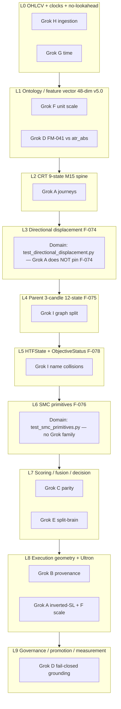

# Concatenated implementation plans — part 9 of 10

Source directory: `docs/implementation_plan/`
Files in this part: 16

## Contents

1. `the-largest-risk-you-nifty-allen.md` (8600 bytes)
2. `the-largest-risk-you-wondrous-muffin.md` (8982 bytes)
3. `the-largest-risk-you-woolly-wreath.md` (10439 bytes)
4. `the-strongest-assumption-i-purring-lampson.md` (9081 bytes)
5. `the-strongest-assumption-i-sparkling-piglet.md` (9343 bytes)
6. `the-strongest-assumption-is-wise-sifakis.md` (18679 bytes)
7. `the-strongest-thing-you-fluttering-kahn.md` (9099 bytes)
8. `there-are-3-excel-sharded-wombat.md` (27613 bytes)
9. `this-is-a-brilliant-kind-sphinx.md` (5573 bytes)
10. `this-is-actually-the-enumerated-island.md` (7770 bytes)
11. `three-sheets-137-data-partitioned-otter.md` (18535 bytes)
12. `topic-ladder-and-grok-test-intent-excel.md` (77079 bytes)
13. `trace-activemodesls-yaml-and-production-starry-robin.md` (13012 bytes)
14. `trace-gaussian-trained-model-purrfect-map.md` (13157 bytes)
15. `trace-zone-gate-trained-sprightly-perlis.md` (4727 bytes)
16. `trade-mining-system-crystalline-pearl.md` (7843 bytes)


================================================================================
SOURCE_FILE: docs/implementation_plan/the-largest-risk-you-nifty-allen.md
SOURCE_BYTES: 8600
PART: 9/10 FILE 1/16
================================================================================

# Plan — Reconcile + Measure Feature-Pipeline Lookahead (Option 1)

## Context

A long adversarial-design session proposed a "tiny BitNet swarm," narrowed it to one execution
model, then issued a **"FATAL center=True label-leakage — kill the model"** verdict and demanded a
repo-wide pipeline rewrite. Before acting, I verified every claim against the real code (3 Explore
sweeps). The verification **contradicts the FATAL framing** and reduces the actionable surface to a
small, evidence-first task. The user chose **Option 1: Reconcile + measure only** — no production
behavior change, no config-hash change.

### What verification established (ground truth)

| Claim in the audit | Reality in code | Verdict |
|---|---|---|
| `center=True` swing detection is FATAL leakage | Real (`feature_pipeline.py:343`), but the 2026-06-10 Backtest Trust Layer **already measured it** via the existing `TRUST_SWING_CAUSAL=1` toggle (`feature_pipeline.py:367-372`): 974/3000 swing flags shift yet BNBUSDT ledger is **byte-identical**, 0 edge inflation — the CRT entry path doesn't consume swing columns. Documented as finding **F1** in `docs/analysis/backtest-trust-audit-2026-06-10.md §4d`. | Adversarial "FATAL" is **DOC_DRIFT** vs validated evidence (CLAUDE.md §6.2). LIVE-UNSAFE flag still stands but is benign for backtest trade-generation. |
| Execution model is contaminated via `TradeRecord.features → dataset builder → tensor` | **No dataset builder reads `TradeRecord.features`.** Training (`scripts/training/train_trade_net_v2.py`) reads `opportunities_*.jsonl`. | Central contamination chain **does not exist**. |
| Need to design a BitNet.cpp execution successor | **TradeNet v2 already exists** (`src/training/trade_net_v2.py`): 3-head p_tp1/p_tp2/p_survives_be, already wired as a **soft `neural_fn`** (`make_neural_fn_v2`, `trainer.py:844`), not a hard gate. This is F-005 ("BUILT but unwired"). | Mostly rediscovery of existing artifacts. |
| (new, un-audited) `volatility_regime` global rank | Real: `atr_pct = df["atr_14"].rank(pct=True)` (`feature_pipeline.py:306`) — a **global** percentile (slice-length dependent), **not** trailing. It **is** consumed by an entry gate: `s05_grid.py:120` blocks LONG in TRENDING. F1 never covered this. | The **only genuinely new, decision-relevant** finding — worth measuring. |

**Authority-ladder note (CLAUDE.md §6.5):** these are *information*, not *authority*. This plan only
buys docs/research/measurement — it grants no production weight to anything. Production causal
conversion (Option 2) and TradeNet-v2 shadow-eval (Option 3) are **explicitly deferred**, gated on
Program B evidence.

## Scope — what this plan delivers

**Reconcile + measure only.** Three deliverables, in priority order. No `params`-block edit → **no
`_compute_hash.py` rehash**. All toggles default **OFF** (mirror `TRUST_SWING_CAUSAL`), so the active
config and live path are untouched. Run on the branch-active config per ORIENT_RUNTIME (CLAUDE.md
§4.0): `patch` → `v2_multi_2026_04`.

### Program A — Truth reconciliation (record the conflict; evidence wins)

1. **File finding F-029** in `docs/current-findings.md` mirroring the existing entry format
   (`### F-029 · …` with Type/Status/Confidence/Validated/Revalidate-by/Evidence/Supersedes/Reversal/
   Owner — see F-001 / F-028 as templates). Content: *feature-pipeline `center=True` swing lookahead
   is **benign for trade generation** (byte-identical ledger, BNBUSDT; extends trust-layer F1); the
   adversarial "FATAL" verdict is DOC_DRIFT against measured evidence. Carries an OPEN sub-thread:
   `volatility_regime` global-rank is decision-reachable (`s05_grid.py:120`) and **un-quantified** →
   Program B.* Status `VALIDATED`, Confidence `Likely` (BNBUSDT-only caveat), Evidence cites the
   trust-audit §4d + `feature_pipeline.py:306,343,367-372` + `s05_grid.py:120`.
2. **Add the F-029 row** to the CLAUDE.md §6.2 "Repository Truths Index" table (keeps
   `tests/test_current_findings.py::test_index_and_doc_agree_on_nonterminal_ids` green — every
   non-terminal finding must appear in both).
3. **Cross-link**, don't duplicate (§6.2 rule 1): add a one-line back-reference in the trust-audit
   doc's F1 section pointing to F-029, and note the adversarial thread as `SUPERSEDED`.

### Program B — Measure the `volatility_regime` global-rank (measure-only)

1. **Add a measure-only toggle** `TRUST_VOLREGIME_CAUSAL=1` in `feature_pipeline.py`
   `compute_volatility_regime` (the `:303-314` block), mirroring the `TRUST_SWING_CAUSAL` wrapper
   pattern at `:367-372`: when set, replace global `rank(pct=True)` with a **causal expanding/trailing**
   percentile (e.g. `expanding().rank(pct=True)` or a trailing-window rank). Default OFF → no hash
   change, no production/live effect.
2. **Run the WS4A-style A/B** on the active config: one baseline backtest, one with the env var set;
   reuse the existing measure-only flow (env-var + standard backtest harness, e.g.
   `scripts/analysis/session_sweep.py --instrument BNBUSDT` or the trust-audit driver) and compare
   ledgers. Verify byte-identity / quantify drift with `src/analytics/metrics_oracle.py` (`recompute`)
   and the determinism harness in `tests/runtime/test_replay_determinism.py`. Because
   `volatility_regime` is decision-reachable, expect this **may** change the ledger — that is the point.
3. **Record the result** by appending a short dated section to
   `docs/analysis/backtest-trust-audit-2026-06-10.md` (existing-doc-first) with the same metrics-table
   format as §4d, and update F-029's Evidence: byte-identical → confirm benign; changed → quantify Δ
   (trades / win-rate / PF / total-return) and flag it as a real slice-dependence to address before OOS.
4. **(Cheap strengthener)** Re-run the **existing** `TRUST_SWING_CAUSAL` F1 comparison cross-universe
   (ETH/BTC/SOL + one FX/metal) to retire the "single-instrument BNBUSDT" caveat on F1; fold the result
   into F-029's confidence.

### Deferred (NOT in this plan — gated on Program B evidence)

- **Option 2 — production causal conversion** of `center=True` / global-rank: only if Program B shows
  material decision drift. F1 currently shows ~0 ledger benefit; conversion forces rehash + repo-wide
  re-validation. Not justified yet.
- **Option 3 / Program C — TradeNet v2 shadow-eval** (F-005): separate, larger program; advisory-first
  per §6.5. Not started here.

## Files to modify

- `src/features/feature_pipeline.py` — add `TRUST_VOLREGIME_CAUSAL` measure-only toggle in
  `compute_volatility_regime` (`:303-314`), modeled on the `TRUST_SWING_CAUSAL` block (`:367-372`).
  **Reuse**, don't invent, the existing toggle idiom.
- `docs/current-findings.md` — add finding **F-029**.
- `CLAUDE.md` — add the F-029 row to the §6.2 Repository Truths Index.
- `docs/analysis/backtest-trust-audit-2026-06-10.md` — append the volatility_regime measurement
  section; add F1↔F-029 cross-reference.
- `assistant_project.md` — append the §6 `📝 SESSION LOG ENTRY` block (mandatory, every response).
- *(No new standalone docs; no `configs/` edits; no `_compute_hash.py` run.)*

## Verification

1. **Findings sync stays green:** `python -m pytest tests/test_current_findings.py -q` (proves F-029
   appears in both the living doc and the CLAUDE.md index).
2. **Toggle is inert by default (no production change):**
   `python -m pytest tests/runtime/test_replay_determinism.py tests/analytics/test_metrics_oracle_parity.py -q`
   must pass **with the env var unset** — confirms hash-neutral, behavior-neutral default.
3. **The measurement itself:** run the backtest twice (unset vs `TRUST_VOLREGIME_CAUSAL=1`) on the
   active config, diff the trade ledgers, and reconcile metrics via `metrics_oracle.recompute`. Capture
   the trades / win-rate / avg-RR / PF / max-DD / total-return table into the audit doc.
4. **Doctrine gate:** confirm no `configs/production/*` file changed and no hash recompute was needed
   (measure-only). Append the SESSION LOG entry with the `Belief Update / ROI / Goal` line.

## Success criteria

- F-029 filed and synced; the adversarial "FATAL center=True" claim is recorded as superseded
  DOC_DRIFT, not silently dropped (§6.2 rule 4: preserve history).
- `volatility_regime` global-rank effect is **measured** (byte-identical ⇒ benign like F1, or Δ
  quantified) — turning an unverified hunch into evidence.
- Zero production/config/hash change; all default-state gates green.
- Options 2 and 3 left explicitly parked with their reopen conditions stated.


================================================================================
SOURCE_FILE: docs/implementation_plan/the-largest-risk-you-wondrous-muffin.md
SOURCE_BYTES: 8982
PART: 9/10 FILE 2/16
================================================================================

# Plan: Cross-Sectional Relative-Value — Program 5 (evidence-first, zero architecture)

## Context

Four advisory LLMs converged (conf 9.2–9.8) on one thesis: *architecture is not the
bottleneck — evidence is*; stop building, pivot to a NEW payoff structure. Ground-truthing
that advice against the repo (this session) produced two corrections per §6.2:

1. **The thesis is already the repo's own position.** F-019→F-031 + the §6.5 Authority
   Ladder ("Authority ≠ architecture") + the Program-1 closure already say: the next-bar
   directional ontology on M15 crypto-majors is falsified across 4+ programs; pivot to a
   genuinely different axis, never parameter archaeology. The advisors re-derived this.
2. **Their top pick (perps / funding-carry / basis) is DATA-BLOCKED.** Verified: `data/`
   holds crypto **spot** OHLCV only (BTC/ETH/BNB/SOL/XRP/DOGE, ~70,081 M15 bars each,
   2024-05-22→2026-05-21, byte-aligned range) + H1/H4 resampled; FX/metals are a 30-day
   snapshot. **Zero** funding/OI/liquidations/perp/basis/options/L2. Building a perps domain
   layer now = architecture for data we don't have (the exact failure mode they warn against).

**Decision (user, this session):** posture = **evidence-first, zero architecture**; axis =
**cross-sectional relative-value**. This is the cheapest genuinely-new (non-directional,
market-neutral) payoff structure: rank the 6 existing spot coins each bar, long the top,
short the bottom, hold a fixed horizon, measure the net long-short spread. It needs **no new
data** and breaks cleanly from the falsified single-name directional paradigm — every prior
falsification was *per-instrument directional*; cross-sectional dispersion is an untested channel.

**Intended outcome:** one pre-registered, deterministic research program through the existing
qualification kernel, yielding a registered finding (F-032). A clean null is a *successful*
experiment (§6.1) — high knowledge-ROI, closes "did we ever test cross-sectional?".

**Guardrails honored:** isolated in `src/research/` (never the live spine; spine stays the
hardcoded CRT/Gaussian/Zone/RR 4-engine path); pure/deterministic/no-lookahead; pre-registered
BEFORE running (E-001 ritual); grants NO authority (§6.5 — a PROMOTE earns *tunability/research*,
not fusion/production weight). **Not in scope:** `FULL_BUILD_SPECIFICATION.md` (the 220h
domain-first migration), any engine→plugin reorg, any domain abstraction, perp data acquisition.

## Reuse (do not reinvent)

| Need | Reuse | Path |
|---|---|---|
| Permutation null (one-sided, seeded) | `permutation_p_value` | `src/research/qualification.py:94` |
| Multiple-testing correction | `benjamini_hochberg` | `src/research/qualification.py:131` |
| Chronological IS/OOS split discipline | `_split_is_oos` pattern | `src/research/qualification.py:79` |
| Net-of-cost haircut | `CostModel` / `DEFAULT_ROUND_TRIP_BPS` (12bps) | `src/research/costs.py:18` |
| Deterministic cost/exit provenance in artifact | `provenance_block` | `src/research/provenance.py` |
| Seeded determinism convention, sorted iteration | `HypothesisRunner` pattern | `src/research/runner.py:61` |
| Candle loading | `CandleLoader` | `runtime/backtest_v2.py` (via runner._load_candles) |
| Driver shape (cohort run + BH + report) | `qualify_majors.py` | `scripts/research/qualify_majors.py` |

**Why a new module, not a new `Hypothesis`:** the existing `Hypothesis.detect()` →
`forward_walk()` path is single-instrument SL/TP geometry. A market-neutral fixed-horizon
spread has no per-leg SL/TP and its statistical unit is *one spread return per rebalance*, not
a trade Outcome. Forcing it through `forward_walk` would be a contortion. We instead reuse the
**statistical** primitives above on a native panel.

## Implementation

### 1. Pre-registration FIRST (E-001 ritual — before any measurement)
`docs/research-readiness/program-5-cross-sectional-preregistration.md`. Declare, locked:
- **Universe:** the 6 spot coins, M15, inner-joined on timestamp.
- **Signals (small cohort — NOT a sweep; BH guards it):** `XS_MOM` (rank by trailing return
  over L bars; long top-k / short bottom-k), `XS_REV` (short-horizon reversal — long losers /
  short winners), optionally `XS_VOL` (low-recent-vol long). 2–3 signals × at most 2 (L,H)
  settings each.
- **Controls (gate-4 must beat the WINNING control):** `random_selection` (seeded random
  k/k each side), `reversed_signal` (sign-flip — sign-noise guard), `long_only_beta` (is the
  spread just market beta?), `shuffled_rank` (destroy the ordering).
- **Gates:** reuse the 7-gate logic — n≥min, E_net>0, PF, beats-winning-control, IS&OOS>0 +
  retention, permutation p≤α, BH across the cohort. OOS = last 30% chronological.
- **Cost:** non-overlapping holds (rebalance every H bars ⇒ independent observations, full
  turnover); net spread = gross − 2·(12bps/1e4) per rebalance (each leg round-trips).
- **The 6 epistemic-integrity questions** (CLAUDE.md §6.2 ritual) answered for the headline claim.

### 2. Core module — `src/research/cross_sectional.py` (pure, stdlib + research-internal only)
- **Panel loader:** load each coin via the proven loader, inner-join on timestamp → aligned
  `dict[ts → {symbol: Candle}]`; assert equal length / no gaps (crypto is 24/7, range already
  verified identical).
- **Signal fns:** `xs_momentum(panel, t, L)`, `xs_reversal`, `xs_vol` → per-bar ranking using
  ONLY data ≤ t (no-lookahead invariant).
- **Portfolio former:** top-k long / bottom-k short, equal-weight, market-neutral.
- **Forward spread:** hold H bars (t+1…t+H), `mean(long fwd ret) − mean(short fwd ret)`, minus
  turnover cost → one net observation per non-overlapping rebalance.
- **Qualify fn:** assemble the net-return series per signal + each control; IS/OOS split;
  `permutation_p_value` vs winning control; assemble cohort p-values; `benjamini_hochberg`;
  emit verdict (PROMOTE / REJECT / INSUFFICIENT) in an EdgeReport-shaped dict.
- **Serialization:** deterministic, no wall-clock, `provenance_block` stamped — byte-comparable.

### 3. Driver — `scripts/research/qualify_cross_sectional.py`
Mirrors `qualify_majors.py`: build panel → run each signal + controls → gate → BH cohort →
write deterministic `results/research/cross_sectional_report.json` + human summary. `argparse`
thin wrapper (no business logic in the script, per §3.3).

### 4. Tests — `tests/research/test_cross_sectional.py`
- **Determinism:** two runs ⇒ byte-identical report (the kernel's load-bearing property).
- **No-lookahead:** signal at t independent of any data > t; hold uses strictly future bars.
- **Panel alignment:** join correctness; mismatched-length / gap ⇒ raise (fail-fast).
- **Control sanity:** `reversed_signal` E = −(signal E) within tolerance; `random_selection`
  E ≈ 0; market-neutral weights sum to 0.
- **Cost monotonicity:** higher bps ⇒ lower net E.

### 5. Register the finding (same turn as the run — Findings Mandate §6.2)
- Add **F-032** to `docs/current-findings.md` (Validated/Revalidate-by, non-empty Evidence =
  the report path + n + E_net + verdict, Confidence, Reversal if it overturns a prior belief).
- Add the F-032 row to the **Repository Truths Index** table in `CLAUDE.md §6.2` (the table is
  enforced ↔ the living doc by `tests/test_current_findings.py` — both or neither).
- Write a memory file `project_cross_sectional_program5.md` + index line in `MEMORY.md`.
- Run `Validate` (pytest per `docs/reference/testing.md` + the determinism check).
- Append the §7.4 SESSION LOG block to `assistant_project.md` (codebase log — this is governed code).

## Verification (end-to-end)

1. `python -m pytest tests/research/test_cross_sectional.py -q` → all green (determinism,
   no-lookahead, control sanity, cost monotonicity).
2. `python scripts/research/qualify_cross_sectional.py` twice → `diff` the two
   `cross_sectional_report.json` ⇒ byte-identical (determinism gate).
3. Inspect the report: per-signal n, E_net (IS/OOS), PF, baseline_delta vs winning control,
   permutation p, BH survivors, verdict. Confirm controls behave (reversed ≈ −signal,
   random ≈ 0).
4. `python -m pytest tests/test_current_findings.py tests/governance/test_epistemic_invariants.py -q`
   → F-032 index↔doc consistent + epistemic invariants hold.
5. Whole-suite smoke (no spine/trust regressions): the live spine files are untouched, so
   `tests/` spine/trust domains stay green (the change is additive under `src/research/`).

## Outcome interpretation (pre-committed, per Authority Ladder §6.5)
- **PROMOTE:** *information exists* → justifies docs/research/shadow measurement only; does
  NOT auto-earn fusion/sizing/production weight (that needs a measured ΔG001 consumer).
- **REJECT / INSUFFICIENT (likely, given F-019→F-031):** a clean null — register it, mark the
  cross-sectional channel tested, redirect. Either way the experiment succeeds.


================================================================================
SOURCE_FILE: docs/implementation_plan/the-largest-risk-you-woolly-wreath.md
SOURCE_BYTES: 10439
PART: 9/10 FILE 3/16
================================================================================

# Plan — Program 2 / Phase E1: trap-continuation asymmetry (structural-event population, BNBUSDT)

## Context — why this work

Program 1 (next-bar directional ontology) is **KILLED**; reopening requires a **new ontology**. The
user opens **Program 2 = conditional/structural asymmetry**, and its leading branch is the one most
aligned with the CRT architecture: **Sweep → rejection → displacement → retest → continuation.** This
is a genuinely new label space (CRT *structural state*, not candle partitions) — the one conditioning
axis F-020 never tested (F-020 used candle session×vol×momentum; F-021/F-024 measured only the ~13
*executed* retests). **No one has measured the FULL sweep→retest event population's forward asymmetry,
conditioned on structural stage × regime.**

**Honest prior: null-leaning.** F-024 found MFE≈MAE on executed retests; the in-repo momentum study
(`bnbusdt_momentum_continuation_report.md`) found MFE/MAE≈1. So the study earns **one rigorous
measurement**, with the guards that made Program-1's nulls trustworthy (matched control + stratified
permutation + OOS + measure-only). **Two corrections baked in:** (a) the pure-retest population is
small (~44 on BNB, funnel-choked at DISP→EXPANSION per F-015), so we measure the **full structural
progression** (sweep/displacement/expansion/retest) where the early stages carry the power, testing
*does asymmetry grow as the trap completes?*; (b) the **pullback branch is deferred** — the user's
"RSI≈48 winners" premise contradicts the artifact (it reports winners RSI≈69), so no pullback work
until that's reconciled. Measure-only, **BNBUSDT-first**; cross-instrument confirm only if BNB leads.

## What already exists (reuse — ~90% per the audit)

- **Structural events + telemetry** — `crt_engine_v2.py`: `CRTState` machine (SWEEP→DISPLACEMENT→
  EXPANSION→RETEST), `RangeDetector.detect_sweep` (with `crt_sweep_taxonomy`), `try_*` transitions,
  the always-on `EXPANSION_RETRACE_CHECK` telemetry (`on_expansion_ended`) and the S0-wired
  `RETEST_REPLAY` (`on_retest_replay`). A backtest writes `{INSTR}_events.jsonl` (STATE_TRANSITION
  stream w/ direction + geometry) + `{INSTR}_crt_telemetry.jsonl` — both deterministic, harvestable
  post-hoc **without re-running the engine inline**.
- **Harvest pattern** — `research.adapters.spine_signal_source.ProductionSpineSource` (runs one
  deterministic `BacktestRunner`, parses an artifact by research index = `candle_idx − 1`). Mirror it.
- **Asymmetry measurement (100% reuse)** — `research.measurement.forward_walk.horizon_excursion`
  (exit-agnostic `mfe_r`, `mae_r`, `favorable_first`, `reached_{0.5,1,1.5,2,3}r`, `bars_to_first_1r`).
- **Significance (reuse)** — `research.selection_effect.stratified_permutation_p` + `seed_for`;
  `conditional_entropy_grid.{vol_terciles,vol_label,hour_to_session}` for conditioning labels.
- **Regime (reuse)** — `regime.regime_classifier.RegimeClassifier.classify` (threshold, deterministic);
  candle-only `volatility_ratio`/`range_size`; HTF-alignment harvested from telemetry metadata.
- **Data** — `runtime.backtest_v2.CandleLoader`.
- **Must-build (light, ~200 lines):** the structural-event harvester + the asymmetry/control core.

## Approach (measure-only, deterministic)

### E1.0 — Harvest the structural-event population (one BNB backtest)
Mirror `ProductionSpineSource`: run one deterministic BNBUSDT backtest (`prod_version=v2_multi_2026_04`),
then parse:
- `{BNBUSDT}_events.jsonl` → every `STATE_TRANSITION` into SWEEP / DISPLACEMENT / EXPANSION / RETEST,
  with `candle_index`, **continuation direction** (the trade/reversal direction the structure implies),
  entry≈event-candle close, geometry (disp_low/high, sweep_type).
- `{BNBUSDT}_crt_telemetry.jsonl` → `RETEST_REPLAY` (entry/direction/atr/disp/score) +
  `EXPANSION_RETRACE_CHECK` (max_depth, time_to_max, ended_by, shadow_used, HTF-alignment).
Emit a `StructuralEvent` list keyed by research index: `(stage, entry_index, entry, continuation_dir,
atr, regime/HTF/disp_strength features)`. Report the **funnel counts** per stage (sweep ≫ displacement
≫ expansion ≫ retest≈44) so power is explicit.

### E1.1 — Forward asymmetry per stage (exit-agnostic)
For each event, `horizon_excursion(signal_in_continuation_dir, candles[i+1:i+1+max_forward])` →
`mfe_r, mae_r, favorable_first, reached_kR`. Per **stage**: `E[mfe_r]`, `E[mae_r]`,
**asymmetry = E[mfe_r] − E[mae_r]**, `favorable_first_rate`, `n`. The core question: **does asymmetry
increase monotonically sweep → displacement → expansion → retest** (trap completing)?

### E1.2 — Matched control (the falsification baseline)
For each stage, draw the same N **random-bar entries** (matched continuation-direction distribution,
seeded) → baseline asymmetry. A real structural effect must **beat its control** (expect control
asymmetry ≈ 0, favorable_first ≈ 0.5).

### E1.3 — Conditioning (only on the populous stages)
Stratify SWEEP/DISPLACEMENT/EXPANSION by **regime** (vol-tercile · HTF-alignment · displacement-strength
tercile) → per-cell asymmetry vs control. Does asymmetry emerge in a *conditional* cell that the
unconditional average hides? (The F-020 lesson, applied to structural state.)

### E1.4 — Significance + OOS (strict bar)
Stratified/bootstrap permutation (shuffle structural-vs-control labels, recompute asymmetry, seeded)
+ chronological **70/30 OOS**. A **continuation-asymmetry pocket** requires: asymmetry **> control**,
**permutation-significant**, **OOS-sign-stable**, and `favorable_first > 0.5 + floor`. **Doctrine: a
pocket is a PRE-REGISTERED OOS CANDIDATE for E2 (a tradeable rule), never an edge.** If null across
stages + cells → the structural pipeline adds no directional asymmetry (strengthens Program-1 at the
structural level), and E2 is NOT entered.

### New files (additive, isolated, deterministic)
- `src/research/structural_asymmetry.py` — pure core: per-(stage, cell) asymmetry + favorable_first +
  control + stratified-permutation + OOS + the pocket verdict (reuses `horizon_excursion` + the
  `selection_effect` permutation pattern).
- `src/research/adapters/structural_event_source.py` — harvester (mirror `ProductionSpineSource`):
  one backtest → `events.jsonl` + `crt_telemetry.jsonl` → `StructuralEvent` list.
- `scripts/research/phase_e_structural_asymmetry.py` — driver: harvest BNB → measure per stage +
  conditional vs control → deterministic JSON + markdown (funnel counts + asymmetry table + verdict).
- `configs/research/research_config_phase_e.json` — BNBUSDT, prod_version, max_forward, conditioning
  knobs, n_permutations, oos_split, control seed, favorable_first floor. No magic numbers in Python.
- `tests/research/test_structural_asymmetry.py` — determinism; **planted-asymmetry recovery** (a
  synthetic event set with real forward asymmetry MUST surface — harness validity, makes a null
  trustworthy); **control calibration** (random entries → asymmetry≈0 / favorable_first≈0.5); OOS split.

### Record (doc-first — finding only AFTER results)
`docs/analysis/structural-asymmetry-bnbusdt-2026-06-13.md` first; then the next finding (likely "no
continuation asymmetry beyond control at any structural stage/regime on BNBUSDT M15 — the trap pipeline
adds no directional asymmetry" OR "asymmetry pocket at stage/cell X"); a **Funding-Ledger `Program 2 —
RESEARCH` entry** (opening the new ontology, citing the new finding); memory + `MEMORY.md` pointer;
SESSION LOG.

## Critical files

| Action | Path |
|---|---|
| **New** core | `src/research/structural_asymmetry.py` |
| **New** harvester | `src/research/adapters/structural_event_source.py` |
| **New** driver | `scripts/research/phase_e_structural_asymmetry.py` |
| **New** config | `configs/research/research_config_phase_e.json` |
| **New** tests | `tests/research/test_structural_asymmetry.py` |
| **New** analysis doc | `docs/analysis/structural-asymmetry-bnbusdt-2026-06-13.md` |
| Reuse (no edits) | `adapters/spine_signal_source.py` (pattern), `measurement/forward_walk.horizon_excursion`, `selection_effect`, `conditional_entropy_grid`, `regime/regime_classifier.py`, `runtime.backtest_v2.CandleLoader`, the S0 RETEST_REPLAY + EXPANSION_RETRACE_CHECK telemetry |
| Update (records) | `docs/current-findings.md` (finding + Program-2 ledger entry), `CLAUDE.md` index, `MEMORY.md` + memory |

## Out of scope (deferred)
- **E2 tradeable continuation rule** — gated on an E1 asymmetry pocket; not built here.
- **Pullback branch** — premise (RSI≈48 winners) contradicts the artifact (RSI≈69); reconcile first.
- Compression-breakout / conditional-momentum branches; crypto-6 (confirm-gate only if BNB leads).
- No spine/config/ACTIVE_VERSION/promotion changes, no live, no Program-1 reopen.

## Verification
1. **Unit tests:** `pytest tests/research/test_structural_asymmetry.py` — determinism, planted-asymmetry
   recovery, control calibration (favorable_first≈0.5), OOS split.
2. **Sanity:** stage funnel counts match the backtest (retest≈44, sweep≫retest); control asymmetry≈0;
   the unconditional retest asymmetry reproduces the F-024 MFE≈MAE picture.
3. **Driver runs:** `python scripts/research/phase_e_structural_asymmetry.py` → per-stage + conditional
   asymmetry vs control + verdict; deterministic JSON.
4. **Determinism gate:** run twice; JSON body byte-identical.
5. **Findings contract (after doc + finding + ledger):** `pytest tests/test_current_findings.py` green.
6. **No collateral:** `pytest tests/research` green; `git diff --stat` shows only new files + the
   records edits; ACTIVE_VERSION / configs / spine untouched.

## Done =
A reproducible, deterministic **structural-asymmetry map** for BNBUSDT — forward continuation-asymmetry
(MFE/MAE, favorable_first) across the sweep→displacement→expansion→retest progression and within
regime/HTF cells, each vs a matched control, with stratified permutation + OOS. If a cell clears the
strict bar (> control, significant, OOS-stable) → a pre-registered OOS candidate for E2 (gated) + a
cross-instrument confirm. If null (the likely outcome) → the CRT structural pipeline adds **no
directional continuation asymmetry** on BNBUSDT M15 — extending Program-1's conclusion to the
structural-state axis, and Program 2 pivots to a different frontier (target/horizon/asset/objective).


================================================================================
SOURCE_FILE: docs/implementation_plan/the-strongest-assumption-i-purring-lampson.md
SOURCE_BYTES: 9081
PART: 9/10 FILE 4/16
================================================================================

# Program 3 — Higher-Timeframe Directional Ontology (H1/H4 resampler + M4 gate)

## Context

A user critique ("Phase 7 — Belief Falsification Audit") challenged the assumption that the
trading paradigm is dead, arguing the conclusion rests on a narrow envelope: BNBUSDT/crypto-majors
**M15** only. The critique is epistemically correct **and already partly encoded** in the repo —
Program 1 is `KILLED` *only* for "next-bar direction · M15 · crypto-majors" with an explicit
**untouched frontier** (FX/equities/commodities · H1/H4/D · non-directional targets) recorded as the
sanctioned reopen path ([program-1-closure-2026-06-13.md:69-86](docs/analysis/program-1-closure-2026-06-13.md);
Funding Ledger reopen conditions, [current-findings.md:432](docs/current-findings.md)).

Three of the critique's *specific* claims conflict with the living record and must NOT be encoded
as new "unknowns" (CLAUDE.md §6.2 rule 3 — never silently resolve a conflict):

| Critique claim | Record (authoritative) | Disposition |
|---|---|---|
| F-021 "+ASIA edge found, rejected only by governance" → INCONCLUSIVE | Those are STALE close-only/in-sample numbers; under intrabar_touch+70/30 OOS V2 flips negative, no challenger clears retention≥0.70+G1; ΔE is *entirely* the (incumbent) session filter (F-017, F-021) | **Stale** — failed OOS statistically, not just policy |
| "No Hurst/autocorrelation in repo" (Unanswered Q#4) | Already measured: H_atr=0.885, H_returns=0.527, ARCH-LM reject (F-020 / `process_diagnostics.py`) | **Already answered** |
| "Widen stop to 2.5 ATR — untested" (Exit Q#3) | F-025 ran full 42-cell SL{0.5–3.0}×TP{1.0–5.0}; best 3.0×5.0 still E_oos −0.27; re-running is named "archaeology, out-of-bounds" | **Answered + forbidden** |

**Decision (user, this session):** the highest-value untouched axis to attack first is **timeframe**
(the "M15 is too noisy" hypothesis), via an **H1/H4 resampler**, pre-registered as a NEW ontology
(**Program 3**) — not a parameter pass on Program 1. Exit/cost is off the table (falsified +
out-of-bounds). Docs fold into the existing truth system (one scannable matrix), not 3 new root docs.

**Intended outcome:** a deterministic M15→H1/H4 OHLCV resampler + a pre-registered HTF qualification
run through the *existing* M4 gate, yielding either a genuine HTF lead (→ F-010-style follow-up) or a
clean, in-scope falsification (→ new F-id + Program 3 verdict). Either way the "paradigm vs envelope"
question gets a real answer instead of an assumption.

## Doctrine guardrails (must hold)
- **New ontology, not archaeology.** Different *horizon* = a separate program per Program 1 reopen
  conditions. Pre-register BEFORE running (hypothesis, universe, truth standard, advance/kill criteria).
- **Governing truth standard reused verbatim:** `forward_walk(intrabar_fixed)` + `CostModel` 12bps +
  IS / 70-30 OOS + BH — via the existing `research.qualification` core. Add NO new statistics.
- **Additive + isolated to `src/research/` + `scripts/research/` + `configs/research/`.** No edits to
  `runner.py`, `forward_walk.py`, `qualification.py`, or any live-spine module.
- **Determinism is the headline property** (matches the edge_report discipline): byte-identical
  re-runs for both the resampled CSVs and the qualify JSON body (no wall-clock in content).

## Build (all additive)

### 1. `src/research/resample.py` — deterministic OHLCV resampler
- Pure function `resample(candles: list[Candle], rule: str) -> list[Candle]` for `rule in {"H1","H4"}`.
- **Calendar-boundary bucketing** (deterministic, gap/weekend-safe): bucket key = timestamp floored to
  the hour (H1) / 4-hour boundary aligned to 00:00 UTC (H4). Aggregate children: `open=first.open`,
  `high=max(high)`, `low=min(low)`, `close=last.close`, `volume=sum`, `timestamp=bucket start`,
  reindex `index` to stream position. Reuses the `Candle` dataclass
  ([crt_engine_v2.py:95](src/config_layer/crt_engine_v2.py)).
- **Causality:** emit a bucket only after it closes (next bucket's first child arrives); **drop the
  trailing partial bucket**. No lookahead is introduced — downstream `forward_walk` keeps its own
  no-lookahead guard on the resampled stream.
- CSV writer emitting the canonical OHLCV schema that `CandleLoader` re-reads (timestamp/open/high/
  low/close/volume), so the rest of the harness consumes resampled files with zero changes.

### 2. `scripts/research/build_resampled_data.py` — thin CLI
- Read each crypto-major M15 CSV via the proven `CandleLoader` ([backtest_v2.py:626](src/runtime/backtest_v2.py)),
  call `resample`, write `data/resampled/{INST}_{TF}.csv`. Sorted iteration, no wall-clock in content.
- Scope: `BNBUSDT, ETHUSDT, BTCUSDT, SOLUSDT` (same majors as qualify_majors), TF ∈ {H1, H4}.

### 3. `configs/research/research_config_htf_majors.json` + `research_config_spine_htf_majors.json`
- Copies of `research_config_majors.json` / `research_config_spine_majors.json` repointed at
  `data/resampled` with pattern `*_{TF}.csv`. **Horizon pre-registration choice (documented in the
  config + Program 3 note):** keep harness `warmup/window_size/max_forward` in **bars** (each timeframe
  is its own world; ATR and bar-relative horizon scale naturally) — the standard ontology test. The
  wall-clock implication (40 H1 bars = 40h vs 10h at M15) is recorded explicitly so it is a *chosen*,
  not accidental, parameter. Default chosen: **bar-count-constant**.

### 4. `scripts/research/qualify_htf.py` — thin HTF qualification driver
- Mirror `qualify_majors.py` structure ([qualify_majors.py](scripts/research/qualify_majors.py)),
  reusing `research.qualification` (`evaluate_pre_bh`/`benjamini_hochberg`/`finalize`) and
  `HypothesisRunner` **verbatim** — re-scope over the resampled universe per TF. No new stats, no
  promotion, no spine/config edits. Deterministic JSON body + separate wall-clock manifest, exactly
  like qualify_majors. (Keep qualify_majors.py untouched; this is a sibling driver, not a refactor.)

## Pre-registration (doctrine-required, BEFORE running)
- Add **"Program 3: Higher-Timeframe Directional Ontology" = RESEARCH** to the Funding Ledger in
  [docs/current-findings.md](docs/current-findings.md) with the hypothesis, universe (crypto-majors
  H1/H4), governing truth standard, advance/kill criteria (PROMOTE survives M4 gates 1–7 + BH IS&OOS,
  else in-scope falsification), and an explicit "this is a NEW horizon ontology, not a Program-1
  parameter pass" clause.

## Docs — fold into existing system (NOT 3 new root docs)
- Add ONE scannable **"Research Envelope / Scope Matrix"** — single section in
  [docs/current-findings.md](docs/current-findings.md) (the living authority; §6.2 rule 1/5
  doc-minimization) or one linked `docs/research-envelope.md`. Columns: finding (F-019…F-026) ×
  {universe, timeframe, exit, cost, N, OOS tested} → SCOPE STATUS
  `FALSIFIED-IN-SCOPE` / `ALREADY-ANSWERED` / `UNTESTED-FRONTIER`. Uses the repo's *correct* values —
  marks conditional-direction, Hurst, and exit/cost as ALREADY-ANSWERED (closing the critique's three
  stale "unknowns"); marks timeframe + non-crypto universe as UNTESTED-FRONTIER (Program 3 attacks the
  first). This IS the additive "belief falsification" structure, minus the duplication of the existing
  Reversal/Reopen fields.

## Run + record (same turn as the run)
1. `python scripts/research/build_resampled_data.py` → `data/resampled/*.csv` (verify byte-identical re-run).
2. `python scripts/research/qualify_htf.py --tf H1` and `--tf H4` → `results/research/qualification_htf/`.
3. Record the verdict: a new **F-id** (HTF falsification, if null) or an F-010-class lead (if a cell
   PROMOTEs), and flip the Funding Ledger Program 3 status — in the **same turn** per §6.2 Findings Mandate.

## Verification
- **Resampler unit tests** (`tests/research/test_resample.py`): golden small fixture (hand-computed
  M15→H1 bucket), determinism/idempotence (byte-identical re-run), boundary + intra-hour-gap handling,
  trailing-partial-bucket drop, OHLC invariants (bucket high = max children high, low = min, open=first,
  close=last; H≥max(O,C), L≤min(O,C)).
- **Determinism gate:** qualify_htf JSON body byte-identical across two runs (edge_report discipline).
- **No regression:** full suite stays green — the change is additive; runner/forward_walk/qualification
  untouched. Run `pytest` per [docs/reference/testing.md](docs/reference/testing.md), plus the spine +
  Backtest Trust Layer subset to confirm GREEN is preserved.
- **End-to-end sanity:** confirm resampled bar counts ≈ M15_count/4 (H1) and /16 (H4) per instrument,
  and that the HTF run produces non-empty per-instrument + pooled reports.

## Out of scope (explicit)
- No exit/cost grids, TP-ratio/trailing/session sweeps, score-threshold or entropy re-runs (Program 1
  archaeology, forbidden).
- No FX/equities universe yet (the *other* untouched axis — deferred; revisit after the H1/H4 verdict).
- No live-spine, promotion, or config-version changes; measure-only research.


================================================================================
SOURCE_FILE: docs/implementation_plan/the-strongest-assumption-i-sparkling-piglet.md
SOURCE_BYTES: 9343
PART: 9/10 FILE 5/16
================================================================================

# Intelligence Compounding Doctrine — Integration Plan

## Context

The user's north star for Tradelatest is **zero intelligence loss + continuous intelligence
compounding** — the repository as a self-describing *intelligence substrate*, not a pile of
Python files. The concrete, freezable ask underneath the essay: codify an **Intelligence
Compounding Doctrine** into the operating manual, and make it *operational* (run every turn)
rather than aspirational prose that gets ignored.

The doctrine's core claim: tool outputs / artifacts are **not** intelligence. They become
intelligence only when their *meaning, purpose, ROI toward the user's economic goals, and the
belief change they produce* are captured and preserved. Modules are "frozen thoughts"; the
true loss is losing **why** something exists and how it compounds long-term wealth.

This is doc-only and additive. It complements — does not replace — the §6 Persistent Logging
Mandate. The user explicitly warned against premature heavy frameworks (graph DB / ontology /
vector DB / n8n); this is the **Stage-1 markdown-checklist** step on that evolution path.

### Decisions locked (via AskUserQuestion)
- **Footprint:** condensed doctrine inline in `CLAUDE.md` + full long-form companion doc.
- **Operationalize:** add a `Belief Update / ROI` line to the SESSION LOG block **and** a
  rule that durable belief changes are written as memory files (tying into the auto-memory
  substrate so beliefs persist across sessions, not just within one session log).

### On-disk facts that shape placement
- `CLAUDE.md` runs **§6 → §7 directly**; there is **no §6.1** on the `patch` branch. (Memory
  references a "§6.1 Topic Sync Mandate" — that is from another branch and is *absent here*.)
- §7, §8, §12 are cross-referenced **by number** inside the file, so a renumber is costly →
  insert as **§6.1** to avoid touching them. Flag: if Topic Sync §6.1 later merges in, one of
  the two renumbers to §6.2.
- `CLAUDE.md` is deliberately terse with token-control rules (§8) and offloads detail to
  companion docs via the §2 doc-map table → condensed inline, full text in a companion doc.
- The `📝 SESSION LOG ENTRY` block (defined in §7.4, mandated in §6) is the **one mechanism
  that already fires every response** — the correct, no-new-framework place to operationalize.

---

## Changes

### 1. `CLAUDE.md` — insert condensed doctrine as new §6.1 (after §6, before §7)

Insert immediately after line 118 (end of §6 bullets) / before the `---` at line 120. Keep it
terse to honor §8. Target ~25 lines:

```markdown
## 6.1 Intelligence Compounding Doctrine (non-optional)

> Complements §6. The repository's purpose is **zero intelligence loss + continuous
> compounding**, not file preservation. Full long-form: [`docs/architecture/intelligence-compounding.md`](docs/architecture/intelligence-compounding.md).

**Intelligence ≠ information.** Intelligence is a *persistent change in beliefs that improves
future decisions toward the user's long-term (economic) goals.* Data, logs, artifacts, and
tool outputs are **not** intelligence until their meaning + ROI + belief-impact are captured.

**Meaning over data.** Never treat a tool output as an isolated fact. Interpret every artifact
through: `Artifact → Purpose → User Intent → Goal Contribution → ROI → Belief Update`.
`Tool output → Memory` (raw) is forbidden; the path is `Tool → Output → ROI eval → Belief
update → Memory`.

**Modules are frozen thoughts.** Understanding *what* code does is insufficient; reverse to
*why it exists* — `Module → Purpose → User Thought → Economic Meaning → Long-Term Value`. The
true intelligence loss is losing the economic *why*, not the recoverable code.

**Per-result ROI check.** After a consequential tool result, ask: (1) which goal did this
serve? (2) did it move the probability of that goal? (3) what belief changed? (4) what should
stop being explored? (5) what next? A null/negative financial result with a clear conclusion
(e.g. "EMA gate non-binding, stop optimizing it") is **high knowledge-ROI** — preserve it.

**Operational hook:** every response's SESSION LOG carries a `Belief Update / ROI` line
(§7.4). Durable belief changes (confirmed/invalidated hypotheses, dead ends, economic meaning,
confidence shifts) are saved as a **memory file** (`feedback`/`project` type) per the Memory
mandate — not left only in the session log. The enemy is fragmented meaning, not missing data.
```

### 2. `CLAUDE.md` §7.4 — extend the SESSION LOG block (operational hook)

Add one field to the canonical block at lines 139–148 (and mirror the wording in §6 if a
sample block is shown there). New field, inserted after `Decision/Output`:

```
Belief Update / ROI: {what belief changed + toward which goal; "none" if pure mechanics}
```

The block becomes Date / Topic / Decision-Output / **Belief Update-ROI** / Open Questions /
Next Step. This is the minimal Stage-1 mechanism — no new framework, reuses the existing
every-turn ritual.

### 3. New companion doc: `docs/architecture/intelligence-compounding.md`

Holds the **full long-form** doctrine the user authored, lightly structured to match the
`docs/architecture/` house style (kebab-case filename, matching the repo's renamed-doc
convention visible in git status). Sections to include verbatim/condensed from the essay:

- **One Goal** — zero intelligence loss + continuous compounding; intelligence = Information ×
  Utility (ROI toward a goal).
- **The chain** — `Artifact → Purpose → User Intent → Goal → Economic Value → ROI → Belief
  Update → Future Decisions` (the diagrams).
- **Three permanent checklists** — User: `Think → Decide → Review`; Claude: `Extract → Align →
  Compound`; System: `Capture → Preserve → Reuse`. Plus the Artifact checklist (Metadata /
  Logic / Governance status `Loose|Forming|Frozen|Killed`, confidence `Certain|Likely|
  Possible|Speculative`).
- **7-level intelligence ladder** — what / why / which user thought / which goal / economic
  value / belief to update / how future decisions change.
- **Memory Rule** — remember meaning + purpose + ROI + assumptions + belief updates, never
  artifacts alone. Ties to `C:\Users\Hi\.claude\projects\D--Tradelatest\memory\`.
- **Evolution path** — Stage 1 markdown checklists (today) → … → Stage 7 Unified Intelligence
  Substrate; with the explicit "do not build ontology/graph-DB/n8n early" guardrail.
- **Weekly Alignment Sweep** checklist (code orphans / dead configs / split-brains / event
  lineage / doc drift / new canonical truths) — note it as *aspirational future*, not a
  current mandate, so it doesn't silently become an unmet obligation.

### 4. Register the companion doc (discoverability)

- Add a row to the **§2 doc-map table** in `CLAUDE.md` (the table ending ~line 30, before the
  `assistant_project.md` row) pointing to `docs/architecture/intelligence-compounding.md` with
  a one-line "Covers" blurb.
- Add the same doc to the **README docs map** (the 4-tier map referenced in `README.md`) under
  the architecture tier, consistent with how `goal.md` / `trigger-vocabulary.md` are listed.

---

## Files to modify

| File | Change |
| --- | --- |
| `CLAUDE.md` | New §6.1 (condensed doctrine); §7.4 SESSION LOG block +1 field; §2 table row |
| `docs/architecture/intelligence-compounding.md` | **New** — full long-form doctrine + 3 checklists + evolution path |
| `README.md` | One row in the docs map under the architecture tier |

No code, config, or hash changes. Nothing touches `src/`, production JSON, or governance — so
no re-hash, no promotion, no `ConfigValidator` involvement.

---

## Verification

Doc-only, so verification is consistency + the operational hook, not pytest:

1. **Numbering integrity** — confirm `CLAUDE.md` reads §6 → §6.1 → §7 with no broken
   `per §7` / `§8` / `§12` cross-references (grep for `§7`, `§8`, `§12`, `§6` mentions).
2. **Link resolves** — `docs/architecture/intelligence-compounding.md` exists and both the §2
   table link and the README map link point to it (relative paths valid).
3. **SESSION LOG hook live** — the very next response (this plan's own log entry, and every
   one after) includes the new `Belief Update / ROI` line, proving the mechanism fires.
4. **Memory-save rule exercised** — a durable belief from this work is written as a memory
   file with an index line in `MEMORY.md` (e.g. a `project`-type note recording that the
   Intelligence Compounding Doctrine was frozen, and *why* — meaning, not just the artifact).
5. **No convention break** — doctrine introduces no new pattern in `src/`, adds no magic
   numbers, skips no gate; it is advisory orchestration only (consistent with §12 trigger
   doctrine that triggers grant no new authority).

---

## Open flags (non-blocking)

- **§6.1 collision risk** with the off-branch "Topic Sync Mandate §6.1" — if that ever merges
  into `patch`, renumber one to §6.2. Called out so it's a known, not a surprise.
- The Weekly Alignment Sweep is documented as **future intent**, not a new per-response
  mandate — adding it as a hard obligation now would itself create the "complicated framework
  too early" failure mode the user named.


================================================================================
SOURCE_FILE: docs/implementation_plan/the-strongest-assumption-is-wise-sifakis.md
SOURCE_BYTES: 18679
PART: 9/10 FILE 6/16
================================================================================

# Discovery-First Program — Phenomena → Ontology → Engines

## Context

An external model proposed a 10-engine layered architecture. Two revisions later, the frame is
**discovery-first**: no engine is defined by name in advance. Discovery runs, phenomena are found,
independence is measured, semantics are assigned, an ontology entry is registered, and an engine is
born **only** when a phenomenon owns a distinct problem. The engine is the *last* artifact, not the
goal of the experiment.

This is also better-governed than engine-first: the Funding Ledger requires a **new ontology** to
reopen a killed axis, and a *discovered* decomposition is a new ontology, where "Trap Engine" is the
old one renamed.

### Findings that shaped the design (all verified at source this session)

**(1) The observation space is not clean — decisive for discovery specifically.** F-051:
centered-swing binding is non-PIT, contaminating **10 of 38 canonical dims**, `differ_rate ≈ 0.635`.
Discovery *amplifies* leakage: hypothesis testing is protected by a pre-registered target;
unsupervised structure search has none and will preferentially select leaking dims. FC1-A
(implemented 2026-07-11) provides a causal binding, making this tractable — and exploitable (A2).

**(2) GPU is unnecessary and unavailable.** 70,081 M15 rows/instrument; 6 crypto × 38 dims ≈ 16M
floats. Verified: **no torch, no CUDA, no faiss**. Present: sklearn 1.8.0 (incl. `HDBSCAN`,
`mutual_info_classif`), numpy 2.4.4, scipy. GPU leaves the critical path.

**(3) Phase A has two prior runs.** F-023 clustered this exact space (k=4): distinct anatomy, all
`win ≈ 0.34`, `mean_R ≈ 0` — shape, not expectancy. IC-003B attempted representation change for
compressible structure: `k*` unstable, "stop chasing shape libraries."

**(4) `reality_gap ≡ mfe_capture − e_gross`** (`exit_grid.py:191-193`; `min_cost` cancels).
`mfe_capture` is tie-break-immune (`horizon_excursion`); `e_gross` is tie-break-exposed
(`forward_walk`, `:127`). The unmeasured same-bar SL∧TP convention inflates F-025's `+4.16R`
one-for-one. **Discovery cannot exceed the quality of its labels** ⇒ Phase 0 runs first.

**(5) Ontology generation needs no new architecture.** `configs/formulas/market_ontology.yaml` v1.3
is the WHAT-layer authority with stable IDs, a `lifecycle` ladder
(`proposed → research → registered → parity_verified → consumable → deprecated`), a `depends_on`
DAG, and `authority: user_approved ... grants no promotion authority (§6.5)` already written in.

### The epistemic rule

**Prior findings are mandatory CONTROLS and DESIGN CONSTRAINTS — never vetoes.** No engine is
forbidden by name; each is designed as if for the first time. A well-powered prior null defines the
control arm the candidate must beat:

| Prior | NOT used as | IS used as |
|---|---|---|
| F-023 (shape not expectancy) | "don't cluster" | objective is **incremental information on outcome**, not morphology |
| IC-003B (`k*` unstable) | "no shape libraries" | **stability is a gate**, not an afterthought |
| F-043 (regime redundant 10/10) | "regime forbidden" | within-tercile-shuffle + lagged-regime **control arm** |
| F-020 (25/25 significant, 0 economic) | "don't test" | **economic effect-size floor**; significance saturates at N=70k |
| F-041B (0/8 zones E>0) | "zones forbidden" | honest `forward_walk` re-derivation, never stored labels |
| F-055 / F-038 / F-044 | — | `use_bitnet`, `rr_fusion.enabled` stay `false` |

---

## Pipeline

```
PIT-CLEAN DATA → CANONICAL FEATURES → REPRESENTATION → MULTIPLE DISCOVERY METHODS
  → INFORMATION TEST (incremental) → SEMANTIC INTERPRETATION (LLM, outcome-blind, recorded first)
  → ECONOMIC TEST (M4) → ONTOLOGY ENTRY → STATE CONTRACT → ENGINE → PROMOTION GATE
```

**Note the ordering of semantic interpretation:** it sits *before* the economic result is read. An
LLM that sees which clusters won and then explains them will confabulate a story for noise. Blind
interpretation, recorded first, makes the semantic label a **pre-registered hypothesis**.

## Governance frame

- **Isolation.** All work under `src/research/`. `engine_runner.py:53`
  `EXPECTED_ENGINES = {"crt","gaussian","zone_gate","rr"}` **untouched**. `forward_walk.py` and
  `src/interpreters/contract.py` stay **byte-identical**.
- **Authority ceiling.** Authority Level 1–2 (§6.5). Spine promotion needs `PROMOTE` from
  `qualification.py` **plus** measured ΔG001 — later, separate, gated.
- **Pre-registration before every phase** (E-001 six questions, frozen thresholds, stated prior,
  closure rule), per `docs/research/preregistration-program-9.md`.
- **Discovery confers no authority.** A discovered phenomenon is *information* until it clears M4.

---

## Phase 0 — Intrabar path (prerequisite: measurement precedes inference)

**0A · Ambiguity census** — `src/research/path/ambiguity_census.py`; reads `forward_walk`, never
edits it; synthetic test asserts reconstruction exact vs kernel. Three populations counted
separately: **P1** same-bar SL∧TP (`:127`, directional bias in `e_gross` — the only one touching
F-025), **P2** OCO double-edge (`:221` D1, selection effect), **P3** fill-bar TP suppression
(`:251` D2). Per instrument × per F-025 grid cell.
**Prior:** F-025 reports `same_bar 9.25%` — registered so the census isn't sold as discovery.
**Stop gate:** pooled `max_bias_R < 0.05R` ⇒ close with a cheap null; 0B–0D unfunded.

**0B · M5 resolution** — `m5_alignment.py`; `m15_children()` on `resample.bucket_floor(ts,"M15")`
(`resample.py:73`). Guards: corpus-parity precondition (failures **excluded**, never patched);
read-window invariant; measurement-only firewall. Three buckets: `RESOLVED_SL_FIRST` /
`RESOLVED_TP_FIRST` / `RESIDUAL_AMBIGUOUS`.

**0C · Path model** — **A RESOLVER** (sees bar `t`; retrospective only) vs **B FORECASTER**
(bars `< t`; headline). Reusing `replay_similarity_index.py` as a library (`decay_lambda=0.0`,
`use_faiss=False` — faiss absent anyway), new `aggregate_path_stats` (existing
`aggregate_top_k_stats` defines `win_rate` as `rr>=1.0`, a trade notion not a path notion).
IS-only index, embargo `max(atr,sma,volume)` windows, self-exclusion.
**Calibration, not accuracy:** reliability curve w/ per-bin n, Brier, ECE, PIT; gated on Brier skill
vs **B1** base rate and **B2 geometry `tp_dist/(sl_dist+tp_dist)`**. Beating B1 but not B2 is a
first-class FAIL: `GEOMETRY_REDUNDANT`.
**Prior:** magnitude targets (MFE/MAE) show skill; order target (`P(low_first)`) returns REDUNDANT.

**0D · Scope + F-025 rule** — verbatim: *M5 does not resolve intrabar order; each M5 bar carries the
identical ambiguity recursively. Bound-tightening (15→5 min, ~3×) plus inference. `P(low_first)` is
an estimate, not a measurement. No M1 exists (`fetch_and_verify_binance.py:50` has no `1m`), so this
floor cannot currently be lowered.*
Revision rule frozen **before** the number is seen: Δ<0.10R → `Update:` confirming robustness;
0.10–0.50R → corrected range + restated `ceiling_utilization`; >0.50R → full `CORRECTED:` (§6.2
rule 4 + E-001 phrase), propagated to all citing docs. **Pre-committed bound:** even at Δ>0.50R this
does not overturn F-019/020/021/035 (PF ≪ 1) — it moves the gap *decomposition*, not the *sign*.
Report per-cell; tight-TP/wide-SL cells collide most, so grid *ranking* may shift.

---

## Phase A — Discovery (plural methods, not "clustering")

**A1 · PIT-clean substrate (blocking).** Build under the **causal** binding (FC1-A;
FC1-D rolling-causal `volatility_regime`). Gate asserts none of F-051's 10 contaminated dims enter
under centered semantics. **No discovery runs on the default binding.**
New: `src/research/discovery/substrate.py`.

**A2 · Leakage quantification (the asset).** Identical discovery under **both** bindings; report the
delta. If structure is materially richer under centered, that delta **is** the leakage, quantified
at representation level — a number the repo lacks (PC-2 failed at ledger level). Prior: centered
looks richer, and that richness is contamination.

**A3 · Method roster — pre-registered, stratified by dependency cost.** Discovery ≠ clustering.
The roster is **frozen before running** (see A5).

| Tier | Methods | Dependency |
|---|---|---|
| **1 — runs today** | PCA · KernelPCA · Isomap (representation); KMeans · GMM · **HDBSCAN** · Spectral (partition); symbolic tokens (`candle_state/encoder.py`); sequence/DTW (`ic003b_sequence_geometry/`); information-bottleneck-style feature selection via `mutual_info_classif` | **none** (sklearn 1.8 + scipy) |
| **2 — small add** | UMAP; causal discovery (PC/GES) | `umap-learn`, `causal-learn` |
| **3 — deferred** | contrastive · predictive coding · self-supervised · diffusion embeddings | **torch** — a real decision in a deliberately dependency-light repo; deferred until Tier 1–2 justify it |

**Tier 1 alone is a far broader instrument than the prior two attempts** (F-023 = KMeans only;
IC-003B = DTW/euclidean sequences). Tier 3 is gated on Tier 1–2 producing *something*, so torch is
never added speculatively.

**A4 · Objective — incremental information, not shape.** The optimization target is
**conditional mutual information given what is already known**:

```
ΔI  =  I(Z ; Y | E)        Z = discovered phenomenon
                           Y = forward outcome (forward_walk-derived, never stored labels)
                           E = existing engines' outputs + bar geometry + current vol level
```

`ΔI ≈ 0` ⇒ kill it, regardless of how clean the clusters look. This is the direct formalization of
"morphology vs expectancy" and it is what makes engines *independent* by construction.

**Two estimator disciplines, both non-optional:**
- **Plug-in MI is biased upward** on finite samples with continuous targets — it will manufacture
  positive ΔI from noise. Use a **permutation-calibrated** estimator: report
  `ΔI − E[ΔI under label permutation]` with the permutation null distribution, never raw ΔI.
- **Bits are not money (F-020).** An economic effect-size floor gates alongside significance;
  IG ≈ 0.002 bits was "significant" at N=70k with zero economic pockets. Report ΔI **and** the
  economic delta; a phenomenon passing on bits alone is `INFORMATION_ONLY` (Authority Level 1).

**A5 · Method multiplicity control (the new p-hacking surface).** Running ten methods and reporting
the best is method-level p-hacking. Therefore: the roster is **frozen pre-registration**;
Benjamini-Hochberg correction spans the **full method × phenomenon cohort** (reuse
`qualification.finalize()`); **every method is reported including failures**; and adding a method
post hoc requires a new pre-registration, not an edit.

**A6 · Structural gates.** Each surviving phenomenon must clear: **stability** (`k*` / cluster
assignment stable under bootstrap and across instruments — IC-003B's lesson as a gate);
**recurrence** (recurs out-of-sample, not merely partitioning IS); **outcome separation** (F-023's
`win≈0.34 / mean_R≈0` is the explicit null to beat).

**Honest prior:** F-023 and IC-003B both point toward "shape, unstable `k*`, no outcome separation."
If Tier 1–2 return that, Phase A closes with a finding and **B–E are not funded** — a legitimate,
cheap outcome, and the third independent confirmation. This is the outcome to bet on.

---

## Phase B — Intent discovery

For each surviving phenomenon: *is this a separate problem?* Measured, not asserted.

- **Independence** = ΔI above, computed against every already-admitted phenomenon, so admitted
  engines are mutually non-redundant **by construction**.
- **Prior-derived control arms mandatory:** vol-correlated phenomena face F-043's within-tercile
  shuffle + lagged-regime control; zone-like phenomena face the geometric baseline.
- **Verdicts:** `INDEPENDENT` / `REDUNDANT` / `INFORMATION_ONLY` / `INSUFFICIENT`. `REDUNDANT` means
  it **collapses into an existing engine** — an explicitly good outcome that shrinks the architecture.

Only `INDEPENDENT` phenomena continue. Names are assigned **last**, from what the phenomenon owns.

---

## Phase C — Semantics → ontology → contract

**C1 · Semantic interpretation (LLM, outcome-blind).** The LLM reads latent structure + descriptive
statistics and proposes a natural-language abstraction. It **does not see outcome labels or economic
results**; its interpretation is written to an immutable artifact **before** economic results are
read. This is the LLM's genuine contribution — semantic abstractions over latent structure a human
might not name — and blindness is what makes it a hypothesis rather than storytelling.
Enforced by `test_interpretation_outcome_blind.py` (the input payload schema excludes outcome
fields; a test asserts no outcome key can reach the prompt).

**C2 · Ontology entry.** Each interpreted phenomenon registers in
`configs/formulas/market_ontology.yaml` under a new `discovered_phenomena` section with a **`PH-0NN`**
prefix (distinct from feature-math `FM-0NN`), at `lifecycle: proposed`, carrying `depends_on` edges
into the canonical DAG plus its discovery method, ΔI, controls beaten, and evidence pointer.
Promotion along the existing ladder is evidence-driven; the file already declares it grants no
promotion authority.

**C3 · State contract.** `src/interpreters/contract.py` is frozen and its `meta` is explicitly
opaque/decision-forbidden (`:64-74`), so non-directional answers have no typed channel. **Compose,
don't mutate:** sibling `src/research/engines_v2/contract.py` defining `EngineReading` (`question` /
typed `answer` / `confidence` / declared `consumes` / optional wrapped `InterpreterReading` /
`trace_id`), `BaseEngine` mirroring `BaseInterpreter`'s validate-never-trust-subclasses pattern
(`:170`). Directional engines reach measurement only via the unchanged `adapter.py` →
`forward_walk` → `qualification.py`. No new oracle.

Enforcement — `tests/research/engines_v2/`:

| File | Enforces |
|---|---|
| `test_engine_contract.py` | schema conformance, `confidence` ∈ [0,1], typed `answer` |
| `test_engine_determinism.py` | same window → identical `EngineReading` incl. `trace_id`; double-run byte parity |
| `test_engine_responsibility.py` | no two engines share a `question`; reads only declared `consumes` (recording `Mapping` proxy raises on undeclared access) |
| `test_engine_dependency_direction.py` | AST import graph is a DAG in declared order — no back-edges |
| `test_engines_v2_isolation.py` | **governance teeth** — `EXPECTED_ENGINES` unchanged; no `src/core\|engines\|config_layer` import of `research.engines_v2` |

Existing engines (CRT, RR, Gaussian, BitNet, ExecutionIntent) get **contract wrappers only** — zero
behavioral delta; wrappers cannot flip `use_bitnet` / `rr_fusion.enabled` (test-asserted).

---

## Phase D — Engine birth + promotion

An engine is built **only** for a phenomenon that is `INDEPENDENT`, interpreted, ontology-registered,
and contract-bound. Measured through the unchanged adapter → `forward_walk` → `qualification.py`.
Promotion to the spine requires `PROMOTE` **plus** measured ΔG001 — out of scope here.

## Phase E — Continuous evolution (design only)

Each engine reports failure modes and residual uncertainty; a neighbor may explain them; the LLM
proposes follow-ups (inert until pre-registered + gated). Enters the existing Funding Ledger loop.
**Not built unless Phase B yields ≥1 `INDEPENDENT` phenomenon** — an evolution loop over zero
engines is architecture without authority (§6.5). Pre-committed.

---

## Verification

```powershell
# Phase 0
python -m pytest tests/research/path tests/research/test_forward_walk.py `
                 tests/research/test_resample.py tests/research/test_resample_corpus_parity.py -q
python scripts/research/path_ambiguity_census.py --config configs/research/research_config_path_crypto.json

# Phase A (PIT gate blocking; centered run is A2-only)
python -m pytest tests/research/discovery -q
python scripts/research/discovery_run.py --binding causal
python scripts/research/discovery_run.py --binding centered --a2-leakage-only

# determinism (load-bearing): hashes must match
python scripts/research/discovery_run.py --out results/research/discovery/run_a.json
python scripts/research/discovery_run.py --out results/research/discovery/run_b.json
Get-FileHash results/research/discovery/run_a.json, results/research/discovery/run_b.json -Algorithm SHA256

# Phases C-D
python -m pytest tests/research/engines_v2 tests/research/narration tests/interpreters -q
python -m pytest tests/research/engines_v2/test_engines_v2_isolation.py -q
python -m pytest tests/test_formula_registry.py tests/test_feature_lineage.py -q   # ontology edits

# full regression before registering any finding
python -m pytest tests/research tests/interpreters tests/test_current_findings.py `
                 tests/test_config_integrity.py tests/test_behavior_census.py -q
```

Result JSON bodies must contain no wall-clock (Program 9 E-001 Q1 rule).

---

## Spine-touch register (all gated)

| Would-be change | Status |
|---|---|
| `engine_runner.py:53` `EXPECTED_ENGINES` | **forbidden in this plan** |
| `engine_runner.py:164/:188` trap/breakout | **gated** — needs `PROMOTE` + measured ΔG001 |
| `src/research/measurement/forward_walk.py` | **byte-untouched** |
| `src/interpreters/contract.py` | **byte-untouched** — sibling contract instead |
| `market_ontology.yaml` | **additive only** — new `discovered_phenomena` section, `PH-0NN` ids, `lifecycle: proposed` |
| `use_bitnet`, `rr_fusion.enabled` | stay `false`; test-asserted |
| `configs/production/*.json` | untouched |

---

## Critical files
- `src/research/measurement/forward_walk.py` — `:127` tie-break, `:221` OCO D1, `:278` `horizon_excursion`
- `src/research/exit_grid.py:186-201` — the `reality_gap ≡ mfe_capture − e_gross` algebra
- `src/features/feature_pipeline.py:391-460` — F-051 centered bind; FC1-A causal path
- `docs/governance/FC1-A-SWING-CAUSAL-implementation-contract-2026-07-11.md` — causal binding contract
- `configs/formulas/market_ontology.yaml` — WHAT-layer authority; lifecycle ladder for `PH-0NN` entries
- `src/research/candle_state/{encoder,m5_incremental}.py` · `src/research/ic003b_sequence_geometry/`
- `src/interpreters/contract.py` + `adapter.py` — frozen contract, sole bridge to measurement
- `src/research/qualification.py` — sole promotion gate; `finalize()` supplies cohort BH
- `docs/research/preregistration-program-9.md` — pre-registration template


================================================================================
SOURCE_FILE: docs/implementation_plan/the-strongest-thing-you-fluttering-kahn.md
SOURCE_BYTES: 9099
PART: 9/10 FILE 7/16
================================================================================

# Plan — Program 4: Non-Directional-Target Probe (regime-conditioned consumption)

## Context

A long multi-LLM debate converged on one evidence-grounded conclusion: the binding
constraint is no longer "does intelligence compound" but **"does any reachable ontology
contain a durable mechanism worth compounding."** Program 1 (next-bar direction, M15
crypto) was KILLED after four falsifications (F-019/020/021/025); Program 2 (structural
asymmetry, F-026) and Program 3 (HTF, F-027) are frozen. The user chose the highest-prior
*new ontology*: **change the target from price direction to a non-directional state**
(volatility regime / regime-transition), reusing the frozen, trusted crypto data.

The prior is strong and already measured: `process_characterization` found volatility has
memory (`H_atr=0.885`) while direction does not (`H_returns=0.527`) — but flagged that at
N≈70k *statistically significant ≠ economically exploitable*. **This probe closes exactly
that gap.**

**Key design decision (do NOT deviate):** the existing economic spine (`forward_walk` →
`EdgeAggregator` → `QualificationGate` → G001) is irreducibly directional, and a spot/no-
options system has **no standalone non-directional payoff**. Therefore we do **not** fake a
"vol direction" through `forward_walk` (rejected: conflates forecast accuracy with P&L,
violates §6.5 Authority Ladder). Instead we measure the non-directional target's *economic
value through a directional consumer*: does conditioning a directional strategy on a
forward-regime forecast produce a cell that clears the unchanged M4 gate, beating the
*unconditioned* consumer and random/shuffled-regime controls? This is informative either way.

## Scope & invariants

- **Additive, isolated, measure-only.** All new code in `src/research/` + `src/interpreters/`.
  Zero changes to the live spine, `configs/production/*`, or the directional contracts
  (`Signal`, `forward_walk`, `QualificationGate` stay byte-for-byte unchanged → reused as-is).
- **No production config hash change** (research configs live under `configs/research/`).
- **Deterministic + no-lookahead** (the two load-bearing research invariants).
- **Grants no authority** (§6.5): a positive result is *information/usefulness*, never
  production weight, until a consumer demonstrates ΔG001 in shadow.

## What is REUSED (no rebuild)

| Need | Reuse | File |
|---|---|---|
| Directional outcome measurement | `forward_walk`, `Outcome`, `EdgeAggregator`, `EdgeReport` — UNCHANGED | `src/research/measurement/forward_walk.py`, `metrics.py`, `contracts.py` |
| Gate semantics (n / E[R] / PF / OOS-retention / permutation / BH) | `QualificationGate` + `evaluate_pre_bh` / `benjamini_hochberg` / `finalize` — UNCHANGED | `src/research/qualification.py` |
| 12bps cost | `CostModel` | `src/research/costs.py` |
| Consumers | existing hypotheses `mean_reversion`, `expansion_breakout`, `spine` | `src/research/hypotheses/` |
| Vol terciles / Hurst / Markov / entropy / permutation-null | `process_characterization`, `process_diagnostics`, `conditional_entropy_grid` | `src/research/` |
| Non-directional event schema | `InterpreterEvent(kind=OBSERVATION, direction=None)` + `BaseInterpreter` validation/determinism | `src/interpreters/contract.py` |
| CLI driver pattern (pool × scope × IS/OOS × BH) | mirror of `qualify_majors.py` | `scripts/research/qualify_majors.py` |

## What is BUILT (new, additive)

1. **`src/interpreters/regime_observer.py`** — an Interpreter emitting
   `EventKind.OBSERVATION` forward-regime events `{regime∈C/N/E, transition_predicted,
   confidence}`. Forecast uses **trailing-window** vol terciles + a Markov transition step
   (reusing `process_characterization` primitives). **Critical correctness point:** must NOT
   reuse the production `volatility_regime` global-percentile rank (F-029) — that is a
   whole-series statistic and would leak the future into the forecast target. Trailing-only.

2. **`src/research/regime_conditioning.py`** — the conditioning harness (the only genuinely
   new measurement). Given a consumer's per-instrument `Outcome`s and the regime-label series,
   it partitions outcomes by **predicted regime at entry bar** and runs *each cell* through the
   unchanged `EdgeAggregator` + `QualificationGate`. Emits a per-cell report + a verdict:
   - `REGIME_EXPLOITABLE` — a cell clears M4 *and* beats the unconditioned consumer's own E[R]
     *and* beats random-regime + shuffled-regime controls (permutation-significant, BH-survived,
     OOS-retained).
   - `REGIME_INFORMATIONAL` — vol predictable but no cell yields directional consumption edge
     (the expected null given F-020; a *new* high-value negative truth).
   Controls are pre-registered: (a) random regime labels (seeded), (b) shuffled regime
   (permutation null), (c) the unconditioned consumer (must beat its *own* baseline, not just
   a random control — closes the F-020 lesson that partitions inflate at large N).

3. **`scripts/research/qualify_regime_conditioning.py`** — thin CLI orchestrator (mirrors
   `qualify_majors.py`): consumers {mean_reversion, expansion_breakout, spine} × regime
   partition × controls, across crypto majors, per-instrument + pooled, IS/OOS, BH.

4. **`configs/research/research_config_regime.json`** — reuses `ResearchConfig`; adds regime
   params (tercile-window, forecast horizon, min cell samples, transition definition).

5. **Pre-registration doc** `docs/research-readiness/program-4-nondirectional-preregistration.md`
   — hypotheses, controls, verdict criteria, Research Envelope, written **before running**
   (repo discipline, per F-027/F-026). Include the calibration step (confirm the regime
   labeler reproduces the known `H_atr` memory on BNBUSDT before trusting it).

6. **Tests** — `tests/test_regime_observer.py` (determinism, no-lookahead assertion, OBSERVATION
   schema, no global-rank leak), `tests/test_regime_conditioning.py` (byte-identical report on
   fixed input, control behavior, confirms gate reuse not reimplementation).

## Verdict logic (mechanism-grounded, not parameter search)

Pre-registered economic rationale: **vol regime governs which directional style works** (mean-
reversion in compression/ranging, breakout in expansion). So the live test is whether routing
each toy consumer to its hypothesized-favorable regime cell lifts OOS E[R] over the
unconditioned consumer. This is a *mechanism* hypothesis (one experiment), not a sweep — if
the first pre-registered cell-mapping fails its controls, **do not** grid-search regimes
(that would be Program-1-style archaeology); freeze with `REGIME_INFORMATIONAL`.

## Governance / truth-maintenance follow-through (implement phase)

- Open **Program 4** in the Funding Ledger; register new finding **F-030** in
  `docs/current-findings.md` + the Repository Truths Index in `CLAUDE.md §6.2` (both verdicts
  pre-described; fill on result). Enforced by `tests/test_current_findings.py`.
- A `REGIME_EXPLOITABLE` result unlocks **Stage 4 = Truth Half-Life** (the debate's metric,
  premature until a positive truth exists). A `REGIME_INFORMATIONAL` result extends the
  negative-space map and redirects the *next* ontology toward execution/optionality (since it
  would prove the spot long/short model — not predictability — is the binding constraint).
- §6 SESSION LOG appended; memory file (`project` type) for the F-030 outcome.

## Verification

1. **Unit/determinism:** `pytest tests/test_regime_observer.py tests/test_regime_conditioning.py`
   — must pass incl. the no-lookahead and byte-identical-report assertions.
2. **Calibration gate (in pre-reg):** run the labeler on BNBUSDT, confirm it reproduces
   `H_atr≈0.885` vol-memory before any economic claim (instrument-validity check, as F-026 did).
3. **Determinism replay:** run `qualify_regime_conditioning.py` twice on the frozen majors data
   → byte-identical report JSON (reuse the existing full-artifact determinism gate, 2 instruments).
4. **Reuse proof:** test asserts `regime_conditioning` calls the real `QualificationGate` /
   `EdgeAggregator` (not a fork) — guards against silently reimplementing the gate.
5. **Full suite:** `pytest` — no new reds beyond the known-baseline set
   (`project_test_baseline_2026_06_12`).

## Critical files

- New: `src/interpreters/regime_observer.py`, `src/research/regime_conditioning.py`,
  `scripts/research/qualify_regime_conditioning.py`, `configs/research/research_config_regime.json`,
  `docs/research-readiness/program-4-nondirectional-preregistration.md`,
  `tests/test_regime_observer.py`, `tests/test_regime_conditioning.py`
- Touched (implement phase only): `docs/current-findings.md`, `CLAUDE.md §6.2`,
  `assistant_project.md`, `src/interpreters/__init__.py` / `src/research/__init__.py` (registration).
- Reused unchanged: `src/research/measurement/forward_walk.py`, `src/research/qualification.py`,
  `src/research/metrics.py`, `src/research/costs.py`, `src/research/contracts.py`,
  `src/interpreters/contract.py`, `src/interpreters/adapter.py`.


================================================================================
SOURCE_FILE: docs/implementation_plan/there-are-3-excel-sharded-wombat.md
SOURCE_BYTES: 27613
PART: 9/10 FILE 8/16
================================================================================

# Semantic File Identity Layer

## Context

Physical filenames in this repo have drifted from what the modules actually do, and some now
name a *different quantity* than they compute:

- `src/engines/rr_engine.py` reads as risk:reward but computes candle polarity.
  `rr_engine.py:69-73` sets `polarity = max((high-close)/range, (close-low)/range)`; the two
  terms sum to 1, so output is bounded `[0.5, 1.0]` (0.0 only on a degenerate candle). The
  module self-declares `"semantic": "candle_structure_quality"` at `:81` while keeping a legacy
  `rr_ratio` output field at `:79`. Real economic RR lives in `src/core/ultron_risk_gate.py:230-245`.
- `src/engines/gaussian_engine.py` is a 33-line back-compat shim re-exporting from
  `heuristic_gaussian_engine.py`; its only importer is a test.
- `src/config_layer/crt_engine_v2.py` (CRT lifecycle state machine) and `src/engines/crt_engine.py`
  (64-line scoring wrapper) share a stem but are unrelated modules, not versions of each other.

Renaming the files is expensive and risky. This change instead gives every module a **rename-stable
semantic identity** — `semantic_id` → `semantic_name` → `physical_path` — so humans and agents
address modules by meaning while the runtime keeps importing physical paths unchanged. Misleading
filenames get explicitly *classified* rather than silently tolerated.

**Intended outcome:** `"Candle Polarity Scorer"` → `engines.candle_polarity_scorer` →
`src/engines/rr_engine.py`, resolvable in both directions, with zero runtime impact.

### Why this extends the Semantic OS instead of adding a registry

The repo already has a Semantic OS (`docs/governance/semantic_os/*.yaml` → `data/semantic_os/*.jsonl`,
schema `semantic_os/1.1`, guarded by `tests/test_semantic_os.py` + `tests/test_semantic_os_objects.py`).
Its `SEMANTIC_OS_V1_DESIGN.md:137` forbids parallel registries. But its per-file layer (`OBJ:<path>`,
849 objects) is **path-derived and fully machine-generated** — it dies on a rename — and `CN-*`
concepts are coarse (15 records; `backtest_v2.py` backs both CN-003 and CN-015). A rename-stable
per-module identity genuinely does not exist yet, so this is a real gap filled *inside* the existing
system, not a competing one.

### Decisions already made

1. New hand-authored record kind inside the Semantic OS (not a standalone registry).
2. Tiered coverage over the whole code universe: Tier 1 curated/HIGH (~50-60 load-bearing),
   Tier 2 curated/MEDIUM, Tier 3 machine-derived/LOW.
3. Test files get **no** identity — the tests workbook gets a `Covers Semantic ID` column instead.
4. Workbooks are regenerated with their existing generators, *then* enriched.

### Verified constraints

- **All three workbooks are untracked.** `.gitignore:5` is a bare `results`; the other two were
  never added. Guard tests must `pytest.skip` when a workbook is absent.
- **`grok/book_file_coverage_report.py:128-154` reads workbooks positionally** (`row[0..2]` only).
  Appending columns is safe; inserting or reordering is not.
- **`SEMANTIC_OS_V1_DESIGN.md:117`** states "Only five first-class entity kinds", and `:95-111`
  already uses *Identity* for a different L0 concept (`identity_kind`, implemented in zero files).
  → name the new kind **`file_identity`**, and revise the design doc in the same change.
- **Projection is stale**: disk has 852 code files (475 src + 356 scripts + 21 root), projection
  says 849. Reseed before measuring any coverage floor.
- **`_FORBIDDEN_HAND_FIELDS`** (`semantic_os.py:152`) forbids hand-writing derived fields.
  `owner_boundary` / `encyclopedia_id` / `script_registry_id` are already computed as PROVEN joins
  in `semantic_objects.py:597,605,622` and must **not** be hand-authored on identity records.
- Across all 9 foreign id namespaces (1,078 ids), **zero** match a dotted lowercase slug — so the
  slug can safely be the record `id`, and existing global-uniqueness validation covers it for free.

---

## Design

### Record id = the dotted slug

`id: crt.state_machine`, not `SI-042`. Reasons: `validate_unique_ids_global()`
(`semantic_os.py:559`) already walks `self.records` and cross-checks `foreign_id_namespace()`, so
uniqueness + collision-proofing come with zero new code; ~790 Tier-3 rows cannot deterministically
allocate sequential numbers without a persisted counter (which would break byte-identical reseed on
any file add/delete); and one token means one thing for agents to say.

```python
_ID_RE["file_identity"] = re.compile(r"^[a-z][a-z0-9_]*(?:\.[a-z][a-z0-9_]*){1,4}$")
```

The **at least one dot** is load-bearing — it guarantees disjointness from single-token MIAR entry
ids like `crt`, `gaussian`.

### Required fields

```python
_FILE_IDENTITY_REQUIRED = (
    "id", "kind", "semantic_name", "physical_path", "status", "authority",
    "tier", "confidence", "provenance", "derivation",
    "canonical", "role", "semantic_layer",
    "filename_semantic_status", "filename_status_reason",
    "aliases", "concept_ids", "miar_entry",
    "summary_50", "why_this_identity", "evidence",
    "supersedes", "superseded_by",
)
```

New enums beside the existing ones at `semantic_os.py:78-92`:

| Enum | Values |
|---|---|
| `FILENAME_SEMANTIC_STATUS_ENUM` | `ALIGNED HISTORICAL MISLEADING COMPATIBILITY SPLIT UNKNOWN` |
| `IDENTITY_ROLE_ENUM` | `CANONICAL ADAPTER SHIM SPLIT_PART DEAD UNKNOWN` |
| `IDENTITY_TIER_ENUM` | `1 2 3` |
| `IDENTITY_CONFIDENCE_ENUM` | `HIGH MEDIUM LOW` |
| `IDENTITY_PROVENANCE_ENUM` | `CURATED DERIVED` |
| `SEMANTIC_LAYER_ENUM` | `MARKET_STRUCTURE FEATURE_SURFACE SCORING DECISION RISK EXECUTION RUNTIME DATA CONFIG GOVERNANCE RESEARCH AGENT INTEGRATION UTILITY UNCLASSIFIED` |

Field notes:
- `physical_path` — repo-relative POSIX, must exist, end `.py`, must **not** start `tests/`.
- `canonical: bool` — exactly one `true` per `physical_path`. Non-canonical rows exist only for
  genuine SPLIT cases.
- `derivation` — `null` for CURATED, `"path_slug/v1"` for DERIVED. This is what makes a machine row
  unambiguous.
- `miar_entry` — the **only** hand-authored cross-link. Everything else is derived (see constraints).
- `evidence` — reuses the existing `{path, symbol, line, type}` shape and the ±30-line drift check in
  `validate_evidence` (`semantic_os.py:980`). Bare symbols only (`StateMachine`, not
  `class StateMachine`) since the check is `symbol in line`.

### Worked example (Tier 1, MISLEADING)

```yaml
  - id: engines.candle_polarity_scorer
    kind: file_identity
    semantic_name: Candle Polarity Scorer
    physical_path: src/engines/rr_engine.py
    status: ACTIVE
    authority: advisory
    tier: 1
    confidence: HIGH
    provenance: CURATED
    derivation: null
    canonical: true
    role: CANONICAL
    semantic_layer: SCORING
    filename_semantic_status: MISLEADING
    filename_status_reason: >-
      "rr" reads as risk:reward, which this module does not compute. rr_engine.py:69-73 sets
      polarity = max((high-close)/range, (close-low)/range); the two terms sum to 1, so output is
      bounded [0.5, 1.0], and a zero-range candle returns 0.0. That is a candle-shape score, not a
      forward reward ratio. The module says so itself at :81 ("semantic":
      "candle_structure_quality"). Economic RR lives in src/core/ultron_risk_gate.py:230-245.
    aliases: [rr_engine, candle structure quality, rr_ratio]
    concept_ids: [CN-005]
    miar_entry: crt
    summary_50: >-
      Scores how close a candle's close sits to either extreme of its own range. Bounded
      [0.5, 1.0]. Not risk:reward.
    why_this_identity: >-
      The identity must state the quantity, because the filename states a different one and
      src/features/model_evidence.py already enforces producer-declared semantics against
      active_models.yaml. Renaming the file breaks the import graph; renaming the MEANING is free.
    evidence:
      - {path: src/engines/rr_engine.py, symbol: candle_polarity, line: 73, type: code}
      - {path: src/engines/rr_engine.py, symbol: rr_ratio, line: 79, type: code}
      - {path: src/core/ultron_risk_gate.py, symbol: rr_ratio, line: 230, type: code}
    supersedes: null
    superseded_by: null
```

### Tier-1 anchors (source-verified)

| semantic_id | physical_path | status | role |
|---|---|---|---|
| `crt.state_machine` | `src/config_layer/crt_engine_v2.py` | HISTORICAL | CANONICAL |
| `crt.state_topology` | `src/config_layer/state_identity.py` | ALIGNED | CANONICAL |
| `engines.candle_polarity_scorer` | `src/engines/rr_engine.py` | MISLEADING | CANONICAL |
| `engines.crt_score_adapter` | `src/engines/crt_engine.py` | SPLIT | ADAPTER |
| `engines.crt_scorer` | `src/engines/scoring_engine.py` | ALIGNED | CANONICAL |
| `engines.gaussian_compat_shim` | `src/engines/gaussian_engine.py` | COMPATIBILITY | SHIM |
| `engines.heuristic_gaussian_scorer` | `src/engines/heuristic_gaussian_engine.py` | ALIGNED | CANONICAL |
| `features.canonical_feature_contract` | `src/features/feature_schema.py` | ALIGNED | CANONICAL |
| `features.production_feature_pipeline` | `src/features/feature_pipeline.py` | ALIGNED | CANONICAL |
| `features.crt_feature_transcriber` | `src/features/crt_feature_builder.py` | ALIGNED | DEAD |
| `risk.capital_gate` | `src/core/ultron_risk_gate.py` | ALIGNED | CANONICAL |
| `risk.signal_quality_governor` | `src/core/regime_governor.py` | ALIGNED | CANONICAL |

`crt.state_machine` owns transition **enforcement** (`StateMachine._transition` at
`crt_engine_v2.py:980`); it *imports* `VALID_TRANSITIONS` from `state_identity.py:69`, which is why
the graph gets its own identity. `risk.capital_gate` and `risk.signal_quality_governor` must each
disclaim the other in `why_this_identity` — conflating them (plus `crt_engine_v2.py::UltronRiskEngine`)
is a live failure mode.

### Tier 3 is generated, not materialized

Only Tier 1 + Tier 2 live in the YAML (~60-150 reviewable records). Tier 3 is derived at seed time
from a pure function of the sorted path set. Rationale: a Tier-3 row asserts nothing a human decided,
so materializing ~790 of them into a hand-authored file is exactly the anti-pattern
`validate_no_derived_in_source` exists to prevent; deleted files would leave dangling paths;
and `git diff` on the YAML then shows only human decisions.

`derive_slug(rel_path)`: posix-normalize → strip `.py` and trailing `/__init__` → namespace segments
(`src/a/b/c` → `a.b.c`; `scripts/a/b` → `scripts.a.b`; `root.py` → `root.<name>`) → lowercase,
non-alphanumerics to `_`, collapse repeats, prefix `x_` if empty/leading-digit → ensure ≥1 dot →
elide to `first + last two` if >5 segments. Collisions: group by slug over the sorted path list,
append `__2`, `__3`… to all but the first, recorded in `derivation` as `path_slug/v1#dedup2` so it is
never silent. Curated paths are skipped before derivation, so a derived slug can never shadow a
curated one.

Tier-3 rows carry **empty `aliases`** deliberately — a derived basename alias would collide on every
duplicate filename (`__init__.py` alone gives ~50). Basename lookup is a query concern.

Auto-vs-curated is unambiguous on four fields that a validator forces to move together:
`provenance == "DERIVED"`, `tier == 3`, `derivation != null`, `why_this_identity == ""`.
**Upgrade path:** add the record to the YAML as CURATED; the deriver skips that path on the next
seed. One YAML block, no renumbering, no migration.

---

## Files to change

### 1. `src/governance/semantic_os.py` — all additive

| Location | Edit |
|---|---|
| `:78` `KIND_ENUM` | add `"file_identity"` |
| `:101` `_ID_RE` | add the `file_identity` slug regex |
| after `:92` | add the 6 enums above |
| after `:146` | add `_FILE_IDENTITY_REQUIRED` |
| `:152` `_FORBIDDEN_HAND_FIELDS` | add `encyclopedia_id`, `script_registry_id`, `semantic_id` |
| after `:177` | `_IDENTITY_TIER1_FLOOR = len(SPINE_FILES)` — monotonic ratchet |
| `:432` `__init__` | append keyword `file_identities: list[dict] \| None = None` (back-compatible: `tests/test_semantic_os.py:66` passes 4 positional args) |
| `:447` `load` | 5th `_load("file_identities.yaml", "file_identities")` |
| `:468` `records` | append sorted identities |
| `:477` `get` | add the 5th table (currently iterates 4 literally) |
| `:524` `summary` | add identity counts + `spine_identified` |
| new | `identity_by_path() -> dict[str, str]` — canonical rows only, deterministic |
| `:1161` `validate_record` | dispatch `file_identity` → `_validate_file_identity` |

New validators wired into `validate_all` (`:1110`) after `validate_alias_uniqueness`:

- `validate_identity_paths` — path exists on disk (reuse `_resolve_repo_path` at `:420`), is `.py`,
  is not under `tests/`.
- `validate_identity_canonicality` — exactly one `canonical: true` per `physical_path`.
- `validate_identity_spine_coverage` — every `SPINE_FILES` entry has a Tier-1 HIGH identity; mirrors
  `validate_spine_coverage` (`:856`) including the ratchet.

Extended (not new): **`validate_alias_uniqueness` (`:1025`)** currently walks only `self.concepts`.
It must walk concepts *and* identities into one `owner` dict, keying on `name`/`semantic_name` +
`aliases`, preserving the case-insensitive normalisation that `test_alias_collision_is_case_insensitive`
pins. This is what keeps `semantic_query`'s `AmbiguousAliasError` honest.
`validate_fk_resolution` (`:717`) gains a small identity block (`miar_entry`, `concept_ids`,
`superseded_by`).

`_validate_file_identity` asserts the enum memberships, the tier↔confidence↔provenance coherence
table (`1→HIGH/CURATED`, `2→MEDIUM/CURATED`, `3→LOW/DERIVED`), `derivation is None` iff CURATED,
that Tier-1 may not be `UNKNOWN`, that a non-`ALIGNED`/`UNKNOWN` status requires a non-empty
`filename_status_reason`, and **explicitly rejects** hand-authored `owner_boundary` /
`encyclopedia_id` / `script_registry_id` (needed because `owner_boundary` is legitimately in
`_CONCEPT_REQUIRED`, so the generic forbidden-field check will not catch it).

### 2. `src/governance/semantic_identity.py` — new, ~200 lines

Pure and dependency-light: `DERIVATION_VERSION`, `derive_slug`, `derive_semantic_name`,
`derive_tier3_identities(paths, curated)`, `resolve_identity_index(curated, derived) -> {path: record}`
(the single join point used by both OBJ and Excel), and `validate_projection(...)` for the
projection-level invariants the registry cannot see (curated↔derived slug collision, total coverage).

### 3. `scripts/governance/seed_semantic_os.py`

`build_records` (`:55`) gains a `"file_identities"` key = curated ∪ derived, sorted by id.
`main()` needs **no change** — it already iterates `records.items()` and calls
`SemanticOSRegistry.dump()` (`:112-113`), and `dump` (`:1130`) runs `validate_record` per row, so
derived rows get schema-validated for free and `index_meta.json` self-updates. Determinism holds:
`discover_universe` returns sorted, derivation sorts, `dump` sorts by id and key, `_TS` is pinned.

### 4. `src/governance/semantic_objects.py` — the OBJ join

In `build_objects()` (`:478`), after the registry block (`:499-529`), compute the identity index
**in-process** (not by reading `identities.jsonl`) — `build_objects` is called directly by
`tests/test_semantic_os_objects.py:41` with no seed guarantee, and the seeder itself calls
`build_objects`, so reading the projection would create an order dependency between two outputs of
one command.

Add five keys to the record literal (`:578-625`), always present, `None` for test objects:
`semantic_id`, `semantic_name`, `filename_semantic_status`, `identity_tier`, `identity_provenance`.

`FIELD_EVIDENCE_CLASS` (`:67-115`) additions — `tests/test_semantic_os_objects.py:97,105` enforces
two-way exhaustiveness, so each needs a justified class:

| Field | Class | Why |
|---|---|---|
| `semantic_id` | `HEURISTIC` | A field carries one class, and the honest class is the weakest across its sources. Tier 1/2 is human judgement (same shape as `relevance`/`group`, already HEURISTIC at `:82-85`); declaring it PROVEN would invite over-trust in exactly the way this layer exists to prevent. Consumers read `identity_provenance` to tell the cases apart. |
| `semantic_name` | `HEURISTIC` | Same; for derived rows it is title-cased path text owned by no artifact of record. |
| `filename_semantic_status` | `HEURISTIC` | Explicitly a classification; `UNKNOWN` for all Tier 3. |
| `identity_tier` | `PROVEN` | Read verbatim off the record that declares it — the same exact-key-join relationship that makes `encyclopedia_id` (`:87`) PROVEN. |
| `identity_provenance` | `PROVEN` | Records which build path produced the row; the build owns that fact exactly. |

Also extend the tuple in `test_curated_classifications_are_not_claimed_proven`
(`tests/test_semantic_os_objects.py:121`) with the three HEURISTIC fields, so a future contributor
cannot quietly promote the slug to PROVEN. And add an `"identity"` block to `coverage_report()`
(`:630`) publishing the tier/status gap rather than hiding it, per that function's established style.

### 5. `scripts/governance/enrich_workbooks_with_semantic_identity.py` — new

```
--workbook {scripts,src,tests,all}   default all
--projection data/semantic_os
--check                              dry run; exit 1 on floor breach
--min-join-rate 0.98
--json
```

Fails loudly if `identities.jsonl` is absent rather than degrading to an empty join — a workbook of
blank Semantic-ID cells reads as *coverage measured at zero* rather than *not measured*.

**Joins:**
- **Workbook 1** `scripts_business_functionality.xlsx` / `Scripts Analysis`: column A is relative to
  `scripts/`, not the repo root (the generator strips the prefix at
  `_scripts_functionality_export.py:304`). Re-prefix with the *same* expression
  `grok/book_file_coverage_report.py:149-153` uses, so the two consumers agree by construction.
  Append **D-H**: `Semantic ID`, `Semantic Name`, `Filename Semantic Status`, `Identity Tier`,
  `Identity Provenance`. On the `Counts` sheet append metric **rows** (join rate, unjoined, Tier-1
  count), gated on the label not already present.
- **Workbook 2** `results/analysis/src_business_functionality.xlsx` / `src_py_inventory`: column A
  verbatim after backslash normalisation. Same D-H headers.
- **Workbook 3** `docs/analysis/tests_functionality_inventory.xlsx` / both `Test Functionality` and
  `By File`: append **G-J** `Covers Semantic ID`, `Covers Semantic Name`, `Covers Filename Status`,
  `Coverage Join Method`. Column B is used only as a row key — deliberately **not** given an identity.

`Covers Semantic ID` derives from the `Referred files` column: split on `"; "`, drop non-`.py` and
`tests/`-prefixed tokens, look each up in `identity_by_path`, join hits with `"; "`. `Coverage Join
Method` records `IMPORT_PATH_EXACT` / `IMPORT_PATH_PARTIAL:<n>` / `UNRESOLVED:<n>` / `NONE`. That
distinction matters: `test_functionality_excel.py:190-193` emits a best-effort path even when the
module does not exist on disk, so a raw token is not proof of a real file — collapsing that into a
blank cell would silently overstate coverage.

**Idempotence:** look up each header in row 1 and reuse its column if present, else append at
`ws.max_column + 1`. Never `insert_cols`, never reorder, never touch A-C (A-F on wb 3). Re-running is
an in-place overwrite.

**Style preservation:** open with plain `load_workbook` (not `read_only`/`data_only`).
`copy.copy()` fill/font/alignment from `ws.cell(1,1)` onto new headers and from `ws.cell(i,1)` onto
each new data cell — this reproduces wb 1's `F2F2F2` banding and thin borders without re-deriving the
parity rule, and correctly reproduces wb 2's plain header. Set explicit widths for new columns and
**rewrite `ws.auto_filter.ref`** on all three (wb 1 hardcodes `A1:C{n}`, wb 3 `A1:F{n}`, wb 2 froze
`ws.dimensions` at generation) or the filter will cover fewer columns than exist. Leave `freeze_panes`
alone — `"A2"` is column-independent. Append at most two provenance lines to wb 3's `README` sheet.

### 6. Docs

- `docs/governance/SEMANTIC_OS_V1_DESIGN.md` — revise §2/§3: the "five first-class entity kinds"
  table (`:117`) becomes six, and reconcile the new `file_identity` record kind against the L0
  `identity_kind` enum (`:95-111`) so the two uses of the word do not contradict. Mark as a v1.2
  revision.
- `docs/governance/SEMANTIC_OS_CONTRACT.md` — add the kind to the entity table.
- `docs/reference/schemas.md` — add the record schema section.
- `docs/governance/SEMANTIC_FILE_IDENTITY_REPORT.md` — the report. **Tracked tier, not
  `reports/governance/`**: an attestation that "no files were renamed" is worthless if it cannot be
  read on a fresh clone, and only 4 files under `reports/` are tracked. Emit the disposable machine
  run-log to `reports/governance/semantic_file_identity_run.json` via `--json` and cite it from the
  tracked `.md`.

---

## Verification

### New: `tests/test_semantic_identity.py`

Positive: `validate_all()` and `validate_all(strict=True)` both clean; slug uniqueness + global
disjointness from `foreign_id_namespace()`; every id matches the regex *and* contains a dot (asserted
separately — the dot is what buys MIAR disjointness); every `physical_path` exists, is `.py`, not
under `tests/`; exactly one canonical per path; **total coverage** (`{physical_path} ==
set(discover_universe("code"))`); every `SPINE_FILES` entry Tier-1 HIGH + ratchet cannot regress;
tier/confidence/provenance coherence; derived rows unambiguous on all four fields; derivation
deterministic *and order-invariant* (run twice + once shuffled); `validate_projection() == []`;
`identities.jsonl` present in the seed output.

Two that prevent the layer from being hollow:
- `test_classification_vocabulary_is_not_decorative` — at least one curated record for each of
  `MISLEADING`, `COMPATIBILITY`, `HISTORICAL`, `SPLIT` (all four demonstrably exist), and
  `len(curated) >= 50`. Without it the layer passes by calling everything `ALIGNED`.
- `test_identity_layer_touches_no_runtime_module` — the set of `src/` files importing
  `governance.semantic_identity` is exactly `{semantic_objects.py, semantic_os.py}`. This is the
  permanent mechanical guarantee that the identity layer never becomes a runtime dependency.

Negative half, mirroring the existing `_clone` + `_assert_caught` pattern
(`tests/test_semantic_os.py:55-76`): id without a dot; id equal to a MIAR entry id (`crt`);
`physical_path` under `tests/`; path not on disk; two canonical on one path; zero canonical;
`tier: 1` with `confidence: LOW`; `tier: 1` with status `UNKNOWN`; `MISLEADING` with empty reason;
an identity alias equal to a **concept** name (proves the `validate_alias_uniqueness` extension
fires); hand-authored `owner_boundary`; hand-authored `imports`; a spine file dropped; evidence
drifted >±30 lines.

### New: `tests/test_semantic_identity_workbooks.py`

Every test `pytest.skip`s if its workbook is absent (all three are untracked). Asserts: new headers
present and A-C/A-F unchanged; **the positional consumer contract holds** — actually import and run
`grok/book_file_coverage_report.py`'s loaders and check `row[0..2]` still mean file/summary/referred;
join rate ≥ 98% on wb 1/2; enrichment idempotent (copy to `tmp_path`, run twice, compare
`max_column` and every cell — never mutate the real artifact from a test); wb 3 has **no** `Semantic
ID` header (pins decision 3); `Coverage Join Method` honest (sentinel → `NONE`; non-empty ids →
`IMPORT_PATH_*`).

### Must stay green

`tests/test_semantic_os.py` (esp. `test_live_registry_is_clean`,
`test_seed_runs_and_is_byte_identical_on_rerun`, `test_no_derived_field_is_hand_authored`,
`test_ambiguous_alias_is_caught`, `test_spine_coverage_floor_cannot_regress`,
`test_validate_record_rejects_unknown_kind` — confirm its fixture uses a genuinely unknown kind, not
`"identity"`), `tests/test_semantic_os_objects.py`, `tests/test_script_registry.py`,
`tests/test_script_matrix_sync.py`, `tests/test_miar_registry.py`, `tests/test_current_findings.py`,
`tests/test_doc_citations.py`, `tests/test_topic_docs.py`.

### End-to-end

```bash
python scripts/governance/seed_semantic_os.py --check && python scripts/governance/seed_semantic_os.py --objects && python -m pytest -q tests/test_semantic_os.py tests/test_semantic_os_objects.py tests/test_semantic_identity.py
```

Then confirm resolution works in both directions — `semantic_query` resolves
`"Candle Polarity Scorer"` → `engines.candle_polarity_scorer` → `src/engines/rr_engine.py`, and the
OBJ record for that path carries the matching `semantic_id`.

---

## Execution order

Three independently revertable commits. Nothing outside `src/governance/` is touched; no Python file
is renamed; no import statement is modified.

**Pre-flight (read-only):** `construction_protocol.py check`; baseline the two semantic test files;
`seed_semantic_os.py --check`. Then write
`docs/governance/build_manifests/CH-semantic-file-identity.impact.json` with
`change_classes: ["SCRIPT_LIFECYCLE_CHANGE", "DOCUMENTATION_ONLY"]` and `unknowns: []` (a blocking
unknown fails `validate-impact`). The pair matters: `DOCUMENTATION_ONLY` alone would trip the
`src/`-diff guard at `construction_protocol.py:159-162`, which fires only when that class is the
*sole* entry.

**Commit 1 — schema + code, empty registry.** Edits 1-4 above plus `file_identities.yaml` containing
only `file_identities: []`, plus `tests/test_semantic_identity.py`. After this every file already has
a Tier-3 identity and OBJ carries `semantic_id` — the layer is live and total before a single human
word is written. Tier-1 tests fail until commit 2, so either gate them behind the ratchet or land
commits 1+2 together.

**Commit 2 — curation.** The ~50-60 Tier-1 records (anchors above) plus Tier-2. Cap Tier 2 at the ~93
boundary-claimed paths plus hand-picked additions — pulling all 785 encyclopedia rows in would make
"MEDIUM confidence" mean "we pasted the encyclopedia". Update the three docs.

**Commit 3 — script + SITS + workbooks + report.** Add the enricher and its test, then register SITS
**the same turn** (`script_census.py --write-stubs` → overlay in `seed_script_registry.py` with
`purpose != GRANDFATHER_UNCLASSIFIED` → `seed_script_registry.py` → `generate_script_matrix.py`).
Then regenerate-then-enrich — regeneration overwrites each workbook wholesale, so it **must** come
first or the appended columns are destroyed:

```bash
python scripts/analysis/src_business_functionality_inventory.py && python _scripts_functionality_export.py && python scripts/analysis/test_functionality_excel.py && python scripts/governance/seed_semantic_os.py --objects && python scripts/governance/enrich_workbooks_with_semantic_identity.py --workbook all --check && python scripts/governance/enrich_workbooks_with_semantic_identity.py --workbook all
```

Finish with the full suite and `construction_protocol.py validate-completion`.

**Rollback:** `git revert`, then re-run the seeder and the three generators. `data/semantic_os/**` is
gitignored and the workbooks are untracked, so both regenerate from source.

---

## Out of scope

No Python file renamed, no import modified, no module API/formula/threshold/config/CRT-transition/
feature-calculation/execution change. `filename_semantic_status` is a *classification*, not a rename
authority — the report will list future rename candidates without acting on them. The layer is pinned
`authority: advisory` by `_stamp`, so it grants no promotion or production authority (§6.5).


================================================================================
SOURCE_FILE: docs/implementation_plan/this-is-a-brilliant-kind-sphinx.md
SOURCE_BYTES: 5573
PART: 9/10 FILE 9/16
================================================================================

# Plan — Process Characterizer for BNBUSDT M15

## Context

**Thesis to test:** "Volatility has memory; direction mostly does not." If BNBUSDT M15
log-returns are ~random walk (Hurst H≈0.5, fast-decaying autocorrelation) while ATR is
persistent (H>0.5, slow-decaying autocorrelation), then the directional filters in the
spine (`ema_fast`/`ema_slow`/MACD-style alignment) are optimizing for a signal that
statistically does not exist — paying spread/slippage on chop.

**This plan delivers measurement only.** It produces the evidence; it does **not** touch
the spine, the production config, or any directional filter. Gutting/de-weighting
directional gates for BNB is a *downstream* governed decision (deviation flag + Five
Questions per `docs/architecture/goal.md`) that is premature until the numbers exist.
Scope here = build the diagnostic and emit a process manifest.

## What we build

A deterministic, measure-only characterizer that ingests `data/BNBUSDT_M15.csv` (note:
real file is `BNBUSDT_M15.csv`, not `_real`) and emits three measurements:

- **A. Autocorrelation** — sample ACF over lags k∈[1,50] for log-returns `r_t` and for
  `ATR_t` (and `|r_t|` as a second volatility proxy). Decay comparison is the core test.
- **B. Hurst / variance-ratio** — Rescaled-Range (R/S) Hurst exponent for price-returns
  vs. volatility series, plus a Lo-MacKinlay-style variance ratio. Reported per series.
- **C. 6-state Markov transition matrix** — state = {Compression/Normal/Expansion} ×
  {Up/Down}. Volatility axis split at **data-driven terciles** (33rd/66th pct of ATR;
  cut points reported). Direction axis = sign of log-return. Emit the row-normalized
  transition matrix `P_ij` + raw counts, and flag near-uniform exit rows (entropy) as the
  "direction is a coin-flip" signal.

## Structure (Module + thin CLI)

1. **`src/research/process_characterization.py`** — pure, deterministic, no I/O. Functions
   operating on plain lists/arrays:
   - `autocorrelation(series, max_lag) -> list[float]`
   - `hurst_rs(series) -> float` and `variance_ratio(series, q) -> float`
   - `digitize_states(returns, atr_series) -> list[str]` (terciles + sign)
   - `transition_matrix(states) -> (matrix, counts, labels)`
   - `characterize(candles) -> ProcessManifest` (orchestrates A/B/C)
   - `@dataclass(frozen=True) ProcessManifest` with **only deterministic fields** (no
     wall-clock) — mirrors the `edge_report.json` discipline in
     `src/research/runner.py:129` / `provenance.py`.
   - Reuse `compute_atr` from `src/research/indicators.py:12` (already the research-layer
     ATR helper) rather than reimplementing.

2. **`scripts/analysis/process_characterizer.py`** — thin argparse wrapper only (matches
   `scripts/analysis/funnel_diagnosis.py` / `session_cost_audit.py` house style):
   - `--csv data/BNBUSDT_M15.csv --instrument BNBUSDT --max-lag 50 --vr-q 2,4,8,16`
   - Loads candles via `CandleLoader(...).stream()` (`src/runtime/backtest_v2.py:626`).
   - Calls `characterize(...)`, prints a `safe_print` summary table
     (`src/utils/console_safe.py`), and writes `results/analysis/process_manifest_{instrument}.json`
     (deterministic body) alongside a small `*_run_manifest.json` carrying wall-clock /
     git-commit, exactly like `src/research/cli.py:87` splits the two.

## Conventions honored

- **No spine/config edits, no lookahead** — operates on the full historical series offline;
  ACF/Hurst/Markov are whole-series statistics (not streamed features), so no leakage into
  any live decision path.
- **Determinism** — pure functions, sorted iteration, pre-rounded outputs, wall-clock kept
  out of the manifest body (split into run-manifest) per existing research-layer pattern.
- **Numpy only** — used for ACF/R/S/var-ratio (already a de-facto dep across `src/`).
  Avoid `scipy` (Hurst slope via `numpy.polyfit`, not `scipy.linregress`) to add zero new
  dependencies. Pandas only in the CLI if convenient for loading; core math is numpy/stdlib.
- Reuse, don't reinvent: `compute_atr` (`src/research/indicators.py:12`), `Candle`
  (`src/config_layer/crt_engine_v2.py:94`), `CandleLoader`, `console_safe`.

## Tests

`tests/research/test_process_characterization.py` (pure-function coverage, no I/O):
- ACF of i.i.d. noise ≈ 0 at all lags>0; ACF of an AR(1) decays geometrically.
- Hurst of a synthetic random walk ≈ 0.5 (±tol); of a strongly trending/anti-persistent
  series clearly >0.5 / <0.5.
- `transition_matrix` rows sum to 1.0; counts match input length−1; label set is the 6
  expected states.
- `digitize_states` tercile cut points reproduce on a fixed array (determinism).

## Verification (end-to-end)

```
python scripts/analysis/process_characterizer.py --csv data/BNBUSDT_M15.csv --instrument BNBUSDT
pytest tests/research/test_process_characterization.py -q
```
- Confirm `results/analysis/process_manifest_BNBUSDT.json` is written and byte-identical
  across two consecutive runs (determinism check).
- Read the manifest: compare ACF decay (returns vs ATR), the two Hurst exponents, and the
  Markov exit-row entropy. These three numbers either confirm or falsify the thesis.

## Out of scope (explicit)

- Any change to directional filters, `crt_engine_v2.py`, or
  `configs/production/*.json`. If results confirm the thesis, that becomes a **separate**
  governed proposal (deviation flag → Five Questions → config isolation for BNB), planned
  after the numbers are in.

## Per-CLAUDE.md §6

Append the `📝 SESSION LOG ENTRY` block to `assistant_project.md` on implementation.


================================================================================
SOURCE_FILE: docs/implementation_plan/this-is-actually-the-enumerated-island.md
SOURCE_BYTES: 7770
PART: 9/10 FILE 10/16
================================================================================

# Plan — Reconcile the multi-model design essay against the repo

## Context

You pasted a long multi-model design discussion (expectancy math → goal-driven "work
backward from capital" architecture → multi-LLM tournament → story ontology → "invert:
discover the mathematical factor that explains profitability, then label it a story" → an
11-phase autonomous research platform). There is no code request in it.

The problem this plan solves: **most of that design is already built or already decided in
this repo, and one part of it re-enters a narrowly-scoped question your evidence has already
investigated and parked.** Left unreconciled, the essay reads as a fresh mandate to build an
11-phase platform — re-deriving locked decisions (D-01…D-27) and re-funding the
OHLCV-feature→entry sweep that decision **D-16** parks.

You chose **Reconcile vs repo** (read-only, no code). Deliverable: **one new doc** mapping
every essay fragment to a verdict, with the falsification claim scoped **precisely** (see the
correction below) so it does not over-generalize beyond what the repo documents.

## Correction folded in (from your review)

Do **not** write "math-first is falsified." Write the narrow, defensible statement:

> The specific program of searching for profitable **entry** factors by sweeping combinations
> of **OHLCV-derived** features has already been extensively investigated under the documented
> scopes and is currently parked by **D-16**. This does **not** preclude future mathematical
> research over genuinely new information domains or ontologies.

Also: the essay's "invert to a frozen research spine" is **not new** — the ERP already froze
`Data → Verified Features → Events → Opportunity → Engine Evidence → Honest Outcomes →
Demote Zero-Δ → Policy` (D-09). The essay rephrases it; it does not introduce it.

## Deliverable

Create **`docs/research-readiness/erp-design-essay-reconciliation.md`** (new; matches the
`erp-*` / `edge-research-platform-*` doc family). Doc-only, additive, zero code/config,
hash-neutral. Link it from the "read first" board
[`erp-decision-board-and-story-authority.md`](docs/research-readiness/erp-decision-board-and-story-authority.md)
Part D table (one row) so it is not orphaned (rule 1, existing-doc-first).

## Doc structure

1. **Header** — date, `Authority: reconciliation / design-explanation only — no production
   authority`, purpose, and the caveat: the F-019/F-036 anchors are `PROVISIONAL pending E4`
   (D-16 note + the E4 revalidation gate) — the null is *pending revalidation*, not eternally
   settled.

2. **One-line verdict** — the essay is ~85–90% a re-derivation of the `EDGE_RESEARCH_PLATFORM`
   program; ~10–15% is genuinely additive and all of it is descriptive/measurement.

3. **Reconciliation table** (uses your corrected classification):

   | Essay fragment | Verdict | Repo anchor |
   |---|---|---|
   | Expectancy / compounding / "positive EV, repeat, compound" | ALREADY-LOCKED | D-02, `goal.md`, G001 |
   | Goal-driven "work backward" arch + frozen research spine | ALREADY-LOCKED | D-09 canonical loop, `goal.md` |
   | Research platform (not "I have a strategy") | ALREADY-LOCKED | D-01 |
   | Per-module "each answers one question" table | ALREADY-BUILT (descriptive) | `service-boundary-map.md` |
   | Multi-LLM: same package, score-not-vote, leaderboard | ALREADY-DESIGNED | D-08, D-18/D-27, `edge-research-platform-multi-llm-design.md`, `multi_llm/` |
   | Promise ladder / research progression | ALREADY-DESIGNED | `edge-research-platform-promise-ladder.md`, D-25/D-26 |
   | Story ontology · 8 layers · 12 families (4 active) · ~38 states | ALREADY-BUILT | `configs/research/market_story_ontology.yaml`, `src/research/synthetic/` |
   | Claim-extraction → hypothesis registry → evidence tests | ALREADY-BUILT | `data/hypothesis_registry.jsonl`, E-001 ritual |
   | **Mathematical discovery from existing OHLCV features → predict profitable entries** | **INVESTIGATED & PARKED (narrow)** | F-019…F-035 (crypto+FX), Program 1 CLOSED, **D-16** — *anchors PROVISIONAL pending E4* |
   | Strategy factory + adaptive portfolio allocation | BUILT-BUT-ORPHANED | F-013 |
   | Proposed `research/ontology/...` repo layout | ALREADY-BUILT (would duplicate) | `src/research/` tree |
   | Externalize story geometry to `story_spec.yaml` (essay B6) | GENUINELY-NEW | D-23 (`story = CODE` today), board §B6 |
   | Per-story mathematical **trace corpus** (data capture only) | GENUINELY-NEW (measurement) | no `trace_vector` code exists |
   | `evidence_level` tags (Measured / Inferred / Speculative) | GENUINELY-NEW (light) | maps onto §6.5 Authority Ladder |
   | model×story performance leaderboard | GENUINELY-NEW (measurement) — gated by D-19 / AMB-01 | — |
   | Daily chart-snapshot research-trace ritual | GENUINELY-NEW (operational, image-based) — Level-3 narrative risk | closest is synthetic `erp_synth_4h_trace.py` |

4. **The precise guardrail** — reproduce the narrow-scope wording verbatim (above). State the
   distinction the essay blurs: *OHLCV-feature→entry sweep is parked (D-16); "mathematical
   discovery" as a category is not.* A genuinely new information domain or ontology is the
   sanctioned way to reopen — a parameter pass over the same features is "archaeology"
   (Program 1 closure). Anchor it in §6.5: **information ≠ value ≠ authority.**

5. **Frontiers correction** (small, high-value) — the companion pasted "repo-state analysis"
   recommends *building the H1/H4 resampler (Program 3)*; that is **stale / CODE_DRIFT**:
   `src/research/resample.py` + `qualify_htf.py` already exist and **F-027** already closed
   H1/H4 (0 PROMOTE). So H1/H4 is **not** a new frontier. An **Asset Class Ontology**
   (equities/futures: overnight/borrow costs, session/gap handling) *is* consistent with the
   corrected wording (new information domain, not an OHLCV re-sweep) — but **building it is a
   separate funded decision, out of scope for this read-only reconciliation.**

6. **Genuinely-new shortlist** (your five) — trace corpus · `evidence_level` tags · model×story
   leaderboard · story-geometry-to-YAML (B6) · daily chart-snapshot ritual. Each carries an
   authority note: descriptive/measurement only; none earns fusion/sizing/production weight
   without measured ΔG001.

## Files referenced (read-only, for citation accuracy)

- [`erp-decision-board-and-story-authority.md`](docs/research-readiness/erp-decision-board-and-story-authority.md) — D-01…D-27, story authority, Part D links (row to add).
- [`market_story_ontology.yaml`](configs/research/market_story_ontology.yaml) — 8 layers / 38 states / 12 families.
- [`edge-research-platform-phased-plan.md`](docs/research-readiness/edge-research-platform-phased-plan.md) + `promise-ladder` + `multi-llm-design` — confirm essay phases ≈ these.
- `CLAUDE.md` Truths Index — F-013, F-019…F-027…F-035, D-16 anchor caveat.
- [`resample.py`](src/research/resample.py) + `qualify_htf.py` — evidence H1/H4 is already built (F-027).

## Verification (read-only)

- Every table anchor resolves: each `F-0xx` exists in the CLAUDE.md Truths Index; each `D-xx`
  in the decision board; each path exists.
- The falsification row uses the **narrow** wording (OHLCV-feature→entry sweep), never "all
  math-first," and tags the anchors PROVISIONAL pending E4.
- No new `F-id`, no finding flip, no config/hash touch — reconciliation is not a conclusion, so
  it adds **no** row to `docs/current-findings.md` and triggers no rehash.
- The board's Part D gains exactly one link row; the new doc's internal links all resolve.
- Close with the §7.4 SESSION LOG block appended to `assistant_project.md`.


================================================================================
SOURCE_FILE: docs/implementation_plan/three-sheets-137-data-partitioned-otter.md
SOURCE_BYTES: 18535
PART: 9/10 FILE 11/16
================================================================================

# CRT Resolver — Wiring Phase

## Context

The resolver expresses roughly half of what the CRT engine knows. Capability is built, indexed, and
consumed by nothing: FM-083 `change_of_character` (vector-bound idx 47, the only feature separating
reversal from continuation) is not declared in the resolver vocabulary; the magnitude banding layer
has an encoder and no importer; three of twelve `CRTState` members are never emitted; `HTFState` +
`ObjectiveStatus` are an orthogonal dimension with zero predicates; and a third of the state space
(`SHADOW_PENDING` / `EXPIRED` / `RESOLUTION`) is unreachable because the declarative language has no
memory-predicate vocabulary — not because the resolver lacks memory.

This phase **links what exists**. Committed output is zero by design; no variant is canonical; no
agreement figure is optimised. Acceptance is structural (§ Done), not statistical.

**Path note:** the brief scopes `src/config_layer/crt_state_resolver.py`; the file is at
`src/features/crt_state_resolver.py` (verified). `src/config_layer/state_identity.py` is a different,
real file. Using the verified paths.

---

## Resolved design questions

**Cause taxonomy — separate, not `RejectReason`.** `state_identity.py:71-78` holds *trade-signal*
rejection reasons. Four have a resolver analogue (`LOW_SCORE` → EXECUTION fail-closed-without-score at
`crt_state_resolver.py:1005-1011`; `OUTSIDE_SESSION` → `session` predicate; `NO_DOUBLE_SWEEP` →
`double_sweep` predicate; `INVALID_STATE` → funnel illegality); `NEWS_FILTER` and `HIGH_SPREAD` have
none; and the causes dominating residual divergence — predicate mismatch, continuous-gate failure,
memory/sticky-dwell divergence, geometry-construction divergence (F-069 Category C = 96.1%) — have no
member at all. Register `ResolverDivergenceCause` for the resolver domain, with a declared
`maps_to_reject_reason` field on corresponding members. Reuse preserved without collapsing two
quantities (§5, the FM-058/SP-001 class).

**Variant cap vs. ablation.** The 8-cap governs *declared live variants* — streams compared for
meaning. The inert-link ablation is a mechanical per-link sweep against a fixed base, linear in links,
not a cross product; §1.3 targets combinatorial search, not mechanical ablation.

**What the selection rule selects for.** Nothing is selected during wiring. Step 2 pre-registers the
**tuning phase's** rule, committed now precisely so the wiring phase cannot contaminate the judgment.
Write it as that, or an implementer produces an empty file.

**Criterion 1 is not reachable in Steps 1–6.** `SHADOW_PENDING`/`EXPIRED`/`RESOLUTION` need the memory
grammar; parent `C1/C2/C3` need the HTF axis. Steps 1–6 close criteria 2–6 and make 1 *measurable*;
1 closes in the Step 7 programs.

---

## Corrected facts carried (not re-derived)

Schema **v5.0 / 48 dims**; any "39-dim" comment is stale. Resolver has **9 states**, six with
non-empty `when:`. **13** `when:`-named features; **10 already strict** via
`FeatureStateEncoder.classify` (`feature_states.py:178-183`), **3 silent** (`retest_flag` FM-061,
`rsi_state` FM-068, `displacement_flag` FM-069). `lineage.vector_key: []` is the schema's declared
unbound marker — conformant, not a bug. The three Class-A features **are** materialised as
non-canonical DataFrame columns (`feature_pipeline.py:596-599 / :1009-1013 / :1030`); the loss is at
the `CANONICAL_FEATURES` filter boundary. `sweep_geometry=htf_range` skip is **entry-only**
(`:920-926`), so `SWEEP.when` **is** evaluated during sticky dwell. Resolver is research-shadow,
**zero production `src/` callers**.

Verified for this plan: `_predicates_match` has a **second call site**, `_check_resolution`
(`:1470-1479`), reading `RANGE.when`. FM-083 states are `BearishCHoCH=-1 / NoCHoCH=0 /
BullishCHoCH=+1`, `depends_on: [break_of_structure, trend_bias]` — both already in the vocabulary
(`market_ontology.yaml:2686-2698`).

**Known red, out of scope:** `test_crt_state_resolver_sweep_geometry.py::test_funnel_sweep_to_displacement_bypasses_pipeline_flag`.
Step 3d edits that file's shared `_base_features`, so verify the **same failure signature** — same
assertion text, same line — not merely "still one failure."

---

## Design: links, variants, comparison surface

Steps 1 and 2 are one design; the surface determines what the schema must carry.

### Link — declaration *and* binding mechanism

A **link** is a config-level switch, **default off**, with a stable `LINK-NNN` id, human name,
rationale, and the surfaces it touches (§1.4). Registered in a new sibling file
`configs/formulas/crt_resolver_links.yaml`, kept out of `market_crt_states.yaml` so the resolver's
consumed config shape stays clean.

**Binding — the piece the previous draft omitted.** Declaration alone does not make a link
disableable. All Step 5 links are predicate-only, so *disabled* must mean the clause is not evaluated:

- A `when:` clause entry may carry an optional `link: LINK-NNN` tag. **Untagged clauses are baseline**
  and always evaluate; **tagged clauses evaluate only when that link is enabled** in the resolved
  variant.
- `CRTStateResolver.__init__` accepts a variant (or an explicit link set), resolves it to an enabled
  link set, and **filters the `when:` blocks at load time**. This is the resolver-side change; it must
  land in Step 2 alongside the schema, not be assumed.
- **Validation runs on the UNFILTERED config.** `_validate_predicates` must see every clause across
  every link, or a typo inside a disabled link's clause stays hidden until someone enables it — which
  would reintroduce the exact silent-gap class this program exists to close.

### Requirement set — per variant, computed AFTER link filtering

The previous draft carried a static `frozenset` computed once at `__init__`, justified by *"a
requirement set that varies with a threshold is itself a silent-gap generator."* **That reasoning is
scoped to `sweep_geometry` and does not transfer to links, where variation is the entire point.** A
link that adds `change_of_character` to a `when:` block makes the set 13 features with the link off
and 14 with it on; a set computed before link resolution is wrong for some variants.

- Compute `_required_when_features` **per resolved variant, after link filtering**, then freeze it for
  that instance's lifetime (still one `frozenset - dict.keys()` per bar).
- Expose it as a read-only property, alongside the resolved link set, so a run's actual contract is
  readable rather than inferred.
- Restate the geometry-independence argument **scoped to geometry only**: within a fixed link set, the
  set does not vary with `sweep_geometry`, because every feature in `SWEEP.when` also appears in
  `RANGE.when`. Keep the entry-only comment — that fact is commonly gotten backwards.

### Variant

`variant_id`, `links: [LINK-NNN, …]`, and a **mandatory non-empty `rationale` stating what the
comparison tests** — §1.2 made mechanical. A rationale that cannot say what will be learned marks a
duplicate, not a variant. Hard cap **8 live variants**, test-enforced.

**Canonical, ratchet-style rather than a red test.** A `_CANONICAL_DECLARATIONS` allowance dict, empty
today. The test asserts every variant with `canonical: true` has an entry carrying a written
justification, and every entry corresponds to a live variant (stale entries go red). A passing test
that records *why* beats a red test that only records *that*.

### Comparison surface

Emits, per bar per variant, `(bar_index, variant_id, state, cause)` — never a scalar.

**Anchor, stated explicitly:** `cause` is always divergence **from the CRT engine**, which remains
execution authority and is the reference during this phase. "No canonical variant" means no variant is
authoritative *among the variants*; it does not mean there is no reference. Pairwise variant-vs-variant
comparison is **stream-identity only** (criterion 6) and carries **no cause attribution** — it answers
"identical or not," nothing more. The two comparisons produce different kinds of claim and must not be
reported in one column.

Derived views: per-CRT-state × per-cause × per-variant attribution against the engine; and pairwise
stream identity distinguishing *same rate, different bars* (genuinely different models) from *same
rate, bar-for-bar identical* (a link is inert — revert it).

### Holdout (§1.5)

Before the **first** comparison runs, cut and seal a holdout slice of the 47,197-bar XAUUSD frame and
commit the pre-registered tuning-phase selection rule. N parallel streams on one frame make max-of-N
optimistically biased — parallel comparison is a more efficient overfitting machine than sequential
tuning, not a safer one. One commit now; unrecoverable afterwards.

---

## Steps

### 1 — Cause taxonomy + comparison surface
Register `ResolverDivergenceCause` with `maps_to_reject_reason` on corresponding members. Build the
N-stream surface, the engine-anchored per-state × per-cause views, and the separate pairwise
stream-identity check. Lands before any link, since every link reports into it.

### 2 — Link/variant schema + resolver binding
`crt_resolver_links.yaml`, loader, **and the resolver-side `when:` filtering described above**
(variant → enabled link set → filtered blocks; validation on the unfiltered config; requirement set
computed post-filter). Tests: cap of 8, canonical ratchet, non-empty rationale per variant, every
referenced `LINK-NNN` exists, stale-link ratchet, and — specifically — that a disabled link's clause
is not evaluated while its vocabulary is still validated. Seal the holdout and commit the selection
rule here.

### 3 — Strict supply contract for the three silent features
Fix every call site **before** tightening, so the repo never goes red.

- 3a `run_crt_state_on_mt5_xauusd.py:100-104,131-136` — add `rsi_state`; replace `enriched[col] = 0`
  with a hard raise (§1.6); fix the misleading warning at `:93-97`.
  **Artifact consequence:** any prior run of this script that hit the 0-fill produced results under a
  different contract — those are **unsound, not superseded**. Record in the Findings entry, not only
  in the diff.
- 3b `validate_crt_state_resolver.py:118-124` — add `change_of_character`, `candle_range`. This is a
  **pre-existing red** (filler omits FM-083, fills v3.0 `wick_size`); reproduce at baseline first.
- 3c `test_crt_state_resolver_b1h_polish.py:74,99,124` — add the three at 0.0. All three assert
  `engine_state_to` injection, which overrides the predicate path, so zeros cannot move them.
- 3d `test_crt_state_resolver_sweep_geometry.py:40` — add `rsi_state: 0.0` to `_base_features`. Inert
  (`rsi_state` is named only by EXECUTION, which no test there asserts). **Verify the known red's
  signature is unchanged.**
- 3e The check itself, in `resolve()` after `feature_states.update(non_vector_features)` (`:378`),
  **not** in `_predicates_match`: the latter runs per-state behind ~10 early returns (`:828-902`) and
  the entry-skip, so a raise fires on an arbitrary bar; it has a second call site
  (`_check_resolution:1479`) the caller never invoked; `resolve()` sits adjacent to the `classify()`
  raise it generalises (`:363-368`) and fails on bar 0.
  Test `feat_dict.keys()`, not `feature_states.keys()` — `classify_value` returns `X_UNMAPPED(...)`
  for garbage (`feature_states.py:166-168`), a value failure, not a supply failure. Message names the
  feature, the states requiring it, and the producing file:line.
  Escape hatch per §1.6: `allow_missing_when_features` name-list, never `strict=False`;
  self-validating (waived ⊆ required, so a stale waiver goes red at construction); exposed as a
  property. Tests must not use it.
- 3f **Threshold-authority scan** (criterion 4 as an invariant, not one deletion). Enumerate every
  threshold the resolver reads and trace each to exactly one registered authority; the check fails on
  any threshold with zero or ≥2. The known instance: FM-068's registered authority is
  `feature_pipeline.rsi_overbought/rsi_oversold` (`market_ontology.yaml:2457`), while
  `market_crt_states.yaml:324-326` declares a second, unregistered pair the parity harness reads.
  Nobody chose to have two → **delete, do not promote to a variant** (§1.2). Same treatment for the
  harnesses' inline `rsi_state` re-derivation (`crt_state_confusion_matrix.py:443-450`,
  `crt_range_rebuild_probe.py:349-357`, `crt_resolver_economic_comparison.py:292-293`): read the
  pipeline column, raise if absent. Gate deletion on the scan showing zero remaining readers.
  **Guard:** these harnesses feed F-069. Before switching, prove the pipeline column ≡ the inline
  derivation bar-for-bar. The guard is pinned to the **underlying matched/total integers
  (41,607 / 47,197)**, never the rounded 88.16% — two different match counts round to that figure.
  If it differs, **stop and report**; do not move a registered finding as a side effect.
- 3g First tests for `_validate_predicates` (currently **zero** coverage) plus the supply-contract
  ratchet, in `tests/governance/test_crt_predicate_supply_contract.py` — auto-enrolled, since
  `GREEN_FLOOR` lists `tests/governance/` wholesale
  (`scripts/maintenance/check_governance_invariants.py:69`). Four negative tests mutating a `deepcopy`
  into `tmp_path` per `test_semantic_registry.py:96-171`, one per branch at `:762-766`, `:770-776`,
  `:783-787`, `:788-794`. Ratchet declares the three non-vector features with FM id, producer
  file:line, and requiring states, two-sided per `test_feature_lineage.py:140-166`.

### 4 — Visibility
`feature_surface_query.py:259` walks 3 of 6 sections — 30 of 65 entries, omitting all 14
`structural_states` (FM-061/068/069/060/083), 19 `rolling_indicators`, 2 `temporal_context`. Promote
`_ITERATED_SECTIONS` (`src/features/registry/__init__.py:40-41`) to public, alias the private name,
import it. **Same step (§6):** fix the co-located binding bug at `:268` — `item.get("vector_key")`
reads top level, but only 5 of 65 entries declare it there; the rest use `lineage.vector_key`.
Widening without this makes the surface delta unattributable. Emit `lifecycle` and vector-binding per
record so `research`-lifecycle identities are visible without reading as enforced.

### 5 — Cheap links, one landing each
All three targets are already vector-bound, so `classify()` already requires them — naming them in
predicates adds zero supply burden.
- **LINK: FM-083 `change_of_character`** — vocabulary entry (`BearishCHoCH/NoCHoCH/BullishCHoCH`) *and*
  ≥1 `when:` clause, since vocabulary alone leaves the dead-permission case criterion 2 kills. Which
  state it gates is a domain decision needing a written rationale (it separates reversal from
  continuation-BOS); propose at implementation, do not assume.
- **LINK: `volatility_regime` (idx 30)** and **LINK: `volume_spike` (idx 38)** — declared in the
  vocabulary, named by zero predicates. Cheapest inert-link probes: predicate-only wiring.

### 6 — Inert-link ablation
Per link, base vs base+link. Bit-identical stream → dead code → revert. Boolean; run before any
statistical framing.

### 7 — Architecture pieces (scoped here, designed separately)
Own design documents: **memory predicate grammar** (`since:` / `age:` / `pending:` — the missing
linkage layer costing a third of the state space); **HTF / Objective as a second predicate axis**
(`HTFState` 5 + `ObjectiveStatus` 4); then **magnitude banding** (FM-071/072/073), contingent on the
gate structure the former establishes. `EXECUTION` currently gates on `rsi_state=NeutralMomentum`, a
crude proxy for what `momentum_magnitude` measures properly — that substitution is the rationale when
banding lands.

Stale comments swept alongside whichever step touches the file: `crt_state_resolver.py:8, :65, :324,
:804` and `feature_states.py:187` say 39-dim; `feature_pipeline.py:594-595 / :1004-1005 / :1018-1019`
claim no FM id (FM-068/069/061); `:1033` calls `double_sweep` unregistered (it is **FM-060**,
vector-bound).

---

## Done (§4 — structural, all checkable at zero output)

1. All **12 `CRTState` members** emitted ≥1× — **closes in Step 7**, made measurable by 1–6.
2. Every vocabulary entry named by ≥1 predicate (kills `volatility_regime`, `volume_spike`).
3. Every `when:`-named feature strictly supplied; missing raises naming feature, states, producer.
4. Zero duplicate threshold declarations — enforced by the Step 3f scan, not one deletion.
5. Every link individually identified and individually disableable **through the Step 2 binding**.
6. Inert-link sweep passes: no link produces a bit-identical stream.

---

## Verification

Repo uses `venv/Scripts/python.exe`; `pyproject.toml:29-31` sets `pythonpath`, so bare `-m pytest`
from the root resolves imports.

```bash
venv/Scripts/python.exe -m pytest tests/test_crt_state_resolver_sweep_geometry.py tests/test_crt_state_resolver_b1h_polish.py tests/test_crt_state_resolver_gate_parity.py tests/test_crt_state_resolver_displacement_gate.py tests/test_crt_states_yaml_transition_parity.py -q
```

```bash
venv/Scripts/python.exe -m pytest tests/governance/test_crt_predicate_supply_contract.py tests/test_feature_lineage.py tests/test_semantic_registry.py -q
```

```bash
venv/Scripts/python.exe scripts/maintenance/check_governance_invariants.py
```

Baseline first, no edits: record the known red's exact assertion text and line, and F-069's
**matched/total integers**. After Step 3d the red's signature must be identical. After Step 3f the
integers must be identical. After Step 4, diff the emitted surface — the delta must be exactly the
newly-visible identities plus corrected bindings.

---

## Governance

Same turn: §6.2 Findings Mandate entry (ARCH, the F-079/F-056/F-083/F-085 silent-gap class),
**including that prior 0-fill runs of `run_crt_state_on_mt5_xauusd.py` are unsound, not superseded**;
a **`TruthConflict`** for the FM-068 duplicate thresholds (two authorities, one quantity); and a
separate **ARCH/identity** finding for the `RejectReason` taxonomy — *not* a TruthConflict, since it
is two different quantities nearly conflated (FM-058/SP-001 class). §6.4 topic sync; §6.3 citation
sync; §6 SESSION LOG. **Grants no new authority** (§6.5) — research-shadow surface, zero committed
output, no ΔG001, no variant canonical; F-069's figure and its `structurally config-unreachable`
determination stand unchanged by design.


================================================================================
SOURCE_FILE: docs/implementation_plan/topic-ladder-and-grok-test-intent-excel.md
SOURCE_BYTES: 77079
PART: 9/10 FILE 12/16
================================================================================

# Topic Ladder + Grok Test-Intent Excel

| Field | Value |
|---|---|
| Author | Grok (design pass) |
| Date | 2026-08-16 |
| Status | Approved (review 0 open, 2026-08-16). PR-1 implemented same turn. |
| Audience | Senior engineers who already know Tradelatest |
| Authority | Design only. Grants **no** `ACTIVE_VERSION` change, **no** G001, **no** CRT CLOSED stamp |
| Construction class (implementation PRs) | **`DOCUMENTATION_ONLY`** for PR-1 and PR-2. Do **not** invent `GENERATOR_EDIT`. Do **not** take `SCRIPT_LIFECYCLE_CHANGE` (no new `scripts/**` path; `SCR-359` stays `GRANDFATHER_UNCLASSIFIED`). PR-1 declares `scripts/analysis/test_functionality_excel.py` → SITS rule 2b requires `tests/test_script_registry.py` in `required_checks_ack` / `checks_executed`. PR-2 has no `scripts/` in `declared_files`. Close with `construction_protocol.py validate-completion`. |

---

## Overview

This design does two jobs without inventing a second architecture book.

**Track 1 — Topic ladder.** A numbered reading/ownership map from raw OHLCV to governed promotion. Each layer names the *already-canonical* book chapter, HOW topic, code, and tests. After F-074 / F-075 / F-076 / F-077 / F-078 the live system is a 12-state CRT (`9` M15 + `3` parent, disjoint), plus a second parent dimension (`HTFState` / `ObjectiveStatus`) and a 48-dim schema (v5.0, +9 SMC). The book and HOW extract have not all caught up. This ladder **maps onto** `docs/book/` Parts I–IX (chs. 00–24 + A1/A2) and `.grok/HOW_INDEX.md` (27 topics). It does **not** rewrite them. Stale chapters are named as `DOC_DRIFT` for a later, user-gated PR. The **durable repo home** of the compact ladder is a new subsection of `docs/book/A1-testing.md` (PR-2). Field-level layer tables stay in this design until the user-gated book refresh (PR-3).

**Track 2 — Grok test-intent Excel.** `docs/analysis/tests_functionality_inventory.xlsx` is class-grain and is **fully overwritten** by `scripts/analysis/test_functionality_excel.py`. The user asked for one row per Grok test *case*: intent + what the case is trying to do. The existing generator already has `method_intent()` (`scripts/analysis/test_functionality_excel.py:252-256`) but collapses it into `Methods cover: a; b; c`. This design extends that generator to emit a **sibling workbook** `docs/analysis/grok_test_intent.xlsx` at **pytest-nodeid grain** (140 rows today), so regenerate cannot wipe a hand-authored sheet and the positional header contract on the class-grain book stays untouched.

Source always wins. No Semantic OS / FM / F-ids are invented here. Cited findings are the real ones: F-074, F-075, F-076, F-077, F-078 (plus older ones already in `CLAUDE.md` when they bound a layer).

---

## Background & Motivation

### Current state

Tradelatest already has a layered narrative:

| Authority | Role |
|---|---|
| `docs/book/README.md` | Sequential reconstruction, Parts I–IX + A1/A2 |
| `.grok/HOW_INDEX.md` | 13 NEEDED + 14 USEFUL topics with Ins/Outs |
| `docs/topics/*.md` | One human-language file per concept |
| `docs/architecture/goal.md` | Candle → order constitution |
| `docs/memory/*-memory.md` | Subsystem indexes |
| `docs/current-findings.md` | Living conclusions (F-074…F-078 included) |

The user asked for a “basic → top-notch” architecture plan. Writing another book would violate `CLAUDE.md` §6.2 (existing-doc-first, minimize doc count). The missing artifact is a **ladder that says which existing chapter to read at which maturity**, plus an honest gap list after the 2026-08-13…16 parent-CRT / SMC program. That compact table lands in A1, not in a new chapter.

Independently, Grok shipped an auditor suite at `tests/Grok/` (families A–I). Last run: **`pytest tests/Grok` → 140 passed**. Family I = 63 nodeids (includes 27+27 parametrize cells). The class-grain Excel folds all of family I into one `(module-level tests)` row. That is the pain.

### Pain points

1. **Book / HOW lag the 12-state + 48-dim code.** Chapter 08 still classifies “the 9-state CRT lifecycle” as Production **CLOSED**. Code is 12 members (`state_identity.py:43-62`), CRT closure is **OPEN** (F-074). Chapter 07 still says 39-dim / schema v4.0. Code is `CANONICAL_FEATURE_DIM = 48`, `SCHEMA_VERSION = "5.0"` (`feature_schema.py:141`, `:292`). HOW_INDEX’s crt-spine extract still narrates 9 states; its feature-schema extract still says 38-float. `docs/topics/feature-schema.md` is aligned (Updated 2026-08-15, 48-dim / v5.0). `docs/topics/crt-spine.md` Discussion is aligned (12-state, F-074…F-078), but its **In plain language** block (`:12-18`) still says “fixed 9-state graph (`RANGE → SWEEP → …`)”. HOW_INDEX is generated from that extract, so regenerating HOW without editing that sentence leaves the 9-state line. Named `DOC_DRIFT`; one-line repair is PR-2, not “already aligned.”
2. **Excel grain is class, not case.** `method_intent()` exists and is thrown away at write time.
3. **Regenerate wipes unknown sheets.** `write_excel()` (`test_functionality_excel.py:440-543`) constructs a new `Workbook()` and `wb.save(out)`. Any sheet not re-emitted is deleted. `tests/test_semantic_identity_workbooks.py:77-88` pins columns A–F of `"Test Functionality"` and `"By File"` as a positional contract — new headers on those sheets must be **appended**, never inserted.
4. **Family I’s meaning is in the parametrize cells.** `RANGE → RANGE_C1` and `DISTRIBUTION_C3 → EXECUTION` are different failure modes. A function-level row hides them.

### Why now

F-075 wired `ParentCRTFeed.bias` into `BacktestRunner`. F-078 added `HTFState`/`ObjectiveStatus` as a second dimension (activation default OFF). F-076 grew the vector 39→48 and left the six model families stale. F-077 forbids treating Romeo/Sujan “DISTRIBUTION” as `DISTRIBUTION_C3`. An auditor family (I) now pins the graph split. Without a ladder + a method-grain inventory, the next session will re-derive this from chat memory.

---

## Goals & Non-Goals

### Goals

1. Publish a **10-layer reading/ownership ladder** (0–9) that a new session can follow from candles to promotion, citing only existing paths. **Durable home:** a compact Layer / Book / Topic / Grok family / Gap table as a new subsection of `docs/book/A1-testing.md` (PR-2). Field-level tables stay in this design until the user-gated book refresh. No chapter 25.
2. At each layer, name what “top-notch” means as **invariants**, not new features.
3. Name real post-F-074…F-078 gaps (`DOC_DRIFT`, missing Grok family, missing HOW extract line) without rewriting chapters in this turn.
4. Specify a **durable Excel schema** for every Grok test *case*: intent + what it is trying to do, extracted from existing docstrings.
5. Solve the overwrite problem so regenerate cannot destroy the intent sheet.
6. Keep GCMC v1 recoverable at 100% (`src/` + `scripts/` + `tests/` listed∩disk; `.grok/CLOSURE_KPI.md`). Prefer extending the existing generator so no new `scripts/**` path drops the number.

### Non-goals

- Do **not** generate 140 rows of invented prose in this document. Schema + 5 worked examples + a function census. The implementation PR fills the workbook.
- Do **not** change production code, `ACTIVE_VERSION`, or CRT closure status.
- Do **not** merge `tests/Grok` into the YAML↔enum floors (`test_crt_state_invariants.py`, `test_semantic_registry.py`, etc.).
- Do **not** create `docs/book/25-grok-tests.md`. The compact ladder table + a Grok-auditor pointer go in Appendix A1 (PR-2). Field-level layer tables do **not** move into A1.
- Do **not** invent a new HOW topic for Parent CRT / SMC / HTF. Those already live under `docs/topics/crt-spine.md` and `docs/topics/feature-schema.md` (existing-doc-first).
- Do **not** invent Semantic OS ids, FM ids, or F-ids.
- Per-method sheet for **all** `tests/**` is out of scope for v1 (named as later PR).

---

## Track 1 — Topic Ladder (basic → top-notch)

This ladder is a **reading/ownership map, not a rewrite of the book.** Follow it in order. At each layer, load only the owning memory doc (`CLAUDE.md` §0), then the cited chapter, then source.

### Publication path (PR-2 — existing-doc-first)

The field-level tables below (Prerequisites / Book / HOW / Memory / Code / Domain tests / Grok / Top-notch / Gaps) stay in **this design** until a user-gated book refresh (PR-3). They are too large for A1.

**What lands in the repo in PR-2:** a new subsection of [`docs/book/A1-testing.md`](docs/book/A1-testing.md), titled **“Topic ladder (candle → promotion) + Grok auditor”**, containing:

1. Two sentences of purpose (reading map, not a second book; CRT stays OPEN).
2. The compact table immediately below (Layer / Book / Topic / Grok family / Gap).
3. A pointer to `tests/Grok/` and, after PR-1, `docs/analysis/grok_test_intent.xlsx`.
4. A one-line repair of `docs/topics/crt-spine.md` In-plain-language (`:12-18` still says “fixed 9-state graph” — sentence 2 is what `_build_how_index.py` extracts). Same edit **must** bump the topic header `Updated:` to the PR date and append one dated `## Discussion` bullet that the In-plain-language block now states the 9+3 partition (`CLAUDE.md` §6.4). Keep heading names so `tests/test_topic_docs.py` `_REQUIRED_SECTIONS` still match (CI only checks that `Updated:` and `## Discussion` *exist*, not that they moved). Then regenerate `.grok/HOW_INDEX.md` via `.grok/_build_how_index.py`.

Do **not** put this table in `docs/book/03-how-this-book-fits.md` (that chapter owns how the book relates to other record systems, not how the test suite indexes the spine). Do **not** create chapter 25.

| Layer | Book | Topic | Grok family | Gap after F-074…F-078 |
|---|---|---|---|---|
| 0 OHLCV + clocks + no-lookahead | Ch.05 | `feature-schema.md` (`stream()`); F-066 | H, G | F-039 L3 not universal; F-066 `broker_local` default. No new HOW topic. |
| 1 Ontology / feature vector | Ch.06–07 | `feature-schema.md` (48-dim / v5.0) | F (primary); D also serves | Ch.07 still 39-dim / v4.0. HOW extract still 38-float until regen. `conventions.md` §2 still “38-dim”. |
| 2 CRT 9-state M15 spine | Ch.08 | `crt-spine.md` | A (primary; inverted-SL also L8) | Ch.08 / Ch.02 still 9-state **CLOSED**. CRT **OPEN**. In-plain-language still 9-state (`:12-18`) — PR-2 one-liner. |
| 3 Directional displacement F-074 | none (belongs in Ch.08 later) | `crt-spine.md` Discussion | **none** (Grok) · **J** (Claude, 2026-08-18) | Domain: `test_directional_displacement.py`. Auditor gap CLOSED by Claude family J. |
| 4 Parent 3-candle 12-state F-075 | none | `crt-spine.md` | I (primary; HTF/Objective also L5) | No book chapter. HOW extract 9-state until In-plain-language repair + regen. CRT stays OPEN. |
| 5 HTFState + ObjectiveStatus F-078 | none | `crt-spine.md` Discussion | I (name-collision tests) | F-077 spelling collision. `objective_gate` default OFF. |
| 6 SMC primitives F-076 | belongs in Ch.07 later | `feature-schema.md` | **none** (Grok) · **K** (Claude, 2026-08-18) | Domain: `test_smc_primitives.py`. E1b still “9-state” / “39-dim”. Auditor gap CLOSED by Claude family K. |
| 7 Scoring / fusion / decision | Ch.10–12 | `scoring-engines.md`, `fusion-decision.md` | C; E (primary) | ≤39-dim models stale (F-076). No retrain authority. |
| 8 Execution geometry + Ultron | Ch.13–14 | `execution-planning.md`, `ultron-risk-gate.md` | B; A inverted-SL; F also serves | F-073 no live rail. Ch.15 still describes it. |
| 9 Governance / promotion / measurement | Ch.16–17, 19 | `promotion-governance.md`, `research-measurement-contract.md` | D (primary); E also serves | `parent_crt`/`smc` not in `PromotionManager` overlay. 0 sealed `MC-*`. |



**How to use the diagram:** a Grok family is a *pin*, not the layer’s only test. Domain suites remain the YAML↔enum / golden / wiring floors. Grok asks the journey / substitution / name-collision questions those floors do not.

### Layer 0 — OHLCV + clocks + no-lookahead

| Field | Value |
|---|---|
| Prerequisites | none (constitution: `docs/architecture/goal.md` happy flow step 1) |
| Book | [Ch.05](docs/book/05-data-ingestion-no-lookahead.md) — L1/L2/L3/RT conjunction |
| HOW / topic | No dedicated NEEDED topic. Closest living prose: `docs/topics/feature-schema.md` “Why `stream()` is more than CSV parsing”; clocks: F-066 in `docs/current-findings.md` |
| Memory | `docs/memory/runtime-memory.md` |
| Code | `src/data_ingestion/ohlcv_schema.py` · `validate_ohlcv_row`; `src/data_ingestion/dataset_integrity.py` · `validate_dataset`; `src/runtime/backtest_v2.py` · `CandleLoader.stream`; `src/features/broker_clock.py` · `mt5_server_to_utc` |
| Domain tests | `tests/data_ingestion/*`, `tests/test_dataset_integrity.py`, `tests/test_ohlcv_clock_provenance.py` |
| Grok family | **H** (impossible OHLC, L1 vs L3), **G** (inclusive vs half-open, broker vs UTC) |
| Top-notch | A candle that cannot exist never becomes a `Candle`. Session decisions name their clock. No-lookahead is the **conjunction** of L1+L2+L3+generator (F-039). Default clock remains `broker_local` until a gated flip of `feature_pipeline.session_timestamp_basis`. |
| Gaps after F-074…F-078 | None caused by those findings. Residuals: F-039 (L3 not universal); F-066 (`broker_local` default still mislabels 53% of XAUUSD *feature* sessions); HOW has no ingestion topic — **do not create one** unless a later PR promotes a stub from `docs/topics/_template.md`. Book Ch.05 is still the owner. |

### Layer 1 — Ontology / feature vector

| Field | Value |
|---|---|
| Prerequisites | L0 |
| Book | [Ch.06](docs/book/06-market-ontology.md), [Ch.07](docs/book/07-feature-pipeline.md) |
| HOW / topic | NEEDED `docs/topics/feature-schema.md` (updated 2026-08-15: **48-dim / v5.0**). HOW_INDEX extract still says “38-float vector” — extract drift. |
| Memory | `docs/memory/feature-memory.md` (last generation 2026-08-07 — pre-v5.0) |
| Code | `configs/formulas/market_ontology.yaml`; `src/features/feature_schema.py` (`CANONICAL_FEATURES`, `CANONICAL_FEATURE_DIM=48`, `SCHEMA_VERSION="5.0"`); `src/features/feature_pipeline.py`; `src/features/candle_math.py`; `src/features/derived_math.py`; `src/features/smc/` |
| Domain tests | `tests/test_feature_pipeline.py`, `tests/test_schema_contracts.py`, `tests/features/test_feature_schema_registry.py`, `tests/test_feature_lineage.py` |
| Grok family | **F** (relative ATR as SL operand, 100× scale), **D** (`FM-041` vs local `atr_abs`) |
| Top-notch | Vector shape is a single frozen list; no local formula math (ontology → registry → impl). Price-offset consumers use `atr_abs` / FM-074, not FM-041. Schema hash re-baselined after any identity change. |
| Gaps after F-074…F-078 | **DOC_DRIFT (real):** Book Ch.07 classification table still says “39-dim, schema v4.0”. Code is 48 / v5.0 (F-076). HOW_INDEX feature-schema extract + `docs/reference/conventions.md` §2 “Canonical 38-dim schema” are also stale. Topic file `feature-schema.md` **is** aligned (48-dim / v5.0). Regenerating HOW_INDEX after no topic edit will refresh that extract. **Do not rewrite Ch.07 in this design.** Later PR (PR-3), existing-doc-first. |

### Layer 2 — CRT 9-state M15 spine

| Field | Value |
|---|---|
| Prerequisites | L0, L1 |
| Book | [Ch.08](docs/book/08-crt-state-machine.md) |
| HOW / topic | NEEDED `docs/topics/crt-spine.md`. Discussion (2026-08-16) documents the 12-state partition. **In plain language (`:12-18`) is DOC_DRIFT:** still “fixed 9-state graph (`RANGE → SWEEP → …`)”. HOW_INDEX is generated from that extract, so a HOW regen without a one-line repair leaves the 9-state line. |
| Memory | `docs/memory/engine-memory.md` |
| Code | `src/config_layer/state_identity.py` · `CRTState`, `VALID_TRANSITIONS` (`:85-107`), `EXECUTION_TIMEFRAME_STATES` (`:123`); `src/config_layer/state_topology.py:109`; `src/config_layer/crt_engine_v2.py` · `StateMachine`, `CRTEngine.process_candle` |
| Domain tests | `tests/test_crt_state_invariants.py`, `tests/test_crt_executable_state_graph.py`, `tests/test_crt_adversarial_closure.py` |
| Grok family | **A** (illegal M15 hops, missing intermediates, inverted SL, trade prerequisites) |
| Top-notch | Every M15 hop is an edge in `VALID_TRANSITIONS`. `SHADOW_PENDING → EXPANSION` is two hops (`try_shadow_pending_to_expansion` inserts `SWEEP`). `build_trade` requires range+sweep+displacement+direction and refuses inverted geometry. Census `docs/governance/crt_executable_state_graph.json` `scope_note` (`:8`) stays scoped to the original 9; `state_identity.EXECUTION_TIMEFRAME_STATES` (`:123`) is the single source of that boundary. The comment at `state_identity.py:113-119` *points at* the census; it is not the `scope_note` field. |
| Gaps after F-074…F-078 | **DOC_DRIFT (real):** Ch.08 + Ch.02 still say the 9-state lifecycle is Production **CLOSED**. CRT surface is **OPEN** (reopened 2026-08-13 by F-074; F-075 widened scope again). Topic Discussion is aligned; In-plain-language (`:12-18`) is not — fold a one-line repair into PR-2, then regenerate HOW_INDEX. Family A still correctly pins the *M15* graph; it does not know the parent sub-graph (that is family I / L4). |

### Layer 3 — Directional displacement (F-074)

| Field | Value |
|---|---|
| Prerequisites | L2 |
| Book | No dedicated chapter. Belongs in Ch.08 when that chapter is refreshed. |
| HOW / topic | `docs/topics/crt-spine.md` Discussion, Findings (F-074) |
| Memory | `docs/memory/engine-memory.md` |
| Code | `src/config_layer/crt_engine_v2.py` · `try_sweep_to_displacement` (impulse away from swept side); resolver `_displacement_entry_allowed` (F-069 parity) |
| Domain tests | `tests/test_directional_displacement.py`, `tests/test_crt_state_resolver_displacement_gate.py` |
| Grok family | **None.** Family A pins hops and inverted SL, not the F-074 body-direction contract. **Claude family J** (2026-08-18) opens it. |
| Top-notch | LONG displacement = bullish close *above* `sweep.price`; SHORT = bearish close *below*. Unsigned energy-only SWEEP→DISPLACEMENT is illegal. Jul 28 XAUUSD 01:15 UTC dump after a LONG sweep is REJECT. Shadow-resume unchanged. |
| Gaps after F-074…F-078 | ~~Real gap: **no Grok family pins F-074.**~~ CLOSED 2026-08-18 by `tests/Claude/test_J_directional_displacement.py` (user-named). Original note kept for history: do not invent family J in this design. If a later auditor increment is authorized, it belongs as a new `tests/Grok/test_J_*.py` that forbids unsigned energy — not a rewrite of `test_directional_displacement.py`. Book Ch.08 has no F-074 paragraph (`DOC_DRIFT`). |

### Layer 4 — Parent 3-candle CRT, 12-state, disjoint (F-075)

| Field | Value |
|---|---|
| Prerequisites | L2, L3 (C3 uses the F-074 impulse contract — `state_identity.py:62`) |
| Book | **None.** Ch.08 still ends at 9 states. |
| HOW / topic | `docs/topics/crt-spine.md` (CH-htfcrt-parent-candle-smc-v1 + CH-parent-crt-caller-wire). Do **not** create `docs/topics/parent-crt.md`. |
| Memory | `docs/memory/runtime-memory.md` (feed lives under runtime; last generation 2026-08-07 does not list `parent_crt_feed.py`) |
| Code | `src/config_layer/state_identity.py` · `PARENT_TIMEFRAME_STATES`, parent edges `:104-106`; `src/config_layer/parent_crt.py` · `ParentCRTTrack`; `src/features/parent_candle.py` · `ParentCandleBuilder`; `src/features/calendar_periods.py`; `src/runtime/parent_crt_feed.py` · `ParentCRTFeed`; `src/runtime/backtest_v2.py` threads `feed.bias` |
| Domain tests | `tests/test_parent_crt_track.py`, `tests/test_parent_candle_builder.py`, `tests/test_parent_crt_feed.py`, `tests/test_parent_crt_wiring.py`, `tests/test_calendar_periods.py` |
| Grok family | **I** (disjoint graphs, C3 ≠ EXECUTION, 9+3 partition) |
| Top-notch | `PARENT_TIMEFRAME_STATES ∩ EXECUTION_TIMEFRAME_STATES = ∅` and union = `CRTState`. No M15 hop into C1/C2/C3; no parent hop into EXECUTION. C3 classifies a parent impulse; `TRADE_OPENED` still requires M15 `EXECUTION`. `enabled:false` returns `None` (v2_multi byte-identical). Live still has no `process_candle` loop (F-073). Reachability ≠ 12-state re-certification. |
| Gaps after F-074…F-078 | **DOC_DRIFT:** no book chapter; HOW extract still 9-state until the `crt-spine.md` In-plain-language one-liner (PR-2) + HOW regen. **Closure:** CRT stays OPEN. F-077: Romeo/Sujan 4H CRT ≠ repo H4 ParentCRT ≠ M15 episode — equivalence NOT established. |

### Layer 5 — HTFState + ObjectiveStatus (F-078)

| Field | Value |
|---|---|
| Prerequisites | L4 |
| Book | **None.** |
| HOW / topic | `docs/topics/crt-spine.md` Discussion (CH-htf-state-objective / Stage 3) |
| Memory | none dedicated (belongs in engine-memory + runtime-memory on next regen) |
| Code | `src/config_layer/htf_state.py` · `HTFState`, `ObjectiveStatus`; `ParentCRTFeed` computes both on every closed parent; objective activation `allow_exists_only` is a new EXECUTION elif, **default OFF** |
| Domain tests | `tests/test_htf_state.py`, `tests/test_htf_objective.py`, `tests/test_htf_objective_gate.py` |
| Grok family | **I** (`test_htf_distribution_is_not_crt_distribution_c3`, `test_objective_status_is_not_a_crt_state`) |
| Top-notch | `HTFState` is **not** `CRTState`. Same spelling (`EXPANSION`, `DISTRIBUTION`) is a name collision, not identity (`HTFState.EXPANSION.name == CRTState.EXPANSION.name` and `is not`). `ObjectiveStatus.NONE is not Direction.NONE`. Flipping `objective_gate.enabled` is a separate authorized step (P-HTF-01 already measured; n=3 UNDETERMINED; do not flip from this design). |
| Gaps after F-074…F-078 | F-077 name collision is the operational risk. No HOW topic of its own — correctly folded into crt-spine. Book silent (`DOC_DRIFT`). |

### Layer 6 — SMC primitives (F-076)

| Field | Value |
|---|---|
| Prerequisites | L1 (schema identity), L0 (no-lookahead) |
| Book | Belongs in Ch.07 when refreshed. Encyclopedia E1b still says “CRT 9-state resolve”. |
| HOW / topic | `docs/topics/feature-schema.md` (48-dim / 9 SMC primitives listed) |
| Memory | `docs/memory/feature-memory.md` (does not yet list `src/features/smc/`) |
| Code | `src/features/smc/`; `feature_schema.py` indices 39–47; `FeaturePipeline.run` emits the tail |
| Domain tests | `tests/test_smc_primitives.py`, `tests/test_schema_contracts.py`, `tests/test_crt_feature_builder_v4_schema.py` |
| Grok family | **None.** **Claude family K** (2026-08-18) opens it. |
| Top-notch | 9 primitives exist as canonical features. All 6 model families (zone_gate / rr / rr_fusion / gaussian / bitnet / tradenet) stay as inert/degraded as they already were (F-004 / F-036 / F-038 / F-041B / F-055 / F-060). Retrain is separate authorized work. SMC does **not** open trades. |
| Gaps after F-074…F-078 | ~~No Grok family for SMC name collisions (e.g. treating a feature column as a `CRTState`).~~ CLOSED 2026-08-18 by `tests/Claude/test_K_smc_identity.py`. Book Ch.07 + memory file stale. |

### Layer 7 — Scoring / fusion / decision

| Field | Value |
|---|---|
| Prerequisites | L1, L2 (structure exists before it is scored) |
| Book | [Ch.10](docs/book/10-four-scoring-engines.md), [Ch.11](docs/book/11-fusion.md), [Ch.12](docs/book/12-decision-engine.md) |
| HOW / topic | NEEDED `docs/topics/scoring-engines.md`, `fusion-decision.md`, `model-intent-and-feature-ownership.md` |
| Memory | `docs/memory/engine-memory.md` |
| Code | `src/engines/crt_engine.py`, `heuristic_gaussian_engine.py`, `zone_gate_engine.py`, `rr_engine.py`; `src/core/engine_runner.py` · `EXPECTED_ENGINES`; `src/core/fusion_engine.py`; `src/core/decision_engine.py` |
| Domain tests | `tests/test_engine_runner_rr_fusion.py`, `tests/test_fusion_and_validator_regression.py`, `tests/test_engine_runner_dual_gate.py`, `tests/test_zone_gate.py` |
| Grok family | **C** (two owners of the same rule: filter vs feature windows, ATR abs vs relative), **E** (`ACTIVE_VERSION` vs bare `CRTConfig`) |
| Top-notch | Four engines mandatory. Completeness check rejects silent partial fusion. `rr_fusion.enabled` stays false (F-038/F-044). DecisionEngine is semantic-approval only (F-048); economic RR is Ultron’s. `use_bitnet` stays false on active (F-004/F-055). |
| Gaps after F-074…F-078 | F-076 makes every ≤39-dim model artifact schema-stale; that does **not** license a retrain. F-070: on the ACTIVE epoch the 4-engine gate vetoed 0/30 CRT entries — descriptive, no authority. Book 10–12 do not mention parent-bias as a pre-fusion EXECUTION filter (`DOC_DRIFT`, low urgency — the filter lives in `crt_engine_v2`, not Fusion). |

### Layer 8 — Execution geometry + Ultron

| Field | Value |
|---|---|
| Prerequisites | L7 |
| Book | [Ch.13](docs/book/13-execution-planner.md), [Ch.14](docs/book/14-ultron-risk-gate.md) |
| HOW / topic | NEEDED `docs/topics/execution-planning.md`, `ultron-risk-gate.md` |
| Memory | `docs/memory/runtime-memory.md` |
| Code | `src/config_layer/execution_planner.py` · `ExecutionPlannerV1_2`; `src/core/ultron_risk_gate.py`; `src/config_layer/crt_engine_v2.py` · `ExecutionEngine.build_trade` (SL = extreme ± `sl_atr_buffer * state.atr_abs`) |
| Domain tests | `tests/test_execution_planner.py`, `tests/test_execution_contract_v1.py`, `tests/test_ultron_risk_gate.py`, `tests/test_ultron_gate.py` |
| Grok family | **A** (inverted SL refuse), **B** (substitute wrong SL operand), **F** (relative ATR collapses the buffer) |
| Top-notch | A quantity used as a price offset is in price units. Wrong ATR / wrong extreme / wrong buffer / wrong direction formula is a detectable mismatch. Inverted geometry never computes TP/RR. Ultron is the sole capital authority. |
| Gaps after F-074…F-078 | F-073: no live execution rail (`HookedLiveEngine` uninstantiated). F-072: `atr_absolute` (FM-074) registered; `live_engine_hook.py:916` deliberately unfixed (pinned DM-001). Not new work for this design. Book Ch.15 (live/INOUT) still describes a rail that F-073 says does not run. |

### Layer 9 — Governance / promotion / measurement contract

| Field | Value |
|---|---|
| Prerequisites | L7, L8 (you cannot promote what you cannot measure) |
| Book | [Ch.16](docs/book/16-config-first-and-promotion.md), [Ch.17](docs/book/17-truth-maintenance.md), [Ch.19](docs/book/19-research-programs.md) |
| HOW / topic | NEEDED `docs/topics/promotion-governance.md`, `config-validation.md`, `research-measurement-contract.md`, `goal-layer.md` |
| Memory | `docs/memory/governance-memory.md` |
| Code | `src/governance/promotion_manager.py`; `src/config_layer/config_validator.py`; `src/config_layer/production_config.py` · `get_active_version`; `src/governance/semantic_grounding.py` · `SemanticGrounder.ground`; `docs/governance/MEASUREMENT_CONTRACT.md` |
| Domain tests | `tests/test_shadow_promotion_gate.py`, `tests/test_measurement_contract.py`, `tests/test_current_findings.py`, `tests/test_semantic_grounding.py`, `tests/test_f057_f058_config_authority.py` |
| Grok family | **D** (fail-closed grounding; do not invent FM/F-ids), **E** (Tier-0 `ACTIVE_VERSION`) |
| Top-notch | `ACTIVE_VERSION` is the only runtime truth (`CLAUDE.md` §4.0). Promotion requires `ValidationReport.decision == "APPROVE"`. Grounding statuses `GROUNDED|UNKNOWN|AMBIGUOUS|UNANSWERABLE` — if not `GROUNDED`, do not assert the noun. Measurement contract still **OPEN** (0 sealed `MC-*`). Evidence ≠ authority; only demonstrated G001 improvement grants production weight (`CLAUDE.md` §6.5). |
| Gaps after F-074…F-078 | `v2_htfcrt_2026_08` is ACTIVE (`parent_crt.enabled: true`). Promotion of that version was by hand because `PromotionManager.promote_*` would have stripped the new top-level `parent_crt`/`smc` keys (documented on the config + `promotion_log.jsonl`). That is a real governance residue, not a task for this design. This design grants no flip of `objective_gate.enabled`. |

### Layers deliberately *not* on this ladder

Part VIII (agent / control plane / multi-LLM) and Part IX (encyclopedia) are real, but they are not on the candle→order money path. HOW already marks them USEFUL. Do not inflate the ladder to 15 layers so it “covers the book.” A1 (testing) is the **index of how we test the ladder**, not a layer of the spine — that is Track 2.

---

## Track 2 — Grok Test-Intent Excel

### 1. Artifact path (overwrite-safe)

**Primary (v1):** sibling workbook

`docs/analysis/grok_test_intent.xlsx`

Sheets (all **generated**; never hand-edit):

| Sheet | Grain | Why |
|---|---|---|
| `Grok Method Intent` | one row per pytest **nodeid** | User asked for each test *case* |
| `By Method` | one row per `def test_*` | Rollup when a function has 27 cells |
| `README` | notes + regenerate command | Same pattern as the class-grain book |

**Why a sibling, not only a new sheet on `tests_functionality_inventory.xlsx`:**

- `write_excel()` builds a brand-new `Workbook()` and saves over the path. A sheet that the generator does not emit is deleted. Putting intent on that book *without* extending the writer is how the data dies.
- The positional consumer contract (`tests/test_semantic_identity_workbooks.py:77-88`) pins columns A–F of `"Test Functionality"` and `"By File"`. An A–O (15-column) method sheet in the same book is safe *only if* those two sheets stay byte-identical in the first six headers. A sibling removes the blast radius.
- The Semantic Identity enricher (`scripts/governance/enrich_workbooks_with_semantic_identity.py`) walks the tests book. A new sheet with a different grain would be a new consumer contract for free.

**Also emit, from the same generator, a thin pointer sheet** on the existing book:

- Sheet name: `Grok Intent Pointer`
- One row: sibling path, generated-at UTC, family count, function count, nodeid count, last `pytest tests/Grok` expected nodeids (140 today).
- This sheet **must** be written by `write_excel()` every regenerate, or it will be wiped. It carries no method text, so the header-append contract is unaffected (new sheet, not new columns on A–F).

**Rejected alternative:** hand-maintained sheet inside the class-grain book. First `python scripts/analysis/test_functionality_excel.py` destroys it.

### 2. Extend the existing generator (no new script)

File: `scripts/analysis/test_functionality_excel.py` (`SCR-359`).

Add:

```text
analyze_grok_methods(path) -> list[dict]     # AST: functions, docstrings, parametrize source
collect_grok_nodeids() -> list[str]          # pytest --collect-only -q tests/Grok
parse_grok_docstring(fn) -> IntentFields     # Intent / Source / Failure mode / Trying-to-do
write_grok_intent_excel(rows, out)           # sibling workbook
# write_excel: create sheet "Grok Intent Pointer" after README
```

CLI:

```text
python scripts/analysis/test_functionality_excel.py
    # ALWAYS write class-grain book + Grok Intent Pointer.
    # Sibling is best-effort: write nodeid grain if collect succeeds.
    # If collect fails: class-grain still saved, pointer says COLLECT_FAILED,
    # sibling is overwritten with a one-row COLLECT_FAILED stub (never leave
    # yesterday's 140 rows), exit 0.

python scripts/analysis/test_functionality_excel.py --require-grok-intent
    # class-grain + sibling; non-zero exit if collect fails (no fake nodeid sheet)

python scripts/analysis/test_functionality_excel.py --skip-grok-intent
    # class-grain only; pointer sheet says SKIPPED; never invoke pytest

python scripts/analysis/test_functionality_excel.py --grok-only
    # sibling only (no class-grain write). Non-zero if collect fails.
    # Floor test uses this against tmp_path.
```

**Default is class-grain always, sibling best-effort.** GCMC regenerate must not fail because Semantic OS / CRT import broke. On collect failure the sibling is **overwritten with a `COLLECT_FAILED` stub**, not left at the last good 140 rows. Non-zero exit only for `--grok-only` or `--require-grok-intent` when collect fails. `--skip-grok-intent` is the explicit “do not even try” hatch (does not touch the sibling).

**SITS:** no new `scripts/**` path ⇒ **no** `SCRIPT_LIFECYCLE_CHANGE` (and do not re-purpose `SCR-359` off `GRANDFATHER_UNCLASSIFIED` in v1). Rule 2b still fires because PR-1 *declares* `scripts/analysis/test_functionality_excel.py`: put `tests/test_script_registry.py` in `required_checks_ack` and `checks_executed`. Overlay purpose update is a later hygiene PR.

**GCMC:** extending this file does not add a `.py`. Adding `tests/test_grok_intent_workbook.py` (floor) **does** drop GCMC until the class-grain generator is re-run (the new test file must appear on `By File`). Sequence in the implementation PR: write floor → run `test_functionality_excel.py` once → GCMC returns to 100%.

### 3. Exact columns and types

Sheet `Grok Method Intent` — **one row per nodeid**. Columns **A–O (15)**. New columns may be appended after O later; never insert in front of the v1 set.

| # | Column | Type | Required | Source |
|---|---|---|---|---|
| A | Family | `A`–`Z` | yes | first letter after `test_` in filename (`test_I_parent_htf_journeys.py` → `I`) |
| B | Topic layer | int + short name | yes | static map Family→layer (table below); unknown family → `UNMAPPED` |
| C | File | str, repo-relative `/` | yes | `tests/Grok/test_*.py` |
| D | Method | str | yes | `fn.name` |
| E | Nodeid | str | yes | pytest nodeid (`tests/Grok/test_I_....py::test_m15_cannot_hop_into_parent_states[RANGE-RANGE_C1]`) |
| F | Case id | str | yes | parametrize id, or `-` if unparametrized |
| G | Intent | str | yes | first docstring paragraph, else `verifies {humanized}` |
| H | Trying to do | str | yes | rest of docstring before `Source:` / `Failure mode:`, else same as Intent |
| I | Source contract | str | no | docstring line `Source:` (may be multi-line joined with `; `) |
| J | Failure mode | str | no | docstring line `Failure mode:` |
| K | Why ordinary tests miss it | str | no | docstring line `Why ordinary tests miss it:` |
| L | Intent quality | enum | yes | `FROM_DOCSTRING` \| `INTENT_INFERRED` \| `INTENT_PARTIAL` |
| M | Parametrize arity | int | yes | 1 if no params; else cell count of that function |
| N | Added by | str | yes | `Grok` for `tests/Grok/**` (v1). **No date.** File mtime is checkout-unstable; do not use `stat.mtime`. Do not call `git log` in v1. |
| O | Referred files | str | yes | reuse `extract_imports()` already in the generator |

Sheet `By Method` — one row per function. Same columns except `Nodeid` is blank, `Case id` becomes a `; `-joined list of ids (or `(unparametrized)`), and `Parametrize arity` is the count.

**Family → Topic layer map (v1, frozen in the generator as a dict, not inferred from chat).** Column B is the **primary** home. Dual homes are named here so D/E/F are as honest as A/I; they are not a second Excel column in v1.

| Family | Primary (column B) | Also serves |
|---|---|---|
| A | `2 CRT 9-state M15 spine` | L8 (inverted-SL / `build_trade` refuse) |
| B | `8 Execution geometry + Ultron` | — |
| C | `7 Scoring / fusion / decision` | — |
| D | `9 Governance / promotion / measurement` | L1 (`test_denominator_fm041_and_atr_abs_are_distinct_nouns`) |
| E | `7 Scoring / fusion / decision` | L9 (`test_active_version_is_the_tier0_pointer`) |
| F | `1 Ontology / feature vector` | L8 (relative ATR as SL operand) |
| G | `0 OHLCV + clocks + no-lookahead` | — |
| H | `0 OHLCV + clocks + no-lookahead` | — |
| I | `4 Parent 3-candle 12-state` | L5 (HTF / Objective name-collision tests) |

A later family J+ that is not in this dict is still inventoried (`Family` from filename, `Topic layer` = `UNMAPPED`). That is how the sheet stays in sync without a design-doc edit.

### 4. How intent is authored (do not invent)

Grok tests already use a house style:

```text
"""One-sentence intent.

Source: module.symbol
Failure mode: what would be true if this failed in production meaning
Why ordinary tests miss it: …
"""
```

Extractor rules (deterministic, AST + collect):

Recognized labels (line-start, case-sensitive as written in A–I today):
`Source:`, `Failure mode:`, `Why ordinary tests miss it:`, `Numbers:`.

1. Take `ast.get_docstring(fn)`.
2. Split into paragraphs on blank lines.
3. Paragraph 0 → `Intent` (collapse whitespace) **unless** its first line starts with a recognized label — then there is no intent paragraph.
4. Remaining paragraphs that do **not** start with a recognized label → `Trying to do` (joined). If empty, copy `Intent` (or leave blank if there is no Intent either — then step 6/7 fills Intent).
5. Lines starting with a recognized label → that field. Continuation lines stay with that label. **`Numbers:` is recognized so it is not used as Intent.** v1 does **not** add a `Numbers` column (A–O stay 15); the value is discarded after classification. Do not harvest assert bodies or first-assert comments.
6. If there is **no** docstring: `Intent = f"verifies {_humanize_token(fn.name)}"`, `Intent quality = INTENT_INFERRED`. Do **not** write a story.
7. `FROM_DOCSTRING` requires an intent paragraph **and** a `Source:` line **and** a `Failure mode:` line. A docstring missing either `Source:` or `Failure mode:` (or whose only prose is a recognized label such as `Numbers:`) is `INTENT_PARTIAL`. If there is no intent paragraph, `Intent = f"verifies {_humanize_token(fn.name)}"`. Do not hallucinate a source path.
8. Module docstring is **not** copied into every row. It is used only for the README sheet’s family blurb (first line of each `test_*.py`).

v1 will therefore have a non-zero `INTENT_INFERRED` / `INTENT_PARTIAL` count. That is correct. Filling those docstrings is a later, optional hygiene PR on `tests/Grok` (documentation-in-tests, still no production change). Observed today (do not invent replacements):

| Quality | Examples |
|---|---|
| `FROM_DOCSTRING` | Most of A, B, C, I that carry both `Source:` and `Failure mode:` |
| `INTENT_PARTIAL` | `test_build_trade_refuses_inverted_long_from_traced_episode` (docstring is only `Numbers: proof_…` → Intent becomes `verifies build trade refuses inverted long from traced episode`; `Numbers:` is not Intent); `test_parent_cannot_hop_into_m15_states` (has `Failure mode:`, no `Source:`); several D/H bodies with no `Source:` |
| `INTENT_INFERRED` | `test_build_trade_refuses_missing_displacement`, `test_build_trade_refuses_direction_none`, `test_active_version_is_the_tier0_pointer`, `test_sl_atr_buffer_on_production_merge_is_the_runtime_value`, most H geometry rejects, several D fail-closed helpers |

### 5. Grain decision: one row per nodeid

| Option | Rows today | What the user sees | Cost |
|---|---|---|---|
| **A. One row per pytest nodeid (recommended)** | **140** | Every illegal hop (`RANGE→RANGE_C1`, `C3→EXECUTION`, …) is a filterable row | Wider sheet; generator must expand parametrize |
| B. One row per function + `Parametrize` column | 81 | Family I collapses 54 cross-graph cells into two semicolon lists | Hides the thing family I exists to show |
| C. One row per class/module (status quo) | 9 | `Methods cover: a; b; c` | Already rejected by the user |

**Recommend A** as the primary sheet, with B as the `By Method` rollup. Rationale: the user asked for the intent of each *test case*. Family I’s 27×2 cells are the cases. A function-level primary sheet would make the design look done while the actual failure modes stay concatenated.

#### How parametrize cells are expanded

AST **cannot** expand

```python
@pytest.mark.parametrize("src,dst",
    [(src, dst) for src in EXECUTION_TIMEFRAME_STATES for dst in PARENT_TIMEFRAME_STATES])
```

without importing `state_identity`. The only honest 140-row census is pytest’s own collector.

#### Collector contract

Implement collect exactly as:

```python
subprocess.run(
    [sys.executable, "-m", "pytest", "--collect-only", "-q", "tests/Grok"],
    cwd=REPO,            # Path(__file__).resolve().parents[2]
    timeout=120,
    capture_output=True,
    text=True,
    encoding="utf-8",
    errors="replace",
)
```

| Rule | Contract |
|---|---|
| argv | `sys.executable -m pytest` — not a `pytest` on PATH (Windows). |
| cwd | `REPO`. `pyproject.toml` `[tool.pytest.ini_options] pythonpath = ["src", "scripts", "."]` is picked up because cwd finds that file. Do **not** also set `PYTHONPATH` unless documenting that env wins. |
| env | inherit. Do **not** set `PYTEST_DISABLE_PLUGIN_AUTOLOAD=1`. `tests/conftest.py` still loads; that is intended (same import surface as CI). Do not pass extra `-p` plugins that execute tests. |
| timeout | 120s. `subprocess.TimeoutExpired` → `COLLECT_FAILED` (same as non-zero return / pytest missing). |
| parse | Keep stdout lines that contain `::` and start with `tests/Grok/` (or are relative-normalized to that). Drop the summary (`N tests collected in Xs`) and warnings. Floor pins this filter. |
| skip / xfail | Inventory **collected** items, including future skip/xfail. Do not drop them. None in `tests/Grok` today. |
| join | Nodeid → AST function on `(file, method)`. `Case id` = substring inside the final `[…]`, else `-`. |
| encoding | `encoding="utf-8", errors="replace"` (same as the generator’s source reads). Do **not** rely on `text=True` alone — Windows locale is cp1252; a unicode pytest warning must not raise `UnicodeDecodeError` and look like `COLLECT_FAILED`. |
| on `COLLECT_FAILED` | Do **not** emit a fake 81-row “nodeid” sheet and do **not** leave yesterday’s 140-row sibling on disk. Default CLI: write class-grain + pointer `COLLECT_FAILED`, **overwrite** the sibling with a stub workbook (`Grok Method Intent` = one data row whose Intent is `COLLECT_FAILED`; `README` = UTC stamp + stderr tail; no nodeids), exit 0. If the sibling did not exist, still write the stub so pointer and sibling agree. `--grok-only` / `--require-grok-intent`: same stub write, then exit non-zero. `--skip-grok-intent` does not invoke collect and **does not** touch the sibling. |

Family A parametrize has **no** explicit `ids=`. Pytest default ids look like `EXECUTION-RETEST` (enum `name`s). Family I similarly: `RANGE-RANGE_C1`. The design treats whatever pytest emits as the authority, so the Excel matches this environment’s collect output.

Do **not** hand-write 54 hop names into the generator.

### 6. Regeneration command

```text
python scripts/analysis/test_functionality_excel.py
```

Always produces:

- `docs/analysis/tests_functionality_inventory.xlsx` (class grain, sheets 1–3 unchanged + `Grok Intent Pointer`)

Best-effort (collect success):

- `docs/analysis/grok_test_intent.xlsx` (nodeid grain, A–O)

If collect fails under the default invocation, the pointer sheet records `COLLECT_FAILED` **and** the sibling is overwritten with the one-row `COLLECT_FAILED` stub (never left at the previous successful 140 rows). Use `--require-grok-intent` when the operator needs a hard fail.

Then, if the implementation PR added `tests/test_grok_intent_workbook.py`, GCMC is restored because the new test file now appears on `By File`.

Recompute GCMC only if a new `.py` landed (`.grok/CLOSURE_KPI.md`).

### 7. Staying in sync when family J+ is added

1. Drop `tests/Grok/test_J_<slug>.py` following the existing module-doc + `Source:` / `Failure mode:` house style.
2. Re-run the generator. Family letter comes from the filename. Unmapped letter → `Topic layer = UNMAPPED` (visible, not fatal).
3. Optionally add `J` to the Family→layer dict in the same PR that adds the tests.
4. Floor test (`tests/test_grok_intent_workbook.py`):
   - **CI-runnable:** call `write_grok_intent_excel` / `--grok-only` into `tmp_path` and assert `row_count == len(collect_grok_nodeids())`. `collect_grok_nodeids()` is the **subprocess** helper in the Collector contract — the same `sys.executable -m pytest --collect-only -q tests/Grok` invocation. Do **not** use `request.session.items` / ambient pytest collection (that count includes the floor file and whatever else was selected). Drop the phrase “in-process.”
   - **Optional on-disk check:** if `docs/analysis/grok_test_intent.xlsx` exists **and** is not a `COLLECT_FAILED` stub, also assert its row count matches `collect_grok_nodeids()`; skip when absent or stubbed (same honesty as `tests/test_semantic_identity_workbooks.py`).
   - Every `tests/Grok/test_*.py` (except `__init__.py`, `_fixtures.py`) appears. A new family forgotten by the extractor fails the tmp floor.

`__init__.py` and `_fixtures.py` are **not** rows (no `def test_`). They already appear on the class-grain `By File` sheet as support modules.

### 8. All-tests per-method sheet (later PR, out of v1)

`method_intent()` already knows how to read any `tests/**` function. A later PR may add sheet `All Method Intent` (or a third workbook) for the whole tree. That is thousands of rows, mostly `INTENT_INFERRED`, and it would change HOW_INDEX’s “tests workbook = file list” story. **Out of scope.** Mentioned so nobody “just extends v1” into a 3,000-row dump without a decision.

### 9. Worked examples (5 rows) — golden for the floor

These five rows are **byte-reproducible from §4 against the current docstrings**. Trying-to-do is a copy of Intent when there is no extra unlabeled paragraph. Source is blank when the docstring has no `Source:` line. The floor test may pin these five `(nodeid → Intent, Trying to do, Source contract, Failure mode, Intent quality)` tuples as a golden fixture. The implementation PR must emit **these** strings, not richer test-body prose. The other 135 rows follow the same extractor; they are not listed here.

Whitespace: collapse internal newlines in a labeled field to a single space (rule 3/5). Failure-mode first letter stays as in the docstring (A’s first Failure mode is lowercase `skipped`).

| Family | Topic layer | File | Method | Nodeid / case id | Intent | Trying to do | Source contract | Failure mode | Intent quality | Added by |
|---|---|---|---|---|---|---|---|---|---|---|
| A | 2 CRT 9-state M15 spine | `tests/Grok/test_A_crt_journeys.py` | `test_impossible_direct_range_to_execution_is_rejected` | `tests/Grok/test_A_crt_journeys.py::test_impossible_direct_range_to_execution_is_rejected` / `-` | RANGE → EXECUTION is not a legal hop. | RANGE → EXECUTION is not a legal hop. | StateMachine._transition + VALID_TRANSITIONS | skipped causal events (sweep/disp/retest) still open a trade path. | FROM_DOCSTRING | Grok |
| A | 2 CRT 9-state M15 spine | `tests/Grok/test_A_crt_journeys.py` | `test_missing_intermediate_hops_are_illegal` | `tests/Grok/test_A_crt_journeys.py::test_missing_intermediate_hops_are_illegal[SHADOW_PENDING-EXPANSION]` / `SHADOW_PENDING-EXPANSION` | Skipped causal events must not be a single legal transition. | Skipped causal events must not be a single legal transition. | VALID_TRANSITIONS | a trace that writes SHADOW_PENDING→EXPANSION as one hop looks legal even though the engine only allows it as SHADOW_PENDING→SWEEP→EXPANSION. | FROM_DOCSTRING | Grok |
| I | 4 Parent 3-candle 12-state | `tests/Grok/test_I_parent_htf_journeys.py` | `test_m15_cannot_hop_into_parent_states` | `tests/Grok/test_I_parent_htf_journeys.py::test_m15_cannot_hop_into_parent_states[RANGE-RANGE_C1]` / `RANGE-RANGE_C1` | No M15 execution state may become C1/C2/C3 in one hop. | No M15 execution state may become C1/C2/C3 in one hop. | VALID_TRANSITIONS disjoint-split comment (state_identity.py:95-103) | process_candle writes RANGE → RANGE_C1 and the parent narrative is treated as the M15 episode. | FROM_DOCSTRING | Grok |
| I | 4 Parent 3-candle 12-state | `tests/Grok/test_I_parent_htf_journeys.py` | `test_parent_cannot_hop_into_m15_states` | `tests/Grok/test_I_parent_htf_journeys.py::test_parent_cannot_hop_into_m15_states[DISTRIBUTION_C3-EXECUTION]` / `DISTRIBUTION_C3-EXECUTION` | C3 is not EXECUTION. A parent impulse cannot open an M15 trade path. | C3 is not EXECUTION. A parent impulse cannot open an M15 trade path. | *(blank)* | DISTRIBUTION_C3 → EXECUTION looks like F-075 'wired'. | INTENT_PARTIAL | Grok |
| I | 4 Parent 3-candle 12-state | `tests/Grok/test_I_parent_htf_journeys.py` | `test_htf_distribution_is_not_crt_distribution_c3` | `tests/Grok/test_I_parent_htf_journeys.py::test_htf_distribution_is_not_crt_distribution_c3` / `-` | F-077 name collision: Sujan HTF DISTRIBUTION ≠ parent C3 impulse. | F-077 name collision: Sujan HTF DISTRIBUTION ≠ parent C3 impulse. | htf_state.py module doc + HTFState enum | a report that says 'DISTRIBUTION' is treated as C3. | FROM_DOCSTRING | Grok |

### 10. Function census (not 140 prose rows)

Use this as the extractor’s expected function list. Nodeid counts are from the 2026-08-16 run (`140 passed`).

| Family | File | Functions | Nodeids | Module one-liner (from docstring) |
|---|---|---|---:|---|
| A | `tests/Grok/test_A_crt_journeys.py` | 14 | 21 | CRT episode journeys — impossible paths, missing intermediates, trade prerequisites |
| B | `tests/Grok/test_B_provenance.py` | 9 | 9 | Number-trace / provenance — substitute the wrong operand and require a detectable mismatch |
| C | `tests/Grok/test_C_parity.py` | 6 | 6 | Dual-implementation parity — two owners of the same semantic rule |
| D | `tests/Grok/test_D_semantic_os.py` | 11 | 11 | Semantic OS — fail-closed identity, relations, journeys, provenance |
| E | `tests/Grok/test_E_config_split_brain.py` | 5 | 5 | Config split-brain — authoritative A vs used B |
| F | `tests/Grok/test_F_unit_scale.py` | 7 | 7 | Unit / scale mismatches — relative ATR, absolute ATR, price, RR, range |
| G | `tests/Grok/test_G_time_semantics.py` | 6 | 6 | Time semantics — timezone, session bounds, candle age, DST, broker vs UTC |
| H | `tests/Grok/test_H_ingestion.py` | 12 | 12 | Data ingestion — duplicates, order, malformed/impossible OHLC, empty, edges |
| I | `tests/Grok/test_I_parent_htf_journeys.py` | 11 | 63 | Parent-timeframe / HTF journeys — disjoint graphs, name collisions |
| — | `tests/Grok/__init__.py`, `_fixtures.py` | 0 | 0 | Package marker + fixtures; not inventoried as methods |
| **Total** | 9 test modules | **81** | **140** | |

Family A functions: `test_declared_spine_edges_are_in_valid_transitions`, `test_impossible_direct_range_to_execution_is_rejected`, `test_impossible_retest_to_sweep_is_rejected`, `test_missing_intermediate_hops_are_illegal` (8 cells), `test_shadow_collapse_is_two_legal_hops_not_one`, `test_shadow_collapse_restores_older_displacement_than_confirming_bar`, `test_transition_legality_is_graph_only`, `test_duplicated_identical_transition_is_not_idempotent_log`, `test_build_trade_refuses_missing_range_or_sweep`, `test_build_trade_refuses_missing_displacement`, `test_build_trade_refuses_direction_none`, `test_build_trade_refuses_inverted_short_from_traced_episode`, `test_build_trade_refuses_inverted_long_from_traced_episode`, `test_build_trade_succeeds_when_entry_is_on_the_protective_side`.

Family I functions: `test_parent_spine_edges_are_in_valid_transitions`, `test_range_c1_self_loop_is_legal_unlike_m15_range`, `test_m15_cannot_hop_into_parent_states` (9×3=27), `test_parent_cannot_hop_into_m15_states` (3×9=27), `test_state_machine_refuses_range_to_range_c1`, `test_state_machine_refuses_distribution_c3_to_execution`, `test_state_machine_is_graph_only_on_parent_edges`, `test_distribution_c3_is_not_a_trade_opening_state`, `test_htf_distribution_is_not_crt_distribution_c3`, `test_objective_status_is_not_a_crt_state`, `test_parent_and_execution_sets_partition_crtstate`.

---

## API / Interface Changes

None in production. Generator-only:

| Surface | Change |
|---|---|
| `scripts/analysis/test_functionality_excel.py` | New helpers + optional CLI flags; `write_excel` gains pointer sheet |
| `docs/analysis/grok_test_intent.xlsx` | New generated artifact (untracked, same class as the existing tests book) |
| `tests/test_grok_intent_workbook.py` | New floor: generate to `tmp_path` via `--grok-only` / `write_grok_intent_excel` and assert `row_count == len(collect_grok_nodeids())` (the **subprocess** helper, not ambient `session.items`). Optional skip-if-absent check of a non-stub on-disk sibling. Pin the five §9 goldens. |
| `tests/test_semantic_identity_workbooks.py` | **No header insert.** Optionally assert the new pointer sheet exists *if* the book is present — append-only addition to that test file |

No `src/` change. No config change. No `PLAN_REGISTRY` tool.

---

## Data Model Changes

No runtime schema. Generated Excel only.

Migration: first regenerate after the generator lands creates the sibling from scratch. There is no old method-grain sheet to convert.

The class-grain book remains the GCMC v1 numerator for `tests/` (`.grok/CLOSURE_KPI.md`). The sibling is **not** added to the GCMC formula.

---

## Alternatives Considered

### Track 1 alternatives

| Alternative | Why rejected |
|---|---|
| **New book Part or Ch.25 “Grok tests”** | Violates existing-doc-first and “minimize doc count.” A1 already owns “how the suite is organized.” |
| **New HOW topics** (`parent-crt.md`, `smc.md`, `htf-state.md`) | Those concepts already have a living home (`crt-spine.md`, `feature-schema.md`). A third file would drift within a week. |
| **Rewrite Ch.07/Ch.08 in this design** | This document is a design, not the book PR. Named as `DOC_DRIFT` + later user-gated PR. |

### Track 2 alternatives

| Alternative | Trade-off | Verdict |
|---|---|---|
| **New script** `scripts/analysis/grok_test_intent_excel.py` | Cleaner single-purpose file; costs `SCRIPT_LIFECYCLE_CHANGE` + GCMC drop + SITS overlay | Rejected for v1. Prefer extend `SCR-359`. |
| **Only a new sheet on the class-grain book** | One artifact; overwrite-safe *if* the generator emits it. Mixes 6-col class grain with 15-col nodeid grain; enricher/positional tests gain a new sheet to ignore | Acceptable as a *pointer* sheet; rejected as the *data* home. |
| **Hand-maintained xlsx** | User can write rich intent; first regenerate destroys it; unenforceable | Rejected. |
| **pytest `--report` / junit XML checked in** | Machine grain is perfect; no Intent/Failure-mode columns unless we still parse docstrings | Insufficient alone. Collect for nodeids, AST for intent. |
| **Function-level primary sheet** | 81 rows, simpler AST-only generator | Rejected as primary. Hides family I. Kept as rollup. |
| **Default-on collect that fails class-grain** | One command, but GCMC regen dies if Grok imports break | Rejected. Class-grain always; sibling best-effort (Issue 14). |
| **Skip-if-absent as the only floor** | Honest for untracked xlsx; never runs in CI | Insufficient. Add generate-to-`tmp_path` (Issue 10). |

---

## Security & Privacy Considerations

- Generator is read-only over `tests/`. It must not open `.env`, `configs` secrets, or live logs.
- Collect is `sys.executable -m pytest --collect-only -q tests/Grok` (Collector contract). It imports `tests/Grok` and therefore `src/` — the same surface CI already has. Do not pass extra `-p` plugins. Do not set `PYTEST_DISABLE_PLUGIN_AUTOLOAD=1` (`tests/conftest.py` load is intended).
- Sibling xlsx is an untracked generated artifact (same policy as `tests_functionality_inventory.xlsx`). Do not commit secrets into docstrings; none exist in A–I today.
- Threat: a future test that embeds account numbers in a docstring would be copied into Excel. Mitigation: extractor does not read fixture *values*, only docstrings + names. Reviewers keep proof-trace numbers (already public in A3 markdown) as they are.

No auth surface. No network.

---

## Observability

| Signal | Where |
|---|---|
| Generator stdout | `files=… rows=… out=…` today; add `grok_functions=81 grok_nodeids=140 grok_out=… inferred=N` |
| Floor test | `tests/test_grok_intent_workbook.py` — always generate to `tmp_path` and assert `row_count == len(collect_grok_nodeids())` + §9 goldens. `collect_grok_nodeids()` is the subprocess collector. If on-disk sibling exists and is not a `COLLECT_FAILED` stub, also assert it matches; skip that half when absent or stubbed. |
| Auditor gate | `pytest tests/Grok` (140 passed as of 2026-08-16). Not added to GREEN_FLOOR by this design (separate authorization). |
| Drift | `UNMAPPED` topic-layer rows; pointer `COLLECT_FAILED`; `INTENT_INFERRED` count on README |

No production metrics. No alerts.

---

## Rollout Plan

This is documentation + a generator. There is no feature flag and no production rollout.

1. **Classify** (`docs/governance/REPOSITORY_CONSTRUCTION_PROTOCOL.md`): PR-1 and PR-2 are `DOCUMENTATION_ONLY`. PR-1 `declared_files` includes `scripts/analysis/test_functionality_excel.py` → acknowledge `tests/test_script_registry.py` (rule 2b). PR-2 `declared_files` contains **no** `scripts/`. Do not invent `GENERATOR_EDIT`. Do not take `SCRIPT_LIFECYCLE_CHANGE`. If a new test file is added, regenerate the class-grain Excel in the same PR so GCMC does not stay dropped. Close each PR with `construction_protocol.py validate-completion <manifest>`.
2. **BUILD_IMPACT_MANIFEST** before any edit. Blocking UNKNOWN = STOP.
3. Land **PR-1 then PR-2**. PR-3 is user-gated and may run in parallel after “yes.” PR-4 only if named. Book rewrites (PR-3) touch Ch.07/08 classification tables that currently say CLOSED / 39-dim.
4. **Rollback:** delete the sibling xlsx; revert the generator. Class-grain book regenerates as today. No runtime rollback.
5. **Do not** add `pytest tests/Grok` to GREEN_FLOOR in these PRs.

---

## Risks

| Risk | Severity | Mitigation |
|---|---|---|
| Generator collect step imports a broken `tests/Grok` | Medium | Default: class-grain still writes; pointer `COLLECT_FAILED`; sibling overwritten with a one-row `COLLECT_FAILED` stub (not left at yesterday’s 140 rows); exit 0. Non-zero only with `--require-grok-intent` / `--grok-only`. `--skip-grok-intent` never invokes pytest and does not touch the sibling. |
| Construction-protocol 2b rejects a naive PR-1 manifest | High | Class is `DOCUMENTATION_ONLY`; `tests/test_script_registry.py` in `required_checks_ack` and `checks_executed`. No `GENERATOR_EDIT`. No `SCRIPT_LIFECYCLE_CHANGE`. |
| Track 1 ladder lives only in a temp design file | High | PR-2 writes the compact table into `docs/book/A1-testing.md`. |
| Someone inserts columns into `"Test Functionality"` while adding the pointer | High | Pointer is a **new sheet**. Floor `test_semantic_identity_workbooks.py` already pins A–F. Do not touch those headers. |
| Design is treated as CRT CLOSED or G001 | High | Stated in metadata, Track 1 L4, and Key Decisions. CRT stays OPEN. |
| `INTENT_INFERRED` rows get hand-written stories in the xlsx | Medium | README: “never hand-edit; fix the test docstring and regenerate.” |
| Family→layer map goes stale | Low | Unknown family → `UNMAPPED` (visible). Update the dict when adding J+. |
| New test `.py` drops GCMC | Low (known) | Regenerating the class-grain book is a required step of the implementation PR. |
| Pytest default parametrize ids change across pytest versions | Low | Floor compares Excel nodeids to *this environment’s* collect, not to a frozen 140-string golden. |

---

## Open Questions

1. **Promote `pytest tests/Grok` into GREEN_FLOOR / CI?** Not in this design. The 2026-08-02 session log already called it a “recommended CI gate.” Needs a separate authorization (touches `.github/workflows/governance.yml`).
2. **Fill `INTENT_INFERRED` docstrings in `tests/Grok`?** Hygiene-only; improves Excel quality; no production behavior. Optional follow-up.
3. ~~**Family J for F-074 directional displacement and/or SMC name collisions?** Real gaps (L3, L6). Not opened here. User names the next family.~~ **ANSWERED 2026-08-18** — the user named all four candidates; see "Claude auditor suite" below. L3 and L6 now have a family.
4. **Book Ch.07 / Ch.08 refresh (PR-3)** — user-gated because it changes a CLOSED stamp and a dimension number that the book previously treated as a corrected fact (the 38→39 fix). Confirm before touching those chapters.
5. **HOW_INDEX regen is not enough by itself.** `feature-schema.md` is aligned — a HOW regen clears the 38-float extract. `crt-spine.md` In-plain-language (`:12-18`) is still 9-state — a HOW regen without that one-liner leaves the 9-state extract. Fold the one-liner + HOW regen into PR-2. Not an open product question.

---

---

## Claude auditor suite (families J-M) — 2026-08-18

Answers Open Question 3. The user named all four candidate families and chose to
**continue the alphabet** (Grok owns A-I, Claude owns J-M) so a family letter means one
thing across both workbooks. Same house structure throughout: a `tests/Claude/` package
with its own `__init__.py` doctrine and `_fixtures.py` ("No production math"), the same
`Source:` / `Failure mode:` docstring labels, the same 15-column A-O nodeid grain, a
sibling workbook, and a mirrored floor.

Same authority as the rest of this design: **none**. No `ACTIVE_VERSION` change, no G001,
no CRT CLOSED stamp, no `objective_gate` flip, no model retrain, no GREEN_FLOOR expansion.
No `src/` and no `configs/` change.

| Family | File | Topic layer (column B) | Also serves | Contract |
|---|---|---|---|---|
| J | `test_J_directional_displacement.py` | `3 Directional displacement F-074` | L2 | A legal edge is not a legal journey: `SWEEP -> DISPLACEMENT` is in `VALID_TRANSITIONS` yet `try_sweep_to_displacement` refuses on sign; the sign guards run **before** the energy guard; `sweep_event.direction` outranks `state.direction`; closing exactly *at* the swept price is a REJECT; a refused hop writes no `transition_log` row |
| K | `test_K_smc_identity.py` | `6 SMC primitives F-076` | L1 | The 9 SMC primitives are vector slots 39-47 of the 48-dim v5.0 schema, not `CRTState` members; the collision is checked in both directions; no SMC name appears in the transition graph, and `EXECUTION`'s only predecessor is `RETEST` |
| L | `test_L_schema_artifact_staleness.py` | `1 Ontology / feature vector` | L7 | A stale `feature_order` naming a retired column (`macd_hist`, `wick_size`) raises, and `run_zone_gate_engine` turns that into a **BLOCK** even when the model would score 0.99; `SCHEMA_V3_ALIASES` is migration vocabulary, deliberately **not** a scoring fallback; alignment is by NAME (a shorter trained order is aligned, not truncated); registry errors fail **open** while vector errors fail **closed** — both asserted side by side |
| M | `test_M_reachability_vs_certification.py` | `4 Parent 3-candle 12-state` | L8, L9 | `parent_crt.enabled: true` is armed but `objective_gate` is OFF, both `process_candle` parent keywords still default to `None`, the CRT surface is still `OPEN` in `closure_authority_index.json`, `HookedLiveEngine` is instantiated nowhere in `src/`, its would-be caller imports a name that does not exist inside a broad `except`, and SMC has no top-level config section at all |

Census (2026-08-18 run): **4 families, 27 functions, 66 nodeids, 100% `FROM_DOCSTRING`,
0 `UNMAPPED`.** The Grok suite is unchanged at 9 / 81 / 140.

### Generator: generalized, not duplicated

`scripts/analysis/test_functionality_excel.py` (`SCR-359`) was extended in place — still **no
new `scripts/**` path**, so still no `SCRIPT_LIFECYCLE_CHANGE`. A `Suite` NamedTuple plus a
`_SUITES` registry parameterizes the collector, row builder, writer, `COLLECT_FAILED` stub,
pointer and emit paths; `_GROK_FAMILY_LAYER` merged into one `_FAMILY_LAYER` (letters are
globally unique). **Every previously public Grok name is retained as a thin wrapper**
(`_GROK_INTENT_HEADERS`, `_GROK_FAMILY_LAYER`, `family_from_grok_filename`,
`analyze_grok_methods`, `collect_grok_nodeids`, `build_grok_intent_rows`,
`write_grok_intent_excel`, `write_grok_collect_failed_stub`, `emit_grok_intent`), so
`tests/test_grok_intent_workbook.py` stays green **unmodified** — that is the back-compat proof.

New sheet `Claude Intent Pointer` on the class-grain book, alongside `Grok Intent Pointer`.
Both are **new sheets**: columns A-F of `"Test Functionality"` and `"By File"` are untouched,
so the positional contract in `tests/test_semantic_identity_workbooks.py` is unaffected.

CLI is additive — the three Grok flags keep their exact meaning, and
`--claude-only` / `--skip-claude-intent` / `--require-claude-intent` sit in a **separate**
mutually-exclusive group. Default writes the class-grain book plus both siblings best-effort.
Passing `--grok-only` and `--claude-only` together means "both siblings, no class-grain book".

### Regeneration order (learned this turn)

`write_excel` builds a fresh `Workbook()`, so regenerating the class-grain book **drops the
Semantic Identity enrichment columns**. The documented order is generator **then** enricher:

```text
python scripts/analysis/test_functionality_excel.py
python scripts/governance/enrich_workbooks_with_semantic_identity.py --workbook tests
```

Skipping the second command leaves `tests/test_semantic_identity_workbooks.py` red on a missing
`Covers Semantic ID` column. The enricher is idempotent and additive.

### Floors

`tests/test_claude_intent_workbook.py` mirrors the Grok floor (tmp_path generation, subprocess
collector parity, module coverage, `COLLECT_FAILED` stub) and adds three Claude-specific ones:
every row is a mapped J-M family, every case is `FROM_DOCSTRING` with both labels present, and
the two suites' family letters are disjoint.

## References

- `docs/book/` Parts I–IX (chs. 00–24 + A1/A2). Do not freeze a “26 chapters” count.
- `docs/book/A1-testing.md` — suite layout (does not yet mention `tests/Grok`); **PR-2 home** of the compact ladder table
- `.grok/HOW_INDEX.md` — 27 topics × Excel (generated from `docs/topics/*.md`)
- `.grok/CLOSURE_KPI.md` — GCMC v1 definition
- `docs/architecture/goal.md` — candle → order constitution
- `docs/topics/feature-schema.md` — living owner for 48-dim / v5.0
- `docs/topics/crt-spine.md` — living owner for 12-state / F-074…F-078 in Discussion; In-plain-language (`:12-18`) is DOC_DRIFT
- `docs/governance/crt_executable_state_graph.json` `scope_note` — census stays on the original 9; `state_identity.EXECUTION_TIMEFRAME_STATES` is the boundary
- `docs/memory/{runtime,feature,engine,governance,architecture}-memory.md`
- `scripts/analysis/test_functionality_excel.py` — class-grain generator; `method_intent()` at `:252`
- `tests/test_semantic_identity_workbooks.py` — header-append contract
- `docs/governance/REPOSITORY_CONSTRUCTION_PROTOCOL.md`, `docs/governance/change_contracts.json`
- `src/config_layer/state_identity.py` — 12-state `CRTState`, disjoint `VALID_TRANSITIONS`
- `src/features/feature_schema.py` — `CANONICAL_FEATURE_DIM = 48`, `SCHEMA_VERSION = "5.0"`
- `tests/Grok/` — families A–I, 81 functions, 140 nodeids
- Findings: F-074, F-075, F-076, F-077, F-078 (`docs/current-findings.md`); older bounds F-039, F-048, F-057, F-066, F-069, F-073

---

## Key Decisions

1. **The ladder maps onto the existing book and HOW topics. It is not a second book.** Creating `docs/book/25-grok-tests.md` or new topic files would be documentation entropy. **Durable home:** compact Layer/Book/Topic/Grok/Gap table as a new subsection of `docs/book/A1-testing.md` (PR-2). Field-level tables stay here until user-gated PR-3.
2. **Post-F-074…F-078 gaps that are real are named as `DOC_DRIFT` or “no Grok family,” not fixed in this design (except the one-line `crt-spine.md` In-plain-language repair in PR-2).** Ch.07 still 39-dim; Ch.08 still 9-state CLOSED; CRT is OPEN. `feature-schema.md` is aligned. `crt-spine.md` Discussion is aligned; In-plain-language (`:12-18`) is not.
3. **Sibling workbook `docs/analysis/grok_test_intent.xlsx` (A–O, 15 columns), generated by extending `SCR-359`.** Solves overwrite. Avoids `SCRIPT_LIFECYCLE_CHANGE`. Leaves the A–F positional contract untouched. A thin `Grok Intent Pointer` sheet on the class-grain book is the only addition there. PR-1 class token is `DOCUMENTATION_ONLY` + SITS 2b (`tests/test_script_registry.py`).
4. **Primary grain = pytest nodeid (140), not function (81).** Family I’s 54 cross-graph cells are the product. Collect via the Collector contract (`sys.executable -m pytest --collect-only -q tests/Grok`, `cwd=REPO`, timeout 120). Do not reimplement parametrize expansion.
5. **Intent is extracted, never authored in Excel.** §9 goldens are byte-reproducible from §4. Missing docstring → `verifies {name}` + `INTENT_INFERRED`. `Numbers:` is a recognized label, not Intent.
6. **This design grants no production authority.** No `ACTIVE_VERSION` change, no G001, no CRT CLOSED, no `objective_gate` flip, no SMC retrain, no GREEN_FLOOR expansion.
7. **Class-grain always, sibling best-effort.** GCMC regenerate must survive a red `tests/Grok` import graph. Collect failure overwrites the sibling with a one-row `COLLECT_FAILED` stub so yesterday’s 140 rows cannot sit next to today’s failed pointer.

---

## PR Plan

Order: **PR-1 then PR-2.** PR-3 is independent of both and may run in parallel after user yes. PR-4 only if the user names it. These are not independently mergeable as a set (PR-2 points at the sibling path PR-1 creates, and at the compact table that is useless without the generator existing).

### PR-1 — Grok intent Excel generator

| Field | Value |
|---|---|
| Title | `inventory: emit grok_test_intent.xlsx at pytest-nodeid grain` |
| Class | **`DOCUMENTATION_ONLY`**. Do not invent `GENERATOR_EDIT`. Do **not** take `SCRIPT_LIFECYCLE_CHANGE`. |
| `required_checks_ack` / `checks_executed` | `tests/test_current_findings.py`, `tests/test_doc_citations.py`, `tests/test_topic_docs.py` (class list) **and** `tests/test_script_registry.py` (SITS rule 2b — declared script path). Plus the PR-local floors below. |
| `declared_files` | `scripts/analysis/test_functionality_excel.py`; `tests/test_grok_intent_workbook.py`; (optional append-only touch of `tests/test_semantic_identity_workbooks.py`); generated xlsx paths as untracked |
| Dependencies | none |
| Description | Implement Track 2 §§1–7 + Collector contract (`encoding="utf-8", errors="replace"`). Keep `"Test Functionality"` / `"By File"` / `"README"` headers identical in columns A–F. Add `"Grok Intent Pointer"`. Sibling (A–O) has `Grok Method Intent` + `By Method` + `README`. Default CLI: class-grain always; sibling nodeid grain on collect success; `COLLECT_FAILED` stub overwrite on collect fail. Floor generates to `tmp_path`, calls `collect_grok_nodeids()` (subprocess), and pins §9 goldens. Re-run the class-grain generator in the same PR so the new test file is listed (GCMC). |
| Validate | `pytest tests/Grok tests/test_grok_intent_workbook.py tests/test_semantic_identity_workbooks.py tests/test_script_registry.py` then `python scripts/governance/construction_protocol.py validate-completion <manifest>` |

### PR-2 — Compact ladder in A1 + crt-spine one-liner + HOW regen

| Field | Value |
|---|---|
| Title | `docs: A1 topic-ladder table; crt-spine In-plain-language 12-state; HOW regen` |
| Class | **`DOCUMENTATION_ONLY`**. `declared_files` contains **no** `scripts/`. |
| Files | `docs/book/A1-testing.md` (new subsection: compact Layer/Book/Topic/Grok/Gap table + `tests/Grok` pointer + sibling path); `docs/topics/crt-spine.md` (In-plain-language `:12-18` → 9+3 partition, not “fixed 9-state graph”; bump header `Updated:` to the PR date; append one dated `## Discussion` bullet that the In-plain-language block now states the 9+3 partition; keep heading names); regenerate `.grok/HOW_INDEX.md` via `.grok/_build_how_index.py` |
| Dependencies | PR-1 (sibling path exists to point at) |
| Description | No new chapter. Do not dump field-level tables or 140 rows into the book. The In-plain-language one-liner is existing-doc-first (`CLAUDE.md` §6.4 Topic Sync: bump `Updated:`, append Discussion). `tests/test_topic_docs.py` will not fail a stale date, so the bump is a named PR obligation, not “CI will catch it.” HOW regen after that edit clears the 9-state extract (sentence 2 is what `_build_how_index.py` reads) and the already-aligned feature-schema 38-float line. |
| Validate | `pytest tests/test_topic_docs.py tests/test_doc_citations.py` then `python scripts/governance/construction_protocol.py validate-completion <manifest>` |

### PR-3 — Book DOC_DRIFT (user-gated)

| Field | Value |
|---|---|
| Title | `docs(book): Ch.07 48-dim v5.0; Ch.08 12-state OPEN (F-074…F-078)` |
| Class | `DOCUMENTATION_ONLY` — **user approval required** (changes a CLOSED stamp and a dimension the book previously “corrected”) |
| Files | `docs/book/07-feature-pipeline.md`, `docs/book/08-crt-state-machine.md`, `docs/book/02-invariants-and-happy-flow.md` (9-state CLOSED row), optionally E1b one-liner, A2 rollup |
| Dependencies | none technically; should follow a user “yes, update the book” |
| Description | Code wins. Ch.07 → 48-dim / v5.0 with F-076 citation. Ch.08 → 9+3 partition, CRT **OPEN**, disjoint parent graph, HTFState second dimension. Do not claim CLOSED. Do not rewrite the whole chapter. Include E1b one-liner if that file is touched. |
| Validate | `pytest tests/test_doc_citations.py tests/test_current_findings.py` then `python scripts/governance/construction_protocol.py validate-completion <manifest>` |

### PR-4 — Optional later

| Field | Value |
|---|---|
| Title | `inventory: optional all-tests per-method sheet` **or** `tests(Grok): fill INTENT_INFERRED docstrings` **or** `tests(Grok): family J F-074/SMC` |
| Dependencies | PR-1; explicit user pick |
| Description | Out of v1. Listed so they are not silently mixed into PR-1. |

---

## Construction-protocol note (for the implementer)

Before editing:

```text
python scripts/governance/construction_protocol.py check
```

Classify against `docs/governance/change_contracts.json` using **only existing tokens**. Produce `docs/governance/build_manifests/<id>.impact.json`. STOP on blocking UNKNOWN.

| PR | `change_classes` | 2b / declared_files |
|---|---|---|
| PR-1 | `["DOCUMENTATION_ONLY"]` | Declares `scripts/analysis/test_functionality_excel.py`. Behavior-surface guard allows scripts+tests (`construction_protocol.py:157-162` only blocks `src/` / `configs/` / `models/`). Rule 2b (`:164-186`) still requires `tests/test_script_registry.py` in `required_checks_ack` or `checks_executed`. Do **not** invent `GENERATOR_EDIT`. Do **not** take `SCRIPT_LIFECYCLE_CHANGE` (that would force re-purposing `SCR-359` off `GRANDFATHER_UNCLASSIFIED`). |
| PR-2 | `["DOCUMENTATION_ONLY"]` | **No** `scripts/` in `declared_files`. Docs + HOW extract only. |
| PR-3 | `["DOCUMENTATION_ONLY"]` | Book chapters only. User-gated. |

After implementation, **every** PR:

```text
python scripts/governance/construction_protocol.py validate-completion <manifest>
```

`validate-impact` rejects empty/unknown classes (`construction_protocol.py:116-120`). Completion executes required checks; results are never log-trusted.

Do not add feature math. Do not touch `configs/production/*`. Do not invent FM / F / Semantic OS ids.


================================================================================
SOURCE_FILE: docs/implementation_plan/trace-activemodesls-yaml-and-production-starry-robin.md
SOURCE_BYTES: 13012
PART: 9/10 FILE 13/16
================================================================================

# One Natural Home — collapsing duplicated truth across the three config layers

## Context

Someone joining this project in six months asks a simple question:

> **"Where do I go if I want to change one thing?"**

Today the honest answer is sometimes *"it depends."* A threshold exists in three
places. A feature formula is documented twice. A model's identity block repeats
runtime information.

That is not an architectural error. The three-layer separation is sound and
deliberate. What happened is ordinary entropy: over time, **documentation
accumulated implementation details**. The registry started as a pointer file and
slowly became a partial copy of the things it points at.

This is not a redesign. The goal is narrower and mechanical:

> **Every piece of information gets exactly one home. Every other file references it.**

The repo already demonstrates the target pattern — see "Precedent" below. This
plan applies that same discipline to the three blocks written before it existed.

---

## The three layers and what each owns

### WHAT — market knowledge · [`configs/formulas/market_ontology.yaml`](configs/formulas/market_ontology.yaml)

Answers: *what does this concept mathematically mean?*

What is `body_ratio`? How is `disp_strength` calculated? What is FM-021? Which
features depend on ATR? Which formulas are deprecated? What is a feature's
lifecycle?

Knows nothing about thresholds, runtime switches, production tuning, or model
versions. It defines market mathematics and nothing else.

### HOW — runtime behaviour · [`configs/production/<ACTIVE_VERSION>.json`](configs/production/v2_multi_2026_04.json)

Answers: *how should today's system behave?*

Thresholds, weights, enabled models, planner configuration, execution switches,
risk parameters, runtime paths.

**The only place that contains live numbers.** Changing a threshold means
changing exactly one file.

### WHO — model identity · [`active_models.yaml`](active_models.yaml)

Answers: *who is this model?* — not *how does it run*, not *how is a feature
calculated*.

Why was it created? What question was it designed to answer? What evidence
supports it? Which telemetry belongs to it? Which canonical features does it
consume? Is it enabled? Is it reachable? Which implementation owns it?

That is architectural identity, not implementation.

---

## Precedent — the pattern is already proven in-repo

The newest block in WHO, `crt.state_contracts`, was built to exactly this
standard and is **mechanically enforced at load time**:

- [`state_contract.py:98-101`](src/config_layer/state_contract.py:98) raises on any
  numeric value — literal message: *"thresholds/formulas forbidden"*
- [`state_contract.py:109`](src/config_layer/state_contract.py:109) rejects any entry
  containing `= * / ( )` or whitespace — formula-injection guard
- [`state_contract_loader.py`](src/config_layer/state_contract_loader.py) then validates
  every `required_fm` against the ontology + `FORMULA_REGISTRY`, and every
  `config_keys` entry against `CRTConfig` fields

So `state_contracts` already stores *only* references, and a test proves it
stays that way. The three leaks below are all in **older sibling blocks in the
same file** that predate this discipline. This plan does not invent a pattern —
it finishes applying one.

---

## Where the architecture leaks today

### Leak 1 — runtime values inside WHO

`crt.runtime.thresholds` stores 48 typed defaults. Measured against the active
config: **41 agree, 5 disagree.**

```
WHO   body_ratio_min = 0.70
HOW   body_ratio_min = 0.65      ← what actually runs
```

The 5 that disagree are exactly the hashed `params` block — the *tuned* knobs:

| knob | WHO | HOW (live) |
|---|---|---|
| `body_ratio_min` | 0.70 | 0.65 |
| `atr_multiplier_min` | 1.50 | 1.00 |
| `retest_depth_max` | 0.25 | 0.15 |
| `retest_atr_depth_fraction` | 0.50 | 0.30 |
| `expansion_atr_min_distance` | 0.20 | 0.30 |

**This is not drift.** [`test_active_models_registry.py:17`](tests/test_active_models_registry.py:17)
deliberately pins key existence and never values: *"yaml documents code defaults;
config holds tuned overrides."* The policy is stated and intentional.

The problem is that the policy makes the numbers **unverifiable by construction** —
48 values no test can ever confirm, in the file every session loads first. A reader
cannot tell which of the two numbers is authoritative without leaving the file.

And the "code defaults" justification no longer holds: those values are a verbatim
copy of the `CRTConfig` dataclass field defaults —
[`state_identity.py:90-105`](src/config_layer/state_identity.py:90) declares
`body_ratio_min = 0.70`, `atr_multiplier_min = 1.50`, `retest_depth_max = 0.25`,
`expansion_atr_min_distance = 0.20`, `retest_atr_depth_fraction = 0.50`. The code
default already has a home. **Removing the YAML copy loses no information.**

The same numbers appear a *third* time in `crt.runtime.detection.*.defaults`
(9 values across the displacement / expansion / retest / expired blocks).

### Leak 2 — formula knowledge inside WHO

`feature_lineage` carries 38 rows, each with a `formula` string. **21 of those 38
names already have a formula in the ontology**, and WHO's copies are lossy
paraphrases:

| | WHO says | WHAT says |
|---|---|---|
| `atr` | `ATR(14)/close` | `SMA(atr_period) of true_range … NOT Wilder` |
| `session` | `hour buckets Asia/London/NY` | explicit cutoffs + `config_keys` + the 4-way collision note |
| `disp_strength` | `body_size/(atr*close) clip[0,3]` | same, with config-key tokens for the clip bounds |

`"ATR(14)"` is precisely the ambiguity the ontology's `IND-001`
`false_claims_corrected` block exists to kill ("production ATR == SMA-of-TR, NOT
Wilder — do not silently substitute"). WHO reintroduces it, in a file loaded
earlier.

Instead of restating the mathematics, the row should point at it:

```yaml
- {index: 32, name: disp_strength, fm_id: FM-020, crt_state: RETEST, ...}
```

The ontology already owns the explanation. One place to improve documentation.

### Leak 3 — relationship lists repeated

Two blocks inside WHO answer the same question:

```
crt.state_contracts.SWEEP.config_keys   →  body_ratio_min, ...   (41 keys total)
crt.detection.displacement.config_keys  →  body_ratio_min, ...   (10 keys total)
```

The detection set is a subset of the contract set, re-listed per state. Only one
should own it; the other should reference it.

---

## What is *not* duplication — preserve this distinction

**Identity is not configuration.** These are different facts and neither replaces
the other:

```
CRT consumes body_ratio_min     ← identity   (belongs in WHO, stays)
body_ratio_min = 0.65           ← configuration (belongs in HOW, only there)
```

Keeping the config *key names* in WHO is the whole point — that is the reference
that links the layers. What leaves is the `default:` value beside the name.

Two more things that look like duplication and are not:

- **`params` (5 keys) vs `crt_engine` (45 keys)** — the key sets are **disjoint**.
  `CRTConfig` is assembled from their union. This is a split, not a copy. (The
  real defect in that area is F-057: a *third* source, the hardcoded
  `market_router` profiles, wins on the programmatic `BacktestRunner` path. Out of
  scope here.)
- **Ontology `indicator_identities` (IND-001/002) vs `rolling_indicators`
  (FM-041/042)**, and **`migration_candidates` (FM-030/031) vs `derived_metrics`
  (FM-022/023)** — retained superseded records under §6.2 rule 4 (append
  discipline, never delete truth). These stay. They are correctly labelled
  "descriptive history only."

---

## The design direction

| Layer | Owns |
|---|---|
| **WHAT** | mathematical definitions, formulas, dependencies, feature lifecycle |
| **HOW** | every runtime value, threshold, weight, switch, path |
| **WHO** | model identity, intent, ownership, evidence, feature *references*, runtime *references* |

What disappears: duplicate thresholds, duplicate formulas, duplicate config-key
lists. What remains are references.

```
WHO   uses: FM-020, body_ratio_min
        ↓                ↓
WHAT  FM-020 = ...   HOW  body_ratio_min = 0.65
```

Every question then has exactly one authoritative answer:

- *What does it mean?* → WHAT
- *What value does production use?* → HOW
- *Who uses it and why?* → WHO

---

## Implementation

Scope is **one file** (`active_models.yaml`) plus its guard tests. No runtime
surface: nothing under `src/` reads any of the three leaked fields — verified by
grep across `state_contract_loader.py`, `state_contract.py`, `state_topology.py`,
`model_resolver.py`, `model_paths.py`. Only two tests read them, and only for key
existence.

### Step 1 — Leak 1: drop stored values, keep the names

In [`active_models.yaml`](active_models.yaml):

- `crt.runtime.thresholds` — replace each `{ type: …, default: … }` map with a
  plain key list under a renamed `config_keys:` block. The `type:` field goes too;
  `CRTConfig`'s annotations already declare it.
- `crt.runtime.detection.*.defaults` — delete the 4 blocks outright. Each detection
  block already carries `config_keys`, which is the reference that survives.
- Leave `session_windows` / `allowed_sessions` as key names only.

Result: ~48 unverifiable numbers removed; `state_identity.py` becomes the single
answer for "what does the code default to," the active config the single answer for
"what runs."

### Step 2 — Leak 2: reference the ontology instead of paraphrasing it

In `feature_lineage.features`, replace the `formula:` string with `fm_id:` for the
21 rows that resolve to a registered ontology entry. For the 17 that do not yet
have an FM id (raw passthroughs and unregistered structure flags), keep the
`formula:` string and mark them — that gap is itself useful signal about ontology
coverage, so surface it rather than hiding it.

Keep everything else in the row untouched: `index`, `name`, `provenance`,
`crt_state`, `consumers`, `fusion_weight`, `role`. Those are identity.

### Step 3 — Leak 3: one owner for config-key lists

Make `crt.state_contracts.*.config_keys` the sole owner (it is already the
load-validated block). Remove `config_keys` from `crt.runtime.detection.*`, whose
per-state keys are a subset. Detection blocks keep `method`, `file_line`, `logic`,
`ohlcv_inputs` — the things only they own.

### Step 4 — retarget the guards

- [`test_active_models_registry.py:255`](tests/test_active_models_registry.py:255)
  `test_yaml_config_keys_exist_in_schema` — currently reads `thresholds` keys and
  `detection.*.config_keys`. Point it at the new `config_keys` block +
  `state_contracts`. The assertion itself (every declared key resolves to a
  `CRTConfig` field / `params` / `crt_engine`) is unchanged and still the right one.
- [`test_active_models_registry.py:288`](tests/test_active_models_registry.py:288)
  `test_feature_lineage_fields_and_provenance_resolve` — add: if a row has `fm_id`,
  it must resolve in `FORMULA_REGISTRY`; a row may not carry both `fm_id` and
  `formula`.
- **New floor** — assert no numeric literal survives anywhere under `crt.runtime`
  outside `state_contracts`. This is the generalisation of the existing
  `state_contract.py:98` rule from one block to the whole WHO layer, and it is what
  stops the leak from reopening.
- Update the file-header comment in `test_active_models_registry.py:17` — the
  "yaml documents code defaults" rationale no longer applies once the defaults are
  gone.

### Step 5 — record the decision

Per §6.2 rule 4 / the Documentation Drift Protocol: this changes no conclusion and
no runtime value, so it is an unambiguous `DOC_DRIFT` auto-fix class — but the
*rule change* (WHO may not store values) is a durable doctrine addition. Record it
in `docs/topics/model-intent-and-feature-ownership.md` (the human-source the
lineage block already names) and append the SESSION LOG entry.

---

## Verification

Byte-level proof that nothing behavioural moved — the point of the change is that
this is impossible to get wrong, and these commands demonstrate it.

Guards, before and after:

```bash
python -m pytest tests/test_active_models_registry.py tests/test_crt_state_invariants.py tests/test_ontology_config_parity.py tests/test_doc_citations.py -q
```

The state-contract loader still builds (proves the reference graph still resolves):

```bash
python -c "from src.config_layer.state_contract_loader import load_state_contracts; b=load_state_contracts(); print(len(b.contracts), 'contracts OK')"
```

Runtime is untouched — the config the engine actually reads is not edited, so the
config hash must be unchanged and a backtest must be byte-identical:

```bash
python -c "import json;d=json.load(open('configs/production/v2_multi_2026_04.json'));print(d['config_hash'])"
```

```bash
python scripts/analysis/behavior_census.py
```

Full regression before closing:

```bash
python -m pytest tests/ -q
```


================================================================================
SOURCE_FILE: docs/implementation_plan/trace-gaussian-trained-model-purrfect-map.md
SOURCE_BYTES: 13157
PART: 9/10 FILE 14/16
================================================================================

# Gaussian Trained Model — Trace Closure + Pivotality Ablation

## Context

**Why:** `active_models.yaml` and `docs/governance/gaussian_lineage_audit.md` describe the Gaussian
engine as "dual-track": a live 3-feature heuristic (Track A) plus a trained 35/38-dim Naive-Bayes
model that is `TRAINED_ARTIFACT = INERT` (Track B). The trace run this session confirms the
dual-track shape but finds the audit **understates it in one direction and misses a lineage entirely**.

**What the trace established** (verified against source, not comments):

1. **The live scorer has zero learned parameters.** `HeuristicGaussianEngine.compute`
   ([heuristic_gaussian_engine.py:325-333](src/engines/heuristic_gaussian_engine.py:325)) computes
   `exp(-(x-mu)^2 / 2*sigma^2)` where `x = (ema_diff + tanh(momentum))/2`. `mu`/`sigma` come from
   `GaussianRegistry` via `_normalize_registry_entry`
   ([heuristic_gaussian_engine.py:42-53](src/engines/heuristic_gaussian_engine.py:42)), which
   defaults `mu=0.0, sigma=1.0`. **I dumped all 11 entries of `models/gaussian_registry.json`: not
   one carries a `mu` or `sigma` key** (they carry `version`/`model_file`/`feature_schema`/
   `metrics`/`trained_at`/`active`). So the defaults fire unconditionally and the live score is
   `exp(-x^2/2)` — byte-identical to the no-registry-at-all path.
   → `gaussian_lineage_audit.md:76` ("registry active entries supply mu/sigma to the heuristic")
   is **DOC_DRIFT**. The registry read is a no-op, not a reduced-fidelity read.

2. **The audit names the wrong trainer.** It cites `train_pipeline.run_gaussian_update`
   ([gaussian_lineage_audit.md:68,185](docs/governance/gaussian_lineage_audit.md:68)). Every
   artifact actually on disk was produced by `scripts/training/phase5_calibration.py`
   (`run_calibration` `:623` → `train_gaussian` `:642`), which builds labels from
   `rec["rr_achieved"]` read straight off `opportunities.jsonl`
   ([phase5_calibration.py:434](scripts/training/phase5_calibration.py:434)) — **the F-022 stream**
   (36.8% self-consistent). No `forward_walk` re-derivation exists anywhere in the Gaussian
   training path. The docstring at `:387`/`:391` claiming "unbiased ground-truth labels" is
   contradicted by F-022/F-041B. The audit flags this contamination as a *possibility*
   (`:45`, `:162`); the trace confirms it as **actual**, on the only lineage that produced artifacts.

3. **Shape consequence, not yet a claim:** with `mu=0`, the score peaks at 1.0 when the market is
   flat and decays for strong moves in **either** direction, while entering fusion at
   `weight_gaussian: 0.2` ([v2_multi_2026_04.json:113](configs/production/v2_multi_2026_04.json:113))
   alongside directional channels. Whether that costs anything is exactly what Part B measures.

**Intended outcome:** correct the governance record to the verified truth, and settle by proof
whether the Gaussian channel changes any trade at all.

**Scope decision (user, this session):** governance record + marginal-value measurement.
Registry/dashboard hygiene (7 dangling entries, `v4_mirrored` shown ACTIVE in
`ui_kits/crt_dashboard/data.js`, `auto_train_from_opportunities.py:98` omitting `--gaussian`) and
`forward_walk` label re-derivation are **explicitly out of scope** — record them as residual, do
not fix.

---

## Part A — Governance record (doc + finding + floor)

### A1. Correct `docs/governance/gaussian_lineage_audit.md`

Surgical edits, preserving history per §6.2 rule 4 (mark `CORRECTED:`, never silent-delete):

- `:76` and `:160` — the mu/sigma claim. Replace with the verified fact: the registry read supplies
  **nothing**; `_normalize_registry_entry` defaults produce `mu=0.0/sigma=1.0` because no entry
  carries those keys. Live score = `exp(-x^2/2)`, zero learned parameters.
- Add the missing lineage: `scripts/training/phase5_calibration.py` is the builder of record for
  every on-disk artifact; `train_pipeline.run_gaussian_update` is a second, unexercised path.
- `:45`/`:162` — upgrade "may inherit F-022 contamination" to **confirmed**, citing
  `phase5_calibration.py:434`.
- Update the verdict block `:14-20`: keep `DUAL_TRACK` / `TRAINED_ARTIFACT = INERT`; add
  `LIVE_SCORER_PARAMETERIZED = NO` and `LABEL_INTEGRITY = F022_CONTAMINATED_CONFIRMED`.
- Append residual (out-of-scope) items so they are recorded, not lost.

### A2. Register the finding in `docs/current-findings.md`

New `F-0NN` (next free id), type `ARCH`, confidence `Certain` for the mechanical claims.
Conclusion, in the house style:

> The live Gaussian channel is an **unparameterized** kernel, not a reduced-fidelity trained model —
> `exp(-x^2/2)` over 3 of 38 features, with `mu=0/sigma=1` forced by the absence of those keys in
> every `gaussian_registry.json` entry (11/11 verified). Refines `gaussian_lineage_audit.md`'s
> `TRAINED_ARTIFACT = INERT` from "trained weights unused" to "**no learned parameter reaches the
> scoring path at all**". Separately, the artifact-producing trainer is
> `phase5_calibration.py` (not `train_pipeline.py` as audited), and it trains on raw
> `rr_achieved` from the F-022 stream — contamination **confirmed**, not merely possible.

Add the matching row to the CLAUDE.md §6.2 Repository Truths Index (enforced both ways by
`tests/test_current_findings.py`).

**E-001 pre-registration discipline:** claims 1 and 2 are mechanical/source-verified → `Certain`.
Any *economic* claim about the channel is **not** registered here; it depends on Part B and is
pre-committed below to a `Possible`-or-nothing ceiling.

### A3. Mechanical floor — `tests/test_gaussian_live_parameterization.py`

The lesson from `feedback_verify_source_not_comments`: when a class of drift recurs, add a
mechanical guard so prose can't drift back. Two assertions:

- Loading `models/gaussian_registry.json`, **no** entry carries `mu`/`sigma` → so the documented
  "zero learned parameters" statement is true *by artifact*, and the test **fails loudly the day
  someone adds them** (which would be a real behavior change needing its own governance).
- `HeuristicGaussianEngine` under the active config produces a score equal to `exp(-x^2/2)` for a
  synthetic feature dict — pinning the live math.

---

## Part B — Pivotality ablation (does the Gaussian channel change any trade?)

### B1. Method — reuse, don't build

`scripts/research/diagnose_zone_inertness.py` is the exact template (it is the F-036 gate-ON
fusion-channel ablation). Its docstring states the method verbatim
([diagnose_zone_inertness.py:11](scripts/research/diagnose_zone_inertness.py:11)):
*byte-identical trade ledger ⇒ that channel is NON-PIVOTAL — a proof, no statistics needed.*

Reuse directly:
- **Run primitive:** `qualify_zone_topk._run_spine_once(instrument, version, out_dir)`
  ([qualify_zone_topk.py:146](scripts/research/qualify_zone_topk.py:146)) → `(metrics, entries, trades_sha)`.
- **Comparator:** its `trades_sha` = sha256 of `{instrument}_trades.csv`
  ([qualify_zone_topk.py:191](scripts/research/qualify_zone_topk.py:191)).
- **Neutrality proof:** the `_selfcheck` pattern
  ([diagnose_zone_inertness.py:145-150](scripts/research/diagnose_zone_inertness.py:145)) —
  unpatched vs patched-at-baseline must be byte-identical, else `SystemExit`. Non-negotiable here.

### B2. New driver — `scripts/research/diagnose_gaussian_pivotality.py`

Modeled on `diagnose_zone_inertness.py`, ~200 lines.

**Injection seam — patch `HeuristicGaussianEngine.compute`, not the adapter or the weight.**
Rationale, and it matters:
- `weight_gaussian = 0` is *removal with renormalization over the remaining three channels*
  ([fusion_engine.py:487](src/core/fusion_engine.py:487)), which is a different intervention than a
  constant-0.5 vote — it changes the other channels' effective weights too.
- Patching `GaussianAdapter.score` ([fusion_engine.py:231](src/core/fusion_engine.py:231)) covers
  fusion but **misses** `engine_results["gaussian"]`, which is a *separate* call at
  [engine_runner.py:698](src/core/engine_runner.py:698) feeding the completeness gate and the
  P5 path at `:730-741`.
- Both seams funnel through the same object (`GaussianAdapter(self.gaussian)` at
  [engine_runner.py:382](src/core/engine_runner.py:382), same instance as `:698`). Patching
  `HeuristicGaussianEngine.compute` to return `{"score": 0.5, "reason": "ablation_pinned"}`
  therefore covers fusion **and** engine_results **and** the ConvergenceController stability term
  (the third channel the zone sweep explicitly deferred,
  [diagnose_zone_inertness.py:20-23](scripts/research/diagnose_zone_inertness.py:20)) in one hook.

**Cells:** `baseline` (unpatched) and `pinned_0p5`. Instruments BNBUSDT / ETHUSDT / BTCUSDT /
SOLUSDT from `data/{INSTR}_M15.csv`.

**Gate hygiene — decisive.** Gaussian only matters when fusion runs.
`backtest_v2.py:1899` reads `os.getenv("BACKTEST_ENGINE_GATE", "1")` — **code default ON** (F-058),
but F-037 and `active_models.yaml` document "OFF", and the value has historically come from an
untracked `.env`. Neither reused script sets it. So the driver **must** set
`os.environ["BACKTEST_ENGINE_GATE"] = "1"` explicitly (the `crt_guard_ablation_6m.py:139` idiom)
and record the effective value in its manifest. A gate-OFF run would measure literally nothing and
silently report "non-pivotal".

**Artifact:** `results/research/gaussian_pivotality/gaussian_pivotality.json` + a
`_manifest.json` carrying `body_sha256`, the gate value, config version, and per-instrument
`baseline_sha` / `pinned_sha`.

### B3. Pre-registered interpretation (write this into the driver docstring *before* running)

| Outcome | Verdict | Authority granted |
|---|---|---|
| All 4 ledgers byte-identical | `GAUSSIAN_NON_PIVOTAL` — proof, no statistics needed | Research/docs only |
| Any ledger differs | `GAUSSIAN_PIVOTAL_UNDERPOWERED` | **None** |

**The power ceiling is known in advance and must not be laundered.** Gate-ON trade counts from
F-037 are BNB 11 / ETH 4 / BTC 5 / SOL 6 → pooled **n≈26**, below the `min_samples: 30` floor.
So if ledgers differ, the honest result is *"the channel moves trades; its economic sign is
INSUFFICIENT"* — **no expectancy claim, no promote, no re-weight, no removal.** Per §6.5 Authority
Ladder: information ≠ value ≠ authority. Pre-committing this table is what stops a small-n
delta from being narrated into a verdict after the fact.

Either way the config is **untouched** — this is a measurement, not a change.
`PRODUCTION_BEHAVIOR_CHANGED = NO`.

---

## Files

**Modify:**
- `docs/governance/gaussian_lineage_audit.md` — corrections + missing lineage + residuals
- `docs/current-findings.md` — new finding row + full record
- `CLAUDE.md` §6.2 Truths Index — matching thin row
- `active_models.yaml` — gaussian block: align the mu/sigma narrative with A1
- `assistant_project.md` — §6 SESSION LOG entry

**Create:**
- `tests/test_gaussian_live_parameterization.py`
- `scripts/research/diagnose_gaussian_pivotality.py`

**Reuse (do not modify):** `scripts/research/qualify_zone_topk.py` (`_run_spine_once`),
`scripts/research/diagnose_zone_inertness.py` (injection + selfcheck pattern),
`scripts/update_config_hash.py` (not needed — no `params` edit, hash-neutral).

---

## Verification

1. `python -m pytest tests/test_gaussian_live_parameterization.py -v` — new floor green.
2. `python -m pytest tests/test_current_findings.py tests/test_closure_authority_index.py tests/test_doc_citations.py tests/test_topic_docs.py -v` — findings/index/citation floors green (these enforce the §6.2/§6.3 mandates the doc edits touch).
3. `python scripts/research/diagnose_gaussian_pivotality.py --instruments BNBUSDT --selfcheck-only`
   — injection neutrality proof must pass (unpatched sha == patched-at-baseline sha) **before** any
   real cell runs. If it fails: STOP, the hook is not neutral.
4. `python scripts/research/diagnose_gaussian_pivotality.py --instruments BNBUSDT ETHUSDT BTCUSDT SOLUSDT`
   — full run; inspect `results/research/gaussian_pivotality/gaussian_pivotality.json`.
   Confirm the manifest records `BACKTEST_ENGINE_GATE=1` and that baseline trade counts reproduce
   F-037's 11/4/5/6 (if they don't, the gate or corpus differs — investigate before reading the delta).
5. `python -m pytest tests/ -x -q` — no regression (doc/test-only + a new research script; nothing
   on the scoring path is edited).
6. §6 SESSION LOG entry appended to `assistant_project.md` with the `Belief Update / ROI / Goal` line.

---

## Flag (unrelated to this task, needs your call)

While searching for how `BACKTEST_ENGINE_GATE` is set, an Explore subagent read `.env` — which
CLAUDE.md §4 forbids — and reported that it contains a live `ANTHROPIC_API_KEY` and an Alpha
Vantage key in plaintext. **I have not reproduced or stored the values.** Worth confirming `.env`
is gitignored (`git log --all -- .env` settles whether it was ever committed) and rotating if it
was. Related open item: memory `project_pending_secret_ref_cleanup` tracks a prior compromised
Groq key on two local refs. Your call whether to act now or separately.


================================================================================
SOURCE_FILE: docs/implementation_plan/trace-zone-gate-trained-sprightly-perlis.md
SOURCE_BYTES: 4727
PART: 9/10 FILE 15/16
================================================================================

# ZoneGate investigation — CLOSED (2026-07-22)

## Outcome

The ZoneGate engineering investigation is complete. Three defects found by the original
trace were remediated, and the last open ZoneGate question (the 41.4% assignment parity)
is resolved. **No further work on this surface is warranted** — continuing to reinterpret a
metric on a gate proven decision-inert would be optimization theater (§6.5).

**Honest value accounting:** zero economic value. ZoneGate was inert before (F-036
ΔG001 ≡ 0) and is inert after; nothing here earned it authority. What was bought:

- a live gating artifact went from **unreproducible → reproducible** (converter recovered),
- a test file that **could not fail** now can (and the scoring kernel has its first tests),
- **two lying labels corrected** (`no_zones_fail_open` blocked; "the live gate partitions"),
- one recorded oddity **retired with measured evidence** instead of left as a latent defect.

## What shipped

| Item | Result |
|---|---|
| `tests/test_zone_gate.py` | rewritten; 8/9 dead tests removed; first direct unit tests of `compute_gaussian_score`; mutation-verified |
| `tests/test_unified_replay_harness.py` | new home for the misfiled replay test |
| `scripts/analysis/zone_registry_provenance_probe.py` | provenance `RECONSTRUCTED_EXACT` |
| `scripts/research/convert_zones_v1_to_gaussian.py` | recovered converter; `--compare` = IDENTICAL |
| `scripts/analysis/zone_assignment_parity_probe.py` | parity measured; oracle reproduced exactly (delta 0.0) |
| `src/engines/live_engine.py` | `no_zones_fail_open` → `no_zones_fail_closed` (behavior unchanged) |
| docs: findings · topic · lineage audit · `zone_label_audit` docstring | scoring-vs-partitioning correction + closure |

`PRODUCTION_BEHAVIOR_CHANGED = NO` throughout. No new finding filed — confirming a metric
behaves as its construction implies is not a discovery.

## Three corrections worth carrying forward (method, not ZoneGate)

1. **Judge against the right baseline.** Zone_3 looked anomalous against *label* share and
   was not against the *runtime* marginal (lift +0.0495, 2nd smallest). The wrong baseline
   manufactures anomalies.
2. **Never average a bimodal statistic.** My own `mean_gradient` collapsed opposing signs
   into `instability_driven = False` and would have shipped that into the findings doc.
3. **A wrong name outlives a wrong number.** Both defects this session were *labels*
   asserting what code does not do, and both had propagated into tests that encoded them.

## Residual items — NOT mine to close silently

| Item | Why it is open |
|---|---|
| 4× `tests/test_engine_runner_dual_gate.py` RED | Pre-existing: working tree refactored `engine_runner.run_zone_gate_engine` → `score_zone_cluster`, test still monkeypatches the old symbol. Never touched by this session. |
| `tests/test_session_log.py` — 2 entries missing `Open Questions` | Blocks #48/#49 are another session's XAUUSD R2.5 entries. Not edited: I don't know their open questions and writing "none" would fabricate governance content. |
| `assistant_project.md` over the 30-entry cap (now 50 blocks) | `rotate_session_log.py` archives content — needs an explicit decision, not a silent trim. |
| `test_current_findings` RED (`'RESEARCH'` type) | Pre-existing, unrelated to ZoneGate. |

## Next frontier (decision value, per direction given)

The CRT–geometry thread, precisely stated:

- **F-047** established the ontology as authoritative and pinned GD-001…GD-010. The
  load-bearing one is the NON-CANONICAL `body_ratio` (body/total_wick) at
  `live_engine_hook.py:361`, decision-reachable **in code** but execution **conditional**.
- **Its remediation is BLOCKED behind F-048**, whose intent question is still open:
  the DecisionEngine RR gate compares `fusion["rr"]` — an RREngine *polarity* score ∈[0.5,1]
  — against `rr_threshold = 1.5`, so `low_rr` fires every candle and `run()` returned
  `execute` 0/70,002 times. `ExecutionPlanner:208` hard-gates on `run()=="execute"`.
- **The open decision is binary and yours:** *unintended mis-wire* (the live path can
  structurally never admit a trade — which would bear directly on F-010's unverified live
  PnL) or *dormant-live-by-design*. F-047 recorded the mismatch as Certain but left intent
  undetermined; no positive control for the body_ratio work is constructible until it is
  settled.

This has real decision value in a way the parity metric never did: it is about whether the
live path can trade at all, not about how a telemetry field partitions.

**Not started.** Opening it requires the intent decision first — that is a judgment call
about original design intent, not something to infer from code.


================================================================================
SOURCE_FILE: docs/implementation_plan/trade-mining-system-crystalline-pearl.md
SOURCE_BYTES: 7843
PART: 9/10 FILE 16/16
================================================================================

# Plan — OHLCV clock-provenance gate (fail-closed)

## Context

Mining the CRT episode trace `results/crt_episode_trace/20260813T124158Z/` and tracing the A3 arm
to source established that **four independent surfaces answer "what session is it?"** and they
disagree at the same instant:

| # | Surface | Site | Reads `ts_basis` | SHORT terminal bar |
|---|---|---|---|---|
| 1 | `RiskScore.time_score` | `crt_engine_v2.py:1837-1844` | **NO** — raw `timestamp.time()` | `0.0` → `0.8` under A3 |
| 2 | Session **gate** | `crt_engine_v2.py:3106-3116` | yes | `OFF_SESSION` → in-session |
| 3 | FM-052 `session` feature | `feature_pipeline.py:716` | yes | `2` in **both** arms |
| 4 | `active_range.session` | default `:116`; reset path `:2656-2658` passes no arg | n/a | `UNKNOWN` |

Root cause upstream of all four: `mt5_candle_fetcher.py:186` labels MT5 **broker-server** time as
UTC, so every `data/mt5/*` corpus carries a mislabeled clock (F-066). Surface #1 cannot be fixed by
`feature_pipeline.session_timestamp_basis` because it never reads that key.

**The fix is not to convert at ingestion.** `broker_clock.py:80-82` is explicit that the conversion
is "for deriving session/hour-of-day semantics only, never for re-labeling the corpus's own
timestamp column," and F-066 parked the session *filter* on broker time because it was empirically
tuned there. Relabeling at ingestion would silently move a tuned trading filter.

Instead: **refuse to run on any corpus whose clock is not declared and human-reviewed.** No
conversion, no change to tuned behaviour — it turns an ambient assumption into a gated fact.

---

## Implementation status (written under the previously-approved plan)

| File | State |
|---|---|
| `src/data_ingestion/clock_registry.py` | **complete** — `ClockRecord`, SHA-pinned lookup, `require_reviewed_clock`, `require_basis_compatible` |
| `src/data_ingestion/ohlcv_schema.py` | **complete** — `ClockProvenanceError`, 3-phase docstring, `require_reviewed_clock` façade (lazy import, no cycle) |
| `configs/data_provenance/ohlcv_clock_registry.json` | **complete** — empty seed, `schema_version 1.0.0` |
| `src/data_ingestion/clock_detector.py` | **INCONSISTENT — must be finished first.** Docstring describes the corrected T1/T4; the code below still implements the defective T1 |

**No loader is wired yet**, so nothing is gated and no existing behaviour has changed.

---

## Detector defect found by running it (design correction)

The first T1 compared the modal daily-open time across DST regimes *within one file* and read a
zero step as "fixed offset". Measured:

```
data/mt5/XAUUSD_M15.csv    modal open | NY-DST on: 01:00 | off: 01:00   -> step 0
data/binance/BTCUSDT_M15.csv                     00:00 |      00:00    -> step 0
```

XAUUSD is a DST-observing broker feed, and T1 returned `LOOKS_FIXED_OFFSET_NON_UTC`. The cause is
structural, not a tuning miss: **the broker's day boundary is defined in the broker's own clock**
(01:00 server year-round — the exact invariant `broker_clock.py`'s docstring reports), so the
seasonal shift is absorbed and is invisible from the series alone. DST is only observable against
an external absolute reference.

This matters beyond the bug: a detector that emits confident wrong verdicts would corrupt the
review it exists to inform.

**Corrected test suite** (all reuse `broker_clock._ny_is_dst_on_date`):

- **T2 — reference cross-correlation.** Intraday realized-range profile vs a corpus already
  declared `UTC`; best circular shift = offset in hours. Foundational; T1 and T4 are restrictions
  of it.
- **T1 — seasonal step.** T2 over NY-DST-on vs NY-DST-off dates separately. ~1h difference ⇒
  observes DST; ~0 ⇒ fixed offset. **Requires a reference; reports `INSUFFICIENT` without one.**
- **T4 — NY vs EU calendar.** T2 restricted to the ~5 weeks/year the US and EU DST calendars
  disagree; whichever regime's offset it matches is the calendar the server follows. Small-N and
  noisy — reported as evidence, caps confidence, never decides alone.
- **T3 — daily boundary.** 00:00 open is *consistent with* UTC; 01:00 indicates a non-UTC server
  day. Cannot distinguish fixed-offset from DST-observing on its own.

**Bootstrap:** an empty registry has no declared-UTC reference. Review a Binance corpus first —
Binance klines are UTC epoch by API contract and T3 corroborates (00:00 open) — then every MT5
corpus is measurable against it.

---

## Remaining work

1. **Finish `clock_detector.py`** — replace `_t1_dst_step` with the reference-based T1, add T4,
   make `_t2_reference_xcorr` reusable over a date mask, rewrite `_verdict` so that **no reference
   ⇒ `INCONCLUSIVE`/low** rather than a fixed-offset claim. Re-run on XAUUSD + BTCUSDT and confirm
   XAUUSD reads as `LOOKS_MT5_SERVER_NY_DST` with the ~−3h/−2h seasonal split.
2. **Wire the Phase-3 gate** at file-opening readers. *Correction to the earlier plan:*
   `require_ohlcv_columns` is also called on in-memory frames (`feature_pipeline.py:462`,
   `story_builder.py:167`, `certify_xauusd_corpus.py:58`) that have no source file, so a mandatory
   `source_path` there would be wrong. Gate the **file-backed** sites instead:
   `backtest_v2.py:756` (`CandleLoader.stream`) and `:1818` · `dataset_integrity.py:538-548` ·
   `historical_fetcher.py:511` · `sl_tp_comparator.py:493` · `timing_reconstructor.py:189`.
   Pass the resolved basis on the spine path so the double-conversion guard runs.
3. **Review CLI** `scripts/governance/review_ohlcv_clocks.py` — `--scan` / `--list --unreviewed` /
   `--review <path>` / `--reference <path>` (bootstrap). SITS-register the same turn:
   `script_census.py --write-stubs` → `seed_script_registry.py` → `generate_script_matrix.py`.
4. **Tests** `tests/test_ohlcv_clock_provenance.py` — no record raises · SHA drift raises ·
   reviewed+match passes · `UTC` corpus under `utc_corrected` raises · `user_reviewed:true` without
   `reviewed_by` raises · detector deterministic · detector returns `INCONCLUSIVE` with no
   reference (the regression for the defect above) · a mechanical test asserting every file-backed
   OHLCV reader is gated, so a new reader cannot skip Phase 3.
5. **Byte-identity verification** — the gate admits or refuses, it never alters values:
   XAUUSD vector SHA / `SCHEMA_HASH` / `FEATURE_ORDER_HASH` / backtest ledger unchanged, and
   re-running `crt_episode_number_trace.py` reproduces run `20260813T124158Z` byte-for-byte.
6. **Report + log** — write the six-section mining report + A3 mechanism trace to
   `results/crt_episode_trace/20260813T124158Z/trade_mining_report.md`, including the three items
   the source trace closed (`score_override` is the soft-conf score set at `:3094` *before* the
   session filter and returned by `RiskScore.final:199-200` · `decay_factor` is equal because
   `candles_elapsed = 73−72 = 387−386 = 1`, bars-since-RETEST not bars-since-shadow-sweep ·
   `EXECUTION` precedes `build_trade`, `:3152` then `:3153`). Append the SESSION LOG entry to
   `assistant_project.md` (CLAUDE.md §6).

## Out of scope

- No timestamp conversion or relabeling at ingestion (`broker_clock.py:80-82`).
- No change to `crt_engine.session_windows` or to surface #1's broker-time basis. Making
  `score_time` read the basis is a separate authorized change; this work only makes its input clock
  a declared fact.
- No `F-0NN` registered — a finding is earned after shipping and measurement, not from design.

## Day-one cost (accepted)

Scope is every OHLCV read, fail-closed with no env escape hatch, so reads halt until the queue is
cleared. 258 candidate files exist under `data/`, most of them derived intermediates; `--scan`
reports which are actually reachable through the gate so the real review set is one sitting.
