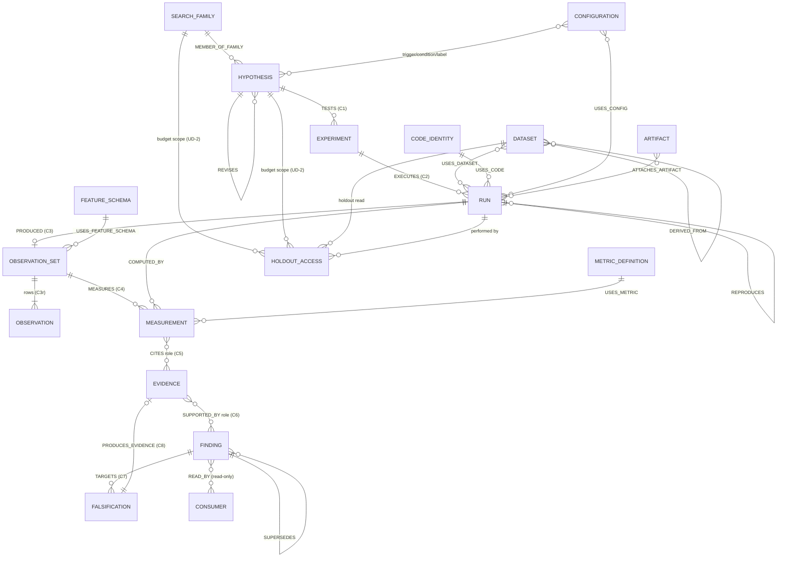
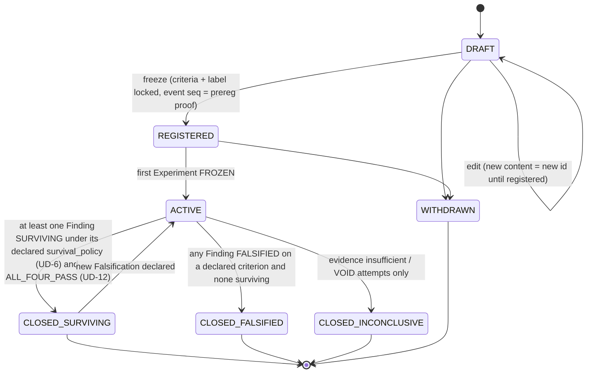
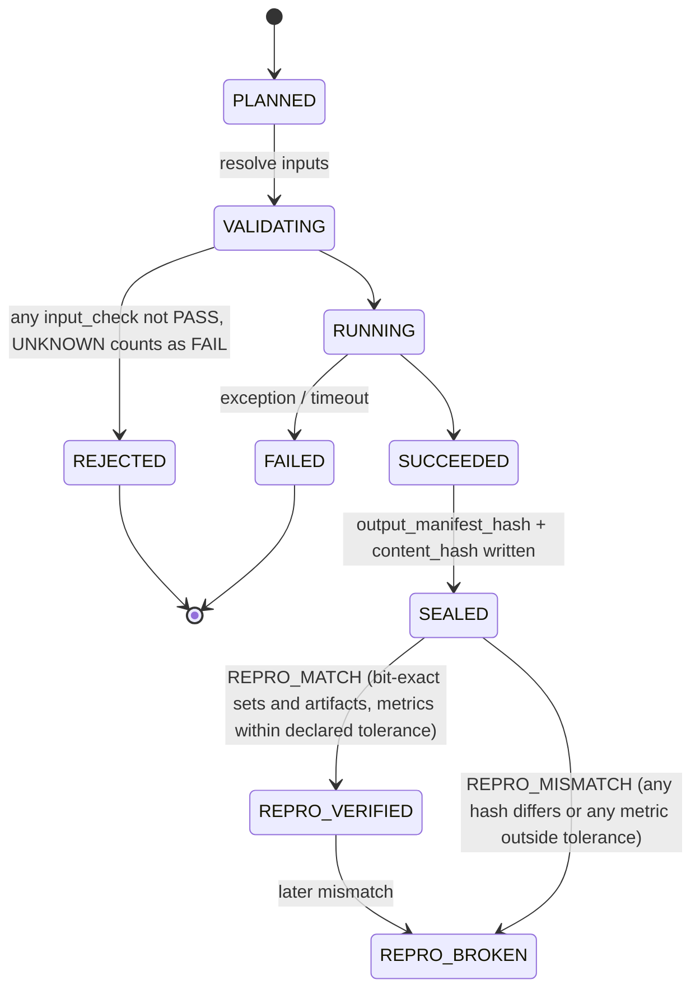
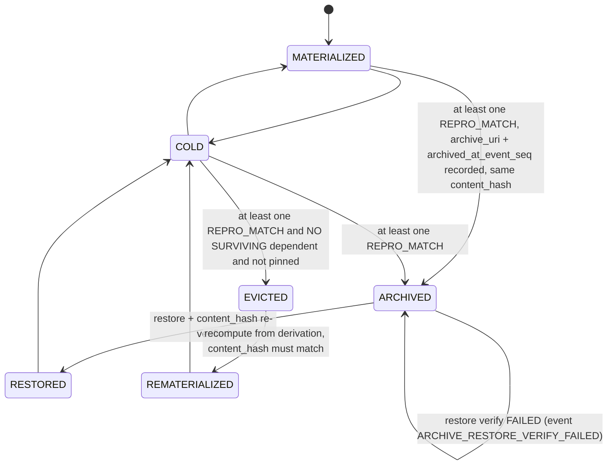
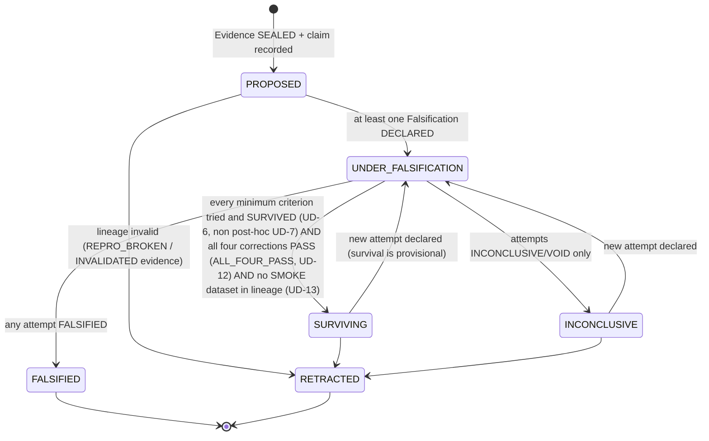
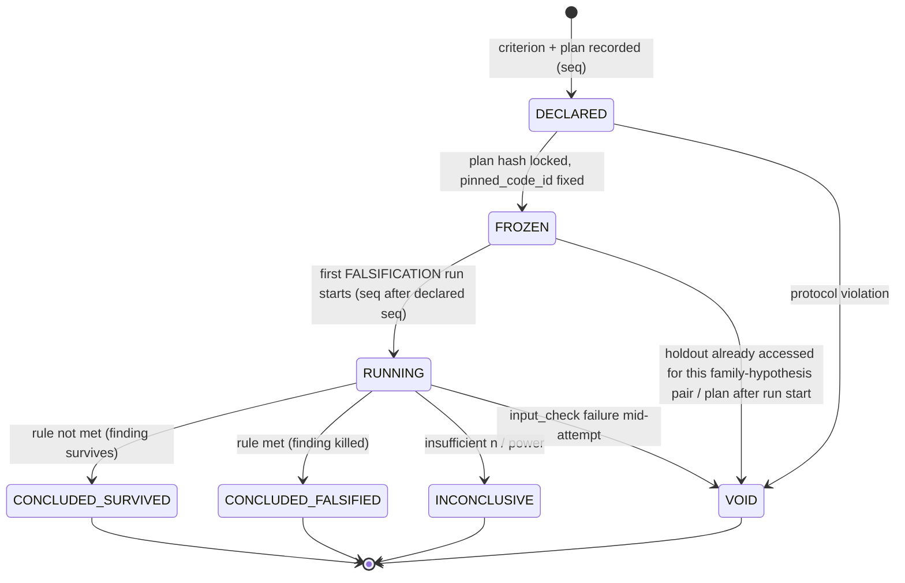

# DC-RESEARCH-LAB-01: Research Lab Architecture (a Research Operating System)

| Field | Value |
|---|---|
| **ID** | DC-RESEARCH-LAB-01 |
| **Status** | DESIGN DRAFT r10 (greenfield). r10: UD-13 SMOKE dataset B clock REVIEWED 2026-09-28 02:00:49 IST (MT5_SERVER_NY_DST, user-authorized-2026-09-28); QUARANTINED (tz_unreviewed) lifted. r9: UD-13 XAUUSD datasets DECIDED by user 2026-09-28 01:41 IST (FULL raw M15 + SMOKE one-month, SMOKE quarantined pending timezone review). r8: UD-12 survival governance DECIDED by user 2026-09-28 01:27 IST (ALL_FOUR_PASS). r7: UD-11 (Q7) DECIDED by user 2026-09-28 01:24 IST (all four corrections in parallel). r6: UD-10 (Q10) DECIDED by user 2026-09-28 01:12 IST (M15 derived from M5; Excel excluded). r5: UD-2 holdout scope CONFIRMED by user 2026-09-28 00:47 IST. User decisions of 2026-09-28 00:21 IST (UD-1 to UD-3), 00:26 IST (UD-4 to UD-7) and 00:30 IST (UD-8, UD-9, UD-10 deferred) applied, plus the 00:31 IST Q7 deferral (supposition S-1) (see the USER DECISIONS section). Nothing is wired and no code has changed. |
| **Domain** | research-infra |
| **Scope** | Discover, measure, store, reproduce and falsify knowledge. The phase **ends** when a finding is FALSIFIED or SURVIVING. |
| **Out of scope** | Reviewing existing reports, parity reports, promotion, governance approval, deployment, active model selection, runtime execution |
| **Companion** | `DC-RESEARCH-LAB-01_SCHEMA.json` (JSON Schema draft 2020-12, one `$defs` entry per entity) |

---

## 0. Research Authority Contract (binding on every entity below)

> **Research discovers, measures, records evidence, records findings and attempts falsification.**
> Research **never** decides production policy, **never** promotes, and **never** becomes an authority over runtime.

Design consequences:
1. **No authority fields.** No lab table has a column named or meaning `approved`, `promoted`, `active`, `deployed` or `selected`. The schema enforces this with `additionalProperties:false`.
2. **Terminal states are epistemic, not operational.** The terminal states are `SURVIVING`, `FALSIFIED`, `INCONCLUSIVE` and `RETRACTED`.
3. **One-way outflow.** Knowledge leaves the lab only through read-only views (section 10). The lab has no API that accepts writes from outside.
4. **Fail-closed trust.** Every trust field is `UNKNOWN | PASS | FAIL | PARTIAL`, and `UNKNOWN` is treated as `FAIL` by every check and query. `UNKNOWN` never counts as a pass.
5. **Declared configuration only.** No silent defaults. A missing key means REJECT (section 2.3).
6. **Evidence first.** A configuration is only an *input identity*. Knowledge lives in Evidence, Findings and Falsifications, never in configuration.

---

## USER DECISIONS (2026-09-28 00:21 IST)

| # | Decision | Where it is applied |
|---|---|---|
| UD-1 | **Catalog = single-file DuckDB (confirmed).** One writer process. No Postgres alternative is kept in this design. | §7.1 T3, §7.2, §8.1, §12 (old Q1 removed) |
| UD-2 | **Holdout budget scope = the `(search_family_id, hypothesis_id)` pair.** Every holdout read is logged as a `HOLDOUT_ACCESS` event whose `scope` carries both ids, plus a `HoldoutAccess` record. The first access for a pair on a holdout Dataset is the only valid OOS access *for that pair*. A second access for the same pair on the same holdout Dataset VOIDs every later OOS_PINNED_SHA attempt **for that pair only**. Other pairs, including other hypotheses in the same family and the same hypothesis under another family, are unaffected. **CONFIRMED (2026-09-28 00:47 IST):** the budget is scoped per (search family, hypothesis) pair. Your original wording was "per search per family per hypothesis". | Schema `HoldoutAccess`, `Event.scope`, `Falsification.plan.holdout_scope`, `Run.input_checks.holdout_untouched`; §3, §5.9, §9, §12 (old Q2 removed) |
| UD-3 | **Reproduction tolerance allowed, declared per metric, with no default.** `MetricDefinition.reproduction_tolerance = {kind: ABSOLUTE \| RELATIVE \| EXACT, value: decimal string}` is **required**. If it is absent, the schema is invalid. `EXACT` means bit-exact and requires `value = "0"`. **Bit-exact always applies to** ObservationSet `content_hash`, Artifact sha256 and the Run output manifest's object hashes (excluding metric values). **Tolerance applies only to** Measurement values, each against its own metric's declared tolerance. A reproduction passes only if every bit-exact check matches **and** every Measurement is within tolerance. The tolerance used is recorded in the `REPRODUCES` edge (`attributes = ReproductionRecord`) and in the REPRO_MATCH / REPRO_MISMATCH event payload. | Schema `MetricDefinition`, `ReproductionTolerance`, `ReproductionRecord`, `Edge.attributes`; §2.2, §3, §4.2, §5.4, §5.14, §7.4, §8.4, §12 (old Q8 removed) |

### USER DECISIONS (2026-09-28 00:26 IST)

| # | Decision | Where it is applied |
|---|---|---|
| UD-4 | **Canonical DECIMAL STRINGS for every hashed numeric value** (old Q3). Thresholds, criteria, effect sizes, alphas, tolerances and every non-integer value inside a Configuration's `resolved` object are serialised as canonical `DecimalString`s (plain decimal, minimal form: `^(0\|-?[1-9][0-9]*\|-?(0\|[1-9][0-9]*)\.[0-9]*[1-9])$`. That means no exponent, no leading `+`, no leading or trailing zeros, and no `-0`). **No JSON floats in any hashed field.** Integers (counts, bars, seeds, ordinals) stay JSON integers. `Configuration.resolved` is validated recursively by `HashSafeJSON`, which allows strings, integers, booleans, null, arrays and objects, and rejects non-integral numbers. Fields that are *not* identity inputs (`Measurement.value`, `Measurement.uncertainty`) may stay JSON numbers. Their reproduction comparison uses decimal strings (`ReproductionRecord`). | Schema `DecimalString`, `HashSafeJSON`, `FalsificationCriterion.threshold`, `Hypothesis.expected_effect.min_effect`, `SearchFamily.corrections[].alpha` (four declared alphas, UD-11), `Evidence.family_accounting.adjusted_alpha`, `Configuration.resolved`; §2.1, §2.2, §12 (old Q3 removed) |
| UD-5 | **Unreachable-blob GC grace = 30 days.** This is a declared lab constant (`LAB_MANIFEST.gc_grace_days = 30`), not a default: the manifest must state it, and a missing value makes the manifest invalid. The sub-question "may ObservationSets behind SURVIVING Findings ever be evicted?" stays **open** (Q4b). | Schema `LabManifest`; §5.15, §7.2, §7.4, §12 |
| UD-6 | **Survival policy is a declared, versioned field, with no default** (old Q5). `survival_policy = {policy: DECLARED_MINIMUM \| ALL_DECLARED_CRITERIA, policy_version}` is required on every Finding and every Falsification plan. If it is missing, the record is schema-invalid. **Current phase: DECLARED_MINIMUM.** Each Finding declares `minimum_criteria`, a non-empty subset of its Hypothesis's preregistered criteria. SURVIVING requires *all* minimum criteria to be tried and passed (CONCLUDED_SURVIVED). Declared criteria that were not tried are recorded on the Finding as `untried_criteria` (a survival projection, excluded from identity) and in each `SURVIVAL_EVALUATED` event, and they appear in the metric `findings_surviving_with_untried_criteria`. **ALL_DECLARED_CRITERIA** is designed in scope for when the system is stable. Under it, `minimum_criteria` must list every preregistered criterion. Switching policy means a new `policy_version`. It **never retroactively changes** an existing Finding's state. Re-evaluation under a new policy appends new `SURVIVAL_EVALUATED` events and, if the Finding's claim is re-issued, creates a new Finding with `SUPERSEDES`. | Schema `SurvivalPolicy`, `Finding.survival_policy/minimum_criteria/survival_projection`, `Falsification.plan.survival_policy`, `SurvivalEvaluation`; §5.1, §5.8, §9, §12 (old Q5 removed) |
| UD-7 | **Post-preregistration criteria are ALLOWED but FLAGGED** (old Q6). Because a REGISTERED Hypothesis is immutable, a later criterion is recorded as a separate `CriterionAddendum` whose criterion carries `post_hoc: true` and `added_at_event_seq` (the `CRITERION_ADDED` event). Criteria inside `Hypothesis.falsification_criteria` are `post_hoc: false` with `added_at_event_seq: null`. **A post-hoc criterion can never be part of `minimum_criteria`.** The schema enforces this: `minimum_criteria[].post_hoc` must be `false`. A cross-record lineage check verifies the flag against the source criterion. Post-hoc Falsifications still run and are reported, but they cannot make a Finding SURVIVING. They *can* make it FALSIFIED, because the lab never ignores a kill. New metric: `post_hoc_criteria_count`. | Schema `FalsificationCriterion.post_hoc/added_at_event_seq`, `CriterionAddendum`, `Finding.minimum_criteria`; §4.1 C7, §5.1, §5.8, §5.9, §9, §12 (old Q6 removed) |

**Schema instance tests (r3, all behave as intended):**
- float threshold rejected
- non-minimal decimal `"0.050"` rejected
- float inside `Configuration.resolved` rejected
- decimal-string config accepted
- valid Finding accepted
- **missing `survival_policy` rejected**
- **post-hoc criterion in `minimum_criteria` rejected**
- empty `minimum_criteria` rejected
- post-hoc criterion inside a Hypothesis rejected
- `post_hoc` without `added_at_event_seq` rejected
- LabManifest `gc_grace_days = 90` rejected

Cross-record rules that JSON Schema cannot express run as lineage-completeness checks (§9):
- minimum criteria ⊆ preregistered criteria
- ALL_DECLARED_CRITERIA means minimum = all preregistered criteria
- `Falsification.plan.survival_policy` = the Finding's policy
- the `post_hoc` flag matches the source criterion

### USER DECISIONS (2026-09-28 00:30 IST)

| # | Decision | Where it is applied |
|---|---|---|
| UD-8 | **ObservationSets behind SURVIVING Findings are never deleted** (old Q4b). After at least one `REPRO_MATCH` they *may* move to the **ARCHIVE tier (T5)**: cold and content-addressed, with the **same `content_hash`**. The catalog records `archive_uri` and `archived_at_event_seq`. Lineage queries resolve rows through `archive_uri` whenever `storage_state = ARCHIVED`. **Restoring** (ARCHIVED → RESTORED) must re-verify `content_hash`. A mismatch is `ARCHIVE_RESTORE_VERIFY_FAILED`, which is treated exactly like REPRO_MISMATCH for downstream projections. `ARCHIVED` is distinct from `EVICTED`: ARCHIVED keeps the bytes, while EVICTED drops them and relies on re-materialisation. **EVICTED is not allowed while any SURVIVING Finding depends on the set**, which is a cross-record lineage check. New metrics: `archived_sets_count` and `archive_restore_verification_failures`. | Schema `ObservationSet.storage_state/archive_uri/archived_at_event_seq`, Event types; §5.5, §7.1, §7.2, §7.4, §8.2, §9, §12 (old Q4b removed) |
| UD-9 | **Every read of `views/` requires a registered Consumer** (old Q9). Each `READ` event carries `payload.consumer_id`, which must be a REGISTERED Consumer, plus `view` and `snapshot_hash`. A read without a registered consumer is **rejected** and logged as `READ_REJECTED` with the presented identity string. Reads stay read-only, with no write-back and no decision power. New metric: `rejected_unregistered_reads`. | Schema `ReadEventPayload`, `ReadRejectedPayload`, Event types; §8.3, §9, §10, §12 (old Q9 removed) |
| UD-10 | **DECIDED (2026-09-28 01:12 IST), Option 2** (old Q10). **M15 is built from M5 as a DERIVED dataset. Excel stays EXCLUDED.** A derived M15 is its own Dataset (`source = DERIVED`) with its own identity: `id = sha256(JCS({source:"DERIVED", symbol, timeframe:"M15", transform}))`. The `transform` record holds: `source_hash` (the content id of the source M5 Dataset), `transform_code_hash` (the CodeIdentity id of the resampling code), and declared `params`: `source_timeframe`, `bar_boundary_anchor`, `timezone` (IANA) and `partial_bar_rule`. **No silent defaults:** the anchor, timezone and partial-bar rule must be declared, and a missing value means the Dataset is schema-invalid, which is fail-closed. For derived datasets the `manifest` is the output witness, and re-deriving must reproduce it bit-exact. It is not an identity input. **No mixing:** a derived M15 is never merged, spliced or gap-filled with any vendor or raw M15. Its only source is the declared M5 Dataset, and that must be `source = MT5_OHLCV` with timeframe M5 (cross-record check). **Consequence (recorded, not decided):** XAUUSD M5 is forensic-only (not admissible), so **XAUUSD has no derivable M15 under this rule**. This decision does **not** change the status of the existing XAUUSD M15 CSV (`data/mt5/XAUUSD_M15.csv`, registry `XAUUSD_MT5_PHASE1_20260521`). That is an **open gap** (§12). | Schema `DatasetTransform`, `DerivationParams`, `Dataset.transform`; §2.2, §5.10, §12 (Q10 resolved; XAUUSD gap listed) |

**Q7 history. Superseded by UD-11 (decided 2026-09-28 01:24 IST). The text below is kept verbatim as history.** Q7 was DEFERRED at 00:31 IST and recorded as a supposition, not a decision.
- History, verbatim: at 00:30 you answered "market correction". At 00:31 you said: "Parallel tests once system stabilised; note it down as hypothesis/supposition."
- **Supposition S-1:** once the system is stable, run several corrections **in parallel on the same SearchFamily** (candidates: Bonferroni, Holm, Benjamini–Hochberg FDR, White's Reality Check / Hansen SPA). Each correction's result is recorded as **its own Measurement and its own Evidence**, so the corrections can be compared side by side.
- **Rule for now:** the explicit-choice, no-default rule stays. `SearchFamily.corrections` is a *list* of explicitly declared `{method, alpha}` entries with no default. `correction_mode` is `SINGLE_DECLARED` (exactly one entry) until S-1 is adopted. `PARALLEL_COMPARISON` (two or more entries) is designed but not active.
- Each declared correction produces its own adjusted result: one `Evidence.family_accounting.correction` per Evidence record. Measurements use correction-specific MetricDefinitions, for example `adjusted_p_holm`.

**Schema instance tests (r4, all behave as intended):**
- ARCHIVED without `archive_uri` rejected
- READ event without `consumer_id` rejected
- ARCHIVED with uri and seq accepted
- READ with consumer_id accepted
- non-ARCHIVED set carrying an `archive_uri` rejected
- **Q7 / S-1 (r4 history; SINGLE_DECLARED was retired in r7, see the UD-11 tests):** SINGLE_DECLARED with 2 corrections rejected; PARALLEL_COMPARISON with 1 rejected; missing `correction_mode` rejected; empty `corrections` rejected; float alpha rejected; SINGLE with 1 correction accepted; PARALLEL with 3 accepted
- the r3 tests still pass

### USER DECISIONS (2026-09-28 01:24 IST)

| # | Decision | Where it is applied |
|---|---|---|
| UD-11 | **Q7 DECIDED, all four corrections in parallel.** Your words, verbatim: "Multiple-testing correction (Q7) add four". **Interpretation:** every SearchFamily runs **BONFERRONI, HOLM, BH_FDR and WHITE_RC_SPA** (White's Reality Check / Hansen SPA, treated as one method slot) **in parallel**, and each produces its own adjusted Measurement and its own Evidence record (`Evidence.family_accounting.correction`). `correction_mode = PARALLEL_COMPARISON` is the only active mode. `corrections` must contain **exactly these four methods, each once**, each with an **explicitly declared `alpha`** (DecimalString, no default). **SINGLE_DECLARED is retired.** It is kept as history in this card and is not valid for new families. The lab never merges the four results into one verdict. Their divergence is observed through `correction_disagreement` (§9). This supersedes supposition S-1 (kept above as history). | Schema `SearchFamily.correction_mode/corrections`, `CorrectionSpec.method`, `SurvivalEvaluation.survival_governance`; §2.2, §5.2, §5.8, §5.9, §9, §12 |

**Open item created by UD-11: RESOLVED by UD-12 (2026-09-28 01:27 IST), ALL_FOUR_PASS.** The interim fail-closed UNDECIDED rule (no SURVIVING from any parallel family) was in force from 01:24 to 01:27 IST and is replaced by the rule in UD-12.

**Schema instance tests (r7, all behave as intended):**
- family with all four methods accepted
- 3 methods rejected
- duplicate method rejected
- missing alpha rejected
- float alpha rejected
- SINGLE_DECLARED rejected
- SURVIVING evaluation under UNDECIDED governance rejected (r7 only; UNDECIDED was removed in r8, see the UD-12 tests)
- the r3–r6 regression tests still pass

### USER DECISIONS (2026-09-28 01:27 IST)

| # | Decision | Where it is applied |
|---|---|---|
| UD-12 | **Survival governance = ALL_FOUR_PASS.** A Finding survives only if it passes **all four** parallel corrections (BONFERRONI, HOLM, BH_FDR, WHITE_RC_SPA). This combines with the existing rules, and **all are required together**: (1) UD-6 DECLARED_MINIMUM, meaning every `minimum_criteria` entry is tried and CONCLUDED_SURVIVED; (2) UD-7, meaning post-hoc criteria never count toward survival and can never be minimum; (3) UD-12, meaning for the Finding's test, the Evidence for **each** of the four correction methods exists, is SEALED with trust PASS, and shows a pass (the effect remains significant at that method's declared alpha, using the realised family size). **Fail-closed:** a missing, errored, unsealed or UNKNOWN-trust correction Evidence counts as *not survived* for that method, so the Finding cannot be SURVIVING. A correction that shows *fail* also blocks SURVIVING. That failure is recorded, but by itself it does not make the Finding FALSIFIED, because FALSIFIED still comes only from a CONCLUDED_FALSIFIED Falsification. `SURVIVING` and `CLOSED_SURVIVING` are **reachable again** under this rule. | Schema `SurvivalEvaluation.survival_governance = ALL_FOUR_PASS`, `SurvivalEvaluation.correction_results`, `CorrectionResult`; §5.1, §5.8, §5.9, §9, §12 (item resolved) |

**Schema instance tests (r8, all behave as intended):**
- SURVIVING with 4 PASS results accepted
- SURVIVING with 3 PASS and 1 FAIL rejected
- SURVIVING with only 3 results rejected
- SURVIVING with a MISSING or ERROR result rejected
- SURVIVING with a duplicate method rejected
- FALSIFIED with mixed results accepted
- UNDER_FALSIFICATION with mixed or partial results accepted
- `survival_governance = UNDECIDED` rejected
- the r2–r7 regression tests still pass

### USER DECISIONS (2026-09-28 01:41 IST)

| # | Decision | Where it is applied |
|---|---|---|
| UD-13 | **XAUUSD datasets.** (1) **FULL XAUUSD M15** = raw `MT5_OHLCV` Dataset `data/mt5/XAUUSD_M15.csv`, sha256 `4d73f5cebe33ec91c5312340337eb62c2cf1f49060c91c42761bf631b26aba56`, 47,275 rows, 2024-05-22 01:00 → 2026-05-21 23:45 (naive, broker clock), `usage_class = FULL`. Clock: MT5_SERVER_NY_DST, user-reviewed (F-066). Recorded facts, not changed here: the dataset_identity_registry status is `FROZEN_CANDIDATE_PENDING_PHASE1_VALIDATION`, and the file has **516** gaps larger than one bar. **This resolves the XAUUSD derived-M15 gap:** XAUUSD uses this raw M15 directly, with no derivation, and it is never mixed with any derived M15 (UD-10 still governs all other instruments). (2) **SMOKE XAUUSD M15** = raw `MT5_OHLCV` Dataset `data/XAUUSD_mt5_1month_latest.csv`, sha256 `504f054c612e9d4a351afb1487005f9768e6ccd73ae531b4cc3247107525dd80`, 2,085 rows, 2026-08-17 01:00 → 2026-09-16 18:30 (naive), `usage_class = SMOKE`. **Clock REVIEWED (r10):** `MT5_SERVER_NY_DST`, `reviewed_by = user-authorized-2026-09-28`, `reviewed_at = 2026-09-27T20:30:49Z` (2026-09-28 02:00:49 IST), recorded in the clock registry by `scripts/governance/review_ohlcv_clocks.py` (evidence: shift-0 exact OHLC match 2085/2085 vs reviewed `data/mt5/W2026-08-03_to_2026-09-23/XAUUSD_M15.csv`; session shape 01:00-23:45 with a 23:45-01:00 break). Until that review the Dataset was QUARANTINED (tz_unreviewed); that quarantine is now lifted. It is usable only for fast and pipeline runs. Every Evidence whose lineage reaches a SMOKE Dataset is marked `smoke_only = true` and **can never count toward SURVIVING** (fail-closed). Its Findings can still be recorded, and kills are still recorded. The UD-13 decision itself changed no data file; the clock-registry entry was added separately by the review above (2026-09-28 02:00:49 IST). | Schema `Dataset.usage_class`, `Evidence.smoke_only`, `SurvivalEvaluation.lineage_usage_classes`; §2.2, §5.8, §5.10, §9, §12 |

**Schema instance tests (r9, all behave as intended):**
- SMOKE Dataset accepted
- FULL Dataset accepted
- missing `usage_class` rejected
- unknown `usage_class` rejected
- SURVIVING with SMOKE in `lineage_usage_classes` rejected
- SURVIVING with FULL-only lineage accepted
- UNDER_FALSIFICATION with SMOKE lineage accepted
- SURVIVING with empty lineage rejected
- the r2–r8 regression tests still pass

## 1. Entity evaluation (require / merge / reject)

| # | Candidate | Verdict | Reason |
|---|---|---|---|
| 1 | **Hypothesis** | **REQUIRE** | Root of the chain. This is where preregistration lives: trigger → condition → frozen forward label → expected effect → falsification criteria, all declared before any Run. |
| 2 | **Experiment** | **REQUIRE** | A frozen *design* (datasets, splits, costs, metrics, control arms, holdout) that tests exactly one Hypothesis. It absorbs the MeasurementContract. |
| 3 | **Run** | **REQUIRE** | One execution with pinned inputs. It is the unit of reproducibility. |
| 4 | **Observation** | **REQUIRE (as a row, not a catalog entity)** | There are millions of them, so they live as Parquet rows. They are grouped into an **ObservationSet**, which is the catalog entity (added). |
| 4a | ObservationSet | **ADD** | Needed so that catalog size stays bounded while row-level lineage is kept (`observation_set_id` plus `observation_key`). It is the unit for eviction and re-materialisation. |
| 5 | **Measurement** | **REQUIRE** | The value of a metric over (ObservationSet, slice, split, cost model). |
| 6 | **Evidence** | **REQUIRE** | A sealed bundle of Measurements with roles (primary, control, null, OOS, cost, stability) that answers a declared test. It is shared by many Findings. |
| 7 | **Finding** | **REQUIRE** | The recorded claim. It carries no authority. |
| 8 | **Falsification** | **REQUIRE (first-class)** | An explicit attempt to kill a Finding. Kinds: null/control, permutation, multiple testing, purged CV, cost sensitivity, stability, and OOS on a pinned SHA. |
| 9 | **Dataset** | **REQUIRE** | Content-addressed market data. MT5 OHLCV is the market authority. The clock review is an attribute. |
| 10 | **Feature Schema** | **REQUIRE** | The column contract of Observations (dtype, unit, causal lag). It prevents silent semantic drift. |
| 11 | **Configuration** | **REQUIRE** | Typed, fully resolved, declared config. **Merges** cost model, label spec, trigger spec, condition spec, split plan, population, search space, slice and control arm in as `kind`s. Each keeps its own id (so `cost_model_id` is the `config_id` of kind `COST_MODEL`). |
| 12 | **Code Identity** | **REQUIRE** | Git commit, tree hash and environment lock. A dirty tree is refused. **Merges** Environment. |
| 13 | **Artifact** | **REQUIRE** | Any immutable blob in the content-addressed store (CAS). |
| 14 | **Trace** | **MERGE into Artifact (kind=TRACE) + event log** | A trace is a per-run file (layer_trace PER_RUN_FILE) plus run events. A separate entity would duplicate Artifact identity and add no lineage power. |
| 15 | **Metric** | **SPLIT** into **MetricDefinition** (REQUIRE) and value (**MERGE** into Measurement) | Definitions are reused across experiments and need their own identity (formula plus implementing code). Values are Measurements. |
| 16 | **Consumer** | **REQUIRE (read-only)** | A record of who reads Findings, used for impact analysis ("who is affected if F is falsified"). It has no write-back and no decision fields. |
| 17 | SearchFamily | **ADD** | Needed for multiple-testing accounting. Every variant that was tried, including killed ones, counts toward the realised family size. Without it, the forking-paths count is invisible. |
| 18 | Edge | **ADD (structural)** | One lineage table covers all arrows, so a single recursive CTE answers every lineage question. |
| 19 | Event | **ADD (structural)** | An append-only, hash-chained log. It is the source of truth for lifecycle state and ordering, and it is the proof that preregistration came before the Run. |
| 19a | HoldoutAccess | **ADD (UD-2)** | The holdout budget ledger. There is one record per holdout read, scoped to the `(search_family_id, hypothesis_id)` pair, with a per-pair `access_ordinal`. Without it, the OOS VOID rule could not be checked. |
| 20 | Environment, Seed, CostModel, LabelSpec, SplitPlan, ClockRecord, Preregistration | **MERGED** | Environment goes into Code Identity. Seed goes into `Run.inputs`. CostModel, LabelSpec and SplitPlan become Configuration kinds. ClockRecord goes into `Dataset.clock_review`. Preregistration is the Hypothesis REGISTERED state plus the frozen Experiment design. |
| 21 | Approval, Promotion, ActiveModel, Deployment | **REJECTED** | These violate the Authority Contract (section 10). |

**Principle: immutable objects, mutable projections.** Every entity row is immutable after creation, and its `id` is a content hash. The only mutable thing is the **lifecycle state**, which is a projection folded from the event log (`LifecycleState{state, as_of_event_seq}`). Annotations are events, not edits.

---

## 2. Identity (the identity contract)

### 2.1 Universal recipe
```
identity_inputs(e) = { "entity_type": T, "schema_version": "lab.v1", <immutable fields of T>, <parent ids of T> }
id(e)              = "sha256:" + hex( SHA-256( JCS(identity_inputs(e)) ) )     # JCS = RFC 8785 canonical JSON
human_id(e)        = alias (unique per type, never hashed): run_20260916_172925, HYP-20260928-001, F-112, EXP-..., FAL-...
```
Rules:
- **Numbers (UD-4):** no JSON floats in any identity input. Non-integer values are canonical `DecimalString`s in minimal plain-decimal form (for example `"0.5"`, not `"0.50"`, `".5"`, `"5e-1"` or `"+0.5"`). The schema pattern admits only the minimal form, so one value has exactly one hashable spelling. Integers stay JSON integers.
- **Sets** (id lists) are sorted in ascending lexicographic order before hashing. **Sequences** keep their declared order.
- **Timestamps, human_id, lifecycle state and annotations are never identity inputs.** Time order comes from `event_seq`.
- **Parent ids are always inside the child's identity inputs.** So an edge cannot change without changing the child's id, which makes every edge immutable by construction.

### 2.2 Per-entity hash recipes

| Entity | Identity inputs (besides entity_type, schema_version) | Notes |
|---|---|---|
| Dataset | **All:** `usage_class` (FULL \| SMOKE, required, no default; UD-13) is an identity input. **MT5_OHLCV:** source, symbol, timeframe, broker_server, manifest[(rel_path, sha256(bytes), rows)] sorted by rel_path. **DERIVED (UD-10):** source, symbol, timeframe, transform{source_hash, transform_code_hash, params{source_timeframe, bar_boundary_anchor, timezone, partial_bar_rule}}. The manifest is the bit-exact output witness, not identity | `clock_review` is excluded (it is an attribute). Same bytes (raw) or same transform (derived) give the same id: dedup is free. `derived_from_dataset_ids` = [transform.source_hash] and `derivation_code_id` = transform.transform_code_hash (cross-record check). |
| CodeIdentity | git_commit, tree_hash(included_paths), dirty=false, included_paths, env_lock_hash, python_version, platform | A dirty tree cannot produce a CodeIdentity, so the Run is REJECTED. |
| Configuration | kind, config_schema_id, resolved (the full resolved object), declared_keys, `defaults_applied=[]` | See 2.3. |
| FeatureSchema | columns sorted by name: (name, dtype, unit, causal_lag_bars, definition_code_id) | |
| MetricDefinition | name, formula, implementation_code_id, params_config_id, unit, **reproduction_tolerance{kind, value}** (UD-3) | A tolerance change creates a new MetricDefinition id. |
| SearchFamily | description, search_space_config_id, declared_size, **correction_mode = PARALLEL_COMPARISON, corrections = exactly [BONFERRONI, HOLM, BH_FDR, WHITE_RC_SPA] each with declared alpha** (sorted by method for hashing; UD-11) | Changing any alpha means a new SearchFamily id. |
| Hypothesis | statement, search_family_id, trigger{lifecycle_event, config_id}, condition{smc_condition, config_id}, forward_label{label_name, horizon_bars, config_id}, expected_effect, falsification_criteria[], revises_hypothesis_id, author | Frozen at REGISTERED. Revising it creates a new id plus a `REVISES` edge.  Criteria are preregistered (`post_hoc:false`). Later criteria go to `CriterionAddendum` (UD-7). |
| Experiment | hypothesis_id, design{dataset_ids, feature_schema_id, population/label/split config ids, cost_model_config_ids, metric_def_ids, control_arms, holdout_dataset_ids} | |
| Run | `derivation_id = H(experiment_id, inputs{dataset_ids, code_id, config_ids, feature_schema_id, seed})`; `id = H(derivation_id, attempt_seq)` | Reproductions share `derivation_id`. |
| ObservationSet | derivation_id | `content_hash = H(canonical row stream sorted by observation_key)` is the reproducibility witness. |
| Observation (row) | observation_key = H(symbol, event_ts_utc, trigger_event, arm) | Unique within its set. |
| Measurement | observation_set_id, metric_def_id, slice_config_id, split{split_config_id, fold, segment}, cost_model_config_id | `value` is **not** hashed. It is verified by recompute (value drift counts as a repro mismatch). |
| Evidence | hypothesis_id, test_declaration, measurements[(id, role)] sorted, family_accounting{search_family_id, realised_family_size, **correction{method, alpha}**, adjusted_alpha}, artifact_ids | **Four Evidence records per test, one per correction method (UD-11).** |
| Finding | hypothesis_id, claim, claim_scope, evidence[(id, role)] sorted, supersedes_finding_id, **survival_policy{policy, policy_version}, minimum_criteria[]** (UD-6) | `survival_projection` (untried_criteria) and lifecycle state are projections, excluded from identity. |
| Falsification | finding_id, criterion_id, kind, **post_hoc** (UD-7), plan{experiment_id, pinned_code_id, dataset_ids, config_ids, declared_event_seq, holdout_scope (UD-2), **survival_policy** (UD-6)} | `outcome` is written once through a CONCLUDED event. |
| Artifact | sha256(bytes) | CAS key. |
| Consumer | name, kind, access="READ_ONLY" | |
| CriterionAddendum (UD-7) | hypothesis_id, criterion{…, post_hoc:true, added_at_event_seq} | Never alters the Hypothesis id. |
| LabManifest (UD-5) | schema_version, hash_algo, canonicalisation, catalog, gc_grace_days, relative_tolerance_epsilon | One per lab. It is declared, not defaulted. |

### 2.3 Configuration identity: declared only, fail-closed
- Each `config_schema_id` points to a JSON Schema with `additionalProperties:false` and **every key required**. There are no schema-level `default` keywords.
- Load pipeline: `declared → validate(schema) → resolved`. If any key is missing, the result is `REJECTED` (an event), not a default.
- `defaults_applied` is part of the identity and **must equal `[]`**. The schema pins this with `const: []`. A config that needed a default therefore cannot have a valid id.
- Code reading a config must use strict access only (no `get(k, default)`). This is enforced in the Run's `input_checks.config_complete`, and `UNKNOWN` means the run is REJECTED.

---

## 3. Reproducibility

- **Recipe:** `(dataset_ids, code_id, config_ids, feature_schema_id, seed)` → `derivation_id`. Any Run, ObservationSet or Measurement can be re-materialised from its derivation.
- **Witness (UD-3), in two classes:**
  - **Bit-exact:** `ObservationSet.content_hash`, `Artifact` sha256, and `Run.output_manifest_hash` (the manifest lists object hashes only, never metric values).
  - **Tolerance:** each recomputed `Measurement.value` is compared with the reference value using its MetricDefinition's `reproduction_tolerance`:
    - `EXACT`: identical decimal representation.
    - `ABSOLUTE`: `|obs − ref| ≤ value`.
    - `RELATIVE`: `|obs − ref| ≤ value · max(|ref|, ε)`, where ε = 1e-12 is fixed by `lab.v1`. It is not configurable.
  - **PASS** requires all bit-exact checks to match and all Measurements to be within tolerance. A missing tolerance cannot happen (the schema is invalid without it), and an `UNKNOWN` comparison counts as FAIL.
- **Reproduction Run:** `purpose=REPRODUCTION`, same `derivation_id`, new `attempt_seq`. The outcome event is `REPRO_MATCH` or `REPRO_MISMATCH`.
- **Input checks run before execution** (`Run.input_checks`, each a TrustStatus):
  - `dataset_hash`: recompute the manifest and compare it to the Dataset id.
  - `clock_reviewed`: the dataset's clock review has `user_reviewed = true`.
  - `code_clean`: the tree is not dirty and the tree hash matches.
  - `config_complete`: schema is valid and no defaults were applied.
  - `holdout_untouched`: there is no prior `HOLDOUT_ACCESS` for **this run's `(search_family_id, hypothesis_id)` pair** on any of its holdout datasets (UD-2). Only enforced for OOS_PINNED_SHA falsification runs.

  Any check that is not PASS moves the Run to `REJECTED`.
- **Determinism:** the seed is declared. Nondeterminism can only show up in metric values, and only within the declared `reproduction_tolerance` (UD-3). Observation rows and artifacts must be bit-exact. If they are not, the result is REPRO_MISMATCH regardless of any metric tolerance.
- **Horizon:** evidence must be reproducible years later. The CAS keeps the dataset bytes, the environment lock file and a code snapshot (git bundle of the pinned commit) as Artifacts, so reproduction does not depend on the live repo.

---

## 4. Canonical chain and edge table

```
Hypothesis ← Experiment ← Run → ObservationSet(Observations) ← Measurement ← Evidence ← Finding ← Falsification
   (edges point child → parent; every parent id sits inside the child's identity inputs)
```

### 4.1 Canonical edge table

| # | Edge (src → dst) | rel | FK field in src | Cardinality (src:dst) | Why the edge is immutable | Creation precondition (fail-closed) |
|---|---|---|---|---|---|---|
| C1 | Experiment → Hypothesis | TESTS | `Experiment.hypothesis_id` | N:1 | hypothesis_id is in the Experiment's hash | Hypothesis is REGISTERED (frozen). The Experiment is created with seq > the REGISTERED seq. |
| C2 | Run → Experiment | EXECUTES | `Run.experiment_id` | N:1 | experiment_id is in derivation_id | Experiment is FROZEN, and every falsification criterion is declared (seq < Run.started_event_seq). |
| C3 | ObservationSet → Run | PRODUCED | `ObservationSet.produced_by_run_id` (first producer). Reproductions add `REPRODUCES` Run→Run. | N:1 (1 set per derivation; many runs may witness it) | derivation_id is in the set's hash | Run is SUCCEEDED. The content hash is recorded. |
| C3r | Observation → ObservationSet | (row FK) | `observation_set_id` column | millions:1 | The set's content hash covers all rows | Rows validate against the FeatureSchema. |
| C4 | Measurement → ObservationSet | MEASURES | `Measurement.observation_set_id` | N:1 | In the Measurement's hash | Set is MATERIALIZED and the Run is SEALED. |
| C4b | Measurement → Run | COMPUTED_BY | `computed_by_run_id` | N:1 | Recorded at creation. Recompute is checked via derivation. | |
| C5 | Evidence → Measurement | CITES (role) | `Evidence.measurements[]` | M:N | The sorted (id, role) list is in the Evidence hash | Every measurement is SEALED with trust PASS. PRIMARY needs at least one CONTROL or NULL. family_accounting is present. |
| C6 | Finding → Evidence | SUPPORTED_BY (role) | `Finding.evidence[]` | M:N | In the Finding hash | Evidence is SEALED. claim_scope ECONOMIC requires COST_SENSITIVITY and OOS roles to be present. |
| C7 | Falsification → Finding | TARGETS | `Falsification.finding_id` | N:1 | In the Falsification hash | `plan.declared_event_seq` is earlier than every run it uses. criterion_id is either a preregistered criterion of the Hypothesis or a `CriterionAddendum` criterion (`post_hoc:true`, UD-7). `plan.survival_policy` equals the target Finding's (UD-6). |
| C8 | Falsification → Evidence | PRODUCES_EVIDENCE | `outcome.evidence_id` | 1:0..1 | Written once by the CONCLUDED event | Its Runs have `purpose=FALSIFICATION` and `falsification_id` set. |

### 4.2 Auxiliary edges

| rel | src → dst | Card. | Source field |
|---|---|---|---|
| USES_DATASET | Run/Experiment/Dataset(derived) → Dataset | M:N | `inputs.dataset_ids`, `design.dataset_ids`, `derived_from_dataset_ids` |
| USES_CODE | Run/MetricDefinition/FeatureSchema/Dataset(derived) → CodeIdentity | N:1 | `inputs.code_id` … |
| USES_CONFIG | Run/Experiment/Hypothesis/Measurement → Configuration | M:N | config id fields |
| USES_FEATURE_SCHEMA | Run/Experiment/ObservationSet → FeatureSchema | N:1 | |
| USES_METRIC | Measurement/Hypothesis/Experiment → MetricDefinition | N:1 / M:N | |
| MEMBER_OF_FAMILY | Hypothesis → SearchFamily | N:1 | `search_family_id` |
| REPRODUCES | Run → Run | N:1 | same `derivation_id`; points to the first attempt. `attributes` = **ReproductionRecord** (bit-exact checks, and per-measurement tolerance kind, value, delta and within flag) — UD-3 |
| REVISES / SUPERSEDES | Hypothesis→Hypothesis / Finding→Finding | N:1 | `revises_hypothesis_id` / `supersedes_finding_id` |
| ATTACHES_ARTIFACT | Run/Evidence → Artifact | M:N | `produced_by_run_id`, `artifact_ids` |
| READ_BY | Finding → Consumer | M:N | READ events only (not in the hash, since it is not lineage). `payload.consumer_id` is required (UD-9) |



---

## 5. Entity specifications

The same template is used for every entity: **Purpose · Authority · Identity · Source of Truth (SoT) · Immutable · Mutable · Relationships · Lifecycle**.

### 5.1 Hypothesis
- **Purpose:** a preregistered, falsifiable claim, following the no-code search contract: *lifecycle-event trigger → SMC condition → frozen forward label → expected effect → kill criteria*.
- **Authority:** the author declares it. The lab only freezes it and never judges it.
- **Identity:** §2.2. Human id `HYP-YYYYMMDD-NNN`.
- **SoT:** catalog row plus the REGISTERED event (hash chain).
- **Immutable:** every field once it is REGISTERED.
- **Mutable:** lifecycle state (projection) and annotations (events).
- **Relationships:** SearchFamily (N:1), Configuration ×3 (trigger, condition, label), MetricDefinition, Experiment (1:N), Hypothesis (REVISES).

Criteria added after REGISTERED are `CriterionAddendum` records (`post_hoc:true`, UD-7). They do not change the Hypothesis id and cannot enter any Finding's `minimum_criteria`. Revision after REGISTERED means a new Hypothesis with `REVISES`. It is counted in the same SearchFamily, so a revision is not a free retry.

### 5.2 SearchFamily
- **Purpose:** the multiple-testing ledger. It runs **all four corrections in parallel** (`correction_mode = PARALLEL_COMPARISON`; `corrections` = BONFERRONI, HOLM, BH_FDR, WHITE_RC_SPA, each with a declared alpha; UD-11). SINGLE_DECLARED is retired (history only).
- **Authority:** declared before its first Hypothesis is registered.
- **Identity:** §2.2.
- **SoT:** catalog row plus the count of members.
- **Immutable:** all fields.
- **Mutable:** `realised_family_size`, a projection that counts every member Hypothesis and variant Run, including REJECTED and killed ones.
- **Relationships:** Hypothesis (1:N).
- **Lifecycle:** `OPEN → CLOSED`. If the realised size exceeds `declared_size`, an observability flag `FAMILY_OVERRUN` is raised. It is informational only.

### 5.3 Experiment
- **Purpose:** a frozen design. It absorbs MeasurementContract fields (population, features, labels, costs, exits, splits, metrics, pipeline identity, evidence artifacts).
- **Authority:** the author. It is frozen before any Run.
- **Identity:** §2.2. Human id `EXP-...`.
- **SoT:** catalog row plus the FROZEN event.
- **Immutable:** hypothesis_id and design.
- **Mutable:** state.
- **Relationships:** Hypothesis N:1; Run 1:N; Dataset, Configuration, FeatureSchema, MetricDefinition M:N.
- **Lifecycle:** `DESIGNING → FROZEN → RUNNING → COMPLETE | ABORTED`. ABORTED keeps its Runs, and they still count in the family.

### 5.4 Run
- **Purpose:** one pinned execution, which is the unit of reproducibility.
- **Authority:** the executor records facts only.
- **Identity:** `derivation_id` plus `attempt_seq`. Human id `run_YYYYMMDD_HHMMSS`.
- **SoT:** catalog row plus the run event stream plus the output manifest Artifact.
- **Immutable:** experiment_id, purpose, falsification_id, inputs, derivation_id, attempt_seq, input_checks, output_manifest_hash (sealed).
- **Mutable:** state.
- **Relationships:** Experiment N:1; ObservationSet; Measurement 1:N; Artifact 1:N; Run (REPRODUCES).


### 5.5 ObservationSet and Observation
- **Purpose:** the event-level facts. Each row records a trigger occurrence at `event_ts_utc`, the condition features and the frozen forward label (`label_known_at_utc` must be later than `event_ts_utc`, and features must respect `causal_lag_bars`).
- **Authority:** Run output only.
- **Identity:** set id = H(derivation_id). Row = observation_key.
- **SoT:** Parquet in the columnar tier. The catalog holds the set row.
- **Immutable:** all rows and the content_hash.
- **Mutable:** `storage_state` (MATERIALIZED, COLD, ARCHIVED, EVICTED, RESTORED, REMATERIALIZED), `archive_uri`, `archived_at_event_seq` (UD-8). These are storage projections, excluded from identity.
- **Relationships:** Run, FeatureSchema, Measurement.
- **Lifecycle (UD-8):** see the diagram. Re-materialisation and restore must both reproduce the `content_hash`, otherwise a REPRO_MISMATCH or ARCHIVE_RESTORE_VERIFY_FAILED is recorded. Neither ARCHIVED nor EVICTED is allowed before at least one `REPRO_MATCH`. EVICTED is forbidden while any SURVIVING Finding depends on the set, or if a Finding pins it (§7.4).


### 5.6 Measurement
- **Purpose:** a metric value on a slice, split or cost scenario, with uncertainty (CI, p-value, method).
- **Authority:** computed. It is never hand-entered.
- **Identity:** §2.2, excluding the value.
- **SoT:** Parquet `measurements/` plus a catalog row.
- **Immutable:** all fields.
- **Mutable:** state.
- **Relationships:** ObservationSet, Run, MetricDefinition, Configuration (slice, split, cost), Evidence (M:N).
- **Lifecycle:** `COMPUTED → SEALED → INVALIDATED`. INVALIDATED happens if an upstream Run becomes REPRO_BROKEN or its Dataset quarantine is reopened.

### 5.7 Evidence
- **Purpose:** a sealed answer to a declared test, with roles and multiple-testing accounting.
- **Authority:** assembled by rule (the test_declaration references the Hypothesis criteria).
- **Identity:** §2.2. Human id `EV-...`.
- **SoT:** catalog row plus an Artifact bundle (for example tables and plots).
- **Immutable:** all fields.
- **Mutable:** state.
- **Relationships:** Measurement M:N, Finding M:N, Falsification (produced by).
- **Lifecycle:** `ASSEMBLING → SEALED → (STALE | INVALIDATED)`. STALE is a *projection*: an upstream dataset is superseded, the code has drifted, or the last repro is older than the horizon. STALE is an observability signal, not a verdict.

### 5.8 Finding
- **Purpose:** recorded knowledge. `claim_scope` is STATISTICAL or ECONOMIC. `economic_claim_eligible` is derived and fail-closed: it is PASS only if COST_SENSITIVITY and OOS evidence exist, the trust fields are PASS, and the Finding is SURVIVING. **Survival (UD-6):** `survival_policy` (required, versioned) and `minimum_criteria` (non-empty, preregistered criteria only) are identity inputs. `survival_projection.untried_criteria` is a projection, excluded from identity.
- **Authority:** none over runtime.
- **Identity:** §2.2. Human id `F-NNN`.
- **SoT:** catalog row plus events.
- **Immutable:** claim, scope, evidence set and supersedes.
- **Mutable:** state and annotations.
- **Relationships:** Hypothesis, Evidence M:N, Falsification 1:N, Finding (SUPERSEDES), Consumer (READ_BY).

**Survival rule (UD-6, UD-7, UD-11):**
- **ALL_FOUR_PASS (UD-12):** in addition to the UD-6 and UD-7 rules below, SURVIVING requires that, for the Finding's test, the Evidence for each of BONFERRONI, HOLM, BH_FDR and WHITE_RC_SPA exists, is SEALED with trust PASS, and shows a pass at its declared alpha. Any correction that is missing, errored, unsealed, UNKNOWN or FAIL means *not survived*, which is fail-closed. The Finding stays UNDER_FALSIFICATION or INCONCLUSIVE. A correction FAIL alone never makes it FALSIFIED. Each `SURVIVAL_EVALUATED` event records `correction_results` for all four methods.
- **No SMOKE lineage (UD-13):** SURVIVING also requires that no Dataset reachable from the Finding's Evidence has `usage_class = SMOKE`. Each `SURVIVAL_EVALUATED` event records `lineage_usage_classes`, and the schema rejects SURVIVING if that list contains SMOKE or is empty. The lineage check (§9 item 12) verifies the list against the actual ancestor walk. Evidence with `smoke_only = true` never counts toward survival. This is fail-closed.
- Under **DECLARED_MINIMUM** (the current phase), a Finding becomes SURVIVING only when every `minimum_criteria` entry has a Falsification in CONCLUDED_SURVIVED. Minimum criteria that are untried, VOID or INCONCLUSIVE keep it UNDER_FALSIFICATION or INCONCLUSIVE, which is fail-closed.
- Declared criteria outside the minimum that were not tried are listed in `survival_projection.untried_criteria` and surfaced as an observability metric. They do not block survival.
- Any CONCLUDED_FALSIFIED attempt makes the Finding FALSIFIED, whether the criterion is minimum, non-minimum or post-hoc.
- Post-hoc criteria never count toward survival.
- Under **ALL_DECLARED_CRITERIA** (designed, not active), `minimum_criteria` must list every preregistered criterion.
- A policy switch is a new `policy_version`. Existing states are never rewritten. Re-evaluation appends `SURVIVAL_EVALUATED` events.

### 5.9 Falsification
- **Purpose:** a first-class kill attempt.
- **Authority:** declared (the plan is frozen) before its Runs start. The outcome comes from the rule in the Hypothesis criterion, not from judgment.
- **Identity:** §2.2. Human id `FAL-...`.
- **SoT:** catalog row plus DECLARED, FROZEN and CONCLUDED events.
- **Immutable:** finding_id, criterion_id, kind, plan, and the outcome once concluded.
- **Mutable:** state.
- **Relationships:** Finding N:1; Experiment (its own design, for example a control arm or the OOS split); Runs with purpose FALSIFICATION; Evidence (C8).

How each kind is handled:
- **NULL_CONTROL / PERMUTATION:** the Experiment's control arms (shuffled label, random trigger, trigger without condition, time-shifted), each run as its own Run. The Measurement is compared with the declared rule.
- **MULTIPLE_TESTING (UD-11):** all four declared corrections (BONFERRONI, HOLM, BH_FDR, WHITE_RC_SPA) run in parallel on every SearchFamily. Each uses the *realised* family size (not the declared size) and produces its own Measurement (correction-specific MetricDefinition, for example `adjusted_p_holm`) and its own Evidence (`family_accounting.correction`). The four are compared side by side and never merged into one verdict by the lab. Survival requires all four to pass (ALL_FOUR_PASS, UD-12). A missing or errored correction Evidence counts as not passed, which is fail-closed. Post-hoc criteria (UD-7) are counted in the family and reported with `post_hoc:true`.
- **PURGED_CV:** a split config of kind SPLIT that states the purge and embargo in bars. It produces CV_FOLD Measurements, and the stability rule is applied across folds.
- **COST_SENSITIVITY:** at least two COST_MODEL configs (base plus stressed). The finding must hold under the stressed one.
- **STABILITY:** regime or sub-period slices (SLICE configs), with sign and effect consistency rules.
- **OOS_PINNED_SHA (UD-2):** `pinned_code_id` equals the code_id of the discovery Run. `plan.holdout_scope = {search_family_id, hypothesis_id}` must equal the Finding's Hypothesis and its family. Every read of a holdout Dataset writes a `HOLDOUT_ACCESS` event with `scope` set to that pair, plus a `HoldoutAccess` record with an `access_ordinal` counted per (pair, holdout dataset). Only `access_ordinal = 1` is valid. A second access for the same pair and dataset VOIDs every later OOS attempt **for that pair**. Other pairs keep their own budget. Scope CONFIRMED 2026-09-28 00:47 IST.

### 5.10 Dataset
- **Purpose:** market data. MT5 OHLCV is the authority. Derived datasets (resampled, merged) carry `DERIVED_FROM` edges and a derivation_code_id.
- **Authority:** market (the bytes) plus a human clock review.
- **Identity:** manifest hash. Human id, for example `XAUUSD_MT5_PHASE1_20260521`.
- **SoT:** CAS bytes plus a catalog row.
- **Immutable:** manifest and identity fields.
- **Mutable:** `clock_review` (a reviewed-by event) and state.
- **Relationships:** Run, Experiment, Dataset.
- **Lifecycle:** `INGESTED → QUARANTINED (tz_unreviewed | gaps | no_data) → REGISTERED → SUPERSEDED`. SUPERSEDED data stays readable forever. There are no unbound loads: a path that is not registered cannot enter a Run (the equivalent of `path_passthrough` is forbidden).
- **Derived datasets (UD-10, decided 2026-09-28 01:12 IST):** M15 is derived from an MT5 M5 Dataset through a declared `transform` (source_hash, transform_code_hash, params: bar_boundary_anchor, timezone, partial_bar_rule; no defaults). It is a Dataset of its own, never mixed with any vendor or raw M15. Excel is excluded (consistent with DC-ADMIN-HISTRUN-COVERAGE-01 D5, now CONFIRMED). **Open gap:** XAUUSD M5 is forensic-only, so XAUUSD has no derivable M15. The existing XAUUSD M15 CSV's status is unchanged by this decision and remains undecided.
- **XAUUSD and usage classes (UD-13, 2026-09-28 01:41 IST):** every Dataset declares `usage_class` FULL or SMOKE, with no default. XAUUSD FULL = raw M15 `data/mt5/XAUUSD_M15.csv` (`4d73f5ce…aba56`, registry FROZEN_CANDIDATE_PENDING_PHASE1_VALIDATION, 516 gaps). No derivation is used for XAUUSD. XAUUSD SMOKE = `data/XAUUSD_mt5_1month_latest.csv` (`504f054c…dd80`), whose clock was REVIEWED 2026-09-28 02:00:49 IST (MT5_SERVER_NY_DST, user-authorized-2026-09-28), for fast and pipeline runs only (never SURVIVING evidence).

### 5.11 Feature Schema
- **Purpose:** the column contract.
- **Authority:** declared.
- **Identity:** hash of the columns.
- **SoT:** catalog.
- **Immutable:** all fields.
- **Mutable:** state.
- **Relationships:** ObservationSet, Experiment, CodeIdentity (definition code).
- **Lifecycle:** `DECLARED → ACTIVE_IN_LAB → RETIRED`. RETIRED means it is no longer used by new experiments. This is lab-internal and has nothing to do with runtime.

### 5.12 Configuration
- **Purpose:** typed, declared input.
- **Authority:** the author, validated by schema.
- **Identity:** §2.3.
- **SoT:** CAS JSON plus a catalog row.
- **Immutable:** all fields.
- **Mutable:** state.
- **Relationships:** anything that references it.
- **Lifecycle:** `DECLARED → VALIDATED | REJECTED`.

### 5.13 Code Identity
- **Purpose:** pinned code plus environment.
- **Authority:** git plus the lock file.
- **Identity:** §2.2.
- **SoT:** CAS (git bundle plus lock file as Artifacts) plus a catalog row.
- **Immutable:** all fields.
- **Mutable:** none.
- **Lifecycle:** `CAPTURED` (terminal).

### 5.14 Metric Definition
- **Purpose:** a reusable formula plus its implementation, and its declared `reproduction_tolerance` (UD-3; required, no default; EXACT means bit-exact with value "0").
- **Authority:** declared.
- **Identity:** §2.2.
- **SoT:** catalog.
- **Immutable:** all fields.
- **Mutable:** state.
- **Relationships:** Measurement, Hypothesis, Experiment.
- **Lifecycle:** `DECLARED → VALIDATED → RETIRED`.

### 5.15 Artifact (includes Trace)
- **Purpose:** an immutable blob.
- **Authority:** its producer.
- **Identity:** sha256 of the bytes.
- **SoT:** CAS.
- **Immutable:** everything.
- **Mutable:** storage tier.
- **Relationships:** Run, Evidence.
- **Lifecycle:** `STORED → COLD → GC_ELIGIBLE` (only if unreachable from any root for ≥ `LAB_MANIFEST.gc_grace_days` = 30 days, UD-5, §7.4) `→ DELETED`.

### 5.16 Consumer
- **Purpose:** a read-only registry of readers, used for impact queries.
- **Authority:** none.
- **Identity:** §2.2.
- **SoT:** catalog plus READ events.
- **Immutable:** name, kind, access.
- **Mutable:** state and contact.
- **Relationships:** Finding (READ_BY).
- **Lifecycle:** `REGISTERED → INACTIVE`.
- **Hard rule:** Consumer has no write path. There is no edge from a Consumer into the chain and no field where a consumer's decision can be stored.

### 5.17 Major-entity surfaces

| Entity | Goal | Authority | Source of Truth | Identity | Drift surface | Observability surface |
|---|---|---|---|---|---|---|
| Hypothesis | Pose a falsifiable claim ahead of data | Author (frozen by lab) | catalog + REGISTERED event | H(claim spec + criteria + parents) | Revisions (REVISES chain length), criteria added post hoc | #registered, #closed by outcome, revisions per family, prereg violations |
| Experiment | Freeze a test design | Author | catalog + FROZEN event | H(hypothesis_id + design) | Same hypothesis tested with differing designs (config drift) | designs per hypothesis, aborted ratio |
| Run | Execute pinned inputs | Executor (facts) | catalog + events + output manifest | H(derivation_id, attempt) | input_checks results, repro mismatch | runs/state, reject reasons, repro rate, duration |
| ObservationSet | Hold event-level facts | Run output | Parquet + catalog | H(derivation_id); content_hash | content_hash on rematerialise | rows, tier, rematerialisation success |
| Measurement | Quantify | Computation | Parquet + catalog | H(set, metric, slice, split, cost) | recompute value delta | measurements per evidence, trust!=PASS count |
| Evidence | Answer a declared test | Rule | catalog + bundle | H(hyp, test, measurements, family) | upstream dataset/code/config drift ⇒ STALE | stale count, control coverage, realised family size |
| Finding | Record knowledge | None over runtime | catalog + events | H(claim, evidence) | evidence invalidation, supersession | state mix, falsification attempts per finding, time-to-conclusion |
| Falsification | Try to kill a finding | Declared rule | catalog + events | H(finding, criterion, plan) | pinned code vs discovery code, holdout access | attempts by kind, VOID rate, kill rate |
| Dataset | Market authority snapshot | MT5 bytes + clock review | CAS + catalog | H(manifest) | re-export hash differs for same logical name | quarantined count, tz_unreviewed, gaps |
| Configuration | Declared input identity | Author + schema | CAS + catalog | H(kind, schema, resolved) | same logical role, different id across runs | rejected configs, defaults_applied≠[] (must be 0) |
| CodeIdentity | Pin code + env | git + lock | CAS + catalog | H(commit, tree, env) | HEAD moved past pinned commit for included paths | findings on old code, dirty-reject count |

---

## 6. Evidence, experiment, finding and falsification lineage (summary)
- **Evidence lineage:** Evidence → (CITES, role) → Measurement → ObservationSet → Run → Dataset/Code/Config. It is complete if every CITES target is SEALED with trust PASS and each Run is SEALED with all input checks PASS.
- **Experiment lineage:** Experiment → Hypothesis → SearchFamily. Design references resolve to VALIDATED Configurations and REGISTERED Datasets.
- **Finding lineage:** Finding → Evidence (roles) → … → Hypothesis. SUPERSEDES chains are kept, never overwritten.
- **Falsification lineage:** Falsification → Finding. Falsification → own Runs (purpose=FALSIFICATION) → Evidence (C8). The declared seq is earlier than every run's started seq, which is checked from the hash-chained log.

---

## 7. Storage architecture

### 7.1 Tiers

| Tier | Technology | Holds | Properties |
|---|---|---|---|
| **T0 Market source** | CAS, raw MT5 exports (CSV/HST as received) | Raw bytes | Immutable. The bytes are the market authority. Kept forever. |
| **T1 Content-addressed object store (CAS)** | Filesystem or object store keyed by sha256 | Normalised dataset Parquet, configs (JCS JSON), code bundles and env locks, artifacts and traces, evidence bundles, run manifests | Write-once. Dedup is automatic (same hash means stored once). |
| **T2 Columnar analytics** | Parquet (ZSTD), Hive partitioning | `observations/`, `measurements/` | Rows sorted by `(symbol, event_ts_utc, observation_key)` inside a set, so the content hash is independent of file layout. |
| **T3 Catalog** | DuckDB, single file, single writer (UD-1) | Entity tables, `edges`, lifecycle projections, views | **Rebuildable** from T4 plus T1 manifests. It is never the only copy of any fact. |
| **T4 Event log** | Append-only JSONL segments, hash-chained (`hash = sha256(prev_hash ‖ JCS(event))`), daily segments sealed with a segment hash | Every create, freeze, state change, seal, repro, read, holdout access and reject | The source of truth for ordering (preregistration proof) and for lifecycle state. |
| **T5 Archive (UD-8)** | Cold content-addressed store (for example `t5_archive/cas/sha256/…`; the medium is an open implementation detail) | ObservationSet partitions behind SURVIVING Findings (and optionally other sets) after at least one REPRO_MATCH | Same `content_hash` as T2. Never deleted while a SURVIVING dependent exists. Restoring re-verifies the hash. The catalog stores `archive_uri` and `archived_at_event_seq`. |

### 7.2 Layout
```
research_lab/
├── LAB_MANIFEST.json                 # lab.v1, hash algo, canonicalisation, catalog=duckdb_single_file, gc_grace_days=30 (UD-5), relative_tolerance_epsilon="0.000000000001"
├── t0_market/cas/sha256/ab/cd/<sha256>            # raw MT5 exports
├── t1_cas/sha256/ab/cd/<sha256>                   # all immutable blobs (datasets, configs, code bundles, artifacts)
│   └── (index) t1_index.parquet                   # sha256, bytes, media_type, first_seen_seq
├── t2_columnar/
│   ├── observations/
│   │   └── observation_set_id=<id>/symbol=<SYM>/year=<YYYY>/part-<n>.parquet
│   └── measurements/
│       └── experiment_id=<id>/metric_def_id=<id>/part-<n>.parquet
├── t3_catalog/lab.duckdb                           # entities, edges, projections (rebuildable)
├── t5_archive/cas/sha256/ab/cd/<content_hash>/          # UD-8 archived ObservationSet partitions (same content_hash)
├── t4_events/
│   ├── 2026/09/28/events-000001.jsonl              # hash-chained
│   └── 2026/09/28/SEGMENT_SEAL.json                # {first_seq,last_seq,last_hash,segment_sha256}
├── schemas/
│   ├── lab.v1.schema.json                          # = DC-RESEARCH-LAB-01_SCHEMA.json
│   └── config/<config_schema_id>.json              # per-kind config schemas, all keys required
└── views/                                          # read-only export views (section 10)
```

### 7.3 Dedup, compaction and scale
- **Dedup:** CAS by bytes. Datasets are deduplicated by manifest id, ObservationSets by `derivation_id` (a second Run with the same derivation writes nothing new; it only verifies `content_hash`), Evidence and Findings by content id. Many experiments share one Dataset row, and many Findings share one Evidence row (M:N edges, no copies).
- **Compaction:** small Parquet parts within a set partition are merged. Because `content_hash` is defined over the canonical logical row stream, compaction never changes identity. Each compaction writes a `COMPACTED` annotation event.
- **Scale:** millions of observations per set is fine for Parquet and DuckDB scans. The catalog stores only set-level rows, so its size is roughly (runs + measurements), not observations.

### 7.4 Retention and re-materialisation
- **Roots** (kept forever): every Hypothesis, SearchFamily, Experiment, Finding, Falsification, Evidence, Measurement, Dataset, Configuration, CodeIdentity, MetricDefinition, FeatureSchema, plus T0 and the T4 log.
- **Evictable:** ObservationSet rows (T2) and large Artifacts that can be regenerated, but only when (a) at least one `REPRO_MATCH` has been recorded, (b) the derivation inputs are all roots, (c) no Finding has an explicit `pin_observations` annotation, and (d) **no SURVIVING Finding depends on the set** (UD-8).
- **Archivable (UD-8):** any set with at least one `REPRO_MATCH` may move to T5. Sets behind SURVIVING Findings may *only* be archived, never evicted or deleted. Archiving writes an `ARCHIVED` event with `archive_uri`. Restoring writes `RESTORED` after the `content_hash` is re-verified, or `ARCHIVE_RESTORE_VERIFY_FAILED` if it does not match.
- **Re-materialisation** from `(dataset_ids, code_id, config_ids, feature_schema_id, seed)`: check out the code bundle from CAS, restore the environment from the lock file, run, and compare `content_hash`. The result is `REMATERIALIZED` plus `REPRO_MATCH`, or `REPRO_MISMATCH`, which invalidates downstream Measurements, Evidence and Findings (projection). Measurements recomputed during re-materialisation are compared under their metric's `reproduction_tolerance`. The ObservationSet `content_hash` must be bit-exact (UD-3).
- **GC:** mark-and-sweep from the roots over `edges` plus CAS references. Anything continuously unreachable for `LAB_MANIFEST.gc_grace_days` = **30 days** (UD-5, a declared constant, not a default) becomes GC_ELIGIBLE. ObservationSets behind SURVIVING Findings are never GC-eligible (UD-8). They are only archivable.

---

## 8. Query architecture

### 8.1 Catalog core (DuckDB DDL sketch)
```sql
CREATE TABLE edges (src_id TEXT, src_type TEXT, rel TEXT, dst_id TEXT, dst_type TEXT, event_seq BIGINT,
                    attributes JSON,          -- NULL except REPRODUCES (ReproductionRecord, UD-3)
                    PRIMARY KEY (src_id, rel, dst_id));
CREATE INDEX edges_dst ON edges(dst_id);
-- holdout ledger (UD-2):
CREATE TABLE holdout_access (id TEXT PRIMARY KEY, search_family_id TEXT, hypothesis_id TEXT, holdout_dataset_id TEXT,
                             run_id TEXT, falsification_id TEXT, access_ordinal INT, event_seq BIGINT,
                             UNIQUE (search_family_id, hypothesis_id, holdout_dataset_id, access_ordinal));
-- one table per entity type, all with (id TEXT PRIMARY KEY, human_id TEXT UNIQUE, body JSON, created_seq BIGINT)
-- projections: lifecycle(entity_id, entity_type, state, as_of_event_seq)
```

### 8.2 The six lineage questions (Finding → … → Hypothesis)
```sql
-- Q1 Why does finding F exist? (claim + state + supporting evidence + falsification outcomes)
SELECT f.human_id, f.body->>'claim' AS claim, l.state,
       (SELECT list(struct_pack(fal := x.human_id, kind := x.body->>'kind', result := x.body->'outcome'->>'result'))
          FROM falsification x WHERE x.body->>'finding_id' = f.id) AS attempts
FROM finding f JOIN lifecycle l ON l.entity_id = f.id
WHERE f.human_id = :F;

-- Q2 Which evidence? (with role)
SELECT x.evidence_id, ev.human_id, x.role
FROM (SELECT unnest(from_json(body->'evidence', '[{"evidence_id":"VARCHAR","role":"VARCHAR"}]'), recursive := true)
      FROM finding WHERE id = :fid) x
JOIN evidence ev ON ev.id = x.evidence_id;          -- equals edges WHERE src_id=:fid AND rel='SUPPORTED_BY'

-- Q3 Which measurements?   Q4 Which run?   Q5 Which experiment?   Q6 Which hypothesis?
-- All answered by one recursive ancestor walk, filtered per hop:
WITH RECURSIVE anc(id, type, rel, depth, path) AS (
    SELECT :fid, 'Finding', CAST(NULL AS TEXT), 0, [:fid]
  UNION ALL
    SELECT e.dst_id, e.dst_type, e.rel, a.depth + 1, list_append(a.path, e.dst_id)
    FROM anc a JOIN edges e ON e.src_id = a.id
    WHERE e.rel IN ('SUPPORTED_BY','CITES','MEASURES','COMPUTED_BY','PRODUCED','EXECUTES','TESTS')
      AND NOT list_contains(a.path, e.dst_id)
)
SELECT type, rel, id, depth FROM anc ORDER BY depth;
--   Q3 = rows with type='Measurement'   (rel CITES)
--   Q4 = rows with type='Run'           (rel COMPUTED_BY / PRODUCED)
--   Q5 = rows with type='Experiment'    (rel EXECUTES)
--   Q6 = rows with type='Hypothesis'    (rel TESTS)
```
Completeness assertion: the walk from any non-RETRACTED Finding must reach at least one node of each type {Evidence, Measurement, ObservationSet, Run, Experiment, Hypothesis}. A missing type is reported as `LINEAGE_GAP`.

**Row resolution for archived sets (UD-8):** reads go to `t2_columnar/observations/observation_set_id=<id>/` when `storage_state IN ('MATERIALIZED','COLD','RESTORED','REMATERIALIZED')`, and to `archive_uri` when `storage_state='ARCHIVED'`:
```sql
SELECT id, CASE WHEN body->>'storage_state' = 'ARCHIVED' THEN body->>'archive_uri'
                ELSE 't2_columnar/observations/observation_set_id=' || id END AS row_location
FROM observation_set WHERE id IN (SELECT id FROM anc WHERE type = 'ObservationSet');
```

### 8.3 Reverse (impact) queries
```sql
-- What findings depend on dataset X (incl. derived datasets)?
WITH RECURSIVE desc_(id, type, path) AS (
    SELECT :dataset_id, 'Dataset', [:dataset_id]
  UNION ALL
    SELECT e.src_id, e.src_type, list_append(d.path, e.src_id)
    FROM desc_ d JOIN edges e ON e.dst_id = d.id
    WHERE NOT list_contains(d.path, e.src_id)
)
SELECT DISTINCT f.human_id, l.state FROM desc_ d
JOIN finding f ON f.id = d.id JOIN lifecycle l ON l.entity_id = f.id;

-- What findings depend on code commit Y?  (seed = all CodeIdentity with git_commit = :sha)
-- same CTE seeded with: SELECT id, 'CodeIdentity', [id] FROM code_identity WHERE body->>'git_commit' = :sha

-- Who reads a finding that is now FALSIFIED/RETRACTED? (impact notice list; read-only)
SELECT c.human_id, max(ev.seq) AS last_read_seq
FROM events ev JOIN consumer c ON c.id = ev.payload->>'consumer_id'
WHERE ev.type='READ' AND ev.entity_id = :fid GROUP BY c.human_id;
```

### 8.4 Drift detection (observability, not governance)
```sql
-- Dataset hash drift: same logical (symbol,timeframe,source) registered with >1 manifest id
SELECT body->>'symbol' s, body->>'timeframe' tf, count(DISTINCT id) versions, list(human_id)
FROM dataset GROUP BY 1,2 HAVING count(DISTINCT id) > 1;
-- plus a scheduled re-hash of T1 bytes vs manifest: mismatch => event DATASET_BYTES_DRIFT

-- Code drift: findings whose lineage code_id is behind the current HEAD tree for its included paths
SELECT f.human_id, ci.body->>'git_commit' pinned, :head_tree current
FROM finding f JOIN (/* ancestor CTE to CodeIdentity via USES_CODE */) a ON TRUE
JOIN code_identity ci ON ci.id = a.id
WHERE ci.body->>'tree_hash' <> :head_tree_for_paths;

-- Config drift: same experiment executed under differing config ids for the same kind
SELECT r.body->>'experiment_id' exp, c.body->>'kind' kind, count(DISTINCT c.id) n_configs
FROM run r, unnest(CAST(r.body->'inputs'->'config_ids' AS TEXT[])) u(cid)
JOIN configuration c ON c.id = u.cid
GROUP BY 1,2 HAVING count(DISTINCT c.id) > 1;

-- Repro drift (bit-exact class): derivation with >1 distinct output manifest hash
SELECT body->>'derivation_id' d, count(DISTINCT body->>'output_manifest_hash') h
FROM run WHERE body->>'output_manifest_hash' IS NOT NULL GROUP BY 1 HAVING h > 1;

-- Repro drift (tolerance class): measurements outside declared tolerance, from REPRODUCES edges
SELECT e.src_id AS repro_run, m.measurement_id, m.metric_def_id,
       m.tolerance.kind, m.tolerance.value, m.abs_delta, m.rel_delta
FROM edges e, unnest(from_json(e.attributes->'measurement_checks',
     '[{"measurement_id":"VARCHAR","metric_def_id":"VARCHAR","tolerance":{"kind":"VARCHAR","value":"VARCHAR"},"abs_delta":"VARCHAR","rel_delta":"VARCHAR","within":"BOOLEAN"}]')) t(m)
WHERE e.rel = 'REPRODUCES' AND NOT m.within;
```
Drift results raise observability flags (STALE, DRIFT_*). They never change a Finding's epistemic state by themselves. Only REPRO_MISMATCH or INVALIDATED lineage triggers RETRACTED.

---

## 9. Research observability model

| Metric | Definition |
|---|---|
| runs_by_state | count of Run by lifecycle state (incl. REJECTED by failing input_check) |
| reproducibility_rate | REPRO_MATCH / (REPRO_MATCH + REPRO_MISMATCH), per lab and per code_id |
| repro_coverage | SEALED runs with ≥1 reproduction / SEALED runs cited by any Finding |
| falsification_attempts_per_finding | count(Falsification) by Finding and by kind. Also: declared criteria not yet attempted |
| kill_rate / survival_rate | FALSIFIED / concluded; SURVIVING / concluded |
| void_rate | VOID / all Falsifications (protocol health) |
| prereg_violations | Runs whose started_seq < REGISTERED/FROZEN/DECLARED seq of their parent (must be 0) |
| family_realised_vs_declared | realised_family_size / declared_size per SearchFamily |
| orphan_objects | entities with no path to a root (for example ObservationSet with no Measurement, Evidence with no Finding) |
| lineage_completeness | share of non-RETRACTED Findings whose §8.2 walk reaches all six types |
| stale_evidence | Evidence in the STALE projection (superseded dataset, code drift, repro older than the horizon) |
| unknown_trust_count | any TrustStatus = UNKNOWN (counted as failures) |
| quarantined_datasets | Dataset in QUARANTINED by reason (tz_unreviewed, gaps, no_data) |
| holdout_access_count | HOLDOUT_ACCESS events per **(search_family_id, hypothesis_id, holdout Dataset)** (UD-2). More than 1 means later OOS attempts for that pair are VOID. Also reported: pairs with a spent budget. |
| archived_sets_count | ObservationSets with storage_state = ARCHIVED, split by whether a SURVIVING dependent exists (UD-8) |
| archive_restore_verification_failures | ARCHIVE_RESTORE_VERIFY_FAILED events (must be 0). Each one flags downstream Measurements, Evidence and Findings like a REPRO_MISMATCH (UD-8) |
| rejected_unregistered_reads | READ_REJECTED events by presented identity and view (UD-9) |
| correction_disagreement (ACTIVE, UD-11) | per SearchFamily and Hypothesis: which of the four corrections (BONFERRONI, HOLM, BH_FDR, WHITE_RC_SPA) reject versus fail to reject on the same Measurements. Reports the agreement pattern (for example 4/4, 3/4). Observability only. It never sets a Finding state. |
| survival_blocked_by_correction (UD-12) | Findings whose UD-6 minimum criteria all survived but which are not SURVIVING because at least one correction is FAIL, MISSING or ERROR. Broken down by method and cause. |
| smoke_lineage_count (UD-13) | Runs, Evidence (`smoke_only = true`) and Findings whose lineage reaches a SMOKE Dataset, plus SMOKE Datasets still QUARANTINED (tz_unreviewed). SURVIVING Findings with SMOKE lineage must be 0 |
| repro_tolerance_usage | share of Measurement checks by tolerance kind (EXACT / ABSOLUTE / RELATIVE), plus the maximum observed delta relative to its tolerance, per MetricDefinition (UD-3) |
| config_rejects | Configurations REJECTED (missing key, schema violation). defaults_applied≠[] must be 0 |
| findings_surviving_with_untried_criteria | SURVIVING Findings whose `survival_projection.untried_criteria` is non-empty, with the list and the policy_version (UD-6) |
| post_hoc_criteria_count | `CriterionAddendum` records per Hypothesis and per SearchFamily, plus post-hoc Falsification outcomes (UD-7) |
| float_in_hashed_field_rejects | validation rejects caused by JSON floats in identity inputs (UD-4). Only rejects are ever counted; accepted records cannot contain floats |
| event_log_integrity | chain verify: each event hash recomputes; segment seals match |

**Lineage completeness checks** (run on demand and reported, never blocking outside the lab):
1. Every edge's `src` identity inputs contain `dst_id`.
2. Every Finding reaches a Hypothesis.
3. Every Evidence PRIMARY role has a CONTROL or NULL sibling.
4. Every Falsification's `declared_event_seq` is earlier than all of its Runs' `started_event_seq`.
5. Every Run input resolves to REGISTERED, VALIDATED or CAPTURED entities.
6. Every CAS reference exists and re-hashes correctly.
7. **(UD-6)** Every Finding's `minimum_criteria` ⊆ its Hypothesis's preregistered criteria. Under ALL_DECLARED_CRITERIA, it equals all of them. `Falsification.plan.survival_policy` equals the target Finding's `survival_policy`.
8. **(UD-7)** Every `post_hoc` flag matches its source: Hypothesis criteria are `false`, and `CriterionAddendum` criteria are `true` with `added_at_event_seq` greater than the Hypothesis REGISTERED seq.
9. **(UD-4)** No identity input contains a JSON float. Re-hashing a record must reproduce its id, using minimal-form DecimalStrings only.
10. **(UD-8)** No ObservationSet with a SURVIVING dependent Finding is in storage_state EVICTED. Every ARCHIVED set has `archive_uri` and `archived_at_event_seq`, and its archived bytes re-hash to `content_hash` on sampled audit.
11. **(UD-9)** Every READ event's `consumer_id` resolves to a Consumer that was REGISTERED at the read's event seq.
12. **(UD-13)** For every Evidence, `smoke_only` = true exactly when any Dataset in its ancestor walk has `usage_class = SMOKE`. For every `SURVIVAL_EVALUATED`, `lineage_usage_classes` equals the set of usage classes in the Finding's ancestor Datasets. No SURVIVING Finding has SMOKE lineage.

---

## 10. Research authority boundaries

**Explicit non-goals.** The lab does not do any of the following: review existing reports; produce parity reports; promote; approve; run a governance workflow; deploy; select an active model or config; execute or control runtime; write into production configs; rank findings for adoption.

**Outflow boundary (the only interface):**
- `views/` contains read-only, versioned export views: `findings_v`, `lineage_v(finding_id)`, `falsifications_v`, `evidence_v`. They are materialised as Parquet or JSON snapshots, each with a snapshot hash and the event seq it was taken at.
- **Every read requires a registered Consumer (UD-9).** Each read is a `READ` event with `payload.consumer_id`, `view` and `snapshot_hash`. An unregistered read is rejected and logged as `READ_REJECTED`. **There is no inbound write path.** No Consumer field, edge or event can change a lab entity.
- **Attachment point for future phases (not designed here):** a future phase may reference `finding_id` plus a `lineage snapshot hash` from `views/`, and must keep its own decisions outside the lab. The lab will never store those decisions, even as annotations. Any attempt to annotate a lab object with an adoption or promotion outcome is rejected by schema (there is no such field) and by the event type enum (there is no such event).

**Internal boundary:** executors write Runs. Rules conclude Falsifications. Humans register Hypotheses, review dataset clocks and declare criteria. Nobody edits a sealed object.

---

## 11. Terminology map (repository term → lab entity)

| Repository term | Lab entity / field |
|---|---|
| `run_id` / content id (e.g. `run_20260916_172925`) | `Run.human_id` (alias); `Run.id` = content hash |
| `dataset_identity_registry` (`docs/governance/dataset_identity_registry.json`: `dataset_id`, `record`, `symbol`, `canonical_timeframe`) | **Dataset** catalog (`human_id` = dataset_id; manifest-hash `id`). `unbound_load_policy: path_passthrough` corresponds to *forbidden* (no unregistered paths) |
| MeasurementContract schema (`docs/governance/measurement_contract.schema.json`): `authority` | Hypothesis.author + Authority Contract (research-only) |
| … `population` / `labels` / `exits` / `splits` | Configuration kinds POPULATION / LABEL (exit geometry is part of the label spec) / SPLIT |
| … `features` | **FeatureSchema** |
| … `costs` | Configuration kind COST_MODEL |
| … `metrics` | **MetricDefinition** refs in Experiment.design |
| … `pipeline_identity` | **CodeIdentity** + Configuration kind PIPELINE |
| … `evidence_artifacts` | **Artifact** + ATTACHES_ARTIFACT edges on Evidence |
| … `trust_status` (`mt00`, `mt01_matrix_coverage`, `economic_claims_allowed`) | `Run.input_checks` / `Measurement.trust` / `Evidence.trust` (TrustStatus, UNKNOWN = FAIL); `economic_claims_allowed` corresponds to `Finding.economic_claim_eligible` (derived, fail-closed, no authority) |
| … `contract_id` / `experiment_id` | `Experiment.id` / `Experiment.human_id` |
| `cost_model_id` | `Configuration.id` where kind = COST_MODEL |
| layer_trace PER_RUN_FILE | **Artifact** kind TRACE, produced_by_run_id |
| clock registry (`configs/data_provenance/ohlcv_clock_registry.json`: path, sha256, timezone, user_reviewed, reviewed_by, reviewed_at, detector) | `Dataset.clock_review` (ClockReview); unreviewed means QUARANTINED(tz_unreviewed) |
| fingerprint manifest | `Dataset.manifest` / `Run.output_manifest_hash` |
| F-xxx findings | `Finding.human_id` |
| leaf_ids (claim→leaf binding) | the leaves of the §8.2 walk (Measurement / Artifact ids cited by Evidence) |
| OPEN_QUESTION | Hypothesis in DRAFT, or Finding in INCONCLUSIVE |
| `economic_claims_allowed` | `Finding.claim_scope=ECONOMIC` + `economic_claim_eligible` |
| no-code search contract: lifecycle-event trigger → SMC condition → frozen forward label → kill → OOS on pinned SHA | Hypothesis.trigger / .condition / .forward_label; kill = Falsification kinds NULL_CONTROL, PERMUTATION, MULTIPLE_TESTING, PURGED_CV, COST_SENSITIVITY, STABILITY; OOS = OOS_PINNED_SHA |
| "declared config only, no silent defaults" | §2.3 (`defaults_applied = []` in identity; missing key means REJECTED) |

---

## 12. Open design questions for the user

Resolved by USER DECISIONS: old Q1 (UD-1), Q2 (UD-2), Q8 (UD-3), Q3 (UD-4), Q4 part 1 (UD-5), Q5 (UD-6), Q6 (UD-7), Q4b (UD-8), Q9 (UD-9), Q10 (UD-10, decided 2026-09-28 01:12 IST), Q7 (UD-11, decided 2026-09-28 01:24 IST), survival governance (UD-12, decided 2026-09-28 01:27 IST), XAUUSD derived-M15 gap (UD-13, decided 2026-09-28 01:41 IST: raw FULL M15, no derivation), SMOKE dataset B timezone review (done 2026-09-28 02:00:49 IST, r10). The original question numbers are kept for traceability.

- **Minor open question (optional, not blocking): WHITE_RC_SPA single slot.** White's Reality Check and Hansen's SPA are distinct bootstrap tests. Today they share one method slot (UD-11), so ALL_FOUR_PASS counts them as one correction. Should they be split into two slots, which would make five corrections and an ALL_FIVE_PASS rule? The draft keeps one slot until you say otherwise.
