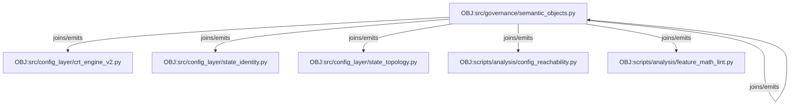
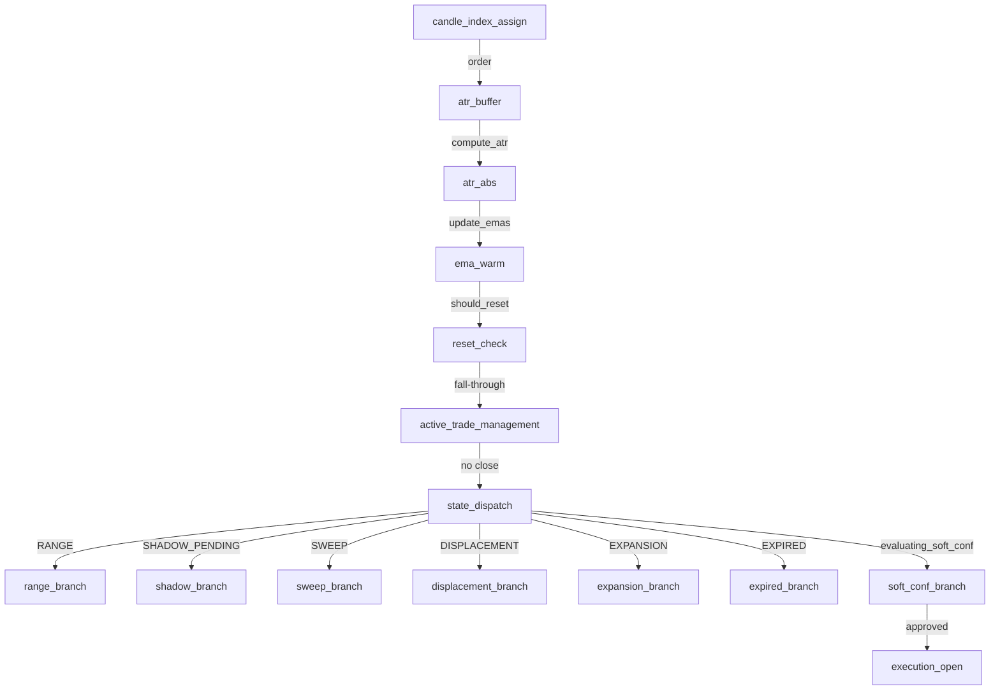
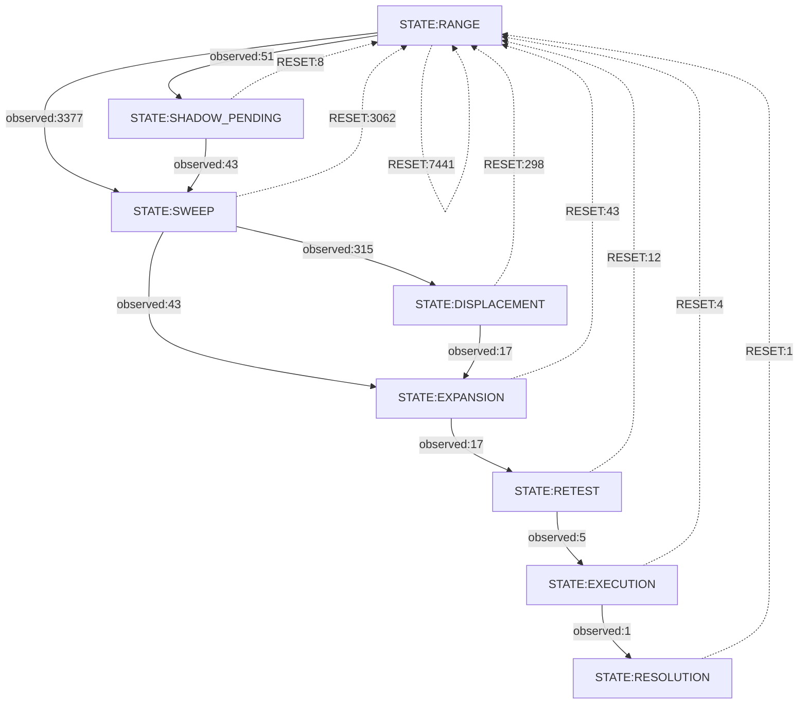

# CRT Semantic Execution Reconstruction

Scope: descriptive-only reconstruction of CRT runtime semantics. No `src/`, config, model, script, promotion, or ACTIVE_VERSION behavior is changed by this artifact.

## Inputs And Authority

- Authority order: source -> active config `v2_multi_2026_04` -> declared state topology -> tests -> historical findings as support only.
- Active config: `configs/production/v2_multi_2026_04.json`; active pointer: `configs/production/ACTIVE_VERSION`.
- Observed runtime event log: `xauusd_backtest_run/run_20260714_130606_XAUUSD/XAUUSD_events.jsonl` with 18,177 events from `2024-05-22T08:30:00` to `2026-05-21T23:00:00`.
- Machine twin: `reports/crt_semantic_execution_reconstruction.json`.

## Knowledge Objects

`src/governance/semantic_objects.py::build_objects()` is reused as the object layer. This reconstruction adds only descriptive `invariants` and `failure_modes` in the JSON twin; it does not modify the object builder.

- `CLAIM-SEM-001` build_objects is the deterministic knowledge-object layer and emits provenance-backed fields. Evidence: `src/governance/semantic_objects.py:478-627`, `src/governance/semantic_objects.py:69-114`
- `CLAIM-SEM-002` The encyclopedia is enrichment only, not the denominator. Evidence: `src/governance/semantic_objects.py:630-653`, `tests/test_semantic_os_objects.py:85-92`

Coverage report from `build_objects(universe="code")`:

- Total objects: `850`
- Encyclopedia covered: `785`, missing: `65`
- Module attribution missing: `12`
- Stale graph-dot absences: `0`

## Execution Semantics

The per-candle order is index assignment, bounded ATR buffer update, absolute ATR computation, EMA warmup, reset check, active-trade management, and state dispatch. Active trade closure returns early after `try_execution_to_resolution()` and `reset_to_range()`.

- `CLAIM-CRT-001` Validated state mutations go through _transition and illegal edges return False before mutation. Evidence: `src/config_layer/crt_engine_v2.py:980-1037`
- `CLAIM-CRT-002` reset_to_range directly assigns RANGE and emits RESET, so reset edges are not STATE_TRANSITION edges. Evidence: `src/config_layer/crt_engine_v2.py:1688-1777`
- `CLAIM-CRT-003` Reset predicates run before active-trade management and state dispatch in process_candle. Evidence: `src/config_layer/crt_engine_v2.py:2649-2697`
- `CLAIM-CRT-004` RETEST is handled through evaluating_soft_conf, not a dedicated s == CRTState.RETEST branch. Evidence: `src/config_layer/crt_engine_v2.py:2913-2921`, `src/config_layer/crt_engine_v2.py:3001-3244`
- `CLAIM-CRT-005` Shadow resume transitions SHADOW_PENDING to SWEEP to EXPANSION and skips the strength check by design. Evidence: `src/config_layer/crt_engine_v2.py:1066-1090`
- `CLAIM-CRT-006` Two-sided outside sweep candles choose the swept_high branch because direction is SHORT if swept_high else LONG. Evidence: `src/config_layer/crt_engine_v2.py:884-938`
- `CLAIM-CRT-007` Trade construction requires active_range, sweep_event, displacement_candle, and non-inverted SL before a Trade is returned. Evidence: `src/config_layer/crt_engine_v2.py:2191-2292`
- `CLAIM-CONFIG-001` Active version is v2_multi_2026_04 and CRT predicate values resolve from active config sections. Evidence: `configs/production/ACTIVE_VERSION:1`, `configs/production/v2_multi_2026_04.json:1-12`, `configs/production/v2_multi_2026_04.json:210-279`

## Active Configuration Values

| Key | Source section | Value |
| --- | --- | --- |
| `allowed_sessions` | `engine_runner` | `["london", "new_york", "overlap"]` |
| `atr_min_displacement` | `crt_engine` | `1.2` |
| `atr_multiplier_min` | `params` | `1.0` |
| `body_ratio_min` | `params` | `0.65` |
| `breakout_disp_threshold` | `crt_engine` | `1.5` |
| `exit_model` | `crt_engine` | `"intrabar_touch"` |
| `expansion_age_warn_candles` | `crt_engine` | `342` |
| `expansion_atr_min_distance` | `params` | `0.3` |
| `extension_reset_fib` | `crt_engine` | `1.618` |
| `max_displacement_strength` | `crt_engine` | `2.0` |
| `max_expansion_age_candles` | `crt_engine` | `495` |
| `max_expansion_age_hours` | `crt_engine` | `124` |
| `max_sweep_age_candles` | `crt_engine` | `20` |
| `pending_displacement_ttl_candles` | `crt_engine` | `4` |
| `retest_atr_depth_fraction` | `params` | `0.3` |
| `retest_depth_max` | `params` | `0.15` |
| `retest_min_depth_atr_fraction` | `crt_engine` | `0.1` |
| `retrace_reset_pct` | `crt_engine` | `0.5` |
| `score_threshold` | `crt_engine` | `0.45` |
| `session_windows` | `crt_engine` | `{"ASIA": ["00:00", "03:00"], "LONDON": ["07:00", "10:00"], "NEWYORK": ["13:00", "16:00"]}` |
| `shadow_advisory_only` | `crt_engine` | `false` |
| `shadow_age_norm_candles` | `crt_engine` | `0` |
| `shadow_age_penalty_lambda` | `crt_engine` | `0.0` |
| `soft_conf_max_candles` | `crt_engine` | `3` |
| `tier_1_threshold` | `crt_engine` | `0.75` |
| `tier_2_threshold` | `crt_engine` | `0.3` |
| `use_bitnet` | `crt_engine` | `false` |

## Runtime Evidence

Observed event counts from the XAUUSD reproduction log:

| Event | Count |
| --- | ---: |
| `RESET` | 10,881 |
| `STATE_TRANSITION` | 3,874 |
| `SWEEP` | 3,390 |
| `BEGIN_SOFT_CONF` | 17 |
| `FILTER_REJECTED` | 12 |
| `TRADE_OPENED` | 1 |
| `TRADE_TP1` | 1 |
| `TRADE_STOPPED` | 1 |

Observed `STATE_TRANSITION` edges:

| From | To | Count |
| --- | --- | ---: |
| `DISPLACEMENT` | `EXPANSION` | 17 |
| `EXECUTION` | `RESOLUTION` | 1 |
| `EXPANSION` | `RETEST` | 17 |
| `RANGE` | `SHADOW_PENDING` | 43 |
| `RANGE` | `SWEEP` | 3,390 |
| `RETEST` | `EXECUTION` | 5 |
| `SHADOW_PENDING` | `SWEEP` | 43 |
| `SWEEP` | `DISPLACEMENT` | 315 |
| `SWEEP` | `EXPANSION` | 43 |

Reset events are a separate edge class. Top reset reasons:

| From | To | Reason | Count |
| --- | --- | --- | ---: |
| `RETEST` | `RANGE` | `off_session_filter` | 12 |
| `DISPLACEMENT` | `RANGE` | `50% retrace hit (retrace=0.617)` | 2 |
| `DISPLACEMENT` | `RANGE` | `50% retrace hit (retrace=0.636)` | 2 |
| `DISPLACEMENT` | `RANGE` | `1.618 extension hit @ 2426.64550` | 1 |
| `DISPLACEMENT` | `RANGE` | `50% retrace hit (retrace=0.507)` | 1 |
| `DISPLACEMENT` | `RANGE` | `50% retrace hit (retrace=0.515)` | 1 |
| `DISPLACEMENT` | `RANGE` | `50% retrace hit (retrace=0.522)` | 1 |
| `DISPLACEMENT` | `RANGE` | `50% retrace hit (retrace=0.534)` | 1 |
| `DISPLACEMENT` | `RANGE` | `50% retrace hit (retrace=0.552)` | 1 |
| `DISPLACEMENT` | `RANGE` | `50% retrace hit (retrace=0.561)` | 1 |
| `DISPLACEMENT` | `RANGE` | `50% retrace hit (retrace=0.575)` | 1 |
| `DISPLACEMENT` | `RANGE` | `50% retrace hit (retrace=0.587)` | 1 |

## State Transition Overlay

> **CORRECTED 2026-08-08**: the original extraction for this section had a bug --
> its static AST parse of `VALID_TRANSITIONS` silently returned 0 nodes/0 edges,
> and observed edges were dumped as 14738 raw,
> un-aggregated rows instead of counted edges. Rebuilt via a live import of
> `config_layer.state_identity.VALID_TRANSITIONS` (the object `process_candle`
> itself resolves) and a fresh reproduction run
> (`scripts/analysis/crt_xauusd_runtime_trace.py --mode baseline`, Phase-1 frozen
> corpus, sha256 `4d73f5ce...aba56` verified before use). Everything else in this
> report is unaffected.

- Declared edges: `17` from `VALID_TRANSITIONS` (9 states).
- Observed `STATE_TRANSITION` edge types: `9` (total `3869` transitions).
- Observed `RESET` edge types: `8` (total `10869` resets).
- Illegal edges (observed but not declared): `0` -- **none**. The state machine has never violated its own declared graph on this corpus.
- Declared edges never observed as a `STATE_TRANSITION` event: `8` -- all 8 are `*->RANGE` (7) plus `EXPANSION->EXPIRED` (1). See `state_graph_classification.note` in the JSON: every `*->RANGE` death fires through the separate `RESET` event channel (`ResetLogic.should_reset` -> `reset_to_range`, which assigns state directly and never calls `_transition()`), so it is structurally absent from `STATE_TRANSITION` edges -- this is the FMODE-001/DRIFT-001 dual-mutation-authority finding, not evidence of unreachability. `EXPANSION->EXPIRED` simply never fired on this corpus (TTL never exhausted before reset or retest).

| From | To | Kind | Count |
| --- | --- | --- | ---: |
| `RANGE` | `SWEEP` | `observed_transition` | 3,377 |
| `SWEEP` | `DISPLACEMENT` | `observed_transition` | 315 |
| `RANGE` | `SHADOW_PENDING` | `observed_transition` | 51 |
| `SHADOW_PENDING` | `SWEEP` | `observed_transition` | 43 |
| `SWEEP` | `EXPANSION` | `observed_transition` | 43 |
| `EXPANSION` | `RETEST` | `observed_transition` | 17 |
| `DISPLACEMENT` | `EXPANSION` | `observed_transition` | 17 |
| `RETEST` | `EXECUTION` | `observed_transition` | 5 |
| `EXECUTION` | `RESOLUTION` | `observed_transition` | 1 |
| `RANGE` | `RANGE` | `reset` | 7,441 |
| `SWEEP` | `RANGE` | `reset` | 3,062 |
| `DISPLACEMENT` | `RANGE` | `reset` | 298 |
| `EXPANSION` | `RANGE` | `reset` | 43 |
| `RETEST` | `RANGE` | `reset` | 12 |
| `SHADOW_PENDING` | `RANGE` | `reset` | 8 |
| `EXECUTION` | `RANGE` | `reset` | 4 |
| `RESOLUTION` | `RANGE` | `reset` | 1 |

## Object Lifetime

Object lifetime is an AST assignment/delete scan over `state.*` and `self.state.*` attributes in key CRT functions. It is descriptive and lives only in the JSON; no script was promoted.

| Function | Attribute | Operation | Line |
| --- | --- | --- | ---: |
| `CRTEngine.process_candle` | `self.state.current_candle_index` | `AugAssign` | 2624 |
| `CRTEngine.process_candle` | `self.state.atr_abs` | `Assign` | 2633 |
| `CRTEngine.process_candle` | `self.state.active_trade` | `Assign` | 2654 |
| `CRTEngine.process_candle` | `self.state.active_trade.status` | `Assign` | 2654 |
| `CRTEngine.process_candle` | `self.state.active_range` | `Assign` | 2656 |
| `CRTEngine.process_candle` | `self.state.pending_displacement_ttl` | `AugAssign` | 2709 |
| `CRTEngine.process_candle` | `self.state.pending_displacement_candle` | `Assign` | 2714 |
| `CRTEngine.process_candle` | `self.state.pending_displacement_dir` | `Assign` | 2715 |
| `CRTEngine.process_candle` | `self.state.pending_displacement_created_idx` | `Assign` | 2716 |
| `CRTEngine.process_candle` | `self.state.pending_displacement_ttl` | `Assign` | 2824 |
| `CRTEngine.process_candle` | `self.state.pending_displacement_candle` | `Assign` | 2825 |
| `CRTEngine.process_candle` | `self.state.pending_displacement_dir` | `Assign` | 2826 |
| `CRTEngine.process_candle` | `self.state.pending_displacement_created_idx` | `Assign` | 2827 |
| `CRTEngine.process_candle` | `self.state._came_from_shadow` | `Assign` | 2841 |
| `CRTEngine.process_candle` | `self.state._shadow_htf_alignment` | `Assign` | 2849 |
| `CRTEngine.process_candle` | `self.state._shadow_htf_alignment` | `Assign` | 2854 |
| `CRTEngine.process_candle` | `self.state.pending_displacement_ttl` | `Assign` | 2856 |
| `CRTEngine.process_candle` | `self.state.pending_displacement_candle` | `Assign` | 2857 |
| `CRTEngine.process_candle` | `self.state.pending_displacement_dir` | `Assign` | 2858 |
| `CRTEngine.process_candle` | `self.state.pending_displacement_source_htf` | `Assign` | 2859 |
| `CRTEngine.process_candle` | `self.state.pending_displacement_formed_idx` | `Assign` | 2860 |
| `CRTEngine.process_candle` | `self.state.pending_displacement_age_at_reset` | `Assign` | 2861 |
| `CRTEngine.process_candle` | `self.state.pending_displacement_reason_created` | `Assign` | 2862 |
| `CRTEngine.process_candle` | `self.state.pending_displacement_created_idx` | `Assign` | 2863 |
| `CRTEngine.process_candle` | `self.state.evaluating_soft_conf` | `Assign` | 2916 |
| `CRTEngine.process_candle` | `self.state.soft_conf_candles` | `Assign` | 2917 |
| `CRTEngine.process_candle` | `self.state.soft_conf_candles` | `AugAssign` | 3003 |
| `CRTEngine.process_candle` | `self.state.evaluating_soft_conf` | `Assign` | 3073 |
| `CRTEngine.process_candle` | `self.state.risk_score` | `Assign` | 3094 |
| `CRTEngine.process_candle` | `self.state.risk_score.score_override` | `Assign` | 3094 |
| `CRTEngine.process_candle` | `self.state.active_trade` | `Assign` | 3157 |
| `CRTEngine.process_candle` | `self.state.evaluating_soft_conf` | `Assign` | 3227 |
| `StateMachine._transition` | `state.current_state` | `Assign` | 1020 |
| `StateMachine._transition` | `state._displacement_entry_idx` | `Assign` | 1022 |
| `StateMachine._transition` | `state._expansion_entry_idx` | `Assign` | 1024 |
| `StateMachine._transition` | `state._expansion_entry_ts` | `Assign` | 1025 |
| `StateMachine.reset_to_range` | `state.pending_displacement_candle` | `Assign` | 1740 |
| `StateMachine.reset_to_range` | `state.pending_displacement_dir` | `Assign` | 1741 |
| `StateMachine.reset_to_range` | `state.pending_displacement_ttl` | `Assign` | 1742 |
| `StateMachine.reset_to_range` | `state.pending_displacement_source_htf` | `Assign` | 1743 |
| `StateMachine.reset_to_range` | `state.pending_displacement_formed_idx` | `Assign` | 1746 |
| `StateMachine.reset_to_range` | `state.pending_displacement_age_at_reset` | `Assign` | 1747 |
| `StateMachine.reset_to_range` | `state.pending_displacement_reason_created` | `Assign` | 1750 |
| `StateMachine.reset_to_range` | `state.pending_displacement_created_idx` | `Assign` | 1754 |
| `StateMachine.reset_to_range` | `state.pending_displacement_candle` | `Assign` | 1759 |
| `StateMachine.reset_to_range` | `state.pending_displacement_ttl` | `Assign` | 1760 |
| `StateMachine.reset_to_range` | `state.pending_displacement_dir` | `Assign` | 1761 |
| `StateMachine.reset_to_range` | `state.pending_displacement_created_idx` | `Assign` | 1762 |
| `StateMachine.reset_to_range` | `state.current_state` | `Assign` | 1764 |
| `StateMachine.reset_to_range` | `state.sweep_event` | `Assign` | 1765 |
| `StateMachine.reset_to_range` | `state.displacement_candle` | `Assign` | 1766 |
| `StateMachine.reset_to_range` | `state.retest_candle` | `Assign` | 1767 |
| `StateMachine.reset_to_range` | `state.retest_candle_index` | `Assign` | 1768 |
| `StateMachine.reset_to_range` | `state.risk_score` | `Assign` | 1769 |
| `StateMachine.reset_to_range` | `state.direction` | `Assign` | 1770 |
| `StateMachine.reset_to_range` | `state.cached_features` | `Assign` | 1771 |
| `StateMachine.reset_to_range` | `state.evaluating_soft_conf` | `Assign` | 1772 |
| `StateMachine.reset_to_range` | `state.soft_conf_candles` | `Assign` | 1773 |
| `StateMachine.reset_to_range` | `state._came_from_shadow` | `Assign` | 1774 |
| `StateMachine.reset_to_range` | `state._expansion_entry_idx` | `Assign` | 1775 |
| `StateMachine.reset_to_range` | `state._expansion_entry_ts` | `Assign` | 1776 |
| `StateMachine.reset_to_range` | `state._shadow_htf_alignment` | `Assign` | 1777 |
| `StateMachine.try_expansion_to_retest` | `state.retest_candle` | `Assign` | 1595 |
| `StateMachine.try_expansion_to_retest` | `state.retest_candle_index` | `Assign` | 1596 |
| `StateMachine.try_expansion_to_retest` | `state.cached_features` | `Assign` | 1605 |
| `StateMachine.try_expansion_to_retest` | `state.cached_features` | `Assign` | 1622 |
| `StateMachine.try_range_to_shadow_pending` | `state.sweep_event` | `Assign` | 1058 |
| `StateMachine.try_range_to_shadow_pending` | `state.direction` | `Assign` | 1059 |
| `StateMachine.try_range_to_sweep` | `state.sweep_event` | `Assign` | 1045 |
| `StateMachine.try_range_to_sweep` | `state.direction` | `Assign` | 1046 |
| `StateMachine.try_shadow_pending_to_expansion` | `state.displacement_candle` | `Assign` | 1076 |
| `StateMachine.try_shadow_pending_to_expansion` | `state.direction` | `Assign` | 1077 |
| `StateMachine.try_sweep_to_displacement` | `state.displacement_candle` | `Assign` | 1268 |
| `UltronRiskEngine.approve` | `state.risk_score` | `Assign` | 2061 |
| `UltronRiskEngine.approve` | `state.bitnet_main_score` | `Assign` | 2082 |
| `UltronRiskEngine.approve` | `state.risk_score` | `Assign` | 2091 |
| `UltronRiskEngine.approve_with_soft_conf` | `state.risk_score` | `Assign` | 1976 |
| `UltronRiskEngine.approve_with_soft_conf` | `state.risk_score` | `Assign` | 2016 |

```mermaid
flowchart TD
  FN_StateMachine__transition["FN:StateMachine._transition"] -->|"Assign"| ATTR_state_current_state["ATTR:state.current_state"]
  FN_StateMachine__transition["FN:StateMachine._transition"] -->|"Assign"| ATTR_state__displacement_entry_idx["ATTR:state._displacement_entry_idx"]
  FN_StateMachine__transition["FN:StateMachine._transition"] -->|"Assign"| ATTR_state__expansion_entry_idx["ATTR:state._expansion_entry_idx"]
  FN_StateMachine__transition["FN:StateMachine._transition"] -->|"Assign"| ATTR_state__expansion_entry_ts["ATTR:state._expansion_entry_ts"]
  FN_StateMachine_try_range_to_sweep["FN:StateMachine.try_range_to_sweep"] -->|"Assign"| ATTR_state_sweep_event["ATTR:state.sweep_event"]
  FN_StateMachine_try_range_to_sweep["FN:StateMachine.try_range_to_sweep"] -->|"Assign"| ATTR_state_direction["ATTR:state.direction"]
  FN_StateMachine_try_range_to_shadow_pending["FN:StateMachine.try_range_to_shadow_pending"] -->|"Assign"| ATTR_state_sweep_event["ATTR:state.sweep_event"]
  FN_StateMachine_try_range_to_shadow_pending["FN:StateMachine.try_range_to_shadow_pending"] -->|"Assign"| ATTR_state_direction["ATTR:state.direction"]
  FN_StateMachine_try_shadow_pending_to_expansion["FN:StateMachine.try_shadow_pending_to_expansion"] -->|"Assign"| ATTR_state_displacement_candle["ATTR:state.displacement_candle"]
  FN_StateMachine_try_shadow_pending_to_expansion["FN:StateMachine.try_shadow_pending_to_expansion"] -->|"Assign"| ATTR_state_direction["ATTR:state.direction"]
  FN_StateMachine_try_sweep_to_displacement["FN:StateMachine.try_sweep_to_displacement"] -->|"Assign"| ATTR_state_displacement_candle["ATTR:state.displacement_candle"]
  FN_StateMachine_try_expansion_to_retest["FN:StateMachine.try_expansion_to_retest"] -->|"Assign"| ATTR_state_retest_candle["ATTR:state.retest_candle"]
  FN_StateMachine_try_expansion_to_retest["FN:StateMachine.try_expansion_to_retest"] -->|"Assign"| ATTR_state_retest_candle_index["ATTR:state.retest_candle_index"]
  FN_StateMachine_try_expansion_to_retest["FN:StateMachine.try_expansion_to_retest"] -->|"Assign"| ATTR_state_cached_features["ATTR:state.cached_features"]
  FN_StateMachine_try_expansion_to_retest["FN:StateMachine.try_expansion_to_retest"] -->|"Assign"| ATTR_state_cached_features["ATTR:state.cached_features"]
  FN_StateMachine_reset_to_range["FN:StateMachine.reset_to_range"] -->|"Assign"| ATTR_state_current_state["ATTR:state.current_state"]
  FN_StateMachine_reset_to_range["FN:StateMachine.reset_to_range"] -->|"Assign"| ATTR_state_sweep_event["ATTR:state.sweep_event"]
  FN_StateMachine_reset_to_range["FN:StateMachine.reset_to_range"] -->|"Assign"| ATTR_state_displacement_candle["ATTR:state.displacement_candle"]
  FN_StateMachine_reset_to_range["FN:StateMachine.reset_to_range"] -->|"Assign"| ATTR_state_retest_candle["ATTR:state.retest_candle"]
  FN_StateMachine_reset_to_range["FN:StateMachine.reset_to_range"] -->|"Assign"| ATTR_state_retest_candle_index["ATTR:state.retest_candle_index"]
  FN_StateMachine_reset_to_range["FN:StateMachine.reset_to_range"] -->|"Assign"| ATTR_state_risk_score["ATTR:state.risk_score"]
  FN_StateMachine_reset_to_range["FN:StateMachine.reset_to_range"] -->|"Assign"| ATTR_state_direction["ATTR:state.direction"]
  FN_StateMachine_reset_to_range["FN:StateMachine.reset_to_range"] -->|"Assign"| ATTR_state_cached_features["ATTR:state.cached_features"]
  FN_StateMachine_reset_to_range["FN:StateMachine.reset_to_range"] -->|"Assign"| ATTR_state_evaluating_soft_conf["ATTR:state.evaluating_soft_conf"]
  FN_StateMachine_reset_to_range["FN:StateMachine.reset_to_range"] -->|"Assign"| ATTR_state_soft_conf_candles["ATTR:state.soft_conf_candles"]
  FN_StateMachine_reset_to_range["FN:StateMachine.reset_to_range"] -->|"Assign"| ATTR_state__came_from_shadow["ATTR:state._came_from_shadow"]
  FN_StateMachine_reset_to_range["FN:StateMachine.reset_to_range"] -->|"Assign"| ATTR_state__expansion_entry_idx["ATTR:state._expansion_entry_idx"]
  FN_StateMachine_reset_to_range["FN:StateMachine.reset_to_range"] -->|"Assign"| ATTR_state__expansion_entry_ts["ATTR:state._expansion_entry_ts"]
  FN_StateMachine_reset_to_range["FN:StateMachine.reset_to_range"] -->|"Assign"| ATTR_state__shadow_htf_alignment["ATTR:state._shadow_htf_alignment"]
  FN_StateMachine_reset_to_range["FN:StateMachine.reset_to_range"] -->|"Assign"| ATTR_state_pending_displacement_candle["ATTR:state.pending_displacement_candle"]
  FN_StateMachine_reset_to_range["FN:StateMachine.reset_to_range"] -->|"Assign"| ATTR_state_pending_displacement_dir["ATTR:state.pending_displacement_dir"]
  FN_StateMachine_reset_to_range["FN:StateMachine.reset_to_range"] -->|"Assign"| ATTR_state_pending_displacement_ttl["ATTR:state.pending_displacement_ttl"]
  FN_StateMachine_reset_to_range["FN:StateMachine.reset_to_range"] -->|"Assign"| ATTR_state_pending_displacement_source_htf["ATTR:state.pending_displacement_source_htf"]
  FN_StateMachine_reset_to_range["FN:StateMachine.reset_to_range"] -->|"Assign"| ATTR_state_pending_displacement_formed_idx["ATTR:state.pending_displacement_formed_idx"]
  FN_StateMachine_reset_to_range["FN:StateMachine.reset_to_range"] -->|"Assign"| ATTR_state_pending_displacement_age_at_reset["ATTR:state.pending_displacement_age_at_reset"]
  FN_StateMachine_reset_to_range["FN:StateMachine.reset_to_range"] -->|"Assign"| ATTR_state_pending_displacement_reason_created["ATTR:state.pending_displacement_reason_created"]
  FN_StateMachine_reset_to_range["FN:StateMachine.reset_to_range"] -->|"Assign"| ATTR_state_pending_displacement_created_idx["ATTR:state.pending_displacement_created_idx"]
  FN_StateMachine_reset_to_range["FN:StateMachine.reset_to_range"] -->|"Assign"| ATTR_state_pending_displacement_candle["ATTR:state.pending_displacement_candle"]
  FN_StateMachine_reset_to_range["FN:StateMachine.reset_to_range"] -->|"Assign"| ATTR_state_pending_displacement_ttl["ATTR:state.pending_displacement_ttl"]
  FN_StateMachine_reset_to_range["FN:StateMachine.reset_to_range"] -->|"Assign"| ATTR_state_pending_displacement_dir["ATTR:state.pending_displacement_dir"]
  FN_StateMachine_reset_to_range["FN:StateMachine.reset_to_range"] -->|"Assign"| ATTR_state_pending_displacement_created_idx["ATTR:state.pending_displacement_created_idx"]
  FN_UltronRiskEngine_approve_with_soft_conf["FN:UltronRiskEngine.approve_with_soft_conf"] -->|"Assign"| ATTR_state_risk_score["ATTR:state.risk_score"]
  FN_UltronRiskEngine_approve_with_soft_conf["FN:UltronRiskEngine.approve_with_soft_conf"] -->|"Assign"| ATTR_state_risk_score["ATTR:state.risk_score"]
  FN_UltronRiskEngine_approve["FN:UltronRiskEngine.approve"] -->|"Assign"| ATTR_state_risk_score["ATTR:state.risk_score"]
  FN_UltronRiskEngine_approve["FN:UltronRiskEngine.approve"] -->|"Assign"| ATTR_state_risk_score["ATTR:state.risk_score"]
  MORE["... 33 more edges in JSON"]
```

## Predicate Dependency

Predicate dependencies are AST `if`/`while` tests that touch config keys, state attributes, candle attributes, or calls. They are not recommendations and do not infer defects.

| Function:line | Config keys | State attrs | Predicate |
| --- | --- | --- | --- |
| `RangeDetector.compute_atr:870` |  |  | `len(candles) < 2` |
| `StateMachine.try_sweep_to_displacement:1139` |  | `state.sweep_event` | `state.sweep_event is not None` |
| `StateMachine.try_sweep_to_displacement:1176` | `body_ratio_min` |  | `candle.body_ratio < self.config.body_ratio_min` |
| `StateMachine.try_sweep_to_displacement:1208` | `atr_multiplier_min` | `state.atr_abs` | `state.atr_abs > 0 and candle.wick_size < self.config.atr_multiplier_min * state.atr_abs` |
| `StateMachine.try_sweep_to_displacement:1141` | `max_sweep_age_candles` |  | `age > self.config.max_sweep_age_candles` |
| `StateMachine.try_displacement_to_expansion:1285` |  | `state.displacement_candle` | `state.displacement_candle is None` |
| `StateMachine.try_displacement_to_expansion:1308` |  |  | `is_long and (not candle.close > candle.open)` |
| `StateMachine.try_displacement_to_expansion:1326` |  |  | `is_short and (not candle.close < candle.open)` |
| `StateMachine.try_displacement_to_expansion:1346` |  |  | `is_long and candle.close <= disp_close` |
| `StateMachine.try_displacement_to_expansion:1367` |  |  | `is_short and candle.close >= disp_close` |
| `StateMachine.try_displacement_to_expansion:1390` |  | `state.atr_abs` | `state.atr_abs > 0` |
| `StateMachine.try_expansion_to_retest:1457` |  | `state.active_range` | `state.active_range is None` |
| `StateMachine.try_expansion_to_retest:1479` |  | `state.direction` | `state.direction == Direction.LONG` |
| `StateMachine.try_expansion_to_retest:1610` |  |  | `disp is not None and _atr > 0 and (abs(disp.close - disp.open) > 0)` |
| `StateMachine.try_expansion_to_retest:1565` | `max_displacement_strength` |  | `_displacement_atr_ratio > self.config.max_displacement_strength` |
| `StateMachine.reset_to_range:1757` |  | `state.pending_displacement_ttl` | `state.pending_displacement_ttl > 0 and (not _create_shadow)` |
| `UltronRiskEngine.approve_with_soft_conf:1969` | `max_spread_pct` |  | `self._current_spread_pct > self.config.max_spread_pct` |
| `UltronRiskEngine.approve_with_soft_conf:1988` |  | `state.cached_features` | `state.cached_features and all((k in state.cached_features for k in required))` |
| `UltronRiskEngine.approve_with_soft_conf:2030` | `tier_1_threshold` |  | `S >= self.config.tier_1_threshold` |
| `UltronRiskEngine.approve_with_soft_conf:1995` | `use_bitnet` |  | `self.config.use_bitnet` |
| `UltronRiskEngine.approve_with_soft_conf:2033` | `tier_2_threshold` |  | `S >= self.config.tier_2_threshold` |
| `UltronRiskEngine.approve_with_soft_conf:2012` | `bitnet_main_threshold` |  | `bn_score < self.config.bitnet_main_threshold` |
| `UltronRiskEngine.approve:2049` | `max_spread_pct` |  | `self._current_spread_pct > self.config.max_spread_pct` |
| `UltronRiskEngine.approve:2070` |  | `state.cached_features` | `state.cached_features and all((k in state.cached_features for k in required))` |
| `UltronRiskEngine.approve:2098` |  |  | `ref_candle and self.score_time(ref_candle.timestamp) == 0.0` |
| `UltronRiskEngine.approve:2102` |  | `state.sweep_event` | `state.sweep_event` |
| `UltronRiskEngine.approve:2109` | `score_threshold` |  | `adjusted_score < self.config.score_threshold` |
| `UltronRiskEngine.approve:2077` |  |  | `not hasattr(state, 'bitnet_main_score')` |
| `UltronRiskEngine.approve:2088` | `bitnet_main_threshold` |  | `bitnet_main_score < self.config.bitnet_main_threshold` |
| `UltronRiskEngine.approve:2103` |  | `state.sweep_event`, `state.sweep_event.double_confirmed` | `state.sweep_event.double_confirmed` |
| `ExecutionEngine.build_trade:2194` |  | `state.active_range`, `state.sweep_event` | `state.active_range is None or state.sweep_event is None` |
| `ExecutionEngine.build_trade:2209` |  | `state.displacement_candle` | `state.displacement_candle is None` |
| `ExecutionEngine.build_trade:2265` |  | `state.risk_score` | `state.risk_score and risk_engine` |
| `ExecutionEngine.build_trade:2269` |  | `state.risk_score` | `state.risk_score` |
| `ResetLogic.should_reset:2379` |  | `state.active_range` | `state.active_range is None` |
| `ResetLogic.should_reset:2385` |  | `state.active_trade`, `state.active_trade.status` | `state.active_trade and state.active_trade.status in ('OPEN', 'TP1')` |
| `ResetLogic.should_reset:2388` |  | `state.active_range`, `state.active_range.htf_candle_id` | `current_htf_id != state.active_range.htf_candle_id` |
| `ResetLogic.should_reset:2395` |  | `state.displacement_candle` | `state.displacement_candle is not None` |
| `ResetLogic.should_reset:2402` |  | `state.displacement_candle`, `state.sweep_event` | `state.sweep_event is not None and state.displacement_candle is not None` |
| `ResetLogic.should_reset:2389` |  | `state.current_state` | `state.current_state in [CRTState.EXPANSION, CRTState.RETEST]` |
| `ResetLogic.should_reset:2399` | `retrace_reset_pct` |  | `retrace >= self.config.retrace_reset_pct` |
| `ResetLogic.should_reset:2406` |  | `state.direction` | `state.direction == Direction.LONG` |
| `CRTEngine.process_candle:2610` |  |  | `_bt is not None and getattr(_bt, 'enabled', False)` |
| `CRTEngine.process_candle:2630` |  |  | `len(self.candle_buffer) > cap` |
| `CRTEngine.process_candle:2668` |  | `self.state.active_trade`, `self.state.active_trade.status` | `self.state.active_trade and self.state.active_trade.status in ('OPEN', 'TP1')` |
| `CRTEngine.process_candle:2652` |  | `self.state.active_trade`, `self.state.active_trade.status` | `self.state.active_trade and self.state.active_trade.status == 'OPEN'` |
| `CRTEngine.process_candle:2707` |  | `self.state.pending_displacement_created_idx`, `self.state.pending_displacement_ttl` | `self.state.pending_displacement_ttl > 0 and candle.index != self.state.pending_displacement_created_idx` |
| `CRTEngine.process_candle:2710` |  | `self.state.pending_displacement_ttl` | `self.state.pending_displacement_ttl == 0` |
| `CRTEngine.process_candle:2758` |  | `self.state.pending_displacement_candle`, `self.state.pending_displacement_dir` | `self.state.pending_displacement_candle is not None and sweep.direction == self.state.pending_displacement_dir` |
| `CRTEngine.process_candle:2780` |  | `self.state.active_range` | `self._sweep_tracer is not None and self.state.active_range is not None` |
| `CRTEngine.process_candle:2837` |  |  | `self.sm.try_shadow_pending_to_expansion(self.state, candle, self.ev_log)` |
| `CRTEngine.process_candle:2867` |  |  | `self.sm.try_sweep_to_displacement(self.state, candle, self.ev_log)` |
| `CRTEngine.process_candle:2869` | `max_sweep_age_candles` | `self.state.current_candle_index`, `self.state.sweep_event`, `self.state.sweep_event.candle_index` | `self.state.sweep_event and self.state.current_candle_index - self.state.sweep_event.candle_index > self.config.max_sweep_age_candles` |
| `CRTEngine.process_candle:2903` |  |  | `self.sm.try_displacement_to_expansion(self.state, candle, self.ev_log)` |
| `CRTEngine.process_candle:2875` |  | `self.state.active_range` | `self._sweep_tracer is not None and self.state.active_range is not None` |
| `CRTEngine.process_candle:2913` |  | `self.state.atr_abs` | `self.sm.try_expansion_to_retest(self.state, candle, self.state.atr_abs, self.ev_log)` |
| `CRTEngine.process_candle:2931` |  | `self.state._expansion_entry_ts` | `self.state._expansion_entry_ts is not None` |
| `CRTEngine.process_candle:3001` |  | `self.state.evaluating_soft_conf` | `self.state.evaluating_soft_conf` |
| `CRTEngine.process_candle:3024` |  | `self.state._came_from_shadow` | `self.state._came_from_shadow` |
| `CRTEngine.process_candle:3079` |  | `self.state.direction` | `self.state.direction == Direction.LONG and entry_price > mid` |
| `CRTEngine.process_candle:3225` | `soft_conf_max_candles` | `self.state.soft_conf_candles` | `self.state.soft_conf_candles >= self.config.soft_conf_max_candles` |
| `CRTEngine.process_candle:3037` | `tier_2_threshold` |  | `approved and _effective_S < self.config.tier_2_threshold` |
| `CRTEngine.process_candle:3085` |  | `self.state.direction` | `self.state.direction == Direction.SHORT and entry_price < mid` |
| `CRTEngine.process_candle:3093` |  | `self.state.risk_score` | `self.state.risk_score` |
| `CRTEngine.process_candle:3116` | `allowed_sessions` |  | `_sess_name not in self.config.allowed_sessions` |
| `CRTEngine.process_candle:3134` | `shadow_advisory_only` | `self.state._came_from_shadow` | `self.config.shadow_advisory_only and self.state._came_from_shadow` |
| `CRTEngine.process_candle:3194` | `max_expansion_age_candles` |  | `self.config.max_expansion_age_candles > 0 and _struct_age > self.config.max_expansion_age_candles` |

```mermaid
flowchart TD
  STATEATTR_state_sweep_event["STATEATTR:state.sweep_event"] -->|"state input"| PRED_1["PRED:1"]
  CFG_body_ratio_min["CFG:body_ratio_min"] -->|"threshold/input"| PRED_2["PRED:2"]
  CFG_atr_multiplier_min["CFG:atr_multiplier_min"] -->|"threshold/input"| PRED_3["PRED:3"]
  STATEATTR_state_atr_abs["STATEATTR:state.atr_abs"] -->|"state input"| PRED_3["PRED:3"]
  CFG_max_sweep_age_candles["CFG:max_sweep_age_candles"] -->|"threshold/input"| PRED_4["PRED:4"]
  STATEATTR_state_displacement_candle["STATEATTR:state.displacement_candle"] -->|"state input"| PRED_5["PRED:5"]
  STATEATTR_state_atr_abs["STATEATTR:state.atr_abs"] -->|"state input"| PRED_10["PRED:10"]
  STATEATTR_state_active_range["STATEATTR:state.active_range"] -->|"state input"| PRED_11["PRED:11"]
  STATEATTR_state_direction["STATEATTR:state.direction"] -->|"state input"| PRED_12["PRED:12"]
  CFG_max_displacement_strength["CFG:max_displacement_strength"] -->|"threshold/input"| PRED_14["PRED:14"]
  STATEATTR_state_pending_displacement_ttl["STATEATTR:state.pending_displacement_ttl"] -->|"state input"| PRED_15["PRED:15"]
  CFG_max_spread_pct["CFG:max_spread_pct"] -->|"threshold/input"| PRED_16["PRED:16"]
  STATEATTR_state_cached_features["STATEATTR:state.cached_features"] -->|"state input"| PRED_17["PRED:17"]
  CFG_tier_1_threshold["CFG:tier_1_threshold"] -->|"threshold/input"| PRED_18["PRED:18"]
  CFG_use_bitnet["CFG:use_bitnet"] -->|"threshold/input"| PRED_19["PRED:19"]
  CFG_tier_2_threshold["CFG:tier_2_threshold"] -->|"threshold/input"| PRED_20["PRED:20"]
  CFG_bitnet_main_threshold["CFG:bitnet_main_threshold"] -->|"threshold/input"| PRED_21["PRED:21"]
  CFG_max_spread_pct["CFG:max_spread_pct"] -->|"threshold/input"| PRED_22["PRED:22"]
  STATEATTR_state_cached_features["STATEATTR:state.cached_features"] -->|"state input"| PRED_23["PRED:23"]
  STATEATTR_state_sweep_event["STATEATTR:state.sweep_event"] -->|"state input"| PRED_25["PRED:25"]
  CFG_score_threshold["CFG:score_threshold"] -->|"threshold/input"| PRED_26["PRED:26"]
  CFG_bitnet_main_threshold["CFG:bitnet_main_threshold"] -->|"threshold/input"| PRED_28["PRED:28"]
  STATEATTR_state_sweep_event["STATEATTR:state.sweep_event"] -->|"state input"| PRED_29["PRED:29"]
  STATEATTR_state_sweep_event_double_confirmed["STATEATTR:state.sweep_event.double_confirmed"] -->|"state input"| PRED_29["PRED:29"]
  STATEATTR_state_active_range["STATEATTR:state.active_range"] -->|"state input"| PRED_30["PRED:30"]
  STATEATTR_state_sweep_event["STATEATTR:state.sweep_event"] -->|"state input"| PRED_30["PRED:30"]
  STATEATTR_state_displacement_candle["STATEATTR:state.displacement_candle"] -->|"state input"| PRED_31["PRED:31"]
  STATEATTR_state_risk_score["STATEATTR:state.risk_score"] -->|"state input"| PRED_32["PRED:32"]
  STATEATTR_state_risk_score["STATEATTR:state.risk_score"] -->|"state input"| PRED_33["PRED:33"]
  STATEATTR_state_active_range["STATEATTR:state.active_range"] -->|"state input"| PRED_34["PRED:34"]
  STATEATTR_state_active_trade["STATEATTR:state.active_trade"] -->|"state input"| PRED_35["PRED:35"]
  STATEATTR_state_active_trade_status["STATEATTR:state.active_trade.status"] -->|"state input"| PRED_35["PRED:35"]
  STATEATTR_state_active_range["STATEATTR:state.active_range"] -->|"state input"| PRED_36["PRED:36"]
  STATEATTR_state_active_range_htf_candle_id["STATEATTR:state.active_range.htf_candle_id"] -->|"state input"| PRED_36["PRED:36"]
  STATEATTR_state_displacement_candle["STATEATTR:state.displacement_candle"] -->|"state input"| PRED_37["PRED:37"]
  STATEATTR_state_displacement_candle["STATEATTR:state.displacement_candle"] -->|"state input"| PRED_38["PRED:38"]
  STATEATTR_state_sweep_event["STATEATTR:state.sweep_event"] -->|"state input"| PRED_38["PRED:38"]
  STATEATTR_state_current_state["STATEATTR:state.current_state"] -->|"state input"| PRED_39["PRED:39"]
  CFG_retrace_reset_pct["CFG:retrace_reset_pct"] -->|"threshold/input"| PRED_40["PRED:40"]
  STATEATTR_state_direction["STATEATTR:state.direction"] -->|"state input"| PRED_41["PRED:41"]
  STATEATTR_self_state_active_trade["STATEATTR:self.state.active_trade"] -->|"state input"| PRED_44["PRED:44"]
  STATEATTR_self_state_active_trade_status["STATEATTR:self.state.active_trade.status"] -->|"state input"| PRED_44["PRED:44"]
  STATEATTR_self_state_active_trade["STATEATTR:self.state.active_trade"] -->|"state input"| PRED_45["PRED:45"]
  STATEATTR_self_state_active_trade_status["STATEATTR:self.state.active_trade.status"] -->|"state input"| PRED_45["PRED:45"]
  STATEATTR_self_state_pending_displacement_created_idx["STATEATTR:self.state.pending_displacement_created_idx"] -->|"state input"| PRED_46["PRED:46"]
  MORE["... 24 more edges in JSON"]
```

## Configuration Influence

Config influence is represented as `ACTIVE_VERSION -> v2_multi_2026_04 -> key -> predicate` edges.

```mermaid
flowchart TD
  CONFIG_ACTIVE_VERSION["CONFIG:ACTIVE_VERSION"] -->|"resolves"| CONFIG_v2_multi_2026_04["CONFIG:v2_multi_2026_04"]
  CONFIG_v2_multi_2026_04["CONFIG:v2_multi_2026_04"] -->|"params"| CFG_retest_depth_max["CFG:retest_depth_max"]
  CONFIG_v2_multi_2026_04["CONFIG:v2_multi_2026_04"] -->|"params"| CFG_retest_atr_depth_fraction["CFG:retest_atr_depth_fraction"]
  CONFIG_v2_multi_2026_04["CONFIG:v2_multi_2026_04"] -->|"params"| CFG_body_ratio_min["CFG:body_ratio_min"]
  CONFIG_v2_multi_2026_04["CONFIG:v2_multi_2026_04"] -->|"params"| CFG_atr_multiplier_min["CFG:atr_multiplier_min"]
  CONFIG_v2_multi_2026_04["CONFIG:v2_multi_2026_04"] -->|"params"| CFG_expansion_atr_min_distance["CFG:expansion_atr_min_distance"]
  CONFIG_v2_multi_2026_04["CONFIG:v2_multi_2026_04"] -->|"crt_engine"| CFG_max_sweep_age_candles["CFG:max_sweep_age_candles"]
  CONFIG_v2_multi_2026_04["CONFIG:v2_multi_2026_04"] -->|"crt_engine"| CFG_atr_min_displacement["CFG:atr_min_displacement"]
  CONFIG_v2_multi_2026_04["CONFIG:v2_multi_2026_04"] -->|"crt_engine"| CFG_retrace_reset_pct["CFG:retrace_reset_pct"]
  CONFIG_v2_multi_2026_04["CONFIG:v2_multi_2026_04"] -->|"crt_engine"| CFG_tier_1_threshold["CFG:tier_1_threshold"]
  CONFIG_v2_multi_2026_04["CONFIG:v2_multi_2026_04"] -->|"crt_engine"| CFG_tier_2_threshold["CFG:tier_2_threshold"]
  CONFIG_v2_multi_2026_04["CONFIG:v2_multi_2026_04"] -->|"crt_engine"| CFG_soft_conf_max_candles["CFG:soft_conf_max_candles"]
  CONFIG_v2_multi_2026_04["CONFIG:v2_multi_2026_04"] -->|"crt_engine"| CFG_session_windows["CFG:session_windows"]
  CONFIG_v2_multi_2026_04["CONFIG:v2_multi_2026_04"] -->|"engine_runner"| CFG_allowed_sessions["CFG:allowed_sessions"]
  CONFIG_v2_multi_2026_04["CONFIG:v2_multi_2026_04"] -->|"crt_engine"| CFG_max_displacement_strength["CFG:max_displacement_strength"]
  CONFIG_v2_multi_2026_04["CONFIG:v2_multi_2026_04"] -->|"crt_engine"| CFG_extension_reset_fib["CFG:extension_reset_fib"]
  CONFIG_v2_multi_2026_04["CONFIG:v2_multi_2026_04"] -->|"crt_engine"| CFG_pending_displacement_ttl_candles["CFG:pending_displacement_ttl_candles"]
  CONFIG_v2_multi_2026_04["CONFIG:v2_multi_2026_04"] -->|"crt_engine"| CFG_max_expansion_age_candles["CFG:max_expansion_age_candles"]
  CONFIG_v2_multi_2026_04["CONFIG:v2_multi_2026_04"] -->|"crt_engine"| CFG_max_expansion_age_hours["CFG:max_expansion_age_hours"]
  CONFIG_v2_multi_2026_04["CONFIG:v2_multi_2026_04"] -->|"crt_engine"| CFG_expansion_age_warn_candles["CFG:expansion_age_warn_candles"]
  CONFIG_v2_multi_2026_04["CONFIG:v2_multi_2026_04"] -->|"crt_engine"| CFG_shadow_advisory_only["CFG:shadow_advisory_only"]
  CONFIG_v2_multi_2026_04["CONFIG:v2_multi_2026_04"] -->|"crt_engine"| CFG_shadow_age_norm_candles["CFG:shadow_age_norm_candles"]
  CONFIG_v2_multi_2026_04["CONFIG:v2_multi_2026_04"] -->|"crt_engine"| CFG_shadow_age_penalty_lambda["CFG:shadow_age_penalty_lambda"]
  CONFIG_v2_multi_2026_04["CONFIG:v2_multi_2026_04"] -->|"crt_engine"| CFG_retest_min_depth_atr_fraction["CFG:retest_min_depth_atr_fraction"]
  CONFIG_v2_multi_2026_04["CONFIG:v2_multi_2026_04"] -->|"crt_engine"| CFG_use_bitnet["CFG:use_bitnet"]
  CONFIG_v2_multi_2026_04["CONFIG:v2_multi_2026_04"] -->|"crt_engine"| CFG_score_threshold["CFG:score_threshold"]
  CONFIG_v2_multi_2026_04["CONFIG:v2_multi_2026_04"] -->|"crt_engine"| CFG_breakout_disp_threshold["CFG:breakout_disp_threshold"]
  CONFIG_v2_multi_2026_04["CONFIG:v2_multi_2026_04"] -->|"crt_engine"| CFG_exit_model["CFG:exit_model"]
  CFG_body_ratio_min["CFG:body_ratio_min"] -->|"StateMachine.try_sweep_to_displacement"| PRED_2["PRED:2"]
  CFG_atr_multiplier_min["CFG:atr_multiplier_min"] -->|"StateMachine.try_sweep_to_displacement"| PRED_3["PRED:3"]
  CFG_max_sweep_age_candles["CFG:max_sweep_age_candles"] -->|"StateMachine.try_sweep_to_displacement"| PRED_4["PRED:4"]
  CFG_max_displacement_strength["CFG:max_displacement_strength"] -->|"StateMachine.try_expansion_to_retest"| PRED_14["PRED:14"]
  CFG_tier_1_threshold["CFG:tier_1_threshold"] -->|"UltronRiskEngine.approve_with_soft_conf"| PRED_18["PRED:18"]
  CFG_use_bitnet["CFG:use_bitnet"] -->|"UltronRiskEngine.approve_with_soft_conf"| PRED_19["PRED:19"]
  CFG_tier_2_threshold["CFG:tier_2_threshold"] -->|"UltronRiskEngine.approve_with_soft_conf"| PRED_20["PRED:20"]
  CFG_score_threshold["CFG:score_threshold"] -->|"UltronRiskEngine.approve"| PRED_26["PRED:26"]
  CFG_retrace_reset_pct["CFG:retrace_reset_pct"] -->|"ResetLogic.should_reset"| PRED_40["PRED:40"]
  CFG_max_sweep_age_candles["CFG:max_sweep_age_candles"] -->|"CRTEngine.process_candle"| PRED_52["PRED:52"]
  CFG_soft_conf_max_candles["CFG:soft_conf_max_candles"] -->|"CRTEngine.process_candle"| PRED_60["PRED:60"]
  CFG_tier_2_threshold["CFG:tier_2_threshold"] -->|"CRTEngine.process_candle"| PRED_61["PRED:61"]
  CFG_allowed_sessions["CFG:allowed_sessions"] -->|"CRTEngine.process_candle"| PRED_64["PRED:64"]
  CFG_shadow_advisory_only["CFG:shadow_advisory_only"] -->|"CRTEngine.process_candle"| PRED_65["PRED:65"]
  CFG_max_expansion_age_candles["CFG:max_expansion_age_candles"] -->|"CRTEngine.process_candle"| PRED_66["PRED:66"]
```

## Static Call Graph

The static call graph is supporting evidence, stored under `graphs.static_call_graph_supporting` in the JSON.

## Verified Invariants

- `INV-001` StateMachine._transition validates target membership before mutating current_state.
- `INV-002` Reset-to-RANGE is a separate mutation/event channel from STATE_TRANSITION.
- `INV-003` process_candle computes absolute ATR and warms EMA before reset/trade/state dispatch.
- `INV-004` Soft confirmation starts when expansion-to-retest succeeds and is bounded by soft_conf_max_candles.
- `INV-005` The object-layer denominator is disk enumeration; enrichment artifacts are not coverage truth.

### Object Ownership & Lifetime Invariants

Six proposed ownership/lifetime invariants, each checked against source and against the frozen-corpus reproduction. Verdicts are descriptive; none carries remediation authority.

| Id | Invariant | Verdict |
| --- | --- | --- |
| `INV-006` | Every Sweep originates from one Range | **HOLDS** |
| `INV-007` | Every Expansion references one Displacement | **HOLDS — unguarded on one path** |
| `INV-008` | Every Execution originates from one Retest | **HOLDS on entry; exit not clean** |
| `INV-009` | No object may have two owners | **VIOLATED** |
| `INV-010` | Destroyed objects cannot be referenced | **DELIBERATE EXCEPTION** |
| `INV-011` | Reset must destroy or preserve, never partially invalidate | **VIOLATED** |

**`INV-006` — Sweep ← Range: HOLDS.** `SweepEvent` objects are constructed only in `RangeDetector.detect_sweep` (`crt_engine_v2.py:884-938`), which reads `active_range.h_ref`/`l_ref`, and that function has exactly one call site — the RANGE branch (`:2718`). The SWEEP *state* has two entry paths (`try_range_to_sweep:1047`, `try_shadow_pending_to_expansion:1079`), but the second reuses the `SweepEvent` already stored at `:1058`, which itself came from a Range. Holds transitively.

**`INV-007` — Expansion → Displacement: HOLDS, but only one path guards it.** `try_displacement_to_expansion` carries an explicit guard (`:1285-1301`, returns `False` when `displacement_candle is None`). `try_shadow_pending_to_expansion` carries **none** — it assigns `state.displacement_candle = state.pending_displacement_candle` (`:1076`) unchecked, and the SHADOW_LEAK gate (`:2808-2811`) validates sweep *direction* but not candle presence. The invariant holds only because entry to SHADOW_PENDING requires `pending_displacement_candle is not None` (`:2758`) and nothing clears it while in that state. Runtime: 0 SHADOW_LEAK events; 43/43 shadow expansions carried a displacement. Path-dependent, not guard-enforced.

**`INV-008` — Execution ← Retest: entry HOLDS, exit does not.** EXECUTION appears as a `_transition` target only in `try_retest_to_execution` (`:1675`), and `_transition` validates against `VALID_TRANSITIONS`. Runtime: 5/5 EXECUTION entries came from RETEST. Leaving EXECUTION is a separate matter — see `INV-009` / `FMODE-009`.

**`INV-009` — No two owners: VIOLATED (runtime-confirmed).** `state.current_state` has two independent mutation authorities: `StateMachine._transition` (`:1020`) validates against `VALID_TRANSITIONS`, logs `ILLEGAL`, returns `False`, and emits `STATE_TRANSITION`; `StateMachine.reset_to_range` (`:1764`) assigns directly with **no validation** and emits `RESET`. On the frozen XAUUSD corpus the reset channel performed **7,445 transitions the declared graph does not permit**:

| Edge | Count | Declared in `VALID_TRANSITIONS`? |
| --- | ---: | --- |
| `RANGE → RANGE` | 7,441 | No — `RANGE → [SWEEP, SHADOW_PENDING]` |
| `EXECUTION → RANGE` | **4** | **No — `EXECUTION → [RESOLUTION]` only** |

`RANGE→RANGE` is a benign self-reseed. `EXECUTION→RANGE` is substantive: an execution abandoned without ever reaching RESOLUTION. The second owner performs precisely the transitions the first owner exists to reject. Mechanism recorded as `FMODE-009`.

**`INV-010` — Destroyed objects not referenced: DELIBERATE EXCEPTION.** `reset_to_range` destroys `displacement_candle` (`:1766`) but never clears `_displacement_entry_idx` (`:265`), which is later read at `:1720`, `:2985`, and `:3026` to compute `candidate_age_at_entry`. This is intentional and load-bearing: a shadow expansion never fires a DISPLACEMENT transition, so that index must survive the reset for candidate age to carry meaning. The object dies; its identity is deliberately preserved. Candle indices increase monotonically, so no negative age is reachable. `active_trade` likewise survives reset but is inert — every reader gates on `status in ("OPEN", "TP1")`.

**`INV-011` — Reset destroys or preserves: VIOLATED.** Shadow memory is an 8-field object; creation (`:1740-1754`) sets all 8. Of four teardown paths, only one clears all 8:

| Teardown path | Site | Fields cleared |
| --- | --- | ---: |
| Successful consumption | `:2856-2863` | **8 / 8** |
| Non-HTF reset | `:1759-1762` | 4 / 8 |
| TTL expiry | `:2714-2716` | 3 / 8 |
| SHADOW_LEAK | `:2824-2827` | 4 / 8 |

The three partial paths each leave `source_htf`, `formed_idx`, `age_at_reset`, and `reason_created` stale. Currently non-exploitable — the gating field `pending_displacement_candle` is always among those cleared, and a fresh shadow overwrites all 8 — but it is literal partial invalidation. Recorded as `FMODE-010`. The EXECUTION abandonment under `INV-009` is a second instance: that reset neither resolves the execution nor preserves it.

## Failure Modes

- `FMODE-001` `reset_edges_absent_from_transition_counts`: RESET events express RANGE deaths separately from STATE_TRANSITION; transition-only graphs under-count deaths to RANGE.
- `FMODE-002` `high_sweep_tie_precedence`: If both high and low sweep predicates are true, detect_sweep selects SHORT/high-sweep semantics.
- `FMODE-003` `shadow_strength_check_skip`: Shadow resume restores prior displacement context and enters EXPANSION without rerunning current-window displacement guards.
- `FMODE-004` `soft_conf_state_flag_dispatch`: RETEST behavior depends on evaluating_soft_conf being true; there is no explicit RETEST branch.
- `FMODE-005` `semantic_layer_missing_dimensions`: build_objects does not compute invariants or failure modes; this report adds them descriptively in the JSON twin.
- `FMODE-006` `dead_approve_tuple_arity_mismatch`: `UltronRiskEngine.approve()` (`crt_engine_v2.py:2042-2123`) is declared `-> tuple[bool, Optional[RejectReason]]` but its BitNet-rejection branch (`:2090`) returns a 3-tuple (`False, RejectReason.LOW_SCORE, 0.0`) while every other return in the function is a 2-tuple. Grep-confirmed **zero callers** in `src/`, `scripts/`, or `tests/` — `approve_with_soft_conf` (`:1953`) superseded it per its own docstring (`"Replaces the binary approve() during the soft-confirmation window"`), and the superseded method was left in place with a latent arity bug that only a live 2-value-unpacking caller would trigger. Currently inert because unreachable.
- `FMODE-007` `htf_range_reseed_window_asymmetry`: `RangeDetector.detect_htf_range()` (`:852-867`) takes whatever candle list it is given — it does not itself define the window. `CRTEngine.initialise_range()` (`:2534-2553`) seeds it with the full HTF window (`backtest.htf_candles_per_range`, `4` on the active config). The reset path inside `process_candle` (`:2656-2658`) instead calls it with `self.candle_buffer[-self.config.atr_period:]` — `atr_period` candles (`14` on the active config), a **3.5x wider** window than the declared HTF range size. Both are legal call sites of the same function; the discrepancy is in what each caller passes it, not in `detect_htf_range` itself. Since `h_ref`/`l_ref` from this call feed sweep detection and retest-depth geometry directly, a reset-seeded range can structurally differ in size from an initially-seeded one on the same corpus.
- `FMODE-008` `live_debug_print_in_hot_path`: `try_expansion_to_retest` (`:1642-1647`) contains an unconditional `print(f"[CRT DEBUG] ...")` on every retest-geometry evaluation with feature values — not gated by log level or a debug flag. Directly observed in this session's reproduction run stdout (17 lines, one per RETEST attempt on the corpus).
- `FMODE-009` `execution_deadend_on_build_trade_none`: at `:3152-3155`, `try_retest_to_execution` fires unconditionally (return value discarded) before `ExecutionEngine.build_trade` is called; `build_trade` can return `None` (missing range/sweep `:2194`, missing displacement `:2209`, direction NONE `:2223`, inverted-SL guard `:2231`/`:2237`) and there is no `else` branch for that case. The dispatch chain in `process_candle` has no `EXECUTION` branch and no `RESOLUTION` branch (branches are RANGE / SHADOW_PENDING / SWEEP / DISPLACEMENT / EXPANSION / EXPIRED / `evaluating_soft_conf`, and `evaluating_soft_conf` was already set `False` at `:3073`), so a trade-less EXECUTION matches nothing and idles until a reset fires the otherwise-illegal `EXECUTION → RANGE` edge (`INV-009`). Runtime-confirmed: 5 EXECUTION entries, 1 `TRADE_OPENED`, 1 `EXECUTION → RESOLUTION`, 4 abandoned via `RESET`.
- `FMODE-010` `shadow_memory_partial_teardown`: of the 4 teardown paths for the 8-field pending-displacement shadow object, only the successful-consumption path (`:2856-2863`) clears all 8 fields; the other 3 (non-HTF reset `:1759-1762`, TTL expiry `:2714-2716`, SHADOW_LEAK `:2824-2827`) clear 3-4 of 8, leaving `source_htf`/`formed_idx`/`age_at_reset`/`reason_created` stale. Non-exploitable today because the gating field is always cleared and a fresh shadow overwrites all 8, but it is literal partial invalidation of a single logical object.
- `FMODE-011` `dual_sl_tp_authority_divergent_anchor`: SL/TP geometry has **two independent implementations that disagree on the stop anchor**. The backtest CRT spine uses `ExecutionEngine.build_trade` (`crt_engine_v2.py:2191-2292`), anchoring SL to the **displacement candle** extreme (`:2215` LONG, `:2222` SHORT). The live path uses `compute_crt_levels` (`src/core/gate_intelligence.py:24-84`) via `src/runtime/live_engine_hook.py:911`, which is passed the **current candle's** `low`/`high` (`:914-915`). No code is shared — `crt_engine_v2` never imports `gate_intelligence`. Because entry is the retest close (`:2202`), the entry candle is essentially never the displacement candle, so the two paths yield different stops for the same setup. `build_trade`'s own comment (`:2204-2208`) states the doctrine the live path does not follow: *"SL anchored to displacement candle extreme … CRT doctrine: SL beyond the displacement candle = trade is structurally invalid."* Same duplicate-ownership class as `INV-009`, but semantic rather than structural.

## Semantic Drift

- `DRIFT-001` `state_topology_vs_event_log` / `descriptive_gap`: RESET deaths to RANGE are event-log edges, not STATE_TRANSITION edges.
- `DRIFT-002` `semantic_objects_vs_requested_fields` / `missing_dimensions`: build_objects covers most object dimensions but not invariants/failure_modes.
- `DRIFT-003` `encyclopedia_vs_semantic_denominator` / `stale_enrichment`: The encyclopedia is incomplete by test and is used only as enrichment.
- `DRIFT-004` `gate_intelligence_stale_line_citation` / `code_comment_vs_source`: `src/core/gate_intelligence.py:5-6` and `:37` both state that `compute_crt_levels` *"mirrors crt_engine_v2.py lines 1162-1201 exactly."* Lines 1162-1201 of `crt_engine_v2.py` are today inside `try_sweep_to_displacement`'s sweep-age and body_ratio guards — not SL/TP code at all. The actual SL/TP construction is at `:2204-2258`. The line range has drifted; the citation now points at unrelated code.
- `DRIFT-005` `sole_sl_tp_authority_claim_false` / `code_comment_vs_source`: `src/core/gate_intelligence.py:6` (*"CRT is sole SL/TP authority"*) and `src/config_layer/execution_planner.py:8-9` (*"that is CRT engine's sole responsibility"*) both assert a single SL/TP authority. Source contradicts this: `crt_engine_v2.ExecutionEngine.build_trade` (`:2191-2292`) is a second, independent implementation that never calls `compute_crt_levels`. The accompanying *"mirrors … exactly"* claim is also substantively false — the two use different SL anchors (`FMODE-011`).

## Truth Conflicts

- `TC-001` `OPEN`: Reset bypassing _transition is recorded as a separate mutation authority, not classified as a defect.
- `TC-002` `OPEN`: Book chapter-count drift was not resolved; this task focused on CRT runtime and semantic object surfaces.

## Open Questions

- Whether RESET edges should be represented in future topology visualizations as a separate class or folded into state overlays.
- Whether two-sided sweep precedence is intentional doctrine; source establishes behavior only.
- Behavioral coverage cannot be inferred from tests_importing/test_text_references; no coverage run was performed.
- Whether the `htf_range_reseed_window_asymmetry` (FMODE-007) is intentional (a deliberate narrower re-detection window on reset) or an unnoticed drift between the two call sites — source establishes the discrepancy, not its intent.
- Whether the dead `approve()` (FMODE-006) should be removed, fixed, or left as-is — it carries no live risk while unreachable, but the tuple-arity bug would surface immediately if any future refactor reconnects a caller.
- Whether `FMODE-008`'s debug print is intentional operator-facing output or leftover instrumentation.
- Whether `EXECUTION → RANGE` (`INV-009`, 4 occurrences) should be declared a legal edge in `VALID_TRANSITIONS`, or whether `build_trade`'s `None` case should route through `try_execution_to_resolution` instead of falling through to an unmatched dispatch state.
- Whether the unguarded shadow-expansion path (`INV-007`) should get the same explicit `displacement_candle is None` check its `try_displacement_to_expansion` sibling has, even though no runtime evidence shows it firing.
- Whether the 3 partial shadow-teardown paths (`INV-011` / `FMODE-010`) should be unified to clear all 8 fields for consistency, given they are not currently exploitable.
- Whether the live path's **current-candle** SL anchor (`FMODE-011`) is an intentional divergence or unnoticed drift from the displacement-candle doctrine that `build_trade:2204-2208` states explicitly. Source establishes the divergence; it does not establish which anchor is intended, and no economic comparison of the two was performed.
- Whether `compute_crt_levels` receives close-relative ATR (FM-041) while treating it as price units. A prior note (2026-07-29) records this as producing an SL buffer ~2,343x too small on XAUUSD, and `EngineState.atr_abs`'s own comment (`crt_engine_v2.py:244-249`) documents exactly this FM-041-vs-absolute-ATR confusion class — but **this was not re-verified in the pass that produced `FMODE-011`**, so the ATR basis actually flowing into `live_engine_hook.py:916` remains unconfirmed here and needs its own check before any claim is made.

## Verification

- `object_ids_resolve`: `True`
- `declared_vs_observed_uses_source_and_event_log`: `True`
- `config_values_from_active_v2_multi_2026_04`: `True`
- `src_changed`: `False`
- `config_changed`: `False`
- `scripts_promoted`: `False`
- `markdown_claims_have_json_records`: `True`

No behavior changes were made. Extractors were run as scratch generation logic and were not promoted to `scripts/`.
